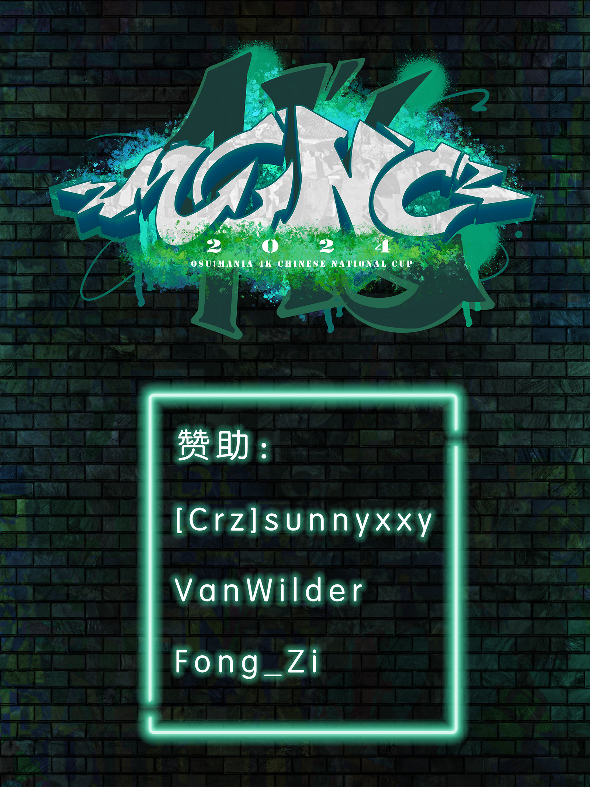

---
tags:
  - MCNC2024
  - MCNC 2024
  - MCNC4K 2024
  - MCNC 4K 2024
---

# osu!mania 4K Chinese National Cup 2024

The **osu!mania 4K Chinese National Cup 2024** (***MCNC 4K 2024***) was a country-based osu!mania 4K tournament hosted by the \[Crz\]Team. It was the 6th instalment of the osu!mania 4K Chinese National Cup.

## Tournament schedule

| Event | Timestamp |
| --: | :-- |
| Registration phase | 2024-05-17/2024-06-10 |
| Qualifier mappool showcase | 2024-06-15 |
| Qualifiers | 2024-06-22/2024-06-23 |
| Play-off 1 | 2024-06-29/2024-07-30 |
| Play-off 2 | 2024-07-06/2024-07-07 |
| Round of 32 | 2024-07-13/2024-07-14 |
| Round of 16 | 2024-07-20/2024-07-21 |
| Quarterfinals | 2024-07-27/2024-07-28 |
| Semifinals | 2024-08-03/2024-08-04 |
| Finals | 2024-08-10/2024-08-11 |
| Grand Finals | 2024-08-17/2024-08-18 |

## Prizes

| Placing | Prizes |
| :-: | :-- |
|  | Profile badge, CNY 4,000, 4 months of osu!supporter |
|  | CNY 2,500, 2 months of osu!supporter |
|  | CNY 1,500, 1 months of osu!supporter |
| 4th-32nd | CNY 30 |
| All player who passed Qualifiers | CNY 15 |

## Organisation

The osu!mania 4K Chinese National Cup 2024 was run by various community members.

| Position | Member(s) |
| :-- | :-- |
| Host | ::{ flag=CN }:: [\[Crz\]xz1z1z](https://osu.ppy.sh/users/10500832) |
| Referees | ::{ flag=CN }:: [[Crz]xz1z1z](https://osu.ppy.sh/users/10500832), ::{ flag=CN }:: [AelSan](https://osu.ppy.sh/users/14095291), ::{ flag=CN }:: [Kieran_](https://osu.ppy.sh/users/11264367), ::{ flag=CN }:: [YuEast 2018](https://osu.ppy.sh/users/13953619), ::{ flag=CN }:: [[Crz]Flandre](https://osu.ppy.sh/users/6949941), ::{ flag=CN }:: [Rush_FTK](https://osu.ppy.sh/users/3046856), ::{ flag=CN }:: [Xu seventeen](https://osu.ppy.sh/users/8781662), ::{ flag=CN }:: [cdwcgt](https://osu.ppy.sh/users/14721101), ::{ flag=HK }:: [wanderloop](https://osu.ppy.sh/users/13858681), ::{ flag=CN }:: [Azureus](https://osu.ppy.sh/users/6938658), ::{ flag=CN }:: [Mrhbyy](https://osu.ppy.sh/users/16491593), ::{ flag=CN }:: [[Crz]Makii](https://osu.ppy.sh/users/5242158), ::{ flag=CN }:: [MidRed](https://osu.ppy.sh/users/17641994), ::{ flag=CN }:: [[GB]Mafufu](https://osu.ppy.sh/users/10884561), ::{ flag=CN }:: [[Crz]Alleyne](https://osu.ppy.sh/users/11279273), ::{ flag=CN }:: [Shiki-Natsume](https://osu.ppy.sh/users/6338477), ::{ flag=CN }:: [FenggeTGOB](https://osu.ppy.sh/users/35928532), ::{ flag=CN }:: [Mooos](https://osu.ppy.sh/users/13788556) |
| Mappoolers | ::{ flag=CN }:: [[Crz]xz1z1z](https://osu.ppy.sh/users/10500832), ::{ flag=CN }:: [[Crz]Satori](https://osu.ppy.sh/users/7082178), ::{ flag=CN }:: [YuEast 2018](https://osu.ppy.sh/users/13953619), ::{ flag=CN }:: [gzdongsheng](https://osu.ppy.sh/users/8660315), ::{ flag=CN }:: [[Crz]Flandre](https://osu.ppy.sh/users/6949941), ::{ flag=CN }:: [[Crz]Caicium](https://osu.ppy.sh/users/10702235), ::{ flag=CN }:: [[Crz]sunnyxxy](https://osu.ppy.sh/users/10333739) |
| Mappool tester | ::{ flag=CN }:: [[Crz]xz1z1z](https://osu.ppy.sh/users/10500832), ::{ flag=CN }:: [[Crz]Satori](https://osu.ppy.sh/users/7082178), ::{ flag=CN }:: [[Crz]Flandre](https://osu.ppy.sh/users/6949941), ::{ flag=CN }:: [[Crz]Caicium](https://osu.ppy.sh/users/10702235), ::{ flag=CN }:: [[Crz]sunnyxxy](https://osu.ppy.sh/users/10333739), ::{ flag=VN }:: [Lott](https://osu.ppy.sh/users/13821222), ::{ flag=MX }:: [[Crz]Noire](https://osu.ppy.sh/users/6031847), ::{ flag=CN }:: [[GB]Mafufu](https://osu.ppy.sh/users/10884561) |
| Custom mappers | ::{ flag=CN }:: [[Crz]xz1z1z](https://osu.ppy.sh/users/10500832), ::{ flag=CN }:: [[Crz]Alleyne](https://osu.ppy.sh/users/11279273), ::{ flag=CN }:: [YuEast 2018](https://osu.ppy.sh/users/13953619), ::{ flag=CN }:: [AlexDunk](https://osu.ppy.sh/users/9194799), ::{ flag=CN }:: [gzdongsheng](https://osu.ppy.sh/users/8660315), ::{ flag=CN }:: [AelSan](https://osu.ppy.sh/users/14095291), ::{ flag=CN }:: [UselessPlayer](https://osu.ppy.sh/users/15030466), ::{ flag=CN }:: [Seiran-](https://osu.ppy.sh/users/14351534), ::{ flag=ID }:: [eZmmR](https://osu.ppy.sh/users/8647138), ::{ flag=KR }:: [Nicknem_](https://osu.ppy.sh/users/16615040), ::{ flag=CN }:: [[Crz]sunnyxxy](https://osu.ppy.sh/users/10333739), ::{ flag=VN }:: [Lott](https://osu.ppy.sh/users/13821222), ::{ flag=US }:: [0DZ0](https://osu.ppy.sh/users/28156707), ::{ flag=TH }:: [MyZterioN-](https://osu.ppy.sh/users/8521723), ::{ flag=CN }:: [[GB]Mafufu](https://osu.ppy.sh/users/10884561), ::{ flag=US }:: [-mint-](https://osu.ppy.sh/users/8976576), ::{ flag=CN }:: [Muses](https://osu.ppy.sh/users/9705896), ::{ flag=CN }:: [[Crz]Makii](https://osu.ppy.sh/users/5242158), ::{ flag=GB }:: [Monheim](https://osu.ppy.sh/users/6814203), ::{ flag=ID }:: [[Crz]Crysarlene](https://osu.ppy.sh/users/5492871), ::{ flag=CN }:: [Hidden is fun](https://osu.ppy.sh/users/10449071), ::{ flag=CN }:: [[GB]sherweifa](https://osu.ppy.sh/users/17457562), ::{ flag=CN }:: [FcEazy](https://osu.ppy.sh/users/7825227), ::{ flag=US }:: [ERA Imperial](https://osu.ppy.sh/users/5066305), ::{ flag=CN }:: [wIntEr7z](https://osu.ppy.sh/users/16509588) |
| Streamers | ::{ flag=CN }:: [[Crz]xz1z1z](https://osu.ppy.sh/users/10500832), ::{ flag=CN }:: [Kieran_](https://osu.ppy.sh/users/11264367), ::{ flag=CN }:: [YuEast 2018](https://osu.ppy.sh/users/13953619), ::{ flag=CN }:: [Rush_FTK](https://osu.ppy.sh/users/3046856), ::{ flag=CN }:: [cdwcgt](https://osu.ppy.sh/users/14721101), ::{ flag=CN }:: [Azureus](https://osu.ppy.sh/users/6938658), ::{ flag=CN }:: [[Crz]Alleyne](https://osu.ppy.sh/users/11279273), ::{ flag=CN }:: [Shiki-Natsume](https://osu.ppy.sh/users/6338477) |
| Commentators | ::{ flag=CN }:: [[Crz]xz1z1z](https://osu.ppy.sh/users/10500832), ::{ flag=CN }:: [YuEast 2018](https://osu.ppy.sh/users/13953619), ::{ flag=CN }:: [[Crz]Flandre](https://osu.ppy.sh/users/6949941), ::{ flag=CN }:: [Xu seventeen](https://osu.ppy.sh/users/8781662), ::{ flag=CN }:: [FenggeTGOB](https://osu.ppy.sh/users/35928532), ::{ flag=CN }:: [Rush_FTK](https://osu.ppy.sh/users/3046856), ::{ flag=CN }:: [[GB]sherweifa](https://osu.ppy.sh/users/17457562) |
| Graphics | ::{ flag=CN }:: [Sakura006](https://osu.ppy.sh/users/10365024), ::{ flag=CN }:: [Dr_Tissues](https://osu.ppy.sh/users/5106681), ::{ flag=CN }:: [hourius](https://osu.ppy.sh/users/12580298), ::{ flag=DK }:: [melon boy](https://osu.ppy.sh/users/3053382) |

## Links

- [Discussion thread](https://osu.ppy.sh/community/forums/topics/1923108)
- [Livestream](https://live.bilibili.com/2996250)
- [Discord server](https://discord.gg/uBHK5vq)
- [Challonge bracket](https://challonge.com/MCNC4K2024)
- **[Statistics sheet](https://docs.google.com/spreadsheets/d/e/2PACX-1vRTA-g_WCgl94exm7B9E7Aaks-YvSEwGqFzo6W9u9o_7JykWuRS3qLzX9tqfp3l6EO3P8j5XF7hwXgZ/pubhtml)**

## Participants

| Seed | Player |
| :-: | :-- |
| #1 | ::{ flag=HK }:: [Quotient](https://osu.ppy.sh/users/11313227) |
| #2 | ::{ flag=TW }:: [-Veloce-](https://osu.ppy.sh/users/23248427) |
| #3 | ::{ flag=CN }:: [nyasunfanboy](https://osu.ppy.sh/users/14066511) |
| #4 | ::{ flag=CN }:: [LiangFenFan](https://osu.ppy.sh/users/15183087) |
| #5 | ::{ flag=CN }:: [tyrcs](https://osu.ppy.sh/users/13026904) |
| #6 | ::{ flag=CN }:: [[GB]GanyuAngel](https://osu.ppy.sh/users/27233308) |
| #7 | ::{ flag=CN }:: [Croatian songs](https://osu.ppy.sh/users/18521083) |
| #8 | ::{ flag=CN }:: [[Crz]Nickname](https://osu.ppy.sh/users/10817494) |
| #9 | ::{ flag=CN }:: [[GB]nyasun](https://osu.ppy.sh/users/16277321) |
| #10 | ::{ flag=CN }:: [[Crz]Riko](https://osu.ppy.sh/users/7928981) |
| #11 | ::{ flag=CN }:: [[GB]mmttyy233](https://osu.ppy.sh/users/28639641) |
| #12 | ::{ flag=CN }:: [[Crz]Xinyi2016](https://osu.ppy.sh/users/14213841) |
| #13 | ::{ flag=CN }:: [Mantozi](https://osu.ppy.sh/users/10764424) |
| #14 | ::{ flag=CN }:: [Akermo](https://osu.ppy.sh/users/14934242) |
| #15 | ::{ flag=CN }:: [[Crz]Reimu](https://osu.ppy.sh/users/14318312) |
| #16 | ::{ flag=CN }:: [-fm777-](https://osu.ppy.sh/users/30122510) |
| #17 | ::{ flag=HK }:: [neeko the rock](https://osu.ppy.sh/users/13471840) |
| #18 | ::{ flag=TW }:: [Shice2566](https://osu.ppy.sh/users/16191180) |
| #19 | ::{ flag=CN }:: [Samyuan1216](https://osu.ppy.sh/users/23892945) |
| #20 | ::{ flag=CN }:: [SilentParleHorn](https://osu.ppy.sh/users/5190592) |
| #21 | ::{ flag=CN }:: [[GB]V1do](https://osu.ppy.sh/users/17527968) |
| #22 | ::{ flag=CN }:: [rurudo1o1o](https://osu.ppy.sh/users/10443855) |
| #23 | ::{ flag=CN }:: [af-](https://osu.ppy.sh/users/10512663) |
| #24 | ::{ flag=CN }:: [Kirchhoff123](https://osu.ppy.sh/users/29546640) |
| #25 | ::{ flag=CN }:: [[GB]Tyris](https://osu.ppy.sh/users/10497659) |
| #26 | ::{ flag=CN }:: [Shenzouz](https://osu.ppy.sh/users/29606773) |
| #27 | ::{ flag=CN }:: [lovely_hyahya](https://osu.ppy.sh/users/10318380) |
| #28 | ::{ flag=CN }:: [[Crz]IsxI](https://osu.ppy.sh/users/18042127) |
| #29 | ::{ flag=TW }:: [elicccc](https://osu.ppy.sh/users/22491203) |
| #30 | ::{ flag=CN }:: [[Paw]FIood](https://osu.ppy.sh/users/6336721) |
| #31 | ::{ flag=CN }:: [Echo_XF](https://osu.ppy.sh/users/25630297) |
| #32 | ::{ flag=CN }:: [9961](https://osu.ppy.sh/users/14609209) |
| #33 | ::{ flag=CN }:: [[GB]TakinaQwQ](https://osu.ppy.sh/users/18160033) |
| #34 | ::{ flag=CN }:: [[GB]ChickenGold](https://osu.ppy.sh/users/16586663) |
| #35 | ::{ flag=MO }:: [Randumbs](https://osu.ppy.sh/users/27657112) |
| #36 | ::{ flag=CN }:: [[GB]Burger King](https://osu.ppy.sh/users/9841162) |
| #37 | ::{ flag=CN }:: [VanWilder](https://osu.ppy.sh/users/89545) |
| #38 | ::{ flag=CN }:: [[GB]KCINE](https://osu.ppy.sh/users/24289042) |
| #39 | ::{ flag=CN }:: [beta dust](https://osu.ppy.sh/users/12031289) |
| #40 | ::{ flag=MO }:: [lamkit925](https://osu.ppy.sh/users/19081163) |
| #41 | ::{ flag=ES }:: [[AR]lv3plane](https://osu.ppy.sh/users/15964029) |
| #42 | ::{ flag=CN }:: [neeeeeh](https://osu.ppy.sh/users/18586390) |
| #43 | ::{ flag=CN }:: [ouxig](https://osu.ppy.sh/users/32522677) |
| #44 | ::{ flag=CN }:: [[GB]yobrevelc](https://osu.ppy.sh/users/14128407) |
| #45 | ::{ flag=CN }:: [HxcQ777](https://osu.ppy.sh/users/18282863) |
| #46 | ::{ flag=CN }:: [[GB]r3uz](https://osu.ppy.sh/users/27583184) |
| #47 | ::{ flag=CN }:: [fishbone2445](https://osu.ppy.sh/users/17640814) |
| #48 | ::{ flag=CN }:: [[Paw]DCRSG](https://osu.ppy.sh/users/15141441) |
| #49 | ::{ flag=TW }:: [kissnolook](https://osu.ppy.sh/users/11608591) |
| #50 | ::{ flag=CN }:: [quailty](https://osu.ppy.sh/users/6423914) |
| #51 | ::{ flag=CN }:: [_Yiiiii](https://osu.ppy.sh/users/6066359) |
| #52 | ::{ flag=CN }:: [[GB]Aeracy_nya](https://osu.ppy.sh/users/15351355) |
| #53 | ::{ flag=CN }:: [Old Pigeon](https://osu.ppy.sh/users/26116770) |
| #54 | ::{ flag=CN }:: [Cestiea](https://osu.ppy.sh/users/32263201) |
| #55 | ::{ flag=CN }:: [oid45](https://osu.ppy.sh/users/27710732) |
| #56 | ::{ flag=CN }:: [AWMRone](https://osu.ppy.sh/users/10351684) |
| #57 | ::{ flag=CN }:: [[GB]nnk](https://osu.ppy.sh/users/22412151) |
| #58 | ::{ flag=TW }:: [SWADEEF](https://osu.ppy.sh/users/18268743) |
| #59 | ::{ flag=CN }:: [shade0214](https://osu.ppy.sh/users/14665128) |
| #60 | ::{ flag=CN }:: [yks1](https://osu.ppy.sh/users/26030234) |
| #61 | ::{ flag=CN }:: [[GB]nyasunwaifu](https://osu.ppy.sh/users/26031439) |
| #62 | ::{ flag=CN }:: [qiufeng_xz](https://osu.ppy.sh/users/20813415) |
| #63 | ::{ flag=CN }:: [Tair itsu](https://osu.ppy.sh/users/34056597) |
| #64 | ::{ flag=CN }:: [2580697339](https://osu.ppy.sh/users/6311072) |
| #65 | ::{ flag=CN }:: [Starfeather2007](https://osu.ppy.sh/users/25502203) |
| #66 | ::{ flag=CN }:: [Blue_Potion](https://osu.ppy.sh/users/13094831) |
| #67 | ::{ flag=MO }:: [Osas_](https://osu.ppy.sh/users/18947190) |
| #68 | ::{ flag=CN }:: [Renshey](https://osu.ppy.sh/users/14265994) |
| #69 | ::{ flag=CN }:: [80zero](https://osu.ppy.sh/users/12301332) |
| #70 | ::{ flag=CN }:: [Not Softing](https://osu.ppy.sh/users/13267445) |
| #71 | ::{ flag=US }:: [oscarcx](https://osu.ppy.sh/users/13929448) |
| #72 | ::{ flag=CN }:: [ArorauOvO](https://osu.ppy.sh/users/32342011) |
| #73 | ::{ flag=CN }:: [chuang1227](https://osu.ppy.sh/users/16770943) |

### Podium

This competition has come to an end and resulted in the following podium:

| Placing | Player |
| :-: | :-- |
|  | ::{ flag=CN }:: [[GB]nyasun](https://osu.ppy.sh/users/16277321) |
|  | ::{ flag=CN }:: [tyrcs](https://osu.ppy.sh/users/13026904) |
|  | ::{ flag=TW }:: [-Veloce-](https://osu.ppy.sh/users/23248427) |

## Mappools

### Grand Finals

**[Download the mappack here! (131 MB)](https://drive.google.com/file/d/14Us3lcun0YdcABlFnYqruOwo5MyXhEIL/view?usp=sharing)**

- Rice
  1. [LV.4 - Burning Star ([Crz]xz1z1z) \[Burning Finger 1.05x (184bpm)\]](https://osu.ppy.sh/beatmapsets/2230250#mania/4732789)
  2. [Kotone - Konkai no Soudou ni Tsukimashite. (AelSan) \[Regret\]](https://osu.ppy.sh/beatmapsets/2230182#mania/4732582)
  3. [Imperial Circus Dead Decadence - Tensei ([GB]sherweifa) \[This is true music\]](https://osu.ppy.sh/beatmapsets/2230224#mania/4732663)
  4. [AVTechNO! - boku-boku SuketchP Remix ([Crz]xz1z1z) \[Tachyon?\]](https://osu.ppy.sh/beatmapsets/2230251#mania/4732794)
  5. [celtix - Entanglement (gzdongsheng) \[Decoherence\]](https://osu.ppy.sh/beatmapsets/2230190#mania/4732603)
  6. [Frums - UMBRA, RADIOLOGOS. (Cut ver.) ([Crz]sunnyxxy) \[aspodifu\]](https://osu.ppy.sh/beatmapsets/2230225#mania/4732665)
  7. [Foreground Eclipse - From Under Cover (Caught Up In A Love Song) (YuEast 2018) \[Bokura wa tsuyokunai, demo yowakunai.\]](https://osu.ppy.sh/beatmapsets/2230217#mania/4732651)
- Hybrid
  1. [Ashrount - LaureLs ~the Angelus~ (Muses) \[Daybreak\]](https://osu.ppy.sh/beatmapsets/2230195#mania/4732611)
  2. [kuro - BEYOND THE GRAVITY [UNIVERSE 1.15x (207bpm)] (gzdongsheng)](https://osu.ppy.sh/beatmapsets/2230198#mania/4732615)
  3. [Sta - The Ricochet (YuEast 2018) \[The Terminal of 2.85th Line / 0.95 edit\]](https://osu.ppy.sh/beatmapsets/2230220#mania/4732655)
- Long Note
  1. [TOGENASHI TOGEARI - Zattou, Bokura no Machi ([Crz]sunnyxxy) \[Sekai\]](https://osu.ppy.sh/beatmapsets/2230227#mania/4732670)
  2. [USAO - USAO ULTIMATE HYPER MEGA MIX (YuEast 2018) \[YUDONG ULTIMATE HYPER MEGA DENSITY ++++++\]](https://osu.ppy.sh/beatmapsets/2230218#mania/4732652)
  3. [NASA - Nocturne op.Q-v (gzdongsheng) \[StarSky\]](https://osu.ppy.sh/beatmapsets/2230204#mania/4732625)
  4. [katagiri - silly-willy-nilly ([Crz]Crysarlene) \[Extermination (feat. ERA Imperial)\]](https://osu.ppy.sh/beatmapsets/2230219#mania/4732654)
- SV
  1. [Normal1zer vs. Broken Nerdz - DESTRUCTION 3,2,1 (AlexDunk) \[:CONSTRUCTIONSITE_COLLAB: (w/ Mafufu & sherweifa)\]](https://osu.ppy.sh/beatmapsets/2230209#mania/4732634)
  2. [Pixel Terror - Magma (\[GB\]Mafufu) \[Rising slowly \[SV nerfed\]\]](https://osu.ppy.sh/beatmapsets/2230213#mania/4732646)
- Difficult
  1. [The Ghost of 3.13 - Forgotten (\[Crz\]Flandre) \[Shoegazer & Zyph's Collab 1.4x (350bpm)\]](https://osu.ppy.sh/beatmapsets/2230245#mania/4732745)
- Tiebreaker
  1. **[SAMString - ChroNaXiE ([Crz]xz1z1z) \[Singularity\]](https://osu.ppy.sh/beatmapsets/2230263#mania/4732863)**

### Finals

**[Download the mappack here! (252 MB)](https://drive.google.com/file/d/1Ab4ZVejQKkqM67mLJ04kyKuYmwKoZo_U/view?usp=sharing)**

- Rice
  1. [Morimori Atsushi - Ake Hoshi ([Crz]Flandre) \[CrewK's Morning Star 1.05x\]](https://osu.ppy.sh/beatmapsets/2226158#mania/4722371)
  2. [Ariabl'eyeS - Torikago no Serenade ([Crz]sunnyxxy) \[Night\]](https://osu.ppy.sh/beatmapsets/2226349#mania/4722844)
  3. [Falcom Sound Team jdk - The Merciless Savior (lemonguy) \[Aureole x1.15\]](https://osu.ppy.sh/beatmapsets/1577905#mania/3222056)
  4. [kors k - the shadow (stupud man) \[realm 1.05x\]](https://osu.ppy.sh/beatmapsets/1403650#mania/2895138)
  5. [Camellia - dreamless wanderer (0DZ0) \[yume 1kki\]](https://osu.ppy.sh/beatmapsets/2219940#mania/4705713)
  6. [Terminal 11 - DsMaxInkd (Pizza69) \[Hyperacusis\]](https://osu.ppy.sh/beatmapsets/2047593#mania/4274921)
  7. [Frums - Remnants of Turing ([Crz]sunnyxxy) \[Machinery\]](https://osu.ppy.sh/beatmapsets/2226351#mania/4722846)
- Hybrid
  1. [uma vs. Morimori Atsushi - Nikitousen (-Ming-) \[Coup de grace (4KMT edit)\]](https://osu.ppy.sh/beatmapsets/2148404#mania/4525647)
  2. [lapix - Captain Cowbell (YuEast 2018) \[Yet Another Restep.\]](https://osu.ppy.sh/beatmapsets/2226157#mania/4722370)
  3. [Ik4sumi - Amorphous (Micleak) \[Indeterminate 1.2x\]](https://osu.ppy.sh/beatmapsets/1890122#mania/4027875)
- Long Note
  1. [YOASOBI - UNDEAD ([GB]sherweifa) \[sdbl \[1.05x Rate\]\]](https://osu.ppy.sh/beatmapsets/2226160#mania/4722373)
  2. [seatrus - Stargaze Station (gzdongsheng) \[Cosmo 1.05x (236bpm)\]](https://osu.ppy.sh/beatmapsets/2226146#mania/4722334)
  3. [Shiron - GEOMETRIA (Hylotl) \[Riemannian (Edit) 1.05x (267bpm) OD7\]](https://osu.ppy.sh/beatmapsets/2102909#mania/4412131)
  4. [Supa7onyz pers. 5-let - Unsynchronized Rhythms (Polytetral) \[Chaotically Unsynced\]](https://osu.ppy.sh/beatmapsets/1893947#mania/3902894)
- SV
  1. [Akira Complex - MANTIS (Arcaea Ultra-Bloodrush VIP) feat. kiraku (Orca-) \[tomorrow comes from the ashes of yesterday\]](https://osu.ppy.sh/beatmapsets/2037828#mania/4250275)
  2. [xarva - easymotion (mightyxd) \[zero2snow's Estimate (edit) 1.1x\]](https://osu.ppy.sh/beatmapsets/2032145#mania/4235788)
- Difficult
  1. [StudioEIM - Crescent Moon Island (Shoegazer) \[Kuro 1.1x (189bpm)\]](https://osu.ppy.sh/beatmapsets/547451#mania/3090570)
- Tiebreaker
  1. **[Kou! - Frost Walker ([Crz]xz1z1z) \[Kaleido\]](https://osu.ppy.sh/beatmapsets/2226164#mania/4722381)**

### Semifinals

**[Download the mappack here! (144 MB)](https://drive.google.com/file/d/1H5bcbp6pBPEgTVpH-djBmGzDmYoOHAOE/view?usp=sharing)**

- Rice
  1. [Danger - 22:41 ([Crz]Flandre) \[Elekton's 1789 1.05x (135bpm)\]](https://osu.ppy.sh/beatmapsets/2222975#mania/4713754)
  2. [Hanatan - WAVE (YuEast 2018) \[Hanabi x1.05\]](https://osu.ppy.sh/beatmapsets/2222958#mania/4713713)
  3. [Saitama Saisyu Heiki - Alice Ragnarok ([Crz]Alleyne) \[Twilight of the Gods 1.05x (258bpm)\]](https://osu.ppy.sh/beatmapsets/2222984#mania/4713767)
  4. [-45 - Millarca (Cut Ver.) ([Crz]xz1z1z) \[Vampire\]](https://osu.ppy.sh/beatmapsets/2222973#mania/4713752)
  5. [doth - Toy Boxxxx (MyZterioN-) \[all-nighter\]](https://osu.ppy.sh/beatmapsets/2172621#mania/4586157)
  6. [JINDOU. - Kaisei Joshou Hallelujah (Shoegazer) \[Extra 1.2x (276bpm)\]](https://osu.ppy.sh/beatmapsets/710997#mania/3090602)
  7. [Zekk - Fluctuation ([Crz]Flandre) \[hna's Deviation 1.05x (204bpm)\]](https://osu.ppy.sh/beatmapsets/2222981#mania/4713764)
- Hybrid
  1. [NIWASHI - T_ritama Breaker ([Crz]sunnyxxy) \[Electrify\]](https://osu.ppy.sh/beatmapsets/2223094#mania/4714041)
  2. [Hommarju - Hellfire (gzdongsheng) \[FLAME\]](https://osu.ppy.sh/beatmapsets/2222942#mania/4713689)
  3. [Frums + nitro - overdead. (ERA Imperial) \[%underflow_error\]](https://osu.ppy.sh/beatmapsets/2105220#mania/4417278)
- Long Note
  1. [Falcom Sound Team jdk - MAJOR DEMON (YuEast 2018) \[MAJOR COORD w/ sherweifa\]](https://osu.ppy.sh/beatmapsets/2222959#mania/4713716)
  2. [SOOOO - iiillluuuvvvUUU (Muses) \[***************(Nerfed / 215bpm)\]](https://osu.ppy.sh/beatmapsets/2222947#mania/4713694)
  3. [sasakure.UK - the EmpErroR (AelSan) \[KOHA NE NE NE\]](https://osu.ppy.sh/beatmapsets/2222952#mania/4713703)
  4. [Sta feat. Ice - Cathedral (Micleak) \[Exposure to a downpour of sunlight and a thousand chords held in\]](https://osu.ppy.sh/beatmapsets/1865981#mania/3838235)
- SV
  1. [ZxNX as "Delaina" - End Me (Phukiir) \[CHOKE\]](https://osu.ppy.sh/beatmapsets/2055294#mania/4294644)
  2. [SlipGate - Chronon ([Crz]Crysarlene) \[Sleep\]](https://osu.ppy.sh/beatmapsets/988436#mania/2067666)
- Difficult
  1. [HIMEHINA - Utakatayo Ikanaide ([Crz]Flandre) \[frolica's Frothiness \[15\] OD8\]](https://osu.ppy.sh/beatmapsets/2222985#mania/4713772)
- Tiebreaker
  1. **[Xeudo Code - TERRAFORGE (gzdongsheng) \[EVOLUTION\]](https://osu.ppy.sh/beatmapsets/2222971#mania/4713750)**

### Quarterfinals

**[Download the mappack here! (122 MB)](https://drive.google.com/file/d/1dcL6LUdBx-bODzUmyXV4ixLxGfPvAuaH/view?usp=sharing)**

- Rice
  1. [-45 - Ena (Cut Ver.) ([Crz]xz1z1z) \[Remilia\]](https://osu.ppy.sh/beatmapsets/2218581#mania/4702643)
  2. [sHimaU - Noumen Break (katagiri Remix) ([Crz]xz1z1z) \[yd & xz's QSNM 1.05x (252bpm)\]](https://osu.ppy.sh/beatmapsets/2218583#mania/4702646)
  3. [yak_won - Sewing Machine (FcEazy) \[Machina\]](https://osu.ppy.sh/beatmapsets/2218979#mania/4703542)
  4. [Yello - Oh Yeah (SunApple) \[hi19 & Mina's Challenge 1.15x\]](https://osu.ppy.sh/beatmapsets/1967963#mania/4702587)
  5. [siqlo - Me & U (elexire) \[One Way Street 1.2x (180bpm)\]](https://osu.ppy.sh/beatmapsets/1928218#mania/3982182)
  6. [Dev/Null - Rage Template (0DZ0) \[Hard\]](https://osu.ppy.sh/beatmapsets/2218594#mania/4702662)
- Hybrid
  1. [BilliumMoto - Sentinel (AelSan) \[Dismay, Dismay! Light has faded and left us in dismay!\]](https://osu.ppy.sh/beatmapsets/2218561#mania/4702582)
  2. [LeaF - Arianrhod ([Crz]sunnyxxy) \[Fate\]](https://osu.ppy.sh/beatmapsets/2218565#mania/4702597)
  3. [RYOQUCHA & CS4W - Hauynite (MyZterioN-)](https://osu.ppy.sh/beatmapsets/2218563#mania/4702586)
- Long Note
  1. [paraoka feat. haru*nya - Floating Away (chxu) \[Helium\]](https://osu.ppy.sh/beatmapsets/1549666#mania/3588553)
  2. [BABYMETAL - Distortion (feat. Alissa White-Gluz) (Cut Ver.) (YuEast 2018) \[Densitortion (200bpm)\]](https://osu.ppy.sh/beatmapsets/2218569#mania/4702607)
  3. [Mono. - Peaceful+Piece ([Crz]FolAH1217) \[Wonderlands\]](https://osu.ppy.sh/beatmapsets/2160663#mania/4556321)
- SV
  1. [Mylta - DAWN (Cut Ver.) (AlexDunk) \[:another_you_u:\]](https://osu.ppy.sh/beatmapsets/2218570#mania/4702611)
  2. [James Landino - Reaction feat. Slyleaf (Paturages) \[Instinct\]](https://osu.ppy.sh/beatmapsets/1454184#mania/2989461)
- Difficult
  1. [t+pazolite with siromaru - Chambarising ([Crz]Flandre) \[Evening's Challenge 1.1x Edit (176bpm)\]](https://osu.ppy.sh/beatmapsets/2218572#mania/4702615)
- Tiebreaker
  1. **[TWC Sound Team "Xuru Stasis Rasufim" - Kaze no Denwa" ([Crz]Alleyne) \[Alleyne x Lott x sunnyxxy // Phantasmic Signal\]](https://osu.ppy.sh/beatmapsets/2218577#mania/4702631)**

### Round of 16

**[Download the mappack here! (235 MB)](https://drive.google.com/file/d/1P-jIyESjG0HseZUYpOGgeQqIsGEV48KT/view?usp=sharing)**

- Rice
  1. [KORDHELL - LAND OF FIRE (YuEast 2018) \[:fire: x1.05\]](https://osu.ppy.sh/beatmapsets/2214178#mania/4691305)
  2. [DJ SHARPNEL - SHIND BAD (Shoegazer) \[Nagisa 1.2x (237bpm)\]](https://osu.ppy.sh/beatmapsets/1386270#mania/3266283)
  3. [Dance with the Dead - Venom (Cut Ver.) (OxalicAcid) \[Corruped (140bpm)\]](https://osu.ppy.sh/beatmapsets/2180181#mania/4605212)
  4. [Shin Sakiura feat. AAAMYYY - NIGHT RUNNING (7_7 bootleg) (ICECAKE) \[NSV\]](https://osu.ppy.sh/beatmapsets/2191547#mania/4635678)
  5. [Outsider - Hero (feat. LMNOP) (Shoegazer) \[Vengeance 1.15x (147bpm)\]](https://osu.ppy.sh/beatmapsets/1758838#mania/3760857)
  6. [Virtual Riot - Shindeiru (lemonguy) \[Edit\]](https://osu.ppy.sh/beatmapsets/866120#mania/2968850)
- Hybrid
  1. [Under Mebius feat. Aitsuki Nakuru (YUKIYANAGI Remix) ([Crz]xz1z1z) \[Hidden & xz's Hatsukoi\]](https://osu.ppy.sh/beatmapsets/2214190#mania/4691325)
  2. [Polyphia - The Audacity (feat. Anomalie) (Nicknem_) \[Boldness 1.1x (176bpm)\]](https://osu.ppy.sh/beatmapsets/2214193#mania/4711821)
  3. [Aire - Railroad (ATH_1gr) \[220\]](https://osu.ppy.sh/beatmapsets/2166241#mania/4674162)
- Long Note
  1. [150P - Yonchoume no Himitsuya san ([GB]sherweifa) \[Sore to Sore\]](https://osu.ppy.sh/beatmapsets/2214179#mania/4691309)
  2. [beatMARIO - Help me, ERINNNNNN!! (Cut Ver.) (AelSan) \[( ' w') o * Erin! Erin! ( ' w') o * Erin! Erin!\]](https://osu.ppy.sh/beatmapsets/2214166#mania/4691274)
  3. [Frums - VIS::CRACKED ([Crz]Crysarlene) \[Extra\]](https://osu.ppy.sh/beatmapsets/1561114#mania/3271022)
- SV
  1. [DOT96 - MAKE IT FUNKY NOW (RuleBlazing) \[Funny (edit)\]](https://osu.ppy.sh/beatmapsets/1181310#mania/3189234)
  2. [Soba - Utopia (Tidek) \[Paradise\]](https://osu.ppy.sh/beatmapsets/1140672#mania/2382593)
- Difficult
  1. [Fantom - Connect 1986 (Night Bunny 7) \[[Lv.9001] IcyWorld's Challenge\]](https://osu.ppy.sh/beatmapsets/592631#mania/2486497)
- Tiebreaker
  1. **[NormalM feat. Echo - Resonance of Viscerharma (AelSan) \[Echo of Resonance\]](https://osu.ppy.sh/beatmapsets/2214176#mania/4691301)**

### Round of 32

**[Download the mappack here! (145 MB)](https://drive.google.com/file/d/1BYc3pnmtJtNHZuQahe5CkLknwWaPXdMt/view?usp=sharing)**

- Rice
  1. [meganeko - nano love (Eclipse-) \[\^_\^ \[0.95x Rate\]\]](https://osu.ppy.sh/beatmapsets/1726149#mania/3527629)
  2. [DJ SHARPNEL - Utakata (Piece of Poetry) (Shoegazer) \[Prayer 1.1x (218bpm)\]](https://osu.ppy.sh/beatmapsets/1405425#mania/2898345)
  3. [Lindsey Stirling - V-Pop ([GB]sherweifa) \[Spring\]](https://osu.ppy.sh/beatmapsets/2210080#mania/4681266)
  4. [ISEGYE IDOL - Another World (Zia) \[Dreaming World\]](https://osu.ppy.sh/beatmapsets/2032402#mania/4236474)
  5. [sasakure.UK - Atropos (Short Edit) ([Crz]sunnyxxy) \[Inevitable\]](https://osu.ppy.sh/beatmapsets/2210072#mania/4681243)
- Hybrid
  1. [Pinocchio P - God-ish (CrewK) \[Gott ist tot \[1.1x Rate\] (edit)\]](https://osu.ppy.sh/beatmapsets/1828922#mania/3910334)
  2. [Avans - Shapeshifter (AelSan) \[Activation\]](https://osu.ppy.sh/beatmapsets/2210061#mania/4681213)
- Long Note
  1. [Ling Yuan yousa - Tao Hua Xiao (YuEast 2018) \[Beng Beng Tiao Tiao\]](https://osu.ppy.sh/beatmapsets/2210068#mania/4681225)
  2. [Naomi Oozora, Nozomi Yamamoto, Ruriko Aoki - Angel Dream (YuEast 2018) \[Heaven ~ Cute Vocal '23 edit\]](https://osu.ppy.sh/beatmapsets/2105456#mania/4417766)
  3. [\*wakadori - NightTheater (gzdongsheng) \[Club\]](https://osu.ppy.sh/beatmapsets/2210071#mania/4681240)
- SV
  1. [Tanger - FireStarter (H1Pur) \[Strike A Match\]](https://osu.ppy.sh/beatmapsets/1823962#mania/3742642)
  2. [TSUNKU - Batting Show Perfect Version (Daikyi) \[Batter Up!\]](https://osu.ppy.sh/beatmapsets/418097#mania/905136)
- Difficult
  1. [Kabocha - EgO (Shoegazer) \[Transference 1.15x (271bpm)\]](https://osu.ppy.sh/beatmapsets/1667855#mania/3760854)
- Tiebreaker
  1. **[Lulickma & Loctek - 21st ([Crz]Alleyne) \[wewewe\]](https://osu.ppy.sh/beatmapsets/2210104#mania/4681334)**

### Play-off 2

**[Download the mappack here! (142 MB)](https://drive.google.com/file/d/1VlSwfv28dfxnXKHBX4gNzs92od7eVptO/view?usp=sharing)**

- Rice
  1. [Two Steps From Hell - Strength Of A Thousand Man (Instrumental Core Remix) (Cut Ver.) (YuEast 2018) \[The Legend\]](https://osu.ppy.sh/beatmapsets/2206238#mania/4671097)
  2. [S.S.H. - F-zero ~ Big Blue ([Crz]xz1z1z) \[Not Another Jumpstream Map\]](https://osu.ppy.sh/beatmapsets/2206242#mania/4671102)
  3. [Maria & the Mirrors - Gemini Enjoy My Life (Monheim) \[Extra\]](https://osu.ppy.sh/beatmapsets/1829908#mania/3813704)
  4. [Protest The Hero - She Who Mars The Skin Of Gods (Shoegazer) \[Cygnusian 1.2x\]](https://osu.ppy.sh/beatmapsets/1868958#mania/3857511)
  5. [Yunomi - Jellyfish (feat. Roller Girl) (Cut Ver.) (YuEast 2018) \[drifting... x1.15\]](https://osu.ppy.sh/beatmapsets/2206235#mania/4671087)
- Hybrid
  1. [Memme - Gaehwa (elexire) \[Sakura Fubuki\]](https://osu.ppy.sh/beatmapsets/2010275#mania/4182879)
  2. [linear ring with RNAcid - Gypsophila ([Crz]FolAH1217) \[Everlasting Memories x1.1\]](https://osu.ppy.sh/beatmapsets/1768082#mania/3620597)
- Long Note
  1. [Ma Xiao Hua Er - Su Yan (Muses) \[Nagasaki Never Regret\]](https://osu.ppy.sh/beatmapsets/2206217#mania/4671040)
  2. [Wonderlands x Showtime x KAITO - TONDEMO-WONDERZ (AelSan) \[Super Miracle 1.1x (189bpm)\]](https://osu.ppy.sh/beatmapsets/2206224#mania/4671063)
  3. [Tonari no Niwa wa Aoi (NIWASHI+Aoi) - Polacro ([Crz]FolAH1217) \[Side:Delta\]](https://osu.ppy.sh/beatmapsets/1913501#mania/3947211)
- SV
  1. [ARM vs uno - Shoujo Satori no Satorittaa (UselessPlayer) \[Where is Komeiji Satori's Setu\]](https://osu.ppy.sh/beatmapsets/2206350#mania/4671327)
  2. [guna - Yukidsuki-yashou ([Crz]xz1z1z) \[SV\]](https://osu.ppy.sh/beatmapsets/2206241#mania/4671101)
- Difficult
  1. [Terminal 11 - Counter Clockwise Chant Pattern (Phil) \[Timebomb 1.05x (148bpm)\]](https://osu.ppy.sh/beatmapsets/659039#mania/1395854)
- Tiebreaker
  1. **[MOMOIRO CLOVER Z - SARABA, Itoshiki Kanashimitachi yo (YuEast 2018) \[Goodbye, I'm a demon\]](https://osu.ppy.sh/beatmapsets/2206233#mania/4671082)**

### Play-off 1

**[Download the mappack here! (82 MB)](https://drive.google.com/file/d/1YZSIN3Ch5OCrSCJDT3goS7LPjSx2EMVy/view?usp=sharing)**

- Rice
  1. [HOYO-MiX - If I Can Stop One Heart From Breaking (Cut Ver.) ([Crz]xz1z1z) \[xz & yd's Firefly\]](https://osu.ppy.sh/beatmapsets/2202556#mania/4661730)
  2. [-45 - Midorigo Queen Bee ([Crz]Makii) \[Ruin 1.25x\]](https://osu.ppy.sh/beatmapsets/2202554#mania/4661720)
  3. [lolol235 - The Ballad of Player XZ (WhiteCookies) \[FcEazy's 213832 (114bpm)\]](https://osu.ppy.sh/beatmapsets/2197001#mania/4661779)
  4. [YOASOBI - Adventure (AelSan) \[Memorable Memories\]](https://osu.ppy.sh/beatmapsets/2202551#mania/4661716)
  5. [Pa's Lam System - City Lights Feat. EVO+ , Jinmenusagi (Pa's Lam System Remix) (elexire) \[Phosphorescent\]](https://osu.ppy.sh/beatmapsets/2123348#mania/4462321)
- Hybrid
  1. [Yoroshiku!Amucharuzu - Say Hello to the World's End (Cut Ver.) (Hidden is fun) \[Collab Yoroshiku!\]](https://osu.ppy.sh/beatmapsets/2202557#mania/4661731)
  2. [PSYQUI - Eyes on me feat. Such (HowToPlayLN) \[Stage 4: Focused\]](https://osu.ppy.sh/beatmapsets/1196939#mania/2493320)
- Long Note
  3. [Jay Chou - Dao Xiang (YuEast 2018) \[Dongdong's Bringing Back Your Memories\]](https://osu.ppy.sh/beatmapsets/2202550#mania/4661715)
  4. [awfuless - Temptation ([Crz]Alleyne) \[Yuuwaku\]](https://osu.ppy.sh/beatmapsets/2202552#mania/4661717)
- SV
  1. [Cartoons - Witch Doctor (Cut Ver.) (UselessPlayer) \[51522\]](https://osu.ppy.sh/beatmapsets/2202561#mania/4661747)
- Tiebreaker
  1. **[Massive New Krew - Majestic 12 ([Crz]xz1z1z) \[Goodbye, I'm an alien\]](https://osu.ppy.sh/beatmapsets/2202558#mania/4661735)**

### Qualifiers

**[Download the mappack here! (34 MB)](https://drive.google.com/file/d/1rvK0aZpvsCKJe1pLhn02iuqH2jtywPD7/view?usp=sharing)**

- FreeMod
  1. [A-39 - Memories of the Heart (feat. Hatsune Miku) (Cut Ver.) ([GB]Mafufu) [Stage 1: Humanity]](https://osu.ppy.sh/beatmapsets/2198029#mania/4651408)
  2. [Aphex Twin - Bucephalus Bouncing Ball (Cut Ver.) (Lott) [Conundrum]](https://osu.ppy.sh/beatmapsets/2198005#mania/4651348)
  3. [Toromaru - Ebb Tide ([Crz]xz1z1z) [Stage 3: Eastward]](https://osu.ppy.sh/beatmapsets/2198027#mania/4651402)
  4. [Magens - DDDDance! (AelSan) [Stage 4: Party]](https://osu.ppy.sh/beatmapsets/2198019#mania/4651381)
  5. [REDALiCE vs. DJ Myosuke feat. DELUTAYA - KYOREN ROMANCE (Seiran-) [Stage 5: Romanticism]](https://osu.ppy.sh/beatmapsets/2198024#mania/4651386)
  6. [Riya - Annihilation ([Crz]Alleyne) [Stage 6: Oblivion]](https://osu.ppy.sh/beatmapsets/2198020#mania/4651382)
  7. [J-CORE SLi//CER - "Ongaku producer" no heikin-tekina seishin jotai (Cut Ver.) (gzdongsheng) [Stage 7: Mental]](https://osu.ppy.sh/beatmapsets/2198021#mania/4651383)
  8. [YUC'e - SPACE INVADER (YuEast 2018) [Stage 8: Futur-vasion]](https://osu.ppy.sh/beatmapsets/2198018#mania/4651380)

## Match results

### Grand Finals

Detailed statistics for this round can be found [here](https://docs.google.com/spreadsheets/d/1n0QoweTzY2Y1kSQOekjD7TADDWBRF4zI2HE88-mimtI/pubhtml).

Saturday, 17 August 2024:

| Player 1 |  |  | Player 2 | Match link |
| --: | :-: | :-: | :-- | :-- |
| -Veloce- | 4 | **7** | **tyrcs** | [#1](https://osu.ppy.sh/community/matches/115116663) |

Sunday, 18 August 2024:

| Player 1 |  |  | Player 2 | Match link |
| --: | :-: | :-: | :-- | :-- |
| **[GB]nyasun** | **7** | 4 | tyrcs | [#1](https://osu.ppy.sh/community/matches/115131843) |

### Finals

Detailed statistics for this round can be found [here](https://docs.google.com/spreadsheets/d/1xTG2fYUX02fq58omqK5WWcktZjM-MaHrAtJLM1iadmg/pubhtml).

Tuesday, 6 August 2024:

| Player 1 |  |  | Player 2 | Match link |
| --: | :-: | :-: | :-- | :-- |
| **tyrcs** | **7** | 5 | nyasunfanboy | [#1](https://osu.ppy.sh/community/matches/114965408) |
| [GB]GanyuAngel | 0 | **7** | **Quotient** | [#1](https://osu.ppy.sh/community/matches/114965815) |
| Quotient | 1 | **7** | **tyrcs** | [#1](https://osu.ppy.sh/community/matches/114968132) |

Sunday, 12 August 2024:

| Player 1 |  |  | Player 2 | Match link |
| --: | :-: | :-: | :-- | :-- |
| **[GB]nyasun** | **7** | 2 | -Veloce- | [#1](https://osu.ppy.sh/community/matches/115037039) |

### Semifinals

Detailed statistics for this round can be found [here](https://docs.google.com/spreadsheets/d/e/2PACX-1vS4U_H4bTBrzKexjIyUsO5WSGH26ZXmyaj31Zh6y3-ILVFZsNGDnfaz2Bpv0hInVZeNU1LjpE2KerpP/pubhtml).

Friday, 2 August 2024:

| Player 1 |  |  | Player 2 | Match link |
| --: | :-: | :-: | :-- | :-- |
| **[GB]nyasun** | **7** | 2 | tyrcs | [#1](https://osu.ppy.sh/community/matches/114911781) |

Saturday, 3 August 2024:

| Player 1 |  |  | Player 2 | Match link |
| --: | :-: | :-: | :-- | :-- |
| **-Veloce-** | **7** | 2 | [GB]GanyuAngel | [#1](https://osu.ppy.sh/community/matches/114924008) |
| **Quotient** | **7** | 2 | [Crz]Reimu | [#1](https://osu.ppy.sh/community/matches/114924791) |
| LiangFenFan | 6 | **7** | **[GB]mmttyy233** | [#1](https://osu.ppy.sh/community/matches/114924821) |
| **Croatian songs** | **7** | 5 | [Paw]FIood | [#1](https://osu.ppy.sh/community/matches/114927003) |

Sunday, 4 August 2024:

| Player 1 |  |  | Player 2 | Match link |
| --: | :-: | :-: | :-- | :-- |
| **nyasunfanboy** | **7** | 0 | [Crz]Xinyi2016 | [#1](https://osu.ppy.sh/community/matches/114938472) |
| [GB]mmttyy233 | 0 | **7** | **Quotient** | [#1](https://osu.ppy.sh/community/matches/114939241) |
| **nyasunfanboy** | **0** | -1 | Croatian songs | [#1](https://osu.ppy.sh/community/matches/114941513) |

### Quarterfinals

Detailed statistics for this round can be found [here](https://docs.google.com/spreadsheets/d/e/2PACX-1vS9GbgKFKg59Y2QnruetoZYwHVF7cr3DKJ2sqqCSBAcZyE-HCXdY_p854h3p9Ooux1jsqTAcn6iW-sp/pubhtml).

Wednesday, 24 July 2024:

| Player 1 |  |  | Player 2 | Match link |
| --: | :-: | :-: | :-- | :-- |
| **[Crz]Reimu** | **6** | 3 | [Crz]IsxI | [#1](https://osu.ppy.sh/community/matches/114791824) |
| **-fm777-** | **6** | 2 | rurudo1o1o | [#1](https://osu.ppy.sh/community/matches/114792193) |
| [Crz]Nickname | 3 | **6** | **[Paw]FIood** | [#1](https://osu.ppy.sh/community/matches/114794106) |
| **[Crz]Riko** | **6** | 4 | [GB]Burger king | [#1](https://osu.ppy.sh/community/matches/114794066) |
| nyasunfanboy | 4 | **6** | **[GB]GanyuAngel** | [#1](https://osu.ppy.sh/community/matches/114794585) |

Thursday, 25 July 2024:

| Player 1 |  |  | Player 2 | Match link |
| --: | :-: | :-: | :-- | :-- |
| [Crz]Riko | -1 | **0** | **[Crz]Reimu** | [#1](https://osu.ppy.sh/community/matches/114807750) |

Friday, 26 July 2024:

| Player 1 |  |  | Player 2 | Match link |
| --: | :-: | :-: | :-- | :-- |
| Quotient | 2 | **6** | **[GB]nyasun** | [#1](https://osu.ppy.sh/community/matches/114818618) |
| **Mantozi** | **6** | 3 | Shenzouz | [#1](https://osu.ppy.sh/community/matches/114820779) |
| **[GB]mmttyy233** | **0** | -1 | 9961 | [#1](https://osu.ppy.sh/community/matches/114820775) |
| **[Crz]Xinyi2016** | **6** | 3 | Shice2566 | [#1](https://osu.ppy.sh/community/matches/114821459) |

Saturday, 27 July 2024:

| Player 1 |  |  | Player 2 | Match link |
| --: | :-: | :-: | :-- | :-- |
| **[Crz]Xinyi2016** | **6** | 5 | Mantozi | [#1](https://osu.ppy.sh/community/matches/114831874) |
| **[Paw]FIood** | **6** | 4 | -fm777- | [#1](https://osu.ppy.sh/community/matches/114834154) |
| **Samyuan1216** | **6** | 3 | [GB]Tyris | [#1](https://osu.ppy.sh/community/matches/114835513) |

Sunday, 28 July 2024:

| Player 1 |  |  | Player 2 | Match link |
| --: | :-: | :-: | :-- | :-- |
| LiangFenFan | 0 | **6** | **tyrcs** | [#1](https://osu.ppy.sh/community/matches/114846107) |
| **-Veloce-** | **6** | 4 | Croatian songs | [#1](https://osu.ppy.sh/community/matches/114848395) |
| **[GB]mmttyy233** | **6** | 1 | Samyuan1216 | [#1](https://osu.ppy.sh/community/matches/114848766) |

### Round of 16

Detailed statistics for this round can be found [here](https://docs.google.com/spreadsheets/d/e/2PACX-1vTBZnFF4iTuwQLmlzozo5S2t-s0bV5AX9A6Dsfh1nUs173ryRe_EnYAuw43MS70i10ldzMveoNhCAzv/pubhtml).

Friday, 19 July 2024:

| Player 1 |  |  | Player 2 | Match link |
| --: | :-: | :-: | :-- | :-- |
| **9961** | **6** | 1 | [Paw]DCRSG | [#1](https://osu.ppy.sh/community/matches/114727909) |

Saturday, 20 July 2024:

| Player 1 |  |  | Player 2 | Match link |
| --: | :-: | :-: | :-- | :-- |
| **[Crz]IsxI** | **0** | -1 | [GB]V1do | [#1](https://osu.ppy.sh/community/matches/114739445) |
| **Quotient** | **6** | 1 | -fm777- | [#1](https://osu.ppy.sh/community/matches/114740962) |
| **Shenzouz** | **6** | 4 | af- | [#1](https://osu.ppy.sh/community/matches/114741771) |
| **nyasunfanboy** | **6** | 1 | Samyuan1216 | [#1](https://osu.ppy.sh/community/matches/114741783) |
| **[GB]Tyris** | **6** | 4 | Kirchhoff123 | [#1](https://osu.ppy.sh/community/matches/114742371) |
| **-Veloce-** | **6** | 0 | [Crz]Reimu | [#1](https://osu.ppy.sh/community/matches/114742359) |
| **[GB]GanyuAngel** | **6** | 3 | [GB]mmttyy233 | [#1](https://osu.ppy.sh/community/matches/114742312) |

Sunday, 21 July 2024:

| Player 1 |  |  | Player 2 | Match link |
| --: | :-: | :-: | :-- | :-- |
| **LiangFenFan** | **6** | 3 | Mantozi | [#1](https://osu.ppy.sh/community/matches/114752377) |
| **Croatian songs** | **6** | 1 | [Crz]Riko | [#1](https://osu.ppy.sh/community/matches/114753219) |
| Echo_XF | 0 | **6** | **Shice2566** | [#1](https://osu.ppy.sh/community/matches/114753639) |
| [Crz]Nickname | 1 | **6** | **[GB]nyasun** | [#1](https://osu.ppy.sh/community/matches/114753616) |
| **[GB]Burger king** | **6** | 4 | HxcQ777 | [#1](https://osu.ppy.sh/community/matches/114755291) |
| [Paw]FIood | 0 | **-1** | **Akermo** | [#1](https://osu.ppy.sh/community/matches/114755340) |
| **tyrcs** | **6** | 2 | [Crz]Xinyi2016 | [#1](https://osu.ppy.sh/community/matches/114755337) |
| lovely_hyahya | 0 | **6** | **rurudo1o1o** | [#1](https://osu.ppy.sh/community/matches/114757429) |

### Round of 32

Detailed statistics for this round can be found [here](https://docs.google.com/spreadsheets/d/e/2PACX-1vTF5Zr265tNJmuzQmYVhWAmI12EIkimm8UoHW7lbFczOYvb5jp4JlT0d12__fMGHnrDXLpGMtgr-gHA/pubhtml).

Saturday, 13 July 2024:

| Player 1 |  |  | Player 2 | Match link |
| --: | :-: | :-: | :-- | :-- |
| **[GB]nyasun** | **5** | 1 | Kirchhoff123 | [#1](https://osu.ppy.sh/community/matches/114653314) |
| **-Veloce-** | **5** | 1 | Echo_XF | [#1](https://osu.ppy.sh/community/matches/114654121) |
| **Quotient** | **0** | -1 | 9961 | [#1](https://osu.ppy.sh/community/matches/114654622) |
| **[Crz]Riko** | **5** | 2 | af- | [#1](https://osu.ppy.sh/community/matches/114654612) |
| **nyasunfanboy** | **5** | 2 | [Paw]FIood | [#1](https://osu.ppy.sh/community/matches/114655270) |
| **[Crz]Reimu** | **5** | 2 | Shice2566 | [#1](https://osu.ppy.sh/community/matches/114655931) |
| Akermo | 2 | **5** | **Samyuan1216** | [#1](https://osu.ppy.sh/community/matches/114655957) |
| **[GB]mmttyy233** | **0** | -1 | rurudo1o1o | [#1](https://osu.ppy.sh/community/matches/114655934) |
| **[Crz]Xinyi2016** | **0** | -1 | [GB]V1do | [#1](https://osu.ppy.sh/community/matches/114656590) |
| **[GB]GanyuAngel** | **5** | 1 | lovely_hyahya | [#1](https://osu.ppy.sh/community/matches/114656570) |

Sunday, 14 July 2024:

| Player 1 |  |  | Player 2 | Match link |
| --: | :-: | :-: | :-- | :-- |
| **LiangFenFan** | **0** | -1 | [GB]Burger king | [#1](https://osu.ppy.sh/community/matches/114665761) |
| **Croatian songs** | **5** | 0 | Shenzouz | [#1](https://osu.ppy.sh/community/matches/114665787) |
| **Mantozi** | **5** | 4 | HxcQ777 | [#1](https://osu.ppy.sh/community/matches/114666056) |
| **[Crz]Nickname** | **0** | -1 | [GB]Tyris | [#1](https://osu.ppy.sh/community/matches/114666835) |
| **tyrcs** | **5** | 2 | [Crz]IsxI | [#1](https://osu.ppy.sh/community/matches/114666942) |
| **-fm777-** | **5** | 0 | [Paw]DCRSG | [#1](https://osu.ppy.sh/community/matches/114667819) |

### Play-off 2

Detailed statistics for this round can be found [here](https://docs.google.com/spreadsheets/d/e/2PACX-1vTYboWl0FjodqQp0ME0at0g9CvfvrpcqtKxAMwO6ivQCp6nfN3JArOrAYpfyEphz5OEtXe2q23dV0u9/pubhtml).

Friday, 5 July 2024:

| Player 1 |  |  | Player 2 | Match link |
| --: | :-: | :-: | :-- | :-- |
| **lovely_hyahya** | **5** | 1 | [GB]KCINE | [#1](https://osu.ppy.sh/community/matches/114554442) |
| **rurudo1o1o** | **5** | 4 | ouxig | [#1](https://osu.ppy.sh/community/matches/114555922) |
| **[Crz]Reimu** | **5** | 1 | quailty | [#1](https://osu.ppy.sh/community/matches/114556616) |

Saturday, 6 July 2024:

| Player 1 |  |  | Player 2 | Match link |
| --: | :-: | :-: | :-- | :-- |
| **[GB]Tyris** | **5** | 0 | lamkit925 | [#1](https://osu.ppy.sh/community/matches/114564373) |
| **Mantozi** | **5** | 0 | [GB]Aeracy_nya | [#1](https://osu.ppy.sh/community/matches/114565870) |
| neeko the rock | -1 | **0** | **[Paw]DCRSG** | [#1](https://osu.ppy.sh/community/matches/114566364) |
| SilentParleHorn | 3 | **5** | **HxcQ777** | [#1](https://osu.ppy.sh/community/matches/114566716) |
| **[GB]nyasun** | **0** | -1 | [GB]nnk | [#1](https://osu.ppy.sh/community/matches/114567487) |
| **[Crz]Xinyi2016** | **5** | 0 | Old Pigeon | [#1](https://osu.ppy.sh/community/matches/114567775) |
| **[GB]mmttyy233** | **5** | 0 | shade0214 | [#1](https://osu.ppy.sh/community/matches/114568003) |
| **af-** | **5** | 1 | neeeeeh | [#1](https://osu.ppy.sh/community/matches/114568086) |
| **[Crz]IsxI** | **0** | -1 | VanWilder | [#1](https://osu.ppy.sh/community/matches/114568014) |
| **[Crz]Riko** | **5** | 1 | oid45 | [#1](https://osu.ppy.sh/community/matches/114568667) |
| **-fm777-** | **5** | 0 | 2580697339 | [#1](https://osu.ppy.sh/community/matches/114568590) |
| **[Paw]FIood** | **5** | 2 | Randumbs | [#1](https://osu.ppy.sh/community/matches/114568668) |
| **Shice2566** | **5** | 1 | fishbone2445 | [#1](https://osu.ppy.sh/community/matches/114569291) |
| **9961** | **5** | 3 | [GB]TakinaQwQ | [#1](https://osu.ppy.sh/community/matches/114569992) |

Sunday, 7 July 2024:

| Player 1 |  |  | Player 2 | Match link |
| --: | :-: | :-: | :-- | :-- |
| **[GB]V1do** | **5** | 3 | [GB]yobrevelc | [#1](https://osu.ppy.sh/community/matches/114578837) |
| **Akermo** | **5** | 1 | _Yiiiii | [#1](https://osu.ppy.sh/community/matches/114579718) |
| **Echo_XF** | **5** | 4 | [GB]ChickenGold | [#1](https://osu.ppy.sh/community/matches/114579707) |
| **Shenzouz** | **5** | 1 | beta dust | [#1](https://osu.ppy.sh/community/matches/114580054) |
| **Samyuan1216** | **5** | 3 | [GB]r3uz | [#1](https://osu.ppy.sh/community/matches/114580992) |
| elicccc | 0 | **5** | **[GB]Burger king** | [#1](https://osu.ppy.sh/community/matches/114580943) |
| **Kirchhoff123** | **5** | 0 | [AR]lv3plane | [#1](https://osu.ppy.sh/community/matches/114581978) |

### Play-off 1

Detailed statistics for this round can be found [here](https://docs.google.com/spreadsheets/d/e/2PACX-1vQde2MOpAdBJ5Lo8JXAJJCzUJ1IhbYkE9z0kNlarBkZZJeTs13IvUYz3gc3GpADn_-uWhNNk-Q_alyB/pubhtml).

Saturday, 29 June 2024:

| Player 1 |  |  | Player 2 | Match link |
| --: | :-: | :-: | :-- | :-- |
| **[GB]Aeracy_nya** | **4** | 0 | [GB]nyasunwaifu | [#1](https://osu.ppy.sh/community/matches/114481210) |
| Cestiea | 2 | **4** | **shade0214** | [#1](https://osu.ppy.sh/community/matches/114481951) |
| **Old Pigeon** | **4** | 2 | yks1 | [#1](https://osu.ppy.sh/community/matches/114482494) |
| **oid45** | **4** | 0 | SWADEEF | [#1](https://osu.ppy.sh/community/matches/114483042) |
| kissnolook | -1 | **0** | **2580697339** | [#1](https://osu.ppy.sh/community/matches/114483724) |
| AWMRone | 3 | **4** | **[GB]nnk** | [#1](https://osu.ppy.sh/community/matches/114483751) |

Sunday, 30 June 2024:

| Player 1 |  |  | Player 2 | Match link |
| --: | :-: | :-: | :-- | :-- |
| **_Yiiiii** | **4** | 0 | qiufeng_xz | [#1](https://osu.ppy.sh/community/matches/114494090) |
| **quailty** | **4** | 0 | Tair itsu | [#1](https://osu.ppy.sh/community/matches/114494531) |

### Qualifiers

The final standings and detailed statistics for the Qualifiers can be found at the following [spreadsheet](https://docs.google.com/spreadsheets/d/e/2PACX-1vSmn_azrhc4rXrGlObNyU-R0Wqu8qpnRamy0ueGuFYLoZuZWdL2NyP7iySnsN4_5HLmr899DTU2iKTM/pubhtml).

## Ruleset

### Tournament rules

1. The osu!mania 4K Chinese National Cup is a head-to-head individual tournament, played on the osu!mania game mode.
2. The Match mode will be `Head-To-Head`, beatmap scoring will be based on `Score V2`.
3. The beatmaps for each round will be announced by the mappool selection team before the actual matches take place.
   - Each mappool, except for the Qualifiers, will contain a tiebreaker beatmap. It will only be played in case of a tie in the scoreline in the "best of" system, e.g. if scoreline is 4–4 and the match is best of 9, the tiebreaker shall be played.
4. Match scheduling will be handled by the tournament management.
5. If no referees are available at match time, the match will be postponed.
6. Failed players' scores will be considered losses, even if they are higher than the opponent.
   - Reviving and surviving during a beatmap is considered as passing it.
7. Use of the Visual Settings to alter background dim or disable beatmap elements like storyboards and skins is allowed.
   - Custom skin elements must not be used to alter core gameplay mechanics.
8. Players may ask for a rematch if a team member encounters technical difficulties while playing.
   - "Lag spikes" are not considered a valid reason to nullify a beatmap.
   - If a rematch happens, the player's mod during that particular beatmap must remain the same.
   - This rule is not to be abused. Referees may veto a rematch request if they find that this is the case.
9. Beatmaps must not be reused in the same match, except for rematches.
10. If a player is not present at match time, it can be postponed for up to 15 minutes. If they are still absent after this period, a win by default will be declared for the player present.
11. All players and staff must be treated with respect. Instructions of the referees and the tournament management are to be followed. Decisions labelled as final are not to be objected.
12. Disrupting the match by foul play, insulting and provoking other players or staff, delaying the match and other deliberate inappropriate misbehaviour are strictly prohibited.
13. Breaking chat rules results in a silence. Silenced players cannot participate in multiplayer matches.
14. Unexpected incidents will be handled by the tournament management. Referees may allow higher tolerance depending on the given circumstances. This is up to their discretion.
15. Penalties for violating the tournament rules include, but are not limited to:
    - Direct judgement of the score of one beatmap.
    - Declaring the match as forfeited, or as a win by default for the other player.
    - Disqualification from the entire tournament.
    - Disqualification from the current and future official tournaments, until appealed.
16. The tournament management reserves the right to modify these rules at any moment. Any such changes will be announced in advance.
17. The tournament management reserves the right to refuse entry for any and all suspicious accounts or players.
18. Players must abide to the osu! terms of service.

### Tournament registration

1. There is no rank range for this tournament: players from all skill levels are free to participate.
2. This tournament is for Chinese players only, including players from territories of mainland China, Taiwan, Hong Kong, and Macau. Only players with the flags of the aforementioned territories are eligible for playing.
3. To be eligible to play, one must:
   - Not have been banned/majorly restricted from the MCNC.
   - Pass a background check by osu! staff and the tournament staff.
   - Include the answer "数学150了吗" in the question "Do you have anything else to say?".
4. To ensure that the game is played normally, every registered user will be manually checked by the tournament management and will give the list to the osu! staff to check.
5. All successfully formed players will be published after the registration phase.
6. Organisers, mappoolers, custom mappers and referees must not participate as players in the tournament.

### Qualifier instructions

1. There will be no warmups during the Qualifiers.
2. In the Qualifiers, all players will play a specific pool designed by the mappool selectors.
3. The Qualifier pool contains 8 maps, all of which will use FreeMod rules.
4. Players will have to play the mappool twice at a designated time. Their best combined score will be used for seeding. If players wish, they can the mappool only once.
5. The mappool will be played in the order the maps are listed.
6. There will be an optional 5-minute break in between the first and second playthrough of the mappool.
7. All players will play their qualifiers in separate rooms. We suggest players not to broadcast or share their results to avoid seed manipulation.
8. All players participating in the tournament are eligible to participate in the qualifying rounds. However, the number of participants who advance to the next round will be reduced to the nearest number, and the criteria used to determine whether a player advances is their performance during the qualifying phase.
   - If there are 32-47 players participating, 32 players will qualify.
   - If there are 48-55 players participating, 48 players will qualify.
   - If there are 56-63 players participating, 56 players will qualify.
   - If there are 64 or more players participating, 64 players will qualify.
   - If there are more than 80 players participating, the specific promotion rules will be determined based on the actual number of participants after the results of the qualifying round are announced.

### Play-off stage

1. After the Qualifiers, the tournament will proceed to the Play-off stage. The Play-off stage is a Single-Elimination phase with specific rules.
2. The warm-up map duration in the Play-off stage is capped at 3 minutes.
3. After the Qualifiers, advancing players will be grouped based on Qualifiers seeds, and each group will have a different set of match procedures.
   - If 32 players advance:
     - The Play-off stage will be canceled.
   - If 48 players advance:
     - Seeds 1-16: Directly advance to the elimination stage without participating in any Play-off stage matches.
     - Seeds 17-48: Players in this group will participate in one Play-off stage match, facing opponents corresponding to the group's seeds. The winner will advance to the elimination stage.
   - If 56 players advance:
     - Seeds 1-8: Directly advance to the elimination stage without participating in any Play-off stage matches.
     - Seeds 9-56: Players in this group will participate in one Play-off stage match, facing opponents corresponding to the group's seeds. The winner will advance to the elimination stage.
   - If 64 players advance:
     - Seeds 1-8: Directly advance to the elimination stage without participating in any Play-off stage matches.
     - Seeds 9-16: Players in this group will participate in one Play-off stage match, facing opponents from seeds 49-64. The winner will advance to the elimination stage.
     - Seeds 17-48: Players in this group will participate in one Play-off stage match, facing opponents corresponding to the group's seeds. The winner will advance to the elimination stage.
     - Seeds 49-64: Players in this group will participate in two Play-off stage matches. Their first opponent will be corresponding to the group's seeds. If they win the first match, their second opponent will be from seeds 9-16. The winner will advance to the elimination stage.
   - If more than 80 players participate, specific advancement rules will be determined based on the actual number of participants after the qualification results are announced, with a maximum of two matches for all players.

### Stage instructions

1. Following the Play-off stage, a Double-Elimination stage will be played. This means that the winner continues in the winners' bracket, and the losing player gets moved to the losers' bracket.
2. Players in the losers’ bracket must play 2 matches each weekend starting from the Quarterfinals.
3. Players that lose a match in the losers' bracket get eliminated from the tournament.
4. The warmup maps are allowed up to 5 minutes. In the case you can choose not to play your warmup map. Players need to prepare the link to the warmup map before the match start, and send it to #multiplayer during the match for the referee to select the map.

### Win conditions

1. In the Qualifiers, players' seeding will be determined based on the weighted average of their scores on each map.
2. In the Play-off 1, players need to win 4 maps to win a match (best of 7).
3. In the Play-off 2 and Round of 32, players need to win 5 maps to win a match (best of 9).
4. In the Roudd of 16 and Quarterfinals, players need to win 6 maps to win a match (best of 11).
5. In the Semifinals, Finals and Grand Finals, players need to win 7 maps to win a match (best of 13).

### Match instructions

1. A referee will create a multiplayer room 15 minutes in advance. Players must gather during this period.
   - Room settings are `Game mode: osu!mania`, `Team mode: Head-to-head`, `Win Condition: "ScoreV2"`. Room name must be `MCNC 4K 2024: ({Red}) vs ({Blue})`.
   - The player mentioned first in the room name must be in the red team, and the player mentioned second in the room name must be in the blue team.
2. Each player can ban one beatmap from the mappool. These beatmaps cannot be picked by any player during the entire match.
3. Beatmap selection will alternate between each player selecting a beatmap in the mappool.
4. Each player must use `!roll` once in `#multiplayer`.
   1. The loser of the `!roll` starts protecting one beatmap, followed by the winner of the `!roll` to protect a beatmap. They cannot protect the same beatmap. Protected beatmaps cannot be banned.
   2. The winner of the `!roll` starts banning one beatmap, followed by the loser of the `!roll` to ban a beatmap.
   3. The winner of the `!roll` starts picking the first beatmap of the match.
5. Players will have 2 minutes to pick a beatmap and 2 minutes to get ready. If it takes longer than the allotted time for no technical reasons, then on the second occurrence, a random map will be chosen from the mappool using `!roll`, considering only the maps that were neither picked nor banned, excluding the tiebreaker. Repeat offenders may receive further sanctions from the tournament management.
6. Players will be given at most a 3-minute timeout for solving unexpected situations.
7. Qualifiers results will be published via a statistics sheet.

### Mappool instructions

1. There will be one mappool for each stage.
2. Each mappool consists of a fixed amount of maps each stage which will all be played under FreeMod conditions. This means that there is a unique FreeMod bracket.
3. The mappool sizes are as follows:
   - Qualifiers: 8 beatmaps
   - Play-off 1: 11 beatmaps
   - Play-off 2 and Round of 32: 14 beatmaps
   - Round of 16 and Quarterfinals: 16 beatmaps
   - Semifinals, Finals, and Grand Finals: 18 beatmaps
4. Each mappool has one tiebreaker, except for the Qualifiers.
5. Possible mod choices for all maps are Hidden, Fade In, Flashlight, and Mirror.
6. The tiebreaker will be played under FreeMod conditions.

### Scheduling instructions

1. Each stage will be held on a single weekend (including Friday). It can be held on weekdays if both players require it, but this is not recommended.
2. The schedule is decided by the tournament management and the timetable will be released before Tuesday every week.
3. If a player needs to reschedule after deciding the match time, rescheduling can only be considered with the consent of both players, and the request must submit before Friday.
