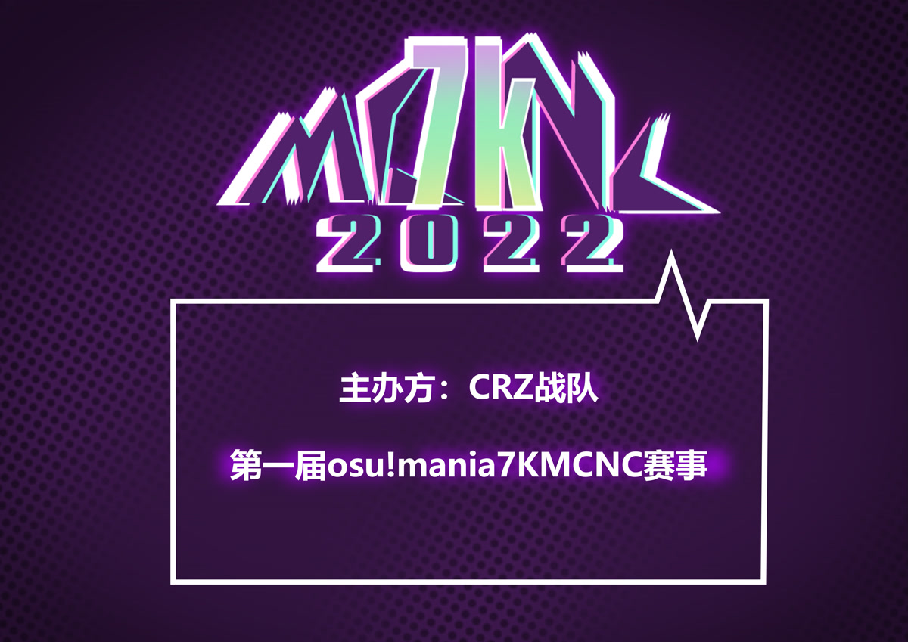

---
tags:
  - MCNC2022
  - MCNC 2022
  - MCNC7K 2022
  - MCNC 7K 2022
---

# osu!mania 7K Chinese National Cup 2022

The **osu!mania 7K Chinese National Cup 2022** (***MCNC 7K 2022***) was a country-based osu!mania tournament hosted by the \[Crz\]Team. It was the first instalment of the osu!mania 7K Chinese National Cup.

## Tournament schedule

| Event | Timestamp |
| --: | :-- |
| Registration phase | 2021-12-06/2021-12-26 |
| Qualifier mappool showcase | 2022-01-16 |
| Qualifiers | 2022-01-21/2022-01-23 |
| Round of 16 | 2022-01-29/2022-01-30 |
| Quarterfinals | 2022-02-05/2022-02-06 |
| Semifinals week 1 | 2022-02-12/2022-02-13 |
| Semifinals week 1 | 2022-02-19/2022-02-20 |
| Finals week 1 | 2022-02-26/2022-02-27 |
| Finals week 2 | 2022-03-05/2022-03-06 |

## Prizes

| Placing | Prize(s) |
| :-: | :-- |
|  | CNY 400, 4 months of osu!supporter, unique profile badge |
|  | CNY 200, 2 months of osu!supporter |
|  | CNY 100, 1 months of osu!supporter |

## Organisation

The osu!mania 7K Chinese National Cup 2022 was run by various community members.

| Position | Member(s) |
| :-- | :-- |
| Manager | ::{ flag=CN }:: [\[Crz\]xz1z1z](https://osu.ppy.sh/users/10500832) |
| Mappool selector | ::{ flag=CN }:: [\[Crz\]Satori](https://osu.ppy.sh/users/7082178), ::{ flag=CN }:: [Madoka2574](https://osu.ppy.sh/users/8819336), ::{ flag=CN }:: [\_Stan](https://osu.ppy.sh/users/1653229), ::{ flag=CN }:: [tyrcs](https://osu.ppy.sh/users/13026904), ::{ flag=BR }:: [Sillyfangirl](https://osu.ppy.sh/users/2288363) |
| Streamer | ::{ flag=CN }:: [\[Crz\]xz1z1z](https://osu.ppy.sh/users/10500832), ::{ flag=CN }:: [\[Crz\]Satori](https://osu.ppy.sh/users/7082178), ::{ flag=CN }:: [\[Illustrious\]](https://osu.ppy.sh/users/4082595), ::{ flag=CN }:: [Sonoaoi](https://osu.ppy.sh/users/9755808), ::{ flag=CN }:: [110](https://osu.ppy.sh/users/4524921), ::{ flag=CN }:: [crazybrother](https://osu.ppy.sh/users/8045083), ::{ flag=CN }:: [Muziyami](https://osu.ppy.sh/users/7003013) |
| Commentator | ::{ flag=CN }:: [\[Crz\]xz1z1z](https://osu.ppy.sh/users/10500832), ::{ flag=CN }:: [\[Crz\]Satori](https://osu.ppy.sh/users/7082178), ::{ flag=CN }:: [crazybrother](https://osu.ppy.sh/users/8045083), ::{ flag=CN }:: [Edward_Tsui](https://osu.ppy.sh/users/8609627), ::{ flag=CN }:: [\[Crz\]Caicium](https://osu.ppy.sh/users/10702235) |
| Designer | ::{ flag=CN }:: [Dr\_Tissues](https://osu.ppy.sh/users/5106681) |
| Referee | ::{ flag=CN }:: [\[Crz\]xz1z1z](https://osu.ppy.sh/users/10500832), ::{ flag=CN }:: [\[Crz\]Satori](https://osu.ppy.sh/users/7082178), ::{ flag=CN }:: [\[Illustrious\]](https://osu.ppy.sh/users/4082595), ::{ flag=CN }:: [\[Crz\]Makii](https://osu.ppy.sh/users/5242158), ::{ flag=CN }:: [\[Crz\]MemoryI](https://osu.ppy.sh/users/8179131), ::{ flag=CN }:: [crazybrother](https://osu.ppy.sh/users/8045083), ::{ flag=CN }:: [\[RT\]Alleyne](https://osu.ppy.sh/users/11279273), ::{ flag=CN }:: [Sonoaoi](https://osu.ppy.sh/users/9755808), ::{ flag=CN }:: [110](https://osu.ppy.sh/users/4524921), ::{ flag=CN }:: [Muziyami](https://osu.ppy.sh/users/7003013) |
| Statistician | ::{ flag=CN }:: [\[Crz\]xz1z1z](https://osu.ppy.sh/users/10500832), ::{ flag=CN }:: [\[RT\]Alleyne](https://osu.ppy.sh/users/11279273), ::{ flag=CN }:: [Kuiiiiteeee](https://osu.ppy.sh/users/7304075),::{ flag=CN }:: [\[Crz\]Makii](https://osu.ppy.sh/users/5242158), ::{ flag=CN }:: [Ayase Eli](https://osu.ppy.sh/users/6764156) |

## Links

- [Discussion thread (English)](https://osu.ppy.sh/community/forums/topics/1475426)
- [Discussion thread (Chinese)](https://osu.ppy.sh/community/forums/topics/1475423)
- [Livestream](https://live.bilibili.com/2996250)
- [Discord server](https://discord.gg/uBHK5vq)
- [Challonge bracket](https://challonge.com/MCNC7k2022)
- **[Statistics sheet](https://docs.google.com/spreadsheets/d/e/2PACX-1vTCFZcnECZEFBCoWVqwmY2_75j_IQ4vrvF3V07-U4ON-iM1FQyeVfvOvWl0eWwTC0j6Bmg07zsqBmyZ/pubhtml)**

## Participants

| Seed | Player |
| :-: | :-- |
| #1 | ::{ flag=CN }:: [Liangiaiajan](https://osu.ppy.sh/users/5144698) |
| #2 | ::{ flag=CN }:: [U1d](https://osu.ppy.sh/users/10125072) |
| #3 | ::{ flag=CN }:: [Krn3](https://osu.ppy.sh/users/12452291) |
| #4 | ::{ flag=TW }:: [IllIlllIIlIIlIl](https://osu.ppy.sh/users/7227070) |
| #5 | ::{ flag=CN }:: [4kGameBye](https://osu.ppy.sh/users/89545) |
| #6 | ::{ flag=CN }:: [My Angel Yukee7](https://osu.ppy.sh/users/9787146) |
| #7 | ::{ flag=CN }:: [LeartLey](https://osu.ppy.sh/users/10512663) |
| #8 | ::{ flag=CN }:: [Residual pain](https://osu.ppy.sh/users/8021339) |
| #9 | ::{ flag=CN }:: [yuwenhao1](https://osu.ppy.sh/users/14318312) |
| #10 | ::{ flag=HK }:: [Elton Tong](https://osu.ppy.sh/users/14885132) |
| #11 | ::{ flag=MO }:: [idqoos123](https://osu.ppy.sh/users/3946113) |
| #12 | ::{ flag=CN }:: [- xiaoluoli -](https://osu.ppy.sh/users/9502281) |
| #13 | ::{ flag=CN }:: [Zyuuu](https://osu.ppy.sh/users/15389275) |
| #14 | ::{ flag=CN }:: [Phukiir](https://osu.ppy.sh/users/4556538) |
| #15 | ::{ flag=CN }:: [katiexie](https://osu.ppy.sh/users/5908765) |
| #16 | ::{ flag=CN }:: [IA daisuki](https://osu.ppy.sh/users/11238501) |
| #17 | ::{ flag=CN }:: [PJH165F](https://osu.ppy.sh/users/25181396) |

## Podium

This competition has come to an end and resulted in the following podium:

| Placing | Player |
| :-: | :-- |
|  | ::{ flag=CN }:: [LiangIaiajan](https://osu.ppy.sh/users/5144698) |
|  | ::{ flag=CN }:: [4kGameBye](https://osu.ppy.sh/users/89545) |
|  | ::{ flag=CN }:: [U1d](https://osu.ppy.sh/users/10125072) |

## Mappools

### Finals

**[Download the mappack here! (151 MB)](https://drive.google.com/file/d/1f8Wzo2iNSevcc7_RtM0VY5aG2zE0Z7Xr/view?usp=sharing)**

- FreeMod
  1. [nao - Towa naru Kizuna to Omoi no Kiseki (\[Crz\]Satori) \[Insane (edit) \[255bpm\]\]](https://osu.ppy.sh/beatmapsets/1703293#mania/3480143)
  2. [Tezuka x Qayo – NINI (Wilben\_Chan) \[Death(edit)\]](https://osu.ppy.sh/beatmapsets/1654058#mania/3477520)
  3. [Ujico*/Snail's house – Dhalia (- A s u s a -) \[D-flat Major style lvl. 70\]](https://osu.ppy.sh/beatmapsets/1200282#mania/2499565)
  4. [samfree - Euthanasia (LostCool) \[Paradise\]](https://osu.ppy.sh/beatmapsets/1609389#mania/3286135)
  5. [Rabbit House - Have a Party Time! (qodtjr) \[I Had a Party Time\]](https://osu.ppy.sh/beatmapsets/684156#mania/1447898)
  6. [Kuroneko Dungeon - Ryoushi no Umi no Lindwurm (KafuuChino) \[MCNC ver.\]](https://osu.ppy.sh/beatmapsets/659969#mania/3476020)
  7. [Genshin Impact - Character Demo OST Vol. 1 (Madoka2574) \[Contemplation in Snow -7K Jack (MCNC Edit)\]](https://osu.ppy.sh/beatmapsets/1703310#mania/3480180)
  8. [Feryquitous feat. Aitsuki Nakuru – Kairikou (tyrcs) \[Restoration Light (edit)\]](https://osu.ppy.sh/beatmapsets/1703294#mania/3480146)
  9. [DJ CHUCKY - HYPE THE CORE (qodtjr) \[Massive\]](https://osu.ppy.sh/beatmapsets/1599487#mania/3266737)
  10. [Powerless feat. Sennzai - Lost Desire (Exyph) \[Disappearing among the emptiness\]](https://osu.ppy.sh/beatmapsets/1198323#mania/2495747)
  11. [BilliumMoto - life flashes before weeb eyes (Kim\_GodSSI) \[lnfinity 0.9x\]](https://osu.ppy.sh/beatmapsets/1459457#mania/2998954)
  12. [Kanae Tachibana composed by nmk - Toshoshitsu no Eruza (LackPoints) \[Souzou (140 bpm)\]](https://osu.ppy.sh/beatmapsets/1153523#mania/2416230)
  13. [Hatsuki Yura - Halloween of the Dead 2 ~ A night mare of a long night ~ (Kim\_GodSSI) \[Spooky\]](https://osu.ppy.sh/beatmapsets/854978#mania/1786527)
  14. [katagiri - Angel's Salad ('Le mythe etendu' ver.) (tyrcs) \[Proof of Existence (edit) \[170bpm\]\]](https://osu.ppy.sh/beatmapsets/1698180#mania/3480193)
  15. [katagiri - Sendan Life (katagiri Bootleg) (Flexo123) \[FlexCORE!@# // 7k\]](https://osu.ppy.sh/beatmapsets/1449322#mania/2980010)
- Tiebreaker
  1. **[katagiri - Palace of Melancholia (tyrcs) \[Desolation\]](https://osu.ppy.sh/beatmapsets/1703329#mania/3480215)**

### Semifinals

**[Download the mappack here! (140 MB)](https://drive.google.com/file/d/1vnjiuWKQRyO2-HCS1P-aS9J6Ein-Jzvo/view?usp=sharing)**

- FreeMod
  1. [xi - Glorious Crown (\[Crz\]xz1z1z) \[tyrcs' Coronation\]](https://osu.ppy.sh/beatmapsets/1693386#mania/3460249)
  2. [lapix – Nexta (Imperial Wolf) \[7K GRAVITY\]](https://osu.ppy.sh/beatmapsets/749049#mania/1577814)
  3. [Nanahira - Looking For A New Adventure (Kim\_GodSSI) \[NANANAYANA\]](https://osu.ppy.sh/beatmapsets/589927#mania/1248633)
  4. [Nanou - Better Off Alone Anjuna Remix (Flexo123) \[Alone\]](https://osu.ppy.sh/beatmapsets/983799#mania/2058535)
  5. [-12insomnia- - Gravity Blast (MEIDAN) \[Unusual\]](https://osu.ppy.sh/beatmapsets/1498277#mania/3070756)
  6. [YUC'e - Sunset Tea Cup (Reba) \[Candy Land\]](https://osu.ppy.sh/beatmapsets/892594#mania/1865785)
  7. [ZONE-SAMA - Ankha Zone (merchee) \[That Cat Is Not Dancing\]](https://osu.ppy.sh/beatmapsets/1596804#mania/3261289)
  8. [Laur – Exitium (tyrcs) \[Extra\]](https://osu.ppy.sh/beatmapsets/1675996#mania/3423802)
  9. [Aiobahn feat. KOTOKO - INTERNET OVERDOSE (arcwinolivirus) \[7K 'My KuraAngel' Arc\]](https://osu.ppy.sh/beatmapsets/1688903#mania/3451367)
  10. [Yu_Asahina – Trickstarz (Evening) \[Sorcery\]](https://osu.ppy.sh/beatmapsets/1312853#mania/2720856)
  11. [Ponkichi - Hyakka Sagikage to Shiro Tokkuri (Wilben\_Chan) \[NSV\]](https://osu.ppy.sh/beatmapsets/1049339#mania/3442092)
  12. [D(ABE3) – MANIERA (iJinjin) \[Collab Another\]](https://osu.ppy.sh/beatmapsets/272871#mania/667031)
  13. [Akiyama Uni - Kaoru Juyouka (Wilben\_Chan) \[Nightmare\]](https://osu.ppy.sh/beatmapsets/1690024#mania/3458234)
- Tiebreaker
  1. **[Camellia - Looking for Edge of Ground (tyrcs) \[One pioneer's Curiosity\]](https://osu.ppy.sh/beatmapsets/1560424#mania/3187056)**

### Quarterfinals

**[Download the mappack here! (78 MB)](https://drive.google.com/file/d/1QM_Fkqbu7TLdUe_qUglVocGaIFfr66YJ/view?usp=sharing)**

- FreeMod
  1. [Gram – Nibelungen (Critical\_Star) \[Extra\]](https://osu.ppy.sh/beatmapsets/1553319#mania/3173651)
  2. [Yu-Peng Chen @HOYO-MiX - Qilin's Prance (Kuo Kyoka) \[The Clement | Finale\]](https://osu.ppy.sh/beatmapsets/1684792#mania/3442364)
  3. [AAAA - Hiyokko Santa to Yuki no Machi (Maxus) \[Reindeer Akasha's Another\]](https://osu.ppy.sh/beatmapsets/1617344#mania/3312408)
  4. [M2U & NICODE - Loadstar (Wilben\_Chan) \[Moonstar\]](https://osu.ppy.sh/beatmapsets/867748#mania/1813926)
  5. [Memme – Uranus (qodtjr) \[Neptune\]](https://osu.ppy.sh/beatmapsets/746714#mania/1573714)
  6. [Air Carnival - Ka Tong Dui Bai (\_Stan) \[Unreal 1.1x \[132bpm\]\]](https://osu.ppy.sh/beatmapsets/628470#mania/3445535)
  7. [Maksim Mrvica - Croatian Rhapsody (Wilben\_Chan) \[Lunatic x1.1\]](https://osu.ppy.sh/beatmapsets/1684539#mania/3441883)
  8. [BEMANI Sound Team "Power Of Nature" - Tadoru Kimi wo Koete (\_Stan) \[Exploration\]]( https://osu.ppy.sh/beatmapsets/1685886#mania/3445529)
  9. [YUC'e - Cinderella Syndrome (KafuuChino) \[Affection\]]( https://osu.ppy.sh/beatmapsets/728088#mania/1537244)
  10. [ExileLord - Speed Test (Cut Ver.) (\_Stan) \[Overbrim\]]( https://osu.ppy.sh/beatmapsets/1685889#mania/3445532)
  11. [HO-KAGO TEA TIME - Tenshi ni Fureta yo! (Asterisk DnB Remix) (Kawawa) \[WAWACORE!!\]](https://osu.ppy.sh/beatmapsets/853402#mania/1783610)
- Tiebreaker
  1. **[Camellia - FM Synthesis Experiment (AncuL) \[Oscillation\]](https://osu.ppy.sh/beatmapsets/1132164#mania/2364828)**

### Round of 16

**[Download the mappack here! (49 MB)](https://drive.google.com/file/d/1zJBAjOG1PuLD4NSrQm92Wsf_k3FBz-wY/view?usp=sharing)**

- FreeMod
  1. [yak_won - Lucid (Madoka2574) \[tyrcs' Luminous\]](https://osu.ppy.sh/beatmapsets/1680378#mania/3432837)
  2. [Mili - Ikutoshitsuki (Flexo123) \[Hard\]](https://osu.ppy.sh/beatmapsets/1427571#mania/2939409)
  3. [Cream puff - Mermaid girl (qodtjr) \[sakana\]](https://osu.ppy.sh/beatmapsets/762991#mania/1604080)
  4. [Flower - Taiyou to Himawari (Degeneracy) \[Himawari\]](https://osu.ppy.sh/beatmapsets/452912#mania/971432)
  5. [S-C-U feat. Qrispy Joybox - anemone (Julie) \[Kawa & Julie's 7K Extra\]](https://osu.ppy.sh/beatmapsets/283841#mania/672098)
  6. [Silentroom - Nhelv (Blocko) \[Insane\]](https://osu.ppy.sh/beatmapsets/1369072#mania/2839581)
  7. [aaaa - Machi (Kim\_GodSSI) \[Piano\]](https://osu.ppy.sh/beatmapsets/675949#mania/1429789)
  8. [Sweet Licious - Who Do You Love? (erika77) \[Normal LN\]](https://osu.ppy.sh/beatmapsets/738924#mania/1559409)
  9. [Se-U-Ra - LOSHAXI (-mint-) \[INSANE\]](https://osu.ppy.sh/beatmapsets/1057963#mania/2219003)
- Tiebreaker
  1. **[Hua Ling / Miao\*Jiang / Yan Ning / kinsen - Let the Wind Tell You (\[Crz\]xz1z1z) \[#1 Team's Let #1 Tell U\]](https://osu.ppy.sh/beatmapsets/1678305#mania/3428823)**

### Qualifiers

**[Download the mappack here! (28 MB)](https://drive.google.com/file/d/1s1O5ZHM9feVK5H1sbSZTMu1V23B3UFKP/view?usp=sharing)**

- FreeMod
  1. [ProjectG - Regain (tyrcs) \[Stage 1: Paranoia\]](https://osu.ppy.sh/beatmapsets/1675958#mania/3423740)
  2. [Camellia feat. Kagekiha Gakusei - Lowermost revolt ("Jeremiad" Long ver.) (Cut Ver.) (\_Stan) \[Stage 2: Rebellion\]](https://osu.ppy.sh/beatmapsets/1675959#mania/3423741)
  3. [Yu-Peng Chen@HOYO-MiX - Rage Beneath the Mountains (Madoka2574) \[Stage 3: Erosion\]](https://osu.ppy.sh/beatmapsets/1654388#mania/3423739)
  4. [Nhato - Virus Funk (\_Stan) \[Stage 4: Pulse\]](https://osu.ppy.sh/beatmapsets/1675957#mania/3423737)
  5. [t+pazolite - You are the Miserable (tyrcs) \[Stage 5: Regret\]](https://osu.ppy.sh/beatmapsets/1675960#mania/3423742)

## Match results

### Finals

Detailed statistics for this round can be found [here](https://docs.google.com/spreadsheets/d/e/2PACX-1vQU8s3x78vGpHI-W0_mB4kgPkhQjwlVixssPkpgI_NeVaEe7L6X3mr14XwhJZ57_cz117oWnYKd4jMz/pubhtml).

| Player 1 |  |  | Player 2 | Match link |
| --: | :-: | :-: | :-- | :-- |
| **Krn3** | **7** | 1 | IllIlllIIlIIlIl | [#1](https://osu.ppy.sh/community/matches/98161045) |
| **4kGameBye** | **7** | 1 | Elton Tong | [#1](https://osu.ppy.sh/community/matches/98200751) |
| **4kGameBye** | **7** | 2 | Krn3 | [#1](https://osu.ppy.sh/community/matches/98234203) |
| **LiangIaiajan** | **7** | 1 | U1d | [#1](https://osu.ppy.sh/community/matches/98238908) |
| U1d | 6 | **7** | **4kGameBye** | [#1](https://osu.ppy.sh/community/matches/98427124) |
| **LiangIaiajan** | **7** | 1 | 4kGameBye | [#1](https://osu.ppy.sh/community/matches/98469574) |

### Semifinals

Detailed statistics for this round can be found [here](https://docs.google.com/spreadsheets/d/e/2PACX-1vSORxBOHSj5MIaAW2drd4tNCta0_RzH5E_dfPIinAtgSPyXvweSjcyU9k-ex7qRn1Keydto5e-fWuAA/pubhtml).

| Player 1 |  |  | Player 2 | Match link |
| --: | :-: | :-: | :-- | :-- |
| **yuwenhao1** | **6** | 0 | idqoos123 | [#1](https://osu.ppy.sh/community/matches/97608455) |
| **My Angel Yukee7** | **6** | 4 | Residual pain | [#1](https://osu.ppy.sh/community/matches/97683923) |
| **Elton Tong** | **6** | 0 | - Xiaoluoli - | [#1](https://osu.ppy.sh/community/matches/97695817) |
| **IllIlllIIlIIlIl** | **6** | 0 | LeartLey | *win by default* |
| **U1d** | **6** | 0 | Krn3 | [#1](https://osu.ppy.sh/community/matches/97836878) |
| My Angel Yukee7 | 5 | **6** | **Elton Tong** | [#1](https://osu.ppy.sh/community/matches/97905407) |
| **LiangIaiajan** | **6** | 0 | 4kGameBye | *win by default* |
| **IllIlllIIlIIlIl** | **6** | 4 | yuwenhao1 | [#1](https://osu.ppy.sh/community/matches/97981824) |

### Quarterfinals

Detailed statistics for this round can be found [here](https://docs.google.com/spreadsheets/d/e/2PACX-1vS9HXA5T49mOKUNI3DtSR58lSzBWs6qEmZ3lIvkkVOrmLE42uGlDV8MlsrjT8fGuG89JQ3nWyElkTYh/pubhtml).

| Player 1 |  |  | Player 2 | Match link |
| --: | :-: | :-: | :-- | :-- |
| katiexie | 0 | **5** | **LeartLey** | [#1](https://osu.ppy.sh/community/matches/97418600) |
| **Krn3** | **5** | 4 | Rain 7 | [#1](https://osu.ppy.sh/community/matches/97420861) |
| Phukiir | 0 | **5** | **idqoos123** | [#1](https://osu.ppy.sh/community/matches/97451631) |
| IllIlllIIlIIlIl | 0 | **5** | **4kGameBye** | *win by default* |
| **LiangIaiajan** | **5** | 0 | yuwenhao1 | [#1](https://osu.ppy.sh/community/matches/97463473) |
| **U1d** | **5** | 0 | Elton Tong | [#1](https://osu.ppy.sh/community/matches/97500804) |
| IA daisuki | 0 | **5** | **Residual pain** | *win by default* |
| Zyuuu | 0 | **5** | **- Xiaoluoli -** | [#1](https://osu.ppy.sh/community/matches/97502069) |

### Round of 16

Detailed statistics for this round can be found [here](https://docs.google.com/spreadsheets/d/e/2PACX-1vQEMoEyyyVraHgC0q8CqWMY5n3UyCkLEc9qhn2dfVaK9_iYInc58wt2GX8CIDZA-oUb-Ega24hzL4R4/pubhtml).

| Player 1 |  |  | Player 2 | Match link |
| --: | :-: | :-: | :-- | :-- |
| **U1d** | **4** | 0 | katiexie | [#1](https://osu.ppy.sh/community/matches/97047894) |
| **Krn3** | **4** | 0 | Phukiir | [#1](https://osu.ppy.sh/community/matches/97125781) |
| **4kGameBye** | **4** | 3 | - Xiaoluoli - | [#1](https://osu.ppy.sh/community/matches/97130269) |
| **LiangIaiajan** | **4** | 0 | IA daisuki | [#1](https://osu.ppy.sh/community/matches/97134412) |
| **IllIlllIIlIIlIl** | **4** | 0 | Zyuuu | [#1](https://osu.ppy.sh/community/matches/97134268) |
| Residual pain | 3 | **4** | **yuwenhao1** | [#1](https://osu.ppy.sh/community/matches/97135803) |
| LeartLey | 1 | **4** | **Elton Tong** | [#1](https://osu.ppy.sh/community/matches/97137493) |
| **Rain 7** | **4** | 0 | idqoos123 | [#1](https://osu.ppy.sh/community/matches/97176994) |

### Qualifiers

The final standings for the Qualifier stage can be found at the following [spreadsheet](https://docs.google.com/spreadsheets/d/1ngKERywxshfCBk0BvVznJBrgaTMbNo10_pyxBYXlpTk/pubhtml#). Detailed statistics for this round can be found [here](https://docs.google.com/spreadsheets/d/e/2PACX-1vTi6wXWLEUfv-be5SZfqL3BOMHT-eunYBINJyh0rGAvooQawh7BnHQtL1bfPWhXvBmUWMhbCA0tIi-5/pubhtml#).

## Ruleset

### Tournament rules

1. The osu!mania 7K Chinese National Cup is a head-to-head individual tournament, played on the osu!mania game mode.
2. Beatmap scoring will be based on Score V2.
3. The beatmaps for each round will be announced by the Mappool Selector Team before the actual matches take place.
   - Each mappool, except for the Qualifier stage, will contain a tiebreaker beatmap. It will only be played in case of a tie in the scoreline in the "best of" system, e.g., the scoreline is 4-4 and the match is best of 9, the tiebreaker shall be played.the scoreline is 4-4 and the match is best of 9, the tiebreaker shall be played.
4. Match schedule will be handled by the Tournament Management.
5. If no referees are available at match time, the match will be postponed.
6. Failed players' scores will be considered losses, even if they are higher than the opponent.
   - Reviving and surviving during a beatmap is considered as passing it.
7. Use of the Visual Settings to alter background dim or disable beatmap elements like storyboards and skins is allowed.
   - Custom skin elements must not be used to alter core gameplay mechanics.
8. Teams may ask for a rematch if a team member encounters technical difficulties while playing.
   - "Lag spikes" are not considered a valid reason to nullify a beatmap.
   - If a rematch happens, the original roster for each team during that particular beatmap must remain the same.
   - This rule is not to be abused. Referees may veto a rematch request if they find that this is the case.
9. Beatmaps must not be reused in the same match, except for rematches.
10. If a player is not present at match time, it can be postponed for up to 10 minutes. If they are still absent after this period, a win by default will be declared for the player present.
11. All players and staff must be treated with respect. Instructions of the referees and the Tournament Management are to be followed. Decisions labelled as final are not to be objected.
12. Disrupting the match by foul play, insulting and provoking other players or staff, delaying the match and other deliberate inappropriate misbehaviour are strictly prohibited.
13. Breaking chat rules results in a silence. Silenced players cannot participate in multiplayer matches.
14. Unexpected incidents will be handled by the Tournament Management. Referees may allow higher tolerance depending on the given circumstances. This is up to their discretion.
15. Penalties for violating the tournament rules include, but are not limited to:
    - Direct judgement of the score of one beatmap.
    - Declaring the match as forfeited, or as a win by default for the other player.
    - Disqualification from the entire tournament.
    - Disqualification from the current and future official tournaments, until appealed.
16. The Tournament Management reserves the right to modify these rules at any moment. Any such changes will be announced in advance.
17. The Tournament Management reserves the right to refuse tournament entry for any and all suspicious accounts or players.
18. Players must abide to the osu! terms of service.

### Tournament registration

1. There is no rank range for this tournament: players from all skill levels are free to participate.
2. This tournament is for Chinese players only, including players from Mainland Chinese territories, Taiwan territories, Hong Kong territories, and Macau territories. Please note that this tournament has nothing to do with politics and views about the territories of China. Only players with the flags of the aforementioned territories are eligible for playing.
3. To be eligible for playing, one must:
   - Have not been banned/majorly restricted in the MCNC.
   - Pass a background check by osu! staff and the tournament staff.
   - Include the answer "我不是管人痴" in the question "Do you have anything else to say?".
   - To ensure that the game is played normally, every registered user will be manually checked by the Tournament Management and will give the list to the official osu! staff to check.
4. All successfully formed players will be published after the registration phase.
5. Organisers, mappoolers and referees must not participate as a player in the tournament.

### Qualifier instructions

1. There will be no warmups during the Qualifier stage.
2. In the Qualifier stage, all players will play a specific pool designed by the mappool selectors.
3. The Qualifier pool contains 5 maps, all of which will use FreeMod rules.
4. Players will have to play the mappool twice at a designated time. Their best combined score will be used for seeding.
5. The mappool will be played in the order the maps are listed.
6. There will be an optional 5-minute break in between the first and second playthrough of the mappool.
7. All players will play their qualifiers in separate rooms. We suggest players not to broadcast or share their results to avoid seed manipulation.
8. The top 16 seeded players will advance to the Round of 16 (or Round of 32 if there are enough players).

### Stage instructions

1. Following the Qualifier stage, a double-elimination stage will be played. This means that the winner continues in the winners' bracket, and the losing player gets moved to the losers' bracket.
2. Players in the losers’ bracket must play 2 matches each weekend starting from the Quarterfinals.
3. Players who lose a match in the losers' bracket get eliminated from the tournament.

### Win conditions

- In the Qualifiers, teams need to place in the top 32 seeded teams in order to advance to the double-elimination stage.
- In the Round of 32, teams need to win 5 maps to win a match (best of 9).
- In the Round of 16 and Quarterfinals, teams need to win 6 maps to win a match (best of 11).
- In the Semifinals, Finals, and Grand Finals, teams need to win 7 maps to win the match (best of 13).

### Match instructions

1. A referee will create a multiplayer room 15 minutes in advance. Players must gather during this period.
   - Room settings are `Game mode: osu!mania`, `Team mode: Head-to-head`, `Win Condition: "ScoreV2"`. Room name must be `MCNC7K2021: ({Red team}) vs ({Blue team})`.
2. Each player can ban one beatmap from the mappool. These beatmaps cannot be picked by any player in the entire match.
3. Beatmap selection will alternate between each player selecting a beatmap in the mappool.
4. Each player must use `!roll` once in `#multiplayer`.
   - The winner of the `!roll` starts picking the first beatmap of the match.
   - The loser of the `!roll` starts banning one beatmap, followed by the winner of the `!roll` to ban a beatmap.
5. Players will have 2 minutes to pick a beatmap and 2 minutes to get ready. If a player takes more time than allotted more than once, a random map will be chosen from the mappool using `!roll` with the number of maps that were neither picked nor banned, excluding the tiebreaker. Repeat offenders may receive further sanctions from the Tournament Management.
6. Players will be given at most a 3-minute timeout for solving unexpected situations.
7. Qualifier results will be published via a statistics sheet.

### Mappool instructions

1. There will be one mappool for each stage, except for the Finals and Grand Finals, which will share the same mappool.
2. Each mappool consists of a fixed amount of maps each stage which will all be played under FreeMod conditions. This means that there is a unique FreeMod bracket.
3. The mappool sizes are as follows:
   - Qualifiers: 5 beatmaps
   - Round of 16: 10 beatmaps
   - Quarterfinals: 12 beatmaps
   - Semifinals: 14 beatmaps
   - Finals: 16 beatmaps
4. Each mappool has one tiebreaker, except for the Qualifiers.
5. Possible mod choices for all maps are Hidden, Fade In, Flashlight, and Mirror.
6. The tiebreaker will be played under FreeMod conditions.

### Scheduling instructions

1. Each stage will be held on a single weekend (including Friday). It can be held on weekdays if both players require it, but this is not recommended.
2. The schedule is decided by the players discussing with each other. All match times must be communicated to the Tournament Management two days prior to the actual match. If not informed, the Tournament Management will decide the match time at their own discretion. The daily schedule will be released a day beforehand.
3. If a player needs to make a temporary change after deciding the match time, rescheduling can only be considered with the consent of both players, and the scheduled time must be set to at least one day after informing the Tournament Management.
