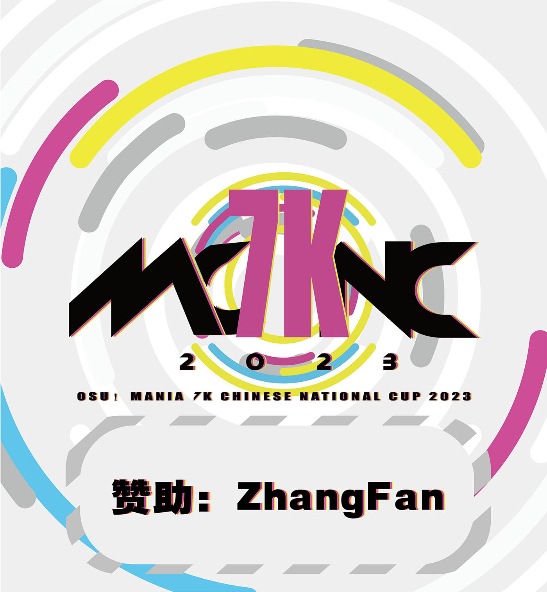

---
tags:
  - MCNC2023
  - MCNC 2023
  - MCNC7K 2023
  - MCNC 7K 2023
---

# osu!mania 7K Chinese National Cup 2023

The **osu!mania 7K Chinese National Cup 2023** (***MCNC 7K 2023***) was a country-based osu!mania tournament hosted by the \[Crz\]Team.

## Tournament schedule

| Event | Timestamp |
| --: | :-- |
| Registration phase | 2022-11-26/2022-12-18 |
| Qualifier mappool showcase | 2023-01-01 |
| Qualifiers | 2023-01-06/2023-01-08 |
| Round of 32 | 2023-01-13/2023-01-15 |
| Round of 16 | 2023-01-18/2023-01-21 |
| Quarterfinals | 2023-01-25/2023-01-29 |
| Semifinals | 2023-02-04/2023-02-05 |
| Finals | 2023-02-9/2023-02-12 |
| Grand Finals | 2023-02-11/2023-02-12 |

## Prizes

| Placing | Prize(s) |
| :-: | :-- |
|  | Unique profile badge, CNY 600, 4 months of osu!supporter |
|  | CNY 400, 2 months of osu!supporter |
|  | CNY 200, 1 months of osu!supporter |
| *All players who passed Qualifiers* | CNY 20 |

## Organisation

The osu!mania 7K Chinese National Cup 2023 was run by various community members.

| Position | Member(s) |
| :-- | :-- |
| Manager | ::{ flag=CN }:: [\[Crz\]xz1z1z](https://osu.ppy.sh/users/10500832) |
| Mappool selector | ::{ flag=CN }:: [\_Stan](https://osu.ppy.sh/users/1653229), ::{ flag=CN }:: [tyrcs](https://osu.ppy.sh/users/13026904), ::{ flag=CN }:: [\[Crz\]Satori](https://osu.ppy.sh/users/7082178), ::{ flag=CN }:: [ExNeko](https://osu.ppy.sh/users/7590894), ::{ flag=MY }:: [Critical_Star](https://osu.ppy.sh/users/3793196) |
| Mappool tester | ::{ flag=US }:: [-NoName-](https://osu.ppy.sh/users/10400730), ::{ flag=MY }:: [\_Kobii](https://osu.ppy.sh/users/6209713) |
| Streamer | ::{ flag=CN }:: [\[Crz\]xz1z1z](https://osu.ppy.sh/users/10500832), ::{ flag=CN }:: [\[Crz\]Alleyne](https://osu.ppy.sh/users/11279273), ::{ flag=CN }:: [FcEazy](https://osu.ppy.sh/users/7825227), ::{ flag=CN }:: [UselessPlayer](https://osu.ppy.sh/users/15030466), ::{ flag=CN }:: [VialVistas](https://osu.ppy.sh/users/9697708), ::{ flag=CN }:: [cdwcgt](https://osu.ppy.sh/users/14721101), ::{ flag=CN }:: [osu happy](https://osu.ppy.sh/users/9580470), ::{ flag=CN }:: [- Rainbow -](https://osu.ppy.sh/users/8742486), ::{ flag=CN }:: [Muziyami](https://osu.ppy.sh/users/7003013), ::{ flag=CN }:: [Sonoaoi](https://osu.ppy.sh/users/9755808), ::{ flag=CN }:: [NaimuTongzi](https://osu.ppy.sh/users/8883892), ::{ flag=CN }:: [silly me](https://osu.ppy.sh/users/6433183), ::{ flag=CN }:: [110](https://osu.ppy.sh/users/4524921), ::{ flag=CN }:: [WorthlessPlayer](https://osu.ppy.sh/users/13858681) |
| Designer | ::{ flag=CN }:: [Dr_Tissues](https://osu.ppy.sh/users/5106681) |
| Referee | ::{ flag=CN }:: [\[Crz\]xz1z1z](https://osu.ppy.sh/users/10500832), ::{ flag=CN }:: [\[Crz\]Makii](https://osu.ppy.sh/users/5242158), ::{ flag=CN }:: [\[Crz\]Alleyne](https://osu.ppy.sh/users/11279273), ::{ flag=CN }:: [UselessPlayer](https://osu.ppy.sh/users/15030466), ::{ flag=CN }:: [VialVistas](https://osu.ppy.sh/users/9697708), ::{ flag=CN }:: [cdwcgt](https://osu.ppy.sh/users/14721101), ::{ flag=CN }:: [osu happy](https://osu.ppy.sh/users/9580470), ::{ flag=CN }:: [Muziyami](https://osu.ppy.sh/users/7003013), ::{ flag=CN }:: [Sonoaoi](https://osu.ppy.sh/users/9755808), ::{ flag=CN }:: [silly me](https://osu.ppy.sh/users/6433183), ::{ flag=CN }:: [110](https://osu.ppy.sh/users/4524921), ::{ flag=CN }:: [WorthlessPlayer](https://osu.ppy.sh/users/13858681) |

## Links

- [Website](https://mcnc.crzteam.cn/home)
- [Discussion thread (English)](https://osu.ppy.sh/community/forums/topics/1680872)
- [Discussion thread (Chinese)](https://osu.ppy.sh/community/forums/topics/1680870)
- [Livestream](https://live.bilibili.com/2996250)
- [Discord server](https://discord.gg/uBHK5vq)
- [Challonge bracket](https://challonge.com/MCNC7k2023)
- **[Statistics sheet](https://docs.google.com/spreadsheets/d/e/2PACX-1vRjhROlCN9rY88VpuyYnQARuHk_7oZACqGktP6-Z6N6HX7j9Fo-CQnBXG_IMpcWHSzSSWDWwrdYJKtL/pubhtml)**

## Participants

| Seed | Player |
| :-: | :-- |
| #1 | ::{ flag=CN }:: [U1d](https://osu.ppy.sh/users/10125072) |
| #2 | ::{ flag=CN }:: [af-](https://osu.ppy.sh/users/10512663) |
| #3 | ::{ flag=CN }:: [QingJiDing](https://osu.ppy.sh/users/10569738) |
| #4 | ::{ flag=CN }:: [HxcQ777](https://osu.ppy.sh/users/18282863) |
| #5 | ::{ flag=CN }:: [VanWilder](https://osu.ppy.sh/users/89545) |
| #6 | ::{ flag=CN }:: [\[Crz\]Reimu](https://osu.ppy.sh/users/14318312) |
| #7 | ::{ flag=CN }:: [Krn\_](https://osu.ppy.sh/users/12452291) |
| #8 | ::{ flag=MO }:: [idqoos123](https://osu.ppy.sh/users/3946113) |
| #9 | ::{ flag=CN }:: [\[GB\]King Fish](https://osu.ppy.sh/users/8468203) |
| #10 | ::{ flag=CN }:: [\[Paw\]FIood](https://osu.ppy.sh/users/6336721) |
| #11 | ::{ flag=CN }:: [AWMRone](https://osu.ppy.sh/users/10351684) |
| #12 | ::{ flag=CN }:: [Watch01](https://osu.ppy.sh/users/13967954) |
| #13 | ::{ flag=CN }:: [Mi-a](https://osu.ppy.sh/users/8021339) |
| #14 | ::{ flag=TW }:: [IllIlllIIlIIlIl](https://osu.ppy.sh/users/7227070) |
| #15 | ::{ flag=CN }:: [wjh123](https://osu.ppy.sh/users/1147820) |
| #16 | ::{ flag=CN }:: [SilentParleHorn](https://osu.ppy.sh/users/5190592) |
| #17 | ::{ flag=CN }:: [\_Yiiiii](https://osu.ppy.sh/users/6066359) |
| #18 | ::{ flag=CN }:: [fishbone2445](https://osu.ppy.sh/users/17640814) |
| #19 | ::{ flag=CN }:: [WANGTIANDADA](https://osu.ppy.sh/users/11400322) |
| #20 | ::{ flag=CN }:: [Shenzouz](https://osu.ppy.sh/users/29606773) |
| #21 | ::{ flag=CN }:: [Mito Van](https://osu.ppy.sh/users/14703345) |
| #22 | ::{ flag=CN }:: [- Xiaoluoli -](https://osu.ppy.sh/users/9502281) |
| #23 | ::{ flag=CN }:: [YuLiangSSS](https://osu.ppy.sh/users/15889644) |
| #24 | ::{ flag=CN }:: [a ri su](https://osu.ppy.sh/users/5069628) |
| #25 | ::{ flag=CN }:: [Rain -](https://osu.ppy.sh/users/8018261) |
| #26 | ::{ flag=CN }:: [lovely_hyahya](https://osu.ppy.sh/users/10318380) |
| #27 | ::{ flag=CN }:: [quailty](https://osu.ppy.sh/users/6423914) |
| #28 | ::{ flag=CN }:: [\[ Classic \]](https://osu.ppy.sh/users/5858053) |
| #29 | ::{ flag=CN }:: [Mitto](https://osu.ppy.sh/users/9602755) |
| #30 | ::{ flag=CN }:: [SoftC418](https://osu.ppy.sh/users/26856985) |
| #31 | ::{ flag=CN }:: [AelSan](https://osu.ppy.sh/users/14095291) |
| #32 | ::{ flag=CN }:: [-\[Ulazis\]-](https://osu.ppy.sh/users/11144363) |
| #33 | ::{ flag=CN }:: [Kuiiiiteeee](https://osu.ppy.sh/users/7304075) |
| #34 | ::{ flag=CN }:: [\[GB\]Luoxuan0327](https://osu.ppy.sh/users/8586018) |
| #35 | ::{ flag=CN }:: [\[GB\]Akamite](https://osu.ppy.sh/users/13418334) |
| #36 | ::{ flag=CN }:: [\[Crz\]Nickname](https://osu.ppy.sh/users/10817494) |
| #37 | ::{ flag=CN }:: [mitaiiiiiiii](https://osu.ppy.sh/users/19173683) |
| #38 | ::{ flag=CN }:: [chana](https://osu.ppy.sh/users/18375016) |
| #39 | ::{ flag=CN }:: [\[GB\]Rush_FTK](https://osu.ppy.sh/users/3046856) |

## Podium

This competition has come to an end and resulted in the following podium:

| Placing | Player |
| :-: | :-- |
|  | ::{ flag=CN }:: [VanWilder](https://osu.ppy.sh/users/89545) |
|  | ::{ flag=CN }:: [U1d](https://osu.ppy.sh/users/10125072) |
|  | ::{ flag=CN }:: [QingJiDing](https://osu.ppy.sh/users/10569738) |

## Mappools

### Grand Finals

**[Download the mappack here! (124 MB)](https://drive.google.com/file/d/1vB6DOjlbMvZ3nWQamDcGFV0cSxnYwN94/view?usp%3Dshare_link)**

- FreeMod
  1. [Shiraishi - True Millennium Queen \[Kawawa's \[BMS wawather LV.23\] (edit)\]](https://osu.ppy.sh/beatmapsets/1939340#mania/4009611)
  2. [Tatsh - IMAGE -MATERIAL-  (Cut Ver.) \[-ESCAPE- \]](https://osu.ppy.sh/beatmapsets/1939336#mania/4009601)
  3. [seatrus - Querasis \[Silex\]](https://osu.ppy.sh/beatmapsets/1939334#mania/4009596)
  4. [CROOVE - Aquaris \[Renderer\]](https://osu.ppy.sh/beatmapsets/1126160#mania/2353030)
  5. [Chroma - Dont Fight The Music \[Start Battle\]](https://osu.ppy.sh/beatmapsets/1939342#mania/4009614)
  6. [sasakure.UK VS Anayama Daisuke - ANU \[Satori's END (tyrcs Edit)\]](https://osu.ppy.sh/beatmapsets/1939347#mania/4009624)
  7. [Billain - Autonomous (Cut Ver.) \[auto is fun asdfasdf\]](https://osu.ppy.sh/beatmapsets/1939352#mania/4009632)
  8. [Cait Sith - Schrodinger no neko \[Superpositionoodle\]](https://osu.ppy.sh/beatmapsets/1228719#mania/3404893)
  9. Rabbit House & Evin ak - optimal solution \[Ideal Ending (212BPM) (MCNC edit)\]
  10. [Yunomi - Game Over (feat. TORIENA) \[crazy\]](https://osu.ppy.sh/beatmapsets/1938084#mania/4006432)
  11. [KikuoHana - Desert Theater \[Borderless Illusion (230BPM)\]](https://osu.ppy.sh/beatmapsets/1939341#mania/4009612)
  12. [lapix - Artificial Human \[SCP\]](https://osu.ppy.sh/beatmapsets/1903538#mania/3924687)
  13. [u-z feat. cherica - Corrupting Wonderland \[Alice in Wonderland\]](https://osu.ppy.sh/beatmapsets/1783408#mania/3652328)
  14. [ina - IMAWANOKIWA \[I wanted to see your future\]](https://osu.ppy.sh/beatmapsets/1699647#mania/3472994)
  15. [ProjectG - Theme \[Abstraction\]](https://osu.ppy.sh/beatmapsets/1939349#mania/4009627)
- Tiebreaker
  1. **[Normal1zer vs. Broken Nerdz - Cybernetic Mastermind No.7 \[Supremacy\]](https://osu.ppy.sh/beatmapsets/1939331#mania/4009588)**

### Finals

**[Download the mappack here! (221 MB)](https://drive.google.com/file/d/1HmDge1B8bJtyUkK1JdqW0IF3JpCFwmo9/view?usp%3Dshare_link)**

- FreeMod
  1. [Fvrwvrd - Extra Credit on The Extratone Test! VICTORY ROYALE!!! (Stan Schwank) \[Winner Winner Chicken Dinner\]](https://osu.ppy.sh/beatmapsets/1935392#mania/3999812)
  2. [cosMo@Bousou-P feat.Hatsune Miku - Hatsune Tenchikaibyaku Shinwa \[edit\]](https://osu.ppy.sh/beatmapsets/1935350#mania/3999727)
  3. [Nana Mizuki - Nageki no Hana (Slax Remix) \[Flower of Lament\]](https://osu.ppy.sh/beatmapsets/1835755#mania/3768936)
  4. [Boom Kitty - Shredageddon \[Rupture \[1.05x\]\]](https://osu.ppy.sh/beatmapsets/1935349#mania/3999725)
  5. [Various Artists - Nakano Yuko Map Collection \[Neokontrol feat. Dustvoxx & Laur - FIRELIGHT\]](https://osu.ppy.sh/beatmapsets/1449950#mania/2981082)
  6. [MisomyL - Mukishitsu Sekai ni Irudori o \[Iroshizuku st1 1.1x (171bpm)\]](https://osu.ppy.sh/beatmapsets/1714977#mania/3504147)
  7. [Mr Bill & qebrus - 2,5-dimethoxy-4-(n)-propylthiophenethylamine qebrus version \[0\]](https://osu.ppy.sh/beatmapsets/1935356#mania/3999733)
  8. [Five Hammer - FFFFF op.2 \[Fortissississimo\]](https://osu.ppy.sh/beatmapsets/1799357#mania/3688643)
  9. [void (Mournfinale) feat. Hoshikuma Minami - Testify \[Leeju's 7K Oath\]](https://osu.ppy.sh/beatmapsets/1898986#mania/3914120)
  10. [Otokaze - SaiGetsu (Cut Ver.) \[Lunatic\]](https://osu.ppy.sh/beatmapsets/1935347#mania/3999723)
  11. [Sayuri - Hana no Tou \[Lv.83\]](https://osu.ppy.sh/beatmapsets/1932718#mania/3993296)
  12. [Ado - Motherland \[Love to the inferiors\]](https://osu.ppy.sh/beatmapsets/1910724#mania/3941228)
  13. [Feryquitous feat. Sennzai - Rhuzerv \[Endless Darkness\]](https://osu.ppy.sh/beatmapsets/1935358#mania/3999735)
  14. [Co shu Nie - SAKURA BURST \[Disappearance\]](https://osu.ppy.sh/beatmapsets/1772362#mania/3628681)
  15. [t+pazolite & Nanahira - ONOMATO Pairing!!! (SSLong ver.) \[Nanahira New Year (edit)\]](https://osu.ppy.sh/beatmapsets/1663760#mania/3396377)
- Tiebreaker
  1. **[Dustvoxx - Switchback \[NS Deluxe\]](https://osu.ppy.sh/beatmapsets/1935584#mania/4000342)**

### Semifinals

**[Download the mappack here! (91 MB)](https://drive.google.com/file/d/1qCPFoEPhbSalj2TIZE6R_PiHFDvwQKmI/view?usp=share_link)**

- FreeMod
  1. [-45 - Blooderay Malie \[qtp13's \[D-Moderate\] x1.2 (169bpm)\]](https://osu.ppy.sh/beatmapsets/1931281#mania/3989715)
  2. [3R2 - The Truth Never Spoken (Energetic Trance Mix) \[Delusion 1.2x (184bpm) OD8\]](https://osu.ppy.sh/beatmapsets/1863570#mania/3832360)
  3. [goreshit - burn this moment into the retina of my eye (cut ver.) \[memorise\]](https://osu.ppy.sh/beatmapsets/1931194#mania/3989539)
  4. [Gentle Stick X M2U - Hades in the Heaven \[Insane\]](https://osu.ppy.sh/beatmapsets/1931171#mania/3989494)
  5. [BEMANI Sound Team "HuMeR" - Rejection Girl \[kaiden gf\]](https://osu.ppy.sh/beatmapsets/1768250#mania/3619611)
  6. [5-let - Asymmetric Grooves \[xiba pumian\]](https://osu.ppy.sh/beatmapsets/1931198#mania/3989543)
  7. [in love with a ghost - flowers feat. nori \[lost love with releases\]](https://osu.ppy.sh/beatmapsets/1931197#mania/3989542)
  8. [Shiron - CODE -CRiMSON- \[TERRORiST\]](https://osu.ppy.sh/beatmapsets/1931201#mania/3989549)
  9. [Otokaze - amamichi \[Reflection\]](https://osu.ppy.sh/beatmapsets/1898432#mania/3912845)
  10. [Toketsuia - God-ish \[AhoUsagi's God is dead (edit)\]](https://osu.ppy.sh/beatmapsets/1931172#mania/3989495)
  11. [HyuN feat. LyuU - Cross Over \[Quasover\]](https://osu.ppy.sh/beatmapsets/1931196#mania/3989541)
  12. [Camellia feat. Nanahira - Ju-Ju- Yakiniku no Hi kara Phenix!?~Saitan no Sumibi Yaki~ \[Extra\]](https://osu.ppy.sh/beatmapsets/1829572#mania/3755024)
  13. [Maria & the Mirrors - Gemini Enjoy My Life \[noisy (LN Edition)\]](https://osu.ppy.sh/beatmapsets/1931200#mania/3989547)
- Tiebreaker
  1. **[SAMString - NUMA \[Stupendous\]](https://osu.ppy.sh/beatmapsets/1931405#mania/3990012)**

### Quarterfinals

**[Download the mappack here! (111 MB)](https://drive.google.com/file/d/1v9cRVznc3nM0ptE9rcbIZZIbMdu2O0dM/view?usp=share_link)**

- FreeMod
  1. [modama/hugepulse - Swim in the sea of quarks \[Creation 1.05x\]](https://osu.ppy.sh/beatmapsets/1687220#mania/3979407)
  2. [Petit Rabbit's with beans - Sekai ga Cafe ni Nacchatta! (Cut Ver.) \[Rabbit House\]](https://osu.ppy.sh/beatmapsets/1926460#mania/3977910)
  3. [kessoku band - Guitar to Kodoku to Aoi Hoshi \[Lonely Rock\]](https://osu.ppy.sh/beatmapsets/1926450#mania/3977896)
  4. [Shinshi Todoroku, Gekijou no Gotoku. - Shinsekai Exodus (Cut Ver.) \[2-step Expert\]](https://osu.ppy.sh/beatmapsets/1794087#mania/3723891)
  5. [NASA - Nocturne op.Q-v \[Another\]](https://osu.ppy.sh/beatmapsets/1869505#mania/3846410)
  6. [Masahiro "Godspeed" Aoki - The Game Changer (Cut Ver.) \[The Art of War\]](https://osu.ppy.sh/beatmapsets/1634415#mania/3335830)
  7. [SENTIVE - rain drops \[petrichor with extra geosmin\]](https://osu.ppy.sh/beatmapsets/1753793#mania/3589125)
  8. [Yuta Imai vs. BEMANI Sound Team "L.E.D.-G" - THE PEERLESS UNDER HEAVEN \[tyrcs' THE FUNN SAMPLE SOUND\]](https://osu.ppy.sh/beatmapsets/1926455#mania/3977901)
  9. [Lightscape - Collapsing World \[flying in the universe\]](https://osu.ppy.sh/beatmapsets/1828350#mania/3752472)
  10. [Y - fairy stage \[Mix edit\]](https://osu.ppy.sh/beatmapsets/1926502#mania/3977997)
  11. [Camellia - Final Flash Flight \[Expert\]](https://osu.ppy.sh/beatmapsets/1715665#mania/3509878)
  12. [Mitsukiyo - Rolling Beat \[Insane\]](https://osu.ppy.sh/beatmapsets/1718640#mania/3512200)
  13. [Kurokumo - Marunouchi Sadistic \[Pengdoll's Extreme\]](https://osu.ppy.sh/beatmapsets/1663604#mania/3871080)
- Tiebreaker
  1. **[Ariabl'eyeS - Kegare Naki Bara Juuji \[Bloom\]](https://osu.ppy.sh/beatmapsets/1926503#mania/3977998)**

### Round of 16

**[Download the mappack here! (55 MB)](https://drive.google.com/file/d/1cyBk494FSNoDEMJQWQ1qpIuaSWhTEu1q/view?usp=sharing)**

- FreeMod
  1. [ninomiya tatsuki - furiae \[Transient\]](https://osu.ppy.sh/beatmapsets/772925#mania/1930187)
  2. [MisoilePunch - Sai \[CHAOS\]](https://osu.ppy.sh/beatmapsets/1142667#mania/2386260)
  3. [SHIKI - Lapis \[Black Another\]](https://osu.ppy.sh/beatmapsets/1652458#mania/3373265)
  4. [Renard - Banned Forever (Cut Ver.) \[children song\]](https://osu.ppy.sh/beatmapsets/1922893#mania/3969430)
  5. [callasoiled - 4172756869 (isagen remix) (Cut Ver.) \[7k insane\]](https://osu.ppy.sh/beatmapsets/1334074#mania/2763839)
  6. [SHIKI - - JUPITER - \[-LN ANOTHER-\]](https://osu.ppy.sh/beatmapsets/1922869#mania/3969381)
  7. [lapix - Nothing but Theory \[Theoretical (edit)\]](https://osu.ppy.sh/beatmapsets/1323310#mania/3968549)
  8. [Wang Qiang - Qiu Tian Bu Hui Lai \[Sorrowful Love\]](https://osu.ppy.sh/beatmapsets/1516775#mania/3105133)
  9. [Sengoku Nadeko (CV: Hanazawa Kana) - Mousou Express (Cut Ver.) \[Imaginary Nerf\]](https://osu.ppy.sh/beatmapsets/1922894#mania/3969432)
  10. [Schubert - Introduction And Variations 'Trockne Blumen' Variation 5 Remix&Arrange \[Blocko's 7K Irrsinnig\]](https://osu.ppy.sh/beatmapsets/557139#mania/1507217)
  11. [Yunomi & nicamoq - Indoor Kei Nara Trackmaker \[= w=)zzz\]](https://osu.ppy.sh/beatmapsets/833226#mania/1745510)
- Tiebreaker
  1. **[Teminite & MDK - Space Invaders \[8bit Revenger // co. _Stan\]](https://osu.ppy.sh/beatmapsets/1922871#mania/3969384)**

### Round of 32

**[Download the mappack here! (77 MB)](https://drive.google.com/file/d/1olG5EJrn0Dfuy1A1IDElMw1nbSDVWff6/view?usp=sharing)**

- FreeMod
  1. [you - Hold Angel \[Insane\]](https://osu.ppy.sh/beatmapsets/636543#mania/1351134)
  2. [qfeileadh feat. Lycoris Radiata - Soumai Musou Lovers \[Insane\]](https://osu.ppy.sh/beatmapsets/1758665#mania/3599277)
  3. [paraoka - L9 \[7K Another\]](https://osu.ppy.sh/beatmapsets/1565681#mania/3256342)
  4. [guna with team kyukkyu - subconsciousness \[nyarather\]](https://osu.ppy.sh/beatmapsets/1918757#mania/3959554)
  5. [Freeleaves - Wisteria \[longevity\]](https://osu.ppy.sh/beatmapsets/1536959#mania/3142518)
  6. [Xacla - oceanbird \[less ln lock\]](https://osu.ppy.sh/beatmapsets/1918754#mania/3959550)
  7. [Shimotsuki Haruka - Re:Call \[KaffuChino's Re:Call (edit)\]](https://osu.ppy.sh/beatmapsets/1918773#mania/3959583)
  8. [Various - Kim_GodSSI's Guest Pack 2 \[M2U & Nicode - Stellar\]](https://osu.ppy.sh/beatmapsets/868254#mania/1814871)
  9. [Linear ring - Enchanted love \['o'\]](https://osu.ppy.sh/beatmapsets/1349017#mania/2793207)
- Tiebreaker
  1. **[t+pazolite - Ultrasonic Anthem \[Expert // co. tyrcs\]](https://osu.ppy.sh/beatmapsets/1918758#mania/3959555)**

### Qualifiers

**[Download the mappack here! (34 MB)](https://drive.google.com/file/d/1rd_tYLdZSxli9xp1fPIq8IOAKl-jsaya/view?usp=sharing)**

- FreeMod
  1. [Kirara Magic - Zombie Step \[Stage 1: Halowin\]](https://osu.ppy.sh/beatmapsets/1914412#mania/3949437) |
  2. [MOB CHOIR - 99.9 (Schwank bootleg) \[Stage 2: 100%\]](https://osu.ppy.sh/beatmapsets/1914499#mania/3949603) |
  3. [FROL - BEAKER (roop remix) \[Stage 3: Backtrack\]](https://osu.ppy.sh/beatmapsets/1914413#mania/3949438) |
  4. [awfuless meets Zekk - MATOI -phase L- \[Stage 4: Showdown\]](https://osu.ppy.sh/beatmapsets/1914417#mania/3949442) |
  5. [Asaka - Open your eyes  (Sped Up Ver.) \[Stage 5: Psychic\]](https://osu.ppy.sh/beatmapsets/1914415#mania/3949440) |
  6. [EZFG - Cyber Thunder Cider \[Stage 6: PPPP\]](https://osu.ppy.sh/beatmapsets/1914416#mania/3949441) |
  7. [technoplanet - Awakening \[Long Version\] [Stage 7: Ascension]](https://osu.ppy.sh/beatmapsets/1914418#mania/3949443) |

## Match results

### Grand Finals

Detailed statistics for this round can be found [here](https://docs.google.com/spreadsheets/d/e/2PACX-1vRczjkzx4gBLlfaTkkxeCMfYaFTt-KxxyIs595Zq8DIWwn4Rs5YobeIEI0fMtO27mGPlWQgyFi0b0Dg/pubhtml).

Saturday, 11 Feburary 2023:

| Player 1 |  |  | Player 2 | Match link |
| --: | :-: | :-: | :-- | :-- |
| **VanWilder** | **7** | 3 | QingJiDing | [#1](https://osu.ppy.sh/community/matches/106746090) |
| **af-** | **7** | 4 | HxcQ777 | [#1](https://osu.ppy.sh/community/matches/106762565) |
| **U1d** | **7** | 3 | [Crz]Reimu | [#1](https://osu.ppy.sh/community/matches/106764334) |
| af- | 6 | **7** | **U1d** | [#1](https://osu.ppy.sh/community/matches/106785546) |

### Finals

Detailed statistics for this round can be found [here](https://docs.google.com/spreadsheets/d/e/2PACX-1vTgmmVujgxqfIkJIaR6oQ-r1xmC12LsGs8PP1C3KlUWdfHbIwxfGrrG3B0Fl6H4q59d3ZE6upZpn_Qp/pubhtml).

Thursday, 9 Feburary 2023:

| Player 1 |  |  | Player 2 | Match link |
| --: | :-: | :-: | :-- | :-- |
| **VanWilder** | **7** | 3 | QingJiDing | [#1](https://osu.ppy.sh/community/matches/106746090) |

Friday, 10 Feburary 2023:

| Player 1 |  |  | Player 2 | Match link |
| --: | :-: | :-: | :-- | :-- |
| **af-** | **7** | 4 | HxcQ777 | [#1](https://osu.ppy.sh/community/matches/106762565) |
| **U1d** | **7** | 3 | [Crz]Reimu | [#1](https://osu.ppy.sh/community/matches/106764334) |

Saturday, 11 Feburary 2023:

| Player 1 |  |  | Player 2 | Match link |
| --: | :-: | :-: | :-- | :-- |
| af- | 6 | **7** | **U1d** | [#1](https://osu.ppy.sh/community/matches/106785546) |

### Semifinals

Detailed statistics for this round can be found [here](https://docs.google.com/spreadsheets/d/e/2PACX-1vTSsR3vtuFlICCnp55im5-L_Whywmu7J1xAy56W7IDLlnU06tqOdrQui9UtyVrqHjbrmTBlBU6gAvPs/pubhtml).

Saturday, 4 Feburary 2023:

| Player 1 |  |  | Player 2 | Match link |
| --: | :-: | :-: | :-- | :-- |
| **YuLiangSSS** | **6** | 2 | SilentParleHorn | [#1](https://osu.ppy.sh/community/matches/106649756) |
| af- | 4 | **6** | **QingJiDing** | [#1](https://osu.ppy.sh/community/matches/106649757) |
| **HxcQ777** | **6** | 0 | [GB]King Fish | [#1](https://osu.ppy.sh/community/matches/106650544) |
| idqoos123 | 3 | **6** | **Mito Van** | [#1](https://osu.ppy.sh/community/matches/106650898) |
| U1d | 3 | **6** | VanWilder | [#1](https://osu.ppy.sh/community/matches/106651326) |
| **[Crz]Reimu** | **6** | 0 | Watch01 | [#1](https://osu.ppy.sh/community/matches/106652502) |
| **HxcQ777** | **6** | 0 | Mito Van | [#1](https://osu.ppy.sh/community/matches/106652470) |

Sunday, 5 Feburary 2023:

| Player 1 |  |  | Player 2 | Match link |
| --: | :-: | :-: | :-- | :-- |
| **[Crz]Reimu** | **6** | 1 | YuLiangSSS | [#1](https://osu.ppy.sh/community/matches/106678393) |

### Quarterfinals

Detailed statistics for this round can be found [here](https://docs.google.com/spreadsheets/d/e/2PACX-1vTSWS1jqEGwvLEeJnaDO3Pct5Zbeuu8bjZSYdraorgMf75n4bXJD3RhDD9uz-eSafttHNzVca9k5Y1W/pubhtml).

Wednesday, 25 January 2023:

| Player 1 |  |  | Player 2 | Match link |
| --: | :-: | :-: | :-- | :-- |
| **SilentParleHorn** | **6** | 1 | quailty | [#1](https://osu.ppy.sh/community/matches/106457715) |
| **8K God** | **6** | 2 | WANGTIANDADA | [#1](https://osu.ppy.sh/community/matches/106457709) |
| 8K God | 3 | **6** | **SilentParleHorn** | [#1](https://osu.ppy.sh/community/matches/106458225) |
| HxcQ777 | 3 | **6** | **VanWilder** | [#1](https://osu.ppy.sh/community/matches/106458152) |
| Krn_ | -1 | **0** | **Shenzouz** | [#1](https://osu.ppy.sh/community/matches/106458609) |

Friday, 27 January 2023:

| Player 1 |  |  | Player 2 | Match link |
| --: | :-: | :-: | :-- | :-- |
| **U1d** | **6** | 0 | idqoos123 | [#1](https://osu.ppy.sh/community/matches/106495037) |
| **QingJiDing** | **6** | 0 | [Crz]Reimu | [#1](https://osu.ppy.sh/community/matches/106494391) |

Saturday, 28 January 2023:

| Player 1 |  |  | Player 2 | Match link |
| --: | :-: | :-: | :-- | :-- |
| **af-** | **6** | 0 | YuLiangSSS | [#1](https://osu.ppy.sh/community/matches/106515388) |
| IllIlllIIlIIlIl | 5 | **6** | **[GB]King Fish** | [#1](https://osu.ppy.sh/community/matches/106516183) |
| **Mi-a** | **6** | 5 | [Paw]FIood | [#1](https://osu.ppy.sh/community/matches/106517216) |
| wjh123 | 3 | **6** | **Mito Van** | [#1](https://osu.ppy.sh/community/matches/106517257) |
| AWMRone | 5 | **6** | **_Yiiiii** | [#1](https://osu.ppy.sh/community/matches/106517158) |

Sunday, 29 January 2023:

| Player 1 |  |  | Player 2 | Match link |
| --: | :-: | :-: | :-- | :-- |
| Shenzouz | 1 | **6** | **Mito Van** | [#1](https://osu.ppy.sh/community/matches/106539485) |
| **Watch01** | **6** | 2 | fishbone2445 | [#1](https://osu.ppy.sh/community/matches/106540310) |
| _Yiiiii | 4 | **6** | **[GB]King Fish** | [#1](https://osu.ppy.sh/community/matches/106540185) |
| **Watch01** | **6** | 4 | Mi-a | [#1](https://osu.ppy.sh/community/matches/106541591) |

### Round of 16

Detailed statistics for this round can be found [here](https://docs.google.com/spreadsheets/d/e/2PACX-1vRRm0x62nWxFbh_5AfsdXynVvqhD46oIyHTYaUYppQiZaxE_S-Eaw-YW6Qa6GgNwVJhT1AiBW0-2YGy/pubhtml).

Wednesday, 25 January 2023:

| Player 1 |  |  | Player 2 | Match link |
| --: | :-: | :-: | :-- | :-- |
| **4kGameBye** | **5** | 4 | Watch01 | [#1](https://osu.ppy.sh/community/matches/106324563) |
| **[Crz]Reimu** | **5** | 2 | AWMRone | [#1](https://osu.ppy.sh/community/matches/106324159) |

Thursday, 19 January 2023:

| Player 1 |  |  | Player 2 | Match link |
| --: | :-: | :-: | :-- | :-- |
| lovely_hyahya | 4 | **5** | **[Paw]FIood** | [#1](https://osu.ppy.sh/community/matches/106338672) |
| **U1d** | **5** | 1 | SilentParleHorn | [#1](https://osu.ppy.sh/community/matches/106340933) |
| [ Classic ] | 1 | **5** | **Mito Van** | [#1](https://osu.ppy.sh/community/matches/106341598) |

Friday, 20 January 2023:

| Player 1 |  |  | Player 2 | Match link |
| --: | :-: | :-: | :-- | :-- |
| **quailty** | **5** | 1 | - Xiaoluoli - | [#1](https://osu.ppy.sh/community/matches/106356633) |
| AelSan | 0 | **5** | **fishbone2445** | [#1](https://osu.ppy.sh/community/matches/106358653) |
| -[Ulazis]- | 0 | **5** | **_Yiiiii** | [#1](https://osu.ppy.sh/community/matches/106359218) |
| **af-** | **5** | 0 | wjh123 | [#1](https://osu.ppy.sh/community/matches/106359335) |
| rain - | 1 | **5** | **[GB]King Fish** | [#1](https://osu.ppy.sh/community/matches/106361093) |

Saturday, 21 January 2023:

| Player 1 |  |  | Player 2 | Match link |
| --: | :-: | :-: | :-- | :-- |
| Mitto | 1 | **5** | **Shenzouz** | [#1](https://osu.ppy.sh/community/matches/106379452) |
| **QingJiDing** | **5** | 2 | IllIlllIIlIIlIl | [#1](https://osu.ppy.sh/community/matches/106380140) |
| **idqoos123** | **5** | 2 | 8K God | [#1](https://osu.ppy.sh/community/matches/106381620) |
| Krn_ | -1 | **0** | **YuLiangSSS** | [WBD](https://osu.ppy.sh/community/matches/106381635) |
| SoftC418 | 1 | **5** | **WANGTIANDADA** | [#1](https://osu.ppy.sh/community/matches/106382667) |
| HxcQ777 | 5 | **1** | **Mi-a** | [#1](https://osu.ppy.sh/community/matches/106383884) |

### Round of 32

Detailed statistics for this round can be found [here](https://docs.google.com/spreadsheets/d/e/2PACX-1vR-OOtbqMEjVqSn9yidd0CTS5R-Sm2sPCmocqFn0RC-QV8b4VpS7Vfh229DFeDk0OBSSORX4yYHLxad/pubhtml).

Friday, 13 January 2023:

| Player 1 |  |  | Player 2 | Match link |
| --: | :-: | :-: | :-- | :-- |
| **Watch01** | **4** | 2 | Mito Van | [#1](https://osu.ppy.sh/community/matches/106219335) |
| [GB]King Fish | -1 | **0** | **8K God** | [#1](https://osu.ppy.sh/community/matches/106221484) |

Saturday, 14 January 2023:

| Player 1 |  |  | Player 2 | Match link |
| --: | :-: | :-: | :-- | :-- |
| **wjh123** | **4** | 1 | fishbone2445 | [#1](https://osu.ppy.sh/community/matches/106240467) |
| **U1d** | **4** | 0 | -[Ulazis]- | [#1](https://osu.ppy.sh/community/matches/106241809) |
| **QingJiDing** | **4** | 1 | SoftC418 | **[#1](https://osu.ppy.sh/community/matches/106241850)** |
| **SilentParleHorn** | **4** | 1 | _Yiiiii | [#1](https://osu.ppy.sh/community/matches/106243917) |
| **Mi-a** | **4** | 3 | Shenzouz | [#1](https://osu.ppy.sh/community/matches/106245152) |
| **[Crz]Reimu** | **4** | 0 | quailty | [#1](https://osu.ppy.sh/community/matches/106246199) |
| **idqoos123** | **4** | 0 | rain - | [#1](https://osu.ppy.sh/community/matches/106246202) |
| [Paw]FIood | 2 | **4** | **YuLiangSSS** | [#1](https://osu.ppy.sh/community/matches/106246296) |
| **AWMRone** | **4** | 2 | - Xiaoluoli - | [#1](https://osu.ppy.sh/community/matches/106247384) |

Sunday, 15 January 2023:

| Player 1 |  |  | Player 2 | Match link |
| --: | :-: | :-: | :-- | :-- |
| **Krn_** | **4** | 0 | lovely_hyahya | [#1](https://osu.ppy.sh/community/matches/106264887) |
| **4kGameBye** | **4** | 1 | [ Classic ] | [#1](https://osu.ppy.sh/community/matches/106265418) |
| **IllIlllIIlIIlIl** | **4** | 3 | WANGTIANDADA | [#1](https://osu.ppy.sh/community/matches/106265488) |
| **HxcQ777** | **4** | 1 | Mitto | [#1](https://osu.ppy.sh/community/matches/106266172) |
| **af-** | **4** | 1 | AelSan | [#1](https://osu.ppy.sh/community/matches/106267715) |

### Qualifiers

The final standings for the Qualifier stage can be found at the following [spreadsheet](https://docs.google.com/spreadsheets/d/e/2PACX-1vTPjZvw1HQ5W3MgDSw7RsnKGAEMJHQoM7rohTxftORkC9d0f9mTt0DAd4XnBn-KYEHrzFV24xMXhWcy/pubhtml). Detailed statistics for this round can be found [here](https://docs.google.com/spreadsheets/d/e/2PACX-1vQlGrTB9nuM-M46OmNwbJbt-qfAc0kKZmGeTnscqlQ-dsA3SZsbTxZqJ9xLPAlTxKh9EP4NOqrXHBG3/pubhtml).

## Ruleset

### Tournament rules

1. The osu!mania 7K Chinese National Cup is a head-to-head individual tournament, played on the osu!mania game mode.
2. Beatmap scoring will be based on Score V2.
3. The beatmaps for each round will be announced by the mappool selection team before the actual matches take place.
   - Each mappool, except for the Qualifier stage, will contain a tiebreaker beatmap. It will only be played in case of a tie in the scoreline in the "best of" system, e.g. if scoreline is 4–4 and the match is best of 9, the tiebreaker shall be played.
4. Match scheduling will be handled by the tournament management.
5. If no referees are available at match time, the match will be postponed.
6. Failed players' scores will be considered losses, even if they are higher than the opponent.
   - Reviving and surviving during a beatmap is considered as passing it.
7. Use of the Visual Settings to alter background dim or disable beatmap elements like storyboards and skins is allowed.
   - Custom skin elements must not be used to alter core gameplay mechanics.
8. Players may ask for a rematch if a team member encounters technical difficulties while playing.
   - "Lag spikes" are not considered a valid reason to nullify a beatmap.
   - If a rematch happens, the player's mod during that particular beatmap must remain the same.
   - This rule is not to be abused. Referees may veto a rematch request if they find that this is the case.
9. Beatmaps must not be reused in the same match, except for rematches.
10. If a player is not present at match time, it can be postponed for up to 10 minutes. If they are still absent after this period, a win by default will be declared for the player present.
11. All players and staff must be treated with respect. Instructions of the referees and the tournament management are to be followed. Decisions labelled as final are not to be objected.
12. Disrupting the match by foul play, insulting and provoking other players or staff, delaying the match and other deliberate inappropriate misbehaviour are strictly prohibited.
13. Breaking chat rules results in a silence. Silenced players cannot participate in multiplayer matches.
14. Unexpected incidents will be handled by the tournament management. Referees may allow higher tolerance depending on the given circumstances. This is up to their discretion.
15. Penalties for violating the tournament rules include, but are not limited to:
    - Direct judgement of the score of one beatmap.
    - Declaring the match as forfeited, or as a win by default for the other player.
    - Disqualification from the entire tournament.
    - Disqualification from the current and future official tournaments, until appealed.
16. The tournament management reserves the right to modify these rules at any moment. Any such changes will be announced in advance.
17. The tournament management reserves the right to refuse entry for any and all suspicious accounts or players.
18. Players must abide to the osu! terms of service.

### Tournament registration

1. There is no rank range for this tournament: players from all skill levels are free to participate.
2. This tournament is for Chinese players only, including players from territories of mainland China, Taiwan, Hong Kong, and Macau. Please note that this tournament has nothing to do with politics and views about the territories of China. Only players with the flags of the aforementioned territories are eligible for playing.
3. To be eligible to play, one must:
   - Not have been banned/majorly restricted from the MCNC.
   - Pass a background check by osu! staff and the tournament staff.
   - Include the answer "首充双倍四舍五入等于不要钱" in the question "Do you have anything else to say?".
   - To ensure that the game is played normally, every registered user will be manually checked by the tournament management and will give the list to the osu! staff to check.
4. All successfully formed players will be published after the registration phase.
5. Organisers, mappoolers and referees must not participate as players in the tournament.

### Qualifier instructions

1. There will be no warmups during the Qualifier stage.
2. In the Qualifier stage, all players will play a specific pool designed by the mappool selectors.
3. The Qualifier pool contains 5 maps, all of which will use FreeMod rules.
4. Players will have to play the mappool twice at a designated time. Their best combined score will be used for seeding.
5. The mappool will be played in the order the maps are listed.
6. There will be an optional 5-minute break in between the first and second playthrough of the mappool.
7. All players will play their qualifiers in separate rooms. We suggest players not to broadcast or share their results to avoid seed manipulation.
8. The top 32 seeded players will advance to the Round of 32.

### Stage instructions

1. Following the Qualifier stage, a double-elimination stage will be played. This means that the winner continues in the winners' bracket, and the losing player gets moved to the losers' bracket.
2. Players in the losers' bracket must play 2 matches each weekend starting from the Quarterfinals.
3. Players who lose a match in the losers' bracket get eliminated from the tournament.

### Win conditions

1. In the Qualifiers, players need to place in the top 16 seeded players in order to advance to the double-elimination stage.
2. In the Round of 32, players need to win 4 maps to win a match (best of 7).
3. In the Round of 16, players need to win 5 maps to win a match (best of 9).
4. In the Quarterfinals and Semifinals, players need to win 6 maps to win a match (best of 11).
5. In the Finals and Grand Finals, players need to win 7 maps to win a match (best of 13).

### Match instructions

1. A referee will create a multiplayer room 15 minutes in advance. Players must gather during this period.
   - Room settings are `Game mode: osu!mania`, `Team mode: Head-to-head`, `Win Condition: "ScoreV2"`. Room name must be `MCNC7K2023: ({Red}) vs ({Blue})`.
   - The player mentioned first in the room name must be in the red team, and the player mentioned second in the room name must be in the blue team.
2. Each player can ban one beatmap from the mappool. These beatmaps cannot be picked by any player during the entire match.
3. Beatmap selection will alternate between each player selecting a beatmap in the mappool.
4. Each player must use `!roll` once in `#multiplayer`.
   - The winner of the `!roll` starts picking the first beatmap of the match.
   - The loser of the `!roll` starts banning one beatmap, followed by the winner of the `!roll` to ban a beatmap.
5. Players will have 2 minutes to pick a beatmap and 2 minutes to get ready. If a player takes more time than allotted more than once, a random map will be chosen from the mappool using `!roll` with the number of maps that were neither picked nor banned, excluding the tiebreaker. Repeat offenders may receive further sanctions from the tournament management.
6. Players will be given at most a 3-minute timeout for solving unexpected situations.
7. Qualifier results will be published via a statistics sheet.

### Mappool instructions

1. There will be one mappool for each stage, except for the Finals and Grand Finals, which will share the same mappool.
2. Each mappool consists of a fixed amount of maps each stage which will all be played under FreeMod conditions. This means that there is a unique FreeMod bracket.
3. The mappool sizes are as follows:
   - Qualifiers: 5 beatmaps
   - Round of 16: 10 beatmaps
   - Quarterfinals: 12 beatmaps
   - Semifinals: 14 beatmaps
   - Finals: 16 beatmaps
4. Each mappool has one tiebreaker, except for the Qualifiers.
5. Possible mod choices for all maps are Hidden, Fade In, Flashlight, and Mirror.
6. The tiebreaker will be played under FreeMod conditions.

### Scheduling instructions

1. Each stage will be held on a single weekend (including Friday). It can be held on weekdays if both players require it, but this is not recommended.
2. The schedule is decided by the players discussing with each other. All match times must be communicated to the tournament management two days prior to the actual match. If not informed, the tournament management will decide the match time at their own discretion. The daily schedule will be released a day beforehand.
3. If a player needs to make a change after deciding the match time, rescheduling can only be considered with the consent of both players, and the scheduled time must be set to at least one day after informing the tournament management.
