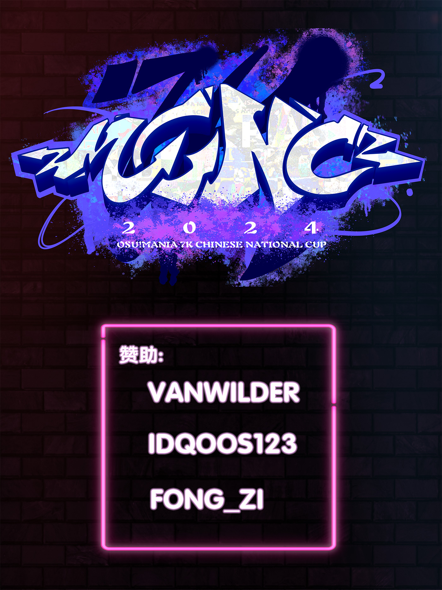

---
tags:
  - MCNC2024
  - MCNC 2024
  - MCNC7K 2024
  - MCNC 7K 2024
---

# osu!mania 7K Chinese National Cup 2024

The **osu!mania 7K Chinese National Cup 2024** (***MCNC 7K 2024***) was a country-based osu!mania tournament hosted by the \[Crz\]Team.

## Tournament schedule

| Event | Timestamp |
| --: | :-- |
| Registration phase | 2023-11-19/2023-12-10 |
| Qualifier mappool showcase | 2023-12-25 |
| Qualifiers | 2023-12-30/2024-01-01 |
| Play-off | 2024-01-06/2024-01-07 |
| Round of 32 | 2024-01-13/2024-01-14 |
| Round of 16 | 2024-01-20/2024-01-21 |
| Quarterfinals | 2024-01-27/2024-01-28 |
| Semifinals | 2024-02-03/2024-02-04 |
| Finals | 2024-02-10/2024-02-11 |
| Grand Finals | 2024-02-17/2024-02-18 |

## Prizes

| Placing | Prize(s) |
| :-: | :-- |
|  | Unique profile badge, CNY 1,320, 4 months of osu!supporter |
|  | CNY 880, 2 months of osu!supporter |
|  | CNY 500, 1 months of osu!supporter |
| 4th to 12th | CNY 40 |
| 13th to 32nd | CNY 25 |
| *All players who passed Qualifiers* | CNY 15 |

## Organisation

The osu!mania 7K Chinese National Cup 2024 was run by various community members.

| Position | Member(s) |
| :-- | :-- |
| Manager | ::{ flag=CN }:: [\[Crz\]xz1z1z](https://osu.ppy.sh/users/10500832) |
| Mappoolers | ::{ flag=CN }:: [tyrcs](https://osu.ppy.sh/users/13026904), ::{ flag=CN }:: [_Stan](https://osu.ppy.sh/users/1653229), ::{ flag=CN }:: [[Crz]Satori](https://osu.ppy.sh/users/7082178), ::{ flag=CN }:: [ExNeko](https://osu.ppy.sh/users/7590894), ::{ flag=AU }:: [ruka](https://osu.ppy.sh/users/6117525) |
| Custom Mappers | ::{ flag=CN }:: [U1d](https://osu.ppy.sh/users/10125072), ::{ flag=PH }:: [lenpai](https://osu.ppy.sh/users/5314573), ::{ flag=KR }:: [Garalulu](https://osu.ppy.sh/users/757783), ::{ flag=CN }:: [- Inaba Meguru](https://osu.ppy.sh/users/14767969), ::{ flag=SG }:: [Level 51](https://osu.ppy.sh/users/3617847), ::{ flag=KR }:: [Wonki](https://osu.ppy.sh/users/7898495) |
| Referees | ::{ flag=CN }:: [YuEast 2018](https://osu.ppy.sh/users/13953619), ::{ flag=CN }:: [cdwcgt](https://osu.ppy.sh/users/14721101), ::{ flag=CN }:: [[Crz]Alleyne](https://osu.ppy.sh/users/11279273), ::{ flag=CN }:: [[GB]Rush_FTK](https://osu.ppy.sh/users/3046856), ::{ flag=CN }:: [WorthlessPlayer](https://osu.ppy.sh/users/13858681), ::{ flag=CN }:: [[Crz]xz1z1z](https://osu.ppy.sh/users/10500832), ::{ flag=CN }:: [antigen](https://osu.ppy.sh/users/10507557), ::{ flag=CN }:: [AelSan](https://osu.ppy.sh/users/14095291), ::{ flag=CN }:: [Shiki-Natsume](https://osu.ppy.sh/users/6338477), ::{ flag=CN }:: [[Crz]Makii](https://osu.ppy.sh/users/5242158), ::{ flag=CN }:: [Azureus](https://osu.ppy.sh/users/6938658), ::{ flag=CN }:: [FcEazy](https://osu.ppy.sh/users/7825227) |
| Streamers | ::{ flag=CN }:: [YuEast 2018](https://osu.ppy.sh/users/13953619), ::{ flag=CN }:: [cdwcgt](https://osu.ppy.sh/users/14721101), ::{ flag=CN }:: [[Crz]Alleyne](https://osu.ppy.sh/users/11279273), ::{ flag=CN }:: [[GB]Rush_FTK](https://osu.ppy.sh/users/3046856), ::{ flag=CN }:: [[Crz]xz1z1z](https://osu.ppy.sh/users/10500832), ::{ flag=CN }:: [Shiki-Natsume](https://osu.ppy.sh/users/6338477), ::{ flag=CN }:: [Azureus](https://osu.ppy.sh/users/6938658) |
| Graphics | ::{ flag=CN }:: [Dr_Tissues](https://osu.ppy.sh/users/5106681) |
| Spreadsheeters | ::{ flag=CN }:: [\[Crz\]xz1z1z](https://osu.ppy.sh/users/10500832) |

## Links

- [Website](https://mcnc.crzteam.cn/home)
- [Discussion thread](https://osu.ppy.sh/community/forums/topics/1846778)
- [Livestream](https://live.bilibili.com/2996250)
- [Discord server](https://discord.gg/uBHK5vq)
- [Challonge bracket](https://challonge.com/MCNC7k2024)
- **[Statistics sheet](https://docs.google.com/spreadsheets/d/e/2PACX-1vSyGLLJrNwhz46WJRnNavxeZwgP8NRTo0I8yseXvZrxITIG72nBkWj8nD3q2Jth8uUrzfRdKYCoAhBy/pubhtml)**

## Participants

| Seed | Player |
| :-: | :-- |
| #1 | ::{ flag=CN }:: [Watch01](https://osu.ppy.sh/users/13967954) |
| #2 | ::{ flag=CN }:: [VanWilder](https://osu.ppy.sh/users/89545) |
| #3 | ::{ flag=CN }:: [af-](https://osu.ppy.sh/users/10512663) |
| #4 | ::{ flag=CN }:: [HxcQ777](https://osu.ppy.sh/users/18282863) |
| #5 | ::{ flag=CN }:: [QingJiDing](https://osu.ppy.sh/users/10569738) |
| #6 | ::{ flag=CN }:: [_Yiiiii](https://osu.ppy.sh/users/6066359) |
| #7 | ::{ flag=CN }:: [RinFall](https://osu.ppy.sh/users/25826291) |
| #8 | ::{ flag=TW }:: [IllIlllIIlIIlIl](https://osu.ppy.sh/users/7227070) |
| #9 | ::{ flag=TW }:: [hero_jeff](https://osu.ppy.sh/users/3375226) |
| #10 | ::{ flag=CN }:: [AKlevenseven](https://osu.ppy.sh/users/11107867) |
| #11 | ::{ flag=CN }:: [Shenzouz](https://osu.ppy.sh/users/29606773) |
| #12 | ::{ flag=CN }:: [SilentParleHorn](https://osu.ppy.sh/users/5190592) |
| #13 | ::{ flag=CN }:: [Mi-a](https://osu.ppy.sh/users/8021339) |
| #14 | ::{ flag=CN }:: [AWMRone](https://osu.ppy.sh/users/10351684) |
| #15 | ::{ flag=CN }:: [fishbone2445](https://osu.ppy.sh/users/17640814) |
| #16 | ::{ flag=CN }:: [Mito Van](https://osu.ppy.sh/users/14703345) |
| #17 | ::{ flag=MO }:: [idqoos123](https://osu.ppy.sh/users/3946113) |
| #18 | ::{ flag=CN }:: [[Paw]FIood](https://osu.ppy.sh/users/6336721) |
| #19 | ::{ flag=CN }:: [- Xiaoluoli -](https://osu.ppy.sh/users/9502281) |
| #20 | ::{ flag=CN }:: [[Crz]sunnyxxy](https://osu.ppy.sh/users/10333739) |
| #21 | ::{ flag=CN }:: [quailty](https://osu.ppy.sh/users/6423914) |
| #22 | ::{ flag=CN }:: [Carpihat](https://osu.ppy.sh/users/10085090) |
| #23 | ::{ flag=US }:: [oscarcx](https://osu.ppy.sh/users/13929448) |
| #24 | ::{ flag=MO }:: [Randumbs](https://osu.ppy.sh/users/27657112) |
| #25 | ::{ flag=CN }:: [Mitto](https://osu.ppy.sh/users/9602755) |
| #26 | ::{ flag=CN }:: [[GB]Burger King](https://osu.ppy.sh/users/9841162) |
| #27 | ::{ flag=CN }:: [SHABEST](https://osu.ppy.sh/users/18756838) |
| #28 | ::{ flag=CN }:: [Yozomi](https://osu.ppy.sh/users/11144284) |
| #29 | ::{ flag=CN }:: [80zero](https://osu.ppy.sh/users/12301332) |
| #30 | ::{ flag=CN }:: [Hirasawa Yu1](https://osu.ppy.sh/users/12809702) |
| #31 | ::{ flag=CN }:: [DannyXLee](https://osu.ppy.sh/users/13847712) |
| #32 | ::{ flag=CN }:: [OkangbaO](https://osu.ppy.sh/users/20157847) |
| #33 | ::{ flag=CN }:: [Kuiiiiteeee](https://osu.ppy.sh/users/7304075) |
| #34 | ::{ flag=CN }:: [H0shimiya_akari](https://osu.ppy.sh/users/33531147) |
| #35 | ::{ flag=CN }:: [Xu seventeen](https://osu.ppy.sh/users/8781662) |
| #36 | ::{ flag=CN }:: [Renshey](https://osu.ppy.sh/users/14265994) |
| #37 | ::{ flag=CN }:: [[GB]nnk](https://osu.ppy.sh/users/22412151) |
| #38 | ::{ flag=CN }:: [SnuYOvO](https://osu.ppy.sh/users/33990355) |
| #39 | ::{ flag=CN }:: [chuang1227](https://osu.ppy.sh/users/16770943) |
| #40 | ::{ flag=TW }:: [elicccc](https://osu.ppy.sh/users/22491203) |
| #41 | ::{ flag=CN }:: [Nene Sakura](https://osu.ppy.sh/users/6701104) |
| #42 | ::{ flag=CN }:: [[Crz]Nickname](https://osu.ppy.sh/users/10817494) |
| #43 | ::{ flag=CN }:: [RiceSS](https://osu.ppy.sh/users/8271436) |
| #44 | ::{ flag=CN }:: [beta dust](https://osu.ppy.sh/users/12031289) |
| #45 | ::{ flag=CN }:: [Mrhbyy](https://osu.ppy.sh/users/16491593) |
| #46 | ::{ flag=CN }:: [[GB]mmttyy233](https://osu.ppy.sh/users/28639641) |
| #47 | ::{ flag=CN }:: [Old Pigeon](https://osu.ppy.sh/users/26116770) |
| #48 | ::{ flag=CN }:: [CygnusOz](https://osu.ppy.sh/users/10496581) |
| #49 | ::{ flag=CN }:: [Feng_Huo](https://osu.ppy.sh/users/16084654) |
| #50 | ::{ flag=CN }:: [ikka](https://osu.ppy.sh/users/24261871) |
| #51 | ::{ flag=CN }:: [dreamed123](https://osu.ppy.sh/users/20602698) |
| #52 | ::{ flag=CN }:: [2580697339](https://osu.ppy.sh/users/6311072) |
| #53 | ::{ flag=CN }:: [Lonann](https://osu.ppy.sh/users/14617751) |
| #54 | ::{ flag=CN }:: [[Lily_White]](https://osu.ppy.sh/users/12749779) |
| #55 | ::{ flag=CN }:: [147148383](https://osu.ppy.sh/users/33705006) |
| #56 | ::{ flag=CN }:: [ShandenOnter](https://osu.ppy.sh/users/13999223) |

## Podium

This competition has come to an end and resulted in the following podium:

| Placing | Player |
| :-: | :-- |
|  | ::{ flag=CN }:: [VanWilder](https://osu.ppy.sh/users/89545) |
|  | ::{ flag=CN }:: [QingJiDing](https://osu.ppy.sh/users/10569738) |
|  | ::{ flag=CN }:: [af-](https://osu.ppy.sh/users/10512663) |

## Mappools

### Grand Finals

**[Download the mappack here! (129 MB)](https://drive.google.com/file/d/1bgbxAZ6-PtOFKxypPhslFAluASg6ILL0/view?usp=sharing)**

- Rice
  1. [ZUN/arr.Myon - Plastic Mind (_Stan) \[DERAY (edit)\]](https://osu.ppy.sh/beatmapsets/2133203#mania/4487438)
  2. [Wolpis Carter - Oxalis (Cut Ver.) (ExNeko) \[Ruine Le.\]](https://osu.ppy.sh/beatmapsets/2132924#mania/4486863)
  3. [Raimukun - Myths Orbis (ExNeko) \[Edit\]](https://osu.ppy.sh/beatmapsets/2132922#mania/4486861)
  4. [Silentroom - Ima Kimini ([Crz]Satori) \[Tranquil (187bpm)\]](https://osu.ppy.sh/beatmapsets/2132921#mania/4486858)
  5. [Ado - Odo (Remuring) \[delay x1.2\]](https://osu.ppy.sh/beatmapsets/1748395#mania/3576327)
  6. [Honda Mio (CV: Sayuri Hara) - Step! (_Stan) \[March On Forward!! (191bpm) (Edit)\]](https://osu.ppy.sh/beatmapsets/2133208#mania/4487448)
  7. [Yaezou - The Sundering (tyrcs) \[Penetration\]](https://osu.ppy.sh/beatmapsets/2133202#mania/4487437)
- Long Note
  1. [lapix - Born 2 Lose (- Minato Aqua -) \[--------------\]](https://osu.ppy.sh/beatmapsets/2132946#mania/4486937)
  2. [Iyowa feat. KAFU - Kyu-kurarin (Cut ver.) (MapleSyrup-) \[Enjoy Stay\]](https://osu.ppy.sh/beatmapsets/2012981#mania/4189070)
  3. [Rabbit House - Ad astra per aspera (ExNeko) \[LN deluge 1.05x\]](https://osu.ppy.sh/beatmapsets/2132920#mania/4486856)
  4. [Toromaru - Erinyes (tyrcs) \[Elegant (205bpm)\]](https://osu.ppy.sh/beatmapsets/2133201#mania/4487435)
  5. [Yuhei Catharsis - shonenyo, tokko no sakigake to nare (Kim_GodSSI) \[Lvl 95\]](https://osu.ppy.sh/beatmapsets/578396#mania/1224638)
- Hybrid
  1. [DJ Myosuke & Gram - The Rebellion of Phantom (feat. Valkyria) (U1d) \[The Valkyrie's Monologue (edit)\]](https://osu.ppy.sh/beatmapsets/2132925#mania/4486864)
  2. [Snail's House - Mahou no Kakurenbo (_Stan) \[House Adventure (OD5)\]](https://osu.ppy.sh/beatmapsets/2133212#mania/4487453)
  3. [Gram - Lachryma \<Ragnarok The Requiem\> (Wonki) \[Extra\]](https://osu.ppy.sh/beatmapsets/2133216#mania/4487457)
- Tiebreaker
  1. **[DeformedEutopia (Nirotiy + AiSS) - Chong Xiao - The Multitude of Empyrean - (tyrcs) \[Majestic Firmament\]](https://osu.ppy.sh/beatmapsets/2133204#mania/4487439)**

### Finals

**[Download the mappack here! (106 MB)](https://drive.google.com/file/d/1kTzyRAnJjwHQ9yJtjjPqAP7zYvxjkMSM/view?usp=sharing)**

- Rice
  1. [F-777 - Ludicrous Speed (Fvrwvrd's Deathcore Remix) \[Ft. Infant Annihilator\] (_Stan) \[Nimble As Lightning (378bpm) (mapped by critical_star)\]](https://osu.ppy.sh/beatmapsets/2129952#mania/4478890)
  2. [USAO & Camellia - Moebius (_Stan) \[U1d's No Escapes\]](https://osu.ppy.sh/beatmapsets/2129949#mania/4478885)
  3. [nora2r - B.B.K.K.B.K.K. (USAO Remix) (ExNeko) \[ULTIMATE\]](https://osu.ppy.sh/beatmapsets/2129946#mania/4478881)
  4. [litmus* - Scorpion Dance (ExNeko) \[Jump!\]](https://osu.ppy.sh/beatmapsets/2129947#mania/4478882)
  5. [MisoilePunch - Overrrload!! (Evening) \[macaron st4\]](https://osu.ppy.sh/beatmapsets/1715197#mania/3504627)
  6. [Dustvoxx, Loctek - Labyrinth of Mind (tyrcs) \[Diffusion\]](https://osu.ppy.sh/beatmapsets/2129944#mania/4478878)
  7. [Shoebill - Amen-Kun (lenpai) \[anime background\]](https://osu.ppy.sh/beatmapsets/1669602#mania/3409802)
- Long Note
  1. [Ado - unravel (- Minato Aqua -) \[painful\]](https://osu.ppy.sh/beatmapsets/2129940#mania/4478870)
  2. [xi + Sta - Northward (ccouy123) \[66.5°N (MCNC Edit)\]](https://osu.ppy.sh/beatmapsets/1167488#mania/4478648)
  3. [orangentle - VeRForTe aRtEVEiN (_Stan) \[U1d's AscensioN\]](https://osu.ppy.sh/beatmapsets/2129959#mania/4478902)
  4. [DAZBEE - Mikazuki Step (ruka) \[(((((()))))))\]](https://osu.ppy.sh/beatmapsets/2076977#mania/4348721)
  5. [PinocchioP - Reincarnation Apple (tyrcs) \[xwx\]](https://osu.ppy.sh/beatmapsets/2129941#mania/4478873)
- Hybrid
  1. [KoronePochi - papparappa-piyoyo~~n TEA (_Stan) \[U1d's papapapapapa \[1.05x Rate\]\]](https://osu.ppy.sh/beatmapsets/2129958#mania/4478901)
  2. [Ik4sumi - Prediction (tyrcs) \[Crystallized (edit)\]](https://osu.ppy.sh/beatmapsets/2129942#mania/4478874)
  3. [kurenaissance - LivedaM (ExNeko) \[DreaM\]](https://osu.ppy.sh/beatmapsets/2129948#mania/4478883)
- Tiebreaker
  1. **[Ludicin - Clinozoisite (ruka) \[Intangible (MCNC Edit)\]](https://osu.ppy.sh/beatmapsets/2129939#mania/4478868)**

### Semifinals

**[Download the mappack here! (91 MB)](https://drive.google.com/file/d/1U4fAXyfQgnWptx9ZLyJmeiL6ivte1lmt/view?usp=sharing)**

- Rice
  1. [Jackal Queenston - Cursed (tyrcs) \[Miracle (edit)\]](https://osu.ppy.sh/beatmapsets/2126993#mania/4471366)
  2. [Yorushika - Deep Indigo (Cut Ver.) (ExNeko) \[Farther than the sky\]](https://osu.ppy.sh/beatmapsets/2126988#mania/4471360)
  3. [sakuzyo - Toy's 3 minutes war (Kawawa) \[LF> Ludibrium PQ @180\]](https://osu.ppy.sh/beatmapsets/1692913#mania/3459365)
  4. [P.T. Adamczyk - Gate K9 (ExNeko) \[Jailbreak\]](https://osu.ppy.sh/beatmapsets/2126989#mania/4471361)
  5. [BewhY - GOTTASADAE (Remuring) \[HONORIFIC\]](https://osu.ppy.sh/beatmapsets/1851385#mania/3804081)
  6. [ABE3 - ENTANGLEMENT (tyrcs) \[karma\]](https://osu.ppy.sh/beatmapsets/2126994#mania/4471368)
- Long Note
  1. [In Love With A Ghost - I Was Feeling Down, I Found a Nice Witch and We're Friends (- Minato Aqua -) \[XAX\]](https://osu.ppy.sh/beatmapsets/2126970#mania/4471300)
  2. [Feryquitous - Eltina (ruka) \[Nobleness\]](https://osu.ppy.sh/beatmapsets/1986486#mania/4126411)
  3. [Yooh - Decoy (ExNeko) \[Exclusion Zone /Edit/\]](https://osu.ppy.sh/beatmapsets/2126991#mania/4471363)
  4. [HoneyWorks feat.Narumi SenaxNarumi Mona(CV.Natsukawa Shiina) - Sis x Love (LostCool) \[MCNC Edit\]](https://osu.ppy.sh/beatmapsets/1744523#mania/4470996)
- Hybrid
  1. [BlackY feat. Risa Yuzuki - Akasha (Wonki) \[Extra\]](https://osu.ppy.sh/beatmapsets/2126967#mania/4471295)
  2. [II-L - Asteroid Field of DECAPLETS (Cut Ver.) (tyrcs) \[.... . .....\]](https://osu.ppy.sh/beatmapsets/2126996#mania/4471371)
  3. [DJ Myosuke & tug - MAGGOD (U1d) \[Perish\]](https://osu.ppy.sh/beatmapsets/2127519#mania/4472500)
- Tiebreaker
  1. **[Asatsumei - Tenshi no Kikyou (feat. L4hee) (U1d) \[Eternal Angels\]](https://osu.ppy.sh/beatmapsets/2126998#mania/4471374)**

### Quarterfinals

**[Download the mappack here! (69 MB)](https://drive.google.com/file/d/15Gata891nTA3nQu2bXQJZ7OUDdVziw7W/view?usp=sharing)**

- Rice
  1. [Smiley - Destiny (Sped Up Ver.) (ExNeko) \[Expert\]](https://osu.ppy.sh/beatmapsets/2123156#mania/4461808)
  2. [cosMo@bousouP - Oceanus (Faputa) \[Reba's Extra\]](https://osu.ppy.sh/beatmapsets/1047505#mania/2204991)
  3. [HiTECH NINJA - Technicians High ([Crz]Alleyne) \[Landepen\]](https://osu.ppy.sh/beatmapsets/2123135#mania/4461771)
  4. [naotyu- - Her Majesty (Maxus) \[Universe Obscurity\]](https://osu.ppy.sh/beatmapsets/2012456#mania/4187626)
  5. [Tsubaki. - Myosotis (tyrcs) \[Reminiscence\]](https://osu.ppy.sh/beatmapsets/2123158#mania/4461810)
  6. [Reizoko Cj - CirnoRHTL (Nivrad00) \[Extra\]](https://osu.ppy.sh/beatmapsets/400818#mania/872039)
- Long Note
  1. [cubesato - My First Phone (U1d) \[redial\]](https://osu.ppy.sh/beatmapsets/2123176#mania/4461833)
  2. [Jay Chou - Chapter VII of the Night (ExNeko) \[orphic\]](https://osu.ppy.sh/beatmapsets/2123151#mania/4461803)
  3. [Coward Dream - Aibu Youhatsusei Kougeki Koudou (feat. KAFU) (ExNeko) \[Don't touch!\]](https://osu.ppy.sh/beatmapsets/2123148#mania/4461800)
  4. [Hatsuki Yura - Koisuru Marionette (Cut Ver.) (- Minato Aqua -) \[I don't know what difficulty name to choose\]](https://osu.ppy.sh/beatmapsets/2123160#mania/4461812)
- Hybrid
  1. [Tsukino - Mahou Shoujo to Chocolate (U1d) \[Chocolust\]](https://osu.ppy.sh/beatmapsets/2123164#mania/4461817)
  2. [Toromaru - Deorbit (tyrcs) \[Roaming\]](https://osu.ppy.sh/beatmapsets/2123161#mania/4461813)
  3. [street - Theoi (_Stan) \[Targon // co. ExNeko\]](https://osu.ppy.sh/beatmapsets/2123159#mania/4461811)
- Tiebreaker
  1. **[xi - Double Helix (tyrcs) \[Vibrant Plus\]](https://osu.ppy.sh/beatmapsets/2123162#mania/4461814)**

### Round of 16

**[Download the mappack here! (60 MB)](https://drive.google.com/file/d/1HaqGRK-Z005rtgCuCiAVDD9dF9FYW8JZ/view?usp=sharing)**

- Rice
  1. [Wu Lan Tuo Ya - Tao Ma Gan (ExNeko) \[Grassland\]](https://osu.ppy.sh/beatmapsets/2119352#mania/4451936)
  2. [-45 - Sanka Debonair (ExNeko) \[suave /-\]](https://osu.ppy.sh/beatmapsets/2119349#mania/4451932)
  3. [Yu^ta - CLOUDY PARK (tyrcs) \[hi\]](https://osu.ppy.sh/beatmapsets/2119348#mania/4451927)
  4. [TJ.hangneil - Apollo (tyrcs) \[Extra\]](https://osu.ppy.sh/beatmapsets/2119345#mania/4451920)
  5. [Sobrem - Wit's biz (_Stan) \[Get 'em\]](https://osu.ppy.sh/beatmapsets/2119350#mania/4451933)
- Long Note
  1. [Tu zao zao - Jiu Wan Zi (ExNeko) \[wish\]](https://osu.ppy.sh/beatmapsets/2119353#mania/4451937)
  2. [dj TAKA feat. Erika Mochizuki - MOON (paulkappa) \[Slave of Sadness\]](https://osu.ppy.sh/beatmapsets/1666530#mania/3402422)
  3. [C-Show - N3V3R G3T OV3R (U1d) \[G1V3 T0 M3\]](https://osu.ppy.sh/beatmapsets/2119354#mania/4451939)
- Hybrid
  1. [Hiro - In Chaos (tyrcs) \[Ecstasy (edit)\]](https://osu.ppy.sh/beatmapsets/2119351#mania/4451934)
  2. [Cuvelia - Tenkuu no Yoake (AncuL) \[Imaginary\]](https://osu.ppy.sh/beatmapsets/630583#mania/1331170)
  3. [Rory in early 20s - Wa Yoderi (Garalulu) \[[-o-]\]](https://osu.ppy.sh/beatmapsets/2119414#mania/4452115)
- Tiebreaker
  1. **[seatrus - discipline 01-INSOMNIA- (_Stan) \[sleeplessness -COLLAB-\]](https://osu.ppy.sh/beatmapsets/2119346#mania/4451921)**

### Round of 32

**[Download the mappack here! (66 MB)](https://drive.google.com/file/d/1PomUMQT7Vjgras6YQDQhEY9TRl6eTpn8/view?usp=sharing)**

- Rice
  1. [Dempagumi.inc - Back! to the Future (ExNeko) \[Insane\]](https://osu.ppy.sh/beatmapsets/2115925#mania/4443524)
  2. [Perfume - Laser Beam (tyrcs) \[Lv.03 (cut edit)\]](https://osu.ppy.sh/beatmapsets/2115928#mania/4443528)
  3. [yomoha - Haru no Hime (ExNeko) \[Haru no Jack\]](https://osu.ppy.sh/beatmapsets/2115927#mania/4443527)
  4. [O Hu w - Guo Feng Ji Ni Tai Mei (O Hu w remix) (ExNeko) \[Just Because You're So Beautiful\]](https://osu.ppy.sh/beatmapsets/2115929#mania/4443531)
  5. [BlackY - Swing Edge (Game ver.) (U1d) \[slyser\]](https://osu.ppy.sh/beatmapsets/2115924#mania/4443523)
- Long Note
  1. [Phyrnna - A Joyful Snowfall (SurfChu85) \[An Invigorating Flurry\]](https://osu.ppy.sh/beatmapsets/1879772#mania/3869814)
  2. [Magnus Palsson - Potential for Anything (Cut Ver.) (lenpai) \[turkey \[1.1x Rate\]\]](https://osu.ppy.sh/beatmapsets/1495430#mania/3067466)
  3. [Hiro - Crush On You (tyrcs) \[Enthusiasm (edit)\]](https://osu.ppy.sh/beatmapsets/2115931#mania/4443534)
- Hybrid
  1. [Memme - Acid Burst ([Crz]xz1z1z) \[Leeju's Contamination (OD7.2)\]](https://osu.ppy.sh/beatmapsets/2115933#mania/4443538)
  2. [Polyphia - Playing God (tyrcs) \[Polyemote (nerf)\]](https://osu.ppy.sh/beatmapsets/2115923#mania/4443521)
  3. [Rche - entelecheia (Reba) \[Another\]](https://osu.ppy.sh/beatmapsets/1164312#mania/2428767)
- Tiebreaker
  1. **[Endorfin. - Fatalism (U1d) \[Lachesis // U1d vs. _Stan\]](https://osu.ppy.sh/beatmapsets/2115926#mania/4443526)**

### Play-off

**[Download the mappack here! (65 MB)](https://drive.google.com/file/d/1-S8BBdsrAmT-N0P4dYI0pyvMu46FkM9b/view?usp=sharing)**

- Rice
  1. [*namirin - Amatsu Kitsune (Sped Up Ver.) (ExNeko) \[Hard\]](https://osu.ppy.sh/beatmapsets/2112931#mania/4436303)
  2. [Skytree feat. Shiro - Duet (ExNeko) \[Insane\]](https://osu.ppy.sh/beatmapsets/1352676#mania/4436318)
  3. [Flower - Akikaze no Answer (Cut Ver.) (U1d) \[yakusoku\]](https://osu.ppy.sh/beatmapsets/2112939#mania/4436323)
  4. [Chilldive - Oekaki (pwhk) \[Another\]](https://osu.ppy.sh/beatmapsets/2059288#mania/4304100)
- Long Note
  1. [Ju Mao Shao Diao Yu - Shan Cha Hua Du Bu Dong Bai Mei Gui (ExNeko) \[LN\]](https://osu.ppy.sh/beatmapsets/2112937#mania/4436321)
  2. [PinocchioP - Kusare-gedou and Chocolate (tyrcs) \[Insane\]](https://osu.ppy.sh/beatmapsets/2112930#mania/4436302)
  3. [ONGEKI Shooters - Transcend Lights (tyrcs) \[Eternity\]](https://osu.ppy.sh/beatmapsets/2112932#mania/4436304)
- Hybrid
  1. [Nekomata Gekidan - AsiaN distractive (_Stan) \[Hikari's Hyper\]](https://osu.ppy.sh/beatmapsets/1070605#mania/2245487)
  2. [Neko Hacker - People People feat. Nanahira (Critical_Star) \[7K Another\]](https://osu.ppy.sh/beatmapsets/1765222#mania/3613253)
- Tiebreaker
  1. **[Junk - Life is Journey (tyrcs) \[Collab Joy\]](https://osu.ppy.sh/beatmapsets/2112934#mania/4436311)**

### Qualifiers

**[Download the mappack here! (38 MB)](https://drive.google.com/file/d/17chmzzQI4I9p-Pexb-WICwcmHiOkqSzg/view?usp=sharing)**

- FreeMod
  1. [onumi - REGRET PART ONE \[Stage 1: LIMBO\]](https://osu.ppy.sh/beatmapsets/2108420#mania/4425057)
  2. [Sidney600 - Zinnia Battle vGH (Cut Ver.) \[Stage 2: Glorious\]](https://osu.ppy.sh/beatmapsets/2110582#mania/4430418)
  3. [IOSYS - Saint Marisa no Okurimono \[Stage 3: Snowish\]](https://osu.ppy.sh/beatmapsets/2108429#mania/4425066)
  4. [MYUKKE. - Anti Safety Zone \[Stage 4: Out-Inside\]](https://osu.ppy.sh/beatmapsets/2108424#mania/4425061)
  5. [Akiyama Uni - Fuujin Shoujo \[Stage 5: Aya\]](https://osu.ppy.sh/beatmapsets/2108422#mania/4425059)
  6. [SAMString - Impetus \[Stage 6: Time's Up\]](https://osu.ppy.sh/beatmapsets/2108549#mania/4425296)
  7. [Minato Aqua - Kirakira \[Stage 7: Aback\]](https://osu.ppy.sh/beatmapsets/2108430#mania/4425068)
  8. [M2U - Felis \[Stage 8: Wonderland\]](https://osu.ppy.sh/beatmapsets/2108425#mania/4425062)
  9. [Synzak & Laxeno57 - astral.exe \[Stage 9: cosmos.dll\]](https://osu.ppy.sh/beatmapsets/2108427#mania/4425064)

## Match results

### Grand Finals

Detailed statistics for this round can be found [here](https://docs.google.com/spreadsheets/d/e/2PACX-1vQuGTb8vO2Ne8YHljiwbkQwY8h_PA7Jjs62b5__JzskKbgApvOE0irNsz1H1QNaOynqAwfjx-Cqsr0p/pubhtml).

Wednesday, 17 February 2024:

| Player 1 |  |  | Player 2 | Match link |
| --: | :-: | :-: | :-- | :-- |
| **QingJiDing** | **7** | 6 | af- | [#1](https://osu.ppy.sh/community/matches/112658867) |

Sunday, 18 February 2024:

| Player 1 |  |  | Player 2 | Match link |
| --: | :-: | :-: | :-- | :-- |
| **VanWilder** | **7** | 2 | QingJiDing | [#1](https://osu.ppy.sh/community/matches/112723139) |

### Finals

Detailed statistics for this round can be found [here](https://docs.google.com/spreadsheets/d/e/2PACX-1vQU9Xy6E8XgWHnwjVHcm4vCFn9W3T7UxaOfOeTexXPBl5dq13QlYl8RF7yRgVASN66tTQ4OqqneRC14/pubhtml).

Thursday, 8 February 2024:

| Player 1 |  |  | Player 2 | Match link |
| --: | :-: | :-: | :-- | :-- |
| **Watch01** | **7** | 4 | _Yiiiii | [#1](https://osu.ppy.sh/community/matches/112752564) |
| **af-** | **0** | -1 | HxcQ777 | [#1](https://osu.ppy.sh/community/matches/112753094) |
| QingJiDing | 3 | **7** | **VanWilder** | [#1](https://osu.ppy.sh/community/matches/112573729) |

Friday, 9 February 2024:

| Player 1 |  |  | Player 2 | Match link |
| --: | :-: | :-: | :-- | :-- |
| **af-** | **0** | -1 | Watch01 | [#1](https://osu.ppy.sh/community/matches/112586723) |

### Semifinals

Detailed statistics for this round can be found [here](https://docs.google.com/spreadsheets/d/e/2PACX-1vQJElwUOQfZVfjBiMysVIKs9z43krmxWiqadGR3zoLoR4jJiyj5cOuV3Yqpo1EtFtWlgSU5jXJawGsQ/pubhtml).

Thursday, 1 February 2024:

| Player 1 |  |  | Player 2 | Match link |
| --: | :-: | :-: | :-- | :-- |
| **IIlIlIlIlIlIl** | **6** | 1 | AKlevenseven | [#1](https://osu.ppy.sh/community/matches/112469471) |
| HxcQ777 | 0 | **-1** | **AWMrone** | [#1](https://osu.ppy.sh/community/matches/112469418) |
| RinFall | 5 | **6** | **hero_jeff** | [#1](https://osu.ppy.sh/community/matches/112470645) |
| **_Yiiiii** | **6** | 4 | Mi-a | [#1](https://osu.ppy.sh/community/matches/112470680) |

Friday, 2 February 2024:

| Player 1 |  |  | Player 2 | Match link |
| --: | :-: | :-: | :-- | :-- |
| HxcQ777 | 0 | **-1** | **IIlIlIlIlIlIl** | [#1](https://osu.ppy.sh/community/matches/112483083) |
| _Yiiiii | 5 | **6** | **hero_jeff** | [#1](https://osu.ppy.sh/community/matches/112484519) |

Saturday, 3 February 2024:

| Player 1 |  |  | Player 2 | Match link |
| --: | :-: | :-: | :-- | :-- |
| Watch01 | 1 | **6** | **QingJiDing** | [#1](https://osu.ppy.sh/community/matches/112500969) |
| **VanWilder** | **6** | 3 | af- | [#1](https://osu.ppy.sh/community/matches/112501396) |

### Quarterfinals

Detailed statistics for this round can be found [here](https://docs.google.com/spreadsheets/d/e/2PACX-1vQCyNnt6AngBiX6jfkizIeV6935FzVIqaRdRc4Vo_ifW8gse31tG1jeDY3ADpOmbwO_3lpFNbFuGPO7/pubhtml).

Friday, 26 January 2024:

| Player 1 |  |  | Player 2 | Match link |
| --: | :-: | :-: | :-- | :-- |
| **hero_jeff** | **0** | -1 | - Xiaoluoli - | [#1](https://osu.ppy.sh/community/matches/112379422) |
| **af-** | **6** | 1 | _Yiiiii | [#1](https://osu.ppy.sh/community/matches/112380573) |

Saturday, 27 January 2024:

| Player 1 |  |  | Player 2 | Match link |
| --: | :-: | :-: | :-- | :-- |
| **idqoos123** | **6** | 0 | Carpihat | [#1](https://osu.ppy.sh/community/matches/112395201) |
| **AWMrone** | **6** | 1 | Mitto | [#1](https://osu.ppy.sh/community/matches/112395910) |
| **Shenzouz** | **6** | 3 | Mito Van | [#1](https://osu.ppy.sh/community/matches/112395855) |
| **hero_jeff** | **6** | 3 | idqoos123 | [#1](https://osu.ppy.sh/community/matches/112395940) |
| **fishbone2445** | **6** | 1 | quailty | [#1](https://osu.ppy.sh/community/matches/112396718) |
| AKlevenseven | 0 | **-1** | **Renshey** | [#1](https://osu.ppy.sh/community/matches/112396729) |

Sunday, 28 January 2024:

| Player 1 |  |  | Player 2 | Match link |
| --: | :-: | :-: | :-- | :-- |
| **Mi-a** | **6** | 0 | oscarcx | [#1](https://osu.ppy.sh/community/matches/112410626) |
| SilentParleHorn | 5 | **6** | **[Paw]Flood** | [#1](https://osu.ppy.sh/community/matches/112411248) |
| **AKlevenseven** | **6** | 1 | fishbone2445 | [#1](https://osu.ppy.sh/community/matches/112413351) |
| [Paw]Flood | 4 | **6** | **Mi-a** | [#1](https://osu.ppy.sh/community/matches/112413940) |
| **HxcQ777** | **0** | -1 | QingJiDing | [#1](https://osu.ppy.sh/community/matches/112413944) |
| Shenzouz | 4 | **6** | **AWMrone** | [#1](https://osu.ppy.sh/community/matches/112414619) |
| **Watch01** | **6** | 2 | IIlIlIlIlIlIl | [#1](https://osu.ppy.sh/community/matches/112414533) |
| **VanWilder** | **6** | 4 | RinFall | [#1](https://osu.ppy.sh/community/matches/112415571) |

### Round of 16

Detailed statistics for this round can be found [here](https://docs.google.com/spreadsheets/d/e/2PACX-1vS3AhX2K6JAtqql_Olz8qfZKagEBSrrS-8W-I3c3TZwJdb_f7qiFh-pM_IrXZCDMOPj4ypuWjQ_YrHQ/pubhtml).

Friday, 19 January 2024:

| Player 1 |  |  | Player 2 | Match link |
| --: | :-: | :-: | :-- | :-- |
| DannyXLee | 1 | **5** | **[Paw]Flood** | [#1](https://osu.ppy.sh/community/matches/112269098) |
| Hirasawa Yu1 | 3 | **5** | **- Xiaoluoli -** | [#1](https://osu.ppy.sh/community/matches/112269119) |
| **IIlIlIlIlIlIl** | **5** | 0 | hero_jeff | [#1](https://osu.ppy.sh/community/matches/112270124) |

Saturday, 20 January 2024:

| Player 1 |  |  | Player 2 | Match link |
| --: | :-: | :-: | :-- | :-- |
| Kuiiiiteeee | 1 | **5** | **Mito Van** | [#1](https://osu.ppy.sh/community/matches/112285388) |
| **Watch01** | **5** | 0 | idqoos123 | [#1](https://osu.ppy.sh/community/matches/112270175) |
| SHABEST | 0 | **5** | **Carpihat** | [#1](https://osu.ppy.sh/community/matches/112288004) |
| **_Yiiiii** | **5** | 3 | Shenzouz | [#1](https://osu.ppy.sh/community/matches/112288096) |
| HxcQ777 | 0 | **-1** | **Mi-a** | [#1](https://osu.ppy.sh/community/matches/112289819) |

Sunday, 21 January 2024:

| Player 1 |  |  | Player 2 | Match link |
| --: | :-: | :-: | :-- | :-- |
| [GB]Burger king | 2 | **5** | **oscarcx** | [#1](https://osu.ppy.sh/community/matches/112300635) |
| [GB]nnk | 0 | **5** | **quailty** | [#1](https://osu.ppy.sh/community/matches/112303730) |
| **QingJiDing** | **5** | 0 | SilentParleHorn | [#1](https://osu.ppy.sh/community/matches/112303729) |
| **VanWilder** | **5** | 0 | fishbone2445 | [#1](https://osu.ppy.sh/community/matches/112304794) |
| RinFall | 0 | **-1** | **AKlevenseven** | [#1](https://osu.ppy.sh/community/matches/112305407) |
| Mitto | 0 | **-1** | **Randumbs** | [#1](https://osu.ppy.sh/community/matches/112307287) |
| **Renshey** | **5** | 2 | Mrhbyy | [#1](https://osu.ppy.sh/community/matches/112308056) |
| **af-** | **5** | 0 | AWMrone | [#1](https://osu.ppy.sh/community/matches/112308043) |

### Round of 32

Detailed statistics for this round can be found [here](https://docs.google.com/spreadsheets/d/e/2PACX-1vT5h2ZWb_e1FCf4bGxccWdDtuGPDCOObDFZkGFXdN7JnGh3pe31qnVbFqdKOFy9l_w4fbrdwMjtVmCp/pubhtml).

Friday, 12 January 2024:

| Player 1 |  |  | Player 2 | Match link |
| --: | :-: | :-: | :-- | :-- |
| **Watch01** | **5** | 0 | Kuiiiiteeee | [#1](https://osu.ppy.sh/community/matches/112161446) |
| **IIlIlIlIlIlIl** | **5** | 0 | Mitto | [#1](https://osu.ppy.sh/community/matches/112161801) |
| Mito Van | 4 | **5** | **idqoos123** | [#1](https://osu.ppy.sh/community/matches/112162457) |
| **Mi-a** | **5** | 0 | Mrhbyy | [#1](https://osu.ppy.sh/community/matches/112162389) |
| **af-** | **5** | 0 | Hirasawa Yu1 | [#1](https://osu.ppy.sh/community/matches/112162397) |
| **QingJiDing** | **5** | 0 | [GB]nnk | [#1](https://osu.ppy.sh/community/matches/112163107) |

Saturday, 13 January 2024:

| Player 1 |  |  | Player 2 | Match link |
| --: | :-: | :-: | :-- | :-- |
| **SilentParleHorn** | **5** | 1 | quailty | [#1](https://osu.ppy.sh/community/matches/112175991) |
| **AWMrone** | **5** | 1 | - Xiaoluoli - | [#1](https://osu.ppy.sh/community/matches/112179255) |
| **HxcQ777** | **5** | 0 | Renshey | [#1](https://osu.ppy.sh/community/matches/112180067) |
| **VanWilder** | **5** | 0 | DannyXLee | [#1](https://osu.ppy.sh/community/matches/112180218) |
| **_Yiiiii** | **5** | 0 | SHABEST | [#1](https://osu.ppy.sh/community/matches/112181041) |

Sunday, 14 January 2024:

| Player 1 |  |  | Player 2 | Match link |
| --: | :-: | :-: | :-- | :-- |
| **RinFall** | **5** | 1 | [GB]Burger king | [#1](https://osu.ppy.sh/community/matches/112194729) |
| **hero_jeff** | **5** | 1 | Randumbs | [#1](https://osu.ppy.sh/community/matches/112195707) |
| Shenzouz | 0 | **-1** | **Carpihat** | [#1](https://osu.ppy.sh/community/matches/112196273) |
| **fishbone2445** | **5** | 4 | [Paw]Flood | [#1](https://osu.ppy.sh/community/matches/112196722) |
| **AKlevenseven** | **5** | 3 | oscarcx | [#1](https://osu.ppy.sh/community/matches/112197287) |

### Play-off

Detailed statistics for this round can be found [here](https://docs.google.com/spreadsheets/d/e/2PACX-1vTSL5_fgY3MW9eEda2-QaFvOY08fiBigHOTv_kbWuHu5aFCaWp8d9T6UGQMo3VLzt3ZGFW3S-g6YDYb/pubhtml).

Friday, 5 January 2024:

| Player 1 |  |  | Player 2 | Match link |
| --: | :-: | :-: | :-- | :-- |
| **Shenzouz** | **4** | 0 | [Lily_White] | [#1](https://osu.ppy.sh/community/matches/112060314) |
| **Mi-a** | **4** | 0 | 2580697339 | [#1](https://osu.ppy.sh/community/matches/112060665) |
| **hero_jeff** | **4** | 0 | ShandonCenter | [#1](https://osu.ppy.sh/community/matches/112061243) |
| Yozomi | 3 | **4** | **[GB]nnk** | [#1](https://osu.ppy.sh/community/matches/112061179) |
| [Crz]sunnyxxy | -1 | **0** | **Mrhbyy** | [#1](https://osu.ppy.sh/community/matches/112061928) |

Saturday, 6 January 2024:

| Player 1 |  |  | Player 2 | Match link |
| --: | :-: | :-: | :-- | :-- |
| **AKlevenseven** | **4** | 0 | 147148383 | [#1](https://osu.ppy.sh/community/matches/112074429) |
| **Carpihat** | **4** | 0 | RiceSS | [#1](https://osu.ppy.sh/community/matches/112075984) |
| **[Paw]Flood** | **4** | 0 | Old Pigeon | [#1](https://osu.ppy.sh/community/matches/112076934) |
| **SilentParleHorn** | **4** | 1 | Lonann | [#1](https://osu.ppy.sh/community/matches/112077820) |
| **AWMrone** | **4** | 1 | dreamed123 | [#1](https://osu.ppy.sh/community/matches/112078724) |
| **idqoos123** | **4** | 0 | CygnusOz | [#1](https://osu.ppy.sh/community/matches/112077892) |
| **Mito Van** | **4** | 1 | Feng_Huo | [#1](https://osu.ppy.sh/community/matches/112078509) |
| **oscarcx** | **4** | 0 | [Crz]Nickname | [#1](https://osu.ppy.sh/community/matches/112078554) |
| **Randumbs** | **4** | 1 | Nene Sakura | [#1](https://osu.ppy.sh/community/matches/112078519) |
| OkangbaO | 0 | **4** | **Kuiiiiteeee** | [#1](https://osu.ppy.sh/community/matches/112078483) |
| **SHABEST** | **0** | -1 | SnuYoVo | [#1](https://osu.ppy.sh/community/matches/112080820) |

Sunday, 7 January 2024:

| Player 1 |  |  | Player 2 | Match link |
| --: | :-: | :-: | :-- | :-- |
| **- Xiaoluoli -** | **4** | 2 | [GB]mmtty233 | [#1](https://osu.ppy.sh/community/matches/112089855) |
| **fishbone2445** | **4** | 0 | ikka | [#1](https://osu.ppy.sh/community/matches/112091635) |
| **quailty** | **4** | 0 | beta dust | [#1](https://osu.ppy.sh/community/matches/112092272) |
| 80zero | 1 | **4** | **Renshey** | [#1](https://osu.ppy.sh/community/matches/112093410) |
| **DannyXLee** | **4** | 3 | H0shimiya_akari | [#1](https://osu.ppy.sh/community/matches/112093863) |
| **[GB]Burger king** | **4** | 1 | chuang1227 | [#1](https://osu.ppy.sh/community/matches/112094792) |
| **Mitto** | **4** | 0 | elicccc | [#1](https://osu.ppy.sh/community/matches/112095511) |
| **Hirasawa Yu1** | **4** | 1 | Xu seventeen | [#1](https://osu.ppy.sh/community/matches/112095498) |

### Qualifiers

The final standings and detailed statistics for the Qualifiers can be found at the following [spreadsheet](https://docs.google.com/spreadsheets/d/1Jq-Pza4bOpOIaLhvKEPcsCN1CqF2H5KW996TdO98ZGQ/pubhtml).

## Ruleset

### Tournament rules

1. The osu!mania 7K Chinese National Cup is a head-to-head individual tournament, played on the osu!mania game mode.
2. Beatmap scoring will be based on Score V2.
3. The beatmaps for each round will be announced by the mappool selection team before the actual matches take place.
   - Each mappool, except for the Qualifier stage, will contain a tiebreaker beatmap. It will only be played in case of a tie in the scoreline in the "best of" system, e.g. if scoreline is 4–4 and the match is best of 9, the tiebreaker shall be played.
4. Match scheduling will be handled by the tournament management.
5. If no referees are available at match time, the match will be postponed.
6. Failed players' scores will be considered losses, even if they are higher than these of their opponent.
   - Reviving and surviving during a beatmap is considered as passing it.
7. Use of the Visual Settings to alter background dim or disable beatmap elements like storyboards and skins is allowed.
   - Custom skin elements must not be used to alter core gameplay mechanics.
8. Players may ask for a rematch if a team member encounters technical difficulties while playing.
   - "Lag spikes" are not considered a valid reason to nullify a beatmap.
   - If a rematch happens, the player's mod during that particular beatmap must remain the same.
   - This rule is not to be abused. Referees may veto a rematch request if they find that this is the case.
9. Beatmaps must not be reused in the same match, except for rematches.
10. If a player is not present at match time, it can be postponed for up to 15 minutes. If they are still absent after this period, a win by default will be declared for the player present.
11. All players and staff must be treated with respect. Instructions of the referees and the tournament management are to be followed. Decisions labelled as final are not to be objected.
12. Disrupting the match by foul play, insulting and provoking other players or staff, delaying the match and other deliberate inappropriate misbehaviour are strictly prohibited.
13. Breaking chat rules results in a silence. Silenced players cannot participate in multiplayer matches.
14. Unexpected incidents will be handled by the tournament management. Referees may allow higher tolerance depending on the given circumstances. This is up to their discretion.
15. Penalties for violating the tournament rules include, but are not limited to:
    - Direct judgement of the score of one beatmap.
    - Declaring the match as forfeited, or as a win by default for the other player.
    - Disqualification from the entire tournament.
    - Disqualification from the current and future official tournaments, until appealed.
16. The tournament management reserves the right to modify these rules at any moment. Any such changes will be announced in advance.
17. The tournament management reserves the right to refuse entry for any and all suspicious accounts or players.
18. Players must abide to the osu! terms of service.

### Tournament registration

1. There is no rank range for this tournament: players from all skill levels are free to participate.
2. This tournament is for Chinese players only, including players from territories of mainland China, Taiwan, Hong Kong, and Macau. Please note that this tournament has nothing to do with politics and views about the territories of China. Only players with the flags of the aforementioned territories are eligible for playing.
3. To be eligible to play, one must:
   - Not have been banned/majorly restricted from the MCNC.
   - Pass a background check by osu! staff and the tournament staff.
   - Include the answer "牛魔王肖战" in the question "Do you have anything else to say?".
4. To ensure that the game is played normally, every registered user will be manually checked by the tournament management and will give the list to the osu! staff to check.
5. All successfully formed players will be published after the registration phase.
6. Organisers, mappoolers, custom mappers and referees must not participate as players in the tournament.

### Qualifier instructions

1. There will be no warmups during the Qualifier stage.
2. In the Qualifier stage, all players will play a specific pool designed by the mappool selectors.
3. The Qualifier pool contains 9 maps, all of which will use FreeMod rules.
4. Players will have to play the mappool twice at a designated time. Their best combined score will be used for seeding. If players wish, they can the mappool only once.
5. The mappool will be played in the order the maps are listed.
6. There will be an optional 5-minute break in between the first and second playthrough of the mappool.
7. All players will play their qualifiers in separate rooms. We suggest players not to broadcast or share their results to avoid seed manipulation.
8. All players participating in the tournament are eligible to participate in the qualifying rounds. However, the number of participants who advance to the next round will be reduced to the nearest number, and the criteria used to determine whether a player advances is their performance during the qualifying phase.
   - If there are 32-48 players participating, 32 players will qualify.
   - If there are 49-55 players participating, 48 players will qualify.
   - If there are 56-63 players participating, 56 players will qualify.
   - If there are 64 or more players participating, 64 players will qualify.
   - If there are more than 80 players participating, the specific promotion rules will be determined based on the actual number of participants after the results of the qualifying round are announced.

### Play-off stage

1. After the Qualifier stage, the tournament will proceed to the Play-off stage. The Play-off stage is a single-elimination phase with specific rules.
2. The warm-up map duration in the Play-off stage is capped at 3 minutes.
3. After the Qualifier stage, advancing players will be grouped based on Qualifier stage seeds, and each group will have a different set of match procedures.
   - If 32 players advance:
     - The Play-off stage will be canceled.
   - If 32-48 players advance:
     - Seeds 1-16: Directly advance to the elimination stage without participating in any Play-off stage matches.
     - Seeds 17-48: Players in this group will participate in one Play-off stage match, facing opponents corresponding to the group's seeds. The winner will advance to the elimination stage.
   - If 56 players advance:
     - Seeds 1-8: Directly advance to the elimination stage without participating in any Play-off stage matches.
     - Seeds 9-56: Players in this group will participate in one Play-off stage match, facing opponents corresponding to the group's seeds. The winner will advance to the elimination stage.
   - If 64 players advance:
     - All players will participate in one Play-off stage match, facing opponents corresponding to the group's seeds. The winner will advance to the elimination stage.

### Stage instructions

1. Following the Play-off stage, a Double Elimination stage will be played. This means that the winner continues in the winners' bracket, and the losing player gets moved to the losers' bracket.
2. Players in the losers’ bracket must play 2 matches each weekend starting from the Quarterfinals.
3. Players that lose a match in the losers' bracket get eliminated from the tournament.
4. The warmup maps are allowed up to 5 minutes. In the case you can choose not to play your warmup map. Players need to prepare the link to the warmup map before the match start, and send it to #multiplayer during the match for the referee to select the map.

### Win conditions

1. In the Qualifiers, players' seeding will be determined based on the weighted average of their scores on each map.
2. In the Play-off, players need to win 4 maps to win a match (best of 7).
3. In the Round of 32 and Round of 16, players need to win 5 maps to win a match (best of 9).
4. In the Quarterfinals and Semifinals, players need to win 6 maps to win a match (best of 11).
5. In the Finals and Grand Finals, players need to win 7 maps to win a match (best of 13).

### Match instructions

1. A referee will create a multiplayer room 15 minutes in advance. Players must gather during this period.
   - Room settings are `Game mode: osu!mania`, `Team mode: Head-to-head`, `Win Condition: "ScoreV2"`. Room name must be `MCNC 7K 2024: ({Red}) vs ({Blue})`.
   - The player mentioned first in the room name must be in the red team, and the player mentioned second in the room name must be in the blue team.
2. Each player can ban one beatmap from the mappool. These beatmaps cannot be picked by any player during the entire match.
3. Beatmap selection will alternate between each player selecting a beatmap in the mappool.
4. Each player must use `!roll` once in `#multiplayer`.
   1. The loser of the `!roll` starts protecting one beatmap, followed by the winner of the `!roll` to protect a beatmap. They may not protect the same beatmap. Protected beatmaps may not be banned.
   2. The winner of the `!roll` starts banning one beatmap, followed by the loser of the `!roll` to ban a beatmap.
   3. The winner of the `!roll` starts picking the first beatmap of the match.
5. Players will have 2 minutes to pick a beatmap and 2 minutes to get ready. If a player takes more time than allotted more than once, a random map will be chosen from the mappool using `!roll` with the number of maps that were neither picked nor banned, excluding the tiebreaker. Repeat offenders may receive further sanctions from the tournament management.
6. Players will be given at most a 3-minute timeout for solving unexpected situations.
7. Qualifier results will be published via a statistics sheet.

### Mappool instructions

1. There will be one mappool for each stage.
2. Each mappool consists of a fixed amount of maps each stage which will all be played under FreeMod conditions. This means that there is a unique FreeMod bracket.
3. The mappool sizes are as follows:
   - Qualifiers: 9 beatmaps
   - Play-off: 10 beatmaps
   - Round of 32 and Round of 16: 12 beatmaps
   - Quarterfinals and Semifinals: 14 beatmaps
   - Finals and Grand Finals: 16 beatmaps
4. Each mappool has one tiebreaker, except for the Qualifiers.
5. Possible mod choices for all maps are Hidden, Fade In, Flashlight, and Mirror.
6. The tiebreaker will be played under FreeMod conditions.

### Scheduling instructions

1. Each stage will be held on a single weekend (including Friday). It can be held on weekdays if both players require it, but this is not recommended.
2. The schedule is decided by the tournament management and the timetable will be released before Tuesday every week.
3. If a player needs to reschedule after deciding the match time, rescheduling can only be considered with the consent of both players, and the request must submit before Friday.
