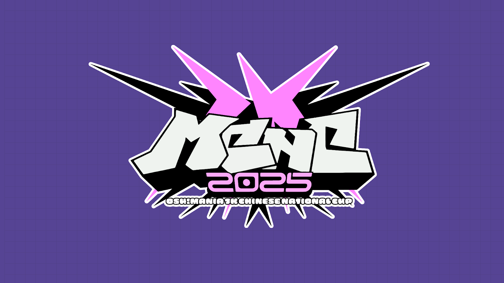

---
tags:
  - MCNC2025
  - MCNC 2025
  - MCNC7K 2025
  - MCNC 7K 2025
---

# osu!mania 7K Chinese National Cup 2025

The **osu!mania 7K Chinese National Cup 2025** (***MCNC 7K 2025***) was a country-based osu!mania 7K tournament hosted by the \[Crz\]Team.

## Tournament schedule

| Event | Timestamp |
| --: | :-- |
| Registration phase | 2024-11-15/2024-12-15 |
| Qualifier mappool showcase | 2024-12-21 |
| Qualifiers | 2024-12-28/2024-12-29 |
| Play-off | 2025-01-04/2025-01-05 |
| Round of 32 | 2025-01-11/2025-01-12 |
| Round of 16 | 2025-01-18/2025-01-19 |
| Quarterfinals | 2025-01-25/2025-01-26 |
| Semifinals | 2025-02-01/2025-02-02 |
| Finals | 2025-02-08/2025-02-09 |
| Grand Finals | 2025-02-15/2025-02-16 |

## Prizes

| Placing | Prizes |
| :-: | :-- |
|  | Profile badge, CNY 1,440, 48% additional sponsorship prize pool, 4 months of osu!supporter |
|  | CNY 960, 32% additional sponsorship prize pool, 2 months of osu!supporter |
|  | CNY 600, 20% additional sponsorship prize pool, 1 months of osu!supporter |
| 4th-32nd | CNY 30 |
| All player who passed Qualifiers | CNY 15 |

## Organisation

The osu!mania 7K Chinese National Cup 2025 was run by various community members.

| Position | Member(s) |
| :-- | :-- |
| Host | ::{ flag=CN }:: [\[Crz\]xz1z1z](https://osu.ppy.sh/users/10500832) |
| Referees | ::{ flag=CN }:: [MidRed](https://osu.ppy.sh/users/17641994), ::{ flag=CN }:: [\[Crz\]Alleyne](https://osu.ppy.sh/users/11279273), ::{ flag=CN }:: [cdwcgt](https://osu.ppy.sh/users/14721101), ::{ flag=HK }:: [wanderloop](https://osu.ppy.sh/users/13858681), ::{ flag=CN }:: [Rush\_FTK](https://osu.ppy.sh/users/3046856), ::{ flag=CN }:: [\[Crz\]xz1z1z](https://osu.ppy.sh/users/10500832), ::{ flag=CN }:: [\[Crz\]Makii](https://osu.ppy.sh/users/5242158), ::{ flag=CN }:: [Xu seventeen](https://osu.ppy.sh/users/8781662), ::{ flag=CN }:: [FenggeTGOB](https://osu.ppy.sh/users/35928532), ::{ flag=CN }:: [AelSan](https://osu.ppy.sh/users/14095291), ::{ flag=CN }:: [Shiki-Natsume](https://osu.ppy.sh/users/6338477), ::{ flag=CN }:: [Azureus](https://osu.ppy.sh/users/6938658), ::{ flag=CN }:: [Mrhbyy](https://osu.ppy.sh/users/16491593) |
| Mappoolers | ::{ flag=CN }:: [\_Stan](https://osu.ppy.sh/users/1653229)*, ::{ flag=CN }:: [\[Crz\]Satori](https://osu.ppy.sh/users/7082178), ::{ flag=CN }:: [tyrcs](https://osu.ppy.sh/users/13026904), ::{ flag=CN }:: [ExNeko](https://osu.ppy.sh/users/7590894), ::{ flag=CN }:: [U1d](https://osu.ppy.sh/users/10125072) |
| Custom mappers | ::{ flag=CN }:: [\_Stan](https://osu.ppy.sh/users/1653229), ::{ flag=CN }:: [\[Crz\]Satori](https://osu.ppy.sh/users/7082178), ::{ flag=CN }:: [tyrcs](https://osu.ppy.sh/users/13026904), ::{ flag=CN }:: [ExNeko](https://osu.ppy.sh/users/7590894), ::{ flag=CN }:: [U1d](https://osu.ppy.sh/users/10125072), ::{ flag=CN }:: [- Inaba Meguru](https://osu.ppy.sh/users/14767969), ::{ flag=CN }:: [Seiran-](https://osu.ppy.sh/users/14351534), ::{ flag=CN }:: [Telzzxs](https://osu.ppy.sh/users/10210497), ::{ flag=CN }:: [Muses](https://osu.ppy.sh/users/9705896), ::{ flag=MY }:: [Critical\_Star](https://osu.ppy.sh/users/3793196), ::{ flag=CN }:: [BKwind](https://osu.ppy.sh/users/8900975), ::{ flag=AU }:: [ruka](https://osu.ppy.sh/users/6117525), ::{ flag=KR }:: [taba2](https://osu.ppy.sh/users/7850508), ::{ flag=HK }:: [pwhk](https://osu.ppy.sh/users/4887865) |
| Streamers | ::{ flag=CN }:: [MidRed](https://osu.ppy.sh/users/17641994), ::{ flag=CN }:: [\[Crz\]Alleyne](https://osu.ppy.sh/users/11279273), ::{ flag=CN }:: [cdwcgt](https://osu.ppy.sh/users/14721101), ::{ flag=CN }:: [Rush\_FTK](https://osu.ppy.sh/users/3046856), ::{ flag=CN }:: [Mrhbyy](https://osu.ppy.sh/users/16491593), ::{ flag=CN }:: [Kieran\_](https://osu.ppy.sh/users/11264367), ::{ flag=CN }:: [\[Crz\]xz1z1z](https://osu.ppy.sh/users/10500832), ::{ flag=CN }:: [Azureus](https://osu.ppy.sh/users/6938658) |
| Commentators | ::{ flag=CN }:: [\[Crz\]xz1z1z](https://osu.ppy.sh/users/10500832), ::{ flag=CN }:: [\[Crz\]Satori](https://osu.ppy.sh/users/7082178), ::{ flag=CN }:: [U1d](https://osu.ppy.sh/users/10125072), ::{ flag=CN }:: [\_Yiiiii](https://osu.ppy.sh/users/6066359), ::{ flag=CN }:: [Rush\_FTK](https://osu.ppy.sh/users/3046856), ::{ flag=CN }:: [FenggeTGOB](https://osu.ppy.sh/users/35928532) |
| Graphics | ::{ flag=CN }:: [Sakura006](https://osu.ppy.sh/users/10365024)*, ::{ flag=CN }:: [Dr\_Tissues](https://osu.ppy.sh/users/5106681) |

## Links

- [Discussion thread](https://osu.ppy.sh/community/forums/topics/2001949)
- [Livestream](https://live.bilibili.com/2996250)
- [Discord server](https://discord.gg/uBHK5vq)
- [Challonge bracket](https://challonge.com/MCNC7K2025)
- **[Statistics sheet](https://docs.google.com/spreadsheets/d/e/2PACX-1vTxbtwFzPfljIdFMOXVCPyXg2qhcuutsNhriuDdFGzxxRqrEEQKAK-V9XSXka41W3YkkEcq29oomjlc/pubhtml)**

## Participants

| Seed | Player |
| :-: | :-- |
| #1 | ::{ flag=CN }:: [Watch01](https://osu.ppy.sh/users/13967954) |
| #2 | ::{ flag=CN }:: [af-](https://osu.ppy.sh/users/10512663) |
| #3 | ::{ flag=CN }:: [QingJiDing](https://osu.ppy.sh/users/10569738) |
| #4 | ::{ flag=CN }:: [VanWilder](https://osu.ppy.sh/users/89545) |
| #5 | ::{ flag=CN }:: [HxcQ777](https://osu.ppy.sh/users/18282863) |
| #6 | ::{ flag=CN }:: [\_Yiiiii](https://osu.ppy.sh/users/6066359) |
| #7 | ::{ flag=CN }:: [YuLiangSSS](https://osu.ppy.sh/users/15889644) |
| #8 | ::{ flag=CN }:: [Shenzouz](https://osu.ppy.sh/users/29606773) |
| #9 | ::{ flag=CN }:: [\[Crz\]Reimu](https://osu.ppy.sh/users/14318312) |
| #10 | ::{ flag=HK }:: [tangjinxi](https://osu.ppy.sh/users/2270126) |
| #11 | ::{ flag=TW }:: [hero\_jeff](https://osu.ppy.sh/users/3375226) |
| #12 | ::{ flag=CN }:: [\[GB\]hej\_067](https://osu.ppy.sh/users/24880938) |
| #13 | ::{ flag=CN }:: [SilentParleHorn](https://osu.ppy.sh/users/5190592) |
| #14 | ::{ flag=HK }:: [zec](https://osu.ppy.sh/users/20809032) |
| #15 | ::{ flag=CN }:: [fishbone2445](https://osu.ppy.sh/users/17640814) |
| #16 | ::{ flag=CN }:: [9eater](https://osu.ppy.sh/users/6556530) |
| #17 | ::{ flag=CN }:: [AWMRone](https://osu.ppy.sh/users/10351684) |
| #18 | ::{ flag=HK }:: [\[AR\]aLEKdexter](https://osu.ppy.sh/users/34205111) |
| #19 | ::{ flag=CN }:: [Mito Van](https://osu.ppy.sh/users/14703345) |
| #20 | ::{ flag=MO }:: [Randumbs](https://osu.ppy.sh/users/27657112) |
| #21 | ::{ flag=CN }:: [1405512654](https://osu.ppy.sh/users/9655624) |
| #22 | ::{ flag=MO }:: [idqoos123](https://osu.ppy.sh/users/3946113) |
| #23 | ::{ flag=CN }:: [quailty](https://osu.ppy.sh/users/6423914) |
| #24 | ::{ flag=CN }:: [Fate\_Yakumo](https://osu.ppy.sh/users/2660480) |
| #25 | ::{ flag=CN }:: [DannyXLee](https://osu.ppy.sh/users/13847712) |
| #26 | ::{ flag=CN }:: [-\[Ulazis\]-](https://osu.ppy.sh/users/11144363) |
| #27 | ::{ flag=CN }:: [80zero](https://osu.ppy.sh/users/12301332) |
| #28 | ::{ flag=TW }:: [vvvxx](https://osu.ppy.sh/users/30220646) |
| #29 | ::{ flag=CN }:: [just a GRJ](https://osu.ppy.sh/users/29957843) |
| #30 | ::{ flag=CN }:: [BlueHaze](https://osu.ppy.sh/users/6300700) |
| #31 | ::{ flag=CN }:: [AsahinaMikuru](https://osu.ppy.sh/users/25696729) |
| #32 | ::{ flag=CN }:: [SnowySummer](https://osu.ppy.sh/users/14265994) |
| #33 | ::{ flag=CN }:: [Wind God Boy](https://osu.ppy.sh/users/3003417) |
| #34 | ::{ flag=CN }:: [shadiaojunshi](https://osu.ppy.sh/users/29165753) |
| #35 | ::{ flag=CN }:: [Solitary\_Dream](https://osu.ppy.sh/users/32367206) |
| #36 | ::{ flag=CN }:: [\[GB\]R-Trigger](https://osu.ppy.sh/users/25308131) |
| #37 | ::{ flag=CN }:: [WhiteArrow3](https://osu.ppy.sh/users/31646715) |
| #38 | ::{ flag=CN }:: [chuang1227](https://osu.ppy.sh/users/16770943) |
| #39 | ::{ flag=XX }:: [koi7iii](https://osu.ppy.sh/users/30205667) |
| #40 | ::{ flag=CN }:: [Myon\_299792458](https://osu.ppy.sh/users/27074502) |
| #41 | ::{ flag=CN }:: [YOKUNANA](https://osu.ppy.sh/users/34340319) |
| #42 | ::{ flag=CN }:: [Ist1na](https://osu.ppy.sh/users/34131786) |
| #43 | ::{ flag=CN }:: [YuuOoo](https://osu.ppy.sh/users/33970648) |
| #44 | ::{ flag=CN }:: [UU9](https://osu.ppy.sh/users/32339039) |
| #45 | ::{ flag=CN }:: [Samyuan1216](https://osu.ppy.sh/users/23892945) |
| #46 | ::{ flag=CN }:: [6XvX7](https://osu.ppy.sh/users/33948486) |
| #47 | ::{ flag=CN }:: [Postal0177](https://osu.ppy.sh/users/32263201) |
| #48 | ::{ flag=CN }:: [-fm777-](https://osu.ppy.sh/users/30122510) |
| #49 | ::{ flag=CN }:: [rainwindy](https://osu.ppy.sh/users/29722362) |
| #50 | ::{ flag=CN }:: [06d](https://osu.ppy.sh/users/24603751) |
| #51 | ::{ flag=CN }:: [Lzq12345](https://osu.ppy.sh/users/15012640) |
| #52 | ::{ flag=CN }:: [renyu2018](https://osu.ppy.sh/users/33620269) |
| #53 | ::{ flag=CN }:: [meisaidingli](https://osu.ppy.sh/users/20176061) |
| #54 | ::{ flag=CN }:: [ReanimateS](https://osu.ppy.sh/users/6476722) |

### Podium

This competition has come to an end and resulted in the following podium:

| Placing | Player |
| :-: | :-- |
|  | ::{ flag=CN }:: [QingJiDing](https://osu.ppy.sh/users/10569738) |
|  | ::{ flag=CN }:: [VanWilder](https://osu.ppy.sh/users/89545) |
|  | ::{ flag=CN }:: [af-](https://osu.ppy.sh/users/10512663) |

## Mappools

### Grand Finals

**[Download the mappack here! (105 MB)](https://drive.google.com/file/d/1nGVwz3CkVO34zVnW90iaFnuUANc1qsY6/view?usp=sharing)**

- Rice
  1. [Alicemetix feat. Kasane Teto - Unclearness (BKwind) \[Tetoflip+\]](https://osu.ppy.sh/beatmapsets/2321807#mania/4974383)
  2. [Plum - Dustwind (\_Stan) \[Deshope\]](https://osu.ppy.sh/beatmapsets/2321808#mania/4974384)
  3. [Imy - Countdown (ExNeko) \[Cero\]](https://osu.ppy.sh/beatmapsets/2321767#mania/4974249)
  4. [Kankitsu - Prayer (BKwind) \[Light+\]](https://osu.ppy.sh/beatmapsets/2321803#mania/4974375)
  5. [MONOLITH feat.FG75 - Miyako (BKwind) \[mono\]](https://osu.ppy.sh/beatmapsets/2321805#mania/4974379)
  6. [19B4 - 909-Sym (tyrcs) \[Discordantly\]](https://osu.ppy.sh/beatmapsets/2321802#mania/4974373)
  7. [l'avenir proche - subglacial flux; arboretum titanum (pwhk) \[absolute zero;\]](https://osu.ppy.sh/beatmapsets/2321776#mania/4974271)
- Long Note
  1. [a\*ru - Kizuato (- Inaba Meguru) \[CheDiFengKuang\]](https://osu.ppy.sh/beatmapsets/2321778#mania/4974278)
  2. [uma - In Chaos -biggest mix- (tyrcs) \[Ecstatic (edit)\]](https://osu.ppy.sh/beatmapsets/2321806#mania/4974380)
  3. [Umeboshi Chazuke - Galaxy in Toybox (Muses) \[supercalifragilisticexpialidocious (MCNC Edit)\]](https://osu.ppy.sh/beatmapsets/2321772#mania/4974265)
  4. [YOASOBI - Love Letter (\[Crz\]xz1z1z) \[Pengdoll & zenonia5's Daisukidayo (OD5 190bpm)\]](https://osu.ppy.sh/beatmapsets/2321832#mania/4974446)
  5. [School Food Punishment - RPG (yellEx) \[OD5\]](https://osu.ppy.sh/beatmapsets/1763338#mania/4975059)
- Hybrid
  1. [Rahatt - Matusa Bomber (tyrcs) \[Clamour (210bpm)\]](https://osu.ppy.sh/beatmapsets/2321809#mania/4974386)
  2. [An - Cochma (ruka) \[Eterna\]](https://osu.ppy.sh/beatmapsets/2321800#mania/4974371)
  3. [Isekaijoucho - Adipocere (U1d) \[Melting // U1d vs. tyrcs\]](https://osu.ppy.sh/beatmapsets/2321817#mania/4974416)
- Tiebreaker
  1. **[Kou! - A.O.E::area\_of\_effect (\_Stan) \[F.I.N::finale\_in\_nightmare\]](https://osu.ppy.sh/beatmapsets/2321798#mania/4974366)**

### Finals

**[Download the mappack here! (93 MB)](https://drive.google.com/file/d/1jp17GuOOWwIF4c5MR2kMokguzcF9QeKM/view?usp%3Dsharing)**

- Rice
  1. [lapix - Our Love \[Breath (BKwind) \[MCNC edit\]\]](https://osu.ppy.sh/beatmapsets/2318380#mania/4965578)
  2. [Kobaryo - Transceiver FX (\_Stan) \[Module EX\]](https://osu.ppy.sh/beatmapsets/2318389#mania/4965593)
  3. [Kano - Yuudachi no Ribbon (ExNeko) \[Rainy\]](https://osu.ppy.sh/beatmapsets/2318352#mania/4965525)
  4. [Kyuzo Sameura feat. Kiritan - ceu \[luz (BKwind) \[MCNC edit\]\]](https://osu.ppy.sh/beatmapsets/2318383#mania/4965582)
  5. [Euphoria Guru with Sobrem - There (tyrcs) \[Therefore\]](https://osu.ppy.sh/beatmapsets/2318365#mania/4965555)
  6. [Camellia - Dyscontrolled Galaxy (\[Crz\]Satori) \[MXM\]](https://osu.ppy.sh/beatmapsets/2318364#mania/4965552)
  7. [Gram - Sigmund (The Requiem's Extended MIX) (BKwind) \[LAST BOSS\]](https://osu.ppy.sh/beatmapsets/2318379#mania/4965577)
- Long Note
  1. [Penguin One - Tsuki (ExNeko) \[Finale\]](https://osu.ppy.sh/beatmapsets/2318353#mania/4965526)
  2. [Hachi - Donut Hole (U1d) \[Temptrend // U1d vs. tyrcs\]](https://osu.ppy.sh/beatmapsets/2318372#mania/4965563)
  3. [Billain - Boogie (Cut Ver.) (\[Crz\]xz1z1z) \[Flexo123's FlexCORE!@# (195bpm edit)\]](https://osu.ppy.sh/beatmapsets/2318387#mania/4965588)
  4. [AliA - impulse (Enie) \[Catalyst\]](https://osu.ppy.sh/beatmapsets/1910744#mania/3941263)
  5. [Atarayo - "Boku wa..." (emO\_Oticon) \[Reciprocate\]](https://osu.ppy.sh/beatmapsets/2183726#mania/4614498)
- Hybrid
  1. [SEPHID - Critical Cannonball (tyrcs) \[Fullfire\]](https://osu.ppy.sh/beatmapsets/2318367#mania/4965557)
  2. [ProjectG - Unchosen (tyrcs) \[Unneeded\]](https://osu.ppy.sh/beatmapsets/2318374#mania/4965567)
  3. [Camellia - Kamah (Leeju) \[Leeju's 7K Syphoning Souls +\]](https://osu.ppy.sh/beatmapsets/1558744#mania/3459278)
- Tiebreaker
  1. **[ikaruga\_nex vs. Kagetora. - Grabinschrift der Goetter (U1d) \[R.I.P::rest\_in\_peace\]](https://osu.ppy.sh/beatmapsets/2318366#mania/4965556)**

### Semifinals

**[Download the mappack here! (78 MB)](https://drive.google.com/file/d/1pStqj5qEhNBOOGJMHVDDIocv7NvCHiKR/view?usp%3Dsharing)**

- Rice
  1. [Hakkadou Ryuu - Ranten (BKwind) \[LIQUID+\]](https://osu.ppy.sh/beatmapsets/2314092#mania/4952173)
  2. [BlackY - GODHEART (Extended Mix) (\[Crz\]Satori) \[GOD (186bpm)\]](https://osu.ppy.sh/beatmapsets/2314109#mania/4952213)
  3. [OISHII - ONIGIRI FREEWAY (\_Stan) \[SHOOT\]](https://osu.ppy.sh/beatmapsets/2314086#mania/4952160)
  4. [NewJeans - ETA (ExNeko) \[dive\]](https://osu.ppy.sh/beatmapsets/2314080#mania/4952153)
  5. [Kanzakishion - Palette Lab (pwhk) \[CIE\*\]](https://osu.ppy.sh/beatmapsets/2314363#mania/4952767)
  6. [qfeileadh + Kudomu Shirome - MESMERA (BKwind) \[IMMERSION\]](https://osu.ppy.sh/beatmapsets/2314096#mania/4952177)
- Long Note
  1. [Nekoro ruru - Loveit? (ExNeko) \[bloody parfait\]](https://osu.ppy.sh/beatmapsets/2314081#mania/4952154)
  2. [Kashii Moimi feat. HARU - Murasakiiro no Himawari (ExNeko) \[Limerence.\]](https://osu.ppy.sh/beatmapsets/2314083#mania/4952157)
  3. [aran - Maholova (- Inaba Meguru) \[alan\]](https://osu.ppy.sh/beatmapsets/2314089#mania/4952169)
  4. [Frog96 - light switch defective (tyrcs) \[object Object\]](https://osu.ppy.sh/beatmapsets/2314110#mania/4952215)
- Hybrid
  1. [callasoiled - FUELBLOODS (tyrcs) \[Combustion\]](https://osu.ppy.sh/beatmapsets/2314113#mania/4952218)
  2. [Feryquitous vs. Laur - Arghena (U1d) \[Pluriversality\]](https://osu.ppy.sh/beatmapsets/2314111#mania/4952216)
  3. [Hexacube - HIT!! (U1d) \[PREFECT!!\]](https://osu.ppy.sh/beatmapsets/2314112#mania/4952217)
- Tiebreaker
  1. **[Project-G - Chronokinesia (Xykrome) (tyrcs) \[Time Crystal\]](https://osu.ppy.sh/beatmapsets/2314115#mania/4952227)**

### Quarterfinals

**[Download the mappack here! (73 MB)](https://drive.google.com/file/d/1Lh8wF1FhC8_NErxwPn5oDqHuRdyzRvFb/view?usp%3Dsharing)**

- Rice
  1. [otoshi.b - Journey to the infBIT World (Telzzxs) \[Whirlwind (edit)\]](https://osu.ppy.sh/beatmapsets/2310463#mania/4942779)
  2. [P\*Light - Nocturnal (U1d) \[aoyeguanjun ^^\]](https://osu.ppy.sh/beatmapsets/2310476#mania/4942816)
  3. [Reku Mochizuki - KiNG FORM -XIII- (\[Crz\]Alleyne) \[God Demeanor\]](https://osu.ppy.sh/beatmapsets/2310468#mania/4942788)
  4. [Kirara Magic - Aquatic (ExNeko) \[Ethereal\]](https://osu.ppy.sh/beatmapsets/2310449#mania/4942761)
  5. [Supire - Nebula (U1d) \[Exile\]](https://osu.ppy.sh/beatmapsets/2310477#mania/4942817)
  6. [MoVIIkA - Ms. Steam (BKwind) \[Cryptic+\]](https://osu.ppy.sh/beatmapsets/2310497#mania/4942859)
- Long Note
  1. [idealism - nagashi (- Inaba Meguru) \[fantome\]](https://osu.ppy.sh/beatmapsets/2310466#mania/4942785)
  2. [Jay Chou - Piano of Sorrow (ExNeko) \[Elapse\]](https://osu.ppy.sh/beatmapsets/2310452#mania/4942764)
  3. [Tyrfing - Verflucht (tyrcs) \[Maelstrom\]](https://osu.ppy.sh/beatmapsets/2310469#mania/4942789)
  4. [HOYO-MiX feat. Robin (VO: Chevy) - Hope Is the Thing With Feathers (- Inaba Meguru) \[Robin\]](https://osu.ppy.sh/beatmapsets/2310482#mania/4942825)
- Hybrid
  1. [Naisho no Piasu - Propose (Cut Ver.) (ExNeko) \[sehnsucht\]](https://osu.ppy.sh/beatmapsets/2310453#mania/4942765)
  2. [Sharks/Chime - Water Elemental (U1d) \[Dehydrated\]](https://osu.ppy.sh/beatmapsets/2310473#mania/4942806)
  3. [Kyotsugyon - :3c (tyrcs) \[:x\]](https://osu.ppy.sh/beatmapsets/2310471#mania/4942803)
- Tiebreaker
  1. **[Yuuyu - in the Ragnarok (tyrcs) \[Terminus\]](https://osu.ppy.sh/beatmapsets/2310474#mania/4942807)**

### Round of 16

**[Download the mappack here! (55 MB)](https://drive.google.com/file/d/1ZnMWVVMuxcb4lI-eZqZpQGIR_iCTnoQ2/view?usp%3Dsharing)**

- Rice
  1. [Andy Lau - Gong Xi Fa Cai (U1d) \[Xin Nian Kuai Le!!! (MCNC Edit)\]](https://osu.ppy.sh/beatmapsets/2307199#mania/4934505)
  2. [SOMON - E.V.E (pwhk) \[S.R.C - Self Rewriting Code\]](https://osu.ppy.sh/beatmapsets/2307446#mania/4934967)
  3. [An - LittleGameStar (Maxus) \[Reminiscence\]](https://osu.ppy.sh/beatmapsets/2307219#mania/4934554)
  4. [orchid mantis - Altered Plains (tyrcs) \[Vision (edit)\]](https://osu.ppy.sh/beatmapsets/2307198#mania/4934502)
  5. [iyowa feat. Hatsune Miku - apricot (Cut Ver.) (ExNeko) \[fragmented\]](https://osu.ppy.sh/beatmapsets/2307195#mania/4934498)
- Long Note
  1. [Yin Lin & Aki A Jie - Qian Si Xi (ExNeko) \[wish\]](https://osu.ppy.sh/beatmapsets/2307196#mania/4934499)
  2. [RiraN vs Rave\_Cyanide - Blizzard (- Inaba Meguru) \[600jiezoushuijing Nerf\]](https://osu.ppy.sh/beatmapsets/2307206#mania/4934526)
  3. [Isekaijoucho - Hydrangea (tyrcs) \[Remembrance (edit)\]](https://osu.ppy.sh/beatmapsets/2307202#mania/4934517)
- Hybrid
  1. [Rokugen Alice - Statice ga Nemuru oka (Cut Ver.) (ExNeko) \[Lie\]](https://osu.ppy.sh/beatmapsets/2307197#mania/4934500)
  2. [Ludicin - Signal (Muses) \[Glitch\]](https://osu.ppy.sh/beatmapsets/2307192#mania/4934491)
  3. [tn-shi - Cyberfantasia (tyrcs) \[Spectacle (edit)\]](https://osu.ppy.sh/beatmapsets/2307203#mania/4934520)
- Tiebreaker
  1. **[Isekaijoucho - Soshite Shiro ni Kaeru (U1d) \[Nihility\]](https://osu.ppy.sh/beatmapsets/2307200#mania/4934514)**

### Round of 32

**[Download the mappack here! (51 MB)](https://drive.google.com/file/d/1fqiWMIN0dNKdBiV9kfb2vc-kWueB64aP/view?usp%3Dsharing)**

- Rice
  1. [Dave Wang - Sad 1999 (Cut Ver.) (U1d) \[Withered (MCNC Edit)\]](https://osu.ppy.sh/beatmapsets/2303923#mania/4924750)
  2. [cygnus - Tree of Misery (tyrcs) \[Labyrinth\]](https://osu.ppy.sh/beatmapsets/2303919#mania/4924741)
  3. [Suzuki Konomi - Realize (TV Size) (\[Crz\]Satori) \[Retry\]](https://osu.ppy.sh/beatmapsets/2303916#mania/4924736)
  4. [BilliumMoto/Kurokotei/Sobrem/Vally.exe - Overjoy \* OVERDOSE!! (BKwind) \[EXTACY\]](https://osu.ppy.sh/beatmapsets/2303920#mania/4924746)
  5. [Wugui sui & Ai Pi Xiong - Quan Yu Tian Xia (ExNeko) \[Insane\]](https://osu.ppy.sh/beatmapsets/2303911#mania/4924727)
- Long Note
  1. [Vae - Mei Gui Hua De Zang Li (ExNeko) \[roseo\]](https://osu.ppy.sh/beatmapsets/2303913#mania/4924732)
  2. [Watahana Ame - Dubidubidu (ExNeko) \[catJAM\]](https://osu.ppy.sh/beatmapsets/2303914#mania/4924733)
  3. [Remixed by BACO feat. Emew - Halcyon -MY INTERPRETATION- (tyrcs) \[Departure\]](https://osu.ppy.sh/beatmapsets/2303917#mania/4924738)
- Hybrid
  1. [vivid undress - HAYARU YOROHIYA (U1d) \[ww (MCNC Edit)\]](https://osu.ppy.sh/beatmapsets/2303921#mania/4924747)
  2. [KOTONOHOUSE - Creepy pasta (feat. Panno Mimimi) (U1d) \[rairai (MCNC Edit)\]](https://osu.ppy.sh/beatmapsets/2303924#mania/4924752)
  3. [Corpe\_ - Earthquake!!! (Irone OSU) \[Grootslang Wyrmling (Edit)\]](https://osu.ppy.sh/beatmapsets/2303925#mania/4924755)
- Tiebreaker
  1. **[KikuoHana - Nobore! Susume! Takai Tou (\_Stan) \[Endless Babel\]](https://osu.ppy.sh/beatmapsets/2303926#mania/4924757)**

### Play-off

**[Download the mappack here! (38 MB)](https://drive.google.com/file/d/1UAo0Ph-9N83wHFdZ4OZ6OgtFbzIyqKQJ/view?usp%3Dsharing)**

- Rice
  1. [SHIKI - cold breath (Telzzxs) \[Spotless\]](https://osu.ppy.sh/beatmapsets/2300475#mania/4916070)
  2. [HARETOKIDOKI - Secret Rouge (BKwind) \[Scarlet+\]](https://osu.ppy.sh/beatmapsets/2300563#mania/4916251)
  3. [SHALE - Micro Hazard (tyrcs) \[Micro Adventure\]](https://osu.ppy.sh/beatmapsets/2300471#mania/4916065)
  4. [mafumafu - Venom (ExNeko) \[me\]](https://osu.ppy.sh/beatmapsets/2300469#mania/4916063)
- Long Note
  1. [iZumi - Wo Hui Deng (ExNeko) \[LN\]](https://osu.ppy.sh/beatmapsets/2300470#mania/4916064)
  2. [Phoenix Legend - Zi You Zi Zai (ExNeko) \[meigo\]](https://osu.ppy.sh/beatmapsets/2300472#mania/4916066)
  3. [t+pazolite - Our Wrenally (tyrcs) \[Owari (edit)\]](https://osu.ppy.sh/beatmapsets/2300473#mania/4916067)
- Hybrid
  1. [MYUKKE. - Clout da Exp!!! (\_Stan) \[Level Up!!!\]](https://osu.ppy.sh/beatmapsets/2300832#mania/4916987)
  2. [Jun Kuroda feat. mirto - Ai yori Aoi Shoukei (\_Kobii) \[Ephemeral\]](https://osu.ppy.sh/beatmapsets/2300465#mania/4916052)
- Tiebreaker
  1. **[Naganuma Kuuta (Papa Ganbarimashita) - Eternal calm (Samba mix) (pwhk) \[Take a deep breath. (MCNC Edit.)\]](https://osu.ppy.sh/beatmapsets/2300495#mania/4916120)**

### Qualifiers

**[Download the mappack here! (37 MB)](https://drive.google.com/file/d/1wFNrPTrxK9zpWoVGJWL5UCK8gUk4pbWA/view?usp%3Dsharing)**

- Free Mod
  1. [Kocchi no Kento feat. Hatsune Miku - Hai Yorokonde (Magens Remix) (U1d) \[Stage 1: Gotisousama\]](https://osu.ppy.sh/beatmapsets/2296852#mania/4905922)
  2. [Ujico\* - Ao no doukutsu (BKwind) \[Stage 2: Aquarium\]](https://osu.ppy.sh/beatmapsets/2296608#mania/4905214)
  3. [Hundotte & BilliumMoto - Fever Dream (\_Stan) \[Stage 3: Ecstasy\]](https://osu.ppy.sh/beatmapsets/2296604#mania/4905208)
  4. [nyamura - You Are My Curse (Seiran-) \[Stage 4: Desolate\]](https://osu.ppy.sh/beatmapsets/2296677#mania/4905359)
  5. [Harumaki Gohan feat. Hatsune Miku - Empurple (ExNeko) \[Stage 5: and "Purple"\]](https://osu.ppy.sh/beatmapsets/2296599#mania/4905199)
  6. [Getty - Are You Ready (taba2) \[Stage 6: U READY\]](https://osu.ppy.sh/beatmapsets/2296606#mania/4905210)
  7. [96NEKO - Volt Tackle (Muses) \[Stage 7: pikachuuu :<\]](https://osu.ppy.sh/beatmapsets/2296633#mania/4905268)
  8. [Masanori Akita - Gekkouka (Telzzxs) \[Stage 8: Cadenza\]](https://osu.ppy.sh/beatmapsets/2296601#mania/4905201)
  9. [Seagull - ADONIS (tyrcs) \[Stage 9: KRAKEN\]](https://osu.ppy.sh/beatmapsets/2296598#mania/4905198)

## Match results

### Grand Finals

Detailed statistics for this round can be found [here](https://docs.google.com/spreadsheets/d/e/2PACX-1vQAvgQFdStWZPJzO3cJ7QP5R6VZPJ5c04xycBX07qtGaU792iNwpIvHFr6sZFJnXDsPG0Ma6Xu93ylx/pubhtml).

Saturday, 15 February 2025:

| ID | Player 1 |  |  | Player 2 | Match link | VOD link |
| :-: | --: | :-: | :-: | :-- | :-- | :-- |
| 61 | af- | 6 | **7** | **QingJiDing** | [#1](https://osu.ppy.sh/community/matches/117182855) | [#1](https://www.bilibili.com/video/BV15nwSe8E4M) |

Sunday, 16 February 2025:

| ID | Player 1 |  |  | Player 2 | Match link | VOD link |
| :-: | --: | :-: | :-: | :-- | :-- | :-- |
| 62 | VanWilder | 4 | **7** | **QingJiDing** | [#1](https://osu.ppy.sh/community/matches/117198061) | [#1](https://www.bilibili.com/video/BV15nwSe8E4M?p=2) |
| 63 | **QingJiDing** | **7** | 6 | VanWilder | [#1](https://osu.ppy.sh/community/matches/117199225) | [#1](https://www.bilibili.com/video/BV15nwSe8E4M?p=3) |

### Finals

Detailed statistics for this round can be found [here](https://docs.google.com/spreadsheets/d/e/2PACX-1vSS6Rz5c3zpo_jKOD884QMfSDaU1x6RF0xATrueAJH-IutLc1KX9tzAIpBHSie4ZCMxMG2pilaWpVur/pubhtml).

Saturday, 8 February 2025:

| ID | Player 1 |  |  | Player 2 | Match link | VOD link |
| :-: | --: | :-: | :-: | :-- | :-- | :-- |
| 57 | **Watch01** | **7** | 2 | tangjinxi | [#1](https://osu.ppy.sh/community/matches/117098250) | [#1](https://www.bilibili.com/video/BV1pNNoevEux) |
| 60 | **VanWilder** | **7** | 4 | af- | [#1](https://osu.ppy.sh/community/matches/117101095) | [#1](https://www.bilibili.com/video/BV1pNNoevEux?p=4) |
| 58 | zec | 0 | **7** | **QingJiDing** | [#1](https://osu.ppy.sh/community/matches/117102571) | [#1](https://www.bilibili.com/video/BV1pNNoevEux?p=2) |

Sunday, 9 February 2025:

| ID | Player 1 |  |  | Player 2 | Match link | VOD link |
| :-: | --: | :-: | :-: | :-- | :-- | :-- |
| 59 | **QingJiDing** | **7** | 6 | Watch01 | [#1](https://osu.ppy.sh/community/matches/117115929) | [#1](https://www.bilibili.com/video/BV1pNNoevEux?p=3) |

### Semifinals

Detailed statistics for this round can be found [here](https://docs.google.com/spreadsheets/d/e/2PACX-1vQ9TX_GEMSlR9qC8wQFooi6mZw3degk0rTuOzY4F5HQPR3boSeG0Pgxco6NRNwOSQ_JswZ9JyFs5brq/pubhtml).

Saturday, 1 February 2025:

| ID | Player 1 |  |  | Player 2 | Match link | VOD link |
| :-: | --: | :-: | :-: | :-- | :-- | :-- |
| 49 | **[Crz]Reimu** | **6** | 0 | fishbone2445 | [#1](https://osu.ppy.sh/community/matches/117021476) | [#1](https://www.bilibili.com/video/BV1JDPDe1ENc) |
| 50 | HxcQ777 | 2 | **6** | **QingJiDing** | [#1](https://osu.ppy.sh/community/matches/117021508) | [#1](https://www.bilibili.com/video/BV1JDPDe1ENc?p=2) |
| 56 | **af-** | **6** | 0 | zec | [#1](https://osu.ppy.sh/community/matches/117022098) | [#1](https://www.bilibili.com/video/BV1JDPDe1ENc?p=8) |

Sunday, 2 February 2025:

| ID | Player 1 |  |  | Player 2 | Match link | VOD link |
| :-: | --: | :-: | :-: | :-- | :-- | :-- |
| 51 | **tangjinxi** | **6** | 5 | Shenzouz | [#1](https://osu.ppy.sh/community/matches/117032204) | [#1](https://www.bilibili.com/video/BV1JDPDe1ENc?p=3) |
| 52 | _Yiiiii | 4 | **6** | **[GB]hej_067** | [#1](https://osu.ppy.sh/community/matches/117032210) | [#1](https://www.bilibili.com/video/BV1JDPDe1ENc?p=4) |
| 53 | **QingJiDing** | **6** | 2 | [Crz]Reimu | [#1](https://osu.ppy.sh/community/matches/117035350) | [#1](https://www.bilibili.com/video/BV1JDPDe1ENc?p=5) |
| 55 | Watch01 | 1 | **6** | **VanWilder** | [#1](https://osu.ppy.sh/community/matches/117036008) | [#1](https://www.bilibili.com/video/BV1JDPDe1ENc?p=7) |

Monday, 3 February 2025:

| ID | Player 1 |  |  | Player 2 | Match link | VOD link |
| :-: | --: | :-: | :-: | :-- | :-- | :-- |
| 54 | [GB]hej_067 | 5 | **6** | **tangjinxi** | [#1](https://osu.ppy.sh/community/matches/117047851) | [#1](https://www.bilibili.com/video/BV1JDPDe1ENc?p=6) |

### Quarterfinals

Detailed statistics for this round can be found [here](https://docs.google.com/spreadsheets/d/e/2PACX-1vSXiC8BV5Ocz7iSibpsdrjTTAuN74rwcBIVcLDJ0M2a7lC0ftIk7-s2ta0o5AlMSOP5racUvFXSJzd3/pubhtml).

Wednesday, 22 January 2025:

| ID | Player 1 |  |  | Player 2 | Match link | VOD link |
| :-: | --: | :-: | :-: | :-- | :-- | :-- |
| 38 | YuLiangSSS | -1 | **0** | **Randumbs** | - |  |
| 33 | 9eater | 1 | **6** | **hero_jeff** | [#1](https://osu.ppy.sh/community/matches/116903514) | [#1](https://www.bilibili.com/video/BV1JdfYYDEfr) |
| 37 | **fishbone2445** | **6** | 2 | 1405512654 | [#1](https://osu.ppy.sh/community/matches/116903539) | [#1](https://www.bilibili.com/video/BV1JdfYYDEfr?p=5) |
| 39 | **QingJiDing** | **6** | 0 | Myon_299792458 | [#1](https://osu.ppy.sh/community/matches/116903792) | [#1](https://www.bilibili.com/video/BV1JdfYYDEfr?p=6) |
| 40 | idqoos123 | 0 | **6** | **AWMRone** | [#1](https://osu.ppy.sh/community/matches/116904078) | [#1](https://www.bilibili.com/video/BV1JdfYYDEfr?p=7) |

Thursday, 23 January 2025:

| ID | Player 1 |  |  | Player 2 | Match link | VOD link |
| :-: | --: | :-: | :-: | :-- | :-- | :-- |
| 43 | Randumbs | 3 | **6** | **fishbone2445** | [#1](https://osu.ppy.sh/community/matches/116914603) | [#1](https://www.bilibili.com/video/BV1JdfYYDEfr?p=10) |
| 44 | AWMRone | 2 | **6** | **QingJiDing** | [#1](https://osu.ppy.sh/community/matches/116915201) | [#1](https://www.bilibili.com/video/BV1JdfYYDEfr?p=11) |

Friday, 24 January 2025:

| ID | Player 1 |  |  | Player 2 | Match link | VOD link |
| :-: | --: | :-: | :-: | :-- | :-- | :-- |
| 47 | **af-** | **6** | 2 | tangjinxi | [#1](https://osu.ppy.sh/community/matches/116926313) | [#1](https://www.bilibili.com/video/BV1JdfYYDEfr?p=14) |

Saturday, 25 January 2025:

| ID | Player 1 |  |  | Player 2 | Match link | VOD link |
| :-: | --: | :-: | :-: | :-- | :-- | :-- |
| 48 | **zec** | **6** | 2 | _Yiiiii | [#1](https://osu.ppy.sh/community/matches/116937086) | [#1](https://www.bilibili.com/video/BV1JdfYYDEfr?p=15) |
| 34 | **Shenzouz** | **6** | 0 | Mito Van | [#1](https://osu.ppy.sh/community/matches/116938516) | [#1](https://www.bilibili.com/video/BV1JdfYYDEfr?p=2) |
| 46 | **VanWilder** | **6** | 4 | HxcQ777 | [#1](https://osu.ppy.sh/community/matches/116939045) | [#1](https://www.bilibili.com/video/BV1JdfYYDEfr?p=13) |
| 35 | SilentParleHorn | 4 | **6** | **-[Ulazis]-** | [#1](https://osu.ppy.sh/community/matches/116939680) | [#1](https://www.bilibili.com/video/BV1JdfYYDEfr?p=3) |
| 36 | **[GB]hej_067** | **6** | 0 | [AR]aLEKdexter | [#1](https://osu.ppy.sh/community/matches/116940050) | [#1](https://www.bilibili.com/video/BV1JdfYYDEfr?p=4) |

Sunday, 26 January 2025:

| ID | Player 1 |  |  | Player 2 | Match link | VOD link |
| :-: | --: | :-: | :-: | :-- | :-- | :-- |
| 41 | **Shenzouz** | **6** | 3 | hero_jeff | [#1](https://osu.ppy.sh/community/matches/116950011) | [#1](https://www.bilibili.com/video/BV1JdfYYDEfr?p=8) |
| 42 | **[GB]hej_067** | **6** | 0 | -[Ulazis]- | [#1](https://osu.ppy.sh/community/matches/116954092) | [#1](https://www.bilibili.com/video/BV1JdfYYDEfr?p=9) |
| 45 | **Watch01** | **6** | 2 | [Crz]Reimu | [#1](https://osu.ppy.sh/community/matches/116954009) | [#1](https://www.bilibili.com/video/BV1JdfYYDEfr?p=12) |

### Round of 16

Detailed statistics for this round can be found [here](https://docs.google.com/spreadsheets/d/e/2PACX-1vTKEW_ZNbpxPDslSF57s-Ds5RwUws9cSXjK412chLw_UY4k836Y680ccClzNP9YR1r7OL_aNvpuhE84/pubhtml).

Friday, 17 January 2025:

| ID | Player 1 |  |  | Player 2 | Match link | VOD link |
| :-: | --: | :-: | :-: | :-- | :-- | :-- |
| 21 | AsahinaMikuru | 1 | **5** | **[AR]aLEKdexter** | [#1](https://osu.ppy.sh/community/matches/116843650) | [#1](https://www.bilibili.com/video/BV1EwwCeEEdN?p=4) |
| 29 | **af-** | **5** | 1 | fishbone2445 | [#1](https://osu.ppy.sh/community/matches/116843634) | [#1](https://www.bilibili.com/video/BV1EwwCeEEdN?p=9) |
| 30 | YuLiangSSS | -1 | **0** | **tangjinxi** | [#1](https://osu.ppy.sh/community/matches/116843835) |  |

Saturday, 18 January 2025:

| ID | Player 1 |  |  | Player 2 | Match link | VOD link |
| :-: | --: | :-: | :-: | :-- | :-- | :-- |
| 20 | vvvxx | 1 | **5** | **1405512654** | [#1](https://osu.ppy.sh/community/matches/116853454) | [#1](https://www.bilibili.com/video/BV1EwwCeEEdN?p=2) |
| 24 | 80zero | -1 | **0** | **hero_jeff** | [#1](https://osu.ppy.sh/community/matches/116855242) |  |
| 17 | SnowySummer | -1 | **0** | **AWMRone** | [#1](https://osu.ppy.sh/community/matches/116856259) |  |
| 23 | BlueHaze | -1 | **0** | **Mito Van** | [#1](https://osu.ppy.sh/community/matches/116856234) |  |
| 26 | Shenzouz | 4 | **5** | **[Crz]Reimu** | [#1](https://osu.ppy.sh/community/matches/116856304) | [#1](https://www.bilibili.com/video/BV1EwwCeEEdN?p=7) |
| 31 | QingJiDing | 4 | **5** | **zec** | [#1](https://osu.ppy.sh/community/matches/116856973) | [#1](https://www.bilibili.com/video/BV1EwwCeEEdN?p=10) |

Sunday, 19 January 2025:

| ID | Player 1 |  |  | Player 2 | Match link | VOD link |
| :-: | --: | :-: | :-: | :-- | :-- | :-- |
| 22 | **-[Ulazis]-** | **5** | 4 | quailty | [#1](https://osu.ppy.sh/community/matches/116867754) | [#1](https://www.bilibili.com/video/BV1EwwCeEEdN?p=5) |
| 19 | Just A GRJ | 2 | **5** | **Randumbs** | [#1](https://osu.ppy.sh/community/matches/116868195) | [#1](https://www.bilibili.com/video/BV1EwwCeEEdN?p=3) |
| 27 | **VanWilder** | **0** | -1 | SilentParleHorn | [#1](https://osu.ppy.sh/community/matches/116869002) |  |
| 28 | **HxcQ777** | **5** | 1 | [GB]hej_067 | [#1](https://osu.ppy.sh/community/matches/116868946) | [#1](https://www.bilibili.com/video/BV1EwwCeEEdN?p=8) |
| 18 | **Myon_299792458** | **5** | 2 | Fate_Yakumo | [#1](https://osu.ppy.sh/community/matches/116870004) | [#1](https://www.bilibili.com/video/BV1EwwCeEEdN) |
| 25 | **Watch01** | **5** | 1 | 9eater | [#1](https://osu.ppy.sh/community/matches/116869943) | [#1](https://www.bilibili.com/video/BV1EwwCeEEdN?p=6) |
| 32 | **_Yiiiii** | **5** | 0 | idqoos123 | [#1](https://osu.ppy.sh/community/matches/116870535) | [#1](https://www.bilibili.com/video/BV1EwwCeEEdN?p=11) |

### Round of 32

Detailed statistics for this round can be found [here](https://docs.google.com/spreadsheets/d/e/2PACX-1vSShcq6Kwba8zl-4e5Il1KpZXo1Yc86oWcYzwHkad0xOgB3QRojKs7IgiF8se_zvZDC_81LDmSKsDWI/pubhtml).

Friday, 10 January 2025:

| ID | Player 1 |  |  | Player 2 | Match link | VOD link |
| :-: | --: | :-: | :-: | :-- | :-- | :-- |
| 9 | **af-** | **5** | 0 | AsahinaMikuru | [#1](https://osu.ppy.sh/community/matches/116769687) | [#1](https://www.bilibili.com/video/BV1rXcpefEHx?p=9) |
| 15 | **_Yiiiii** | **5** | 0 | 80zero | [#1](https://osu.ppy.sh/community/matches/116769699) | [#1](https://www.bilibili.com/video/BV1rXcpefEHx?p=15) |
| 2 | **9eater** | **5** | 2 | AWMRone | [#1](https://osu.ppy.sh/community/matches/116770100) | [#1](https://www.bilibili.com/video/BV1rXcpefEHx?p=2) |
| 4 | **[Crz]Reimu** | **5** | 0 | Fate_Yakumo | [#1](https://osu.ppy.sh/community/matches/116770534) | [#1](https://www.bilibili.com/video/BV1rXcpefEHx?p=4) |
| 12 | **tangjinxi** | **5** | 1 | quailty | [#1](https://osu.ppy.sh/community/matches/116770609) | [#1](https://www.bilibili.com/video/BV1rXcpefEHx?p=12) |

Saturday, 11 January 2025:

| ID | Player 1 |  |  | Player 2 | Match link | VOD link |
| :-: | --: | :-: | :-: | :-- | :-- | :-- |
| 14 | **zec** | **5** | 0 | Mito Van | [#1](https://osu.ppy.sh/community/matches/116779896) | [#1](https://www.bilibili.com/video/BV1rXcpefEHx?p=14) |
| 5 | **VanWilder** | **5** | 1 | Just A GRJ | [#1](https://osu.ppy.sh/community/matches/116780025) | [#1](https://www.bilibili.com/video/BV1rXcpefEHx?p=5) |
| 1 | **Watch01** | **5** | 0 | SnowySummer | [#1](https://osu.ppy.sh/community/matches/116781606) | [#1](https://www.bilibili.com/video/BV1rXcpefEHx) |
| 13 | **QingJiDing** | **5** | 0 | BlueHaze | [#1](https://osu.ppy.sh/community/matches/116781657) | [#1](https://www.bilibili.com/video/BV1rXcpefEHx?p=13) |
| 10 | **fishbone2445** | **5** | 1 | [AR]aLEKdexter | [#1](https://osu.ppy.sh/community/matches/116782104) | [#1](https://www.bilibili.com/video/BV1rXcpefEHx?p=10) |
| 11 | **YuLiangSSS** | **5** | 1 | -[Ulazis]- | [#1](https://osu.ppy.sh/community/matches/116782123) | [#1](https://www.bilibili.com/video/BV1rXcpefEHx?p=11) |
| 16 | hero_jeff | 2 | **5** | **idqoos123** | [#1](https://osu.ppy.sh/community/matches/116783486) | [#1](https://www.bilibili.com/video/BV1rXcpefEHx?p=16) |

Sunday, 12 January 2025:

| ID | Player 1 |  |  | Player 2 | Match link | VOD link |
| :-: | --: | :-: | :-: | :-- | :-- | :-- |
| 8 | **[GB]hej_067** | **5** | 2 | 1405512654 | [#1](https://osu.ppy.sh/community/matches/116792045) | [#1](https://www.bilibili.com/video/BV1rXcpefEHx?p=8) |
| 3 | **Shenzouz** | **5** | 0 | Myon_299792458 | [#1](https://osu.ppy.sh/community/matches/116794303) | [#1](https://www.bilibili.com/video/BV1rXcpefEHx?p=3) |
| 6 | **SilentParleHorn** | **5** | 1 | Randumbs | [#1](https://osu.ppy.sh/community/matches/116794729) | [#1](https://www.bilibili.com/video/BV1rXcpefEHx?p=6) |
| 7 | **HxcQ777** | **5** | 1 | vvvxx | [#1](https://osu.ppy.sh/community/matches/116795264) | [#1](https://www.bilibili.com/video/BV1rXcpefEHx?p=7) |

### Play-off

Detailed statistics for this round can be found [here](https://docs.google.com/spreadsheets/d/e/2PACX-1vT2GKMkmpXlB_Gf6tSmG-tBybRSBizs6gR0ui3tIVZsNQN5YvAj3PEuTczts3s6tyLz5w_Cpw63djqL/pubhtml).

Friday, 3 January 2025:

| ID | Player 1 |  |  | Player 2 | Match link | VOD link |
| :-: | --: | :-: | :-: | :-- | :-- | :-- |
| 115 | **AsahinaMikuru** | **4** | 1 | shadiaojunshi | [#1](https://osu.ppy.sh/community/matches/116697570) | [#1](https://www.bilibili.com/video/BV1bArxYwExt?p=15) |
| 116 | **SnowySummer** | **0** | -1 | Wind God Boy | [#1](https://osu.ppy.sh/community/matches/116699060) |  |
| 101 | **AWMRone** | **4** | 0 | -fm777- | [#1](https://osu.ppy.sh/community/matches/116699440) | [#1](https://www.bilibili.com/video/BV1bArxYwExt) |

Saturday, 4 January 2025:

| ID | Player 1 |  |  | Player 2 | Match link | VOD link |
| :-: | --: | :-: | :-: | :-- | :-- | :-- |
| 114 | **BlueHaze** | **4** | 1 | Solitary_Dream | [#1](https://osu.ppy.sh/community/matches/116706132) | [#1](https://www.bilibili.com/video/BV1bArxYwExt?p=14) |
| 105 | **1405512654** | **4** | 0 | UU9 | [#1](https://osu.ppy.sh/community/matches/116706897) | [#1](https://www.bilibili.com/video/BV1bArxYwExt?p=5) |
| 110 | **-[Ulazis]-** | **4** | 1 | koi7iii | [#1](https://osu.ppy.sh/community/matches/116707258) | [#1](https://www.bilibili.com/video/BV1bArxYwExt?p=10) |
| 112 | **vvvxx** | **4** | 1 | WhiteArrow3 | [#1](https://osu.ppy.sh/community/matches/116707545) | [#1](https://www.bilibili.com/video/BV1bArxYwExt?p=12) |
| 106 | **idqoos123** | **4** | 2 | YuuOoo | [#1](https://osu.ppy.sh/community/matches/116707858) | [#1](https://www.bilibili.com/video/BV1bArxYwExt?p=6) |
| 103 | **Mito Van** | **4** | 1 | 6XvX7 | [#1](https://osu.ppy.sh/community/matches/116708917) | [#1](https://www.bilibili.com/video/BV1bArxYwExt?p=3) |
| 111 | **80zero** | **4** | 3 | chuang1227 | [#1](https://osu.ppy.sh/community/matches/116709123) | [#1](https://www.bilibili.com/video/BV1bArxYwExt?p=11) |
| 107 | **quailty** | **4** | 1 | Ist1na | [#1](https://osu.ppy.sh/community/matches/116709609) | [#1](https://www.bilibili.com/video/BV1bArxYwExt?p=7) |
| 113 | **Just A GRJ** | **4** | 0 | [GB]R-Trigger | [#1](https://osu.ppy.sh/community/matches/116709563) | [#1](https://www.bilibili.com/video/BV1bArxYwExt?p=13) |
| 102 | **[AR]aLEKdexter** | **4** | 1 | Postal0177 | [#1](https://osu.ppy.sh/community/matches/116710172) | [#1](https://www.bilibili.com/video/BV1bArxYwExt?p=2) |

Sunday, 5 January 2025:

| ID | Player 1 |  |  | Player 2 | Match link | VOD link |
| :-: | --: | :-: | :-: | :-- | :-- | :-- |
| 109 | DannyXLee | 0 | **4** | **Myon_299792458** | [#1](https://osu.ppy.sh/community/matches/116718519) | [#1](https://www.bilibili.com/video/BV1bArxYwExt?p=9) |
| 108 | **Fate_Yakumo** | **4** | 2 | YOKUNANA | [#1](https://osu.ppy.sh/community/matches/116720604) | [#1](https://www.bilibili.com/video/BV1bArxYwExt?p=8) |
| 104 | **Randumbs** | **4** | 1 | Samyuan1216 | [#1](https://osu.ppy.sh/community/matches/116720964) | [#1](https://www.bilibili.com/video/BV1bArxYwExt?p=4) |

### Qualifiers

The final standings and detailed statistics for the Qualifiers can be found at the following [spreadsheet](https://docs.google.com/spreadsheets/d/e/2PACX-1vQgM-7-UPfqK3HI-fFay1K70xUPUVt3SJ7I3CIe-E3iIl3mr5Pr5MzatqKTdE5xJplkmxh11srMyCeA/pubhtml).

## Ruleset

### Tournament rules

1. The osu!mania 7K Chinese National Cup is a head-to-head individual tournament, played on the osu!mania game mode.
2. The Match mode will be `Head-To-Head`, beatmap scoring will be based on `Score V2`.
3. The beatmaps for each round will be announced by the mappool selection team before the actual matches take place.
   - Each mappool, except for the Qualifiers, will contain a tiebreaker beatmap. It will only be played in case of a tie in the scoreline in the "best of" system, e.g. if scoreline is 4–4 and the match is best of 9, the tiebreaker shall be played.
4. Match scheduling will be handled by the tournament management.
5. If no referees are available at match time, the match will be postponed.
6. Failed players' scores will be considered losses, even if they are higher than the opponent.
   - Reviving and surviving during a beatmap is considered as passing it.
7. Use of the Visual Settings to alter background dim or disable beatmap elements like storyboards and skins is allowed.
   - Custom skin elements must not be used to alter core gameplay mechanics.
8. Players may ask for a rematch if a team member encounters technical difficulties while playing.
   - "Lag spikes" are not considered a valid reason to nullify a beatmap.
   - If a rematch happens, the player's mod during that particular beatmap must remain the same.
   - This rule is not to be abused. Referees may veto a rematch request if they find that this is the case.
9. Beatmaps must not be reused in the same match, except for rematches.
10. If a player is not present at match time, it can be postponed for up to 15 minutes. If they are still absent after this period, a win by default will be declared for the player present.
11. All players and staff must be treated with respect. Instructions of the referees and the tournament management are to be followed. Decisions labelled as final are not to be objected.
12. Disrupting the match by foul play, insulting and provoking other players or staff, delaying the match and other deliberate inappropriate misbehaviour are strictly prohibited.
13. Breaking chat rules results in a silence. Silenced players cannot participate in multiplayer matches.
14. Unexpected incidents will be handled by the tournament management. Referees may allow higher tolerance depending on the given circumstances. This is up to their discretion.
15. Penalties for violating the tournament rules include, but are not limited to:
    - Direct judgement of the score of one beatmap.
    - Declaring the match as forfeited, or as a win by default for the other player.
    - Disqualification from the entire tournament.
    - Disqualification from the current and future official tournaments, until appealed.
16. The tournament management reserves the right to modify these rules at any moment. Any such changes will be announced in advance.
17. The tournament management reserves the right to refuse entry for any and all suspicious accounts or players.
18. Players must abide to the osu! terms of service.

### Tournament registration

1. There is no rank range for this tournament: players from all skill levels are free to participate.
2. This tournament is for Chinese players only, including players from territories of mainland China, Taiwan, Hong Kong, and Macau. Only players with the flags of the aforementioned territories are eligible for playing.
3. To be eligible to play, one must:
   - Not have been banned/majorly restricted from the MCNC.
   - Pass a background check by osu! staff and the tournament staff.
   - Include the answer "需要赞助" in the question "Do you have anything else to say?".
4. To ensure that the game is played normally, every registered user will be manually checked by the tournament management and will give the list to the osu! staff to check.
5. All successfully formed players will be published after the registration phase.
6. Organisers, mappoolers, custom mappers and referees must not participate as players in the tournament.

### Qualifier instructions

1. There will be no warmups during the Qualifiers.
2. In the Qualifiers, all players will play a specific pool designed by the mappool selectors.
3. The Qualifier pool contains 8 maps, all of which will use Free Mod rules.
4. Players will have to play the mappool twice at a designated time. Their best combined score will be used for seeding. If players wish, they can the mappool only once.
5. The mappool will be played in the order the maps are listed.
6. There will be an optional 5-minute break in between the first and second playthrough of the mappool.
7. All players will play their qualifiers in separate rooms. We suggest players not to broadcast or share their results to avoid seed manipulation.
8. All players participating in the tournament are eligible to participate in the qualifying rounds. However, the number of participants who advance to the next round will be reduced to the nearest number, and the criteria used to determine whether a player advances is their performance during the qualifying phase.
   - If there are 32-48 players participating, all players will qualify.
   - If there are 49-55 players participating, 48 players will qualify.
   - If there are 56-63 players participating, 56 players will qualify.
   - If there are 64 or more players participating, 64 players will qualify.

### Play-off stage

1. After the Qualifiers, the tournament will proceed to the Play-off stage. The Play-off stage is a Single-Elimination phase with specific rules.
2. The warm-up map duration in the Play-off stage is capped at 3 minutes.
3. After the Qualifiers, advancing players will be grouped based on Qualifiers seeds, and each group will have a different set of match procedures.
   - If 32 players advance:
     - The Play-off stage will be canceled.
   - If 32-48 players advance:
     - Seeds 1-16: Directly advance to the elimination stage without participating in any Play-off stage matches.
     - Seeds 17-48: Players in this group will participate in one Play-off stage match, facing opponents corresponding to the group's seeds. The winner will advance to the elimination stage. For every player less than 48 in the group, one more player with the highest ranking in the Qualifiers will directly advance to the elimination stage.
   - If 56 players advance:
     - Seeds 1-8: Directly advance to the elimination stage without participating in any Play-off stage matches.
     - Seeds 9-56: Players in this group will participate in one Play-off stage match, facing opponents corresponding to the group's seeds. The winner will advance to the elimination stage.
   - If 64 players advance:
     - All players will participate in one Play-off stage match, facing opponents from seeds 49-64. The winner will advance to the elimination stage.

### Stage instructions

1. Following the Play-off stage, a Double-Elimination stage will be played. This means that the winner continues in the winners' bracket, and the losing player gets moved to the losers' bracket.
2. Players in the losers’ bracket must play 2 matches each weekend starting from the Quarterfinals.
3. Players that lose a match in the losers' bracket get eliminated from the tournament.
4. The warmup maps are allowed up to 5 minutes. In the case you can choose not to play your warmup map. Players need to prepare the link to the warmup map before the match start, and send it to #multiplayer during the match for the referee to select the map.

### Win conditions

1. In the Qualifiers, players' seeding will be determined based on the weighted average of their scores on each map. The weights for the qualifying rounds are as follows:
   - Stage 1 | 0.100
   - Stage 2 | 0.111
   - Stage 3 | 0.122
   - Stage 4 | 0.111
   - Stage 5 | 0.122
   - Stage 6 | 0.100
   - Stage 7 | 0.122
   - Stage 8 | 0.111
   - Stage 9 | 0.100
2. In the Play-off, players need to win 4 maps to win a match (best of 7).
3. In the Round of 32 and Round of 16, players need to win 5 maps to win a match (best of 9).
4. In the Quarterfinals and Semifinals, players need to win 6 maps to win a match (best of 11).
5. In the Finals and Grand Finals, players need to win 7 maps to win a match (best of 13).

### Match instructions

1. A referee will create a multiplayer room 15 minutes in advance. Players must gather during this period.
   - Room settings are `Game mode: osu!mania`, `Team mode: Head-to-head`, `Win Condition: "ScoreV2"`. Room name must be `MCNC 7K 2025: ({Red}) vs ({Blue})`.
   - The player mentioned first in the room name must be in the red team, and the player mentioned second in the room name must be in the blue team.
2. Each player can ban one beatmap from the mappool. These beatmaps cannot be picked by any player during the entire match.
3. Beatmap selection will alternate between each player selecting a beatmap in the mappool.
4. Each player must use `!roll` once in `#multiplayer`.
   1. The loser of the `!roll` starts protecting one beatmap, followed by the winner of the `!roll` to protect a beatmap. They cannot protect the same beatmap. Protected beatmaps cannot be banned.
   2. The winner of the `!roll` starts banning one beatmap, followed by the loser of the `!roll` to ban a beatmap.
   3. The winner of the `!roll` starts picking the first beatmap of the match.
5. Players will have 2 minutes to pick a beatmap and 2 minutes to get ready. If it takes longer than the allotted time for no technical reasons, then on the second occurrence, a random map will be chosen from the mappool using `!roll`, considering only the maps that were neither picked nor banned, excluding the tiebreaker. Repeat offenders may receive further sanctions from the tournament management.
6. Players will be given at most a 3-minute timeout for solving unexpected situations.
7. Qualifiers results will be published via a statistics sheet.

### Mappool instructions

1. There will be one mappool for each stage.
2. Each mappool consists of a fixed amount of maps each stage which will all be played under Free Mod conditions. This means that there is a unique Free Mod bracket.
3. The mappool sizes are as follows:
   - Qualifiers: 9 beatmaps
   - Play-off: 10 beatmaps
   - Round of 32 and Round of 16: 12 beatmaps
   - Quarterfinals and Semifinals: 14 beatmaps
   - Finals and Grand Finals: 16 beatmaps
4. Each mappool has one tiebreaker, except for the Qualifiers.
5. Possible mod choices for all maps are Hidden, Fade In, Flashlight, and Mirror.
6. The tiebreaker will be played under Free Mod conditions.

### Scheduling instructions

1. Each stage will be held on a single weekend (including Friday). It can be held on weekdays if both players require it, but this is not recommended.
2. The schedule is decided by the tournament management and the timetable will be released before Tuesday every week.
3. If a player needs to reschedule after deciding the match time, rescheduling can only be considered with the consent of both players, and the request must submit before Friday.
