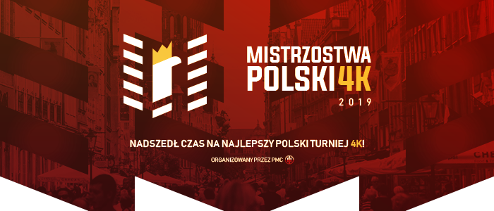

---
tags:
- MP4K
- MP4K 3
- MP4K 2019
---
# Mistrzostwa Polski w 4K 3

**Mistrzostwa Polski w 4K 3 (Polish 4K Championship 3)** (***MP4K 3***) is a one-on-one osu!mania 4-key tournament made for osu! players based in Poland or of Polish Heritage. It is the third installment of the Mistrzostwa Polski 4K.

## Tournament Schedule

| Event | Timestamp |
| --: | :-- |
| Registration Phase | 2019-05-13/2019-06-01 |
| Qualifiers Showcase | 2019-06-09 |
| Qualifiers | 2019-06-15/2019-06-16 |
| Group Stage - Week 1 | 2019-06-22/2019-06-23 |
| Group Stage - Week 2 | 2019-06-29/2019-06-30 |
| Round of 16 | 2019-07-06/2019-07-08 |
| Quarterfinals | 2019-07-13/2019-07-14 |
| Semifinals | 2019-07-20/2019-07-21 |
| Finals | 2019-07-27/2019-07-28 |
| Grand Finals | 2019-08-03/2019-08-04 |

## Prizes

The prize pool is crowdfunded through the [tipanddonation](https://tipanddonation.com/MP4K3) page with a minimum prize pool set at 200 PLN total with a 50%/30%/20% split for the top 3 players.
The minimum guaranteed prizes are:

| Placing | Prize(s) |
| :-: | :-- |
|  | 200 PLN, profile badge, 6 months of osu!supporter tag |
|  | 120 PLN, 4 months of osu!supporter tag |
|  | 80 PLN, 2 months of osu!supporter tag |

## Organisation

| Position | Member(s) |
| :-- | :-- |
| Host | ![][flag_PL] [Kamikaze](https://osu.ppy.sh/users/2124783) |
| Coordinators | ![][flag_PL] [Benzopirene](https://osu.ppy.sh/users/1887068), ![][flag_PL] [Marleza](https://osu.ppy.sh/users/5396181), ![][flag_PL] [Open](https://osu.ppy.sh/users/7082921) |
| Map Selectors | ![][flag_MY] [cheewee10](https://osu.ppy.sh/users/4477497), ![][flag_PL] [Kamikaze](https://osu.ppy.sh/users/2124783), ![][flag_ID] [-Rem-](https://osu.ppy.sh/users/5767941), ![][flag_CL] [WalterToro](https://osu.ppy.sh/users/5281416) |
| Referees | ![][flag_RU] [AnatOWJIya](https://osu.ppy.sh/users/486264), ![][flag_PL] [Arkitev](https://osu.ppy.sh/users/6905790), ![][flag_PL] [Benzopirene](https://osu.ppy.sh/users/1887068), ![][flag_PL] [Cyan_Star](https://osu.ppy.sh/users/8679184), ![][flag_PL] [Kamikaze](https://osu.ppy.sh/users/2124783), ![][flag_PL] [LaviSorrow](https://osu.ppy.sh/users/9966768), ![][flag_PL] [m666](https://osu.ppy.sh/users/8623171), ![][flag_PL] [Moskas](https://osu.ppy.sh/users/1934077), ![][flag_PL] [MrDorian](https://osu.ppy.sh/users/1559983), ![][flag_PL] [Open](https://osu.ppy.sh/users/7082921), ![][flag_PL] [SitekX](https://osu.ppy.sh/users/3840946), ![][flag_CL] [WalterToro](https://osu.ppy.sh/users/5281416) |
| Streamers | ![][flag_PL] [Arkitev](https://osu.ppy.sh/users/6905790), ![][flag_PL] [DrawnGirl](https://osu.ppy.sh/users/2222301), ![][flag_PL] [Kamikaze](https://osu.ppy.sh/users/2124783), ![][flag_PL] [Miq](https://osu.ppy.sh/users/2424440), ![][flag_BE] [NightNarumi](https://osu.ppy.sh/users/4381142), ![][flag_PL] [Open](https://osu.ppy.sh/users/7082921), ![][flag_PL] [SitekX](https://osu.ppy.sh/users/3840946) |
| Commentators | ![][flag_PL] [Arkitev](https://osu.ppy.sh/users/6905790), ![][flag_PL] [Beniek](https://osu.ppy.sh/users/1649633), ![][flag_PL] [Chazoshtare](https://osu.ppy.sh/users/4185189), ![][flag_PL] [Kamikaze](https://osu.ppy.sh/users/2124783), ![][flag_PL] [LaviSorrow](https://osu.ppy.sh/users/9966768), ![][flag_PL] [Open](https://osu.ppy.sh/users/7082921), ![][flag_PL] [SitekX](https://osu.ppy.sh/users/3840946) |
| Graphic Designer | ![][flag_PL] [W D Gaster](https://osu.ppy.sh/users/1475814) |
| Statistician Helper | ![][flag_PH] [SurfChu85](https://osu.ppy.sh/users/4469895) |

## Links

- [Discussion thread](https://osu.ppy.sh/community/forums/topics/907418)
- [Livestream](https://www.twitch.tv/mp4k)
- [MP4K Tournament Discord server](https://discord.gg/0yb1K4q04lERYyUv)

---

## Participants

*Qualified participants will be added in this section.*

---

## Mappools

### Qualifiers

- FreeMod
  - [The Dilinger Escape Plan - When Acting As A Wave (Pope Gadget) \[Stage 1: Panasonic w/ Evening\]](https://osu.ppy.sh/beatmapsets/984989#mania/2060892)
  - [Skrillex - Kyoto (feat.Sirah) (Kamikaze) \[Stage 2: Precision\]](https://osu.ppy.sh/beatmapsets/984894#mania/2060731)
  - [GOTH - Ruti'n (GOTH Wild Electro Remix) (Kamikaze) \[Stage 3: Control w/ Rave\]](https://osu.ppy.sh/beatmapsets/984896#mania/2060733)
  - [Yu^ta w. Satoguchi Yu - Alien Artifact (-Rem-) \[Stage 4: Agility\]](https://osu.ppy.sh/beatmapsets/984893#mania/2060730)
  - [KNOWER - Time Traveler (Kamikaze) \[Stage 5: Versatility w/ Hydria\]](https://osu.ppy.sh/beatmapsets/984893#mania/2060730)

## Match Results

*All match results will be added in this section.*

---

## Ruleset

### Tournament Organisation

#### General Eligibility

- Players who currently have (or had at some point since Account Creation) the Polish Flag on their profile or players who do not have the Polish Flag on their profiles but can present a proof of their fluency in Polish language and/or their Polish citizenship to the staff are the only ones allowed to join the tournament.
- Staff Members who are not part of the Mappool Selectors and Coordinators are permitted to join the tournament.

#### Round Overview

- With the exception of the qualification stage (which does not have a winning condition), each tournament round will have a selectable mappool of a certain size, a tiebreaker song, and a winning condition. The format is as follows:
  - **Qualification Stage**: 5 song mappool, no winning condition, no tiebreaker song
  - **Gropup Stage**: 10 song mappool, best of 7 (first to 4), one tiebreaker song
  - **Round of 16 and Quarterfinals**: 12 song mappool, best of 9 (first to 5), one tiebreaker song
  - **Semifinals and Finals**: 14 song mappool, best of 11 (first to 6), one tiebreaker song
  - **Grand Finals**: 16 song mappool, best of 13 (first to 7), one tiebreaker song
- All matches held are using a 1 player versus 1 player rule.
- All rounds are to use the **restrictive FreeMod** rules (only NoMod, Flashlight, FadeIn, or Hidden are permitted to be used while playing), in addition, **Score v2** is implemented.

#### Qualification Process

- All players that enter the tournament will be eligible to play in the qualification round. However, the number of participants who will advance to the next round will be cut down to the nearest power of 2. The maximum number of players who can advance to the subsequent round is 32. The criterion used to determine whether a player will progress to the next round is their performance in the qualification stage.
- The qualification round will have a 5 song mappool that widely varies in skillsets tested. These tested skillsets will correspond to skillsets commonly seen in mappools throughout the tournament.
- All five notecharts will be created by the mappool selectors and will be unreleased prior to the tournament qualification stage, to provide zero opportunity for advantage through familiarity.
- All players will have two chances at each qualifier notechart, in which the highest of the two runs on each qualifier notechart will be used to calculate your final score.
- Players will be organized into groups based on their availability. Because qualification is not a process that involves 1 on 1 matchups, it is actually possible to have 8 players go through the qualification process at once. If this is a confusing process, do not worry: simply adhere to the schedule that will be released and follow referee instructions during the match.
- The qualifiers will not be streamed.
- Regardless of the number of entrants and eliminations, the qualification process will also be done to seed players. Players will be ordered based on their average rank on all five songs, with the best average score rating being seed #1, and the worst average score rating being seed n; n being the number of players in the qualification stage.

#### Group Stage

- After the qualification round, the remaining players, based on their qualification seeds, will be divided into 4 different groups based on their qualification seed. These groups will be labelled "Top Seed", "High Seed", "Low Seed", and "Unseeded". Groups (for the Group Stage) are then formed by randomly selecting one player from each seed group.
  - **1st-8th seeds**: Top Seed
  - **9th-16th seeds**: High Seed
  - **17th-24th seeds**: Low Seed
  - **25th-32nd seeds**: Unseeded
- Each player in these groups will face each other once. In total, every player in the Group Stage will participate in **three matches**. The two best-performing players in each group will advance to the bracket stage.
- A player's performance in the group is determined through these metrics, arranged from highest priority to lowest:
  - Number of matches won.
  - `Number of rounds won - numbers of round lost`.
  - Number of losses by default (lower is better).
  - Higher qualification seed.
- The two worst-performing players of each group will be eliminated from the tournament.

#### Bracket Stage

- The bracket stage is a **double elimination** stage. This means that a player who is participating in this stage must lose two matches in this stage to be eliminated from the tournament.
- After the Group Stage, the remaining players will be seeded based on their performance in the Group Stage. We use the same metric as the one that we used to determine the two best-performing players in a group, minus the "number of losses by default" metric. This will be used to determine the remaining players' opponents for the bracket stage. In particular, their opponent for the bracket stage will be `(17 - player's GS seed)`.
- In a winner's bracket match, the player who meets the winning condition in a match will be declared the winner of the match and will move further into the bracket. The loser of the match will fall into the losers bracket.
- In a loser's bracket match, the player who meets the winning condition in a match will be declared the winner of the match and will move further into the bracket. The loser of the match will be eliminated from the tournament.
- Players who are in the winner's bracket are required to play in one match in each stage. The only exception to this is if the player is the sole player in winner bracket in the Grand Finals stage, where the player is required to play in up to two matches if the player were to lose his first match in the Grand Finals stage.
- Players who are in the loser's bracket at the start of Finals Week 1 or further are required to play in two matches in a single stage. However, players who lose their first match in the losers bracket in those stages will no longer need to play in any further matches in the tournament, for they are eliminated from the tournament.

### Tournament Play

#### Protocol

- Your matches will be listed in schedules. **It is your duty as a player to properly identify your timeslot and reschedule your match with your opponent as soon as possible if a reschedule is necessary.**
- Reschedules will only be considered if both players agree to a time, this needs to be done and notified to the tournament staff before **Thursday at 23:59 UTC+2 (or Central European Summer Time)** in that particular week when your match takes place.
- ***It is your right as a player and tournament entrant to expect that staff will perform to the best of their abilities in moderating matches in such a way that they will conclude in a timely manner***.
  - Rooms with matches will be created before the match start time, and you will be invited to the corresponding tournament room before the match start time.
  - For maximal accountability on the MP4K 3 staff, each match will have a primary referee and a backup referee. That way, we will assure you that there will be someone present to handle your tournament match.
  - If both players arrive on time, tournament proceedings will begin promptly at the start time of the match, no earlier and no later.
  - Take care of any priorities you may have immediately before and/or after the match, for we will be running on a fixed schedule.
  - If your match starts in less than 5 minutes and you have not been invited to your corresponding multiplayer room, notify any Tournament Staff member who is online on Discord or in-game that you are a player in MP4K 3 and you currently do not have an invitation to your match. They will ameliorate the situation by notifying the designated referees for your match to give you an invitation to your corresponding multiplayer room.
- ***It is our right as tournament staff to expect that you will arrive for your matches before your expected time***.
  - Players will be given a ten (10) minute grace period after the match start time to enter their room; if they have not entered by this point. The match will be forfeited and the player that has arrived will win by default. However, exceptions will be given to players who were late due to the negligence of the MP4K 3 staff.
  - In the extreme circumstance where both players did not show up, **the player with the higher group stage seed in the match-up will advance automatically**. In the Post-Qualification stage **the player with the higher qualifier seed in the match-up will advance automatically**
- ***It is your privilege as a player and tournament entrant to have an opinion about the content/structure used in the tournament***.
  - You are experiencing this event as a competitor, and every choice made in the process directly affects how you will progress in the tournament.
  - If you dislike something, you are allowed to state your concerns -- however, do so reasonably. Speaking in absolutes or a matter-of-fact tone is the fastest way for an argument to start, especially over an opinionated statement. Keep in mind that some of your fellow competitors and other users on this website will have content that will inevitably be used in the tournament, and it is best advised that you make it clear that it is your opinion so as to not be hurtful.
- ***It is our right as the MP4K 3 staff to reprimand users for intolerable behavior***.
  - MP4K 3 staff will have sole discretion over decisions that affect a player's standing in the tournament; however, other members of the tournament may forward any information to staff members that in any way represents uncalled for behavior towards other users or staff in this tournament. Staff members will attempt to escalate serious situations beyond the scope of this event if need be, so be respectful
  - Minor instances will receive warnings, and continued instances will result in forceful removal from the tournament.

#### Warm-up Songs

- Each player in the match will be allowed one (1) warm-up song to be played, making for two (2) warm-ups in total between both players. All warm-up songs must be osu!mania 4K specific beatmaps.
- The warm-up must be uploaded to the osu! website and accessible by everyone prior to the tournament match. Bloodcat links are **not allowed**, and neither are personal links featuring the beatmap that you want downloaded.
- Maps that have a beatmap listing but cannot be downloaded are not allowed for the purpose of warming up.
- Players are advised to avoid using beatmap packs [similar to this](https://osu.ppy.sh/beatmapsets/435387).
- Warm-up songs will be on FreeMod, which allows for any special modifications that players see fit for the purpose of warming up properly.
- In the early stages, your warmup song cannot have a drain time of longer than 4 minutes. This rule is enforced within the Group Stage of the tournament.

#### Bans, Rolls and Song Selection

- With the exception of warm-ups, all songs played in a given round must match those that are selectable in the corresponding mappool. Maps are to be played on a restrictive FreeMod: only Hidden, Fade In, or Flashlight can be used.
- Players are to ban one (1) map within the map pool that they are playing for the given round.
- Players will be instructed to do a !roll command by the referee that is overseeing the match; the losing (lower) roll picks the first ban, while the winning (higher) roll picks the first song of the match. In the event that both players get the same roll, they will have to continue doing the !roll command until the tie is broken.
- After the bans and rolls have concluded, the player with the winning roll instructs the referee of their song selection, and the referee will switch to that song. After that song concludes, the other player will pick a song, and this process will continue until one of the two conditions is satisfied:
  1. One player has achieved enough wins in such a way that the other player cannot successfully win the round.
    - The winning player moves onto the next match.
    - The losing player falls to the losers bracket. If a player loses in the loser’s bracket, they are eliminated from the tournament.
  2. Both players are at match point at the same time.
    - Both players will play the song designated as the tiebreaker.
    - The winner of the tiebreaker will progress to the next match of the tournament, while the loser will be eliminated or sent to the losers bracket, depending on the position of the tournament.
- If the beatmap ends in a draw, the game will be nullified and the beatmap will be replayed.

#### Disconnections

- Maps with a player disconnection that occurs within the first 30 seconds, or 25% of the song (whichever comes first) will be nullified and re-attempted.
- Matches will have a two disconnection limit -- upon the third disconnection, a point will be handed immediately to the player still active within the lobby.
- A two minute timer will be placed on a disconnected player when the song played has concluded. When this timer hits 0, the grace period mentioned in [Protocol](#protocol) will be (re)activated. If the grace period timer hits 0, the match is forfeited, and the other remaining player will be declared the winner.
- Situations with two player disconnections will be executed similarly to two missing players for a given match: the higher seed will be declared the winner if both players have no time left in their grace period.

[flag_BE]: /wiki/shared/flag/BE.gif
[flag_CL]: /wiki/shared/flag/CL.gif
[flag_ID]: /wiki/shared/flag/ID.gif
[flag_MY]: /wiki/shared/flag/MY.gif
[flag_PL]: /wiki/shared/flag/PL.gif
[flag_PH]: /wiki/shared/flag/PH.gif
[flag_RU]: /wiki/shared/flag/RU.gif
