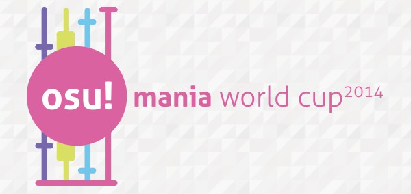
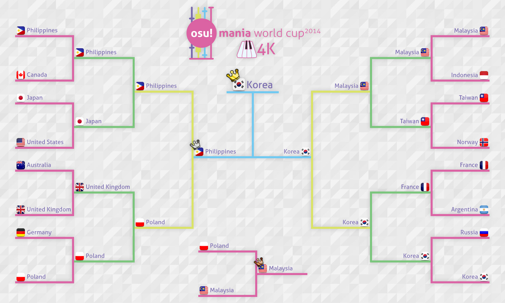

---
tags:
  - MWC 2014
  - MWC 4K 2014
  - MWC 7K 2014
  - MWC2014
  - MWC4K 2014
  - MWC7K 2014
---

# osu!mania World Cup 2014

La **osu!mania World Cup 2014** (***MWC 2014***) fue un torneo por países organizado por el [osu! team](/wiki/People/osu!_team). Estaba separado en una categoría de 4 teclas y otra de 7 teclas y fue la primera entrega de la osu!mania 4K World Cup y la osu!mania 7K World Cup.

## Calendario del torneo

| Evento | Marca de tiempo |
| --: | :-- |
| Fase de inscripción | 1/7/2014 - 20/7/2014 |
| Sorteos en vivo | 2/8/2014 |
| Fase de grupos (4K) | 9/8/2014 - 10/8/2014 |
| Fase de grupos (7K) | 16/8/2014 - 17/8/2014 |
| Octavos de final | 23/8/2014 - 24/8/2014 |
| Cuartos de final | 31/8/2014 |
| Semifinales | 7/9/2014 |
| Finales | 12/9/2014 |

## Premios

| Posición | Premios |
| :-: | :-- |
|  | 6 meses de osu!supporter, insignia de perfil única, mercancía de osu!, título de usuario «osu!mania Champion» por un año |
|  | 3 meses de osu!supporter |
|  | 1 mes de osu!supporter |

## Organización

La osu!mania World Cup 2014 fue dirigida por varios miembros de la comunidad.

| Posición | Miembros |
| :-- | :-- |
| Organizadores | ::{ flag=ES }:: [Deif](https://osu.ppy.sh/users/318565), ::{ flag=DE }:: [Loctav](https://osu.ppy.sh/users/71366), ::{ flag=DE }:: [p3n](https://osu.ppy.sh/users/123703) |
| Selectores de la mappool | ::{ flag=RU }:: [\[Shi-Ra\]](https://osu.ppy.sh/users/2008489), ::{ flag=CL }:: [Agka](https://osu.ppy.sh/users/64811) |
| Streamers | ::{ flag=PL }:: [Marcin](https://osu.ppy.sh/users/722665), ::{ flag=AU }:: [peppy](https://osu.ppy.sh/users/2), ::{ flag=FR }:: [shARPII](https://osu.ppy.sh/users/776257) |
| Comentaristas | ::{ flag=RU }:: [\[Shi-Ra\]](https://osu.ppy.sh/users/2008489), ::{ flag=US }:: [Charles445](https://osu.ppy.sh/users/85000), ::{ flag=FR }:: [Mr Color](https://osu.ppy.sh/users/116078), ::{ flag=IT }:: [Roxas](https://osu.ppy.sh/users/1041833), ::{ flag=US }:: [ztrot](https://osu.ppy.sh/users/6347) |
| Estadístico | ::{ flag=PL }:: [Marcin](https://osu.ppy.sh/users/722665) |

## Enlaces

- [Hilo de discusión](https://osu.ppy.sh/community/forums/topics/222100)
- [Transmisión en directo](https://www.twitch.tv/osulive)
- **[Hoja de estadísticas: Categoría 4K](https://mwc.servegame.com/results/view/1)**
- **[Hoja de estadísticas: Categoría 7K](https://mwc.servegame.com/results/view/2)**

## Participantes

### Categoría 4K

|  | País | Miembros |
| :-: | :-: | :-- |
| ::{ flag=AR }:: | **Argentina** | **[juankristal](https://osu.ppy.sh/users/443656)**, [Euroe](https://osu.ppy.sh/users/3633019), [Icaruz](https://osu.ppy.sh/users/2605137) |
| ::{ flag=AU }:: | **Australia** | **[Envisionise](https://osu.ppy.sh/users/2853195)**, [Combinatorix](https://osu.ppy.sh/users/3174286), [MasterSonic10](https://osu.ppy.sh/users/1249224), [-X Y Z-](https://osu.ppy.sh/users/1610833) |
| ::{ flag=CA }:: | **Canadá** | **[Bites](https://osu.ppy.sh/users/1671598)**, [ca25nada](https://osu.ppy.sh/users/103255) |
| ::{ flag=CL }:: | **Chile** | *disuelto* |
| ::{ flag=CZ }:: | **República Checa** | *retirado* |
| ::{ flag=FR }:: | **Francia** | **[adrien062](https://osu.ppy.sh/users/2131990)**, [HamarGaylord](https://osu.ppy.sh/users/1398639), [lim38](https://osu.ppy.sh/users/2741170) |
| ::{ flag=DE }:: | **Alemania** | **[IamBaum](https://osu.ppy.sh/users/3078914)**, [Chucksal](https://osu.ppy.sh/users/2869914), [Dualshock](https://osu.ppy.sh/users/1902591), [Reikokaz](https://osu.ppy.sh/users/1263173) |
| ::{ flag=ID }:: | **Indonesia** | **[dionzz99](https://osu.ppy.sh/users/2545604)**, [BeAyWayYou](https://osu.ppy.sh/users/2816463) |
| ::{ flag=JP }:: | **Japón** | **[OmegaJack](https://osu.ppy.sh/users/205391)**, [coo\_m](https://osu.ppy.sh/users/1927193), [metyabo](https://osu.ppy.sh/users/623773), [PiraTom](https://osu.ppy.sh/users/1847698) |
| ::{ flag=MY }:: | **Malasia** | **[Gon](https://osu.ppy.sh/users/583765)**, [\_Sylveon\_](https://osu.ppy.sh/users/3936677), [LongGone](https://osu.ppy.sh/users/35882), [ZYuan](https://osu.ppy.sh/users/3337688) |
| ::{ flag=NZ }:: | **Nueva Zelanda** | **[Mudkips](https://osu.ppy.sh/users/2502706)**, [Crono76](https://osu.ppy.sh/users/4249989), [ksy64320](https://osu.ppy.sh/users/2068663) |
| ::{ flag=NO }:: | **Noruega** | **[Staiain](https://osu.ppy.sh/users/86188)**, [NekoFlaa](https://osu.ppy.sh/users/80640), [nnobel](https://osu.ppy.sh/users/3043738), [oscar](https://osu.ppy.sh/users/284347) |
| ::{ flag=PH }:: | **Filipinas** | **[Tokiiwa](https://osu.ppy.sh/users/4029511)**, [Ainyan](https://osu.ppy.sh/users/3770641), [arcwinolivirus](https://osu.ppy.sh/users/2039089) |
| ::{ flag=PL }:: | **Polonia** | **[-Kamikaze-](https://osu.ppy.sh/users/2124783)**, [Hudonom](https://osu.ppy.sh/users/1654221), [Modren](https://osu.ppy.sh/users/1828621), [Tidek](https://osu.ppy.sh/users/743282) |
| ::{ flag=RU }:: | **Federación de Rusia** | **[Daleenie](https://osu.ppy.sh/users/1540597)**, [Kiviman](https://osu.ppy.sh/users/2790640) |
| ::{ flag=KR }:: | **Corea del Sur** | **[ideu-](https://osu.ppy.sh/users/137227)**, [Abcdullah](https://osu.ppy.sh/users/4140104), [FaL3C\_ChoBo](https://osu.ppy.sh/users/1218632), [jhlee0133](https://osu.ppy.sh/users/140148) |
| ::{ flag=ES }:: | **España** | **[KHRiku](https://osu.ppy.sh/users/3104514)**, [Luna\_123](https://osu.ppy.sh/users/2041945), [sergioperez](https://osu.ppy.sh/users/182447) |
| ::{ flag=TW }:: | **Taiwán** | **[CrazyStar](https://osu.ppy.sh/users/680008)**, [GH\_CHAIKA](https://osu.ppy.sh/users/2462317), [sille123](https://osu.ppy.sh/users/1626359), [y85782122](https://osu.ppy.sh/users/2287176) |
| ::{ flag=GB }:: | **Reino Unido** | **[Cozzzy](https://osu.ppy.sh/users/2003917)**, [H A Y A B U S A](https://osu.ppy.sh/users/3104108) |
| ::{ flag=US }:: | **Estados Unidos** | **[Ayaya](https://osu.ppy.sh/users/3088679)**, [RemiFlan](https://osu.ppy.sh/users/3061151), [Ziergdsx18](https://osu.ppy.sh/users/869702), [Zyph](https://osu.ppy.sh/users/1600432) |

### Categoría 7K

|  | País | Miembros |
| :-: | :-: | :-- |
| ::{ flag=AU }:: | **Australia** | **[zKskita](https://osu.ppy.sh/users/457515)**, [ApocaZumbee](https://osu.ppy.sh/users/3431615), [Envisionise](https://osu.ppy.sh/users/2853195), [Tornspirit](https://osu.ppy.sh/users/1338883) |
| ::{ flag=CL }:: | **Chile** | **[Skalim](https://osu.ppy.sh/users/2225008)**, [Gonzaalooo](https://osu.ppy.sh/users/1948903), [NicolasVera](https://osu.ppy.sh/users/1508087) |
| ::{ flag=CN }:: | **China** | **[spro](https://osu.ppy.sh/users/227717)**, [Fate\_Yakumo](https://osu.ppy.sh/users/2660480), [innocentfake](https://osu.ppy.sh/users/85797), [zfloveys](https://osu.ppy.sh/users/89545) |
| ::{ flag=FR }:: | **Francia** | **[Elementaires](https://osu.ppy.sh/users/2284328)**, [Foglol](https://osu.ppy.sh/users/2533089), [lim38](https://osu.ppy.sh/users/2741170) |
| ::{ flag=DE }:: | **Alemania** | **[rohen04](https://osu.ppy.sh/users/369614)**, [playin14](https://osu.ppy.sh/users/2144038), [Reikokaz](https://osu.ppy.sh/users/1263173) |
| ::{ flag=HK }:: | **Hong Kong** | **[wongfung](https://osu.ppy.sh/users/61791)**, [cabigon](https://osu.ppy.sh/users/2417142), [Snow Note](https://osu.ppy.sh/users/643394) |
| ::{ flag=ID }:: | **Indonesia** | **[Nyooo](https://osu.ppy.sh/users/2319372)**, [Midare](https://osu.ppy.sh/users/2663343), [Zeradok](https://osu.ppy.sh/users/544631) |
| ::{ flag=JP }:: | **Japón** | **[OmegaJack](https://osu.ppy.sh/users/205391)**, [coo\_m](https://osu.ppy.sh/users/1927193), [metyabo](https://osu.ppy.sh/users/623773) |
| ::{ flag=MY }:: | **Malasia** | **[Gon](https://osu.ppy.sh/users/583765)**, [\_Sylveon\_](https://osu.ppy.sh/users/3936677), [LongGone](https://osu.ppy.sh/users/35882) |
| ::{ flag=NL }:: | **Países Bajos** | *retirado* |
| ::{ flag=NO }:: | **Noruega** | **[BigMouthDog](https://osu.ppy.sh/users/2110078)**, [Dazzy](https://osu.ppy.sh/users/811297) |
| ::{ flag=PH }:: | **Filipinas** | **[Entozer](https://osu.ppy.sh/users/277044)**, [SanniSanni](https://osu.ppy.sh/users/3036686), [snowkel](https://osu.ppy.sh/users/1073829) |
| ::{ flag=PL }:: | **Polonia** | **[Modren](https://osu.ppy.sh/users/1828621)**, [Hudonom](https://osu.ppy.sh/users/1654221), [-Kamikaze-](https://osu.ppy.sh/users/2124783), [Tear](https://osu.ppy.sh/users/1340650) |
| ::{ flag=PT }:: | **Portugal** | **[-Blossom-](https://osu.ppy.sh/users/2535395)**, [Mizusi](https://osu.ppy.sh/users/2796312) |
| ::{ flag=RU }:: | **Federación de Rusia** | **[Daleenie](https://osu.ppy.sh/users/1540597)**, [Kiviman](https://osu.ppy.sh/users/2790640) |
| ::{ flag=KR }:: | **Corea del Sur** | **[ideu-](https://osu.ppy.sh/users/137227)**, [Abcdullah](https://osu.ppy.sh/users/4140104), [jhlee0133](https://osu.ppy.sh/users/140148), [WindyS](https://osu.ppy.sh/users/1190879) |
| ::{ flag=ES }:: | **España** | *disuelto* |
| ::{ flag=TH }:: | **Tailandia** | **[lostcool](https://osu.ppy.sh/users/766374)**, [Mystical Faith](https://osu.ppy.sh/users/4280188), [Popo\[Mikoto\]](https://osu.ppy.sh/users/445236) |
| ::{ flag=GB }:: | **Reino Unido** | **[H A Y A B U S A](https://osu.ppy.sh/users/3104108)**, [Mafham](https://osu.ppy.sh/users/3660531), [The Muffin Man](https://osu.ppy.sh/users/2186171), [xWillx](https://osu.ppy.sh/users/696222) |
| ::{ flag=US }:: | **Estados Unidos** | **[October Scream](https://osu.ppy.sh/users/2812237)**, [Squishykorean](https://osu.ppy.sh/users/4372604), [Blocko](https://osu.ppy.sh/users/4075092) |

## Grupos

### Categoría 4K

| Grupo A | Grupo B | Grupo C | Grupo D |
| :-- | :-- | :-- | :-- |
| ::{ flag=AR }:: Argentina | ::{ flag=CZ }:: República Checa | ::{ flag=RU }:: Federación de Rusia | ::{ flag=PL }:: Polonia |
| ::{ flag=ES }:: España | ::{ flag=AU }:: Australia | ::{ flag=JP }:: Japón | ::{ flag=CA }:: Canadá |
| ::{ flag=TW }:: Taiwán | ::{ flag=ID }:: Indonesia | ::{ flag=NZ }:: Nueva Zelanda | ::{ flag=CL }:: Chile |
| ::{ flag=PH }:: Filipinas | ::{ flag=US }:: Estados Unidos | ::{ flag=GB }:: Reino Unido | ::{ flag=NO }:: Noruega |
| ::{ flag=DE }:: Alemania | ::{ flag=KR }:: Corea del Sur | ::{ flag=MY }:: Malasia | ::{ flag=FR }:: Francia |

### Categoría 7K

| Grupo A | Grupo B | Grupo C | Grupo D |
| :-- | :-- | :-- | :-- |
| ::{ flag=AU }:: Australia | ::{ flag=ES }:: España | ::{ flag=ID }:: Indonesia | ::{ flag=KR }:: Corea del Sur |
| ::{ flag=PH }:: Filipinas | ::{ flag=PL }:: Polonia | ::{ flag=PT }:: Portugal | ::{ flag=NO }:: Noruega |
| ::{ flag=MY }:: Malasia | ::{ flag=HK }:: Hong Kong | ::{ flag=CL }:: Chile | ::{ flag=TH }:: Tailandia |
| ::{ flag=DE }:: Alemania | ::{ flag=RU }:: Federación de Rusia | ::{ flag=JP }:: Japón | ::{ flag=GB }:: Reino Unido |
| ::{ flag=US }:: Estados Unidos | ::{ flag=CN }:: China | ::{ flag=FR }:: Francia | ::{ flag=NL }:: Países Bajos |

## Podio

Esta competición ha llegado a su fin y se ha saldado con el siguiente podio:

| Puesto | Categoría 4K | Categoría 7K |
| :-: | :-- | :-- |
|  | ::{ flag=KR }:: **Corea del Sur** (**[ideu-](https://osu.ppy.sh/users/137227)**, [Abcdullah](https://osu.ppy.sh/users/4140104), [FaL3C\_ChoBo](https://osu.ppy.sh/users/1218632), [jhlee0133](https://osu.ppy.sh/users/140148)) | ::{ flag=KR }:: **Corea del Sur** (**[ideu-](https://osu.ppy.sh/users/137227)**, [Abcdullah](https://osu.ppy.sh/users/4140104), [jhlee0133](https://osu.ppy.sh/users/140148), [WindyS](https://osu.ppy.sh/users/1190879)) |
|  | ::{ flag=PH }:: **Filipinas** (**[Tokiiwa](https://osu.ppy.sh/users/4029511)**, [Ainyan](https://osu.ppy.sh/users/3770641), [arcwinolivirus](https://osu.ppy.sh/users/2039089)) | ::{ flag=TH }:: **Tailandia** (**[lostcool](https://osu.ppy.sh/users/766374)**, [Mystical Faith](https://osu.ppy.sh/users/4280188), [Popo\[Mikoto\]](https://osu.ppy.sh/users/445236)) |
|  | ::{ flag=MY }:: **Malasia** (**[Gon](https://osu.ppy.sh/users/583765)**, [\_Sylveon\_](https://osu.ppy.sh/users/3936677), [LongGone](https://osu.ppy.sh/users/35882), [ZYuan](https://osu.ppy.sh/users/3337688)) | ::{ flag=MY }:: **Malasia** (**[Gon](https://osu.ppy.sh/users/583765)**, [\_Sylveon\_](https://osu.ppy.sh/users/3936677), [LongGone](https://osu.ppy.sh/users/35882)) |

## Mappools

### Categoría 4K

#### Finales

- FreeMod
  1. [Yuuna Sasara feat. Tai no Kobone - Imperishable Night 2006 (xxbidiao) \[4K Insane\]](https://osu.ppy.sh/beatmapsets/92190#mania/259067)
  2. [Mr Pokeahole - The Scales of Struggle (Staiain) \[4K Extreme\]](https://osu.ppy.sh/beatmapsets/193512#mania/459755)
  3. [Betwixt & Between - 12 little fragments of silence (Staiain) \[Insane\]](https://osu.ppy.sh/beatmapsets/108606#mania/283845)
  4. [DJ SHARPNEL - Marunouchi survivor 140 RUSH (ATTan) \[Hard(17)\]](https://osu.ppy.sh/beatmapsets/291165#mania/374891)
  5. [Danny Baranowsky - The Battle of Lil' Slugger (Ch 1 Boss Extended Cut) (Staiain) \[Godlike\]](https://osu.ppy.sh/beatmapsets/79839#mania/222593)
  6. [Risk Junk - One More Lovely x1.5 (ATTan) \[Challenge(20)\]](https://osu.ppy.sh/beatmapsets/152281#mania/374894)
  7. [Renard - TU4AR (aitor98) \[EX\]](https://osu.ppy.sh/beatmapsets/172364#mania/416609)
  8. [Yuyoyuppe - AiAe (Fullerene-) \[Wafles' SHD\]](https://osu.ppy.sh/beatmapsets/174381#mania/421066)
  9. [DEV/NULL - Rave 7 (hi19hi19) \[Insane\]](https://osu.ppy.sh/beatmapsets/203250#mania/480467)
  10. [LeaF - LeaF Style Super Shredder (Cherry Blossom) \[Fullerene's 4K Shredder\]](https://osu.ppy.sh/beatmapsets/179779#mania/443034)
  11. [Manabu Namiki - Tenshi (Snow Note) \[XozInfinite\]](https://osu.ppy.sh/beatmapsets/120515#mania/320395)
  12. [DJ SHARPNEL - FUTURE DOMINATORS (DponXiaodong) \[4K HD\]](https://osu.ppy.sh/beatmapsets/204577#mania/483059)
  13. [Melyceria&Disease - 357 BPM (\_Gezo\_) \[Starstream Knot\]](https://osu.ppy.sh/beatmapsets/170815#mania/473228)
- Desempate
  1. **[xi - FREEDOM DiVE (razlteh) \[Fullerene's 4K DIMENSIONS\]](https://osu.ppy.sh/beatmapsets/173612#mania/473228)**

#### Semifinales

- FreeMod
  1. [BlackY - Harpuia (Mystical Faith) \[4K\]](https://osu.ppy.sh/beatmapsets/173537#mania/419904)
  2. [Darren Styles - Heartbeatz (Leo137) \[Leo137\]](https://osu.ppy.sh/beatmapsets/205220#mania/484499)
  3. [Hommarju - Gott (FaLiLVSo) \[EXHAUST\]](https://osu.ppy.sh/beatmapsets/146757#mania/363572)
  4. [LeaF - Evanescent (Fullerene-) \[Realitat\]](https://osu.ppy.sh/beatmapsets/201242#mania/476565)
  5. [w\_tre respect for AT&HU - Schur's Theorem (hi19hi19) \[Insane\]](https://osu.ppy.sh/beatmapsets/203221#mania/480418)
  6. [Shiraishi - Shinsekai (Xay) \[Insane\]](https://osu.ppy.sh/beatmapsets/201910#mania/477978)
  7. [Receptor - Run Run Run (Staiain) \[ilikexd's Insane\]](https://osu.ppy.sh/beatmapsets/202055#mania/478258)
  8. [Vospi - We Met Dat Night (Halogen-) \[4K MX\]](https://osu.ppy.sh/beatmapsets/151453#mania/374172)
  9. [xi - Happy End of the World (Blocko) \[Fullerene's 4K Happy Apocalypse\]](https://osu.ppy.sh/beatmapsets/171880#mania/431260)
  10. [gmtn vs. kozato - squartatrice (MMd-) \[Fullerene's 4K Another\]](https://osu.ppy.sh/beatmapsets/124671#mania/425604)
  11. [DJ SHARPNEL - SHIND BAD (Furry) \[Insane (Jump streams)\]](https://osu.ppy.sh/beatmapsets/130971#mania/330050)
  12. [Reol - +Danshi (lZenxl) \[Fullerene's 4K MX\]](https://osu.ppy.sh/beatmapsets/165991#mania/480591)
  13. [Hi-G remixed by DM Ashura - Aztec Templing (PuppyButt) \[Original\]](https://osu.ppy.sh/beatmapsets/124313#mania/316956)
- Desempate
  1. **[DJ Sharpnel - Over the Fullereneshift (Fullerene-) \[Komm, susser Tod\]](https://osu.ppy.sh/beatmapsets/189224#mania/450928)**

#### Cuartos de final

- FreeMod
  1. [t+pazolite - Stardust Lullaby (ZXCV) \[Sweet Dreams\]](https://osu.ppy.sh/beatmapsets/156454#mania/383370)
  2. [DJ Sharpnel feat. Lia - I miss you (DJ SHARPNEL Remix) (blazziken) \[4K EX\]](https://osu.ppy.sh/beatmapsets/192759#mania/458274)
  3. [kashiwa daisuke - april.\#02 (Dolphin) \[Fullerene's Catharsis\]](https://osu.ppy.sh/beatmapsets/189891#mania/452349)
  4. [dj TAKA VS DJ TOTTO feat.Ai - IX (Spy) \[4K Extra\]](https://osu.ppy.sh/beatmapsets/989492#mania/2069892)
  5. [Risk Junk - Tropical April (Pichu) \[Insane\]](https://osu.ppy.sh/beatmapsets/156729#mania/383923)
  6. [KUUCHI - Connect (J-CORE Remix) (MasterSonic10) \[4k SC\]](https://osu.ppy.sh/beatmapsets/189077#mania/450474)
  7. [Risk Junk-G - Candy Galy (Staiain) \[4K MX\]](https://osu.ppy.sh/beatmapsets/147745#mania/375580)
  8. [FX - Anime Openings Madness P.2 (\[FX\] AEM) \[Synchro Shiyouyo \[4K FX\]\]](https://osu.ppy.sh/beatmapsets/191911#mania/456599)
  9. [xi - Ascension to Heaven (MasterSonic10) \[4k SHD\]](https://osu.ppy.sh/beatmapsets/170023#mania/411806)
  10. [BlackYooh vs. siromaru - BLACK or WHITE? (Tokiiwa) \[4K EXHAUST\]](https://osu.ppy.sh/beatmapsets/161377#mania/393897)
  11. [Kola Kid - Can't Hide Your Love () \[Challenge\]](https://osu.ppy.sh/beatmapsets/195969#mania/464778)
- Desempate
  1. **[senya - Melody Blooming in the Earth(Nurarihyon REMIX) (ecafree2) \[4K SC\]](https://osu.ppy.sh/beatmapsets/131488#mania/331091)**

#### Octavos de final

- FreeMod
  1. [Jeff Williams - This Will Be the Day (James Landino Remix) (Fullerene-) \[4K MX\]](https://osu.ppy.sh/beatmapsets/179991#mania/432610)
  2. [Lite Show Magic - Crack traxxxx (LeiN-) \[4K EXH\]](https://osu.ppy.sh/beatmapsets/123456#mania/315292)
  3. [orangentle / Yu\_Asahina - HAELEQUIN (Chocoliti) \[EXH\]](https://osu.ppy.sh/beatmapsets/174550#mania/450103)
  4. [P\*Light - Sakura Reflection (P\*Light Slayer Remix) (Kuo Kyoka) \[Yuno's 4K EXHAUST Lv.23\]](https://osu.ppy.sh/beatmapsets/154156#mania/381061)
  5. [ESTi - HELIX (xeona) \[HoB's 4K MX\]](https://osu.ppy.sh/beatmapsets/137037#mania/399433)
  6. [Mayumi Morinaga - dreamin' feat. Ryu\* (Simple\_Star) \[INFINITE Lv.15\]](https://osu.ppy.sh/beatmapsets/189643#mania/451812)
  7. [DJ Genericname - Dear You (Taiwán-NAK) \[4K MX\]](https://osu.ppy.sh/beatmapsets/153316#mania/376923)
  8. [Remixed by DJ Command - Mermaid girl -Akiba Koubou MIX- (bilqiscutee) \[LNP's Lv.27\]](https://osu.ppy.sh/beatmapsets/162737#mania/415860)
  9. [Ryu\* - We're so Happy (Spy) \[4K EXTREME\]](https://osu.ppy.sh/beatmapsets/120838#mania/309584)
  10. [dj TAKA - snow storm (Oracle) \[victorica's 4K Lv.14\]](https://osu.ppy.sh/beatmapsets/151033#mania/378111)
  11. [Suzaku - Contract (GaoYuTao) \[4K MX\]](https://osu.ppy.sh/beatmapsets/181800#mania/436240)
- Desempate
  1. **[Various Artists - J-Core Mix (arcwinolivirus) \[Marathon\]](https://osu.ppy.sh/beatmapsets/164429#mania/400353)**

#### Fase de grupos

- FreeMod
  1. [kors k - Insane Techniques (LeiN-) \[4K Another\]](https://osu.ppy.sh/beatmapsets/138188#mania/345760)
  2. [Camellia - Bangin' Burst (Spy) \[KK's ADVANCED Lv.14\]](https://osu.ppy.sh/beatmapsets/140097#mania/350093)
  3. [Seiryu - Water Horizon (Spy) \[4K EXTREME\]](https://osu.ppy.sh/beatmapsets/134829#mania/360802)
  4. [Ras - STAGER (LeiN-) \[Another\]](https://osu.ppy.sh/beatmapsets/152065#mania/374464)
  5. [ETIA. - Nippon Shiki Kata Kaku -OukaRanman- (bakabakemono) \[MX\]](https://osu.ppy.sh/beatmapsets/185362#mania/443215)
  6. [ensou feat. GUMI - COMA (arcwinolivirus) \[4K MX\]](https://osu.ppy.sh/beatmapsets/147152#mania/364414)
  7. [Tamura Yukari ft motsu from m.o.v.e - You & Me (- R u m i a -) \[justhow's 4K MX\]](https://osu.ppy.sh/beatmapsets/98728#mania/263308)
  8. [EasyPop - Happy Synthesizer (c36098651) \[4K Insane\]](https://osu.ppy.sh/beatmapsets/74371#mania/290276)
  9. [Ryu\* Vs. Sota - Go Beyond (DE-CADE) \[4K Hyper\]](https://osu.ppy.sh/beatmapsets/187154#mania/467177)
- Desempate
  1. **[BABYMETAL - Megitsune (arcwinolivirus) \[4K MX\]](https://osu.ppy.sh/beatmapsets/167880#mania/407642)**

### Categoría 7K

#### Finales

- FreeMod
  1. [Hatsune Miku - Hatsune Miku No Gekishou (-Kamikaze-) \[7k - hard lvl 45\]](https://osu.ppy.sh/beatmapsets/125387#mania/319215)
  2. [DETRO - Volcanic (\[extr\]) \[Boss+\]](https://osu.ppy.sh/beatmapsets/72622#mania/207400)
  3. [Paraoka Feat. Iku Akume - Chaosmaid (Ripazhakgggdkp) \[Insane\]](https://osu.ppy.sh/beatmapsets/106856#mania/280358)
  4. [The Ghost of 3.13 - Forgotten (Paulmrm) \[Paul's 7k\]](https://osu.ppy.sh/beatmapsets/65866#mania/192534)
  5. [Yuuna Sasara feat. Tai no Kobone - Imperishable Night 2006 (xxbidiao) \[7K Lunatic\]](https://osu.ppy.sh/beatmapsets/92190#mania/249346)
  6. [LeaF - NANO DEATH (lZenxl) \[lZenxl's 7K DEATH Sentence\]](https://osu.ppy.sh/beatmapsets/557089#mania/1178908)
  7. [Doin - Vacuum Cleaner (Doin Remix) (\[IIDX\]) \[S50\]](https://osu.ppy.sh/beatmapsets/112376#mania/291933)
  8. [The Quick Brown Fox - Gotsta Terrify (\[IIDX\]) \[Another\]](https://osu.ppy.sh/beatmapsets/143028#mania/355943)
  9. [BlackYooh vs. siromaru - BLACK or WHITE? (ishimaru94) \[Pew's EX\]](https://osu.ppy.sh/beatmapsets/178095#mania/430519)
  10. [Renard - Banned Forever (PROGUY) \[Super Easy\]](https://osu.ppy.sh/beatmapsets/95411#mania/256272)
  11. [Lunatic Sounds - Legend (Paulmrm) \[Sudden Death\]](https://osu.ppy.sh/beatmapsets/192858#mania/458483)
  12. [The Quick Brown Fox - WANDERLUST (Nivrad00) \[Wiz's Impossible\]](https://osu.ppy.sh/beatmapsets/201571#mania/477238)
  13. [LeaF - Doppelganger (Remillion Cross) \[eXtremies\]](https://osu.ppy.sh/beatmapsets/128981#mania/326241)
- Desempate
  1. **[xi - Ascension to Heaven (CLSW) \[L'SHD\]](https://osu.ppy.sh/beatmapsets/184804#mania/449528)**

#### Semifinales

- FreeMod
  1. [C-SHOW feat Mikanjiru - Sea The Stars (Remillion Cross) \[Seas\]](https://osu.ppy.sh/beatmapsets/183222#mania/439024)
  2. [sakuzyo - Neurotoxin (Rumia-) \[Another\]](https://osu.ppy.sh/beatmapsets/198380#mania/470651)
  3. [Nami Nakagawa - DON'T CUT (Rumia-) \[7K Extra\]](https://osu.ppy.sh/beatmapsets/163908#mania/399215)
  4. [wowaka - Two-Faced Hammer (Entozer) \[Hard\]](https://osu.ppy.sh/beatmapsets/67338#mania/195754)
  5. [Loos - Koi Yomi Zakura (\_S u w a k o\_) \[7K Lv.36\]](https://osu.ppy.sh/beatmapsets/128855#mania/338759)
  6. [sound piercer - Candy & Baguette (ExPew) \[Extra\]](https://osu.ppy.sh/beatmapsets/172254#mania/416390)
  7. [Gothpheus - Rosen Vampir (Alumetorz) \[Pew's World\]](https://osu.ppy.sh/beatmapsets/87734#mania/323389)
  8. [Andrew Gold - Spooky Scary Skeletons (The Living Tombstone's Remix) Extended Mix (Nivrad00) \[Another\]](https://osu.ppy.sh/beatmapsets/197348#mania/468078)
  9. [Rohi - Kakuzetsu Thanatos (Loctav) \[SHD\]](https://osu.ppy.sh/beatmapsets/108211#mania/283083)
  10. [Masayoshi Minoshima - Bad Apple!! (REDALiCE Remix) (lZenxl) \[Lv.34 7K\]](https://osu.ppy.sh/beatmapsets/132824#mania/333857)
  11. [void - Just Hold on (Skalim) \[Rage!!\]](https://osu.ppy.sh/beatmapsets/180175#mania/433072)
  12. [Halozy - Starry Presto (Entozer) \[Insane\]](https://osu.ppy.sh/beatmapsets/178027#mania/428317)
  13. [Seiryu - Ultramarine (\[IIDX\]) \[Another\]](https://osu.ppy.sh/beatmapsets/71789#mania/206565)
- Desempate
  1. **[Aya Hirano - God Knows (Eurobeat Remix) (ishimaru94) \[Insane+\]](https://osu.ppy.sh/beatmapsets/68544#mania/198272)**

#### Cuartos de final

- FreeMod
  1. [Nakamura Meiko - Scarlet Faith (Tsukuyomi) \[PC's Another\]](https://osu.ppy.sh/beatmapsets/144223#mania/417467)
  2. [masaki - Rhythmical Planet (ljqandylee) \[Collab\]](https://osu.ppy.sh/beatmapsets/82460#mania/228210)
  3. [P\*Light - TRIGGER\*HAPPY (- R u m i a -) \[Pew's EX\]](https://osu.ppy.sh/beatmapsets/146049#mania/369028)
  4. [EasyPop - Happy Synthesizer (c36098651) \[7K ExtrA\]](https://osu.ppy.sh/beatmapsets/74371#mania/290278)
  5. [rerulili - Nou Shou Sakuretsu Girl (Entozer) \[Hard\]](https://osu.ppy.sh/beatmapsets/73883#mania/214145)
  6. [seleP - Remember me (baraatje123) \[\[Shi-Ra\]'s Forgotten \[7K SC\]\]](https://osu.ppy.sh/beatmapsets/110547#mania/448934)
  7. [fripSide - black bullet (TV Size) (17VA) \[Lv.36\]](https://osu.ppy.sh/beatmapsets/172907#mania/417910)
  8. [Shiraishi - Natalie (ishimaru94) \[MX\]](https://osu.ppy.sh/beatmapsets/93342#mania/251885)
  9. [The Quick Brown Fox - Big Money (ishimaru94) \[MX\]](https://osu.ppy.sh/beatmapsets/84789#mania/233388)
  10. [fripSide - only my railgun (TV Size) (DJPop) \[7K MX\]](https://osu.ppy.sh/beatmapsets/63089#mania/193131)
  11. [bj.HaLo - Ende (Loctav) \[SHD\]](https://osu.ppy.sh/beatmapsets/79132#mania/220960)
- Desempate
  1. **[anubasu-anubasu - Nemesis (pi/3's Remix) (Sp3ct3r\_2k11) \[Insane\]](https://osu.ppy.sh/beatmapsets/159581#mania/395545)**

#### Octavos de final

- FreeMod
  1. [LeaF - MEPHISTO (Alumetorz) \[Pew's SHD\]](https://osu.ppy.sh/beatmapsets/106212#mania/299038)
  2. [Y&Co. feat. Karin - Sweet Rain (chonicle) \[Another\]](https://osu.ppy.sh/beatmapsets/74779#mania/217670)
  3. [Ikareru Kin no Shishi - G59 (PROGUY) \[Level 36\]](https://osu.ppy.sh/beatmapsets/85585#mania/235028)
  4. [keyc - Wicked plot (Doorknob) \[Lv.04 \[N\]\]](https://osu.ppy.sh/beatmapsets/104870#mania/275549)
  5. [siromaru + cranky - Conflict (Vocaloid Ver.) (ishimaru94) \[Collab\]](https://osu.ppy.sh/beatmapsets/96178#mania/257963)
  6. [Bond - Wintersun (Bobby D'Ambrosio Mix) (ExPew) \[7K Winter\]](https://osu.ppy.sh/beatmapsets/95635#mania/256726)
  7. [senya - Utakata, Ai no Mahoroba (Lieselotte) \[LV.28\]](https://osu.ppy.sh/beatmapsets/78382#mania/219360)
  8. [Lapix - Paradoxy (Skalim) \[7K Rage!!\]](https://osu.ppy.sh/beatmapsets/133470#mania/335099)
  9. [Saitama Saisyu Heiki - Metal Max Metals (GadgetGeek) \[7k Another\]](https://osu.ppy.sh/beatmapsets/201583#mania/477236)
  10. [TAG underground - POSSESSION (bmin11) \[7K Expert\]](https://osu.ppy.sh/beatmapsets/62705#mania/236643)
  11. [sakuzyo - ChaiN De/structioN (siilento's solid remix) (Entozer) \[Another\]](https://osu.ppy.sh/beatmapsets/71255#mania/204360)
- Desempate
  1. **[ensou - COMA (Paulmrm) \[Insane\]](https://osu.ppy.sh/beatmapsets/193344#mania/459425)**

#### Fase de grupos

- FreeMod
  1. [MiddleIsland - Piano Concerto No.1 "Scream" (Lieselotte) \[LV.23\]](https://osu.ppy.sh/beatmapsets/90270#mania/245873)
  2. [Pendulum - The Island (MaxNRG Remix) (Skalim) \[7K The Island - Insane\]](https://osu.ppy.sh/beatmapsets/110637#mania/298815)
  3. [Gentle Stick X M2U - Hades in the Heaven (AngelHoney) \[DJPop's Insane\]](https://osu.ppy.sh/beatmapsets/114488#mania/299539)
  4. [Nekomata Master - Far east nightbird (Lieselotte) \[LV.23\]](https://osu.ppy.sh/beatmapsets/90042#mania/244555)
  5. [sakuzyo - Erlung (HanzeR) \[Another\]](https://osu.ppy.sh/beatmapsets/112454#mania/292498)
  6. [L i a's Mania - vol.1 (L i a) \[Replica no Koi\]](https://osu.ppy.sh/beatmapsets/92547#mania/250722)
  7. [sakuzyo - Black Lair (-kevincela-) \[7K Liese's LV.24\]](https://osu.ppy.sh/beatmapsets/93287#mania/361871)
  8. [Sharlo - Sleeping Butterfly (Rumia-) \[Lv.32\]](https://osu.ppy.sh/beatmapsets/160695#mania/392533)
  9. [Lite Show Magic - Crack traxxxx (LeiN-) \[7K INF\]](https://osu.ppy.sh/beatmapsets/123456#mania/315723)
- Desempate
  1. **[FamiRockP - Oni Kanojo (Entozer) \[Insane\]](https://osu.ppy.sh/beatmapsets/65759#mania/192564)**

## Resultados de los partidos

### Categoría 4K

#### Finales

| Equipo 1 |  |  | Equipo 2 | Enlace al partido |
| --: | :-: | :-: | :-- | :-- |
| Polonia ::{ flag=PL }:: | 0 | **6** | ::{ flag=MY }:: **Malasia** | [#1](https://osu.ppy.sh/community/matches/9193332) |
| Filipinas ::{ flag=PH }:: | 0 | **6** | ::{ flag=KR }:: **Corea del Sur** | [#1](https://osu.ppy.sh/community/matches/9194419) |

#### Semifinales

| Equipo 1 |  |  | Equipo 2 | Enlace al partido |
| --: | :-: | :-: | :-- | :-- |
| **Filipinas** ::{ flag=PH }:: | **6** | 0 | ::{ flag=PL }:: Polonia | [#1](https://osu.ppy.sh/community/matches/9049440) |
| Malasia ::{ flag=MY }:: | 0 | **6** | ::{ flag=KR }:: **Corea del Sur** | [#1](https://osu.ppy.sh/community/matches/9050433) |

#### Cuartos de final

| Equipo 1 |  |  | Equipo 2 | Enlace al partido |
| --: | :-: | :-: | :-- | :-- |
| **Filipinas** ::{ flag=PH }:: | **5** | 0 | ::{ flag=JP }:: Japón | [#1](https://osu.ppy.sh/community/matches/8904599) |
| **Malasia** ::{ flag=MY }:: | **5** | 1 | ::{ flag=TW }:: Taiwán | [#1](https://osu.ppy.sh/community/matches/8905453) |
| Francia ::{ flag=FR }:: | 0 | **5** | ::{ flag=KR }:: **Corea del Sur** | [#1](https://osu.ppy.sh/community/matches/8906666) |
| Reino Unido ::{ flag=GB }:: | 3 | **5** | ::{ flag=PL }:: **Polonia** | [#1](https://osu.ppy.sh/community/matches/8908074) |

#### Octavos de final

| Equipo 1 |  |  | Equipo 2 | Enlace al partido |
| --: | :-: | :-: | :-- | :-- |
| Federación de Rusia ::{ flag=RU }:: | 0 | **5** | ::{ flag=KR }:: **Corea del Sur** | [#1](https://osu.ppy.sh/community/matches/8744011) |
| Australia ::{ flag=AU }:: | 0 | **5** | ::{ flag=GB }:: **Reino Unido** | [#1](https://osu.ppy.sh/community/matches/8744737) |
| **Malasia** ::{ flag=MY }:: | **5** | 0 | ::{ flag=ID }:: Indonesia | [#1](https://osu.ppy.sh/community/matches/8745757) |
| **Taiwán** ::{ flag=TW }:: | **5** | 0 | ::{ flag=NO }:: Noruega | [#1](https://osu.ppy.sh/community/matches/8746528) |
| **Filipinas** ::{ flag=PH }:: | **5** | 0 | ::{ flag=CA }:: Canadá | *victoria por ausencia* |
| **Japón** ::{ flag=JP }:: | **5** | 0 | ::{ flag=US }:: Estados Unidos | *victoria por ausencia* |
| Alemania ::{ flag=DE }:: | 1 | **5** | ::{ flag=PL }:: **Polonia** | [#1](https://osu.ppy.sh/community/matches/8751265) |
| **Francia** ::{ flag=FR }:: | **5** | 0 | ::{ flag=AR }:: Argentina | [#1](https://osu.ppy.sh/community/matches/8752601) |

#### Fase de grupos

| Equipo 1 |  |  | Equipo 2 | Enlace al partido |
| --: | :-: | :-: | :-- | :-- |
| **Australia** ::{ flag=AU }:: | **4** | 0 | ::{ flag=ID }:: Indonesia | [#1](https://osu.ppy.sh/community/matches/8429133) |
| **Federación de Rusia** ::{ flag=RU }:: | **4** | 3 | ::{ flag=NZ }:: Nueva Zelanda | [#1](https://osu.ppy.sh/community/matches/8429172) |
| **Japón** ::{ flag=JP }:: | **4** | 0 | ::{ flag=NZ }:: Nueva Zelanda | [#1](https://osu.ppy.sh/community/matches/8429927) |
| Federación de Rusia ::{ flag=RU }:: | 0 | **4** | ::{ flag=MY }:: **Malasia** | [#1](https://osu.ppy.sh/community/matches/8429937) |
| República Checa ::{ flag=CZ }:: | 0 | **4** | ::{ flag=AU }:: **Australia** | *victoria por ausencia* |
| **Taiwán** ::{ flag=TW }:: | **4** | 2 | ::{ flag=DE }:: Alemania | [#1](https://osu.ppy.sh/community/matches/8430093) |
| **Japón** ::{ flag=JP }:: | **4** | 0 | ::{ flag=GB }:: Reino Unido | [#1](https://osu.ppy.sh/community/matches/8430512) |
| Indonesia ::{ flag=ID }:: | 0 | **4** | ::{ flag=KR }:: **Corea del Sur** | [#1](https://osu.ppy.sh/community/matches/8430718) |
| Taiwán ::{ flag=TW }:: | 3 | **4** | ::{ flag=PH }:: **Filipinas** | [#1](https://osu.ppy.sh/community/matches/8430762) |
| Canadá ::{ flag=CA }:: | 0 | **4** | ::{ flag=FR }:: **Francia** | *victoria por ausencia* |
| Reino Unido ::{ flag=GB }:: | 0 | **4** | ::{ flag=MY }:: **Malasia** | [#1](https://osu.ppy.sh/community/matches/8432035) |
| España ::{ flag=ES }:: | 1 | **4** | ::{ flag=PH }:: **Filipinas** | [#1](https://osu.ppy.sh/community/matches/8432001) |
| República Checa ::{ flag=CZ }:: | 0 | **4** | ::{ flag=KR }:: **Corea del Sur** | *victoria por ausencia* |
| **Polonia** ::{ flag=PL }:: | **4** | 0 | ::{ flag=NO }:: Noruega | [#1](https://osu.ppy.sh/community/matches/8431527) |
| **Argentina** ::{ flag=AR }:: | **4** | 0 | ::{ flag=ES }:: España | [#1](https://osu.ppy.sh/community/matches/8432861) |
| Chile ::{ flag=CL }:: | 0 | **4** | ::{ flag=FR }:: **Francia** | *victoria por ausencia* |
| Indonesia ::{ flag=ID }:: | 0 | **4** | ::{ flag=US }:: **Estados Unidos** | *victoria por ausencia* |
| Argentina ::{ flag=AR }:: | 0 | **4** | ::{ flag=TW }:: **Taiwán** | [#1](https://osu.ppy.sh/community/matches/8434391) |
| Chile ::{ flag=CL }:: | 0 | **4** | ::{ flag=NO }:: **Noruega** | *victoria por ausencia* |
| **Polonia** ::{ flag=PL }:: | **4** | 3 | ::{ flag=CA }:: Canadá | [#1](https://osu.ppy.sh/community/matches/8434796) |
| Nueva Zelanda ::{ flag=NZ }:: | 0 | **4** | ::{ flag=MY }:: **Malasia** | [#1](https://osu.ppy.sh/community/matches/8454627) |
| Federación de Rusia ::{ flag=RU }:: | 0 | **4** | ::{ flag=JP }:: **Japón** | [#1](https://osu.ppy.sh/community/matches/8454720) |
| Nueva Zelanda ::{ flag=NZ }:: | 1 | **4** | ::{ flag=GB }:: **Reino Unido** | [#1](https://osu.ppy.sh/community/matches/8455468) |
| Japón ::{ flag=JP }:: | 3 | **4** | ::{ flag=MY }:: **Malasia** | [#1](https://osu.ppy.sh/community/matches/8455514) |
| **Filipinas** ::{ flag=PH }:: | **4** | 0 | ::{ flag=DE }:: Alemania | [#1](https://osu.ppy.sh/community/matches/8455568) |
| Australia ::{ flag=AU }:: | 1 | **4** | ::{ flag=KR }:: **Corea del Sur** | [#1](https://osu.ppy.sh/community/matches/8455602) |
| República Checa ::{ flag=CZ }:: | 0 | **4** | ::{ flag=ID }:: **Indonesia** | *victoria por ausencia* |
| Federación de Rusia ::{ flag=RU }:: | 0 | **4** | ::{ flag=GB }:: **Reino Unido** | [#1](https://osu.ppy.sh/community/matches/8456621) |
| Argentina ::{ flag=AR }:: | 0 | **4** | ::{ flag=PH }:: **Filipinas** | [#1](https://osu.ppy.sh/community/matches/8457365) |
| Noruega ::{ flag=NO }:: | 0 | **4** | ::{ flag=FR }:: **Francia** | [#1](https://osu.ppy.sh/community/matches/8457430) |
| Estados Unidos ::{ flag=US }:: | 1 | **4** | ::{ flag=KR }:: **Corea del Sur** | [#1](https://osu.ppy.sh/community/matches/8457534) |
| España ::{ flag=ES }:: | 1 | **4** | ::{ flag=TW }:: **Taiwán** | [#1](https://osu.ppy.sh/community/matches/8458504) |
| Canadá ::{ flag=CA }:: | 0 | **4** | ::{ flag=NO }:: **Noruega** | *victoria por ausencia* |
| **Argentina** ::{ flag=AR }:: | **4** | 3 | ::{ flag=DE }:: Alemania | [#1](https://osu.ppy.sh/community/matches/8458561) |
| **Polonia** ::{ flag=PL }:: | **4** | 0 | ::{ flag=CL }:: Chile | *victoria por ausencia* |
| **Australia** ::{ flag=AU }:: | **4** | 0 | ::{ flag=US }:: Estados Unidos | [#1](https://osu.ppy.sh/community/matches/8458616) |
| República Checa ::{ flag=CZ }:: | 0 | **4** | ::{ flag=US }:: **Estados Unidos** | *victoria por ausencia* |
| **Canadá** ::{ flag=CA }:: | **4** | 0 | ::{ flag=CL }:: Chile | *victoria por ausencia* |
| España ::{ flag=ES }:: | 0 | **4** | ::{ flag=DE }:: **Alemania** | [#1](https://osu.ppy.sh/community/matches/8459866) |
| **Polonia** ::{ flag=PL }:: | **4** | 2 | ::{ flag=FR }:: Francia | [#1](https://osu.ppy.sh/community/matches/8459894) |

### Categoría 7K

#### Finales

| Equipo 1 |  |  | Equipo 2 | Enlace al partido |
| --: | :-: | :-: | :-- | :-- |
| **Malasia** ::{ flag=MY }:: | **6** | 1 | ::{ flag=JP }:: Japón | [#1](https://osu.ppy.sh/community/matches/9195322) |
| Tailandia ::{ flag=TH }:: | 2 | **6** | ::{ flag=KR }:: **Corea del Sur** | [#1](https://osu.ppy.sh/community/matches/9196502) |

#### Semifinales

| Equipo 1 |  |  | Equipo 2 | Enlace al partido |
| --: | :-: | :-: | :-- | :-- |
| Japón ::{ flag=JP }:: | 0 | **6** | ::{ flag=KR }:: **Corea del Sur** | [#1](https://osu.ppy.sh/community/matches/9047313) |
| Malasia ::{ flag=MY }:: | 3 | **6** | ::{ flag=TH }:: **Tailandia** | [#1](https://osu.ppy.sh/community/matches/9048167) |

#### Cuartos de final

| Equipo 1 |  |  | Equipo 2 | Enlace al partido |
| --: | :-: | :-: | :-- | :-- |
| **Japón** ::{ flag=JP }:: | **5** | 0 | ::{ flag=US }:: Estados Unidos | [#1](https://osu.ppy.sh/community/matches/8927248) |
| **Corea del Sur** ::{ flag=KR }:: | **5** | 1 | ::{ flag=CN }:: China | [#1](https://osu.ppy.sh/community/matches/8934471) |
| Hong Kong ::{ flag=HK }:: | 0 | **5** | ::{ flag=TH }:: **Tailandia** | *victoria por ausencia* |
| **Malasia** ::{ flag=MY }:: | **5** | 0 | ::{ flag=CL }:: Chile | [#1](https://osu.ppy.sh/community/matches/8936545) |

#### Octavos de final

| Equipo 1 |  |  | Equipo 2 | Enlace al partido |
| --: | :-: | :-: | :-- | :-- |
| **Corea del Sur** ::{ flag=KR }:: | **5** | 1 | ::{ flag=AU }:: Australia | [#1](https://osu.ppy.sh/community/matches/8770905) |
| Alemania ::{ flag=DE }:: | 0 | **5** | ::{ flag=TH }:: **Tailandia** | [#1](https://osu.ppy.sh/community/matches/8771747) |
| **Japón** ::{ flag=JP }:: | **5** | 0 | ::{ flag=RU }:: Federación de Rusia | [#1](https://osu.ppy.sh/community/matches/8772820) |
| **Hong Kong** ::{ flag=HK }:: | **5** | 1 | ::{ flag=ID }:: Indonesia | [#1](https://osu.ppy.sh/community/matches/8773755) |
| **China** ::{ flag=CN }:: | **5** | 0 | ::{ flag=FR }:: Francia | [#1](https://osu.ppy.sh/community/matches/8774982) |
| **Malasia** ::{ flag=MY }:: | **5** | 0 | ::{ flag=NO }:: Noruega | [#1](https://osu.ppy.sh/community/matches/8776170) |
| **Chile** ::{ flag=CL }:: | **5** | 0 | ::{ flag=PL }:: Polonia | [#1](https://osu.ppy.sh/community/matches/8777543) |
| **Estados Unidos** ::{ flag=US }:: | **5** | 4 | ::{ flag=GB }:: Reino Unido | [#1](https://osu.ppy.sh/community/matches/8778916) |

#### Fase de grupos

| Equipo 1 |  |  | Equipo 2 | Enlace al partido |
| --: | :-: | :-: | :-- | :-- |
| **Polonia** ::{ flag=PL }:: | **4** | 2 | ::{ flag=RU }:: Federación de Rusia | [#1](https://osu.ppy.sh/community/matches/8573871) |
| Portugal ::{ flag=PT }:: | 0 | **4** | ::{ flag=FR }:: **Francia** | *victoria por ausencia* |
| Noruega ::{ flag=NO }:: | 0 | **4** | ::{ flag=GB }:: **Reino Unido** | [#1](https://osu.ppy.sh/community/matches/8574628) |
| **Chile** ::{ flag=CL }:: | **4** | 0 | ::{ flag=FR }:: Francia | [#1](https://osu.ppy.sh/community/matches/8574684) |
| Alemania ::{ flag=DE }:: | 1 | **4** | ::{ flag=US }:: **Estados Unidos** | [#1](https://osu.ppy.sh/community/matches/8575629) |
| Portugal ::{ flag=PT }:: | 0 | **4** | ::{ flag=CL }:: **Chile** | *victoria por ausencia* |
| Indonesia ::{ flag=ID }:: | 1 | **4** | ::{ flag=CL }:: **Chile** | [#1](https://osu.ppy.sh/community/matches/8582155) |
| Filipinas ::{ flag=PH }:: | 0 | **4** | ::{ flag=MY }:: **Malasia** | *victoria por ausencia* |
| Australia ::{ flag=AU }:: | 1 | **4** | ::{ flag=US }:: **Estados Unidos** | [#1](https://osu.ppy.sh/community/matches/8582339) |
| Chile ::{ flag=CL }:: | 0 | **4** | ::{ flag=JP }:: **Japón** | [#1](https://osu.ppy.sh/community/matches/8583201) |
| Hong Kong ::{ flag=HK }:: | 1 | **4** | ::{ flag=CN }:: **China** | [#1](https://osu.ppy.sh/community/matches/8583237) |
| Corea del Sur ::{ flag=KR }:: | 0 | **4** | ::{ flag=TH }:: **Tailandia** | *victoria por ausencia* |
| **Malasia** ::{ flag=MY }:: | **4** | 0 | ::{ flag=US }:: Estados Unidos | [#1](https://osu.ppy.sh/community/matches/8583358) |
| Federación de Rusia ::{ flag=RU }:: | 0 | **4** | ::{ flag=CN }:: **China** | [#1](https://osu.ppy.sh/community/matches/8584000) |
| Indonesia ::{ flag=ID }:: | 1 | **4** | ::{ flag=JP }:: **Japón** | [#1](https://osu.ppy.sh/community/matches/8584060) |
| **Australia** ::{ flag=AU }:: | **4** | 0 | ::{ flag=PH }:: Filipinas | *victoria por ausencia* |
| Filipinas ::{ flag=PH }:: | 0 | **4** | ::{ flag=US }:: **Estados Unidos** | *victoria por ausencia* |
| Noruega ::{ flag=NO }:: | 0 | **4** | ::{ flag=TH }:: **Tailandia** | *victoria por ausencia* |
| **Hong Kong** ::{ flag=HK }:: | **4** | 1 | ::{ flag=RU }:: Federación de Rusia | [#1](https://osu.ppy.sh/community/matches/8585131) |
| Australia ::{ flag=AU }:: | 0 | **4** | ::{ flag=MY }:: **Malasia** | [#1](https://osu.ppy.sh/community/matches/8585801) |
| **Indonesia** ::{ flag=ID }:: | **4** | 0 | ::{ flag=FR }:: Francia | [#1](https://osu.ppy.sh/community/matches/8585811) |
| Filipinas ::{ flag=PH }:: | 0 | **4** | ::{ flag=DE }:: **Alemania** | *victoria por ausencia* |
| Portugal ::{ flag=PT }:: | 0 | **4** | ::{ flag=JP }:: **Japón** | *victoria por ausencia* |
| Polonia ::{ flag=PL }:: | 0 | **4** | ::{ flag=CN }:: **China** | [#1](https://osu.ppy.sh/community/matches/8585840) |
| **Malasia** ::{ flag=MY }:: | **4** | 0 | ::{ flag=DE }:: Alemania | [#1](https://osu.ppy.sh/community/matches/8586550) |
| **Corea del Sur** ::{ flag=KR }:: | **4** | 0 | ::{ flag=NO }:: Noruega | *victoria por ausencia* |
| **Tailandia** ::{ flag=TH }:: | **4** | 0 | ::{ flag=GB }:: Reino Unido | [#1](https://osu.ppy.sh/community/matches/8586635) |
| **Japón** ::{ flag=JP }:: | **4** | 0 | ::{ flag=FR }:: Francia | [#1](https://osu.ppy.sh/community/matches/8586688) |
| Polonia ::{ flag=PL }:: | 0 | **4** | ::{ flag=HK }:: **Hong Kong** | [#1](https://osu.ppy.sh/community/matches/8586727) |
| **Indonesia** ::{ flag=ID }:: | **4** | 0 | ::{ flag=PT }:: Portugal | *victoria por ausencia* |
| **Corea del Sur** ::{ flag=KR }:: | **4** | 0 | ::{ flag=GB }:: Reino Unido | [#1](https://osu.ppy.sh/community/matches/8587506) |
| **Australia** ::{ flag=AU }:: | **4** | 1 | ::{ flag=DE }:: Alemania | [#1](https://osu.ppy.sh/community/matches/8587531) |

## Set de reglas

### Reglas del torneo

1. La osu!mania World Cup es un torneo por equipos 2v2 basado en países, separados en una categoría de 7 teclas y otra de 4 teclas.
2. Los selectores de los conjuntos de mapas anunciarán con antelación los mapas de cada ronda el domingo anterior a la celebración de los partidos. Solo estos se usarán durante los respectivos partidos.
   - Se dará un mapa como mapa de desempate. Este mapa solo se jugará en caso de empate.
3. El horario de los partidos será establecido por la dirección del torneo (véase abajo).
4. Si no hay personal o árbitro disponible, el partido se aplazará.
5. La puntuación de los jugadores que fallan no se suma a la puntuación del equipo.
   - Revivir y sobrevivir durante un mapa se considera como pasarlo.
6. Se permite el uso de las opciones de la [configuración visual](/wiki/Client/Interface/Visual_settings).
7. Si la partida termina en empate, se anulará.
8. Si un jugador se desconecta, se le trata como si hubiera fallado el mapa.
9. Los mapas no se pueden reutilizar en el mismo partido a menos que el partido haya sido anulado.
10. Si asisten menos de 2 jugadores, el tiempo máximo de aplazamiento del partido será de 10 minutos.
11. Se permite el intercambio de jugadores durante un partido.
    - Solo se puede intercambiar un jugador una vez por mapa.
12. El lag no es una razón válida para anular un mapa.
13. En la fase de grupos, se considerará 'victoria por ausencia' la victoria por 4:0, +1,0 de diferencia de puntos.
14. La dirección del torneo se encargará de las incidencias inesperadas.
15. Se anunciará cualquier modificación de estas normas.

### Inscripción del torneo

1. Tu equipo necesita **al menos 2 jugadores** para participar.
   - El tamaño máximo del equipo es de 4.
   - Debes especificar un capitán que representará al equipo.
   - Si lo deseas, puedes inscribir a tu equipo en ambas categorías. Para ello, deberás realizar el proceso de inscripción dos veces.
     - Si te inscribes en ambas categorías, no es necesario que ambas listas sean idénticas.
     - Si tu país se inscribe en la categoría de 4K, no necesita formar una categoría de 7K y viceversa.
2. Cada equipo representa a una nación. Debes formar un equipo con jugadores del mismo país y, por tanto, con las mismas banderas en los perfiles de usuario.
3. Para inscribirte en un equipo, [rellena este formulario](https://docs.google.com/forms/d/1mNcRLbrD7dN9ZbToFiBdFqPcdW4_T8aotASGPOXJjZY). Después, verifica tu inscripción [enviando un MP a Loctav](https://osu.ppy.sh/home/messages/users/71366) titulado «MWC Registration».
   - Los capitanes pueden cambiar su configuración [notificándolo a la dirección](https://osu.ppy.sh/home/messages/users/71366).
   - Recibirás una respuesta de confirmación en caso de que tu inscripción haya llegado correctamente. Tu inscripción está en pendiente entonces.
4. Para garantizar inscripciones válidas y serias, cualquier inscripción y cambio será comprobado por la dirección del torneo.
5. El número total de equipos es de 32 por categoría.
   - Dependiendo de la cantidad de inscripciones, la cantidad total podría cambiar.
6. Todos los equipos inscritos serán publicados después de la fase de inscripción.
   - Los capitanes recibirán una notificación en caso de que su lista haya sido aceptada o rechazada.
7. Los selectores de los conjuntos de mapas no podrán participar como jugadores en este torneo.

### Instrucciones de etapa

1. En la primera fase (fase de grupos), los equipos se dividirán en 4 grupos de 5 equipos.
2. Todos los equipos de cada grupo se enfrentarán entre sí.
3. La clasificación de cada grupo se determina ordenando los resultados de cada equipo según la siguiente prioridad:
   - Mayor número de partidos ganados.
   - Tener mayor `{(número de mapas ganados) - (número de mapas perdidos)}`.
   - Mayor número de mapas ganados.
   - Tener mayor `∑{(diferencia de puntuación total) / (puntuación máxima)}`.
   - Ganador de la revancha.
4. Los 4 mejores equipos de cada grupo pasarán a las fases eliminatorias.
5. Las siguientes fases son eliminatorias. Esto significa que el ganador pasa a la siguiente fase y el equipo perdedor es expulsado del torneo.
6. Las **condiciones de victoria** para cada fase serán:
   - En la fase de grupos, es necesario ganar 4 mapas para ganar un partido. (Al mejor de 7).
   - En octavos de final y cuartos de final, es necesario ganar 5 mapas para ganar un partido. (Al mejor de 9).
   - En semifinales y finales, necesitas ganar 6 mapas para ganar un partido. (Al mejor de 11).

### Instrucciones de partido

1. Un árbitro creará una sala multijugador con 20 minutos de antelación. Los jugadores deberán reunirse durante este periodo.
   - La sala se bloqueará. La contraseña y la invitación al multijugador se enviarán a los dos capitanes lo antes posible.
   - Las configuraciones de la sala serán osu!mania, Team-Vs., Condición de victoria: 'Puntuación'. El nombre de la sala será «MWC 2014: TeamBlue vs TeamRed».
   - El equipo mencionado en primer lugar en el nombre de la sala será el equipo azul, el equipo mencionado en segundo lugar en el nombre de la sala será el equipo rojo.
2. Los jugadores son libres de seleccionar hasta dos mapas de calentamiento.
3. La selección del mapa se alternará entre cada capitán seleccionando un mapa de la mappool. Cada capitán debe usar `!roll` una vez en `#multiplayer` para determinar qué equipo selecciona primero.
   - Los capitanes pueden seleccionar mapas de la categoría FreeMod libremente.
   - En caso de empate, deberá jugarse el mapa de desempate.
4. Los resultados se publicarán en la wiki y en las estadísticas del sitio web.

### Instrucciones de mappool

1. Habrá 1 mappool para la fase de grupos, 1 mappool para octavos de final, 1 mappool para cuartos de final, 1 mappool para semifinales y 1 mappool para la fase final de cada grupo.
2. Las mappools para la categoría de 4 teclas y 7 teclas están separados.
3. Cada mappool consta de 1 categoría: FreeMod.
4. Cada mappool consta de 10-14 mapas en total.
5. Cada mappool tiene un desempate.
6. La categoría FreeMod tendrá FreeMod activado. Cada jugador puede elegir entre [Hidden](/wiki/Gameplay/Game_modifier/Hidden), [FadeIn](/wiki/Gameplay/Game_modifier/Fade_In) y [Flashlight](/wiki/Gameplay/Game_modifier/Flashlight) o ningún modo.
7. El desempate se jugará en condiciones FreeMod.
8. El tamaño de la categoría FreeMod será:
   - 9 en la fase de grupos.
   - 11 en octavos y cuartos de final.
   - 13 en semifinales y finales.

### Instrucciones de programación

1. Cada etapa se celebrará en **un único fin de semana**.
2. Los partidos de la fase de grupos pueden solaparse.
3. Las categorías 7K y 4K se programarán por separado.
4. Todas las fases eliminatorias se celebrarán el sábado o el domingo según la categoría (véase el calendario del torneo).
5. La dirección del torneo se encargará de la programación. Los horarios se publicarán el domingo anterior a los primeros partidos de la fase en cuestión (por ejemplo, el 3 de agosto para la fase de grupos (4K)). La dirección del torneo intentará crear el horario respetando la zona horaria de los participantes.
6. Los capitanes son responsables de la disponibilidad de sus equipos. El mayor tamaño de los equipos existe para asegurar que cada equipo pueda proporcionar al menos dos jugadores para cada partido. Si los equipos no pueden aportar dos jugadores para un partido, este se considerará perdido.
