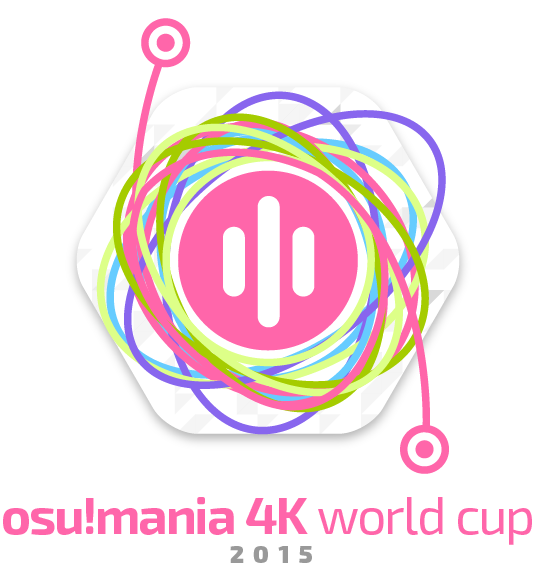
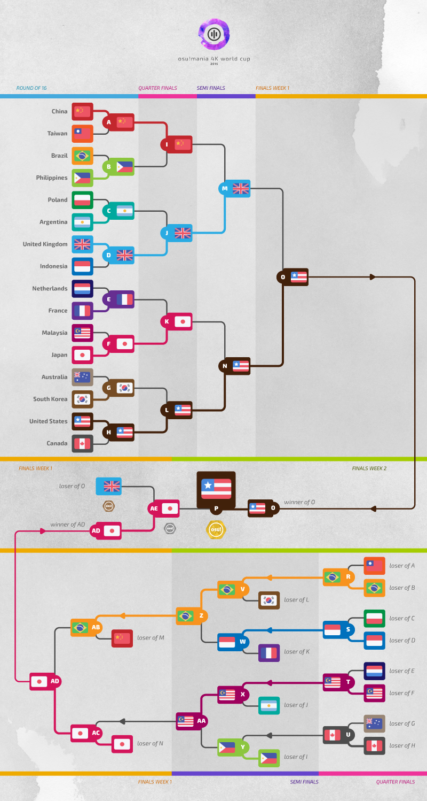
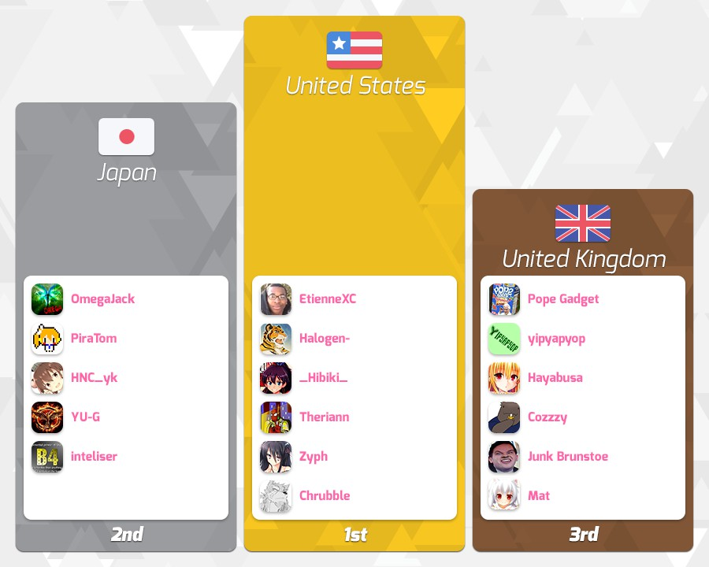

---
tags:
  - MWC 2015
  - MWC 4K 2015
  - MWC2015
  - MWC4K 2015
---

# osu!mania 4K World Cup 2015

The **osu!mania 4K World Cup 2015** (***MWC 4K 2015***) was a country-based osu!mania 4K tournament hosted by the [osu! team](/wiki/People/osu!_team). It was the second instalment of the osu!mania 4K World Cup.

## Tournament schedule

| Event | Timestamp |
| --: | :-- |
| Registration phase | 2015-07-13/2015-08-02 |
| Live drawings | 2015-08-16 (14:00 UTC) |
| Group stage | 2015-08-22/2015-08-23 |
| Round of 16 | 2015-08-30 |
| Quarterfinals | 2015-09-05/2015-09-06 |
| Semifinals | 2015-09-12/2015-09-13 |
| Finals week 1 | 2015-09-19/2015-09-20 |
| Finals week 2 | 2015-09-27 |

## Prizes

| Placing | Prizes |
| :-: | :-- |
|  | 6 months of osu!supporter, unique profile badge, osu! merchandise, "osu!mania Champion" user title for one year |
|  | 3 months of osu!supporter, unique profile badge |
|  | 1 month of osu!supporter, unique profile badge |

  

## Organisation

The osu!mania 4K World Cup 2015 was run by various community members.

| Position | Member(s) |
| :-- | :-- |
| Manager | ::{ flag=ES }:: [Deif](https://osu.ppy.sh/users/318565), ::{ flag=DE }:: [Loctav](https://osu.ppy.sh/users/71366), ::{ flag=DE }:: [p3n](https://osu.ppy.sh/users/123703), ::{ flag=FR }:: [shARPII](https://osu.ppy.sh/users/776257) |
| Mappool selector | ::{ flag=TW }:: [Spy](https://osu.ppy.sh/users/1217122), ::{ flag=GB }:: [Starry-](https://osu.ppy.sh/users/2166199) |
| Streamer | ::{ flag=DE }:: [Loctav](https://osu.ppy.sh/users/71366), ::{ flag=PL }:: [Marcin](https://osu.ppy.sh/users/722665) |
| Commentator | ::{ flag=NZ }:: [deadbeat](https://osu.ppy.sh/users/128370), ::{ flag=US }:: [Halogen-](https://osu.ppy.sh/users/169992), ::{ flag=AR }:: [juankristal](https://osu.ppy.sh/users/443656), ::{ flag=CA }:: [Tasha](https://osu.ppy.sh/users/1031958), ::{ flag=US }:: [Zak](https://osu.ppy.sh/users/1375955), ::{ flag=US }:: [ztrot](https://osu.ppy.sh/users/6347) |
| Statistician | ::{ flag=PL }:: [Marcin](https://osu.ppy.sh/users/722665) |

## Links

- [Discussion thread](https://osu.ppy.sh/community/forums/topics/345431)
- [Livestream](https://www.twitch.tv/osulive)

## Participants

|  | Country | Members |
| :-: | :-: | :-- |
| ::{ flag=AR }:: | **Argentina** | **[juankristal](https://osu.ppy.sh/users/443656)**, [Grindei](https://osu.ppy.sh/users/4228356), [lxLucasxl](https://osu.ppy.sh/users/3632846), [n1nj4](https://osu.ppy.sh/users/4540361), [Ryuk\_ftw](https://osu.ppy.sh/users/2628463), [Ze\_Potente](https://osu.ppy.sh/users/4272364) |
| ::{ flag=AU }:: | **Australia** | **[Alchalyne](https://osu.ppy.sh/users/3999031)**, [Aroused Lollies](https://osu.ppy.sh/users/2956184), [CannuJul](https://osu.ppy.sh/users/3601697), [MasterSonic10](https://osu.ppy.sh/users/1249224), [Tornspirit](https://osu.ppy.sh/users/1338883), [-X Y Z-](https://osu.ppy.sh/users/1610833) |
| ::{ flag=BR }:: | **Brazil** | **[NateTheROOBIN](https://osu.ppy.sh/users/2288363)**, [FelipeLink](https://osu.ppy.sh/users/4917435), [Guilhermeziat](https://osu.ppy.sh/users/3661387), [LuckySonicGHz](https://osu.ppy.sh/users/3949268), [roko100789](https://osu.ppy.sh/users/3224958), [spoonguy](https://osu.ppy.sh/users/932381) |
| ::{ flag=CA }:: | **Canada** | **[beary605](https://osu.ppy.sh/users/2198070)**, [Ashix-](https://osu.ppy.sh/users/981144), [Bites](https://osu.ppy.sh/users/1671598), [CammyKun](https://osu.ppy.sh/users/3607503), [KenjiTomika](https://osu.ppy.sh/users/3895749), [Slyhand](https://osu.ppy.sh/users/4789720) |
| ::{ flag=CL }:: | **Chile** | **[Urusai](https://osu.ppy.sh/users/469808)**, [akonee-chan](https://osu.ppy.sh/users/4811164), [Garrus Brouker](https://osu.ppy.sh/users/4601944), [knito12](https://osu.ppy.sh/users/4987038), [sasuke3000](https://osu.ppy.sh/users/560981), [soulbaster](https://osu.ppy.sh/users/4262648) |
| ::{ flag=CN }:: | **China** | **[Wind God Boy](https://osu.ppy.sh/users/3003417)**, [\[Crz\]Jun](https://osu.ppy.sh/users/4301792), [\[Crz\]Lucifer](https://osu.ppy.sh/users/5270332), [\[Crz\]ScSolAr](https://osu.ppy.sh/users/1591215), [\[Crz\]Sword](https://osu.ppy.sh/users/5242158), [\[Crz\]ZhangFan](https://osu.ppy.sh/users/89545) |
| ::{ flag=DK }:: | **Denmark** | **[Jole](https://osu.ppy.sh/users/2883132)**, [Ciggins](https://osu.ppy.sh/users/4570124), [Demane](https://osu.ppy.sh/users/2886774), [Hemppas Waifu](https://osu.ppy.sh/users/3795152), [mart732c](https://osu.ppy.sh/users/4402263) |
| ::{ flag=FI }:: | **Finland** | **[Jepetski](https://osu.ppy.sh/users/3794665)**, [DesuMetal](https://osu.ppy.sh/users/5014674), [Diidzyh](https://osu.ppy.sh/users/1497090), [MarkMayFire](https://osu.ppy.sh/users/4508575), [Princesswell](https://osu.ppy.sh/users/4789005), [Spidu](https://osu.ppy.sh/users/5192) |
| ::{ flag=FR }:: | **France** | **[lim38](https://osu.ppy.sh/users/2741170)**, [adrien062](https://osu.ppy.sh/users/2131990), [Elementaires](https://osu.ppy.sh/users/2284328), [Shadowzyx](https://osu.ppy.sh/users/3384640), [Todestrieb](https://osu.ppy.sh/users/4056690), [Yami Le Lama](https://osu.ppy.sh/users/888986) |
| ::{ flag=DE }:: | **Germany** | **[Dualshock](https://osu.ppy.sh/users/1902591)**, [- Bad Apple -](https://osu.ppy.sh/users/4282445), [\[timefrozen\]](https://osu.ppy.sh/users/3921273), [Feerum](https://osu.ppy.sh/users/4815717), [Reikokaz](https://osu.ppy.sh/users/1263173), [rohen04](https://osu.ppy.sh/users/369614) |
| ::{ flag=ID }:: | **Indonesia** | **[E1sa](https://osu.ppy.sh/users/3183277)**, [\[ex-StepM\] Ano](https://osu.ppy.sh/users/4515859), [DoNotMess](https://osu.ppy.sh/users/1596318), [ExKagii-](https://osu.ppy.sh/users/4591324), [Flame\_Rune](https://osu.ppy.sh/users/3282208), [gaktau1234](https://osu.ppy.sh/users/3777233) |
| ::{ flag=IL }:: | **Israel** | **[-Zero-](https://osu.ppy.sh/users/4192103)**, [Avdi](https://osu.ppy.sh/users/4382773), [CookChefSteak](https://osu.ppy.sh/users/3069698), [Shahar664](https://osu.ppy.sh/users/3448980) |
| ::{ flag=IT }:: | **Italy** | **[\[ C r a c k \]](https://osu.ppy.sh/users/3628274)**, [NixoNS](https://osu.ppy.sh/users/6380163), [rik30031](https://osu.ppy.sh/users/3281583), [superbala98](https://osu.ppy.sh/users/4280549), [TheOwnerAlpha](https://osu.ppy.sh/users/3461860) |
| ::{ flag=JP }:: | **Japan** | **[OmegaJack](https://osu.ppy.sh/users/205391)**, [ashradwimps](https://osu.ppy.sh/users/5165305), [HNC\_yk](https://osu.ppy.sh/users/2163585), [inteliser](https://osu.ppy.sh/users/1824775), [PiraTom](https://osu.ppy.sh/users/1847698), [YU-G](https://osu.ppy.sh/users/6367706) |
| ::{ flag=MY }:: | **Malaysia** | **[Cryolien](https://osu.ppy.sh/users/1626983)**, [KagaNyan](https://osu.ppy.sh/users/438109), [kaname-san92](https://osu.ppy.sh/users/764535), [mssheng1998](https://osu.ppy.sh/users/1343562), [Sern888](https://osu.ppy.sh/users/2089244), [seyren95](https://osu.ppy.sh/users/1761259) |
| ::{ flag=MX }:: | **Mexico** | **[-SP556](https://osu.ppy.sh/users/6031847)**, [\[Mixel\]](https://osu.ppy.sh/users/4861880), [alex\_sennin](https://osu.ppy.sh/users/3549708), [Batman301](https://osu.ppy.sh/users/5027853), [Leydan](https://osu.ppy.sh/users/2851324), [Zetscythe](https://osu.ppy.sh/users/3360499) |
| ::{ flag=NL }:: | **Netherlands** | **[Tifyron](https://osu.ppy.sh/users/4519755)**, [Arras](https://osu.ppy.sh/users/1023599), [nebbii](https://osu.ppy.sh/users/3799729), [Redon](https://osu.ppy.sh/users/3572355), [slimmecodo1](https://osu.ppy.sh/users/1800103), [Vytaan](https://osu.ppy.sh/users/56908) |
| ::{ flag=NZ }:: | **New Zealand** | **[Mudkips](https://osu.ppy.sh/users/2502706)**, [- T y l e r -](https://osu.ppy.sh/users/4636461), [Dionysaw](https://osu.ppy.sh/users/4294475), [FantumEX](https://osu.ppy.sh/users/3394802), [Nyao](https://osu.ppy.sh/users/2068663), [w33p1ng4ng31](https://osu.ppy.sh/users/1963937) |
| ::{ flag=NO }:: | **Norway** | **[Staiain](https://osu.ppy.sh/users/86188)**, [Hjeg](https://osu.ppy.sh/users/2764122), [Liqh](https://osu.ppy.sh/users/3409838), [MOEpaw](https://osu.ppy.sh/users/3043738), [NekoFlaa](https://osu.ppy.sh/users/80640), [The Quarryman](https://osu.ppy.sh/users/2713295) |
| ::{ flag=PE }:: | **Peru** | **[akuma123](https://osu.ppy.sh/users/914472)**, [2axterix2](https://osu.ppy.sh/users/1282989), [Amakaire](https://osu.ppy.sh/users/4471271), [jepchus45](https://osu.ppy.sh/users/2372182) |
| ::{ flag=PH }:: | **Philippines** | **[Tokiiwa](https://osu.ppy.sh/users/4029511)**, [Aiko-neechan](https://osu.ppy.sh/users/5546195), [Ainyan](https://osu.ppy.sh/users/3770641), [arcwinolivirus](https://osu.ppy.sh/users/2039089), [gunxblade128](https://osu.ppy.sh/users/6573652), [RonAcuisa](https://osu.ppy.sh/users/3034081) |
| ::{ flag=PL }:: | **Poland** | **[Tidek](https://osu.ppy.sh/users/743282)**, [-Kamikaze-](https://osu.ppy.sh/users/2124783), [Krolxp](https://osu.ppy.sh/users/6382502), [Moskas](https://osu.ppy.sh/users/1934077), [SitekX](https://osu.ppy.sh/users/3840946), [TheZiemniax](https://osu.ppy.sh/users/2235750) |
| ::{ flag=RU }:: | **Russian Federation** | **[PhobosX](https://osu.ppy.sh/users/2570019)**, [AJIekceu](https://osu.ppy.sh/users/940656), [burnmyshadow](https://osu.ppy.sh/users/5950), [Dereku](https://osu.ppy.sh/users/2607745), [MisterPlegas](https://osu.ppy.sh/users/3677208), [sanjizzle](https://osu.ppy.sh/users/2172690) |
| ::{ flag=SG }:: | **Singapore** | **[danielrox](https://osu.ppy.sh/users/4893212)**, [Degojix](https://osu.ppy.sh/users/3655301), [DFC Tan](https://osu.ppy.sh/users/5704437), [kimchi97](https://osu.ppy.sh/users/3722725), [NeroXVI](https://osu.ppy.sh/users/3584991), [The5e4I](https://osu.ppy.sh/users/3710926) |
| ::{ flag=KR }:: | **South Korea** | **[Runa](https://osu.ppy.sh/users/4643294)**, [\[ Raven \]](https://osu.ppy.sh/users/6542193), [Backho-](https://osu.ppy.sh/users/1868086), [In\_Fo](https://osu.ppy.sh/users/1704592), [pocket123](https://osu.ppy.sh/users/4220388), [SeonRae](https://osu.ppy.sh/users/288233) |
| ::{ flag=SE }:: | **Sweden** | **[Rilipworldwide](https://osu.ppy.sh/users/4238239)**, [fjz345](https://osu.ppy.sh/users/3376734), [Frobom3](https://osu.ppy.sh/users/4668555), [GringoSEVEN1](https://osu.ppy.sh/users/3213412), [Vaiche](https://osu.ppy.sh/users/4268678), [WannabeCparn](https://osu.ppy.sh/users/2090864) |
| ::{ flag=TW }:: | **Taiwan** | **[MimF7\_tw](https://osu.ppy.sh/users/4135993)**, [Aya123544](https://osu.ppy.sh/users/4842590), [j1515jjj1313](https://osu.ppy.sh/users/1801343), [luckygino](https://osu.ppy.sh/users/1967808), [Sakaki](https://osu.ppy.sh/users/2656856), [y85782122](https://osu.ppy.sh/users/2287176) |
| ::{ flag=TH }:: | **Thailand** | **[\[13\] BECK](https://osu.ppy.sh/users/2656374)**, [divaviva](https://osu.ppy.sh/users/2221251), [irisdevil](https://osu.ppy.sh/users/2623676), [-Loli\-Sora-](https://osu.ppy.sh/users/4183185), [Noobish](https://osu.ppy.sh/users/502592), [oat0005](https://osu.ppy.sh/users/4110257) |
| ::{ flag=GB }:: | **United Kingdom** | **[Pope Gadget](https://osu.ppy.sh/users/2288341)**, [Cozzzy](https://osu.ppy.sh/users/2003917), [Hayabusa](https://osu.ppy.sh/users/3104108), [Junk Brunstoe](https://osu.ppy.sh/users/4676382), [Mat](https://osu.ppy.sh/users/2668921), [yipyapyop](https://osu.ppy.sh/users/5156656) |
| ::{ flag=US }:: | **United States** | **[EtienneXC](https://osu.ppy.sh/users/5610085)**, [\_Hibiki\_](https://osu.ppy.sh/users/4830970), [Chrubble](https://osu.ppy.sh/users/2594280), [Halogen-](https://osu.ppy.sh/users/169992), [Theriann](https://osu.ppy.sh/users/4552987), [Zyph](https://osu.ppy.sh/users/1600432) |
| ::{ flag=VE }:: | **Venezuela** | **[Kankenaisanxd](https://osu.ppy.sh/users/4698537)**, [Besbinbo](https://osu.ppy.sh/users/4437819), [rakion269](https://osu.ppy.sh/users/2693272) |
| ::{ flag=VN }:: | **Vietnam** | **[Devilchilly](https://osu.ppy.sh/users/2656302)**, [Purrinya](https://osu.ppy.sh/users/2915643), [Yuuto Gaming](https://osu.ppy.sh/users/4774715) |

## Groups

| Group | Top seed | High seed | Low seed | Unseeded |
| :-: | :-- | :-- | :-- | :-- |
| **A** | ::{ flag=CN }:: China | ::{ flag=CA }:: Canada | ::{ flag=TH }:: Thailand | ::{ flag=VE }:: Venezuela |
| **B** | ::{ flag=ID }:: Indonesia | ::{ flag=NL }:: Netherlands | ::{ flag=NO }:: Norway | ::{ flag=RU }:: Russian Federation |
| **C** | ::{ flag=BR }:: Brazil | ::{ flag=KR }:: South Korea | ::{ flag=SG }:: Singapore | ::{ flag=PE }:: Peru |
| **D** | ::{ flag=JP }:: Japan | ::{ flag=PL }:: Poland | ::{ flag=NZ }:: New Zealand | ::{ flag=MX }:: Mexico |
| **E** | ::{ flag=MY }:: Malaysia | ::{ flag=AR }:: Argentina | ::{ flag=DK }:: Denmark | ::{ flag=SE }:: Sweden |
| **F** | ::{ flag=AU }:: Australia | ::{ flag=PH }:: Philippines | ::{ flag=DE }:: Germany | ::{ flag=IT }:: Italy |
| **G** | ::{ flag=GB }:: United Kingdom | ::{ flag=FR }:: France | ::{ flag=FI }:: Finland | ::{ flag=IL }:: Israel |
| **H** | ::{ flag=US }:: United States | ::{ flag=TW }:: Taiwan | ::{ flag=CL }:: Chile | ::{ flag=VN }:: Vietnam |

## Podium

## Mappools

### Finals

**This mappool was played during the Finals week 1 and Finals week 2.**

**[Download the mappack here!](https://www.mediafire.com/download/3z76r2xd707sl2n/MWC_4K_2015_Finals.rar)**

- FreeMod
  1. [LeaF - LeaF Style Super Shredder (Cherry Blossom) \[Fullerene's 4K Shredder\]](https://osu.ppy.sh/beatmapsets/179779#mania/443034)
  2. [455-38B - Gengaozo\_Foon (Shoegazer) \[Another\]](https://osu.ppy.sh/beatmapsets/297148#mania/667077)
  3. [Anthony Donato - The Scales of Struggle (Staiain) \[Collab Extreme\]](https://osu.ppy.sh/beatmapsets/193512#mania/459755)
  4. [UNDEAD CORPORATION - The Empress scream off ver (TheZiemniax) \[Jepetski's Empress\]](https://osu.ppy.sh/beatmapsets/315435#mania/713128)
  5. [Yooh - Ice Angel (Zenx) \[April's Euphoria\]](https://osu.ppy.sh/beatmapsets/320247#mania/712625)
  6. [-45 - 44river (snover) \[final\]](https://osu.ppy.sh/beatmapsets/337669#mania/747021)
  7. [DJKurara - Japanese Transformation (Fullerene-) \[Shift\]](https://osu.ppy.sh/beatmapsets/294908#mania/662860)
  8. [Camellia as "Bang Riot" - Blastix Riotz (Spy) \[GRAVITY Lv.16\]](https://osu.ppy.sh/beatmapsets/1011768#mania/2117613)
  9. [The Ghost of 3.13 - Forgotten (Shoegazer) \[Forgotten Collab\]](https://osu.ppy.sh/beatmapsets/338665#mania/749258)
  10. [sun3 - Messier 333 (inteliser) \[UNLIMITED\]](https://osu.ppy.sh/beatmapsets/354621#mania/781090)
  11. [Yu\_Asahina - Trickstarz (hi19hi19) \[STEPMANIA\]](https://osu.ppy.sh/beatmapsets/349432#mania/770548)
  12. [Danny Baranowsky - The Battle of Lil' Slugger (Ch 1 Boss Extended Cut) (250bpm) (Staiain) \[Insane\]](https://osu.ppy.sh/beatmapsets/79839#mania/222593)
  13. [antiPLUR - Speed of Link (Shoegazer) \[Extra\]](https://osu.ppy.sh/beatmapsets/335798#mania/743282)
  14. [Shiraishi - Odin (Fullerene-) \[VIKINGFJORD\]](https://osu.ppy.sh/beatmapsets/352759#mania/777356)
  15. [Kobaryo feat. t+pazolite - Yura-Yura Sweet Genocide (spoonguy) \[YuRa-yUrA\]](https://osu.ppy.sh/beatmapsets/352950#mania/777706)
  16. [Chroma - Sayonara Planet Wars (\_FrEsH\_ChICkEn\_) \[GRAVITY\]](https://osu.ppy.sh/beatmapsets/318594#mania/709402)
  17. [Luxion - High-Priestess (inteliser) \[UNLIMITED\]](https://osu.ppy.sh/beatmapsets/355523#mania/782753)
  18. [Fleshgod Apocalypse - Conspiracy Of Silence (Shoegazer) \[Collab Onslaught\]](https://osu.ppy.sh/beatmapsets/311777#mania/696289)
- Tiebreaker
  1. **[xi - PEACE BREAKER (Fullerene-) \[FINAL PUNISHMENT\]](https://osu.ppy.sh/beatmapsets/352754#mania/777348)**

### Semifinals

**[Download the mappack here!](https://www.mediafire.com/download/mwzkd8fx1hb8973/MWC_4K_2015_Semifinals.rar)**

- FreeMod
  1. [you - Hold Angel (Shoegazer) \[Insane\]](https://osu.ppy.sh/beatmapsets/292422#mania/763511)
  2. [COOL&CREATE - BEAT-NEW-WORLD (Feerum) \[Jinjin's GRAVITY Lv.16\]](https://osu.ppy.sh/beatmapsets/315640#mania/716737)
  3. [3034 - NS18 (Fullerene-) \[EXTREME\]](https://osu.ppy.sh/beatmapsets/352757#mania/777353)
  4. [ZiGZaG HACKER - V^3 (Hello World) (Quick Draw) \[4K SC\]](https://osu.ppy.sh/beatmapsets/325939#mania/723816)
  5. [xi - Hesperides (Ichigaki) \[Master\]](https://osu.ppy.sh/beatmapsets/309328#mania/735806)
  6. [Utsu-P feat.Kagamine Rin - Tokyo Teddy Bear (puxtu) \[SHD\]](https://osu.ppy.sh/beatmapsets/318207#mania/747621)
  7. [Kaneko Chiharu - Yukionna (CannuJul) \[Jepetski's GRAVITY\]](https://osu.ppy.sh/beatmapsets/349475#mania/772991)
  8. [siromaru - Absurd Gaff (arcwinolivirus) \[Assassination \[SC\]\]](https://osu.ppy.sh/beatmapsets/347496#mania/766794)
  9. [xi - Quietus Ray (DE-CADE) \[Ichi's INFINITE Lv.16\]](https://osu.ppy.sh/beatmapsets/217951#mania/517247)
  10. [Daiki Kasho - John Tanaka's Theme (Shoegazer) \[Astrofalcon\]](https://osu.ppy.sh/beatmapsets/308935#mania/690803)
  11. [Hermit - Dysnomia (-Kamikaze-) \[Tidek's 4K Monochrome\]](https://osu.ppy.sh/beatmapsets/303999#mania/763657)
  12. [LV.4 - Angel dust (LeiN-) \[Another\]](https://osu.ppy.sh/beatmapsets/122792#mania/704844)
  13. [xi - Blue Zenith (Jepetski) \[Zen's Black Another\]](https://osu.ppy.sh/beatmapsets/312514#mania/718163)
  14. [SD-501 - Cyberstorm (DJKurara Remix) (Quick Draw) \[4K SC\]](https://osu.ppy.sh/beatmapsets/290128#mania/654145)
  15. [Nightmare - Dream To Nightmare (Shoegazer) \[Catatonia (SV)\]](https://osu.ppy.sh/beatmapsets/352121#mania/775984)
  16. [The Quick Brown Fox - WANDERLUST (Nivrad00) \[Jinjin's 4K Extra\]](https://osu.ppy.sh/beatmapsets/201571#mania/530698)
- Tiebreaker
  1. **[goreshit - burn this moment into the retina of my eye (Tidek) \[Fear\]](https://osu.ppy.sh/beatmapsets/309881#mania/692640)**

### Quarterfinals

**[Download the mappack here!](https://www.mediafire.com/download/0dhr36bhyp8lzwb/MWC_4K_2015_Quarter_Finals.rar)**

- FreeMod
  1. [xi - Garyou Tensei (LNP-) \[4K MX\]](https://osu.ppy.sh/beatmapsets/210610#mania/530544)
  2. [Helblinde - Grief & Malice (Fullerene-) \[4K Kriemhild Gretchen\]](https://osu.ppy.sh/beatmapsets/239943#mania/554655)
  3. [SasakureP - bokura no 16bit warz (CrazyStar) \[16bit\]](https://osu.ppy.sh/beatmapsets/278143#mania/630173)
  4. [loz - Cinderella Cage -Trancecore Mix- (Jepetski) \[Lunatic\]](https://osu.ppy.sh/beatmapsets/310764#mania/694425)
  5. [ZOGRAPHOS (Yu\_Asahina+Yamajet) - Verse IV (Ichigaki) \[EXHAUST\]](https://osu.ppy.sh/beatmapsets/264749#mania/603737)
  6. [sun3 - ApolloN (bbu2) \[LeiN-'s 4K Insane\]](https://osu.ppy.sh/beatmapsets/290702#mania/669917)
  7. [wa. remixed celas - Gin no Kaze (Marirose) \[4K Another\]](https://osu.ppy.sh/beatmapsets/340297#mania/752775)
  8. [Izayoi Sak - Blue Planet (Shoegazer) \[Another\]](https://osu.ppy.sh/beatmapsets/322476#mania/716960)
  9. [Soleily - Renatus (Tidek) \[Insane\]](https://osu.ppy.sh/beatmapsets/239048#mania/552746)
  10. [xi - Wish upon Twin Stars (LNP-) \[EXHAUST Lv.15\]](https://osu.ppy.sh/beatmapsets/232650#mania/540060)
  11. [Camellia - overcomplexification (Starry-) \[Lv.10\]](https://osu.ppy.sh/beatmapsets/323493#mania/718998)
  12. [High Speed Music Team Sharpnel - M.A.M.A. (arcwinolivirus) \[MX\]](https://osu.ppy.sh/beatmapsets/176446#mania/429550)
  13. [BlackY - Black Rose (Marirose) \[4K Another\]](https://osu.ppy.sh/beatmapsets/206998#mania/668992)
  14. [xi - Aragami (Blocko) \[snover's 4K Another\]](https://osu.ppy.sh/beatmapsets/344198#mania/760458)
- Tiebreaker
  1. **[Camellia - Lunatic Rough Party (Ichigaki) \[Lunatic\]](https://osu.ppy.sh/beatmapsets/286262#mania/646319)**

### Round of 16

**[Download the map pack here!](https://www.mediafire.com/download/a2deedhozg0wzcm/MWC_4K_2015_Round_of_16_.rar)**

- FreeMod
  1. [Junk - Qualia (Mashiro-Fang) \[S.Star's 4K MX\]](https://osu.ppy.sh/beatmapsets/177155#mania/432217)
  2. [ikaruga\_nex - gigadelic(m3rkAb4\# R3m!x) (Starry-) \[EXHAUST Lv.13\]](https://osu.ppy.sh/beatmapsets/247963#mania/751036)
  3. [Soleily - Violet Soul (Spy) \[victorica's GRAVITY Lv.15\]](https://osu.ppy.sh/beatmapsets/235126#mania/554742)
  4. [Orangestar - Asu no Yozora Shoukaihan (LovinYou) \[Insane\]](https://osu.ppy.sh/beatmapsets/303122#mania/679332)
  5. [BlackY's BEATFLOOR - Creutz=Wilknare (Short Ver.) (SanadaYukimura) \[Insane\]](https://osu.ppy.sh/beatmapsets/285730#mania/651992)
  6. [Hige Driver join. SELEN - Dadadadadadadadadada (victorica\_db) \[Lv.14\]](https://osu.ppy.sh/beatmapsets/237342#mania/549360)
  7. [Tatsh - HEAVENLY MOON (Spy) \[EXTREME\]](https://osu.ppy.sh/beatmapsets/243654#mania/561923)
  8. [Yooh - Shanghai Kouchakan \~ Chinese Tea Orchid Remix (SanadaYukimura) \[EXHAUST\]](https://osu.ppy.sh/beatmapsets/258121#mania/590575)
  9. [Junk - Yellow Smile(bms edit) (Starry-) \[Another\]](https://osu.ppy.sh/beatmapsets/302726#mania/678460)
  10. [C-Show - Invitation from Mr.C (\_FrEsH\_ChICkEn\_) \[EXHAUST\]](https://osu.ppy.sh/beatmapsets/293235#mania/659683)
  11. [P\*Light - TRIGGER\*HAPPY (Kuo Kyoka) \[Spy's 4K EXHAUST Lv.20\]](https://osu.ppy.sh/beatmapsets/125856#mania/323459)
  12. [S-C-U - Ambitious (\[ A v a l o n \]) \[Spy's Another\]](https://osu.ppy.sh/beatmapsets/340517#mania/753220)
  13. [Seiryu - Water Horizon (Spy) \[victorica's 4K ExtrA\]](https://osu.ppy.sh/beatmapsets/134829#mania/360805)
  14. [ETIA. - Nihonshiki Koukaku-OukaRanman- (Taiwan-NAK) \[Lv.15\]](https://osu.ppy.sh/beatmapsets/264127#mania/602235)
- Tiebreaker
  1. **[Halozy - Kanshou no Matenrou (Feerum) \[World's End\]](https://osu.ppy.sh/beatmapsets/251365#mania/577429)**

### Group stage

**[Download the map pack here!](https://www.mediafire.com/download/ea93b8bb99w1vt5/MWC_4K_2015_Group_Stage.rar)**

- FreeMod
  1. [Qrispy Joybox - snow prism (LNP-) \[MX\]](https://osu.ppy.sh/beatmapsets/186096#mania/487578)
  2. [yak\_won - Lucid (Critical\_Star) \[MX\]](https://osu.ppy.sh/beatmapsets/200945#mania/476043)
  3. [Vospi - We Met Dat Night (Halogen-) \[MX\]](https://osu.ppy.sh/beatmapsets/151453#mania/374172)
  4. [Ryu\* - We're so Happy (Spy) \[victorica's 4K HD+\]](https://osu.ppy.sh/beatmapsets/120838#mania/314892)
  5. [Ryu\* - Sakura Mirage (Spy) \[ADVANCED Lv.12\]](https://osu.ppy.sh/beatmapsets/183272#mania/439140)
  6. [Tokisawa Nao - Analyze (Heart of Bitch) \[ecafree2's 4K SC\]](https://osu.ppy.sh/beatmapsets/173152#mania/429628)
  7. [nora2r - VISION (SanadaYukimura) \[ADVANCED\]](https://osu.ppy.sh/beatmapsets/325566#mania/723147)
  8. [S-C-U feat. Qrispy Joybox - anemone (Starry-) \[Special\]](https://osu.ppy.sh/beatmapsets/261301#mania/738032)
  9. [Celas - Azul (Remix) (Marirose) \[Bie' Hyper\]](https://osu.ppy.sh/beatmapsets/320956#mania/714074)
  10. [SHK - Couple Breaking (Sky\_Demon) \[MX\]](https://osu.ppy.sh/beatmapsets/153199#mania/376721)
  11. [Qrispy Joybox feat.mao - Good-bye Tears (LNP-) \[MX\]](https://osu.ppy.sh/beatmapsets/281717#mania/637229)
  12. [3R2 - Beyond the Horizon (hokin1995) \[MX\]](https://osu.ppy.sh/beatmapsets/215305#mania/505719)
- Tiebreaker
  1. **[Momobako & Aihara Kaori - Senbonzakura (victorica\_db) \[Insane\]](https://osu.ppy.sh/beatmapsets/209952#mania/494045)**

## Match results

### Finals week 2

Sunday, 27 September 2015:

| Team 1 |  |  | Team 2 | Match link |
| --: | :-: | :-: | :-- | :-- |
| **United States** ::{ flag=US }:: | **7** | 0 | ::{ flag=JP }:: Japan | [#1](https://osu.ppy.sh/community/matches/19202583) |

### Finals week 1

Saturday, 19 September 2015:

| Team 1 |  |  | Team 2 | Match link |
| --: | :-: | :-: | :-- | :-- |
| Malaysia ::{ flag=MY }:: | 0 | **6** | ::{ flag=JP }:: **Japan** | [#1](https://osu.ppy.sh/community/matches/19033684) |
| China ::{ flag=CN }:: | 0 | **6** | ::{ flag=BR }:: **Brazil** | [#1](https://osu.ppy.sh/community/matches/19035062) |
| **Japan** ::{ flag=JP }:: | **6** | 1 | ::{ flag=BR }:: Brazil | [#1](https://osu.ppy.sh/community/matches/19036723) |
| United Kingdom ::{ flag=GB }:: | 0 | **6** | ::{ flag=US }:: **United States** | [#1](https://osu.ppy.sh/community/matches/19047914) |

Sunday, 20 September 2015:

| Team 1 |  |  | Team 2 | Match link |
| --: | :-: | :-: | :-- | :-- |
| United Kingdom ::{ flag=GB }:: | 3 | **6** | ::{ flag=JP }:: **Japan** | [#1](https://osu.ppy.sh/community/matches/19064573) |

### Semifinals

Saturday, 12 September 2015:

| Team 1 |  |  | Team 2 | Match link |
| --: | :-: | :-: | :-- | :-- |
| **Brazil** ::{ flag=BR }:: | **6** | 1 | ::{ flag=KR }:: South Korea | [#1](https://osu.ppy.sh/community/matches/18875865) |
| Japan ::{ flag=JP }:: | 0 | **6** | ::{ flag=US }:: **United States** | [#1](https://osu.ppy.sh/community/matches/18876734) |
| Canada ::{ flag=CA }:: | 2 | **6** | ::{ flag=PH }:: **Philippines** | [#1](https://osu.ppy.sh/community/matches/18877878) |
| **Indonesia** ::{ flag=ID }:: | **6** | 1 | ::{ flag=FR }:: France | [#1](https://osu.ppy.sh/community/matches/18884689) |
| China ::{ flag=CN }:: | 0 | **6** | ::{ flag=GB }:: **United Kingdom** | [#1](https://osu.ppy.sh/community/matches/18885939) |
| **Malaysia** ::{ flag=MY }:: | **0** | -1 | ::{ flag=AR }:: Argentina | *win by default* |

Sunday, 13 September 2015:

| Team 1 |  |  | Team 2 | Match link |
| --: | :-: | :-: | :-- | :-- |
| **Malaysia** ::{ flag=MY }:: | **6** | 5 | ::{ flag=PH }:: Philippines | [#1](https://osu.ppy.sh/community/matches/18916080) |
| **Brazil** ::{ flag=BR }:: | **6** | 3 | ::{ flag=ID }:: Indonesia | [#1](https://osu.ppy.sh/community/matches/18917606) |

### Quarterfinals

Saturday, 5 September 2015:

| Team 1 |  |  | Team 2 | Match link |
| --: | :-: | :-: | :-- | :-- |
| Netherlands ::{ flag=NL }:: | 1 | **5** | ::{ flag=MY }:: **Malaysia** | [#1](https://osu.ppy.sh/community/matches/18735213) |
| France ::{ flag=FR }:: | 0 | **5** | ::{ flag=JP }:: **Japan** | [#1](https://osu.ppy.sh/community/matches/18736038) |
| **China** ::{ flag=CN }:: | **5** | 1 | ::{ flag=PH }:: Philippines | [#1](https://osu.ppy.sh/community/matches/18737149) |
| Taiwan ::{ flag=TW }:: | 0 | **5** | ::{ flag=BR }:: **Brazil** | [#1](https://osu.ppy.sh/community/matches/18739049) |
| Poland ::{ flag=PL }:: | 0 | **5** | ::{ flag=ID }:: **Indonesia** | [#1](https://osu.ppy.sh/community/matches/18740464) |
| Argentina ::{ flag=AR }:: | 0 | **5** | ::{ flag=GB }:: **United Kingdom** | [#1](https://osu.ppy.sh/community/matches/18741841) |

Sunday, 6 September 2015:

| Team 1 |  |  | Team 2 | Match link |
| --: | :-: | :-: | :-- | :-- |
| Australia ::{ flag=AU }:: | 0 | **5** | ::{ flag=CA }:: **Canada** | [#1](https://osu.ppy.sh/community/matches/18754356) |
| South Korea ::{ flag=KR }:: | 0 | **5** | ::{ flag=US }:: **United States** | [#1](https://osu.ppy.sh/community/matches/18755307) |

### Round of 16

Sunday, 30 August 2015:

| Team 1 |  |  | Team 2 | Match link |
| --: | :-: | :-: | :-- | :-- |
| Australia ::{ flag=AU }:: | 1 | **5** | ::{ flag=KR }:: **South Korea** | [#1](https://osu.ppy.sh/community/matches/18606478) |
| **China** ::{ flag=CN }:: | **5** | 1 | ::{ flag=TW }:: Taiwan | [#1](https://osu.ppy.sh/community/matches/18607469) |
| Malaysia ::{ flag=MY }:: | 0 | **5** | ::{ flag=JP }:: **Japan** | [#1](https://osu.ppy.sh/community/matches/18608519) |
| Brazil ::{ flag=BR }:: | 2 | **5** | ::{ flag=PH }:: **Philippines** | [#1](https://osu.ppy.sh/community/matches/18609649) |
| **United Kingdom** ::{ flag=GB }:: | **5** | 3 | ::{ flag=ID }:: Indonesia | [#1](https://osu.ppy.sh/community/matches/18612279) |
| Netherlands ::{ flag=NL }:: | 1 | **5** | ::{ flag=FR }:: **France** | [#1](https://osu.ppy.sh/community/matches/18613709) |
| Poland ::{ flag=PL }:: | 1 | **5** | ::{ flag=AR }:: **Argentina** | [#1](https://osu.ppy.sh/community/matches/18614619) |
| **United States** ::{ flag=US }:: | **5** | 0 | ::{ flag=CA }:: Canada | [#1](https://osu.ppy.sh/community/matches/18616004) |

### Group stage

Saturday, 22 August 2015:

| Team 1 |  |  | Team 2 | Match link |
| --: | :-: | :-: | :-- | :-- |
| Germany ::{ flag=DE }:: | 0 | **4** | ::{ flag=AU }:: **Australia** | [#1](https://osu.ppy.sh/community/matches/18414849) |
| Denmark ::{ flag=DK }:: | 0 | **4** | ::{ flag=MY }:: **Malaysia** | [#1](https://osu.ppy.sh/community/matches/18414855) |
| Netherlands ::{ flag=NL }:: | 1 | **4** | ::{ flag=ID }:: **Indonesia** | [#1](https://osu.ppy.sh/community/matches/18414897) |
| Singapore ::{ flag=SG }:: | 0 | **4** | ::{ flag=KR }:: **South Korea** | [#1](https://osu.ppy.sh/community/matches/18414915) |
| Poland ::{ flag=PL }:: | 0 | **4** | ::{ flag=JP }:: **Japan** | [#1](https://osu.ppy.sh/community/matches/18414935) |
| Italy ::{ flag=IT }:: | 1 | **4** | ::{ flag=PH }:: **Philippines** | [#1](https://osu.ppy.sh/community/matches/18416078) |
| **Vietnam** ::{ flag=VN }:: | **0** | -1 | ::{ flag=CL }:: Chile | *win by default* |
| Thailand ::{ flag=TH }:: | 0 | **4** | ::{ flag=CN }:: **China** | [#1](https://osu.ppy.sh/community/matches/18416085) |
| **South Korea** ::{ flag=KR }:: | **4** | 0 | ::{ flag=BR }:: Brazil | [#1](https://osu.ppy.sh/community/matches/18416088) |
| **Argentina** ::{ flag=AR }:: | **4** | 3 | ::{ flag=MY }:: Malaysia | [#1](https://osu.ppy.sh/community/matches/18417719) |
| Israel ::{ flag=IL }:: | -1 | **0** | ::{ flag=GB }:: **United Kingdom** | *win by default* |
| Finland ::{ flag=FI }:: | 0 | **4** | ::{ flag=FR }:: **France** | [#1](https://osu.ppy.sh/community/matches/18417753) |
| Norway ::{ flag=NO }:: | 0 | **4** | ::{ flag=ID }:: **Indonesia** | [#1](https://osu.ppy.sh/community/matches/18417757) |
| **Russian Federation** ::{ flag=RU }:: | **4** | 2 | ::{ flag=NO }:: Norway | [#1](https://osu.ppy.sh/community/matches/18422906) |
| Peru ::{ flag=PE }:: | 0 | **4** | ::{ flag=BR }:: **Brazil** | [#1](https://osu.ppy.sh/community/matches/18422912) |
| Sweden ::{ flag=SE }:: | 0 | **4** | ::{ flag=AR }:: **Argentina** | [#1](https://osu.ppy.sh/community/matches/18422917) |
| Israel ::{ flag=IL }:: | -1 | **0** | ::{ flag=FR }:: **France** | *win by default* |
| Venezuela ::{ flag=VE }:: | -1 | **0** | ::{ flag=CA }:: **Canada** | *win by default* |
| Chile ::{ flag=CL }:: | -1 | **0** | ::{ flag=US }:: **United States** | *win by default* |

Sunday, 23 August 2015:

| Team 1 |  |  | Team 2 | Match link |
| --: | :-: | :-: | :-- | :-- |
| Mexico ::{ flag=MX }:: | 0 | **4** | ::{ flag=NZ }:: **New Zealand** | [#1](https://osu.ppy.sh/community/matches/18432722) |
| Peru ::{ flag=PE }:: | 0 | **4** | ::{ flag=KR }:: **South Korea** | [#1](https://osu.ppy.sh/community/matches/18432751) |
| Taiwan ::{ flag=TW }:: | -1 | **0** | ::{ flag=US }:: **United States** | *win by default* |
| Peru ::{ flag=PE }:: | 1 | **4** | ::{ flag=SG }:: **Singapore** | [#1](https://osu.ppy.sh/community/matches/18433719) |
| Venezuela ::{ flag=VE }:: | -1 | **0** | ::{ flag=CN }:: **China** | *win by default* |
| Mexico ::{ flag=MX }:: | 0 | **4** | ::{ flag=JP }:: **Japan** | [#1](https://osu.ppy.sh/community/matches/18433722) |
| Thailand ::{ flag=TH }:: | -1 | **0** | ::{ flag=CA }:: **Canada** | *win by default* |
| Vietnam ::{ flag=VN }:: | 0 | **4** | ::{ flag=US }:: **United States** | [#1](https://osu.ppy.sh/community/matches/18434727) |
| **Philippines** ::{ flag=PH }:: | **4** | 1 | ::{ flag=AU }:: Australia | [#1](https://osu.ppy.sh/community/matches/18434735) |
| Canada ::{ flag=CA }:: | 1 | **4** | ::{ flag=CN }:: **China** | [#1](https://osu.ppy.sh/community/matches/18435863) |
| New Zealand ::{ flag=NZ }:: | 0 | **4** | ::{ flag=JP }:: **Japan** | [#1](https://osu.ppy.sh/community/matches/18435867) |
| Finland ::{ flag=FI }:: | 0 | **4** | ::{ flag=GB }:: **United Kingdom** | [#1](https://osu.ppy.sh/community/matches/18439906) |
| New Zealand ::{ flag=NZ }:: | 0 | **4** | ::{ flag=PL }:: **Poland** | [#1](https://osu.ppy.sh/community/matches/18439907) |
| Vietnam ::{ flag=VN }:: | -1 | **0** | ::{ flag=TW }:: **Taiwan** | *win by default* |
| Italy ::{ flag=IT }:: | 0 | **4** | ::{ flag=AU }:: **Australia** | [#1](https://osu.ppy.sh/community/matches/18439909) |
| Sweden ::{ flag=SE }:: | 1 | **4** | ::{ flag=MY }:: **Malaysia** | [#1](https://osu.ppy.sh/community/matches/18440710) |
| Germany ::{ flag=DE }:: | 0 | **4** | ::{ flag=PH }:: **Philippines** | [#1](https://osu.ppy.sh/community/matches/18440711) |
| Russian Federation ::{ flag=RU }:: | 0 | **4** | ::{ flag=ID }:: **Indonesia** | [#1](https://osu.ppy.sh/community/matches/18440713) |
| Chile ::{ flag=CL }:: | -1 | **0** | ::{ flag=TW }:: **Taiwan** | *win by default* |
| Singapore ::{ flag=SG }:: | 3 | **4** | ::{ flag=BR }:: **Brazil** | [#1](https://osu.ppy.sh/community/matches/18444296) |
| Sweden ::{ flag=SE }:: | 1 | **4** | ::{ flag=DK }:: **Denmark** | [#1](https://osu.ppy.sh/community/matches/18444297) |
| Russian Federation ::{ flag=RU }:: | 0 | **4** | ::{ flag=NL }:: **Netherlands** | [#1](https://osu.ppy.sh/community/matches/18444298) |
| Venezuela ::{ flag=VE }:: | -1 | **0** | ::{ flag=TH }:: **Thailand** | *win by default* |
| Israel ::{ flag=IL }:: | -1 | **0** | ::{ flag=FI }:: **Finland** | *win by default* |
| Italy ::{ flag=IT }:: | 0 | **4** | ::{ flag=DE }:: **Germany** | [#1](https://osu.ppy.sh/community/matches/18446806) |
| Mexico ::{ flag=MX }:: | -1 | **0** | ::{ flag=PL }:: **Poland** | *win by default* |
| Norway ::{ flag=NO }:: | 0 | **4** | ::{ flag=NL }:: **Netherlands** | [#1](https://osu.ppy.sh/community/matches/18447966) |
| Denmark ::{ flag=DK }:: | 0 | **4** | ::{ flag=AR }:: **Argentina** | [#1](https://osu.ppy.sh/community/matches/18447967) |
| **France** ::{ flag=FR }:: | **4** | 1 | ::{ flag=GB }:: United Kingdom | [#1](https://osu.ppy.sh/community/matches/18447968) |

## Ruleset

### Tournament rules

1. The osu!mania 4K World Cup is a country-based team tournament, played on the osu!mania game mode on 4-key specific beatmaps.
2. The maps for each round will be announced by the mapset selector in advance on the Sunday before the actual matches take place. Only these will be used during the respective matches.
   - One map will be given as a tiebreaker map. This map will only be played in case of a tie.
   - All maps are in a FreeMod bracket.
3. Match schedule will be settled by the Tournament Management (see below).
4. If no staff or referee is available, the match will be postponed.
5. Failed players' scores do not get added to the team score.
   - Reviving and surviving during a map gets considered as passing it.
6. Use of the [Visual Settings](/wiki/Client/Interface/Visual_settings) options are allowed.
7. If the game ends in a draw, the game will be nullified.
8. If a player disconnects, they get treated as if they failed the map.
9. Maps cannot be reused in the same match unless the game was nullified.
10. If less than the minimum required players attend, the maximum time the match can be postponed is 10 minutes.
11. Exchanging players during a match is allowed.
12. Lag is not a valid reason to nullify a map.
13. In Group stage, 'Win by default' will be considered as win by 4:0, +1.0 score difference ratio.
14. Unexpected incidences are handled by the Tournament Management.
15. Any modification of these rules will be announced.

### Tournament registration

1. Every user interested in joining their country's team signs up individually.
   - Tournament Management will create a list of potential candidates for a country's team.
   - Tournament Management declares one candidate to the captain of the country's team, albeit temporarily.
   - The declared captain can form their team from the candidate list of their country.
2. To ensure valid and serious registrations, every registered user will be checked by the Tournament Management.
   - Every registered user will be assigned to their respective country's candidate list.
   - To be successfully accepted on the list, you have to ensure that your global osu!mania performace ranking is above \#5000.
   - To be successfully accepted on the list, you have to ensure that you did not violate the [osu! community rules](/wiki/Rules) within the last 12 months.
3. All successfully formed teams will be published after the Registration Phase.
4. Mapset selectors may not participate as a player in this tournament.

### Stage instructions

1. In the first stage (Group Stage), the teams will be divided into 8 groups of 4 teams.
   - This may change according to the final amount of formed teams.

2. All the teams from each group will face each other.

3. Rankings of each group are determined by sorting the results of each team's performance in the following priority:
   - Most matches won.
   - Have higher `{(the number of maps won) - (the number of maps defeated)}`.
   - Most maps won.
   - Have higher `∑{(total score difference) / (maximum score)}`.
   - Winner of the rematch.

4. The top 2 teams of each group will move on to the Knock-Out Stages.
   - This may change with the actual Group Stage setup.

5. Following stages are Double Elimination Stages. This means that the winner moves to the next stage and the losing team gets moved to the Loser bracket.

6. Based on [this image](/wiki/shared/stages-visual.png), the stages are split up into the following:

   | Stage | Match ID |
   | --: | :-- |
   | Round of 16 | A, B, C, D, E, F, G, H |
   | Quarterfinals | I, J, K, L & R, S, T, U |
   | Semifinals | M, N & V, W, X, Y, Z, AA |
   | Finals | O & AB, AC, AD, AE |
   | Grand Finals | P, Q |

7. The **Winning conditions** for each stage will be:
   - In Group Stage, you need to win 4 maps to win a match. (Best-of-7)
   - In the Round of 16 and the Quarterfinals, you need to win 5 maps to win a match. (Best-of-9)
   - In Semifinals and Finals, you need to win 6 maps to win a match. (Best-of-11)
   - In Grand Finals, you need to win 7 maps to win the match. (Best-of-13)

### Match instructions

1. A referee will create a multiplayer room 15 minutes in advance. Players must gather during this period.
   - Room settings are osu!mania, Team-Vs., Win Condition: 'Score'. Room name must be "MWC 4K 2015: (TeamBlue) vs (TeamRed)".
   - The team mentioned first in the room name must be the blue team, the team mentioned second in the room name must be the red team.
2. Players are free to select up to two warm-up maps. Using beatmaps with questionable content is prohibited. All maps must be 4K-specific osu!mania maps.
3. Each captain can ban two beatmaps to be selected from the pool. These beatmaps are not allowed to be picked by any team in the entire match.
   - Both vetos must always be used.
4. Beatmap selection will alternate between each captain selecting a beatmap out of the map pool.
5. Each captain must use `!roll` once in `#multiplayer`.
   - The winner of the `!roll` starts picking the first beatmap of the match.
   - The loser of the `!roll` starts banning two beatmaps.
6. Captains may pick freely from any bracket.
   - In case of a tie, the tiebreaker map must be played.
7. Results will be published via Statistics site.

### Mappool instructions

1. There will be 1 mappool for the Group Stage, 1 mappool for Round 16, 1 mappool for the Quarterfinals, 1 mappool for the Semifinals and 1 mappool for the Finals.
   - Finals & Grand Finals use the same mappool.
2. Mappool size varies depending on the stage.
   - 12 FreeMod maps in Group Stage.
   - 14 FreeMod maps in Round of 16 and Quarterfinals, respectively.
   - 16 FreeMod maps in Semifinals and Finals, respectively.
3. Each mappool has one tiebreaker.
4. All maps, including the tiebreaker, will be played on FreeMod condition.
   - Every individual player can pick [Hidden](/wiki/Gameplay/Game_modifier/Hidden), [FadeIn](/wiki/Gameplay/Game_modifier/Fade_In) and [Flashlight](/wiki/Gameplay/Game_modifier/Flashlight) or no mode at all.

### Scheduling instructions

1. Each stage will be held on **a single weekend**.
2. Matches in Group Stage may overlap.
3. All matches will be held on either Saturday or Sunday, UTC+0.
4. Scheduling will be handled by the Tournament Management. Schedules will be released on the Sunday before the first matches of the actual stage. Tournament Management will try to create the schedule to respect the participant's time zone.
5. Captains are responsible for their team's availability. The greater team size exists to ensure every team can provide at least three players for each match. If teams can not provide three players for a match, the match will be considered forfeited.
