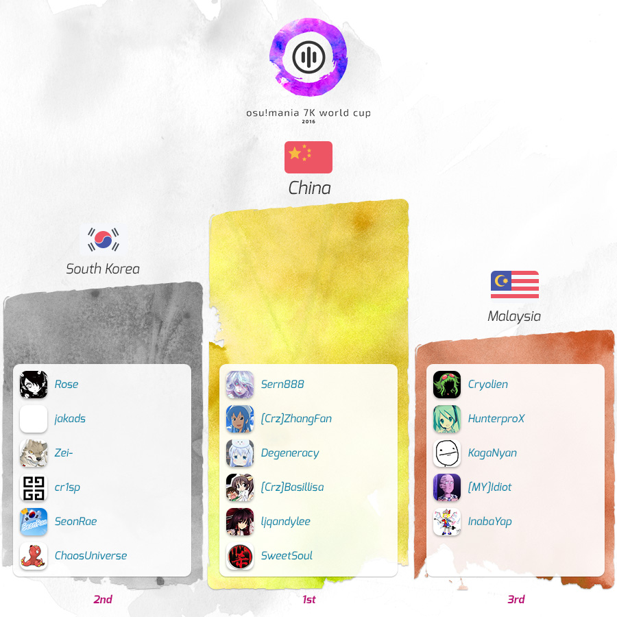

---
tags:
  - MWC 2016
  - MWC 7K 2016
  - MWC2016
  - MWC7K 2016
---

# osu!mania 7K World Cup 2016

The **osu!mania 7K World Cup 2016** (***MWC 7K 2016***) was a country-based osu!mania 7K tournament hosted by the [osu! team](/wiki/People/osu!_team). It was the second instalment of the osu!mania 7K World Cup.

## Tournament schedule

| Event | Timestamp |
| --: | :-- |
| Registration phase | 2015-12-01/2015-12-20 |
| Live drawings | 2016-01-03 (14:00 UTC) |
| Group stage | 2016-01-09/2016-01-10 |
| Round of 16 | 2016-01-16 |
| Quarterfinals | 2016-01-23 |
| Semifinals | 2016-01-30/2016-01-31 |
| Finals week 1 | 2016-02-06/2016-02-07 |
| Finals week 2 | 2016-02-14 |

## Prizes

There was a $1,900 cash prize pool with extra money being added by buying support banners to show support for their teams!

| Placing | Prizes |
| :-: | :-- |
|  | 50% of the raised prize pool, unique profile badge, "osu!mania Champion" user title for one year |
|  | 38% of the raised prize pool, unique profile badge |
|  | 12% of the raised prize pool, unique profile badge |

  

## Organisation

The osu!mania 7K World Cup 2016 was run by various community members.

| Position | Member(s) |
| :-- | :-- |
| Manager | ::{ flag=ES }:: [Deif](https://osu.ppy.sh/users/318565), ::{ flag=DE }:: [Loctav](https://osu.ppy.sh/users/71366), ::{ flag=DE }:: [p3n](https://osu.ppy.sh/users/123703), ::{ flag=FR }:: [shARPII](https://osu.ppy.sh/users/776257) |
| Mappool selector | ::{ flag=PL }:: [-Kamikaze-](https://osu.ppy.sh/users/2124783), ::{ flag=GB }:: [Starry-](https://osu.ppy.sh/users/2166199) |
| Mapper | ::{ flag=SG }:: [Evening](https://osu.ppy.sh/users/2193881) |
| Streamer | ::{ flag=DE }:: [Loctav](https://osu.ppy.sh/users/71366), ::{ flag=PL }:: [Marcin](https://osu.ppy.sh/users/722665) |
| Commentator | ::{ flag=US }:: [Azlynn](https://osu.ppy.sh/users/7016667), ::{ flag=NZ }:: [deadbeat](https://osu.ppy.sh/users/128370), ::{ flag=SG }:: [DJNightmare](https://osu.ppy.sh/users/70909), ::{ flag=US }:: [Halogen-](https://osu.ppy.sh/users/169992), ::{ flag=AR }:: [juankristal](https://osu.ppy.sh/users/443656), ::{ flag=US }:: [Zak](https://osu.ppy.sh/users/1375955), ::{ flag=US }:: [ztrot](https://osu.ppy.sh/users/6347) |
| Statistician | ::{ flag=PL }:: [Marcin](https://osu.ppy.sh/users/722665) |

## Links

- [Discussion thread](https://osu.ppy.sh/community/forums/topics/615787)
- [Livestream](https://www.twitch.tv/osulive)
- **[Group Stage statistics here!](https://docs.google.com/spreadsheets/d/1rUBWY0m7faZ9dFNkaVhXxJ9bpqAjHUZR8xRmHFxjoEs/pubhtml)**

## Participants

|  | Country | Members |
| :-: | :-: | :-- |
| ::{ flag=AU }:: | **Australia** | **[zKskita](https://osu.ppy.sh/users/457515)**, [Alchalyne](https://osu.ppy.sh/users/3999031), [ApocaZumbee](https://osu.ppy.sh/users/3431615), [Evios](https://osu.ppy.sh/users/2058022), [sankansuki](https://osu.ppy.sh/users/2877926), [Tornspirit](https://osu.ppy.sh/users/1338883) |
| ::{ flag=BR }:: | **Brazil** | **[NateTheROOBIN](https://osu.ppy.sh/users/2288363)**, [Keweft](https://osu.ppy.sh/users/75777), [Pesaac](https://osu.ppy.sh/users/2882138), [roko100789](https://osu.ppy.sh/users/3224958), [spoonguy](https://osu.ppy.sh/users/932381), [zZ\_Natsu\_Zz](https://osu.ppy.sh/users/4685756) |
| ::{ flag=CA }:: | **Canada** | **[Ashix-](https://osu.ppy.sh/users/981144)**, [arsonisfun](https://osu.ppy.sh/users/3157167), [-kazu](https://osu.ppy.sh/users/3205712), [Lithifloresca](https://osu.ppy.sh/users/2814282), [Prim-](https://osu.ppy.sh/users/103255), [SkyDemon13](https://osu.ppy.sh/users/4108187) |
| ::{ flag=CN }:: | **China** | **[Sern888](https://osu.ppy.sh/users/2089244)**, [\[Crz\]ZhangFan](https://osu.ppy.sh/users/89545), [Basillisa](https://osu.ppy.sh/users/6004963), [Degeneracy](https://osu.ppy.sh/users/427355), [ljqandylee](https://osu.ppy.sh/users/141469), [SweetSoul](https://osu.ppy.sh/users/220624) |
| ::{ flag=FR }:: | **France** | **[Elementaires](https://osu.ppy.sh/users/2284328)**, [bumpinho](https://osu.ppy.sh/users/1594604), [CharlisMadCut](https://osu.ppy.sh/users/2863607), [lim38](https://osu.ppy.sh/users/2741170), [PyaKura](https://osu.ppy.sh/users/2284536), [Yami Le Lama](https://osu.ppy.sh/users/888986) |
| ::{ flag=DE }:: | **Germany** | **[rohen04](https://osu.ppy.sh/users/369614)**, [\[Kazuto\]](https://osu.ppy.sh/users/3204488), [Dualshock](https://osu.ppy.sh/users/1902591), [Phil](https://osu.ppy.sh/users/3191489), [Reikokaz](https://osu.ppy.sh/users/1263173) |
| ::{ flag=ID }:: | **Indonesia** | **[Nyooo](https://osu.ppy.sh/users/2319372)**, [Astray-](https://osu.ppy.sh/users/3397008), [Fiea](https://osu.ppy.sh/users/3183277), [Kephin](https://osu.ppy.sh/users/5033561), [projectc1](https://osu.ppy.sh/users/2663343), [tenri-ayukawa](https://osu.ppy.sh/users/3185294) |
| ::{ flag=IT }:: | **Italy** | **[Ikkun](https://osu.ppy.sh/users/1059945)**, [\[DaYan\]](https://osu.ppy.sh/users/17439), [TheOwnerAlpha](https://osu.ppy.sh/users/3461860), [Uqia](https://osu.ppy.sh/users/1990732) |
| ::{ flag=JP }:: | **Japan** | **[OmegaJack](https://osu.ppy.sh/users/205391)**, [HNC\_yk](https://osu.ppy.sh/users/2163585), [inteliser](https://osu.ppy.sh/users/1824775), [metyabo](https://osu.ppy.sh/users/623773) |
| ::{ flag=MY }:: | **Malaysia** | **[Cryolien](https://osu.ppy.sh/users/1626983)**, [\[MY\]Idiot](https://osu.ppy.sh/users/2059742), [HunterproX](https://osu.ppy.sh/users/1343562), [InabaYap](https://osu.ppy.sh/users/2041034), [KagaNyan](https://osu.ppy.sh/users/438109) |
| ::{ flag=NO }:: | **Norway** | **[Liqh](https://osu.ppy.sh/users/3409838)**, [ArcticFqx](https://osu.ppy.sh/users/4100949), [Hjeg](https://osu.ppy.sh/users/2764122), [Staiain](https://osu.ppy.sh/users/86188) |
| ::{ flag=PH }:: | **Philippines** | **[BjornGV](https://osu.ppy.sh/users/1636180)**, [-BlueFire-](https://osu.ppy.sh/users/1192936), [kei101895](https://osu.ppy.sh/users/3032245), [Lenfried-](https://osu.ppy.sh/users/5314573), [technowaves](https://osu.ppy.sh/users/4072820) |
| ::{ flag=PL }:: | **Poland** | **[Modren](https://osu.ppy.sh/users/1828621)**, [Ereedon](https://osu.ppy.sh/users/1887068), [Hudonom](https://osu.ppy.sh/users/1654221), [SitekX](https://osu.ppy.sh/users/3840946), [Tidek](https://osu.ppy.sh/users/743282), [Transformau5](https://osu.ppy.sh/users/3109917) |
| ::{ flag=RU }:: | **Russian Federation** | **[Daleenie](https://osu.ppy.sh/users/1540597)**, [AJIekceu](https://osu.ppy.sh/users/940656), [Akary](https://osu.ppy.sh/users/3912608), [DarkSider2442](https://osu.ppy.sh/users/1130069), [Kivicat](https://osu.ppy.sh/users/2790640), [PhobosX](https://osu.ppy.sh/users/2570019) |
| ::{ flag=SG }:: | **Singapore** | **[danielrox](https://osu.ppy.sh/users/4893212)**, [DFC Tan](https://osu.ppy.sh/users/5704437), [DJNightmare](https://osu.ppy.sh/users/70909), [Evening](https://osu.ppy.sh/users/2193881), [Level 51](https://osu.ppy.sh/users/3617847), [Paralit](https://osu.ppy.sh/users/876528) |
| ::{ flag=KR }:: | **South Korea** | **[Rose](https://osu.ppy.sh/users/2276572)**, [ChaosUniverse](https://osu.ppy.sh/users/6600984), [cr1sp](https://osu.ppy.sh/users/5332153), [jakads](https://osu.ppy.sh/users/259972), [SeonRae](https://osu.ppy.sh/users/288233), [Zei-](https://osu.ppy.sh/users/1530308) |
| ::{ flag=SE }:: | **Sweden** | **[Rilipworldwide](https://osu.ppy.sh/users/4238239)**, [Cparn](https://osu.ppy.sh/users/3395312), [venus212](https://osu.ppy.sh/users/3664680), [VortexCoyote](https://osu.ppy.sh/users/4999669) |
| ::{ flag=TW }:: | **Taiwan** | **[c36098651](https://osu.ppy.sh/users/2048577)**, [mliencheng](https://osu.ppy.sh/users/586659), [SacredReisen](https://osu.ppy.sh/users/2232063), [Super Radio](https://osu.ppy.sh/users/2452290), [Taiwan-YRK](https://osu.ppy.sh/users/2115269), [y85782122](https://osu.ppy.sh/users/2287176) |
| ::{ flag=GB }:: | **United Kingdom** | **[Hayabusa](https://osu.ppy.sh/users/3104108)**, [Fee](https://osu.ppy.sh/users/3121449), [Mat](https://osu.ppy.sh/users/2668921), [Pope Gadget](https://osu.ppy.sh/users/2288341), [Vygatron](https://osu.ppy.sh/users/3628783) |
| ::{ flag=US }:: | **United States** | **[Blocko](https://osu.ppy.sh/users/4075092)**, [Flippopotamus](https://osu.ppy.sh/users/3565377), [Gekido-](https://osu.ppy.sh/users/4693052), [iJinjin](https://osu.ppy.sh/users/3360737), [Nivrad00](https://osu.ppy.sh/users/1984634), [Sillyveon](https://osu.ppy.sh/users/3936677) |

## Groups

| Group | Top seed | High seed | Medium seed | Low seed | Unseeded |
| :-: | :-- | :-- | :-- | :-- | :-- |
| **A** | ::{ flag=JP }:: Japan | ::{ flag=GB }:: United Kingdom | ::{ flag=SG }:: Singapore | ::{ flag=RU }:: Russian Federation | ::{ flag=SE }:: Sweden |
| **B** | ::{ flag=KR }:: South Korea | ::{ flag=BR }:: Brazil | ::{ flag=FR }:: France | ::{ flag=DE }:: Germany | ::{ flag=CA }:: Canada |
| **C** | ::{ flag=US }:: United States | ::{ flag=MY }:: Malaysia | ::{ flag=TW }:: Taiwan | ::{ flag=PL }:: Poland | ::{ flag=NO }:: Norway |
| **D** | ::{ flag=CN }:: China | ::{ flag=ID }:: Indonesia | ::{ flag=AU }:: Australia | ::{ flag=PH }:: Philippines | ::{ flag=IT }:: Italy |

## Podium

## Mappools

### Finals

**This mappool was played during the Finals week 1 and Finals week 2.**

**[Download the mappack here!](https://www.mediafire.com/download/9179zq7bew4tj72/MWC_7K_2016_Finals.rar)**

- FreeMod
  1. [Betwixt & Between - 12 little fragments of silence (Fullerene-) \[............\]](https://osu.ppy.sh/beatmapsets/206097#mania/486159)
  2. [Reol - Streaming Heart (SeonRae) \[7K KSR\]](https://osu.ppy.sh/beatmapsets/386644#mania/844168)
  3. [ZUN remixed by LeaF - Resurrection Spell (pporse) \[Resurrection\]](https://osu.ppy.sh/beatmapsets/356708#mania/851023)
  4. [Kakumi Nishigomi - Hyakka Ryouran (ArcherLove) \[Gamelan\]](https://osu.ppy.sh/beatmapsets/380865#mania/833293)
  5. [gmtn. (witch's slave) - furioso melodia (Z3nx) \[el fin.\_VII obj.lZenxl\]](https://osu.ppy.sh/beatmapsets/302889#mania/678816)
  6. [senya - Tsuki ni Murakumo Hana ni Kaze (17VA) \[Lunatic\]](https://osu.ppy.sh/beatmapsets/254589#mania/583877)
  7. [xi - Aragami (Blocko) \[7K Finale\]](https://osu.ppy.sh/beatmapsets/344198#mania/760453)
  8. [LeaF - Doppelganger (iJinjin) \[You? (^^) Me?\]](https://osu.ppy.sh/beatmapsets/407153#mania/884617)
  9. [kemu feat.GUMI - Kamisama Nejimaki (-Kamikaze-) \[It's Killing Me...\]](https://osu.ppy.sh/beatmapsets/374146#mania/819643)
  10. [150P - Underdog Supremacist (Aqo) \[7\_biginner\]](https://osu.ppy.sh/beatmapsets/343853#mania/759704)
  11. [Zeami - Music Revolver (Entozer) \[Hard\]](https://osu.ppy.sh/beatmapsets/130464#mania/329057)
  12. [MEGA & Tatsh - Weave Detonator (Ciel) \[Unraveling Destruction\]](https://osu.ppy.sh/beatmapsets/312935#mania/698696)
  13. [goreshit - Satori De Pon! (qodtjr) \[HaRaSho\]](https://osu.ppy.sh/beatmapsets/400292#mania/871018)
  14. [void - Just Hold on (To All Fighters) (Blocko) \[Extra\]](https://osu.ppy.sh/beatmapsets/409440#mania/888793)
  15. [Anegasaki Nei - ZENITHALIZE (Evening) \[Meridian of Time\]](https://osu.ppy.sh/beatmapsets/410552#mania/890961)
  16. [EBICO - Slit O (Nivrad00) \[Another\]](https://osu.ppy.sh/beatmapsets/325867#mania/723703)
  17. [S.S.H. - Intersect Thunderbolt-Remix (ljqandylee) \[7K Exceed\]](https://osu.ppy.sh/beatmapsets/127305#mania/323070)
  18. [IOSYS feat. Takatsuki Sakura - Seiya no Special Shooting Star (yoshilove) \[7K Star\]](https://osu.ppy.sh/beatmapsets/179403#mania/431300)
- Tiebreaker
  1. **[xi - Blue Zenith (iJinjin) \[Stratosphere\]](https://osu.ppy.sh/beatmapsets/290031#mania/891715)**

### Semifinals

**[Download the mappack here!](https://www.mediafire.com/download/xr20mjchibn373n/MWC_7K_2016_Semifinals.rar)**

- FreeMod
  1. [sun3 - ApolloN (bbu2) \[7K Extreme\]](https://osu.ppy.sh/beatmapsets/290702#mania/654831)
  2. [Sasaki Sayaka - Koi Saku Mirai (hutunohito) \[7K Black Another\]](https://osu.ppy.sh/beatmapsets/160570#mania/392261)
  3. [LOLI RIPE - Be My Pet! (Evening) \[Zen really likes lolis\]](https://osu.ppy.sh/beatmapsets/407410#mania/885078)
  4. [ESTi - Ghostly Band \~ Phantom Ensemble (ArcherLove) \[Phantom Curtain\]](https://osu.ppy.sh/beatmapsets/291343#mania/756026)
  5. [Mastermind(xi+nora2r) - Dreadnought (PyaKura) \[Hyperspace\]](https://osu.ppy.sh/beatmapsets/361643#mania/794499)
  6. [Y..J - Ten Thousand Tons of Anonymous Letters (123Sherlock) \[tangjinxi's Lv.36\]](https://osu.ppy.sh/beatmapsets/293585#mania/660352)
  7. [gmtn. vs. kozato (fw. LUZE) - squartatrice (pporse) \[Miki Sayaka vs. Oktavia Von Seckendorff\]](https://osu.ppy.sh/beatmapsets/388160#mania/846925)
  8. [ChouCho - starlog (17VA) \[Luminescence\]](https://osu.ppy.sh/beatmapsets/254713#mania/584133)
  9. [Ayatsugu\_Otowa - Tsumetai Missitsu to Hakasetachi no Huyajyou (LeiN-) \[Jinjin's Cold Nocturne\]](https://osu.ppy.sh/beatmapsets/339198#mania/759385)
  10. [m108 - \*Crow Solace\* (KawaEE) \[Kawather LV.17 For Delay\]](https://osu.ppy.sh/beatmapsets/357835#mania/787014)
  11. [Kucchi - Satori \~3rd EyEs (Maiz94) \[7K SC\]](https://osu.ppy.sh/beatmapsets/398094#mania/865684)
  12. [Cres - End Time (PyaKura) \[Afterword\]](https://osu.ppy.sh/beatmapsets/154929#mania/548945)
  13. [yuikonnu - Uchouten Vivace (17VA) \[Vivace\]](https://osu.ppy.sh/beatmapsets/318413#mania/709055)
  14. [cosMo@BousouP - Oceanus (Z3nx) \[Z7XTRA\]](https://osu.ppy.sh/beatmapsets/261977#mania/597959)
  15. [Reizoko Cj - CirnoRHTL (Nivrad00) \[Extra\]](https://osu.ppy.sh/beatmapsets/400818#mania/872039)
  16. [xi - Garyou Tensei (LNP-) \[Million's 7K SC\]](https://osu.ppy.sh/beatmapsets/210610#mania/530560)
- Tiebreaker
  1. **[DJ Sharpnel - Back to the Gate (pporse) \[El Psy Congroo\]](https://osu.ppy.sh/beatmapsets/305124#mania/683424)**

### Quarterfinals

**[Download the mappack here!](https://www.mediafire.com/download/kn50d6pa5akm9xs/MWC_7K_2016_Quarterfinals.rar)**

- FreeMod
  1. [xi - Valhalla (Remillion Cross) \[Usagi's White Another\]](https://osu.ppy.sh/beatmapsets/257079#mania/593403)
  2. [yuikonnu - Souzou Forest (17VA) \[Lv.34\]](https://osu.ppy.sh/beatmapsets/165716#mania/403124)
  3. [SHK - Halloween Party (DarkSider2442) \[Extra\]](https://osu.ppy.sh/beatmapsets/242159#mania/572480)
  4. [TREKKIE TRAX - Bright (Sushi Killer Remix) (Agka) \[Meteor\]](https://osu.ppy.sh/beatmapsets/328466#mania/728489)
  5. [P\*Light feat. mow\*2 - OVERDRIVERS (ExUsagi) \[INFINITE\]](https://osu.ppy.sh/beatmapsets/196172#mania/565759)
  6. [P\*Light - Sakura Reflection (P\*Light Slayer Remix) (Kuo Kyoka) \[7K OVERBOARD Lv.32\]](https://osu.ppy.sh/beatmapsets/154156#mania/383041)
  7. [masaki - Rhythmical Planet (ljqandylee) \[Collab\]](https://osu.ppy.sh/beatmapsets/82460#mania/228210)
  8. [Nhato - Miss You (BilliumMoto) \[Gaze\]](https://osu.ppy.sh/beatmapsets/204326#mania/839674)
  9. [myon - G Free \~ Final Dream (PROGUY) \[Lunatic\]](https://osu.ppy.sh/beatmapsets/171090#mania/416517)
  10. [The Flashbulb - Chik Habit (iJinjin) \[they'll be spitting in your eye\]](https://osu.ppy.sh/beatmapsets/404314#mania/879060)
  11. [void - Valedict (pwhk) \[Black Another\]](https://osu.ppy.sh/beatmapsets/217583#mania/545590)
  12. [Igorrr - Fryzura Konika (Agka) \[deceit\]](https://osu.ppy.sh/beatmapsets/312559#mania/697682)
  13. [w\_tre respect for AT&HU - Schur's Theorem (Nivrad00) \[Another\]](https://osu.ppy.sh/beatmapsets/258553#mania/591311)
  14. [MiddleIsland - Delrio (Remillion Cross) \[Jinjin's Insane\]](https://osu.ppy.sh/beatmapsets/277125#mania/645632)
- Tiebreaker
  1. **[Neru - Ningen Shikkaku (puxtu) \[Blocko's 7K SC\]](https://osu.ppy.sh/beatmapsets/239471#mania/553618)**

### Round of 16

**[Download the mappack here!](https://www.mediafire.com/download/042busdr49rxz51/MWC_7K_2016_Round_of_16.rar)**

- FreeMod
  1. [M2U - Quo Vadis (JamesHappy15) \[lZenxl's 7K SHD\]](https://osu.ppy.sh/beatmapsets/227037#mania/908806)
  2. [C-SHOW - Workaholic (Agka) \[Extra\]](https://osu.ppy.sh/beatmapsets/77441#mania/217377)
  3. [MiddleIsland - Achromat (iJinjin) \[Blocko's 7K Insane\]](https://osu.ppy.sh/beatmapsets/195940#mania/534336)
  4. [Breakmaster Cylinder - The Italian Crack Job (Nivrad00) \[Insane\]](https://osu.ppy.sh/beatmapsets/225139#mania/525443)
  5. [Kicco - Shunkan Spline (yoshilove) \[Maximum\]](https://osu.ppy.sh/beatmapsets/159623#mania/389874)
  6. [CELLON. - Madpakke (\[ C r a c k\]) \[richard's 7K Another\]](https://osu.ppy.sh/beatmapsets/304248#mania/709818)
  7. [S-C-U feat. Qrispy Joybox - anemone (Julie) \[Kawa & Julie's 7K Extra\]](https://osu.ppy.sh/beatmapsets/283841#mania/672098)
  8. [Venetian Snares - Ketsarku Mozgalom (wizardoffail) \[i remember being happy\]](https://osu.ppy.sh/beatmapsets/347300#mania/766439)
  9. [Primary - Negative Legacy (Reikosaka) \[Skalim's Maximum\]](https://osu.ppy.sh/beatmapsets/171847#mania/456748)
  10. [XinYueBingBing - Tsun Neko no Waltz (Harbyter) \[LordRaika's 7K MX\]](https://osu.ppy.sh/beatmapsets/225142#mania/543984)
  11. [Azu - Haryu (asd123iii) \[Another\]](https://osu.ppy.sh/beatmapsets/183478#mania/524443)
  12. [xi vs sakuzyo - STORIA (Kyousuke-) \[Julie & Kawawa's 7K Insane\]](https://osu.ppy.sh/beatmapsets/330438#mania/840837)
  13. [nano - No pain, No game (Takane6) \[Million's 7K Insane\]](https://osu.ppy.sh/beatmapsets/249553#mania/660048)
  14. [Jeff Williams & Casey Lee Williams - This Will Be the Day (James Landino's Magical Girl Remix) (Fullerene-) \[Agka's 7K MX\]](https://osu.ppy.sh/beatmapsets/179991#mania/433193)
- Tiebreaker
  1. **[takamatt feat. GUMI - TOKIO FUNKA (-Kamikaze-) \[Mid-Summer Marathon\]](https://osu.ppy.sh/beatmapsets/539611#mania/1144249)**

### Group stage

**[Download the mappack here!](https://www.mediafire.com/download/841w26d8ik487uc/MWC_7K_2016_Group_Stage.rar)**

- FreeMod
  1. [Vospi - Reverence (Nivrad00) \[Insane\]](https://osu.ppy.sh/beatmapsets/203929#mania/481701)
  2. [Halozy - Koi no Serenade (17VA) \[Insane\]](https://osu.ppy.sh/beatmapsets/308944#mania/690817)
  3. [himmeltengoku - Whisper of Rose (KawaEE) \[Another\]](https://osu.ppy.sh/beatmapsets/252947#mania/580853)
  4. [Kenji Ito - Re:Birth II - Last Battle (pporse) \[Hard\]](https://osu.ppy.sh/beatmapsets/274541#mania/627779)
  5. [Memme - China Dress (Tear) \[7K Expert\]](https://osu.ppy.sh/beatmapsets/137665#mania/344013)
  6. [Gotou Mai - Funwari Fuwari (shionelove) \[yoshilove's Uryu\~\]](https://osu.ppy.sh/beatmapsets/333217#mania/737488)
  7. [Yooh - FIRE FIRE -DARK BLAZE REMIX- (Shinzo-) \[EXHAUST\]](https://osu.ppy.sh/beatmapsets/242368#mania/569712)
  8. [Igorrr - Unpleasant Sonata (Sieg) \[\[Shi-Ra\]'s Hell \[SC\]\]](https://osu.ppy.sh/beatmapsets/90385#mania/285394)
  9. [DJ'TEKINA//SOMETHING - Tou Chi Chen Secret Kakuranger TEKINA Remix (-Kamikaze-) \[Zenx's 7K Hard\]](https://osu.ppy.sh/beatmapsets/378669#mania/829079)
  10. [RAMM - Wonder Nanda? Kataomoi (Reikosaka) \[Maximum\]](https://osu.ppy.sh/beatmapsets/135599#mania/339653)
  11. [Rissyu - uni (HanzeR) \[Insane\]](https://osu.ppy.sh/beatmapsets/84156#mania/232025)
  12. [Otokaze - amamichi (Simple\_Star) \[PC's 7K Another\]](https://osu.ppy.sh/beatmapsets/126508#mania/344760)
- Tiebreaker
  1. **[Ogura Yui - Baby Sweet Berry Love (Tsukiko chan Maji kawa-E Remix) (KawaEE) \[Sweet Kawa-E Love\]](https://osu.ppy.sh/beatmapsets/316659#mania/705561)**

## Match results

### Finals week 2

Sunday, 14 February 2016:

| Team 1 |  |  | Team 2 | Match link |
| --: | :-: | :-: | :-- | :-- |
| South Korea ::{ flag=KR }:: | 0 | **7** | ::{ flag=CN }:: **China** | [#1](https://osu.ppy.sh/community/matches/22642271) |
| **China** ::{ flag=CN }:: | **7** | 4 | ::{ flag=KR }:: South Korea | [#1](https://osu.ppy.sh/community/matches/22643409) |

### Finals week 1

Saturday, 6 February 2016:

| Team 1 |  |  | Team 2 | Match link |
| --: | :-: | :-: | :-- | :-- |
| Singapore ::{ flag=SG }:: | 1 | **6** | ::{ flag=CN }:: **China** | [#1](https://osu.ppy.sh/community/matches/22424367) |
| Malaysia ::{ flag=MY }:: | 0 | **6** | ::{ flag=KR }:: **South Korea** | [#1](https://osu.ppy.sh/community/matches/22426065) |
| **Japan** ::{ flag=JP }:: | **6** | 0 | ::{ flag=TW }:: Taiwan | [#1](https://osu.ppy.sh/community/matches/22428318) |

Sunday, 7 February 2016:

| Team 1 |  |  | Team 2 | Match link |
| --: | :-: | :-: | :-- | :-- |
| **China** ::{ flag=CN }:: | **6** | 0 | ::{ flag=JP }:: Japan | [#1](https://osu.ppy.sh/community/matches/22457102) |
| **China** ::{ flag=CN }:: | **6** | 0 | ::{ flag=MY }:: Malaysia | [#1](https://osu.ppy.sh/community/matches/22459042) |

### Semifinals

Saturday, 30 January 2016:

| Team 1 |  |  | Team 2 | Match link |
| --: | :-: | :-: | :-- | :-- |
| Australia ::{ flag=AU }:: | 0 | **6** | ::{ flag=US }:: **United States** | [#1](https://osu.ppy.sh/community/matches/22231572) |
| China ::{ flag=CN }:: | 1 | **6** | ::{ flag=KR }:: **South Korea** | [#1](https://osu.ppy.sh/community/matches/22232589) |
| **Japan** ::{ flag=JP }:: | **6** | 3 | ::{ flag=ID }:: Indonesia | [#1](https://osu.ppy.sh/community/matches/22234901) |
| Taiwan ::{ flag=TW }:: | 1 | **6** | ::{ flag=MY }:: **Malaysia** | [#1](https://osu.ppy.sh/community/matches/22236266) |
| Poland ::{ flag=PL }:: | 4 | **6** | ::{ flag=PH }:: **Philippines** | [#1](https://osu.ppy.sh/community/matches/22237979) |
| Brazil ::{ flag=BR }:: | 4 | **6** | ::{ flag=SG }:: **Singapore** | [#1](https://osu.ppy.sh/community/matches/22240673) |

Sunday, 31 January 2016:

| Team 1 |  |  | Team 2 | Match link |
| --: | :-: | :-: | :-- | :-- |
| **Japan** ::{ flag=JP }:: | **6** | 0 | ::{ flag=US }:: United States | [#1](https://osu.ppy.sh/community/matches/22265355) |
| **Singapore** ::{ flag=SG }:: | **0** | -1 | ::{ flag=PH }:: Philippines | *win by default* |

### Quarterfinals

Saturday, 23 January 2016:

| Team 1 |  |  | Team 2 | Match link |
| --: | :-: | :-: | :-- | :-- |
| **China** ::{ flag=CN }:: | **5** | 0 | ::{ flag=US }:: United States | [#1](https://osu.ppy.sh/community/matches/22039893) |
| Indonesia ::{ flag=ID }:: | 0 | **5** | ::{ flag=KR }:: **South Korea** | [#1](https://osu.ppy.sh/community/matches/22041291) |
| Philippines ::{ flag=PH }:: | 1 | **5** | ::{ flag=TW }:: **Taiwan** | [#1](https://osu.ppy.sh/community/matches/22042907) |
| Singapore ::{ flag=SG }:: | 1 | **5** | ::{ flag=MY }:: **Malaysia** | [#1](https://osu.ppy.sh/community/matches/22044289) |
| **Australia** ::{ flag=AU }:: | **5** | 0 | ::{ flag=DE }:: Germany | [#1](https://osu.ppy.sh/community/matches/22046733) |
| **Japan** ::{ flag=JP }:: | **5** | 0 | ::{ flag=FR }:: France | [#1](https://osu.ppy.sh/community/matches/22048705) |
| United Kingdom ::{ flag=GB }:: | -1 | **0** | ::{ flag=PL }:: **Poland** | *win by default* |
| Russian Federation ::{ flag=RU }:: | 0 | **5** | ::{ flag=BR }:: **Brazil** | [#1](https://osu.ppy.sh/community/matches/22054192) |

### Round of 16

Saturday, 16 January 2016:

| Team 1 |  |  | Team 2 | Match link |
| --: | :-: | :-: | :-- | :-- |
| **Singapore** ::{ flag=SG }:: | **5** | 0 | ::{ flag=AU }:: Australia | [#1](https://osu.ppy.sh/community/matches/21844684) |
| Japan ::{ flag=JP }:: | -1 | **0** | ::{ flag=PH }:: **Philippines** | *win by default* |
| **China** ::{ flag=CN }:: | **5** | 0 | ::{ flag=RU }:: Russian Federation | [#1](https://osu.ppy.sh/community/matches/21846586) |
| **South Korea** ::{ flag=KR }:: | **5** | 0 | ::{ flag=PL }:: Poland | [#1](https://osu.ppy.sh/community/matches/21848487) |
| France ::{ flag=FR }:: | 1 | **5** | ::{ flag=TW }:: **Taiwan** | [#1](https://osu.ppy.sh/community/matches/21849713) |
| **Malaysia** ::{ flag=MY }:: | **5** | 1 | ::{ flag=DE }:: Germany | [#1](https://osu.ppy.sh/community/matches/21851398) |
| United Kingdom ::{ flag=GB }:: | 0 | **5** | ::{ flag=ID }:: **Indonesia** | [#1](https://osu.ppy.sh/community/matches/21853348) |
| Brazil ::{ flag=BR }:: | 1 | **5** | ::{ flag=US }:: **United States** | [#1](https://osu.ppy.sh/community/matches/21865722) |

### Group stage

Saturday, 9 January 2016:

| Team 1 |  |  | Team 2 | Match link |
| --: | :-: | :-: | :-- | :-- |
| Canada ::{ flag=CA }:: | 0 | **4** | ::{ flag=KR }:: **South Korea** | [#1](https://osu.ppy.sh/community/matches/21645045) |
| Taiwan ::{ flag=TW }:: | 0 | **4** | ::{ flag=US }:: **United States** | [#1](https://osu.ppy.sh/community/matches/21645051) |
| Australia ::{ flag=AU }:: | 0 | **4** | ::{ flag=ID }:: **Indonesia** | [#1](https://osu.ppy.sh/community/matches/21645052) |
| Philippines ::{ flag=PH }:: | -1 | **0** | ::{ flag=AU }:: **Australia** | *win by default* |
| Russian Federation ::{ flag=RU }:: | 0 | **4** | ::{ flag=SG }:: **Singapore** | [#1](https://osu.ppy.sh/community/matches/21652250) |
| Taiwan ::{ flag=TW }:: | 1 | **4** | ::{ flag=MY }:: **Malaysia** | [#1](https://osu.ppy.sh/community/matches/21652252) |
| Australia ::{ flag=AU }:: | 0 | **4** | ::{ flag=CN }:: **China** | [#1](https://osu.ppy.sh/community/matches/21653171) |
| Italy ::{ flag=IT }:: | 01 | **0** | ::{ flag=PH }:: **Philippines** | *win by default* |
| Norway ::{ flag=NO }:: | 0 | **4** | ::{ flag=MY }:: **Malaysia** | [#1](https://osu.ppy.sh/community/matches/21654308) |
| Germany ::{ flag=DE }:: | 0 | **4** | ::{ flag=KR }:: **South Korea** | [#1](https://osu.ppy.sh/community/matches/21654310) |
| Sweden ::{ flag=SE }:: | 0 | **4** | ::{ flag=SG }:: **Singapore** | [#1](https://osu.ppy.sh/community/matches/21654313) |
| United Kingdom ::{ flag=GB }:: | -1 | **0** | ::{ flag=JP }:: **Japan** | *win by default* |
| Philippines ::{ flag=PH }:: | 0 | **4** | ::{ flag=ID }:: **Indonesia** | [#1](https://osu.ppy.sh/community/matches/21655618) |
| Italy ::{ flag=IT }:: | 0 | **4** | ::{ flag=CN }:: **China** | [#1](https://osu.ppy.sh/community/matches/21655616) |
| **Singapore** ::{ flag=SG }:: | **0** | -1 | ::{ flag=GB }:: United Kingdom | *win by default* |
| Poland ::{ flag=PL }:: | 0 | **4** | ::{ flag=MY }:: **Malaysia** | [#1](https://osu.ppy.sh/community/matches/21657212) |
| Germany ::{ flag=DE }:: | 3 | **4** | ::{ flag=FR }:: **France** | [#1](https://osu.ppy.sh/community/matches/21657223) |
| Sweden ::{ flag=SE }:: | 0 | **4** | ::{ flag=RU }:: **Russian Federation** | [#1](https://osu.ppy.sh/community/matches/21667376) |
| **France** ::{ flag=FR }:: | **4** | 1 | ::{ flag=BR }:: Brazil | [#1](https://osu.ppy.sh/community/matches/21667387) |
| Canada ::{ flag=CA }:: | 1 | **4** | ::{ flag=FR }:: **France** | [#1](https://osu.ppy.sh/community/matches/21669541) |
| Norway ::{ flag=NO }:: | 0 | **4** | ::{ flag=US }:: **United States** | [#1](https://osu.ppy.sh/community/matches/21669547) |

Sunday, 10 January 2016:

| Team 1 |  |  | Team 2 | Match link |
| --: | :-: | :-: | :-- | :-- |
| Singapore ::{ flag=SG }:: | 0 | **4** | ::{ flag=JP }:: **Japan** | [#1](https://osu.ppy.sh/community/matches/21685098) |
| **Malaysia** ::{ flag=MY }:: | **4** | 1 | ::{ flag=US }:: United States | [#1](https://osu.ppy.sh/community/matches/21685099) |
| Philippines ::{ flag=PH }:: | 0 | **4** | ::{ flag=CN }:: **China** | [#1](https://osu.ppy.sh/community/matches/21685103) |
| Russian Federation ::{ flag=RU }:: | 0 | **4** | ::{ flag=JP }:: **Japan** | [#1](https://osu.ppy.sh/community/matches/21690252) |
| Norway ::{ flag=NO }:: | 0 | **4** | ::{ flag=TW }:: **Taiwan** | [#1](https://osu.ppy.sh/community/matches/21690253) |
| France ::{ flag=FR }:: | 0 | **4** | ::{ flag=KR }:: **South Korea** | [#1](https://osu.ppy.sh/community/matches/21690255) |
| Indonesia ::{ flag=ID }:: | 0 | **4** | ::{ flag=CN }:: **China** | [#1](https://osu.ppy.sh/community/matches/21691300) |
| Italy ::{ flag=IT }:: | 0 | **4** | ::{ flag=AU }:: **Australia** | [#1](https://osu.ppy.sh/community/matches/21691304) |
| Italy ::{ flag=IT }:: | 0 | **4** | ::{ flag=ID }:: **Indonesia** | [#1](https://osu.ppy.sh/community/matches/21692579) |
| Sweden ::{ flag=SE }:: | 0 | **4** | ::{ flag=JP }:: **Japan** | [#1](https://osu.ppy.sh/community/matches/21692580) |
| Poland ::{ flag=PL }:: | 2 | **4** | ::{ flag=TW }:: **Taiwan** | [#1](https://osu.ppy.sh/community/matches/21694006) |
| Brazil ::{ flag=BR }:: | 0 | **4** | ::{ flag=KR }:: **South Korea** | [#1](https://osu.ppy.sh/community/matches/21694009) |
| Norway ::{ flag=NO }:: | 0 | **4** | ::{ flag=PL }:: **Poland** | [#1](https://osu.ppy.sh/community/matches/21702067) |
| Germany ::{ flag=DE }:: | 1 | **4** | ::{ flag=BR }:: **Brazil** | [#1](https://osu.ppy.sh/community/matches/21702078) |
| Russian Federation ::{ flag=RU }:: | 1 | **4** | ::{ flag=GB }:: **United Kingdom** | [#1](https://osu.ppy.sh/community/matches/21704087) |
| Canada ::{ flag=CA }:: | 0 | **4** | ::{ flag=BR }:: **Brazil** | [#1](https://osu.ppy.sh/community/matches/21703959) |
| Sweden ::{ flag=SE }:: | 0 | **4** | ::{ flag=GB }:: **United Kingdom** | [#1](https://osu.ppy.sh/community/matches/21705864) |
| Canada ::{ flag=CA }:: | 0 | **4** | ::{ flag=DE }:: **Germany** | [#1](https://osu.ppy.sh/community/matches/21705868) |
| Poland ::{ flag=PL }:: | 0 | **4** | ::{ flag=US }:: **United States** | [#1](https://osu.ppy.sh/community/matches/21705874) |

## Ruleset

### Tournament rules

1. The osu!mania 7K World Cup is a country-based 3 versus 3 team tournament, played on the osu!mania game mode on 7-key specific beatmaps.
2. The maps for each round will be announced by the mapset selector in advance on the Sunday before the actual matches take place. Only these will be used during the respective matches.
   - One map will be given as a tiebreaker map. This map will only be played in case of a tie.
   - All maps are in a FreeMod bracket.
3. Match schedule will be settled by the Tournament Management (see below).
4. If no staff or referee is available, the match will be postponed.
5. Failed player's score do not get added to the team score.
   - Reviving and surviving during a map gets considered as passing it.
6. Use of the [Visual Settings](/wiki/Client/Interface/Visual_settings) options are allowed.
7. If the beatmap ends in a draw, the game will be nullified.
8. If a player disconnects, they get treated as if they failed the beatmap.
   - Disconnects within 30 seconds after map begin can be rematched. This is up to the referee's discretion.
9. Beatmaps cannot be reused in the same match unless the beatmap was nullified.
10. If less than 3 players attend, the maximum time the match can be postponed is 10 minutes.
11. Exchanging players during a match is allowed. There are no limitations when exchanging players.
12. Lag is not a valid reason to nullify a beatmap.
13. All players are supposed to keep the match running fluent and without delays. Excessive match delays coming from the player's side can be issued with penalites.
14. If a player disconnects between the beatmaps and the team can not provide an exchange, the match can be delayed 10 minutes at maximum.
15. All players and referees must to be treated with respect. Instructions of the referees and tournament management is to be followed. Decisions labeled as final are not to be objected.
16. Disrupting the match by foul play, picking inappropriate warmup maps (see below), insulting and provoking other players or referees, delaying the match or other deliberate inappropriate misbehavior is strictly prohibited.
17. The multiplayer chatrooms underlie the [osu! community rules](/wiki/Rules). All chat rules apply to the multiplayer chatrooms, too.
    - Breaking the chat rules results in a silence. Silenced players can not participate at multiplayer matches and must be exchanged for the time being.
18. In Group stage, 'Win by default' will be considered as win by 4:0, +1.0 score difference ratio.
19. Unexpected incidences are handled by the tournament management. Referees may allow higher tolerance depending on the given circumstances. This is up to their discretion.
20. Penalties for violating the tournament rules can be:
    - Exclusion of specific players for one map
    - Exclusion of specific players for an entire match
    - Declaring the match as Lost by Default
    - Disqualification from the entire tournament
    - Disqualification from the current and future official tournaments until appealed
21. Any modification of these rules will be announced.

### Tournament registration

1. Every user interested in joining their country's team signs up individually.
   - Tournament Management will create a list of potential candidates for a country's team.
   - Tournament Management declares one candidate to the captain of the country's team, albeit temporarily.
   - The declared captain can form their team from the candidate list of their country.
2. To ensure valid and serious registrations, every registered user will be checked by the Tournament Management.
   - Every registered user will be assigned to their respective country's candidate list.
   - To be successfully accepted on the list, you have to ensure that your global osu!mania performace ranking is above \#5000.
   - To be successfully accepted on the list, you have to ensure that you did not violate the [osu! community rules](/wiki/Rules) within the last 12 months.
3. All successfully formed teams will be published after the Registration Phase.
4. Only the 32 potentially strongest countries will pariticipate. The potential strength of a country is determined by the online statistics of all valid candidates.
   - If the amount of registered countries is below 32, the number might be reduced to 24, 20 or 16. The aim is always to let as many countries participate as possible!
5. Mapset selectors may not participate as a player in this tournament.

### Stage instructions

1. In the first stage (Group Stage), the teams will be divided into 4 groups of 5 teams.

2. All the teams from each group will face each other.

3. Rankings of each group are determined by sorting the results of each team's performance in the following priority:
   - Most matches won.
   - Have higher `{(the number of maps won) - (the number of maps defeated)}`.
   - Most maps won.
   - Have higher `∑{(total score difference) / (maximum score)}`.
   - Winner of the rematch.

4. The top 4 teams of each group will move on to the Knock-Out Stages.
   - This may change with the actual Group Stage setup.

5. Following stages are Double Elimination Stages. This means that the winner moves to the next stage and the losing team gets moved to the Loser bracket.

6. Based on [this image](/wiki/shared/stages-visual.png), the stages are split up into the following:

   | Stage | Match ID |
   | --: | :-- |
   | Round of 16 | A, B, C, D, E, F, G, H |
   | Quarterfinals | I, J, K, L & R, S, T, U |
   | Semifinals | M, N & V, W, X, Y, Z, AA |
   | Finals | O & AB, AC, AD, AE |
   | Grand Finals | P, Q |

7. The **Winning conditions** for each stage will be:
   - In Group Stage, you need to win 4 maps to win a match. (Best-of-7)
   - In the Round of 16 and the Quarterfinals, you need to win 5 maps to win a match. (Best-of-9)
   - In Semifinals and Finals, you need to win 6 maps to win a match. (Best-of-11)
   - In Grand Finals, you need to win 7 maps to win the match. (Best-of-13)

### Match instructions

1. A referee will create a multiplayer room 15 minutes in advance. Players must gather during this period.
   - Room settings are osu!mania, Team-Vs., Win Condition: 'Score'. Room name must be "MWC 7K 2016: (TeamBlue) vs (TeamRed)".
   - The team mentioned first in the room name must be the blue team, the team mentioned second in the room name must be the red team.
2. Players are free to select up to two warm-up maps. Using beatmaps with questionable content is prohibited. All maps must be 7K-specific osu!mania maps.
3. Each captain can ban two beatmaps to be selected from the pool. These beatmaps are not allowed to be picked by any team in the entire match.
   - Both vetos must always be used.
4. Beatmap selection will alternate between each captain selecting a beatmap out of the map pool.
5. Each captain must use `!roll` once in `#multiplayer`.
   - The winner of the `!roll` starts picking the first beatmap of the match.
   - The loser of the `!roll` starts banning two beatmaps.
6. Captains may pick freely from any bracket.
   - In case of a tie, the tiebreaker map must be played.
7. Results will be published via Statistics site.

### Mappool instructions

1. There will be 1 mappool for the Group Stage, 1 mappool for Round 16, 1 mappool for the Quarterfinals, 1 mappool for the Semifinals and 1 mappool for the Finals.
   - Finals & Grand Finals use the same mappool.
2. Mappool size varies depending on the stage.
   - 12 FreeMod maps in Group Stage.
   - 14 FreeMod maps in Round of 16 and Quarterfinals, respectively.
   - 16 FreeMod maps in Semifinals and Finals, respectively.
3. Each mappool has one tiebreaker.
4. All maps, including the tiebreaker, will be played on FreeMod condition.
   - Every individual player can pick [Hidden](/wiki/Gameplay/Game_modifier/Hidden), [FadeIn](/wiki/Gameplay/Game_modifier/Fade_In) and [Flashlight](/wiki/Gameplay/Game_modifier/Flashlight) or no mode at all.

### Scheduling instructions

1. Each stage will be held on **a single weekend**.
2. Matches in Group Stage may overlap.
3. All Double Elimination Stages will be held on either Saturday or Sunday, UTC+0.
4. Scheduling will be handled by the Tournament Management. Schedules will be released on the Sunday before the first matches of the actual stage. Tournament Management will try to create the schedule to respect the participant's time zone.
   - In the stages Quarterfinals and higher: Please inform tournament management before Sunday, if you expect a specific time slot to be unavailable in the following week. Wishes are tried to be followed, alas no promises can be made.
5. Rescheduling after the release of the Schedule on the wiki can not be done in any circumstance.
6. Captains are responsible for their teams availability. The greater team size exists to ensure every team can provide at least three players for each match. If teams can not provide four players for a match, the match will be considered forfeited.
