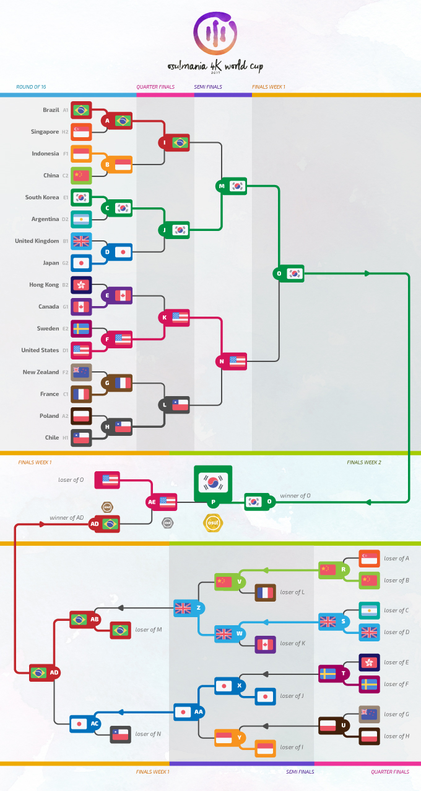

---
tags:
  - MWC 2017
  - MWC 4K 2017
  - MWC2017
  - MWC4K 2017
---

# osu!mania 4K World Cup 2017

L'**osu!mania 4K World Cup 2017** (***MWC 4K 2017***) est un tournoi d'osu!mania 4K par pays organisé par [l'équipe osu!](/wiki/People/osu!_team). Il s'agit de la quatrième édition de l'osu!mania 4K World Cup.

## Calendrier du tournoi

| Évènement | Date |
| --: | :-- |
| Inscription des équipes | 10/07/2017 - 23/07/2017 |
| Tirages au sort | 07/08/2017 (14:00 UTC) |
| Phases de poules | 12/08/2017 - 13/08/2017 |
| Huitièmes de finale | 20/08/2017 |
| Quarts de finale | 26/08/2017 - 27/08/2017 |
| Demi-finales | 02/09/2017 - 03/09/2017 |
| Finales - Semaine 1 | 09/09/2017 - 10/09/2017 |
| Finales - Semaine 2 | 16/09/2017 |

## Récompenses

| Place | Récompenses |
| :-- | :-- |
|  | 150 $ par membre de l'équipe, un badge de profil unique, de la marchandise exclusive d'osu!, le titre "osu!mania Champion" pendant un an |
|  | 80 $ par membre de l'équipe, un badge de profil unique, de la marchandise exclusive d'osu! |
|  | 40 $ par membre de l'équipe, un badge de profil unique, de la marchandise exclusive d'osu! |

  

## Organisation

L'osu!mania 4K World Cup 2017 était organisée par divers membres de la communauté.

| Poste | Membre(s) |
| :-- | :-- |
| Direction | ::{ flag=DE }:: [Loctav](https://osu.ppy.sh/users/71366), ::{ flag=DE }:: [p3n](https://osu.ppy.sh/users/123703), ::{ flag=ES }:: [Deif](https://osu.ppy.sh/users/318565), ::{ flag=FR }:: [shARPII](https://osu.ppy.sh/users/776257) |
| Sélecteurs de beatmaps | ::{ flag=US }:: [Blocko](https://osu.ppy.sh/users/4075092), ::{ flag=AR }:: [juankristal](https://osu.ppy.sh/users/443656), ::{ flag=GB }:: [Pope Gadget](https://osu.ppy.sh/users/2288341) |
| Commentateurs | ::{ flag=BR }:: [Guilhermeziat](https://osu.ppy.sh/users/3661387), ::{ flag=US }:: [Halogen-](https://osu.ppy.sh/users/169992), ::{ flag=AR }:: [juankristal](https://osu.ppy.sh/users/443656), ::{ flag=AU }:: [Lusty Platypus](https://osu.ppy.sh/users/2956184), ::{ flag=AU }:: [PotassiumF](https://osu.ppy.sh/users/4247722), ::{ flag=US }:: [TheToaphster](https://osu.ppy.sh/users/7616811), ::{ flag=SE }:: [\[ Vento \]](https://osu.ppy.sh/users/1612580), ::{ flag=FR }:: [XeoStyle](https://osu.ppy.sh/users/3377280), ::{ flag=US }:: [ztrot](https://osu.ppy.sh/users/6347) |
| Statisticiens | ::{ flag=NZ }:: [deadbeat](https://osu.ppy.sh/users/128370), ::{ flag=DE }:: [Nwolf](https://osu.ppy.sh/users/1910766) |

## Liens

- [Fil de discussion](https://osu.ppy.sh/community/forums/topics/615787)
- [Diffusion en direct](https://www.twitch.tv/osulive)
- **[Statistiques générales, groupes et plus !](https://docs.google.com/spreadsheets/d/1qAbKpW3yCJ5U2qUoUoIob6qsmNW08LenxeL0FptdjxA/pubhtml)**

## Participants

|  | Pays | Membres |
| --: | :-: | :-- |
| ::{ flag=AR }:: | **Argentine** | **[lxLucasxl](https://osu.ppy.sh/users/3632846)**, [BossPlays_02](https://osu.ppy.sh/users/7341471), [aluuu](https://osu.ppy.sh/users/4585260), [Ezze](https://osu.ppy.sh/users/2887427), [Fisk-](https://osu.ppy.sh/users/5748843), [Juanvidrio](https://osu.ppy.sh/users/2628463) |
| ::{ flag=AU }:: | **Australie** | **[Kites](https://osu.ppy.sh/users/4922584)**, [Melt3dCheeze](https://osu.ppy.sh/users/634837), [PotassiumF](https://osu.ppy.sh/users/4247722), [Lusty Platypus](https://osu.ppy.sh/users/2956184), [Rek](https://osu.ppy.sh/users/4018184), [Zeppy-lin](https://osu.ppy.sh/users/7675859) |
| ::{ flag=BE }:: | **Belgique** | **[Kizunuko-P](https://osu.ppy.sh/users/6741014)**, [NightNarumi](https://osu.ppy.sh/users/4381142), [Yetified](https://osu.ppy.sh/users/6914714), [Podzel](https://osu.ppy.sh/users/7368776), [Ojily](https://osu.ppy.sh/users/6539319), [Pryme](https://osu.ppy.sh/users/6393309) |
| ::{ flag=BR }:: | **Brésil** | **[andreymc](https://osu.ppy.sh/users/5691061)**, [Guilhermeziat](https://osu.ppy.sh/users/3661387), [SillyFangirl](https://osu.ppy.sh/users/2288363), [FelipeLink](https://osu.ppy.sh/users/4917435), [Rikkaismywaifuu](https://osu.ppy.sh/users/9530019), [UrsoManso](https://osu.ppy.sh/users/4569601) |
| ::{ flag=CA }:: | **Canada** | **[CanadianTaco](https://osu.ppy.sh/users/5185455)**, [beary605](https://osu.ppy.sh/users/2198070), [CommandoBlack](https://osu.ppy.sh/users/7025841), [Panshow](https://osu.ppy.sh/users/5872899), [Genuine](https://osu.ppy.sh/users/5235597), [Freeflow](https://osu.ppy.sh/users/2777647) |
| ::{ flag=CL }:: | **Chili** | **[WalterToro](https://osu.ppy.sh/users/5281416)**, [Rythze](https://osu.ppy.sh/users/469808), [Arkener](https://osu.ppy.sh/users/4116072), [Skalim](https://osu.ppy.sh/users/2225008), [aiory](https://osu.ppy.sh/users/2959518), [Raizenn](https://osu.ppy.sh/users/4531184) |
| ::{ flag=CN }:: | **Chine** | **[Sern888](https://osu.ppy.sh/users/2089244)**, [ZhangFan](https://osu.ppy.sh/users/89545), [[Crz]ScSolAr](https://osu.ppy.sh/users/1591215), [[Crz]Lucifer](https://osu.ppy.sh/users/5270332), [[Crz]Riri](https://osu.ppy.sh/users/6148622), [[Crz]MemoryI](https://osu.ppy.sh/users/8179131) |
| ::{ flag=FI }:: | **Finlande** | **[Jepetski](https://osu.ppy.sh/users/3794665)**, [snoverpk](https://osu.ppy.sh/users/3595196), [Pwae](https://osu.ppy.sh/users/4765794), [Camopoltergeist](https://osu.ppy.sh/users/8132964), [riktoi](https://osu.ppy.sh/users/4940393), [Herkkupala](https://osu.ppy.sh/users/3602620) |
| ::{ flag=FR }:: | **France** | **[bumpinho](https://osu.ppy.sh/users/1594604)**, [Elementaires](https://osu.ppy.sh/users/2284328), [Todestrieb](https://osu.ppy.sh/users/4056690), [Cunu](https://osu.ppy.sh/users/7190228), [Shadowzyx](https://osu.ppy.sh/users/3384640), [BurningPower](https://osu.ppy.sh/users/4989818) |
| ::{ flag=DE }:: | **Allemagne** | **[LastExceed](https://osu.ppy.sh/users/6232245)**, [Jeremayer](https://osu.ppy.sh/users/7475496), [Nediz](https://osu.ppy.sh/users/7009106), [-Dom-](https://osu.ppy.sh/users/5587671), [Nedeam](https://osu.ppy.sh/users/3996828), [StanleyS](https://osu.ppy.sh/users/7810871) |
| ::{ flag=HK }:: | **Hong-Kong** | **[drunkenstein](https://osu.ppy.sh/users/4565389)**, [Opean](https://osu.ppy.sh/users/4544555), [Mooncha](https://osu.ppy.sh/users/5417362), [zero2snow](https://osu.ppy.sh/users/7751516) |
| ::{ flag=ID }:: | **Indonésie** | **[Fiea](https://osu.ppy.sh/users/3183277)**, [lpddemon](https://osu.ppy.sh/users/5101276), [LovelySerenade](https://osu.ppy.sh/users/5492871), [reyss](https://osu.ppy.sh/users/4557440), [RemFangirl](https://osu.ppy.sh/users/5767941), [Nixeria-sama](https://osu.ppy.sh/users/6045757) |
| ::{ flag=IT }:: | **Italie** | **[jutte](https://osu.ppy.sh/users/6946682)**, [Mura7797](https://osu.ppy.sh/users/3244389), [Cribob](https://osu.ppy.sh/users/8485394), [Saibel](https://osu.ppy.sh/users/2727928) |
| ::{ flag=JP }:: | **Japon** | **[inteliser](https://osu.ppy.sh/users/1824775)**, [PiraTom](https://osu.ppy.sh/users/1847698), [C-light](https://osu.ppy.sh/users/7955738), [_vA](https://osu.ppy.sh/users/5626441), [mach_jp](https://osu.ppy.sh/users/8679066), [iskr312](https://osu.ppy.sh/users/2885412) |
| ::{ flag=MY }:: | **Malaisie** | **[Neokje](https://osu.ppy.sh/users/7727987)**, [lisw1230](https://osu.ppy.sh/users/9249305), [watarakisah](https://osu.ppy.sh/users/6237337), [kaname-san92](https://osu.ppy.sh/users/764535), [Midori Carrot](https://osu.ppy.sh/users/6308090), [HunterproX](https://osu.ppy.sh/users/1343562) |
| ::{ flag=MX }:: | **Mexique** | **[\_Mytros\_](https://osu.ppy.sh/users/6507028)**, [Daybreak](https://osu.ppy.sh/users/3072763), [Sida](https://osu.ppy.sh/users/6031847), [Ray271](https://osu.ppy.sh/users/9008042), [Zetscythe](https://osu.ppy.sh/users/3360499) |
| ::{ flag=NL }:: | **Pays-Bas** | **[mrdawn2](https://osu.ppy.sh/users/1098581)**, [2fast4you98](https://osu.ppy.sh/users/5183940), [Obligerator](https://osu.ppy.sh/users/7452877), [Boots](https://osu.ppy.sh/users/2827823), [KloKat](https://osu.ppy.sh/users/6637728), [mijkolsmith](https://osu.ppy.sh/users/4307765) |
| ::{ flag=NO }:: | **Norvège** | **[Staiain](https://osu.ppy.sh/users/86188)**, [Jesen](https://osu.ppy.sh/users/9000473), [Bizarrely_F4st](https://osu.ppy.sh/users/7676585), [Glass Bottle](https://osu.ppy.sh/users/4988688), [KarlF](https://osu.ppy.sh/users/3494742), [Hjeg](https://osu.ppy.sh/users/2764122) |
| ::{ flag=NZ }:: | **Nouvelle-Zélande** | **[Worms](https://osu.ppy.sh/users/1963937)**, [B E P I S](https://osu.ppy.sh/users/3580643), [Spicy Meme](https://osu.ppy.sh/users/6571078), [FantumEX](https://osu.ppy.sh/users/3394802), [Alamanar](https://osu.ppy.sh/users/7621152) |
| ::{ flag=PH }:: | **Philippines** | **[arcwinolivirus](https://osu.ppy.sh/users/2039089)**, [Ainyan](https://osu.ppy.sh/users/3770641), [JztCallMeRon](https://osu.ppy.sh/users/2471512), [Niro-](https://osu.ppy.sh/users/6443899), [BLVGARI](https://osu.ppy.sh/users/877011), [Shuisora](https://osu.ppy.sh/users/4102511) |
| ::{ flag=PL }:: | **Pologne** | **[Tidek](https://osu.ppy.sh/users/743282)**, [SitekX](https://osu.ppy.sh/users/3840946), [Kroly-](https://osu.ppy.sh/users/6382502), [-Kamikaze-](https://osu.ppy.sh/users/2124783), [Transformau5](https://osu.ppy.sh/users/3109917), [Benzopirene](https://osu.ppy.sh/users/1887068) |
| ::{ flag=RU }:: | **Fédération de Russie** | **[Mage](https://osu.ppy.sh/users/5527957)**, [\[PhobosX\]](https://osu.ppy.sh/users/2570019), [U1wknUzeU6](https://osu.ppy.sh/users/6930247), [AngeloLagusa](https://osu.ppy.sh/users/9074986), [OrphicX](https://osu.ppy.sh/users/6673780), [Faikren](https://osu.ppy.sh/users/5948345) |
| ::{ flag=SG }:: | **Singapour** | **[Evening](https://osu.ppy.sh/users/2193881)**, [OrienST8](https://osu.ppy.sh/users/4574597), [DotZeix](https://osu.ppy.sh/users/4363028), [Lindyes](https://osu.ppy.sh/users/7462804), [saikooppai](https://osu.ppy.sh/users/7288030), [Ezo](https://osu.ppy.sh/users/2095061) |
| ::{ flag=KR }:: | **Corée du Sud** | **[jakads](https://osu.ppy.sh/users/259972)**, [cheetose](https://osu.ppy.sh/users/3817144), [Cobo-](https://osu.ppy.sh/users/1482965), [SuddenDeath](https://osu.ppy.sh/users/6699923), [blueBloody](https://osu.ppy.sh/users/8046839) |
| ::{ flag=ES }:: | **Espagne** | **[aitor98](https://osu.ppy.sh/users/3154852)**, [Asesingta](https://osu.ppy.sh/users/5037769), [ran-](https://osu.ppy.sh/users/5442427), [Userbacker](https://osu.ppy.sh/users/1872307), [Hydragyrum](https://osu.ppy.sh/users/6440453), [HotSaucezZ](https://osu.ppy.sh/users/7408290) |
| ::{ flag=SE }:: | **Suède** | **[-Saoeri-](https://osu.ppy.sh/users/6702799)**, [Couil](https://osu.ppy.sh/users/6872025), [\[ Vento \]](https://osu.ppy.sh/users/1612580), [Xytox](https://osu.ppy.sh/users/2229274), [Craty](https://osu.ppy.sh/users/3918056), [Dez](https://osu.ppy.sh/users/2860775) |
| ::{ flag=CH }:: | **Suisse** | **[Gamer97](https://osu.ppy.sh/users/4952941)**, [Akayro](https://osu.ppy.sh/users/2573716), [AkayroFanGirl](https://osu.ppy.sh/users/3974114), [basti78](https://osu.ppy.sh/users/28222) |
| ::{ flag=TW }:: | **Taïwan** | **[y85782122](https://osu.ppy.sh/users/2287176)**, [jimmymeow159357](https://osu.ppy.sh/users/3733696), [luckygino](https://osu.ppy.sh/users/1967808), [ecafree2](https://osu.ppy.sh/users/1984442), [monkeydluffy3u4](https://osu.ppy.sh/users/2277798), [MimF7_tw](https://osu.ppy.sh/users/4135993) |
| ::{ flag=TH }:: | **Thaïlande** | **[LostCool](https://osu.ppy.sh/users/766374)**, [Fumi](https://osu.ppy.sh/users/8288049), [shuniki](https://osu.ppy.sh/users/4942174), [4ksrub](https://osu.ppy.sh/users/2838908), [-[DaNieL_TH]-](https://osu.ppy.sh/users/6456531), [floodlord](https://osu.ppy.sh/users/2772110) |
| ::{ flag=GB }:: | **Royaume-Uni** | **[Pipper](https://osu.ppy.sh/users/4168230)**, [Xonica](https://osu.ppy.sh/users/3586776), [yipyapyop](https://osu.ppy.sh/users/5156656), [SleepyDarkrai](https://osu.ppy.sh/users/5063207), [itsjake](https://osu.ppy.sh/users/3617889), [Traps Are Cute](https://osu.ppy.sh/users/3359035) |
| ::{ flag=US }:: | **États-Unis** | **[Zyph](https://osu.ppy.sh/users/1600432)**, [EtienneXC](https://osu.ppy.sh/users/5610085), [TheToaphster](https://osu.ppy.sh/users/7616811), [Chrubble](https://osu.ppy.sh/users/2594280), [stupud man](https://osu.ppy.sh/users/2141612), [xElectroGH](https://osu.ppy.sh/users/3251373) |
| ::{ flag=VE }:: | **Venezuela** | **[Cyssel](https://osu.ppy.sh/users/6394478)**, [Satoruu](https://osu.ppy.sh/users/2243452), [Shinsekai-](https://osu.ppy.sh/users/2140739), [Marunne](https://osu.ppy.sh/users/8841450), [Prancer](https://osu.ppy.sh/users/1821350), [\[-Gearfrik-\]](https://osu.ppy.sh/users/8198818) |

## Groupes

| Groupe | Top seed | High seed | Low seed | Unseeded |
| :-: | :-- | :-- | :-- | :-- |
| **A** | ::{ flag=BR }:: Brésil | ::{ flag=PL }:: Pologne | ::{ flag=PH }:: Philippines | ::{ flag=VE }:: Venezuela |
| **B** | ::{ flag=GB }:: Royaume-Uni | ::{ flag=MY }:: Malaisie | ::{ flag=HK }:: Hong Kong | ::{ flag=NO }:: Norvège |
| **C** | ::{ flag=CN }:: Chine | ::{ flag=FR }:: France | ::{ flag=AU }:: Australie | ::{ flag=TW }:: Taïwan |
| **D** | ::{ flag=US }:: États-Unis | ::{ flag=AR }:: Argentine | ::{ flag=MX }:: Mexique | ::{ flag=DE }:: Allemagne |
| **E** | ::{ flag=KR }:: Corée du Sud | ::{ flag=SE }:: Suède | ::{ flag=RU }:: Fédération de Russie | ::{ flag=FI }:: Finlande |
| **F** | ::{ flag=ID }:: Indonésie | ::{ flag=IT }:: Italie | ::{ flag=ES }:: Espagne | ::{ flag=NZ }:: Nouvelle-Zélande |
| **G** | ::{ flag=JP }:: Japon | ::{ flag=CA }:: Canada | ::{ flag=CH }:: Suisse | ::{ flag=NL }:: Pays-Bas |
| **H** | ::{ flag=CL }:: Chili | ::{ flag=TH }:: Thaïlande | ::{ flag=SG }:: Singapour | ::{ flag=BE }:: Belgique |

## Podium

## Mappools

### Finales

**Ce mappool a été joué lors de la semaine 1 et la semaine 2 des finales.**

**[Téléchargez le pack de beatmaps ici ! (123MB)](http://www.mediafire.com/file/jho7mgavbd8ktlo/MWC4K_2017_Finals.rar)**

- FreeMod
  1. [Mick Gordon - The Mastermind (Pope Gadget) \[Brainstorm\]](https://osu.ppy.sh/beatmapsets/663258#mania/1403911)
  2. [Nine Inch Nails - March Of The Pigs (Valedict) \[OiNK\]](https://osu.ppy.sh/beatmapsets/544334#mania/1153543)
  3. [DJ Sharpnel - Lolit Speed (IcyWorld) \[Marathon\]](https://osu.ppy.sh/beatmapsets/644943#mania/1366733)
  4. [Hatsuki Yura - The Clockwork Rose -Tokei Shikake no Bara Shoujo- (Gekido-) \[LN Master\]](https://osu.ppy.sh/beatmapsets/740979#mania/1349843)
  5. [The Quick Brown Fox - Break (beary605) \[Smash\]](https://osu.ppy.sh/beatmapsets/500905#mania/1066057)
  6. [Makou - Hamsin (Wh1teh) \[!!\]](https://osu.ppy.sh/beatmapsets/663678#mania/1404752)
  7. [sakuraburst - descent (Ciel) \[delve\]](https://osu.ppy.sh/beatmapsets/664018#mania/1405397)
  8. [Camellia - K.Y.A.F.A. (Evening) \[UNSTOPPABLE DOMINATION\]](https://osu.ppy.sh/beatmapsets/477233#mania/1076362)
  9. [Miyu Tomita, Saori Oonishi, Naomi Ohzora, Kana Hanazawa - Hallelujah Essaim (JztCallMeRon) \[In the Name of God\]](https://osu.ppy.sh/beatmapsets/593598#mania/1255764)
  10. [Sound Horizon - Raijin no Hidariude (-Kamikaze-) \[Tempest w/ \_underjoy\]](https://osu.ppy.sh/beatmapsets/599091#mania/1266238)
  11. [Xanopticon - Psicicite (207bpm) (Shoegazer) \[Extreme\]](https://osu.ppy.sh/beatmapsets/659977#mania/1398964)
  12. [Camellia - Lunatic Rough Party!! (Fullerene-) \[Inspire\]](https://osu.ppy.sh/beatmapsets/494345#mania/1052580)
  13. [Behemoth - Daimonos (Wh1teh) \[Evangelion\]](https://osu.ppy.sh/beatmapsets/507176#mania/1078837)
  14. [Yuuyu - Scrap Syndrome (Halogen-) \[Manic Disassembly\]](https://osu.ppy.sh/beatmapsets/663256#mania/1403908)
  15. [Kairiki Bear - Inaiinai isonshou (feat. GUMI, Kagamine Rin) (juankristal) \[timing hell \[NSV\]\]](https://osu.ppy.sh/beatmapsets/663472#mania/1404354)
- Tiebreaker
  1. **[Infected Mushroom - The Messenger 2012 (Sped Up Ver.) (Pope Gadget) \[Witness\]](https://osu.ppy.sh/beatmapsets/664041#mania/1484095)**

### Demi-finales

**[Téléchargez le pack de beatmaps ici ! (90 MB)](http://www.mediafire.com/file/7mxtjr3r9k4bi54/MWC4K_2017_Semifinals.rar)**

- FreeMod
  1. [9mm Parabellum Bullet - Punishment (Valedict) \[Retribution\]](https://osu.ppy.sh/beatmapsets/532682#mania/1128678)
  2. [Kaneko Chiharu - Lachryma \<Re:Queen'M\> (Fresh Chicken) \[GRAVITY\]](https://osu.ppy.sh/beatmapsets/415886#mania/901050)
  3. [aaaa + yadorigi - Sakase natsuzora, koi no hana. (scissorsf) \[flnowers\]](https://osu.ppy.sh/beatmapsets/464221#mania/993976)
  4. [Ekcle - The Impulsive State (Parachor) \[Entropy\_\]](https://osu.ppy.sh/beatmapsets/643857#mania/1364765)
  5. [The Flashbulb - Passage D (Jinjin) \[Delve\]](https://osu.ppy.sh/beatmapsets/475785#mania/1016508)
  6. [IOSYS - Endless Tewi-ma Park (arcwinolivirus) \[Arcwin Lost Tewicated\]](https://osu.ppy.sh/beatmapsets/392965#mania/855471)
  7. [USAO - Boss Rush (PiraTom) \[LN Rush\]](https://osu.ppy.sh/beatmapsets/595680#mania/1259719)
  8. [Fele - Peter on Crack (Cut) (Jole) \[this is brain surgery\]](https://osu.ppy.sh/beatmapsets/631020#mania/1394763)
  9. [Kidkanevil - Lantern 1 (Valedict) \[Fog\]](https://osu.ppy.sh/beatmapsets/630576#mania/1331160)
  10. [Kontinuum - Lost (feat. Savoi) \[Sunroof Remix\] (Otakujanai) \[Emotional Drift\]](https://osu.ppy.sh/beatmapsets/624059#mania/1321781)
  11. [Fractal Dreamers - Fortuna Redux (Kizunuko-P) \[Dream\]](https://osu.ppy.sh/beatmapsets/621965#mania/1311355)
  12. [Inferi - Those Who From the Heavens Came (XeoStyle) \[Investiture of the Gods\]](https://osu.ppy.sh/beatmapsets/413901#mania/897408)
  13. [C-Show - ERROR CODE (SpectorDG) \[SPE vs. ZEN's GRAVITY\]](https://osu.ppy.sh/beatmapsets/545342#mania/1155393)
  14. [Jeff Williams - Time to say Goodbye (feat. Casey Lee Williams) (juankristal) \[Team LNBY\]](https://osu.ppy.sh/beatmapsets/524244#mania/1112725)
- Tiebreaker
  1. **[Camellia - Dans la mer de son (TheToaphster) \[Abyss\]](https://osu.ppy.sh/beatmapsets/556824#mania/1641834)**

### Quarts de finale

**[Téléchargez le pack de beatmaps ici ! (88 MB)](http://www.mediafire.com/file/7baxea9hafezhob/MWC4K_2017_Quarterfinals.rar)**

- FreeMod
  1. [BABYMETAL - Road of Resistance (hi19hi19) \[Uprising\]](https://osu.ppy.sh/beatmapsets/649356#mania/1375744)
  2. [Caravan Palace - Clash (Hydria) \[Hard\]](https://osu.ppy.sh/beatmapsets/646460#mania/1369706)
  3. [goreshit - looming shadow of a tree long gone (Shoegazer) \[extra\]](https://osu.ppy.sh/beatmapsets/360765#mania/792874)
  4. [yst - The Lost Dedicated (DDMythical) \[Another\]](https://osu.ppy.sh/beatmapsets/617988#mania/1302866)
  5. [8284 - Connaextion (LeiN-) \[TIMED\_OUT\]](https://osu.ppy.sh/beatmapsets/482242#mania/1029033)
  6. [Maika - Goldrop (Skorer) \[Yudaina LN\]](https://osu.ppy.sh/beatmapsets/482242#mania/1029033)
  7. [Getty vs. DJ DiA - Fox4-Raize- (Evening) \[GRAVITY VIP\]](https://osu.ppy.sh/beatmapsets/580157#mania/1228388)
  8. [Colorful Sounds Port - ETERNAL DRAIN (Wh1teh) \[Black Another\]](https://osu.ppy.sh/beatmapsets/468353#mania/1104774)
  9. [Blue Stahli - Shotgun Senorita (Zardonic Remix) (juankristal) \[Machine Gun\]](https://osu.ppy.sh/beatmapsets/631861#mania/1341515)
  10. [Dustvoxx - Trigger (Zekk Remix) (Wonki) \[Trigger\]](https://osu.ppy.sh/beatmapsets/555076#mania/1174927)
  11. [Akira Complex - Odyssey (Au5 Remix) (Shoegazer) \[Dreamless\]](https://osu.ppy.sh/beatmapsets/519513#mania/1103630)
  12. [YUC'e - Sengoku HOP (c/f Athenarium) (Hydria) \[Insane\]](https://osu.ppy.sh/beatmapsets/605435#mania/1279175)
  13. [NOISIA - Groundhog (Beat Juggle) (Raspberriel) \[Sorry, Am I Putting You Off?\]](https://osu.ppy.sh/beatmapsets/591171#mania/1252742)
- Tiebreaker
  1. **[DragonForce - The Warrior Inside (\_underjoy) \[4K Collab Gladiator\]](https://osu.ppy.sh/beatmapsets/330405#mania/1038662)**

### Huitièmes de finale

**[Téléchargez le pack de beatmaps ici ! (65 MB)](http://www.mediafire.com/file/z7pmbh632dy178j/MWC4K_2017_Round_of_16.rar)**

- FreeMod
  1. [hyi - you can recover (Valedict) \[restoration\]](https://osu.ppy.sh/beatmapsets/566156#mania/1199287)
  2. [GIRAFFES? GIRAFFES! - I Am S/H(im)e\[r\] (XeoStyle) \[I Am Us\]](https://osu.ppy.sh/beatmapsets/595712#mania/1259834)
  3. [KOAN Sound + asa - Fuego (sakuraburst remix) (Couil) \[HD\]](https://osu.ppy.sh/beatmapsets/622946#mania/1313120)
  4. [Schubert - Introduction And Variations 'Trockne Blumen' Variation 5 Remix&Arrange (Feerum) \[4K Irrsinnig\]](https://osu.ppy.sh/beatmapsets/557139#mania/1178997)
  5. [Team Grimoire - Sheriruth (DoNotMess) \[Future\]](https://osu.ppy.sh/beatmapsets/590341#mania/1295745)
  6. [Helblinde - Heaven's Fall (Kaito-kun) \[Extra\]](https://osu.ppy.sh/beatmapsets/541483#mania/1217314)
  7. [q/stol - Re/Im (Lude) \[Re/Extreme\]](https://osu.ppy.sh/beatmapsets/588066#mania/1245089)
  8. [USAO - Showdown (Side) \[puxtu's MX\]](https://osu.ppy.sh/beatmapsets/438839#mania/996693)
  9. [Sonitus Vir ft. Emily Smith - Lune Noir (Bites) \[4K MX\]](https://osu.ppy.sh/beatmapsets/57946#mania/225781)
  10. [MINTi - So Fresh So Good (Leo137) \[Leo137's 4K\]](https://osu.ppy.sh/beatmapsets/516485#mania/1097526)
  11. [Edwin Starr vs. Justice - War vs. Waters of Nazareth (Raspberriel) \[Massacre Edit\]](https://osu.ppy.sh/beatmapsets/602039#mania/1394983)
  12. [The Flashbulb - Three Hundred CC (edit) (Blocko) \[Another\]](https://osu.ppy.sh/beatmapsets/645827#mania/1368417)
  13. [Alesana - The Artist (Tornspirit) \[Collapse\]](https://osu.ppy.sh/beatmapsets/606247#mania/1280807)
- Tiebreaker
  1. **[BABYMETAL - Tales of The Destinies (Couil) \[Endless Journey\]](https://osu.ppy.sh/beatmapsets/611340#mania/1290602)**

### Phases de poules

**[Téléchargez le pack de beatmaps ici ! (89 MB)](http://www.mediafire.com/file/cjk4f8ilwc2s7uv/MWC4K_2017_Group_Stage.rar)**

- Freemod
  1. [Lifetheory - Daisy (Tidek) \[Life (Insane)\]](https://osu.ppy.sh/beatmapsets/323163#mania/718401)
  2. [Shawn Wasabi - Burnt Rice (855wa) \[Hard\]](https://osu.ppy.sh/beatmapsets/493347#mania/1063205)
  3. [YK. - Egg Of Life (Mwila Remix) (Paradoxq13) \[MX\]](https://osu.ppy.sh/beatmapsets/330513#mania/741552)
  4. [sakuzyo - Altale (Kuo Kyoka) \[Hyper Lv.22\]](https://osu.ppy.sh/beatmapsets/347779#mania/767309)
  5. [yuikonnu - Shinkai Shoujo (juankristal) \[Shoujo\]](https://osu.ppy.sh/beatmapsets/493322#mania/1050663)
  6. [Warak - REANIMATE (Mat) \[Complex LNs\]](https://osu.ppy.sh/beatmapsets/624267#mania/1315761)
  7. [Takemura Kiriko - Ninja Re Bang Bang (ecafree2) \[4K HD\]](https://osu.ppy.sh/beatmapsets/372942#mania/816807)
  8. [REDALiCE feat. anporin - Beautiful Dream (Dellvangel) \[CS' Challenge\]](https://osu.ppy.sh/beatmapsets/419697#mania/908398)
  9. [Niira Etsuko - Imaginary Waltz (-Troke-) \[Raccoon's MX\]](https://osu.ppy.sh/beatmapsets/189927#mania/480148)
  10. [Tim & Eric - Sports! (ilikexd) \[Hard\]](https://osu.ppy.sh/beatmapsets/306152#mania/685357)
  11. [Beltaine - Rockhill (Ryu Sei) \[Hard\]](https://osu.ppy.sh/beatmapsets/464358#mania/994291)
  12. [stereoberry - evangelize (blurry images) (Tidek) \[transparency (SV)\]](https://osu.ppy.sh/beatmapsets/577748#mania/1222765)
- Tiebreaker
  1. **[sakuraburst - sha (SitekX) \[dow\]](https://osu.ppy.sh/beatmapsets/595086#mania/1258514)**

## Résultats des matchs

### Finales - Semaine 2

Samedi 16 septembre 2017 :

| Équipe 1 |  |  | Équipe 2 | Lien du match |
| --: | :-: | :-: | :-- | :-- |
| États-Unis ::{ flag=US }:: | 0 | **7** | ::{ flag=KR }:: **Corée du Sud** | [#1](https://osu.ppy.sh/community/matches/36111799) |

### Finales - Semaine 1

Samedi 9 septembre 2017 :

| Équipe 1 |  |  | Équipe 2 | Lien du match |
| --: | :-: | :-: | :-- | :-- |
| **Japon** ::{ flag=JP }:: | **6** | 0 | ::{ flag=CL }:: Chili | [#1](https://osu.ppy.sh/community/matches/35952218) |
| Royaume-Uni ::{ flag=GB }:: | 0 | **6** | ::{ flag=BR }:: **Brésil** | [#1](https://osu.ppy.sh/community/matches/35955973) |

Dimanche 10 septembre 2017 :

| Équipe 1 |  |  | Équipe 2 | Lien du match |
| --: | :-: | :-: | :-- | :-- |
| **Corée du Sud** ::{ flag=KR }:: | **6** | 0 | ::{ flag=US }:: États-Unis | [#1](https://osu.ppy.sh/community/matches/35972975) |
| **Brésil** ::{ flag=BR }:: | **6** | 1 | ::{ flag=JP }:: Japon | [#1](https://osu.ppy.sh/community/matches/35974418) |
| Brésil ::{ flag=BR }:: | 5 | **6** | ::{ flag=US }:: **États-Unis** | [#1](https://osu.ppy.sh/community/matches/35998794) |

### Demi-finale

Samedi 2 septembre 2017 :

| Équipe 1 |  |  | Équipe 2 | Lien du match |
| --: | :-: | :-: | :-- | :-- |
| Suède ::{ flag=SE }:: | 1 | **6** | ::{ flag=JP }:: **Japon** | [#1](https://osu.ppy.sh/community/matches/35769761) |
| **Chine** ::{ flag=CN }:: | **6** | 2 | ::{ flag=FR }:: France | [#1](https://osu.ppy.sh/community/matches/35771726) |
| Brésil ::{ flag=BR }:: | 0 | **6** | ::{ flag=KR }:: **Corée du Sud** | [#1](https://osu.ppy.sh/community/matches/35774130) |
| Pologne ::{ flag=PL }:: | 1 | **6** | ::{ flag=ID }:: **Indonésie** | [#1](https://osu.ppy.sh/community/matches/35777392) |
| **Royaume-Uni** ::{ flag=GB }:: | **6** | 3 | ::{ flag=CA }:: Canada | [#1](https://osu.ppy.sh/community/matches/35779902) |
| **États-Unis** ::{ flag=US }:: | **6** | 0 | ::{ flag=CL }:: Chili | [#1](https://osu.ppy.sh/community/matches/35783065) |

Dimanche 3 septembre 2017 :

| Équipe 1 |  |  | Équipe 2 | Lien du match |
| --: | :-: | :-: | :-- | :-- |
| **Japon** ::{ flag=JP }:: | **6** | 3 | ::{ flag=ID }:: Indonésie | [#1](https://osu.ppy.sh/community/matches/35804308) |
| Chine ::{ flag=CN }:: | 2 | **6** | ::{ flag=GB }:: **Royaume-Uni** | [#1](https://osu.ppy.sh/community/matches/35807134) |

### Quarts de finale

Samedi 26 août 2017 :

| Équipe 1 |  |  | Équipe 2 | Lien du match |
| --: | :-: | :-: | :-- | :-: |
| France ::{ flag=FR }:: | 4 | **5** | ::{ flag=CL }:: **Chili** | [#1](https://osu.ppy.sh/community/matches/35585664) |
| Argentine ::{ flag=AR }:: | 1 | **5** | ::{ flag=GB }:: **Royaume-Uni** | [#1](https://osu.ppy.sh/community/matches/35588367) |
| Canada ::{ flag=CA }:: | 0 | **5** | ::{ flag=US }:: **États-Unis** | [#1](https://osu.ppy.sh/community/matches/35590366) |

Dimanche 27 août 2017 :

| Équipe 1 |  |  | Équipe 2 | Lien du match |
| --: | :-: | :-: | :-- | :-: |
| **Corée du Sud** ::{ flag=KR }:: | **5** | 0 | ::{ flag=JP }:: Japon | [#1](https://osu.ppy.sh/community/matches/35601021) |
| Nouvelle-Zélande ::{ flag=NZ }:: | 0 | **5** | ::{ flag=PL }:: **Pologne** | [#1](https://osu.ppy.sh/community/matches/35602514) |
| Singapour ::{ flag=SG }:: | 1 | **5** | ::{ flag=CN }:: **Chine** | [#1](https://osu.ppy.sh/community/matches/35604433) |
| Hong-Kong ::{ flag=HK }:: | 0 | **5** | ::{ flag=SE }:: **Suède** | *victoire par défaut* |
| **Brésil** ::{ flag=BR }:: | **5** | 1 | ::{ flag=ID }:: Indonésie | [#1](https://osu.ppy.sh/community/matches/35608732) |

### Huitièmes de finale

Dimanche 20 août 2017 :

| Équipe 1 |  |  | Équipe 2 | Lien du match |
| --: | :-: | :-: | :-- | :-: |
| Nouvelle-Zélande ::{ flag=NZ }:: | 1 | **5** | ::{ flag=FR }:: **France** | [#1](https://osu.ppy.sh/community/matches/35418105) |
| **Indonésie** ::{ flag=ID }:: | **5** | 1 | ::{ flag=CN }:: Chine | [#1](https://osu.ppy.sh/community/matches/35419189) |
| Royaume-Uni ::{ flag=GB }:: | 3 | **5** | ::{ flag=JP }:: **Japon** | [#1](https://osu.ppy.sh/community/matches/35420314) |
| **Corée du Sud** ::{ flag=KR }:: | **5** | 0 | ::{ flag=AR }:: Argentine | [#1](https://osu.ppy.sh/community/matches/35421542) |
| **Brésil** ::{ flag=BR }:: | **5** | 0 | ::{ flag=SG }:: Singapour | [#1](https://osu.ppy.sh/community/matches/35423100) |
| Hong-Kong ::{ flag=HK }:: | 4 | **5** | ::{ flag=CA }:: **Canada** | [#1](https://osu.ppy.sh/community/matches/35424487) |
| Pologne ::{ flag=PL }:: | 0 | **5** | ::{ flag=CL }:: **Chili** | [#1](https://osu.ppy.sh/community/matches/35429710) |
| Suède ::{ flag=SE }:: | 0 | **5** | ::{ flag=US }:: **États-Unis** | [#1](https://osu.ppy.sh/community/matches/35431890) |

### Phases de poules

Samedi 12 août 2017 :

| Équipe 1 |  |  | Équipe 2 | Lien du match |
| --: | :-: | :-: | :-- | :-: |
| Taïwan ::{ flag=TW }:: | 2 | **4** | ::{ flag=AU }:: **Australie** | [#1](https://osu.ppy.sh/community/matches/35209765) |
| Fédération de Russie ::{ flag=RU }:: | 0 | **4** | ::{ flag=KR }:: **Corée du Sud** | [#1](https://osu.ppy.sh/community/matches/35209716) |
| Nouvelle-Zélande ::{ flag=NZ }:: | 1 | **4** | ::{ flag=ID }:: **Indonésie** | [#1](https://osu.ppy.sh/community/matches/35209719) |
| Philippines ::{ flag=PH }:: | 1 | **4** | ::{ flag=PL }:: **Pologne** | [#1](https://osu.ppy.sh/community/matches/35210698) |
| Norvège ::{ flag=NO }:: | 3 | **4** | ::{ flag=HK }:: **Hong-Kong** | [#1](https://osu.ppy.sh/community/matches/35210701) |
| Malaisie ::{ flag=MY }:: | 0 | **4** | ::{ flag=GB }:: **Royaume-Uni** | [#1](https://osu.ppy.sh/community/matches/35210711) |
| Suisse ::{ flag=CH }:: | 0 | **4** | ::{ flag=JP }:: **Japon** | [#1](https://osu.ppy.sh/community/matches/35210713) |
| Norvège ::{ flag=NO }:: | 0 | **4** | ::{ flag=GB }:: **Royaume-Uni** | [#1](https://osu.ppy.sh/community/matches/35211634) |
| Australie ::{ flag=AU }:: | 1 | **4** | ::{ flag=FR }:: **France** | [#1](https://osu.ppy.sh/community/matches/35211644) |
| **Finlande** ::{ flag=FI }:: | **4** | 2 | ::{ flag=RU }:: Fédération de Russie | [#1](https://osu.ppy.sh/community/matches/35211647) |
| **Singapour** ::{ flag=SG }:: | **4** | 1 | ::{ flag=TH }:: Thaïlande | [#1](https://osu.ppy.sh/community/matches/35211655) |
| **France** ::{ flag=FR }:: | **4** | 1 | ::{ flag=CN }:: Chine | [#1](https://osu.ppy.sh/community/matches/35212839) |
| Fédération de Russie ::{ flag=RU }:: | 0 | **4** | ::{ flag=SE }:: **Suède** | [#1](https://osu.ppy.sh/community/matches/35212859) |
| Belgique ::{ flag=BE }:: | 3 | **4** | ::{ flag=TH }:: **Thaïlande** | [#1](https://osu.ppy.sh/community/matches/35212861) |
| Singapour ::{ flag=SG }:: | 0 | **4** | ::{ flag=CL }:: **Chili** | [#1](https://osu.ppy.sh/community/matches/35212866) |
| Venezuela ::{ flag=VE }:: | 2 | **4** | ::{ flag=PH }:: **Philippines** | [#1](https://osu.ppy.sh/community/matches/35214348) |
| Finlande ::{ flag=FI }:: | 0 | **4** | ::{ flag=SE }:: **Suède** | [#1](https://osu.ppy.sh/community/matches/35214425) |
| Espagne ::{ flag=ES }:: | 3 | **4** | ::{ flag=IT }:: **Italie** | [#1](https://osu.ppy.sh/community/matches/35214428) |
| Belgique ::{ flag=BE }:: | 0 | **4** | ::{ flag=CL }:: **Chili** | [#1](https://osu.ppy.sh/community/matches/35214432) |
| Pologne ::{ flag=PL }:: | 0 | **4** | ::{ flag=BR }:: **Brésil** | [#1](https://osu.ppy.sh/community/matches/35218496) |
| Allemagne ::{ flag=DE }:: | 0 | **4** | ::{ flag=MX }:: **Mexique** | [#1](https://osu.ppy.sh/community/matches/35219133) |
| Argentine ::{ flag=AR }:: | 1 | **4** | ::{ flag=US }:: **États-Unis** | [#1](https://osu.ppy.sh/community/matches/35218503) |
| Pays-Bas ::{ flag=NL }:: | 1 | **4** | ::{ flag=CA }:: **Canada** | [#1](https://osu.ppy.sh/community/matches/35218508) |
| Venezuela ::{ flag=VE }:: | 0 | **4** | ::{ flag=PL }:: **Pologne** | [#1](https://osu.ppy.sh/community/matches/35219912) |
| Allemagne ::{ flag=DE }:: | 0 | **4** | ::{ flag=US }:: **États-Unis** | [#1](https://osu.ppy.sh/community/matches/35219931) |
| Mexique ::{ flag=MX }:: | 0 | **4** | ::{ flag=AR }:: **Argentine** | [#1](https://osu.ppy.sh/community/matches/35219934) |
| Suisse ::{ flag=CH }:: | 0 | **4** | ::{ flag=CA }:: **Canada** | [#1](https://osu.ppy.sh/community/matches/35219940) |

Dimanche 13 août 2017 :

| Équipe 1 |  |  | Équipe 2 | Lien du match |
| --: | :-: | :-: | :-- | :-: |
| **Nouvelle-Zélande** ::{ flag=NZ }:: | **4** | 2 | ::{ flag=ES }:: Espagne | [#1](https://osu.ppy.sh/community/matches/35236072) |
| Italie ::{ flag=IT }:: | 0 | **4** | ::{ flag=ID }:: **Indonésie** | [#1](https://osu.ppy.sh/community/matches/35236074) |
| Pays-Bas ::{ flag=NL }:: | 1 | **4** | ::{ flag=JP }:: **Japon** | [#1](https://osu.ppy.sh/community/matches/35236084) |
| **Nouvelle-Zélande** ::{ flag=NZ }:: | **4** | 0 | ::{ flag=IT }:: Italie | [#1](https://osu.ppy.sh/community/matches/35237009) |
| Australie ::{ flag=AU }:: | 1 | **4** | ::{ flag=CN }:: **Chine** | [#1](https://osu.ppy.sh/community/matches/35237013) |
| Belgique ::{ flag=BE }:: | 0 | **4** | ::{ flag=SG }:: **Singapour** | *victoire par défaut* |
| Espagne ::{ flag=ES }:: | 0 | **4** | ::{ flag=ID }:: **Indonésie** | [#1](https://osu.ppy.sh/community/matches/35237019) |
| Norvège ::{ flag=NO }:: | 2 | **4** | ::{ flag=MY }:: **Malaisie** | [#1](https://osu.ppy.sh/community/matches/35237818) |
| Hong-Kong ::{ flag=HK }:: | 0 | **4** | ::{ flag=GB }:: **Royaume-Uni** | [#1](https://osu.ppy.sh/community/matches/35237821) |
| Suède ::{ flag=SE }:: | 2 | **4** | ::{ flag=KR }:: **Corée du Sud** | [#1](https://osu.ppy.sh/community/matches/35237888) |
| **Hong-Kong** ::{ flag=HK }:: | **4** | 2 | ::{ flag=MY }:: Malaisie | [#1](https://osu.ppy.sh/community/matches/35238975) |
| Taïwan ::{ flag=TW }:: | 2 | **4** | ::{ flag=CN }:: **Chine** | [#1](https://osu.ppy.sh/community/matches/35238978) |
| Finlande ::{ flag=FI }:: | 0 | **4** | ::{ flag=KR }:: **Corée du Sud** | [#1](https://osu.ppy.sh/community/matches/35238983) |
| Philippines ::{ flag=PH }:: | 1 | **4** | ::{ flag=BR }:: **Brésil** | [#1](https://osu.ppy.sh/community/matches/35240162) |
| Taïwan ::{ flag=TW }:: | 1 | **4** | ::{ flag=FR }:: **France** | [#1](https://osu.ppy.sh/community/matches/35240166) |
| **Canada** ::{ flag=CA }:: | **4** | 1 | ::{ flag=JP }:: Japon | [#1](https://osu.ppy.sh/community/matches/35240169) |
| Thaïlande ::{ flag=TH }:: | 2 | **4** | ::{ flag=CL }:: **Chili** | [#1](https://osu.ppy.sh/community/matches/35240175) |
| Pays-Bas ::{ flag=NL }:: | 1 | **4** | ::{ flag=CH }:: **Suisse** | [#1](https://osu.ppy.sh/community/matches/35241555) |
| Venezuela ::{ flag=VE }:: | 0 | **4** | ::{ flag=BR }:: **Brésil** | *victoire par défaut* |
| Allemagne ::{ flag=DE }:: | 0 | **4** | ::{ flag=AR }:: **Argentine** | [#1](https://osu.ppy.sh/community/matches/35241635) |
| Mexique ::{ flag=MX }:: | 0 | **4** | ::{ flag=US }:: **États-Unis** | [#1](https://osu.ppy.sh/community/matches/35241640) |

## Règles

### Règlement du tournoi

1. L'osu!mania 4K World Cup est un tournoi d'osu!mania entre pays, joué sur le mode de jeu osu!mania sur des beatmaps 4 touches.
   - Même si cette compétition est prévue pour se jouer en 3 contre 3, cela peut changer en fonction du nombre d'inscriptions.
2. Le mécanisme de score utilisé est le Score V2.
3. Les beatmaps pour chaque round seront annoncées par le sélecteur de beatmaps en avance le dimanche avant que les matchs commencent. Seules ces beatmaps seront utilisées pendant leurs matchs respectifs.
   - La mappool de la phase de groupe sera annoncée après le tirage au sort du tableau.
   - Une beatmap sera dite tiebreaker. Elle sera jouée uniquement en cas d'égalité.
4. Les dates et horaires des matchs seront fixés par les organisateurs du tournoi (voir plus bas).
5. Si aucun membre du staff ou si aucun arbitre n'est disponible, le match sera reporté à une date ultérieure.
6. Les scores des joueurs qui échouent ne seront pas ajoutés au score de l'équipe.
   - Revivre et survivre pendant une beatmap n'est pas considéré comme un échec.
7. Utiliser les paramètres visuels pour modifier l'opacité de l'arrière-plan, ou désactiver les éléments de la beatmap comme les storyboards ou les skins est autorisé.
8. Si une beatmap se termine sur une égalité, la partie sera nullifiée.
9. Si un joueur se déconnecte, il sera considéré comme ayant échoué la beatmap.
   - Les déconnexions dans les 30 secondes qui suivent le début de la beatmap peuvent être rejouées. C'est l'arbitre qui en jugera. La beatmap jouée peut être interrompue en cours de jeu pour cela.
10. Les beatmaps ne peuvent pas être réutilisées dans le même match sauf si la partie avait été nullifiée.
11. Si moins de joueurs que le minimum requis se présentent, le match peut être reporté jusqu'à 10 minutes.
12. Échanger les joueurs pendant un match est autorisé sans limitations.
13. Le lag n'est pas une raison valide pour nullifier une beatmap.
14. Tous les joueurs doivent permettre au match de se dérouler aisément et sans délais. Des pénalités peuvent être infligées si un joueur provoque excessivement des délais.
15. Si un joueur se déconnecte entre deux beatmaps et que l'équipe ne peut pas l'échanger, le match peut être délayé de 10 minutes au maximum.
16. Tous les joueurs et arbitres doivent être traités avec respect. Les directives des arbitres et des organisateurs du tournoi sont à suivre. Les décisions marquées comme finales ne sont pas faites pour être discutées.
17. Il est strictement interdit de perturber le match que ce soit par l'anti-jeu, la sélection de beatmaps d'échauffement innapropriées (voir plus bas), en insultant et provocant les autres joueurs ou arbitres, délayant le match ou tout autre comportement inapproprié.
18. Les salles de discussion multijoueur sont soumises aux [règles de la communauté osu!](/wiki/Rules). Toutes les règles du tchat s'appliquent donc aussi.
    - Ne pas respecter les règles du tchat résultera en un silence. Les joueurs sous silence ne peuvent pas participer aux matchs multijoueurs et doivent être échangés le temps du silence.
19. Dans les phases de groupe, une « Victoire par défaut » sera considérée comme une victoire de 4 à 0, avec un ratio de différence de score de +1,0.
20. Les incidents inattendus sont gérés par les organisateurs du tournoi. Les arbitres peuvent accorder plus de tolérance suivant les circonstances. Les arbitres feront leurs propres décisions.
21. Une infraction au règlement du tournoi peut résulter en :
    - l'exclusion de certains joueurs pour une beatmap
    - l'exclusion de certains joueurs pour un match entier
    - la déclaration du match comme perdu par défaut
    - la disqualification de l'intégralité du tournoi
    - la disqualification de l'intégralité du tournoi actuel et des suivant jusqu'à appel
    - toute modification de ces règles sera annoncée.

### Inscriptions au tournoi

1. Chaque utilisateur intéressé pour rejoindre l'équipe de leur pays s'inscrit individuellement.
   - Les organisateurs du tournoi créeront une liste des potentiels candidats pour l'équipe d'un pays.
   - L'organisation du tournoi déclare un candidat capitaine de l'équipe de leur pays, bien que temporairement.
   - Le déclaré capitaine peut former son équipe à partir de la liste des candidats de leur pays.
2. Pour s'assurer de la validité et du sérieux des inscriptions, chaque utilisateur sera vérifié par les organisateurs du tournoi.
   - Chaque utilisateur enregistré sera assigné à la liste des candidats de leurs pays respectifs.
   - Pour être accepté sur la liste, vous devez vous assurer que votre rang global osu!mania est sous les 5000.
   - Pour être accepté sur la liste, vous ne devez pas avoir enfreint les [règles de la communauté osu!](/wiki/Rules) dans les 12 derniers mois.
3. Toutes les équipes formées avec succès seront publiées après la phase d'inscription.
4. Seules les 32 équipes potentiellement plus fortes participeront. La force potentielle d'une équipe est déterminée par les statistiques en ligne de tous les candidats valides.
   - Si le nombre de pays enregistrés est sous 32, ce nombre peut être réduit à 24, 20 ou 16. Le but étant de pouvoir laisser le plus de pays que possible participer !
5. Les sélecteurs de beatmaps ne peuvent pas participer en tant que joueur dans ce tournoi.

### Déroulement des phases tournoi

1. Pendant les phases de poules, les équipes seront divisées en 8 groupes de 4 équipes.
   - Cela peut changer suivant le nombre d'équipes acceptées dans la compétition.

2. Toutes les équipes de chaque groupe se rencontreront.

3. Le classement de chaque groupe est déterminé en triant les résultats des performances de chaque équipe avec la priorité suivante :
   - Le plus de matchs gagnés.
   - Le plus grand `{(nombre de beatmaps gagnées) - (nombre de beatmaps perdues)}`.
   - Le plus de beatmaps gagnées.
   - A un plus grand `∑{(différence totale de score) / (score maximum)}`.
   - Vainqueur de la revanche.

4. Les deux meilleurs équipes de chaque groupe passeront aux éliminations directes.
   - Cela peut changer avec la configuration des phases de poules.

5. L'étape qui suit est une phase à double élimination. Cela veut dire que le gagnant passe à la prochaine étape et que l'équipe perdante passe au tableau des perdants.

6. En se basant sur [cette image](https://puu.sh/bUq5V/f1066103b0.png), les phases sont divisées comme suivant :

   | Étape | ID du match |
   | --: | :-- |
   | Huitièmes de finale | A, B, C, D, E, F, G, H |
   | Quarts de finale | I, J, K, L & R, S, T, U |
   | Demi-finales | M, N & V, W, X, Y, Z, AA |
   | Finales - Semaine 1 | O & AB, AC, AD, AE |
   | Finales - Semaine 2 | P, Q |

7. **Conditions de victoire :**
   - Dans les phases de poules, vous devez remporter 4 beatmaps pour gagner un match. (meilleurs sur 7 beatmaps)
   - Dans les huitièmes et quarts de finale, vous devez remporter 5 beatmaps pour gagner un match. (meilleurs sur 9 beatmaps)
   - Dans les demi-finales et finales : semaine 1, vous devez remporter 6 beatmaps pour gagner un match. (meilleurs sur 11 beatmaps)
   - Pour les finales : semaine 2, vous devez remporter 7 beatmaps pour gagner un match. (meilleurs sur 13 beatmaps)

### Instructions du match

1. Un arbitre créera une salle multijoueur 15 minutes en avance. Les joueurs doivent se réunir pendant cette période.
   - Les paramètres de la salle sont osu!mania, Versus Équipe, condition de victoire : « ScoreV2 ». Le nom de la salle doit être "MWC 4K 2017: (ÉquipeBleue) vs (ÉquipeRouge)".
   - L'équipe mentionnée en premier dans le nom de la salle doit être l'équipe bleue, et l'équipe mentionnée en second doit être l'équipe rouge.
2. Les joueurs peuvent sélectionner jusqu'à deux beatmaps d'échauffement. Les beatmaps avec un contenu discutable sont interdites. Toutes les beatmaps doivent être des beatmaps osu!mania 4 touches.
3. Chaque capitaine peut bannir **une beatmap** sélectionnable. Ces beatmaps ne pourront être choisies par aucune équipe pendant l'intégralité du match.
4. La sélection des beatmaps sera alternée entre chaque capitaine, qui choisira alors une beatmap de la liste des beatmaps disponibles.
5. Chaque capitaine doit utiliser `!roll` une fois dans `#multiplayer`.
   - Le gagnant du `!roll` commence par choisir la première beatmap du match.
   - Le perdant du `!roll` banni une beatmap, suivi par le gagnant du `!roll`.
6. Les capitaines peuvent choisir librement les beatmaps du tableau.
   - En cas d'égalité, la beatmap de tiebreaker doit être jouée.
7. Les résultats des phases de poules seront publiés via le feuille de calcul des statistiques.

### Instructions pour les mappools

1. Il y aura une mappool pour les phases de poules, les huitièmes de finale, les quarts de finale, les demi-finales et les finales.
   - Les semaines des finales 1 et 2 utilisent la même mappool.
2. La taille de chaque mappool varie suivant la phase actuelle.
   - La mappool des phases de poules a 13 beatmaps au total.
   - Les mappools des huitièmes de finale et des quarts de finale contiennent 14 beatmaps au total.
   - La mappool des demi-finales est constituée de 15 beatmaps au total.
   - La mappool des finales contient 16 beatmaps au total.
3. Chaque mappool a un tiebreaker.
4. Toutes les beatmaps seront jouées sous les conditions du Freemod.
   - Les mods autorisés sont [Hidden](/wiki/Gameplay/Game_modifier/Hidden), [FadeIn](/wiki/Gameplay/Game_modifier/Fade_In) et [Flashlight](/wiki/Gameplay/Game_modifier/Flashlight).
   - Le tiebreaker sera aussi joué sous les conditions du Freemod.

### Instructions sur la planification

1. Chaque phase se déroulera sur **un seul week-end**.
2. Plusieurs matchs des phases de poules peuvent se dérouler en même temps.
3. Toutes les phases à double élimination directe se tiendront le samedi ou dimanche, UTC+0.
4. La planification du tournoi sera prise en charge par les organisateurs du tournoi. Le programme sera publié le dimanche avant les premiers matchs de la phase actuelle. Les organisateurs du tournoi essaieront de programmer le tournoi en fonction des fuseaux horaires des participants.
   - Dans les phases de quarts de finales et au dessus : veuillez informer les organisateurs du tournoi avant dimanche si vous pensez que vous serez indisponibles pendant une tranche horaire dans la semaine suivante. Nous essayons de respecter vos demandes, mais tout ne peut pas être fait.
5. La re-planification de matchs après la publication des horaires sur le wiki ne peut être fait sous aucune circonstance.
6. Les capitaines sont responsables de la disponibilité de leurs équipes. Les équipes sont assez grande pour permettre à chaque équipe d'avoir au moins trois joueurs pour chaque match. Si des équipes ne peuvent pas fournir trois joueurs pour un match, l'équipe sera considérée comme ayant déclaré forfait pour ce match.
