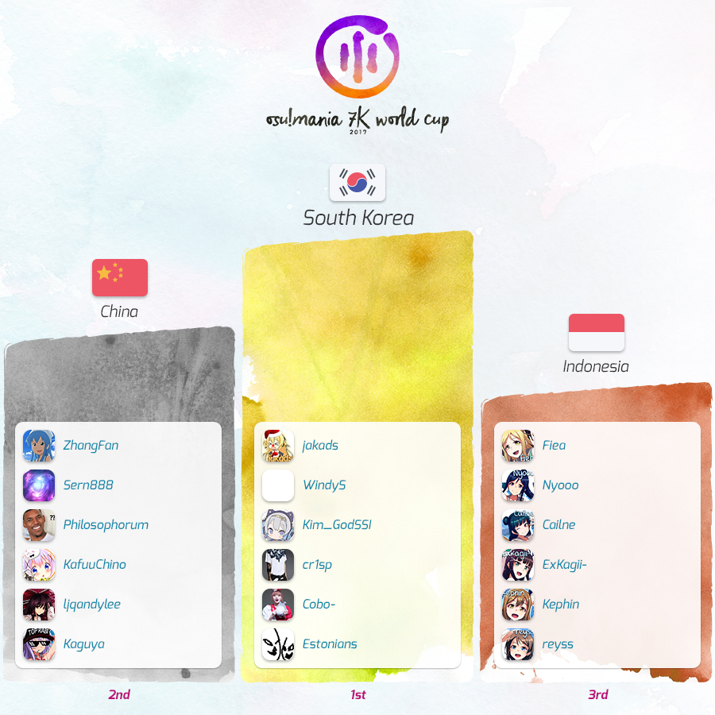

---
tags:
  - MWC 2017
  - MWC 7K 2017
  - MWC2017
  - MWC7K 2017
---

# osu!mania 7K World Cup 2017

The **osu!mania 7K World Cup 2017** (***MWC 7K 2017***) was a country-based osu!mania 7K tournament hosted by the [osu! team](/wiki/People/osu!_team). It was the third instalment of the osu!mania 7K World Cup.

## Tournament schedule

| Event | Timestamp |
| --: | :-- |
| Registration phase | 2016-12-12/2016-12-25 |
| Live drawings | 2017-01-08 (14:00 UTC) |
| Group stage | 2017-01-14/2017-01-15 |
| Quarterfinals | 2017-01-21 |
| Semifinals | 2017-01-29 |
| Finals week 1 | 2017-02-04/2017-02-05 |
| Finals week 2 | 2017-02-12 |

## Prizes

| Placing | Prizes |
| :-: | :-- |
|  | Unique profile badge, exclusive osu! merchandise, "osu!mania Champion" user title for one year |
|  | Unique profile badge, exclusive osu! merchandise |
|  | Unique profile badge, exclusive osu! merchandise |

  

## Organisation

The osu!mania 7K World Cup 2017 was run by various community members.

| Position | Member(s) |
| :-- | :-- |
| Manager | ::{ flag=ES }:: [Deif](https://osu.ppy.sh/users/318565), ::{ flag=DE }:: [Loctav](https://osu.ppy.sh/users/71366), ::{ flag=DE }:: [p3n](https://osu.ppy.sh/users/123703), ::{ flag=FR }:: [shARPII](https://osu.ppy.sh/users/776257) |
| Mappool selector | ::{ flag=US }:: [Blocko](https://osu.ppy.sh/users/4075092), ::{ flag=SG }:: [Evening](https://osu.ppy.sh/users/2193881), ::{ flag=PL }:: [-Kamikaze-](https://osu.ppy.sh/users/2124783) |
| Commentator | ::{ flag=US }:: [Daikyi](https://osu.ppy.sh/users/811832), ::{ flag=NZ }:: [deadbeat](https://osu.ppy.sh/users/128370), ::{ flag=SG }:: [Evening](https://osu.ppy.sh/users/2193881), ::{ flag=US }:: [Halogen-](https://osu.ppy.sh/users/169992), ::{ flag=AR }:: [juankristal](https://osu.ppy.sh/users/443656), ::{ flag=GB }:: [-Konner-](https://osu.ppy.sh/users/6108644), ::{ flag=US }:: [Nivrad00](https://osu.ppy.sh/users/1984634), ::{ flag=FR }:: [Slainv](https://osu.ppy.sh/users/4823843), ::{ flag=US }:: [ztrot](https://osu.ppy.sh/users/6347) |
| Statistician | ::{ flag=NZ }:: [deadbeat](https://osu.ppy.sh/users/128370), ::{ flag=DE }:: [Nwolf](https://osu.ppy.sh/users/1910766) |

## Links

- [Discussion thread](https://osu.ppy.sh/community/forums/topics/615787)
- [Livestream](https://www.twitch.tv/osulive)
- **[Overall statistics, groups and more!](https://docs.google.com/spreadsheets/d/10Q8GPV9ngZJS2mGghiJUPrnZewLW9uVrs0kSvRUBN_A/pubhtml)**

## Participants

|  | Country | Members |
| --: | :-: | :-- |
| ::{ flag=AR }:: | **Argentina** | **[lxLucasxl](https://osu.ppy.sh/users/3632846)**, [aluuu](https://osu.ppy.sh/users/4585260), [Euroe](https://osu.ppy.sh/users/3633019), [Feravel](https://osu.ppy.sh/users/1276617), [pablodinakinsito](https://osu.ppy.sh/users/2052925), [wtfamidoing](https://osu.ppy.sh/users/2034976) |
| ::{ flag=AU }:: | **Australia** | **[Pew](https://osu.ppy.sh/users/597692)**, [Alchalyne](https://osu.ppy.sh/users/3999031), [ApocaZumbee](https://osu.ppy.sh/users/3431615), [Evios](https://osu.ppy.sh/users/2058022), [sankansuki](https://osu.ppy.sh/users/2877926), [Shirinisu](https://osu.ppy.sh/users/4922584) |
| ::{ flag=BR }:: | **Brazil** | **[spoonguy](https://osu.ppy.sh/users/932381)**, [Guilhermeziat](https://osu.ppy.sh/users/3661387), [Keweft](https://osu.ppy.sh/users/75777), [Lazarento](https://osu.ppy.sh/users/3224958), [Shinora-](https://osu.ppy.sh/users/5828575), [SillyFangirl](https://osu.ppy.sh/users/2288363) |
| ::{ flag=CL }:: | **Chile** | **[Gonzaalooo](https://osu.ppy.sh/users/1948903)**, [Asagaki](https://osu.ppy.sh/users/2632902), [Skalim](https://osu.ppy.sh/users/2225008) |
| ::{ flag=CN }:: | **China** | **[ZhangFan](https://osu.ppy.sh/users/89545)**, [KafuuChino](https://osu.ppy.sh/users/427355), [Kaguya](https://osu.ppy.sh/users/681814), [ljqandylee](https://osu.ppy.sh/users/141469), [Philosophorum](https://osu.ppy.sh/users/6503335), [Sern888](https://osu.ppy.sh/users/2089244) |
| ::{ flag=FR }:: | **France** | **[Elementaires](https://osu.ppy.sh/users/2284328)**, [AntoAa](https://osu.ppy.sh/users/3897919), [bumpinho](https://osu.ppy.sh/users/1594604), [CharlisMadCut](https://osu.ppy.sh/users/2863607) |
| ::{ flag=ID }:: | **Indonesia** | **[Fiea](https://osu.ppy.sh/users/3183277)**, [Cailne](https://osu.ppy.sh/users/1031263), [ExKagii-](https://osu.ppy.sh/users/4591324), [Kephin](https://osu.ppy.sh/users/5033561), [Nyooo](https://osu.ppy.sh/users/2319372), [reyss](https://osu.ppy.sh/users/4557440) |
| ::{ flag=MY }:: | **Malaysia** | **[Cryolien](https://osu.ppy.sh/users/1626983)**, [InabaYap](https://osu.ppy.sh/users/2041034), [seyren95](https://osu.ppy.sh/users/1761259) |
| ::{ flag=PH }:: | **Philippines** | **[arcwinolivirus](https://osu.ppy.sh/users/2039089)**, [BLVGARI](https://osu.ppy.sh/users/877011), [Dadots](https://osu.ppy.sh/users/3525251), [kei101895](https://osu.ppy.sh/users/3032245), [Nikana](https://osu.ppy.sh/users/4345491), [SanniSanni](https://osu.ppy.sh/users/3036686) |
| ::{ flag=PL }:: | **Poland** | **[SitekX](https://osu.ppy.sh/users/3840946)**, [\_underjoy](https://osu.ppy.sh/users/2235750), [Ereedon](https://osu.ppy.sh/users/1887068), [Hudonom](https://osu.ppy.sh/users/1654221), [LolimeisterTDS](https://osu.ppy.sh/users/4308015), [Modren](https://osu.ppy.sh/users/1828621) |
| ::{ flag=RU }:: | **Russian Federation** | **[Kivicat](https://osu.ppy.sh/users/2790640)**, [Akary](https://osu.ppy.sh/users/3912608), [DarkSider2442](https://osu.ppy.sh/users/1130069), [Grifanych](https://osu.ppy.sh/users/2025416), [Mage](https://osu.ppy.sh/users/5527957), [MisterPlegas](https://osu.ppy.sh/users/3677208) |
| ::{ flag=SG }:: | **Singapore** | **[Paralit](https://osu.ppy.sh/users/876528)**, [\[-Seiryuu-\]](https://osu.ppy.sh/users/2808028), [ByeForNow](https://osu.ppy.sh/users/7199159), [danielrox](https://osu.ppy.sh/users/4893212), [Level 51](https://osu.ppy.sh/users/3617847), [-Xarea-](https://osu.ppy.sh/users/7935679) |
| ::{ flag=KR }:: | **South Korea** | **[jakads](https://osu.ppy.sh/users/259972)**, [Cobo-](https://osu.ppy.sh/users/1482965), [cr1sp](https://osu.ppy.sh/users/5332153), [Estonians](https://osu.ppy.sh/users/7014697), [Kim\_GodSSI](https://osu.ppy.sh/users/2218047), [WindyS](https://osu.ppy.sh/users/1190879) |
| ::{ flag=TH }:: | **Thailand** | **[\_S h i r o\_](https://osu.ppy.sh/users/766374)**, [- A s u s a -](https://osu.ppy.sh/users/4607354), [Komeiji](https://osu.ppy.sh/users/1177753), [Leoros](https://osu.ppy.sh/users/6577073), [moni](https://osu.ppy.sh/users/1750531), [Zenonia](https://osu.ppy.sh/users/437945) |
| ::{ flag=GB }:: | **United Kingdom** | **[PLiv](https://osu.ppy.sh/users/929134)**, [FOR THE QUEEN](https://osu.ppy.sh/users/3359035), [Hayabusa](https://osu.ppy.sh/users/3104108), [KOTFTW](https://osu.ppy.sh/users/2075727), [Pipper](https://osu.ppy.sh/users/4168230) |
| ::{ flag=US }:: | **United States** | **[Gekido-](https://osu.ppy.sh/users/4693052)**, [Craig](https://osu.ppy.sh/users/3565377), [dewero](https://osu.ppy.sh/users/2644993), [Jinjin](https://osu.ppy.sh/users/3360737), [OroMaster](https://osu.ppy.sh/users/2375374), [Squishykorean](https://osu.ppy.sh/users/4372604) |

## Groups

| Group | Top seed | High seed | Low seed | Unseeded |
| :-: | :-- | :-- | :-- | :-- |
| **A** | ::{ flag=TH }:: Thailand | ::{ flag=US }:: United States | ::{ flag=AU }:: Australia | ::{ flag=RU }:: Russian Federation |
| **B** | ::{ flag=BR }:: Brazil | ::{ flag=CL }:: Chile | ::{ flag=MY }:: Malaysia | ::{ flag=FR }:: France |
| **C** | ::{ flag=CN }:: China | ::{ flag=ID }:: Indonesia | ::{ flag=PL }:: Poland | ::{ flag=AR }:: Argentina |
| **D** | ::{ flag=KR }:: South Korea | ::{ flag=SG }:: Singapore | ::{ flag=PH }:: Philippines | ::{ flag=GB }:: United Kingdom |

## Podium

## Mappools

### Finals

**This mappool was played during the Finals week 1 and Finals week 2.**

**[Download the mappack here! (124 MB)](http://www.mediafire.com/file/6xjcb99fb7z1vrz/MWC_7K_2017_Finals.rar)**

- FreeMod
  1. [Alon Mor - Demons (-Kamikaze-) \[Evening's ritual (preview)\]](https://osu.ppy.sh/beatmapsets/562279#mania/1188811)
  2. [uma vs. Morimori Atsushi - Re End of a Dream (qodtjr) \[Dreaming of square\]](https://osu.ppy.sh/beatmapsets/519849#mania/1104259)
  3. [Suzumu - Kakumeisei ousama densenbyou (Zenonia) \[ZenoCORE!\]](https://osu.ppy.sh/beatmapsets/463826#mania/993185)
  4. [Blitz Lunar - Mathsma Attack (Blocko) \[Shockwave\]](https://osu.ppy.sh/beatmapsets/498185#mania/1060566)
  5. [Falcom Sound Team jdk - SILENT DESERT (Evening) \[BEGINNING\]](https://osu.ppy.sh/beatmapsets/540530#mania/1146187)
  6. [The Algorithm - floating point (Drumcorps Remix) (\_underjoy) \[Approximation\]](https://osu.ppy.sh/beatmapsets/545035#mania/1154859)
  7. [EZFG - cloud (Ciel) \[High (nerfed)\]](https://osu.ppy.sh/beatmapsets/556863#mania/1178427)
  8. [xi - Angelic Party (Jinjin) \[Evening & Jinjin's Collaborative Party!\]](https://osu.ppy.sh/beatmapsets/560692#mania/1185659)
  9. [Demetori - Wind God Girl (TBSM) \[BMS 21\]](https://osu.ppy.sh/beatmapsets/347113#mania/766085)
  10. [Sakuzyo - Imprinting (Zenonia) \[Impression\]](https://osu.ppy.sh/beatmapsets/419387#mania/908448)
  11. [Carl Maria von Weber - Perpetuum Mobile (Gekido-) \[Nivrad00's Virtuoso\]](https://osu.ppy.sh/beatmapsets/460586#mania/986387)
  12. [Helblinde - Memoria Reborn (sankansuki) \[Reincarnation\]](https://osu.ppy.sh/beatmapsets/458509#mania/982489)
  13. [Camellia - Dans la mer de son (Jinjin) \[Calm Before the Storm\]](https://osu.ppy.sh/beatmapsets/556824#mania/1178316)
  14. [hino isuika - Dreamin' attraction!!(Extended) (qodtjr) \[CRASH KBD\]](https://osu.ppy.sh/beatmapsets/517221#mania/1099040)
  15. [xi - PEACE BREAKER (Evening) \[Marathon/Fallout.\]](https://osu.ppy.sh/beatmapsets/382682#mania/837107)
- Tiebreaker
  1. **[Camellia - Fastest Crash (Gekido-) \[Fastest\]](https://osu.ppy.sh/beatmapsets/348063#mania/767979)**

### Semifinals

**[Download the mappack here! (99 MB)](http://www.mediafire.com/file/ko6380yoov9455x/MWC7K_2017_Semifinals.rar)**

- FreeMod
  1. [Pegboard Nerds - Swamp Thing (Da Tweekaz Edit) (Evening) \[Expert\]](https://osu.ppy.sh/beatmapsets/799677#mania/1042544)
  2. [HHHxMMxST - oboro (Yooh) \[Hisoka\]](https://osu.ppy.sh/beatmapsets/222048#mania/519264)
  3. [DJ MRYM - Monotune \~Respect\~ (Pope Gadget) \[whasgoinon\]](https://osu.ppy.sh/beatmapsets/508875#mania/1082251)
  4. [orangentle / Yu_Asahina - HAELEQUINZ -the clown of 24stairs- (AncuL) \[Black Another\]](https://osu.ppy.sh/beatmapsets/338199#mania/909107)
  5. [sun3 - Morgenglut 2012 (arcwinolivirus) \[7K 'Morgen Mugen' Arc\]](https://osu.ppy.sh/beatmapsets/509536#mania/1083582)
  6. [goreshit - o'er the flood (Blocko) \[torrent\]](https://osu.ppy.sh/beatmapsets/454793#mania/974969)
  7. [Miku (Vocal by Nobunaga) - Shinkai Shoujou (Cuppp) \[SHD\]](https://osu.ppy.sh/beatmapsets/149086#mania/368423)
  8. [DJ Sharpnel - Tactical railroad (qodtjr) \[Destruction\]](https://osu.ppy.sh/beatmapsets/504283#mania/1072967)
  9. [Nero's Day At Disneyland - No Money Down, Low Monthly Payments (Ciel) \[Tick Tock\]](https://osu.ppy.sh/beatmapsets/550208#mania/1165581)
  10. [yuikonnu - Chikyuu Saigo no Kokuhaku wo (Zenonia) \[ZenoCORE!\]](https://osu.ppy.sh/beatmapsets/252901#mania/580759)
  11. [Forte Escape remixed by gmtn. - Extreme Z4 (Agressive HC mix) (spoonguy) \[sp5\]](https://osu.ppy.sh/beatmapsets/475251#mania/1015428)
  12. [sky-fi - sakura sweets (keii bootleg) (Agka) \[Sweet\]](https://osu.ppy.sh/beatmapsets/326875#mania/725614)
  13. [Tool - Right in Two (Pope Gadget) \[The Chasm\]](https://osu.ppy.sh/beatmapsets/546250#mania/1157119)
  14. [Yuikonnu & Ayaponzu - Kimi to watashi no hitorigoto (\_S h i r o\_) \[Relax\]](https://osu.ppy.sh/beatmapsets/412669#mania/895160)
- Tiebreaker
  1. **[Camellia - Glitch Nerds (Evening) \[overloaded\_.\]](https://osu.ppy.sh/beatmapsets/462748#mania/991010)**

### Quarterfinals

**[Download the mappack here! (61 MB)](http://www.mediafire.com/file/19768v0uxatm433/MWC_7K_2017_Quarterfinals.rar)**

- FreeMod
  1. [Rob Zombie - What Lurks on Channel X? (Pope Gadget) \[VII\]](https://osu.ppy.sh/beatmapsets/542627#mania/1150224)
  2. [SHK - Milky Way (ExPew) \[SC\]](https://osu.ppy.sh/beatmapsets/118959#mania/305675)
  3. [xi - Hesperides (ExKagii-) \[Another\]](https://osu.ppy.sh/beatmapsets/485363#mania/1035076)
  4. [S.I.D Sound - Pink Gold (Reikosaka) \[Happiness\]](https://osu.ppy.sh/beatmapsets/225274#mania/525686)
  5. [STN - The Limbo (Alumetorz) \[Rumi's MX\]](https://osu.ppy.sh/beatmapsets/160795#mania/405715)
  6. [DJ SHIMAMURA - Move Real Slow (Agka) \[Slow\]](https://osu.ppy.sh/beatmapsets/170609#mania/412973)
  7. [TAG - Romancing Layer (\_S u w a k o\_) \[Lv.34\]](https://osu.ppy.sh/beatmapsets/234247#mania/543414)
  8. [Nakamura Meiko - reverb (richardfeder) \[Another\]](https://osu.ppy.sh/beatmapsets/217249#mania/509575)
  9. [YUZU - Hyori Ittai (ArcherLove) \[Lv.25\]](https://osu.ppy.sh/beatmapsets/188056#mania/516758)
  10. [LeaF - Doppelganger (Jinjin) \[Zen's Insane\]](https://osu.ppy.sh/beatmapsets/407153#mania/1025646)
  11. [Shibayan - X-D-A-T (Jole) \[Lv.12 Another\]](https://osu.ppy.sh/beatmapsets/183721#mania/440089)
  12. [Iced Blade - Sora no Senritsu -the melody of the cosmos- feat.lily-an (OP Cut) (arcwinolivirus) \[7K Awakened\]](https://osu.ppy.sh/beatmapsets/437171#mania/941427)
  13. [M2U - Promise (Jinjin) \[Yaksok\]](https://osu.ppy.sh/beatmapsets/399373#mania/869223)
- Tiebreaker
  1. **[niki feat. Reol - WAVE (KafuuChino) \[WAVE\]](https://osu.ppy.sh/beatmapsets/476563#mania/1017922)**

### Group stage

**[Download the mappack here! (88 MB)](http://www.mediafire.com/file/zztlm72z3ngh1ha/MWC_7K_2017_Group_Stage.rar)**

- FreeMod
  1. [WALKUERE - Ikenai Borderline (SanadaYukimura) \[Emiria's 7K G\]](https://osu.ppy.sh/beatmapsets/478451#mania/1030861)
  2. [The Flashbulb - Who You Evidently Thought Was Me (-Kamikaze-) \[Pope's Anfractuous Derivative\]](https://osu.ppy.sh/beatmapsets/547077#mania/1158709)
  3. [penoreri - Everlasting Message (Julie) \[EXHAUST\]](https://osu.ppy.sh/beatmapsets/307175#mania/687322)
  4. [Sawano Hiroyuki - Blowin' (ArcherLove) \[Hard\]](https://osu.ppy.sh/beatmapsets/176972#mania/426032)
  5. [Ayana - freak of nature: start (richardfeder) \[Freak Out\]](https://osu.ppy.sh/beatmapsets/146299#mania/362574)
  6. [Sasaki Sayaka - My Dear Girl (short Ver) (shionelove) \[yoshilove's 7K HD\]](https://osu.ppy.sh/beatmapsets/357901#mania/787134)
  7. [Helblinde - Above the Clouds (Level 51) \[Hymn\]](https://osu.ppy.sh/beatmapsets/505098#mania/1074573)
  8. [KANON NAKAGAWA starring Nao Toyama - Natsuiro Surprise (HanzeR) \[Insane\]](https://osu.ppy.sh/beatmapsets/88307#mania/255968)
  9. [Tsukasa Yatoki - 2A-Attack (Reikosaka) \[Maximum\]](https://osu.ppy.sh/beatmapsets/144849#mania/359560)
  10. [Hatsuki Yura - Izayoi Warabeuta (Elementaires) \[HD\]](https://osu.ppy.sh/beatmapsets/319989#mania/712126)
  11. [Toni Leys - Dragon Valley (Toni Leys Remix feat. Esteban Bellucci) (LordRaika) \[Insane\]](https://osu.ppy.sh/beatmapsets/385056#mania/841216)
  12. [Misawa Sachika - Links (TV Size) (17VA) \[MX\]](https://osu.ppy.sh/beatmapsets/120737#mania/320510)
  13. [Junk - Aihana (Love+ Edit) (richardfeder) \[S.Star's Another\]](https://osu.ppy.sh/beatmapsets/190529#mania/468795)
- Tiebreaker
  1. **[Nhato - Magic (Tear) \[Enchanted\]](https://osu.ppy.sh/beatmapsets/177856#mania/427993)**

## Match results

### Finals week 2

Sunday, 12 February 2017:

| Team 1 |  |  | Team 2 | Match link |
| --: | :-: | :-: | :-- | :-- |
| **South Korea** ::{ flag=KR }:: | **7** | 1 | ::{ flag=CN }:: China | [#1](https://osu.ppy.sh/community/matches/31033827) |

### Finals week 1

Saturday, 4 February 2017:

| Team 1 |  |  | Team 2 | Match link |
| --: | :-: | :-: | :-- | :-- |
| United States ::{ flag=US }:: | 2 | **6** | ::{ flag=ID }:: **Indonesia** | [#1](https://osu.ppy.sh/community/matches/30827217) |
| China ::{ flag=CN }:: | -1 | **0** | ::{ flag=KR }:: **South Korea** | *win by default* |
| Thailand ::{ flag=TH }:: | 4 | **6** | ::{ flag=PH }:: **Philippines** | [#1](https://osu.ppy.sh/community/matches/30830208) |

Sunday, 5 February 2017:

| Team 1 |  |  | Team 2 | Match link |
| --: | :-: | :-: | :-- | :-- |
| **Indonesia** ::{ flag=ID }:: | **6** | 0 | ::{ flag=PH }:: Philippines | [#1](https://osu.ppy.sh/community/matches/30858348) |
| **China** ::{ flag=CN }:: | **6** | 0 | ::{ flag=ID }:: Indonesia | [#1](https://osu.ppy.sh/community/matches/30861745) |

### Semifinals

Sunday, 29 January 2017:

| Team 1 |  |  | Team 2 | Match link |
| --: | :-: | :-: | :-- | :-- |
| Indonesia ::{ flag=ID }:: | 0 | **6** | ::{ flag=KR }:: **South Korea** | [#1](https://osu.ppy.sh/community/matches/30699733) |
| Philippines ::{ flag=PH }:: | 0 | **6** | ::{ flag=CN }:: **China** | [#1](https://osu.ppy.sh/community/matches/30701653) |
| Chile ::{ flag=CL }:: | -1 | **0** | ::{ flag=TH }:: **Thailand** | *win by default* |
| **United States** ::{ flag=US }:: | **6** | 0 | ::{ flag=FR }:: France | [#1](https://osu.ppy.sh/community/matches/30705988) |

### Quarterfinals

Saturday, 21 January 2017:

| Team 1 |  |  | Team 2 | Match link |
| --: | :-: | :-: | :-- | :-- |
| **South Korea** ::{ flag=KR }:: | **5** | 0 | ::{ flag=TH }:: Thailand | [#1](https://osu.ppy.sh/community/matches/30507247) |
| **China** ::{ flag=CN }:: | **5** | 0 | ::{ flag=FR }:: France | [#1](https://osu.ppy.sh/community/matches/30508461) |
| Chile ::{ flag=CL }:: | 2 | **5** | ::{ flag=ID }:: **Indonesia** | [#1](https://osu.ppy.sh/community/matches/30510203) |
| United States ::{ flag=US }:: | 2 | **5** | ::{ flag=PH }:: **Philippines** | [#1](https://osu.ppy.sh/community/matches/30510203) |

### Group stage

Saturday, 14 January 2017:

| Team 1 |  |  | Team 2 | Match link |
| --: | :-: | :-: | :-- | :-- |
| Indonesia ::{ flag=ID }:: | 1 | **5** | ::{ flag=CN }:: **China** | [#1](https://osu.ppy.sh/community/matches/30338922) |
| Philippines ::{ flag=PH }:: | 0 | **5** | ::{ flag=KR }:: **South Korea** | [#1](https://osu.ppy.sh/community/matches/30338925) |
| Australia ::{ flag=AU }:: | 0 | **5** | ::{ flag=TH }:: **Thailand** | [#1](https://osu.ppy.sh/community/matches/30338930) |
| **Russian Federation** ::{ flag=RU }:: | **5** | 2 | ::{ flag=AU }:: Australia | [#1](https://osu.ppy.sh/community/matches/30340143) |
| **France** ::{ flag=FR }:: | **5** | 1 | ::{ flag=MY }:: Malaysia | [#1](https://osu.ppy.sh/community/matches/30340147) |
| United Kingdom ::{ flag=GB }:: | 0 | **5** | ::{ flag=KR }:: **South Korea** | [#1](https://osu.ppy.sh/community/matches/30340152) |
| **Philippines** ::{ flag=PH }:: | **5** | 2 | ::{ flag=SG }:: Singapore | [#1](https://osu.ppy.sh/community/matches/30340157) |
| **Malaysia** ::{ flag=MY }:: | **5** | 3 | ::{ flag=BR }:: Brazil | [#1](https://osu.ppy.sh/community/matches/30341742) |
| Argentina ::{ flag=AR }:: | 0 | **5** | ::{ flag=CN }:: **China** | [#1](https://osu.ppy.sh/community/matches/30341746) |
| Singapore ::{ flag=SG }:: | 1 | **5** | ::{ flag=KR }:: **South Korea** | [#1](https://osu.ppy.sh/community/matches/30341751) |
| France ::{ flag=FR }:: | 1 | **5** | ::{ flag=CL }:: **Chile** | [#1](https://osu.ppy.sh/community/matches/30348053) |
| Russian Federation ::{ flag=RU }:: | 2 | **5** | ::{ flag=US }:: **United States** | [#1](https://osu.ppy.sh/community/matches/30348061) |
| Chile ::{ flag=CL }:: | 4 | **5** | ::{ flag=BR }:: **Brazil** | [#1](https://osu.ppy.sh/community/matches/30350044) |

Sunday, 15 January 2017:

| Team 1 |  |  | Team 2 | Match link |
| --: | :-: | :-: | :-- | :-- |
| Australia ::{ flag=AU }:: | 0 | **5** | ::{ flag=US }:: **United States** | [#1](https://osu.ppy.sh/community/matches/30362455) |
| **United States** ::{ flag=US }:: | **5** | 1 | ::{ flag=TH }:: Thailand | [#1](https://osu.ppy.sh/community/matches/30363554) |
| Russian Federation ::{ flag=RU }:: | 1 | **5** | ::{ flag=TH }:: **Thailand** | [#1](https://osu.ppy.sh/community/matches/30373030) |
| Argentina ::{ flag=AR }:: | 1 | **5** | ::{ flag=ID }:: **Indonesia** | [#1](https://osu.ppy.sh/community/matches/30373052) |
| Poland ::{ flag=PL }:: | 1 | **5** | ::{ flag=CN }:: **China** | [#1](https://osu.ppy.sh/community/matches/30373084) |
| United Kingdom ::{ flag=GB }:: | 0 | **5** | ::{ flag=PH }:: **Philippines** | [#1](https://osu.ppy.sh/community/matches/30373170) |
| Poland ::{ flag=PL }:: | 2 | **5** | ::{ flag=ID }:: **Indonesia** | [#1](https://osu.ppy.sh/community/matches/30374278) |
| Malaysia ::{ flag=MY }:: | -1 | **0** | ::{ flag=CL }:: **Chile** | *win by default* |
| **United Kingdom** ::{ flag=GB }:: | **0** | -1 | ::{ flag=SG }:: Singapore | *win by default* |
| **France** ::{ flag=FR }:: | **5** | 2 | ::{ flag=BR }:: Brazil | [#1](https://osu.ppy.sh/community/matches/30375970) |
| Argentina ::{ flag=AR }:: | 0 | **5** | ::{ flag=PL }:: **Poland** | [#1](https://osu.ppy.sh/community/matches/30375979) |

## Ruleset

### Tournament rules

1. The osu!mania 7K World Cup is a country-based team tournament, played on the osu!mania game mode with 7-key specific beatmaps.
   - While this competition is planned as a 3 versus 3 setup, this might change depending on the amount of incoming registrations.
2. **Map scoring is based on Score V2. It uses an alternative way of weighting hit objects, accuracy and combo.**
3. The beatmaps for each round will be announced by the mapset selector in advance on the Sunday before the actual matches take place. Only these will be used during the respective matches.
   - One map will be given as a tiebreaker map. This map will only be played in case of a tie.
4. Match schedule will be settled by the Tournament Management (see below).
5. If no staff or referee is available, the match will be postponed.
6. Failed players' scores do not get added to the team score.
   - Reviving and surviving during a map gets considered as passing it.
7. Use of the Visual Settings to alter background dim or disable map elements like storyboards and skins are allowed.
8. If the beatmap ends in a draw, the game will be nullified.
9. If a player disconnects, they get treated as if they failed the map.
   - Disconnects within 30 seconds after map begin can be rematched. This is up to the referee's discretion. The played beatmap might be aborted for this.
10. Beatmaps cannot be reused in the same match unless the game was nullified.
11. If less than the minimum required players attend, the maximum time the match can be postponed is 10 minutes.
12. Exchanging players during a match is allowed without limitations.
13. Lag is not a valid reason to nullify a beatmap.
14. All players are supposed to keep the match running fluent and without delays. Excessive match delays coming from the player's side can be issued with penalties.
15. If a player disconnects between the beatmaps and the team can not provide an exchange, the match can be delayed 10 minutes at maximum.
16. All players and referees must to be treated with respect. Instructions of the referees and tournament management is to be followed. Decisions labeled as final are not to be objected.
17. Disrupting the match by foul play, picking inappropriate warmup beatmaps (see below), insulting and provoking other players or referees, delaying the match or other deliberate inappropriate misbehavior is strictly prohibited.
18. The multiplayer chatrooms underlie the [osu! community rules](/wiki/Rules). All chat rules apply to the multiplayer chatrooms, too.
    - Breaking the chat rules results in a silence. Silenced players can not participate at multiplayer matches and must be exchanged for the time being.
19. In Group stage, 'Win by default' will be considered as win by 4:0, +1.0 score difference ratio.
20. Unexpected incidences are handled by the tournament management. Referees may allow higher tolerance depending on the given circumstances. This is up to their discretion.
21. Penalties for violating the tournament rules can be:
    - Exclusion of specific players for one map
    - Exclusion of specific players for an entire match
    - Declaring the match as Lost by Default
    - Disqualification from the entire tournament
    - Disqualification from the current and future official tournaments until appealed
    - Any modification of these rules will be announced.

### Tournament registration

1. Every user interested in joining their country's team signs up individually.
   - Tournament Management will create a list of potential candidates for a country's team.
   - Tournament Management declares one candidate to the captain of the country's team, albeit temporarily.
   - The declared captain can form their team from the candidate list of their country.
2. To ensure valid and serious registrations, every registered user will be checked by the Tournament Management.
   - Every registered user will be assigned to their respective country's candidate list.
   - To be successfully accepted on the list, you have to ensure that your global osu!mania performance ranking is above 5000.
   - To be successfully accepted on the list, you have to ensure that you did not violate the [osu! community rules](/wiki/Rules) within the last 12 months.
3. All successfully formed teams will be published after the Registration Phase.
4. Only the 32 potentially strongest countries will participate. The potential strength of a country is determined by the online statistics of all valid candidates.
   - If the amount of registered countries is below 32, the number might be reduced to 24, 20 or 16. The aim is always to let as many countries participate as possible!
5. Mapset selectors must not participate as a player in this tournament.

### Stage instructions

1. In the first stage (Group Stage), the teams will be divided into 8 groups of 4 teams.
   - This may change depending on how many teams are accepted into the competition at the end.

2. All the teams from each group will face each other.

3. Rankings of each group are determined by sorting the results of each team's performance in the following priority:
   - Most matches won.
   - Have higher `{(the number of beatmaps won) - (the number of beatmaps defeated)}`.
   - Most beatmaps won.
   - Have higher `∑{(total score difference) / (maximum score)}`.
   - Winner of the rematch.

4. The top 2 teams of each group will move on to the Knock-Out Stages.
   - This may change with the actual Group Stage setup.

5. Following stages are Double Elimination Stages. This means that the winner moves to the next stage and the losing team gets moved to the Loser bracket.

6. Based on [this image](/wiki/shared/stages-visual.png), the stages are split up into the following:

   | Stage | Match ID |
   | --: | :-- |
   | Round of 16 | A, B, C, D, E, F, G, H |
   | Quarterfinals | I, J, K, L & R, S, T, U |
   | Semifinals | M, N & V, W, X, Y, Z, AA |
   | Finals | O & AB, AC, AD, AE |
   | Grand Finals | P, Q |

7. The **Winning conditions** for each stage will be:
   - In the Group Stage and the Quarterfinals, you need to win 5 beatmaps to win a match. (Best-of-9)
   - In Semifinals and Finals, you need to win 6 beatmaps to win a match. (Best-of-11)
   - In Grand Finals, you need to win 7 beatmaps to win the match. (Best-of-13)

### Match instructions

1. A referee will create a multiplayer room 15 minutes in advance. Players must gather during this period.
   - Room settings are osu!mania, Team-Vs., Win Condition: 'ScoreV2'. Room name must be "MWC 7K 2017: (TeamBlue) vs (TeamRed)".
   - The team mentioned first in the room name must be the blue team, the team mentioned second in the room name must be the red team.
2. Players are free to select up to two warm-up beatmaps. Using beatmaps with questionable content is prohibited. All beatmaps must be osu!mania 4-key specific beatmaps.
3. Each captain can ban **one beatmap** to be selected from the pool. These beatmaps are not allowed to be picked by any team in the entire match.
4. Beatmap selection will alternate between each captain selecting a beatmap out of the map pool.
5. Each captain must use `!roll` once in `#multiplayer`.
   - The winner of the `!roll` starts picking the first beatmap of the match.
   - The loser of the `!roll` starts banning one beatmap, followed by the winner of the `!roll` to ban a map as well.
6. Captains may pick freely from any bracket.
   - In case of a tie, the tiebreaker map must be played.
7. Results of the Group Stage will be published via a Statistics sheet.

### Mappool instructions

1. There will be 1 mappool for the Group Stage, 1 mappool for the Quarterfinals, 1 mappool for the Semifinals and 1 mappool for the Finals.
   - Finals & Grand Finals use the same mappool.
2. Each mappool varies in size based on the current stage.
   - 13 FreeMod maps in Group Stage and Quarterfinals, respectively.
   - 14 FreeMod maps in Semifinals.
   - 15 FreeMod maps in Finals.
3. Each mappool has one tiebreaker.
4. All beatmaps will be played under the FreeMod conditions.
   - Allowed mods are [Hidden](/wiki/Gameplay/Game_modifier/Hidden), [FadeIn](/wiki/Gameplay/Game_modifier/Fade_In) and [Flashlight](/wiki/Gameplay/Game_modifier/Flashlight).
   - The tiebreaker will be played under FreeMod conditions.

### Scheduling instructions

1. Each stage will be held on **a single weekend**.
2. Matches in Group Stage may overlap.
3. All Double Elimination Stages will be held on either Saturday or Sunday, UTC+0.
4. Scheduling will be handled by the Tournament Management. Schedules will be released on the Sunday before the first matches of the actual stage. Tournament Management will try to create the schedule to respect the participant's time zone.
   - In the stages Quarterfinals and higher: Please inform tournament management before Sunday, if you expect a specific time slot to be unavailable in the following week. Wishes are tried to be followed, alas no promises can be made.
5. Rescheduling after the release of the Schedule on the wiki can not be done in any circumstance.
6. Captains are responsible for their teams availability. The greater team size exists to ensure every team can provide at least three players for each match. If teams can not provide three players for a match, the match will be considered forfeited.
