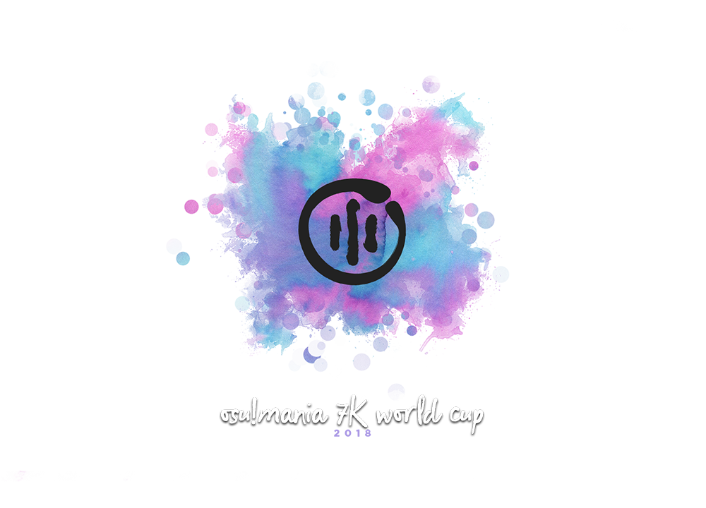

---
tags:
  - MWC 2018
  - MWC 7K 2018
  - MWC2018
  - MWC7K 2018
---

# osu!mania 7K World Cup 2018

The **osu!mania 7K World Cup 2018** (***MWC 7K 2018***) was a country-based osu!mania 7K tournament hosted by the [osu! team](/wiki/People/osu!_team). It was the fourth instalment of the osu!mania 7K World Cup.

## Tournament schedule

| Event | Timestamp |
| --: | :-- |
| Registration phase | 2018-01-10/2018-01-24 |
| Live drawings | 2018-02-03 (14:00 UTC) |
| Group stage | 2018-02-10/2018-02-11 |
| Round of 16 | 2018-02-18 |
| Quarterfinals | 2018-02-24/2018-02-25 |
| Semifinals | 2018-03-03/2018-03-04 |
| Finals week 1 | 2018-03-11 |
| Finals week 2 | 2018-03-18 |

## Prizes

| Placing | Prizes |
| :-: | :-- |
|  | $150 per team member, unique profile badge, "osu!mania Champion" user title for one year |
|  | $80 per team member, unique profile badge |
|  | $40 per team member, unique profile badge |

  

## Organisation

The osu!mania 7K World Cup 2018 was run by various community members.

| Position | Member(s) |
| :-- | :-- |
| Manager | ::{ flag=NZ }:: [deadbeat](https://osu.ppy.sh/users/128370), ::{ flag=US }:: [HappyStick](https://osu.ppy.sh/users/256802), ::{ flag=AR }:: [juankristal](https://osu.ppy.sh/users/443656) |
| Mappool selector | ::{ flag=ES }:: [aitor98](https://osu.ppy.sh/users/3154852), ::{ flag=US }:: [Blocko](https://osu.ppy.sh/users/4075092), ::{ flag=BR }:: [spoonguy](https://osu.ppy.sh/users/932381) |
| Referee | ::{ flag=ES }:: [Deif](https://osu.ppy.sh/users/318565), ::{ flag=HK }:: [mangomizer](https://osu.ppy.sh/users/1893718), ::{ flag=DE }:: [p3n](https://osu.ppy.sh/users/123703), ::{ flag=CL }:: [WalterToro](https://osu.ppy.sh/users/5281416) |
| Commentator | ::{ flag=SE }:: [\[ Vento \]](https://osu.ppy.sh/users/1612580), ::{ flag=US }:: [Halogen-](https://osu.ppy.sh/users/169992), ::{ flag=AU }:: [Lusty Platypus](https://osu.ppy.sh/users/2956184), ::{ flag=US }:: [Nivrad00](https://osu.ppy.sh/users/1984634), ::{ flag=AU }:: [PotassiumF](https://osu.ppy.sh/users/4247722), ::{ flag=US }:: [stupud man](https://osu.ppy.sh/users/2141612), ::{ flag=US }:: [TheToaphster](https://osu.ppy.sh/users/7616811), ::{ flag=FR }:: [XeoStyle](https://osu.ppy.sh/users/3377280) |
| Statistician | ::{ flag=NZ }:: [deadbeat](https://osu.ppy.sh/users/128370), ::{ flag=DE }:: [Nwolf](https://osu.ppy.sh/users/1910766) |

## Links

- [Discussion thread](https://osu.ppy.sh/community/forums/topics/687190)
- [Livestream](https://www.twitch.tv/osulive)
- **[Overall statistics, groups and more!](https://docs.google.com/spreadsheets/d/e/2PACX-1vSzdrbcYPggEJ2gRz_2nct0KfPa6ZJmD3T-mRT6XD7Ci4MhvzYyjguqQ--uYVkYZR5Sdf-pr3oEEOx9/pubhtml)**

## Participants

|  | Country | Members |
| :-: | :-: | :-- |
| ::{ flag=AR }:: | **Argentina** | **[lxLucasxl](https://osu.ppy.sh/users/3632846)**, [\_\_Yu](https://osu.ppy.sh/users/6253228), [Somnium-](https://osu.ppy.sh/users/2037798) |
| ::{ flag=AU }:: | **Australia** | **[Kites](https://osu.ppy.sh/users/4922584)**, [Evios](https://osu.ppy.sh/users/2058022), [PotassiumF](https://osu.ppy.sh/users/4247722), [sankansuki](https://osu.ppy.sh/users/2877926) |
| ::{ flag=BR }:: | **Brazil** | **[Lazarento](https://osu.ppy.sh/users/3224958)**, [Keweft](https://osu.ppy.sh/users/75777), [Lothus](https://osu.ppy.sh/users/9530019), [UrsoManso](https://osu.ppy.sh/users/4569601) |
| ::{ flag=CA }:: | **Canada** | **[Dawt](https://osu.ppy.sh/users/2747704)**, [Ansymer](https://osu.ppy.sh/users/981144), [Niisound](https://osu.ppy.sh/users/970979), [Ven](https://osu.ppy.sh/users/3209453) |
| ::{ flag=CL }:: | **Chile** | **[Skalim](https://osu.ppy.sh/users/2225008)**, [Gonzaalooo](https://osu.ppy.sh/users/1948903) |
| ::{ flag=CN }:: | **China** | **[ZhangFan](https://osu.ppy.sh/users/89545)**, [\[Crz\]Satori](https://osu.ppy.sh/users/7082178), [qx0407](https://osu.ppy.sh/users/10569738), [Wilben\_Chan](https://osu.ppy.sh/users/6659363) |
| ::{ flag=FR }:: | **France** | **[Elementaires](https://osu.ppy.sh/users/2284328)**, [AntoAa](https://osu.ppy.sh/users/3897919), [Ssauw](https://osu.ppy.sh/users/7484046), [Skorer](https://osu.ppy.sh/users/7861278) |
| ::{ flag=DE }:: | **Germany** | **[rohen04](https://osu.ppy.sh/users/369614)**, [Dualshock](https://osu.ppy.sh/users/1902591), [playin14](https://osu.ppy.sh/users/2144038), [stankill](https://osu.ppy.sh/users/2583455) |
| ::{ flag=ID }:: | **Indonesia** | **[reyss](https://osu.ppy.sh/users/4557440)**, [lino-sama](https://osu.ppy.sh/users/10364342), [projectc1](https://osu.ppy.sh/users/2663343), [rizalpramana](https://osu.ppy.sh/users/9545578) |
| ::{ flag=IT }:: | **Italy** | **[Yomiel](https://osu.ppy.sh/users/3461860)**, [HappyOverjoy](https://osu.ppy.sh/users/3244389), [Radius](https://osu.ppy.sh/users/5419711) |
| ::{ flag=JP }:: | **Japan** | **[auzen](https://osu.ppy.sh/users/235080)**, [haraharaman](https://osu.ppy.sh/users/7803518), [Next\_style](https://osu.ppy.sh/users/11446537), [quicalid4](https://osu.ppy.sh/users/6172698) |
| ::{ flag=MO }:: | **Macau** | **[idqoos123](https://osu.ppy.sh/users/3946113)**, [LuciDestiny](https://osu.ppy.sh/users/8041703) |
| ::{ flag=MY }:: | **Malaysia** | **[Cryolien](https://osu.ppy.sh/users/1626983)**, [\[MY\]Idiot](https://osu.ppy.sh/users/2059742), [cheewee10](https://osu.ppy.sh/users/4477497), [ZYuan](https://osu.ppy.sh/users/3337688) |
| ::{ flag=NO }:: | **Norway** | **[Staiain](https://osu.ppy.sh/users/86188)**, [Bizarrely\_F4st](https://osu.ppy.sh/users/7676585), [masaya](https://osu.ppy.sh/users/5818319), [NamesAreRubbish](https://osu.ppy.sh/users/5213962) |
| ::{ flag=PH }:: | **Philippines** | **[arcwinolivirus](https://osu.ppy.sh/users/2039089)**, [cieloday05](https://osu.ppy.sh/users/2722489) |
| ::{ flag=PL }:: | **Poland** | **[SitekX](https://osu.ppy.sh/users/3840946)**, [\_underjoy](https://osu.ppy.sh/users/2235750), [Benzopirene](https://osu.ppy.sh/users/1887068), [Lambard](https://osu.ppy.sh/users/6034749) |
| ::{ flag=RU }:: | **Russian Federation** | **[Mage](https://osu.ppy.sh/users/5527957)**, [Daleenie](https://osu.ppy.sh/users/1540597), [Kivicat](https://osu.ppy.sh/users/2790640), [MisterPlegas](https://osu.ppy.sh/users/3677208) |
| ::{ flag=SG }:: | **Singapore** | **[Paralit](https://osu.ppy.sh/users/876528)**, [ByeForNow](https://osu.ppy.sh/users/7199159), [RealmRipper](https://osu.ppy.sh/users/7349397), [Rommmy](https://osu.ppy.sh/users/9262190) |
| ::{ flag=KR }:: | **South Korea** | **[jakads](https://osu.ppy.sh/users/259972)**, [Estonians](https://osu.ppy.sh/users/7014697), [ideu-](https://osu.ppy.sh/users/137227), [Kim\_GodSSI](https://osu.ppy.sh/users/2218047) |
| ::{ flag=SE }:: | **Sweden** | **[Stug](https://osu.ppy.sh/users/4899311)**, [Craty](https://osu.ppy.sh/users/3918056), [Sadcat](https://osu.ppy.sh/users/4123399), [Vortex-](https://osu.ppy.sh/users/4999669) |
| ::{ flag=CH }:: | **Switzerland** | **[Akayro](https://osu.ppy.sh/users/2573716)**, [Gamer97](https://osu.ppy.sh/users/4952941) |
| ::{ flag=TH }:: | **Thailand** | **[LostCool](https://osu.ppy.sh/users/766374)**, [- Hibiki](https://osu.ppy.sh/users/7808720), [\[ - J a c K - \]](https://osu.ppy.sh/users/2880426), [Luxsus\_](https://osu.ppy.sh/users/2419363) |
| ::{ flag=GB }:: | **United Kingdom** | **[Pipper](https://osu.ppy.sh/users/4168230)**, [Pope Gadget](https://osu.ppy.sh/users/2288341), [Traps are Cute](https://osu.ppy.sh/users/3359035), [xSnaggles](https://osu.ppy.sh/users/3799946) |
| ::{ flag=US }:: | **United States** | **[stupud man](https://osu.ppy.sh/users/2141612)**, [dewero](https://osu.ppy.sh/users/2644993), [-Squishy](https://osu.ppy.sh/users/4372604), [Teggom](https://osu.ppy.sh/users/2588470) |

## Groups

| Group | Top seed | Medium seed | Low seed |
| :-: | :-- | :-- | :-- |
| **A** | ::{ flag=US }:: United States | ::{ flag=JP }:: Japan | ::{ flag=RU }:: Russian Federation |
| **B** | ::{ flag=BR }:: Brazil | ::{ flag=CA }:: Canada | ::{ flag=NO }:: Norway |
| **C** | ::{ flag=SG }:: Singapore | ::{ flag=TH }:: Thailand | ::{ flag=DE }:: Germany |
| **D** | ::{ flag=IT }:: Italy | ::{ flag=PH }:: Philippines | ::{ flag=GB }:: United Kingdom |
| **E** | ::{ flag=KR }:: South Korea | ::{ flag=FR }:: France | ::{ flag=MO }:: Macau |
| **F** | ::{ flag=MY }:: Malaysia | ::{ flag=ID }:: Indonesia | ::{ flag=PL }:: Poland |
| **G** | ::{ flag=CN }:: China | ::{ flag=CH }:: Switzerland | ::{ flag=AR }:: Argentina |
| **H** | ::{ flag=CL }:: Chile | ::{ flag=AU }:: Australia | ::{ flag=SE }:: Sweden |

## Podium

## Mappools

### Finals

**This mappool was played during the Finals week 1 and Finals week 2.**

**[Download the mappack here! (105 MB)](https://mega.nz/#!QvghCDCQ!mDHFhurA3mzdqxD-2bfULBNG0cBtXzmG35T-hw6fa3o)**

- FreeMod
  1. [Chroma - tiny tales continue (qodtjr) [Recollections]](https://osu.ppy.sh/beatmapsets/672336#mania/1421269)
  2. [Camellia feat. Nanahira - EDM Jumpers ({E+H}DM Reboot) (Evening) [\* \* \* \\ ( o w o)/ \*\* !!]](https://osu.ppy.sh/beatmapsets/799656#mania1309991)
  3. [you - Hold Angel (Blocko) [Angel]](https://osu.ppy.sh/beatmapsets/636543#mania/1351223)
  4. [Misty rain - Sakura no Sakanu wa Eiketsu no (Zenonia) [Lasers of Seventeen Articles]](https://osu.ppy.sh/beatmapsets/438128#mania/943256)
  5. [Gekikara Mania - Deublithick (\_underjoy) [Ultra]](https://osu.ppy.sh/beatmapsets/725078#mania/1536787)
  6. [Nauts - Second Run (Core Mix) (Reba) [Lv.60]](https://osu.ppy.sh/beatmapsets/504091#mania/1173638)
  7. [DJ Sharpnel - Gate Openerz (qodtjr) [qodwawa]](https://osu.ppy.sh/beatmapsets/611664#mania/1291115)
  8. [Hoshizora Rin (CV.Iida Riho) & Nishikino Maki (CV.Pile) - Beat in Angel (arcwinolivirus) [Beating Fallen Angel]](https://osu.ppy.sh/beatmapsets/611661#mania/1299515)
  9. [YUC'e - Future Cider (Blasticide) [Future Candy]](https://osu.ppy.sh/beatmapsets/655302#mania/1752987)
  10. [xi - Valhalla (AncuL) [Collab Grimnismal]](https://osu.ppy.sh/beatmapsets/729419#mania/1539702)
  11. [Ras - TURNDOWN(gdbg edit) (spoonguy) [sp7]](https://osu.ppy.sh/beatmapsets/743134#mania/1567241)
  12. [F-777 - Deadlocked (Ciel) [Lockstep]](https://osu.ppy.sh/beatmapsets/743379#mania/1567673)
  13. [Fallen Shepherd ft. RabbiTon Strings - ENDYMION (Blocko) [Coronation]](https://osu.ppy.sh/beatmapsets/707421#mania/1495919)
  14. [DragonForce - Through The Fire And Flames (Jinjin) [Eternal Reign]](https://osu.ppy.sh/beatmapsets/737590#mania/1565212)
  15. [lapix - Carry me away (Couil) [7K SV Challenge]](https://osu.ppy.sh/beatmapsets/602070#mania/1526642)
- Tiebreaker
  1. **[Gram vs. Camellia - Ragnarok (Jinjin) [Fate]](https://osu.ppy.sh/beatmapsets/742624#mania/1566335)**

### Semifinals

**[Download the mappack here! (66 MB)](http://www.mediafire.com/file/qz2w37i72joijx7/SF+Mappool.zip)**

- FreeMod
  1. [FELT - Flower Flag (17VA) [Lunatic]](https://osu.ppy.sh/beatmapsets/539088#mania/1142360)
  2. [ZiGZaG - VVV (AncuL) [Nightmare]](https://osu.ppy.sh/beatmapsets/557783#mania/1180112)
  3. [fripSide - white forces (Pikobaka) [White]](https://osu.ppy.sh/beatmapsets/446687#mania/959256)
  4. [Hinoisuka - Delightness Brightness (qodtjr) [Hoshi]](https://osu.ppy.sh/beatmapsets/591491#mania/1251693)
  5. [Camellia - Towards the Horizon (AncuL) [Horizon]](https://osu.ppy.sh/beatmapsets/687679#mania/1455297)
  6. [Sai Oto / Komiya Mao - Yozakura (Reba) [Lv.16]](https://osu.ppy.sh/beatmapsets/620008#mania/1306788)
  7. [Shoujo Fractal - Samayoi no mei (Wonki) [Lunatic]](https://osu.ppy.sh/beatmapsets/720769#mania/1522088)
  8. [goreshit - the nature of dying (Blocko) [mourning]](https://osu.ppy.sh/beatmapsets/667028#mania/1411514)
  9. [Noah - Celestial stinger (Wonki) [GRAVITY]](https://osu.ppy.sh/beatmapsets/542426#mania/1149869)
  10. [O2i3 - TSLove (jakads) [Jump!]](https://osu.ppy.sh/beatmapsets/588467#mania/1245822)
  11. [Camellia - crystallized (Blocko) [Coalescence]](https://osu.ppy.sh/beatmapsets/472088#mania/1008888)
  12. [A4paper - Hypernova (Spy) [Lee's 7K Black Another]](https://osu.ppy.sh/beatmapsets/541278#mania/1147752)
  13. [Shawn Wasabi + YDG feat. YUNG GEMMY - Burnt Rice (Aiobahn & Jh-Anu Remix) (Ciel) [Crispy]](https://osu.ppy.sh/beatmapsets/740516#mania/1562281)
- Tiebreaker
  1. **[Halozy - Genryuu Kaiko (ShikiNoHollow) [7K Z3nith]](https://osu.ppy.sh/beatmapsets/305213#mania/684928)**

### Quarterfinals

**[Download the mappack here! (65 MB)](http://www.mediafire.com/file/6tkb99xgg481wzy/Quarterfinals%20Mappool.zip)**

- FreeMod
  1. [Aiobahn & Yunomi - Ginga Tetsudou no Penguin ft. nicamoq (Stripe.P Remix) (jakads) [Betsaljoy Lv.32 [Jacky Express]]](https://osu.ppy.sh/beatmapsets/708064#mania/1497082)
  2. [Schubert - Introduction And Variations 'Trockne Blumen' Variation 5 Remix&Arrange (Feerum) [Blocko's 7K Extra]](https://osu.ppy.sh/beatmapsets/557139#mania/1552763)
  3. [The Flashbulb - Passage D (Wonki) [Forbidden Path]](https://osu.ppy.sh/beatmapsets/635555#mania/1348685)
  4. [Yooh - Shanghai Kouchakan (Orchid Remix 2017 Update ver.) (AncuL) [Orchid]](https://osu.ppy.sh/beatmapsets/672440#mania/1421481)
  5. [EBIMAYO - GOODBOUNCE (R e m u r i n g) [BOUNCE]](https://osu.ppy.sh/beatmapsets/608753#mania/1285588)
  6. [Suzuki Konomi - CHOIR JAIL (arcwinolivirus) [7K 'Epic Tragedy' Arc]](https://osu.ppy.sh/beatmapsets/511265#mania/1086869)
  7. [bill wurtz - outside (Nivrad00) [i wanna go outside]](https://osu.ppy.sh/beatmapsets/735580#mania/1552703)
  8. [holic - Deus ex machina (spoonguy) [sp1]](https://osu.ppy.sh/beatmapsets/475250#mania/1015427)
  9. [UNDEAD CORPORATION - Seven Colors (Nwolf) [LordRaika's 7K EX]](https://osu.ppy.sh/beatmapsets/288138#mania/1155703)
  10. [encX - One Day (Lenfried-) [7K SV]](https://osu.ppy.sh/beatmapsets/596525#mania/1261333)
  11. [Aphex Twin (Cover by Webodan) - Avril 14th (8-bit GXSCC) (Nivrad00) [Challenge]](https://osu.ppy.sh/beatmapsets/448738#mania/963008)
- Tiebreaker
  1. **[Kano - Stella-rium (DJ Noriken Bootleg) (Lude) [Interstellar // 7K]](https://osu.ppy.sh/beatmapsets/556549#mania/1177813)**

### Round of 16

**[Download the mappack here! (64 MB)](http://www.mediafire.com/file/7jqki3895iiehp5/ro16%20mappool.zip)**

- FreeMod
  1. [xi - Aragami (Blocko) [7K Insane]](https://osu.ppy.sh/beatmapsets/344198#mania/760452)
  2. [KOTOKO - agony (TV Size) (woc2006) [Rumi's Insane]](https://osu.ppy.sh/beatmapsets/95898#mania/261515)
  3. [N.M.S.T - Snowflakes (jakads) [Insane]](https://osu.ppy.sh/beatmapsets/444615#mania/955188)
  4. [THE KOXX - A Fool Moon Night (Jinjin) [Foolish]](https://osu.ppy.sh/beatmapsets/552675#mania/1170409)
  5. [Kola Kid - spaceman (wizardoffail) [Normal]](https://osu.ppy.sh/beatmapsets/270703#mania/615683)
  6. [she - Is This Love [osu!mania Speedmapping Challenge #5] (Nivrad00) [Niv's 7K Space Distortion]](https://osu.ppy.sh/beatmapsets/569203#mania/1206690)
  7. [xi - .357 Magnum (Level 51) [Insane]](https://osu.ppy.sh/beatmapsets/517516#mania/1099592)
  8. [Hideyuki Fukasawa - kengen/great three (richardfeder) [AL's Insane]](https://osu.ppy.sh/beatmapsets/365716#mania/1189760)
  9. [capitaro - Tenshinranman Haikara Hime (ExNeko) [Tsukimisake]](https://osu.ppy.sh/beatmapsets/561041#mania/1186335)
  10. [Falcom Sound Team J.D.K. - Phantasmagoria (richardfeder) [7K MX]](https://osu.ppy.sh/beatmapsets/113175#mania/293691)
  11. [she - gum (spoonguy) [spoongum]](https://osu.ppy.sh/beatmapsets/732945#mania/1546340)
- Tiebreaker
  1. **[kamome sano - eclair au chocolat (extended bittersweet mix) (Lenfried-) [Gourmet Chocolate]](https://osu.ppy.sh/beatmapsets/505048#mania/1074472)**

### Group stage

**[Download the mappack here! (79 MB)](http://www.mediafire.com/file/afhpp235r223mry/Group%20Stage.zip)**

- FreeMod
  1. [yozuca\* - LOVING TRIP (shionelove) [Another]](https://osu.ppy.sh/beatmapsets/449243#mania/964012)
  2. [HoneyWorks - Kikoemasu ka feat. Haruki \<Youshouki\> (CV: Koinu) (SurfChu85) [do you hear me?]](https://osu.ppy.sh/beatmapsets/717277#mania/1515408)
  3. [LAST ALLIANCE - HEKIREKI (TV Size) (Miyamoto Usagi) [7K Burst! 'Cruel Shower']](https://osu.ppy.sh/beatmapsets/156937#mania/384381)
  4. [Camellia - Proluvies (Lenfried-) [7K Hard]](https://osu.ppy.sh/beatmapsets/727684#mania/1536295)
  5. [Kinjishi - Nageki no Ki -02RMX- (CHARGE) [\_underjoy's Insane]](https://osu.ppy.sh/beatmapsets/530008#mania/1124577)
  6. [Kyary Pamyu Pamyu - HARAJUKU IYAHOI (ArcherLove) [Sulit [HD]]](https://osu.ppy.sh/beatmapsets/570407#mania/1209101)
  7. [ClariS - Anemone -TV MIX- (richardfeder) [7K Insane]](https://osu.ppy.sh/beatmapsets/364159#mania/799473)
  8. [Between August and December - Sayonara Cruel World (Reworked) (AnatOWJIya) [Kivi's 7K Cruel World]](https://osu.ppy.sh/beatmapsets/349950#mania/1038325)
  9. [RADWIMPS - Sakusen Kaigi (Level 51) [it's criminal!]](https://osu.ppy.sh/beatmapsets/726244#mania/1533313)
- Tiebreaker
  1. **[KIVA feat. Qma - Flame Dark (Protastic101) [Minseo's 7K Solipsism]](https://osu.ppy.sh/beatmapsets/510173#mania/1355805)**

## Match results

### Finals week 2

Saturday, 18 March 2018:

| Team 1 |  |  | Team 2 | Match link |
| --: | :-: | :-: | :-- | :-- |
| China ::{ flag=CN }:: | 4 | **7** | ::{ flag=MY }:: **Malaysia** | [#1](https://osu.ppy.sh/community/matches/40933215) |
| **South Korea** ::{ flag=KR }:: | **7** | 1 | ::{ flag=MY }:: Malaysia | [#1](https://osu.ppy.sh/community/matches/40936075) |

### Finals week 1

Saturday, 11 March 2018:

| Team 1 |  |  | Team 2 | Match link |
| --: | :-: | :-: | :-- | :-- |
| **Brazil** ::{ flag=BR }:: | **7** | 6 | ::{ flag=SG }:: Singapore | [#1](https://osu.ppy.sh/community/matches/40743246) |
| Philippines ::{ flag=PH }:: | 0 | **7** | ::{ flag=MY }:: **Malaysia** | [#1](https://osu.ppy.sh/community/matches/40745201) |
| **South Korea** ::{ flag=KR }:: | **7** | 2 | ::{ flag=CN }:: China | [#1](https://osu.ppy.sh/community/matches/40752937) |
| **Malaysia** ::{ flag=MY }:: | **7** | 0 | ::{ flag=BR }:: Brazil | [#1](https://osu.ppy.sh/community/matches/40754939) |

### Semifinals

Saturday, 3 March 2018:

| Team 1 |  |  | Team 2 | Match link |
| --: | :-: | :-: | :-- | :-- |
| Australia ::{ flag=AU }:: | 0 | **6** | ::{ flag=CL }:: **Chile** | [#1](https://osu.ppy.sh/community/matches/40518173) |
| **United States** ::{ flag=US }:: | **6** | 5 | ::{ flag=JP }:: Japan | [#1](https://osu.ppy.sh/community/matches/40519477) |
| Malaysia ::{ flag=MY }:: | 0 | **6** | ::{ flag=KR }:: **South Korea** | [#1](https://osu.ppy.sh/community/matches/40527504) |
| **China** ::{ flag=CN }:: | **6** | 0 | ::{ flag=SG }:: Singapore | [#1](https://osu.ppy.sh/community/matches/40528604) |
| Italy ::{ flag=IT }:: | 4 | **6** | ::{ flag=PH }:: **Philippines** | [#1](https://osu.ppy.sh/community/matches/40530352) |
| France ::{ flag=FR }:: | -1 | **0** | ::{ flag=BR }:: **Brazil** | *win by default* |
| **Brazil** ::{ flag=BR }:: | **6** | 1 | ::{ flag=US }:: United States | [#1](https://osu.ppy.sh/community/matches/40544245) |

Sunday, 4 March 2018:

| Team 1 |  |  | Team 2 | Match link |
| --: | :-: | :-: | :-- | :-- |
| Chile ::{ flag=CL }:: | 3 | **6** | ::{ flag=PH }:: **Philippines** | [#1](https://osu.ppy.sh/community/matches/40554885) |

### Quarterfinals

Saturday, 24 February 2018:

| Team 1 |  |  | Team 2 | Match link |
| --: | :-: | :-: | :-- | :-- |
| **China** ::{ flag=CN }:: | **5** | 0 | ::{ flag=PH }:: Philippines | [#1](https://osu.ppy.sh/community/matches/40337357) |
| **Australia** ::{ flag=AU }:: | **5** | 2 | ::{ flag=DE }:: Germany | [#1](https://osu.ppy.sh/community/matches/40338527) |
| Indonesia ::{ flag=ID }:: | 4 | **5** | ::{ flag=JP }:: **Japan** | [#1](https://osu.ppy.sh/community/matches/40339940) |
| **South Korea** ::{ flag=KR }:: | **5** | 0 | ::{ flag=BR }:: Brazil | [#1](https://osu.ppy.sh/community/matches/40364288) |
| **Singapore** ::{ flag=SG }:: | **5** | 2 | ::{ flag=CL }:: Chile | [#1](https://osu.ppy.sh/community/matches/40365467) |
| United States ::{ flag=US }:: | 3 | **5** | ::{ flag=MY }:: **Malaysia** | [#1](https://osu.ppy.sh/community/matches/40366912) |

Sunday, 25 February 2018:

| Team 1 |  |  | Team 2 | Match link |
| --: | :-: | :-: | :-- | :-- |
| **Italy** ::{ flag=IT }:: | **0** | -1 | ::{ flag=AR }:: Argentina | *win by default* |
| Canada ::{ flag=CA }:: | 0 | **5** | ::{ flag=FR }:: **France** | [#1](https://osu.ppy.sh/community/matches/40386907) |

### Round of 16

Sunday, 18 February 2018:

| Team 1 |  |  | Team 2 | Match link |
| --: | :-: | :-: | :-- | :-- |
| Canada ::{ flag=CA }:: | 0 | **5** | ::{ flag=CN }:: **China** | [#1](https://osu.ppy.sh/community/matches/40172677) |
| **United States** ::{ flag=US }:: | **5** | 0 | ::{ flag=AU }:: Australia | [#1](https://osu.ppy.sh/community/matches/40173698) |
| Indonesia ::{ flag=ID }:: | 0 | **5** | ::{ flag=SG }:: **Singapore** | [#1](https://osu.ppy.sh/community/matches/40179448) |
| **Malaysia** ::{ flag=MY }:: | **5** | 0 | ::{ flag=DE }:: Germany | [#1](https://osu.ppy.sh/community/matches/40180481) |
| **South Korea** ::{ flag=KR }:: | **0** | -1 | ::{ flag=IT }:: Italy | *win by default* |
| **Chile** ::{ flag=CL }:: | **5** | 4 | ::{ flag=JP }:: Japan | [#1](https://osu.ppy.sh/community/matches/40182937) |
| France ::{ flag=FR }:: | 0 | **5** | ::{ flag=PH }:: **Philippines** | [#1](https://osu.ppy.sh/community/matches/40184493) |
| **Brazil** ::{ flag=BR }:: | **5** | 0 | ::{ flag=AR }:: Argentina | [#1](https://osu.ppy.sh/community/matches/40186843) |

### Group stage

Saturday, 10 February 2018:

| Team 1 |  |  | Team 2 | Match link |
| --: | :-: | :-: | :-- | :-- |
| Thailand ::{ flag=TH }:: | 0 | **4** | ::{ flag=SG }:: **Singapore** | [#1](https://osu.ppy.sh/community/matches/39954578) |
| Switzerland ::{ flag=CH }:: | 0 | **4** | ::{ flag=CN }:: **China** | [#1](https://osu.ppy.sh/community/matches/39954590) |
| Germany ::{ flag=DE }:: | 1 | **4** | ::{ flag=SG }:: **Singapore** | [#1](https://osu.ppy.sh/community/matches/39956341) |
| Argentina ::{ flag=AR }:: | 0 | **4** | ::{ flag=CN }:: **China** | [#1](https://osu.ppy.sh/community/matches/39956356) |
| Sweden ::{ flag=SE }:: | 0 | **4** | ::{ flag=CL }:: **Chile** | [#1](https://osu.ppy.sh/community/matches/39963811) |
| Norway ::{ flag=NO }:: | 0 | **4** | ::{ flag=CA }:: **Canada** | [#1](https://osu.ppy.sh/community/matches/39963808) |
| **Argentina** ::{ flag=AR }:: | **4** | 3 | ::{ flag=CH }:: Switzerland | [#1](https://osu.ppy.sh/community/matches/39963810) |
| Russian Federation ::{ flag=RU }:: | 0 | **4** | ::{ flag=US }:: **United States** | [#1](https://osu.ppy.sh/community/matches/39965860) |
| Norway ::{ flag=NO }:: | 0 | **4** | ::{ flag=BR }:: **Brazil** | [#1](https://osu.ppy.sh/community/matches/39965793) |
| Canada ::{ flag=CA }:: | 3 | **4** | ::{ flag=BR }:: **Brazil** | [#1](https://osu.ppy.sh/community/matches/39967317) |
| Australia ::{ flag=AU }:: | 0 | **4** | ::{ flag=CL }:: **Chile** | [#1](https://osu.ppy.sh/community/matches/39979395) |

Sunday, 11 February 2018:

| Team 1 |  |  | Team 2 | Match link |
| --: | :-: | :-: | :-- | :-- |
| Japan ::{ flag=JP }:: | 2 | **4** | ::{ flag=US }:: **United States** | [#1](https://osu.ppy.sh/community/matches/39979434) |
| Russian Federation ::{ flag=RU }:: | 1 | **4** | ::{ flag=JP }:: **Japan** | [#1](https://osu.ppy.sh/community/matches/39988692) |
| Macau ::{ flag=MO }:: | 0 | **4** | ::{ flag=KR }:: **South Korea** | [#1](https://osu.ppy.sh/community/matches/39988688) |
| Indonesia ::{ flag=ID }:: | 0 | **4** | ::{ flag=MY }:: **Malaysia** | [#1](https://osu.ppy.sh/community/matches/39988684) |
| Sweden ::{ flag=SE }:: | 2 | **4** | ::{ flag=AU }:: **Australia** | [#1](https://osu.ppy.sh/community/matches/39990058) |
| **Philippines** ::{ flag=PH }:: | **4** | 2 | ::{ flag=IT }:: Italy | [#1](https://osu.ppy.sh/community/matches/39990055) |
| Macau ::{ flag=MO }:: | 3 | **4** | ::{ flag=FR }:: **France** | [#1](https://osu.ppy.sh/community/matches/39990063) |
| United Kingdom ::{ flag=GB }:: | 1 | **4** | ::{ flag=PH }:: **Philippines** | [#1](https://osu.ppy.sh/community/matches/39991459) |
| France ::{ flag=FR }:: | 0 | **4** | ::{ flag=KR }:: **South Korea** | [#1](https://osu.ppy.sh/community/matches/39991485) |
| Poland ::{ flag=PL }:: | 0 | **4** | ::{ flag=MY }:: **Malaysia** | [#1](https://osu.ppy.sh/community/matches/39991462) |
| **Germany** ::{ flag=DE }:: | **4** | 2 | ::{ flag=TH }:: Thailand | [#1](https://osu.ppy.sh/community/matches/39992982) |
| United Kingdom ::{ flag=GB }:: | 1 | **4** | ::{ flag=IT }:: **Italy** | [#1](https://osu.ppy.sh/community/matches/39992995) |
| Poland ::{ flag=PL }:: | 1 | **4** | ::{ flag=ID }:: **Indonesia** | [#1](https://osu.ppy.sh/community/matches/39992978) |

## Ruleset

### Tournament rules

1. The osu!mania 7K World Cup is a country-based team tournament, played on the osu!mania game mode.
   - **While this competition is planned as a 2 versus 2 setup, this might change depending on the amount of incoming registrations.**
2. Beatmap scoring is based on Score V2.
3. The beatmaps for each round will be announced by the Map Selector in advance on the Sunday before the actual matches take place. Only these will be used during the respective matches.
   - The Group Stage mappool will be announced after the drawings.
   - One beatmap will be given as a tiebreaker beatmap. This beatmap will only be played in case of a tie.
4. Match schedule will be settled by the Tournament Management (see below).
5. If no staff or referee is available, the match will be postponed.
6. Failed players' scores do not get added to the team score.
   - Reviving and surviving during a beatmap is considered as passing it.
7. Use of the Visual Settings to alter background dim or disable beatmap elements like storyboards and skins are allowed.
8. If the beatmap ends in a draw, the game will be nullified.
   - If a game is nullified the beatmap will be replayed.
9. If a player disconnects, they get treated as if they failed the beatmap.
   - Disconnects within 30 seconds after beatmap begin can be rematched. This is up to the referee's discretion. The played beatmap might be aborted for this.
10. Beatmaps cannot be reused in the same match unless the game was nullified.
11. **The size of each team is restricted to a maximum of 4 players and a minimum of 2.**
    - This might change depending on the amount of registrations.
12. If less than the minimum required players attend, the maximum time the match can be postponed is 10 minutes.
13. Exchanging players during a match is allowed without limitations.
14. Lag is not a valid reason to nullify a beatmap.
15. All players are supposed to keep the match running fluent and without delays. Excessive match delays coming from the player's side can be issued with penalties.
16. If a player disconnects between the beatmaps and the team can not provide an exchange, the match can be delayed 10 minutes at maximum.
17. All players and referees must to be treated with respect. Instructions of the referees and tournament management is to be followed. Decisions labeled as final are not to be objected.
18. Disrupting the match by foul play, picking inappropriate warmup beatmaps (see below), insulting and provoking other players or referees, delaying the match or other deliberate inappropriate misbehavior is strictly prohibited.
19. The multiplayer chatrooms underlie the [osu! community rules](/wiki/Rules). All chat rules apply to the multiplayer chatrooms, too.
    - Breaking the chat rules results in a silence. Silenced players can not participate at multiplayer matches and must be exchanged for the time being.
20. In the Group stage, a 'Win by default' will be considered as a win by 4:0, +1.0 score difference ratio.
21. Unexpected incidences are handled by the tournament management. Referees may allow higher tolerance depending on the given circumstances. This is up to their discretion.
22. Penalties for violating the tournament rules can be:
    - Exclusion of specific players for one beatmap.
    - Exclusion of specific players for an entire match.
    - Declaring the match as "Lost by Default".
    - Disqualification from the entire tournament.
    - Disqualification from the current and future official tournaments until appealed.
    - Any modification of these rules will be announced.

### Tournament registration

1. Every user interested in joining their country's team signs up individually.
   - Tournament Management will create a list of potential candidates for a country's team.
   - Tournament Management declares one candidate to the captain of the country's team, albeit temporarily.
   - The declared captain can form their team from the candidate list of their country.
2. To ensure valid and serious registrations, every registered user will be checked by the Tournament Management.
   - Every registered user will be assigned to their respective country's candidate list.
   - To be successfully accepted on the list, you have to ensure that your global osu! performance ranking is above 5000.
   - To be successfully accepted on the list, you have to ensure that you did not violate the [osu! community rules](/wiki/Rules) within the last 12 months.
3. All successfully formed teams will be published after the Registration Phase.
4. Only the 32 potentially strongest countries will participate. The potential strength of a country is determined by the online statistics of all valid candidates.
   - If the amount of registered countries is below 32, the number might be reduced to 24, 20 or 16. The aim is always to let as many countries participate as possible!
5. Mapset selectors must not participate as a player in this tournament.

### Stage instructions

1. In the first stage (Group Stage), the teams will be divided into 8 groups of 4 teams.
   - This may change depending on how many teams are accepted into the competition at the end.

2. All the teams from each group will face each other.

3. Rankings of each group are determined by sorting the results of each team's performance in the following priority:
   - Most matches won.
   - Have higher `{(the number of beatmaps won) - (the number of beatmaps defeated)}`.
   - Most beatmaps won.
   - **Winner of the match played previously between the tied teams.**
   - In the event of a triple tie:
     - Have higher `∑{(total score difference) / (maximum score)}`.
     - Winner of the rematch.

4. The top 2 teams of each group will move on to the Knock-Out Stages.
   - This may change with the actual Group Stage setup.

5. Following stages are Double Elimination Stages. This means that the winner moves on to the next stage and the losing team gets moved to the Losers' bracket.

6. Based on [this image](/wiki/shared/stages-visual.png), the stages are split up into the following:

   | Stage | Match ID |
   | --: | :-- |
   | Round of 16 | A, B, C, D, E, F, G, H |
   | Quarterfinals | I, J, K, L & R, S, T, U |
   | Semifinals | M, N & V, W, X, Y, Z, AA |
   | Finals | O & AB, AC, AD |
   | Grand Finals | AE, P, Q |

7. The **Winning conditions** for each stage will be:
   - In Group Stage, you need to win 4 beatmaps to win a match. (Best-of-7)
   - In the Round of 16 and the Quarterfinals, you need to win 5 beatmaps to win a match. (Best-of-9)
   - In Semifinals, you need to win 6 beatmaps to win a match. (Best-of-11)
   - In the **Finals and Grand Finals**, you need to win 7 beatmaps to win a match. (Best-of-13)

### Match instructions

1. A referee will create a multiplayer room 15 minutes in advance. Players must gather during this period.
   - Room settings are osu!, Team-Vs., Win Condition: 'ScoreV2'. Room name must be "MWC7K 2018: (TeamRed) vs (TeamBlue)".
   - The team mentioned first in the room name must be the red team, the team mentioned second in the room name must be the blue team.
2. Each team is free to select up to one warm-up beatmap. Using beatmaps with questionable content is prohibited. All beatmaps must be osu!mania 7K specific beatmaps.
3. Each captain can ban **one beatmap** to be selected from the pool. These beatmaps are not allowed to be picked by any team in the entire match.
4. Beatmap selection will alternate between each captain selecting a beatmap out of the mappool.
5. Each captain must use `!roll` once in `#multiplayer`.
   - The winner of the `!roll` starts picking the first beatmap of the match.
   - The loser of the `!roll` starts banning one beatmap, followed by the winner of the `!roll` to ban a beatmap.
6. Results of the Group Stage will be published via a Statistics sheet.

### Mappool instructions

1. There will be 1 mappool for the Group Stage, 1 mappool for Round of 16, 1 mappool for the Quarterfinals, 1 mappool for the Semifinals and 1 mappool for the Finals.
   - The mappool for the Grand Finals will be the same one as the one used on the Finals.
2. Each mappool consists of a fixed amount of maps each stage (see below) which will all be played under FreeMod conditions. This means that there is a unique FreeMod bracket.
3. The Group Stage mappool will consist of 10 maps, Round of 16 and Quarterfinals will consist of 12 maps, SemiFinals will consist of 14 maps and the Finals mappool will consist of 16 maps.
4. Each mappool has one tiebreaker.
5. Possible mod choices for all maps are [Hidden](/wiki/Gameplay/Game_modifier/Hidden), [FadeIn](/wiki/Gameplay/Game_modifier/Fade_In) and [Flashlight](/wiki/Gameplay/Game_modifier/Flashlight).
6. The tiebreaker will be played under FreeMod conditions.

### Scheduling instructions

1. Each stage will be held on **a single weekend**.
2. Matches in Group Stage may overlap.
3. All Double Elimination Stages will be held on either Saturday or Sunday, UTC+0.
4. Scheduling will be handled by the Tournament Management. Schedules will be released on the Sunday before the first matches of the actual stage. Tournament Management will try to create the schedule to respect the participant's time zone.
   - In the stages Quarterfinals and higher: Please inform tournament management before Sunday, if you expect a specific time slot to be unavailable in the following week. Wishes are tried to be followed, alas no promises can be made.
5. Rescheduling after the release of the Schedule on the wiki can not be done in any circumstance.
6. Captains are responsible for their teams availability. The greater team size exists to ensure every team can provide at least two players for each match. If teams can not provide two players for a match, the match will be considered forfeited.
