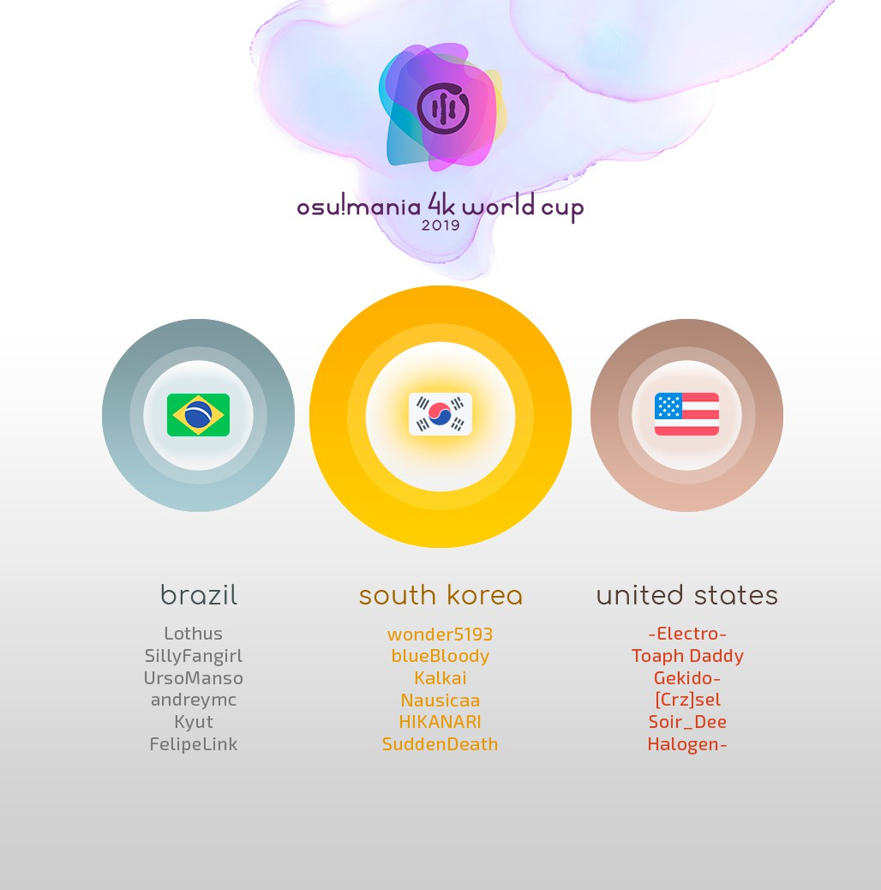

---
tags:
  - MWC 2019
  - MWC 4K 2019
  - MWC2019
  - MWC4K 2019
---

# osu!mania 4K World Cup 2019

The **osu!mania 4K World Cup 2019** (***MWC 4K 2019***) was a country-based osu!mania 4K tournament hosted by the [osu! team](/wiki/People/osu!_team). It was the sixth instalment of the osu!mania 4K World Cup.

## Tournament schedule

| Event | Timestamp |
| --: | :-- |
| Registration phase | 2019-08-20/2019-09-03 |
| Live drawings | 2019-09-14 (14:00 UTC) |
| Group stage | 2019-09-21/2019-09-22 |
| Round of 16 | 2019-09-28/2019-09-29 |
| Quarterfinals | 2019-10-05/2019-10-06 |
| Semifinals | 2019-10-11/2019-10-13 |
| Finals week 1 | 2019-10-19/2019-10-20 |
| Finals week 2 | 2019-10-26/2019-10-27 |

## Prizes

| Placing | Prizes |
| :-: | :-- |
|  | $150 per team member, unique profile badge, "osu!mania Champion" user title for one year |
|  | $80 per team member, unique profile badge |
|  | $40 per team member, unique profile badge |

  

## Organisation

The osu!mania 4K World Cup 2019 was run by various community members.

| Position | Member(s) |
| :-- | :-- |
| Manager | ::{ flag=AR }:: [juankristal](https://osu.ppy.sh/users/443656) |
| Mappool selector | ::{ flag=US }:: [Dergo](https://osu.ppy.sh/users/7439226), ::{ flag=AR }:: [juankristal](https://osu.ppy.sh/users/443656), ::{ flag=US }:: [-mint-](https://osu.ppy.sh/users/8976576), ::{ flag=CL }:: [WalterToro](https://osu.ppy.sh/users/5281416) |
| Referee | ::{ flag=PL }:: [Benzopirene](https://osu.ppy.sh/users/1887068), ::{ flag=ES }:: [Deif](https://osu.ppy.sh/users/318565), ::{ flag=DE }:: [p3n](https://osu.ppy.sh/users/123703), ::{ flag=US }:: [tigereyes144](https://osu.ppy.sh/users/6499811), ::{ flag=CL }:: [WalterToro](https://osu.ppy.sh/users/5281416), ::{ flag=GB }:: [Yazzehh](https://osu.ppy.sh/users/7068973) |
| Commentator | ::{ flag=CA }:: [Azer](https://osu.ppy.sh/users/2155578), ::{ flag=US }:: [Dohland](https://osu.ppy.sh/users/5220511), ::{ flag=GB }:: [JBHyperion](https://osu.ppy.sh/users/4879508) ::{ flag=AR }:: [juankristal](https://osu.ppy.sh/users/443656), ::{ flag=PL }:: [Kamikaze](https://osu.ppy.sh/users/2124783), ::{ flag=AU }:: [Lusty Platypus](https://osu.ppy.sh/users/2956184), ::{ flag=AU }:: [PotassiumF](https://osu.ppy.sh/users/4247722), ::{ flag=ID }:: [-Rem-](https://osu.ppy.sh/users/5767941), ::{ flag=US }:: [stupud man](https://osu.ppy.sh/users/2141612), ::{ flag=US }:: [Toaph Daddy](https://osu.ppy.sh/users/7616811) |
| Statistician | ::{ flag=DE }:: [Nwolf](https://osu.ppy.sh/users/1910766) |

## Links

- [Discussion thread](https://osu.ppy.sh/community/forums/topics/950440)
- [Livestream](https://www.twitch.tv/osulive)
- [Challonge bracket](https://challonge.com/MWC4K2019)
- **[Statistics sheet](https://docs.google.com/spreadsheets/d/e/2PACX-1vQLJYJ_IZMmXieVdGEdqBciVEwx8kqOeu6pzuTgtiMrNrwUmoZVQP1OKQf3BchgQyS0dh9i90TgbtRz/pubhtml)**

## Participants

|  | Country | Members |
| :-: | :-: | :-- |
| ::{ flag=AR }:: | **Argentina** | **[jLuyalb](https://osu.ppy.sh/users/7093698)**, [aluuu](https://osu.ppy.sh/users/4585260), [BossPlays](https://osu.ppy.sh/users/7341471), [Carlos Menem](https://osu.ppy.sh/users/9817140), [repoz](https://osu.ppy.sh/users/6719880), [Spktr](https://osu.ppy.sh/users/9856089) |
| ::{ flag=AU }:: | **Australia** | **[PotassiumF](https://osu.ppy.sh/users/4247722)**, [anim girl](https://osu.ppy.sh/users/6378800), [anim gril](https://osu.ppy.sh/users/9527845), [ExVeemon](https://osu.ppy.sh/users/1249224), [Lusty Platypus](https://osu.ppy.sh/users/2956184), [Water is anim](https://osu.ppy.sh/users/8222416) |
| ::{ flag=BR }:: | **Brazil** | **[Lothus](https://osu.ppy.sh/users/9530019)**, [andreymc](https://osu.ppy.sh/users/5691061), [FelipeLink](https://osu.ppy.sh/users/4917435), [Kyut](https://osu.ppy.sh/users/9328824), [SillyFangirl](https://osu.ppy.sh/users/2288363), [UrsoManso](https://osu.ppy.sh/users/4569601) |
| ::{ flag=CA }:: | **Canada** | **[Piggy](https://osu.ppy.sh/users/5390121)**, [arpia97](https://osu.ppy.sh/users/6363008), [Genuine](https://osu.ppy.sh/users/5235597), [Kiyora](https://osu.ppy.sh/users/9675053), [NunotabaShinobu](https://osu.ppy.sh/users/10809497), [Stability](https://osu.ppy.sh/users/6701738) |
| ::{ flag=CL }:: | **Chile** | **[Sebaex](https://osu.ppy.sh/users/4686036)**, [Arkener](https://osu.ppy.sh/users/4116072), [Skalim](https://osu.ppy.sh/users/2225008), [tortutrigo](https://osu.ppy.sh/users/7465662), [Xan-](https://osu.ppy.sh/users/5919873), [Yusei5](https://osu.ppy.sh/users/8270984) |
| ::{ flag=CN }:: | **China** | **[\[Crz\]Satori](https://osu.ppy.sh/users/7082178)**, [\[Crz\]xz1z1z](https://osu.ppy.sh/users/10500832), [4kGameBye](https://osu.ppy.sh/users/89545), [DawnX](https://osu.ppy.sh/users/8534840) |
| ::{ flag=DK }:: | **Denmark** | **[Nibbe](https://osu.ppy.sh/users/5001658)**, [Crowii](https://osu.ppy.sh/users/3795152), [Jole](https://osu.ppy.sh/users/2883132) |
| ::{ flag=FI }:: | **Finland** | **[Daughter-](https://osu.ppy.sh/users/8370443)**, [KotiMamma](https://osu.ppy.sh/users/5671827), [Madkurre](https://osu.ppy.sh/users/7111892), [princesswell](https://osu.ppy.sh/users/4789005), [Strachy](https://osu.ppy.sh/users/9663200), [TheTrueXfish](https://osu.ppy.sh/users/12545346) |
| ::{ flag=FR }:: | **France** | **[Azubeur](https://osu.ppy.sh/users/1594604)**, [AntoAa](https://osu.ppy.sh/users/3897919), [Cunu](https://osu.ppy.sh/users/7190228), [Elementaires](https://osu.ppy.sh/users/2284328), [PatouZ](https://osu.ppy.sh/users/7306522), [pimoux](https://osu.ppy.sh/users/6183047) |
| ::{ flag=DE }:: | **Germany** | **[Malox](https://osu.ppy.sh/users/4516252)**, [-Dom-](https://osu.ppy.sh/users/5587671), [ElectroYan](https://osu.ppy.sh/users/3357640), [LastExceed](https://osu.ppy.sh/users/6232245), [Niko\_Plays](https://osu.ppy.sh/users/9409456), [tyro901](https://osu.ppy.sh/users/9764403) |
| ::{ flag=HK }:: | **Hong Kong** | **[Mooncha](https://osu.ppy.sh/users/5417362)**, [Ricizus](https://osu.ppy.sh/users/10395139), [Sn7\_1163](https://osu.ppy.sh/users/10353103), [Yana Feiya](https://osu.ppy.sh/users/7802517) |
| ::{ flag=ID }:: | **Indonesia** | **[-Rem-](https://osu.ppy.sh/users/5767941)**, [\[ID\]Xenotia-](https://osu.ppy.sh/users/13865224), [Exyph](https://osu.ppy.sh/users/10364342), [LordBoker-](https://osu.ppy.sh/users/3497139), [LuxAzure](https://osu.ppy.sh/users/6045757), [Reyi](https://osu.ppy.sh/users/13385865) |
| ::{ flag=IT }:: | **Italy** | **[\[Crz\]Cribob](https://osu.ppy.sh/users/8485394)**, [-extradoge-](https://osu.ppy.sh/users/9135468), [Kiraz](https://osu.ppy.sh/users/3807675), [Mura7797](https://osu.ppy.sh/users/3244389), [Nixo](https://osu.ppy.sh/users/6380163), [Saibel](https://osu.ppy.sh/users/2727928) |
| ::{ flag=JP }:: | **Japan** | **[jhleetgirl](https://osu.ppy.sh/users/10745260)**, [\[ misa \]](https://osu.ppy.sh/users/10011429), [\[Fairy\]Phy](https://osu.ppy.sh/users/4777360), [AMDuskia1996](https://osu.ppy.sh/users/10242062), [CrewK](https://osu.ppy.sh/users/11488604), [nyanmi-1828](https://osu.ppy.sh/users/6866480) |
| ::{ flag=MY }:: | **Malaysia** | **[Minisora](https://osu.ppy.sh/users/9627666)**, [\[MY\] Zylat](https://osu.ppy.sh/users/4836079), [Blethz](https://osu.ppy.sh/users/11918602), [Expired112](https://osu.ppy.sh/users/8782656), [kaname-san92](https://osu.ppy.sh/users/764535), [watarakisah](https://osu.ppy.sh/users/6237337) |
| ::{ flag=MX }:: | **Mexico** | **[Kaisteria](https://osu.ppy.sh/users/6507028)**, [\[Crz\]Crystalize](https://osu.ppy.sh/users/3072763), [\[Crz\]Noire](https://osu.ppy.sh/users/6031847), [-Hellscythe-](https://osu.ppy.sh/users/7837147), [Manudekno](https://osu.ppy.sh/users/12472105), [Plutes](https://osu.ppy.sh/users/11188249) |
| ::{ flag=NL }:: | **Netherlands** | **[2fast4you98](https://osu.ppy.sh/users/5183940)**, [Bakuretsue](https://osu.ppy.sh/users/10960533), [Freek](https://osu.ppy.sh/users/9630674), [Hya](https://osu.ppy.sh/users/11636983), [NightNarumi](https://osu.ppy.sh/users/4381142), [samuelhklumpers](https://osu.ppy.sh/users/10945523) |
| ::{ flag=NO }:: | **Norway** | **[Bizarrely\_F4st](https://osu.ppy.sh/users/7676585)**, [giraray](https://osu.ppy.sh/users/11187151), [Jesen](https://osu.ppy.sh/users/9000473), [KarlF](https://osu.ppy.sh/users/3494742), [MartZOZ](https://osu.ppy.sh/users/9219513), [Zekronz](https://osu.ppy.sh/users/7220725) |
| ::{ flag=PE }:: | **Peru** | **[DaZeRo5](https://osu.ppy.sh/users/6114633)**, [adriancaba](https://osu.ppy.sh/users/11543837), [Ales GD](https://osu.ppy.sh/users/11930795), [Bereta](https://osu.ppy.sh/users/11410598), [zcristhianlx](https://osu.ppy.sh/users/9744385) |
| ::{ flag=PH }:: | **Philippines** | **[arcwinolivirus](https://osu.ppy.sh/users/2039089)**, [- Kura -](https://osu.ppy.sh/users/11420405), [arge-](https://osu.ppy.sh/users/9919550), [bojii](https://osu.ppy.sh/users/10083439), [Cielo Day](https://osu.ppy.sh/users/2722489), [Silhoueska Elze](https://osu.ppy.sh/users/11517895) |
| ::{ flag=PL }:: | **Poland** | **[Tidek](https://osu.ppy.sh/users/743282)**, [\_underjoy](https://osu.ppy.sh/users/2235750), [DaDarkDragon](https://osu.ppy.sh/users/8902097), [Hudonom](https://osu.ppy.sh/users/1654221), [SitekX](https://osu.ppy.sh/users/3840946), [Triksu](https://osu.ppy.sh/users/7233032) |
| ::{ flag=RU }:: | **Russian Federation** | **[YaLTeR](https://osu.ppy.sh/users/3910006)**, [AngeloLagusa](https://osu.ppy.sh/users/9074986), [c1e4r](https://osu.ppy.sh/users/8693182), [fegasaren0133](https://osu.ppy.sh/users/8035172), [Legend27](https://osu.ppy.sh/users/6283029), [Lerck](https://osu.ppy.sh/users/10450696) |
| ::{ flag=SG }:: | **Singapore** | **[ByeForNow](https://osu.ppy.sh/users/7199159)**, [jacketsniffer](https://osu.ppy.sh/users/7462804), [Jozzeh](https://osu.ppy.sh/users/9730535), [Polytetral](https://osu.ppy.sh/users/8612061), [Raveille](https://osu.ppy.sh/users/1388767), [-Yue-](https://osu.ppy.sh/users/9362562) |
| ::{ flag=KR }:: | **South Korea** | **[wonder5193](https://osu.ppy.sh/users/8474029)**, [blueBloody](https://osu.ppy.sh/users/8046839), [HIKANARI](https://osu.ppy.sh/users/4698728), [Kalkai](https://osu.ppy.sh/users/10790649), [Nausicaa](https://osu.ppy.sh/users/903155), [SuddenDeath](https://osu.ppy.sh/users/6699923) |
| ::{ flag=ES }:: | **Spain** | **[GreenSoul](https://osu.ppy.sh/users/8497100)**, [ElGuiller456](https://osu.ppy.sh/users/11309476), [Komirin](https://osu.ppy.sh/users/4725379) |
| ::{ flag=SE }:: | **Sweden** | **[Sadcat](https://osu.ppy.sh/users/4123399)**, [Akox-](https://osu.ppy.sh/users/7277169), [Vortex-](https://osu.ppy.sh/users/4999669), [Yoshiori](https://osu.ppy.sh/users/5045509) |
| ::{ flag=CH }:: | **Switzerland** | **[Gamer97](https://osu.ppy.sh/users/4952941)**, [Adyrem](https://osu.ppy.sh/users/8642966), [doere\_](https://osu.ppy.sh/users/8372292), [Tupidix](https://osu.ppy.sh/users/8655604) |
| ::{ flag=TW }:: | **Taiwan** | **[opl95173](https://osu.ppy.sh/users/7227070)**, [\[Crz\]FolAH1217](https://osu.ppy.sh/users/6232458), [2zi](https://osu.ppy.sh/users/10137329), [AradORiOn\_MMM](https://osu.ppy.sh/users/7960927), [AW ZERO](https://osu.ppy.sh/users/4415146), [luckygino](https://osu.ppy.sh/users/1967808) |
| ::{ flag=TH }:: | **Thailand** | **[MyZterioN-](https://osu.ppy.sh/users/8521723)**, [basicmaime](https://osu.ppy.sh/users/6537441), [BossMadWolf](https://osu.ppy.sh/users/2772110), [HowToPlayLN](https://osu.ppy.sh/users/10879600), [Nyarlahothep](https://osu.ppy.sh/users/2281110), [RuleBlazing](https://osu.ppy.sh/users/7312402) |
| ::{ flag=GB }:: | **United Kingdom** | **[PikachuNick](https://osu.ppy.sh/users/4168230)**, [Amascite](https://osu.ppy.sh/users/3359035), [itsjakey](https://osu.ppy.sh/users/3617889), [Pope Gadget](https://osu.ppy.sh/users/2288341), [SoFast](https://osu.ppy.sh/users/6504254), [xSnaggles](https://osu.ppy.sh/users/3799946) |
| ::{ flag=US }:: | **United States** | **[-Electro-](https://osu.ppy.sh/users/3251373)**, [\[Crz\]sel](https://osu.ppy.sh/users/9452257), [Gekido-](https://osu.ppy.sh/users/4693052), [Halogen-](https://osu.ppy.sh/users/169992), [Soir\_Dee](https://osu.ppy.sh/users/12028216), [Toaph Daddy](https://osu.ppy.sh/users/7616811) |
| ::{ flag=VE }:: | **Venezuela** | **[\_Yisus\_](https://osu.ppy.sh/users/1489811)**, [\[\_Chichinya\_\]](https://osu.ppy.sh/users/2140739), [Cyssel](https://osu.ppy.sh/users/6394478), [Doryoku](https://osu.ppy.sh/users/5639725), [Edvo](https://osu.ppy.sh/users/8301758) |

## Groups

| Group | Top seed | High seed | Low seed | Unseeded |
| :-: | :-- | :-- | :-- | :-- |
| **A** | ::{ flag=US }:: United States | ::{ flag=CN }:: China | ::{ flag=CA }:: Canada | ::{ flag=PE }:: Peru |
| **B** | ::{ flag=GB }:: United Kingdom | ::{ flag=ID }:: Indonesia | ::{ flag=MY }:: Malaysia | ::{ flag=CH }:: Switzerland |
| **C** | ::{ flag=PH }:: Philippines | ::{ flag=AR }:: Argentina | ::{ flag=DE }:: Germany | ::{ flag=HK }:: Hong Kong |
| **D** | ::{ flag=KR }:: South Korea | ::{ flag=IT }:: Italy | ::{ flag=SE }:: Sweden | ::{ flag=DK }:: Denmark |
| **E** | ::{ flag=TH }:: Thailand | ::{ flag=PL }:: Poland | ::{ flag=NL }:: Netherlands | ::{ flag=ES }:: Spain |
| **F** | ::{ flag=BR }:: Brazil | ::{ flag=CL }:: Chile | ::{ flag=TW }:: Taiwan | ::{ flag=FI }:: Finland |
| **G** | ::{ flag=AU }:: Australia | ::{ flag=JP }:: Japan | ::{ flag=RU }:: Russian Federation | ::{ flag=VE }:: Venezuela |
| **H** | ::{ flag=FR }:: France | ::{ flag=SG }:: Singapore | ::{ flag=MX }:: Mexico | ::{ flag=NO }:: Norway |

## Podium

## Mappools

### Finals

**This mappool was played during the Finals week 1 and Finals week 2.**

- FreeMod
  1. [Fairy Godmother (CV:Jennifer Saunders) - Holding Out For a Hero (-mint-) \[Happily Ever After (cut)\]](https://osu.ppy.sh/beatmapsets/1049206#mania/2192932)
  2. [Venetian Snares - Epidermis (Shoegazer) \[Tribalism 1.3x\]](https://osu.ppy.sh/beatmapsets/898099#mania/2159723)
  3. [Jomekka - Eighto (Wh1teh) \[k\]](https://osu.ppy.sh/beatmapsets/584698#mania/1237015)
  4. [LeaF - Calamity Fortune (qqqant) \[Freedom (240bpm)\]](https://osu.ppy.sh/beatmapsets/866025#mania/1810669)
  5. [DJ Noriken - #The\_Relentless\_(Modified) (Dergo) \[#The\_Edited\_(Cut) [1.05x Rate]\]](https://osu.ppy.sh/beatmapsets/978518#mania/2055448)
  6. [t+pazolite - Do I Smile? (Trixta) \[Execution\]](https://osu.ppy.sh/beatmapsets/717382#mania/1515588)
  7. [Reizoko CJ - Thriller (Daikyi) \[Architekt 1.1x\]](https://osu.ppy.sh/beatmapsets/1050752#mania/2196073)
  8. [Kurorak - BREACH PROTOCOL (Daikyi) \[SVampirical\]](https://osu.ppy.sh/beatmapsets/1050571#mania/2195757)
  9. [kradness & REOL - Okochama Sensou (Fullerene-) \[Wafles' Challenge\]](https://osu.ppy.sh/beatmapsets/1048432#mania/2191423)
  10. [Zekk - Duplication (Dergo) \[replicationnn (1.1x)\]](https://osu.ppy.sh/beatmapsets/1046301#mania/2187288)
  11. [DiGiTAL WiNG - DON'T STOP (AutotelicBrown) \[ALiCE's SHORTER RAVE [1.05x Rate]\]](https://osu.ppy.sh/beatmapsets/657818#mania/2196132)
  12. [Aquellex - Crystal Chamber Combustion (Valedict) \[World Destroyer (273BPM Edit)\]](https://osu.ppy.sh/beatmapsets/1047374#mania/2189291)
  13. [KikuoHana - Hibi Darake No Me (Gekido-) \[Stabbing\]](https://osu.ppy.sh/beatmapsets/748212#mania/1576294)
  14. [KURORAK - Gamma Stop Sending Me Ratchet and Clank Videos to Sample (Gekido-) \[Challenge\]](https://osu.ppy.sh/beatmapsets/1033252#mania/2160337)
  15. [Cilvery - Kamisama Nejimaki (juankristal) \[TIMING HELL\]](https://osu.ppy.sh/beatmapsets/1050794#mania/2196171)
  16. [Chroma - lost found melody (Ciel) \[Found\]](https://osu.ppy.sh/beatmapsets/1051052#mania/2196635)
- Tiebreaker
  1. **[Camellia - Racemization (-mint-) \[enantiomers\]](https://osu.ppy.sh/beatmapsets/1050821#mania/2196214)**

### Semifinals

- FreeMod
  1. [Se-U-Ra - Zen'on (AutotelicBrown) \[Ayumu's Death Piano\]](https://osu.ppy.sh/beatmapsets/1044167#mania/2182853)
  2. [BlackY fused with WAiKURO - Alea jacta est! (Raveille) \[Divide et impera\]](https://osu.ppy.sh/beatmapsets/1045504#mania/2185617)
  3. [Kabocha - EgO (zero2snow) \[MXM\]](https://osu.ppy.sh/beatmapsets/1045870#mania/2186392)
  4. [9mm Parabellum Bullet - Punishment (Shoegazer) \[Termination\]](https://osu.ppy.sh/beatmapsets/777334#mania/1633075)
  5. [Memme - Acid Burst (Vortex-) \[Third Eye\]](https://osu.ppy.sh/beatmapsets/696328#mania/1475042)
  6. [Memme - Hellfire (scissorsf) \[La Inferno\]](https://osu.ppy.sh/beatmapsets/635334#mania/1348132)
  7. [siromaru - Absurd Gaff (Civilization) \[Nullify\]](https://osu.ppy.sh/beatmapsets/1046546#mania/2187781)
  8. [Akira Complex - Ether Strike (Dergo) \[SVoid\]](https://osu.ppy.sh/beatmapsets/1020073#mania/2134472)
  9. [Grimes - We Appreciate Power (Valedict) \[Extra\]](https://osu.ppy.sh/beatmapsets/1046589#mania/2187893)
  10. [funauo - Mousou Seizou Sanka (-mint-) \[Another (NSV) 1.05x\]](https://osu.ppy.sh/beatmapsets/1047347#mania/2189519)
  11. [DJ Sharpnel - Over the Fullereneshift (Shoegazer) \[Edit (245bpm)\]](https://osu.ppy.sh/beatmapsets/893066#mania/1866561)
  12. [Sota Fujimori - Move That Body -Extended Mix- (juankristal) \[Dance\]](https://osu.ppy.sh/beatmapsets/765772#mania/1609983)
  13. [Terminal 11 - Adcar (Gekido-) \[Challenge\]](https://osu.ppy.sh/beatmapsets/911470#mania/1902611)
  14. [Camellia feat. Nanahira - PAPAYAPA BASS (Nwolf) \[Drago's Payapa\]](https://osu.ppy.sh/beatmapsets/584714#mania/2189515)
  15. [The Quick Brown Fox - Serious Shit (Jole) \[ilikexd but the holds died 1.05\]](https://osu.ppy.sh/beatmapsets/842331#mania/2184874)
  16. [Graham Kartna - chiltonWALK.temp (Nivrad00) \[Challenge\]](https://osu.ppy.sh/beatmapsets/1010184#mania/2114659)
- Tiebreaker
  1. **[Camellia - Arche (-mint-) \[drago vs. mint's apeiron\]](https://osu.ppy.sh/beatmapsets/1047817#mania/2190205)**

### Quarterfinals

- FreeMod
  1. [toby fox - Spear of Justice (Civilization) \[Undying\]](https://osu.ppy.sh/beatmapsets/1044193#mania/2182886)
  2. [PSYQUI - Multitalents (BringoBrango) \[Prodigy\]](https://osu.ppy.sh/beatmapsets/1024323#mania/2142612)
  3. [Terminal 11 - Miserable Bastard (Gekido-) \[Despair\]](https://osu.ppy.sh/beatmapsets/789976#mania/1657803)
  4. [tomatoism - UMP9 (Ticle) \[Heizy\]](https://osu.ppy.sh/beatmapsets/970727#mania/2032725)
  5. [goreshit - MATZcore (-mint-) \[im baby waAahhhh\]](https://osu.ppy.sh/beatmapsets/1044169#mania/2182855)
  6. [Y0c1e - Heiju (Hydria) \[Insane\]](https://osu.ppy.sh/beatmapsets/620190#mania/1307119)
  7. [Hammer Switch - Lots of Spices (Couil) \[SV Challenge\]](https://osu.ppy.sh/beatmapsets/702050#mania/1485544)
  8. [matra magic - FRAME (Valedict) \[DATA\]](https://osu.ppy.sh/beatmapsets/552855#mania/1170730)
  9. [seleP - Scarlet Rose (juankristal) \[juanderjoy's Rose\]](https://osu.ppy.sh/beatmapsets/580114#mania/1228278)
  10. [PROTODOME - Greatest Hat (Gekido-) \[chalLeNge\]](https://osu.ppy.sh/beatmapsets/840500#mania/1759313)
  11. [Se-U-Ra - LOSHAXI (Elekton) \[alonewithi\]](https://osu.ppy.sh/beatmapsets/790524#mania/1658712)
  12. [Camellia feat. Nanahira - Amor De Verao (-mint-) \[Quatro, tres, dois, um\]](https://osu.ppy.sh/beatmapsets/1021336#mania/2136956)
  13. [xi - Longinus (Dergo) \[seraphic\]](https://osu.ppy.sh/beatmapsets/1022615#mania/2139387)
  14. [Tipper - Cubic Squeal (Lusty Platypus) \[Passable\]](https://osu.ppy.sh/beatmapsets/771447#mania/1959674)
- Tiebreaker
  1. **[Camellia feat. Nanahira - EDM Jumpers ({E+H}DM Reboot) (Gekido-) \[{L+E}MON Reboot\]](https://osu.ppy.sh/beatmapsets/805341#mania/1690577)**

### Round of 16

- FreeMod
  1. [E-Type - Here I Go Again (Jole) \[where u going though\]](https://osu.ppy.sh/beatmapsets/433032#mania/933589)
  2. [Shawn Wasabi - Marble Soda (-mint-) \[Ramune\]](https://osu.ppy.sh/beatmapsets/946991#mania/1977877)
  3. [Ariana Grande - thank u, next (Civilization) \[venti frappuccino\]](https://osu.ppy.sh/beatmapsets/1010846#mania/2115940)
  4. [KillerBlood - Goodbye Boss (Dergo) \[treason\]](https://osu.ppy.sh/beatmapsets/907627#mania/1894009)
  5. [Anamanaguchi - Prom Night (Valedict) \[Lovely\]](https://osu.ppy.sh/beatmapsets/585731#mania/1240675)
  6. [PSYQUI - Education (Dergo) \[bye4now's university\]](https://osu.ppy.sh/beatmapsets/983953#mania/2129202)
  7. [X&G - Whiplash ft. josh pan (sakuraburst Remix) (error\_exe777) \[break out\]](https://osu.ppy.sh/beatmapsets/723633#mania/1527737)
  8. [Seiryu - AO-INFINITY (Lusty Platypus) \[Forever\]](https://osu.ppy.sh/beatmapsets/861467#mania/1802210)
  9. [Virtual Riot - Preset Junkies VIP (Gekido-) \[Challenge\]](https://osu.ppy.sh/beatmapsets/886857#mania/1854039)
  10. [Helblinde - Unconquered (Dergo) \[reign\]](https://osu.ppy.sh/beatmapsets/993995#mania/2078446)
  11. [Memme - China Dress (juankristal) \[Stage 3: Armony\]](https://osu.ppy.sh/beatmapsets/901835#mania/1882949)
  12. [goreshit - burn this moment into the retina of my eye (Vortex-) \[memory loss\]](https://osu.ppy.sh/beatmapsets/999447#mania/2169709)
  13. [Chroma - Pon-Pon-Pompoko Dai-Sen-Saw! (ALEFY) \[Pira's EXHAUST\]](https://osu.ppy.sh/beatmapsets/351531#mania/775625)
  14. [The Flashbulb - Cycles (TheToaphster) \[Stage 1: Composure\]](https://osu.ppy.sh/beatmapsets/673208#mania/1424814)
- Tiebreaker
  1. **[dj TAKA - Colors -sasakure.UK Futurelogic Remix- (Dergo) \[blue\]](https://osu.ppy.sh/beatmapsets/1033943#mania/2161813)**

### Group stage

- FreeMod
  1. [Mr.T - electro peaceful (-mint-) \[voltaic relaxation\]](https://osu.ppy.sh/beatmapsets/1031030#mania/2164238)
  2. [PSYQUI - Update (KeppSado) \[amelioration\]](https://osu.ppy.sh/beatmapsets/1014868#mania/2123926)
  3. [Fallen Shepherd ft. RabbiTon Strings - ENDYMION (Kamikaze) \[Heavy\]](https://osu.ppy.sh/beatmapsets/1034656#mania/2163213)
  4. [M2U feat. Guriri - Magnolia (juankristal) \[Stage 3: Enlightenment\]](https://osu.ppy.sh/beatmapsets/706898#mania/1494548)
  5. [Zekk - Calling (Couil) \[HD\]](https://osu.ppy.sh/beatmapsets/855193#mania/1787004)
  6. [Kazmasa - FIRE FIRE (Kazmasa Remix) (inteliser) \[EXTRA\]](https://osu.ppy.sh/beatmapsets/354653#mania/781158)
  7. [terminal11 - Rotary Slicers (Xay) \[Slicendix\]](https://osu.ppy.sh/beatmapsets/972182#mania/2035562)
  8. [Weroh K - Arc - IV (Elekton) \[iteration\]](https://osu.ppy.sh/beatmapsets/719294#mania/1519014)
  9. [Airuei - Framework (Couil) \[mechanically made\]](https://osu.ppy.sh/beatmapsets/739371#mania/1560169)
  10. [sirokuma - Apollo11 (Elekton) \[lunarian stream\]](https://osu.ppy.sh/beatmapsets/769539#mania/1618073)
  11. [cubesato - April Showers (Raveille) \[Drizzling (NSV)\]](https://osu.ppy.sh/beatmapsets/749117#mania/2164001)
  12. [TSUNKU - Batting Show Perfect Version (Daikyi) \[Batter Up!\]](https://osu.ppy.sh/beatmapsets/418097#mania/905136)
- Tiebreaker
  1. **[BlackY - B(Camellia's"BlAst-Off"Remix) (qqqant) \[Insane\]](https://osu.ppy.sh/beatmapsets/832566#mania/1744188)**

## Match results

### Finals week 2

Saturday, 26 October 2019:

| Team 1 |  |  | Team 2 | Match link |
| --: | :-: | :-: | :-- | :-- |
| **Brazil** ::{ flag=BR }:: | **7** | 1 | ::{ flag=US }:: United States | [#1](https://osu.ppy.sh/community/matches/55810169) |

Saturday, 27 October 2019:

| Team 1 |  |  | Team 2 | Match link |
| --: | :-: | :-: | :-- | :-- |
| South Korea ::{ flag=KR }:: | 5 | **7** | ::{ flag=BR }:: **Brazil** | [#1](https://osu.ppy.sh/community/matches/55838067) |
| Brazil ::{ flag=BR }:: | 6 | **7** | ::{ flag=KR }:: **South Korea** | [#1](https://osu.ppy.sh/community/matches/55839916) |

### Finals week 1

Saturday, 19 October 2019:

| Team 1 |  |  | Team 2 | Match link |
| --: | :-: | :-: | :-- | :-- |
| Thailand ::{ flag=TH }:: | 5 | **7** | ::{ flag=JP }:: **Japan** | [#1](https://osu.ppy.sh/community/matches/55660708) |
| Philippines ::{ flag=PH }:: | 4 | **7** | ::{ flag=US }:: **United States** | [#1](https://osu.ppy.sh/community/matches/55663695) |

Sunday, 20 October 2019:

| Team 1 |  |  | Team 2 | Match link |
| --: | :-: | :-: | :-- | :-- |
| Brazil ::{ flag=BR }:: | 3 | **7** | ::{ flag=KR }:: **South Korea** | [#1](https://osu.ppy.sh/community/matches/55680596) |
| Japan ::{ flag=JP }:: | 1 | **7** | ::{ flag=US }:: **United States** | [#1](https://osu.ppy.sh/community/matches/55682554) |

### Semifinals

Friday, 11 October 2019:

| Team 1 |  |  | Team 2 | Match link |
| --: | :-: | :-: | :-- | :-- |
| **United Kingdom** ::{ flag=GB }:: | **7** | 1 | ::{ flag=PL }:: Poland | [#1](https://osu.ppy.sh/community/matches/55482041) |

Saturday, 12 October 2019:

| Team 1 |  |  | Team 2 | Match link |
| --: | :-: | :-: | :-- | :-- |
| Singapore ::{ flag=SG }:: | 2 | **7** | ::{ flag=FR }:: **France** | [#1](https://osu.ppy.sh/community/matches/55506987) |
| **Brazil** ::{ flag=BR }:: | **7** | 0 | ::{ flag=TH }:: Thailand | [#1](https://osu.ppy.sh/community/matches/55508916) |

Sunday, 13 October 2019:

| Team 1 |  |  | Team 2 | Match link |
| --: | :-: | :-: | :-- | :-- |
| **United States** ::{ flag=US }:: | **0** | -1 | ::{ flag=CN }:: China | *win by default* |
| **Japan** ::{ flag=JP }:: | **7** | 4 | ::{ flag=IT }:: Italy | [#1](https://osu.ppy.sh/community/matches/55532167) |
| **South Korea** ::{ flag=KR }:: | **7** | 1 | ::{ flag=PH }:: Philippines | [#1](https://osu.ppy.sh/community/matches/55533576) |
| France ::{ flag=FR }:: | 6 | **7** | ::{ flag=JP }:: **Japan** | [#1](https://osu.ppy.sh/community/matches/55534882) |
| United Kingdom ::{ flag=GB }:: | 3 | **7** | ::{ flag=US }:: **United States** | [#1](https://osu.ppy.sh/community/matches/55541172) |

### Quarterfinals

Saturday, 5 October 2019:

| Team 1 |  |  | Team 2 | Match link |
| --: | :-: | :-: | :-- | :-- |
| **Thailand** ::{ flag=TH }:: | **6** | 2 | ::{ flag=GB }:: United Kingdom | [#1](https://osu.ppy.sh/community/matches/55339583) |
| **France** ::{ flag=FR }:: | **6** | 0 | ::{ flag=AR }:: Argentina | [#1](https://osu.ppy.sh/community/matches/55342309) |

Sunday, 6 October 2019:

| Team 1 |  |  | Team 2 | Match link |
| --: | :-: | :-: | :-- | :-- |
| United States ::{ flag=US }:: | 3 | **6** | ::{ flag=BR }:: **Brazil** | [#1](https://osu.ppy.sh/community/matches/55357590) |
| Chile ::{ flag=CL }:: | 2 | **6** | ::{ flag=CN }:: **China** | [#1](https://osu.ppy.sh/community/matches/55358879) |
| Indonesia ::{ flag=ID }:: | 1 | **6** | ::{ flag=PL }:: **Poland** | [#1](https://osu.ppy.sh/community/matches/55365647) |
| Japan ::{ flag=JP }:: | 1 | **6** | ::{ flag=KR }:: **South Korea** | [#1](https://osu.ppy.sh/community/matches/55367399) |
| **Philippines** ::{ flag=PH }:: | **6** | 1 | ::{ flag=SG }:: Singapore | [#1](https://osu.ppy.sh/community/matches/55369452) |
| **Italy** ::{ flag=IT }:: | **6** | 1 | ::{ flag=RU }:: Russian Federation | [#1](https://osu.ppy.sh/community/matches/55371660) |

### Round of 16

Saturday, 28 September 2019:

| Team 1 |  |  | Team 2 | Match link |
| --: | :-: | :-: | :-- | :-- |
| **Thailand** ::{ flag=TH }:: | **6** | 0 | ::{ flag=IT }:: Italy | [#1](https://osu.ppy.sh/community/matches/55169227) |
| **United Kingdom** ::{ flag=GB }:: | **6** | 1 | ::{ flag=RU }:: Russian Federation | [#1](https://osu.ppy.sh/community/matches/55172180) |
| **United States** ::{ flag=US }:: | **6** | 1 | ::{ flag=FR }:: France | [#1](https://osu.ppy.sh/community/matches/55175426) |

Sunday, 29 September 2019:

| Team 1 |  |  | Team 2 | Match link |
| --: | :-: | :-: | :-- | :-- |
| **Brazil** ::{ flag=BR }:: | **6** | 0 | ::{ flag=AR }:: Argentina | [#1](https://osu.ppy.sh/community/matches/55188975) |
| Indonesia ::{ flag=ID }:: | 3 | **6** | ::{ flag=JP }:: **Japan** | [#1](https://osu.ppy.sh/community/matches/55197898) |
| Poland ::{ flag=PL }:: | 3 | **6** | ::{ flag=KR }:: **South Korea** | [#1](https://osu.ppy.sh/community/matches/55199722) |
| Chile ::{ flag=CL }:: | 0 | **6** | ::{ flag=PH }:: **Philippines** | [#1](https://osu.ppy.sh/community/matches/55201602) |
| China ::{ flag=CN }:: | 1 | **6** | ::{ flag=SG }:: **Singapore** | [#1](https://osu.ppy.sh/community/matches/55201667) |

### Group stage

Saturday, 21 September 2019:

| Team 1 |  |  | Team 2 | Match link |
| --: | :-: | :-: | :-- | :-- |
| **South Korea** ::{ flag=KR }:: | **5** | 0 | ::{ flag=DK }:: Denmark | [#1](https://osu.ppy.sh/community/matches/54999166) |
| **Taiwan** ::{ flag=TW }:: | **5** | 0 | ::{ flag=FI }:: Finland | [#1](https://osu.ppy.sh/community/matches/54999137) |
| **Australia** ::{ flag=AU }:: | **5** | 4 | ::{ flag=JP }:: Japan | [#1](https://osu.ppy.sh/community/matches/54999135) |
| **Philippines** ::{ flag=PH }:: | **5** | 1 | ::{ flag=DE }:: Germany | [#1](https://osu.ppy.sh/community/matches/55000690) |
| Australia ::{ flag=AU }:: | 2 | **5** | ::{ flag=RU }:: **Russian Federation** | [#1](https://osu.ppy.sh/community/matches/55000695) |
| **Philippines** ::{ flag=PH }:: | **5** | 1 | ::{ flag=AR }:: Argentina | [#1](https://osu.ppy.sh/community/matches/55002319) |
| **Italy** ::{ flag=IT }:: | **5** | 0 | ::{ flag=DK }:: Denmark | [#1](https://osu.ppy.sh/community/matches/55002245) |
| **Thailand** ::{ flag=TH }:: | **5** | 0 | ::{ flag=NL }:: Netherlands | [#1](https://osu.ppy.sh/community/matches/55002249) |
| **Indonesia** ::{ flag=ID }:: | **5** | 3 | ::{ flag=MY }:: Malaysia | [#1](https://osu.ppy.sh/community/matches/55002276) |
| **Singapore** ::{ flag=SG }:: | **5** | 0 | ::{ flag=NO }:: Norway | [#1](https://osu.ppy.sh/community/matches/55002326) |
| **Italy** ::{ flag=IT }:: | **5** | 0 | ::{ flag=SE }:: Sweden | [#1](https://osu.ppy.sh/community/matches/55004057) |
| **Indonesia** ::{ flag=ID }:: | **5** | 0 | ::{ flag=CH }:: Switzerland | [#1](https://osu.ppy.sh/community/matches/55004070) |
| **Thailand** ::{ flag=TH }:: | **5** | 1 | ::{ flag=PL }:: Poland | [#1](https://osu.ppy.sh/community/matches/55004010) |
| **Sweden** ::{ flag=SE }:: | **5** | 0 | ::{ flag=DK }:: Denmark | [#1](https://osu.ppy.sh/community/matches/55008220) |
| **Russian Federation** ::{ flag=RU }:: | **0** | -1 | ::{ flag=VE }:: Venezuela | *win by default* |
| **United Kingdom** ::{ flag=GB }:: | **5** | 0 | ::{ flag=CH }:: Switzerland | [#1](https://osu.ppy.sh/community/matches/55010312) |
| **Chile** ::{ flag=CL }:: | **5** | 0 | ::{ flag=FI }:: Finland | [#1](https://osu.ppy.sh/community/matches/55010214) |
| **Canada** ::{ flag=CA }:: | **5** | 0 | ::{ flag=PE }:: Peru | [#1](https://osu.ppy.sh/community/matches/55012372) |
| **France** ::{ flag=FR }:: | **5** | 0 | ::{ flag=MX }:: Mexico | [#1](https://osu.ppy.sh/community/matches/55012288) |
| **United States** ::{ flag=US }:: | **5** | 0 | ::{ flag=CA }:: Canada | [#1](https://osu.ppy.sh/community/matches/55014606) |
| **Brazil** ::{ flag=BR }:: | **5** | 0 | ::{ flag=CL }:: Chile | [#1](https://osu.ppy.sh/community/matches/55014430) |
| **United States** ::{ flag=US }:: | **5** | 0 | ::{ flag=PE }:: Peru | [#1](https://osu.ppy.sh/community/matches/55016437) |
| **Mexico** ::{ flag=MX }:: | **5** | 0 | ::{ flag=NO }:: Norway | [#1](https://osu.ppy.sh/community/matches/55016493) |

Sunday, 22 September 2019:

| Team 1 |  |  | Team 2 | Match link |
| --: | :-: | :-: | :-- | :-- |
| **China** ::{ flag=CN }:: | **5** | 0 | ::{ flag=PE }:: Peru | [#1](https://osu.ppy.sh/community/matches/55022217) |
| **Chile** ::{ flag=CL }:: | **5** | 0 | ::{ flag=TW }:: Taiwan | [#1](https://osu.ppy.sh/community/matches/55022251) |
| **Japan** ::{ flag=JP }:: | **0** | -1 | ::{ flag=VE }:: Venezuela | *win by default* |
| **Brazil** ::{ flag=BR }:: | **5** | 0 | ::{ flag=TW }:: Taiwan | [#1](https://osu.ppy.sh/community/matches/55023239) |
| **Australia** ::{ flag=AU }:: | **0** | -1 | ::{ flag=VE }:: Venezuela | *win by default* |
| **Singapore** ::{ flag=SG }:: | **5** | 3 | ::{ flag=MX }:: Mexico | [#1](https://osu.ppy.sh/community/matches/55023226) |
| **China** ::{ flag=CN }:: | **5** | 3 | ::{ flag=CA }:: Canada | [#1](https://osu.ppy.sh/community/matches/55025205) |
| **Philippines** ::{ flag=PH }:: | **5** | 0 | ::{ flag=HK }:: Hong Kong | [#1](https://osu.ppy.sh/community/matches/55031845) |
| **South Korea** ::{ flag=KR }:: | **5** | 0 | ::{ flag=IT }:: Italy | [#1](https://osu.ppy.sh/community/matches/55031818) |
| **Thailand** ::{ flag=TH }:: | **5** | 0 | ::{ flag=ES }:: Spain | [#1](https://osu.ppy.sh/community/matches/55031821) |
| **United Kingdom** ::{ flag=GB }:: | **5** | 0 | ::{ flag=MY }:: Malaysia | [#1](https://osu.ppy.sh/community/matches/55031841) |
| **Japan** ::{ flag=JP }:: | **5** | 1 | ::{ flag=RU }:: Russian Federation | [#1](https://osu.ppy.sh/community/matches/55031829) |
| **Germany** ::{ flag=DE }:: | **5** | 4 | ::{ flag=HK }:: Hong Kong | [#1](https://osu.ppy.sh/community/matches/55033327) |
| **South Korea** ::{ flag=KR }:: | **5** | 0 | ::{ flag=SE }:: Sweden | [#1](https://osu.ppy.sh/community/matches/55033278) |
| **Malaysia** ::{ flag=MY }:: | **5** | 2 | ::{ flag=CH }:: Switzerland | [#1](https://osu.ppy.sh/community/matches/55033329) |
| **Netherlands** ::{ flag=NL }:: | **5** | 0 | ::{ flag=ES }:: Spain | [#1](https://osu.ppy.sh/community/matches/55033362) |
| **United States** ::{ flag=US }:: | **5** | 0 | ::{ flag=CN }:: China | [#1](https://osu.ppy.sh/community/matches/55034886) |
| **United Kingdom** ::{ flag=GB }:: | **5** | 0 | ::{ flag=ID }:: Indonesia | [#1](https://osu.ppy.sh/community/matches/55034909) |
| **Argentina** ::{ flag=AR }:: | **5** | 3 | ::{ flag=HK }:: Hong Kong | [#1](https://osu.ppy.sh/community/matches/55034933) |
| France ::{ flag=FR }:: | 3 | **5** | ::{ flag=SG }:: **Singapore** | [#1](https://osu.ppy.sh/community/matches/55034905) |
| **Poland** ::{ flag=PL }:: | **5** | 0 | ::{ flag=ES }:: Spain | [#1](https://osu.ppy.sh/community/matches/55034955) |
| **Poland** ::{ flag=PL }:: | **5** | 0 | ::{ flag=NL }:: Netherlands | [#1](https://osu.ppy.sh/community/matches/55036564) |
| **Brazil** ::{ flag=BR }:: | **5** | 0 | ::{ flag=FI }:: Finland | [#1](https://osu.ppy.sh/community/matches/55036615) |
| **France** ::{ flag=FR }:: | **5** | 0 | ::{ flag=NO }:: Norway | [#1](https://osu.ppy.sh/community/matches/55036705) |
| **Argentina** ::{ flag=AR }:: | **5** | 0 | ::{ flag=DE }:: Germany | [#1](https://osu.ppy.sh/community/matches/55036623) |

## Ruleset

### Tournament rules

1. The osu!mania 4K World Cup is a country-based team tournament, played on the osu!mania game mode.
   - **While this competition is planned as a 3 versus 3 setup, this might change depending on the amount of incoming registrations.**
2. Beatmap scoring is based on Score V2.
3. The beatmaps for each round will be announced by the Map Selector in advance on the Sunday before the actual matches take place. Only these will be used during the respective matches.
   - The Group Stage mappool will be announced after the drawings.
   - One beatmap will be given as a tiebreaker beatmap. This beatmap will only be played in case of a tie.
4. Match schedule will be settled by the Tournament Management (see below).
5. If no staff or referee is available, the match will be postponed.
6. Failed players' scores do not get added to the team score.
   - Reviving and surviving during a beatmap is considered as passing it.
7. Use of the Visual Settings to alter background dim or disable beatmap elements like storyboards and skins are allowed.
8. If the beatmap ends in a draw, the game will be nullified.
   - If a game is nullified the beatmap will be replayed.
9. If a player disconnects, they get treated as if they failed the beatmap.
   - Disconnects within 30 seconds after beatmap begin can be rematched. This is up to the referee's discretion. The played beatmap might be aborted for this.
   - **If a rematch happens, the roster for each team during that particular beatmap must remain the same. If that is not possible (the player who got disconnected can't get back in time) then both teams are allowed to swap rosters.**
10. Beatmaps cannot be reused in the same match unless the game was nullified.
11. **The size of each team is restricted to a maximum of 6 players and a minimum of 3.**
    - This might change depending on the amount of registrations.
12. If less than the minimum required players attend, the maximum time the match can be postponed is 10 minutes.
13. Exchanging players during a match is allowed without limitations.
14. Lag is not a valid reason to nullify a beatmap.
15. All players are supposed to keep the match running fluent and without delays. Excessive match delays coming from the player's side can be issued with penalties.
16. If a player disconnects between the beatmaps and the team can not provide an exchange, the match can be delayed 10 minutes at maximum.
17. All players and referees must to be treated with respect. Instructions of the referees and tournament management is to be followed. Decisions labeled as final are not to be objected.
18. Disrupting the match by foul play, picking inappropriate warmup beatmaps (see below), insulting and provoking other players or referees, delaying the match or other deliberate inappropriate misbehavior is strictly prohibited.
19. The multiplayer chatrooms underlie the [osu! community rules](/wiki/Rules). All chat rules apply to the multiplayer chatrooms, too.
    - Breaking the chat rules results in a silence. Silenced players can not participate at multiplayer matches and must be exchanged for the time being.
20. In the Group stage, a 'Win by default' will be considered as a win by 5:0, +1.0 score difference ratio.
21. Unexpected incidences are handled by the tournament management. Referees may allow higher tolerance depending on the given circumstances. This is up to their discretion.
22. Penalties for violating the tournament rules can be:
    - Exclusion of specific players for one beatmap.
    - Exclusion of specific players for an entire match.
    - Declaring the match as "Lost by Default".
    - Disqualification from the entire tournament.
    - Disqualification from the current and future official tournaments until appealed.
    - Any modification of these rules will be announced.

### Tournament registration

1. Every user interested in joining their country's team signs up individually.
   - Tournament Management will create a list of potential candidates for a country's team.
   - Tournament Management declares one candidate to the captain of the country's team, albeit temporarily.
   - The declared captain can form their team from the candidate list of their country.
2. To ensure valid and serious registrations, every registered user will be checked by the Tournament Management.
   - Every registered user will be assigned to their respective country's candidate list.
   - To be successfully accepted on the list, you have to ensure that your global osu! performance ranking is above 5000.
   - To be successfully accepted on the list, you have to ensure that you did not violate the [osu! community rules](/wiki/Rules) within the last 12 months.
3. All successfully formed teams will be published after the Registration Phase.
4. Only the 32 potentially strongest countries will participate. The potential strength of a country is determined by the online statistics of all valid candidates.
5. Mapset selectors must not participate as a player in this tournament.

### Stage instructions

1. In the first stage (Group Stage), the teams will be divided into 8 groups of 4 teams.
   - This may change depending on how many teams are accepted into the competition at the end.

2. All the teams from each group will face each other.

3. Rankings of each group are determined by sorting the results of each team's performance in the following priority:
   - Most matches won.
   - Have higher `{(the number of beatmaps won) - (the number of beatmaps defeated)}`.
   - Most beatmaps won.
   - **Winner of the match played previously between the tied teams.**
   - In the event of a triple tie:
     - Have higher `∑{(total score difference) / (maximum score)}`.
     - Winner of the rematch.

4. The top 2 teams of each group will move on to the Knock-Out Stages.
   - This may change with the actual Group Stage setup.

5. Following stages are Double Elimination Stages. This means that the winner moves on to the next stage and the losing team gets moved to the Losers' bracket.

6. Based on [this image](/wiki/shared/stages-visual.png), the stages are split up into the following:

   | Stage | Match ID |
   | --: | :-- |
   | Round of 16 | A, B, C, D, E, F, G, H |
   | Quarterfinals | I, J, K, L & R, S, T, U |
   | Semifinals | M, N & V, W, X, Y, Z, AA |
   | Finals | O & AB, AC, AD |
   | Grand Finals | AE, P, Q |

7. The **Winning conditions** for each stage will be:
   - In Group Stage, you need to win 5 beatmaps to win a match. (Best-of-9)
   - In the Round of 16 and the Quarterfinals, you need to win 6 beatmaps to win a match. (Best-of-11)
   - In Semifinals, **Finals and Grand Finals**, you need to win 7 beatmaps to win a match. (Best-of-13)

### Match instructions

1. A referee will create a multiplayer room 15 minutes in advance. Players must gather during this period.
   - Room settings are osu!, Team-Vs., Win Condition: 'ScoreV2'. Room name must be "MWC4K2019: (TeamRed) vs (TeamBlue)".
   - The team mentioned first in the room name must be the red team, the team mentioned second in the room name must be the blue team.
2. Each team is free to select up to one warm-up beatmap. Using beatmaps with questionable content is prohibited. All beatmaps must be osu!mania 4K specific beatmaps.
3. Each captain can ban **one beatmap** to be selected from the pool. These beatmaps are not allowed to be picked by any team in the entire match.
4. Beatmap selection will alternate between each captain selecting a beatmap out of the mappool.
5. Each captain must use `!roll` once in `#multiplayer`.
   - **The winner of the `!roll` decides if they want to pick first and ban second, or pick second and ban first.**
6. Results of the Group Stage will be published via a Statistics sheet.

### Mappool instructions

1. There will be 1 mappool for the Group Stage, 1 mappool for Round of 16, 1 mappool for the Quarterfinals, 1 mappool for the Semifinals and 1 mappool for the Finals.
   - The mappool for the Grand Finals will be the same one as the one used on the Finals.
2. Each mappool consists of a fixed amount of maps each stage (see below) which will all be played under FreeMod conditions. This means that there is a unique FreeMod bracket.
3. The Group Stage mappool will consist of 12 maps, Round of 16 and Quarterfinals will consist of 14 maps, SemiFinals and Finals mappool will consist of 16 maps.
4. Each mappool has one tiebreaker.
5. Possible mod choices for all maps are Hidden, FadeIn, Flashlight and Mirror.
6. The tiebreaker will be played under FreeMod conditions.

### Scheduling instructions

1. Each stage will be held on **a single weekend**.
2. Matches in Group Stage may overlap.
3. All Double Elimination Stages will be held on either Saturday or Sunday, UTC+0.
4. Scheduling will be handled by the Tournament Management. Schedules will be released on the Sunday before the first matches of the actual stage. Tournament Management will try to create the schedule to respect the participant's time zone.
   - In the stages Quarterfinals and higher: Please inform tournament management before Sunday, if you expect a specific time slot to be unavailable in the following week. Wishes are tried to be followed, alas no promises can be made.
5. **Reschedules will only be considered if both teams agree to a time, this needs to be done and notified to the tournament staff before Wednesday at 23:59 UTC+0 in that particular week when your match takes place.**
6. **Reschedules may only be requested by a team captain.**
   - **Do not ask for a reschedule unless it is absolutely needed. The tournament staff still has the right to decline the request.**
7. Captains are responsible for their teams availability. The greater team size exists to ensure every team can provide at least four players for each match. If teams can not provide four players for a match, the match will be considered forfeited.
