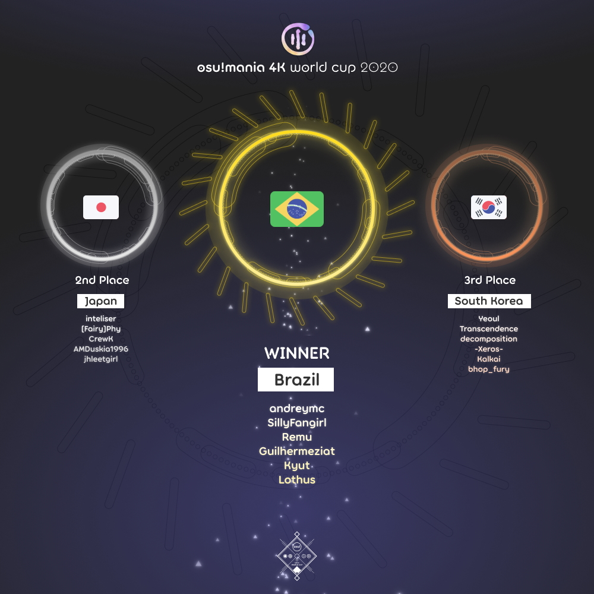

---
tags:
  - MWC 2020
  - MWC 4K 2020
  - MWC2020
  - MWC4K 2020
---

# osu!mania 2020 4K 世界杯

**osu!mania 2020 4K 世界杯**（***MWC 4K 2020***）是由 [osu! team](/wiki/People/osu!_team) 举办的基于国家/地区间的官方锦标赛。这是 osu!mania 4K 世界杯的第 7 届。

*注意：除非特殊说明，本文所提到的时区均以* **UTC（协调世界时）** *为准。*

*注意：除非特殊说明，本文所提到的货币单位均以* **USD（美元）** *为准。*

## 赛程

| 阶段 | 时间 |
| --: | :-- |
| 报名阶段 | 2020-07-16/2020-07-30 |
| 抽签 | 2020-08-08 (22:00 UTC+08) |
| 小组赛 | 2020-08-15/2020-08-16 |
| 十六强赛 | 2020-08-22/2020-08-23 |
| 四分之一决赛 | 2020-08-29/2020-08-30 |
| 半决赛 | 2020-09-05/2020-09-06 |
| 决赛 | 2020-09-12/2020-09-13 |
| 总决赛 | 2020-09-19/2020-09-20 |

## 奖品

| 名次 | 奖品 |
| :-: | :-- |
|  | 每人 $150，个人资料徽章，为期一年的 “osu!mania Champion” 头衔 |
|  | 每人 $80，个人资料徽章 |
|  | 每人 $40，个人资料徽章 |

  

## 工作人员

osu!mania 2020 4K 世界杯由 [osu! team](/wiki/People/osu!_team) 和多位社区成员举办。

| 职位 | 成员 |
| :-- | :-- |
| 比赛管理 | ::{ flag=CL }:: [WalterToro](https://osu.ppy.sh/users/5281416) |
| 图池管理 | ::{ flag=US }:: [-mint-](https://osu.ppy.sh/users/8976576), ::{ flag=ID }:: [Mipha-](https://osu.ppy.sh/users/5767941), ::{ flag=SG }:: [Shoegazer](https://osu.ppy.sh/users/2520707), ::{ flag=CL }:: [WalterToro](https://osu.ppy.sh/users/5281416) |
| 解说 | ::{ flag=SE }:: [Davvy](https://osu.ppy.sh/users/10047413), ::{ flag=BR }:: [Guilhermeziat](https://osu.ppy.sh/users/3661387), ::{ flag=AR }:: [juankristal](https://osu.ppy.sh/users/443656), ::{ flag=PL }:: [Kamikaze](https://osu.ppy.sh/users/2124783), ::{ flag=ID }:: [Mipha-](https://osu.ppy.sh/users/5767941), ::{ flag=FR }:: [Paturages](https://osu.ppy.sh/users/1375479), ::{ flag=AU }:: [PotassiumF](https://osu.ppy.sh/users/4247722), ::{ flag=SG }:: [Shoegazer](https://osu.ppy.sh/users/2520707), ::{ flag=US }:: [stupud man](https://osu.ppy.sh/users/2141612), ::{ flag=US }:: [Toaph Daddy](https://osu.ppy.sh/users/7616811), ::{ flag=CL }:: [WalterToro](https://osu.ppy.sh/users/5281416) |
| 裁判 | ::{ flag=PL }:: [Benzopirene](https://osu.ppy.sh/users/1887068), ::{ flag=ES }:: [Deif](https://osu.ppy.sh/users/318565), ::{ flag=AU }:: [ill onion](https://osu.ppy.sh/users/8306102) ::{ flag=DE }:: [p3n](https://osu.ppy.sh/users/123703), ::{ flag=US }:: [tigereyes144](https://osu.ppy.sh/users/6499811), ::{ flag=CL }:: [WalterToro](https://osu.ppy.sh/users/5281416), ::{ flag=GB }:: [Yazzehh](https://osu.ppy.sh/users/7068973) |
| 统计员 | ::{ flag=DE }:: [Nwolf](https://osu.ppy.sh/users/1910766) |

## 相关链接

- [论坛讨论帖](https://osu.ppy.sh/community/forums/topics/1106843)
- [Twitch 直播间](https://www.twitch.tv/osulive)
- 由 ::{ flag=DE }:: [hallowatcher](https://osu.ppy.sh/users/1874761) 发起的 [竞猜](https://pickem.hwc.hr/tournaments/41)
- [Challonge](https://challonge.com/MWC4K2020) 赛程表
- Google Sheets **[统计表](https://docs.google.com/spreadsheets/d/e/2PACX-1vSWEX_lsC7Kre0jDtZgHzTvTbmCztws2lm0egFDe4oPNt4LeaJwWCLfdwAgkKpWORp4UplgtPwxxBIS/pubhtml)**

## 参赛选手

|  | 国家/地区 | 选手 |
| :-: | :-: | :-- |
| ::{ flag=AR }:: | **阿根廷** | **[juankristal](https://osu.ppy.sh/users/443656)**, [BossPlays](https://osu.ppy.sh/users/7341471), [aluuu](https://osu.ppy.sh/users/4585260), [Fisk-](https://osu.ppy.sh/users/5748843), [C90](https://osu.ppy.sh/users/13858488), [lxLucasxl](https://osu.ppy.sh/users/3632846) |
| ::{ flag=AU }:: | **澳大利亚** | **[\[Crz\]Lochie](https://osu.ppy.sh/users/9527845)**, [ruka](https://osu.ppy.sh/users/6117525), [Water is good](https://osu.ppy.sh/users/8222416), [Vegemite](https://osu.ppy.sh/users/13111686), [HD\_AdreNaline](https://osu.ppy.sh/users/10540368), [WMountain](https://osu.ppy.sh/users/11149878) |
| ::{ flag=BE }:: | **比利时** | **[Mortelspawn\_](https://osu.ppy.sh/users/5331420)**, [spamblock](https://osu.ppy.sh/users/11968058), [nocilOLyus](https://osu.ppy.sh/users/12604747), [yetii](https://osu.ppy.sh/users/6914714), [Joppe27](https://osu.ppy.sh/users/11753018), [shaafs](https://osu.ppy.sh/users/8811695) |
| ::{ flag=BR }:: | **巴西** | **[andreymc](https://osu.ppy.sh/users/5691061)**, [SillyFangirl](https://osu.ppy.sh/users/2288363), [Remu](https://osu.ppy.sh/users/8700468), [Guilhermeziat](https://osu.ppy.sh/users/3661387), [Kyut](https://osu.ppy.sh/users/9328824), [Lothus](https://osu.ppy.sh/users/9530019) |
| ::{ flag=CA }:: | **加拿大** | **[Piggy](https://osu.ppy.sh/users/5390121)**, [arpia97](https://osu.ppy.sh/users/6363008), [beary605](https://osu.ppy.sh/users/2198070), [loafusofbread](https://osu.ppy.sh/users/9278959), [Stability](https://osu.ppy.sh/users/6701738), [pipicat](https://osu.ppy.sh/users/9371091) |
| ::{ flag=CN }:: | **中国** | **[\[Crz\]xz1z1z](https://osu.ppy.sh/users/10500832)**, [\[Crz\]HDRoop\_7](https://osu.ppy.sh/users/6336721), [Crystal](https://osu.ppy.sh/users/1646397), [yuwenhao1](https://osu.ppy.sh/users/14318312), [SiWeike](https://osu.ppy.sh/users/11625307) |
| ::{ flag=FI }:: | **芬兰** | **[LovelyN](https://osu.ppy.sh/users/8370443)**, [Fireable](https://osu.ppy.sh/users/12624280), [Crazzeh](https://osu.ppy.sh/users/5054154), [Strachy](https://osu.ppy.sh/users/9663200), [Rozq](https://osu.ppy.sh/users/8506144), [play etterna](https://osu.ppy.sh/users/4765794) |
| ::{ flag=FR }:: | **法国** | **[Cunu](https://osu.ppy.sh/users/7190228)**, [PatouZ](https://osu.ppy.sh/users/7306522), [pimoux](https://osu.ppy.sh/users/6183047), [Azubeur](https://osu.ppy.sh/users/1594604), [Auraah](https://osu.ppy.sh/users/10015908), [KH\_Supernova](https://osu.ppy.sh/users/4983538) |
| ::{ flag=DE }:: | **德国** | **[LastExceed](https://osu.ppy.sh/users/6232245)**, [Niko\_Plays](https://osu.ppy.sh/users/9409456), [Malox](https://osu.ppy.sh/users/4516252), [Cyaewin](https://osu.ppy.sh/users/10027302) |
| ::{ flag=HK }:: | **香港** | **[\[Crz\]Murasame](https://osu.ppy.sh/users/11563203)**, [MegMewtwoZ](https://osu.ppy.sh/users/13235067), [-SoraIro-](https://osu.ppy.sh/users/11493286), [zero2snow](https://osu.ppy.sh/users/7751516), [67hi](https://osu.ppy.sh/users/16087555), [Yana Feiya](https://osu.ppy.sh/users/7802517) |
| ::{ flag=ID }:: | **印度尼西亚** | **[LuxMaiden](https://osu.ppy.sh/users/6991664)**, [RetroEX](https://osu.ppy.sh/users/10540515), [reyss](https://osu.ppy.sh/users/4557440), [Snowdrop](https://osu.ppy.sh/users/1031263), [HerosonRhymes](https://osu.ppy.sh/users/12640004), [DoNotMess](https://osu.ppy.sh/users/1596318) |
| ::{ flag=IT }:: | **意大利** | **[Nixo](https://osu.ppy.sh/users/6380163)**, [motorola1970](https://osu.ppy.sh/users/5144818), [Jeersy](https://osu.ppy.sh/users/11636434), [Saibel](https://osu.ppy.sh/users/2727928), [\[Crz\]Cribob](https://osu.ppy.sh/users/8485394), [Mura7797](https://osu.ppy.sh/users/3244389) |
| ::{ flag=JP }:: | **日本** | **[inteliser](https://osu.ppy.sh/users/1824775)**, [\[Fairy\]Phy](https://osu.ppy.sh/users/4777360), [CrewK](https://osu.ppy.sh/users/11488604), [AMDuskia1996](https://osu.ppy.sh/users/10242062), [jhleetgirl](https://osu.ppy.sh/users/10745260) |
| ::{ flag=MO }:: | **澳门** | **[idqoos123](https://osu.ppy.sh/users/3946113)**, [macaoleaf](https://osu.ppy.sh/users/7082716), [deceleration](https://osu.ppy.sh/users/2342941), [liyus](https://osu.ppy.sh/users/8318125), [Michaelonl](https://osu.ppy.sh/users/12480076), [my2tic](https://osu.ppy.sh/users/5315736) |
| ::{ flag=MY }:: | **马来西亚** | **[cheewee10](https://osu.ppy.sh/users/4477497)**, [xxxxxx2800](https://osu.ppy.sh/users/4084853), [RushiaFanGirl](https://osu.ppy.sh/users/11918602), [Rxxgamer1010](https://osu.ppy.sh/users/12290050), [watarakisah](https://osu.ppy.sh/users/6237337), [Cryolien](https://osu.ppy.sh/users/1626983) |
| ::{ flag=MX }:: | **墨西哥** | **[\[Crz\]Noire](https://osu.ppy.sh/users/6031847)**, [Ghoul-](https://osu.ppy.sh/users/8859756), [-Hellscythe-](https://osu.ppy.sh/users/7837147), [YukariYakumo](https://osu.ppy.sh/users/10595982), [Plutes](https://osu.ppy.sh/users/11188249), [\[OSC\]Amagai](https://osu.ppy.sh/users/9658070) |
| ::{ flag=NL }:: | **荷兰** | **[2fast4you98](https://osu.ppy.sh/users/5183940)**, [NightNarumi](https://osu.ppy.sh/users/4381142), [Tyronix](https://osu.ppy.sh/users/11290311), [Bakuretsue](https://osu.ppy.sh/users/10960533), [samuelhklumpers](https://osu.ppy.sh/users/10945523), [Ready Perfectly](https://osu.ppy.sh/users/10944966) |
| ::{ flag=NO }:: | **挪威** | **[Bizarrely\_F4st](https://osu.ppy.sh/users/7676585)**, [Freddy](https://osu.ppy.sh/users/5235218), [Frooonz](https://osu.ppy.sh/users/12959471), [MartZOZ](https://osu.ppy.sh/users/9219513), [CommandoGlass](https://osu.ppy.sh/users/4988688), [KarlF](https://osu.ppy.sh/users/3494742) |
| ::{ flag=PE }:: | **秘鲁** | **[akuma123](https://osu.ppy.sh/users/914472)**, [DaZeRo5](https://osu.ppy.sh/users/6114633), [Kips](https://osu.ppy.sh/users/11930795), [no6hope](https://osu.ppy.sh/users/12193700), [Kien io](https://osu.ppy.sh/users/10055648) |
| ::{ flag=PH }:: | **菲律宾** | **[bojii](https://osu.ppy.sh/users/10083439)**, [Chuck](https://osu.ppy.sh/users/11517895), [Swarmsii](https://osu.ppy.sh/users/11716111), [Arccat](https://osu.ppy.sh/users/4848294), [Vulpsii](https://osu.ppy.sh/users/12584420), [buenoo](https://osu.ppy.sh/users/11799958) |
| ::{ flag=PL }:: | **波兰** | **[Tidek](https://osu.ppy.sh/users/743282)**, [szuncoll](https://osu.ppy.sh/users/12393014), [SitekX](https://osu.ppy.sh/users/3840946), [paprotkaaaa](https://osu.ppy.sh/users/7233032), [DaDarkDragon](https://osu.ppy.sh/users/8902097), [\_underjoy](https://osu.ppy.sh/users/2235750) |
| ::{ flag=RU }:: | **俄罗斯** | **[X\_Devil](https://osu.ppy.sh/users/6694908)**, [\[Crz\]Arachnon](https://osu.ppy.sh/users/9074986), [FoXCHANNEL](https://osu.ppy.sh/users/8454236), [Mage](https://osu.ppy.sh/users/5527957), [fegasaren0133](https://osu.ppy.sh/users/8035172), [c1e4r](https://osu.ppy.sh/users/8693182) |
| ::{ flag=SG }:: | **新加坡** | **[Claren](https://osu.ppy.sh/users/9362562)**, [riunosk](https://osu.ppy.sh/users/5594381), [Emiratess123](https://osu.ppy.sh/users/13390529), [Blerargh](https://osu.ppy.sh/users/7609510), [AdamAckerville](https://osu.ppy.sh/users/12297375), [ByeForNow](https://osu.ppy.sh/users/7199159) |
| ::{ flag=KR }:: | **韩国** | **[Yeoul](https://osu.ppy.sh/users/4698728)**, [Transcendence](https://osu.ppy.sh/users/903155), [decomposition](https://osu.ppy.sh/users/6824332), [-Xeros-](https://osu.ppy.sh/users/8581031), [Kalkai](https://osu.ppy.sh/users/10790649), [bhop\_fury](https://osu.ppy.sh/users/9920067) |
| ::{ flag=ES }:: | **西班牙** | **[aitor98](https://osu.ppy.sh/users/3154852)**, [Komirin](https://osu.ppy.sh/users/4725379), [Guldakh](https://osu.ppy.sh/users/8553078), [Summit-](https://osu.ppy.sh/users/7860283), [Nikolayio](https://osu.ppy.sh/users/11279465), [Nupi](https://osu.ppy.sh/users/8685250) |
| ::{ flag=SE }:: | **瑞典** | **[Couil](https://osu.ppy.sh/users/6872025)**, [Parinya](https://osu.ppy.sh/users/7746055), [Davvy](https://osu.ppy.sh/users/10047413), [Craty](https://osu.ppy.sh/users/3918056), [diamondBIaze](https://osu.ppy.sh/users/10553827), [Trymatic](https://osu.ppy.sh/users/14762260) |
| ::{ flag=CH }:: | **瑞士** | **[Gamer97](https://osu.ppy.sh/users/4952941)**, [Haprapra](https://osu.ppy.sh/users/3974114), [Adyrem](https://osu.ppy.sh/users/8642966), [DrLou](https://osu.ppy.sh/users/13472706), [CrashSmash](https://osu.ppy.sh/users/13942150), [Tupidix](https://osu.ppy.sh/users/8655604) |
| ::{ flag=TW }:: | **台湾** | **[2zi](https://osu.ppy.sh/users/10137329)**, [noob1033](https://osu.ppy.sh/users/6662838), [\[Crz\]FolAH1217](https://osu.ppy.sh/users/6232458), [\[Rweiru\]](https://osu.ppy.sh/users/11234907), [Changpanda7045](https://osu.ppy.sh/users/10493479), [Ha0201](https://osu.ppy.sh/users/12243730) |
| ::{ flag=TH }:: | **泰国** | **[MyZterioN-](https://osu.ppy.sh/users/8521723)**, [HowToPlayLN](https://osu.ppy.sh/users/10879600), [RuleBlazing](https://osu.ppy.sh/users/7312402), [jimmyreturnz](https://osu.ppy.sh/users/11306153), [\[Crz\]Fumi](https://osu.ppy.sh/users/8288049), [Nyarlahothep](https://osu.ppy.sh/users/2281110) |
| ::{ flag=GB }:: | **英国** | **[Pope Gadget](https://osu.ppy.sh/users/2288341)**, [XxNewson1234xX](https://osu.ppy.sh/users/9895650), [SoFast](https://osu.ppy.sh/users/6504254), [Yonk\_](https://osu.ppy.sh/users/5156656), [Zoobin4](https://osu.ppy.sh/users/10055204), [xSnaggles](https://osu.ppy.sh/users/3799946) |
| ::{ flag=US }:: | **美国** | **[\[Crz\]sel](https://osu.ppy.sh/users/9452257)**, [Unholy](https://osu.ppy.sh/users/7672414), [Gekido-](https://osu.ppy.sh/users/4693052), [stupud man](https://osu.ppy.sh/users/2141612), [Toaph Daddy](https://osu.ppy.sh/users/7616811), [Iylwrychi](https://osu.ppy.sh/users/7794488) |
| ::{ flag=VN }:: | **越南** | **[MashedPotato](https://osu.ppy.sh/users/10494860)**, [TriDoanGaming](https://osu.ppy.sh/users/14009758), [Lottery61](https://osu.ppy.sh/users/13821222), [-Frostleaf-](https://osu.ppy.sh/users/11863174), [\[pom\]](https://osu.ppy.sh/users/11789635), [TvS SorAKuN](https://osu.ppy.sh/users/11115041) |

## 图池

### 决赛/总决赛

**此图池同时适用于决赛和总决赛阶段。**

- FreeMod
  1. [evOke - Edison (Elekton) \[Challenge 1.2\]](https://osu.ppy.sh/beatmapsets/1157050#mania/2414492)
  2. [Apo11o"QUASAR"program - Saihate (Tidek) \[Coma [1,05x Rate]\]](https://osu.ppy.sh/beatmapsets/1178017#mania/2456769)
  3. [PolyphonicBranch feat. un:c & Lon - C158H251N39O46S (beta-endorphin) (Guilhermeziat) \[Skwid's Challenge\]](https://osu.ppy.sh/beatmapsets/768951#mania/2414239)
  4. [Penoreri - Lancelot ~Flame of the Rebellion~ (Gekido-) \[LN Master x1.05\]](https://osu.ppy.sh/beatmapsets/1211967#mania/2522711)
  5. [YZYX - Dysnomia (Chrubble) \[Aphasia 1.1x\]](https://osu.ppy.sh/beatmapsets/867111#mania/2595610)
  6. [Twenty One Pilots - Heathens (Magnetude Bootleg) (Abraxos) \[|-\\\]](https://osu.ppy.sh/beatmapsets/1218708#mania/2535695)
  7. [Venetian Snares - Sinthasomphone (Gekido-) \[Challenge x1.1\]](https://osu.ppy.sh/beatmapsets/872435#mania/2595134)
  8. [Camellia - ANOMALY (Couil) \[deviation\]](https://osu.ppy.sh/beatmapsets/599446#mania/1343180)
  9. [nonoc - Relive (Ticle) \[Snow Thaw\]](https://osu.ppy.sh/beatmapsets/995126#mania/2415389)
  10. [Camellia - Tornado (inteliser) \[demolition\]](https://osu.ppy.sh/beatmapsets/619276#mania/2532744)
  11. [Final Sketch feat. rgLed - Violent Arcade (Toaph Daddy) \[Sudden Death x1.1\]](https://osu.ppy.sh/beatmapsets/1245864#mania/2592116)
  12. [aaaa vs Frums - beepbit * futures (LeiN-) \[cosmonaut\]](https://osu.ppy.sh/beatmapsets/891963#mania/1864667)
  13. [Falcom Sound Team jdk - The Azure Arbitrator (Gekido-) \[Demiourgos (Cut)\]](https://osu.ppy.sh/beatmapsets/951869#mania/2503264)
  14. [Sasara Yuuna - dnabgib kaerB (Mipha-) \[egnellahC\]](https://osu.ppy.sh/beatmapsets/1208832#mania/2516945)
  15. [Nanahoshi Kangen Gakudan feat.Matsushita - Dansu Nanbaa wo Tomo ni (juankristal) \[T1M1N6 H311\]](https://osu.ppy.sh/beatmapsets/1252675#mania/2603455)
  16. [The Chemical Brothers ft. Q-Tip - Galvanize (Beat Juggle) (Razzy) \[Unbound (2019)\]](https://osu.ppy.sh/beatmapsets/1047442#mania/2189426)
- Tiebreaker
  1. **[Camellia - Tojita Sekai (-mint-) \[Empyrean\]](https://osu.ppy.sh/beatmapsets/1252746#mania/2603556)**

### 半决赛

- Freemod
  1. [Lon - Yuru Fuwa Jukai Girl (Wh1teh) \[k 1.25x\]](https://osu.ppy.sh/beatmapsets/1206072#mania/2511332)
  2. [Rregula & Dementia x Smooth - Obfuscate (Billain Remix) (Abraxos) \[Disambiguation\]](https://osu.ppy.sh/beatmapsets/1185353#mania/2496420)
  3. [Manabu Namiki - TENSHI (True Final Boss) (Mipha-) \[miphather 1.1x\]](https://osu.ppy.sh/beatmapsets/1187597#mania/2558208)
  4. [aran - L.F.O (Kamikaze) \[The Girl Playing This...\]](https://osu.ppy.sh/beatmapsets/1222594#mania/2542955)
  5. [KAKU P-MODEL - Big Brother (Wh1teh) \[Challenge\]](https://osu.ppy.sh/beatmapsets/500824#mania/1065834)
  6. [Ling tosite sigure - abnormalize (Shoegazer) \[desperation 1.15x\]](https://osu.ppy.sh/beatmapsets/574621#mania/1216961)
  7. [J-CORE SLi//CER - J-CORE SLi//CER Technique (AutotelicBrown) \[Ayumu's Dab\]](https://osu.ppy.sh/beatmapsets/1044242#mania/2182981)
  8. [Kakka - Alfheim (Tidek) \[Freya\]](https://osu.ppy.sh/beatmapsets/941878#mania/1966772)
  9. [Hatsuki Yura - Salamandra no Odoriko (Raveille) \[Sprites\]](https://osu.ppy.sh/beatmapsets/836808#mania/1752295)
  10. [Boys Like Girls - The Great Escape (Shoegazer) \[Departure 1.15x\]](https://osu.ppy.sh/beatmapsets/1186973#mania/2476817)
  11. [Camellia as "Reverse of Riot" - Completeness Under Incompleteness ("true prooF" Long ver.) (Monheim) \[Spectral 1.15\]](https://osu.ppy.sh/beatmapsets/1134132#mania/2562333)
  12. [Tenacious D - Master Exploder (Valedict) \[BLOW YA MIND 1.1x\]](https://osu.ppy.sh/beatmapsets/980802#mania/2052615)
  13. [Camellia - flower of wilderness (-mint-) \[lily (cut 1.05x)\]](https://osu.ppy.sh/beatmapsets/1218077#mania/2534305)
  14. [Le Dos-on - A (Elekton) \[ex 1.15 edit\]](https://osu.ppy.sh/beatmapsets/585451#mania/2534092)
  15. [Frums - dropdead (Chrubble) \[fatality\]](https://osu.ppy.sh/beatmapsets/957823#mania/2186287)
  16. [Moe Shop - Audiovisual (Paturages) \[720p\]](https://osu.ppy.sh/beatmapsets/1182067#mania/2495032)
- Tiebreaker
  1. **[Camellia - Nacreous Snowmelt (-mint-) \[Pearlescence Edit\]](https://osu.ppy.sh/beatmapsets/1089407#mania/2588388)**

### 四分之一决赛

- FreeMod
  1. [Divine Heresy - Facebreaker (Shoegazer) \[Damnation\]](https://osu.ppy.sh/beatmapsets/1197643#mania/2494696)
  2. [Camellia - Maboroshi (-mint-) \[Mirage\]](https://osu.ppy.sh/beatmapsets/1210416#mania/2541097)
  3. [QUIL - Gympie Gympe (Valedict) \[1.15\]](https://osu.ppy.sh/beatmapsets/1233325#mania/2563988)
  4. [rissyuu feat. choko - Bi (Raveille) \[Bong Botes\]](https://osu.ppy.sh/beatmapsets/1012105#mania/2118448)
  5. [The Ghost of 3.13 - Forgotten (Shoegazer) \[Extra (263bpm)\]](https://osu.ppy.sh/beatmapsets/338665#mania/2436251)
  6. [Grimes - Kill V. Maim (BringoBrango) \[cut\]](https://osu.ppy.sh/beatmapsets/1181796#mania/2542323)
  7. [ZigZag - VerTex (\_underjoy) \[Oni\]](https://osu.ppy.sh/beatmapsets/1069924#mania/2424979)
  8. [Venetian Snares - Frictional Nevada (Gekido-) \[Challenge\]](https://osu.ppy.sh/beatmapsets/1047387#mania/2189312)
  9. [Igorrr & Ruby My Dear - Alain (Gekido-) \[Challenge\]](https://osu.ppy.sh/beatmapsets/999132#mania/2089593)
  10. [Triple-Q - Infinite Mashups (Valedict) \[Miscellaneous Mashing\]](https://osu.ppy.sh/beatmapsets/861402#mania/1802098)
  11. [Pyramyth - Dolphin Talk (TheToaphster) \[Echoes\]](https://osu.ppy.sh/beatmapsets/718149#mania/1516908)
  12. [Helblinde - C204 (LeiN-) \[Christina\]](https://osu.ppy.sh/beatmapsets/925325#mania/1933877)
  13. [Tipper - Bubble Control (cut) (lenpai) \[soapy\]](https://osu.ppy.sh/beatmapsets/781115#mania/2417385)
  14. [sakuraburst - anticrystal (Mipha-) \[spooky\]](https://osu.ppy.sh/beatmapsets/1223208#mania/2562631)
- Tiebreaker
  1. **[lapix - SYNERGY ([Crz]Crysarlene) \[miphather x crysather's union\]](https://osu.ppy.sh/beatmapsets/1069265#mania/2421665)**

### 十六强赛

- FreeMod
  1. [Tyrfing - Verflucht (Shoegazer) \[Prophecy (216bpm)\]](https://osu.ppy.sh/beatmapsets/1171433#mania/2494675)
  2. [Tezuka feat. Oonishi Amimi - Bokura no Jikan (KeppSado) \[Lenfried's EXHAUST\]](https://osu.ppy.sh/beatmapsets/985765#mania/2062307)
  3. [Celldweller - Good L\_ck (Yo\_'re F\_cked) (AutotelicBrown) \[Ay\_m\_'s Desolation 1.35x\]](https://osu.ppy.sh/beatmapsets/1199295#mania/2497487)
  4. [Pastel\*Palettes - Yura-Yura Ring-Dong-Dance (Razzy) \[My Confidante\]](https://osu.ppy.sh/beatmapsets/870166#mania/1818485)
  5. [callasoiled - 4172756869 (isagen remix) (Elekton) \[dagbgefhfi\]](https://osu.ppy.sh/beatmapsets/881552#mania/1843149)
  6. [Lapix - Silvia (Azubeur) \[Another\]](https://osu.ppy.sh/beatmapsets/805336#mania/1690565)
  7. [nora2r - B.B.K.K.B.K.K. (RemiFlan) \[KICK KICK KICK KICK KICK KICK\]](https://osu.ppy.sh/beatmapsets/530022#mania/1123676)
  8. [Shiro Sagisu - Quatre Mains (a quatre mains) =3EM16= (Fullerene-) \[OD8\]](https://osu.ppy.sh/beatmapsets/1217631#mania/2533429)
  9. [YUC'e - Future Cider (snexe) \[Stage 4: Saccharine\]](https://osu.ppy.sh/beatmapsets/720291#mania/1520784)
  10. [X Kirby - Epic Manner (Guilhermeziat) \[Epic Streamz lol xd\]](https://osu.ppy.sh/beatmapsets/970737#mania/2032750)
  11. [Lil Peep & XXXTENTACION - Falling Down (Kamuy) \[downpour\]](https://osu.ppy.sh/beatmapsets/1132929#mania/2366298)
  12. [U-F SEQUENCER - -273.15 FREEZING MAELSTROM -Rei- (Elekton) \[cryo\]](https://osu.ppy.sh/beatmapsets/745749#mania/1572067)
  13. [Culprate - Yin (Toaph Daddy) \[Challenge (LN-edit)\]](https://osu.ppy.sh/beatmapsets/1057101#mania/2475793)
  14. [Frums - Wavetapper (-mint-) \[PASTFEELING\]](https://osu.ppy.sh/beatmapsets/866661#mania/2208846)
- Tiebreaker
  1. **[Camellia - farewell to today (-mint-) \[adieu\]](https://osu.ppy.sh/beatmapsets/1114788#mania/2328702)**

### 小组赛

- FreeMod
  1. [Cardboard Box - Nest (Guilhermeziat) \[Yolk 1.1\]](https://osu.ppy.sh/beatmapsets/576883#mania/2433644)
  2. [PSYQUI - Stepper (Scotty) \[impression\]](https://osu.ppy.sh/beatmapsets/1065389#mania/2230933)
  3. [40mP - Junjou Skirt (Monheim) \[Pure-Hearted\]](https://osu.ppy.sh/beatmapsets/1155440#mania/2411258)
  4. [DJ'TEKINA//SOMETHING - Internet bitch P*Light Remix (juankristal) \[Stage 3: E-girl\]](https://osu.ppy.sh/beatmapsets/1076027#mania/2251585)
  5. [sasakure.UK - Xlo (Valedict) \[Another\]](https://osu.ppy.sh/beatmapsets/1170658#mania/2442125)
  6. [Porter Robinson - Flicker (Hydria) \[SV Heaven\]](https://osu.ppy.sh/beatmapsets/490560#mania/1045578)
  7. [Fractal Dreamers - Celestial Horizon (TheToaphster) \[Haven\]](https://osu.ppy.sh/beatmapsets/761380#mania/1601033)
  8. [An - ExaVid (Cut) (Abraxos) \[the end\]](https://osu.ppy.sh/beatmapsets/1229106#mania/2555585)
  9. [Feint - Tower Of Heaven (You Are Slaves) (noftrahtcehe) \[Hydria's SC\]](https://osu.ppy.sh/beatmapsets/597543#mania/1263201)
  10. [cubesato - My First Phone (Raveille) \[My First Long Note Map\]](https://osu.ppy.sh/beatmapsets/917317#mania/1915742)
  11. [Underoath - Coming Down Is Calming Down (Shoegazer) \[Desperation\]](https://osu.ppy.sh/beatmapsets/882967#mania/1845963)
  12. [Morimori Atsushi - MilK (Guilhermeziat) \[SilV\]](https://osu.ppy.sh/beatmapsets/967318#mania/2024439)
- Tiebreaker
  1. **[Camellia - kannabis kultivation (Kamuy) \[psychoactive\]](https://osu.ppy.sh/beatmapsets/1065342#mania/2473505)**

## 比赛结果

### 总决赛

2020 年 9 月 19 日，星期六：

| A 队 |  |  | B 队 | MP Link |
| --: | :-: | :-: | :-- | :-- |
| **巴西** ::{ flag=BR }:: | **7** | 3 | ::{ flag=KR }:: 韩国 | [#1](https://osu.ppy.sh/community/matches/67157325) |

2020 年 9 月 20 日，星期日：

| A 队 |  |  | B 队 | MP Link |
| --: | :-: | :-: | :-- | :-- |
| 日本 ::{ flag=JP }:: | 2 | **7** | ::{ flag=BR }:: **巴西** | [#1](https://osu.ppy.sh/community/matches/67233864) |
| **巴西** ::{ flag=BR }:: | **7** | 3 | ::{ flag=JP }:: 日本 | [#1](https://osu.ppy.sh/community/matches/67237829) |

### 决赛

2020 年 9 月 12 日，星期六：

| A 队 |  |  | B 队 | MP Link |
| --: | :-: | :-: | :-- | :-- |
| 新加坡 ::{ flag=SG }:: | 2 | **7** | ::{ flag=TH }:: **泰国** | [#1](https://osu.ppy.sh/community/matches/66836420) |
| 美国 ::{ flag=US }:: | 3 | **7** | ::{ flag=KR }:: **韩国** | [#1](https://osu.ppy.sh/community/matches/66866795) |

2020 年 9 月 13 日，星期日：

| A 队 |  |  | B 队 | MP Link |
| --: | :-: | :-: | :-- | :-- |
| 巴西 ::{ flag=BR }:: | 4 | **7** | ::{ flag=JP }:: **日本** | [#1](https://osu.ppy.sh/community/matches/66871542) |
| **韩国** ::{ flag=KR }:: | **7** | 0 | ::{ flag=TH }:: 泰国 | [#1](https://osu.ppy.sh/community/matches/66891129) |

### 半决赛

2020 年 9 月 5 日，星期六：

| A 队 |  |  | B 队 | MP Link |
| --: | :-: | :-: | :-- | :-- |
| 马来西亚 ::{ flag=MY }:: | 4 | **7** | ::{ flag=TH }:: **泰国** | [#1](https://osu.ppy.sh/community/matches/66497561) |
| **菲律宾** ::{ flag=PH }:: | **7** | 0 | ::{ flag=FR }:: 法国 | [#1](https://osu.ppy.sh/community/matches/66499663) |
| **韩国** ::{ flag=KR }:: | **7** | 0 | ::{ flag=HK }:: 香港 | [#1](https://osu.ppy.sh/community/matches/66502083) |
| **英国** ::{ flag=GB }:: | **7** | 0 | ::{ flag=ID }:: 印度尼西亚 | [#1](https://osu.ppy.sh/community/matches/66505878) |

2020 年 9 月 6 日，星期日：

| A 队 |  |  | B 队 | MP Link |
| --: | :-: | :-: | :-- | :-- |
| **日本** ::{ flag=JP }:: | **7** | 2 | ::{ flag=SG }:: 新加坡 | [#1](https://osu.ppy.sh/community/matches/66549094) |
| 菲律宾 ::{ flag=PH }:: | 3 | **7** | ::{ flag=KR }:: **韩国** | [#1](https://osu.ppy.sh/community/matches/66551877) |
| **泰国** ::{ flag=TH }:: | **7** | 5 | ::{ flag=GB }:: 英国 | [#1](https://osu.ppy.sh/community/matches/66556144) |
| **巴西** ::{ flag=BR }:: | **7** | 5 | ::{ flag=US }:: 美国 | [#1](https://osu.ppy.sh/community/matches/66571840) |

### 四分之一决赛

2020 年 8 月 29 日，星期六：

| A 队 |  |  | B 队 | MP Link |
| --: | :-: | :-: | :-- | :-- |
| 荷兰 ::{ flag=NL }:: | 2 | **6** | ::{ flag=TH }:: **泰国** | [#1](https://osu.ppy.sh/community/matches/66165278) |
| **巴西** ::{ flag=BR }:: | **6** | 0 | ::{ flag=GB }:: 英国 | [#1](https://osu.ppy.sh/community/matches/66170936) |
| 阿根廷 ::{ flag=AR }:: | 1 | **6** | ::{ flag=FR }:: **法国** | [#1](https://osu.ppy.sh/community/matches/66178891) |

2020 年 8 月 30 日，星期日：

| A 队 |  |  | B 队 | MP Link |
| --: | :-: | :-: | :-- | :-- |
| 韩国 ::{ flag=KR }:: | 3 | **6** | ::{ flag=JP }:: **日本** | [#1](https://osu.ppy.sh/community/matches/66194895) |
| **香港** ::{ flag=HK }:: | **6** | 5 | ::{ flag=MX }:: 墨西哥 | [#1](https://osu.ppy.sh/community/matches/66197448) |
| **新加坡** ::{ flag=SG }:: | **6** | 2 | ::{ flag=PH }:: 菲律宾 | [#1](https://osu.ppy.sh/community/matches/66216532) |
| 芬兰 ::{ flag=FI }:: | 2 | **6** | ::{ flag=ID }:: **印度尼西亚** | [#1](https://osu.ppy.sh/community/matches/66219326) |
| 马来西亚 ::{ flag=MY }:: | 1 | **6** | ::{ flag=US }:: **美国** | [#1](https://osu.ppy.sh/community/matches/66219416) |

### 十六强赛

2020 年 8 月 22 日，星期六：

| A 队 |  |  | B 队 | MP Link |
| --: | :-: | :-: | :-- | :-- |
| 荷兰 ::{ flag=NL }:: | 1 | **6** | ::{ flag=KR }:: **韩国** | [#1](https://osu.ppy.sh/community/matches/65792667) |
| 芬兰 ::{ flag=FI }:: | 2 | **6** | ::{ flag=SG }:: **新加坡** | [#1](https://osu.ppy.sh/community/matches/65796212) |
| 印度尼西亚 ::{ flag=ID }:: | 3 | **6** | ::{ flag=PH }:: **菲律宾** | [#1](https://osu.ppy.sh/community/matches/65797267) |
| 法国 ::{ flag=FR }:: | 2 | **6** | ::{ flag=GB }:: **英国** | [#1](https://osu.ppy.sh/community/matches/65799749) |
| **美国** ::{ flag=US }:: | **6** | 1 | ::{ flag=MX }:: 墨西哥 | [#1](https://osu.ppy.sh/community/matches/65819858) |

2020 年 8 月 23 日，星期日：

| A 队 |  |  | B 队 | MP Link |
| --: | :-: | :-: | :-- | :-- |
| **巴西** ::{ flag=BR }:: | **6** | 2 | ::{ flag=AR }:: 阿根廷 | [#1](https://osu.ppy.sh/community/matches/65822788) |
| 泰国 ::{ flag=TH }:: | 2 | **6** | ::{ flag=JP }:: **日本** | [#1](https://osu.ppy.sh/community/matches/65839201) |
| **马来西亚** ::{ flag=MY }:: | **6** | 4 | ::{ flag=HK }:: 香港 | [#1](https://osu.ppy.sh/community/matches/65841864) |

### 小组赛

2020 年 8 月 15 日，星期六：

| A 队 |  |  | B 队 | MP Link |
| --: | :-: | :-: | :-- | :-- |
| **加拿大** ::{ flag=CA }:: | **5** | 3 | ::{ flag=CN }:: 中国 | [#1](https://osu.ppy.sh/community/matches/65446801) |
| **印度尼西亚** ::{ flag=ID }:: | **5** | 1 | ::{ flag=VN }:: 越南 | [#1](https://osu.ppy.sh/community/matches/65455209) |
| **西班牙** ::{ flag=ES }:: | **5** | 0 | ::{ flag=MO }:: 澳门 | [#1](https://osu.ppy.sh/community/matches/65457201) |
| **新加坡** ::{ flag=SG }:: | **5** | 0 | ::{ flag=SE }:: 瑞典 | [#1](https://osu.ppy.sh/community/matches/65459174) |
| **马来西亚** ::{ flag=MY }:: | **5** | 0 | ::{ flag=MO }:: 澳门 | [#1](https://osu.ppy.sh/community/matches/65459186) |
| **菲律宾** ::{ flag=PH }:: | **5** | 0 | ::{ flag=TW }:: 台湾 | [#1](https://osu.ppy.sh/community/matches/65458951) |
| **泰国** ::{ flag=TH }:: | **5** | 1 | ::{ flag=ES }:: 西班牙 | [#1](https://osu.ppy.sh/community/matches/65458957) |
| **日本** ::{ flag=JP }:: | **5** | 0 | ::{ flag=HK }:: 香港 | [#1](https://osu.ppy.sh/community/matches/65460351) |
| **菲律宾** ::{ flag=PH }:: | **5** | 0 | ::{ flag=CH }:: 瑞士 | [#1](https://osu.ppy.sh/community/matches/65460230) |
| **巴西** ::{ flag=BR }:: | **5** | 0 | ::{ flag=VN }:: 越南 | *-不战而胜-* |
| **新加坡** ::{ flag=SG }:: | **5** | 0 | ::{ flag=NO }:: 挪威 | [#1](https://osu.ppy.sh/community/matches/65462118) |
| **日本** ::{ flag=JP }:: | **5** | 0 | ::{ flag=CN }:: 中国 | [#1](https://osu.ppy.sh/community/matches/65462238) |
| **阿根廷** ::{ flag=AR }:: | **5** | 1 | ::{ flag=TW }:: 台湾 | [#1](https://osu.ppy.sh/community/matches/65464063) |
| 俄罗斯 ::{ flag=RU }:: | 0 | **5** | ::{ flag=VN }:: **越南** | [#1](https://osu.ppy.sh/community/matches/65464072) |
| **荷兰** ::{ flag=NL }:: | **5** | 0 | ::{ flag=DE }:: 德国 | [#1](https://osu.ppy.sh/community/matches/65466344) |
| 波兰 ::{ flag=PL }:: | 1 | **5** | ::{ flag=FI }:: **芬兰** | [#1](https://osu.ppy.sh/community/matches/65468552) |
| **英国** ::{ flag=GB }:: | **5** | 0 | ::{ flag=SE }:: 瑞典 | [#1](https://osu.ppy.sh/community/matches/65468619) |
| **美国** ::{ flag=US }:: | **5** | 0 | ::{ flag=NL }:: 荷兰 | [#1](https://osu.ppy.sh/community/matches/65470820) |
| **波兰** ::{ flag=PL }:: | **5** | 1 | ::{ flag=BE }:: 比利时 | [#1](https://osu.ppy.sh/community/matches/65470801) |
| **英国** ::{ flag=GB }:: | **5** | 0 | ::{ flag=NO }:: 挪威 | [#1](https://osu.ppy.sh/community/matches/65470823) |
| **法国** ::{ flag=FR }:: | **5** | 2 | ::{ flag=FI }:: 芬兰 | [#1](https://osu.ppy.sh/community/matches/65472676) |
| **阿根廷** ::{ flag=AR }:: | **5** | 0 | ::{ flag=CH }:: 瑞士 | [#1](https://osu.ppy.sh/community/matches/65472690) |
| 法国 ::{ flag=FR }:: | 3 | **5** | ::{ flag=PL }:: **波兰** | [#1](https://osu.ppy.sh/community/matches/65475232) |
| **墨西哥** ::{ flag=MX }:: | **5** | 1 | ::{ flag=PE }:: 秘鲁 | [#1](https://osu.ppy.sh/community/matches/65479935) |

2020 年 8 月 16 日，星期日：

| A 队 |  |  | B 队 | MP Link |
| --: | :-: | :-: | :-- | :-- |
| **日本** ::{ flag=JP }:: | **5** | 0 | ::{ flag=CA }:: 加拿大 | [#1](https://osu.ppy.sh/community/matches/65489166) |
| **韩国** ::{ flag=KR }:: | **5** | 0 | ::{ flag=PE }:: 秘鲁 | [#1](https://osu.ppy.sh/community/matches/65489098) |
| 澳大利亚 ::{ flag=AU }:: | 1 | **5** | ::{ flag=MX }:: **墨西哥** | [#1](https://osu.ppy.sh/community/matches/65489110) |
| 加拿大 ::{ flag=CA }:: | 2 | **5** | ::{ flag=HK }:: **香港** | [#1](https://osu.ppy.sh/community/matches/65490734) |
| **韩国** ::{ flag=KR }:: | **5** | 3 | ::{ flag=MX }:: 墨西哥 | [#1](https://osu.ppy.sh/community/matches/65490726) |
| **澳大利亚** ::{ flag=AU }:: | **5** | 4 | ::{ flag=PE }:: 秘鲁 | [#1](https://osu.ppy.sh/community/matches/65490733) |
| 英国 ::{ flag=GB }:: | 4 | **5** | ::{ flag=SG }:: **新加坡** | [#1](https://osu.ppy.sh/community/matches/65502548) |
| **韩国** ::{ flag=KR }:: | **5** | 0 | ::{ flag=AU }:: 澳大利亚 | [#1](https://osu.ppy.sh/community/matches/65502653) |
| **马来西亚** ::{ flag=MY }:: | **5** | 0 | ::{ flag=ES }:: 西班牙 | [#1](https://osu.ppy.sh/community/matches/65502662) |
| **香港** ::{ flag=HK }:: | **5** | 4 | ::{ flag=CN }:: 中国 | [#1](https://osu.ppy.sh/community/matches/65504314) |
| **台湾** ::{ flag=TW }:: | **5** | 3 | ::{ flag=CH }:: 瑞士 | [#1](https://osu.ppy.sh/community/matches/65504306) |
| **巴西** ::{ flag=BR }:: | **5** | 0 | ::{ flag=ID }:: 印度尼西亚 | [#1](https://osu.ppy.sh/community/matches/65505908) |
| **泰国** ::{ flag=TH }:: | **5** | 0 | ::{ flag=MO }:: 澳门 | [#1](https://osu.ppy.sh/community/matches/65505941) |
| **菲律宾** ::{ flag=PH }:: | **5** | 0 | ::{ flag=AR }:: 阿根廷 | [#1](https://osu.ppy.sh/community/matches/65507968) |
| 泰国 ::{ flag=TH }:: | 3 | **5** | ::{ flag=MY }:: **马来西亚** | [#1](https://osu.ppy.sh/community/matches/65507961) |
| **俄罗斯** ::{ flag=RU }:: | **5** | 2 | ::{ flag=ID }:: 印度尼西亚 | [#1](https://osu.ppy.sh/community/matches/65507978) |
| **意大利** ::{ flag=IT }:: | **5** | 0 | ::{ flag=DE }:: 德国 | *-不战而胜-* |
| **瑞典** ::{ flag=SE }:: | **5** | 1 | ::{ flag=NO }:: 挪威 | [#1](https://osu.ppy.sh/community/matches/65512105) |
| **法国** ::{ flag=FR }:: | **5** | 1 | ::{ flag=BE }:: 比利时 | [#1](https://osu.ppy.sh/community/matches/65512115) |
| **巴西** ::{ flag=BR }:: | **5** | 1 | ::{ flag=RU }:: 俄罗斯 | [#1](https://osu.ppy.sh/community/matches/65514094) |
| **美国** ::{ flag=US }:: | **5** | 0 | ::{ flag=IT }:: 意大利 | [#1](https://osu.ppy.sh/community/matches/65514228) |
| **芬兰** ::{ flag=FI }:: | **5** | 1 | ::{ flag=BE }:: 比利时 | [#1](https://osu.ppy.sh/community/matches/65514206) |
| 意大利 ::{ flag=IT }:: | 4 | **5** | ::{ flag=NL }:: **荷兰** | [#1](https://osu.ppy.sh/community/matches/65516471) |
| **美国** ::{ flag=US }:: | **5** | 0 | ::{ flag=DE }:: 德国 | [#1](https://osu.ppy.sh/community/matches/65516482) |

## 规则

### 锦标赛规则

1. osu!mania 4K 世界杯是基于国家/地区的团体比赛，在 osu!mania 模式中进行。
   - **虽然本次比赛计划为 3v3，但可能会根据报名人数而改变。**
2. 分数计算基于 Score V2。
3. 每轮比赛的图池将由图池管理在实际比赛开始之前的周日公布。选手比赛过程中只能选择其中的谱面。
   - 小组赛图池会在抽签结束后公布。
   - 一张谱面会被选为 Tiebreaker(TB)，TB 仅能在加时赛中被强制选择。
4. 时间表将由比赛管理部门确定（见下文）。
5. 如果没有空闲的工作人员或裁判，比赛将被推迟。
6. 选手 Failed 的分数不会算入队伍总分中。
   - 如果 Failed 后恢复为存活状态则算为 Pass。
7. 允许使用视觉设置来调整背景暗化或禁用谱面背景。
8. 如果一个谱面平局，则分数作废。
9. 如果选手断线，则视为 Failed。
   - 谱面开始 30 秒内的断线可申请重赛，这由裁判决定。谱面也可能会因此强制结束。
   - **如果重赛，两个队伍的上场选手不能进行改变。不会因为重赛而允许队伍改变上场选手。**
10. 除非分数作废，否则不能在同一场比赛中多次选择一张谱面。
11. **每支队伍的规模限制为 3-6 名选手。**
    - 这可能会根据报名人数而改变。
12. 如果一方的成员未能到场，无法满足比赛开始的最低人数要求，比赛最多延迟 10 分钟，否则另一方直接获胜（Win by default）。
13. 比赛期间可以无限制地替换上场选手。
14. 网络延迟问题不是重赛的有效理由。
15. 所有的选手都应该保持比赛流畅。如果来自选手一方的比赛延误过多，队伍可能会受到处罚。
16. 如果选手在打图过程中断线且团队无法进行替换，则比赛最多可延迟 10 分钟。
17. 必须尊重所有选手和裁判，遵循裁判和比赛管理员的指示，服从最终决定。
18. 严禁通过犯规动作破坏比赛，选择不适当的热身图（见下文），侮辱和挑衅其他成员或裁判，故意延误比赛或其他不当行为。
19. 多人聊天室基于 [osu! 社区守则](/wiki/Rules)，同时也适用所有聊天守则。
    - 违反聊天守则会被禁言。被禁言的玩家不能进入多人游戏房间，必须暂时进行交换。
20. 在小组赛中，“Win by default” 视为 5:0，得 1 分。
21. 意外事件由比赛管理人员处理。特定情况下，裁判可以根据自己的判断放宽限制。
22. 违反比赛规则的处罚包括但不限于：
    - 取消当前谱面的上场资格。
    - 取消本场比赛的上场资格。
    - 判负（Lost by Default）。
    - 取消整个比赛的参赛资格。
    - 处以禁赛直到选手提出上诉。
    - 对以上规则进行任何修改。

### 比赛报名

1. 每个有兴趣加入其国家/地区队伍的玩家都需要单独报名。
   - 比赛管理团队将为一个国家/地区的队伍创建一个候选名单。
   - 比赛管理团队将宣布该队的一名队长候选，即使只是暂时的。
   - 队长可以从他们国家/地区的候选名单中选择并组成他们的队伍。
2. 为确报名的真实性，比赛管理团队将检查每位报名玩家。
   - 每个报名玩家将被分配到其各自国家/地区的候选列表。
   - 报名玩家的 osu!mania 4K 的全球排名必须在 5000 以内。
   - 报名玩家在过去的 12 个月内没有违反 [osu! 社区守则](/wiki/Rules)。
3. 所有组建成功的队伍将在报名阶段结束后公布。
4. 只有 32 个潜在实力最强大的国家/地区可以参加。一个国家/地区的潜在实力取决于所有有效候选人的在线统计数据。
5. 图池管理成员不能以选手身份参加比赛。

### 阶段说明

1. 在第一阶段（小组赛），队伍将分为8组，每组4个队伍。
   - 这可能会根据报名队伍而改变。
2. 小组的每个队伍都会在比赛中相遇。
3. 通过以下优先级对组内的每个队伍进行排名：
   - 最多总胜场数。
   - 最高胜负比 `{(谱面胜场数) - (谱面败场数)}`。
   - 最高谱面胜场数。
   - **如果并列，取其在相遇比赛中的获胜者。**
   - 如果三个队伍同时并列
     - 最高 `∑{(总分差) / (最高分数)}`。
     - 重赛的获胜者。
4. 每个小组的前两名将进入淘汰赛阶段。
   - 这可能会随着实际的小组赛设置而改变。
5. 接下来的阶段是双败赛制。这意味着获胜者将进入胜者组，否则进入败者组。
6. 基于[这个图片](/wiki/shared/stages-visual.png)，比赛分为以下几个阶段：

| 阶段 | 比赛 ID |
| --: | :-- |
| 十六强赛 | A, B, C, D, E, F, G, H |
| 四分之一决赛 | I, J, K, L & R, S, T, U |
| 半决赛 | M, N & V, W, X, Y, Z, AA |
| 决赛 | O & AB, AC, AD |
| 总决赛 | AE, P, Q |

#### 获胜条件

- 在小组赛中，9 局 5 胜（BO5）。
- 在十六强赛和四分之一决赛中，11 局 6 胜（BO11）。
- 在半决赛，决赛和总决赛中，13 局 7 胜（BO13）。

### 比赛说明

1. 裁判将提前 15 分钟建立多人游戏房间。选手必须在这段时间内聚集。
   - 多人游戏房间设置为 osu!mania，Team-Vs，获胜条件：ScoreV2。 房间名称必须为 “MWC4K2020: (TeamRed) vs (TeamBlue)”。
   - 房间名称中提到的第一个队伍必须是红队，第二个队伍必须是蓝队。
2. 每个队伍可以在热身期间选择一张谱面。禁止选择带有可疑内容的谱面。所有谱面必须是 osu!mania 4K 模式谱面。
3. 每队队长可以选择 Ban **一张图**。
4. 谱面选择权将在两位队长之间交替。
5. 两位队长必须在 `#multiplayer` 中使用 `!roll`。
   - `!roll` 胜的队伍先 Pick。
   - `!roll` 输的队伍先 Ban。
6. 队伍将有 2 分钟的时间选择谱面，以及 2 分钟的准备时间。
   - 如果队伍花费超过 2 分钟的时间来选择谱面，他们将收到裁判的警告，随后，裁判将使用 `!roll X` 从图池中随机选择一张谱面，其中 X 是被随机的可选谱面数量。
   - 每支队伍在**每次比赛**时将有一次**两分钟的**“战术暂停”可以在选图时使用。*战术暂停是可选的，不强迫使用*。
7. 小组赛的结果将通过 Google Sheets 统计表发布。

### 图池说明

1. 小组赛，十六强赛，四分之一决赛，半决赛以及决赛都会使用他们各自的图池。
   - 其中总决赛和决赛使用相同图池。
2. 图池在每个比赛阶段均包含固定数量的谱面（请参见下文），所有谱面都为 FreeMod。
3. 小组赛图池为 12 张，十六强赛和四分之一决赛图池为 14 张，半决赛和决赛图池为 16 张。
4. 每个图池都包含一张 TB。
5. 可选 Mod 为 Hidden，FadeIn，Flashlight 和 Mirror。
6. TB 为 Freemod。

### 排程说明

1. 每个比赛阶段都会在一个**单独的周末**进行。
2. 小组赛可能会同时进行多场比赛。
3. 所有双败淘汰赛阶段都将在 UTC+0 的星期六或星期日开始。
4. 排程将由比赛管理团队处理。最终排程将在实际比赛的第一场比赛之前的周日发布。比赛管理团队会尝试照顾所有参赛选手的时区进行排程。
   - 在四分之一决赛阶段或更高阶段：如果你的队伍预计下周无法根据排程所定的时间参赛，请在周日之前通知比赛管理团队。
5. **只有在两支队伍都同意的情况下，才考虑重新排程，你需要在比赛进行的那一周的星期三 23:59 UTC+0 之前安排可用时间并通知比赛管理团队。**
6. **只有队长才能申请重新排程。**
   - **除非绝对必要，否则不要申请重新排程。比赛管理团队仍有权拒绝该请求。**
7. 队长有权负责队伍的可用性，以确保每个队伍可以在每场比赛上场至少四名队员。如果队伍无法提供四名队员参加比赛，则该比赛将被视为弃权。
