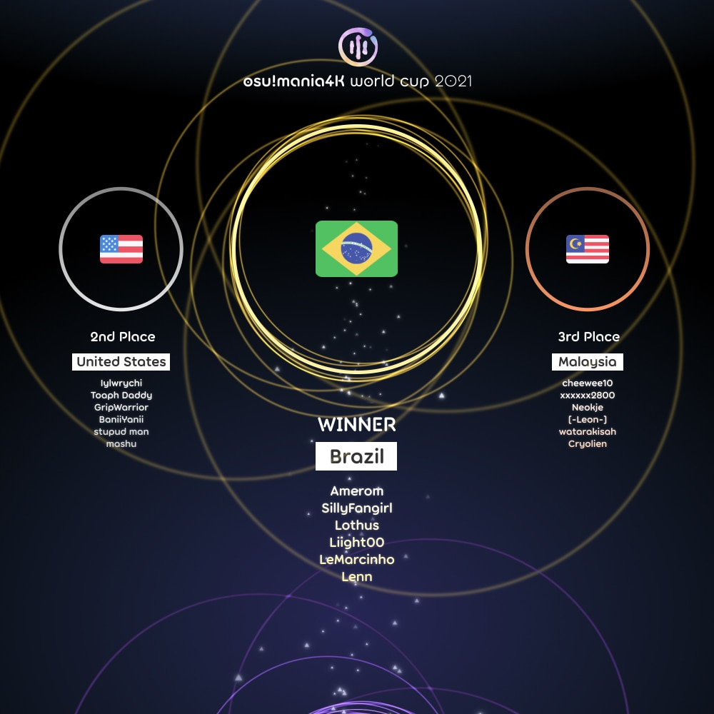

---
tags:
  - MWC2021
  - MWC 2021
  - MWC4K 2021
  - MWC 4K 2021
---

# osu!mania 4K World Cup 2021

The **osu!mania 4K World Cup 2021** (***MWC 4K 2021***) was a country-based osu!mania tournament hosted by the [osu! team](/wiki/People/osu!_team). It was the eighth instalment of the osu!mania 4K World Cup.

## Tournament schedule

| Event | Timestamp |
| --: | :-- |
| Registration phase | 2021-07-07/2021-07-21 |
| Qualifier showcase | 2021-07-31 (14:00 UTC) |
| Qualifier stage | 2021-08-07/2021-08-08 |
| Round of 32 | 2021-08-14/2021-08-15 |
| Round of 16 | 2021-08-21/2021-08-22 |
| Quarterfinals | 2021-08-28/2021-08-29 |
| Semifinals | 2021-09-04/2021-09-05 |
| Finals | 2021-09-11/2021-09-12 |
| Grand Finals | 2021-09-18/2021-09-19 |

## Prizes

| Placing | Prizes |
| :-: | :-- |
|  | $150 per team member, profile badge, "osu!mania 4K Champion" user title for one year |
|  | $80 per team member, profile badge |
|  | $40 per team member, profile badge |

  

## Organisation

The osu!mania 4K World Cup 2021 was run by the [osu! team](/wiki/People/osu!_team) and various community members.

| Position | Member(s) |
| :-- | :-- |
| Manager | ::{ flag=CA }:: [Azer](https://osu.ppy.sh/users/2155578), ::{ flag=US }:: [ChillierPear](https://osu.ppy.sh/users/9501251), ::{ flag=SE }:: [Davvy](https://osu.ppy.sh/users/10047413), ::{ flag=BR }:: [LeoFLT](https://osu.ppy.sh/users/3668779) |
| Mappool selector | ::{ flag=US }:: [-mint-](https://osu.ppy.sh/users/8976576), ::{ flag=SE }:: [Davvy](https://osu.ppy.sh/users/10047413), ::{ flag=SG }:: [Shoegazer](https://osu.ppy.sh/users/2520707), ::{ flag=CL }:: [WalterToro](https://osu.ppy.sh/users/5281416) |
| Mappool helper | ::{ flag=US }:: [chxu](https://osu.ppy.sh/users/1371219), ::{ flag=CA }:: [guden](https://osu.ppy.sh/users/11626065), ::{ flag=US }:: [Halogen-](https://osu.ppy.sh/users/169992), ::{ flag=KR }:: [Jakads](https://osu.ppy.sh/users/259972), ::{ flag=DK }:: [Jole](https://osu.ppy.sh/users/2883132), ::{ flag=AR }:: [juankristal](https://osu.ppy.sh/users/443656), ::{ flag=US }:: [lemonguy](https://osu.ppy.sh/users/4693052), ::{ flag=US }:: [Matthia](https://osu.ppy.sh/users/19804607), ::{ flag=ID }:: [Mipha-](https://osu.ppy.sh/users/5767941), ::{ flag=TH }:: [MyZterioN-](https://osu.ppy.sh/users/8521723), ::{ flag=US }:: [Orca-](https://osu.ppy.sh/users/7958845), ::{ flag=FR }:: [Paturages](https://osu.ppy.sh/users/1375479), ::{ flag=US }:: [Penguinosity](https://osu.ppy.sh/users/10235296), ::{ flag=SG }:: [Raveille](https://osu.ppy.sh/users/1388767) |
| Referee | ::{ flag=NL }:: [Albionthegreat](https://osu.ppy.sh/users/9853595), ::{ flag=US }:: [JDrago14](https://osu.ppy.sh/users/7690078), ::{ flag=BR }:: [LeoFLT](https://osu.ppy.sh/users/3668779), ::{ flag=NL }:: [nik](https://osu.ppy.sh/users/10077264), ::{ flag=DE }:: [p3n](https://osu.ppy.sh/users/123703), ::{ flag=IN }:: [Speshimen](https://osu.ppy.sh/users/7720204), ::{ flag=US }:: [tigereyes144](https://osu.ppy.sh/users/6499811), ::{ flag=GB }:: [Yazzehh](https://osu.ppy.sh/users/7068973) |
| Commentator | ::{ flag=SE }:: [Davvy](https://osu.ppy.sh/users/10047413), ::{ flag=US }:: [Halogen-](https://osu.ppy.sh/users/169992), ::{ flag=AR }:: [juankristal](https://osu.ppy.sh/users/443656), ::{ flag=ID }:: [Mipha-](https://osu.ppy.sh/users/5767941), ::{ flag=US }:: [Orca-](https://osu.ppy.sh/users/7958845), ::{ flag=FR }:: [Paturages](https://osu.ppy.sh/users/1375479), ::{ flag=AU }:: [PotassiumF](https://osu.ppy.sh/users/4247722), ::{ flag=SG }:: [Raveille](https://osu.ppy.sh/users/1388767), ::{ flag=SG }:: [Shoegazer](https://osu.ppy.sh/users/2520707), ::{ flag=US }:: [Toaph Daddy](https://osu.ppy.sh/users/7616811) |
| Statistician | ::{ flag=FI }:: [shdewz](https://osu.ppy.sh/users/10000899) |

## Links

- [Discussion thread](https://osu.ppy.sh/community/forums/topics/1366220)
- [Livestream](https://www.twitch.tv/osulive)
- [Pick'ems page](https://pickem.hwc.hr/tournaments/67) hosted by ::{ flag=DE }:: [hallowatcher](https://osu.ppy.sh/users/1874761)
- [Challonge bracket](https://challonge.com/MWC4K_2021)
- **[Statistics sheet](https://docs.google.com/spreadsheets/d/e/2PACX-1vTAcQbWgmUTB8pR17UlLc2GC9i49-GzrJyKed6rj-8nM21cjIajvdTGqU0-Jdp2SM75Kq-x8ExyJEqI/pubhtml)**

## Participants

|  | Country | Members |
| :-: | :-: | :-- |
| ::{ flag=AR }:: | **Argentina** | **[BossPlays](https://osu.ppy.sh/users/7341471)**, [prodilex](https://osu.ppy.sh/users/9472628), [NEDEAAAHHHH](https://osu.ppy.sh/users/65724), [\[Crz\]kOvID-](https://osu.ppy.sh/users/13858488), [LeongKat](https://osu.ppy.sh/users/11429144), [ottenst](https://osu.ppy.sh/users/13488325) |
| ::{ flag=AU }:: | **Australia** | **[ruka](https://osu.ppy.sh/users/6117525)**, [a1ternation](https://osu.ppy.sh/users/9828306), [Vegemite](https://osu.ppy.sh/users/13111686), [Bounter](https://osu.ppy.sh/users/11149878), [HD\_AdreNaline](https://osu.ppy.sh/users/10540368), [Nerd Guy](https://osu.ppy.sh/users/11247298) |
| ::{ flag=BE }:: | **Belgium** | **[Mortelspawn\_](https://osu.ppy.sh/users/5331420)**, [yetii](https://osu.ppy.sh/users/6914714), [spamblock](https://osu.ppy.sh/users/11968058), [Akeyro](https://osu.ppy.sh/users/1933624), [shaafs](https://osu.ppy.sh/users/8811695), [Joppe27](https://osu.ppy.sh/users/11753018) |
| ::{ flag=BR }:: | **Brazil** | **[Amerom](https://osu.ppy.sh/users/5691061)**, [SillyFangirl](https://osu.ppy.sh/users/2288363), [Lothus](https://osu.ppy.sh/users/9530019), [Liight00](https://osu.ppy.sh/users/13601876), [LeMarcinho](https://osu.ppy.sh/users/13347579), [Lenn](https://osu.ppy.sh/users/11236829) |
| ::{ flag=CA }:: | **Canada** | **[Piggy](https://osu.ppy.sh/users/5390121)**, [NunotabaShinobu](https://osu.ppy.sh/users/10809497), [Dale940](https://osu.ppy.sh/users/13847951), [Stability](https://osu.ppy.sh/users/6701738), [loafusofbread](https://osu.ppy.sh/users/9278959), [GDMem](https://osu.ppy.sh/users/10804091) |
| ::{ flag=CL }:: | **Chile** | **[kanocchi 3](https://osu.ppy.sh/users/10072733)**, [Urusai](https://osu.ppy.sh/users/469808), [Stupud\_cL](https://osu.ppy.sh/users/10659178), [Rhyzt\_cL](https://osu.ppy.sh/users/10235085), [Jeanne Da Rin](https://osu.ppy.sh/users/5214842), [faz\_cL](https://osu.ppy.sh/users/7853143) |
| ::{ flag=CN }:: | **China** | **[\[Crz\]xz1z1z](https://osu.ppy.sh/users/10500832)**, [\[Crz\]Satori](https://osu.ppy.sh/users/7082178), [\[Crz\]sunnyxxy](https://osu.ppy.sh/users/10333739), [\[Crz\]Caicium](https://osu.ppy.sh/users/10702235), [\[Crz\]Mix0130](https://osu.ppy.sh/users/7215250), [\[Crz\]Lucifer](https://osu.ppy.sh/users/5270332) |
| ::{ flag=CO }:: | **Colombia** | **[AlexxiTo](https://osu.ppy.sh/users/16711124)**, [D3fusion](https://osu.ppy.sh/users/12829021), [Naruzae](https://osu.ppy.sh/users/12287005), [ag0](https://osu.ppy.sh/users/17989209), [Nihil-](https://osu.ppy.sh/users/6406254) |
| ::{ flag=FI }:: | **Finland** | **[LovelyN](https://osu.ppy.sh/users/8370443)**, [Strachy](https://osu.ppy.sh/users/9663200), [Camopoltergeist](https://osu.ppy.sh/users/8132964), [Fireable](https://osu.ppy.sh/users/12624280), [Saunaklonkku](https://osu.ppy.sh/users/3386886), [Fisu](https://osu.ppy.sh/users/12545346) |
| ::{ flag=FR }:: | **France** | **[PatouZ](https://osu.ppy.sh/users/7306522)**, [Azubeur](https://osu.ppy.sh/users/1594604), [Auraah](https://osu.ppy.sh/users/10015908), [Koiidex](https://osu.ppy.sh/users/5193488), [Elementaires](https://osu.ppy.sh/users/2284328), [ZayyKen](https://osu.ppy.sh/users/8624433) |
| ::{ flag=DE }:: | **Germany** | **[LastExceed](https://osu.ppy.sh/users/6232245)**, [jkzu123](https://osu.ppy.sh/users/15806513), [Maxim-Miau](https://osu.ppy.sh/users/12660835), [Niko\_Plays](https://osu.ppy.sh/users/9409456), [medium kek](https://osu.ppy.sh/users/11625617), [Sirbeyy](https://osu.ppy.sh/users/12917829) |
| ::{ flag=GT }:: | **Guatemala** | **[\[LS\]Hanabi](https://osu.ppy.sh/users/12344416)**, [Hoto Cocoa](https://osu.ppy.sh/users/6974536), [CesarGS](https://osu.ppy.sh/users/17433785), [MR acefrio](https://osu.ppy.sh/users/17834713), [JZOEN](https://osu.ppy.sh/users/11584472) |
| ::{ flag=HK }:: | **Hong Kong** | **[MegMewtwoZ](https://osu.ppy.sh/users/13235067)**, [Quotient GD](https://osu.ppy.sh/users/11313227), [Silkeee](https://osu.ppy.sh/users/10770925), [-SoraIro-](https://osu.ppy.sh/users/11493286), [Ricizus](https://osu.ppy.sh/users/10395139), [Arswl](https://osu.ppy.sh/users/15708798) |
| ::{ flag=ID }:: | **Indonesia** | **[Onta\_Bekasi](https://osu.ppy.sh/users/8677684)**, [nayuu](https://osu.ppy.sh/users/12561379), [Reyi](https://osu.ppy.sh/users/13385865), [RetroEX](https://osu.ppy.sh/users/10540515), [I\_cantplay](https://osu.ppy.sh/users/18309106), [IceVee](https://osu.ppy.sh/users/8108213) |
| ::{ flag=IT }:: | **Italy** | **[Kiraz](https://osu.ppy.sh/users/3807675)**, [Veryi](https://osu.ppy.sh/users/13878539), [\[Crz\]Cribob](https://osu.ppy.sh/users/8485394), [Jeersy](https://osu.ppy.sh/users/11636434), [CarrelloMine](https://osu.ppy.sh/users/9900466), [Relae](https://osu.ppy.sh/users/14455536) |
| ::{ flag=JP }:: | **Japan** | **[AMDuskia1996](https://osu.ppy.sh/users/10242062)**, [CrewK](https://osu.ppy.sh/users/11488604), [\[Fairy\]Phy](https://osu.ppy.sh/users/4777360), [jhleetgirl](https://osu.ppy.sh/users/10745260), [MM\_Yuu](https://osu.ppy.sh/users/10649883), [nakikaze](https://osu.ppy.sh/users/9009336) |
| ::{ flag=LV }:: | **Latvia** | **[CrayZigg](https://osu.ppy.sh/users/11942663)**, [Mantinsh](https://osu.ppy.sh/users/10186414), [arcis666](https://osu.ppy.sh/users/5936601), [Rolled5L](https://osu.ppy.sh/users/19615156) |
| ::{ flag=MY }:: | **Malaysia** | **[cheewee10](https://osu.ppy.sh/users/4477497)**, [xxxxxx2800](https://osu.ppy.sh/users/4084853), [Neokje](https://osu.ppy.sh/users/7727987), [\[-Leon-\]](https://osu.ppy.sh/users/13382147), [watarakisah](https://osu.ppy.sh/users/6237337), [Cryolien](https://osu.ppy.sh/users/1626983) |
| ::{ flag=NL }:: | **Netherlands** | **[2fast4you98](https://osu.ppy.sh/users/5183940)**, [Bakuretsue](https://osu.ppy.sh/users/10960533), [Tyronix](https://osu.ppy.sh/users/11290311), [Shoira](https://osu.ppy.sh/users/13377652), [Toxic Scent](https://osu.ppy.sh/users/12599154), [NightNarumi](https://osu.ppy.sh/users/4381142) |
| ::{ flag=NO }:: | **Norway** | **[\[RS\] F4st](https://osu.ppy.sh/users/7676585)**, [Hennytai](https://osu.ppy.sh/users/4266693), [Veslepus](https://osu.ppy.sh/users/9956593), [Matseosu](https://osu.ppy.sh/users/20049911), [Zekronz](https://osu.ppy.sh/users/7220725), [prebert123](https://osu.ppy.sh/users/7859738) |
| ::{ flag=PE }:: | **Peru** | **[\[GS\]DaZeRo5](https://osu.ppy.sh/users/6114633)**, [\[Crz\]Kasumi](https://osu.ppy.sh/users/11930795), [bxd\_juice](https://osu.ppy.sh/users/17152485), [Kamikho](https://osu.ppy.sh/users/12664851), [Miaurichesu](https://osu.ppy.sh/users/10055648) |
| ::{ flag=PH }:: | **Philippines** | **[Silhoueska Elze](https://osu.ppy.sh/users/11517895)**, [J1002](https://osu.ppy.sh/users/11958940), [- Kura -](https://osu.ppy.sh/users/11420405), [Swarmsii](https://osu.ppy.sh/users/11716111), [Sirelia](https://osu.ppy.sh/users/10374991), [TheMysteryL](https://osu.ppy.sh/users/14113974) |
| ::{ flag=PL }:: | **Poland** | **[Tidek](https://osu.ppy.sh/users/743282)**, [DaDarkDragon](https://osu.ppy.sh/users/8902097), [\_underjoy](https://osu.ppy.sh/users/2235750), [s\_kolorowa](https://osu.ppy.sh/users/11430587), [SitekX](https://osu.ppy.sh/users/3840946), [Archaic84](https://osu.ppy.sh/users/8611177) |
| ::{ flag=PT }:: | **Portugal** | **[Rodrig0v](https://osu.ppy.sh/users/138866)**, [\_Creamy](https://osu.ppy.sh/users/9354008), [JAHDONG](https://osu.ppy.sh/users/11445021), [Jiminho](https://osu.ppy.sh/users/16229396) |
| ::{ flag=RU }:: | **Russian Federation** | **[Lerck](https://osu.ppy.sh/users/10450696)**, [\_lyko](https://osu.ppy.sh/users/8435430), [wolfpup08](https://osu.ppy.sh/users/11939641), [\[Crz\]Arachnon](https://osu.ppy.sh/users/9074986), [X\_Devil](https://osu.ppy.sh/users/6694908), [fegasaren0133](https://osu.ppy.sh/users/8035172) |
| ::{ flag=SG }:: | **Singapore** | **[Xvenn](https://osu.ppy.sh/users/13390529)**, [MrExpandion](https://osu.ppy.sh/users/12459700), [IJosephI\[GS\]](https://osu.ppy.sh/users/13353749), [dabreadosan](https://osu.ppy.sh/users/16870002), [Japeynius](https://osu.ppy.sh/users/13993659), [riunosk](https://osu.ppy.sh/users/5594381) |
| ::{ flag=KR }:: | **South Korea** | **[Transcendence](https://osu.ppy.sh/users/903155)**, [Flying Samira](https://osu.ppy.sh/users/10329095), [KalkaiFanboy](https://osu.ppy.sh/users/8039789), [popomon](https://osu.ppy.sh/users/1149319), [gaesol1](https://osu.ppy.sh/users/12452131), [Girls frontline](https://osu.ppy.sh/users/11823301) |
| ::{ flag=ES }:: | **Spain** | **[aitor98](https://osu.ppy.sh/users/3154852)**, [Komirin](https://osu.ppy.sh/users/4725379), [Guldakh](https://osu.ppy.sh/users/8553078), [Anas-](https://osu.ppy.sh/users/8608903), [CrewK fanboy](https://osu.ppy.sh/users/7860283) |
| ::{ flag=SE }:: | **Sweden** | **[\[LS\]Trymatic](https://osu.ppy.sh/users/14762260)**, [diamondBIaze](https://osu.ppy.sh/users/10553827), [SebbeBest](https://osu.ppy.sh/users/18272334), [Lemmie](https://osu.ppy.sh/users/11700865), [NeonDrakon](https://osu.ppy.sh/users/6315000), [Emik](https://osu.ppy.sh/users/3350987) |
| ::{ flag=CH }:: | **Switzerland** | **[Tupidix](https://osu.ppy.sh/users/8655604)**, [Adyrem](https://osu.ppy.sh/users/8642966), [Gamer97](https://osu.ppy.sh/users/4952941), [Haprapra](https://osu.ppy.sh/users/3974114), [CrashSmash](https://osu.ppy.sh/users/13942150), [zipp](https://osu.ppy.sh/users/6839722) |
| ::{ flag=TW }:: | **Taiwan** | **[\[Crz\]FolAH1217](https://osu.ppy.sh/users/6232458)**, [\[Rweiru\]](https://osu.ppy.sh/users/11234907), [murorachi](https://osu.ppy.sh/users/8682905), [Changpanda7045](https://osu.ppy.sh/users/10493479), [signupredir111](https://osu.ppy.sh/users/11859958), [Joylintp](https://osu.ppy.sh/users/13579078) |
| ::{ flag=TH }:: | **Thailand** | **[HowToPlayLN](https://osu.ppy.sh/users/10879600)**, [jimmyreturnz](https://osu.ppy.sh/users/11306153), [MIkuaimbot](https://osu.ppy.sh/users/17699745), [Achino](https://osu.ppy.sh/users/13349388), [IjustLuvBanana](https://osu.ppy.sh/users/16011592), [shokoha](https://osu.ppy.sh/users/14134289) |
| ::{ flag=TR }:: | **Turkey** | **[hsod](https://osu.ppy.sh/users/15391485)**, [BlueHydra11](https://osu.ppy.sh/users/13360698), [bys4133](https://osu.ppy.sh/users/14832700), [Ayhan2005](https://osu.ppy.sh/users/6419257) |
| ::{ flag=UA }:: | **Ukraine** | **[Shailexi](https://osu.ppy.sh/users/11375371)**, [LonBertZend](https://osu.ppy.sh/users/10484445), [Arstz](https://osu.ppy.sh/users/10844754), [kaivoo](https://osu.ppy.sh/users/5257734), [ADshush](https://osu.ppy.sh/users/15231447) |
| ::{ flag=GB }:: | **United Kingdom** | **[Pope Gadget](https://osu.ppy.sh/users/2288341)**, [Eliminate294](https://osu.ppy.sh/users/9169747), [TingMomentum](https://osu.ppy.sh/users/12489832), [XxNewson1234xX](https://osu.ppy.sh/users/9895650), [Yonk\_](https://osu.ppy.sh/users/5156656), [Zoobin4](https://osu.ppy.sh/users/10055204) |
| ::{ flag=US }:: | **United States** | **[Iylwrychi](https://osu.ppy.sh/users/7794488)**, [Toaph Daddy](https://osu.ppy.sh/users/7616811), [GripWarrior](https://osu.ppy.sh/users/11734610), [BaniiYanii](https://osu.ppy.sh/users/11888159), [stupud man](https://osu.ppy.sh/users/2141612), [mashu](https://osu.ppy.sh/users/12028216) |
| ::{ flag=UY }:: | **Uruguay** | **[etterna in osu](https://osu.ppy.sh/users/5243536)**, [HopelessPlayer](https://osu.ppy.sh/users/12528267), [El Milanga](https://osu.ppy.sh/users/12264918), [cuchu93](https://osu.ppy.sh/users/1311627) |
| ::{ flag=VE }:: | **Venezuela** | **[\_Yisus\_](https://osu.ppy.sh/users/1489811)**, [Neko-Pan](https://osu.ppy.sh/users/8676532), [xXShyzDy0133Xx](https://osu.ppy.sh/users/13545528), [Edvo](https://osu.ppy.sh/users/8301758), [Doryoku](https://osu.ppy.sh/users/5639725), [Cerelac](https://osu.ppy.sh/users/8065567) |
| ::{ flag=VN }:: | **Vietnam** | **[MashedPotato](https://osu.ppy.sh/users/10494860)**, [Lottery61](https://osu.ppy.sh/users/13821222), [Asrielly](https://osu.ppy.sh/users/2656302), [CPT\_Sivelia](https://osu.ppy.sh/users/12562107), [TriDoanGaming](https://osu.ppy.sh/users/14009758), [LovelyL](https://osu.ppy.sh/users/14821320) |

## Podium

## Mappools

### Finals

*Note: This mappool was used for both Finals week 1 and 2.*

- Rice
  1. [Kuribayashi Minami - ZERO!! (stupud man) \[Skwid's Challenge 1.05x\]](https://osu.ppy.sh/beatmapsets/1450344#mania/2981851)
  2. [Divine Heresy - Bleed The Fifth (Shoegazer) \[Deception 1.2x (286bpm)\]](https://osu.ppy.sh/beatmapsets/1481039#mania/3040598)
  3. [DJ SHARPNEL - FAKE PROMISE (Shoegazer) \[Eternity 1.35x (258bpm)\]](https://osu.ppy.sh/beatmapsets/1441640#mania/2969934)
  4. [DARK SAMBA MASTER -SATOH- - DARK SAMBA LAND (Mipha-) \[miphather 1.15x (167bpm)\]](https://osu.ppy.sh/beatmapsets/1206115#mania/2511427)
  5. [Haruko Momoi - Eiyuu no Uta (Valedict) \[STORM OF BLOOD 1.1x\]](https://osu.ppy.sh/beatmapsets/1483232#mania/3114831)
  6. [Aquellex - Obligatory (Kurorak's Obligatory Destruction rmx) (AutotelicBrown) \[Alice's First Law 1.15x (no mini-LNs)\]](https://osu.ppy.sh/beatmapsets/1438897#mania/3196807)
  7. [Aquellex - Wanderflux (Halogen-) \[Extirpate 1.05x (268bpm)\]](https://osu.ppy.sh/beatmapsets/1564822#mania/3195737)
- Hybrid
  1. [Camellia - B L A C K - R A Y (Toaph Daddy) \[D A R K - M A G I C I A N x1.05\]](https://osu.ppy.sh/beatmapsets/1306124#mania/2707896)
  2. [cosMo@BousouP - Dusanco Odyssey!! (lemonguy) \[MAXIMUM x1.05\]](https://osu.ppy.sh/beatmapsets/1497081#mania/3117177)
  3. [Feryquitous - Arcahv (-mint-) \[Abraxos's Rend 1.1x\]](https://osu.ppy.sh/beatmapsets/1566545#mania/3198642)
- LN
  1. [Hino Isuka - #be\_fortunate (HowToPlayLN) \[#be\_editlocked\]](https://osu.ppy.sh/beatmapsets/1099229#mania/3200043)
  2. [Function Phantom - Algebra (juankristal) \[Logaritmo Natural\]](https://osu.ppy.sh/beatmapsets/1568619#mania/3202757)
  3. [C-Show - LubedeR (lemonguy) \[LN Master x1.05\]](https://osu.ppy.sh/beatmapsets/1512748#mania/3106492)
  4. [Frums - VIS::CRACKED (\[Crz\]Crysarlene) \[mipha vs. crys's oblivion\]](https://osu.ppy.sh/beatmapsets/1561114#mania/3188294)
- SV
  1. [DJ Witch Girl Miracle - Mafain (Orca-) \[Phasmos\]](https://osu.ppy.sh/beatmapsets/1569493#mania/3205012)
  2. [Jeff Allen ft. Noelle LeBlanc and Naoko Takamoto - Recession (Razzy) \[Peel Back The Cover\]](https://osu.ppy.sh/beatmapsets/758418#mania/1595289)
- Tiebreaker
  1. **[SUPER MWC KART - Purple Palace (-mint-) \[Rainbow Road Revolution\]](https://osu.ppy.sh/beatmapsets/1569527#mania/3205077)**

### Semifinals

- Rice
  1. [SHIKI - Angelic Layer (Mipha-) \[Paragon 1.2x (175bpm)\]](https://osu.ppy.sh/beatmapsets/1332427#mania/2798673)
  2. [DJ SHARPNEL - STRANGEPROGRAM (Shoegazer) \[Malfunction 1.2x (258bpm)\]](https://osu.ppy.sh/beatmapsets/1393835#mania/2888752)
  3. [Jea - snows ~Soshite Kiseki~ (Jole) \[Fast Regrets 1.3x (242bpm)\]](https://osu.ppy.sh/beatmapsets/1533545#mania/3136095)
  4. [ZUN (Arr.sun3) - STAR OF ANDROMEDA (Seiryuu) \[1.0\]](https://osu.ppy.sh/beatmapsets/1541438#mania/3150953)
  5. [Frums - Q.E. (Pizza69) \[Insane 1.15x (192bpm)\]](https://osu.ppy.sh/beatmapsets/1558484#mania/3183458)
  6. [dev-null - Goblin (ilikexd) \[Insane 1.2x (252bpm)\]](https://osu.ppy.sh/beatmapsets/1543786#mania/3155497)
  7. [Outsider - Acquaintance (Guilhermeziat) \[Skwid's Challenge\]](https://osu.ppy.sh/beatmapsets/1450363#mania/2981901)
- Hybrid
  1. [BEMANI Sound Team "HuMer vs dj Hellix" - EMERALDAS (stupud man) \[CHAOS CONTROL 1.1x\]](https://osu.ppy.sh/beatmapsets/1416026#mania/2918199)
  2. [Silentroom vs Frums - Aegleseeker (Abraxos) \[The Final Edge of Light\]](https://osu.ppy.sh/beatmapsets/1458667#mania/2997592)
  3. [Camellia as "menaXe inXonnu" - Xronial Xero (lemonguy) \[Xhallenge\]](https://osu.ppy.sh/beatmapsets/1519331#mania/3109899)
- LN
  1. [Amane - Dodger's Gadget (UNMIXED) (inteliser) \[Catastrophy \[LN\] 1.05x (189bpm)\]](https://osu.ppy.sh/beatmapsets/1519475#mania/3185566)
  2. [MiddleIsland - Delrio (Raveille) \[for the rivers\]](https://osu.ppy.sh/beatmapsets/1251408#mania/2601016)
  3. [penoreri - Preserved Valkyria (guden) \[Brynhildr\]](https://osu.ppy.sh/beatmapsets/1485257#mania/3191733)
  4. [Camellia - werewolf howls. (lemonguy) \[LNFINITE.\]](https://osu.ppy.sh/beatmapsets/1435835#mania/2954313)
- SV
  1. [DOT96 - MAKE IT FUNKY NOW (RuleBlazing) \[Funny (edit)\]](https://osu.ppy.sh/beatmapsets/1181310#mania/3189234)
  2. [EZFG - cloud (Toaph Daddy) \[scattered\]](https://osu.ppy.sh/beatmapsets/1481395#mania/3038813)
- Tiebreaker
  1. **[Camellia - OOPARTS (-mint-) \[Antikythera\]](https://osu.ppy.sh/beatmapsets/1505323#mania/3083481)**

### Quarterfinals

- Rice
  1. [Sai Oto / Komiya Mao - Yozakura (Mipha-) \[Prayer 1.2x (162bpm)\]](https://osu.ppy.sh/beatmapsets/1180451#mania/3102991)
  2. [goreshit - thinking of you (ilikexd) \[Insane 1.1x (250bpm)\]](https://osu.ppy.sh/beatmapsets/1531781#mania/3132726)
  3. [t+pazolite - cheatreal (Shoegazer) \[fatality 1.1x (220bpm)\]](https://osu.ppy.sh/beatmapsets/1505366#mania/3083563)
  4. [android52 - super anime groove 3d world (TheFalek) \[Jacky Groove // 1.15x\]](https://osu.ppy.sh/beatmapsets/1271718#mania/3153076)
  5. [Aaron Spectre - You Don't Know (aeoliancarp) \[It Is a Mystery \[1.2x\]](https://osu.ppy.sh/beatmapsets/1537106#mania/3142811)
  6. [Silentroom - Shuu no Hazama \[Rainshower\] (Shoegazer) \[Abendregen\]](https://osu.ppy.sh/beatmapsets/1307803#mania/3135961)
- Hybrid
  1. [Camellia - Alone intelligence (guden) \[Solace 1.05x (edit)\]](https://osu.ppy.sh/beatmapsets/1556924#mania/3180555)
  2. [PSYQUI - Endless (Mameyudoufu Remix) (Paturages) \[HowToPlayLN's Divergence (edit)\]](https://osu.ppy.sh/beatmapsets/1556896#mania/3180507)
  3. [Camellia as "fluX Xroise" - Xronier (lemonguy) \[Stage 4: Maxima\]](https://osu.ppy.sh/beatmapsets/1381482#mania/2854324)
- LN
  1. [aran - L.F.O (stupud man) \[Phase Shift 1.05x\]](https://osu.ppy.sh/beatmapsets/1375934#mania/2843953)
  2. [Linkin Park - Somewhere I Belong (\[Crz\]Crysarlene) \[Unreal\]](https://osu.ppy.sh/beatmapsets/928232#mania/1938851)
  3. [Camellia - SCREW // owo // SCREW (lemonguy) \[Another\]](https://osu.ppy.sh/beatmapsets/1511816#mania/3095591)
- SV
  1. [ARM(IOSYS) - Marisa wa Taihen na Mono wo Nusunde Ikimashita (notapplicable) \[SVanghai Doll\]](https://osu.ppy.sh/beatmapsets/1062298#mania/2224394)
  2. [Savant - Massacre (Hydria) \[Insane\]](https://osu.ppy.sh/beatmapsets/855805#mania/1788048)
- Tiebreaker
  1. **[RoughSketch feat. DD NakataMetal - Booths of Fighters (Camellia's "Barrage of Flurries" Remix) (MyZterioN-) \[Challenger Approached (edit)\]](https://osu.ppy.sh/beatmapsets/1192312#mania/3180832)**

### Round of 16

- Rice
  1. [DJ Encore feat. Engelina - Open Your Eyes (Jole) \[3y3s lol 1.1x (154bpm)\]](https://osu.ppy.sh/beatmapsets/1450567#mania/2982256)
  2. [Venetian Snares - Die Winnipeg Die Die Die F---ers Die (Paturages) \[AlexDest's Challenge (OD8.5)\]](https://osu.ppy.sh/beatmapsets/1550006#mania/3167452)
  3. [Yunomi feat. nicamoq - Robotic Girl (Srav3R Remix) (LeiN-) \[Unscathed Heart 1.25x (213bpm)\]](https://osu.ppy.sh/beatmapsets/1462769#mania/3005162)
  4. [Static-X - Brainfog (Shoegazer) \[Delirium 1.2x (181bpm)\]](https://osu.ppy.sh/beatmapsets/1438983#mania/3028404)
  5. [The Flashbulb - Lawn Wake IX (ilikexd) \[Insane 1.2x (223bpm)\]](https://osu.ppy.sh/beatmapsets/1543788#mania/3157423)
  6. [Frums - one of none (aeoliancarp) \[observer 1.05x (126bpm)\]](https://osu.ppy.sh/beatmapsets/1533448#mania/3135904)
- Hybrid
  1. [MIDInco - Etude (Tidek) \[Interlude\]](https://osu.ppy.sh/beatmapsets/1162486#mania/2424948)
  2. [Wednesday Campanella - Shakushain (Penguinosity) \[Shakushaku 1.2x\]](https://osu.ppy.sh/beatmapsets/1503374#mania/3079993)
  3. [penoreri vs. BEMANI Sound Team "HuMeR" - Discordia (lemonguy) \[Valhalla\]](https://osu.ppy.sh/beatmapsets/1517670#mania/3106858)
- LN
  1. [Ryu\* - Sakura Mirage (-mint-) \[penguin x mint's EXHAUST Lv. 15\]](https://osu.ppy.sh/beatmapsets/1545098#mania/3158212)
  2. [96Neko - Paintings? Oh, yeah. (juankristal) \[PaiLNful \[OD 7 Edit\]](https://osu.ppy.sh/beatmapsets/516224#mania/1103346)
  3. [Feryquitous - Qavsell (Davvy) \[Heritage (cut edit)\]](https://osu.ppy.sh/beatmapsets/1187793#mania/2971627)
- SV
  1. [C-show - GIMME DA BLOOD (H1Pur) \[GIMME DA SV\]](https://osu.ppy.sh/beatmapsets/1428709#mania/2941393)
  2. [THE SxPLAY & KIVA - Hyou Ryuu (zero2snow) \[Stage 1: Drifted\]](https://osu.ppy.sh/beatmapsets/980182#mania/2051288)
- Tiebreaker
  1. **[Laur - Sound Chimera (Toaph Daddy) \[Polymerization\]](https://osu.ppy.sh/beatmapsets/1415755#mania/2917733)**

### Round of 32

- Rice
  1. [Mage - The Words I Never Said In D&B (Jole) \[drum & stream 1.05x (181bpm)\]](https://osu.ppy.sh/beatmapsets/1459360#mania/2999031)
  2. [litmus* - iterated (Paturages) \[Elekton's versatile (edit)\]](https://osu.ppy.sh/beatmapsets/1543102#mania/3154191)
  3. [Pendulum - Axle Grinder (Shoegazer) \[Accelerator 1.1x (190bpm)\]](https://osu.ppy.sh/beatmapsets/1485332#mania/3045851)
  4. [Blitz Lunar - Diamante Spectrasplosion (ilikexd) \[Collab Insane\]](https://osu.ppy.sh/beatmapsets/1541950#mania/3151919)
  5. [Maurice Ravel - Gaspard de la Nuit: Ondine (-mint-) \[Xay's Solo (cut)\]](https://osu.ppy.sh/beatmapsets/1543132#mania/3154234)
- Hybrid
  1. [Kshiraki - Seven (Paturages) \[Heptaplex\]](https://osu.ppy.sh/beatmapsets/1435937#mania/2954580)
  2. [sakuzyo - PANDORA PARADOXXX (-mint-) \[Elekton's vanity (edit)\]](https://osu.ppy.sh/beatmapsets/1543130#mania/3154232)
  3. [Chroma - Destroy, Destroy, Destroy The Happy End (-mint-) \[Termination (cut)\]](https://osu.ppy.sh/beatmapsets/1443682#mania/2969580)
- LN
  1. [Rche - Todestrieb (stupud man) \[Rapture\]](https://osu.ppy.sh/beatmapsets/1367593#mania/2828317)
  2. [Kyary Pamyu Pamyu - HARAJUKU IYAHOI (Mipha-) \[Carefree\]](https://osu.ppy.sh/beatmapsets/1440719#mania/2972364)
- SV
  1. [sasakure.UK - Ruins (Neomorph remix) (Paturages) \[Shambles (edit)\]](https://osu.ppy.sh/beatmapsets/1367133#mania/3154187)
  2. [Inspector K - Disconnected -Hyper- (XeoStyle) \[beep boop\]](https://osu.ppy.sh/beatmapsets/609453#mania/1287062)
- Tiebreaker:
  1. **[Camellia - Proluvies ("abyssum oblivionis" Long ver.) (-mint-) \[chasm (NSV)\]](https://osu.ppy.sh/beatmapsets/1543068#mania/3154095)**

### Qualifiers

1. [Koan Sound - Radiant (Cut Ver.) (Paturages) \[Stage 1: Heater\]](https://osu.ppy.sh/beatmapsets/1535623#mania/3140050)
2. [Micelle - PhonDrome! (aeoliancarp) \[Stage 2: Vessel\]](https://osu.ppy.sh/beatmapsets/1535633#mania/3140079)
3. [Shawn Wasabi + YDG - Burnt Rice (feat. YUNG GEMMY) (-mint-) \[Stage 3: Reality\]](https://osu.ppy.sh/beatmapsets/1535611#mania/3140030)
4. [Zekk - Kaleidoscope (juankristal) \[Stage 4: Replica\]](https://osu.ppy.sh/beatmapsets/1535762#mania/3140300)
5. [xi - Garyou Tensei (Penguinosity) \[Stage 5: Resolve\]](https://osu.ppy.sh/beatmapsets/1535632#mania/3140078)
6. [BilliumMoto - life flashes before weeb eyes (lemonguy) \[Stage 6: Remembrance\]](https://osu.ppy.sh/beatmapsets/1535624#mania/3140051)
7. [Cardboard Box feat. Koji Kondo - Mario-chi Survivor (Mipha-) \[Stage 7: Perseverance\]](https://osu.ppy.sh/beatmapsets/1535627#mania/3140055)
8. [deathcount - A Beautiful Degeneracy (Remix by Stazma The Junglechrist) (Shoegazer) \[Stage 8: Desperado\]](https://osu.ppy.sh/beatmapsets/1535626#mania/3140053)

## Match results

### Finals week 2

Detailed statistics for Finals week 1 and 2 can be found [here](https://docs.google.com/spreadsheets/d/e/2PACX-1vT2RgCDlCseyg6CNGnrGtnIRTadNqYt1wuZKkthLV9o4hsGl4gDwPiq2oAF1lp1JT0UougO8Z28Fvex/pubhtml).

Sunday, September 19, 2021:

| Team A |  |  | Team B | Match link |
| --: | :-: | :-: | :-- | :-- |
| **United States** ::{ flag=US }:: | **7** | 0 | ::{ flag=MY }:: Malaysia | [#1](https://osu.ppy.sh/community/matches/91143237) |
| **Brazil** ::{ flag=BR }:: | **7** | 3 | ::{ flag=US }:: United States | [#1](https://osu.ppy.sh/community/matches/91184243) |

### Finals week 1

Saturday, September 11, 2021:

| Team A |  |  | Team B | Match link |
| --: | :-: | :-: | :-- | :-- |
| **Malaysia** ::{ flag=MY }:: | **7** | 6 | ::{ flag=JP }:: Japan | [#1](https://osu.ppy.sh/community/matches/90732849) |
| **United Kingdom** ::{ flag=GB }:: | **7** | 6 | ::{ flag=VN }:: Vietnam | [#1](https://osu.ppy.sh/community/matches/90739182) |

Sunday, September 12, 2021:

| Team A |  |  | Team B | Match link |
| --: | :-: | :-: | :-- | :-- |
| **Malaysia** ::{ flag=MY }:: | **7** | 4 | ::{ flag=GB }:: United Kingdom | [#1](https://osu.ppy.sh/community/matches/90796940) |
| United States ::{ flag=US }:: | 1 | **7** | ::{ flag=BR }:: **Brazil** | [#1](https://osu.ppy.sh/community/matches/90818556) |

### Semifinals

Detailed statistics for this round can be found [here](https://docs.google.com/spreadsheets/d/e/2PACX-1vSDhy2Sgc-Bw9vB484JdHKbD8I0ZTu7PT8O0J_h_NpfG7QmLfgFoHIVNoX1cgDggQANFumV296H0fVz/pubhtml).

Saturday, September 04, 2021:

| Team A |  |  | Team B | Match link |
| --: | :-: | :-: | :-- | :-- |
| China ::{ flag=CN }:: | 5 | **7** | ::{ flag=JP }:: **Japan** | [#1](https://osu.ppy.sh/community/matches/90366440) |
| **South Korea** ::{ flag=KR }:: | **7** | 0 | ::{ flag=FR }:: France | [#1](https://osu.ppy.sh/community/matches/90368430) |
| **Philippines** ::{ flag=PH }:: | **7** | 1 | ::{ flag=SG }:: Singapore | [#1](https://osu.ppy.sh/community/matches/90370579) |
| **Vietnam** ::{ flag=VN }:: | **7** | 1 | ::{ flag=ID }:: Indonesia | [#1](https://osu.ppy.sh/community/matches/90375487) |

Sunday, September 05, 2021:

| Team A |  |  | Team B | Match link |
| --: | :-: | :-: | :-- | :-- |
| United Kingdom ::{ flag=GB }:: | 1 | **7** | ::{ flag=BR }:: **Brazil** | [#1](https://osu.ppy.sh/community/matches/90388662) |
| **United States** ::{ flag=US }:: | **7** | 1 | ::{ flag=MY }:: Malaysia | [#1](https://osu.ppy.sh/community/matches/90411906) |
| **Vietnam** ::{ flag=VN }:: | **7** | 2 | ::{ flag=PH }:: Philippines | [#1](https://osu.ppy.sh/community/matches/90421240) |
| **Japan** ::{ flag=JP }:: | **7** | 2 | ::{ flag=KR }:: South Korea | [#1](https://osu.ppy.sh/community/matches/90428313) |

### Quarterfinals

Detailed statistics for this round can be found [here](https://docs.google.com/spreadsheets/d/e/2PACX-1vRxI-1S9uv04mhcmVeYdB_rbQ3T6gyhbs8739duhmPwv4oChWpcALdX6qm9vS3PsWR-ouo9ytG5f2rA/pubhtml).

Saturday, August 28, 2021:

| Team A |  |  | Team B | Match link |
| --: | :-: | :-: | :-- | :-- |
| **Canada** ::{ flag=CA }:: | **6** | FF | ::{ flag=AR }:: Argentina |  |
| **Japan** ::{ flag=JP }:: | **6** | 1 | ::{ flag=PL }:: Poland | [#1](https://osu.ppy.sh/community/matches/89998280) |
| **Indonesia** ::{ flag=ID }:: | **6** | 3 | ::{ flag=TW }:: Taiwan | [#1](https://osu.ppy.sh/community/matches/90001720) |
| **Hong Kong** ::{ flag=HK }:: | **6** | 1 | ::{ flag=IT }:: Italy | [#1](https://osu.ppy.sh/community/matches/90004019) |
| **Thailand** ::{ flag=TH }:: | **6** | 2 | ::{ flag=RU }:: Russian Federation | [#1](https://osu.ppy.sh/community/matches/90006670) |
| **Singapore** ::{ flag=SG }:: | **6** | 4 | ::{ flag=ES }:: Spain | [#1](https://osu.ppy.sh/community/matches/90006472) |
| **France** ::{ flag=FR }:: | **6** | 2 | ::{ flag=NL }:: Netherlands | [#1](https://osu.ppy.sh/community/matches/90012514) |
| **Chile** ::{ flag=CL }:: | **6** | 0 | ::{ flag=PE }:: Peru | [#1](https://osu.ppy.sh/community/matches/90025700) |

Sunday, August 29, 2021:

| Team A |  |  | Team B | Match link |
| --: | :-: | :-: | :-- | :-- |
| **United States** ::{ flag=US }:: | **6** | 1 | ::{ flag=PH }:: Philippines | [#1](https://osu.ppy.sh/community/matches/90040871) |
| **Malaysia** ::{ flag=MY }:: | **6** | 1 | ::{ flag=VN }:: Vietnam | [#1](https://osu.ppy.sh/community/matches/90053442) |
| **Singapore** ::{ flag=SG }:: | **6** | 3 | ::{ flag=TH }:: Thailand | [#1](https://osu.ppy.sh/community/matches/90056452) |
| Hong Kong ::{ flag=HK }:: | 2 | **6** | ::{ flag=JP }:: **Japan** | [#1](https://osu.ppy.sh/community/matches/90059924) |
| **United Kingdom** ::{ flag=GB }:: | **6** | 3 | ::{ flag=KR }:: South Korea | [#1](https://osu.ppy.sh/community/matches/90060092) |
| **Brazil** ::{ flag=BR }:: | **6** | 1 | ::{ flag=CN }:: China | [#1](https://osu.ppy.sh/community/matches/90064931) |
| Chile ::{ flag=CL }:: | 4 | **6** | ::{ flag=ID }:: **Indonesia** | [#1](https://osu.ppy.sh/community/matches/90067609) |
| Canada ::{ flag=CA }:: | 2 | **6** | ::{ flag=FR }:: **France** | [#1](https://osu.ppy.sh/community/matches/90076136) |

### Round of 16

Detailed statistics for this round can be found [here](https://docs.google.com/spreadsheets/d/e/2PACX-1vT-l5g5Qa_O55t-_azBZLFGF8foa86bWrEtJRlvUiViRPsxreUeNztIbgBrFsjh0ffc8_wXtfHmLcaD/pubhtml).

Saturday, August 21, 2021:

| Team A |  |  | Team B | Match link |
| --: | :-: | :-: | :-- | :-- |
| **South Korea** ::{ flag=KR }:: | **6** | 3 | ::{ flag=SG }:: Singapore | [#1](https://osu.ppy.sh/community/matches/89609443) |
| Finland ::{ flag=FI }:: | 3 | **6** | ::{ flag=RU }:: **Russian Federation** | [#1](https://osu.ppy.sh/community/matches/89614019) |
| Colombia ::{ flag=CO }:: | 0 | **6** | ::{ flag=IT }:: **Italy** | [#1](https://osu.ppy.sh/community/matches/89620008) |

Sunday, August 22, 2021:

| Team A |  |  | Team B | Match link |
| --: | :-: | :-: | :-- | :-- |
| **Philippines** ::{ flag=PH }:: | **6** | 5 | ::{ flag=CA }:: Canada | [#1](https://osu.ppy.sh/community/matches/89645610) |
| **China** ::{ flag=CN }:: | **6** | 5 | ::{ flag=CL }:: Chile | [#1](https://osu.ppy.sh/community/matches/89647888) |
| **Vietnam** ::{ flag=VN }:: | **6** | 4 | ::{ flag=HK }:: Hong Kong | [#1](https://osu.ppy.sh/community/matches/89660707) |
| **Malaysia** ::{ flag=MY }:: | **6** | 5 | ::{ flag=JP }:: Japan | [#1](https://osu.ppy.sh/community/matches/89662342) |
| **Taiwan** ::{ flag=TW }:: | **6** | 1 | ::{ flag=AU }:: Australia | [#1](https://osu.ppy.sh/community/matches/89663801) |
| Sweden ::{ flag=SE }:: | 2 | **6** | ::{ flag=PL }:: **Poland** | [#1](https://osu.ppy.sh/community/matches/89668882) |
| **Brazil** ::{ flag=BR }:: | **6** | 1 | ::{ flag=ID }:: Indonesia | [#1](https://osu.ppy.sh/community/matches/89669373) |
| **United Kingdom** ::{ flag=GB }:: | **6** | 2 | ::{ flag=TH }:: Thailand | [#1](https://osu.ppy.sh/community/matches/89671536) |
| Venezuela ::{ flag=VE }:: | 2 | **6** | ::{ flag=NL }:: **Netherlands** | [#1](https://osu.ppy.sh/community/matches/89673777) |
| Belgium ::{ flag=BE }:: | 0 | **6** | ::{ flag=PE }:: **Peru** | [#1](https://osu.ppy.sh/community/matches/89679187) |
| **United States** ::{ flag=US }:: | **6** | 3 | ::{ flag=FR }:: France | [#1](https://osu.ppy.sh/community/matches/89679150) |
| Switzerland ::{ flag=CH }:: | 0 | **6** | ::{ flag=ES }:: **Spain** | [#1](https://osu.ppy.sh/community/matches/89681977) |
| Germany ::{ flag=DE }:: | 3 | **6** | ::{ flag=AR }:: **Argentina** | [#1](https://osu.ppy.sh/community/matches/89682170) |

### Round of 32

Detailed statistics for this round can be found [here](https://docs.google.com/spreadsheets/d/e/2PACX-1vRCqILWcxsJv9hmIGjtGhV6Q7C3-ZxUPusNIYyV4lED1CNzn1vsH_lUPlnz6Mu1f_ODHZZJvmh4uPfv/pubhtml).

Saturday, August 14, 2021:

| Team A |  |  | Team B | Match link |
| --: | :-: | :-: | :-- | :-- |
| **Philippines** ::{ flag=PH }:: | **5** | 4 | ::{ flag=TW }:: Taiwan | [#1](https://osu.ppy.sh/community/matches/89220359) |
| **Japan** ::{ flag=JP }:: | **5** | 3 | ::{ flag=ES }:: Spain | [#1](https://osu.ppy.sh/community/matches/89222109) |
| **South Korea** ::{ flag=KR }:: | **5** | 1 | ::{ flag=SE }:: Sweden | [#1](https://osu.ppy.sh/community/matches/89223919) |
| **Singapore** ::{ flag=SG }:: | **5** | 3 | ::{ flag=PL }:: Poland | [#1](https://osu.ppy.sh/community/matches/89225722) |
| **Indonesia** ::{ flag=ID }:: | **5** | 3 | ::{ flag=AR }:: Argentina | [#1](https://osu.ppy.sh/community/matches/89225757) |
| **Hong Kong** ::{ flag=HK }:: | **5** | 0 | ::{ flag=RU }:: Russian Federation | [#1](https://osu.ppy.sh/community/matches/89228167) |
| **Thailand** ::{ flag=TH }:: | **5** | 0 | ::{ flag=IT }:: Italy | [#1](https://osu.ppy.sh/community/matches/89228185) |
| **Malaysia** ::{ flag=MY }:: | **5** | 0 | ::{ flag=CH }:: Switzerland | [#1](https://osu.ppy.sh/community/matches/89231018) |

Sunday, August 15, 2021:

| Team A |  |  | Team B | Match link |
| --: | :-: | :-: | :-- | :-- |
| **Canada** ::{ flag=CA }:: | **5** | 0 | ::{ flag=AU }:: Australia | [#1](https://osu.ppy.sh/community/matches/89260825) |
| **Vietnam** ::{ flag=VN }:: | **5** | 0 | ::{ flag=FI }:: Finland | [#1](https://osu.ppy.sh/community/matches/89276185) |
| **China** ::{ flag=CN }:: | **5** | 0 | ::{ flag=VE }:: Venezuela | [#1](https://osu.ppy.sh/community/matches/89283786) |
| **France** ::{ flag=FR }:: | **5** | 0 | ::{ flag=PE }:: Peru | [#1](https://osu.ppy.sh/community/matches/89290879) |
| **United Kingdom** ::{ flag=GB }:: | **5** | 0 | ::{ flag=CO }:: Colombia | [#1](https://osu.ppy.sh/community/matches/89293500) |
| **United States** ::{ flag=US }:: | **5** | 0 | ::{ flag=BE }:: Belgium | [#1](https://osu.ppy.sh/community/matches/89296497) |
| **Brazil** ::{ flag=BR }:: | **5** | 0 | ::{ flag=DE }:: Germany | [#1](https://osu.ppy.sh/community/matches/89296205) |
| **Chile** ::{ flag=CL }:: | **5** | 0 | ::{ flag=NL }:: Netherlands | [#1](https://osu.ppy.sh/community/matches/89296340) |

### Qualifiers

The final standings for the Qualifier stage can be found at the following [spreadsheet](https://docs.google.com/spreadsheets/d/1CqMoaA8sCvnzKIdacPuXiqlVan4b1-1O4HCfLSvOaV0/edit?rm=minimal). Detailed statistics for this round can be found [here](https://docs.google.com/spreadsheets/d/e/2PACX-1vQdqhTkuMWNIS__5kIRsSijfBz_tpADXACO-9VtOxRXK5zIIqmFKlaEx7Hm_-MpjE4K5-8PDmExG7hJ/pubhtml).

## Ruleset

### Tournament rules

1. The osu!mania 4K World Cup is a country-based team tournament, played on the osu!mania game mode.
   - *Notice: While this competition has been planned as a 3 versus 3 setup, this might change depending on the amount of registrations.*
2. Beatmap scoring will be based on Score V2.
3. The beatmaps for each round will be announced by the Mappool Selector Team on the Sunday before the actual matches take place.
   - Each mappool, except for the Qualifier stage, will contain a *tiebreaker* beatmap. It will only be played in case of a tie in the scoreline in the *best of* system, e.g. the scoreline is 4-4 and the match is best of 9, the tiebreaker shall be played.
4. Match schedule will be handled by the Tournament Management.
5. If no referees are available at match time, the match will be postponed.
6. Failed players' scores do not get added to the team score.
   - Reviving and surviving during a beatmap is considered as passing it.
7. Use of the Visual Settings to alter background dim or disable beatmap elements like storyboards and skins are allowed.
   - Custom skin elements must not be used to alter core gameplay mechanics.
8. If a game ends in a draw it will be nullified and the beatmap replayed, herein called a *rematch*.
9. Teams may ask for a rematch if a team member encounters technical difficulties while playing.
   - "Lag spikes" are not considered a valid reason to nullify a beatmap.
   - If a rematch happens, the original roster for each team during that particular beatmap must remain the same. If that is not possible, e.g. by virtue of a technical issue, *both* teams will be allowed to swap rosters.
   - This rule is not to be abused. Referees may veto a rematch request if they find that this is the case.
10. Beatmaps must not be reused in the same match, except for rematches.
11. **The maximum size for a team is 6 players, and the minimum is 4.**
    - This might change depending on the amount of registrations.
12. If less than the minimum amount of required players are present at match time, it can be postponed for up to 10 minutes. If, after this period, there are still not enough players for either, a *win by default* will be declared for the team with the most members present.
    - The minimum amount of required players is defined as the amount of players needed to play a beatmap.
13. Exchanging players during games is allowed without limitations.
14. Players are expected to keep the match running fluently and without delays. Excessive match delays from the players' side may result in penalties being applied.
15. If a player disconnects between beatmaps and the team cannot provide a substitute, the match can be delayed for up to 10 minutes (limited to once per team, per match).
16. All players and staff must be treated with respect. Instructions of the referees and the Tournament Management are to be followed. Decisions labeled as final are not to be objected.
17. Disrupting the match by foul play, insulting and provoking other players or staff, delaying the match or other deliberate inappropriate misbehaviour are strictly prohibited.
18. The multiplayer chatrooms underlie the [osu! community rules](/wiki/Rules). All chat rules apply to the multiplayer chatrooms, too.
    - Breaking the chat rules results in a silence. Silenced players cannot participate at multiplayer matches and must be exchanged for the time being.
19. Unexpected incidences will be handled by the Tournament Management. Referees may allow higher tolerance depending on the given circumstances. This is up to their discretion.
20. Penalties for violating the tournament rules include, but are not limited to:
    - Exclusion of specific players for one beatmap.
    - Exclusion of specific players for an entire match.
    - Declaring the match as forfeited, or as a win by default for the other team.
    - Disqualification from the entire tournament.
    - Disqualification from the current and future official tournaments, until appealed.
21. The Tournament Management reserves the right to modify these rules at any moment. Any such changes will be announced in advance.

### Tournament registration

1. Every user interested in joining their country's team signs up individually.
   - Tournament Management will create a list of potential candidates for a country's team.
   - Tournament Management will declare one candidate captain of their country's team.
2. The declared captain will then form their team from the candidate list of their country.
   - Captains are expected to choose team members with honesty and good will, with the aim of fielding the strongest team possible.
   - Captains are allowed to exclude themselves from the team list.
   - Captains are allowed to conduct and coordinate "tryouts", tests to gauge player aptitude, on their own terms.
   - Captains may choose, with the approval of the Tournament Management, to delegate their role to other prospective team members.
3. To ensure valid and serious registrations, every registered user will be manually checked by the Tournament Management.
   - Every registered user will be assigned to their respective country's candidate list.
   - To be successfully accepted on the list, players are required to be placed #5000 and up on the global osu!mania 4K performance ranking, and have not violated the [osu! community rules](/wiki/Rules) within the last 12 months.
4. All successfully formed teams will be published after the Registration Phase.
   - A team should have at least 3 players registered to have the chance to play the Qualifier stage.
   - The top 32 seeded teams will qualify to the Round of 32.
5. Organizers, Mappool Selectors and referees must not participate as a player in the tournament.

### Qualifier instructions

1. In the Qualifier stage, all teams will play a specific pool designed by the map selectors.
2. The Qualifier pool contains 8 maps, all of which will use FreeMod rules.
3. Teams will have to play the mappool twice at a designated time. Their best combined score will be used for seeding.
4. The mappool will be played in the order listed above.
5. Each team must have 3 players for each map. They can be exchanged freely after a map is concluded.
6. There will be an optional 5-minute break in between the first and second play-through of the mappool.
7. All teams will play their qualifiers in separate rooms. *We suggest teams not to broadcast or share their results to avoid seed manipulation*.
8. The seeding method used for Qualifiers will be weighted rank sum, where each team's map rank will be multiplied by a predetermined weight and then added together to compose that team's final score, which is then sorted from lowest to highest, lowest being seed #1.
   - The exact formula that will be used for each map is `Map score = RANK(Team score) * Map weight`, where `RANK` is the function that ranks the current `Team score` against all team scores for the current map, and `Map weight` is the weight for the current map, as defined by the table below.
   - The final team score to be sorted is defined as `Final score = SUM(Map score)`, i.e. the sum of each map's `Map score`.
9. The top 32 seeded teams will advance to the Round of 32.

The weights for the Qualifiers are as follows:

|  | Stage 1 | Stage 2 | Stage 3 | Stage 4 | Stage 5 | Stage 6 | Stage 7 | Stage 8 |
| --: | :-: | :-: | :-: | :-: | :-: | :-: | :-: | :-: |
| **Weight** | 0.1000 | 0.1625 | 0.1000 | 0.1250 | 0.1125 | 0.1125 | 0.1375 | 0.1500 |

### Stage instructions

1. Following the Qualifier stage, a Double Elimination stage will be played. This means that the winner continues in the winners' bracket, and the losing team gets moved to the losers' bracket.
2. Teams in the losers bracket must play 2 matches each weekend starting from the Quarterfinals.
3. Teams that lose a match in the losers' bracket get eliminated from the tournament.

#### Win conditions

- In the Qualifiers, teams need to place in the top 32 seeded teams in order to advance to the Double Elimination stage.
- In the Round of 32, teams need to win 5 maps to win a match (best of 9).
- In the Round of 16 and Quarterfinals, teams need to win 6 maps to win a match (best of 11).
- In the Semifinals, Finals, and Grand Finals, teams need to win 7 maps to win the match (best of 13).

### Match instructions

1. A referee will create a multiplayer room 15 minutes in advance. Players must gather during this period.
   - Room settings are osu!mania, Team-Vs., Win Condition: 'ScoreV2'. Room name must be "MWC4K2021: (TeamRed) vs (TeamBlue)".
   - The team mentioned first in the room name must be the red team, the team mentioned second in the room name must be the blue team.
2. Each captain can ban **one beatmap** to be selected from the pool. These beatmaps can not be picked by any team in the entire match.
3. Beatmap selection will alternate between each captain selecting a beatmap out of the mappool.
4. Each captain must use `!roll` once in `#multiplayer`.
   - The winner of the `!roll` starts picking the first beatmap of the match.
   - The loser of the `!roll` starts banning one beatmap, followed by the winner of the `!roll` to ban a beatmap.
5. Teams will have 2 minutes to pick a beatmap and 2 minutes to get ready. If a team takes more time than allotted, the procedures adopted will be as follows:
   - For the first occurrence:
     - The team will receive a verbal warning from the referee
   - On subsequent occurrences:
     - For a pick timer: a random map will be chosen from the mappool using `!roll X`, where X is the number of maps that were neither picked nor banned, excluding the Tiebreaker.
     - For a ready timer: the referee will issue the `!mp start 10` command, regardless of how many players from each team are present in the lobby, using `!mp kick` on any extra players for each team, starting from the top (i.e. the first valid player combination for each team will be forced to play the pick). The results for such games are to be taken as is.
   - Repeat offenders may receive further sanctions from the Tournament Management.
   - Each team will receive **one** "tactical timeout" of **two minutes**, to be used as extra time to pick or ban a beatmap. *The tactical timeout is optional, and is not required to be used*.
6. Results of the Qualifiers Stage will be published via a Statistics sheet.

### Mappool instructions

1. There will be one mappool for each stage, except for the Finals and Grand Finals, which will share the same mappool.
2. Each mappool consists of a fixed amount of maps each stage which will all be played under FreeMod conditions. This means that there is a unique FreeMod bracket.
3. The mappool sizes are as follows:
   - Qualifiers: 8 beatmaps
   - Round of 32: 12 beatmaps
   - Round of 16 and Quarterfinals: 14 beatmaps
   - Semifinals and Finals: 16 beatmaps
4. Each mappool has one tiebreaker, except for the Qualifiers.
5. Possible mod choices for all maps are Hidden, FadeIn, Flashlight, and Mirror.
6. The tiebreaker will be played under FreeMod conditions.

### Scheduling instructions

1. Each stage will be held on **a single weekend**.
2. All matches will be held on either a Saturday or Sunday, UTC+0.
3. Scheduling will be handled by the Tournament Management. Schedules will be released on the Sunday before the first matches of the actual stage. Tournament Management will try to create the schedule to respect the participant's time zone.
   - In the stages Quarterfinals and higher: Please inform the Tournament Management before Sunday, if you expect a specific time slot to be unavailable in the following week. The Tournament Management will try to accommodate all wishes, but makes no promises.
4. **Reschedules will only be considered if both teams agree to a time, this needs to be done and notified to the tournament staff before Wednesday, 23:59 UTC of that particular week when your match takes place.**
5. **Reschedules may only be requested by a team captain.**
   - **Do not ask for rescheduling unless it is absolutely needed. The Tournament Management reserves the right to decline any rescheduling requests.**
6. Captains are responsible for their teams' availability. The current team size exists to ensure every team can provide at least four players for each match. If teams can not provide four players for a match, the match will be considered forfeited.
