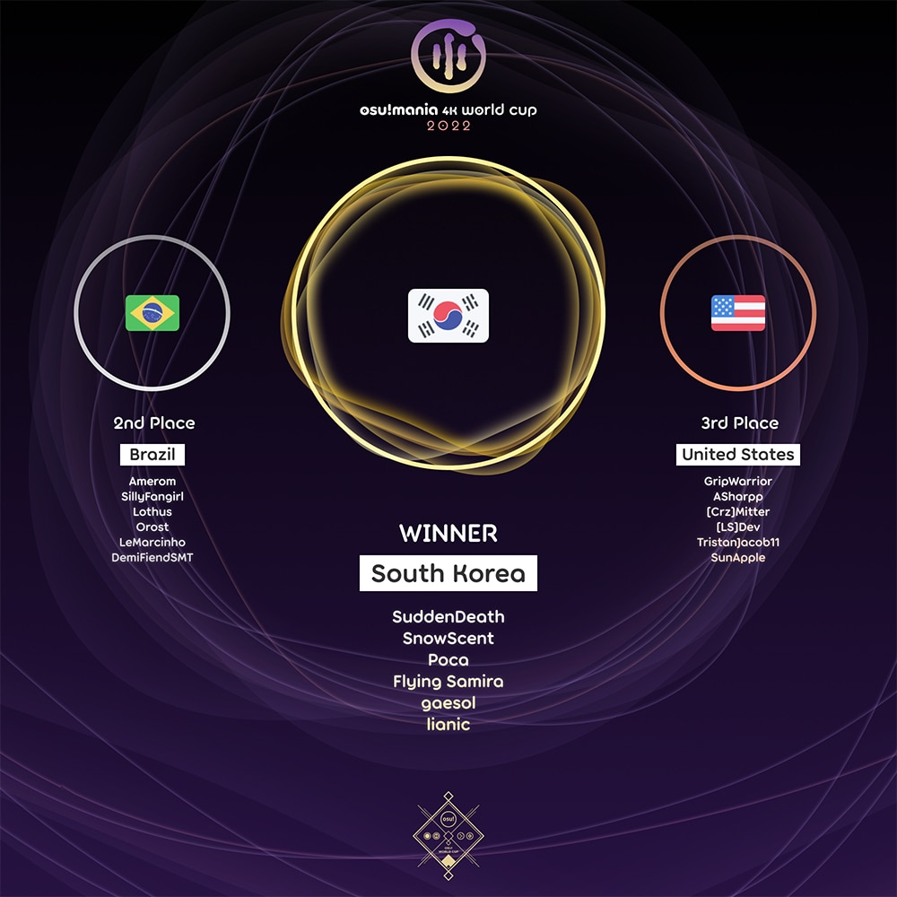

---
tags:
  - MWC2022
  - MWC 2022
  - MWC4K 2022
  - MWC 4K 2022
---

# osu!mania 4K World Cup 2022

The **osu!mania 4K World Cup 2022** (***MWC 4K 2022***) was a country-based osu!mania tournament hosted by the [osu! team](/wiki/People/osu!_team). It was the ninth instalment of the osu!mania 4K World Cup.

## Tournament schedule

| Event | Timestamp |
| --: | :-- |
| Registration phase | 2022-07-07/2022-07-21 |
| Qualifier showcase | 2022-07-30 (14:00 UTC) |
| Qualifier stage | 2022-08-06/2022-08-07 |
| Round of 32 | 2022-08-13/2022-08-14 |
| Round of 16 | 2022-08-20/2022-08-21 |
| Quarterfinals | 2022-08-27/2022-08-28 |
| Semifinals | 2022-09-03/2022-09-04 |
| Finals | 2022-09-10/2022-09-11 |
| Grand Finals | 2022-09-17/2022-09-18 |

## Prizes

The osu!mania 4K World Cup 2022 offered a minimum $2,000 cash prize pool and limited edition merch.
The prize pool was further increased to $2,166.20 from **[community donations](https://opencollective.com/osu-tournaments/events/osu-mania-world-cup-4k-6c77ec5b)**.

| Placing | Prizes |
| :-: | :-- |
|  | 48% of the prize pool, single-run merch, profile badge, **osu!mania 4K Champion** user title for one year |
|  | 32% of the prize pool, single-run merch, profile badge |
|  | 20% of the prize pool, single-run merch, profile badge |

  

## Organisation

The osu!mania 4K World Cup 2022 was run by the [osu! team](/wiki/People/osu!_team) and various community members.

| Position | Member(s) |
| :-- | :-- |
| Manager | ::{ flag=CA }:: [Azer](https://osu.ppy.sh/users/2155578), ::{ flag=US }:: [ChillierPear](https://osu.ppy.sh/users/9501251), ::{ flag=BR }:: [LeoFLT](https://osu.ppy.sh/users/3668779) |
| Mappool selector | ::{ flag=US }:: [-mint-](https://osu.ppy.sh/users/8976576), ::{ flag=US }:: [Orca-](https://osu.ppy.sh/users/7958845), ::{ flag=FR }:: [Paturages](https://osu.ppy.sh/users/1375479) |
| Mappool helper | ::{ flag=SG }:: [Abraxos](https://osu.ppy.sh/users/5025064), ::{ flag=SG }:: [aeoliancarp](https://osu.ppy.sh/users/1027529), ::{ flag=PH }:: [arccat](https://osu.ppy.sh/users/4848294), ::{ flag=CA }:: [guden](https://osu.ppy.sh/users/11626065), ::{ flag=DK }:: [Jole](https://osu.ppy.sh/users/2883132), ::{ flag=AR }:: [juankristal](https://osu.ppy.sh/users/443656), ::{ flag=US }:: [lemonguy](https://osu.ppy.sh/users/4693052), ::{ flag=US }:: [Matthia](https://osu.ppy.sh/users/19804607), ::{ flag=ID }:: [Mipha-](https://osu.ppy.sh/users/5767941), ::{ flag=TH }:: [MyZterioN-](https://osu.ppy.sh/users/8521723), ::{ flag=GB }:: [Pope Gadget](https://osu.ppy.sh/users/2288341), ::{ flag=SG }:: [Raveille](https://osu.ppy.sh/users/1388767), ::{ flag=US }:: [Toaph Daddy](https://osu.ppy.sh/users/7616811), ::{ flag=KR }:: [Transcendence](https://osu.ppy.sh/users/903155), ::{ flag=US }:: [\_Seth](https://osu.ppy.sh/users/8111953) |
| SV mapper/consultant | ::{ flag=CN }:: [AlexDunk](https://osu.ppy.sh/users/9194799), ::{ flag=PH }:: [arccat](https://osu.ppy.sh/users/4848294), ::{ flag=FR }:: [BlackyDay](https://osu.ppy.sh/users/5724831), ::{ flag=US }:: [Ciel](https://osu.ppy.sh/users/1455309), ::{ flag=NL }:: [DannyPX](https://osu.ppy.sh/users/11253722), ::{ flag=US }:: [FullCombro](https://osu.ppy.sh/users/12045149), ::{ flag=CA }:: [guden](https://osu.ppy.sh/users/11626065), ::{ flag=GB }:: [H1Pur](https://osu.ppy.sh/users/15756120), ::{ flag=BR }:: [Halo-](https://osu.ppy.sh/users/7572142), ::{ flag=KR }:: [Jakads](https://osu.ppy.sh/users/259972), ::{ flag=PH }:: [notapplicable](https://osu.ppy.sh/users/7170536), ::{ flag=US }:: [NovaSagittarii](https://osu.ppy.sh/users/11664177), ::{ flag=SG }:: [Polytetral](https://osu.ppy.sh/users/8612061), ::{ flag=TH }:: [RuleBlazing](https://osu.ppy.sh/users/7312402), ::{ flag=PH }:: [Swarmsii](https://osu.ppy.sh/users/11716111), ::{ flag=PL }:: [Tidek](https://osu.ppy.sh/users/743282), ::{ flag=CL }:: [WalterToro](https://osu.ppy.sh/users/5281416), ::{ flag=HK }:: [zero2snow](https://osu.ppy.sh/users/7751516) |
| Referee | ::{ flag=NL }:: [Albionthegreat](https://osu.ppy.sh/users/9853595), ::{ flag=AU }:: [Fairy Bread](https://osu.ppy.sh/users/8306102), ::{ flag=BR }:: [LeoFLT](https://osu.ppy.sh/users/3668779), ::{ flag=IN }:: [Speshimen](https://osu.ppy.sh/users/7720204), ::{ flag=US }:: [tigereyes144](https://osu.ppy.sh/users/6499811), ::{ flag=GB }:: [Yazzehh](https://osu.ppy.sh/users/7068973), ::{ flag=US }:: [\[K\]](https://osu.ppy.sh/users/16551387) |
| Commentator | ::{ flag=AR }:: [juankristal](https://osu.ppy.sh/users/443656), ::{ flag=ID }:: [Mipha\-](https://osu.ppy.sh/users/5767941), ::{ flag=US }:: [Orca\-](https://osu.ppy.sh/users/7958845), ::{ flag=FR }:: [Paturages](https://osu.ppy.sh/users/1375479), ::{ flag=AU }:: [PotassiumF](https://osu.ppy.sh/users/4247722), ::{ flag=SG }:: [Raveille](https://osu.ppy.sh/users/1388767), ::{ flag=PH }:: [Silhoueska Elze](https://osu.ppy.sh/users/11517895), ::{ flag=US }:: [Toaph Daddy](https://osu.ppy.sh/users/7616811), ::{ flag=US }:: [\-Sparky\-](https://osu.ppy.sh/users/3187959) |
| Statistician | ::{ flag=FI }:: [shdewz](https://osu.ppy.sh/users/10000899) |

## Links

- [Discussion thread](https://osu.ppy.sh/community/forums/topics/1606949)
- [Livestream](https://www.twitch.tv/osulive)
- [Challonge bracket](https://challonge.com/MWC4K_2022)
- [Information spreadsheet](https://docs.google.com/spreadsheets/d/e/2PACX-1vTdAyf0i9MdFrlErRntSmUDe7XigHgCwbJl1oAdN-DC6QAp5bDlEvKMpBBEs4AsKzb6hVAzD76OCq-S/pubhtml)

## Participants

|  | Country | Members |
| :-: | :-: | :-- |
| ::{ flag=AR }:: | **Argentina** | **[C90](https://osu.ppy.sh/users/13858488)**, [stoneworm](https://osu.ppy.sh/users/23410931), [Greedom](https://osu.ppy.sh/users/10696707), [EteChmess](https://osu.ppy.sh/users/16233256), [BL5 MI WAIFU](https://osu.ppy.sh/users/65724), [LeongKat](https://osu.ppy.sh/users/11429144) |
| ::{ flag=AU }:: | **Australia** | **[PotassiumF](https://osu.ppy.sh/users/4247722)**, [a1ternation](https://osu.ppy.sh/users/9828306), [FluffyGMD](https://osu.ppy.sh/users/10502251), [aiemasu](https://osu.ppy.sh/users/16954929), [nootnoot6989](https://osu.ppy.sh/users/20361901), [ruka](https://osu.ppy.sh/users/6117525) |
| ::{ flag=BE }:: | **Belgium** | **[Mortelspawn\_](https://osu.ppy.sh/users/5331420)**, [yetii](https://osu.ppy.sh/users/6914714), [flyerbram002](https://osu.ppy.sh/users/12725421), [shaafs](https://osu.ppy.sh/users/8811695) |
| ::{ flag=BR }:: | **Brazil** | **[Amerom](https://osu.ppy.sh/users/5691061)**, [SillyFangirl](https://osu.ppy.sh/users/2288363), [Lothus](https://osu.ppy.sh/users/9530019), [Orost](https://osu.ppy.sh/users/13601876), [LeMarcinho](https://osu.ppy.sh/users/13347579), [DemiFiendSMT](https://osu.ppy.sh/users/20051971) |
| ::{ flag=CA }:: | **Canada** | **[Piggy](https://osu.ppy.sh/users/5390121)**, [loafusofbread](https://osu.ppy.sh/users/9278959), [GDMem](https://osu.ppy.sh/users/10804091), [Dale940](https://osu.ppy.sh/users/13847951), [Stability](https://osu.ppy.sh/users/6701738), [svp-](https://osu.ppy.sh/users/13887380) |
| ::{ flag=CL }:: | **Chile** | **[\[GS\]Myuka](https://osu.ppy.sh/users/10072733)**, [Rhyzt\_cL](https://osu.ppy.sh/users/10235085), [Xan-](https://osu.ppy.sh/users/5919873), [Jeanne Da Rin](https://osu.ppy.sh/users/5214842), [faz\_cL](https://osu.ppy.sh/users/7853143), [niflox](https://osu.ppy.sh/users/17478713) |
| ::{ flag=CN }:: | **China** | **[\[Crz\]xz1z1z](https://osu.ppy.sh/users/10500832)**, [\[Crz\]sunnyxxy](https://osu.ppy.sh/users/10333739), [\[Crz\]Reimu](https://osu.ppy.sh/users/14318312), [\[Crz\]rebellion](https://osu.ppy.sh/users/15625432), [\[GB\]Mafufu](https://osu.ppy.sh/users/10884561), [Miyes](https://osu.ppy.sh/users/12942073) |
| ::{ flag=CO }:: | **Colombia** | **[AlexxiTo](https://osu.ppy.sh/users/16711124)**, [\[TK\]Vapo](https://osu.ppy.sh/users/19762751), [ag0](https://osu.ppy.sh/users/17989209), [D3fusion](https://osu.ppy.sh/users/12829021), [odneid](https://osu.ppy.sh/users/24361563), [sebasthefast](https://osu.ppy.sh/users/14395814) |
| ::{ flag=CZ }:: | **Czech Republic** | **[grillroasted](https://osu.ppy.sh/users/18271627)**, [Eriiyy](https://osu.ppy.sh/users/13941662), [Shakti](https://osu.ppy.sh/users/4307102), [AwakeHoppps](https://osu.ppy.sh/users/9140927), [aekoni](https://osu.ppy.sh/users/16665306) |
| ::{ flag=DO }:: | **Dominican Republic** | **[Antalf](https://osu.ppy.sh/users/8793773)**, [-Julio](https://osu.ppy.sh/users/13663757), [\[Antonio\]](https://osu.ppy.sh/users/21599285), [Soyar](https://osu.ppy.sh/users/22524841) |
| ::{ flag=EC }:: | **Ecuador** | **[-Guille](https://osu.ppy.sh/users/17497166)**, [-Kokito](https://osu.ppy.sh/users/17530958), [\[-Jona-\]](https://osu.ppy.sh/users/19727643), [JosephSMGUwU](https://osu.ppy.sh/users/26908596), [Davisss](https://osu.ppy.sh/users/9838540) |
| ::{ flag=FI }:: | **Finland** | **[Lovelyn](https://osu.ppy.sh/users/8370443)**, [Strachy](https://osu.ppy.sh/users/9663200), [Crazzeh](https://osu.ppy.sh/users/5054154), [Fisu](https://osu.ppy.sh/users/12545346), [Albania Illya](https://osu.ppy.sh/users/10393606), [Maffe](https://osu.ppy.sh/users/4773855) |
| ::{ flag=FR }:: | **France** | **[PatouZ](https://osu.ppy.sh/users/7306522)**, [Auraah](https://osu.ppy.sh/users/10015908), [pimoux](https://osu.ppy.sh/users/6183047), [MisteurFR](https://osu.ppy.sh/users/14055233), [Gray Hardrock](https://osu.ppy.sh/users/9049282), [quentin5110054](https://osu.ppy.sh/users/8756421) |
| ::{ flag=DE }:: | **Germany** | **[ERA medium kek](https://osu.ppy.sh/users/11625617)**, [Niko\_Plays](https://osu.ppy.sh/users/9409456), [jkzu123](https://osu.ppy.sh/users/15806513), [Maxim-Miau](https://osu.ppy.sh/users/12660835), [ERA Punish](https://osu.ppy.sh/users/10615367), [Cyaewin](https://osu.ppy.sh/users/10027302) |
| ::{ flag=HK }:: | **Hong Kong** | **[Quotient GD](https://osu.ppy.sh/users/11313227)**, [MegMewtwoZ](https://osu.ppy.sh/users/13235067), [osu\_degenstage5](https://osu.ppy.sh/users/11563203), [Ricizus](https://osu.ppy.sh/users/10395139), [Silkeee](https://osu.ppy.sh/users/10770925), [HolySteven](https://osu.ppy.sh/users/10502375) |
| ::{ flag=ID }:: | **Indonesia** | **[Onta\_Bekasi](https://osu.ppy.sh/users/8677684)**, [Reyi](https://osu.ppy.sh/users/13385865), [\[Albert\]](https://osu.ppy.sh/users/12689667), [adihza](https://osu.ppy.sh/users/18309106), [RetroEX](https://osu.ppy.sh/users/10540515), [\[ReyZ\]](https://osu.ppy.sh/users/16768803) |
| ::{ flag=IT }:: | **Italy** | **[Kiraz](https://osu.ppy.sh/users/3807675)**, [- Pixie -](https://osu.ppy.sh/users/13878539), [\[Crz\]Cribob](https://osu.ppy.sh/users/8485394), [\[SPNG\] Sim0](https://osu.ppy.sh/users/3262821), [Bestfast](https://osu.ppy.sh/users/11616192), [gui on mania](https://osu.ppy.sh/users/12421640) |
| ::{ flag=JP }:: | **Japan** | **[jhleetgirl](https://osu.ppy.sh/users/10745260)**, [AMDuskia1996](https://osu.ppy.sh/users/10242062), [yoppy-yugen](https://osu.ppy.sh/users/11799103), [G2t](https://osu.ppy.sh/users/15216030), [ICECAKE](https://osu.ppy.sh/users/16100800), [gyoza\_goki](https://osu.ppy.sh/users/18144664) |
| ::{ flag=MY }:: | **Malaysia** | **[cheewee10](https://osu.ppy.sh/users/4477497)**, [Neokje](https://osu.ppy.sh/users/7727987), [xxxxxx2800](https://osu.ppy.sh/users/4084853), [ERA Leon](https://osu.ppy.sh/users/13382147), [Tranxcision](https://osu.ppy.sh/users/14931745), [\[MY\]Sol](https://osu.ppy.sh/users/12054898) |
| ::{ flag=MX }:: | **Mexico** | **[Zayin -](https://osu.ppy.sh/users/13310760)**, [\[TK\]Mapxa](https://osu.ppy.sh/users/16078911), [Jennie](https://osu.ppy.sh/users/23575410), [kiuby xd](https://osu.ppy.sh/users/25120873), [Darkhechiser](https://osu.ppy.sh/users/23392961), [Temporus](https://osu.ppy.sh/users/14909850) |
| ::{ flag=NL }:: | **Netherlands** | **[2fast4you98](https://osu.ppy.sh/users/5183940)**, [Bakuretsue](https://osu.ppy.sh/users/10960533), [NightNarumi](https://osu.ppy.sh/users/4381142), [samuelhklumpers](https://osu.ppy.sh/users/10945523), [Shoira](https://osu.ppy.sh/users/13377652), [Toxic Scent](https://osu.ppy.sh/users/12599154) |
| ::{ flag=NZ }:: | **New Zealand** | **[CappK](https://osu.ppy.sh/users/16837177)**, [Robeats](https://osu.ppy.sh/users/19446399), [Worms](https://osu.ppy.sh/users/1963937), [jrny](https://osu.ppy.sh/users/11328112), [Prismal Gaming](https://osu.ppy.sh/users/25689815) |
| ::{ flag=NO }:: | **Norway** | **[\[RS\] F4st](https://osu.ppy.sh/users/7676585)**, [carpal tunnel](https://osu.ppy.sh/users/23726452), [Jawes](https://osu.ppy.sh/users/15167241), [Zekronz](https://osu.ppy.sh/users/7220725) |
| ::{ flag=PA }:: | **Panama** | **[GC2404](https://osu.ppy.sh/users/14952379)**, [Endy05](https://osu.ppy.sh/users/19859076), [xXboleloXx](https://osu.ppy.sh/users/23819962), [federicoqwq](https://osu.ppy.sh/users/24496781) |
| ::{ flag=PE }:: | **Peru** | **[\[GS\]DaZeRo5](https://osu.ppy.sh/users/6114633)**, [-Lalito898](https://osu.ppy.sh/users/15098503), [dendro\_](https://osu.ppy.sh/users/17152485), [henryalexbr](https://osu.ppy.sh/users/23528661), [Kamikho](https://osu.ppy.sh/users/12664851) |
| ::{ flag=PH }:: | **Philippines** | **[Silhoueska Elze](https://osu.ppy.sh/users/11517895)**, [bojii](https://osu.ppy.sh/users/10083439), [4Kenn](https://osu.ppy.sh/users/20496815), [Apol-](https://osu.ppy.sh/users/18466725), [Vulpsi](https://osu.ppy.sh/users/12584420), [TheMysteryL](https://osu.ppy.sh/users/14113974) |
| ::{ flag=PL }:: | **Poland** | **[SitekX](https://osu.ppy.sh/users/3840946)**, [Archaic84](https://osu.ppy.sh/users/8611177), [Eclipse-](https://osu.ppy.sh/users/8493070), [szuncoll](https://osu.ppy.sh/users/12393014), [TheFalek](https://osu.ppy.sh/users/10214260), [xHarumi](https://osu.ppy.sh/users/20372838) |
| ::{ flag=PT }:: | **Portugal** | **[Rodrig0v](https://osu.ppy.sh/users/138866)**, [\_Creamy](https://osu.ppy.sh/users/9354008), [Dioxidan](https://osu.ppy.sh/users/15458376), [NeonixWasTaken](https://osu.ppy.sh/users/11951392) |
| ::{ flag=RO }:: | **Romania** | **[lifilled](https://osu.ppy.sh/users/11711666)**, [robby250](https://osu.ppy.sh/users/2653437), [\[LS\]Khu](https://osu.ppy.sh/users/12712916), [Mich\_](https://osu.ppy.sh/users/11784492), [myja](https://osu.ppy.sh/users/7852449), [DoomRogue](https://osu.ppy.sh/users/25167958) |
| ::{ flag=RU }:: | **Russian Federation** | **[Lerck](https://osu.ppy.sh/users/10450696)**, [Nepko](https://osu.ppy.sh/users/11898245), [X\_Devil](https://osu.ppy.sh/users/6694908), [-Oni-Chan-](https://osu.ppy.sh/users/10036005), [\_lyko](https://osu.ppy.sh/users/8435430), [\[LN\]numuser](https://osu.ppy.sh/users/12585687) |
| ::{ flag=SG }:: | **Singapore** | **[Judiciousity](https://osu.ppy.sh/users/11199083)**, [-Aishiteru-](https://osu.ppy.sh/users/13390529), [upr-](https://osu.ppy.sh/users/14099962), [MrExpandion](https://osu.ppy.sh/users/12459700), [sukidayo-](https://osu.ppy.sh/users/16870002), [awdse22](https://osu.ppy.sh/users/8743513) |
| ::{ flag=KR }:: | **South Korea** | **[SuddenDeath](https://osu.ppy.sh/users/6699923)**, [SnowScent](https://osu.ppy.sh/users/7945868), [Poca](https://osu.ppy.sh/users/8581031), [Flying Samira](https://osu.ppy.sh/users/10329095), [gaesol](https://osu.ppy.sh/users/12452131), [lianic](https://osu.ppy.sh/users/13975661) |
| ::{ flag=ES }:: | **Spain** | **[Quenlla](https://osu.ppy.sh/users/4725379)**, [CrewK fanboy](https://osu.ppy.sh/users/7860283), [ERA Guldakh](https://osu.ppy.sh/users/8553078), [LittleDemonRiri](https://osu.ppy.sh/users/15114039), [itsdarious555](https://osu.ppy.sh/users/6809566), [Enthalpy](https://osu.ppy.sh/users/9552883) |
| ::{ flag=SE }:: | **Sweden** | **[Emik](https://osu.ppy.sh/users/3350987)**, [diamondBIaze](https://osu.ppy.sh/users/10553827), [SebbeBest](https://osu.ppy.sh/users/18272334), [NeonDrakon](https://osu.ppy.sh/users/6315000) |
| ::{ flag=TW }:: | **Taiwan** | **[Joylintp](https://osu.ppy.sh/users/13579078)**, [\[-NEinO-\]](https://osu.ppy.sh/users/8630038), [\[Paw\]Shiro](https://osu.ppy.sh/users/15096556), [MAR1SA](https://osu.ppy.sh/users/12296460), [tommy125](https://osu.ppy.sh/users/15189878), [yaya901609](https://osu.ppy.sh/users/15317574) |
| ::{ flag=TH }:: | **Thailand** | **[HowToPlayLN](https://osu.ppy.sh/users/10879600)**, [MIkuaimbot](https://osu.ppy.sh/users/17699745), [banan](https://osu.ppy.sh/users/16011592), [--Pavin--](https://osu.ppy.sh/users/12046267), [konkawe](https://osu.ppy.sh/users/15665805), [AomDCO](https://osu.ppy.sh/users/21072569) |
| ::{ flag=TR }:: | **Turkey** | **[Ayhan2005](https://osu.ppy.sh/users/6419257)**, [KabizEjderha](https://osu.ppy.sh/users/16348899), [0nebreath123](https://osu.ppy.sh/users/17768039), [NESSOSU](https://osu.ppy.sh/users/13360698), [NLWasTaken](https://osu.ppy.sh/users/19965357) |
| ::{ flag=UA }:: | **Ukraine** | **[LonBertZend](https://osu.ppy.sh/users/10484445)**, [Not Who You Are](https://osu.ppy.sh/users/7762366), [Babylkaa](https://osu.ppy.sh/users/11943363), [Shailexi](https://osu.ppy.sh/users/11375371) |
| ::{ flag=GB }:: | **United Kingdom** | **[Eliminate](https://osu.ppy.sh/users/9169747)**, [Amascite](https://osu.ppy.sh/users/3359035), [syaro-](https://osu.ppy.sh/users/15716021), [TingMomentum](https://osu.ppy.sh/users/12489832), [XxNewson1234xX](https://osu.ppy.sh/users/9895650), [Zoobin4](https://osu.ppy.sh/users/10055204) |
| ::{ flag=US }:: | **United States** | **[GripWarrior](https://osu.ppy.sh/users/11734610)**, [ASharpp](https://osu.ppy.sh/users/12657177), [\[Crz\]Mitter](https://osu.ppy.sh/users/14551764), [\[LS\]Dev](https://osu.ppy.sh/users/16407268), [TristanJacob11](https://osu.ppy.sh/users/11817838), [SunApple](https://osu.ppy.sh/users/11817622) |
| ::{ flag=VE }:: | **Venezuela** | **[Edvo](https://osu.ppy.sh/users/8301758)**, [xXShyzDy0133Xx](https://osu.ppy.sh/users/13545528), [calvingarrix666](https://osu.ppy.sh/users/17881051), [YuyukoFangirl](https://osu.ppy.sh/users/10336332) |
| ::{ flag=VN }:: | **Vietnam** | **[Lott](https://osu.ppy.sh/users/13821222)**, [magnifestio](https://osu.ppy.sh/users/22725724), [CPT\_Sivelia](https://osu.ppy.sh/users/12562107), [TriDoanGaming](https://osu.ppy.sh/users/14009758), [Micleak](https://osu.ppy.sh/users/16140674), [Frostleaf](https://osu.ppy.sh/users/11863174) |

## Podium

## Mappools

### Grand Finals

**[Download the mappack here (255 MB)](https://drive.google.com/uc?id=1u3bkuMAFzlcOYTvLTTHxt1XNGV28dutw)**

- Rice
  1. [Luze - Love Song \[Black Dorna\] (Valedict) \[Heartfelt 1.1x (382bpm)\]](https://osu.ppy.sh/beatmapsets/1796541#mania/3763263)
  2. [Falcom Sound Team jdk - Crimson Fighter (lemonguy) \[Adol The Red x1.1\]](https://osu.ppy.sh/beatmapsets/1791533#mania/3671281)
  3. [Ariabl'eyeS - Sougetsu Oratorio (\[Crz\]Rachel) \[Eclipse x1.05\]](https://osu.ppy.sh/beatmapsets/842131#mania/1762209)
  4. [Yuta Imai Vs. BEMANI Sound Team "L.E.D.-G" - THE PEERLESS UNDER HEAVEN (Mipha-) \[MIPHATHER\]](https://osu.ppy.sh/beatmapsets/1829143#mania/3756153)
  5. [Camellia - Xeroa (Shoegazer) \[Harbinger 1.15x (346bpm)\]](https://osu.ppy.sh/beatmapsets/1716930#mania/3513548)
  6. [xi - PEACE BREAKER (0DZ0) \[WIDOWMAKER 1.1x (176bpm)\]](https://osu.ppy.sh/beatmapsets/1842152#mania/3783809)
  7. [Terminal 11 - Fury (Pizza69) \[Extreme 1.05x (205bpm)\]](https://osu.ppy.sh/beatmapsets/1632108#mania/3331564)
- Hybrid
  1. [Silentroom - XHRONOXAPSULE (-mint-) \[XHRONOMALY 1.05x (291bpm)\]](https://osu.ppy.sh/beatmapsets/1846505#mania/3793096)
  2. [katagiri - Angel's Salad (lemonguy) \[Challenge x1.1\]](https://osu.ppy.sh/beatmapsets/1757208#mania/3595933)
  3. [void (Mournfinale) feat. Hoshikuma Minami - Testify (Abraxos) \[Who controls the present now?\]](https://osu.ppy.sh/beatmapsets/1845408#mania/3790784)
- LN
  1. [Nanahoshi Kangengakudan - No.39 (juankristal) \[t!m!ng h#ll\]](https://osu.ppy.sh/beatmapsets/1846256#mania/3792661)
  2. [nmk - Celestial Axes (\[Crz\]Crysarlene) \[Amaranthine \[1.05x Rate\]\]](https://osu.ppy.sh/beatmapsets/1772725#mania/3629447)
  3. [Hatsuki Yura - Black Princess (lemonguy) \[LN Master x1.15\]](https://osu.ppy.sh/beatmapsets/1810053#mania/3792636)
  4. [Camellia - Blackmagik Blazing (-mint-) \[The Sorcerer's Apprentice\]](https://osu.ppy.sh/beatmapsets/1755294#mania/3592063)
- SV
  1. [Camellia - AttraqtiA (Orca-) \[Spacial Scission\]](https://osu.ppy.sh/beatmapsets/1846614#mania/3793332)
  2. [Laur - Symphony Op.1 -CHAOS- (Tidek) \[1-500-8000\]](https://osu.ppy.sh/beatmapsets/1846644#mania/3793380)
- Tiebreaker
  1. **[aa...hisuichazuke... - steganography (-mint-) \[Cipher Encryption\]](https://osu.ppy.sh/beatmapsets/1846639#mania/3793375)**

### Finals

**[Download the mappack here (192 MB)](https://drive.google.com/uc?id=133biyrKvw-ZMI54M2ukM3aFQT9TwK-n3)**

- Rice
  1. [HOWL BE QUIET - Wake We Up (Guilhermeziat) \[Skwid's Challenge\]](https://osu.ppy.sh/beatmapsets/1443429#mania/2969170)
  2. [Camellia - Venomous Firefly (-mint-) \[Insecticide 1.05x (277bpm)\]](https://osu.ppy.sh/beatmapsets/1840749#mania/3780755)
  3. [DJ SHARPNEL - Magic Cycles (Shoegazer) \[Eternal 1.35x (265bpm)\]](https://osu.ppy.sh/beatmapsets/1449692#mania/2997885)
  4. [BEMANI Sound Team "L.E.D. VS. L.E.D.-G" - KILL EACH OTHER (stupud man) \[RING OF DESTRUCTION\]](https://osu.ppy.sh/beatmapsets/1412098#mania/3081803)
  5. [Underoath - Writing On The Walls (Final Sketch Remix) (Shoegazer) \[Memory 1.4x (282bpm)\]](https://osu.ppy.sh/beatmapsets/1210223#mania/3099595)
  6. [DEV/NULL - Real Ultimate Power (Pizza69) \[Extra 1.05x (231bpm)\]](https://osu.ppy.sh/beatmapsets/1822741#mania/3740273)
  7. [Converge - Reap What You Sow (Pope Gadget) \[1.05\]](https://osu.ppy.sh/beatmapsets/1828397#mania/3782697)
- Hybrid
  1. [uraboroshi - Retrospective Arabesque (\[Crz\]FolAH1217) \[Symmetric x1.15\]](https://osu.ppy.sh/beatmapsets/1741640#mania/3781997)
  2. [Camellia feat. Nana Takahashi - Mushi no Sumu Tokoro -Ugomeki wa nao fukamaru- (-mint-) \[Formication (cut)\]](https://osu.ppy.sh/beatmapsets/1800811#mania/3691933)
  3. [TJ.hangneil - Apollo (lemonguy) \[Confidential\]](https://osu.ppy.sh/beatmapsets/1663547#mania/3395931)
- LN
  1. [youman feat. GUMI - R.I.P. (MyZterioN-) \[cacophony 1.05x (284bpm)\]](https://osu.ppy.sh/beatmapsets/1712790#mania/3629312)
  2. [SUi - planetarium (MyZterioN-) \[pieerre's Plain LN (edit) 1.2x\]](https://osu.ppy.sh/beatmapsets/1841635#mania/3782644)
  3. [xi - Elemental Creation -xiRemix- (guden) \[Odin\]](https://osu.ppy.sh/beatmapsets/1753464#mania/3588365)
  4. [JAKAZiD - Slaughta (lemonguy) \[chalLeNge x1.1\]](https://osu.ppy.sh/beatmapsets/1747998#mania/3575493)
- SV
  1. [\_yi. - my culture (Cut Ver.) (Paturages) \[Millenial\]](https://osu.ppy.sh/beatmapsets/1842662#mania/3784864)
  2. [Laur - DANGEROOOOUS JUNGLE (Ciel) \[oh my dog\]](https://osu.ppy.sh/beatmapsets/1842680#mania/3784896)
- Tiebreaker
  1. **[Camellia - TremENDouS (-mint-) \[Intergalactic\]](https://osu.ppy.sh/beatmapsets/1842682#mania/3784899)**

### Semifinals

**[Download the mappack here (209 MB)](https://drive.google.com/uc?id=1InFtk7TcUpKeHMPGTnHfbPfwrGYiIGWr)**

- Rice
  1. [Dunderpatrullen & Meganeko - JENOVA (Jole) \[N e w \_ G O D\]](https://osu.ppy.sh/beatmapsets/1800440#mania/3691151)
  2. [USAO - Cthugha (Toaph Daddy) \[Solar Flare x1.25\]](https://osu.ppy.sh/beatmapsets/1835426#mania/3773378)
  3. [Falcom Sound Team jdk - Formidable Enemy (lemonguy) \[Nightmare x1.1\]](https://osu.ppy.sh/beatmapsets/1589255#mania/3246090)
  4. [Anegasaki Nei - ZENITHALIZE (Mipha-) \[MIPHATHER\]](https://osu.ppy.sh/beatmapsets/1744633#mania/3762012)
  5. [Kurorak - OWA Raged in Vegas (Fuck Bees) (hi19hi19) \[PLAY FN ON MIRROR ITS SO MUCH EAS 1.05x (244bpm)\]](https://osu.ppy.sh/beatmapsets/1671141#mania/3413311)
  6. [Smiley - Delirium (Shoegazer) \[Euphoria 1.1x (179bpm)\]](https://osu.ppy.sh/beatmapsets/1798699#mania/3687245)
  7. [Terminal 11 - Counter Clockwise Chant Pattern (Phil) \[Timebomb 1.1x (155bpm)\]](https://osu.ppy.sh/beatmapsets/659039#mania/3182136)
- Hybrid
  1. [Otsukisama Koukyoukyoku - ultima Thule (guden) \[Penultimas\]](https://osu.ppy.sh/beatmapsets/1837019#mania/3771938)
  2. [Apo11o"TSUKUYOMI INOCHI"program vs. NeLiME OVERDRIVE - Re:VeLATiON Koudou to Hakai no Soushiro Tsubasa (Tidek) \[Destruction \[1,2x Rate\]\]](https://osu.ppy.sh/beatmapsets/1374143#mania/3566181)
  3. [JAKAZiD - Party Starter (Cut Version) (lemonguy) \[Encore\]](https://osu.ppy.sh/beatmapsets/1835488#mania/3768379)
- LN
  1. [Hachiya Nanashi - Secret Sleuth (Raveille) \[Shamus\]](https://osu.ppy.sh/beatmapsets/1837336#mania/3772572)
  2. [katagiri - #2wise4u (\_Seth) \[YuEast 2018's #1.00density4u (edit)\]](https://osu.ppy.sh/beatmapsets/1837745#mania/3773546)
  3. [Tonari no niwa wa aoi (Niwashi+Aoi) - Xb10r (-mint-) \[EXCEED 1.05x (210bpm)\]](https://osu.ppy.sh/beatmapsets/1769016#mania/3772727)
  4. [An - Encryption (Davvy) \[Enigmatic\]](https://osu.ppy.sh/beatmapsets/1298002#mania/2692515)
- SV
  1. [Smigonaut - Shower Beer (Tidek) \[Shower Thought\]](https://osu.ppy.sh/beatmapsets/1838003#mania/3774021)
  2. [Barely Alive & Eliminate - Crankin (arccat) \[Myocardial Infarction\]](https://osu.ppy.sh/beatmapsets/1838002#mania/3774040)
- Tiebreaker
  1. **[ReeK - Multigenre Smackdown (-mint-) \[Vine Boom Sound Effect (bass boosted)\]](https://osu.ppy.sh/beatmapsets/1836713#mania/3771148)**

### Quarterfinals

**[Download the mappack here (177 MB)](https://drive.google.com/uc?id=1kU3RpgoWhhgDKCyh6RVwh4aGiOeTOgki)**

- Rice
  1. [w\_tre - FIONA (Mipha-) \[Carefree 1.05x (157bpm)\]](https://osu.ppy.sh/beatmapsets/1832244#mania/3760958)
  2. [Rairyu - ra'am (-mint-) \[mint vs. hana's Kriemhild Gretchen 1.1x (244bpm)\]](https://osu.ppy.sh/beatmapsets/1832490#mania/3761569)
  3. [BlackY - N/P ADDiCTiON (Valedict) \[OVERDOSE 1.15x\]](https://osu.ppy.sh/beatmapsets/1816308#mania/3763133)
  4. [Tess - Justify My Love (Halogen-) \[Heartbroken\]](https://osu.ppy.sh/beatmapsets/1742468#mania/3562095)
  5. [Kabocha - EgO (Shoegazer) \[Transference 1.15x (271bpm)\]](https://osu.ppy.sh/beatmapsets/1667855#mania/3760854)
  6. [BEMANI Sound Team 'Sota Fujimori' - Breakin' Rules (AutotelicBrown) \[Alice's Probation 1.1x\]](https://osu.ppy.sh/beatmapsets/1413427#mania/3756481)
- Hybrid
  1. [MisoilePunch \~pan soe\~ - MeTear'n TruX (fvrex) \[guden's L'ythlinn\]](https://osu.ppy.sh/beatmapsets/1708332#mania/3605484)
  2. [Zekk - SUMMER (MyZterioN-) \[leisure 1.05x (184bpm)\]](https://osu.ppy.sh/beatmapsets/1833309#mania/3763660)
  3. [Camellia - Azure Vixen (-mint-) \[Arbitrator\]](https://osu.ppy.sh/beatmapsets/1831220#mania/3758841)
- LN
  1. [Chinozo - Peta Peta (MyZterioN-) \[yeeaahhhhhhhhhhh 1.05x\]](https://osu.ppy.sh/beatmapsets/1833067#mania/3763144)
  2. [penoreri - Desperado Waltz (guden) \[Skogarmaor\]](https://osu.ppy.sh/beatmapsets/1743589#mania/3564434)
  3. [ETIA. - Daisycutter (lemonguy) \[Firestorm x1.1\]](https://osu.ppy.sh/beatmapsets/1307846#mania/3117228)
- SV
  1. [nitro - \[line:zeta\] (AlexDunk) \[:rockthisbase:\]](https://osu.ppy.sh/beatmapsets/1833518#mania/3764152)
  2. [LeaF - MARENOL (notapplicable) \[OVERDOSE\]](https://osu.ppy.sh/beatmapsets/1833541#mania/3764191)
- Tiebreaker
  1. **[Camellia - Qyoh (Nine Stars) (guden) \[guden vs. mint's Luminosity\]](https://osu.ppy.sh/beatmapsets/1833301#mania/3763646)**

### Round of 16

**[Download the mappack here (165 MB)](https://drive.google.com/u/0/uc?id=16MT6Ott0ZElqFoqPGVJqSLX33pCSJHf_)**

- Rice
  1. [E-Type - Set The World On Fire (Sped Up Ver.) (Jole) \[this is fine\]](https://osu.ppy.sh/beatmapsets/1456779#mania/3435284)
  2. [Yuaru - Streaming Heart (hna) \[Ubiquity 1.1x (231bpm)\]](https://osu.ppy.sh/beatmapsets/1716737#mania/3508135)
  3. [Spongebob Squarewave - Free L-Town (-mint-) \[PEANUT BUTTER JELLY 1.1x (220BPM)\]](https://osu.ppy.sh/beatmapsets/1781753#mania/3648794)
  4. [Se-U-Ra - Traveler \~Stand Aloof\~ (aeoliancarp) \[Distances \[1.1x\]\]](https://osu.ppy.sh/beatmapsets/1414239#mania/3005987)
  5. [August Burns Red - Rationalist (Shoegazer) \[Dissonance 1.15x (247bpm)\]](https://osu.ppy.sh/beatmapsets/1606988#mania/3734253)
  6. [xi - Double Helix (Mipha-) \[bmah's Challenge 1.05x (164bpm)\]](https://osu.ppy.sh/beatmapsets/1828626#mania/3753063)
- Hybrid
  1. [MisomyL feat. Haxchi - Atashi no Juuoumujin Chou Jiyuu Yuugiki Sekai Keikaku (Murumoo) \[guden's Extra\]](https://osu.ppy.sh/beatmapsets/1709691#mania/3714248)
  2. [AAAA vs. Morimori Atsushi - Xrocus (Cut Ver.) (-mint-) \[Xrimson\]](https://osu.ppy.sh/beatmapsets/1825537#mania/3746373)
  3. [xi - Angel's Ladder (Toaph Daddy) \[Insane x1.05\]](https://osu.ppy.sh/beatmapsets/1768657#mania/3750393)
- LN
  1. [Hommarju - slluuddggee (CrewK) \[hedoro\]](https://osu.ppy.sh/beatmapsets/1671903#mania/3414825)
  2. [DJ TOTTO - DORNWALD \~Junge\~ (arccat) \[stupud man's Anima 1.1x (edit)\]](https://osu.ppy.sh/beatmapsets/1828596#mania/3752979)
  3. [Toromaru - Formless Canvas (-mint-) \[Abstract\]](https://osu.ppy.sh/beatmapsets/1796612#mania/3682794)
- SV
  1. [Yooh - Butterfly Twist (Extended Mix) (Cut Ver.) (notapplicable) \[Cosmic\]](https://osu.ppy.sh/beatmapsets/1828593#mania/3752972)
  2. [siqlo - Me & U (zero2snow) \[Bilateral (SV)\]](https://osu.ppy.sh/beatmapsets/1828601#mania/3752992)
- Tiebreaker
  1. **[Camellia - Dyscontrolled Galaxy ("Apoptosis" Long ver.) (Toaph Daddy) \[Collapse\]](https://osu.ppy.sh/beatmapsets/1738595#mania/3553471)**

### Round of 32

**[Download the mappack here (103 MB)](https://drive.google.com/u/0/uc?id=1-2h7e2iKFWQnQbFqfY4-ltlzUsygpoSO)**

- Rice
  1. [Reol - Asymmetry (Cut Ver.) (-mint-) \[Disparity\]](https://osu.ppy.sh/beatmapsets/1817007#mania/3727610)
  2. [WALKUERE - Ikenai Borderline (Speed Up Ver.) (-mint-) \[Can I get a Large Wintermelon Drink 1.15x (222bpm)\]](https://osu.ppy.sh/beatmapsets/1802034#mania/3695172)
  3. [Renard - Gai Runs at 300KM/h (feat. Adraen) (Phil) \[Chasing Cars\]](https://osu.ppy.sh/beatmapsets/1510469#mania/3291841)
  4. [The Flashbulb - Black Lawn Finale (Shoegazer) \[Restoration 1.3x (237bpm)\]](https://osu.ppy.sh/beatmapsets/1573293#mania/3348891)
  5. [EmoCosine - Cutter (aeoliancarp) \[fast snip snip \[1.1x\]\]](https://osu.ppy.sh/beatmapsets/1587416#mania/3242036)
- Hybrid
  1. [Se-U-Ra - QSHELL -Kyoshoku no Shell- (guden) \[Atrophic\]](https://osu.ppy.sh/beatmapsets/1822586#mania/3739900)
  2. [ck - Souhait bleu (arpia97) \[Blessing (edit)\]](https://osu.ppy.sh/beatmapsets/1507111#mania/3734906)
- LN
  1. [An - Axeria (\[Crz\]Crysarlene) \[Stage 3: Luminous\]](https://osu.ppy.sh/beatmapsets/1349415#mania/2793968)
  2. [Galderia - Almagest (stupud man) \[Constellar\]](https://osu.ppy.sh/beatmapsets/1739656#mania/3555653)
  3. [Red Velvet - Feel My Rhythm (fvrex) \[Celebration\]](https://osu.ppy.sh/beatmapsets/1724966#mania/3525373)
- SV
  1. [Tanger - FireStarter (H1Pur) \[Strike A Match\]](https://osu.ppy.sh/beatmapsets/1823962#mania/3742642)
  2. [linear ring with RNAcid - Gypsophila (NovaSagittarii) \[carnation\]](https://osu.ppy.sh/beatmapsets/1823945#mania/3742608)
- Tiebreaker
  1. **[USAO - Big Daddy (Toaph Daddy) \[Rapture\]](https://osu.ppy.sh/beatmapsets/1822992#mania/3740717)**

### Qualifiers

**[Download the mappack here (44 MB)](https://drive.google.com/uc?id=1pl-xdoKFMPFjOS73vZxjWvIkANpj8kxn)**

1. [EmoCosine - This Club is Not 4 U (short ver.) (RuleBlazing) \[Stage 1: Gatekeep\]](https://osu.ppy.sh/beatmapsets/1817977#mania/3729870)
2. [Frums - parvorbital (-mint-) \[Stage 2: Perihelion\]](https://osu.ppy.sh/beatmapsets/1818001#mania/3729916)
3. [nonuplet - Chaos:Q (guden) \[Stage 3: Entropic\]](https://osu.ppy.sh/beatmapsets/1817981#mania/3729877)
4. [Sephid - Critical Cannonball (Raveille) \[Stage 4: Catastrophe\]](https://osu.ppy.sh/beatmapsets/1818120#mania/3730147)
5. [penoreri - Reverenced Flower (Toaph Daddy) \[Stage 5: Lotus\]](https://osu.ppy.sh/beatmapsets/1817988#mania/3729893)
6. [Hino Isuka - Wonderful Paradise (lemonguy) \[Stage 6: Utopia\]](https://osu.ppy.sh/beatmapsets/1818125#mania/3730163)
7. [breakchild - nachmancore (Cut Ver.) (-mint-) \[Stage 7: konatacore\]](https://osu.ppy.sh/beatmapsets/1818002#mania/3729917)
8. [xi - The End of Dreams (Sped Up Ver.) (aeoliancarp) \[Stage 8: Dawn\]](https://osu.ppy.sh/beatmapsets/1817980#mania/3729876)

## Match results

### Grand Finals

Detailed statistics for this round can be found [here](https://docs.google.com/spreadsheets/d/1DIugIVhdsx0mY6PdNkm0NRojdYMyKWeUqrEtLsvdx70).

Sunday, 18 September 2022:

| Team A |  |  | Team B | Match link |
| --: | :-: | :-: | :-- | :-- |
| **South Korea** ::{ flag=KR }:: | **7** | 6 | ::{ flag=US }:: United States | [#1](https://osu.ppy.sh/community/matches/103862590) |
| Brazil ::{ flag=BR }:: | 6 | **7** | ::{ flag=KR }:: **South Korea** | [#1](https://osu.ppy.sh/community/matches/103872600) |
| **South Korea** ::{ flag=KR }:: | **7** | 3 | ::{ flag=BR }:: Brazil | [#1](https://osu.ppy.sh/community/matches/103874849) |

### Finals

Detailed statistics for this round can be found [here](https://docs.google.com/spreadsheets/d/1I5_Jd33hAH0yJRju9Tuoz3aqlQQFmrAz7nSIUND7EWs).

Saturday, 10 September 2022:

| Team A |  |  | Team B | Match link |
| --: | :-: | :-: | :-- | :-- |
| **Philippines** ::{ flag=PH }:: | **7** | 1 | ::{ flag=JP }:: Japan | [#1](https://osu.ppy.sh/community/matches/103688295) |
| Malaysia ::{ flag=MY }:: | 5 | **7** | ::{ flag=US }:: **United States** | [#1](https://osu.ppy.sh/community/matches/103692295) |

Sunday, 11 September 2022:

| Team A |  |  | Team B | Match link |
| --: | :-: | :-: | :-- | :-- |
| Philippines ::{ flag=PH }:: | 4 | **7** | ::{ flag=US }:: **United States** | [#1](https://osu.ppy.sh/community/matches/103709077) |
| **Brazil** ::{ flag=BR }:: | **7** | 5 | ::{ flag=KR }:: South Korea | [#1](https://osu.ppy.sh/community/matches/103719158) |

### Semifinals

Detailed statistics for this round can be found [here](https://docs.google.com/spreadsheets/d/1YU69AF6J2TVkFxu3Jv9x0uanXRcXFT9Njh2ezPhZE-0).

Saturday, 3 September 2022:

| Team A |  |  | Team B | Match link |
| --: | :-: | :-: | :-- | :-- |
| **Japan** ::{ flag=JP }:: | **7** | 3 | ::{ flag=SG }:: Singapore | [#1](https://osu.ppy.sh/community/matches/103533339) |
| **United Kingdom** ::{ flag=GB }:: | **7** | 5 | ::{ flag=ID }:: Indonesia | [#1](https://osu.ppy.sh/community/matches/103533332) |
| Thailand ::{ flag=TH }:: | 6 | **7** | ::{ flag=CN }:: **China** | [#1](https://osu.ppy.sh/community/matches/103537005) |

Sunday, 4 September 2022:

| Team A |  |  | Team B | Match link |
| --: | :-: | :-: | :-- | :-- |
| **United States** ::{ flag=US }:: | **7** | 3 | ::{ flag=VN }:: Vietnam | [#1](https://osu.ppy.sh/community/matches/103553625) |
| Philippines ::{ flag=PH }:: | 6 | **7** | ::{ flag=KR }:: **South Korea** | [#1](https://osu.ppy.sh/community/matches/103557749) |
| **Japan** ::{ flag=JP }:: | **7** | 4 | ::{ flag=CN }:: China | [#1](https://osu.ppy.sh/community/matches/103561228) |
| **Brazil** ::{ flag=BR }:: | **7** | 4 | ::{ flag=MY }:: Malaysia | [#1](https://osu.ppy.sh/community/matches/103563299) |
| **United States** ::{ flag=US }:: | **7** | 4 | ::{ flag=GB }:: United Kingdom | [#1](https://osu.ppy.sh/community/matches/103568878) |

### Quarterfinals

Detailed statistics for this round can be found [here](https://docs.google.com/spreadsheets/d/13k3EtGT2sGlgg6UekWuycq86tF0KGvapvEXayPgp138).

Saturday, 27 August 2022:

| Team A |  |  | Team B | Match link |
| --: | :-: | :-: | :-- | :-- |
| **Indonesia** ::{ flag=ID }:: | **6** | 4 | ::{ flag=HK }:: Hong Kong | [#1](https://osu.ppy.sh/community/matches/103370624) |
| **France** ::{ flag=FR }:: | **6** | 2 | ::{ flag=NL }:: Netherlands | [#1](https://osu.ppy.sh/community/matches/103370610) |
| **China** ::{ flag=CN }:: | **6** | 4 | ::{ flag=DE }:: Germany | [#1](https://osu.ppy.sh/community/matches/103370629) |
| **Brazil** ::{ flag=BR }:: | **6** | 0 | ::{ flag=TH }:: Thailand | [#1](https://osu.ppy.sh/community/matches/103370732) |
| **Vietnam** ::{ flag=VN }:: | **6** | 1 | ::{ flag=AR }:: Argentina | [#1](https://osu.ppy.sh/community/matches/103371983) |
| **Canada** ::{ flag=CA }:: | **6** | 0 | ::{ flag=IT }:: Italy | [#1](https://osu.ppy.sh/community/matches/103373358) |
| **Singapore** ::{ flag=SG }:: | **6** | 0 | ::{ flag=ES }:: Spain | [#1](https://osu.ppy.sh/community/matches/103373387) |
| **Peru** ::{ flag=PE }:: | **6** | 1 | ::{ flag=RU }:: Russian Federation | [#1](https://osu.ppy.sh/community/matches/103374963) |

Sunday, 28 August 2022:

| Team A |  |  | Team B | Match link |
| --: | :-: | :-: | :-- | :-- |
| **Chile** ::{ flag=CL }:: | **6** | 0 | ::{ flag=AU }:: Australia | [#1](https://osu.ppy.sh/community/matches/103387139) |
| **Singapore** ::{ flag=SG }:: | **6** | 1 | ::{ flag=CA }:: Canada | [#1](https://osu.ppy.sh/community/matches/103388112) |
| **South Korea** ::{ flag=KR }:: | **6** | 4 | ::{ flag=US }:: United States | [#1](https://osu.ppy.sh/community/matches/103388108) |
| **Malaysia** ::{ flag=MY }:: | **6** | 2 | ::{ flag=JP }:: Japan | [#1](https://osu.ppy.sh/community/matches/103391452) |
| **Vietnam** ::{ flag=VN }:: | **6** | 1 | ::{ flag=FR }:: France | [#1](https://osu.ppy.sh/community/matches/103395740) |
| **Philippines** ::{ flag=PH }:: | **6** | 4 | ::{ flag=GB }:: United Kingdom | [#1](https://osu.ppy.sh/community/matches/103395663) |
| **Indonesia** ::{ flag=ID }:: | **6** | 3 | ::{ flag=CL }:: Chile | [#1](https://osu.ppy.sh/community/matches/103398089) |
| **China** ::{ flag=CN }:: | **6** | 3 | ::{ flag=PE }:: Peru | [#1](https://osu.ppy.sh/community/matches/103398757) |

### Round of 16

Detailed statistics for this round can be found [here](https://docs.google.com/spreadsheets/d/18esARmoc2V9TITiycFcQz-JZsy5I1rKzOaHCYq99c68).

Saturday, 21 August 2022:

| Team A |  |  | Team B | Match link |
| --: | :-: | :-: | :-- | :-- |
| Sweden ::{ flag=SE }:: | -1 | **0** | ::{ flag=IT }:: **Italy** | *win by default* |
| **Thailand** ::{ flag=TH }:: | **6** | 0 | ::{ flag=ID }:: Indonesia | [#1](https://osu.ppy.sh/community/matches/103205446) |
| Romania ::{ flag=RO }:: | 2 | **6** | ::{ flag=NL }:: **Netherlands** | [#1](https://osu.ppy.sh/community/matches/103206240) |
| Norway ::{ flag=NO }:: | 1 | **6** | ::{ flag=ES }:: **Spain** | [#1](https://osu.ppy.sh/community/matches/103210480) |
| **Brazil** ::{ flag=BR }:: | **6** | 0 | ::{ flag=CL }:: Chile | [#1](https://osu.ppy.sh/community/matches/103217369) |

Sunday, 21 August 2022:

| Team A |  |  | Team B | Match link |
| --: | :-: | :-: | :-- | :-- |
| New Zealand ::{ flag=NZ }:: | 0 | **6** | ::{ flag=AR }:: **Argentina** | [#1](https://osu.ppy.sh/community/matches/103220439) |
| Singapore ::{ flag=SG }:: | 5 | **6** | ::{ flag=US }:: **United States** | [#1](https://osu.ppy.sh/community/matches/103222531) |
| **Philippines** ::{ flag=PH }:: | **6** | 0 | ::{ flag=PE }:: Peru | [#1](https://osu.ppy.sh/community/matches/103223399) |
| **South Korea** ::{ flag=KR }:: | **6** | 3 | ::{ flag=CA }:: Canada | [#1](https://osu.ppy.sh/community/matches/103223509) |
| Poland ::{ flag=PL }:: | 0 | **6** | ::{ flag=AU }:: **Australia** | [#1](https://osu.ppy.sh/community/matches/103228045) |
| **Malaysia** ::{ flag=MY }:: | **6** | 1 | ::{ flag=FR }:: France | [#1](https://osu.ppy.sh/community/matches/103228244) |
| **Japan** ::{ flag=JP }:: | **6** | 5 | ::{ flag=VN }:: Vietnam | [#1](https://osu.ppy.sh/community/matches/103228273) |
| **United Kingdom** ::{ flag=GB }:: | **6** | 3 | ::{ flag=CN }:: China | [#1](https://osu.ppy.sh/community/matches/103230145) |
| Finland ::{ flag=FI }:: | 5 | **6** | ::{ flag=RU }:: **Russian Federation** | [#1](https://osu.ppy.sh/community/matches/103232739) |
| Taiwan ::{ flag=TW }:: | 0 | **6** | ::{ flag=HK }:: **Hong Kong** | [#1](https://osu.ppy.sh/community/matches/103234107) |
| Czech Republic ::{ flag=CZ }:: | 0 | **6** | ::{ flag=DE }:: **Germany** | [#1](https://osu.ppy.sh/community/matches/103236745) |

### Round of 32

Detailed statistics for this round can be found [here](https://docs.google.com/spreadsheets/d/1ODtFL2MlIq8juSsyzUy6FB0zcc7Rnlhv9LIIgkDIu0s).

Saturday, 13 August 2022:

| Team A |  |  | Team B | Match link |
| --: | :-: | :-: | :-- | :-- |
| **Japan** ::{ flag=JP }:: | **5** | 0 | ::{ flag=FI }:: Finland | [#1](https://osu.ppy.sh/community/matches/103034679) |
| **Singapore** ::{ flag=SG }:: | **5** | 0 | ::{ flag=PL }:: Poland | [#1](https://osu.ppy.sh/community/matches/103034704) |
| **Thailand** ::{ flag=TH }:: | **5** | 0 | ::{ flag=SE }:: Sweden | [#1](https://osu.ppy.sh/community/matches/103037438) |
| **Indonesia** ::{ flag=ID }:: | **5** | 0 | ::{ flag=IT }:: Italy | [#1](https://osu.ppy.sh/community/matches/103038786) |
| **Peru** ::{ flag=PE }:: | **5** | 2 | ::{ flag=AR }:: Argentina | [#1](https://osu.ppy.sh/community/matches/103038761) |
| **Brazil** ::{ flag=BR }:: | **5** | 0 | ::{ flag=NO }:: Norway | [#1](https://osu.ppy.sh/community/matches/103041409) |
| Spain ::{ flag=ES }:: | 4 | **5** | ::{ flag=CL }:: **Chile** | [#1](https://osu.ppy.sh/community/matches/103042703) |

Sunday, 14 August 2022:

| Team A |  |  | Team B | Match link |
| --: | :-: | :-: | :-- | :-- |
| **United States** ::{ flag=US }:: | **5** | 0 | ::{ flag=AU }:: Australia | [#1](https://osu.ppy.sh/community/matches/103052851) |
| **South Korea** ::{ flag=KR }:: | **5** | 0 | ::{ flag=TW }:: Taiwan | [#1](https://osu.ppy.sh/community/matches/103058969) |
| **Philippines** ::{ flag=PH }:: | **5** | 0 | ::{ flag=NZ }:: New Zealand | [#1](https://osu.ppy.sh/community/matches/103059723) |
| **France** ::{ flag=FR }:: | **5** | 1 | ::{ flag=DE }:: Germany | [#1](https://osu.ppy.sh/community/matches/103060522) |
| **China** ::{ flag=CN }:: | **5** | 0 | ::{ flag=NL }:: Netherlands | [#1](https://osu.ppy.sh/community/matches/103061529) |
| **Malaysia** ::{ flag=MY }:: | **5** | 0 | ::{ flag=CZ }:: Czech Republic | [#1](https://osu.ppy.sh/community/matches/103062579) |
| **Vietnam** ::{ flag=VN }:: | **5** | 2 | ::{ flag=RU }:: Russian Federation | [#1](https://osu.ppy.sh/community/matches/103064003) |
| **United Kingdom** ::{ flag=GB }:: | **5** | 0 | ::{ flag=RO }:: Romania | [#1](https://osu.ppy.sh/community/matches/103065278) |
| Hong Kong ::{ flag=HK }:: | 2 | **5** | ::{ flag=CA }:: **Canada** | [#1](https://osu.ppy.sh/community/matches/103065326) |

### Qualifiers

The final standings for the Qualifier stage can be found at the following [spreadsheet](https://docs.google.com/spreadsheets/d/1hPht7gXYOOUZW_IdwhhvnYXrRky3UGOMFP7-oItM13Y/edit?rm=minimal). Detailed statistics for this round can be found [here](https://docs.google.com/spreadsheets/d/1WgDvTw6TDu3D0Z4Ipw8Qc8CCnmW-k_7G5oG_h9SPHOA).

| Seed | Country | Rating |
| :-: | :-- | :-- |
| 1 | ::{ flag=BR }:: Brazil | 1.1 |
| 2 | ::{ flag=PH }:: Philippines | 4.425 |
| 3 | ::{ flag=KR }:: South Korea | 5.375 |
| 4 | ::{ flag=MY }:: Malaysia | 6.3625 |
| 5 | ::{ flag=JP }:: Japan | 6.6625 |
| 6 | ::{ flag=SG }:: Singapore | 7.075 |
| 7 | ::{ flag=GB }:: United Kingdom | 7.2625 |
| 8 | ::{ flag=TH }:: Thailand | 8.8125 |
| 9 | ::{ flag=ID }:: Indonesia | 9.625 |
| 10 | ::{ flag=CN }:: China | 10.1375 |
| 11 | ::{ flag=US }:: United States | 10.6125 |
| 12 | ::{ flag=VN }:: Vietnam | 12 |
| 13 | ::{ flag=FR }:: France | 13.875 |
| 14 | ::{ flag=HK }:: Hong Kong | 13.9125 |
| 15 | ::{ flag=PE }:: Peru | 13.9375 |
| 16 | ::{ flag=ES }:: Spain | 15.5625 |
| 17 | ::{ flag=CL }:: Chile | 17.2 |
| 18 | ::{ flag=AR }:: Argentina | 18.0625 |
| 19 | ::{ flag=CA }:: Canada | 18.6125 |
| 20 | ::{ flag=DE }:: Germany | 19.1875 |
| 21 | ::{ flag=RU }:: Russian Federation | 20.95 |
| 22 | ::{ flag=AU }:: Australia | 21.8 |
| 23 | ::{ flag=NL }:: Netherlands | 22.6875 |
| 24 | ::{ flag=IT }:: Italy | 22.7375 |
| 25 | ::{ flag=SE }:: Sweden | 26.2625 |
| 26 | ::{ flag=RO }:: Romania | 26.425 |
| 27 | ::{ flag=PL }:: Poland | 26.525 |
| 28 | ::{ flag=FI }:: Finland | 27.8 |
| 29 | ::{ flag=CZ }:: Czech Republic | 29.925 |
| 30 | ::{ flag=TW }:: Taiwan | 30.4875 |
| 31 | ::{ flag=NZ }:: New Zealand | 30.9125 |
| 32 | ::{ flag=NO }:: Norway | 31.525 |
| 33 | ::{ flag=TR }:: Turkey | 33.0875 |
| 34 | ::{ flag=CO }:: Colombia | 33.1125 |
| 35 | ::{ flag=UA }:: Ukraine | 33.3375 |
| 36 | ::{ flag=MX }:: Mexico | 35.3625 |
| 37 | ::{ flag=BE }:: Belgium | 35.4125 |
| 38 | ::{ flag=PT }:: Portugal | 35.6 |
| 39 | ::{ flag=DO }:: Dominican Republic | 38.2375 |
| 40 | ::{ flag=PA }:: Panama | 38.875 |
| 41 | ::{ flag=EC }:: Ecuador | 40.1375 |
| 42 | ::{ flag=VE }:: Venezuela | *DNP* |

## Ruleset

### Tournament rules

1. The osu!mania 4K World Cup is a country-based 3 versus 3 team tournament, played on the osu!mania game mode.
2. Beatmap scoring is based on ScoreV2.
3. The maps for each round will be announced by the mappool selectors on the Sunday before the actual matches take place.
4. The match schedule will be settled by the Tournament Management (see above).
5. If no referee is available at match time, the match will be postponed.
6. Use of the Visual Settings to alter background dim or disable beatmap elements like storyboards and skins are allowed.
   - Custom skin elements must not be used to alter core gameplay elements or mechanics in unintended ways.
7. If a game ends in a draw, it will be nullified and the map will be replayed.
8. Teams may ask for a rematch if a team member encounters technical difficulties while playing.
   - "Lag spikes" are not considered a valid reason to nullify a beatmap.
   - If a rematch happens, the original roster for each team during that particular beatmap must remain the same. If that is not possible, e.g. by virtue of a technical issue, both teams will be allowed to swap rosters.
   - This rule is not to be abused. Referees may veto a rematch request if they find that this is the case.
9. Disconnects within 30 seconds or 25% of the beatmap length (whichever happens first) can be rematched, at the referee's discretion, as long as it is clearly communicated in the chatroom.
10. If a player disconnects, their scores will not be counted towards their team's total, unless adequate proof of said score is provided. The following are considered as acceptable proof:
    - Player point-of-view live stream snippets (commonly referred to as "clips" or "VODs"). The entirety of the play, along with the results screen must be clearly visible along with the affected player's score.
    - Replay files of the play, taken directly from the "Local scores" tab on the affected player's client (the timestamps must exactly match the time at which the game took place, as seen on the multiplayer lobby link).
    - Screenshots from other players taken directly in-game that show the affected player's score.
      - Screenshots from the results screen must clearly show the affected player's score. This is the preferred method.
      - Screenshots taken in-game at the time of disconnection may be accepted. Note that this method does not provide a one-to-one representation of that player's score. Using this method is not encouraged and it may be denied at the referee's discretion if the information provided is not sufficient to identify the player/score.
      - All screenshots **MUST** be taken using the game itself (using `Shift` + `F12`), that is, they must be hosted on the `https://osu.ppy.sh/` domain. Any other form of screenshot will be denied.
    - Player scores may be derived from the official stream as a last resort, in cases where the match is streamed.
11. If less than the minimum amount of required players are present at match time, the match can be postponed for up to 10 minutes. If after this period there are still not enough players for either team, a *win by default* will be declared for the side with the most members present.
    - The minimum amount of required players is the amount of players needed to play a beatmap without any vacant spots in the lobby (i.e. 3 participants must be present for the match to begin).
12. If a player disconnects between beatmaps and the team cannot provide a substitute, the match can be delayed for up to 10 minutes (limited to once per team, per match).
13. Exchanging players between games is allowed without limitations.
14. **The minimum size for a team is 4 players, and the maximum is 6.**
15. Players are expected to keep the match running fluently and without delays. Excessive match delays from the players' side may result in penalties being applied at the referee's discretion. Disrupting the match by foul play, insulting or provoking other players or staff, delaying the match, or other deliberate inappropriate misbehaviour are strictly prohibited, and will be punished accordingly.
16. All players and staff must be treated with respect. Instructions from the referees and the Tournament Management are to be followed. Decisions labelled as final are not to be objected.
17. The multiplayer chatrooms underlie the [osu! community rules](/wiki/Rules). All chat rules apply to the multiplayer chatrooms, too.
    - Breaking the chat rules may result in a silence. Silenced players cannot participate in multiplayer matches and must be exchanged for the duration of the punishment.
18. Penalties for violating the tournament rules include, but are not limited to:
    - Exclusion of specific players for one beatmap.
    - Exclusion of specific players for an entire match.
    - Declaring the match as forfeited, or as a win by default for the other team.
    - Disqualification from the entire tournament.
    - Disqualification from the current and future official tournaments, until appealed.
19. Referees may allow, at their discretion, lower or higher tolerances for timers.
20. The Tournament Management may request liveplays or recordings of individual players or teams at any point.
21. The Tournament Management reserves the right to modify these rules at any moment. Any such changes will be announced in advance.

### Tournament registration

1. Every user interested in joining their country's team signs up individually.
   - Tournament Management will create a list of potential candidates for a country's team.
   - Tournament Management will declare one candidate captain of their country's team.
   - The provisional captain will receive a private message on the osu! website containing further instructions, via the announcement feature, titled "osu!mania 4K World Cup 2022 - Team {Country Name}".
2. The provisional captain will then form their team by selecting players from the candidate pool for their country.
   - Captains are expected to choose team members with honesty and good will, with the aim of fielding the strongest team possible.
   - Captains are expected to send a message to a Tournament Management representative with their finalized team list **before the deadline**.
   - Captains are allowed to exclude themselves from the team list.
   - Captains are allowed to conduct and coordinate "tryouts", tests to gauge player aptitude, on their own terms.
   - Captains are allowed, at any time, to transfer their role to other prospective team members. Once given, only the new captain may assign the captaincy to another player.
   - **Teams that don't send their team list by Thursday, 28 July 23:59 UTC+0 will be disqualified from the competition.**
3. To ensure valid registrations, every prospective participant will be manually checked by the [account support team](/wiki/People/Account_support_team), in a manner similar to the [tournament screening](/wiki/Tournaments/Official_support#tournament-screening) that is offered to community tournaments.
   - Every registered user will be assigned to their respective country's candidate list.
   - To be successfully accepted on the list, players are required to be placed #5000 or higher on the osu!mania 4K global ranking, and not have violated the [osu! community rules](/wiki/Rules) within the last 12 months.
4. All successfully formed teams will be published after the Registration Phase.
   - A team should have at least 4 players registered to have the chance to play the Qualifier stage.
5. Tournament staff members are **not** allowed to play in the tournament, with the exception of commentators and streamers.

### Qualifier instructions

1. In the Qualifier stage, all teams will play a specific pool designed by the mappool selectors.
2. The Qualifier pool contains 8 maps, all of which will use [FreeMod](/wiki/Gameplay/Game_modifier#free-mod) rules.
3. Teams will have to play the mappool twice at a designated time. Their best combined score will be used for seeding.
4. The mappool will be played in the order listed above.
5. Each team must have 3 players for each map. They can be exchanged freely after a map is concluded.
6. There will be an optional 5-minute break in between the first and second play-through of the mappool.
7. All teams will play their qualifiers in separate rooms. *We suggest teams not to broadcast or share their results to avoid seed manipulation*.
8. The seeding method used for Qualifiers will be weighted rank sum, where each team's map rank will be multiplied by a predetermined weight and then added together to compose that team's final score, which is then sorted from lowest to highest, lowest being seed #1.
   - The exact formula that will be used for each map is `Map score = RANK(Team score) * Map weight`, where `RANK` is the function that ranks the current `Team score` against all team scores for the current map, and `Map weight` is the weight for the current map, as defined by the table below.
   - The final team score to be sorted is defined as `Final score = SUM(Map score)`, i.e. the sum of each map's `Map score`.
9. The top 32 seeded teams will advance to the Round of 32.

The weights for the Qualifiers are as follows:

|  | Stage 1 | Stage 2 | Stage 3 | Stage 4 | Stage 5 | Stage 6 | Stage 7 | Stage 8 |
| --: | :-: | :-: | :-: | :-: | :-: | :-: | :-: | :-: |
| **Weight** | 0.1000 | 0.1500 | 0.1125 | 0.1125 | 0.1125 | 0.1125 | 0.1500 | 0.1500 |

### Stage instructions

1. Following the Qualifier stage, a Double Elimination stage will be played. This means that the winner continues in the winners' bracket, and the losing team gets moved to the losers' bracket.
2. Teams in the losers bracket must play 2 matches each weekend starting from the Quarterfinals.
3. Teams that lose a match in the losers' bracket get eliminated from the tournament.

#### Win conditions

- In the Qualifiers, teams need to place in the top 32 seeded teams in order to advance to the Double Elimination stage.
- In the Round of 32, teams need to win 5 maps to win a match (best of 9).
- In the Round of 16 and Quarterfinals, teams need to win 6 maps to win a match (best of 11).
- In the Semifinals, Finals, and Grand Finals, teams need to win 7 maps to win the match (best of 13).

### Match instructions

1. A referee will create a multiplayer room 15 minutes before the scheduled match time. Players must join the lobby in that period.
   - The room settings are `Game mode: "osu!mania"`, `Team mode: "Team Vs"` and `Score mode: "ScoreV2"`. The room name must follow the pattern of `MWC4K2022: ({Red Team}) vs ({Blue Team})`. The team mentioned first in the room name must be the red team, the team mentioned second in the room name must be the blue team.
2. Each captain can ban **one beatmap** from the pool. These beatmaps can not be picked by any team for the entire duration of the match.
3. Both captains will alternate picking a beatmap from the mappool.
4. Each captain must use `!roll` once in `#multiplayer`.
   - The winner of the `!roll` starts picking the first beatmap of the match.
   - The loser of the `!roll` starts banning one beatmap, followed by the winner of the `!roll` to ban a beatmap.
5. Teams will have 2 minutes to pick a beatmap and 2 minutes to get ready. If a team takes more time than allotted, the procedures adopted will be as follows:
   - For the first occurrence:
     - The team will receive a verbal warning from the referee
   - On subsequent occurrences:
     - For a pick timer: a random map will be chosen from the mappool using `!roll X`, where X is the number of maps that were neither picked nor banned, excluding the tiebreaker.
     - For a ready timer: the referee will issue the `!mp start 10` command, regardless of how many players from each team are present in the lobby, using `!mp kick` on any extra players for each team, starting from the top (i.e. the first valid player combination for each team will be forced to play the pick). The results for such games are to be taken as is.
   - Repeat offenders may receive further sanctions from the Tournament Management.
   - Each team will receive one "tactical timeout" of 2 minutes, to be used as extra time to pick or ban a beatmap. *The tactical timeout is optional.*
     - The tactical timeout may be called on a tiebreaker, provided that both teams' captains agree to it.

### Mappool instructions

1. There will be one mappool for each stage.
2. Each mappool consists of a fixed amount of maps each stage which will all be played under [FreeMod](/wiki/Gameplay/Game_modifier#free-mod) conditions. This means that there is a unique FreeMod bracket.
3. The mappool sizes are as follows:
   - Qualifiers: 8 beatmaps
   - Round of 32: 13 beatmaps
   - Round of 16 and Quarterfinals: 15 beatmaps
   - Semifinals and Finals and Grand Finals: 17 beatmaps
4. Each mappool has one tiebreaker, except for the Qualifiers.
5. Possible mod choices for the FreeMod bracket are NoFail, Hidden, FadeIn, Flashlight, and Mirror.
6. The tiebreaker will be played under FreeMod conditions.

### Scheduling instructions

1. Each stage will be held on **a single weekend**.
2. Matches in Qualifiers will be held during specific time slots proposed by the tournament staff. Each team is free to choose a time slot in which they want to play.
   - **Teams that don't pick a time slot by Wednesday, 3 August 23:59 UTC will be disqualified from the competition.**
3. All Bracket Stages will be held between Saturday 0:00 and Sunday 23:59 UTC+0.
4. Scheduling will be handled by the Tournament Management. Schedules will be released on the Sunday before the first matches of the stage. Tournament Management will try to create the schedule to respect the participants' time zones.
   - In the Semifinals and subsequent stages, team captains may inform Tournament Management if they expect a specific time slot to be unavailable in the following week. Schedule updates will be granted to the best of Management's abilities.
5. **Reschedules will only be considered if both teams agree to a time and communicate it to the Tournament Management, before Wednesday 23:59 UTC+0 of the week the match is to take place on.**
   - Reschedules may only be requested by a team captain.
   - Matches may not be scheduled to any time beyond **Sunday, 19:00 UTC+0** of the week they are to be played at.
   - **Do not ask for a reschedule unless it is absolutely needed. The Tournament Management reserves the right to deny any rescheduling request at their discretion.**
6. Captains are responsible for their team's availability. Any mishaps resulting from a lack of transparency from a team are to be resolved internally, the Tournament Management will not intervene.
