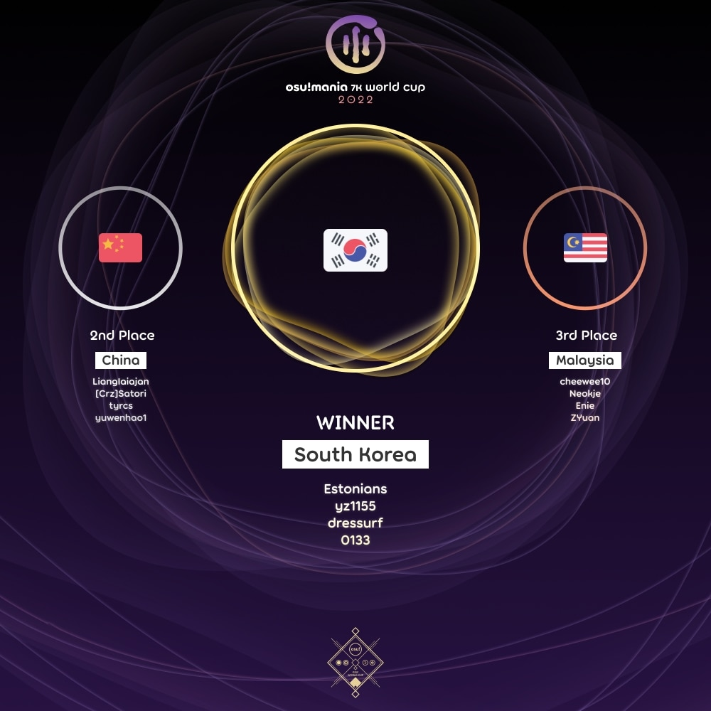

---
tags:
  - MWC2022
  - MWC 2022
  - MWC7K 2022
  - MWC 7K 2022
---

# osu!mania 7K World Cup 2022

The **osu!mania 7K World Cup 2022** (***MWC 7K 2022***) was a country-based osu! tournament hosted by the [osu! team](/wiki/People/osu!_team). It was the sixth instalment of the osu!mania 7K World Cup.

## Tournament schedule

| Event | Timestamp |
| --: | :-- |
| Registration phase | 2021-12-16/2021-12-30 |
| Qualifier showcase | 2022-01-09 (14:00 UTC) |
| Qualifier stage | 2022-01-15/2022-01-16 |
| Round of 16 | 2022-01-22/2022-01-23 |
| Quarterfinals | 2022-01-29/2022-01-30 |
| Semifinals | 2022-02-05/2022-02-06 |
| Finals | 2022-02-12/2022-02-13 |
| Grand Finals | 2022-02-19/2022-02-20 |

## Prizes

| Placing | Prize(s) |
| :-: | :-- |
|  | $150 per team member, profile badge, "osu!mania 7K Champion" user title for one year |
|  | $80 per team member, profile badge |
|  | $40 per team member, profile badge |

  

## Organisation

The osu!mania 7K 2022 was run by the osu! team and various community members.

| Position | Member(s) |
| :-- | :-- |
| Manager | ::{ flag=CA }:: [Azer](https://osu.ppy.sh/users/2155578), ::{ flag=US }:: [ChillierPear](https://osu.ppy.sh/users/9501251), ::{ flag=SE }:: [Davvy](https://osu.ppy.sh/users/10047413), ::{ flag=BR }:: [LeoFLT](https://osu.ppy.sh/users/3668779) |
| Mappool selector | ::{ flag=SE }:: [Davvy](https://osu.ppy.sh/users/10047413), ::{ flag=KR }:: [Kawawa](https://osu.ppy.sh/users/4647754), ::{ flag=PL }:: [\_underjoy](https://osu.ppy.sh/users/2235750) |
| Mappool playtester | ::{ flag=MY }:: [\_Kobii](https://osu.ppy.sh/users/6209713), ::{ flag=SG }:: [Evening](https://osu.ppy.sh/users/2193881), ::{ flag=KR }:: [Jakads](https://osu.ppy.sh/users/259972), ::{ flag=US }:: [Jinjin](https://osu.ppy.sh/users/3360737), ::{ flag=KR }:: [Kawawa](https://osu.ppy.sh/users/4647754), ::{ flag=PH }:: [lenpai](https://osu.ppy.sh/users/5314573), ::{ flag=PH }:: [MapleSyrup\-](https://osu.ppy.sh/users/1192936), ::{ flag=GB }:: [Pope Gadget](https://osu.ppy.sh/users/2288341), ::{ flag=BR }:: [roko100789](https://osu.ppy.sh/users/3224958), ::{ flag=US }:: [stupud man](https://osu.ppy.sh/users/2141612), ::{ flag=PH }:: [SurfChu85](https://osu.ppy.sh/users/4469895) |
| Mapper | ::{ flag=MY }:: [\_Kobii](https://osu.ppy.sh/users/6209713), ::{ flag=PL }:: [\_underjoy](https://osu.ppy.sh/users/2235750), ::{ flag=SE }:: [Davvy](https://osu.ppy.sh/users/10047413), ::{ flag=SG }:: [Evening](https://osu.ppy.sh/users/2193881), ::{ flag=KR }:: [Garalulu](https://osu.ppy.sh/users/757783), ::{ flag=CA }:: [guden](https://osu.ppy.sh/users/11626065), ::{ flag=KR }:: [Jakads](https://osu.ppy.sh/users/259972), ::{ flag=US }:: [Jinjin](https://osu.ppy.sh/users/3360737), ::{ flag=KR }:: [Kawawa](https://osu.ppy.sh/users/4647754), ::{ flag=DE }:: [Leeju](https://osu.ppy.sh/users/18219603), ::{ flag=PH }:: [lenpai](https://osu.ppy.sh/users/5314573), ::{ flag=PH }:: [MapleSyrup\-](https://osu.ppy.sh/users/1192936), ::{ flag=PH }:: [paulkappa](https://osu.ppy.sh/users/7115625), ::{ flag=KR }:: [Remuring](https://osu.ppy.sh/users/6522146), ::{ flag=KR }:: [TakJun](https://osu.ppy.sh/users/4356322) |
| Commentator | ::{ flag=MY }:: [Cryolien](https://osu.ppy.sh/users/1626983), ::{ flag=AR }:: [juankristal](https://osu.ppy.sh/users/443656), ::{ flag=AU }:: [PotassiumF](https://osu.ppy.sh/users/4247722), ::{ flag=SG }:: [Raveille](https://osu.ppy.sh/users/1388767), ::{ flag=PH }:: [SurfChu85](https://osu.ppy.sh/users/4469895), ::{ flag=US }:: [Toaph Daddy](https://osu.ppy.sh/users/7616811), ::{ flag=US }:: [-mint-](https://osu.ppy.sh/users/8976576), ::{ flag=US }:: [-Sparky-](https://osu.ppy.sh/users/3187959) |
| Referee | ::{ flag=NL }:: [Albionthegreat](https://osu.ppy.sh/users/9853595), ::{ flag=AU }:: [Fairy Bread](https://osu.ppy.sh/users/8306102), ::{ flag=CH }:: [Icerite](https://osu.ppy.sh/users/7226287), ::{ flag=BR }:: [LeoFLT](https://osu.ppy.sh/users/3668779), ::{ flag=NL }:: [nik](https://osu.ppy.sh/users/10077264), ::{ flag=IN }:: [Speshimen](https://osu.ppy.sh/users/7720204), ::{ flag=US }:: [tigereyes144](https://osu.ppy.sh/users/6499811), ::{ flag=GB }:: [Yazzehh](https://osu.ppy.sh/users/7068973) |
| Statistician | ::{ flag=FI }:: [shdewz](https://osu.ppy.sh/users/10000899) |

## Links

- [Discussion thread](https://osu.ppy.sh/community/forums/topics/1482564)
- [Livestream](https://www.twitch.tv/osulive)
- [Challonge bracket](https://challonge.com/MWC7K_2022)
- [Pick'ems page](https://pickem.hwc.hr/tournaments/76) hosted by ::{ flag=DE }:: [hallowatcher](https://osu.ppy.sh/users/1874761)
- [Information spreadsheet](https://docs.google.com/spreadsheets/d/e/2PACX-1vTU6E9UIC-w-fQ72ExX-LCpX1k_GvTIg2R28fWhEdx9iKwhYdQkW2JCzLoZiW9XjOfih_k-ap2KJe7R/pubhtml)

## Participants

|  | Country | Members |
| :-: | :-: | :-- |
| ::{ flag=AR }:: | **Argentina** | **[lxLucasxl](https://osu.ppy.sh/users/3632846)**, [DUELODER](https://osu.ppy.sh/users/8224116), [Greedom](https://osu.ppy.sh/users/10696707), [LeongKat](https://osu.ppy.sh/users/11429144) |
| ::{ flag=AU }:: | **Australia** | **[sankansuki](https://osu.ppy.sh/users/2877926)**, [ruka](https://osu.ppy.sh/users/6117525), [Nerd Guy](https://osu.ppy.sh/users/11247298), [Bounter](https://osu.ppy.sh/users/11149878) |
| ::{ flag=BE }:: | **Belgium** | **[Coolgamer](https://osu.ppy.sh/users/4700778)**, [shaafs](https://osu.ppy.sh/users/8811695), [yetii](https://osu.ppy.sh/users/6914714) |
| ::{ flag=BR }:: | **Brazil** | **[SillyFangirl](https://osu.ppy.sh/users/2288363)**, [LothusFangirl](https://osu.ppy.sh/users/4685756), [Makiba](https://osu.ppy.sh/users/7539957), [corninho](https://osu.ppy.sh/users/6507627) |
| ::{ flag=CA }:: | **Canada** | **[LelPop](https://osu.ppy.sh/users/10242770)**, [ItsRewindTime](https://osu.ppy.sh/users/13622614), [NunotabaShinobu](https://osu.ppy.sh/users/10809497), [UmmmMrMoo](https://osu.ppy.sh/users/15314355) |
| ::{ flag=CL }:: | **Chile** | **[Matiias](https://osu.ppy.sh/users/3215366)**, [faz\_cL](https://osu.ppy.sh/users/7853143), [Gonzaalooo](https://osu.ppy.sh/users/1948903), [Skalim](https://osu.ppy.sh/users/2225008) |
| ::{ flag=CN }:: | **China** | **[LiangIaiajan](https://osu.ppy.sh/users/5144698)**, [\[Crz\]Satori](https://osu.ppy.sh/users/7082178), [tyrcs](https://osu.ppy.sh/users/13026904), [yuwenhao1](https://osu.ppy.sh/users/14318312) |
| ::{ flag=CO }:: | **Colombia** | **[xNett](https://osu.ppy.sh/users/4998501)**, [Hakure](https://osu.ppy.sh/users/5597043), [Temoote](https://osu.ppy.sh/users/10326318), [ag0](https://osu.ppy.sh/users/17989209) |
| ::{ flag=DK }:: | **Denmark** | **[Optane](https://osu.ppy.sh/users/7871427)**, [Stoom](https://osu.ppy.sh/users/13572493) |
| ::{ flag=EE }:: | **Estonia** | **[hisaella](https://osu.ppy.sh/users/9557847)**, [Arcaxio](https://osu.ppy.sh/users/16819909), [Exlude](https://osu.ppy.sh/users/14137067) |
| ::{ flag=FR }:: | **France** | **[Elementaires](https://osu.ppy.sh/users/2284328)**, [AntoAa](https://osu.ppy.sh/users/3897919), [Gray Hardrock](https://osu.ppy.sh/users/9049282), [CharlisMadCut](https://osu.ppy.sh/users/2863607) |
| ::{ flag=DE }:: | **Germany** | **[IceDynamix](https://osu.ppy.sh/users/8599070)**, [TsukiyaWhiskers](https://osu.ppy.sh/users/12598261), [Tyrfing61](https://osu.ppy.sh/users/7437049), [ElectroYan](https://osu.ppy.sh/users/3357640) |
| ::{ flag=HU }:: | **Hungary** | **[FR4-](https://osu.ppy.sh/users/10539285)**, [kacsa14](https://osu.ppy.sh/users/17385733) |
| ::{ flag=IN }:: | **India** | **[Xyphoes](https://osu.ppy.sh/users/12178324)**, [MrMaharaj](https://osu.ppy.sh/users/18364256) |
| ::{ flag=ID }:: | **Indonesia** | **[Yanamon](https://osu.ppy.sh/users/2655836)**, [Onta\_Bekasi](https://osu.ppy.sh/users/8677684), [reyss](https://osu.ppy.sh/users/4557440), [Exyph](https://osu.ppy.sh/users/10364342) |
| ::{ flag=JP }:: | **Japan** | **[Lenxis\_](https://osu.ppy.sh/users/10133496)**, [Suzuha\_l](https://osu.ppy.sh/users/6132697), [My Angel Koishi](https://osu.ppy.sh/users/8273098), [LuluM](https://osu.ppy.sh/users/13151924) |
| ::{ flag=MO }:: | **Macau** | **[idqoos123](https://osu.ppy.sh/users/3946113)**, [capchon](https://osu.ppy.sh/users/8566617) |
| ::{ flag=MY }:: | **Malaysia** | **[cheewee10](https://osu.ppy.sh/users/4477497)**, [Neokje](https://osu.ppy.sh/users/7727987), [Enie](https://osu.ppy.sh/users/11976455), [ZYuan](https://osu.ppy.sh/users/3337688) |
| ::{ flag=NL }:: | **Netherlands** | **[Freek](https://osu.ppy.sh/users/9630674)**, [DravenXTaric](https://osu.ppy.sh/users/11999500), [LokSG](https://osu.ppy.sh/users/14516576), [Tyronix](https://osu.ppy.sh/users/11290311) |
| ::{ flag=NZ }:: | **New Zealand** | **[Worms](https://osu.ppy.sh/users/1963937)**, [Sparxe](https://osu.ppy.sh/users/5750235), [CappK](https://osu.ppy.sh/users/16837177) |
| ::{ flag=NO }:: | **Norway** | **[masaya](https://osu.ppy.sh/users/5818319)**, [-TeaBee-](https://osu.ppy.sh/users/12304069), [\[RS\] F4st](https://osu.ppy.sh/users/7676585), [Endroma](https://osu.ppy.sh/users/10340462) |
| ::{ flag=PE }:: | **Peru** | **[Julio1212-](https://osu.ppy.sh/users/2208895)**, [Byron159](https://osu.ppy.sh/users/8639180) |
| ::{ flag=PH }:: | **Philippines** | **[- Kura -](https://osu.ppy.sh/users/11420405)**, [\[Crz\]joseee-](https://osu.ppy.sh/users/10083439), [LackPoints](https://osu.ppy.sh/users/8748664), [Sanni](https://osu.ppy.sh/users/3036686) |
| ::{ flag=PL }:: | **Poland** | **[SitekX](https://osu.ppy.sh/users/3840946)**, [Hudonom](https://osu.ppy.sh/users/1654221), [Yamakazi](https://osu.ppy.sh/users/4726691), [Eclipse-](https://osu.ppy.sh/users/8493070) |
| ::{ flag=PT }:: | **Portugal** | **[Rodrig0v](https://osu.ppy.sh/users/138866)**, [CurlMike](https://osu.ppy.sh/users/7968696), [JAHDONG](https://osu.ppy.sh/users/11445021), [Rosa](https://osu.ppy.sh/users/7385703) |
| ::{ flag=RO }:: | **Romania** | **[robby250](https://osu.ppy.sh/users/2653437)**, [AlexPlayz OSU](https://osu.ppy.sh/users/18341280), [fakebrin](https://osu.ppy.sh/users/8185118) |
| ::{ flag=RU }:: | **Russian Federation** | **[Mage](https://osu.ppy.sh/users/5527957)**, [Legend27](https://osu.ppy.sh/users/6283029), [karayss](https://osu.ppy.sh/users/7156634), [Illumnus](https://osu.ppy.sh/users/9504954) |
| ::{ flag=SG }:: | **Singapore** | **[DarryllV](https://osu.ppy.sh/users/11759693)**, [awdse22](https://osu.ppy.sh/users/8743513), [ByeForNow](https://osu.ppy.sh/users/7199159), [Paralit](https://osu.ppy.sh/users/876528) |
| ::{ flag=KR }:: | **South Korea** | **[Estonians](https://osu.ppy.sh/users/7014697)**, [yz1155](https://osu.ppy.sh/users/2071008), [dressurf](https://osu.ppy.sh/users/758406), [0133](https://osu.ppy.sh/users/12346181) |
| ::{ flag=ES }:: | **Spain** | **[aitor98](https://osu.ppy.sh/users/3154852)**, [CrewK fanboy](https://osu.ppy.sh/users/7860283), [Notpx-](https://osu.ppy.sh/users/8519296), [Quenlla](https://osu.ppy.sh/users/4725379) |
| ::{ flag=SE }:: | **Sweden** | **[Sadcat](https://osu.ppy.sh/users/4123399)**, [Craty](https://osu.ppy.sh/users/3918056), [Vortex-](https://osu.ppy.sh/users/4999669) |
| ::{ flag=CH }:: | **Switzerland** | **[Akayro](https://osu.ppy.sh/users/2573716)**, [Gamer97](https://osu.ppy.sh/users/4952941) |
| ::{ flag=TW }:: | **Taiwan** | **[\[ Snow Rabbit \]](https://osu.ppy.sh/users/1833280)**, [\[Crz\]FolAH1217](https://osu.ppy.sh/users/6232458), [hero\_jeff](https://osu.ppy.sh/users/3375226), [IllIlllIIlIIlIl](https://osu.ppy.sh/users/7227070) |
| ::{ flag=TH }:: | **Thailand** | **[LostCool](https://osu.ppy.sh/users/766374)**, [Myzki](https://osu.ppy.sh/users/3221985), [harlemshake555](https://osu.ppy.sh/users/7355319), [PanicP](https://osu.ppy.sh/users/561493) |
| ::{ flag=GB }:: | **United Kingdom** | **[Vygatron](https://osu.ppy.sh/users/3628783)**, [username1947](https://osu.ppy.sh/users/16162078), [Lelloq](https://osu.ppy.sh/users/8610776), [aid\_](https://osu.ppy.sh/users/12808079) |
| ::{ flag=US }:: | **United States** | **[Alter-](https://osu.ppy.sh/users/4980256)**, [Terni](https://osu.ppy.sh/users/3279570), [\[GS\]Teo](https://osu.ppy.sh/users/7081478), [RevVoJH](https://osu.ppy.sh/users/7286896) |

## Podium

## Mappools

### Grand Finals

**[Download the mappack here (147 MB)](https://drive.google.com/uc?id=16v9MUtbFbNujRZGHSv45APoDkq40RwEx)**

- Rice
  1. [void feat. kotsukimiya, Gt. eba - Name of oath (Evening) \[Covenant\]](https://osu.ppy.sh/beatmapsets/1698290#mania/3469863)
  2. [katagiri - STRONG 280 (\_underjoy) \[TSUYOI\]](https://osu.ppy.sh/beatmapsets/1698287#mania/3469858)
  3. [kei\_iwata - Frontier Explorer (Blocko) \[Voyager (MWC) 1.05x\]](https://osu.ppy.sh/beatmapsets/1337044#mania/3469929)
  4. [Silentroom vs. Frums - Aegleseeker (Jinjin) \[Lux Mea\]](https://osu.ppy.sh/beatmapsets/1666003#mania/3401407)
  5. [-45 - EXILE (Jinjin) \[Downfall- (144)\]](https://osu.ppy.sh/beatmapsets/1058884#mania/3469788)
  6. [DJ Myosuke - Killing Rhythm (Camellia's "Khaotic Re-Rhythmization" Remix) (Evening) \[De-cadence\]](https://osu.ppy.sh/beatmapsets/1698291#mania/3469864)
  7. [LeaF - Ka (Kawawa) \[wawa (MWC Edition)\]](https://osu.ppy.sh/beatmapsets/1698286#mania/3469854)
- LN
  1. [Cashew - Red Snow pt.3: Black Flare (Kim\_GodSSI) \[The Finale of "Story of Lyra"\]](https://osu.ppy.sh/beatmapsets/1698307#mania/3469895)
  2. [HyuN feat. YURI - Disorder (Remuring) \[Disorderly (MWC Edit) 1.1x\]](https://osu.ppy.sh/beatmapsets/1288029#mania/3469845)
  3. [Memme - Goat Fantasia (Leeju) \[Leeju's 7K Ganyu please come home\]](https://osu.ppy.sh/beatmapsets/1698256#mania/3469801)
  4. [Active Planets, Uinyasu & AUGUST - Tsukiyo ni Mau Koi no Hana (\_Reimu) \[underjoy vs \_Reimu's Heartbreak 1.05x\]](https://osu.ppy.sh/beatmapsets/1221032#mania/3467053)
  5. [M2U feat. Guriri - Magnolia (Kim\_GodSSI) \[>\_< M2U OPPA SARANGHAE <3\]](https://osu.ppy.sh/beatmapsets/1698305#mania/3469889)
- Hybrid
  1. [Kobaryo - SUPER EMULATOR \[feat. HiTNEX-X\] (Kim\_GodSSI) \[SUPER HOT BRAKE 0.95x\]](https://osu.ppy.sh/beatmapsets/1666343#mania/3406614)
  2. [Camellia - KillerBeast (Remuring) \[Rampage\]](https://osu.ppy.sh/beatmapsets/1698281#mania/3469846)
  3. [LeaF - Mwfyuma Peustallora (Jinjin) \[Super Easy uwu\]](https://osu.ppy.sh/beatmapsets/928181#mania/3469886)
- Tiebreaker
  1. **[HyuN - Duplicity Shade (Feat. Sennzai) (\_underjoy) \[Metamorphosis\]](https://osu.ppy.sh/beatmapsets/1698284#mania/3469849)**

### Finals

**[Download the mappack here (168 MB)](https://drive.google.com/uc?id=1_S2JNbi6CZOL3yXvdfpbfN18dCXwAKjo)**

- Rice
  1. [ROKINA - Kimi to bokueno sousouka (Jinjin) \[Requiem\]](https://osu.ppy.sh/beatmapsets/1666751#mania/3404149)
  2. [Ariabl'eyeS - Sougetsu Oratorio (\_underjoy) \[Arcadia (cut)\]](https://osu.ppy.sh/beatmapsets/1693118#mania/3459764)
  3. [sakuzyo - Toy's 3 minutes war (Kawawa) \[LF> Ludibrium PQ @195\]](https://osu.ppy.sh/beatmapsets/1692913#mania/3459366)
  4. [Dz'Xa - EXTRAHAPPY (lenpai) \[:3 (250 bpm)\]](https://osu.ppy.sh/beatmapsets/1693251#mania/3460002)
  5. [Junk - Life is PIANO (Evening) \[Life is COLABOO@136\]](https://osu.ppy.sh/beatmapsets/1692950#mania/3459426)
  6. [USAO - Knight Rider (Camellia's "Knightstyle Razor-psy-harp" Remix) (Evening) \[En Garde+ (Evening's Nouveau Flip)\]](https://osu.ppy.sh/beatmapsets/1692951#mania/3459428)
  7. [katagiri - Angel's Salad (Kawawa) \[Diet (MWC Edition)\]](https://osu.ppy.sh/beatmapsets/1692919#mania/3459379)
- LN
  1. [YOASOBI - Gunjou (\[Crz\]Emperor-) \[Blue\]](https://osu.ppy.sh/beatmapsets/1256369#mania/3397105)
  2. [xi - Bad Elixir (Exyph) \[No Hope\]](https://osu.ppy.sh/beatmapsets/1240933#mania/2579737)
  3. [NAGI\* - fractal (\[Crz\]Emperor-) \[underjoy vs Emperor-'s Fractal Universe\]](https://osu.ppy.sh/beatmapsets/1496315#mania/3397135)
  4. [Mary - Alice in Reitouko (Leeju) \[Leeju's 7K Terni in Freezer (MWC cut. edit)\]](https://osu.ppy.sh/beatmapsets/1412771#mania/3459276)
  5. [Tiara - Negai covered by Isekaijoucho (Kim\_GodSSI) \[Wish\]](https://osu.ppy.sh/beatmapsets/1692906#mania/3459342)
- Hybrid
  1. [Camellia - Kamah (Leeju) \[Leeju's 7K Syphoning Souls +\]](https://osu.ppy.sh/beatmapsets/1558744#mania/3459278)
  2. [Noah - Break down (Wonki) \[Extra\]](https://osu.ppy.sh/beatmapsets/1450907#mania/2982951)
  3. [sa10 - banana man (Jinjin) \[Bananamania (2022)\]](https://osu.ppy.sh/beatmapsets/543154#mania/3459405)
- Tiebreaker
  1. **[seatrus - DOOMSDAY THUNDERTEMPEST (paulkappa) \[FINAL LAP ONTO DISASTER\]](https://osu.ppy.sh/beatmapsets/1692926#mania/3459391)**

### Semifinals

**[Download the mappack here (104 MB)](https://drive.google.com/uc?id=1zbZY8aEs_0rS-UHLjiWUQaxmNdVoXJR5)**

- Rice
  1. [modama/hugepulse - Swim in the sea of quarks (MapleSyrup-) \[Creation 1.15x\]](https://osu.ppy.sh/beatmapsets/1687220#mania/3448226)
  2. [TUYU - Shuuten no Saki ga Aru to suru naraba (Leeju) \[Leeju's 7K Afterlife +\]](https://osu.ppy.sh/beatmapsets/1603565#mania/3448143)
  3. [ikaruga\_nex - ReviXy (TakJun) \[ETJun\]](https://osu.ppy.sh/beatmapsets/1489038#mania/3393667)
  4. [polysha - Jasmine Tea Girl (Evening) \[Shimmer+@130\]](https://osu.ppy.sh/beatmapsets/1687214#mania/3448213)
  5. [Camellia - Electromagnetic Stealth Girl Born In Philadelphia (paradoxus\_) \[para & wawa collab (no LN)\]](https://osu.ppy.sh/beatmapsets/1544574#mania/3441781)
  6. [Takanashi Kiara - SPARKS (Remuring) \[KFP\]](https://osu.ppy.sh/beatmapsets/1601721#mania/3270989)
  7. [Igorrr - Robert (Jinjin) \[dieu\]](https://osu.ppy.sh/beatmapsets/1687197#mania/3448178)
- LN
  1. [Aethoro - Snowy (\_underjoy) \[Icicles\]](https://osu.ppy.sh/beatmapsets/1687222#mania/3448230)
  2. [Kijibato - w / WWW (feat. Hoshimiya Toto) (\_underjoy) \[Flexo123's GO FUN?\]](https://osu.ppy.sh/beatmapsets/1687225#mania/3448238)
  3. [SHK - Violet Perfume (Wilben\_Chan) \[Nightmare (edit)\]](https://osu.ppy.sh/beatmapsets/1371078#mania/3440839)
  4. [GFRIEND - Time for the moon night (Jinjin) \[ByeolBit\]](https://osu.ppy.sh/beatmapsets/1674163#mania/3419908)
  5. [La+ Darknesss - God-ish (MapleSyrup-) \[Fool-ish Obsesssion\]](https://osu.ppy.sh/beatmapsets/1687218#mania/3448224)
- Hybrid
  1. [Akhuta - Nigra Ludia (Wilben\_Chan) \[Nightmare\]](https://osu.ppy.sh/beatmapsets/1034341#mania/2162574)
  2. [AZKi - Fake.Fake.Fake (\_Reimu) \[Aqua.M.T\]](https://osu.ppy.sh/beatmapsets/984170#mania/2059275)
  3. [Camellia feat. Nana Takahashi - Mushi no Sumu Tokoro -Ugomeki wa nao fukamaru (Remuring) \[Corruption (MWC Edit)\]](https://osu.ppy.sh/beatmapsets/1276561#mania/3448223)
- Tiebreaker
  1. **[Camellia - Newspapers for Magicians (Blocko) \[The Daily Prophet\]](https://osu.ppy.sh/beatmapsets/1645306#mania/3448228)**

### Quarterfinals

**[Download the mappack here (109 MB)](https://drive.google.com/uc?id=1JhpOSJ2m2jt1XHeuvM71hqZBBiZvy_Kz)**

- Rice
  1. [USAO - Phalanx (Evening) \[SKY\_PIERCER.tar.gz\]](https://osu.ppy.sh/beatmapsets/1681593#mania/3435340)
  2. [ck - Carnation (ck remix) (TakJun) \[CarnationJun\]](https://osu.ppy.sh/beatmapsets/1638338#mania/3354720)
  3. [nmk - Shoujo ga Mita Nippon no Hara Fuukei -Spell Music Mix- (qodtjr) \[Alice\]](https://osu.ppy.sh/beatmapsets/1089000#mania/2276927)
  4. [naotyu- - L99 (hoo9030) \[EX Challenge \[0.95x Rate\]\]](https://osu.ppy.sh/beatmapsets/1427458#mania/2940516)
  5. [Pop'n Masters - Popperz Chronicle (lenpai) \[Another\]](https://osu.ppy.sh/beatmapsets/1509343#mania/3432698)
  6. [The Flashbulb - Kirlian Shores (tyrcs) \[Beside the Sea +\]](https://osu.ppy.sh/beatmapsets/1084086#mania/3383148)
- LN
  1. [Jamie Christopherson - Island Village (X\_Devil) \[LineageII: Talking Island Village\]](https://osu.ppy.sh/beatmapsets/1054940#mania/2204243)
  2. [Lime - 8bit Voyager (Leeju) \[Leeju's 7K Journey\]](https://osu.ppy.sh/beatmapsets/1656843#mania/3381798)
  3. [Jay Chou - Mojito (Wilben\_Chan) \[Sweet Love\]](https://osu.ppy.sh/beatmapsets/1557864#mania/3182371)
  4. [ryo(supercell) - Love is War (Mwk Remix) (Chenut BS) \[LOVE DECLARATION\]](https://osu.ppy.sh/beatmapsets/1046089#mania/3431581)
- Hybrid
  1. [Holo Bass - Power Stance (MapleSyrup-) \[Domination 1.05x\]](https://osu.ppy.sh/beatmapsets/1681558#mania/3435273)
  2. [Linear ring - Enchanted love (qodtjr) \[Blind\]](https://osu.ppy.sh/beatmapsets/1486478#mania/3047946)
  3. [Liquid Tension Experiment - The Passage of Time (Davvy) \[Samsara\]](https://osu.ppy.sh/beatmapsets/1360458#mania/2815242)
- Tiebreaker
  1. **[Silentroom - Nhelv (Evening) \[Divergence & Convergence (MWC Edit)\]](https://osu.ppy.sh/beatmapsets/1681594#mania/3435342)**

### Round of 16

**[Download the mappack here (89 MB)](https://drive.google.com/uc?id=1uc1oILMX9J7dw1huWo3Kd3r31qROfIRm)**

- Rice
  1. [Laur - Attractor Dimension (Wonki) \[Insane\]](https://osu.ppy.sh/beatmapsets/1587984#mania/3243265)
  2. [cosMo@bousouP - Oceanus (\_Kobii) \[Insane \[210bpm\]\]](https://osu.ppy.sh/beatmapsets/1676381#mania/3424741)
  3. [Mr.T - electro peaceful(8bit) (qodtjr) \[Notes of Peace\]](https://osu.ppy.sh/beatmapsets/707059#mania/1494875)
  4. [sakuzyo - Lost Memory (DaDarkDragon) \[Memories \[1,1x Rate\]\]](https://osu.ppy.sh/beatmapsets/1312121#mania/2719418)
  5. [BEMANI Sound Team "Power Of Nature" - Tadoru Kimi wo Koete (guden) \[Wayfarer\]](https://osu.ppy.sh/beatmapsets/1539977#mania/3148168)
  6. [TAKU INOUE & Hoshimachi Suisei - Sanji Juunihun (Evening) \[CHANGE THE WORLD (EDIT)\]](https://osu.ppy.sh/beatmapsets/1676465#mania/3424887)
- LN
  1. [M2U - Yoake no Uta feat. Dazbee (SurfChu85) \[Daybreak\]](https://osu.ppy.sh/beatmapsets/1477099#mania/3030679)
  2. [dj TAKA feat. Erika Mochizuki - MOON (paulkappa) \[Slave of Sadness\]](https://osu.ppy.sh/beatmapsets/1666530#mania/3402422)
  3. [Yuki Kajiura - Himeboshi (\_underjoy) \[Tranquility\]](https://osu.ppy.sh/beatmapsets/1069926#mania/3424740)
  4. [Crush - OHIO (JuHaa) \[HIOH!\]](https://osu.ppy.sh/beatmapsets/1566789#mania/3199120)
- Hybrid
  1. [Camellia vs. Tsukasa Kaminose - Gunkyouzouteki Soseiriron (\_Stan) \[Imi\[7\]ation // 7K\]](https://osu.ppy.sh/beatmapsets/1262927#mania/2687659)
  2. [Cuvelia - Tenkuu no Yoake (AncuL) \[Imaginary\]](https://osu.ppy.sh/beatmapsets/630583#mania/1331170)
  3. [M2U - White Rose (JuHaa) \[White picture\]](https://osu.ppy.sh/beatmapsets/1514154#mania/3099963)
- Tiebreaker
  1. **[Nekomata Gekidan - envidia (Umo-) \[Envy\]](https://osu.ppy.sh/beatmapsets/1330328#mania/2756301)**

### Qualifiers

**[Download the mappack here (60 MB)](https://drive.google.com/uc?id=11kEZFgZe1k76BG6yRqiuSFwyFa4dxP4C&export=download)**

1. [Machinedrum - Mltply (Cut Ver.) (lenpai) \[Stage 1: Dplct\]](https://osu.ppy.sh/beatmapsets/1670396#mania/3411673)
2. [Fudanshi Crisis - Scarlet Tempest (guden) \[Stage 2: Vermilion\]](https://osu.ppy.sh/beatmapsets/1670391#mania/3411668)
3. [Akatsuki Records - HANIPAGANDA (Garalulu) \[Stage 3: Stacked\]](https://osu.ppy.sh/beatmapsets/1670404#mania/3411686)
4. [3R2 - Farewell (MapleSyrup-) \[Stage 4: Recital\]](https://osu.ppy.sh/beatmapsets/1670394#mania/3411671)
5. [LeaF - Arianrhod (\_underjoy) \[Stage 5: Chronostasis\]](https://osu.ppy.sh/beatmapsets/1670403#mania/3411684)
6. [Getty - Sonic Bass (Remuring) \[Stage 6: Pressure\]](https://osu.ppy.sh/beatmapsets/1670398#mania/3411677)
7. [Feryquitous - THE SEVENS CODE (\_Kobii) \[Stage 7: Secrecy\]](https://osu.ppy.sh/beatmapsets/1670393#mania/3411670)
8. [technoplanet - Intuition (Evening) \[Stage 8: Advent of Colour\]](https://osu.ppy.sh/beatmapsets/1670397#mania/3411676)

## Match results

### Grand Finals

Detailed statistics for this round can be found [here](https://docs.google.com/spreadsheets/d/1gdewLAAcyRTfBm-0oWvEcoH4-2ZSvisVA4npuxfAATk/edit?rm=minimal).

Saturday, February 19, 2022

| Team A |  |  | Team B | Match link |
| --: | :-: | :-: | :-- | :-- |
| Malaysia ::{ flag=MY }:: | 1 | **7** | ::{ flag=CN }:: **China** | [#1](https://osu.ppy.sh/community/matches/97947404) |

Sunday, February 20, 2022

| Team A |  |  | Team B | Match link |
| --: | :-: | :-: | :-- | :-- |
| **South Korea** ::{ flag=KR }:: | **7** | 1 | ::{ flag=CN }:: China | [#1](https://osu.ppy.sh/community/matches/97990489) |

### Finals

Detailed statistics for this round can be found [here](https://docs.google.com/spreadsheets/d/1X-RhAkUcgKZbKF8k2lGLV3AyOxumOUUwFe48isbIcTI/edit?rm=minimal).

Saturday, February 12, 2022

| Team A |  |  | Team B | Match link |
| --: | :-: | :-: | :-- | :-- |
| **Philippines** ::{ flag=PH }:: | **7** | 2 | ::{ flag=JP }:: Japan | [#1](https://osu.ppy.sh/community/matches/97687067) |
| **China** ::{ flag=CN }:: | **7** | 3 | ::{ flag=TH }:: Thailand | [#1](https://osu.ppy.sh/community/matches/97689158) |

Sunday, February 13, 2022

| Team A |  |  | Team B | Match link |
| --: | :-: | :-: | :-- | :-- |
| **China** ::{ flag=CN }:: | **7** | 4 | ::{ flag=PH }:: Philippines | [#1](https://osu.ppy.sh/community/matches/97731670) |
| **South Korea** ::{ flag=KR }:: | **7** | 2 | ::{ flag=MY }:: Malaysia | [#1](https://osu.ppy.sh/community/matches/97736266) |

### Semifinals

Detailed statistics for this round can be found [here](https://docs.google.com/spreadsheets/d/1IFUI0PzZAgl8RRmfmHHmVrezL6qkCAaRM3ME5lKKrQQ/edit?rm=minimal).

Saturday, February 5, 2022

| Team A |  |  | Team B | Match link |
| --: | :-: | :-: | :-- | :-- |
| **Indonesia** ::{ flag=ID }:: | **7** | 2 | ::{ flag=PL }:: Poland | [#1](https://osu.ppy.sh/community/matches/97417859) |
| China ::{ flag=CN }:: | 2 | **7** | ::{ flag=MY }:: **Malaysia** | [#1](https://osu.ppy.sh/community/matches/97417959) |
| **Japan** ::{ flag=JP }:: | **7** | 3 | ::{ flag=BR }:: Brazil | [#1](https://osu.ppy.sh/community/matches/97421449) |
| **Thailand** ::{ flag=TH }:: | **7** | 1 | ::{ flag=CL }:: Chile | [#1](https://osu.ppy.sh/community/matches/97423673) |
| Canada ::{ flag=CA }:: | 4 | **7** | ::{ flag=ES }:: **Spain** | [#1](https://osu.ppy.sh/community/matches/97426048) |

Sunday, February 6, 2022

| Team A |  |  | Team B | Match link |
| --: | :-: | :-: | :-- | :-- |
| **South Korea** ::{ flag=KR }:: | **7** | 6 | ::{ flag=PH }:: Philippines | [#1](https://osu.ppy.sh/community/matches/97459939) |
| **Thailand** ::{ flag=TH }:: | **7** | 0 | ::{ flag=ES }:: Spain | [#1](https://osu.ppy.sh/community/matches/97462885) |
| **Japan** ::{ flag=JP }:: | **7** | 3 | ::{ flag=ID }:: Indonesia | [#1](https://osu.ppy.sh/community/matches/97466272) |

### Quarterfinals

Detailed statistics for this round can be found [here](https://docs.google.com/spreadsheets/d/1p5UdhZ0CDflgnghIcKIsCnfT9A5c-kGGDOgGsS8Bqhg/edit?rm=minimal).

Saturday, January 29, 2022

| Team A |  |  | Team B | Match link |
| --: | :-: | :-: | :-- | :-- |
| United States ::{ flag=US }:: | 0 | **6** | ::{ flag=ES }:: **Spain** | [#1](https://osu.ppy.sh/community/matches/97134166) |
| Taiwan ::{ flag=TW }:: | 3 | **6** | ::{ flag=CL }:: **Chile** | [#1](https://osu.ppy.sh/community/matches/97137500) |
| **Poland** ::{ flag=PL }:: | **6** | 2 | ::{ flag=RU }:: Russian Federation | [#1](https://osu.ppy.sh/community/matches/97139929) |
| Switzerland ::{ flag=CH }:: | 2 | **6** | ::{ flag=BR }:: **Brazil** | [#1](https://osu.ppy.sh/community/matches/97155646) |

Sunday, January 30, 2022

| Team A |  |  | Team B | Match link |
| --: | :-: | :-: | :-- | :-- |
| **South Korea** ::{ flag=KR }:: | **6** | 0 | ::{ flag=CA }:: Canada | [#1](https://osu.ppy.sh/community/matches/97170691) |
| **China** ::{ flag=CN }:: | **6** | 5 | ::{ flag=ID }:: Indonesia | [#1](https://osu.ppy.sh/community/matches/97177094) |
| **Philippines** ::{ flag=PH }:: | **6** | 0 | ::{ flag=TH }:: Thailand | [#1]( https://osu.ppy.sh/community/matches/97182046) |
| **Malaysia** ::{ flag=MY }:: | **6** | 0 | ::{ flag=JP }:: Japan | [#1](https://osu.ppy.sh/community/matches/97187449) |

### Round of 16

Detailed statistics for this round can be found [here](https://docs.google.com/spreadsheets/d/1np4ZxbrZoAvYPlBE2_XXQg9eBz2wFFvud9xgO8U3EyA/edit?rm=minimal).

Saturday, January 22, 2022

| Team A |  |  | Team B | Match link |
| --: | :-: | :-: | :-- | :-- |
| **Indonesia** ::{ flag=ID }:: | **6** | 0 | ::{ flag=CL }:: Chile | [#1](https://osu.ppy.sh/community/matches/96833931) |
| Spain ::{ flag=ES }:: | 4 | **6** | ::{ flag=JP }:: **Japan** | [#1](https://osu.ppy.sh/community/matches/96836932) |
| **Malaysia** ::{ flag=MY }:: | **6** | 1 | ::{ flag=US }:: United States | [#1](https://osu.ppy.sh/community/matches/96842328) |

Sunday, January 23, 2022

| Team A |  |  | Team B | Match link |
| --: | :-: | :-: | :-- | :-- |
| **Canada** ::{ flag=CA }:: | **6** | 3 | ::{ flag=BR }:: Brazil | [#1](https://osu.ppy.sh/community/matches/96871014) |
| **China** ::{ flag=CN }:: | **6** | 0 | ::{ flag=TW }:: Taiwan | [#1](https://osu.ppy.sh/community/matches/96879069) |
| **South Korea** ::{ flag=KR }:: | **6** | 0 | ::{ flag=CH }:: Switzerland | [#1](https://osu.ppy.sh/community/matches/96881672) |
| **Thailand** ::{ flag=TH }:: | **6** | 0 | ::{ flag=RU }:: Russian Federation | [#1](https://osu.ppy.sh/community/matches/96883025) |
| **Philippines** ::{ flag=PH }:: | **6** | 0 | ::{ flag=PL }:: Poland | [#1](https://osu.ppy.sh/community/matches/96884707) |

### Qualifiers

The final standings for the Qualifier stage can be found in the following [spreadsheet](https://docs.google.com/spreadsheets/d/1Io6SHPkPIgC_59uVEk7KJ1u6wmcvAqGp_TJ2IovTmok/edit?rm=minimal). Detailed statistics for this round can be found [here](https://docs.google.com/spreadsheets/d/1_Lq1HaM_2L1aZSpb7T6rI9J7zJe79cfrrMVjqrySoKA/edit?rm=minimal).

## Ruleset

### Tournament rules

1. The osu!mania 7K World Cup is a country-based team tournament, played on the osu!mania game mode.
2. Beatmap scoring will be based on Score V2.
3. The beatmaps for each round will be announced by the mappool selectors on the Sunday before the actual matches take place.
   - Every mappool, except for the Qualifier stage, will contain a *tiebreaker* beatmap. It will only be played in case of a tie in the scoreline in the *best of* system, e.g. the scoreline is 4-4 and the match is best of 9, the tiebreaker shall be played.
   - Additional mappools may be added depending on the amount of signups.
4. Match schedule will be handled by the Tournament Management.
5. If no referee is available at match time, the match will be postponed.
6. Failed players' scores do not get added to the team score.
   - Reviving and surviving during a beatmap is considered as passing it.
7. Use of the Visual Settings to alter background dim or disable beatmap elements like storyboards and skins are allowed.
   - Custom skin elements must not be used to alter core gameplay elements or mechanics.
8. If a game ends in a draw it will be nullified and the beatmap replayed, herein called a *rematch*.
9. Teams may ask for a rematch if a team member encounters technical difficulties while playing.
   - "Lag spikes" are not considered a valid reason to nullify a beatmap.
   - If a rematch happens, the original roster for each team during that particular beatmap must remain the same. If that is not possible, e.g. by virtue of a technical issue, *both* teams will be allowed to swap rosters.
   - This rule is not to be abused. Referees may veto a rematch request if they find that this is the case.
10. Disconnects within 30 seconds or 25% of the beatmap length (whichever happens first) can be rematched, at the referee's discretion, as long as it's clearly communicated in the chatroom.
11. If a player disconnects, their scores will not be counted towards their team's total, unless adequate proof of said score is provided. The following are considered as acceptable proof:
    - Player point-of-view live stream snippets (commonly referred to as "clips" or "VODs"). The entirety of the play, along with the results screen must be clearly visible along with the affected player's score.
    - Replay files of the play, taken directly from the "Local scores" tab on the affected player's client (the timestamps must exactly match the time at which the game took place, as seen on the multiplayer lobby link).
    - Screenshots from other players taken directly in-game that show the affected player's score.
      - Screenshots from the results screen must clearly show the affected player's score. This is the preferred method.
      - Screenshots taken in-game at the time of disconnection may be accepted. Note that this method does not provide a one-to-one representation of that player's score. Using this method is not encouraged and it may be denied at the referee's discretion if the information provided is not sufficient to identify the player/score.
      - All screenshots **MUST** be taken using the game itself, that is, they must be hosted on the `https://osu.ppy.sh/` domain. Any other form of screenshot will be denied.
    - Player scores may be derived from the official stream as a last resort, in cases where the match is streamed.
12. If less than the minimum amount of required players are present at match time, the match can be postponed for up to 10 minutes. If after this period there are still not enough players for either team, a *win by default* will be declared for the side with the most members present.
    - The minimum amount of required players is considered as the amount of players needed to play a beatmap without any vacant spots on the lobby (i.e. 2 participants must be present for the match to begin).
13. If a player disconnects between beatmaps and the team cannot provide a substitute, the match can be delayed for up to 10 minutes (limited to once per team, per match).
14. Exchanging players between games is allowed without limitations.
15. Beatmaps must not be reused in the same match, except for rematches.
16. **The minimum size for a team is 2 players, and the maximum is 4.**
17. Players are expected to keep the match running fluently and without delays. Excessive match delays from the players' side may result in penalties being applied at the referee's discretion. Disrupting the match by foul play, insulting or provoking other players or staff, delaying the match or other deliberate inappropriate misbehaviour are strictly prohibited, and will be punished accordingly.
18. All players and staff must be treated with respect. Instructions of the referees and the Tournament Management are to be followed. Decisions labeled as final are not to be objected.
19. The multiplayer chatrooms underlie the [osu! community rules](/wiki/Rules). All chat rules apply to the multiplayer chatrooms, too.
    - Breaking the chat rules may result in a silence. Silenced players cannot participate in multiplayer matches and must be exchanged for the duration of the punishment.
20. Penalties for violating the tournament rules include, but are not limited to:
    - Exclusion of specific players for one beatmap.
    - Exclusion of specific players for an entire match.
    - Declaring the match as forfeited, or as a win by default for the other team.
    - Disqualification from the entire tournament.
    - Disqualification from the current and future official tournaments, until appealed.
21. Referees may allow, at their discretion, lower or higher tolerances for timers.
22. The Tournament Management reserves the right to modify these rules at any moment. Any such changes will be announced in advance.

### Tournament registration

1. Every user interested in joining their country's team signs up individually.
   - Tournament Management will create a list of potential candidates for a country's team.
   - Tournament Management will declare one candidate captain of their country's team.
2. The declared captain will then form their team from the candidate list of their country.
   - Captains are expected to choose team members with honesty and good will, with the aim of fielding the strongest team possible.
   - Captains are allowed to exclude themselves from the team list.
   - Captains are allowed to conduct and coordinate "tryouts", tests to gauge player aptitude, on their own terms.
   - Captains may choose, with the approval of the Tournament Management, at any time, to delegate their role to other prospective team members. Once given, only the new captain may assign the captaincy to another player.
3. To ensure valid registrations, every prospective participant will be manually checked by the [account support team](/wiki/People/Account_support_team), in a manner similar to the [tournament screening](/wiki/Tournaments/Official_support#tournament-screening) that is offered to community tournaments.
   - Every registered user will be assigned to their respective country's candidate list.
   - To be successfully accepted on the list, players are required to be placed #5000 or higher on the osu!mania 7K performance ranking, and have not violated the [osu! community rules](/wiki/Rules) within the last 12 months.
4. All successfully formed teams will be published after the Registration Phase.
   - A team should have at least 2 players registered to have the chance to play the Qualifier stage.
   - The top 16 seeded teams will qualify to the Round of 16.
5. Tournament staff members are **not** allowed to play in the tournament, with the exception of the commentators.

### Qualifier instructions

1. In the Qualifier stage, all teams will play a specific pool designed by the mappool selectors.
2. The Qualifier pool contains 8 maps, all of which will use FreeMod rules. There will be no tiebreakers for this stage.
3. Teams will have to play the mappool twice at a designated time. The team's best play-through will be used for seeding.
   - Teams may skip individual maps or the second run altogether if they so desire.
4. The mappool will be played according to the order listed above.
5. Each team must have 2 players for each map. They can be exchanged freely after a map is concluded.
6. An optional 5-minute break will be offered between the first and second play-through of the mappool.
7. All teams will play their qualifiers in separate rooms. It is suggested that teams do not broadcast or share their results publicly to avoid seed manipulation.
8. The seeding method used for Qualifiers will be weighted rank sum, where each team's map rank will be multiplied by a predetermined weight and then added together to compose that team's final score, which is then sorted from lowest to highest, lowest being seed #1.
   - The exact formula that will be used for each map is `Map score = RANK(Team score) * Map weight`, where `RANK` is the function that ranks the current `Team score` against all team scores for the current map, and `Map weight` is the weight for the current map, as defined by the table below.
   - The final team score to be sorted is defined as `Final score = SUM(Map score)`, i.e. the sum of each map's `Map score`.
9. The top 16 seeded teams will advance to the Round of 16.

The weights for the Qualifiers are as follows:

|  | Stage 1 | Stage 2 | Stage 3 | Stage 4 | Stage 5 | Stage 6 | Stage 7 | Stage 8 |
| --: | :-: | :-: | :-: | :-: | :-: | :-: | :-: | :-: |
| **Weight** | 0.1450 | 0.1250 | 0.1250 | 0.1250 | 0.1000 | 0.1675 | 0.1000 | 0.1125 |

### Stage instructions

1. Following the Qualifiers, a Double Elimination bracket will be played. This means that the winning team moves to the next stage while the loser gets moved to the losers bracket.
2. Teams in the losers bracket must play 2 matches each weekend starting from the Semifinals.
3. Teams that lose a match in the losers bracket are eliminated from the tournament.

### Win conditions

- In the Qualifiers, teams need to place in the top 16 seeded teams in order to advance to the Double Elimination stage.
- In the Round of 16 and Quarterfinals, teams need to win 6 maps to win a match (best of 11).
- In the Semifinals, Finals, and Grand Finals, teams need to win 7 maps to win the match (best of 13).

### Match instructions

1. A referee will create a multiplayer room 15 minutes before the scheduled match time. Players must join the lobby in that period.
   - The room settings are Game mode: "osu!mania", Team mode: "Team Vs" and Score mode: "ScoreV2". The room name must follow this pattern: "MWC7K2022: (Red Team) vs (Blue Team)". The team mentioned first in the room name must be the red team, the team mentioned second in the room name must be the blue team.
2. Each captain can ban **one beatmap** to be selected from the pool. These beatmaps can not be picked by any team for the entire duration of the match.
3. Beatmap selection will alternate between each captain selecting a beatmap out of the mappool.
4. Each captain must use `!roll` once in `#multiplayer`.
   - The winner of the `!roll` starts picking the first beatmap of the match.
   - The loser of the `!roll` starts banning one beatmap, followed by the winner of the  `!roll` to ban a beatmap.
5. Teams will have 2 minutes to pick a beatmap and 2 minutes to get ready. If a team takes more time than allotted, the procedures adopted will be as follows:
   - For the first occurrence:
     - The team will receive a verbal warning from the referee
   - On subsequent occurrences:
     - For a pick timer: a random map will be chosen from the mappool using `!roll X`, where X is the number of maps that were neither picked nor banned, excluding the Tiebreaker.
     - For a ready timer: the referee will issue the `!mp start 10` command, regardless of how many players from each team are present in the lobby, using `!mp kick` on any extra players for each team, starting from the top (i.e. the first valid player combination for each team will be forced to play the pick). The results for such games are to be taken as is.
   - Repeat offenders may receive further sanctions from the Tournament Management.
   - Each team will receive one "tactical timeout" of two minutes, to be used as extra time to pick or ban a beatmap. *The tactical timeout is optional*.
     - The tactical timeout may be called on a tiebreaker, provided that both team's captains agree to it.
6. Results for the Qualifiers Stage will be published via a Statistics sheet.

### Mappool instructions

1. There will be one mappool for each stage.
2. Each mappool consists of a fixed amount of maps each stage which will all be played under FreeMod conditions. This means that there is a unique FreeMod bracket.
3. The mappool sizes are as follows:
   - Qualifiers: 8 beatmaps
   - Round of 16 and Quarterfinals: 14 beatmaps
   - Semifinals, Finals, and Grand Finals: 16 beatmaps
4. Each mappool has one tiebreaker, except for the Qualifiers.
5. Possible mod choices for all maps are [Hidden](/wiki/Gameplay/Game_modifier/Hidden), [FadeIn](/wiki/Gameplay/Game_modifier/Fade_In), [Flashlight](/wiki/Gameplay/Game_modifier/Flashlight), and [Mirror](/wiki/Gameplay/Game_modifier/Mirror).
6. The tiebreaker will be played under FreeMod conditions.

### Scheduling instructions

1. Each stage will be held on **a single weekend**.
2. Matches in Qualifiers will be held during specific time slots proposed by the tournament staff. Each team is free to choose a time slot in which they want to play.
   - **A team that doesn't pick a time slot by Thursday, January 13 23:59 UTC will be considered disqualified.**
3. All Bracket Stages will be held between Saturday 0:00 and Sunday 23:59 UTC+0.
4. Scheduling will be handled by the Tournament Management. Schedules will be released on the Sunday before the first matches of the stage. Tournament Management will try to create the schedule to respect the participants' time zones.
   - In the Semifinals and subsequent stages, team captains may inform Tournament Management if they expect a specific time slot to be unavailable in the following week. Schedule updates will be granted to the best of Management's abilities.
5. **Reschedules will only be considered if both teams agree to a time and communicate it to the Tournament Management, before Wednesday 23:59 UTC+0 of the week the match is to take place on.**
   - Reschedules may only be requested by a team captain.
   - Matches may not be scheduled to any time beyond **Sunday, 19:00 UTC+0** of the week they are to be played at.
   - **Do not ask for a reschedule unless it is absolutely needed. The Tournament Management reserves the right to deny any rescheduling request.**
6. Captains are responsible for their team's availability. Any mishaps resulting from a lack of transparency from a team are to be resolved internally, the Tournament Management will not intervene.
