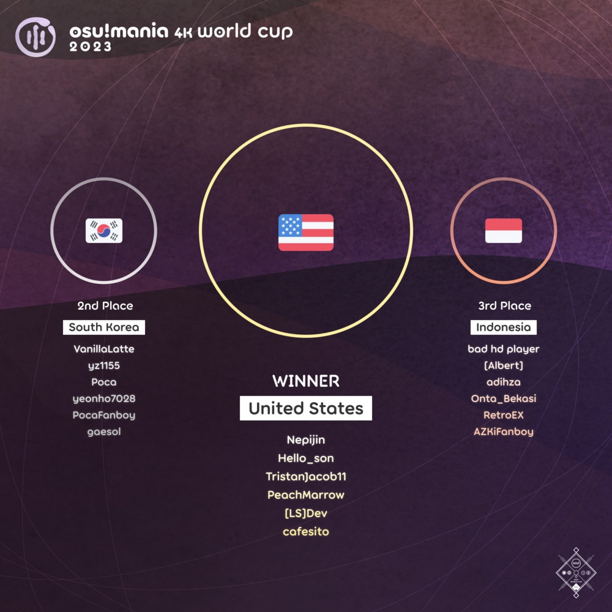

---
tags:
  - MWC2023
  - MWC 2023
  - MWC4K 2023
  - MWC 4K 2023
---

# osu!mania 4K World Cup 2023

The **osu!mania 4K World Cup 2023** (***MWC 4K 2023***) was a country-based osu!mania tournament hosted by the [osu! team](/wiki/People/osu!_team). It was the tenth instalment of the osu!mania 4K World Cup.

## Tournament schedule

| Event | Timestamp |
| --: | :-- |
| Registration phase | 2023-07-13/2023-07-27 (23:59 UTC) |
| Qualifier showcase | 2023-08-05 (11:00 UTC) |
| Qualifier stage | 2023-08-12/2023-08-13 |
| Round of 32 | 2023-08-19/2023-08-20 |
| Round of 16 | 2023-08-26/2023-08-27 |
| Quarterfinals | 2023-09-02/2023-09-03 |
| Semifinals | 2023-09-09/2023-09-10 |
| Finals | 2023-09-16/2023-09-17 |
| Grand Finals | 2023-09-23/2023-09-24 |

## Prizes

The osu!mania 4K World Cup 2023 offered a $2,000 cash prize pool and limited-edition merch.

| Placing | Prizes |
| :-: | :-- |
|  | 50% of the prize pool, single-run merch, profile badge, **osu!mania 4K Champion** user title for one year |
|  | 30% of the prize pool, single-run merch, profile badge |
|  | 20% of the prize pool, single-run merch, profile badge |

  

## Organisation

The osu!mania 4K World Cup 2023 was run by various community members.

| Position | Member(s) |
| :-- | :-- |
| Manager | ::{ flag=CA }:: [Azer](https://osu.ppy.sh/users/2155578), ::{ flag=US }:: [ChillierPear](https://osu.ppy.sh/users/9501251), ::{ flag=BR }:: [LeoFLT](https://osu.ppy.sh/users/3668779) |
| Mappool selector | ::{ flag=US }:: **[-mint-](https://osu.ppy.sh/users/8976576)**, ::{ flag=CA }:: [guden](https://osu.ppy.sh/users/11626065), ::{ flag=TH }:: [MyZterioN-](https://osu.ppy.sh/users/8521723), ::{ flag=FR }:: [Paturages](https://osu.ppy.sh/users/1375479) |
| Mappool playtester | ::{ flag=US }:: [\_Seth](https://osu.ppy.sh/users/8111953), ::{ flag=US }:: [\-mint\-](https://osu.ppy.sh/users/8976576), ::{ flag=CN }:: [\[Crz\]xz1z1z](https://osu.ppy.sh/users/10500832), ::{ flag=PH }:: [arccat](https://osu.ppy.sh/users/4848294), ::{ flag=CA }:: [guden](https://osu.ppy.sh/users/11626065), ::{ flag=BR }:: [Lothus](https://osu.ppy.sh/users/9530019), ::{ flag=US }:: [Matthia](https://osu.ppy.sh/users/19804607), ::{ flag=TH }:: [MyZterioN\-](https://osu.ppy.sh/users/8521723), ::{ flag=TH }:: [nanonbandusty](https://osu.ppy.sh/users/15543726), ::{ flag=FR }:: [Paturages](https://osu.ppy.sh/users/1375479), ::{ flag=KR }:: [SuddenDeath](https://osu.ppy.sh/users/6699923), ::{ flag=US }:: [SunApple](https://osu.ppy.sh/users/11817622), ::{ flag=PH }:: [Swarmsii](https://osu.ppy.sh/users/11716111), ::{ flag=KR }:: [Transcendence](https://osu.ppy.sh/users/903155) |
| Mapper | ::{ flag=US }:: [\-mint\-](https://osu.ppy.sh/users/8976576), ::{ flag=ID }:: [\[Crz\]Crysarlene](https://osu.ppy.sh/users/5492871), ::{ flag=TW }:: [\[Crz\]FolAH1217](https://osu.ppy.sh/users/6232458), ::{ flag=US }:: [0DZ0](https://osu.ppy.sh/users/28156707), ::{ flag=SG }:: [Abraxos](https://osu.ppy.sh/users/5025064), ::{ flag=SG }:: [aeoliancarp](https://osu.ppy.sh/users/1027529), ::{ flag=US }:: [elexire](https://osu.ppy.sh/users/9206093), ::{ flag=AU }:: [fvrex](https://osu.ppy.sh/users/11863699), ::{ flag=CA }:: [guden](https://osu.ppy.sh/users/11626065), ::{ flag=US }:: [Halogen\-](https://osu.ppy.sh/users/169992), ::{ flag=CL }:: [hna](https://osu.ppy.sh/users/12335541), ::{ flag=TH }:: [HowToPlayLN](https://osu.ppy.sh/users/10879600), ::{ flag=PH }:: [Hytex](https://osu.ppy.sh/users/8536263), ::{ flag=US }:: [lemonguy](https://osu.ppy.sh/users/4693052), ::{ flag=TH }:: [MyZterioN\-](https://osu.ppy.sh/users/8521723), ::{ flag=FR }:: [Paturages](https://osu.ppy.sh/users/1375479), ::{ flag=CA }:: [Pizza69](https://osu.ppy.sh/users/25285704), ::{ flag=SG }:: [Raveille](https://osu.ppy.sh/users/1388767), ::{ flag=TH }:: [RuleBlazing](https://osu.ppy.sh/users/7312402), ::{ flag=US }:: [Toaph Daddy](https://osu.ppy.sh/users/7616811), ::{ flag=CN }:: [YuEast 2018](https://osu.ppy.sh/users/13953619) |
| SV mapper/helper | ::{ flag=FR }:: **[Paturages](https://osu.ppy.sh/users/1375479)**, ::{ flag=CN }:: [AlexDunk](https://osu.ppy.sh/users/9194799), ::{ flag=PH }:: [arccat](https://osu.ppy.sh/users/4848294), ::{ flag=SG }:: [awdse22](https://osu.ppy.sh/users/8743513), ::{ flag=FR }:: [BlackyDay](https://osu.ppy.sh/users/5724831), ::{ flag=US }:: [Ciel](https://osu.ppy.sh/users/1455309), ::{ flag=SG }:: [Claren](https://osu.ppy.sh/users/9362562), ::{ flag=GB }:: [H1Pur](https://osu.ppy.sh/users/15756120), ::{ flag=ID }:: [Mipha\-](https://osu.ppy.sh/users/5767941), ::{ flag=PH }:: [notapplicable](https://osu.ppy.sh/users/7170536), ::{ flag=US }:: [NovaSagittarii](https://osu.ppy.sh/users/11664177), ::{ flag=CN }:: [Phukiir](https://osu.ppy.sh/users/4556538), ::{ flag=TH }:: [RuleBlazing](https://osu.ppy.sh/users/7312402), ::{ flag=SG }:: [TheFunk](https://osu.ppy.sh/users/13981991), ::{ flag=PL }:: [Tidek](https://osu.ppy.sh/users/743282), ::{ flag=CL }:: [WalterToro](https://osu.ppy.sh/users/5281416), ::{ flag=HK }:: [zero2snow](https://osu.ppy.sh/users/7751516) |
| Commentator | ::{ flag=NL }:: [Albionthegreat](https://osu.ppy.sh/users/9853595), ::{ flag=US }:: [Dynascape](https://osu.ppy.sh/users/8784587), ::{ flag=GB }:: [Eliminate](https://osu.ppy.sh/users/9169747), ::{ flag=AR }:: [juankristal](https://osu.ppy.sh/users/443656), ::{ flag=VN }:: [MashedPotato](https://osu.ppy.sh/users/10494860), ::{ flag=ID }:: [Mipha\-](https://osu.ppy.sh/users/5767941), ::{ flag=FR }:: [Paturages](https://osu.ppy.sh/users/1375479), ::{ flag=AU }:: [PotassiumF](https://osu.ppy.sh/users/4247722), ::{ flag=SG }:: [Raveille](https://osu.ppy.sh/users/1388767), ::{ flag=PH }:: [Silhoueska Elze](https://osu.ppy.sh/users/11517895), ::{ flag=US }:: [Sparky](https://osu.ppy.sh/users/3187959), ::{ flag=US }:: [SunApple](https://osu.ppy.sh/users/11817622), ::{ flag=US }:: [Toaph Daddy](https://osu.ppy.sh/users/7616811) |
| Referee | ::{ flag=NL }:: [Albionthegreat](https://osu.ppy.sh/users/9853595), ::{ flag=AU }:: [Fairy Bread](https://osu.ppy.sh/users/8306102), ::{ flag=BR }:: [LeoFLT](https://osu.ppy.sh/users/3668779), ::{ flag=NL }:: [nik](https://osu.ppy.sh/users/10077264), ::{ flag=IN }:: [Speshimen](https://osu.ppy.sh/users/7720204), ::{ flag=US }:: [tigereyes144](https://osu.ppy.sh/users/6499811), ::{ flag=GB }:: [Yazzehh](https://osu.ppy.sh/users/7068973), ::{ flag=US }:: [\[K\]](https://osu.ppy.sh/users/16551387) |
| Statistician | ::{ flag=FI }:: [shdewz](https://osu.ppy.sh/users/10000899) |

## Links

- [Information spreadsheet](https://docs.google.com/spreadsheets/d/1WecO9oKqjhV2y77XsRhUjs_d9nHwE45pnW_TsYruel4/edit?rm=minimal)
- [Weekly statistics spreadsheets](https://drive.google.com/drive/folders/1D0lgiieYly9SPb0522c3EimkwDqb07Z9)
- [Discussion thread](https://osu.ppy.sh/community/forums/topics/1792305)
- [Livestream](https://www.twitch.tv/osulive)
- [Pick'ems page](https://pickem.hwc.hr/tournaments/125) hosted by ::{ flag=DE }:: [hallowatcher](https://osu.ppy.sh/users/1874761)
- [Challonge bracket](https://challonge.com/MWC4K_2023)

## Participants

|  | Country | Members |
| :-: | :-: | :-- |
| ::{ flag=AR }:: | **Argentina** | **[C90](https://osu.ppy.sh/users/13858488)**, [BossPlays](https://osu.ppy.sh/users/7341471), [CatalepsiaX](https://osu.ppy.sh/users/27208738), [Hidrocarburo](https://osu.ppy.sh/users/6384643), [agusgex](https://osu.ppy.sh/users/14132796), [jLuyalb](https://osu.ppy.sh/users/7093698) |
| ::{ flag=AU }:: | **Australia** | **[ruka](https://osu.ppy.sh/users/6117525)**, [-Emptiness-](https://osu.ppy.sh/users/8151295), [\[Iron\]](https://osu.ppy.sh/users/13171482), [anim girl](https://osu.ppy.sh/users/6378800), [HD\_AdreNaline](https://osu.ppy.sh/users/10540368), [oct4](https://osu.ppy.sh/users/10303887) |
| ::{ flag=AT }:: | **Austria** | **[RealEric](https://osu.ppy.sh/users/16272683)**, [\[HL\]amoun](https://osu.ppy.sh/users/20748215), [AmNotProSike](https://osu.ppy.sh/users/27238908), [ElectroBeaty](https://osu.ppy.sh/users/6500478) |
| ::{ flag=BR }:: | **Brazil** | **[LeMarcinho](https://osu.ppy.sh/users/13347579)**, [SillyFangirl](https://osu.ppy.sh/users/2288363), [DemiFiendSMT](https://osu.ppy.sh/users/20051971), [Netroo](https://osu.ppy.sh/users/13769101), [Miku Meru](https://osu.ppy.sh/users/18943504), [Zergh](https://osu.ppy.sh/users/3181281) |
| ::{ flag=CA }:: | **Canada** | **[Stability](https://osu.ppy.sh/users/6701738)**, [Piggy](https://osu.ppy.sh/users/5390121), [GDMem](https://osu.ppy.sh/users/10804091), [mae0149](https://osu.ppy.sh/users/9188975), [walmart5193](https://osu.ppy.sh/users/16468962), [Dale940](https://osu.ppy.sh/users/13847951) |
| ::{ flag=CL }:: | **Chile** | **[myucchii](https://osu.ppy.sh/users/10072733)**, [\[LS\]bambi fnf](https://osu.ppy.sh/users/20360332), [\[REG\]Seika](https://osu.ppy.sh/users/24224930), [MyAngelKokomi](https://osu.ppy.sh/users/8880797), [nyawaa](https://osu.ppy.sh/users/10235085), [Xan-](https://osu.ppy.sh/users/5919873) |
| ::{ flag=CN }:: | **China** | **[\[Crz\]Caicium](https://osu.ppy.sh/users/10702235)**, [\[Crz\]Nickname](https://osu.ppy.sh/users/10817494), [\[Crz\]sunnyxxy](https://osu.ppy.sh/users/10333739), [\[GB\]Mafufu](https://osu.ppy.sh/users/10884561), [\[GB\]nyasun](https://osu.ppy.sh/users/16277321), [tyrcs](https://osu.ppy.sh/users/13026904) |
| ::{ flag=CO }:: | **Colombia** | **[AlexxiTo](https://osu.ppy.sh/users/16711124)**, [MarvelousCosmos](https://osu.ppy.sh/users/14189527), [ag0](https://osu.ppy.sh/users/17989209), [Saikuto](https://osu.ppy.sh/users/22095766), [robertokpro](https://osu.ppy.sh/users/24237864), [billabong89](https://osu.ppy.sh/users/13896159) |
| ::{ flag=CZ }:: | **Czechia** | **[grillroasted](https://osu.ppy.sh/users/18271627)**, [144p\_uhd](https://osu.ppy.sh/users/19156437), [aeko](https://osu.ppy.sh/users/16665306), [Kopie115](https://osu.ppy.sh/users/11353046), [meldylia25](https://osu.ppy.sh/users/17120248) |
| ::{ flag=DK }:: | **Denmark** | **[\[HD\]Urrk](https://osu.ppy.sh/users/11539225)**, [Lokkoro](https://osu.ppy.sh/users/17638079), [Stoom](https://osu.ppy.sh/users/13572493), [Haveaffald](https://osu.ppy.sh/users/12854716), [wlim](https://osu.ppy.sh/users/18609932), [SpamL](https://osu.ppy.sh/users/10102258) |
| ::{ flag=FI }:: | **Finland** | **[GhostByCamellia](https://osu.ppy.sh/users/9663200)**, [Lovelyn](https://osu.ppy.sh/users/8370443), [Albania Illya](https://osu.ppy.sh/users/10393606), [Fisu](https://osu.ppy.sh/users/12545346), [Crazzeh](https://osu.ppy.sh/users/5054154), [Leka](https://osu.ppy.sh/users/11408653) |
| ::{ flag=FR }:: | **France** | **[PatouZ](https://osu.ppy.sh/users/7306522)**, [Auraah](https://osu.ppy.sh/users/10015908), [Babibelbleu](https://osu.ppy.sh/users/16892459), [MisteurFR](https://osu.ppy.sh/users/14055233), [narahashi](https://osu.ppy.sh/users/18867523), [quentin5110054](https://osu.ppy.sh/users/8756421) |
| ::{ flag=DE }:: | **Germany** | **[ERA medium kek](https://osu.ppy.sh/users/11625617)**, [ERA Punish](https://osu.ppy.sh/users/10615367), [ERA Leo](https://osu.ppy.sh/users/15440118), [Cyaewin](https://osu.ppy.sh/users/10027302), [Lord\_Sp4rtakus](https://osu.ppy.sh/users/14114899), [jkzu123](https://osu.ppy.sh/users/15806513) |
| ::{ flag=GT }:: | **Guatemala** | **[Maxtulini](https://osu.ppy.sh/users/25345980)**, [babosodeuriel](https://osu.ppy.sh/users/31729635), [KuranteFanBoy](https://osu.ppy.sh/users/28764122), [Votchis](https://osu.ppy.sh/users/14862011) |
| ::{ flag=HN }:: | **Honduras** | **[\[HD\]Weathersito](https://osu.ppy.sh/users/24167604)**, [\[LS\]Runkus](https://osu.ppy.sh/users/13010686), [\[TMEO\]Calamidas](https://osu.ppy.sh/users/14285542), [--Dani--](https://osu.ppy.sh/users/31426298), [\_ItzSebas\_](https://osu.ppy.sh/users/22514283) |
| ::{ flag=HK }:: | **Hong Kong** | **[Ricizus](https://osu.ppy.sh/users/10395139)**, [Quotient](https://osu.ppy.sh/users/11313227), [MegMewtwoZ](https://osu.ppy.sh/users/13235067), [osu\_degenstage5](https://osu.ppy.sh/users/11563203), [racksack](https://osu.ppy.sh/users/18111392), [\[Mom\] -So1-](https://osu.ppy.sh/users/18265431) |
| ::{ flag=ID }:: | **Indonesia** | **[bad hd player](https://osu.ppy.sh/users/13385865)**, [\[Albert\]](https://osu.ppy.sh/users/12689667), [adihza](https://osu.ppy.sh/users/18309106), [Onta\_Bekasi](https://osu.ppy.sh/users/8677684), [RetroEX](https://osu.ppy.sh/users/10540515), [AZKiFanboy](https://osu.ppy.sh/users/5179764) |
| ::{ flag=IT }:: | **Italy** | **[Kiraz](https://osu.ppy.sh/users/3807675)**, [Veryi](https://osu.ppy.sh/users/13878539), [Bestfast](https://osu.ppy.sh/users/11616192), [gui on mania](https://osu.ppy.sh/users/12421640), [\[SPNG\]faxxed--](https://osu.ppy.sh/users/17051055), [\[SPNG\] Sim0](https://osu.ppy.sh/users/3262821) |
| ::{ flag=JP }:: | **Japan** | **[CrewK](https://osu.ppy.sh/users/11488604)**, [jhleetgirl](https://osu.ppy.sh/users/10745260), [AMDuskia1996](https://osu.ppy.sh/users/10242062), [ICECAKE](https://osu.ppy.sh/users/16100800), [gyoza\_goki](https://osu.ppy.sh/users/18144664), [9990\_y](https://osu.ppy.sh/users/25588443) |
| ::{ flag=MY }:: | **Malaysia** | **[ERA Leon](https://osu.ppy.sh/users/13382147)**, [\[MY\]Sol](https://osu.ppy.sh/users/12054898), [Onlinee](https://osu.ppy.sh/users/13630137), [JayLye](https://osu.ppy.sh/users/14892447), [Tosai\_](https://osu.ppy.sh/users/3760209), [\[GS\]Einar](https://osu.ppy.sh/users/8782656) |
| ::{ flag=MX }:: | **Mexico** | **[Plutes](https://osu.ppy.sh/users/11188249)**, [\[BBC\]Nyarutoru](https://osu.ppy.sh/users/17668607), [\[Crz\]Envy](https://osu.ppy.sh/users/11817815), [\[TK\]Mapxa](https://osu.ppy.sh/users/16078911), [Shadow\_GM](https://osu.ppy.sh/users/19554046), [Darkhechiser](https://osu.ppy.sh/users/23392961) |
| ::{ flag=NL }:: | **Netherlands** | **[Shoira](https://osu.ppy.sh/users/13377652)**, [Toxic Scent](https://osu.ppy.sh/users/12599154), [Quinnie why](https://osu.ppy.sh/users/16999311), [Ready Perfectly](https://osu.ppy.sh/users/10944966), [samuelhklumpers](https://osu.ppy.sh/users/10945523), [Cube9112](https://osu.ppy.sh/users/20454338) |
| ::{ flag=NO }:: | **Norway** | **[\[RS\] F4st](https://osu.ppy.sh/users/7676585)**, [carpal tunnel](https://osu.ppy.sh/users/23726452), [Danksquidboy](https://osu.ppy.sh/users/16678425), [Rushenality](https://osu.ppy.sh/users/24978350), [Zekronz](https://osu.ppy.sh/users/7220725), [Ziquids](https://osu.ppy.sh/users/10972799) |
| ::{ flag=PA }:: | **Panama** | **[Bolelo](https://osu.ppy.sh/users/23819962)**, [\[HD\]Softer64](https://osu.ppy.sh/users/8704966), [federicoqwq](https://osu.ppy.sh/users/24496781), [EliasGoku\_zk](https://osu.ppy.sh/users/24907290) |
| ::{ flag=PE }:: | **Peru** | **[-Lalito898](https://osu.ppy.sh/users/15098503)**, [akenyii-](https://osu.ppy.sh/users/22660023), [PouSlayer](https://osu.ppy.sh/users/17036965), [henryalexbr](https://osu.ppy.sh/users/23528661), [\[ Defuu- \]](https://osu.ppy.sh/users/25129861), [Sp3ctro](https://osu.ppy.sh/users/18344249) |
| ::{ flag=PH }:: | **Philippines** | **[Silhoueska Elze](https://osu.ppy.sh/users/11517895)**, [bojii](https://osu.ppy.sh/users/10083439), [7Kenn](https://osu.ppy.sh/users/20496815), [Apol-](https://osu.ppy.sh/users/18466725), [Vulpsi](https://osu.ppy.sh/users/12584420), [\[KN\]CuB-03](https://osu.ppy.sh/users/18560307) |
| ::{ flag=PL }:: | **Poland** | **[bagjettka](https://osu.ppy.sh/users/18338179)**, [\[EL\] endernubek](https://osu.ppy.sh/users/24847256), [\[Szy\]polymaridd](https://osu.ppy.sh/users/20372838), [CinematicGem634](https://osu.ppy.sh/users/19141228), [klobuck](https://osu.ppy.sh/users/29379793), [TheFalek](https://osu.ppy.sh/users/10214260) |
| ::{ flag=PR }:: | **Puerto Rico** | **[\[LS\]Jadix](https://osu.ppy.sh/users/19735496)**, [ovr](https://osu.ppy.sh/users/23922839), [FoxyGaming398YT\_old](https://osu.ppy.sh/users/14322727), [augie-](https://osu.ppy.sh/users/17753250) |
| ::{ flag=RO }:: | **Romania** | **[Mich\_](https://osu.ppy.sh/users/11784492)**, [\[LS\]Khu](https://osu.ppy.sh/users/12712916), [Bluestone413](https://osu.ppy.sh/users/17705451), [Kiirbo](https://osu.ppy.sh/users/14985143) |
| ::{ flag=RU }:: | **Russian Federation** | **[\[LN\]Nepko](https://osu.ppy.sh/users/11898245)**, [\[LN\]numuser](https://osu.ppy.sh/users/12585687), [-Oni-Chan-](https://osu.ppy.sh/users/10036005), [wolfpup08](https://osu.ppy.sh/users/11939641), [tchyoouschqueey](https://osu.ppy.sh/users/6691100), [RobotHaKolecax](https://osu.ppy.sh/users/26702763) |
| ::{ flag=SA }:: | **Saudi Arabia** | **[yui -](https://osu.ppy.sh/users/27404774)**, [MrFoap](https://osu.ppy.sh/users/26268474), [Raiden129](https://osu.ppy.sh/users/23034813), [spamr](https://osu.ppy.sh/users/29054558) |
| ::{ flag=SG }:: | **Singapore** | **[sukidayo-](https://osu.ppy.sh/users/16870002)**, [-Aishiteru-](https://osu.ppy.sh/users/13390529), [oyama mahiro](https://osu.ppy.sh/users/21207265), [Neon-Hooray](https://osu.ppy.sh/users/24058560), [McButt](https://osu.ppy.sh/users/18018708), [AdamAckerville](https://osu.ppy.sh/users/12297375) |
| ::{ flag=KR }:: | **South Korea** | **[VanillaLatte](https://osu.ppy.sh/users/10329095)**, [yz1155](https://osu.ppy.sh/users/2071008), [Poca](https://osu.ppy.sh/users/8581031), [yeonho7028](https://osu.ppy.sh/users/14952077), [PocaFanboy](https://osu.ppy.sh/users/6912079), [gaesol](https://osu.ppy.sh/users/12452131) |
| ::{ flag=ES }:: | **Spain** | **[ERA Guldakh](https://osu.ppy.sh/users/8553078)**, [ime](https://osu.ppy.sh/users/11649450), [ShiroPeDeFresa](https://osu.ppy.sh/users/16020685), [Enthalpy](https://osu.ppy.sh/users/9552883), [cartografiar](https://osu.ppy.sh/users/16118849), [itsdarious555](https://osu.ppy.sh/users/6809566) |
| ::{ flag=SE }:: | **Sweden** | **[Emik](https://osu.ppy.sh/users/3350987)**, [Lemmie](https://osu.ppy.sh/users/11700865), [NeonDrakon](https://osu.ppy.sh/users/6315000), [diamondBIaze](https://osu.ppy.sh/users/10553827), [himlavalv](https://osu.ppy.sh/users/15080920), [Parinya](https://osu.ppy.sh/users/7746055) |
| ::{ flag=CH }:: | **Switzerland** | **[Tupidix](https://osu.ppy.sh/users/8655604)**, [CrashSmash](https://osu.ppy.sh/users/13942150), [HongFanboy](https://osu.ppy.sh/users/16790509), [senkhyu](https://osu.ppy.sh/users/25159471) |
| ::{ flag=TW }:: | **Taiwan** | **[\[-NEinO-\]](https://osu.ppy.sh/users/8630038)**, [- Such -](https://osu.ppy.sh/users/16081867), [jackyjacky607](https://osu.ppy.sh/users/16191405), [Pdog4ni](https://osu.ppy.sh/users/14581544), [diablorex1234](https://osu.ppy.sh/users/11912607), [AradORiOn\_MMM](https://osu.ppy.sh/users/7960927) |
| ::{ flag=TH }:: | **Thailand** | **[konkawe](https://osu.ppy.sh/users/15665805)**, [--Pavin--](https://osu.ppy.sh/users/12046267), [parponger](https://osu.ppy.sh/users/28098890), [Monpluk](https://osu.ppy.sh/users/23299675), [AomDCO](https://osu.ppy.sh/users/21072569), [HowToBeIntel](https://osu.ppy.sh/users/6535376) |
| ::{ flag=UA }:: | **Ukraine** | **[SpookyKraken](https://osu.ppy.sh/users/13356854)**, [Arstz](https://osu.ppy.sh/users/10844754), [LonBertZend](https://osu.ppy.sh/users/10484445), [MISHASUMSKOY](https://osu.ppy.sh/users/26866383), [Not Who You Are](https://osu.ppy.sh/users/7762366), [Supercat935](https://osu.ppy.sh/users/14108520) |
| ::{ flag=GB }:: | **United Kingdom** | **[Zoobin4](https://osu.ppy.sh/users/10055204)**, [XxNewson1234xX](https://osu.ppy.sh/users/9895650), [binified](https://osu.ppy.sh/users/15760722), [MiniEgg\_23](https://osu.ppy.sh/users/25914360), [CoolDudeYes](https://osu.ppy.sh/users/24780361), [--Dragon--](https://osu.ppy.sh/users/11924624) |
| ::{ flag=US }:: | **United States** | **[Nepijin](https://osu.ppy.sh/users/11734610)**, [Hello\_Son](https://osu.ppy.sh/users/17308009), [TristanJacob11](https://osu.ppy.sh/users/11817838), [PeachMarrow](https://osu.ppy.sh/users/15926730), [\[LS\]Dev](https://osu.ppy.sh/users/16407268), [cafesito](https://osu.ppy.sh/users/7794488) |
| ::{ flag=VE }:: | **Venezuela** | **[Edvo](https://osu.ppy.sh/users/8301758)**, [xXShyzDy0133Xx](https://osu.ppy.sh/users/13545528), [YuyukoFangirl](https://osu.ppy.sh/users/10336332), [\_Moqn](https://osu.ppy.sh/users/13675628), [\[LS\]Fluzt](https://osu.ppy.sh/users/234026), [Konamp](https://osu.ppy.sh/users/27445750) |
| ::{ flag=VN }:: | **Vietnam** | **[\[LS\]Vixile](https://osu.ppy.sh/users/26233321)**, [Lott](https://osu.ppy.sh/users/13821222), [CPT\_Sivelia](https://osu.ppy.sh/users/12562107), [magnifestio](https://osu.ppy.sh/users/22725724), [\[LS\]Tokiyume](https://osu.ppy.sh/users/13219309), [TriDoanGaming](https://osu.ppy.sh/users/14009758) |

Captains are listed in **bold**.

The complete sign-up list can be found [here](https://gist.github.com/LeoFLT/4624beb19d9e806ed905ab1718c079c2#file-mwc4k-2023-player-list-csv).

## Podium

## Mappools

### Grand Finals

**[Download the mappack here (166 MB)](https://packs.ppy.sh/P224%20-%20osu!mania%204K%20World%20Cup%202023%3A%20Grand%20Finals.zip)**

- Rice
  1. [beta - Blue-White Crazystars (11Bit) \[twinkle (edit) x1.05\]](https://osu.ppy.sh/beatmapsets/2031745#mania/4310954)
  2. [Falcom Sound Team jdk - Believe It!! (lemonguy) \[Eclipse x1.05\]](https://osu.ppy.sh/beatmapsets/1638926#mania/3345153)
  3. [DJ SHARPNEL - SHINE!! (Shoegazer) \[Sakurakou!! 1.35x (273bpm)\]](https://osu.ppy.sh/beatmapsets/1446657#mania/2979765)
  4. [Camellia - Shinsha / HgS (Cut Ver.) (-mint-) \[Techno Music Techno Music Techno Music Techno Music\]](https://osu.ppy.sh/beatmapsets/2062237#mania/4311929)
  5. [Frums - END OF SYSTEM (Pizza69) \[END OF PIZZA 1.05x (189bpm)\]](https://osu.ppy.sh/beatmapsets/2062001#mania/4311169)
  6. [Shoji Meguro - Last Surprise (elexire) \[Ska's howing 1.05x (edit)\]](https://osu.ppy.sh/beatmapsets/2062238#mania/4311930)
  7. [Aquellex - Cortex Charger (Halogen-) \[Electrocution\]](https://osu.ppy.sh/beatmapsets/2062236#mania/4311928)
- Hybrid
  1. [xi - APOCALYPSE RAY (lemonguy) \[EXCEED\]](https://osu.ppy.sh/beatmapsets/2045249#mania/4269128)
  2. [Silentroom Remixed by Frums - Angel Echo -L'appel du vide- (Abraxos) \[le mot\]](https://osu.ppy.sh/beatmapsets/2062240#mania/4311937)
  3. [BilliumMoto - LIGHT LEFT BEHIND (-mint-) \[AND IN THE DARKNESS BIND THEM\]](https://osu.ppy.sh/beatmapsets/2062241#mania/4311938)
- Long Note
  1. [Yousei Teikoku - Kyuusei Argyros (MyZterioN-) \[purgatory o'clock (cut)\]](https://osu.ppy.sh/beatmapsets/2062249#mania/4311953)
  2. [Lime - Selenadia (\[Crz\]Crysarlene) \[Finality 1.05x (238bpm)\]](https://osu.ppy.sh/beatmapsets/2062245#mania/4311944)
  3. [wa. - Mugen houyou (-mint-) \[Impermanence\]](https://osu.ppy.sh/beatmapsets/1991601#mania/4138053)
  4. [lapix - Born 2 Lose (guden) \[inhumanly;\]](https://osu.ppy.sh/beatmapsets/2062247#mania/4311951)
- SV
  1. [Eliminate - MULA (Cut & Sped Up Ver.) (arccat) \[Patcat's Root of All Evil\]](https://osu.ppy.sh/beatmapsets/2062251#mania/4311956)
  2. [Kolaa & Mestie - Digibuprofen (Paturages) \[Lauren\]](https://osu.ppy.sh/beatmapsets/2062256#mania/4311995)
- Tiebreaker
  1. **[Camellia - Parallel Universe Shifter (-mint-) \[Quantum Field Disruption\]](https://osu.ppy.sh/beatmapsets/2062263#mania/4312004)**

### Finals

**[Download the mappack here (153 MB)](https://packs.ppy.sh/P223%20-%20osu%21mania%204K%20World%20Cup%202023%3A%20Finals.zip)**

- Rice
  1. [sasakure.UK - Bokura no 16bit Warz (Hylotl) \[1 0 0 0 0\]](https://osu.ppy.sh/beatmapsets/1996732#mania/4149957)
  2. [katagiri - STRONG 280 (Toaph Daddy) \[DESTRUCTION PUNCH\]](https://osu.ppy.sh/beatmapsets/1759474#mania/3600992)
  3. [Falcom Sound Team jdk - Desert After Tears (lemonguy) \[Inferno x1.1\]](https://osu.ppy.sh/beatmapsets/1599384#mania/3266500)
  4. [siromaru + cranky - conflict (guden) \[Prasueno\]](https://osu.ppy.sh/beatmapsets/2058788#mania/4303024)
  5. [Terminal 11 - Braindead (Pizza69) \[Metastasis 1.05x\]](https://osu.ppy.sh/beatmapsets/2058879#mania/4303210)
  6. [MAXIMUM THE HORMONE - What's up, people?! (Cut Ver.) (-mint-) \[Outburst\]](https://osu.ppy.sh/beatmapsets/2007678#mania/4176510)
  7. [Camellia - overcomplexification ("Quaternion" Long ver.) (0DZ0) \[convolution (cut)\]](https://osu.ppy.sh/beatmapsets/2058875#mania/4303205)
- Hybrid
  1. [MisoilePunch - Makear (guden) \[Ar'alkthyn\]](https://osu.ppy.sh/beatmapsets/2058789#mania/4303025)
  2. [VINCENT GANATCH - GENE \~A mix\~ (lemonguy) \[Another x1.05\]](https://osu.ppy.sh/beatmapsets/2058822#mania/4303097)
  3. [kanemiko - Cold Fusion (-mint-) \[Catalyst (cut 1.05x)\]](https://osu.ppy.sh/beatmapsets/2058817#mania/4303090)
- Long Note
  1. [TUYU - Anoyo-iki no Bus ni Notte Saraba. (Raveille) \[To the other side. 1.1x\]](https://osu.ppy.sh/beatmapsets/2058811#mania/4303080)
  2. [Masayoshi Oishi - Kamiari Algorithm (katagiri Bootleg) (YuEast 2018) \[kami x1.10\]](https://osu.ppy.sh/beatmapsets/2058829#mania/4303115)
  3. [CHUBAY - FataL EntanglemEnt (-mint-) \[Acute\]](https://osu.ppy.sh/beatmapsets/2058819#mania/4303094)
  4. [Kommisar - Clover (lemonguy) \[LN Master\]](https://osu.ppy.sh/beatmapsets/2058816#mania/4303089)
- SV
  1. [Yooh - Elemental Ethnic (TheFunk) \[Savage Vortex\]](https://osu.ppy.sh/beatmapsets/2058808#mania/4303108)
  2. [ColBreakz - 100.000 (Cut Ver.) (BlackyDay) \[Marvelous\]](https://osu.ppy.sh/beatmapsets/2058830#mania/4303120)
- Tiebreaker
  1. **[D-D-Dice vs. siromaru - Catch the Glory (Toaph Daddy) \[Grand Finale\]](https://osu.ppy.sh/beatmapsets/2058832#mania/4303123)**

### Semifinals

**[Download the mappack here (162 MB)](https://packs.ppy.sh/P222%20-%20osu%21mania%204K%20World%20Cup%202023%3A%20Semifinals.zip)**

- Rice
  1. [MOMOIRO CLOVER Z - SARABA, Itoshiki Kanashimitachi yo (YuEast 2018) \[Nightmare x1.05\]](https://osu.ppy.sh/beatmapsets/2055295#mania/4294646)
  2. [goreshit - thinking of you (Shoegazer) \[eternity 1.2x (272bpm)\]](https://osu.ppy.sh/beatmapsets/1749736#mania/3770381)
  3. [LV.4 feat. Chiaki Iwasaki - B.O.L. (hna) \[Revolution\]](https://osu.ppy.sh/beatmapsets/2055265#mania/4294594)
  4. [Remo-con - Matt Silver (elexire) \[Vermillion 1.05x (153bpm)\]](https://osu.ppy.sh/beatmapsets/2055306#mania/4294670)
  5. [Terminal 11 - I'm In No Mood For This (Halogen-) \[Apathy\]](https://osu.ppy.sh/beatmapsets/2055287#mania/4294628)
  6. [The Dillinger Escape Plan with Mike Patton - Hollywood Squares (Shoegazer) \[Extreme\]](https://osu.ppy.sh/beatmapsets/873192#mania/3019182)
  7. [Frums - Mdrqnxtagon (Matthia) \[Crystalline 1.05x\]](https://osu.ppy.sh/beatmapsets/2053448#mania/4289276)
- Hybrid
  1. [Kayuki - Kangokurakuou (guden) \[Efflorescence\]](https://osu.ppy.sh/beatmapsets/2055331#mania/4294725)
  2. [Camellia - Looking for Edge of Ground (Cut Ver.) (-mint-) \[Isekai\]](https://osu.ppy.sh/beatmapsets/2055289#mania/4294631)
  3. [Spire - Libidinem (\[Crz\]FolAH1217) \[Fragmentation (cut)\]](https://osu.ppy.sh/beatmapsets/2055280#mania/4294616)
- Long Note
  1. [Kairiki bear - Lemming-ming feat. flower (\[Crz\]Crysarlene) \[Dissonance\]](https://osu.ppy.sh/beatmapsets/2055279#mania/4294615)
  2. [yuikonnu & ayaponzu\* - Super Nuko World (Cut Ver.) (YuEast 2018) \[nyanya x1.10\]](https://osu.ppy.sh/beatmapsets/2055293#mania/4294641)
  3. [DJ TECHNORCH feat. Uchuu\*Kurage - Konno Hiori no konjiki teigen (lemonguy) \[Another x1.05\]](https://osu.ppy.sh/beatmapsets/2055075#mania/4294101)
  4. [youman feat. MEIKA HIME - Lostalgie (Cut Ver.) (-mint-) \[Pseudanthia 1.15x\]](https://osu.ppy.sh/beatmapsets/2055291#mania/4294634)
- SV
  1. [ZxNX as "Delaina" - End Me (Phukiir) \[CHOKE\]](https://osu.ppy.sh/beatmapsets/2055294#mania/4294644)
  2. [litmus\* - Showdown (NovaSagittarii) \[a chair and six crt tvs in a dimly lit room\]](https://osu.ppy.sh/beatmapsets/2055296#mania/4294649)
- Tiebreaker
  1. **[Frums - HALL (guden) \[NULL\]](https://osu.ppy.sh/beatmapsets/2055332#mania/4294726)**

### Quarterfinals

**[Download the mappack here (120 MB)](https://packs.ppy.sh/P221%20-%20osu%21mania%204K%20World%20Cup%202023%3A%20Quarterfinals.zip)**

- Rice
  1. [linear ring with RNAcid - Gypsophila (MyZterioN-) \[blossom 1.1x (166bpm)\]](https://osu.ppy.sh/beatmapsets/1805950#mania/4283526)
  2. [seatrus - Cosmo Station (Blessia) \[Orbis x1.1\]](https://osu.ppy.sh/beatmapsets/2046586#mania/4272125)
  3. [EvOke - Edison (Miaurichesu) \[Challenge (Edit) 1.1x (146bpm)\]](https://osu.ppy.sh/beatmapsets/2050560#mania/4281865)
  4. [Camellia - Break The Silence (0DZ0) \[Challenge\]](https://osu.ppy.sh/beatmapsets/2051831#mania/4284901)
  5. [Kazuma Kiryu (CV: Takaya Kuroda) - Baka Mitai (elexire) \[Ska's n no. . (edit)\]](https://osu.ppy.sh/beatmapsets/2051835#mania/4284906)
  6. [Frums - Nisemono (Pizza69) \[Impostor (cut 1.05x)\]](https://osu.ppy.sh/beatmapsets/2051825#mania/4284888)
- Hybrid
  1. [MisoilePunch -Forever- - Bloomin' (guden) \[Flowerin'\]](https://osu.ppy.sh/beatmapsets/2051734#mania/4284664)
  2. [Camellia - Upload Your Mind :: Download My Soul (Cut Ver.) (-mint-) \[Multidimensional\]](https://osu.ppy.sh/beatmapsets/2051840#mania/4284920)
  3. [M-O-T-U - Calculator (\[Crz\]FolAH1217) \[.857142\]](https://osu.ppy.sh/beatmapsets/2051746#mania/4284700)
- Long Note
  1. [paraoka - Astra Walkthrough (\[Crz\]Crysarlene) \[Faded Stars\]](https://osu.ppy.sh/beatmapsets/2051679#mania/4284564)
  2. [Helblinde - Heaven's Fall (guden) \[Firmaments\]](https://osu.ppy.sh/beatmapsets/2051737#mania/4284669)
  3. [Toromaru - Erinyes (Toaph Daddy) \[Enigma\]](https://osu.ppy.sh/beatmapsets/2051839#mania/4284918)
- SV
  1. [AltVoid - Sample enSemble (Tidek) \[SV asSemble\]](https://osu.ppy.sh/beatmapsets/2051846#mania/4284932)
  2. [EZFG - Cyber Thunder Cider (zero2snow) \[??\]](https://osu.ppy.sh/beatmapsets/2051849#mania/4284940)
- Tiebreaker
  1. **[Camellia feat. Ninomae Ina'nis - Drenched in Air (elexire) \[Submerge\]](https://osu.ppy.sh/beatmapsets/2051843#mania/4284926)**

### Round of 16

**[Download the mappack here (147 MB)](https://packs.ppy.sh/P220%20-%20osu%21mania%204K%20World%20Cup%202023%3A%20Round%20of%2016.zip)**

- Rice
  1. [IV OF SPADES - Come Inside My Heart (Sped Up Ver.) (bad hd player) \[Boundaries 1.05x (158bpm)\]](https://osu.ppy.sh/beatmapsets/1943116#mania/4242933)
  2. [Falcom Sound Team jdk - Infinity Rage (lemonguy) \[Nightmare\]](https://osu.ppy.sh/beatmapsets/1637362#mania/3341549)
  3. [Falcom Sound Team jdk - Lift-off! (lemonguy) \[Valimar x1.05\]](https://osu.ppy.sh/beatmapsets/2034984#mania/4242761)
  4. [OSTER project - innocent revolver (Mipha-) \[WirryWoo & bmah's Challenge 1.05x (163bpm)\]](https://osu.ppy.sh/beatmapsets/2048077#mania/4276109)
  5. [felys feat. Yoko Natsukawa - Celsus (0DZ0) \[Extra 1.05x (173bpm)\]](https://osu.ppy.sh/beatmapsets/2048071#mania/4276098)
  6. [Reizoko Cj - Happy Arnold=) (hi19hi19) \[Nice To Meet You=)\]](https://osu.ppy.sh/beatmapsets/2040243#mania/4256058)
- Hybrid
  1. [Official HIGE DANdism - Bad for me (Dz'Xa's Amenpunk) (\[Crz\]FolAH1217) \[Bittersweet (edit 1.1x)\]](https://osu.ppy.sh/beatmapsets/2044480#mania/4267194)
  2. [BlackY fused with WAiKURO - Alea jacta est! (xi Remix) \[Short Edit\] (HowToPlayLN) \[Terminus\]](https://osu.ppy.sh/beatmapsets/2047935#mania/4275868)
  3. [nitro - amygdata (-mint-) \[synapse\]](https://osu.ppy.sh/beatmapsets/2048073#mania/4276105)
- Long Note
  1. [sasakure.UK + UKRampage - FUTURE EVE feat. Hatsune Miku (Hytex) \[METAVERSE\]](https://osu.ppy.sh/beatmapsets/2048074#mania/4276106)
  2. [Seiryu - AO-Infinity (-mint-) \[Everlasting\]](https://osu.ppy.sh/beatmapsets/2048072#mania/4276104)
  3. [Toromaru - Deorbit (elexire) \[Asynchrony\]](https://osu.ppy.sh/beatmapsets/2048064#mania/4276082)
- SV
  1. [Getty - Mr. Scratch Man (Cut Ver.) (AlexDunk) \[:mr.skullman:\]](https://osu.ppy.sh/beatmapsets/2048067#mania/4276089)
  2. [Yunosuke feat. Sennzai - Komplexe (notapplicable) \[Kurohime's Counterattack\]](https://osu.ppy.sh/beatmapsets/2048005#mania/4275989)
- Tiebreaker
  1. **[Frums - of Ambrosia (-mint-) \[4K Elixir\]](https://osu.ppy.sh/beatmapsets/1900478#mania/3917445)**

### Round of 32

**[Download the mappack here (101 MB)](https://packs.ppy.sh/P219%20-%20osu%21mania%204K%20World%20Cup%202023%3A%20Round%20of%2032.zip)**

- Rice
  1. [Kugimiya Rie - Hajimete Shimasho! (Ska) \[1.1\]](https://osu.ppy.sh/beatmapsets/1999823#mania/4157435)
  2. [DJ Sharpnel - LITTLE GOD CH@NNEL (LeiN-) \[Laevateinn Sword 1.15x (217bpm)\]](https://osu.ppy.sh/beatmapsets/2022076#mania/4211268)
  3. [cosMo@BousouP - Hopeful Frontier!!! (Mipha-) \[bmah's Challenge\]](https://osu.ppy.sh/beatmapsets/2044090#mania/4266250)
  4. [STAYC - POPPY (Cut Ver.) (hna) \[Lover\]](https://osu.ppy.sh/beatmapsets/2044114#mania/4266308)
  5. [MAXIMUM THE HORMONE - HAWATARI NIOKU CENTI (TV Size) (Shoegazer) \[WOODCHITA\]](https://osu.ppy.sh/beatmapsets/1874786#mania/4267958)
- Hybrid
  1. [ARM - Water Lily (elexire) \[Lotus (cut) 1.05x\]](https://osu.ppy.sh/beatmapsets/2044117#mania/4266313)
  2. [Jun Kuroda - Cybernetics (RuleBlazing) \[Risky Algorithm 1.1x\]](https://osu.ppy.sh/beatmapsets/2044116#mania/4266311)
- Long Note
  1. [GFRIEND - Tarot Cards (fvrex) \[Predetermined Fate\]](https://osu.ppy.sh/beatmapsets/2044079#mania/4266234)
  2. [Lime - 8bit Voyager (Toaph Daddy) \[Rocketeer\]](https://osu.ppy.sh/beatmapsets/2044115#mania/4266309)
  3. [t+pazolite - CENSORED!! (-mint-) \[EXPLICIT\]](https://osu.ppy.sh/beatmapsets/1878634#mania/3867039)
- SV
  1. [NewJeans - OMG (ZSunder remix) (RuleBlazing) \[rabbit\]](https://osu.ppy.sh/beatmapsets/2044122#mania/4266321)
  2. [Tanchiky - ULTRA SYNERGY MATRIX (H1Pur) \[ICBM\]](https://osu.ppy.sh/beatmapsets/2044125#mania/4266332)
- Tiebreaker
  1. **[ikaruga\_nex - SICK ROCK CRAZY (-mint-) \[NOW LET ME SEE YOU DROP IT\]](https://osu.ppy.sh/beatmapsets/2044131#mania/4266340)**

### Qualifiers

**[Download the mappack here (46 MB)](https://packs.ppy.sh/P218%20-%20osu%21mania%204K%20World%20Cup%202023%3A%20Qualifiers.zip)**

1. [sakuraburst - sha (Cut Ver.) (Paturages) \[Stage 1: blake\]](https://osu.ppy.sh/beatmapsets/2039247#mania/4253502)
2. [Frums - ultra-blazures (Cut Ver.) (aeoliancarp) \[Stage 2: amalgam\]](https://osu.ppy.sh/beatmapsets/2039339#mania/4253751)
3. [xi - Tenimuhou (Cut Ver.) (elexire) \[Stage 3: Absolute\]](https://osu.ppy.sh/beatmapsets/2039240#mania/4253493)
4. [technoplanet feat. Haruno - End of Fairytale (Raveille) \[Stage 4: Parable\]](https://osu.ppy.sh/beatmapsets/2039243#mania/4253496)
5. [Hino Isuka vs. Umeboshi Chazuke - Ultra Happy Miracle Bazoooooka!! (Toaph Daddy) \[Stage 5: Overjoy\]](https://osu.ppy.sh/beatmapsets/2039298#mania/4253649)
6. [Camellia - onslaught -Retaliation of Bahamut- (guden) \[Stage 6: Massacre\]](https://osu.ppy.sh/beatmapsets/2039253#mania/4253513)
7. [katagiri - AMEN KATAGIRI GENERATION (-mint-) \[Stage 7: Revival\]](https://osu.ppy.sh/beatmapsets/2039237#mania/4253489)
8. [Kou! - Xuasar Charge (0DZ0) \[Stage 8: A Sea of Stars\]](https://osu.ppy.sh/beatmapsets/2039336#mania/4253740)

## Match results

### Grand Finals

Detailed statistics for this round can be found [here](https://docs.google.com/spreadsheets/d/1xmZBVo5_7lV7VubjsAzFkxyDEtwBNKMj66N0R3deF_M/edit?rm=minimal).

Saturday, 23 September 2023:

| Team A |  |  | Team B | Match link | VOD link |
| --: | :-: | :-: | :-- | :-- | :-- |
| **South Korea** ::{ flag=KR }:: | **7** | 0 | ::{ flag=ID }:: Indonesia | [#1](https://osu.ppy.sh/community/matches/110580928) | [#1](https://www.twitch.tv/videos/1933061220) |

Sunday, 24 September 2023:

| Team A |  |  | Team B | Match link | VOD link |
| --: | :-: | :-: | :-- | :-- | :-- |
| **United States** ::{ flag=US }:: | **7** | 3 | ::{ flag=KR }:: South Korea | [#1](https://osu.ppy.sh/community/matches/110593518) | [#1](https://www.twitch.tv/videos/1933741044) |

### Finals

Detailed statistics for this round can be found [here](https://docs.google.com/spreadsheets/d/1voKD7H9x6Wo0B5LdlueuA4LfPo-mBLxUWOfj7-mMlzg/edit?rm=minimal).

Saturday, 16 September 2023:

| Team A |  |  | Team B | Match link | VOD link |
| --: | :-: | :-: | :-- | :-- | :-- |
| Japan ::{ flag=JP }:: | 6 | **7** | ::{ flag=TH }:: **Thailand** | [#1](https://osu.ppy.sh/community/matches/110479629) | [#1](https://www.twitch.tv/videos/1926996943) |
| Brazil ::{ flag=BR }:: | 6 | **7** | ::{ flag=ID }:: **Indonesia** | [#1](https://osu.ppy.sh/community/matches/110484408) | [#1](https://www.twitch.tv/videos/1927139174) |

Sunday, 17 September 2023:

| Team A |  |  | Team B | Match link | VOD link |
| --: | :-: | :-: | :-- | :-- | :-- |
| South Korea ::{ flag=KR }:: | 3 | **7** | ::{ flag=US }:: **United States** | [#1](https://osu.ppy.sh/community/matches/110493949) | [#1](https://www.twitch.tv/videos/1927621031) |
| Thailand ::{ flag=TH }:: | 4 | **7** | ::{ flag=ID }:: **Indonesia** | [#1](https://osu.ppy.sh/community/matches/110500530) | [#1](https://www.twitch.tv/videos/1927949732) |

### Semifinals

Detailed statistics for this round can be found [here](https://docs.google.com/spreadsheets/d/1meOFMiIXiDLaQ0mbuyYFp_Nv0btdUho9C51N7lLgios/edit?rm=minimal).

Saturday, 9 September 2023:

| Team A |  |  | Team B | Match link | VOD link |
| --: | :-: | :-: | :-- | :-- | :-- |
| Philippines ::{ flag=PH }:: | 4 | **7** | ::{ flag=CA }:: **Canada** | [#1](https://osu.ppy.sh/community/matches/110374746) | [#1](https://www.twitch.tv/videos/1920796820) |
| **Thailand** ::{ flag=TH }:: | **7** | 6 | ::{ flag=CN }:: China | [#1](https://osu.ppy.sh/community/matches/110380554) | [#1](https://www.twitch.tv/videos/1921140746) |
| **Indonesia** ::{ flag=ID }:: | **7** | 1 | ::{ flag=HK }:: Hong Kong | [#1](https://osu.ppy.sh/community/matches/110381909) | [#1](https://www.twitch.tv/videos/1921140746?t=1h23m31s) |
| **Chile** ::{ flag=CL }:: | **7** | 6 | ::{ flag=VN }:: Vietnam | [#1](https://osu.ppy.sh/community/matches/110384206) | [#1](https://www.twitch.tv/videos/1921272921) |
| **United States** ::{ flag=US }:: | **7** | 4 | ::{ flag=JP }:: Japan | [#1](https://osu.ppy.sh/community/matches/110384840) | [#1](https://www.twitch.tv/videos/1921272040) |

Sunday, 10 September 2023:

| Team A |  |  | Team B | Match link | VOD link |
| --: | :-: | :-: | :-- | :-- | :-- |
| Canada ::{ flag=CA }:: | 1 | **7** | ::{ flag=TH }:: **Thailand** | [#1](https://osu.ppy.sh/community/matches/110394501) | [#1](https://www.twitch.tv/videos/1921758061) |
| **South Korea** ::{ flag=KR }:: | **7** | 2 | ::{ flag=BR }:: Brazil | [#1](https://osu.ppy.sh/community/matches/110399024) | [#1](https://www.twitch.tv/videos/1925191800) |
| **Indonesia** ::{ flag=ID }:: | **7** | 2 | ::{ flag=CL }:: Chile | [#1](https://osu.ppy.sh/community/matches/110401118) | [#1](https://www.twitch.tv/videos/1922067694) |

### Quarterfinals

Detailed statistics for this round can be found [here](https://docs.google.com/spreadsheets/d/1GTrzQGdYoRs0Zz2bEgZ2vMZ1ZWVFQJtEVelXrm3N4hk/edit?rm=minimal).

Saturday, 2 September 2023:

| Team A |  |  | Team B | Match link | VOD link |
| --: | :-: | :-: | :-- | :-- | :-- |
| **Hong Kong** ::{ flag=HK }:: | **6** | 2 | ::{ flag=PE }:: Peru | [#1](https://osu.ppy.sh/community/matches/110276466) | [#1](https://www.twitch.tv/videos/1915244507) |
| **Vietnam** ::{ flag=VN }:: | **6** | 2 | ::{ flag=AU }:: Australia | [#1](https://osu.ppy.sh/community/matches/110278521) | [#1](https://www.twitch.tv/videos/1915245239) |
| **South Korea** ::{ flag=KR }:: | **6** | 4 | ::{ flag=TH }:: Thailand | [#1](https://osu.ppy.sh/community/matches/110279274) | [#1](https://www.twitch.tv/videos/1915247587) |
| Spain ::{ flag=ES }:: | 2 | **6** | ::{ flag=DE }:: **Germany** | [#1](https://osu.ppy.sh/community/matches/110281016) | [#1](https://www.twitch.tv/videos/1915250092) |
| **Singapore** ::{ flag=SG }:: | **6** | 1 | ::{ flag=NL }:: Netherlands | [#1](https://osu.ppy.sh/community/matches/110281465) | [#1](https://www.twitch.tv/videos/1915253307) |
| **China** ::{ flag=CN }:: | **6** | 0 | ::{ flag=RU }:: Russian Federation | [#1](https://osu.ppy.sh/community/matches/110282149) | [#1](https://www.twitch.tv/videos/1915250092?t=0h52m10s) |
| **United Kingdom** ::{ flag=GB }:: | **6** | 2 | ::{ flag=IT }:: Italy | [#1](https://osu.ppy.sh/community/matches/110283943) | [#1](https://www.twitch.tv/videos/1915254129) |
| **France** ::{ flag=FR }:: | **6** | 0 | ::{ flag=MY }:: Malaysia | [#1](https://osu.ppy.sh/community/matches/110283947) | [#1](https://www.twitch.tv/videos/1915251168) |
| **United States** ::{ flag=US }:: | **6** | 0 | ::{ flag=CL }:: Chile | [#1](https://osu.ppy.sh/community/matches/110289986) | [#1](https://www.twitch.tv/videos/1915769214) |
| **Canada** ::{ flag=CA }:: | **6** | 1 | ::{ flag=MX }:: Mexico | [#1](https://osu.ppy.sh/community/matches/110290873) | [#1](https://www.twitch.tv/videos/1915769214?t=0h37m45s) |

Sunday, 3 September 2023:

| Team A |  |  | Team B | Match link | VOD link |
| --: | :-: | :-: | :-- | :-- | :-- |
| **Canada** ::{ flag=CA }:: | **6** | 2 | ::{ flag=SG }:: Singapore | [#1](https://osu.ppy.sh/community/matches/110294603) | [#1](https://www.twitch.tv/videos/1915821631) |
| **Hong Kong** ::{ flag=HK }:: | **6** | 2 | ::{ flag=DE }:: Germany | [#1](https://osu.ppy.sh/community/matches/110297919) | [#1](https://www.twitch.tv/videos/1916107957) |
| **Vietnam** ::{ flag=VN }:: | **6** | 1 | ::{ flag=GB }:: United Kingdom | [#1](https://osu.ppy.sh/community/matches/110299873) | [#1](https://www.twitch.tv/videos/1916087038?t=0h43m49s) |
| **China** ::{ flag=CN }:: | **6** | 0 | ::{ flag=FR }:: France | [#1](https://osu.ppy.sh/community/matches/110299874) | [#1](https://www.twitch.tv/videos/1916087038) |
| **Japan** ::{ flag=JP }:: | **6** | 3 | ::{ flag=ID }:: Indonesia | [#1](https://osu.ppy.sh/community/matches/110299948) | [#1](https://www.twitch.tv/videos/1916109239) |
| Philippines ::{ flag=PH }:: | 3 | **6** | ::{ flag=BR }:: **Brazil** | [#1](https://osu.ppy.sh/community/matches/110300777) | [#1](https://www.twitch.tv/videos/1916109239?t=1h0m42s) |

### Round of 16

Detailed statistics for this round can be found [here](https://docs.google.com/spreadsheets/d/1FEhO1h7XNYfx8ZsefF73A9nzO50Hn08wVDMrOfLjgCU/edit?rm=minimal).

Saturday, 26 August 2023:

| Team A |  |  | Team B | Match link | VOD link |
| --: | :-: | :-: | :-- | :-- | :-- |
| **South Korea** ::{ flag=KR }:: | **6** | 0 | ::{ flag=GB }:: United Kingdom | [#1](https://osu.ppy.sh/community/matches/110172031) | [#1](https://www.twitch.tv/videos/1910260649) |
| **Philippines** ::{ flag=PH }:: | **6** | 1 | ::{ flag=ES }:: Spain | [#1](https://osu.ppy.sh/community/matches/110172901) | [#1](https://www.twitch.tv/videos/1910260649?t=0h42m6s) |
| Finland ::{ flag=FI }:: | 1 | **6** | ::{ flag=RU }:: **Russian Federation** | [#1](https://osu.ppy.sh/community/matches/110173669) | [#1](https://www.twitch.tv/videos/1910260649?t=1h29m21s) |
| Sweden ::{ flag=SE }:: | 3 | **6** | ::{ flag=MY }:: **Malaysia** | [#1](https://osu.ppy.sh/community/matches/110174563) | [#1](https://www.twitch.tv/videos/1910260649?t=3h8m12s) |
| **Japan** ::{ flag=JP }:: | **6** | 0 | ::{ flag=SG }:: Singapore | [#1](https://osu.ppy.sh/community/matches/110174495) | [#1](https://www.twitch.tv/videos/1910260649?t=2h16m4s) |
| Taiwan ::{ flag=TW }:: | 1 | **6** | ::{ flag=IT }:: **Italy** | [#1](https://osu.ppy.sh/community/matches/110175518) | [#1](https://www.twitch.tv/videos/1910260649?t=3h12m31s) |
| Argentina ::{ flag=AR }:: | 2 | **6** | ::{ flag=NL }:: **Netherlands** | [#1](https://osu.ppy.sh/community/matches/110180189) | [#1](https://www.twitch.tv/videos/1910261498) |

Sunday, 27 August 2023:

| Team A |  |  | Team B | Match link | VOD link |
| --: | :-: | :-: | :-- | :-- | :-- |
| Colombia ::{ flag=CO }:: | 0 | **6** | ::{ flag=AU }:: **Australia** | [#1](https://osu.ppy.sh/community/matches/110185466) | [#1](https://www.twitch.tv/videos/1910262252) |
| Vietnam ::{ flag=VN }:: | 5 | **6** | ::{ flag=TH }:: **Thailand** | [#1](https://osu.ppy.sh/community/matches/110191325) | [#1](https://www.twitch.tv/videos/1910266325) |
| **Brazil** ::{ flag=BR }:: | **6** | 2 | ::{ flag=HK }:: Hong Kong | [#1](https://osu.ppy.sh/community/matches/110191308) | [#1](https://www.twitch.tv/videos/1910298188) |
| **Chile** ::{ flag=CL }:: | **6** | 2 | ::{ flag=CN }:: China | [#1](https://osu.ppy.sh/community/matches/110192153) | [#1](https://www.twitch.tv/videos/1910266325?t=1h14m58s) |
| Ukraine ::{ flag=UA }:: | 2 | **6** | ::{ flag=PE }:: **Peru** | [#1](https://osu.ppy.sh/community/matches/110192666) | [#1](https://www.twitch.tv/videos/1910299034) |
| **Indonesia** ::{ flag=ID }:: | **6** | 2 | ::{ flag=CA }:: Canada | [#1](https://osu.ppy.sh/community/matches/110193122) | [#1](https://www.twitch.tv/videos/1910266325?t=1h56m0s) |
| **United States** ::{ flag=US }:: | **6** | 0 | ::{ flag=FR }:: France | [#1](https://osu.ppy.sh/community/matches/110194104) | [#1](https://www.twitch.tv/videos/1910266325?t=2h55m50s) |
| **Germany** ::{ flag=DE }:: | **6** | 4 | ::{ flag=PL }:: Poland | [#1](https://osu.ppy.sh/community/matches/110194867) | [#1](https://www.twitch.tv/videos/1910266325?t=3h52m10s) |
| Venezuela ::{ flag=VE }:: | 0 | **6** | ::{ flag=MX }:: **Mexico** | [#1](https://osu.ppy.sh/community/matches/110196829) | [#1](https://www.twitch.tv/videos/1910296688) |

### Round of 32

Detailed statistics for this round can be found [here](https://docs.google.com/spreadsheets/d/1zrEQoKY8FULXYRhIxs5pKUn4L30Tvc3Kbrx85CyEBTg/edit?rm=minimal).

Saturday, 19 August 2023:

| Team A |  |  | Team B | Match link | VOD link |
| --: | :-: | :-: | :-- | :-- | :-- |
| **Hong Kong** ::{ flag=HK }:: | **5** | 1 | ::{ flag=MY }:: Malaysia | [#1](https://osu.ppy.sh/community/matches/110064568) | [#1](https://www.twitch.tv/videos/1902951645) |
| **Singapore** ::{ flag=SG }:: | **5** | 0 | ::{ flag=AU }:: Australia | [#1](https://osu.ppy.sh/community/matches/110064993) | [#1](https://www.twitch.tv/videos/1902951645?t=0h38m34s) |
| **Thailand** ::{ flag=TH }:: | **5** | 0 | ::{ flag=NL }:: Netherlands | [#1](https://osu.ppy.sh/community/matches/110065554) | [#1](https://www.twitch.tv/videos/1902951645?t=1h9m24s) |
| **China** ::{ flag=CN }:: | **5** | 0 | ::{ flag=PL }:: Poland | [#1](https://osu.ppy.sh/community/matches/110066205) | [#1](https://www.twitch.tv/videos/1902951645?t=1h41m4s) |
| **Spain** ::{ flag=ES }:: | **5** | 1 | ::{ flag=RU }:: Russian Federation | [#1](https://osu.ppy.sh/community/matches/110066881) | [#1](https://www.twitch.tv/videos/1902939533) |
| **Indonesia** ::{ flag=ID }:: | **5** | 0 | ::{ flag=TW }:: Taiwan | [#1](https://osu.ppy.sh/community/matches/110066824) | [#1](https://www.twitch.tv/videos/1902951645?t=2h14m34s) |
| **Vietnam** ::{ flag=VN }:: | **5** | 1 | ::{ flag=AR }:: Argentina | [#1](https://osu.ppy.sh/community/matches/110068138) | [#1](https://www.twitch.tv/videos/1902995807) |
| **United States** ::{ flag=US }:: | **5** | 0 | ::{ flag=UA }:: Ukraine | [#1](https://osu.ppy.sh/community/matches/110068488) | [#1](https://www.twitch.tv/videos/1903004517) |

Sunday, 20 August 2023:

| Team A |  |  | Team B | Match link | VOD link |
| --: | :-: | :-: | :-- | :-- | :-- |
| **South Korea** ::{ flag=KR }:: | **5** | 0 | ::{ flag=VE }:: Venezuela | [#1](https://osu.ppy.sh/community/matches/110077941) | [#1](https://www.twitch.tv/videos/1903633246) |
| **Philippines** ::{ flag=PH }:: | **5** | 0 | ::{ flag=FI }:: Finland | [#1](https://osu.ppy.sh/community/matches/110082166) | [#1](https://www.twitch.tv/videos/1903791701) |
| **Japan** ::{ flag=JP }:: | **5** | 0 | ::{ flag=CO }:: Colombia | [#1](https://osu.ppy.sh/community/matches/110082731) | [#1](https://www.twitch.tv/videos/1903791701?t=0h37m10s) |
| **Brazil** ::{ flag=BR }:: | **5** | 1 | ::{ flag=SE }:: Sweden | [#1](https://osu.ppy.sh/community/matches/110086957) | [#1](https://www.twitch.tv/videos/1904224585) |
| Peru ::{ flag=PE }:: | 2 | **5** | ::{ flag=FR }:: **France** | [#1](https://osu.ppy.sh/community/matches/110087037) | [#1](https://www.twitch.tv/videos/1904226490) |
| **Canada** ::{ flag=CA }:: | **5** | 1 | ::{ flag=IT }:: Italy | [#1](https://osu.ppy.sh/community/matches/110087783) | [#1](https://www.twitch.tv/videos/1904224585?t=0h40m18s) |
| **Chile** ::{ flag=CL }:: | **5** | 1 | ::{ flag=DE }:: Germany | [#1](https://osu.ppy.sh/community/matches/110088553) | [#1](https://www.twitch.tv/videos/1904224585?t=1h19m29s) |
| Mexico ::{ flag=MX }:: | 3 | **5** | ::{ flag=GB }:: **United Kingdom** | [#1](https://osu.ppy.sh/community/matches/110089553) | [#1](https://www.twitch.tv/videos/1904224585?t=1h53m41s) |

### Qualifiers

The final standings for the Qualifier stage can be found in the following [spreadsheet](https://docs.google.com/spreadsheets/d/10cHUoOHx4uAI-tNsVLTyOVLSFldaG8yg7IRzgbOXNEU/edit?rm=minimal).

| Seed | Country | rating sum[^qualifiers-seeding] | avg. score[^qualifiers-tiebreaker] |
| :-: | :-- | :-- | :-- |
| #1 | ::{ flag=KR }:: South Korea | 2.69 | 2,978,429 |
| #2 | ::{ flag=US }:: United States | 2.795 | 2,980,163 |
| #3 | ::{ flag=JP }:: Japan | 4.35 | 2,976,461 |
| #4 | ::{ flag=PH }:: Philippines | 5.805 | 2,971,789 |
| #5 | ::{ flag=BR }:: Brazil | 5.97 | 2,970,409 |
| #6 | ::{ flag=ID }:: Indonesia | 6.935 | 2,963,358 |
| #7 | ::{ flag=CL }:: Chile | 7.01 | 2,969,126 |
| #8 | ::{ flag=VN }:: Vietnam | 8.595 | 2,966,144 |
| #9 | ::{ flag=TH }:: Thailand | 9.36 | 2,959,041 |
| #10 | ::{ flag=CN }:: China | 9.37 | 2,966,153 |
| #11 | ::{ flag=CA }:: Canada | 10.915 | 2,959,954 |
| #12 | ::{ flag=HK }:: Hong Kong | 11.865 | 2,953,057 |
| #13 | ::{ flag=ES }:: Spain | 15.225 | 2,952,472 |
| #14 | ::{ flag=SG }:: Singapore | 15.845 | 2,948,277 |
| #15 | ::{ flag=PE }:: Peru | 16.025 | 2,944,132 |
| #16 | ::{ flag=MX }:: Mexico | 16.74 | 2,942,984 |
| #17 | ::{ flag=GB }:: United Kingdom | 18.085 | 2,933,748 |
| #18 | ::{ flag=FR }:: France | 19.02 | 2,938,687 |
| #19 | ::{ flag=AU }:: Australia | 19.705 | 2,924,902 |
| #20 | ::{ flag=RU }:: Russian Federation | 20.08 | 2,924,817 |
| #21 | ::{ flag=MY }:: Malaysia | 20.92 | 2,932,322 |
| #22 | ::{ flag=IT }:: Italy | 21.33 | 2,922,791 |
| #23 | ::{ flag=PL }:: Poland | 21.995 | 2,904,610 |
| #24 | ::{ flag=NL }:: Netherlands | 23.49 | 2,908,577 |
| #25 | ::{ flag=AR }:: Argentina | 23.77 | 2,899,815 |
| #26 | ::{ flag=DE }:: Germany | 25.05 | 2,909,806 |
| #27 | ::{ flag=TW }:: Taiwan | 26.045 | 2,880,408 |
| #28 | ::{ flag=SE }:: Sweden | 26.61 | 2,901,906 |
| #29 | ::{ flag=FI }:: Finland | 27.61 | 2,895,313 |
| #30 | ::{ flag=CO }:: Colombia | 28.38 | 2,853,744 |
| #31 | ::{ flag=UA }:: Ukraine | 29.47 | 2,866,572 |
| #32 | ::{ flag=VE }:: Venezuela | 32.09 | 2,846,653 |
| #33 | ::{ flag=RO }:: Romania | 32.785 | 2,808,878 |
| #34 | ::{ flag=CH }:: Switzerland | 34.44 | 2,811,460 |
| #35 | ::{ flag=GT }:: Guatemala | 34.78 | 2,723,176 |
| #36 | ::{ flag=DK }:: Denmark | 35.575 | 2,815,193 |
| #37 | ::{ flag=PR }:: Puerto Rico | 36.68 | 2,788,363 |
| #38 | ::{ flag=NO }:: Norway | 36.915 | 2,740,152 |
| #39 | ::{ flag=CZ }:: Czechia | 37.88 | 2,759,092 |
| #40 | ::{ flag=AT }:: Austria | 38.655 | 2,755,957 |
| #41 | ::{ flag=PA }:: Panama | 40.145 | 2,595,515 |
| #42 | ::{ flag=HN }:: Honduras | *DNP* | *DNP* |
| #42 | ::{ flag=SA }:: Saudi Arabia | *DNP* | *DNP* |

## Ruleset

### Tournament rules

1. The osu!mania 4K World Cup is a country-based 3 versus 3 double-elimination team tournament, played on the osu!mania game mode (4K variant).
   - Players from countries or territories (as seen on their profile flag) that are under a protectorate or sovereign state may choose to play for that country **if** the country listed on their profile is unable to field enough players to form a valid team. Refer to [this article](https://wikipedia.org/wiki/Dependent_territory#Lists_of_dependent_territories) for an overview of the criteria adopted.
2. Beatmap scoring is based on ScoreV2.
3. The minimum size for a team is 4 players, and the maximum is 6.
4. The mappool for each round will be announced by the mappool selectors on the official stream, on the Sunday before the matches take place.
5. The match schedules for each round will be announced by the tournament managers on this page, as well as the information sheet, on the Sunday before the matches take place.
6. Use of the Visual Settings to alter background dim or disable beatmap elements like storyboards and skins is allowed.
   - Custom skin elements must not be used to alter core gameplay elements or mechanics in unintended ways.
7. If less than the minimum amount of required players are present at match time, the match can be postponed for up to 10 minutes. If after this period there are still not enough players for either team, a *win by default* will be declared for the side with the most members present.
   - The minimum amount of required players is the amount of players needed to play a beatmap without any vacant spots in the lobby (i.e. at least 3 participants from each team must be present for the match to begin).
8. Exchanging players between games is allowed without limitations.
9. If a game ends in a draw, it will be nullified and the beatmap will be replayed.
10. Teams may ask for a rematch if a team member encounters technical issues while playing within 30 seconds or 25% of the beatmap drain length (whichever happens first) of the game's start. Referees may, at their discretion, veto this request.
    - "Lag spikes" are not considered a valid reason to rematch a beatmap.
    - The roster for each team during a rematch must remain the same as the original run. If that is not possible, e.g. by virtue of a technical issue that prevents a player from entering the lobby, both teams will be allowed to swap rosters.
    - This rule is not to be abused. Referees may veto a rematch request if they find that this is the case.
11. If a player disconnects mid-game, their scores will not be counted towards their team's total, unless adequate proof of said score is provided. The following are considered as acceptable proof:
    - Player point-of-view live stream snippets (commonly referred to as "clips" or "VODs"). The entirety of the play, along with the results screen must be clearly visible along with the affected player's score.
    - Replay files of the play, taken directly from the "Local scores" tab on the affected player's client (the timestamps must exactly match the time at which the game took place, as seen on the multiplayer lobby link).
    - Screenshots from other players taken directly in-game that show the affected player's score.
      - Screenshots from the results screen must clearly show the affected player's score. This is the preferred method.
      - Screenshots taken in-game at the time of disconnection may be accepted. Note that this method does not provide a one-to-one representation of that player's score. Using this method is not encouraged and it may be denied at the referee's discretion if the information provided is not sufficient to identify the player/score.
      - All screenshots **MUST** be taken using the game itself (using `Shift` + `F12`), that is, they must be hosted on the `https://osu.ppy.sh/` domain. Any other form of screenshot will be denied.
    - Player scores may be derived from the official stream as a last resort, in cases where the match is streamed.
12. Players are expected to keep the match running fluently and without delays. Excessive match delays from the players' side may result in penalties being applied by the tournament managers. Disrupting the match by foul play, insulting or provoking other players or staff, delaying the match, and other deliberate inappropriate misbehaviour are strictly prohibited, and will be punished accordingly.
13. Any attempts to manipulate bracket outcomes or future matchups may result in the immediate disqualification of the player or team from the competition. Examples of manipulative behavior include, but are not limited to:
    - Colluding with other players or teams to force a desired matchup.
    - Deliberately playing poorly to lose a game or match.
    - Forfeiting bracket matches without providing an adequate reasoning, or with the intention of getting a more favourable matchup.
14. All players and staff must be treated with respect. Instructions from the referees and the tournament managers are to be followed. Decisions labelled as final are not to be objected.
15. The multiplayer chatrooms underlie the [osu! community rules](/wiki/Rules). All chat rules apply to the multiplayer chatrooms where the matches will take place.
    - Breaking the chat rules may result in a silence. Silenced players cannot participate in multiplayer matches and must be exchanged for the duration of the punishment.
16. Penalties for violating the tournament rules include, but are not limited to:
    - Exclusion of specific players for one beatmap.
    - Exclusion of specific players for an entire match.
    - Declaring the match as forfeited, or as a win by default for the other team.
    - Disqualification from the entire tournament.
    - Disqualification from the current and future official tournaments, until appealed.
17. Referees may allow, at their discretion, lower or higher tolerances for timers.
18. The tournament managers may request liveplays or recordings of individual players or teams at any point in the tournament without prior warning.
19. The tournament managers will be responsible for receiving and investigating any tournament-related complaints.
20. The tournament managers reserve the right to modify these rules at any moment. Any such changes will be announced in advance.

### Tournament registration

1. Every user interested in joining their country's team signs up individually.
   - The tournament managers will create a list of potential candidates for a country's team.
   - The tournament managers will declare one candidate captain of their country's team.
   - The provisional captain will receive a private message on the osu! website containing further instructions, via the announcement feature, titled "osu!mania 4K World Cup 2023 - Team {Country Name}".
2. The provisional captain will then form their team by selecting players from the candidate pool for their country.
   - Captains are expected to choose team members with honesty and good will, with the aim of fielding the strongest team possible.
   - Captains are allowed to exclude themselves from the team list.
   - Captains are allowed to conduct and coordinate "tryouts", tests to gauge player aptitude, on their own terms.
   - Captains are allowed, at any time, to transfer their role to other prospective team members. Once given, only the new captain may assign the captaincy to another player.
   - **Teams that do not send their team list by August 4, 2023 (23:59 UTC) will be disqualified from the competition.**
3. To ensure valid registrations, every prospective participant will be manually checked by the [account support team](/wiki/People/Account_support_team), in a manner similar to the [tournament screening](/wiki/Tournaments/Official_support#tournament-screening) that is offered to community tournaments.
   - Every registered user will be assigned to their respective country's candidate list.
   - To be successfully accepted on the list, players are required to be placed #5,000 or higher on the osu!mania 4K global ranking, and not have violated the [osu! community rules](/wiki/Rules) within the last 12 months.
4. All successfully formed teams will be published after the registration phase on this page.
   - A team should have at least 4 players registered to have the chance to play the Qualifier stage.
5. Tournament staff members are **not** allowed to play in the tournament, with the exception of commentators and streamers.

### Qualifier instructions

1. In the Qualifier stage, all teams will play a specific pool designed by the mappool selectors.
2. The Qualifier pool contains 8 maps, all of which will use [Free Mod](/wiki/Gameplay/Game_modifier#free-mod) rules. There will be no tiebreakers for this stage.
3. Teams will be asked to play the mappool twice at a designated time. The team's best playthrough will be used for seeding.
4. The mappool is to be played according to the order listed on this page.
   - Teams may skip playing any beatmap on their second run.
5. Each team must have 3 members play each map. They may be exchanged freely after a map is concluded.
6. An optional 3-minute break will be offered between the first and second playthrough of the mappool.
7. All teams will play their qualifiers in separate rooms. It is *suggested* that teams do not broadcast or share their results publicly to avoid seed manipulation.
   - Multiple teams may be grouped into a singular room if there are not enough referees available at match time.
8. The seeding method used for Qualifiers will be weighted rank sum, where each team's map rank will be multiplied by a predetermined weight and then added together to compose that team's final score, which is then sorted from lowest to highest, lowest being seed #1.
   - The exact formula that will be used for each map is `Map score = RANK(Team score) * Map weight`, where `RANK` is the function that ranks the current `Team score` against all team scores for the current map, and `Map weight` is the weight for the current map, as defined by the table below.
   - The final team score to be sorted is defined as `Final score = SUM(Map score)`, i.e. the sum of each map's `Map score`.
9. The top 32 seeded teams will advance to the Round of 32.

The weights for the Qualifiers are as follows:

|  | Stage 1 | Stage 2 | Stage 3 | Stage 4 | Stage 5 | Stage 6 | Stage 7 | Stage 8 |
| --: | :-: | :-: | :-: | :-: | :-: | :-: | :-: | :-: |
| **Weight** | 0.100 | 0.145 | 0.125 | 0.115 | 0.125 | 0.115 | 0.140 | 0.135 |

### Stage instructions

1. Following the Qualifiers, a double-elimination bracket will be played — for teams in the winners bracket, the winning team continues in the same bracket, while the losing team gets moved to the losers bracket, where any further defeats will eliminate the team from the competition.
2. Teams in the losers bracket must play up to 2 matches each weekend, starting from the Quarterfinals.

### Win conditions

- In the Qualifiers, teams need to place in the top 32 seeded teams in order to advance to the double-elimination stage.
- In the Round of 32, teams need to win 5 maps to win a match (best of 9).
- In the Round of 16 and Quarterfinals, teams need to win 6 maps to win a match (best of 11).
- In the Semifinals, Finals and Grand Finals, teams need to win 7 maps to win the match (best of 13).
  - *Note: for the Grand Finals match, the team that is coming from the winners bracket is required to win one "set", that is, one best of 13, to win the tournament. The team coming from the losers bracket, however, needs to win 2 sets.*

### Match instructions

1. A referee will create a multiplayer room 10 minutes before the scheduled match time. Teams must join the lobby in that period.
   - The room settings are `Game mode: "osu!mania"`, `Team mode: "Team Vs"` and `Score mode: "ScoreV2"`. The room name must follow the pattern of `MWC4K2023: ({Red Team}) VS ({Blue Team})`. The team mentioned first in the room name must be the red team, the team mentioned second in the room name must be the blue team.
2. Each captain must use `!roll` once in the match's chatroom. After the rolls are set, the pick and ban phase will have the following steps:
   1. The winner of the `!roll` starts protecting one beatmap, followed by the loser of the `!roll` to protect a beatmap. They may not protect the same beatmap. Protected beatmaps may not be banned.
   2. The loser of the `!roll` starts banning one beatmap, followed by the winner of the `!roll` to ban a beatmap.
   3. The winner of the `!roll` starts picking the first beatmap of the match.
3. After bans are decided, both teams will take turns in picking a beatmap from the mappool.
4. Teams will be allowed 2 minutes to pick a beatmap and 2 minutes to press the `Ready` button on their client. If a team takes more time than allotted for either action, the procedures adopted will be as follows:
   - For the first occurrence:
     - The team will receive a verbal warning from the referee; in addition, the referee may opt to forcefully use the team's tactical timeout to allow for the team to pick.
     - If the team does not pick a map within 15 seconds from when the timer expires, the referee will apply the procedure for subsequent occurrences listed below, i.e. a random pick will be used for a pick timer, and the match will be forcefully started for a ready timer.
   - On subsequent occurrences:
     - For a pick timer: a random map will be chosen from the mappool using `!roll X`, where X is the number of beatmaps that were neither picked nor banned, excluding the tiebreaker.
     - For a ready timer: the referee will issue the `!mp start 10` command, regardless of how many players from each team are present in the lobby, using `!mp kick` on any extra players for each team, starting from the top (i.e. the first valid player combination for each team will be forced to play the pick). The results for such games are to be taken as is.
     - Repeat offenders may receive further sanctions from the tournament managers.
5. In the case of a team starting a map with less than the optimal number of players on their roster due to an unforeseen circumstance (e.g. a technical issue or unavoidable player absence), the team in question will be granted the right to fill their roster before play commences. The remainder of the original roster must stay the same, i.e. only player additions are allowed.
6. Each team will receive one "tactical timeout" of 2 minutes, to be used as extra time to ban, protect, pick, or ready for a beatmap. *The tactical timeout is optional.*
   - The tactical timeout may be called on a tiebreaker, provided that both teams' captains agree to it.

### Mappool instructions

1. Every stage will have its own mappool.
2. Each mappool consists of a fixed amount of maps each stage, all of which will be played under [Free Mod](/wiki/Gameplay/Game_modifier#free-mod) conditions.
3. The mappool sizes are as follows:
   - Qualifiers: 8 beatmaps
   - Round of 32: 13 beatmaps
   - Round of 16 and Quarterfinals: 15 beatmaps
   - Semifinals and Finals and Grand Finals: 17 beatmaps
4. Each mappool has one tiebreaker, except for the Qualifiers.
5. Possible mod choices for the Free Mod bracket are No Fail, Hidden, Fade In, Flashlight, and Mirror.
6. Failed scores will be counted. To that end, the [No Fail](/wiki/Gameplay/Game_modifier/No_Fail) mod will be enforced on every beatmap.
   - Teams that purposefully disregard this instruction and team fail as a result will lose said game.
7. The tiebreaker will be played under Free Mod conditions, but players will be exempt from the mod requirement.

### Scheduling instructions

1. Each stage will be held on **a single weekend**.
2. Matches in the Qualifiers will be held during specific time slots proposed by the tournament managers. Each team may choose a time slot in which they want to play.
   - **Teams that do not pick a time slot by August 10, 2023 (23:59 UTC) will be disqualified from the competition.**
3. All bracket stages will be held between Saturday 00:00 and Sunday 19:00 UTC.
4. Match scheduling will be handled by the tournament managers. Schedules will be released on the Sunday before the first matches of the stage. The tournament managers will try to create the schedule to respect the participants' time zones.
   - In the Quarterfinals and subsequent stages, team captains may inform tournament managers if they expect a specific time slot to be unavailable in the following week.
5. **Reschedules will only be considered if both teams agree to a time and communicate it to the tournament managers, before Wednesday 23:59 UTC of the week when the match is to take place.**
   - Matches may not be scheduled to any time beyond **Sunday, 19:00 UTC** of the week they are to be played at.
   - **Do not ask for a reschedule unless it is absolutely necessary. The tournament managers reserve the right to deny any rescheduling request.**
   - Late reschedule requests will not be accepted under any circumstances.
6. Captains are responsible for their team's availability.

## Notes

[^qualifiers-seeding]: Used as the main seeding method
[^qualifiers-tiebreaker]: Used as a tiebreaker when two teams have the same rating sum
