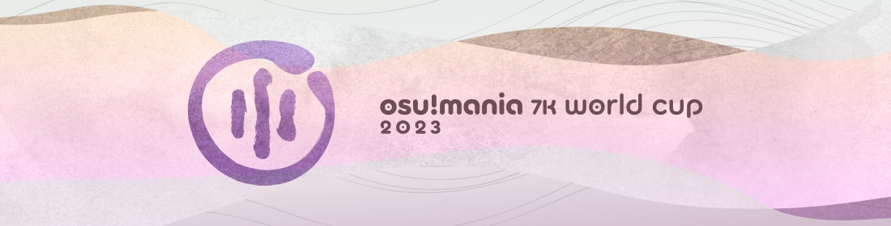

---
tags:
  - MWC2023
  - MWC 2023
  - MWC7K 2023
  - MWC 7K 2023
---

# osu!mania 7K World Cup 2023

The **osu!mania 7K World Cup 2023** (***MWC 7K 2023***) was a country-based osu!mania tournament hosted by the [osu! team](/wiki/People/osu!_team). It was the seventh instalment of the osu!mania 7K World Cup.

## Tournament schedule

| Event | Timestamp |
| --: | :-- |
| Registration phase | 2022-12-15/2022-12-29 |
| Qualifier showcase | 2023-01-08 (14:00 UTC) |
| Qualifier stage | 2023-01-14/2023-01-15 |
| Round of 16 | 2023-01-21/2023-01-22 |
| Quarterfinals | 2023-01-28/2023-01-29 |
| Semifinals | 2023-02-04/2023-02-05 |
| Finals | 2023-02-11/2023-02-12 |
| Grand Finals | 2023-02-18/2023-02-19 |

## Prizes

The osu!mania 7K World Cup 2023 offered a minimum $1,200 cash prize pool and limited edition merch. The prize pool was further increased to $1,320 from **[community donations](https://opencollective.com/osu-tournaments/events/osu-mania-7k-world-cup-2023-502fec83).**

| Placing | Prizes |
| :-: | :-- |
|  | 50% of the prize pool, single-run merch, profile badge, **osu!mania 7K Champion** user title for one year |
|  | 30% of the prize pool, single-run merch, profile badge |
|  | 20% of the prize pool, single-run merch, profile badge |

  

## Organisation

The osu!mania 7K World Cup 2023 was run by the osu! team and various community members.

| Position | Member(s) |
| :-- | :-- |
| Manager | ::{ flag=CA }:: [Azer](https://osu.ppy.sh/users/2155578), ::{ flag=US }:: [ChillierPear](https://osu.ppy.sh/users/9501251), ::{ flag=BR }:: [LeoFLT](https://osu.ppy.sh/users/3668779) |
| Mappool selector | ::{ flag=PL }:: **[\_underjoy](https://osu.ppy.sh/users/2235750)**, ::{ flag=US }:: [Blocko](https://osu.ppy.sh/users/4075092), ::{ flag=US }:: [Jinjin](https://osu.ppy.sh/users/3360737), ::{ flag=PH }:: [MapleSyrup\-](https://osu.ppy.sh/users/1192936), ::{ flag=KR }:: [Remuring](https://osu.ppy.sh/users/6522146) |
| Referee | ::{ flag=NL }:: [Albionthegreat](https://osu.ppy.sh/users/9853595), ::{ flag=AU }:: [Fairy Bread](https://osu.ppy.sh/users/8306102), ::{ flag=BR }:: [LeoFLT](https://osu.ppy.sh/users/3668779), ::{ flag=NL }:: [nik](https://osu.ppy.sh/users/10077264), ::{ flag=IN }:: [Speshimen](https://osu.ppy.sh/users/7720204), ::{ flag=US }:: [tigereyes144](https://osu.ppy.sh/users/6499811), ::{ flag=GB }:: [Yazzehh](https://osu.ppy.sh/users/7068973), ::{ flag=US }:: [\[K\]](https://osu.ppy.sh/users/16551387) |
| Mappool playtester | ::{ flag=MY }:: [\_Kobii](https://osu.ppy.sh/users/6209713), ::{ flag=US }:: [\-coro\-](https://osu.ppy.sh/users/15513891), ::{ flag=US }:: [\-NoName\-](https://osu.ppy.sh/users/10400730), ::{ flag=KR }:: [Kim\_GodSSI](https://osu.ppy.sh/users/2218047), ::{ flag=PH }:: [lenpai](https://osu.ppy.sh/users/5314573), ::{ flag=BR }:: [roko100789](https://osu.ppy.sh/users/3224958), ::{ flag=AU }:: [ruka](https://osu.ppy.sh/users/6117525), ::{ flag=PH }:: [SurfChu85](https://osu.ppy.sh/users/4469895) |
| Mapper | ::{ flag=CN }:: [\_Stan](https://osu.ppy.sh/users/1653229), ::{ flag=MY }:: [Critical\_Star](https://osu.ppy.sh/users/3793196), ::{ flag=CA }:: [guden](https://osu.ppy.sh/users/11626065), ::{ flag=KR }:: [Kim\_GodSSI](https://osu.ppy.sh/users/2218047), ::{ flag=DE }:: [Leeju](https://osu.ppy.sh/users/18219603), ::{ flag=PH }:: [lenpai](https://osu.ppy.sh/users/5314573), ::{ flag=SG }:: [Level 51](https://osu.ppy.sh/users/3617847), ::{ flag=ID }:: [Maxus](https://osu.ppy.sh/users/4335785), ::{ flag=KR }:: [paradoxus\_](https://osu.ppy.sh/users/11185275), ::{ flag=PH }:: [paulkappa](https://osu.ppy.sh/users/7115625), ::{ flag=GB }:: [Pope Gadget](https://osu.ppy.sh/users/2288341), ::{ flag=HK }:: [pwhk](https://osu.ppy.sh/users/4887865), ::{ flag=AU }:: [ruka](https://osu.ppy.sh/users/6117525), ::{ flag=PH }:: [SurfChu85](https://osu.ppy.sh/users/4469895), ::{ flag=KR }:: [Wonki](https://osu.ppy.sh/users/7898495) |
| Commentator | ::{ flag=MY }:: [Cryolien](https://osu.ppy.sh/users/1626983), ::{ flag=AR }:: [juankristal](https://osu.ppy.sh/users/443656), ::{ flag=ID }:: [Mipha\-](https://osu.ppy.sh/users/5767941), ::{ flag=AU }:: [PotassiumF](https://osu.ppy.sh/users/4247722), ::{ flag=SG }:: [Raveille](https://osu.ppy.sh/users/1388767), ::{ flag=PH }:: [Silhoueska Elze](https://osu.ppy.sh/users/11517895), ::{ flag=PH }:: [SurfChu85](https://osu.ppy.sh/users/4469895), ::{ flag=US }:: [Toaph Daddy](https://osu.ppy.sh/users/7616811), ::{ flag=US }:: [\-mint\-](https://osu.ppy.sh/users/8976576), ::{ flag=US }:: [\-Sparky\-](https://osu.ppy.sh/users/3187959) |
| Statistician | ::{ flag=BR }:: **[LeoFLT](https://osu.ppy.sh/users/3668779)**, ::{ flag=FI }:: [shdewz](https://osu.ppy.sh/users/10000899) |

## Links

- [Livestream](https://www.twitch.tv/osulive)
- [Discussion thread](https://osu.ppy.sh/community/forums/topics/1690687)
- [Challonge bracket](https://challonge.com/MWC7K_2023)
- [Pick'ems page](https://pickem.hwc.hr/tournaments/106) hosted by ::{ flag=DE }:: [hallowatcher](https://osu.ppy.sh/users/1874761)
- [Information spreadsheet](https://docs.google.com/spreadsheets/d/e/2PACX-1vRQVIOCI9kotrvH-FWrip3BlS37lVN9AacPfTlDDXbW-zTfOxqKFtuKZw7yodW6UBSSzijuKJag0biI/pubhtml)

## Participants

|  | Country | Members |
| :-: | :-: | :-- |
| ::{ flag=AR }:: | **Argentina** | **[lxLucasxl](https://osu.ppy.sh/users/3632846)**, [LeongKat](https://osu.ppy.sh/users/11429144), [Greedom](https://osu.ppy.sh/users/10696707), [ottenst](https://osu.ppy.sh/users/13488325) |
| ::{ flag=AU }:: | **Australia** | **[Bounter](https://osu.ppy.sh/users/11149878)**, [K0nomi](https://osu.ppy.sh/users/11993799), [PotassiumF](https://osu.ppy.sh/users/4247722) |
| ::{ flag=BR }:: | **Brazil** | **[Makiba](https://osu.ppy.sh/users/7539957)**, [Lothus](https://osu.ppy.sh/users/9530019), [SillyFangirl](https://osu.ppy.sh/users/2288363), [tartbtw](https://osu.ppy.sh/users/8748747) |
| ::{ flag=CA }:: | **Canada** | **[LelPop](https://osu.ppy.sh/users/10242770)**, [UmmmMrMoo](https://osu.ppy.sh/users/15314355), [HarambeFanBoy](https://osu.ppy.sh/users/13622614), [Dale940](https://osu.ppy.sh/users/13847951) |
| ::{ flag=CL }:: | **Chile** | **[Matiias](https://osu.ppy.sh/users/3215366)**, [Skalim](https://osu.ppy.sh/users/2225008), [faz\_cL](https://osu.ppy.sh/users/7853143), [ItzBenja616](https://osu.ppy.sh/users/8538906) |
| ::{ flag=CN }:: | **China** | **[tyrcs](https://osu.ppy.sh/users/13026904)**, [\[Crz\]Satori](https://osu.ppy.sh/users/7082178), [QingJiDing](https://osu.ppy.sh/users/10569738), [4kGameBye](https://osu.ppy.sh/users/89545) |
| ::{ flag=CZ }:: | **Czech Republic** | **[Tiputo](https://osu.ppy.sh/users/12399822)**, [grillroasted](https://osu.ppy.sh/users/18271627), [TomisNotGood](https://osu.ppy.sh/users/16360055) |
| ::{ flag=DK }:: | **Denmark** | **[Fritte](https://osu.ppy.sh/users/5001658)**, [Stoom](https://osu.ppy.sh/users/13572493) |
| ::{ flag=EC }:: | **Ecuador** | **[TWulfZ](https://osu.ppy.sh/users/23249551)**, [LChantyV](https://osu.ppy.sh/users/15486205), [-Guille](https://osu.ppy.sh/users/17497166) |
| ::{ flag=EE }:: | **Estonia** | **[hisaella](https://osu.ppy.sh/users/9557847)**, [Arcaxio](https://osu.ppy.sh/users/16819909) |
| ::{ flag=FI }:: | **Finland** | **[Lovelyn](https://osu.ppy.sh/users/8370443)**, [Lyuna](https://osu.ppy.sh/users/4760676), [Maffe](https://osu.ppy.sh/users/4773855), [Mazzuli500](https://osu.ppy.sh/users/10648818) |
| ::{ flag=FR }:: | **France** | **[Elementaires](https://osu.ppy.sh/users/2284328)**, [\[RUE\]Clamati](https://osu.ppy.sh/users/9049282), [MillaMaxwelle](https://osu.ppy.sh/users/6264519), [jeremkyurem](https://osu.ppy.sh/users/13431947) |
| ::{ flag=DE }:: | **Germany** | **[Tyrfing61](https://osu.ppy.sh/users/7437049)**, [TsukiyaWhiskers](https://osu.ppy.sh/users/12598261), [Sazkey](https://osu.ppy.sh/users/10039087), [Vincus](https://osu.ppy.sh/users/16124906) |
| ::{ flag=HK }:: | **Hong Kong** | **[sjccsjcc](https://osu.ppy.sh/users/23401664)**, [Annbee](https://osu.ppy.sh/users/12018352), [NanaOsaka](https://osu.ppy.sh/users/10353103), [DC2\_727](https://osu.ppy.sh/users/17483369) |
| ::{ flag=ID }:: | **Indonesia** | **[Onta\_Bekasi](https://osu.ppy.sh/users/8677684)**, [reyss](https://osu.ppy.sh/users/4557440), [Dominance-](https://osu.ppy.sh/users/4702061), [Yanamon](https://osu.ppy.sh/users/2655836) |
| ::{ flag=IQ }:: | **Iraq** | **[The\_SMasher\_sni](https://osu.ppy.sh/users/29613861)**, [synix69](https://osu.ppy.sh/users/26329578) |
| ::{ flag=JP }:: | **Japan** | **[My Angel Koishi](https://osu.ppy.sh/users/8273098)**, [N\_Sana](https://osu.ppy.sh/users/18828348), [rainlily](https://osu.ppy.sh/users/485007), [LuluM](https://osu.ppy.sh/users/13151924) |
| ::{ flag=MO }:: | **Macau** | **[idqoos123](https://osu.ppy.sh/users/3946113)**, [Randumbs](https://osu.ppy.sh/users/27657112) |
| ::{ flag=MY }:: | **Malaysia** | **[cheewee10](https://osu.ppy.sh/users/4477497)**, [Neokje](https://osu.ppy.sh/users/7727987), [ZYuan](https://osu.ppy.sh/users/3337688), [Enie](https://osu.ppy.sh/users/11976455) |
| ::{ flag=MX }:: | **Mexico** | **[Dex uwu](https://osu.ppy.sh/users/12084755)**, [Greninja\_498](https://osu.ppy.sh/users/24140109), [LuisGRBG](https://osu.ppy.sh/users/16345791), [SANTIA2705](https://osu.ppy.sh/users/24202059) |
| ::{ flag=NL }:: | **Netherlands** | **[Freek](https://osu.ppy.sh/users/9630674)**, [Tyronix](https://osu.ppy.sh/users/11290311), [\[-Kazama-\]](https://osu.ppy.sh/users/16131837), [Ready Perfectly](https://osu.ppy.sh/users/10944966) |
| ::{ flag=NZ }:: | **New Zealand** | **[Sparxe](https://osu.ppy.sh/users/5750235)**, [Robeats](https://osu.ppy.sh/users/19446399) |
| ::{ flag=NO }:: | **Norway** | **[\[RS\] F4st](https://osu.ppy.sh/users/7676585)**, [Endroma](https://osu.ppy.sh/users/10340462), [Firdibirdy](https://osu.ppy.sh/users/20803806), [Zekronz](https://osu.ppy.sh/users/7220725) |
| ::{ flag=PE }:: | **Peru** | **[GamerFOXY](https://osu.ppy.sh/users/18372915)**, [Cuasi71](https://osu.ppy.sh/users/23883281), [lolocho](https://osu.ppy.sh/users/23789798) |
| ::{ flag=PH }:: | **Philippines** | **[bojii](https://osu.ppy.sh/users/10083439)**, [- Kura -](https://osu.ppy.sh/users/11420405), [Berrii](https://osu.ppy.sh/users/877011), [Arona](https://osu.ppy.sh/users/8748664) |
| ::{ flag=RU }:: | **Russian Federation** | **[Mage](https://osu.ppy.sh/users/5527957)**, [timebuka](https://osu.ppy.sh/users/6857841), [karayss](https://osu.ppy.sh/users/7156634), [Kurisu Makise](https://osu.ppy.sh/users/2790640) |
| ::{ flag=SA }:: | **Saudi Arabia** | **[HeSo71](https://osu.ppy.sh/users/12556314)**, [mrking et](https://osu.ppy.sh/users/27127815), [yui -](https://osu.ppy.sh/users/27404774) |
| ::{ flag=SG }:: | **Singapore** | **[DarryllV](https://osu.ppy.sh/users/11759693)**, [Semiiiii](https://osu.ppy.sh/users/24170686), [Japeynius](https://osu.ppy.sh/users/13993659), [sukidayo-](https://osu.ppy.sh/users/16870002) |
| ::{ flag=KR }:: | **South Korea** | **[yz1155](https://osu.ppy.sh/users/2071008)**, [dressurf](https://osu.ppy.sh/users/758406), [\_Ennill](https://osu.ppy.sh/users/12040572), [0133](https://osu.ppy.sh/users/12346181) |
| ::{ flag=ES }:: | **Spain** | **[aitor98](https://osu.ppy.sh/users/3154852)**, [CrewK fanboy](https://osu.ppy.sh/users/7860283), [Notpx-](https://osu.ppy.sh/users/8519296), [Motxi](https://osu.ppy.sh/users/9951483) |
| ::{ flag=SE }:: | **Sweden** | **[Sadcat](https://osu.ppy.sh/users/4123399)**, [Craty](https://osu.ppy.sh/users/3918056), [Vortex-](https://osu.ppy.sh/users/4999669), [Yoshiori](https://osu.ppy.sh/users/5045509) |
| ::{ flag=CH }:: | **Switzerland** | **[MC2BP](https://osu.ppy.sh/users/11296097)**, [CrashSmash](https://osu.ppy.sh/users/13942150) |
| ::{ flag=TH }:: | **Thailand** | **[LostCool](https://osu.ppy.sh/users/766374)**, [Mkurisutina-](https://osu.ppy.sh/users/15514768), [Natsurio](https://osu.ppy.sh/users/17721836), [KenZ](https://osu.ppy.sh/users/437945) |
| ::{ flag=GB }:: | **United Kingdom** | **[Usie](https://osu.ppy.sh/users/16162078)**, [soulja\_boy](https://osu.ppy.sh/users/8610776), [CaptainCrow](https://osu.ppy.sh/users/17106738), [Pluty](https://osu.ppy.sh/users/6563045) |
| ::{ flag=US }:: | **United States** | **[Terni](https://osu.ppy.sh/users/3279570)**, [-Squishy](https://osu.ppy.sh/users/4372604), [stupud man](https://osu.ppy.sh/users/2141612), [Alter-](https://osu.ppy.sh/users/4980256) |
| ::{ flag=VE }:: | **Venezuela** | **[Adogg145](https://osu.ppy.sh/users/11956607)**, [sir aelay](https://osu.ppy.sh/users/12055954), [xXShyzDy0133Xx](https://osu.ppy.sh/users/13545528), [JeanfMz](https://osu.ppy.sh/users/25462042) |
| ::{ flag=VN }:: | **Vietnam** | **[\_Moni\_](https://osu.ppy.sh/users/9710653)**, [\_ShirasuAzusa](https://osu.ppy.sh/users/16297375), [Jasver](https://osu.ppy.sh/users/10673080), [Seiren Shikino](https://osu.ppy.sh/users/8291500) |

The complete sign-up list can be found [here](https://gist.github.com/LeoFLT/c9e572884f0e731ba47fed1c11be3b88#file-mwc7k-2023-player-list-csv).

## Podium

## Mappools

### Grand Finals

**[Download the mappack here (105 MB)](https://drive.google.com/uc?id=1o3K_OQdOW6VpaVEqI0tX6TXO1upOo3sl)**

- Rice
  1. [ROKINA - Schwerkraft (Jinjin) \[Event Horizon\]](https://osu.ppy.sh/beatmapsets/1939270#mania/4009399)
  2. [BACO (Flonne / Rasperyl) - Love & Justice (Jinjin) \[GOD+\]](https://osu.ppy.sh/beatmapsets/1939269#mania/4009398)
  3. [aaaa - For All (Level 51) \[Lifeweaver\]](https://osu.ppy.sh/beatmapsets/1939268#mania/4009397)
  4. [syzfonics - The Azure Box (pwhk) \[the Sky is the Limit\]](https://osu.ppy.sh/beatmapsets/1939263#mania/4009392)
  5. [Hylen - Minerva (paulkappa) \[Death's Gaze\]](https://osu.ppy.sh/beatmapsets/1939250#mania/4009321)
  6. [MisomyL - Mukishitsu Sekai ni Irudori o (Evening) \[Iroshizuku st1 1.2x (186bpm)\]](https://osu.ppy.sh/beatmapsets/1714977#mania/3504148)
  7. [Frums - ultra-blazures (Wonki) \[Blazing inferno\]](https://osu.ppy.sh/beatmapsets/1939259#mania/4009367)
- Long Note
  1. [Camellia - Never Gonna Give You Up (Camellia Remix) (Leeju) \[rickrollab\]](https://osu.ppy.sh/beatmapsets/1939327#mania/4009578)
  2. [Wolpis Carter - Batsubyou (Kim\_GodSSI) \[Love You (Cut Ver.)\]](https://osu.ppy.sh/beatmapsets/1657994#mania/4009444)
  3. [SAMString - Ataraxia (Remuring) \[REMUJinjin's Tranquility\]](https://osu.ppy.sh/beatmapsets/1939418#mania/4009794)
  4. [polysha - Ultimate Weapon -the Last Ruling- (Cut Ver.) (ruka) \[Majestic\]](https://osu.ppy.sh/beatmapsets/1939252#mania/4009324)
  5. [wotoha - Digital Life Hacker (LostCool) \[Digital Friend Request (MWC Edit)\]](https://osu.ppy.sh/beatmapsets/1710778#mania/4009429)
- Hybrid
  1. [Rabbit House & Evin a'k - optimal solution (Maxus) \[parallel world\]](https://osu.ppy.sh/beatmapsets/1939282#mania/4009453)
  2. [seatrus - MONONOKE (Remuring) \[SPIRIT\]](https://osu.ppy.sh/beatmapsets/1668945#mania/4009804)
  3. [SDMNE - Beyond The Aexis (Leeju) \[Leeju's 7K Celestia\]](https://osu.ppy.sh/beatmapsets/1939330#mania/4009587)
- Tiebreaker
  1. **[katagiri - Kyuukou (\_underjoy) \[Overflow\]](https://osu.ppy.sh/beatmapsets/1939261#mania/4009375)**

### Finals

**[Download the mappack here (131 MB)](https://drive.google.com/uc?id=1HaLN16aTNmWvz-ZgpXceNnxaXsL-0re0)**

- Rice
  1. [Mitsuyoshi Takenobu no Otouto - Koakuma no Yuuenchi (pwhk) \[Daemon Playground\]](https://osu.ppy.sh/beatmapsets/1935798#mania/4000930)
  2. [LV.4 feat. Yuu Ikeba - Sentimental Surge (\_underjoy) \[Outburst\]](https://osu.ppy.sh/beatmapsets/1935688#mania/4000612)
  3. [xi remixed by cosMo@bousouP - FREEDOM DiVE \[METAL+DIMENSIONS\] (Cut Ver.) (Wonki) \[Extra\]](https://osu.ppy.sh/beatmapsets/1935496#mania/4000121)
  4. [Helblinde - Unconquered (Jinjin) \[Invictus\]](https://osu.ppy.sh/beatmapsets/1935526#mania/4000233)
  5. [96-glass - I'm Kidding (Cut Ver.) (lenpai) \[probably funny\]](https://osu.ppy.sh/beatmapsets/1935502#mania/4000138)
  6. [HyuN feat. Syepias - CROSS SOUL (paulkappa) \[Vanity in the Dark\]](https://osu.ppy.sh/beatmapsets/1935504#mania/4000148)
  7. [Asatsumei - MEI VS KILLER FISH - THE ULTIMATE BATTLE!!! (Maxus) \[Maxus vs. CS Battle of the QuagETs!!!\]](https://osu.ppy.sh/beatmapsets/1935512#mania/4000169)
- Long Note
  1. [GYARI - Akari Has Arrived! (Leeju) \[Leeju's 7K Mogumogu\]](https://osu.ppy.sh/beatmapsets/1935481#mania/4000086)
  2. [in love with a ghost - complex feelings about my own existence feat. jungkook (Jinjin) \[existential crisis feat. noodles\]](https://osu.ppy.sh/beatmapsets/1935525#mania/4000231)
  3. [sky\_delta - Cryonix (\_Kobii) \[Hope \[190BPM\]\]](https://osu.ppy.sh/beatmapsets/1935499#mania/4000132)
  4. [Iyowa (covered by suisoh) - Netsu Ijou (Cut Ver.) (ruka) \[Prayers\]](https://osu.ppy.sh/beatmapsets/1935503#mania/4000142)
  5. [Nijisanji - Virtual to LIVE (LostCool) \[Towards a Bright Tomorrow (MWC Edit)\]](https://osu.ppy.sh/beatmapsets/1139542#mania/4000232)
- Hybrid
  1. [Tatsh - Xevel (paulkappa) \[SORROW (MWC Edit)\]](https://osu.ppy.sh/beatmapsets/1602668#mania/3687994)
  2. [t+pazolite & Getty - Twisted Drop Party (Remuring) \[I'm a bad boy\]](https://osu.ppy.sh/beatmapsets/1935508#mania/4000157)
  3. [Hino Isuka vs. s-don - Glooorious!! (\_underjoy) \[Booouncing!!\]](https://osu.ppy.sh/beatmapsets/1935691#mania/4000616)
- Tiebreaker
  1. **[Frums - of Ambrosia (Blocko) \[Blocko's 7K Amrita (MWC edit)\]](https://osu.ppy.sh/beatmapsets/1935552#mania/4000296)**

### Semifinals

**[Download the mappack here (74 MB)](https://drive.google.com/uc?id=1kJIEsziaFSJCMVusbnFQXA8VdJZWinNl)**

- Rice
  1. [F-777 - Ludicrous Speed (Fvrwvrd's Deathcore Remix) \[Ft. Infant Annihilator\] (Critical\_Star) \[Nimble As Lightning\]](https://osu.ppy.sh/beatmapsets/1931470#mania/3990194)
  2. [SHIKI - Xecus (-NoName-) \[Trancecore in MWC\]](https://osu.ppy.sh/beatmapsets/1901099#mania/3990134)
  3. [tn-shi - Electromagnetic Retribution (Level 51) \[Divine Storm\]](https://osu.ppy.sh/beatmapsets/1931477#mania/3990202)
  4. [wigen - PLASTIC GIRLS (ft. Seorryang) (\_underjoy) \[Gangnam Style\]](https://osu.ppy.sh/beatmapsets/1931488#mania/3990221)
  5. [LeaF - Chronostasis (pwhk) \[Causal Violation\]](https://osu.ppy.sh/beatmapsets/1931468#mania/3990189)
  6. [Toromaru - Uncharted Sky (Jinjin) \[\_UJ x Jinjin's Azure Adventure\]](https://osu.ppy.sh/beatmapsets/1931471#mania/3990195)
- Long Note
  1. [Zame - Lake Valor Remaster (Makiba) \[Release/Control+ (cut)\]](https://osu.ppy.sh/beatmapsets/1754833#mania/3990527)
  2. [M2U - Myosotis Remixed by Yamato Kasai from Mili (feat. Guriri, Lucy) (SurfChu85) \[forget me not Remixed by Maple and Jinjin\]](https://osu.ppy.sh/beatmapsets/1931481#mania/3990210)
  3. [Lime - Replica (Jinjin) \[Duplicated Collab\]](https://osu.ppy.sh/beatmapsets/1931473#mania/3990197)
  4. [Usada Pekora - PEKORANDOMBRAIN! (MapleSyrup-) \[HAHAHAHAHAHAHAHAHAHA\]](https://osu.ppy.sh/beatmapsets/1794093#mania/3990206)
- Hybrid
  1. [Sobrem a.k.a. Widowmaker - Giselle (full act) (Jinjin) \[Albercht\]](https://osu.ppy.sh/beatmapsets/1931456#mania/3990152)
  2. [REOL - THE SIXTH SENSE (sankansuki) \[Proprioception (edit)\]](https://osu.ppy.sh/beatmapsets/1231110#mania/2559402)
  3. [Hino Isuka vs. Iriss - Booouncing!! (\_underjoy) \[Glooorious!!\]](https://osu.ppy.sh/beatmapsets/1931484#mania/3990216)
- Tiebreaker
  1. **[Laur - SYSTEM ERROR (Leeju) \[Leeju's 7K Nyctophilia (MWC ver.)\]](https://osu.ppy.sh/beatmapsets/1931476#mania/3990200)**

### Quarterfinals

**[Download the mappack here (83 MB)](https://drive.google.com/uc?id=11NJfnHIOB6TBqbrxKC7kRVkppahj9fl0)**

- Rice
  1. [linear ring with RNAcid - Gypsophila (Evening) \[cocoon st2\]](https://osu.ppy.sh/beatmapsets/1715584#mania/3568135)
  2. [ProjectG as 'ProjectG' - For No Reason (pwhk) \[Black Another\]](https://osu.ppy.sh/beatmapsets/1927394#mania/3980120)
  3. [69 de 74 - Aratanaru Ketsui (Level 51) \[World Guardian\]](https://osu.ppy.sh/beatmapsets/1927387#mania/3980102)
  4. [Street - Reincarnation (Maxus) \[Metempsychosis\]](https://osu.ppy.sh/beatmapsets/1927411#mania/3980150)
  5. [\*wakadori - Fuzzy-Navel (Evening) \[move lv.17 1.1x (155bpm)\]](https://osu.ppy.sh/beatmapsets/1715094#mania/3504373)
  6. [The Flashbulb - Mellann (lenpai) \[ionized\]](https://osu.ppy.sh/beatmapsets/1927701#mania/3980859)
- Long Note
  1. [Mitsukiyo - Juu Rokuji no Hitoritabi (Jinjin) \[Afternoon Stroll\]](https://osu.ppy.sh/beatmapsets/1927396#mania/3980125)
  2. [Jay Chou - Nocturne (Wilben\_Chan) \[Death Love\]](https://osu.ppy.sh/beatmapsets/1187083#mania/2473984)
  3. [HARDCORE TANO\*C & Elizabeth & Lily  & Rune - DIVE with U (paulkappa) \[Memorable Farewell\]](https://osu.ppy.sh/beatmapsets/1927399#mania/3980130)
  4. [Murasaki Shion - Mage of Violet (MapleSyrup-) \[Magic Garlic\]](https://osu.ppy.sh/beatmapsets/1927398#mania/3980129)
- Hybrid
  1. [Silentroom - Shuu no Hazama (paradoxus\_) \[Drizzle (MWC Edit)\]](https://osu.ppy.sh/beatmapsets/1130083#mania/3980148)
  2. [PSYQUI - Remorse (paradoxus\_) \[Reality (MWC Edit)\]](https://osu.ppy.sh/beatmapsets/1376065#mania/3980151)
  3. [BilliumMoto & Sobrem - Simurgh (\_Stan) \[Benevolence\]](https://osu.ppy.sh/beatmapsets/1927400#mania/3980132)
- Tiebreaker
  1. **[Camellia - We Could Get More Machinegun Psystyle! (And More Genre Switches) (Remuring) \[Relentless\]](https://osu.ppy.sh/beatmapsets/1927406#mania/3980140)**

### Round of 16

**[Download the mappack here (64 MB)](https://drive.google.com/uc?id=17McatraFn9Lh4CQh_umP_WtZyvulUK32)**

- Rice
  1. [Ponchi feat. haxchi - Anemone (Jinjin) \[Jinjin x Lenpai's Breeze\]](https://osu.ppy.sh/beatmapsets/1923271#mania/3970302)
  2. [Silentroom - Primatrix (Jinjin) \[Another\]](https://osu.ppy.sh/beatmapsets/1923272#mania/3970303)
  3. [I to U $creaming - Rain (lenpai) \[Downpour\]](https://osu.ppy.sh/beatmapsets/1794743#mania/3678656)
  4. [xi - Angel's Ladder (Wonki) \[Extra\]](https://osu.ppy.sh/beatmapsets/1563321#mania/3962497)
  5. [Masahiro "Godspeed" Aoki - busy come, busy go (instrumental version) (Kawawa) \[busy days\]](https://osu.ppy.sh/beatmapsets/1634843#mania/3336691)
- Long Note
  1. [Hinatabi Bitter Sweets - Hana no Yakusoku (SurfChu85) \[a blooming promise\]](https://osu.ppy.sh/beatmapsets/1923261#mania/3970284)
  2. [Y&Co. - Daisuke (MapleSyrup-) \[Dance to the Groove\]](https://osu.ppy.sh/beatmapsets/1923258#mania/3970271)
  3. [M2U - Wake Me Up! (feat. Narae) (Kawawa) \[Kim\_GodSSI's God Narae\]](https://osu.ppy.sh/beatmapsets/802184#mania/1686000)
- Hybrid
  1. [fishbowl feat. Yukichikasaku/men - Shinkai (Rio1-) \[Ocean\]](https://osu.ppy.sh/beatmapsets/1722448#mania/3520304)
  2. [Sobrem x Silentroom - Random (\_Stan) \[Concentrate\]](https://osu.ppy.sh/beatmapsets/1740952#mania/3559020)
  3. [ARForest - Colors (Umo-) \[Achromatopsia\]](https://osu.ppy.sh/beatmapsets/1369976#mania/2832683)
- Tiebreaker
  1. **[seatrus+Metalliz - Bu++erfly EffecT (Blocko) \[Blocko+Jinjin's Enchan+menT\]](https://osu.ppy.sh/beatmapsets/1923268#mania/3970299)**

### Qualifiers

**[Download the mappack here (40 MB)](https://drive.google.com/uc?id=168igQG7WTn3wPmt6xMr1_ctWC4-aXeeU)**

1. [onumi - CONFUSION PART ONE (paradoxus\_) \[Stage 1: W INVADER\]](https://osu.ppy.sh/beatmapsets/1918915#mania/3959885)
2. [F-777 - Fasten Your Seatbelts (Critical\_Star) \[Stage 2: Buckle Up!\]](https://osu.ppy.sh/beatmapsets/1918922#mania/3959910)
3. [seatrus - ILLEGAL LEGACY (\_Stan) \[Stage 3: PILLAGE\]](https://osu.ppy.sh/beatmapsets/1918914#mania/3959884)
4. [HoneyComeBear - Rainy Girl (MapleSyrup-) \[Stage 4: Droplets\]](https://osu.ppy.sh/beatmapsets/1918912#mania/3959879)
5. [Gram - ARCADIA (paulkappa) \[Stage 5: UTOPIA\]](https://osu.ppy.sh/beatmapsets/1918910#mania/3959876)
6. [Umeboshi Chazuke - Banana! DX Choco Crepe! (Maxus) \[Stage 6: Sachetorte\]](https://osu.ppy.sh/beatmapsets/1918919#mania/3959892)
7. [Neko Hacker feat. Nanahira - Shuwa\*Shuwa Parfait (Remuring) \[Stage 7: Dessert\]](https://osu.ppy.sh/beatmapsets/1918916#mania/3959886)
8. [yumemidoll - Lyrith -Meikyuu Lyrith- (Leeju) \[Stage 8: Awakening\]](https://osu.ppy.sh/beatmapsets/1919014#mania/3960063)

## Match results

### Grand Finals

Detailed statistics for this round can be found [here](https://docs.google.com/spreadsheets/d/1yUga7xaDiXO7a0vRAmG7F8VNF3Jkvl_CMSiwBKPx47o).

Saturday, 18 February 2023:

| Team A |  |  | Team B | Match link |
| --: | :-: | :-: | :-- | :-- |
| **South Korea** ::{ flag=KR }:: | **7** | 3 | ::{ flag=MY }:: Malaysia | [#1](https://osu.ppy.sh/community/matches/106910375) |
| **Philippines** ::{ flag=PH }:: | **7** | 2 | ::{ flag=KR }:: South Korea | [#1](https://osu.ppy.sh/community/matches/106911235) |

### Finals

Detailed statistics for this round can be found [here](https://docs.google.com/spreadsheets/d/1J0ARNkYDcIBxwff76Q02uBjOsSsp9e7b-DyZqzdPhZg).

Saturday, 11 February 2023:

| Team A |  |  | Team B | Match link |
| --: | :-: | :-: | :-- | :-- |
| South Korea ::{ flag=KR }:: | 4 | **7** | ::{ flag=PH }:: **Philippines** | [#1](https://osu.ppy.sh/community/matches/106783100) |
| **Malaysia** ::{ flag=MY }:: | **7** | 5 | ::{ flag=CN }:: China | [#1](https://osu.ppy.sh/community/matches/106784356) |

Sunday, 12 February 2023:

| Team A |  |  | Team B | Match link |
| --: | :-: | :-: | :-- | :-- |
| United States ::{ flag=US }:: | 2 | **7** | ::{ flag=JP }:: **Japan** | [#1](https://osu.ppy.sh/community/matches/106803907) |
| **Malaysia** ::{ flag=MY }:: | **7** | 0 | ::{ flag=JP }:: Japan | [#1](https://osu.ppy.sh/community/matches/106805914) |

### Semifinals

Detailed statistics for this round can be found [here](https://docs.google.com/spreadsheets/d/18ipwo22IkNTCRlQXflvVqIVmsM3TjPdzOiZ2xaiaYhk).

Saturday, 4 February 2023:

| Team A |  |  | Team B | Match link |
| --: | :-: | :-: | :-- | :-- |
| **China** ::{ flag=CN }:: | **6** | 0 | ::{ flag=ID }:: Indonesia | [#1](https://osu.ppy.sh/community/matches/106650407) |
| **Japan** ::{ flag=JP }:: | **6** | 1 | ::{ flag=FR }:: France | [#1](https://osu.ppy.sh/community/matches/106651220) |
| Brazil ::{ flag=BR }:: | 2 | **6** | ::{ flag=TH }:: **Thailand** | [#1](https://osu.ppy.sh/community/matches/106653966) |
| **Spain** ::{ flag=ES }:: | **6** | 2 | ::{ flag=CA }:: Canada | [#1](https://osu.ppy.sh/community/matches/106659867) |

Sunday, 5 February 2023:

| Team A |  |  | Team B | Match link |
| --: | :-: | :-: | :-- | :-- |
| **South Korea** ::{ flag=KR }:: | **6** | 0 | ::{ flag=US }:: United States | [#1](https://osu.ppy.sh/community/matches/106669977) |
| Spain ::{ flag=ES }:: | 2 | **6** | ::{ flag=JP }:: **Japan** | [#1](https://osu.ppy.sh/community/matches/106673765) |
| **China** ::{ flag=CN }:: | **6** | 0 | ::{ flag=TH }:: Thailand | [#1](https://osu.ppy.sh/community/matches/106674541) |
| **Philippines** ::{ flag=PH }:: | **0** | -1 | ::{ flag=MY }:: Malaysia | [*win by default*](https://osu.ppy.sh/community/matches/106676391) |

### Quarterfinals

Detailed statistics for this round can be found [here](https://docs.google.com/spreadsheets/d/14J4kNI10FEMJMPgjK5EIOAE9xyghziEqJoPtPwApDkQ).

Saturday, 28 January 2023:

| Team A |  |  | Team B | Match link |
| --: | :-: | :-: | :-- | :-- |
| **Philippines** ::{ flag=PH }:: | **6** | 0 | ::{ flag=JP }:: Japan | [#1](https://osu.ppy.sh/community/matches/106516262) |
| Russian Federation ::{ flag=RU }:: | 0 | **6** | ::{ flag=ID }:: **Indonesia** | [#1](https://osu.ppy.sh/community/matches/106517276) |
| Argentina ::{ flag=AR }:: | 4 | **6** | ::{ flag=TH }:: **Thailand** | [#1](https://osu.ppy.sh/community/matches/106518354) |
| **France** ::{ flag=FR }:: | **6** | 5 | ::{ flag=CL }:: Chile | [#1](https://osu.ppy.sh/community/matches/106522207) |

Sunday, 29 January 2023:

| Team A |  |  | Team B | Match link |
| --: | :-: | :-: | :-- | :-- |
| Vietnam ::{ flag=VN }:: | 0 | **6** | ::{ flag=CA }:: **Canada** | [#1](https://osu.ppy.sh/community/matches/106534513) |
| China ::{ flag=CN }:: | 5 | **6** | ::{ flag=US }:: **United States** | [#1](https://osu.ppy.sh/community/matches/106535929) |
| **Malaysia** ::{ flag=MY }:: | **6** | 1 | ::{ flag=ES }:: Spain | [#1](https://osu.ppy.sh/community/matches/106539553) |
| **South Korea** ::{ flag=KR }:: | **6** | 1 | ::{ flag=BR }:: Brazil | [#1](https://osu.ppy.sh/community/matches/106543802) |

### Round of 16

Detailed statistics for this round can be found [here](https://docs.google.com/spreadsheets/d/1whBz-k0PNOh_3d5GEke17DhqRv-6S9sjJo6H4W4EsUU).

Saturday, 21 January 2023:

| Team A |  |  | Team B | Match link |
| --: | :-: | :-: | :-- | :-- |
| **China** ::{ flag=CN }:: | **5** | 0 | ::{ flag=FR }:: France | [#1](https://osu.ppy.sh/community/matches/106382606) |
| **South Korea** ::{ flag=KR }:: | **5** | 0 | ::{ flag=VN }:: Vietnam | [#1](https://osu.ppy.sh/community/matches/106383306) |
| **Malaysia** ::{ flag=MY }:: | **5** | 0 | ::{ flag=AR }:: Argentina | [#1](https://osu.ppy.sh/community/matches/106385060) |
| **United States** ::{ flag=US }:: | **5** | 0 | ::{ flag=CL }:: Chile | [#1](https://osu.ppy.sh/community/matches/106394289) |
| **Brazil** ::{ flag=BR }:: | **5** | 2 | ::{ flag=CA }:: Canada | [#1](https://osu.ppy.sh/community/matches/106395437) |

Sunday, 22 January 2023:

| Team A |  |  | Team B | Match link |
| --: | :-: | :-: | :-- | :-- |
| Indonesia ::{ flag=ID }:: | 4 | **5** | ::{ flag=JP }:: **Japan** | [#1](https://osu.ppy.sh/community/matches/106403206) |
| **Philippines** ::{ flag=PH }:: | **5** | 0 | ::{ flag=RU }:: Russian Federation | [#1](https://osu.ppy.sh/community/matches/106403972) |
| **Spain** ::{ flag=ES }:: | **5** | 0 | ::{ flag=TH }:: Thailand | [#1](https://osu.ppy.sh/community/matches/106408840) |

### Qualifiers

The final standings for the Qualifier stage can be found at the following [spreadsheet](https://docs.google.com/spreadsheets/d/1vYAoyjGk1cNt2iiXZDceghrrdnkGuE7snb0apXyIYGg).

| Seed | Country | avg. rank[^qualifiers-seeding] | avg. score[^qualifiers-tiebreaker] |
| :-: | :-- | :-- | :-- |
| #1 | ::{ flag=KR }:: South Korea | 1.75 | 1,976,351 |
| #2 | ::{ flag=PH }:: Philippines | 2.38 | 1,975,095 |
| #3 | ::{ flag=MY }:: Malaysia | 4.38 | 1,968,643 |
| #4 | ::{ flag=CN }:: China | 4.5 | 1,964,956 |
| #5 | ::{ flag=US }:: United States | 5.63 | 1,957,122 |
| #6 | ::{ flag=ES }:: Spain | 6.75 | 1,957,103 |
| #7 | ::{ flag=ID }:: Indonesia | 7.63 | 1,952,710 |
| #8 | ::{ flag=BR }:: Brazil | 9 | 1,938,567 |
| #9 | ::{ flag=CA }:: Canada | 9.25 | 1,943,683 |
| #10 | ::{ flag=JP }:: Japan | 9.63 | 1,933,396 |
| #11 | ::{ flag=TH }:: Thailand | 10.25 | 1,939,273 |
| #12 | ::{ flag=CL }:: Chile | 11.75 | 1,929,811 |
| #13 | ::{ flag=FR }:: France | 13.25 | 1,915,229 |
| #14 | ::{ flag=AR }:: Argentina | 13.38 | 1,916,453 |
| #15 | ::{ flag=RU }:: Russian Federation | 13.5 | 1,919,663 |
| #16 | ::{ flag=VN }:: Vietnam | 17.38 | 1,885,764 |
| #17 | ::{ flag=SE }:: Sweden | 17.5 | 1,881,425 |
| #18 | ::{ flag=EE }:: Estonia | 18.13 | 1,874,259 |
| #19 | ::{ flag=NL }:: Netherlands | 18.5 | 1,881,200 |
| #20 | ::{ flag=DE }:: Germany | 20.88 | 1,860,795 |
| #21 | ::{ flag=VE }:: Venezuela | 21 | 1,853,156 |
| #22 | ::{ flag=GB }:: United Kingdom | 21.38 | 1,854,283 |
| #23 | ::{ flag=SA }:: Saudi Arabia | 21.63 | 1,849,507 |
| #24 | ::{ flag=HK }:: Hong Kong | 22.5 | 1,833,206 |
| #25 | ::{ flag=CZ }:: Czech Republic | 24.5 | 1,824,395 |
| #26 | ::{ flag=FI }:: Finland | 25.13 | 1,811,318 |
| #27 | ::{ flag=DK }:: Denmark | 26.63 | 1,778,302 |
| #28 | ::{ flag=MX }:: Mexico | 28.13 | 1,716,002 |
| #29 | ::{ flag=MO }:: Macau | 29.5 | 1,628,845 |
| #30 | ::{ flag=NO }:: Norway | 30.38 | 1,583,204 |
| #31 | ::{ flag=AU }:: Australia | 31 | 1,581,975 |
| #32 | ::{ flag=EC }:: Ecuador | 31.25 | 1,528,364 |
| #33 | ::{ flag=SG }:: Singapore | 33.13 | 1,340,752 |
| #34 | ::{ flag=PE }:: Peru | 33.63 | 1,260,170 |
| #35 | ::{ flag=NZ }:: New Zealand | 35.25 | 1,005,053 |
| #36 | ::{ flag=CH }:: Switzerland | 35.75 | 974,743 |
| #37 | ::{ flag=IQ }:: Iraq | 36.88 | 812,483 |

## Ruleset

### Tournament rules

1. The osu!mania 7K World Cup is a country-based team tournament, played on the osu!mania game mode.
   - Players from countries or territories (as seen on their profile flag) that are under a protectorate, sovereign state, or otherwise closely related to another country may choose to play for that country **if** the country listed on their profile is unable to field enough players to form a valid team.
2. Beatmap scoring is based on ScoreV2.
3. The minimum size for a team is 2 players, and the maximum is 4.
4. The beatmap list for each round will be announced by the mappool selectors on the official stream, on the Sunday before the matches take place.
5. The match schedules for each round will be announced by the tournament managers on this page, as well as the information sheet, on the Sunday before the matches take place.
6. Use of the Visual Settings to alter background dim or disable beatmap elements like storyboards and skins are allowed.
   - Custom skin elements must not be used to alter core gameplay elements or mechanics in unintended ways.
7. If less than the minimum amount of required players are present at match time, the match can be postponed for up to 10 minutes. If after this period there are still not enough players for either team, a *win by default* will be declared for the side with the most members present.
   - The minimum amount of required players is the amount of players needed to play a beatmap without any vacant spots in the lobby (i.e. at least 2 participants from each team must be present for the match to begin).
8. Exchanging players between games is allowed without limitations.
9. If a game ends in a draw, it will be nullified and the beatmap will be replayed.
10. Teams may ask for a rematch if a team member encounters technical issues while playing within 30 seconds or 25% of the beatmap drain length (whichever happens first) of the game's start. Referees may, at their discretion, veto this request.
    - "Lag spikes" are not considered a valid reason to rematch a beatmap.
    - The roster for each team during a rematch must remain the same as the original run. If that is not possible, e.g. by virtue of a technical issue that prevents a player from entering the lobby, both teams will be allowed to swap rosters.
    - This rule is not to be abused. Referees may veto a rematch request if they find that this is the case.
11. If a player disconnects mid-game, their scores will not be counted towards their team's total, unless adequate proof of said score is provided. The following are considered as acceptable proof:
    - Player point-of-view live stream snippets (commonly referred to as "clips" or "VODs"). The entirety of the play, along with the results screen must be clearly visible along with the affected player's score.
    - Replay files of the play, taken directly from the "Local scores" tab on the affected player's client (the timestamps must exactly match the time at which the game took place, as seen on the multiplayer lobby link).
    - Screenshots from other players taken directly in-game that show the affected player's score.
      - Screenshots from the results screen must clearly show the affected player's score. This is the preferred method.
      - Screenshots taken in-game at the time of disconnection may be accepted. Note that this method does not provide a one-to-one representation of that player's score. Using this method is not encouraged and it may be denied at the referee's discretion if the information provided is not sufficient to identify the player/score.
      - All screenshots **MUST** be taken using the game itself (using `Shift` + `F12`), that is, they must be hosted on the `https://osu.ppy.sh/` domain. Any other form of screenshot will be denied.
    - Player scores may be derived from the official stream as a last resort, in cases where the match is streamed.
12. Players are expected to keep the match running fluently and without delays. Excessive match delays from the players' side may result in penalties being applied by the tournament managers. Disrupting the match by foul play, insulting or provoking other players or staff, delaying the match, or other deliberate inappropriate misbehaviour are strictly prohibited, and will be punished accordingly.
13. All players and staff must be treated with respect. Instructions from the referees and the tournament managers are to be followed. Decisions labelled as final are not to be objected.
14. The multiplayer chatrooms underlie the [osu! community rules](/wiki/Rules). All chat rules apply to the multiplayer chatrooms where the matches will take place.
    - Breaking the chat rules may result in a silence. Silenced players cannot participate in multiplayer matches and must be exchanged for the duration of the punishment.
15. Penalties for violating the tournament rules include, but are not limited to:
    - Exclusion of specific players for one beatmap.
    - Exclusion of specific players for an entire match.
    - Declaring the match as forfeited, or as a win by default for the other team.
    - Disqualification from the entire tournament.
    - Disqualification from the current and future official tournaments, until appealed.
16. Referees may allow, at their discretion, lower or higher tolerances for timers.
17. The tournament managers may request liveplays or recordings of individual players or teams at any point in the tournament without prior warning.
18. The tournament managers reserve the right to modify these rules at any moment. Any such changes will be announced in advance.

### Tournament registration

1. Every user interested in joining their country's team signs up individually.
   - The tournament managers will create a list of potential candidates for a country's team.
   - The tournament managers will declare one candidate captain of their country's team.
   - The provisional captain will receive a private message on the osu! website containing further instructions, via the announcement feature, titled "osu!mania 7K World Cup 2023 - Team {Country Name}".
2. The provisional captain will then form their team by selecting players from the candidate pool for their country.
   - Captains are expected to choose team members with honesty and good will, with the aim of fielding the strongest team possible.
   - Captains are expected to submit their finalised team list **before the deadline**.
   - Captains are allowed to exclude themselves from the team list.
   - Captains are allowed to conduct and coordinate "tryouts", tests to gauge player aptitude, on their own terms.
   - Captains are allowed, at any time, to transfer their role to other prospective team members. Once given, only the new captain may assign the captaincy to another player.
   - **Teams that do not send their team list by January 6, 23:59 UTC will be disqualified from the competition.**
3. To ensure valid registrations, every prospective participant will be manually checked by the [account support team](/wiki/People/Account_support_team), in a manner similar to the [tournament screening](/wiki/Tournaments/Official_support#tournament-screening) that is offered to community tournaments.
   - Every registered user will be assigned to their respective country's candidate list.
   - To be successfully accepted on the list, players are required to be placed #5000 or higher on the osu!mania 7K global ranking, and not have violated the [osu! community rules](/wiki/Rules) within the last 12 months.
4. All successfully formed teams will be published after the registration phase on this page.
   - A team should have at least 2 players registered to have the chance to play the Qualifier stage.
5. Tournament staff members are **not** allowed to play in the tournament, with the exception of commentators and streamers.

### Qualifier instructions

1. In the Qualifier stage, all teams will play a specific pool designed by the mappool selectors.
2. The Qualifier pool contains 8 maps, all of which will use Free Mod rules. There will be no tiebreakers for this stage.
3. Teams will be asked to play the mappool twice at a designated time. The team's best playthrough will be used for seeding.
4. The mappool is to be played according to the order listed on this page.
   - Teams may skip playing any beatmap on their second run.
5. Each team must have 2 members play each map. They may be exchanged freely after a map is concluded.
6. An optional 3-minute break will be offered between the first and second playthrough of the mappool.
7. All teams will play their qualifiers in separate rooms. It is *suggested* that teams do not broadcast or share their results publicly to avoid seed manipulation.
   - Teams may be grouped into a singular room if there are not enough referees available at match time.
8. The seeding method used for Qualifiers will be average rank, where each team's map rank will be averaged (added together, and subsequently divided by the amount of maps in the mappool) to construct that team's final score, which is then sorted from lowest to highest, lowest being the best placement.
   - The exact formula that will be used for each map is `Map score = RANK(Team score)`, where `RANK` is the function that ranks the current `Team score` against all team scores for the current map.
   - The final team score to be sorted is defined as `Final score = SUM(Map score) / Mappool size`, i.e. the sum of each map's `Map score` divided by 8.
9. The top 16 seeded teams will advance to the Round of 16.

### Stage instructions

1. Following the Qualifiers, a double-elimination bracket will be played — for teams in the winners bracket, the winning team continues in the same bracket, while the losing team gets moved to the losers bracket, where any further defeats will eliminate the team from the competition.
2. Teams in the losers bracket must play up to 2 matches each weekend, starting from the Semifinals.

### Win conditions

- In the Qualifiers, teams need to place in the top 16 seeded teams in order to advance to the double-elimination stage.
- In the Round of 16, teams need to win 5 maps to win a match (best of 9).
- In the Quarterfinals and Semifinals, teams need to win 6 maps to win a match (best of 11).
- In the Finals and Grand Finals, teams need to win 7 maps to win the match (best of 13).
  - *Note: for the Grand Finals match, the team that is coming from the winners bracket is required to win one "set", that is, one best of 13, to win the tournament. The team coming from the losers bracket, however, needs to win 2 sets.*

### Match instructions

1. A referee will create a multiplayer room 10 minutes before the scheduled match time. Teams must join the lobby in that period.
   - The room settings are `Game mode: "osu!mania"`, `Team mode: "Team Vs"` and `Score mode: "ScoreV2"`. The room name must follow the pattern of `MWC7K2023: ({Red Team}) VS ({Blue Team})`. The team mentioned first in the room name must be the red team, the team mentioned second in the room name must be the blue team.
2. Each team may ban **one beatmap** to be selected from the pool. These beatmaps can not be picked by any team for the entire duration of the match.
3. Each captain must use `!roll` once in the match's chatroom.
   - The winner of the `!roll` starts picking the first beatmap of the match.
   - The loser of the `!roll` starts banning one beatmap, followed by the winner of the  `!roll` to ban a beatmap.
4. After bans are decided, both teams will take turns in picking a beatmap from the mappool.
5. Teams will be allowed 2 minutes to pick a beatmap and 2 minutes to press the `Ready` button on their client. If a team takes more time than allotted for either action, the procedures adopted will be as follows:
   - For the first occurrence:
     - The team will receive a verbal warning from the referee
   - On subsequent occurrences:
     - For a pick timer: a random map will be chosen from the mappool using `!roll X`, where X is the number of beatmaps that were neither picked nor banned, excluding the tiebreaker.
     - For a ready timer: the referee will issue the `!mp start 10` command, regardless of how many players from each team are present in the lobby, using `!mp kick` on any extra players for each team, starting from the top (i.e. the first valid player combination for each team will be forced to play the pick). The results for such games are to be taken as is.
     - Repeat offenders may receive further sanctions from the tournament managers.
6. Each team will receive one "tactical timeout" of 2 minutes, to be used as extra time to pick or ban a beatmap. *The tactical timeout is optional.*
   - The tactical timeout may be called on a tiebreaker, provided that both teams' captains agree to it.

### Mappool instructions

1. Every stage will have its own mappool.
2. Each mappool consists of a fixed amount of maps each stage which will all be played under Free Mod conditions. This means that there is a unique Free Mod bracket.
3. The mappool sizes are as follows:
   - Qualifiers: 8 beatmaps
   - Round of 16: 12 beatmaps
   - Quarterfinals and Semifinals: 14 beatmaps
   - Finals and Grand Finals: 16 beatmaps
4. Each mappool has one tiebreaker, except for the Qualifiers.
5. Possible mod choices for all beatmaps are [Hidden](/wiki/Gameplay/Game_modifier/Hidden), [Fade In](/wiki/Gameplay/Game_modifier/Fade_In), [Flashlight](/wiki/Gameplay/Game_modifier/Flashlight), and [Mirror](/wiki/Gameplay/Game_modifier/Mirror).
6. Failed scores will be counted in their integrity. To that end, the [No Fail](/wiki/Gameplay/Game_modifier/No_Fail) mod will be enforced on every beatmap.
7. The tiebreaker will be played under Free Mod conditions.

### Scheduling instructions

1. Each stage will be held on **a single weekend**.
2. Matches in Qualifiers will be held during specific time slots proposed by the tournament managers. Each team may choose a time slot in which they want to play.
   - **A team that doesn't pick a time slot by January 11, 23:59 UTC will be considered disqualified.**
3. All bracket stages will be held between Saturday 00:00 and Sunday 19:00 UTC.
4. Match scheduling will be handled by the tournament managers. Schedules will be released on the Sunday before the first matches of the stage. The tournament managers will try to create the schedule to respect the participants' time zones.
   - In the Quarterfinals and subsequent stages, team captains may inform tournament managers if they expect a specific time slot to be unavailable in the following week.
5. **Reschedules will only be considered if both teams agree to a time and communicate it to the tournament managers, before Wednesday 23:59 UTC of the week the match is to take place on.**
   - Matches may not be scheduled to any time beyond **Sunday, 19:00 UTC** of the week they are to be played at.
   - **Do not ask for a reschedule unless it is absolutely needed. The tournament managers reserve the right to deny any rescheduling request.**
   - Late reschedule requests will not be accepted under any circumstances.
6. Captains are responsible for their team's availability.

## Notes

[^qualifiers-seeding]: Used as the main seeding method
[^qualifiers-tiebreaker]: Used as a tiebreaker when two teams have the same average rank
