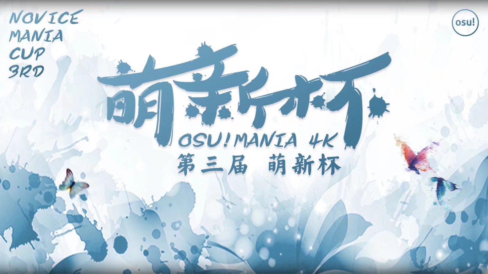

---
tags:
  - Mengxin Cup
  - MXB
---

# 第三届萌新杯

第三届萌新杯（以下均简写为 MXB）是华人区个人比赛，是由 MXB 举行的第三届华人区 osu!mania 大赛。比赛所用谱面均为 osu!mania 专用谱。

## 比赛时间表

| 阶段 | 时间 |
| --: | :-- |
| 报名 | 2019-04-05/2019-04-17 |
| 资格赛 | 2019-05-04/2019-05-05 |
| 抽签 | 2019-05-05 19:00 (UTC+8) |
| 小组赛 | 2019-05-11/2019-05-12 |
| 八强赛 | 2019-05-18/2019-05-19 |
| 半决赛 | 2019-05-25/2019-05-26 |
| 决赛第一周 | 2019-06-01/2019-06-02 |
| 决赛第二周 | 2019-06-15/2019-06-16 |

## 奖品

本次比赛奖品由 [IA daisuki](https://osu.ppy.sh/users/11238501) 提供。

| 名次 | 奖品 |
| :-: | :-- |
|  | 2个月 osu!支持者，主页定制勋章 |
|  | 1个月 osu!支持者 |
|  | 15 CNY |

## 工作人员

| 职位 | 成员 |
| :-: | :-- |
| 比赛经理 | ::{ flag=CN }:: [IA daisuki](https://osu.ppy.sh/users/11238501) |
| 比赛监督 | ::{ flag=CN }:: [Flow Light](https://osu.ppy.sh/users/6705256), ::{ flag=CN }:: [hans1999](https://osu.ppy.sh/users/6679329) |
| 图池管理 | ::{ flag=CN }:: [ExNeko](https://osu.ppy.sh/users/7590894), ::{ flag=CN }:: [IA daisuki](https://osu.ppy.sh/users/11238501), ::{ flag=US }:: [qqqant](https://osu.ppy.sh/users/8976576), ::{ flag=CN }:: [Toki 0w0](https://osu.ppy.sh/users/10392201), ::{ flag=CN }:: [-\[Ulazis\]-](https://osu.ppy.sh/users/11144363) |
| 直播裁判 | ::{ flag=CN }:: [Flow Light](https://osu.ppy.sh/users/6705256), ::{ flag=CN }:: [IA daisuki](https://osu.ppy.sh/users/11238501), ::{ flag=CN }:: [NimaPro](https://osu.ppy.sh/users/11524571), ::{ flag=CN }:: [Rasis](https://osu.ppy.sh/users/1209363), ::{ flag=CN }:: [kj415j45](https://osu.ppy.sh/users/9367540) |
| 解说团队 | ::{ flag=CN }:: [crazybrother](https://osu.ppy.sh/users/8045083), ::{ flag=CN }:: [Flow Light](https://osu.ppy.sh/users/6705256), ::{ flag=CN }:: [NimaPro](https://osu.ppy.sh/users/11524571), ::{ flag=CN }:: [Rasis](https://osu.ppy.sh/users/1209363), ::{ flag=CN }:: [-\[Ulazis\]-](https://osu.ppy.sh/users/11144363) |
| Wiki | ::{ flag=CN }:: [IA daisuki](https://osu.ppy.sh/users/11238501), ::{ flag=CN }:: [kj415j45](https://osu.ppy.sh/users/9367540) |

## 链接

- [Challonge](https://challonge.com/zh_CN/MXB3rd)
- 直播间
  - [Flow Light](https://live.bilibili.com/73668)
  - [IA daisuki](https://live.bilibili.com/4353181)
  - [NimaPro](https://live.bilibili.com/12166146)
  - [Rasis](https://live.bilibili.com/5333)

## 颁奖

| 名次 | 选手 |
| :-: | :-- |
|  | [A M D](https://osu.ppy.sh/users/5321112) |
|  | [shizehao](https://osu.ppy.sh/users/4928674) |
|  | [Yutto007](https://osu.ppy.sh/users/10269172) |

## 参赛选手

|  |  |  |  |
| :-: | :-: | :-: | :-: |
| [525426806](https://osu.ppy.sh/users/10194722) | [H-Shjie](https://osu.ppy.sh/users/11109612) | [Star0v0](https://osu.ppy.sh/users/3675841) | [wuzhin](https://osu.ppy.sh/users/11722256) |
| [Anonie](https://osu.ppy.sh/users/13725543) | [shizehao](https://osu.ppy.sh/users/4928674) | [biIibiIi-\_-](https://osu.ppy.sh/users/13859478) | [s\_w\_w](https://osu.ppy.sh/users/12192069) |
| [KirigayaSnow](https://osu.ppy.sh/users/10721528) | [Yutto007](https://osu.ppy.sh/users/10269172) | [RW233](https://osu.ppy.sh/users/10018541) | [solende](https://osu.ppy.sh/users/11863106) |
| [\[xiao ba\]](https://osu.ppy.sh/users/12451181) | [Chinese\_Psy](https://osu.ppy.sh/users/11049989) | [qiuzhilin](https://osu.ppy.sh/users/11192692) | [Earnestlyqq](https://osu.ppy.sh/users/10637430) |
| [a794151336](https://osu.ppy.sh/users/9912076) | [A M D](https://osu.ppy.sh/users/5321112) | [bouquetww](https://osu.ppy.sh/users/13007770) | [KaffuCchino](https://osu.ppy.sh/users/13461151) |
| [yuki hirahira](https://osu.ppy.sh/users/11740840) | [HerrySun](https://osu.ppy.sh/users/13235020) | [Blue\_Potion](https://osu.ppy.sh/users/13094831) | [magical Sao](https://osu.ppy.sh/users/13235020) |
| [1ess__](https://osu.ppy.sh/users/10823750) |  |  |  |

## 分组

| 组别 | 选手 |  |  |  |
| :-: | :-: | :-: | :-: | :-: |
| A | H-ShJie | KirigayaSnow | yuki hirahira | 1ess\_\_ |
| B | Anonie | magical Sao | HerrySun | shizehao |
| C | bouquetww | a794151336 | s\_w\_w | Yutto007 |
| D | xiao ba | Star0v0 | RW233 | A M D |

## 图池

### 决赛

**下载完整图池包！（118 MB）- [百度云盘](https://pan.baidu.com/s/1v2mmoQVy_bdNR5_0W5j06w)（提取码：`ploo`）- [Google 云端硬盘](https://drive.google.com/file/d/1zLUvsmKgd5ppPWZEvFxDA4WEAMgkzdRH)**

- FreeMod
  1. [LeaF - I \[\_UJ's Another\]](https://osu.ppy.sh/beatmapsets/426638#mania/928341)
  2. [LeaF - Calamity Fortune \[Euphoria\]](https://osu.ppy.sh/beatmapsets/435450#mania/938145)
  3. [Camellia - K.Y.A.F.A. \[DomaUMR0's Extra\]](https://osu.ppy.sh/beatmapsets/468440#mania/1007635)
  4. [DragonForce - Symphony of the Night \[Melody of the Darkne\]](https://osu.ppy.sh/beatmapsets/478042#mania/1095862)
  5. [Morimori Atsushi - PUPA \[Metamorphosis\]](https://osu.ppy.sh/beatmapsets/492056#mania/1048321)
  6. [chunbaiP - Akari \[SC\]](https://osu.ppy.sh/beatmapsets/550095#mania/1165111)
  7. [penoreri - Everlasting Message \[GRAVITY\]](https://osu.ppy.sh/beatmapsets/628672#mania/1325361)
  8. [Imperial Circus Dead Decadence - Danzai no Homura to Koibito Tachi no Rondo \[Shutsugen\]](https://osu.ppy.sh/beatmapsets/654588#mania/1387496)
  9. [stereoberry - ametsuchi \[petrichor\]](https://osu.ppy.sh/beatmapsets/671311#mania/1419426)
  10. [Yooh - Knock The Gate (short Ver.) \[Extra [Fantastic SV]\]](https://osu.ppy.sh/beatmapsets/797589#mania/1675081)
  11. [senya - Banbutsu no Ou \[LN\]](https://osu.ppy.sh/beatmapsets/908627#mania/1895977)
  12. [DJ SHARPNEL - BLUE NOAH 2006 \[2010\]](https://osu.ppy.sh/beatmapsets/915929#mania/1912937)
  13. [Nekomata L.E.D.Master+ - Chrono Diver -PENDULUMs- \[Another\]](https://osu.ppy.sh/beatmapsets/938847#mania/1961132)
  14. [penoreri - Prayer \[EXHAUST\]](https://osu.ppy.sh/beatmapsets/952639#mania/1989158)
- Tiebreaker
  1. **[Camellia & Nanahira - senpai, notice me! \[Senpai!!\]](https://osu.ppy.sh/beatmapsets/719648#mania/1683462)**

### 半决赛

**下载完整图池包！（77 MB）- [百度云盘](https://pan.baidu.com/s/1WbMvDnuRXqWQlcjGvW6LiQ)（提取码：`tydk`）- [Google 云端硬盘](https://drive.google.com/file/d/1ovBrmPRGZzOxCOAGSBKpbEiljhyWEnsH)**

- FreeMod
  1. [IOSYS - Endless Tewi-ma Park \[Arcwin Tewicated\]](https://osu.ppy.sh/beatmapsets/392965#mania/855472)
  2. [Team Grimoire - Sheriruth \[Future\]](https://osu.ppy.sh/beatmapsets/590341#mania/1295745)
  3. [senya - Sono Kami no Zirenma ni \[MX(LN)\]](https://osu.ppy.sh/beatmapsets/637525#mania/1352487)
  4. [Glome - Cynthia (With Moonlight) \[hyper\]](https://osu.ppy.sh/beatmapsets/716826#mania/1514659)
  5. [Camellia - Routing \[Tofu's Another\]](https://osu.ppy.sh/beatmapsets/730034#mania/1637717)
  6. [DJ Noriken - #MAGiCVLGiRL_TRVP_B3VTZ \[ZVPH'Z\_ACC\]](https://osu.ppy.sh/beatmapsets/742179#mania/1565516)
  7. [naotyu- feat. Eri Sasaki - Candy Tall Woman \[Syrup\]](https://osu.ppy.sh/beatmapsets/772698#mania/1624238)
  8. [Tia - Deal with the Devil \[trickery\]](https://osu.ppy.sh/beatmapsets/832413#mania/1743908)
  9. [Nanahira ft. Camellia - Petals \[Blossom\]](https://osu.ppy.sh/beatmapsets/852255#mania/1781436)
  10. [Chroma - I \[Exhaust\]](https://osu.ppy.sh/beatmapsets/865895#mania/1810417)
  11. [uma - Imaginary world \[Insane\]](https://osu.ppy.sh/beatmapsets/890068#mania/1860563)
  12. [Sakuzyo - Kronos \[z3\_5724's 4K Enteral Sound\]](https://osu.ppy.sh/beatmapsets/970406#mania/2030997)
- Tiebreaker
  1. **[Camellia - Tornado \[Disaster\]](https://osu.ppy.sh/beatmapsets/965851#mania/2021759)**

### 八强赛

**下载完整图池包！（85 MB） - [百度云盘](https://pan.baidu.com/s/1JH-52Xp4Ez2J4oCGo8jv7Q)（提取码：`wtvh`） - [Google 云端硬盘](https://drive.google.com/file/d/1ZVxWmXj5uEVS1MgjF9k_YR9gafInsLNy)**

- FreeMod
  1. [Xceon feat.Mayumi Morinaga - Sakurayozora (Extended Mix) \[Expert\]](https://osu.ppy.sh/beatmapsets/316411#mania/705048)
  2. [Warak - REANIMATE \[Another\]](https://osu.ppy.sh/beatmapsets/319055#mania/710851)
  3. [Iced Blade feat. Rita - Sora no Kodou (short ver.) \[4K Insane\]](https://osu.ppy.sh/beatmapsets/437682#mania/958534)
  4. [Toromaru - Enigma \[Enigmatic Linde's EXHAUST\]](https://osu.ppy.sh/beatmapsets/475478#mania/1015872)
  5. [Hitori Tori - perthed again (yambabom remix) \[Advanced\]](https://osu.ppy.sh/beatmapsets/569392#mania/1457791)
  6. [aaaa + Shike - Lueur de la nuit \[INF\]](https://osu.ppy.sh/beatmapsets/629456#mania/1328890)
  7. [Xu Mengyuan - Magic Piano \[infilect's Hyper\]](https://osu.ppy.sh/beatmapsets/651184#mania/1379669)
  8. [Anamanaguchi - SPF 420 \[Introduction\]](https://osu.ppy.sh/beatmapsets/733019#mania/1546477)
  9. [Ruby my dear - Nour \[Edgy\]](https://osu.ppy.sh/beatmapsets/754382#mania/1588263)
  10. [Y..J - Ten Thousand Tons of Anonymous Letters \[A message\]](https://osu.ppy.sh/beatmapsets/768928#mania/1616973)
  11. [NoKANY - Floating Metropolis-Living City#E6BBAD- \[Another\]](https://osu.ppy.sh/beatmapsets/868435#mania/1818942)
  12. [40mP - Junjou Skirt \[1\]](https://osu.ppy.sh/beatmapsets/912583#mania/1906356)
- Tiebreaker
  1. **[gmtn. (witch's slave) - furioso melodia \[4K furioso maratona\]](https://osu.ppy.sh/beatmapsets/307371#mania/725897)**

### 小组赛

**下载完整图池包！（73 MB） - [百度云盘](https://pan.baidu.com/s/1SidZxUAGE53yYCfN8GSRow)（提取码： `wbbx`） - [Google 云端硬盘](https://drive.google.com/file/d/1Q-Ys6AcwjQe_lOiFkPNkzULY37sd36Hn)**

- FreeMod
  1. [Junk - Qualia \[4K HD+\]](https://osu.ppy.sh/beatmapsets/177155#mania/426499)
  2. [stereoberry - evangelize (blurry images) \[transparency (SV)\]](https://osu.ppy.sh/beatmapsets/577748#mania/1222765)
  3. [F-777 - Dance Of The Violins \[error's Hard\]](https://osu.ppy.sh/beatmapsets/642684#mania/1490025)
  4. [Phlogiston - Night Jam \[Sleepless\]](https://osu.ppy.sh/beatmapsets/670141#mania/1571268)
  5. [K A Z M A S A - RTCMON \[uwu\]](https://osu.ppy.sh/beatmapsets/749852#mania/1579336)
  6. [Morimori Atsushi vs. uma - Arche \[MX\]](https://osu.ppy.sh/beatmapsets/757718#mania/1593977)
  7. [Aoi - Orivia no Genjutsu \[Illusion\]](https://osu.ppy.sh/beatmapsets/758477#mania/1595408)
  8. [Nanawo Akari - One Room Sugar Life(Full ver.) \[Hard\]](https://osu.ppy.sh/beatmapsets/841023#mania/1782167)
  9. [Zekk - Calling \[HD\]](https://osu.ppy.sh/beatmapsets/855193#mania/1787004)
  10. [feat.MeAqua(ver.DECO27+Hatsune Miku) - Ai Kotoba III \[MeAqua\]](https://osu.ppy.sh/beatmapsets/951443#mania/1987026)
- Tiebreaker
  1. **[u's - No brand girls \[Maximum Live!\]](https://osu.ppy.sh/beatmapsets/207612#mania/515574)**

### 资格赛

**下载完整图池包！（14 MB） - [百度云盘](https://pan.baidu.com/s/1XkNuvDcQUlKfT_5dmEYVNA) - [Google 云端硬盘](https://drive.google.com/file/d/11pY2Li_O_XBvJz60xfdAhxOjGQghkvM-)**

- FreeMod
  1. [Porno Graffiti - The Day feat. Aruvn (dj-Jo Remix) Extended Version \[Stage 1: Reborn\]](https://osu.ppy.sh/beatmapsets/961881#mania/2014099)
  2. [M2U - Lune \[Stage 2: Moonlight\]](https://osu.ppy.sh/beatmapsets/948056#mania/1979982)
  3. [Alan Walker - The Spectre \[Stage 3:The Spectre\]](https://osu.ppy.sh/beatmapsets/959232#mania/2008278)
  4. [Shawn Wasabi - Marble Soda \[Stage 4: Ramune\]](https://osu.ppy.sh/beatmapsets/946991#mania/1977877)

## 比赛结果

### 决赛第二周

| 选手 | 得分 | 得分 | 选手 |
| :-: | :-: | :-: | :-: |
| Yutto007 | 0 | **1** | **shizehao** |
| **A M D** | **6** | 1 | shizehao |

### 决赛第一周

| 选手 | 得分 | 得分 | 选手 |
| :-: | :-: | :-: | :-: |
| Yutto007 | 1 | **6** | **A M D** |
| **shizehao** | **6** | 4 | 1ess\_\_ |
| **HerrySun** | **1** | 0 | s\_w\_w |
| **shizehao** | **6** | 4 | HerrySun |

### 半决赛

| 选手 | 得分 | 得分 | 选手 |
| :-: | :-: | :-: | :-: |
| HerrySun | 0 | **5** | **Yutto007** |
| shizehao | 1 | **5** | **A M D** |
| **1ess\_\_** | **5** | 1 | \[xiao ba\] |
| KirigayaSnow | 0 | **1** | **s\_w\_w** |

### 八强赛

| 选手 | 得分 | 得分 | 选手 |
| :-: | :-: | :-: | :-: |
| s\_w\_w | 1 | **5** | **A M D** |
| 1ess\_\_ | 4 | **5** | **HerrySun** |
| **Yutto007** | **1** | 0 | \[xiao ba\] |
| KirigayaSnow | 0 | **1** | **shizehao** |

### 小组赛

| 组别 | 选手 |  |  |  |
| :-: | :-: | :-: | :-: | :-: |
| A | H-ShJie | **KirigayaSnow** | yuki hirahira | **1ess\_\_** |
|  | 0 | **6** | 2 | **9** |
| B | Anonie | magical Sao | **HerrySun** | **shizehao** |
|  | 1 | 0 | **5** | **9** |
| C | bouquetww | a794151336 | **s\_w\_w** | **Yutto007** |
|  | 4 | 2 | **9** | **9** |
| D | **\[xiao ba\]** | Star0v0 | RW233 | **A M D** |
|  | **7** | 1 | 4 | **12** |

### 资格赛

[点此查看](https://docs.qq.com/sheet/DSWlYeVZIR01xRG5s) 资格赛得分情况。

## 规则

### 比赛组织

#### 各阶段获胜条件

除资格赛阶段（没有获胜条件）外，每轮比赛都将有一个比赛图池、一首 Tiebreaker 和一个获胜条件。格式如下：

- 资格赛阶段：4 张地图，无获胜条件，无 Tiebreaker。
- 小组赛阶段：11 首歌组成的图池，采用 BO7 赛制（先得到 4 分获胜），一首 Tiebreaker。
- 八强和半决赛：13 首歌组成的图池，采用 BO9 赛制（先得到 5 分获胜），一首 Tiebreaker。
- 决赛：15 首歌组成的图池，采用 BO11 赛制（先得到 6 分获胜），一首 Tiebreaker。

注意：本次赛事均采用 Score V2 计分。

#### 资格赛

- 所有参加比赛的选手都有资格参加资格赛。然而，进入下一轮的参与者数量将减少到最接近的 2 的某个整数次方个。最多可以进入下一轮的玩家是 32 人。决定一名选手是否能晋级下一轮的标准是他们在资格赛阶段的表现。
  - 如果 16 名选手进入，所有 16 名选手都将获得资格，没有人被淘汰。
  - 如果 17-31 名选手进入，表现最差的选手将被淘汰，前 16 名将晋级下一轮。
  - 如果 32 名选手进入，所有 32 名选手都将获得资格，没有人会被淘汰。
  - 如果 33 或更多名选手进入，表现最差的选手将被淘汰，前 32 名将晋级下一轮。
- 所有四张地图都将由图池管理创建，并在锦标赛资格阶段之前发布，各选手提供熟悉比赛地图的机会。
- 所有玩家在每张资格赛地图上都有两次机会，其中取每张资格赛地图上的两次成绩中较高的一次将用于计算您的最终得分。
- 玩家将根据资格赛总成绩分组。因为资格赛不是一对一的比赛过程，所以实际上可以让8名选手同时进行资格赛。如果这是一个混乱的过程，不要担心：只需遵守公布的时间表，并在比赛期间遵循裁判的指示。

#### 小组赛阶段

- 在小组赛阶段，16 名选手将按照资格赛的成绩分为4组，每个小组采用循环积分赛制，两两均会比赛。小组内每个选手的排名根据以下优先级排序：
  1. 选手赢得更多场次。
  2. 选手有更高的{(赢图数)-(负图数)}。
  3. 选手有更高的赢图数。
  4. 选手有更高的 Σ{(分差)/(该图分数)}。
  5. 以上皆平手时加赛的胜利者。
- 每个小组前2名选手将晋级到淘汰赛。

#### 淘汰赛

- 淘汰赛采用双败赛制。这意味着参加淘汰赛的选手必须在本阶段输掉两场比赛才能被淘汰出局。
- 可以在[这里](https://challonge.com/zh_CN/MXB3rd)找到 MXB 赛程。
- 在胜者组比赛中，在一场比赛中符合获胜条件的选手将被宣布为该场比赛的获胜者，并将进入胜者组的下一阶段。这场比赛的失败者将落入败者组。
- 在败者组的比赛中，在一场比赛中符合获胜条件的选手将被宣布为比赛的胜利者，并将进一步败者组的下一阶段。这场比赛的失败者将被淘汰出局。
- 在胜者组的玩家每个阶段都只需要进行一场比赛。唯一的例外是，如果在总决赛阶段，该选手在第一场比赛中输给了败者组中惟一的获胜者，那么他需要进行第二场比赛来决定是否成为总冠军。
- 在半决赛阶段或决赛阶段处于败者组的选手需要在一个阶段进行两场比赛。然而，在这些阶段输掉任意一场比赛的选手将不再需要参加比赛，因为他们被淘汰出了锦标赛。

### 具体规则

#### 协议

- 赛事的时间重叠可能在某些阶段发生，并且由于这些重叠，我们可能不会将每场比赛都进行现场直播。但是，我们会尽最大努力让每一场比赛都能进行现场直播。
- 您的比赛将在比赛时间表中列出。作为一名参赛选手，你有责任确定你的比赛时间，并在必要时尽快与对手重新安排时间。
- 作为一名参赛选手，您有权期望比赛工作人员尽其所能以及时结束比赛的方式主持比赛。
  - 比赛房间将在比赛开始时间之前创建，并且您将在比赛开始时间之前被邀请到相应的锦标赛房间。
  - 为了保证比赛时有人在场对您的比赛进行裁判，MXB 每场比赛将有一名主裁判和一名副裁判。
  - 如果两名比赛选手都准时到达，比赛将正常开始。
  - 如果您的比赛将于5分后开始，但你没有接到多人游戏的邀请，请通过 QQ 或 osu! 内部聊天系统向工作人员说明您没有收到参加比赛的邀请。他们会通知你比赛的指定裁判员，引导你去相应的多人房间。
- 作为比赛工作人员，我们有权期望您在预期时间之前到达比赛现场。
  - 在比赛开始时间之后，选手将有 10 分钟的宽限期进入他们的房间；如果超过了 10 分钟选手依然没有进入比赛房间。比赛将被取消，已进入比赛房间的选手将默认获胜。但是，由于 MXB 工作人员的疏忽而迟到的参赛选手例外。
  - 极端情况下，如果双方选手均未到场，拥有更高组别的选手将自动获胜。

#### 热身阶段

- 比赛中的每名选手将被允许选择1首热身歌曲，两名选手之间总共进行2次热身。
- 热身地图必须上传到 osu! 官网并且所有人都可以从官网中直接获取下载链接。不允许使用镜像链接，也不允许使用个人链接。
- 谱面在官网中但是由于版权等问题而无法下载的谱面亦不允许。
- 热身地图采取 FreeMod，允许使用选手认为任何适合自己的 Mods。
- 选手选择的热身歌曲的时间不能超过 4 分钟。

#### 禁用地图、Roll 点与选择地图

- 除了热身之外，在给每轮比赛中禁用和选用的所有歌曲必须在该阶段的图池中选择。双方以 FreeMod 进行比赛。（FreeMod: HD、FI 或 FL）
- 选手每人可禁用图池中的一张图，一场比赛共禁用两张。
- 裁判将指示选手通过 `!roll` 指令进行一次随机数生成；点数较低的选手先禁用地图，点数较高的选手先选择赛图。
- roll 点结束后，roll 获胜的选手将指示裁判员选择歌曲，裁判员将切换到该歌曲。在这首歌结束后，另一个玩家将选择一首歌，这一过程将继续，直到满足以下两个条件之一：
  - 一名选手先赢得该轮比赛需要的分数。
  - 双方选手均达到赛点。
    - 此时裁判将强制选择 Tiebreaker 作为下一张赛图。
- 胜者将进入下一轮，而失败的选手将进入败者组。如果该选手是在败者组输掉了比赛，他将被淘汰出局。

#### 断开连接

- 在前 30 秒或歌曲的 25%（以先到者为准）内发生断开连接的地图将被中断并进行重赛。
- 比赛因为断开连接将有 2 次重赛机会——当第 3 次有人断开连接时，未断开连接的选手将立即获得一分。
- 若超过重赛时间点后中途断开，在当前地图结束时，裁判将设置两分钟的计时器。当这个计时器归零时，协议中提到的宽限计时器将被（重新）激活。如果宽限期计时器达到 0。比赛将被取消，剩下的其他玩家将被宣布为获胜者。
  - 极端情况下，若双方选手均无法成功重连，拥有更高组别的选手将自动获胜。
