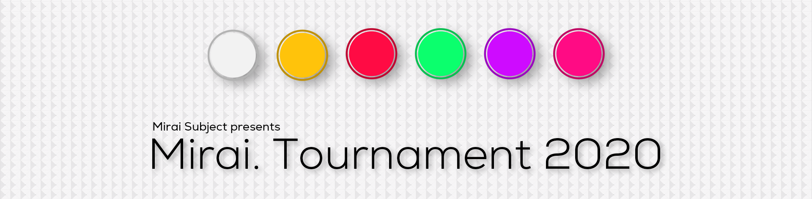

---
tags:
  - Mirai2020
  - Mirai 2020
---

# Mirai. Tournament 2020

The **Mirai. Tournament 2020** (***Mirai2020***) is a worldwide double-eliminination 2v2 osu! tournament hosted by ::{ flag=NL }:: [Mirai Subject](https://osu.ppy.sh/users/5639709). It is the fourth instalment of the Mirai. Tournament.

## Tournament schedule

| Event | Timestamp |
| --: | :-- |
| Registration phase | 2020-04-06/2020-04-19 |
| Qualifiers | 2020-05-02 |
| Round of 32 | 2020-05-08 |
| Round of 16/Losers Round 1 & 2 | 2020-05-16 |
| Quarterfinals/Losers Round 2 & 3 | 2020-05-22 |
| Semifinals | 2020-05-30 |
| Finals week 1 | 2020-06-06 |
| Finals week 2 | 2020-06-23 |

## Prizes

| Placing | Prize(s) |
| :-: | :-- |
|  | 4 months of osu!supporter per team member, unique profile badge (pending) |
|  | 1 month of osu!supporter per team member |

## Organisation

The Mirai. Tournament 2020 is run by various community members.

| Position | Member(s) |
| :-- | :-- |
| Manager | ::{ flag=PH }:: [Deadpulse](https://osu.ppy.sh/users/8575527), ::{ flag=PH }:: [kristoffer09](https://osu.ppy.sh/users/3474344) |
| Mappool selector | ::{ flag=GB }:: [AlexDark69](https://osu.ppy.sh/users/5146647), ::{ flag=FR }:: [Kaeldori](https://osu.ppy.sh/users/962519), ::{ flag=GB }:: [NoSpace](https://osu.ppy.sh/users/10585285), ::{ flag=GB }:: [SacretSword](https://osu.ppy.sh/users/9821402), ::{ flag=DE }:: [Windows 10 Pro](https://osu.ppy.sh/users/7486592), ::{ flag=SG }:: [Zephyrlox](https://osu.ppy.sh/users/6436945) |
| Streamer | ::{ flag=NL }:: [Mirai Subject](https://osu.ppy.sh/users/5639709) |
| Commentator | ::{ flag=GB }:: [AlexDark69](https://osu.ppy.sh/users/5146647), ::{ flag=PH }:: [kristoffer09](https://osu.ppy.sh/users/3474344), ::{ flag=TR }:: [oralekin](https://osu.ppy.sh/users/7631823), ::{ flag=DE }:: [Windows 10 Pro](https://osu.ppy.sh/users/7486592) |
| Designer | ::{ flag=NL }:: [Mirai Subject](https://osu.ppy.sh/users/5639709) |
| Referee | ::{ flag=GB }:: [AlexDark69](https://osu.ppy.sh/users/5146647), ::{ flag=PH }:: [breadman](https://osu.ppy.sh/users/5886567), ::{ flag=DE }:: [GDLenny](https://osu.ppy.sh/users/8406711), ::{ flag=DE }:: [Inteleon](https://osu.ppy.sh/users/9665028), ::{ flag=TR }:: [oralekin](https://osu.ppy.sh/users/7631823), ::{ flag=NL }:: [Mirai Subject](https://osu.ppy.sh/users/5639709), ::{ flag=VN }:: [rock-on](https://osu.ppy.sh/users/9676089), ::{ flag=PH }:: [Simon Yuusuke](https://osu.ppy.sh/users/7336035), ::{ flag=CA }:: [Takiaz](https://osu.ppy.sh/users/11177233), ::{ flag=CA }:: [TheHunter1](https://osu.ppy.sh/users/6496016) |
| Statistician | ::{ flag=PH }:: [kristoffer09](https://osu.ppy.sh/users/3474344) |

## Links

- [Discussion thread](https://osu.ppy.sh/community/forums/topics/1047235)
- [Challonge brackets](https://challonge.com/Mirai2020)
- [Mirai. Community Discord server](https://discord.gg/cSfhfm2)
- [Livestream](https://www.twitch.tv/MiraiSubject)

## Participants

| Team | Members |
| :-: | :-- |
| **8 min tech map** | [poboi06](https://osu.ppy.sh/users/12836907), [SirPinky](https://osu.ppy.sh/users/12948136), [meapii](https://osu.ppy.sh/users/12643092), [His](https://osu.ppy.sh/users/5433421) |
| **Airline Food** | [Shawn -](https://osu.ppy.sh/users/3504101), [NekoMeganG](https://osu.ppy.sh/users/10766611), [Champs de ble](https://osu.ppy.sh/users/6387858), [Pythia](https://osu.ppy.sh/users/11165033) |
| **Baeguette** | [pauloreb28](https://osu.ppy.sh/users/14214481), [Hyuras](https://osu.ppy.sh/users/13579528) |
| **Baka gang.** | [Yote](https://osu.ppy.sh/users/13742179), [Avenger284](https://osu.ppy.sh/users/10296219), [DeathByDarwin](https://osu.ppy.sh/users/9087777) |
| **Bokeee** | [elcho](https://osu.ppy.sh/users/11276129), [Emiru Ikuno 3](https://osu.ppy.sh/users/13847465) |
| **FastButNotFurious** | [Sirek](https://osu.ppy.sh/users/14666725), [Hiterzajc](https://osu.ppy.sh/users/13490372) |
| **HappyHuskyBubbles** | [MatthewBubbles](https://osu.ppy.sh/users/10738779), [huskaii](https://osu.ppy.sh/users/11936616), [onyo](https://osu.ppy.sh/users/13471152), [Harpiness](https://osu.ppy.sh/users/10920975) |
| **How2NoMod** | [-Flux](https://osu.ppy.sh/users/8872267), [Ostiminum](https://osu.ppy.sh/users/11633163), [das12344321](https://osu.ppy.sh/users/13332111), [MylerMoss](https://osu.ppy.sh/users/14443835) |
| **LowAcc Players** | [Eg2nD](https://osu.ppy.sh/users/5365662), [ButterJelly](https://osu.ppy.sh/users/8227251) |
| **Makowy** | [Milkowy](https://osu.ppy.sh/users/9943832), [\[LUX\]Makushi](https://osu.ppy.sh/users/12521970) |
| **Nanahira Copypasta** | [Synchyy](https://osu.ppy.sh/users/4461522), [Coradi](https://osu.ppy.sh/users/11679352), [SillySoon](https://osu.ppy.sh/users/12670452), [Poke7z](https://osu.ppy.sh/users/2703395) |
| **Nice Nice Nice** | [AntiButter](https://osu.ppy.sh/users/4466147), [MonkeyyHug](https://osu.ppy.sh/users/14867780), [xix](https://osu.ppy.sh/users/13571295) |
| **Norank MaMa <3 U** | [Mangent](https://osu.ppy.sh/users/12609921), [Dnwings](https://osu.ppy.sh/users/8947019), [Muziyami](https://osu.ppy.sh/users/7003013), [osu happy](https://osu.ppy.sh/users/9580470) |
| **Retirement Home** | [Redavor](https://osu.ppy.sh/users/3328606), [DerNettePanda](https://osu.ppy.sh/users/9157610), [Endaris](https://osu.ppy.sh/users/392866), [Shovan](https://osu.ppy.sh/users/2624554) |
| **Rip OsumeWolf** | [ErroTheCube](https://osu.ppy.sh/users/4425262), [ISpiritI](https://osu.ppy.sh/users/12024232), [stefgast13](https://osu.ppy.sh/users/6578664), [Miles\_Naismith](https://osu.ppy.sh/users/9839582) |
| **Rusty Cucumber** | [RevRoadster](https://osu.ppy.sh/users/5139514), [ShadowDrake77](https://osu.ppy.sh/users/4823119), [Shrukaghn](https://osu.ppy.sh/users/6304675), [ruruchewy](https://osu.ppy.sh/users/7112839) |
| **Salted\_Fish** | [lontom00126](https://osu.ppy.sh/users/11987530), [WIFIxFTT](https://osu.ppy.sh/users/7339130), [wanwan4343](https://osu.ppy.sh/users/7797421) |
| **Sotarks One Tricks** | [Frostdogspd](https://osu.ppy.sh/users/13481585), [matthiaslai](https://osu.ppy.sh/users/10617966) |
| **Team Sliderbreak** | [ethangrieve1](https://osu.ppy.sh/users/13341525), [tronald-](https://osu.ppy.sh/users/10989101), [- cry -](https://osu.ppy.sh/users/14915029), [Kiing](https://osu.ppy.sh/users/13126824) |
| **Tempe** | [Darctuile](https://osu.ppy.sh/users/8209634), [Mer C](https://osu.ppy.sh/users/12832163) |
| **The** | [Meisa](https://osu.ppy.sh/users/13913578), [Aupsie](https://osu.ppy.sh/users/3377305), [de\_end](https://osu.ppy.sh/users/7736227) |
| **Uprankers** | [Sonic-](https://osu.ppy.sh/users/8691555), [Loreal](https://osu.ppy.sh/users/9362231), [DanielSiew](https://osu.ppy.sh/users/12916724), [Kumaxione](https://osu.ppy.sh/users/2582531) |
| **WhamDabbFTW** | [MeiFTW](https://osu.ppy.sh/users/15049805), [Nambulance](https://osu.ppy.sh/users/13034610), [Maki-kun](https://osu.ppy.sh/users/11304503), [AO4ILukas](https://osu.ppy.sh/users/14760962) |
| **WorldWide Bootleg** | [TheCL0VER](https://osu.ppy.sh/users/13819576), [FlagFlayer](https://osu.ppy.sh/users/14289115) |
| **Your Average Team** | [Isterix](https://osu.ppy.sh/users/7276846), [Meramipop](https://osu.ppy.sh/users/13540434) |
| **bee movie 2 2** | [PM ME YUR MEMES](https://osu.ppy.sh/users/7378037), [rhythm on osu](https://osu.ppy.sh/users/5355423) |
| **bruh moment** | [TankoDen](https://osu.ppy.sh/users/11061359), [eFrostBite](https://osu.ppy.sh/users/11150615), [TMrex](https://osu.ppy.sh/users/10176624) |
| **cherry gum v4** | [steve04](https://osu.ppy.sh/users/10852911), [DanX](https://osu.ppy.sh/users/10542408), [ABKirito](https://osu.ppy.sh/users/9093149) |
| **im pepa gpig** | [Nova Cobalt](https://osu.ppy.sh/users/4272776), [fw8te](https://osu.ppy.sh/users/14541203), [CrappySalami](https://osu.ppy.sh/users/8955826) |
| **kamiguozi** | [Guozi on Osu](https://osu.ppy.sh/users/8692802), [na-gi](https://osu.ppy.sh/users/11355787), [- Rainbow -](https://osu.ppy.sh/users/8742486) |
| **shaky hand** | [Fallen\_HK](https://osu.ppy.sh/users/13981456), [Himman](https://osu.ppy.sh/users/12665894), [McFuddyDuddy](https://osu.ppy.sh/users/8825522), [Player01](https://osu.ppy.sh/users/10194478) |
| **surprised\_pikachu** | [-Secured-](https://osu.ppy.sh/users/14648196), [Pokeinfernape](https://osu.ppy.sh/users/11412507), [7heGh0st](https://osu.ppy.sh/users/14256252), [Emfyr](https://osu.ppy.sh/users/13445383) |

## Mappools

### Grand Finals

**[Download the mappack here! (151 MB)](https://cdn.mirai.gg/mirai-2020/pool/mt-2020-grand-finals-0E57AA07.zip)**

- NoMod
  1. [AKINO from bless4 - MIIRO \[Miiro\]](https://osu.ppy.sh/beatmapsets/259127#osu/592367)
  2. [sakuzyo - VALLISTA \[iNsAnE\]](https://osu.ppy.sh/beatmapsets/245970#osu/566749)
  3. [Magnetude - Signals \[adioni's 100 MHz\]](https://osu.ppy.sh/beatmapsets/850972#osu/1834172)
  4. [Zips - Reiwai Terrorism \[Distortion\]](https://osu.ppy.sh/beatmapsets/101953#osu/269773)
  5. [FOLiACETATE - Heterochromia Iridis \[Another\]](https://osu.ppy.sh/beatmapsets/106443#osu/279607)
  6. [SHK - Holic \[SHD\]](https://osu.ppy.sh/beatmapsets/377869#osu/827223)
- Hidden
  1. [Demetori - Love Coloured Master Spark \[Insane\]](https://osu.ppy.sh/beatmapsets/9960#osu/39209)
  2. [Camellia - Turning up! \[td4w\]](https://osu.ppy.sh/beatmapsets/207024#osu/487910)
  3. [MIOYAMAZAKI - Noise \[Collab Extra\]](https://osu.ppy.sh/beatmapsets/664507#osu/1425667)
- HardRock
  1. [onoken - Quinine -A2D SIDE- \[Another\]](https://osu.ppy.sh/beatmapsets/12469#osu/47837)
  2. [Gekidan Record feat. Nekomata Master - Houkou Orpheus \[Special\]](https://osu.ppy.sh/beatmapsets/879051#osu/1838381)
  3. [Fear, and Loathing in Las Vegas - Jump Around \[Insane\]](https://osu.ppy.sh/beatmapsets/86861#osu/237576)
- DoubleTime
  1. [765PRO ALLSTARS - M@STERPIECE \[Beyond the Brilliant Future\]](https://osu.ppy.sh/beatmapsets/235477#osu/580225)
  2. [sana - Hisui no Machi \[Hard\]](https://osu.ppy.sh/beatmapsets/1017483#osu/2239238)
  3. [Younha - Houkiboshi \[Insane\]](https://osu.ppy.sh/beatmapsets/779541#osu/1636976)
  4. [Pendulum - The Vulture \[Insane\]](https://osu.ppy.sh/beatmapsets/24163#osu/82249)
- ForceMod
  1. [yuikonnu - Kakushigoto \[Extra\]](https://osu.ppy.sh/beatmapsets/504245#osu/1085026)
  2. [Shoichiro Sakamoto - Eye of Aeon \[Aeon\]](https://osu.ppy.sh/beatmapsets/26528#osu/89362)
  3. [paraoka - boot \[sammish's Insane\]](https://osu.ppy.sh/beatmapsets/464095#osu/2084879)
- Tiebreaker
  1. **[Our Stolen Theory - United (L.A.O.S Remix) \[Infinity\]](https://osu.ppy.sh/beatmapsets/237768#osu/550235)**

### Finals

**[Download the mappack here! (124 MB)](https://cdn.mirai.gg/mirai-2020/pool/mt-2020-finals-F16F65C5.zip)**

- NoMod
  1. [BABYMETAL - YAVA! \[Extra\]](https://osu.ppy.sh/beatmapsets/476612#osu/1069950)
  2. [Memme - Avalanche \[Xilver's Extra\]](https://osu.ppy.sh/beatmapsets/340048#osu/1009829)
  3. [Kirin feat. Aoki Lapis - Not Found \[404\]](https://osu.ppy.sh/beatmapsets/560326#osu/1184958)
  4. [Tomoe Tamiyasu - Yamato Nadeshiko Hanakotoba \[Extra\]](https://osu.ppy.sh/beatmapsets/748589#osu/1612947)
  5. [Hakuryu - Genesis At Oasis (MOONLiGHT Mix) \[Vell's Insane\]](https://osu.ppy.sh/beatmapsets/500816#osu/1088043)
  6. [yak\_won - Sinus \~Secret Heart\~ \[Extra\]](https://osu.ppy.sh/beatmapsets/736694#osu/1569283)
- Hidden
  1. [CYTOKINE - Koyoi no Kage wo kiritoru Kotonohano (REDALiCE Remix) \[Lunatic\]](https://osu.ppy.sh/beatmapsets/44710#osu/139981)
  2. [sakuzyo - Aldebaran \[Expert\]](https://osu.ppy.sh/beatmapsets/607948#osu/1283985)
  3. [USAO - Night sky \[Another\]](https://osu.ppy.sh/beatmapsets/376397#osu/824622)
- HardRock
  1. [REDALiCE - Volar \[Insane\]](https://osu.ppy.sh/beatmapsets/32156#osu/105311)
  2. [dj TAKA meets DJ YOSHITAKA ft.guit.good-cool - Elemental Creation -GITADO ROCK ver.- \[Extreme\]](https://osu.ppy.sh/beatmapsets/119447#osu/307289)
  3. [nano - INFINITY ZERO \[Insane\]](https://osu.ppy.sh/beatmapsets/230022#osu/535188)
- DoubleTime
  1. [Ray - lull \~Soshite Bokura wa\~ \[Insane\]](https://osu.ppy.sh/beatmapsets/172450#osu/438061)
  2. [Kalon. - Fumetsu no Gekijou \[Nikakis' Hard\]](https://osu.ppy.sh/beatmapsets/848312#osu/1821927)
  3. [USAO - FREEDOM (Extended Mix) \[Hard\]](https://osu.ppy.sh/beatmapsets/749304#osu/1707909)
  4. [Razihel & Virtual Riot - One For All, All For One \[Celsius' Insane\]](https://osu.ppy.sh/beatmapsets/275655#osu/687524)
- ForceMod
  1. [Yuaru - Asu no Yozora Shoukaihan \[Linada's Insane\]](https://osu.ppy.sh/beatmapsets/384772#osu/854616)
  2. [44teru-k - F.I \[Gold\]](https://osu.ppy.sh/beatmapsets/42225#osu/136411)
  3. [Akita Neru - Gotya Gotya Uruse\~! \[Insane\]](https://osu.ppy.sh/beatmapsets/22182#osu/76638)
- Tiebreaker
  1. **[USAO - Try Again \[Retry\]](https://osu.ppy.sh/beatmapsets/804339#osu/1688458)**

### Semifinals

**[Download the mappack here! (144 MB)](https://cdn.mirai.gg/mirai-2020/pool/mt-2020-sf-E5CF9341.zip)**

- NoMod
  1. [Roselia - -HEROIC ADVENT- \[-SHIZUKU'S EXPERT-\]](https://osu.ppy.sh/beatmapsets/826596#osu/1759615)
  2. [Fractal Dreamers - Gardens Under A Spring Sky \[AF's Another\]](https://osu.ppy.sh/beatmapsets/962862#osu/2023743)
  3. [Camellia vs Akira Complex - Railgun Roulette (VIP) \[LowBot's Insane\]](https://osu.ppy.sh/beatmapsets/694402#osu/1501410)
  4. [Streetlight Manifesto - Everything Went Numb \[Milan-'s Manly Insane\]](https://osu.ppy.sh/beatmapsets/414289#osu/904077)
  5. [paraoka - Dreadnought \[Insane\]](https://osu.ppy.sh/beatmapsets/48356#osu/149559)
  6. [TOTTO - Wadatsumi \[oko's Insane\]](https://osu.ppy.sh/beatmapsets/351828#osu/775363)
- Hidden
  1. [BUTAOTOME - Towa no Maigo \[Insane\]](https://osu.ppy.sh/beatmapsets/1069288#osu/2239337)
  2. [Krewella x Diskord - Beggars (Consouls Remix) \[Testo x Kalibe's Insane\]](https://osu.ppy.sh/beatmapsets/881753#osu/1853842)
  3. [Zekk - Duplication \[Nao's Insane\]](https://osu.ppy.sh/beatmapsets/1132727#osu/2373656)
- HardRock
  1. [Delain - Go Away \[Insane\]](https://osu.ppy.sh/beatmapsets/475676#osu/1017900)
  2. [Rise Against - Savior \[Fiery's Insane\]](https://osu.ppy.sh/beatmapsets/509675#osu/1132873)
  3. [xi - .357 Magnum \[Hyper\]](https://osu.ppy.sh/beatmapsets/155749#osu/545555)
- DoubleTime
  1. [Mami Kawada - sense \[Hard\]](https://osu.ppy.sh/beatmapsets/325638#osu/1000347)
  2. [zts - worldenddominator \[Hard\]](https://osu.ppy.sh/beatmapsets/897884#osu/1886520)
  3. [a\*ru - Kizuato \[Hard\]](https://osu.ppy.sh/beatmapsets/569843#osu/1241841)
  4. [Rostik - Liquid (Paul Rosenthal Remix) \[Insane\]](https://osu.ppy.sh/beatmapsets/123593#osu/315552)
- ForceMod
  1. [Shimotsuki Haruka - Akahitoha \[Rio & z1's Another\]](https://osu.ppy.sh/beatmapsets/974417#osu/2261415)
  2. [IOSYS - Chanteikku Sanyousei no Itazura Daisensou \[Crazy Jay\]](https://osu.ppy.sh/beatmapsets/24448#osu/91462)
  3. [P\*Light - SAY BAY \[Pata-Mon's Insane\]](https://osu.ppy.sh/beatmapsets/750316#osu/1588830)
- Tiebreaker
  1. **[FELT - Vagueness & JOURNEY \[Collab Rhapsody\]](https://osu.ppy.sh/beatmapsets/909888#osu/1898745)**

### Quarterfinals

**[Download the mappack here! (136 MB)](https://cdn.mirai.gg/mirai-2020/pool/mt-2020-qf-1447801C.zip)**

- NoMod
  1. [Reol - Logic Agent \[Lost\]](https://osu.ppy.sh/beatmapsets/578814#osu/1283956)
  2. [Mary - Artificial Rose \[Another\]](https://osu.ppy.sh/beatmapsets/99434#osu/264439)
  3. [lapix - Horizon Blue feat. Kanata.N \[Reform's Insane\]](https://osu.ppy.sh/beatmapsets/974832#osu/2062581)
  4. [LhoU - popotnik \~ The Traveller of Ljubljana \[Exotic\]](https://osu.ppy.sh/beatmapsets/712388#osu/1505919)
  5. [Lite Show Magic - TRICKL4SH 220 \[LCFC's INS4NE\]](https://osu.ppy.sh/beatmapsets/616696#osu/1308410)
  6. [ONE OK ROCK - Re:make \[AngelHoney\]](https://osu.ppy.sh/beatmapsets/64001#osu/197139)
- Hidden
  1. [seiya-murai feat.ALT - Sumidagawa Karenka \[Extreme\]](https://osu.ppy.sh/beatmapsets/28796#osu/95870)
  2. [Function Phantom - Variable \[Kibbleru's Insane\]](https://osu.ppy.sh/beatmapsets/751774#osu/1582596)
  3. [Project Grimoire - Caliburne \~Story of the Legendary sword\~ \[iyasine's Insane\]](https://osu.ppy.sh/beatmapsets/335665#osu/747240)
- HardRock
  1. [Underoath - A Moment Suspended in Time \[pishi's Insane\]](https://osu.ppy.sh/beatmapsets/407575#osu/913490)
  2. [penoreri - Preserved Valkyria \[Sharkie's EXHAUST\]](https://osu.ppy.sh/beatmapsets/644642#osu/1366189)
  3. [Fear, and Loathing in Las Vegas - Swing It!! \[Insane\]](https://osu.ppy.sh/beatmapsets/204159#osu/492543)
- DoubleTime
  1. [SYNC.ART'S - MIND READER \[Hard\]](https://osu.ppy.sh/beatmapsets/569335#osu/1207568)
  2. [CircusP - Goodbye \[Goodbye\]](https://osu.ppy.sh/beatmapsets/251269#osu/577427)
  3. [Amatsuki - Higurashi Moratorium \[Airin's Hard\]](https://osu.ppy.sh/beatmapsets/931886#osu/1975297)
  4. [KAMELOT - Eden Echo \[Hard\]](https://osu.ppy.sh/beatmapsets/986205#osu/2085413)
- ForceMod
  1. [Yousei Teikoku - Mischievous of Alice \[Insane\]](https://osu.ppy.sh/beatmapsets/623960#osu/1316910)
  2. [solfa feat. Shimotsuki Haruka - leap in your mind \[Gust's Hyper\]](https://osu.ppy.sh/beatmapsets/911281#osu/1949167)
  3. [Nekomata L.E.D.Master+ - Chrono Diver -PENDULUMs- \[IOException's Insane\]](https://osu.ppy.sh/beatmapsets/813683#osu/1850148)
- Tiebreaker
  1. **[Mitsunori Ikeda ft. Aimee B - Fallen Angel (El Poco Maro Remix) \[Ascension\]](https://osu.ppy.sh/beatmapsets/36319#osu/403050)**

### Round of 16

**[Download the mappack here! (108 MB)](https://cdn.mirai.gg/mirai-2020/pool/mt2020-ro16-3E923BFA.zip)**

- NoMod
  1. [Amaranthe - Hunger \[Dada's Insane\]](https://osu.ppy.sh/beatmapsets/1028446#osu/2206921)
  2. [Eleharmonica remixed by kors k - Der Wald (kors k Remix) \[Jace's Insane\]](https://osu.ppy.sh/beatmapsets/581787#osu/1477261)
  3. [Function Phantom - Paradox \[J1's Insane\]](https://osu.ppy.sh/beatmapsets/824125#osu/1756217)
  4. [MAX COVERI - RUNNING IN THE 90'S \[NINO'S INSANE\]](https://osu.ppy.sh/beatmapsets/739262#osu/1601126)
  5. [xi - Glorious Crown \[toybot's INSANE\]](https://osu.ppy.sh/beatmapsets/460515#osu/1049287)
- Hidden
  1. [Eoin O' Broin - Deep Space \[Insane\]](https://osu.ppy.sh/beatmapsets/25098#osu/85045)
  2. [Memme - Starving Days \[Another\]](https://osu.ppy.sh/beatmapsets/275743#osu/715345)
- HardRock
  1. [Foreground Eclipse - You Can't Explain Anything Without The Word 'Destruction' \[Akitoforce's Hard\]](https://osu.ppy.sh/beatmapsets/942330#osu/1968524)
  2. [SHW - Ikusa JAPAN (shw.in) \[Ikusa!\]](https://osu.ppy.sh/beatmapsets/46660#osu/145165)
- DoubleTime
  1. [Becky - Less Than Three (Ricardo Autobahn Remix) \[Hard\]](https://osu.ppy.sh/beatmapsets/1078502#osu/2258857)
  2. [Fox Stevenson - Turn It Up (Higher) \[Exquisite\]](https://osu.ppy.sh/beatmapsets/115291#osu/298035)
  3. [Star Driver - 5 Centimeters Per Second \[Hard\]](https://osu.ppy.sh/beatmapsets/239787#osu/556326)
- ForceMod
  1. [Days N' Daze - Misanthropic Drunken Loner \[Insane\]](https://osu.ppy.sh/beatmapsets/442587#osu/959058)
  2. [Lon - MATRYOSHKA \[Tari's Insane\]](https://osu.ppy.sh/beatmapsets/109185#osu/315941)
- Tiebreaker
  1. **[Reol - Minazoko Yuuhodou \[Ripples\]](https://osu.ppy.sh/beatmapsets/399810#osu/870151)**

### Round of 32

**[Download the mappack here! (101 MB)](https://cdn.mirai.gg/mirai-2020/pool/mt-2020-ro32-C86401FF.zip)**

- NoMod
  1. [sakuzyo feat. Hatsune Miku - ChaiN De/structioN \[Loneliness\]](https://osu.ppy.sh/beatmapsets/49071#osu/154165)
  2. [ZUN - Kobito of the Shining Needle \~ Little Princess \[Lunatic\]](https://osu.ppy.sh/beatmapsets/362989#osu/827019)
  3. [Halogen - U Got That (Camellia's Neurofunk Bootleg) \[Reform's Insane\]](https://osu.ppy.sh/beatmapsets/934144#osu/1951094)
  4. [Streetlight Manifesto - Punk Rock Girl \[Insane\]](https://osu.ppy.sh/beatmapsets/577394#osu/1269449)
  5. [BlackY vs. Yooh - HAVOX \[Ayyri's EXHAUST\]](https://osu.ppy.sh/beatmapsets/823616#osu/1876631)
- Hidden
  1. [TAMAONSEN - Witches' Night (ShinRa-Bansho Ver.) \[Dafiely & Xenon's Insane\]](https://osu.ppy.sh/beatmapsets/1030100#osu/2165811)
  2. [Yooh - snow storm -euphoria- \[EXHAUST\]](https://osu.ppy.sh/beatmapsets/158075#osu/420012)
- HardRock
  1. [Amane - Boozehound \[Nuts\]](https://osu.ppy.sh/beatmapsets/5875#osu/27810)
  2. [mafumafu - Kakushigoto \[NiNo's Light Insane.\]](https://osu.ppy.sh/beatmapsets/770023#osu/1618984)
- DoubleTime
  1. [SteLouse - Joyride \[Hard\]](https://osu.ppy.sh/beatmapsets/747507#osu/1575098)
  2. [yuikonnu - Yume no Mata Yume \[Hard\]](https://osu.ppy.sh/beatmapsets/812160#osu/1703566)
  3. [Dictate - Militant \[Hard\]](https://osu.ppy.sh/beatmapsets/785677#osu/1649483)
- ForceMod
  1. [Ghost - From The Pinnacle To The Pit \[Insane\]](https://osu.ppy.sh/beatmapsets/425520#osu/919002)
  2. [XL Project - Necro Fantasia \[Collab\]](https://osu.ppy.sh/beatmapsets/23077#osu/79266)
- Tiebreaker
  1. **[Halozy - Paranoid Lost \[Soda's Lunatic\]](https://osu.ppy.sh/beatmapsets/440925#osu/964622)**

### Qualifiers

- NoMod
  1. [FELT - Story \[Lunatic\]](https://osu.ppy.sh/beatmapsets/297409#osu/944709)
  2. [Street - Sakura Fubuki \[Another\]](https://osu.ppy.sh/beatmapsets/362989#osu/827019)
  3. [Sakuzyo - FAFNIR \[KKip's Insane\]](https://osu.ppy.sh/beatmapsets/777255#osu/1637690)
  4. [Streetlight Manifesto - The Blonde Lead The Blind \[Insane\]](https://osu.ppy.sh/beatmapsets/376545#osu/826347)
- Hidden
  1. [Saratoga (CV: Uesaka Sumire) - Souzetsu Gekkou \[Insane\]](https://osu.ppy.sh/beatmapsets/765452#osu/2178006)
  2. [Veil of Maya - Mikasa \[Insane\]](https://osu.ppy.sh/beatmapsets/480298#osu/1219509)
- HardRock
  1. [Celldweller - Good L\*ck (Yo\*'re F\_cked) \[Hard\]](https://osu.ppy.sh/beatmapsets/1069112#osu/2239676)
  2. [Zektbach - meme \[Hard\]](https://osu.ppy.sh/beatmapsets/68617#osu/199410)
- DoubleTime
  1. [senya - Terasareru kurai no Shiawase \[Collab Hard\]](https://osu.ppy.sh/beatmapsets/747507#osu/1575098)
  2. [Creo - Rivals \[deetz' Hard\]](https://osu.ppy.sh/beatmapsets/1012878#osu/2142929)

## Match results

### Grand Finals

| Team 1 |  |  | Team 2 | Match link |
| --: | :-: | :-: | :-- | :-- |
| **Norank MaMa <3 U** | **7** | 3 | Uprankers | [#1](https://osu.ppy.sh/community/matches/63280403) |

### Losers Finals

| Team 1 |  |  | Team 2 | Match link |
| --: | :-: | :-: | :-- | :-- |
| **Uprankers** | **0** | -1 | Salted\_Fish | *win by default* |

### Losers Round 7

| Team 1 |  |  | Team 2 | Match link |
| --: | :-: | :-: | :-- | :-- |
| surprised\_pikachu | 3 | **7** | **Salted\_Fish** | [#1](https://osu.ppy.sh/community/matches/62665710) |

### Losers Round 6

| Team 1 |  |  | Team 2 | Match link |
| --: | :-: | :-: | :-- | :-- |
| WhamDabbFTW | 5 | **7** | **Salted\_Fish** | [#1](https://osu.ppy.sh/community/matches/62585160) |
| **surprised\_pikachu** | **7** | 6 | Airline Food | [#1](https://osu.ppy.sh/community/matches/62623116) |

### Finals & Losers Round 5

#### Finals

| Team 1 |  |  | Team 2 | Match link |
| --: | :-: | :-: | :-- | :-- |
| **Norank MaMa <3 U** | **7** | 2 | Uprankers | [#1](https://osu.ppy.sh/community/matches/62571138) |

### Losers Round 5

#### Losers Round 5

| Team 1 |  |  | Team 2 | Match link |
| --: | :-: | :-: | :-- | :-- |
| Baka gang | 0 | **2** | **Airline Food** | [#1](https://osu.ppy.sh/community/matches/62341759) |
| Retirement Home | 3 | **6** | **Salted\_Fish** | [#1](https://osu.ppy.sh/community/matches/62377925) |

### Semifinals & Losers Round 4

#### Semifinals

| Team 1 |  |  | Team 2 | Match link |
| --: | :-: | :-: | :-- | :-- |
| **Norank Mama <3 U** | **6** | 1 | WhamDabbFTW | [#1](https://osu.ppy.sh/community/matches/62296309) |
| surprised\_pikachu | 5 | **6** | **Uprankers** | [#1](https://osu.ppy.sh/community/matches/62292052) |

#### Losers Round 4

| Team 1 |  |  | Team 2 | Match link |
| --: | :-: | :-: | :-- | :-- |
| cherry gum v4. | -1 | **0** | Baka gang. | *win by default* |
| **Airline Food** | **6** | 4 | kamiguozi | [#1](https://osu.ppy.sh/community/matches/62292173) |
| Tempe | 4 | **6** | **kamiguozi** | [#1](https://osu.ppy.sh/community/matches/62293773) |
| **Salted\_Fish** | **6** | 3 | shaky hand | [#1](https://osu.ppy.sh/community/matches/62299135) |

### Quarterfinals & Losers Round 3

#### Quarterfinals

| Team 1 |  |  | Team 2 | Match link |
| --: | :-: | :-: | :-- | :-- |
| Tempe | 4 | **6** | **Uprankers** | [#1](https://osu.ppy.sh/community/matches/61970461) |
| **shaky hand** | **6** | 0 | The | [#1](https://osu.ppy.sh/community/matches/61977922) |
| Airline Food | 1 | **6** | **Norank MaMa \<3 U** | [#1](https://osu.ppy.sh/community/matches/62004317) |
| **surprised\_pikachu** | **6** | 3 | Salted\_Fish | [#1](https://osu.ppy.sh/community/matches/62045592) |

#### Losers Round 3

| Team 1 |  |  | Team 2 | Match link |
| --: | :-: | :-: | :-- | :-- |
| **kamiguozi** | **6** | 5 | Rip OsumeWolf | [#1](https://osu.ppy.sh/community/matches/62045236) |
| **Baka gang.** | **0** | -1 | bruh moment | *win by default* |
| **shaky hand** | **6** | 4 | Rusty Cucumber | [#1](https://osu.ppy.sh/community/matches/62055399) |
| **Retirement Home** | **6** | 3 | How2NoMod | [#1](https://osu.ppy.sh/community/matches/62089882) |

### Round of 16 & Losers Round 2

#### Round of 16

| Team 1 |  |  | Team 2 | Match link |
| --: | :-: | :-: | :-- | :-- |
| shaky hand | 0 | **5** | **Norank MaMa <3 U** | [#1](https://osu.ppy.sh/community/matches/61736137) |
| How2NoMod | 2 | **5** | **WhamDabbFTW** | [#1](https://osu.ppy.sh/community/matches/61742831) |
| **Airline Food** | **5** | 0 | Makowy | [#1](https://osu.ppy.sh/community/matches/61750767) |
| Retirement Home | 3 | **5** | **cherry gum v4** | [#1](https://osu.ppy.sh/community/matches/61777381) |
| **Tempe** | **5** | 1 | Bruh moment | [#1](https://osu.ppy.sh/community/matches/61777474) |
| kamiguozi | 3 | **5** | **Salted\_Fish** | [#1](https://osu.ppy.sh/community/matches/61774684) |
| **surprised\_pikachu** | **5** | 0 | Rip OsumeWolf | [#1](https://osu.ppy.sh/community/matches/61776391) |
| **Uprankers** | **5** | 3 | Baka gang. | [#1](https://osu.ppy.sh/community/matches/61778316) |

#### Losers Round 2

| Team 1 |  |  | Team 2 | Match link |
| --: | :-: | :-: | :-- | :-- |
| **How2NoMod** | **6** | 1 | HappyHuskyBubbles | [#1](https://osu.ppy.sh/community/matches/61970819) |
| **shaky hand** | **6** | 0 | The | [#1](https://osu.ppy.sh/community/matches/61977922) |
| **Baka gang.** | **6** | 5 | 8 min tech map | [#1](https://osu.ppy.sh/community/matches/62011434) |
| **Retirement Home** | **6** | 1 | Team Sliderbreak | [#1](https://osu.ppy.sh/community/matches/62020119) |
| Makowy | 1 | **6** | **Rusty Cucumber** | [#1](https://osu.ppy.sh/community/matches/62018128) |
| **kamiguozi** | **6** | 2 | Nanahira Copypasta | [#1](https://osu.ppy.sh/community/matches/62030030) |
| Bruh moment | -1 | **0** | **Bokeee** | *win by default* |
| Rip OsumeWolf | -1 | **0** | **Sotarks One Tricks** | *win by default* |

### Round of 32 & Losers Round 1

| Team 1 |  |  | Team 2 | Match link |
| --: | :-: | :-: | :-- | :-- |
| **cherry gum v4** | **5** | 0 | Worldwide bootleg | [#1](https://osu.ppy.sh/community/matches/61412594) |
| FastButNotFurious | 1 | **5** | **Salted\_Fish** | [#1](https://osu.ppy.sh/community/matches/61412952) |
| **shaky hand** | **0** | -1 | LowAcc Players | *win by default* |
| **Rip OsumeWolf** | **5** | 0 | Your Average Team | [#1](https://osu.ppy.sh/community/matches/61453055) |
| **surprised_pikachu** | **5** | 2 | Team Sliderbreak | [#1](https://osu.ppy.sh/community/matches/61452425) |
| The | 4 | **5** | **bruh moment** | [#1](https://osu.ppy.sh/community/matches/61452985) |
| **Tempe** | **5** | 0 | Baeguette | [#1](https://osu.ppy.sh/community/matches/61455081) |
| **How2NoMod** | **5** | 2 | Nanahira Copypasta | [#1](https://osu.ppy.sh/community/matches/61456950) |
| 8 min tech map | 4 | **5** | **Makowy** | [#1](https://osu.ppy.sh/community/matches/61466084) |
| **Uprankers** | **5** | 4 | bee movie 2 2 | [#1](https://osu.ppy.sh/community/matches/61485564) |
| **Norank MaMa <3 U** | **0** | -1 | Bokeee | *win by default* |
| **kamiguozi** | **5** | 3 | HappyHuskyBubbles | [#1](https://osu.ppy.sh/community/matches/61491228) |
| **Retirement Home** | **5** | 0 | Sotarks One Tricks | [#1](https://osu.ppy.sh/community/matches/61498785) |
| **Baka gang.** | **5** | 3 | Rusty Cucumber | [#1](https://osu.ppy.sh/community/matches/61500575) |
| **WhamDabbFTW** | **5** | 0 | Nice Nice Nice | [#1](https://osu.ppy.sh/community/matches/61505250) |
| **Airline Food** | **5** | 0 | im pepa gpig | [#1](https://osu.ppy.sh/community/matches/61507670) |

#### Losers Round 1

| Team 1 |  |  | Team 2 | Match link |
| --: | :-: | :-: | :-- | :-- |
| bee movie 2 2 | 4 | **5** | **Rusty Cucumber** | [#1](https://osu.ppy.sh/community/matches/61747865) |
| **Sotarks One Tricks** | **0** | -1 | WorldWide Bootleg | *win by default* |
| **Team Sliderbreak** | **5** | 1 | Your Average Team | [#1](https://osu.ppy.sh/community/matches/61780379) |
| Baeguette | 3 | **5** | **The** | [#1](https://osu.ppy.sh/community/matches/61814905) |
| im pepa gpig | -1 | **0** | **8 min tech map** | *win by default* |
| LowAcc Players | -1 | **0** | **Bokeee** | *win by default* |
| **Nanahira Copypasta** | **0** | -1 | Nice Nice Nice | *win by default* |
| **HappyHuskyBubbles** | **0** | -1 | FastButNotFurious | *win by default* |

### Qualifiers

| Seed | Team |
| :-- | :-- |
| 1 | Airline Food |
| 2 | surprised\_pikachu |
| 3 | Tempe |
| 4 | How2NoMod |
| 5 | Retirement Home |
| 6 | Uprankers |
| 7 | kamiguozi |
| 8 | shaky hand |
| 9 | Norank MaMa <3 U |
| 10 | FastButNotFurious |
| 11 | Baka gang. |
| 12 | cherry gum v4 |
| 13 | WhamDabbFTW |
| 14 | The |
| 15 | Rip OsumeWolf |
| 16 | 8 min tech map |
| 17 | Makowy |
| 18 | Your Average Team |
| 19 | bruh moment |
| 20 | Nice Nice Nice |
| 21 | WorldWide Bootleg |
| 22 | Rusty Cucumber |
| 23 | Salted\_Fish |
| 24 | Bokeee |
| 25 | LowAcc Players |
| 26 | HappyHuskyBubbles |
| 27 | bee movie 2 2 |
| 28 | Vanish |
| 29 | Nanahira Copypasta |
| 30 | Baeguette |
| 31 | Team Sliderbreak |
| 32 | im pepa gpig |

## Ruleset

The ruleset for this tournament is: Scorev2, Team VS in osu! standard.

### Tournament rules

1. The Discord server rules apply. Failure to comply will result in the disqualification of you and/or your team depending on the severity and the people involved.
2. The rank range for this tournament is 105.000–45.000.
3. If during this tournament you get derank under 105.000 or overrank above 45.000 you will not be allowed to play anymore in your team until you've deranked enough to be in range again.
4. Grieving, trolling, and other actions that may hinder a match are prohibited.
5. Sportsmanship is encouraged. Don’t be mean towards other players.
6. Cheating is not allowed (obviously)
7. Follow the instructions your assigned referee has given. For example: do not hop around in player slots and waste the referee's time.

### Tournament registration

All the players are required to register on [mirai.gg](https://mirai.gg/). On the website, players login using their osu! account and connect it to their discord account. Once all the players of a team have joined the team captain can create the team on the website. The BWS rank verification of all the players takes place once the captain has finalized the team.

Another BWS rank verification takes place on the day of the sign up deadline to ensure all the players are within rank range.

If a player changes their osu! name during the course of the tournament, they only need to login to the website for the change to be propagated across the tournament's systems.

After the sign up deadline, a list of all the players will be sent to the osu! tournament staff for screening. Players that do not pass screening will not be allowed to participate in the tournament.

### Stage instructions

The length for each stage is as follows, these include their respective Losers Rounds:

- RO32 & RO16: BO9
- QF and SF: BO11
- (Grand) Finals: BO13

### Match instructions

1. The assigned referee will invite the team captain 10-15 minutes before the match starts
2. The team captain will invite their teammates to the room.
3. When the referee gives permission the team captains will `!roll`
4. The team that rolls the highest gets to pick whether they want to ban first and pick first.
5. Highest roller decides pick and ban order. They can choose if they want to pick and ban second if they want to.
6. Players can choose to skip their warmup.
7. In the rare event that both teams roll the same number, they will roll again.
8. Each team gets to pick one warmup map. They can decide who or can use the roll results.

We have setup the following rules for warmup maps:

- The warm-up map’s max star rating scales with that week’s Tiebreaker.
- The warm-up map cannot be longer than 5 minutes.
- The warm-up map cannot be picked if it’s constructed in such a way that it could hinder any team’s performance during the actual match (such as troll maps).
- Pending or graveyarded maps are prohibited.
- Loved, qualified, and ranked maps within the above criteria are allowed

After the warm-up, the banning phase starts.

If the highest roller chooses to ban first the procedure will be as follows:

- High roll: 1 ban
- Low roll: 2 bans
- High roll: 1 ban

If the highest roller chooses to ban second it will be as follows:

- Low roll: 1 ban
- High roll: 2 bans
- Low roll: 1 ban

Modpools cannot be fully banned. At least one map has to be available in each modpool

After the ban phase, the team will play maps with alternating picks until one team wins enough points to win a match.

1. The tiebreaker cannot be picked in a normal game scenario.
2. ForceMod maps are limited to: HD, HR, FL, EZ. You can stack these mods for a higher risk-higher reward scenario. With ForceMod at least one player has to pick a mod.
3. If both of the teams draw the map, then that map will not be counted towards the final score. However, it will be recorded for statistical purposes.
4. The tiebreaker is Free Mod, which means you can pick the mods from rule B or go NoMod

### Rescheduling instructions

The schedule will be released 6 days in advance of the first match, usually the Monday before the weekend, on Google Calendar.

- A reschedule will only be approved if submitted 24 hours in advance.
- DM the team captain for the reschedule and figure out a new date and time with them
- In the reschedule channel tag Deadpulse or Kristoffer09 with a screenshot of the conversation so they can update the schedule.
