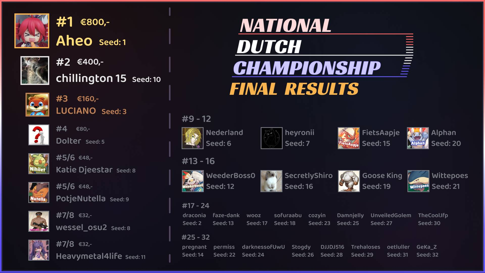

---
tags:
  - NDC2024
  - NDC
---

# National Dutch Championship 2024

The **National Dutch Championship 2024** (***NDC 2024***) was a 1v1, double elimination osu!standard tournament hosted by ::{ flag=NL }:: [Lilily](https://osu.ppy.sh/users/6502403) and ::{ flag=NL }:: [Mr HeliX](https://osu.ppy.sh/users/2330619). It was the third instalment of the National Dutch Championship.

## Tournament schedule

| Event | Timestamp |
| --: | :-- |
| Registration phase | 2024-08-05/2024-08-18 |
| Qualifiers | 2024-08-22/2024-08-25 and 2024-08-29/2024-09-01 |
| Round of 32 | 2024-09-06/2024-09-08 |
| Round of 16 | 2024-09-13/2024-09-15 |
| Quarterfinals | 2024-09-20/2024-09-22 |
| Semifinals | 2024-09-27/2024-09-29 |
| Finals | 2024-10-04/2024-10-06 |
| Grand Finals | 2024-10-11/2024-10-13 |

## Prizes

| Placing | Prize(s) |
| :-: | :-- |
|  | €800,- |
|  | €400,- |
|  | €160,- |
| *4th place* | €80,- |
| *5th & 6th place* | €48,- |
| *7th & 8th place* | €32,- |

The prizepool was sponsored by both the organisation and community members:

- ::{ flag=NL }:: [Lilily](https://osu.ppy.sh/users/6502403): €750,-
- ::{ flag=NL }:: [heyronii](https://osu.ppy.sh/users/5642779): €500,-
- ::{ flag=NL }:: [Mr HeliX](https://osu.ppy.sh/users/2330619): €250,-
- ::{ flag=NL }:: [Katie Djeestar](https://osu.ppy.sh/users/641155): €100,-

## Organisation

The National Dutch Championship 2024 was run by various community members.

| Position | Member(s) |
| :-- | :-- |
| Organisation | ::{ flag=NL }:: [Lilily](https://osu.ppy.sh/users/6502403), ::{ flag=NL }:: [Mr HeliX](https://osu.ppy.sh/users/2330619) |
| Mappool selector | ::{ flag=CA }:: [chiv](https://osu.ppy.sh/users/6701656), ::{ flag=NL }:: [niqht](https://osu.ppy.sh/users/14390731), ::{ flag=TR }:: [Ryukishi](https://osu.ppy.sh/users/9045874), ::{ flag=NL }:: [nijlpaard](https://osu.ppy.sh/users/30921375), ::{ flag=NL }:: [Lilily](https://osu.ppy.sh/users/6502403), ::{ flag=NL }:: [Sroj](https://osu.ppy.sh/users/4783389), ::{ flag=NL }:: [- Ethereal -](https://osu.ppy.sh/users/9357932) |
| Mapper | ::{ flag=NL }:: [Castagne](https://osu.ppy.sh/users/12270596), ::{ flag=NL }:: [taku](https://osu.ppy.sh/users/684433), ::{ flag=NL }:: [CMeFly](https://osu.ppy.sh/users/12195391), ::{ flag=DE }:: [PaRaDogi](https://osu.ppy.sh/users/2054596), ::{ flag=NL }:: [happy30](https://osu.ppy.sh/users/27767), ::{ flag=DE }:: [Mir](https://osu.ppy.sh/users/8688812), ::{ flag=US }:: [Boppin](https://osu.ppy.sh/users/3275468), ::{ flag=NL }:: [Mijn Aim Zuigt](https://osu.ppy.sh/users/4587487), ::{ flag=NO }:: [BarkingMadDog](https://osu.ppy.sh/users/3475189), ::{ flag=ID }:: [Celine](https://osu.ppy.sh/users/3545579) |
| Playtester | ::{ flag=NL }:: [Lilily](https://osu.ppy.sh/users/6502403), ::{ flag=NL }:: [Quinten](https://osu.ppy.sh/users/5101306), ::{ flag=BE }:: [Hanori](https://osu.ppy.sh/users/7078544), ::{ flag=NL }:: [Seleen](https://osu.ppy.sh/users/9362168), ::{ flag=NL }:: [CMeFly](https://osu.ppy.sh/users/12195391), ::{ flag=GB }:: [HAUNTE](https://osu.ppy.sh/users/7333471), ::{ flag=NO }:: [Melvr](https://osu.ppy.sh/users/9211924), ::{ flag=PH }:: [NathanRam1918](https://osu.ppy.sh/users/4734703), ::{ flag=DE }:: [ZeitFrost](https://osu.ppy.sh/users/11234706), ::{ flag=NL }:: [AngelNamirin](https://osu.ppy.sh/users/6145220), ::{ flag=NL }:: [draconia](https://osu.ppy.sh/users/20241831), ::{ flag=NL }:: [UnveiledGolem](https://osu.ppy.sh/users/14090438), ::{ flag=BE }:: [5joshi](https://osu.ppy.sh/users/4279650), ::{ flag=BR }:: [Dropinx](https://osu.ppy.sh/users/4687701), ::{ flag=BE }:: [hexi](https://osu.ppy.sh/users/10760701), ::{ flag=PL }:: [Bartek22830](https://osu.ppy.sh/users/6404027), ::{ flag=CA }:: [Saryi](https://osu.ppy.sh/users/10051720), ::{ flag=NL }:: [TurtleSenpaii](https://osu.ppy.sh/users/12241010), ::{ flag=FI }:: [mxu](https://osu.ppy.sh/users/18687807) |
| Referee | ::{ flag=NL }:: [Lilily](https://osu.ppy.sh/users/6502403), ::{ flag=NL }:: [Kapsalon](https://osu.ppy.sh/users/6941124), ::{ flag=NL }:: [KayoNar](https://osu.ppy.sh/users/6960689), ::{ flag=NL }:: [Bart](https://osu.ppy.sh/users/15961009), ::{ flag=NL }:: [Marslam](https://osu.ppy.sh/users/16814497), ::{ flag=NL }:: [Happy_24](https://osu.ppy.sh/users/12876323), ::{ flag=NL }:: [JustChe](https://osu.ppy.sh/users/18229204), ::{ flag=NL }:: [Fubu](https://osu.ppy.sh/users/12719649), ::{ flag=NL }:: [Mr HeliX](https://osu.ppy.sh/users/2330619), ::{ flag=NL }:: [- Ethereal -](https://osu.ppy.sh/users/9357932), ::{ flag=NL }:: [DeathByDarwin](https://osu.ppy.sh/users/9087777) |
| Streamer | ::{ flag=NL }:: [Lilily](https://osu.ppy.sh/users/6502403), ::{ flag=NL }:: [Amarillo](https://osu.ppy.sh/users/6632587), ::{ flag=NL }:: [UnveiledGolem](https://osu.ppy.sh/users/14090438), ::{ flag=NL }:: [Fubu](https://osu.ppy.sh/users/12719649), ::{ flag=NL }:: [Happy_24](https://osu.ppy.sh/users/12876323), ::{ flag=NL }:: [Mr HeliX](https://osu.ppy.sh/users/2330619) |
| Commentator | ::{ flag=NL }:: [Lilily](https://osu.ppy.sh/users/6502403), ::{ flag=NL }:: [Sroj](https://osu.ppy.sh/users/4783389), ::{ flag=NL }:: [UnveiledGolem](https://osu.ppy.sh/users/14090438), ::{ flag=NL }:: [Bart](https://osu.ppy.sh/users/15961009), ::{ flag=NL }:: [Telegy](https://osu.ppy.sh/users/16322001), ::{ flag=NL }:: [Fubu](https://osu.ppy.sh/users/12719649), ::{ flag=NL }:: [Swerro](https://osu.ppy.sh/users/4507667), ::{ flag=NL }:: [Mr HeliX](https://osu.ppy.sh/users/2330619), ::{ flag=NL }:: [cozyin](https://osu.ppy.sh/users/12200180), ::{ flag=NL }:: [Wittepoes](https://osu.ppy.sh/users/12984931), ::{ flag=NL }:: [n0ah](https://osu.ppy.sh/users/3086393), ::{ flag=NL }:: [wessel_osu2](https://osu.ppy.sh/users/4382220), ::{ flag=NL }:: [sofuraabu](https://osu.ppy.sh/users/7639453) |
| Designer | ::{ flag=NL }:: [Happy_24](https://osu.ppy.sh/users/12876323) |

## Links

- [Website](https://tourney.huismetbenen.nl/25)
- [Forum post](https://osu.ppy.sh/community/forums/topics/1959133?n=1)
- [Livestream A](https://twitch.tv/NDC_osu)
- [Livestream B](https://twitch.tv/NDC_osu2)
- [Livestream C](https://twitch.tv/NDC_osu3)

## Participants

| Seed | Player | Global rank | Country rank |
| :-: | :-- | :-: | :-: |
| 1 | ::{ flag=NL }:: [Aheo](https://osu.ppy.sh/users/14919428) | #748 | #10 |
| 2 | ::{ flag=NL }:: [draconia](https://osu.ppy.sh/users/20241831) | #15964 | #194 |
| 3 | ::{ flag=NL }:: [LUCIANO](https://osu.ppy.sh/users/11604978) | #53 | #1 |
| 4 | ::{ flag=NL }:: [wessel_osu2](https://osu.ppy.sh/users/4382220) | #2143 | #28 |
| 5 | ::{ flag=NL }:: [Dolter](https://osu.ppy.sh/users/6920104) | #964 | #14 |
| 6 | ::{ flag=NL }:: [Nederland](https://osu.ppy.sh/users/15802126) | #392 | #7 |
| 7 | ::{ flag=NL }:: [heyronii](https://osu.ppy.sh/users/5642779) | #783 | #11 |
| 8 | ::{ flag=NL }:: [Katie Djeestar](https://osu.ppy.sh/users/641155) | #3061 | #35 |
| 9 | ::{ flag=NL }:: [PotjeNutella](https://osu.ppy.sh/users/10926707) | #21355 | #247 |
| 10 | ::{ flag=NL }:: [chillington 15](https://osu.ppy.sh/users/6744123) | #1319 | #18 |
| 11 | ::{ flag=NL }:: [Heavymetal4life](https://osu.ppy.sh/users/21586994) | #22648 | #258 |
| 12 | ::{ flag=NL }:: [WeederBoss0](https://osu.ppy.sh/users/21574224) | #2434 | #31 |
| 13 | ::{ flag=NL }:: [faze-dank](https://osu.ppy.sh/users/13050074) | #15615 | #188 |
| 14 | ::{ flag=NL }:: [pregnant](https://osu.ppy.sh/users/15413621) | #8220 | #96 |
| 15 | ::{ flag=NL }:: [FietsAapje](https://osu.ppy.sh/users/10053936) | #3499 | #38 |
| 16 | ::{ flag=NL }:: [SecretlyShiro](https://osu.ppy.sh/users/7498203) | #10603 | #124 |
| 17 | ::{ flag=NL }:: [wooz](https://osu.ppy.sh/users/6888206) | #3460 | #37 |
| 18 | ::{ flag=NL }:: [sofuraabu](https://osu.ppy.sh/users/7639453) | #6093 | #73 |
| 19 | ::{ flag=NL }:: [Goose King](https://osu.ppy.sh/users/9387696) | #7433 | #83 |
| 20 | ::{ flag=NL }:: [Alphan](https://osu.ppy.sh/users/13298387) | #5588 | #69 |
| 21 | ::{ flag=NL }:: [Wittepoes](https://osu.ppy.sh/users/12984931) | #7174 | #80 |
| 22 | ::{ flag=NL }:: [permiss](https://osu.ppy.sh/users/8591929) | #2789 | #33 |
| 23 | ::{ flag=NL }:: [cozyin](https://osu.ppy.sh/users/12200180) | #8422 | #99 |
| 24 | ::{ flag=NL }:: [darknessofUwU](https://osu.ppy.sh/users/23635008) | #4373 | #48 |
| 25 | ::{ flag=NL }:: [Damnjelly](https://osu.ppy.sh/users/1666355) | #5011 | #61 |
| 26 | ::{ flag=NL }:: [Stogdy](https://osu.ppy.sh/users/15120705) | #4139 | #46 |
| 27 | ::{ flag=NL }:: [UnveiledGolem](https://osu.ppy.sh/users/14090438) | #8972 | #107 |
| 28 | ::{ flag=NL }:: [DJJDJ516](https://osu.ppy.sh/users/19412255) | #14060 | #169 |
| 29 | ::{ flag=NL }:: [Trehaloses](https://osu.ppy.sh/users/5570153) | #11469 | #136 |
| 30 | ::{ flag=NL }:: [TheCoolJfp](https://osu.ppy.sh/users/7041796) | #11354 | #134 |
| 31 | ::{ flag=NL }:: [oetluller](https://osu.ppy.sh/users/15218429) | #14553 | #172 |
| 32 | ::{ flag=NL }:: [GeKa_Z](https://osu.ppy.sh/users/13233381) | #12862 | #153 |
| 33 | ::{ flag=NL }:: [wessel osu1](https://osu.ppy.sh/users/6577301) | #9667 | #114 |
| 34 | ::{ flag=NL }:: [NeonCircles](https://osu.ppy.sh/users/13702202) | #19920 | #231 |
| 35 | ::{ flag=NL }:: [nik](https://osu.ppy.sh/users/10077264) | #10753 | #127 |
| 36 | ::{ flag=NL }:: [kinda sus dude](https://osu.ppy.sh/users/9610588) | #7865 | #90 |
| 37 | ::{ flag=NL }:: [Axeanz](https://osu.ppy.sh/users/14073866) | #33341 | #385 |
| 38 | ::{ flag=NL }:: [Speed Kitty](https://osu.ppy.sh/users/15725070) | #30435 | #351 |
| 39 | ::{ flag=NL }:: [SpaghetCat](https://osu.ppy.sh/users/16575519) | #5139 | #63 |
| 40 | ::{ flag=NL }:: [Pamuwu](https://osu.ppy.sh/users/13032176) | #13531 | #161 |
| 41 | ::{ flag=NL }:: [Bittshrooms](https://osu.ppy.sh/users/9250996) | #48449 | #557 |
| 42 | ::{ flag=NL }:: [matthijs661](https://osu.ppy.sh/users/17384912) | #62953 | #730 |
| 43 | ::{ flag=NL }:: [tortvred](https://osu.ppy.sh/users/21505584) | #7681 | #88 |
| 44 | ::{ flag=NL }:: [Fubu](https://osu.ppy.sh/users/12719649) | #25307 | #290 |
| 45 | ::{ flag=NL }:: [prins_off_hell](https://osu.ppy.sh/users/30975022) | #87987 | #1047 |
| 46 | ::{ flag=NL }:: [-SanaBanana-](https://osu.ppy.sh/users/5371593) | #65375 | #774 |
| 47 | ::{ flag=NL }:: [speedbeats24](https://osu.ppy.sh/users/15191079) | #53486 | #625 |
| 48 | ::{ flag=NL }:: [Piglin](https://osu.ppy.sh/users/26139689) | #36038 | #424 |
| 49 | ::{ flag=NL }:: [KawaiiSniperBoy](https://osu.ppy.sh/users/20524617) | #143847 | #1647 |
| 50 | ::{ flag=NL }:: [Aimy](https://osu.ppy.sh/users/20348925) | #95883 | #1139 |

## Podium

This competition has come to an end and resulted in the following podium:

## Mappools

### Grand Finals

**[Download the mappack here!](https://tourney.huismetbenen.nl/25/mappools/gf)**

- Nomod
  1. [t+pazolite - Bad Boy's missa (DoKito) [DoKo]](https://osu.ppy.sh/beatmapsets/408820#osu/887621)
  2. [Bal-Sagoth - Shackled To The Trilithon Of Kutulu (Mazzerin) [Ph'nglui mglw'nafh Cthulhu R'lyeh wgah'nagl fhtagn - Original]](https://osu.ppy.sh/beatmapsets/1312054#osu/2719283)
  3. [Seastar - Made out of Fire (Mijn Aim Zuigt) [The flame that burns]](https://osu.ppy.sh/beatmapsets/2261386#osu/4813193)
  4. [Silentroom - Nhelv (Halgoh) [Disruption of Ataraxia]](https://osu.ppy.sh/beatmapsets/2049001#osu/4278109)
  5. [Vaenus - Lazorbeamz (fnql) [Beamed]](https://osu.ppy.sh/beatmapsets/1973894#osu/4096455)
  6. [Cansol - Train of Thought (Mouse_) [Derailment]](https://osu.ppy.sh/beatmapsets/2171475#osu/4586623)
  7. [METAROOM - SPIKEY BOI (JeZag) [MUSH (THE FINALE)]](https://osu.ppy.sh/beatmapsets/1888434#osu/3889200)
- Hidden
  1. [paraoka feat. haru*nya - Tyranny (melon boy) [KACHOW]](https://osu.ppy.sh/beatmapsets/1976812#osu/4103526)
  2. [Dark PHOENiX - Shoujo ga Mita Nihon no Genfuukei (iljaaz) [Phantasm]](https://osu.ppy.sh/beatmapsets/1889104#osu/3890682)
  3. [Takahashi Yoko - Zankoku na Tenshi no These (aishiteiru-) [EvilNekit's climbed into a fucking robot]](https://osu.ppy.sh/beatmapsets/2196064#osu/4646927)
  4. [seatrus - Querasis (Realazy) [Polaris]](https://osu.ppy.sh/beatmapsets/1850936#osu/3802335)
- Hard Rock
  1. [bbno$ & Rich Brian - edamame (Nijika Ijichi) [low-hanging fruit]](https://osu.ppy.sh/beatmapsets/1589180#osu/4009923)
  2. [Michael Jackson - Smooth Criminal (ConsumerOfLean) [Crescendo]](https://osu.ppy.sh/beatmapsets/1297771#osu/2692157)
  3. [BilliumMoto - Stained Satin (CMeFly) [Heart of the Cards]](https://osu.ppy.sh/beatmapsets/2261255#osu/4812849)
  4. [Halozy - Genryuu Kaiko (Hollow Wings) [Higan Torrent]](https://osu.ppy.sh/beatmapsets/180138#osu/433005)
- Double Time
  1. [YUKIYANAGI - Thousand Lights (ZcortezZ) [Forgive me]](https://osu.ppy.sh/beatmapsets/1107784#osu/2315263)
  2. [dj TAKA - True Blue (Monstrata) [Halcyon]](https://osu.ppy.sh/beatmapsets/418922#osu/907479)
  3. [goreshit - o'er the flood (grumd) [The Flood Beneath]](https://osu.ppy.sh/beatmapsets/51972#osu/181253)
  4. [Warak - Slow Motion (feat. DongGeyoung) (NeonLights) [DeviousPanda's Expert]](https://osu.ppy.sh/beatmapsets/1014716#osu/2155904)
- Tiebreaker
  1. **[Kou! - ZiWEiYUAN (taku) [The Majestic Celestial Formation of the Emperor's Realm]](https://osu.ppy.sh/beatmapsets/2258496#osu/4805902)**

### Finals

**[Download the mappack here!](https://tourney.huismetbenen.nl/25/mappools/f)**

- Nomod
  1. [t+pazolite - Elder Dragon Legend (PaRaDogi) [Dogistyle]](https://osu.ppy.sh/beatmapsets/2257935#osu/4804514)
  2. [Brymir - Pantheon of Forsaken Gods (LMT) [Hideous Divinity]](https://osu.ppy.sh/beatmapsets/1633210#osu/3333669)
  3. [Machine Girl - Infinite Potentiality (Cut Ver.) (rnuxk) [extraordinaire]](https://osu.ppy.sh/beatmapsets/1719598#osu/3514241)
  4. [tn-shi - Synthesis. (iljaaz) [Synthesis.impetus(Corsace)]](https://osu.ppy.sh/beatmapsets/2238746#osu/4757386)
  5. [goreshit - slavik goblins (xidorn) [THE LAST]](https://osu.ppy.sh/beatmapsets/1550497#osu/3168378)
  6. [tsunamix_underground - Period. ~ Seishin no Kousoku to Jiyuu o Tsukamu Jouka (Cut Ver.) (bob) [hidden extra.]](https://osu.ppy.sh/beatmapsets/1594769#osu/3257371)
  7. [aran - Graces of Heaven (Mattay) [Biblically Accurate Beatmap]](https://osu.ppy.sh/beatmapsets/2063140#osu/4314996)
- Hidden
  1. [Nanawo Akari - Higher's High (Garden) [Counterattack]](https://osu.ppy.sh/beatmapsets/1846714#osu/3793495)
  2. [KOTOKO - Princess Bride! -Redecorate version- (happy30) [HD2]](https://osu.ppy.sh/beatmapsets/2257946#osu/4804555)
  3. [Ali B vs Tatsh & NAOKI - Rampeneren in de Rooie Streek (Castagne) [Waar is Ali?]](https://osu.ppy.sh/beatmapsets/2257931#osu/4804492)
  4. [USAO - Dynamite (Camellia's MACHO TNT REMIX) (Slaked) [KABOOM]](https://osu.ppy.sh/beatmapsets/836053#osu/1762037)
- Hard Rock
  1. [Zips - Heisei Sayonara Bye Bye (Dailycare) [Implacable]](https://osu.ppy.sh/beatmapsets/1957026#osu/4054802)
  2. [Magnetude - Signals (Firebool) [1 GHz]](https://osu.ppy.sh/beatmapsets/850972#osu/1891907)
  3. [factal - Flux (Sharu) [liquid]](https://osu.ppy.sh/beatmapsets/1190470#osu/2480417)
  4. [Toromaru - Wasteland (bob) [Fallout]](https://osu.ppy.sh/beatmapsets/2191802#osu/4636252)
- Double Time
  1. [Denzel Curry, Gizzle, Bren Joy - Dynasties & Dystopia (Mir) [Sin]](https://osu.ppy.sh/beatmapsets/1852680#osu/3806796)
  2. [Dimrain47 - Operation: Evolution (Dada) [Salvation: Solution]](https://osu.ppy.sh/beatmapsets/1581301#osu/3228972)
  3. [UNDEAD CORPORATION - Yoru Naku Usagi wa Yume o Miru (Smoothie) [Lunatic]](https://osu.ppy.sh/beatmapsets/58951#osu/176960)
  4. [Sangatsu no Phantasia - Pastel Rain (deetz) [Extra]](https://osu.ppy.sh/beatmapsets/1060431#osu/2220287)
- Tiebreaker
  1. **[FELT - Lost / Lies in Reality (Mir) [Forsaken]](https://osu.ppy.sh/beatmapsets/2258024#osu/4804751)**

### Semifinals

**[Download the mappack here!](https://tourney.huismetbenen.nl/25/mappools/sf)**

- No Mod
  1. [Powerwolf - Sermon of Swords (piroshki) [Pilgrims of Dark]](https://osu.ppy.sh/beatmapsets/2085330#osu/4368595)
  2. [blobdash - BLEED (OKSY) [Pain Is Weakness Leaving The Body >.<]](https://osu.ppy.sh/beatmapsets/2207093#osu/4673458)
  3. [ZAQ - Dance In The Game (Airiesu) [seros x alevi's Gospel of Lies]](https://osu.ppy.sh/beatmapsets/1817884#osu/3879086)
  4. [Noisia & IMANU - Shift (Mir) [Spectrum]](https://osu.ppy.sh/beatmapsets/1781878#osu/3649036)
  5. [DragonForce - The Game (Nattu) [Legend]](https://osu.ppy.sh/beatmapsets/514176#osu/1172150)
  6. [Alice Schach and the Magic Orchestra - NEW GAME (anna apple) [$#i%! I HATE THIS &#$%*@?$ GAME!!!]](https://osu.ppy.sh/beatmapsets/1769487#osu/3622269)
- Hidden
  1. [Halozy - Sentimental Skyscraper (Hollow Wings) [Myouren Hijiri]](https://osu.ppy.sh/beatmapsets/100348#osu/412288)
  2. [Renard - Banned Forever (Blue Dragon) [Lesjuh]](https://osu.ppy.sh/beatmapsets/16349#osu/64266)
  3. [Aoi - Quartzshaper (mintIceCream_) [Feiri's Extra]](https://osu.ppy.sh/beatmapsets/2091789#osu/4414921)
- Hard Rock
  1. [Team Nekokan - Can't Defeat Airman (Blue Dragon) [Holy Shit! It's Airman!!]](https://osu.ppy.sh/beatmapsets/24313#osu/104229)
  2. [Bruno Mars, Anderson .Paak, Silk Sonic - Fly As Me (flake) [The Flake and Luminiscental Experience]](https://osu.ppy.sh/beatmapsets/2044929#osu/4268241)
  3. [succducc - me & u (Cubby) [whale (tourney ver.)]](https://osu.ppy.sh/beatmapsets/2247234#osu/4778266)
- Double Time
  1. [Ado - New Genesis (Yogurtt) [THE ONE PIECE IS REAL]](https://osu.ppy.sh/beatmapsets/1830890#osu/3758092)
  2. [yuikonnu - Kono Fuzaketa Subarashiki Sekai wa, Boku no Tame ni Aru (Athanasia-) [Insane]](https://osu.ppy.sh/beatmapsets/1297930#osu/3228570)
  3. [Pendulum - Hold Your Colour (GRR SNARL GROWL) [Hold Your Growlr]](https://osu.ppy.sh/beatmapsets/1834500#osu/3766173)
  4. [Halozy - Crystal Snow (itay) [Frigid Birth]](https://osu.ppy.sh/beatmapsets/2227686#osu/4726069)
- Tiebreaker
  1. **[CROSS VEIN - Eternal Dream (pedeko) [Destiny]](https://osu.ppy.sh/beatmapsets/1936297#osu/4002050)**

### Quarterfinals

**[Download the mappack here!](https://tourney.huismetbenen.nl/25/mappools/qf)**

- No Mod
  1. [Panda Eyes & Teminite - Highscore (Fort) [Game Over]](https://osu.ppy.sh/beatmapsets/332532#osu/736215)
  2. [Sabaton - Twilight Of The Thunder God (Mazzerin) [Ragnarok awaits]](https://osu.ppy.sh/beatmapsets/1616046#osu/3299406)
  3. [Sara Wakui - Escape (feat. mimiko) (oatm) [Entropy]](https://osu.ppy.sh/beatmapsets/2009101#osu/4179715)
  4. [Eagle - Hypersonik (Ascended) [zhuxiaoyan's Ultra]](https://osu.ppy.sh/beatmapsets/1834293#osu/3783723)
  5. [Imperial Circus Dead Decadence - Shinbatsu o Tadori Kyoukotsu ni Itaru (Kite) [Extreme]](https://osu.ppy.sh/beatmapsets/482382#osu/2039543)
  6. [Smile.dk - Hummingbird (Castagne) [Love]](https://osu.ppy.sh/beatmapsets/2250749#osu/4786718)
- Hidden
  1. [Byakko - Kachoufuusetsu (allein) [Elvis' Extra]](https://osu.ppy.sh/beatmapsets/2132895#osu/4486792)
  2. [ShinRa-Bansho - Subarashiki Hani World (Kurashina Asuka) [Sentience]](https://osu.ppy.sh/beatmapsets/1558276#osu/3183124)
  3. [TERRASPEX - AMAZING BREAK (Monstrata) [DESPAIR]](https://osu.ppy.sh/beatmapsets/571835#osu/1211828)
- Hard Rock
  1. [the peggies - Neverland (Meg) [Extra]](https://osu.ppy.sh/beatmapsets/776015#osu/1630565)
  2. [Eisyo-kobu - Oriental Blossom (Crystal) [yf's Expert]](https://osu.ppy.sh/beatmapsets/586889#osu/1242793)
  3. [Boom Kitty & Ubi - Tokyo Takedown (Pisapou) [Destruction]](https://osu.ppy.sh/beatmapsets/1737667#osu/3551578)
- Double Time
  1. [fuku_wa - Shinzou Cascade (melon boy) [Very Cool]](https://osu.ppy.sh/beatmapsets/1876208#osu/3861051)
  2. [ZUN - Fuujin Shoujo (sstari) [Lunatic]](https://osu.ppy.sh/beatmapsets/2176254#osu/4595545)
  3. [Deadlock - A New Era (ItsWinter) [Heatwave's Insane]](https://osu.ppy.sh/beatmapsets/1227180#osu/2702508)
  4. [Arizona Zervas - ROXANNE (wafer) [Akari's Inner]](https://osu.ppy.sh/beatmapsets/1930291#osu/4006827)
- Tiebreaker
  1. **[Thank You Scientist - The Amateur Arsonist's Handbook (Fisky) [Poisonous Emotions]](https://osu.ppy.sh/beatmapsets/1443356#osu/2968949)**

### Round of 16

**[Download the mappack here!](https://tourney.huismetbenen.nl/25/mappools/ro16)**

- No Mod
  1. [Feryquitous feat. Itsuki Natsume - Happy Enforcer (bongo) [illusion]](https://osu.ppy.sh/beatmapsets/1901658#osu/3920454)
  2. [Nanahoshi Kangengakudan - Rubik's Cube (Ryuusei Aika) [Satellite's Expert]](https://osu.ppy.sh/beatmapsets/1324798#osu/2744036)
  3. [Nekomata Master - The Sky of Sadness (seros) [world/contemporary]](https://osu.ppy.sh/beatmapsets/1983503#osu/4119358)
  4. [YUC'e - Night Club Junkie (Nathan) [YTE]](https://osu.ppy.sh/beatmapsets/756066#osu/1591138)
  5. [CLOCKWORKS TRACER - Behind The Wall Of Apathy (kerupt) [pov u have genetics]](https://osu.ppy.sh/beatmapsets/1833720#osu/3764516)
- Hidden
  1. [kanone - The Sea of Memory (rrtyui) [sentiments]](https://osu.ppy.sh/beatmapsets/395278#osu/860311)
  2. [Shubh Saran - Slip (defiance) [4/20]](https://osu.ppy.sh/beatmapsets/1543028#osu/3154009)
- Hard Rock
  1. [Rohi - Kakuzetsu Thanatos (NatsumeRin) [Rin]](https://osu.ppy.sh/beatmapsets/76396#osu/215238)
  2. [Sasuke Haraguchi feat. Kasane Teto - Igaku (CMeFly) [Antidote]](https://osu.ppy.sh/beatmapsets/2246908#osu/4777433)
- Double Time
  1. [Fujijo Seitokai Shikkou-bu - Best FriendS (No Dap) [Insane]](https://osu.ppy.sh/beatmapsets/249939#osu/574471)
  2. [Kroi - Hyper (Kine) [Insane]](https://osu.ppy.sh/beatmapsets/2094148#osu/4406121)
  3. [Thousand Leaves - Darkest night (Halfslashed) [woonm's Insane]](https://osu.ppy.sh/beatmapsets/2048017#osu/4568465)
- Tiebreaker
  1. **[Avenged Sevenfold - Blinded in Chains (Shurelia) [Blacklist (feat. piroshki)]](https://osu.ppy.sh/beatmapsets/2030573#osu/4231693)**

### Round of 32

**[Download the mappack here!](https://tourney.huismetbenen.nl/25/mappools/ro32)**

- No Mod
  1. [Naoki Miki (CV: Takahashi Rie) & Ebisuzawa Kurumi (CV: Ozawa Ari) - Unhappy End World (Yasaija 714) [kotachi's Happiness]](https://osu.ppy.sh/beatmapsets/823259#osu/1725346)
  2. [69 de 74 - Grievous Fate (LeCandy) [candy]](https://osu.ppy.sh/beatmapsets/1948450#osu/4032765)
  3. [Rita, Asari*, Tezuka Ryouko - Hajimari no Toki (Moete) [Expert]](https://osu.ppy.sh/beatmapsets/1693856#osu/3461177)
  4. [Krewella x Diskord - Beggars (Consouls Remix) (NeilPerry) [Neil x Ameth's Conflux]](https://osu.ppy.sh/beatmapsets/881753#osu/1843575)
  5. [Shiina Ringo - Jinsei wa Yume Darake (melloe) [Life is Full of Dreams]](https://osu.ppy.sh/beatmapsets/934179#osu/1950368)
- Hidden
  1. [:) feat. KAFU - Alma (Ducky-) [:\]]](https://osu.ppy.sh/beatmapsets/1677752#osu/3457205)
  2. [capitaro - Tenshinranman High Collar Hime (dakiwii) [Ix's Inner Oni]](https://osu.ppy.sh/beatmapsets/2160056#osu/4554728)
- Hard Rock
  1. [siinamota - Uta o Utau Hito (Renumi) [toybot's Extra]](https://osu.ppy.sh/beatmapsets/759268#osu/2101658)
  2. [Porter Robinson - Flicker (AJT) [Prototype]](https://osu.ppy.sh/beatmapsets/1235663#osu/2568606)
- Double Time
  1. [Chata - anesthesia (vikala) [Empty]](https://osu.ppy.sh/beatmapsets/1148598#osu/2398024)
  2. [Zeami feat. Tenshi - Tenyou no Mai (dasdwqdf) [Lasse's Insane]](https://osu.ppy.sh/beatmapsets/2040861#osu/4258599)
  3. [Yasutaka Nakata - Crazy Crazy (feat. Charli XCX & Kyary Pamyu Pamyu) (VINXIS) [DW's Another]](https://osu.ppy.sh/beatmapsets/972538#osu/2036204)
- Tiebreaker
  1. **[BABYMETAL - Tales of The Destinies (MashaSG) [Now and Forever]](https://osu.ppy.sh/beatmapsets/625702#osu/1414400)**

### Qualifiers

**[Download the mappack here!](https://tourney.huismetbenen.nl/25/mappools/ql)**

- No Mod
  1. [HACHI - MATRYOSHKA (Luscent) [Expert]](https://osu.ppy.sh/beatmapsets/1824623#osu/3744361)
  2. [xi - Blue Zenith (Asphyxia) [ktgster's Extreme]](https://osu.ppy.sh/beatmapsets/292301#osu/657917)
  3. [PeriTune - Prairie4 (captin1) [Extra]](https://osu.ppy.sh/beatmapsets/1543431#osu/3154910)
  4. [Juggernaut. - Rebellion (Wispy) [Extra.]](https://osu.ppy.sh/beatmapsets/2125782#osu/4468368)
- Hidden
  1. [Camellia - Kono Hoshi de.... (Snow Note) [Another]](https://osu.ppy.sh/beatmapsets/106693#osu/280034)
  2. [paraoka feat. haru*nya - Manimani (Cut ver.) (Cellina) [Hananoiro]](https://osu.ppy.sh/beatmapsets/2008891#osu/4179280)
- Hard Rock
  1. [BUTAOTOME - Yurara Kamishibai (sstari) [Expert]](https://osu.ppy.sh/beatmapsets/2148067#osu/4717103)
  2. [Warak - REANIMATE (iyasine) [Azer's Extra]](https://osu.ppy.sh/beatmapsets/186318#osu/459845)
- Double Time
  1. [FELT - Flower Flag (MZC Echoes the Spring Liquid Mix) (Frostmourne) [Lunatic]](https://osu.ppy.sh/beatmapsets/55945#osu/169450)
  2. [frederic - Junkie (elicz1) [XLT's Insane]](https://osu.ppy.sh/beatmapsets/2078299#osu/4387718)

## Match results

### Grand Finals

Sunday, 13 October 2024:

| Player 1 |  |  | Player 2 | Match link |
| --: | :-: | :-: | :-- | :-- |
| **Aheo** ::{ flag=NL }:: | **7** | 2 | ::{ flag=NL }:: chillington 15 | [#1](https://osu.ppy.sh/community/matches/115841978) |

Saturday, 12 October 2024:

| Player 1 |  |  | Player 2 | Match link |
| --: | :-: | :-: | :-- | :-- |
| LUCIANO ::{ flag=NL }:: | 5 | **7** | ::{ flag=NL }:: **chillington 15** | [#1](https://osu.ppy.sh/community/matches/115823278) |

### Finals

Sunday, 6 October 2024:

| Player 1 |  |  | Player 2 | Match link |
| --: | :-: | :-: | :-- | :-- |
| **chillington 15** ::{ flag=NL }:: | **7** | 1 | ::{ flag=NL }:: Dolter | [#1](https://osu.ppy.sh/community/matches/115759887) |
| **Dolter** ::{ flag=NL }:: | **7** | 3 | ::{ flag=NL }:: PotjeNutella | [#1](https://osu.ppy.sh/community/matches/115758897) |
| **chillington 15** ::{ flag=NL }:: | **7** | 1 | ::{ flag=NL }:: Katie Djeestar | [#1](https://osu.ppy.sh/community/matches/115757960) |

Saturday, 5 October 2024:

| Player 1 |  |  | Player 2 | Match link |
| --: | :-: | :-: | :-- | :-- |
| **Aheo** ::{ flag=NL }:: | **7** | 1 | ::{ flag=NL }:: LUCIANO | [#1](https://osu.ppy.sh/community/matches/115745022) |

### Semifinals

Sunday, 29 September 2024:

| Player 1 |  |  | Player 2 | Match link |
| --: | :-: | :-: | :-- | :-- |
| Heavymetal4life ::{ flag=NL }:: | 1 | **6** | ::{ flag=NL }:: **PotjeNutella** | [#1](https://osu.ppy.sh/community/matches/115681046) |
| chillington 15 ::{ flag=NL }:: | 3 | **6** | ::{ flag=NL }:: **LUCIANO** | [#1](https://osu.ppy.sh/community/matches/115680265) |

Saturday, 28 September 2024:

| Player 1 |  |  | Player 2 | Match link |
| --: | :-: | :-: | :-- | :-- |
| FietsAapje ::{ flag=NL }:: | 1 | **6** | ::{ flag=NL }:: **PotjeNutella** | [#1](https://osu.ppy.sh/community/matches/115666614) |
| **Aheo** ::{ flag=NL }:: | **6** | 0 | ::{ flag=NL }:: Dolter | [#1](https://osu.ppy.sh/community/matches/115665742) |
| wessel_osu2 ::{ flag=NL }:: | 1 | **6** | ::{ flag=NL }:: **Katie Djeestar** | [#1](https://osu.ppy.sh/community/matches/115665065) |
| **wessel_osu2** ::{ flag=NL }:: | **6** | 1 | ::{ flag=NL }:: Nederland | [#1](https://osu.ppy.sh/community/matches/115663974) |
| **Heavymetal4life** ::{ flag=NL }:: | **0** | -1 | ::{ flag=NL }:: Alphan | *win by default* |
| **Katie Djeestar** ::{ flag=NL }:: | **6** | 1 | ::{ flag=NL }:: heyronii | [#1](https://osu.ppy.sh/community/matches/115660606) |

### Quarterfinals

Sunday, 22 September 2024:

| Player 1 |  |  | Player 2 | Match link |
| --: | :-: | :-: | :-- | :-- |
| **PotjeNutella** ::{ flag=NL }:: | **0** | -1 | ::{ flag=NL }:: SecretlyShiro | *win by default* |
| **LUCIANO** ::{ flag=NL }:: | **6** | 0 | ::{ flag=NL }:: Heavymetal4life | [#1](https://osu.ppy.sh/community/matches/115597178) |
| wessel_osu2 ::{ flag=NL }:: | 3 | **6** | ::{ flag=NL }:: **Dolter** | [#1](https://osu.ppy.sh/community/matches/115595419) |
| FietsAapje ::{ flag=NL }:: | 1 | **6** | ::{ flag=NL }:: **chillington 15** | [#1](https://osu.ppy.sh/community/matches/115595425) |
| **Nederland** ::{ flag=NL }:: | **6** | 1 | ::{ flag=NL }:: Goose King | [#1](https://osu.ppy.sh/community/matches/115593764) |
| **PotjeNutella** ::{ flag=NL }:: | **6** | 4 | ::{ flag=NL }:: TheCoolJfp | [#1](https://osu.ppy.sh/community/matches/115592067) |
| **Aheo** ::{ flag=NL }:: | **6** | 0 | ::{ flag=NL }:: Katie Djeestar | [#1](https://osu.ppy.sh/community/matches/115591193) |

Saturday, 21 September 2024:

| Player 1 |  |  | Player 2 | Match link |
| --: | :-: | :-: | :-- | :-- |
| **Nederland** ::{ flag=NL }:: | **6** | 1 | ::{ flag=NL }:: wooz | [#1](https://osu.ppy.sh/community/matches/115581847) |
| draconia ::{ flag=NL }:: | -1 | **0** | ::{ flag=NL }:: **WeederBoss0** | *win by default* |
| **heyronii** ::{ flag=NL }:: | **6** | 2 | ::{ flag=NL }:: WeederBoss0 | [#1](https://osu.ppy.sh/community/matches/115576663) |
| **Goose King** ::{ flag=NL }:: | **6** | 5 | ::{ flag=NL }:: Damnjelly | [#1](https://osu.ppy.sh/community/matches/115575708) |
| Wittepoes ::{ flag=NL }:: | 4 | **6** | ::{ flag=NL }:: **Alphan** | [#1](https://osu.ppy.sh/community/matches/115574875) |
| **heyronii** ::{ flag=NL }:: | **0** | -1 | ::{ flag=NL }:: faze-dank | *win by default* |

Friday, 20 September 2024:

| Player 1 |  |  | Player 2 | Match link |
| --: | :-: | :-: | :-- | :-- |
| **SecretlyShiro** ::{ flag=NL }:: | **6** | 1 | ::{ flag=NL }:: UnveiledGolem | [#1](https://osu.ppy.sh/community/matches/115567540) |
| **Alphan** ::{ flag=NL }:: | **6** | 2 | ::{ flag=NL }:: cozyin | [#1](https://osu.ppy.sh/community/matches/115565827) |
| **Wittepoes** ::{ flag=NL }:: | **6** | 5 | ::{ flag=NL }:: sofuraabu | [#1](https://osu.ppy.sh/community/matches/115562480) |

### Round of 16

Sunday, 15 September 2024:

| Player 1 |  |  | Player 2 | Match link |
| --: | :-: | :-: | :-- | :-- |
| Trehaloses ::{ flag=NL }:: | 2 | **5** | ::{ flag=NL }:: **faze-dank** | [#1](https://osu.ppy.sh/community/matches/115510826) |
| heyronii ::{ flag=NL }:: | 1 | **5** | ::{ flag=NL }:: **chillington 15** | [#1](https://osu.ppy.sh/community/matches/115510852) |
| Nederland ::{ flag=NL }:: | 3 | **5** | ::{ flag=NL }:: **Heavymetal4life** | [#1](https://osu.ppy.sh/community/matches/115509904) |
| **LUCIANO** ::{ flag=NL }:: | **5** | 0 | ::{ flag=NL }:: Goose King | [#1](https://osu.ppy.sh/community/matches/115509880) |
| oetluller ::{ flag=NL }:: | 2 | **5** | ::{ flag=NL }:: **sofuraabu** | [#1](https://osu.ppy.sh/community/matches/115509376) |
| Stogdy ::{ flag=NL }:: | 3 | **5** | ::{ flag=NL }:: **cozyin** | [#1](https://osu.ppy.sh/community/matches/115508962) |
| GeKa_Z ::{ flag=NL }:: | 1 | **5** | ::{ flag=NL }:: **wooz** | [#1](https://osu.ppy.sh/community/matches/115508921) |
| **Katie Djeestar** ::{ flag=NL }:: | **5** | 3 | ::{ flag=NL }:: PotjeNutella | [#1](https://osu.ppy.sh/community/matches/115506225) |
| **Aheo** ::{ flag=NL }:: | **5** | 0 | ::{ flag=NL }:: SecretlyShiro | [#1](https://osu.ppy.sh/community/matches/115503691) |

Saturday, 14 September 2024:

| Player 1 |  |  | Player 2 | Match link |
| --: | :-: | :-: | :-- | :-- |
| draconia ::{ flag=NL }:: | -1 | **0** | ::{ flag=NL }:: **FietsAapje** | *win by default* |
| **TheCoolJfp** ::{ flag=NL }:: | **0** | -1 | ::{ flag=NL }:: pregnant | *win by default* |
| DJJDJ516 ::{ flag=NL }:: | 0 | **5** | ::{ flag=NL }:: **WeederBoss0** | [#1](https://osu.ppy.sh/community/matches/115490222) |
| **Damnjelly** ::{ flag=NL }:: | **0** | -1 | ::{ flag=NL }:: darknessofUwU | *win by default* |
| **wessel_osu2** ::{ flag=NL }:: | **5** | 1 | ::{ flag=NL }:: Alphan | [#1](https://osu.ppy.sh/community/matches/115487587) |

Friday, 13 September 2024:

| Player 1 |  |  | Player 2 | Match link |
| --: | :-: | :-: | :-- | :-- |
| **UnveiledGolem** ::{ flag=NL }:: | **5** | 1 | ::{ flag=NL }:: permiss | [#1](https://osu.ppy.sh/community/matches/115477504) |
| **Dolter** ::{ flag=NL }:: | **5** | 1 | ::{ flag=NL }:: Wittepoes | [#1](https://osu.ppy.sh/community/matches/115473467) |

### Round of 32

Sunday, 8 September 2024:

| Player 1 |  |  | Player 2 | Match link |
| --: | :-: | :-: | :-- | :-- |
| **Heavymetal4life** ::{ flag=NL }:: | **5** | 1 | ::{ flag=NL }:: permiss | [#1](https://osu.ppy.sh/community/matches/115422970) |
| **Katie Djeestar** ::{ flag=NL }:: | **5** | 0 | ::{ flag=NL }:: Damnjelly | [#1](https://osu.ppy.sh/community/matches/115422319) |
| **chillington 15** ::{ flag=NL }:: | **5** | 0 | ::{ flag=NL }:: cozyin | [#1](https://osu.ppy.sh/community/matches/115420394) |
| **Nederland** ::{ flag=NL }:: | **5** | 3 | ::{ flag=NL }:: UnveiledGolem | [#1](https://osu.ppy.sh/community/matches/115420493) |
| **draconia** ::{ flag=NL }:: | **5** | 0 | ::{ flag=NL }:: oetluller | [#1](https://osu.ppy.sh/community/matches/115417668) |
| pregnant ::{ flag=NL }:: | 3 | **5** | ::{ flag=NL }:: **Goose King** | [#1](https://osu.ppy.sh/community/matches/115416111) |
| **FietsAapje** ::{ flag=NL }:: | **5** | 1 | ::{ flag=NL }:: sofuraabu | [#1](https://osu.ppy.sh/community/matches/115415987) |

Saturday, 7 September 2024:

| Player 1 |  |  | Player 2 | Match link |
| --: | :-: | :-: | :-- | :-- |
| **PotjeNutella** ::{ flag=NL }:: | **5** | 2 | ::{ flag=NL }:: darknessofUwU | [#1](https://osu.ppy.sh/community/matches/115416045) |
| **SecretlyShiro** ::{ flag=NL }:: | **5** | 3 | ::{ flag=NL }:: wooz | [#1](https://osu.ppy.sh/community/matches/115407287) |
| WeederBoss0 ::{ flag=NL }:: | 3 | **5** | ::{ flag=NL }:: **Wittepoes** | [#1](https://osu.ppy.sh/community/matches/115405344) |
| **Dolter** ::{ flag=NL }:: | **5** | 2 | ::{ flag=NL }:: DJJDJ516 | [#1](https://osu.ppy.sh/community/matches/115404561) |
| **Ohio** ::{ flag=NL }:: | **5** | 0 | ::{ flag=NL }:: GeKa_Z | [#1](https://osu.ppy.sh/community/matches/115403567) |
| faze-dank ::{ flag=NL }:: | -1 | **0** | ::{ flag=NL }:: **Alphan** | *win by default* |
| **LUCIANO** ::{ flag=NL }:: | **5** | 0 | ::{ flag=NL }:: TheCoolJfp | [#1](https://osu.ppy.sh/community/matches/115399006) |
| **wessel_osu2** ::{ flag=NL }:: | **5** | 0 | ::{ flag=NL }:: Trehaloses | [#1](https://osu.ppy.sh/community/matches/115398291) |

Friday, 6 September 2024:

| Player 1 |  |  | Player 2 | Match link |
| --: | :-: | :-: | :-- | :-- |
| **heyronii** ::{ flag=NL }:: | **5** | 1 | ::{ flag=NL }:: Stogdy | [#1](https://osu.ppy.sh/community/matches/115389018) |

## Ruleset

### Registrations

1. This tournament is a 1v1, double elimination, osu!standard tournament with no rank restriction, only for players from the Netherlands.
2. Players must have the Dutch flag on their osu! profile.
3. Registrations are only accepted through our [website](https://tourney.huismetbenen.nl/25/registrations).
4. Players must be a member of our Discord server as long as they are participating in the tournament.
5. Staff members are not allowed to participate, with the exception of streamers, commentators and graphics designers.
6. Players who do not pass the screening phase from the osu! tournament committee are not allowed to participate.

### Qualifiers stage

1. The tournament starts with a qualifiers stage which is open to all registered players.
2. Each player can schedule their own, personal qualifiers lobby at any time during the qualifiers weekend.
3. Sharing a qualifiers lobby with another player is not allowed.
4. Players are free to choose the order in which they play the qualifiers maps. The only requirement is that all maps are played once.
5. All maps are played with ScoreV2 and No Fail enabled.
6. After the qualifiers stage is over, seedings are calculated as follows:
   1. For every map, the median score is calculated
   2. Each player is then awarded points as follows: **Points** = player score / median score.
   3. For each player, these points are all added together resulting in a final points total.
   4. All players are ranked on their final points total in descending order
   5. The 32 players with the highest final points total move on to the knockout stage. All other players are eliminated.

### Knockout stage

1. The knockout stage starts with a round of 32. Players are eliminated after losing two matches.
2. Schedules for each round are released on the Monday prior to the match weekend.
3. Reschedules are permitted at all times. Matches are not allowed to be rescheduled to days other than Friday, Saturday or Sunday. Reschedules must be posted in the appropriate channel in the Discord server **at least 12 hours** before the original match time. Matches may also not collide with potential loser bracket matches.
4. If a player is not present 5 minutes after their official match time, they will automatically forfeit the match.
5. Players will be pinged in the Discord server 15 minutes before the match.
6. Both players are allowed to choose 1 warmup, but this is not required.
   1. Each warmup can be at most 3.5 minutes in length.
   2. If both players agree, a long warmup can be allowed (up to 5 minutes) only if this is discussed with the opponent beforehand. The total warmups length cannot exceed 7 minutes.
   3. Warmups are to be sent to the referee beforehand, who will select the maps in the lobby. Players who did not send their warmup beforehand are not allowed to pick a warmup.
   4. Warmups are always played on freemod with possibly DT/NC.
7. If a player disconnects at most 30 seconds after the map has started, the map will be aborted and replayed. Disconnecting after this time counts as a loss for the disconnecting player. This is only permitted once per player per match.
8. Upon technical difficulties, a player may choose to use a 5-minute timeout. This is only permitted once per player per match.
9. Use of offensive language is not allowed in either the lobby chat or cursor smoke. This includes supposedly friendly banter between the two players, as there is no way for staff to judge this.

### Match procedure

1. Both players will start by using the !roll command once.
2. The high roll may choose between "first ban" and "second ban".
3. The low roll will receive whatever is left.
4. The player who bans first will also pick first, and vice versa.
5. Bans and picks will alternate between the players.
6. There will be a 90-second timer for bans and picks. If the timer runs out before a player stating a map, the other player may choose that particular ban or pick. This does NOT change ban/pick order: the other player still has their own ban/pick afterwards, so they are effectively allowed to ban/pick twice in a row.
7. Banning two maps in the same mod bracket is allowed. Banning three maps in the same mod bracket is NOT allowed.
8. If a tiebreaker has to be played, there will be a 2-minute break beforehand.

### Mappools

1. Mappools are released on the Monday night prior to the match weekend.
2. The mappool structure is as follows:
   - Qualifiers: 4 NM / 2 HD / 2 HR / 2 DT
   - Round of 32: 5 NM / 2 HD / 2 HR / 3 DT / 1 TB | 1 ban | BO9
   - Round of 16: 5 NM / 2 HD / 2 HR / 3 DT / 1 TB | 1 ban | BO9
   - Quarterfinals: 6 NM / 3 HD / 3 HR / 4 DT / 1 TB | 2 bans | BO11
   - Semifinals: 6 NM / 3 HD / 3 HR / 4 DT / 1 TB | 2 bans | BO11
   - Finals: 7 NM / 4 HD / 4 HR / 4 DT / 1 TB | 3 bans | BO13
   - Grand Finals: 7 NM / 4 HD / 4 HR / 4 DT / 1 TB | 3 bans | BO13
