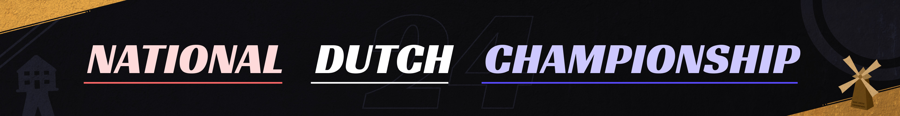

# National Dutch Championship 2024

The **National Dutch Championship 2024** (***NDC 2024***) is a 1v1, double elimination osu!standard tournament hosted by ::{ flag=NL }:: [Lilily](https://osu.ppy.sh/users/6502403) and ::{ flag=NL }:: [Mr HeliX](https://osu.ppy.sh/users/2330619). It is the third instalment of the National Dutch Championship.

## Tournament schedule

| Event | Timestamp |
| --: | :-- |
| Registration phase | 2024-08-05/2024-08-18 |
| Qualifiers | 2024-08-22/2024-08-25 and 2024-08-29/2024-09-01 |
| Round of 32 | 2024-09-06/2024-09-08 |
| Round of 16 | 2024-09-13/2024-09-15 |
| Quarterfinals | 2024-09-20/2024-09-22 |
| Semifinals | 2024-09-27/2024-09-29 |
| Finals | 2024-10-04/2024-10-06 |
| Grand Finals | 2024-10-11/2024-10-13 |

## Prizes

| Placing | Prize(s) |
| :-: | :-- |
|  | €550,- |
|  | €275,- |
|  | €110,- |
| *4th place* | €55,- |
| *5th & 6th place* | €33,- |
| *7th & 8th place* | €22,- |

*Prizes may be increased if more donations come in*

<!--  -->

## Organisation

The National Dutch Championship 2024 is run by various community members.

| Position | Member(s) |
| :-- | :-- |
| Organisation | ::{ flag=NL }:: [Lilily](https://osu.ppy.sh/users/6502403), ::{ flag=NL }:: [Mr HeliX](https://osu.ppy.sh/users/2330619) |
| Mappool selector | ::{ flag=CA }:: [chiv](https://osu.ppy.sh/users/6701656), ::{ flag=US }:: [Tycani](https://osu.ppy.sh/users/6693266), ::{ flag=NL }:: [- Ethereal -](https://osu.ppy.sh/users/9357932), ::{ flag=NL }:: [Sroj](https://osu.ppy.sh/users/4783389), ::{ flag=NL }:: [niqht](https://osu.ppy.sh/users/14390731), ::{ flag=TR }:: [Ryukishi](https://osu.ppy.sh/users/9045874), ::{ flag=NL }:: [nijlpaard](https://osu.ppy.sh/users/30921375) |
| Mapper | ::{ flag=NL }:: [Castagne](https://osu.ppy.sh/users/12270596), ::{ flag=NL }:: [taku](https://osu.ppy.sh/users/684433), ::{ flag=NL }:: [CMeFly](https://osu.ppy.sh/users/12195391), ::{ flag=NL }:: [Vivyanne](https://osu.ppy.sh/users/3789276) |
| Playtester | ::{ flag=NL }:: [Lilily](https://osu.ppy.sh/users/6502403), ::{ flag=NL }:: [dyl](https://osu.ppy.sh/users/9507985), ::{ flag=NL }:: [Quinten](https://osu.ppy.sh/users/5101306), ::{ flag=BE }:: [Hanori](https://osu.ppy.sh/users/7078544), ::{ flag=NL }:: [Seleen](https://osu.ppy.sh/users/9362168), ::{ flag=NL }:: [CMeFly](https://osu.ppy.sh/users/12195391), ::{ flag=GB }:: [HAUNTE](https://osu.ppy.sh/users/7333471), ::{ flag=NO }:: [Melvr](https://osu.ppy.sh/users/9211924), ::{ flag=PH }:: [NathanRam1918](https://osu.ppy.sh/users/4734703), ::{ flag=DE }:: [ZeitFrost](https://osu.ppy.sh/users/11234706), ::{ flag=NL }:: [AngelNamirin](https://osu.ppy.sh/users/6145220) |
| Referee | ::{ flag=NL }:: [- Ethereal -](https://osu.ppy.sh/users/9357932), ::{ flag=NL }:: [Lilily](https://osu.ppy.sh/users/6502403), ::{ flag=NL }:: [DeathByDarwin](https://osu.ppy.sh/users/9087777), ::{ flag=NL }:: [Kapsalon](https://osu.ppy.sh/users/6941124), ::{ flag=NL }:: [Sroj](https://osu.ppy.sh/users/4783389), ::{ flag=NL }:: [KayoNar](https://osu.ppy.sh/users/6960689), ::{ flag=NL }:: [Bart](https://osu.ppy.sh/users/15961009), ::{ flag=NL }:: [Marslam](https://osu.ppy.sh/users/16814497), ::{ flag=NL }:: [Happy_24](https://osu.ppy.sh/users/12876323), ::{ flag=NL }:: [JustChe](https://osu.ppy.sh/users/18229204) |
| Streamer | ::{ flag=NL }:: [- Ethereal -](https://osu.ppy.sh/users/9357932), ::{ flag=NL }:: [Lilily](https://osu.ppy.sh/users/6502403), ::{ flag=NL }:: [DeathByDarwin](https://osu.ppy.sh/users/9087777), ::{ flag=NL }:: [Amarillo](https://osu.ppy.sh/users/6632587), ::{ flag=NL }:: [UnveiledGolem](https://osu.ppy.sh/users/14090438), ::{ flag=NL }:: [Fubu](https://osu.ppy.sh/users/12719649), ::{ flag=NL }:: [Happy_24](https://osu.ppy.sh/users/12876323), ::{ flag=NL }:: [Mr HeliX](https://osu.ppy.sh/users/2330619) |
| Commentator | ::{ flag=NL }:: [Kut](https://osu.ppy.sh/users/3859899), ::{ flag=NL }:: [Lilily](https://osu.ppy.sh/users/6502403), ::{ flag=NL }:: [Sroj](https://osu.ppy.sh/users/4783389), ::{ flag=NL }:: [UnveiledGolem](https://osu.ppy.sh/users/14090438), ::{ flag=NL }:: [Bart](https://osu.ppy.sh/users/15961009), ::{ flag=NL }:: [Telegy](https://osu.ppy.sh/users/16322001), ::{ flag=NL }:: [Fubu](https://osu.ppy.sh/users/12719649), ::{ flag=NL }:: [pregnant](https://osu.ppy.sh/users/15413621), ::{ flag=NL }:: [OldEclipse](https://osu.ppy.sh/users/5174602), ::{ flag=NL }:: [AngelNamirin](https://osu.ppy.sh/users/6145220), ::{ flag=BE }:: [5joshi](https://osu.ppy.sh/users/4279650), ::{ flag=NL }:: [Swerro](https://osu.ppy.sh/users/4507667), ::{ flag=NL }:: [Mr HeliX](https://osu.ppy.sh/users/2330619) |
| Designer | ::{ flag=NL }:: [Happy_24](https://osu.ppy.sh/users/12876323) |

*This list may be updated during the tournament*

## Links

- [Website](https://tourney.huismetbenen.nl/25)
- [Forum post](https://osu.ppy.sh/community/forums/topics/1959133?n=1)
- [Livestream](https://www.twitch.tv/NDC_osu)

## Participants

| Seed | Player | Global rank | Country rank |
| :-: | :-- | :-: | :-: |
| TBD | ::{ flag=NL }:: [LUCIANO](https://osu.ppy.sh/users/11604978) | #52 | #1 |
| TBD | ::{ flag=NL }:: [Taylan_](https://osu.ppy.sh/users/16395194) | #294 | #5 |
| TBD | ::{ flag=NL }:: [heyronii](https://osu.ppy.sh/users/5642779) | #749 | #9 |
| TBD | ::{ flag=NL }:: [Skyrovania](https://osu.ppy.sh/users/4696315) | #765 | #11 |
| TBD | ::{ flag=NL }:: [Ohio](https://osu.ppy.sh/users/14919428) | #770 | #11 |
| TBD | ::{ flag=NL }:: [Dolter](https://osu.ppy.sh/users/6920104) | #936 | #13 |
| TBD | ::{ flag=NL }:: [ahmet](https://osu.ppy.sh/users/16780708) | #988 | #14 |
| TBD | ::{ flag=NL }:: [Nederland](https://osu.ppy.sh/users/15802126) | #1082 | #16 |
| TBD | ::{ flag=NL }:: [chillington 15](https://osu.ppy.sh/users/6744123) | #1277 | #17 |
| TBD | ::{ flag=NL }:: [wessel_osu2](https://osu.ppy.sh/users/4382220) | #2093 | #27 |
| TBD | ::{ flag=NL }:: [WeederBoss0](https://osu.ppy.sh/users/21574224) | #2586 | #31 |
| TBD | ::{ flag=NL }:: [permiss](https://osu.ppy.sh/users/8591929) | #2735 | #33 |
| TBD | ::{ flag=NL }:: [Nihilet](https://osu.ppy.sh/users/641155) | #3273 | #35 |
| TBD | ::{ flag=NL }:: [wooz](https://osu.ppy.sh/users/6888206) | #3365 | #37 |
| TBD | ::{ flag=NL }:: [Stogdy](https://osu.ppy.sh/users/15120705) | #4218 | #44 |
| TBD | ::{ flag=NL }:: [FietsAapje](https://osu.ppy.sh/users/10053936) | #4280 | #47 |
| TBD | ::{ flag=NL }:: [darknessofUwU](https://osu.ppy.sh/users/23635008) | #4374 | #49 |
| TBD | ::{ flag=NL }:: [Damnjelly](https://osu.ppy.sh/users/1666355) | #4883 | #59 |
| TBD | ::{ flag=NL }:: [Kwal1976](https://osu.ppy.sh/users/18659783) | #5207 | #61 |
| TBD | ::{ flag=NL }:: [SpaghetCat](https://osu.ppy.sh/users/16575519) | #5264 | #62 |
| TBD | ::{ flag=NL }:: [Sleppie](https://osu.ppy.sh/users/16072104) | #5335 | #65 |
| TBD | ::{ flag=NL }:: [AlphanTex](https://osu.ppy.sh/users/13298387) | #5589 | #68 |
| TBD | ::{ flag=NL }:: [sofuraabu](https://osu.ppy.sh/users/7639453) | #5939 | #71 |
| TBD | ::{ flag=NL }:: [Wittepoes](https://osu.ppy.sh/users/12984931) | #7068 | #79 |
| TBD | ::{ flag=NL }:: [Goose King](https://osu.ppy.sh/users/9387696) | #7374 | #82 |
| TBD | ::{ flag=NL }:: [kinda sus dude](https://osu.ppy.sh/users/9610588) | #7688 | #89 |
| TBD | ::{ flag=NL }:: [tortvred](https://osu.ppy.sh/users/21505584) | #7990 | #91 |
| TBD | ::{ flag=NL }:: [pregnant](https://osu.ppy.sh/users/15413621) | #8154 | #95 |
| TBD | ::{ flag=NL }:: [bakastarz](https://osu.ppy.sh/users/17526675) | #8156 | #94 |
| TBD | ::{ flag=NL }:: [cozyin](https://osu.ppy.sh/users/12200180) | #8616 | #98 |
| TBD | ::{ flag=NL }:: [UnveiledGolem](https://osu.ppy.sh/users/14090438) | #8747 | #100 |
| TBD | ::{ flag=NL }:: [wessel_osu1](https://osu.ppy.sh/users/6577301) | #9435 | #110 |
| TBD | ::{ flag=NL }:: [Kyqn](https://osu.ppy.sh/users/15202512) | #9985 | #116 |
| TBD | ::{ flag=NL }:: [SecretlyShiro](https://osu.ppy.sh/users/7498203) | #10458 | #119 |
| TBD | ::{ flag=NL }:: [nik](https://osu.ppy.sh/users/10077264) | #10524 | #117 |
| TBD | ::{ flag=NL }:: [blexdark](https://osu.ppy.sh/users/12832395) | #11068 | #126 |
| TBD | ::{ flag=NL }:: [TheCoolJfp](https://osu.ppy.sh/users/7041796) | #11116 | #127 |
| TBD | ::{ flag=NL }:: [Trehaloses](https://osu.ppy.sh/users/5570153) | #11517 | #133 |
| TBD | ::{ flag=NL }:: [Telegy](https://osu.ppy.sh/users/16322001) | #13064 | #156 |
| TBD | ::{ flag=NL }:: [Pamuwu](https://osu.ppy.sh/users/13032176) | #13282 | #155 |
| TBD | ::{ flag=NL }:: [GeKa_Z](https://osu.ppy.sh/users/13233381) | #13443 | #163 |
| TBD | ::{ flag=NL }:: [Devrimon](https://osu.ppy.sh/users/9425864) | #13565 | #162 |
| TBD | ::{ flag=NL }:: [DJJDJ516](https://osu.ppy.sh/users/19412255) | #14040 | #167 |
| TBD | ::{ flag=NL }:: [oetluller](https://osu.ppy.sh/users/15218429) | #14356 | #169 |
| TBD | ::{ flag=NL }:: [faze-dank](https://osu.ppy.sh/users/13050074) | #15504 | #187 |
| TBD | ::{ flag=NL }:: [draconia](https://osu.ppy.sh/users/20241831) | #16116 | #192 |
| TBD | ::{ flag=NL }:: [NeonCircles](https://osu.ppy.sh/users/13702202) | #19586 | #226 |
| TBD | ::{ flag=NL }:: [PotjeNutella](https://osu.ppy.sh/users/10926707) | #21201 | #244 |
| TBD | ::{ flag=NL }:: [Heavymetal4life](https://osu.ppy.sh/users/21586994) | #22405 | #255 |
| TBD | ::{ flag=NL }:: [Fubu](https://osu.ppy.sh/users/12719649) | #25022 | #286 |
| TBD | ::{ flag=NL }:: [Gincli](https://osu.ppy.sh/users/11587229) | #29715 | #342 |
| TBD | ::{ flag=NL }:: [Speed Kitty](https://osu.ppy.sh/users/15725070) | #30015 | #344 |
| TBD | ::{ flag=NL }:: [Axeanz](https://osu.ppy.sh/users/14073866) | #32889 | #383 |
| TBD | ::{ flag=NL }:: [Piglin](https://osu.ppy.sh/users/26139689) | #36593 | #432 |
| TBD | ::{ flag=NL }:: [Bittshrooms](https://osu.ppy.sh/users/9250996) | #48175 | #563 |
| TBD | ::{ flag=NL }:: [Kuuyomi](https://osu.ppy.sh/users/8607615) | #49042 | #571 |
| TBD | ::{ flag=NL }:: [speedbeats24](https://osu.ppy.sh/users/15191079) | #52825 | #620 |
| TBD | ::{ flag=NL }:: [matthijs661](https://osu.ppy.sh/users/17384912) | #62449 | #725 |
| TBD | ::{ flag=NL }:: [-SanaBanana-](https://osu.ppy.sh/users/5371593) | #73109 | #866 |
| TBD | ::{ flag=NL }:: [niles](https://osu.ppy.sh/users/11267587) | #92588 | #1101 |
| TBD | ::{ flag=NL }:: [Aimy](https://osu.ppy.sh/users/20348925) | #94742 | #1125 |
| TBD | ::{ flag=NL }:: [prins_off_hell](https://osu.ppy.sh/users/30975022) | #96685 | #1152 |
| TBD | ::{ flag=NL }:: [Timmieturnerrr](https://osu.ppy.sh/users/18048714) | #122471 | #1428 |
| TBD | ::{ flag=NL }:: [KawaiiSniperBoy](https://osu.ppy.sh/users/20524617) | #163763 | #1857 |
| TBD | ::{ flag=NL }:: [Mrvos15](https://osu.ppy.sh/users/31773225) | #321975 | #3488 |

## Mappools

### Qualifiers

**[Download the mappack here!](https://tourney.huismetbenen.nl/25/mappools/ql)**

- Nomod
  1. [HACHI - MATRYOSHKA (Luscent) [Expert]](https://osu.ppy.sh/beatmapsets/1824623#osu/3744361/3744361)
  2. [xi - Blue Zenith (Asphyxia) [ktgster's Extreme]](https://osu.ppy.sh/beatmapsets/292301#osu/657917/657917)
  3. [PeriTune - Prairie4 (captin1) [Extra]](https://osu.ppy.sh/beatmapsets/1543431#osu/3154910/3154910)
  4. [Juggernaut. - Rebellion (Wispy) [Extra.]](https://osu.ppy.sh/beatmapsets/2125782#osu/4468368/4468368)
- Hidden
  1. [Camellia - Kono Hoshi de.... (Snow Note) [Another]](https://osu.ppy.sh/beatmapsets/106693#osu/280034/280034)
  2. [paraoka feat. haru*nya - Manimani (Cut ver.) (Cellina) [Hananoiro]](https://osu.ppy.sh/beatmapsets/2008891#osu/4179280/4179280)
- Hardrock
  1. [BUTAOTOME - Yurara Kamishibai (sstari) [Expert]](https://osu.ppy.sh/beatmapsets/2148067#osu/4717103/4717103)
  2. [Warak - REANIMATE (iyasine) [Azer's Extra]](https://osu.ppy.sh/beatmapsets/186318#osu/459845/459845)
- Double Time
  1. [FELT - Flower Flag (MZC Echoes the Spring Liquid Mix) (Frostmourne) [Lunatic]](https://osu.ppy.sh/beatmapsets/55945#osu/169450/169450)
  2. [frederic - Junkie (elicz1) [XLT's Insane]](https://osu.ppy.sh/beatmapsets/2078299#osu/4387718/4387718)

## Ruleset

### Registrations

1. This tournament is a 1v1, double elimination, osu!standard tournament with no rank restriction, only for players from the Netherlands.
2. Players must have the Dutch flag on their osu! profile.
3. Registrations are only accepted through our [website](https://tourney.huismetbenen.nl/25/registrations).
4. Players must be a member of our Discord server as long as they are participating in the tournament.
5. Staff members are not allowed to participate, with the exception of streamers, commentators and graphics designers.
6. Players who do not pass the screening phase from the osu! tournament committee are not allowed to participate.

### Qualifiers stage

1. The tournament starts with a qualifiers stage which is open to all registered players.
2. Each player can schedule their own, personal qualifiers lobby at any time during the qualifiers weekend.
3. Sharing a qualifiers lobby with another player is not allowed.
4. Players are free to choose the order in which they play the qualifiers maps. The only requirement is that all maps are played once.
5. All maps are played with Scorev2 and Nofail enabled.
6. After the qualifiers stage is over, seedings are calculated as follows:
   1. For every map, the median score is calculated
   2. Each player is then awarded points as follows: **Points** = player score / median score.
   3. For each player, these points are all added together resulting in a final points total.
   4. All players are ranked on their final points total in descending order
   5. The 32 players with the highest final points total move on to the knockout stage. All other players are eliminated.

### Knockout stage

1. The knockout stage starts with a round of 32. Players are eliminated after losing two matches.
2. Schedules for each round are released on the Monday prior to the match weekend.
3. Reschedules are permitted at all times. Matches are not allowed to be rescheduled to days other than Friday, Saturday or Sunday. Reschedules must be posted in the appropriate channel in the Discord server **at least 12 hours** before the original match time. Matches may also not collide with potential loser bracket matches.
4. If a player is not present 5 minutes after their official match time, they will automatically forfeit the match.
5. Players will be pinged in the Discord server 15 minutes before the match.
6. Both players are allowed to choose 1 warmup, but this is not required.
   1. Each warmup can be at most 3.5 minutes in length.
   2. If both players agree, a long warmup can be allowed (up to 5 minutes) only if this is discussed with the opponent beforehand. The total warmups length cannot exceed 7 minutes.
   3. Warmups are to be sent to the referee beforehand, who will select the maps in the lobby. Players who did not send their warmup beforehand are not allowed to pick a warmup.
   4. Warmups are always played on freemod with possibly DT/NC.
7. If a player disconnects at most 30 seconds after the map has started, the map will be aborted and replayed. Disconnecting after this time counts as a loss for the disconnecting player. This is only permitted once per player per match.
8. Upon technical difficulties, a player may choose to use a 5-minute timeout. This is only permitted once per player per match.
9. Use of offensive language is not allowed in either the lobby chat or cursor smoke. This includes supposedly friendly banter between the two players, as there is no way for staff to judge this.

### Match procedure

1. Both players will start by using the !roll command once.
2. The high roll may choose between "first ban" and "second ban".
3. The low roll will receive whatever is left.
4. The player who bans first will also pick first, and vice versa.
5. Bans and picks will alternate between the players.
6. There will be a 90-second timer for bans and picks. If the timer runs out before a player stating a map, the other player may choose that particular ban or pick. This does NOT change ban/pick order: the other player still has their own ban/pick afterwards, so they are effectively allowed to ban/pick twice in a row.
7. Banning two maps in the same mod bracket is allowed. Banning three maps in the same mod bracket is NOT allowed.
8. If a tiebreaker has to be played, there will be a 2-minute break beforehand.

### Mappools

1. Mappools are released on the Monday night prior to the match weekend.
2. The mappool structure is as follows:
   - Qualifiers: 4 NM / 2 HD / 2 HR/ 2 DT
   - Round of 32: 5 NM / 2 HD / 2 HR / 3 DT / 1 TB | 1 ban | BO9
   - Round of 16: 5 NM / 2 HD / 2 HR / 3 DT / 1 TB | 1 ban | BO9
   - Quarterfinals: 6 NM / 3 HD / 3 HR / 4 DT / 1 TB | 2 bans | BO11
   - Semifinals: 6 NM / 3 HD / 3 HR / 4 DT / 1 TB | 2 bans | BO11
   - Finals: 7 NM / 4 HD / 4 HR / 4 DT / 1 TB | 3 bans | BO13
   - Grand Finals: 7 NM / 4 HD / 4 HR / 4 DT / 1 TB | 3 bans | BO13
