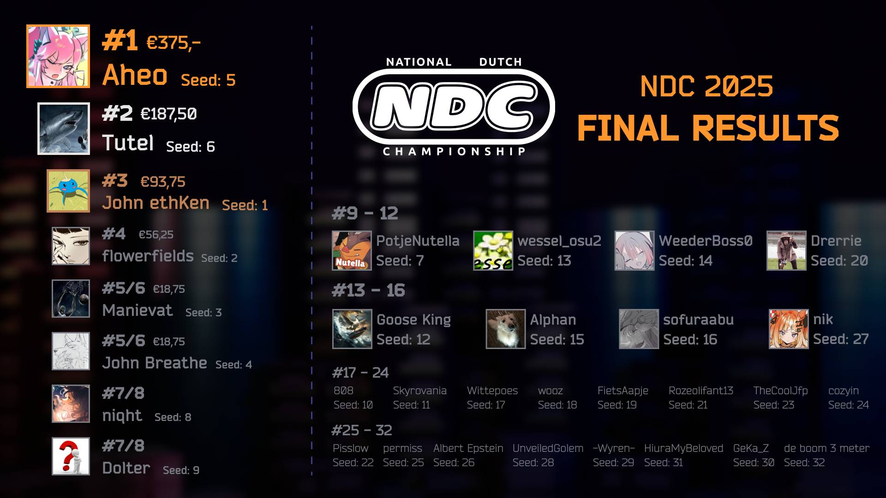

---
tags:
  - NDC2025
  - NDC
---

# National Dutch Championship 2025

The **National Dutch Championship 2025** (***NDC 2025***) was a 1v1, double elimination osu!standard tournament hosted by ::{ flag=NL }:: [Lilily](https://osu.ppy.sh/users/6502403), ::{ flag=NL }:: [Mr HeliX](https://osu.ppy.sh/users/2330619), ::{ flag=NL }:: [Happy_24](https://osu.ppy.sh/users/12876323), ::{ flag=NL }:: [Fubu](https://osu.ppy.sh/users/12719649) and ::{ flag=NL }:: [Sroj](https://osu.ppy.sh/users/4783389). It was the fourth instalment of the National Dutch Championship.

## Tournament schedule

| Event | Timestamp |
| --: | :-- |
| Registration phase | 2025-08-09/2025-08-17 |
| Qualifiers | 2025-08-21/2025-08-31 |
| Round of 32 | 2025-09-05/2025-09-07 |
| Round of 16 | 2025-09-12/2025-09-14 |
| Quarterfinals | 2025-09-19/2025-09-21 |
| Semifinals | 2025-09-26/2025-09-28 |
| Finals | 2025-10-03/2025-10-05 |
| Grand Finals | 2025-10-10/2025-10-12 |

## Prizes

The prize pool totals €750 and was divided as follows:

| Placing | Prize(s) |
| :-: | :-- |
|  | 50% (€375) |
|  | 25% (€187,50) |
|  | 12.5% (€93,75) |
| *4th place* | 7.5% (€56,25) |
| *5th & 6th place* | 2.5% (€18,75) |

The tournament and prize pool was sponsored by both the organisation and community members. Donators could choose how much of their donation they wanted to go to either the prize pool or improving the tournament series:

- ::{ flag=NL }:: [Lilily](https://osu.ppy.sh/users/6502403): €500
- ::{ flag=NL }:: [Mr HeliX](https://osu.ppy.sh/users/2330619): €200
- ::{ flag=NL }:: [Happy_24](https://osu.ppy.sh/users/12876323): €150
- ::{ flag=NL }:: [Katie Djeestar](https://osu.ppy.sh/users/641155): €150
- ::{ flag=NL }:: [wie ben jij](https://osu.ppy.sh/users/16322001): €100
- ::{ flag=NL }:: [Astraea](https://osu.ppy.sh/users/17526061): €90

## Organisation

The National Dutch Championship 2025 was run by various community members.

| Position | Member(s) |
| :-- | :-- |
| Organisation | ::{ flag=NL }:: [Lilily](https://osu.ppy.sh/users/6502403), ::{ flag=NL }:: [Mr HeliX](https://osu.ppy.sh/users/2330619), ::{ flag=NL }:: [Happy_24](https://osu.ppy.sh/users/12876323), ::{ flag=NL }:: [Fubu](https://osu.ppy.sh/users/12719649), ::{ flag=NL }:: [Sroj](https://osu.ppy.sh/users/4783389) |
| Mappool selector | ::{ flag=NL }:: [Sroj](https://osu.ppy.sh/users/4783389), ::{ flag=SG }:: [bailie](https://osu.ppy.sh/users/7537133), ::{ flag=BE }:: [Senndwich](https://osu.ppy.sh/users/12089512), ::{ flag=BE }:: [megafasator](https://osu.ppy.sh/users/8456924) |
| Mapper | ::{ flag=PL }:: [-NeBu-](https://osu.ppy.sh/users/4099626), ::{ flag=DE }:: [Mir](https://osu.ppy.sh/users/8688812), ::{ flag=NL }:: [Fubu](https://osu.ppy.sh/users/12719649), ::{ flag=NL }:: [OldEclipse](https://osu.ppy.sh/users/5174602), ::{ flag=NL }:: [Lilily](https://osu.ppy.sh/users/6502403), ::{ flag=NL }:: [Damnjelly](https://osu.ppy.sh/users/1666355), ::{ flag=NL }:: [n0ah](https://osu.ppy.sh/users/3086393), ::{ flag=US }:: [Wispy](https://osu.ppy.sh/users/11106929), ::{ flag=NL }:: [taku](https://osu.ppy.sh/users/684433), ::{ flag=NO }:: [BarkingMadDog](https://osu.ppy.sh/users/3475189), ::{ flag=NL }:: [Mijn Aim Zuigt](https://osu.ppy.sh/users/4587487), ::{ flag=DE }:: [Kojio](https://osu.ppy.sh/users/2054596) |
| Playtester | ::{ flag=NL }:: [SecretlyShiro](https://osu.ppy.sh/users/7498203), ::{ flag=BE }:: [hexi](https://osu.ppy.sh/users/10760701), ::{ flag=BE }:: [Hanori](https://osu.ppy.sh/users/7078544), ::{ flag=NL }:: [Quinten](https://osu.ppy.sh/users/5101306), ::{ flag=FI }:: [mxu](https://osu.ppy.sh/users/18687807), ::{ flag=NL }:: [Lilily](https://osu.ppy.sh/users/6502403), ::{ flag=HK }:: [misha awa](https://osu.ppy.sh/users/14503423), ::{ flag=PT }:: [Kuronora](https://osu.ppy.sh/users/2742030), ::{ flag=NL }:: [faze-dank](https://osu.ppy.sh/users/13050074), ::{ flag=KR }:: [Amamya Kokoro](https://osu.ppy.sh/users/2511839), ::{ flag=NL }:: [Wittepoes](https://osu.ppy.sh/users/12984931), ::{ flag=NL }:: [UC2](https://osu.ppy.sh/users/6989615), ::{ flag=NL }:: [nik](https://osu.ppy.sh/users/10077264), ::{ flag=NL }:: [Alphan](https://osu.ppy.sh/users/13298387), ::{ flag=NL }:: [sofuraabu](https://osu.ppy.sh/users/7639453), ::{ flag=CN }:: [Crystal](https://osu.ppy.sh/users/1646397), ::{ flag=NO }:: [HUNDUR](https://osu.ppy.sh/users/3145033), ::{ flag=NL }:: [niqht](https://osu.ppy.sh/users/14390731), ::{ flag=DE }:: [yary](https://osu.ppy.sh/users/13300203), ::{ flag=NO }:: [Melvr](https://osu.ppy.sh/users/9211924), ::{ flag=NL }:: [Kushper](https://osu.ppy.sh/users/4832514), ::{ flag=ES }:: [A L E P H](https://osu.ppy.sh/users/6735738), ::{ flag=GB }:: [Bubbleman](https://osu.ppy.sh/users/5182050), ::{ flag=RO }:: [badeu](https://osu.ppy.sh/users/1473890) |
| Referee | ::{ flag=NL }:: [Lilily](https://osu.ppy.sh/users/6502403), ::{ flag=DE }:: [TheHunter1](https://osu.ppy.sh/users/6496016), ::{ flag=NL }:: [Astraea](https://osu.ppy.sh/users/17526061), ::{ flag=NL }:: [wie ben jij](https://osu.ppy.sh/users/16322001), ::{ flag=NL }:: [Marslam](https://osu.ppy.sh/users/16814497), ::{ flag=NL }:: [DeathByDarwin](https://osu.ppy.sh/users/9087777), ::{ flag=NL }:: [Kapsalon](https://osu.ppy.sh/users/6941124), ::{ flag=NL }:: [Timper](https://osu.ppy.sh/users/11955929) |
| Streamer | ::{ flag=NL }:: [wessel_osu2](https://osu.ppy.sh/users/4382220), ::{ flag=NL }:: [Lilily](https://osu.ppy.sh/users/6502403), ::{ flag=NL }:: [Fubu](https://osu.ppy.sh/users/12719649), ::{ flag=NL }:: [Astraea](https://osu.ppy.sh/users/17526061), ::{ flag=NL }:: [Alphan](https://osu.ppy.sh/users/13298387), ::{ flag=NL }:: [UnveiledGolem](https://osu.ppy.sh/users/14090438), ::{ flag=NL }:: [Mr HeliX](https://osu.ppy.sh/users/2330619) |
| Commentator | ::{ flag=NL }:: [Swerro](https://osu.ppy.sh/users/4507667), ::{ flag=NL }:: [UnveiledGolem](https://osu.ppy.sh/users/14090438), ::{ flag=NL }:: [Lilily](https://osu.ppy.sh/users/6502403), ::{ flag=NL }:: [Fubu](https://osu.ppy.sh/users/12719649), ::{ flag=NL }:: [Mr HeliX](https://osu.ppy.sh/users/2330619), ::{ flag=NL }:: [Timper](https://osu.ppy.sh/users/11955929), ::{ flag=NL }:: [Pisslow](https://osu.ppy.sh/users/26527329), ::{ flag=NL }:: [Alphan](https://osu.ppy.sh/users/13298387), ::{ flag=NL }:: [Goose King](https://osu.ppy.sh/users/9387696), ::{ flag=NL }:: [Sroj](https://osu.ppy.sh/users/4783389), ::{ flag=NL }:: [Happy_24](https://osu.ppy.sh/users/12876323), ::{ flag=NL }:: [sofuraabu](https://osu.ppy.sh/users/7639453), ::{ flag=NL }:: [Damnjelly](https://osu.ppy.sh/users/1666355), ::{ flag=NL }:: [wessel_osu2](https://osu.ppy.sh/users/4382220), ::{ flag=NL }:: [n0ah](https://osu.ppy.sh/users/3086393), ::{ flag=NL }:: [nik](https://osu.ppy.sh/users/10077264), ::{ flag=NL }:: [Castagne](https://osu.ppy.sh/users/12270596), ::{ flag=NL }:: [flowerfields](https://osu.ppy.sh/users/11604978) |
| Designer | ::{ flag=NL }:: [Happy_24](https://osu.ppy.sh/users/12876323), ::{ flag=US }:: [Boolmaster Flex](https://osu.ppy.sh/users/5394681) |
| Editor | ::{ flag=NL }:: [FogsFles](https://osu.ppy.sh/users/3197633), ::{ flag=NL }:: [Fubu](https://osu.ppy.sh/users/12719649), ::{ flag=NL }:: [Timper](https://osu.ppy.sh/users/11955929), ::{ flag=NL }:: [Pisslow](https://osu.ppy.sh/users/26527329) |
| Programmer | ::{ flag=NL }:: [Mr HeliX](https://osu.ppy.sh/users/2330619), ::{ flag=NL }:: [Happy_24](https://osu.ppy.sh/users/12876323), ::{ flag=NL }:: [basw](https://osu.ppy.sh/users/13794142), ::{ flag=NL }:: [dyl](https://osu.ppy.sh/users/9507985) |

## Links

- [Website](https://tourney.huismetbenen.nl/31)
- [Forum post](https://osu.ppy.sh/community/forums/topics/2115821?n=1)
- [Livestream A](https://twitch.tv/NDC_osu)
- [Livestream B](https://twitch.tv/NDC_osu2)
- [Livestream C](https://twitch.tv/NDC_osu3)

## Participants

| Seed | Player | Global rank | Country rank |
| :-: | :-- | :-: | :-: |
| 1 | ::{ flag=NL }:: [Katie Djeestar](https://osu.ppy.sh/users/641155) | #2016 | #23 |
| 2 | ::{ flag=NL }:: [flowerfields](https://osu.ppy.sh/users/11604978) | #102 | #1 |
| 3 | ::{ flag=NL }:: [Manievat](https://osu.ppy.sh/users/6744123) | #1650 | #21 |
| 4 | ::{ flag=NL }:: [draconia](https://osu.ppy.sh/users/20241831) | #3995 | #42 |
| 5 | ::{ flag=NL }:: [Aheo](https://osu.ppy.sh/users/14919428) | #442 | #5 |
| 6 | ::{ flag=NL }:: [Tutel](https://osu.ppy.sh/users/12241010) | #231 | #2 |
| 7 | ::{ flag=NL }:: [PotjeNutella](https://osu.ppy.sh/users/10926707) | #9772 | #116 |
| 8 | ::{ flag=NL }:: [niqht](https://osu.ppy.sh/users/14390731) | #1623 | #19 |
| 9 | ::{ flag=NL }:: [Dolter](https://osu.ppy.sh/users/6920104) | #1327 | #15 |
| 10 | ::{ flag=NL }:: [808](https://osu.ppy.sh/users/15802126) | #531 | #7 |
| 11 | ::{ flag=NL }:: [Skyrovania](https://osu.ppy.sh/users/4696315) | #1383 | #16 |
| 12 | ::{ flag=NL }:: [Goose King](https://osu.ppy.sh/users/9387696) | #9126 | #107 |
| 13 | ::{ flag=NL }:: [wessel_osu2](https://osu.ppy.sh/users/4382220) | #3188 | #34 |
| 14 | ::{ flag=NL }:: [WeederBoss0](https://osu.ppy.sh/users/21574224) | #686 | #10 |
| 15 | ::{ flag=NL }:: [Alphan](https://osu.ppy.sh/users/13298387) | #6264 | #65 |
| 16 | ::{ flag=NL }:: [sofuraabu](https://osu.ppy.sh/users/7639453) | #8285 | #93 |
| 17 | ::{ flag=NL }:: [Wittepoes](https://osu.ppy.sh/users/12984931) | #4823 | #49 |
| 18 | ::{ flag=NL }:: [wooz](https://osu.ppy.sh/users/6888206) | #5200 | #54 |
| 19 | ::{ flag=NL }:: [FietsAapje](https://osu.ppy.sh/users/10053936) | #2693 | #29 |
| 20 | ::{ flag=NL }:: [Drerrie](https://osu.ppy.sh/users/5346146) | #9236 | #108 |
| 21 | ::{ flag=NL }:: [Rozeolifant13](https://osu.ppy.sh/users/16335215) | #3699 | #39 |
| 22 | ::{ flag=NL }:: [Pisslow](https://osu.ppy.sh/users/26527329) | #8849 | #103 |
| 23 | ::{ flag=NL }:: [TheCoolJfp](https://osu.ppy.sh/users/7041796) | #9765 | #115 |
| 24 | ::{ flag=NL }:: [cozyin](https://osu.ppy.sh/users/12200180) | #9929 | #120 |
| 25 | ::{ flag=NL }:: [permiss](https://osu.ppy.sh/users/8591929) | #2314 | #24 |
| 26 | ::{ flag=NL }:: [Albert Epstein](https://osu.ppy.sh/users/13109448) | #6159 | #62 |
| 27 | ::{ flag=NL }:: [nik](https://osu.ppy.sh/users/10077264) | #13033 | #151 |
| 28 | ::{ flag=NL }:: [UnveiledGolem](https://osu.ppy.sh/users/14090438) | #11847 | #138 |
| 29 | ::{ flag=NL }:: [-Wyren-](https://osu.ppy.sh/users/12535083) | #17714 | #193 |
| 30 | ::{ flag=NL }:: [GeKa_Z](https://osu.ppy.sh/users/13233381) | #9638 | #112 |
| 31 | ::{ flag=NL }:: [HiuraMyBeloved](https://osu.ppy.sh/users/19412255) | #9439 | #110 |
| 32 | ::{ flag=NL }:: [de boom 3 meter](https://osu.ppy.sh/users/3577226) | #2348 | #25 |
| 33 | ::{ flag=NL }:: [NeonCircles](https://osu.ppy.sh/users/13702202) | #13352 | #154 |
| 34 | ::{ flag=NL }:: [Noobicep192](https://osu.ppy.sh/users/19453671) | #7595 | #86 |
| 35 | ::{ flag=NL }:: [Stogdy](https://osu.ppy.sh/users/15120705) | #3672 | #38 |
| 36 | ::{ flag=NL }:: [DuoSushi](https://osu.ppy.sh/users/9258670) | #28309 | #294 |
| 37 | ::{ flag=NL }:: [gpvk](https://osu.ppy.sh/users/22600547) | #26270 | #278 |
| 38 | ::{ flag=NL }:: [wessel_osu1](https://osu.ppy.sh/users/6577301) | #12354 | #144 |
| 39 | ::{ flag=NL }:: [Sleppie](https://osu.ppy.sh/users/16072104) | #5015 | #50 |
| 40 | ::{ flag=NL }:: [Joeri](https://osu.ppy.sh/users/12839455) | #92794 | #1018 |
| 41 | ::{ flag=NL }:: [Naccer](https://osu.ppy.sh/users/2250236) | #67347 | #737 |
| 42 | ::{ flag=NL }:: [YourLilBot](https://osu.ppy.sh/users/13238964) | #53409 | #586 |
| 43 | ::{ flag=NL }:: [SquirrelSquire](https://osu.ppy.sh/users/11611290) | #46695 | #513 |
| 44 | ::{ flag=NL }:: [Bittshrooms](https://osu.ppy.sh/users/9250996) | #45542 | #501 |
| 45 | ::{ flag=NL }:: [KawaiiSniperBoy](https://osu.ppy.sh/users/20524617) | #24996 | #267 |
| 46 | ::{ flag=NL }:: [Piglin](https://osu.ppy.sh/users/26139689) | #15948 | #177 |

## Podium

This competition has come to an end and resulted in the following podium:

## Mappools

### Grand Finals

**[Download the mappack here!](https://tourney.huismetbenen.nl/31/mappools/gf)**

- No Mod
  1. [Adust Rain - Eleven Stud (Toumei Dragon) [Subterranean Rose]](https://osu.ppy.sh/beatmapsets/2284459#osu/4872301)
  2. [Aether Realm - Ravensong (iamtickrate) [The Tears of the Stars]](https://osu.ppy.sh/beatmapsets/1985093#osu/4123080)
  3. [lical - nyctalopia (Raijodo) [delusionalism]](https://osu.ppy.sh/beatmapsets/1284666#osu/2745135)
  4. [Project-G - Chronokinesia (Xykrome) (Cut Ver.) (nooj) [nooj x feiri Zhonya's Paradox]](https://osu.ppy.sh/beatmapsets/2135377#osu/4494048)
  5. [UNDEAD CORPORATION - and Say Good Bye... (Halfslashed) [Demarcation]](https://osu.ppy.sh/beatmapsets/1779479#osu/3644373)
  6. [II-L - PIONEER-4 (oatmilk) [NONDYADIC]](https://osu.ppy.sh/beatmapsets/2100532#osu/4406631)
  7. [Eguchi Takahiro - silver temple (DeviousPanda) [yokes' insane]](https://osu.ppy.sh/beatmapsets/1813873#osu/3751036)
- Hidden
  1. [Skrillex - First Of The Year (LWO x FNRZ x MANX Hard Techno Edit) (Mijn Aim Zuigt) [BEL DE POLITIE]](https://osu.ppy.sh/beatmapsets/2445752#osu/5338459)
  2. [IOSYS - Hinarin no Yakui Kankei (Edit ver.) (Luscent) [Kuru-kurunatic]](https://osu.ppy.sh/beatmapsets/2088431#osu/4376532)
  3. [Halozy - Deconstruction Star (Hollow Wings) [Beat Heaven]](https://osu.ppy.sh/beatmapsets/292083#osu/657519)
  4. [Neighbour's Blueish Garden (NIWASHI+Aoi) - Deklowaz, the Allchemist (Blacky Design) [Blacky x Panda's Perpetual Reaction]](https://osu.ppy.sh/beatmapsets/2401472#osu/5207644)
- Hard Rock
  1. [Alestorm - Keelhauled (Camo) [GIVE NO QUARTER]](https://osu.ppy.sh/beatmapsets/1537993#osu/3144568)
  2. [Amane - BOOZEHOUND (Kojio) [Dogistyle]](https://osu.ppy.sh/beatmapsets/2445740#osu/5338415)
  3. [James Landino - Hide And Seek (Mirash) [Expert]](https://osu.ppy.sh/beatmapsets/972932#osu/2036903)
  4. [ABSOLUTE CASTAWAY - step by step (Cytusine) [iBell's Waltz]](https://osu.ppy.sh/beatmapsets/2298768#osu/5167719)
- Double Time
  1. [High Contrast (feat. Selah Corbin) - The Agony & The Ecstasy (kowari) [Sorrow]](https://osu.ppy.sh/beatmapsets/2414092#osu/5244933)
  2. [-45 - Konba Poison Reverse (Radiownd) [Myling]](https://osu.ppy.sh/beatmapsets/2250284#osu/4785597)
  3. [cosMo@BousouP - Oceanus (Broccoly) [Fortune's Insane]](https://osu.ppy.sh/beatmapsets/267767#osu/618865)
  4. [THE ORAL CIGARETTES - Kyouran Hey Kids!! (monstrata) [God of Speed]](https://osu.ppy.sh/beatmapsets/372510#osu/815857)
- Tiebreaker
  1. **[Naikou - // T3MPUS AET3RNVM // (taku) [Chronovoid]](https://osu.ppy.sh/beatmapsets/2445805#osu/5338589)**

### Finals

**[Download the mappack here!](https://tourney.huismetbenen.nl/31/mappools/f)**

- No Mod
  1. [Tia - The Glory Days (Sped Up Ver.) (Atipir) [Extreme]](https://osu.ppy.sh/beatmapsets/2015914#osu/4196784)
  2. [Brymir - Herald of Aegir (shoyeu) [Nymphe's Desecrated Torrent]](https://osu.ppy.sh/beatmapsets/1836524#osu/4679393)
  3. [System of a Down - Soil (quantumvortex) [Unrealized]](https://osu.ppy.sh/beatmapsets/2065762#osu/4321425)
  4. [Street - Hestia (GYGY) [Mir's Pyrtaneum]](https://osu.ppy.sh/beatmapsets/1707295#osu/3606794)
  5. [AAAA vs. Frums - beepbit * futures (toybot) [fast * forward]](https://osu.ppy.sh/beatmapsets/1633221#osu/3333700)
  6. [Kushper - Defragmentation (Wispy) [Optimize]](https://osu.ppy.sh/beatmapsets/2442592#osu/5329611)
  7. [john - Utage (Ryuusei Aika) [Carmen]](https://osu.ppy.sh/beatmapsets/1842709#osu/3784938)
- Hidden
  1. [Galactikraken - Jetpack Race (Mir) [Vivy's Speedbreaker]](https://osu.ppy.sh/beatmapsets/2424357#osu/5282326)
  2. [Blue Stahli - Shotgun Senorita (Zardonic Remix) (Cut Ver.) (YokesPai) [P A N's HD Challenge]](https://osu.ppy.sh/beatmapsets/1719112#osu/3513233)
  3. [Strawberry Girls - First Kiss (Ascens) [Call of the Night]](https://osu.ppy.sh/beatmapsets/1844736#osu/3789332)
  4. [ginkiha - Shadow Castle (JeZag) [Baroque]](https://osu.ppy.sh/beatmapsets/1859697#osu/3822820)
- Hard Rock
  1. [The Quick Brown Fox - The Big Black (Blue Dragon) [WHO'S AFRAID OF THE BIG BLACK]](https://osu.ppy.sh/beatmapsets/41823#osu/131891)
  2. [Madotsuki@ - Ikanaide (mindmaster107) [Sayonara]](https://osu.ppy.sh/beatmapsets/1812844#osu/3718853)
  3. [Hatsuki Yura - The Clockwork Rose -Tokei Shikake no Bara Shoujo- (My Angel Watame) [Corruption]](https://osu.ppy.sh/beatmapsets/849824#osu/1776939)
  4. [69 de 74 - DESPERATE DEATHPARADE (TNTlealu) [Final]](https://osu.ppy.sh/beatmapsets/1818753#osu/3731603)
- Double Time
  1. [kradness&Reol - Remote Control (Taeyang) [Max Control!]](https://osu.ppy.sh/beatmapsets/351630#osu/774965)
  2. [Mayumi Morinaga - Boutokuteki Sentaku no Alegria (Satellite) [Alegria]](https://osu.ppy.sh/beatmapsets/2091805#osu/4384687)
  3. [Denkishiki Karen Ongaku Shuudan - gemini (Star Stream) [Insane]](https://osu.ppy.sh/beatmapsets/182815#osu/1646801)
  4. [Depeche Mode - Enjoy the Silence (K4L1) [Difficulty Names Are Very Unnecessary]](https://osu.ppy.sh/beatmapsets/1629388#osu/3326292)
- Tiebreaker
  1. **[Kyutatsuki - ZERO GALAXY (taku) [Voidflux]](https://osu.ppy.sh/beatmapsets/2442598#osu/5329636)**

### Semifinals

**[Download the mappack here!](https://tourney.huismetbenen.nl/31/mappools/sf)**

- No Mod
  1. [Rahul Sipligunj & Kaala Bhairava - Naatu Naatu (Fsjallink) [Challenge]](https://osu.ppy.sh/beatmapsets/2047944#osu/4275880)
  2. [Kerion - Time of Fantasy (Nightcore ver.) (Lilily) [:3c]](https://osu.ppy.sh/beatmapsets/2439113#osu/5319823)
  3. [TK from Ling tosite sigure - Bonnou (melwoine) [Unveil]](https://osu.ppy.sh/beatmapsets/2043955#osu/4265911)
  4. [Kurokotei - qu'ils mangent des puchi pastel (Aerousea) [cocoyu's extra]](https://osu.ppy.sh/beatmapsets/2021678#osu/4261090)
  5. [Fleshgod Apocalypse - Warpledge (lovu) [ONSLAUGHT]](https://osu.ppy.sh/beatmapsets/247170#osu/569113)
  6. [jun - DAZZLING <3 SEASON (hlv) [<3]](https://osu.ppy.sh/beatmapsets/2255206#osu/4797456)
- Hidden
  1. [Utsu-P - Imperfect Animals (kuyusu) [Expert]](https://osu.ppy.sh/beatmapsets/1377324#osu/2846548)
  2. [Cascada - Evacuate The Dancefloor [Nightcore] (Damnjelly) [Jellynoah's insane]](https://osu.ppy.sh/beatmapsets/2439155#osu/5319899)
  3. [Zekk - Sugary Daydream (Wispy) [Mysty's Extra]](https://osu.ppy.sh/beatmapsets/2393162#osu/5181798)
- Hard Rock
  1. [inabakumori - Kimi ni Kaikisen (Evil-) [My own world]](https://osu.ppy.sh/beatmapsets/2249526#osu/4783733)
  2. [Hyadain - Rap de Chocobo (mrowswares) [Gold]](https://osu.ppy.sh/beatmapsets/1125851#osu/2352372)
  3. [YUC'e - Future Cider (Sing) [Duplication]](https://osu.ppy.sh/beatmapsets/591674#osu/1252022)
- Double Time
  1. [senya - Kanousei no Keshin (Santtu) [Clap's Lunatic]](https://osu.ppy.sh/beatmapsets/474417#osu/1059083)
  2. [Jessica Jay - Can't Take My Eyes Off You (F.T. & Company Edit) (Nightcore Ver.) (EdgyKing) [Summer Love]](https://osu.ppy.sh/beatmapsets/2228917#osu/4729252)
  3. [Andy Gillion - Insert Coin (-Sylvari) [Insane]](https://osu.ppy.sh/beatmapsets/1842568#osu/3784712)
  4. [Creo - Nautilus (VINXIS) [Another]](https://osu.ppy.sh/beatmapsets/1015289#osu/2125746)
- Tiebreaker
  1. **[ToYou & DJ Raisei - ADHD (Down) [KCSC GRAND FINAL]](https://osu.ppy.sh/beatmapsets/1948527#osu/4033196)**

### Quarterfinals

**[Download the mappack here!](https://tourney.huismetbenen.nl/31/mappools/qf)**

- No Mod
  1. [Yorushika - Thoughtcrime (nano desu) [literally 1984]](https://osu.ppy.sh/beatmapsets/1903444#osu/3924476)
  2. [UI-70 - Mou Uta Shika Kikoenai (Kurashina Asuka) [Expert (buff ver.)]](https://osu.ppy.sh/beatmapsets/1537442#osu/3400213)
  3. [ZAQ - Minor Piece (Petal) [dkblaze x Matha's Miracle]](https://osu.ppy.sh/beatmapsets/2147857#osu/4524268)
  4. [BEMANI Sound Team "Expander" - Neuron (Feiri) [Crack]](https://osu.ppy.sh/beatmapsets/1530616#osu/3130696)
  5. [UNDEAD CORPORATION - Everything will freeze (Ekoro) [Extra]](https://osu.ppy.sh/beatmapsets/158023#osu/552068)
  6. [Stevie Wonder - Superstition (Fubu) [Seven Years of Bad Luck]](https://osu.ppy.sh/beatmapsets/2435849#osu/5310166)
- Hidden
  1. [BUTAOTOME - Mesen (SkyFlame) [-Tourney EDIT Ver.-]](https://osu.ppy.sh/beatmapsets/1530517#osu/3130523)
  2. [Carpool Tunnel - Afterlight (_Epreus) [Expert]](https://osu.ppy.sh/beatmapsets/1001546#osu/2096611)
  3. [Psychedelic Porn Crumpets - March on for Pax Romana (OldEclipse) [With life comes courage]](https://osu.ppy.sh/beatmapsets/2435857#osu/5310180)
- Hard Rock
  1. [Yurry Canon feat. GUMI - Suicide Parade (Starfy) [Extreme]](https://osu.ppy.sh/beatmapsets/1113533#osu/2348275)
  2. [akatin - Outer Science (Testo) [Monster]](https://osu.ppy.sh/beatmapsets/731457#osu/1543580)
  3. [Down - DeviousPanda (Down) [Gordon's Expert]](https://osu.ppy.sh/beatmapsets/1789325#osu/3677181)
- Double Time
  1. [My Chemical Romance - Na Na Na (Na Na Na Na Na Na Na Na Na) (SupaV) [Expert]](https://osu.ppy.sh/beatmapsets/2380996#osu/5150032)
  2. [Ito Kanako - GAME OVER (Deca) [COLLAB;INSANE]](https://osu.ppy.sh/beatmapsets/2039590#osu/4254424)
  3. [Jun Ishikawa - Sky High (\_LRJ\_) [Sky]](https://osu.ppy.sh/beatmapsets/19880#osu/69666)
  4. [Thalia - Arrasando (Krisom) [Alocado]](https://osu.ppy.sh/beatmapsets/1930803#osu/3996270)
- Tiebreaker
  1. **[Kushper - osu!chimera (OldEclipse) [Amalgamation]](https://osu.ppy.sh/beatmapsets/1364723#osu/2823255)**

### Round of 16

**[Download the mappack here!](https://tourney.huismetbenen.nl/31/mappools/ro16)**

- No Mod
  1. [HEART BEAT - heart attack! (Mir) [overdrive!]](https://osu.ppy.sh/beatmapsets/2432470#osu/5299965)
  2. [Victorius - Age of Tyranny (Urition) [Sh4rq_'s Extreme]](https://osu.ppy.sh/beatmapsets/2219231#osu/4706384)
  3. [Tsukuyomi - Necropolis (dkblaze) [Extra]](https://osu.ppy.sh/beatmapsets/2057681#osu/4300341)
  4. [Yunosuke feat. okaki - True Novel (nooj) [nooj x weo's Fictional Reality]](https://osu.ppy.sh/beatmapsets/1823086#osu/3740872)
  5. [Stazma The Junglechrist - Burn Your TV (Silverboxer) [Chaos]](https://osu.ppy.sh/beatmapsets/2271539#osu/4838497)
- Hidden
  1. [Nanawo Akari - One Room Sugar Life (Fushimi Rio) [White sugar garden, Black salt cage]](https://osu.ppy.sh/beatmapsets/818245#osu/1718994)
  2. [inabakumori - Relayouter (jykca) [Repetition of Love (Short ver.)]](https://osu.ppy.sh/beatmapsets/2056084#osu/4296401)
- Hard Rock
  1. [C-Show - PANIC HOLIC (VIP) (Frey) [Regou's Extra]](https://osu.ppy.sh/beatmapsets/470405#osu/1023481)
  2. [Applesoda vs MAX - Desaparecer (DeviousPanda) [Expert]](https://osu.ppy.sh/beatmapsets/1291255#osu/2680257)
- Double Time
  1. [ChouCho - Million of Bravery (Flask) [Delis' Extra (Tourney ver.)]](https://osu.ppy.sh/beatmapsets/1551293#osu/3170039)
  2. [-45 - System Sun (Lasse) [Insane]](https://osu.ppy.sh/beatmapsets/1616029#osu/3299371)
  3. [PALC - Grib (nemidnight) [Insane]](https://osu.ppy.sh/beatmapsets/1849063#osu/3799023)
- Tiebreaker
  1. **[Shpongle - Dr. Vinklestein Says (piroshki) [Entheogen]](https://osu.ppy.sh/beatmapsets/1750091#osu/3580348)**

### Round of 32

**[Download the mappack here!](https://tourney.huismetbenen.nl/31/mappools/ro32)**

- No Mod
  1. [Toyama Nao - Wagon (\_kotachi\_) [Departure]](https://osu.ppy.sh/beatmapsets/1669004#osu/3408413)
  2. [Konsan - Troposphere (Astronic) [Into the Stratosphere]](https://osu.ppy.sh/beatmapsets/2187774#osu/4625804)
  3. [Matsushita - Ashura-chan (gazimal) [dkblaze's Extreme]](https://osu.ppy.sh/beatmapsets/1628966#osu/3946378)
  4. [Raphlesia & BilliumMoto - My Love (Mao) [Our Expert]](https://osu.ppy.sh/beatmapsets/1388906#osu/2868387)
  5. [t+pazolite - Hoshikuzu Struck (KKipalt) [Stardust]](https://osu.ppy.sh/beatmapsets/1478718#osu/3033662)
- Hidden
  1. [Creepy Nuts - Yofukashi no Uta (Neto) [Madrugada]](https://osu.ppy.sh/beatmapsets/1880915#osu/3872248)
  2. [shikakuzakana feat. IA - found footage (Astrolis) [Ky's Slow Insane]](https://osu.ppy.sh/beatmapsets/2031035#osu/4273449)
- Hard Rock
  1. [C-Show - Rocking to the Beat (Priti) [MEGA LOSERS COLLAB]](https://osu.ppy.sh/beatmapsets/305938#osu/684970)
  2. [Kawada Mami - UTOPIA? (Reiji Maigo) [Extra]](https://osu.ppy.sh/beatmapsets/1323233#osu/2741020)
- Double Time
  1. [poiss - nostalgia (riot1133) [retro]](https://osu.ppy.sh/beatmapsets/1494766#osu/3063660)
  2. [NewJeans - Zero (Kelaphy) [Sugar Free]](https://osu.ppy.sh/beatmapsets/2065225#osu/4319909)
  3. [Rob Cantor - "SHIA LABEOUF" LIVE (Striderin) [Knight's Insane]](https://osu.ppy.sh/beatmapsets/1131644#osu/2369436)
- Tiebreaker
  1. **[Diao Ye Zong feat. Meramipop - Eiya 'Imperishable Challengers' (captin1) [Tragic Love]](https://osu.ppy.sh/beatmapsets/1291267#osu/2680280)**

### Qualifiers

**[Download the mappack here!](https://tourney.huismetbenen.nl/31/mappools/ql)**

- No Mod
  1. [Aqua Timez - Sing Along (-NeBu-) [Is God a dream, an illusion, the ceiling?]](https://osu.ppy.sh/beatmapsets/2421774#osu/5268847)
  2. [Xenogen - Native Faith - Suwako's Theme (Val) [nebuwua's Extreme]](https://osu.ppy.sh/beatmapsets/807673#osu/3476789)
  3. [Masarada feat. Kasane Teto SV - Musekinin Shuugoutai (AstralXynsm) [Non-Responsibility Oblige]](https://osu.ppy.sh/beatmapsets/2189290#osu/4630458)
  4. [cassie - me & u (succducc bootleg) (Kara Edit) (LeCandy) [sunazuka akira's ex]](https://osu.ppy.sh/beatmapsets/1938079#osu/4753272)
  5. [Summoning The Lich - Death Crystal (ItsWinter) [BLOODSTAINED SACRIFICE]](https://osu.ppy.sh/beatmapsets/1615076#osu/3297498)
- Hidden
  1. [momosumomosu - Esoa (Dailycare) [Love]](https://osu.ppy.sh/beatmapsets/2001099#osu/4160997)
  2. [MIMI - Mizuoto to Curtain (Feiri) [Other]](https://osu.ppy.sh/beatmapsets/1529461#osu/3278597)
- Hard Rock
  1. [Camellia - Fastest Crash (sukiNathan) [RLC's Paroxysm]](https://osu.ppy.sh/beatmapsets/331025#osu/733432)
  2. [REDALiCE - Taboo tears you up 2017 (Dada) [Vintage]](https://osu.ppy.sh/beatmapsets/1616043#osu/3299402)
- Double Time
  1. [tokuP feat. Hatsune Miku - SPiCa (Fsjallink) [Bright Star]](https://osu.ppy.sh/beatmapsets/2040405#osu/4256422)
  2. [Sewerslvt - Down The Drain (feat. Nurtheon) (Cut ver.) (Alumetri) [Draining Love]](https://osu.ppy.sh/beatmapsets/2187965#osu/4626380)
  3. [Aethoro - Deertracks (-YeLing-) [werf's insane]](https://osu.ppy.sh/beatmapsets/2374121#osu/5126904)

## Match results

### Grand Finals

Sunday, 12 October 2025:

| Player 1 |  |  | Player 2 | Match link |
| --: | :-: | :-: | :-- | :-- |
| **Aheo** ::{ flag=NL }:: | **7** | 0 | ::{ flag=NL }:: Tutel | [#1](https://osu.ppy.sh/community/matches/119528262) |

Saturday, 11 October 2025:

| Player 1 |  |  | Player 2 | Match link |
| --: | :-: | :-: | :-- | :-- |
| Tutel ::{ flag=NL }:: | 0 | **7** | ::{ flag=NL }:: **Aheo** | [#1](https://osu.ppy.sh/community/matches/119527662) |
| **Aheo** ::{ flag=NL }:: | **7** | 1 | ::{ flag=NL }:: Katie Djeestar | [#1](https://osu.ppy.sh/community/matches/119522802) |

### Finals

Sunday, 5 October 2025:

| Player 1 |  |  | Player 2 | Match link |
| --: | :-: | :-: | :-- | :-- |
| flowerfields ::{ flag=NL }:: | 5 | **7** | ::{ flag=NL }:: **Katie Djeestar** | [#1](https://osu.ppy.sh/community/matches/119474177) |
| Aheo ::{ flag=NL }:: | 6 | **7** | ::{ flag=NL }:: **Tutel** | [#1](https://osu.ppy.sh/community/matches/119472312) |

Saturday, 4 October 2025:

| Player 1 |  |  | Player 2 | Match link |
| --: | :-: | :-: | :-- | :-- |
| **Katie Djeestar** ::{ flag=NL }:: | **7** | 5 | ::{ flag=NL }:: Manievat | [#1](https://osu.ppy.sh/community/matches/119457018) |
| **flowerfields** ::{ flag=NL }:: | **7** | 4 | ::{ flag=NL }:: John breathe | [#1](https://osu.ppy.sh/community/matches/119456296) |

### Semifinals

Sunday, 28 September 2025:

| Player 1 |  |  | Player 2 | Match link |
| --: | :-: | :-: | :-- | :-- |
| flowerfields ::{ flag=NL }:: | 5 | **6** | ::{ flag=NL }:: **Tutel** | [#1](https://osu.ppy.sh/community/matches/119410016) |
| Katie Djeestar ::{ flag=NL }:: | 0 | **6** | ::{ flag=NL }:: **Aheo** | [#1](https://osu.ppy.sh/community/matches/119408800) |
| **Manievat** ::{ flag=NL }:: | **6** | 3 | ::{ flag=NL }:: Dolter | [#1](https://osu.ppy.sh/community/matches/119406175) |
| **John breathe** ::{ flag=NL }:: | **6** | 5 | ::{ flag=NL }:: niqht | [#1](https://osu.ppy.sh/community/matches/119404224) |
| **niqht** ::{ flag=NL }:: | **6** | 0 | ::{ flag=NL }:: Drerrie | [#1](https://osu.ppy.sh/community/matches/119403081) |

Saturday, 27 September 2025:

| Player 1 |  |  | Player 2 | Match link |
| --: | :-: | :-: | :-- | :-- |
| PotjeNutella ::{ flag=NL }:: | 3 | **6** | ::{ flag=NL }:: **Dolter** | [#1](https://osu.ppy.sh/community/matches/119396262) |
| **Manievat** ::{ flag=NL }:: | **6** | 2 | ::{ flag=NL }:: wessel_osu2 | [#1](https://osu.ppy.sh/community/matches/119393475) |
| **John breathe** ::{ flag=NL }:: | **6** | 1 | ::{ flag=NL }:: WeederBoss0 | [#1](https://osu.ppy.sh/community/matches/119392450) |

### Quarterfinals

Sunday, 21 September 2025:

| Player 1 |  |  | Player 2 | Match link |
| --: | :-: | :-: | :-- | :-- |
| Alphan ::{ flag=NL }:: | 0 | **6** | ::{ flag=NL }:: **wessel_osu2** | [#1](https://osu.ppy.sh/community/matches/119342290) |
| **flowerfields** ::{ flag=NL }:: | **6** | 4 | ::{ flag=NL }:: PotjeNutella | [#1](https://osu.ppy.sh/community/matches/119342309) |
| Manievat ::{ flag=NL }:: | 5 | **6** | ::{ flag=NL }:: **Tutel** | [#1](https://osu.ppy.sh/community/matches/119341626) |
| sofuraabu ::{ flag=NL }:: | 1 | **6** | ::{ flag=NL }:: **WeederBoss0** | [#1](https://osu.ppy.sh/community/matches/119340414) |
| **Drerrie** ::{ flag=NL }:: | **6** | 1 | ::{ flag=NL }:: Goose King | [#1](https://osu.ppy.sh/community/matches/119339671) |
| **Dolter** ::{ flag=NL }:: | **6** | 4 | ::{ flag=NL }:: nik | [#1](https://osu.ppy.sh/community/matches/119339113) |
| draconia ::{ flag=NL }:: | 1 | **6** | ::{ flag=NL }:: **Aheo** | [#1](https://osu.ppy.sh/community/matches/119338494) |
| **Katie Djeestar** ::{ flag=NL }:: | **6** | 5 | ::{ flag=NL }:: niqht | [#1](https://osu.ppy.sh/community/matches/119337979) |

Saturday, 20 September 2025:

| Player 1 |  |  | Player 2 | Match link |
| --: | :-: | :-: | :-- | :-- |
| wooz ::{ flag=NL }:: | 3 | **6** | ::{ flag=NL }:: **Goose King** | [#1](https://osu.ppy.sh/community/matches/119331103) |
| **WeederBoss0** ::{ flag=NL }:: | **6** | 0 | ::{ flag=NL }:: cozyin | [#1](https://osu.ppy.sh/community/matches/119330592) |
| TheCoolJfp ::{ flag=NL }:: | 2 | **6** | ::{ flag=NL }:: **Drerrie** | [#1](https://osu.ppy.sh/community/matches/119329692) |
| **wessel_osu2** ::{ flag=NL }:: | **6** | 1 | ::{ flag=NL }:: 808 | [#1](https://osu.ppy.sh/community/matches/119327772) |
| Skyrovania ::{ flag=NL }:: | -1 | **0** | ::{ flag=NL }:: **sofuraabu** | *win by default* |
| Wittepoes ::{ flag=NL }:: | -1 | **0** | ::{ flag=NL }:: **nik** | *win by default* |

Friday, 19 September 2025:

| Player 1 |  |  | Player 2 | Match link |
| --: | :-: | :-: | :-- | :-- |
| **Dolter** ::{ flag=NL }:: | **6** | 0 | ::{ flag=NL }:: FietsAapje | [#1](https://osu.ppy.sh/community/matches/119319459) |
| Rozeolifant13 ::{ flag=NL }:: | 3 | **6** | ::{ flag=NL }:: **Alphan** | [#1](https://osu.ppy.sh/community/matches/119316770) |

### Round of 16

Sunday, 14 September 2025:

| Player 1 |  |  | Player 2 | Match link |
| --: | :-: | :-: | :-- | :-- |
| **Manievat** ::{ flag=NL }:: | **5** | 3 | ::{ flag=NL }:: WeederBoss0 | [#1](https://osu.ppy.sh/community/matches/119273174) |
| **Aheo** ::{ flag=NL }:: | **5** | 1 | ::{ flag=NL }:: Rozeolifant13 | [#1](https://osu.ppy.sh/community/matches/119271140) |
| **PotjeNutella** ::{ flag=NL }:: | **5** | 0 | ::{ flag=NL }:: TheCoolJfp | [#1](https://osu.ppy.sh/community/matches/119270243) |
| **draconia** ::{ flag=NL }:: | **5** | 1 | ::{ flag=NL }:: wessel_osu2 | [#1](https://osu.ppy.sh/community/matches/119269469) |
| **nik** ::{ flag=NL }:: | **5** | 4 | ::{ flag=NL }:: Pisslow | [#1](https://osu.ppy.sh/community/matches/119269397) |

Saturday, 13 September 2025:

| Player 1 |  |  | Player 2 | Match link |
| --: | :-: | :-: | :-- | :-- |
| **flowerfields** ::{ flag=NL }:: | **5** | 0 | ::{ flag=NL }:: wooz | [#1](https://osu.ppy.sh/community/matches/119263653) |
| GeKa_Z ::{ flag=NL }:: | 2 | **5** | ::{ flag=NL }:: **FietsAapje** | [#1](https://osu.ppy.sh/community/matches/119261536) |
| Albert Epstein ::{ flag=NL }:: | 1 | **5** | ::{ flag=NL }:: **808** | [#1](https://osu.ppy.sh/community/matches/119260831) |
| **Tutel** ::{ flag=NL }:: | **5** | 0 | ::{ flag=NL }:: Skyrovania | [#1](https://osu.ppy.sh/community/matches/119258720) |
| **Katie Djeestar** ::{ flag=NL }:: | **5** | 2 | ::{ flag=NL }:: Wittepoes | [#1](https://osu.ppy.sh/community/matches/119258107) |
| de boom 3 meter ::{ flag=NL }:: | 0 | **5** | ::{ flag=NL }:: **sofuraabu** | [#1](https://osu.ppy.sh/community/matches/119257671) |
| -Wyren- ::{ flag=NL }:: | 1 | **5** | ::{ flag=NL }:: **Drerrie** | [#1](https://osu.ppy.sh/community/matches/119257241) |
| **niqht** ::{ flag=NL }:: | **5** | 3 | ::{ flag=NL }:: Dolter | [#1](https://osu.ppy.sh/community/matches/119256519) |

Friday, 12 September 2025:

| Player 1 |  |  | Player 2 | Match link |
| --: | :-: | :-: | :-- | :-- |
| permiss ::{ flag=NL }:: | 3 | **5** | ::{ flag=NL }:: **cozyin** | [#1](https://osu.ppy.sh/community/matches/119250300) |
| UnveiledGolem ::{ flag=NL }:: | 4 | **5** | ::{ flag=NL }:: **Goose King** | [#1](https://osu.ppy.sh/community/matches/119249970) |

### Round of 32

Sunday, 7 September 2025:

| Player 1 |  |  | Player 2 | Match link |
| --: | :-: | :-: | :-- | :-- |
| **Katie Djeestar** ::{ flag=NL }:: | **5** | 0 | ::{ flag=NL }:: de boom 3 meter | [#1](https://osu.ppy.sh/community/matches/119208604) |
| **Aheo** ::{ flag=NL }:: | **5** | 0 | ::{ flag=NL }:: UnveiledGolem | [#1](https://osu.ppy.sh/community/matches/119207961) |
| **WeederBoss0** ::{ flag=NL }:: | **5** | 4 | ::{ flag=NL }:: FietsAapje | [#1](https://osu.ppy.sh/community/matches/119207296) |
| 808 ::{ flag=NL }:: | 4 | **5** | ::{ flag=NL }:: **TheCoolJfp** | [#1](https://osu.ppy.sh/community/matches/119206081) |
| **PotjeNutella** ::{ flag=NL }:: | **5** | 0 | ::{ flag=NL }:: Albert Epstein | [#1](https://osu.ppy.sh/community/matches/119205484) |
| Alphan ::{ flag=NL }:: | 3 | **5** | ::{ flag=NL }:: **wooz** | [#1](https://osu.ppy.sh/community/matches/119204412) |
| **draconia** ::{ flag=NL }:: | **5** | 0 | ::{ flag=NL }:: -Wyren- | [#1](https://osu.ppy.sh/community/matches/119204146) |

Saturday, 6 September 2025:

| Player 1 |  |  | Player 2 | Match link |
| --: | :-: | :-: | :-- | :-- |
| **flowerfields** ::{ flag=NL }:: | **5** | 2 | ::{ flag=NL }:: HiuraMyBeloved | [#1](https://osu.ppy.sh/community/matches/119198519) |
| **wessel_osu2** ::{ flag=NL }:: | **5** | 2 | ::{ flag=NL }:: Drerrie | [#1](https://osu.ppy.sh/community/matches/119195758) |
| **Dolter** ::{ flag=NL }:: | **5** | 3 | ::{ flag=NL }:: cozyin | [#1](https://osu.ppy.sh/community/matches/119195762) |
| **niqht** ::{ flag=NL }:: | **5** | 0 | ::{ flag=NL }:: permiss | [#1](https://osu.ppy.sh/community/matches/119193844) |
| Goose King ::{ flag=NL }:: | 2 | **5** | ::{ flag=NL }:: **Rozeolifant13** | [#1](https://osu.ppy.sh/community/matches/119193272) |
| **Skyrovania** ::{ flag=NL }:: | **5** | 1 | ::{ flag=NL }:: Pisslow | [#1](https://osu.ppy.sh/community/matches/119193293) |

Friday, 5 September 2025:

| Player 1 |  |  | Player 2 | Match link |
| --: | :-: | :-: | :-- | :-- |
| **Tutel** ::{ flag=NL }:: | **5** | 0 | ::{ flag=NL }:: nik | [#1](https://osu.ppy.sh/community/matches/119187503) |
| **Manievat** ::{ flag=NL }:: | **5** | 0 | ::{ flag=NL }:: GeKa_Z | [#1](https://osu.ppy.sh/community/matches/119181985) |
| sofuraabu ::{ flag=NL }:: | -1 | **0** | ::{ flag=NL }:: **Wittepoes** | *win by default* |

## Ruleset

### Registrations

1. NDC2025 is a Head-to-Head 1v1 tournament open to all players with the Dutch flag on their osu! profile.
2. A Qualifier round will determine seeding for a double-elimination bracket starting at Round of 32.
3. Staff members may not participate as players, with the exception of streamers, commentators, and designers.
4. Players must be members of the Discord server while participating.
5. Players who do not pass the screening phase from the osu! tournament committee are not allowed to participate.

### Qualifiers stage

1. Each player will schedule their own lobby on the website at least 1 hour in advance.
2. Qualifier lobbies will be managed by a bot and monitored by a human referee who can intervene when necessary.
3. Lobbies can be started from 10:00-23:59 on Thursday until Sunday.
4. Every map in the qualifier pool will be played once, map order can be decided by the player.
5. Each map will award the player with points using the formula: Points = Player Score / Median Score.
6. The top 32 players by total points will advance to the Round of 32.

### Match procedure

1. The referee will initiate rolls, where both players will `!roll` once. The highest roll chooses first or second ban. Whoever bans first also picks first.
2. Bans and picks will alternate between players, with each player having 90 seconds for their pick/ban. If the timer runs out, the other player gets to choose that pick/ban. Keep in mind this does not change the pick/ban order. For example: Player 2's timer runs out, so Player 1 gets their pick instead. After this, Player 1 gets to pick again according to the original pick/ban order.
3. Each player can ban at most 2 maps of the same mod.
4. Each player is allowed a 3-minute break per match. In case of a tiebreaker, players are allowed an additional 2-minute break.

### Mappools

| Round | Beatmaps | Bans | Best of |
| :-- | :-- | :-: | :-: |
| Qualifiers | 5 NM, 2 HD, 2 HR, 3 DT | - | - |
| Round of 32 | 5 NM, 2 HD, 2 HR, 3 DT, 1 TB | 1 | 9 |
| Round of 16 | 5 NM, 2 HD, 2 HR, 3 DT, 1 TB | 1 | 9 |
| Quarterfinals | 6 NM, 3 HD, 3 HR, 4 DT, 1 TB | 2 | 11 |
| Semifinals | 6 NM, 3 HD, 3 HR, 4 DT, 1 TB | 2 | 11 |
| Finals | 7 NM, 4 HD, 4 HR, 4 DT, 1 TB | 3 | 13 |
| Grand Finals | 7 NM, 4 HD, 4 HR, 4 DT, 1 TB | 3 | 13 |
