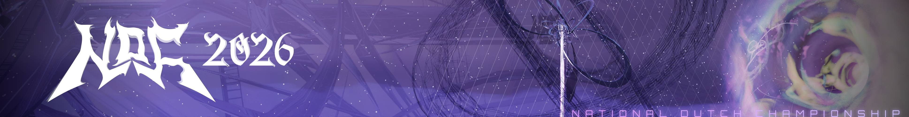

---
tags:
  - NDC2026
  - NDC
---

# National Dutch Championship 2026

The **National Dutch Championship 2026** (***NDC 2026***) is a 1v1, double elimination osu!standard tournament hosted by ::{ flag=NL }:: [Lilily](https://osu.ppy.sh/users/6502403), ::{ flag=NL }:: [Mr HeliX](https://osu.ppy.sh/users/2330619), ::{ flag=NL }:: [vifiiy](https://osu.ppy.sh/users/12876323), ::{ flag=NL }:: [Fubu](https://osu.ppy.sh/users/12719649) and ::{ flag=NL }:: [G e n g a o z o](https://osu.ppy.sh/users/14390731). It is the fifth instalment of the National Dutch Championship.

## Tournament schedule

| Event | Timestamp |
| --: | :-- |
| Registration phase | 2026-08-08/2026-08-16 |
| Qualifiers | 2026-08-20/2026-08-30 |
| Round of 32 | 2026-09-03/2026-09-07 |
| Round of 16 | 2026-09-10/2026-09-14 |
| Quarterfinals | 2026-09-17/2026-09-21 |
| Semifinals | 2026-09-24/2026-09-28 |
| Finals | 2026-10-01/2026-10-05 |
| Grand Finals | 2026-10-08/2026-10-12 |

## Prizes

The tournament offers a prize pool that currently totals €1050 and will be divided as follows:

| Placing | Prize(s) |
| :-: | :-- |
|  | 50% (€525) |
|  | 25% (€262,50) |
|  | 12.5% (€131,25) |
| *4th place* | 7.5% (€78,75) |
| *5th & 6th place* | 2.5% (€26,25) |

Both the tournament and the prize pool are sponsored by the organisation and community members. Donators can choose how much of their donation they want to go to either the prize pool or improving the tournament series:

- ::{ flag=NL }:: [Lilily](https://osu.ppy.sh/users/6502403): €500
- ::{ flag=NL }:: [S O U R](https://osu.ppy.sh/users/4445948): €500
- ::{ flag=NL }:: [vifiiy](https://osu.ppy.sh/users/12876323): €350
- ::{ flag=NL }:: [Aimy](https://osu.ppy.sh/users/20348925): €350
- ::{ flag=NL }:: [Timper](https://osu.ppy.sh/users/11955929): €200
- ::{ flag=XX }:: Anonymous: €50
- ::{ flag=NL }:: [Alphan](https://osu.ppy.sh/users/13298387): €30

<!--  -->

## Organisation

The National Dutch Championship 2026 is run by various community members.

| Position | Member(s) |
| :-- | :-- |
| Organisation | ::{ flag=NL }:: [Lilily](https://osu.ppy.sh/users/6502403), ::{ flag=NL }:: [vifiiy](https://osu.ppy.sh/users/12876323), ::{ flag=NL }:: [Mr HeliX](https://osu.ppy.sh/users/2330619), ::{ flag=NL }:: [G e n g a o z o](https://osu.ppy.sh/users/14390731), ::{ flag=NL }:: [Fubu](https://osu.ppy.sh/users/12719649) |
| Mappool selector | ::{ flag=NL }:: [G e n g a o z o](https://osu.ppy.sh/users/14390731), ::{ flag=CN }:: [FcEazy](https://osu.ppy.sh/users/7825227), ::{ flag=TW }:: [Imokora](https://osu.ppy.sh/users/2472609) |
| Playtester | ::{ flag=NL }:: [Skyrovania](https://osu.ppy.sh/users/4696315), ::{ flag=NL }:: [SecretlyShiro](https://osu.ppy.sh/users/7498203), ::{ flag=NL }:: [Tutel](https://osu.ppy.sh/users/12241010), ::{ flag=NL }:: [Sroj](https://osu.ppy.sh/users/4783389), ::{ flag=FI }:: [mxu](https://osu.ppy.sh/users/18687807), ::{ flag=BE }:: [hexi](https://osu.ppy.sh/users/10760701), ::{ flag=PT }:: [Kuronora](https://osu.ppy.sh/users/2742030), ::{ flag=AT }:: [fedoragoose](https://osu.ppy.sh/users/2323131), ::{ flag=BE }:: [lychee boba](https://osu.ppy.sh/users/7078544), ::{ flag=PL }:: [Eirra](https://osu.ppy.sh/users/3493804), ::{ flag=DE }:: [KSN](https://osu.ppy.sh/users/5442251), ::{ flag=PL }:: [fajga](https://osu.ppy.sh/users/10590281) |
| Referee | ::{ flag=TH }:: [Infinitstart](https://osu.ppy.sh/users/4026124), ::{ flag=NL }:: [wie ben jij](https://osu.ppy.sh/users/16322001), ::{ flag=EE }:: [sodanator](https://osu.ppy.sh/users/28827755), ::{ flag=NL }:: [Aimy](https://osu.ppy.sh/users/20348925), ::{ flag=NL }:: [Timper](https://osu.ppy.sh/users/11955929), ::{ flag=NL }:: [Bart](https://osu.ppy.sh/users/15961009), ::{ flag=NL }:: [astraea](https://osu.ppy.sh/users/17526061), ::{ flag=NL }:: [Fubu](https://osu.ppy.sh/users/12719649), ::{ flag=NL }:: [Mr HeliX](https://osu.ppy.sh/users/2330619) |
| Streamer | ::{ flag=NL }:: [GeKa_Z](https://osu.ppy.sh/users/13233381), ::{ flag=EE }:: [sodanator](https://osu.ppy.sh/users/28827755), ::{ flag=NL }:: [Aimy](https://osu.ppy.sh/users/20348925), ::{ flag=NL }:: [Pisslow](https://osu.ppy.sh/users/26527329), ::{ flag=NL }:: [astraea](https://osu.ppy.sh/users/17526061), ::{ flag=NL }:: [fuwmii](https://osu.ppy.sh/users/30399654), ::{ flag=NL }:: [Alphan](https://osu.ppy.sh/users/13298387), ::{ flag=NL }:: [300mm](https://osu.ppy.sh/users/8958322), ::{ flag=NL }:: [Fubu](https://osu.ppy.sh/users/12719649) |
| Commentator | ::{ flag=NL }:: [fuwmii](https://osu.ppy.sh/users/30399654), ::{ flag=NL }:: [Tutel](https://osu.ppy.sh/users/12241010), ::{ flag=NL }:: [SecretlyShiro](https://osu.ppy.sh/users/7498203), ::{ flag=NL }:: [sofuraabu](https://osu.ppy.sh/users/7639453), ::{ flag=NL }:: [wessel_osu2](https://osu.ppy.sh/users/4382220), ::{ flag=ES }:: [Fieera](https://osu.ppy.sh/users/15254495), ::{ flag=NL }:: [Aimy](https://osu.ppy.sh/users/20348925), ::{ flag=NL }:: [Pisslow](https://osu.ppy.sh/users/26527329), ::{ flag=NL }:: [Bart](https://osu.ppy.sh/users/15961009), ::{ flag=NL }:: [Alphan](https://osu.ppy.sh/users/13298387), ::{ flag=NL }:: [UnveiledGolem](https://osu.ppy.sh/users/14090438), ::{ flag=NL }:: [300mm](https://osu.ppy.sh/users/8958322), ::{ flag=NL }:: [Goose King](https://osu.ppy.sh/users/9387696), ::{ flag=NL }:: [Fubu](https://osu.ppy.sh/users/12719649), ::{ flag=NL }:: [GeKa_Z](https://osu.ppy.sh/users/13233381) |
| Designer | ::{ flag=NL }:: [vifiiy](https://osu.ppy.sh/users/12876323), ::{ flag=US }:: [Boolmaster Flex](https://osu.ppy.sh/users/5394681), ::{ flag=NL }:: [BOSNIATRUCKER13](https://osu.ppy.sh/users/19514891), ::{ flag=US }:: [Spoo](https://osu.ppy.sh/users/11805037) |
| Editor | ::{ flag=NL }:: [Pisslow](https://osu.ppy.sh/users/26527329) |
| Programmer | ::{ flag=NL }:: [Mr HeliX](https://osu.ppy.sh/users/2330619), ::{ flag=CZ }:: [CaptSiro](https://osu.ppy.sh/users/22622303), ::{ flag=NL }:: [vifiiy](https://osu.ppy.sh/users/12876323) |

## Links

- **[Official website](https://tourney.huismetbenen.nl/36)**
- [Forum post](https://osu.ppy.sh/community/forums/topics/2232832?n=1)
- [Livestream A](https://twitch.tv/NDC_osu)
- [Livestream B](https://twitch.tv/NDC_osu2)
- [Livestream C](https://twitch.tv/NDC_osu3)

## Participants

| Seed | Player | Global rank | Country rank |
| :-: | :-- | :-: | :-: |
| 1 | ::{ flag=NL }:: [John ethken](https://osu.ppy.sh/users/641155) | #1375 | #16 |
| 2 | ::{ flag=NL }:: [Aheo](https://osu.ppy.sh/users/14919428) | #515 | #7 |
| 3 | ::{ flag=NL }:: [UC2](https://osu.ppy.sh/users/6989615) | #6843 | #80 |
| 4 | ::{ flag=NL }:: [dracoria](https://osu.ppy.sh/users/20241831) | #2686 | #32 |
| 5 | ::{ flag=NL }:: [luciano](https://osu.ppy.sh/users/11604978) | #114 | #1 |
| 6 | ::{ flag=NL }:: [PotjeNutella](https://osu.ppy.sh/users/10926707) | #9704 | #123 |
| 7 | ::{ flag=NL }:: [Burning John](https://osu.ppy.sh/users/6744123) | #1491 | #18 |
| 8 | ::{ flag=NL }:: [PotJohn Nutella](https://osu.ppy.sh/users/6920104) | #1270 | #15 |
| 9 | ::{ flag=NL }:: [Heavymetal4life](https://osu.ppy.sh/users/21586994) | #10841 | #134 |
| 10 | ::{ flag=NL }:: [Goose King](https://osu.ppy.sh/users/9387696) | #4058 | #52 |
| 11 | ::{ flag=NL }:: [olifanten](https://osu.ppy.sh/users/19453671) | #9575 | #120 |
| 12 | ::{ flag=NL }:: [cozyin](https://osu.ppy.sh/users/12200180) | #5789 | #69 |
| 13 | ::{ flag=NL }:: [Alphan](https://osu.ppy.sh/users/13298387) | #6463 | #77 |
| 14 | ::{ flag=NL }:: [Weeder](https://osu.ppy.sh/users/21574224) | #697 | #9 |
| 15 | ::{ flag=NL }:: [Rozeolifant13](https://osu.ppy.sh/users/16335215) | #3750 | #50 |
| 16 | ::{ flag=NL }:: [wessel_osu2](https://osu.ppy.sh/users/4382220) | #3340 | #41 |
| 17 | ::{ flag=NL }:: [wooz](https://osu.ppy.sh/users/6888206) | #5844 | #70 |
| 18 | ::{ flag=NL }:: [Pisslow](https://osu.ppy.sh/users/26527329) | #4493 | #58 |
| 19 | ::{ flag=NL }:: [Eriror](https://osu.ppy.sh/users/45444) | #11063 | #138 |
| 20 | ::{ flag=NL }:: [-Wyren-](https://osu.ppy.sh/users/12535083) | #14445 | #162 |
| 21 | ::{ flag=NL }:: [walcart](https://osu.ppy.sh/users/24190290) | #2844 | #33 |
| 22 | ::{ flag=NL }:: [ghous](https://osu.ppy.sh/users/28225519) | #7745 | #94 |
| 23 | ::{ flag=NL }:: [GeKa_Z](https://osu.ppy.sh/users/13233381) | #9006 | #110 |
| 24 | ::{ flag=NL }:: [Wittepoes](https://osu.ppy.sh/users/12984931) | #5550 | #67 |
| 25 | ::{ flag=NL }:: [NeonCircles](https://osu.ppy.sh/users/13702202) | #9928 | #126 |
| 26 | ::{ flag=NL }:: [Kyqn](https://osu.ppy.sh/users/15202512) | #2979 | #35 |
| 27 | ::{ flag=NL }:: [TheCoolJfp](https://osu.ppy.sh/users/7041796) | #7343 | #88 |
| 28 | ::{ flag=NL }:: [Joeri](https://osu.ppy.sh/users/12839455) | #84288 | #900 |
| 29 | ::{ flag=NL }:: [Cootiezi](https://osu.ppy.sh/users/9105399) | #15316 | #178 |
| 30 | ::{ flag=NL }:: [Senyagi](https://osu.ppy.sh/users/13032176) | #14846 | #168 |
| 31 | ::{ flag=NL }:: [Synchrostar](https://osu.ppy.sh/users/419705) | #18482 | #203 |
| 32 | ::{ flag=NL }:: [fuwmii](https://osu.ppy.sh/users/30399654) | #21563 | #232 |
| 33 | ::{ flag=NL }:: [Damnjelly](https://osu.ppy.sh/users/1666355) | #5925 | #71 |
| 34 | ::{ flag=NL }:: [wessel_osu1](https://osu.ppy.sh/users/6577301) | #14824 | #168 |
| 35 | ::{ flag=NL }:: [KawaiiSniperBoy](https://osu.ppy.sh/users/20524617) | #13736 | #158 |
| 36 | ::{ flag=NL }:: [Natan](https://osu.ppy.sh/users/15457513) | #27863 | #292 |
| 37 | ::{ flag=NL }:: [Bittshrooms](https://osu.ppy.sh/users/9250996) | #42831 | #461 |
| 38 | ::{ flag=NL }:: [eclipseeeeee_e](https://osu.ppy.sh/users/38970099) | #349759 | #3261 |

## Mappools

### Quarterfinals

**[Download the mappack here!](https://tourney.huismetbenen.nl/36/mappools/qf)**

- No Mod
  1. [Pierce The Veil - The First Punch (quantumvortex) [Extreme]](https://osu.ppy.sh/beatmapsets/2513202#osu/5540215)
  2. [Cattle Decapitation - Your Disposal (nebuwua) [Dcs' Extra]](https://osu.ppy.sh/beatmapsets/1809193#osu/3903620)
  3. [Abaraya - Kanashibari Ni Attara (PEALEERD_TAK) [tak's x]](https://osu.ppy.sh/beatmapsets/2489418#osu/5467651)
  4. [onumi - ZERO-SEVEN (Cappu) [SAVE SATOKO]](https://osu.ppy.sh/beatmapsets/2206892#osu/4673006)
  5. [Spongebob Squarewave - Free L-Town (Sped Up Ver.) (Silverboxer) [Peanut Butter Jelly Time]](https://osu.ppy.sh/beatmapsets/2400868#osu/5205913)
  6. [Aethoro - Paradox Palette (Mir) [Painted Prism]](https://osu.ppy.sh/beatmapsets/2464948#osu/5395577)
- Hidden
  1. [Sangatsu no Phantasia - Seishun nante Iranaiwa (Smug Nanachi) [Adolescence]](https://osu.ppy.sh/beatmapsets/1146237#osu/2393405)
  2. [Mutsuhiko Izumi - Tengoku to Jigoku (AJT) [ignore's Another]](https://osu.ppy.sh/beatmapsets/2476325#osu/5429456)
  3. [vifiiy - ASTRiX* (324c) [\*\*\*\*\*]](https://osu.ppy.sh/beatmapsets/2620764#osu/5882295)
- Hard Rock
  1. [USAO - Night sky (Extended Mix) (Mir) [Constellations]](https://osu.ppy.sh/beatmapsets/2527984#osu/5585451)
  2. [a_hisaxChicking - The Navigator's Hope (Rohit6) [Endurance of the Seafarer]](https://osu.ppy.sh/beatmapsets/439225#osu/945304)
  3. [JYOCHO - Taiyou to Kurashite Kita (dsco) [Bloom]](https://osu.ppy.sh/beatmapsets/600881#osu/1269564)
- Double Time
  1. [Kalafina - sprinter (synderes) [nihility]](https://osu.ppy.sh/beatmapsets/1126545#osu/2353845)
  2. [lapix - Toumei Shin'en feat. nayuta (Tolyan) [Collab Insane]](https://osu.ppy.sh/beatmapsets/2142708#osu/4511819)
  3. [TatshMusicCircle - Raikou -3rd Desire- (Kite) [JJburst's Insane]](https://osu.ppy.sh/beatmapsets/143316#osu/2952473)
  4. [Maksim Mrvica - Croatian Rhapsody (haha5957) [Vivace]](https://osu.ppy.sh/beatmapsets/54016#osu/170608)
- Tiebreaker
  1. [Pa's Lam System - Looooooop (pocket-) [relentlesssssss]](https://osu.ppy.sh/beatmapsets/1623348#osu/3314510)

### Round of 16

**[Download the mappack here!](https://tourney.huismetbenen.nl/36/mappools/ro16)**

- No Mod
  1. [Falcom Sound Team jdk - Infinity Rage (Mocaotic) [lfj's Stage 6]](https://osu.ppy.sh/beatmapsets/2549929#osu/5655366)
  2. [onoken - P8107 (Camocratic) [DEFCON 1]](https://osu.ppy.sh/beatmapsets/1344083#osu/2783766)
  3. [Oishi Masayoshi - Gift (Flask) [x)]](https://osu.ppy.sh/beatmapsets/2494554#osu/5482494)
  4. [Gardens/xia - Reverie (AstralXynsm) [Fragments]](https://osu.ppy.sh/beatmapsets/2478803#osu/5437165)
  5. [King Gizzard & The Lizard Wizard - Wah Wah (Wispy) [squirrelp's Infatuation]](https://osu.ppy.sh/beatmapsets/1899486#osu/3955178)
- Hidden
  1. [Thank You Scientist - Wrinkle (Heilia) [Brown Sugar Cheese Foam Cookie Milk Tea]](https://osu.ppy.sh/beatmapsets/1219841#osu/2537728)
  2. [Maison book girl - bath room (newton-) [deppy's insane]](https://osu.ppy.sh/beatmapsets/1790018#osu/3686559)
- Hard Rock
  1. [M2U - White Rose (NEOBLAZER25) [Extra]](https://osu.ppy.sh/beatmapsets/2345804#osu/5071423)
  2. [ESTi - HELIX (Edit ver.) (Catzzye) [EX+]](https://osu.ppy.sh/beatmapsets/730814#osu/1804040)
- Double Time
  1. [ZennourenP - When They Cry -Rosin Mix- (Mattay) [Meltdown]](https://osu.ppy.sh/beatmapsets/2307393#osu/4934870)
  2. [senya - Cinderella Avatar (Satellite) [Mo's Lunatic]](https://osu.ppy.sh/beatmapsets/2324476#osu/4982126)
  3. [Camellia - crystallized (Smoothie World) [wa's Insane]](https://osu.ppy.sh/beatmapsets/399151#osu/965494)
- Tiebreaker
  1. [COALTAR OF THE DEEPERS - H/S/K/S (App) [I/D/G/A/F]](https://osu.ppy.sh/beatmapsets/2107071#osu/4421686)

### Round of 32

**[Download the mappack here!](https://tourney.huismetbenen.nl/36/mappools/ro32)**

- No Mod
  1. [Static-X - The Only (yousick) [FCL's Give me the only thing]](https://osu.ppy.sh/beatmapsets/2076322#osu/4364526)
  2. [Porter Robinson - Get Your Wish (Sewerslvt Remix) (Daycore) [floating]](https://osu.ppy.sh/beatmapsets/2156281#osu/4571943)
  3. [POP ART TOWN - i (flake) [FLOPH'S EXTREME]](https://osu.ppy.sh/beatmapsets/1635846#osu/3338638)
  4. [N2 - NULL APOPHENIA (iFinixe) [conQUEST failed kasi di ko siya nahanap]](https://osu.ppy.sh/beatmapsets/1995015#osu/4146045)
  5. [tarolabo - eth ken (DeviousPanda) [ktgster's expert]](https://osu.ppy.sh/beatmapsets/1765453#osu/3613813)
- Hidden
  1. [mizuniukikusa - mellowsleep (MonsieurSebas) [collab expert]](https://osu.ppy.sh/beatmapsets/2043927#osu/4265839)
  2. [Rina Sawayama - We Out Here (Luminiscental) [Premeditation]](https://osu.ppy.sh/beatmapsets/1906357#osu/3931035)
- Hard Rock
  1. [USAO - Chrono Diver -PENDULUMs- (USAO remix) (Skystar) [Tempus]](https://osu.ppy.sh/beatmapsets/414448#osu/925161)
  2. [lapix - Voyager (KKipalt) [Another (OWC)]](https://osu.ppy.sh/beatmapsets/1610221#osu/3287751)
- Double Time
  1. [XX:me - Torikago (rollpan) [Insane]](https://osu.ppy.sh/beatmapsets/1817184#osu/3728099)
  2. [underscores - Music (blixys) [quantumvortex's Insane]](https://osu.ppy.sh/beatmapsets/2542651#osu/5647257)
  3. [Fox Stevenson - Throwdown (Kyshiro) [Asphyxia's Insane]](https://osu.ppy.sh/beatmapsets/242574#osu/560241)
- Tiebreaker
  1. [MitiS - Living Color (Dezpot Remix) (ProfessionalBox) [Vividness]](https://osu.ppy.sh/beatmapsets/533518#osu/1130281)

### Qualifiers

**[Download the mappack here!](https://tourney.huismetbenen.nl/36/mappools/ql)**

- No Mod
  1. [Hayakore Tatsumi - The Last Blue Sky (Mattay) [Beautiful Sky]](https://osu.ppy.sh/beatmapsets/2244893#osu/4772470)
  2. [DJ SHARPNEL - BLUE ARMY (G e n g a o z o) [AMOR (NDC edit)]](https://osu.ppy.sh/beatmapsets/2605156#osu/5828594)
  3. [yama & Tatsuya Kitani - As I longed for (Rtyzen) [Cruisin']](https://osu.ppy.sh/beatmapsets/2206985#osu/4673188)
  4. [polysha - More than Words (Azrulk) [Synchronized Iridescent]](https://osu.ppy.sh/beatmapsets/2290532#osu/4888924)
  5. [sasakure.UK - A.D.3039 no Hatena (BATBALL) [Progress]](https://osu.ppy.sh/beatmapsets/2117464#osu/4598262)
- Hidden
  1. [Kawada Mami - Going back to square one (cRyo\[iceeicee\]) [Insane]](https://osu.ppy.sh/beatmapsets/384975#osu/841064)
  2. [Sylosis - Empty Prophets (Herazu) [Isolation]](https://osu.ppy.sh/beatmapsets/2182697#osu/4612002)
- Hard Rock
  1. [otetsu feat. Megurine Luka - Minamo no Sakura, Yume wa Sakayume (ponbot) [Ephemeral]](https://osu.ppy.sh/beatmapsets/2494219#osu/5481382)
  2. [BEMANI Sound Team "Sota Fujimori" - OZONE (milr\_) [Expert]](https://osu.ppy.sh/beatmapsets/2023910#osu/4215734)
- Double Time
  1. [Tatsh feat. Sariyajin - FOUR SEASONS OF LONELINESS (ouranhshc) [gow's Lunatic]](https://osu.ppy.sh/beatmapsets/28342#osu/112158)
  2. [senya - Sakuretsu Irony (Satellite) [Satellite]](https://osu.ppy.sh/beatmapsets/2271602#osu/4838687)
  3. [Sheena Ringo - Yami ni Furu Ame (Beren) [ScubDomino's Insane]](https://osu.ppy.sh/beatmapsets/1649315#osu/3379930)

## Match results

### Round of 16

Monday, 14 September 2026:

| Player 1 |  |  | Player 2 | Match link |
| --: | :-: | :-: | :-- | :-- |
| Joeri ::{ flag=NL }:: | 1 | **5** | ::{ flag=NL }:: **walcart** | [#1](https://osu.ppy.sh/community/matches/121858923) |
| Kyqn ::{ flag=NL }:: | 1 | **5** | ::{ flag=NL }:: **GeKa_Z** | [#1](https://osu.ppy.sh/community/matches/121858634) |

Sunday, 13 September 2026:

| Player 1 |  |  | Player 2 | Match link |
| --: | :-: | :-: | :-- | :-- |
| **luciano** ::{ flag=NL }:: | **5** | 2 | ::{ flag=NL }:: cozyin | [#1](https://osu.ppy.sh/community/matches/121854743) |
| **dracoria** ::{ flag=NL }:: | **5** | 0 | ::{ flag=NL }:: Alphan | [#1](https://osu.ppy.sh/community/matches/121852998) |
| **Burning John** ::{ flag=NL }:: | **5** | 1 | ::{ flag=NL }:: Goose King | [#1](https://osu.ppy.sh/community/matches/121852734) |
| PotJohn Nutella ::{ flag=NL }:: | 3 | **5** | ::{ flag=NL }:: **Heavymetal4life** | [#1](https://osu.ppy.sh/community/matches/121852694) |
| TheCoolJfp ::{ flag=NL }:: | 0 | **5** | ::{ flag=NL }:: **ghous** | [#1](https://osu.ppy.sh/community/matches/121852723) |
| NeonCircles ::{ flag=NL }:: | 1 | **5** | ::{ flag=NL }:: **Wittepoes** | [#1](https://osu.ppy.sh/community/matches/121852684) |
| **John ethken** ::{ flag=NL }:: | **0** | -1 | ::{ flag=NL }:: wessel_osu2 | *win by default* |

Saturday, 12 September 2026:

| Player 1 |  |  | Player 2 | Match link |
| --: | :-: | :-: | :-- | :-- |
| fuwmii ::{ flag=NL }:: | 1 | **5** | ::{ flag=NL }:: **wooz** | [#1](https://osu.ppy.sh/community/matches/121848263) |
| **PotjeNutella** ::{ flag=NL }:: | **5** | 2 | ::{ flag=NL }:: olifanten | [#1](https://osu.ppy.sh/community/matches/121847902) |
| Senyagi ::{ flag=NL }:: | -1 | **0** | ::{ flag=NL }:: **Eriror** | *win by default* |
| **UC2** ::{ flag=NL }:: | **5** | 1 | ::{ flag=NL }:: Weeder | [#1](https://osu.ppy.sh/community/matches/121847519) |

Friday, 11 September 2026:

| Player 1 |  |  | Player 2 | Match link |
| --: | :-: | :-: | :-- | :-- |
| Synchrostar ::{ flag=NL }:: | 2 | **5** | ::{ flag=NL }:: **Rozeolifant13** | [#1](https://osu.ppy.sh/community/matches/121841477) |
| **Aheo** ::{ flag=NL }:: | **5** | 0 | ::{ flag=NL }:: Pisslow | [#1](https://osu.ppy.sh/community/matches/121841140) |
| Cootiezi ::{ flag=NL }:: | 3 | **5** | ::{ flag=NL }:: **-Wyren-** | [#1](https://osu.ppy.sh/community/matches/121840464) |

### Round of 32

Monday, 7 September 2026:

| Player 1 |  |  | Player 2 | Match link |
| --: | :-: | :-: | :-- | :-- |
| **luciano** ::{ flag=NL }:: | **5** | 0 | ::{ flag=NL }:: Joeri | [#1](https://osu.ppy.sh/community/matches/121821403) |

Sunday, 6 September 2026:

| Player 1 |  |  | Player 2 | Match link |
| --: | :-: | :-: | :-- | :-- |
| **olifanten** ::{ flag=NL }:: | **5** | 2 | ::{ flag=NL }:: ghous | [#1](https://osu.ppy.sh/community/matches/121817181) |
| **PotjeNutella** ::{ flag=NL }:: | **5** | 0 | ::{ flag=NL }:: TheCoolJfp | [#1](https://osu.ppy.sh/community/matches/121816802) |
| **Weeder** ::{ flag=NL }:: | **5** | 2 | ::{ flag=NL }:: Eriror | [#1](https://osu.ppy.sh/community/matches/121816475) |
| **cozyin** ::{ flag=NL }:: | **5** | 1 | ::{ flag=NL }:: walcart | [#1](https://osu.ppy.sh/community/matches/121816373) |
| **UC2** ::{ flag=NL }:: | **5** | 0 | ::{ flag=NL }:: Senyagi | [#1](https://osu.ppy.sh/community/matches/121815636) |
| Rozeolifant13 ::{ flag=NL }:: | 2 | **5** | ::{ flag=NL }:: **Pisslow** | [#1](https://osu.ppy.sh/community/matches/121815127) |
| **Heavymetal4life** ::{ flag=NL }:: | **5** | 0 | ::{ flag=NL }:: Wittepoes | [#1](https://osu.ppy.sh/community/matches/121814681) |
| **wessel_osu2** ::{ flag=NL }:: | **5** | 3 | ::{ flag=NL }:: wooz | [#1](https://osu.ppy.sh/community/matches/121814350) |

Saturday, 5 September 2026:

| Player 1 |  |  | Player 2 | Match link |
| --: | :-: | :-: | :-- | :-- |
| **Goose King** ::{ flag=NL }:: | **5** | 0 | ::{ flag=NL }:: GeKa_Z | [#1](https://osu.ppy.sh/community/matches/121811017) |
| **Burning John** ::{ flag=NL }:: | **5** | 0 | ::{ flag=NL }:: Kyqn | [#1](https://osu.ppy.sh/community/matches/121810692) |
| **Alphan** ::{ flag=NL }:: | **5** | 1 | ::{ flag=NL }:: -Wyren- | [#1](https://osu.ppy.sh/community/matches/121810355) |
| **dracoria** ::{ flag=NL }:: | **5** | 0 | ::{ flag=NL }:: Cootiezi | [#1](https://osu.ppy.sh/community/matches/121809994) |

Friday, 4 September 2026:

| Player 1 |  |  | Player 2 | Match link |
| --: | :-: | :-: | :-- | :-- |
| **Aheo** ::{ flag=NL }:: | **5** | 1 | ::{ flag=NL }:: Synchrostar | [#1](https://osu.ppy.sh/community/matches/121805062) |

Thursday, 3 September 2026:

| Player 1 |  |  | Player 2 | Match link |
| --: | :-: | :-: | :-- | :-- |
| **John ethken** ::{ flag=NL }:: | **5** | 0 | ::{ flag=NL }:: fuwmii | [#1](https://osu.ppy.sh/community/matches/121799799) |
| **PotJohn Nutella** ::{ flag=NL }:: | **5** | 0 | ::{ flag=NL }:: NeonCircles | [#1](https://osu.ppy.sh/community/matches/121798960) |

## Ruleset

### Registrations

1. NDC2026 is a Head-to-Head 1v1 tournament open to all players with the Dutch flag on their osu! profile.
2. A Qualifier round will determine seeding for a double-elimination bracket starting at Round of 32.
3. Staff members may not participate as players, with the exception of streamers, commentators, and designers.
4. Players must be members of the Discord server while participating.
5. Players who do not pass the screening phase from the osu! tournament committee are not allowed to participate.

### Qualifiers stage

1. Qualifier lobbies will be managed by a bot and monitored by a human referee who can intervene when necessary.
2. Lobbies can be started from 10:00-23:59 on Thursday until Sunday.
3. Every map in the qualifier pool will be played once, map order can be decided by the player.
4. Each map will award the player with points using the formula: `Points = Player Score / Median Score`.
5. The top 32 players by total points will advance to the Round of 32.

### Match procedure

1. The referee will initiate rolls, where both players will `!roll` once. The highest roll chooses first or second ban. Whoever bans first also picks first.
2. Bans and picks will alternate between players, with each player having 90 seconds for their pick/ban.
   - If the timer runs out, the other player gets to choose that pick/ban. Keep in mind this does not change the pick/ban order. For example: Player 2's timer runs out, so Player 1 gets their pick instead. After this, Player 1 gets to pick again according to the original pick/ban order.
3. Each player can ban at most 2 maps of the same mod.
4. Each player is allowed a 3-minute break per match.
   - In case of a tiebreaker, players are allowed an additional 2-minute break.
5. In case of a bracket reset, the second match allows for another set of warmups if preferred by the players.
   - Timeout rules are also reset for this match, allowing each player another 3-minute break, and an additional 2-minute break in case of a tiebreaker.

### Mappools

| Round | Beatmaps | Bans | Best of |
| :-- | :-- | :-: | :-: |
| Qualifiers | 5 NM, 2 HD, 2 HR, 3 DT | - | - |
| Round of 32 | 5 NM, 2 HD, 2 HR, 3 DT, 1 TB | 1 | 9 |
| Round of 16 | 5 NM, 2 HD, 2 HR, 3 DT, 1 TB | 1 | 9 |
| Quarterfinals | 6 NM, 3 HD, 3 HR, 4 DT, 1 TB | 2 | 11 |
| Semifinals | 6 NM, 3 HD, 3 HR, 4 DT, 1 TB | 2 | 11 |
| Finals | 7 NM, 4 HD, 4 HR, 4 DT, 1 TB | 3 | 13 |
| Grand Finals | 7 NM, 4 HD, 4 HR, 4 DT, 1 TB | 3 | 13 |
