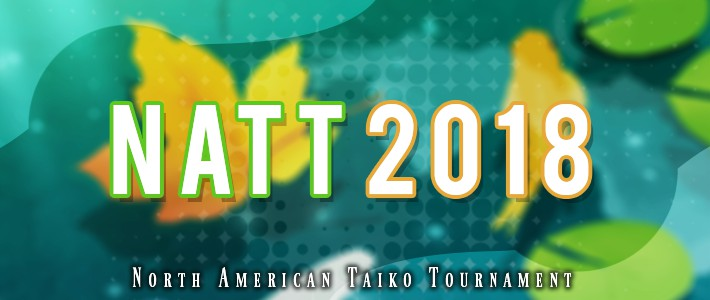

---
tags:
  - NATT
  - NATT2018
---

# North American Taiko Tournament 2018

The **North American Taiko Tournament 2018** (***NATT 2018***) was a double-elimination 1v1 osu!taiko tournament hosted by ::{ flag=US }:: [Backfire](https://osu.ppy.sh/users/263110), ::{ flag=US }:: [Garpo](https://osu.ppy.sh/users/4097035) and ::{ flag=US }:: [incandescence](https://osu.ppy.sh/users/6256027). The tournament was restricted to players within the North American countries only. It was the third instalment of the North & South American Taiko Tournament.

## Tournament schedule

| Event | Timestamp |
| --: | :-- |
| Registration phase | 2018-07-02/2018-07-21 |
| Group stage | 2018-07-28/2018-07-29 |
| Round of 16 | 2018-08-04/2018-08-05 |
| Quarterfinals | 2018-08-11/2018-08-12 |
| Semifinals | 2018-08-18/2018-08-19 |
| Finals | 2018-08-25/2018-08-26 |
| Grand Finals | 2018-09-01 |

## Prizes

| Placing | Prize(s) |
| :-: | :-- |
|  | Unique profile badge |
|  | 4 months of osu!supporter (or US$12) |
|  | 1 month of osu!supporter (or US$5) |

## Organisation

The North American Taiko Tournament 2018 was run by various community members.

| Position | Member(s) |
| :-- | :-- |
| Organizer | ::{ flag=US }:: [Backfire](https://osu.ppy.sh/users/263110), ::{ flag=US }:: [Garpo](https://osu.ppy.sh/users/4097035), ::{ flag=US }:: [incandescence](https://osu.ppy.sh/users/6256027) |
| Mappool selector | ::{ flag=US }:: [Backfire](https://osu.ppy.sh/users/263110), ::{ flag=US }:: [incandescence](https://osu.ppy.sh/users/6256027), ::{ flag=DE }:: [Zetera](https://osu.ppy.sh/users/587737) |
| Referee | ::{ flag=US }:: [Backfire](https://osu.ppy.sh/users/263110), ::{ flag=US }:: [Dargin](https://osu.ppy.sh/users/7086439), ::{ flag=US }:: [Das](https://osu.ppy.sh/users/3165416), ::{ flag=US }:: [Garpo](https://osu.ppy.sh/users/4097035), ::{ flag=US }:: [incandescence](https://osu.ppy.sh/users/6256027), ::{ flag=CA }:: [janitoreihil](https://osu.ppy.sh/users/3307897), ::{ flag=DE }:: [Zetera](https://osu.ppy.sh/users/587737) |
| Commentator | ::{ flag=US }:: [Dargin](https://osu.ppy.sh/users/7086439), ::{ flag=US }:: [Das](https://osu.ppy.sh/users/3165416), ::{ flag=US }:: [incandescence](https://osu.ppy.sh/users/6256027), ::{ flag=CA }:: [janitoreihil](https://osu.ppy.sh/users/3307897) |
| Designer | ::{ flag=FI }:: [Micro](https://osu.ppy.sh/users/4801080) |
| Statistician | ::{ flag=US }:: [Garpo](https://osu.ppy.sh/users/4097035) |
| Wiki editor | ::{ flag=ID }:: [fajar13k](https://osu.ppy.sh/users/7100002) |

## Links

- [Discussion thread](https://osu.ppy.sh/community/forums/topics/769107)
- [Livestream](https://www.twitch.tv/osutaikolive)
- [Challonge bracket](https://challonge.com/NATT2018)
- **[Statistics sheet](https://docs.google.com/spreadsheets/d/e/2PACX-1vSY7o2krAotf6bOo8pImth_2NBNtjjsKxuKFeW6HxTyyBsk87BEz0V8VZ6O9_bQxh8MnaPTdOrP8T5w/pubhtml)**

## Participants

| Seed | Members |
| :-- | :-- |
| Top | ::{ flag=CA }:: [vladyushko](https://osu.ppy.sh/users/4908773), ::{ flag=CA }:: [janitoreihil](https://osu.ppy.sh/users/3307897), ::{ flag=US }:: [Das](https://osu.ppy.sh/users/3165416), ::{ flag=US }:: [Loopy542](https://osu.ppy.sh/users/5468461), ::{ flag=US }:: [yea](https://osu.ppy.sh/users/6874332), ::{ flag=US }:: [Shyguy](https://osu.ppy.sh/users/178038), ::{ flag=US }:: [Catgirl](https://osu.ppy.sh/users/2771995), ::{ flag=US }:: [\_knots](https://osu.ppy.sh/users/4407678) |
| Middle | ::{ flag=MX }:: [Mennock](https://osu.ppy.sh/users/854580), ::{ flag=US }:: [Tem](https://osu.ppy.sh/users/5393042), ::{ flag=US }:: [JarHed](https://osu.ppy.sh/users/7488794), ::{ flag=US }:: [Alchyr](https://osu.ppy.sh/users/4993032), ::{ flag=US }:: worst player, ::{ flag=US }:: [closed](https://osu.ppy.sh/users/5116922), ::{ flag=US }:: [cheese salad](https://osu.ppy.sh/users/6349821), ::{ flag=MX }:: [Ammy](https://osu.ppy.sh/users/4183406) |
| Low | ::{ flag=CA }:: [ayyEve](https://osu.ppy.sh/users/5013564), ::{ flag=US }:: [jyake\_ou](https://osu.ppy.sh/users/9099822), ::{ flag=CA }:: [Azer](https://osu.ppy.sh/users/2155578), ::{ flag=US }:: [Obama Taichou](https://osu.ppy.sh/users/3220847), ::{ flag=US }:: [Brames](https://osu.ppy.sh/users/6417190), ::{ flag=US }:: [Voltaeyx](https://osu.ppy.sh/users/2715118), ::{ flag=US }:: [Karoshi\_tv](https://osu.ppy.sh/users/9879536), ::{ flag=MX }:: [GodEater7x](https://osu.ppy.sh/users/6911992) |
| Unseeded | ::{ flag=US }:: [Kotu776](https://osu.ppy.sh/users/8494571), ::{ flag=CA }:: [rubies87](https://osu.ppy.sh/users/4949934), ::{ flag=CA }:: [DuckyDoom](https://osu.ppy.sh/users/3153062), ::{ flag=US }:: [booty](https://osu.ppy.sh/users/4605217), ::{ flag=US }:: [ITotallyGetThat](https://osu.ppy.sh/users/8770622), ::{ flag=US }:: [CaptainEChan](https://osu.ppy.sh/users/9536977), ::{ flag=US }:: [-Treble](https://osu.ppy.sh/users/5750909), ::{ flag=US }:: [dragonworm](https://osu.ppy.sh/users/11464752) |

## Groups

| Group | Top seed | Middle seed | Low seed | Unseeded |
| :-: | :-- | :-- | :-- | :-- |
| **A** | ::{ flag=CA }:: [vladyushko](https://osu.ppy.sh/users/4908773) | ::{ flag=US }:: [JarHed](https://osu.ppy.sh/users/7488794) | ::{ flag=CA }:: [ayyEve](https://osu.ppy.sh/users/5013564) | ::{ flag=US }:: [ITotallyGetThat](https://osu.ppy.sh/users/8770622) |
| **B** | ::{ flag=US }:: [yea](https://osu.ppy.sh/users/6874332) | ::{ flag=MX }:: [Mennock](https://osu.ppy.sh/users/854580) | ::{ flag=US }:: [Obama Taichou](https://osu.ppy.sh/users/3220847) | ::{ flag=US }:: [dragonworm](https://osu.ppy.sh/users/11464752) |
| **C** | ::{ flag=US }:: [\_knots](https://osu.ppy.sh/users/4407678) | ::{ flag=MX }:: [Ammy](https://osu.ppy.sh/users/4183406) | ::{ flag=US }:: [jyake\_ou](https://osu.ppy.sh/users/9099822) | ::{ flag=CA }:: [rubies87](https://osu.ppy.sh/users/4949934) |
| **D** | ::{ flag=US }:: [Catgirl](https://osu.ppy.sh/users/2771995) | ::{ flag=US }:: worst player | ::{ flag=US }:: [Brames](https://osu.ppy.sh/users/6417190) | ::{ flag=CA }:: [DuckyDoom](https://osu.ppy.sh/users/3153062) |
| **E** | ::{ flag=US }:: [Shyguy](https://osu.ppy.sh/users/178038) | ::{ flag=US }:: [cheese salad](https://osu.ppy.sh/users/6349821) | ::{ flag=US }:: [Karoshi\_tv](https://osu.ppy.sh/users/9879536) | ::{ flag=US }:: [-Treble](https://osu.ppy.sh/users/5750909) |
| **F** | ::{ flag=CA }:: [janitoreihil](https://osu.ppy.sh/users/3307897) | ::{ flag=US }:: [Tem](https://osu.ppy.sh/users/5393042) | ::{ flag=CA }:: [Azer](https://osu.ppy.sh/users/2155578) | ::{ flag=US }:: [Kotu776](https://osu.ppy.sh/users/8494571) |
| **G** | ::{ flag=US }:: [Loopy542](https://osu.ppy.sh/users/5468461) | ::{ flag=US }:: [Alchyr](https://osu.ppy.sh/users/4993032) | ::{ flag=US }:: [Voltaeyx](https://osu.ppy.sh/users/2715118) | ::{ flag=US }:: [CaptainEChan](https://osu.ppy.sh/users/9536977) |
| **H** | ::{ flag=US }:: [Das](https://osu.ppy.sh/users/3165416) | ::{ flag=US }:: [closed](https://osu.ppy.sh/users/5116922) | ::{ flag=MX }:: [GodEater7x](https://osu.ppy.sh/users/6911992) | ::{ flag=US }:: [booty](https://osu.ppy.sh/users/4605217) |

## Podium

This competition has come to an end and resulted in the following podium:

| Placing | Player |
| :-: | :-- |
|  | ::{ flag=CA }:: [janitoreihil](https://osu.ppy.sh/users/3307897) |
|  | ::{ flag=CA }:: [vladyushko](https://osu.ppy.sh/users/4908773) |
|  | ::{ flag=US }:: [Loopy542](https://osu.ppy.sh/users/5468461) |

## Mappools

### Grand Finals

**[Download the mappack here! (71 MB)](https://www.dropbox.com/s/lqgbst12fv5y2u7/NATT%202018%20GF.rar)**

- NoMod
  1. [The Flashbulb - Chik Habit (incandescence) \[Raidcore\]](https://osu.ppy.sh/beatmapsets/827049#taiko/1733135)
  2. [TangJuan Vs Black Box - Xetta (Nishizumi) \[Oni\]](https://osu.ppy.sh/beatmapsets/811482/%23taiko/1702251)
  3. [Igorrr - Cheval (yopohapan) \[Gallop\]](https://osu.ppy.sh/beatmapsets/656130#taiko/1390258)
  4. [Xenon - ?63HiiraossHuikgoeH53? (-Kazu-) \[?InnerrOnI? (NATT Ver.)\]](https://puu.sh/BkVVT/1c1a03a78c.osz)
  5. [3034 - NS18 (Inner Stamina+) \[\_Rise\]](https://osu.ppy.sh/beatmapsets/508943#taiko/1082389)
- Hidden
  1. [PHQUASE - Plain Asia -PHQ remix- (TKS) \[Lunatic Asia\]](https://osu.ppy.sh/beatmapsets/737935#taiko/1557323)
  2. [MuryokuP - Frozen World (c36098651) \[Firce777's North Pole\]](https://osu.ppy.sh/beatmapsets/194955/#taiko/465192)
- HardRock
  1. [OISHII - ONIGIRI FREEWAY (cdhsausageboy) \[tasuke's INNER ONI\]](https://osu.ppy.sh/beatmapsets/662519#taiko/1406423)
  2. [Helblinde - Oath of Kings (Backfire) \[Taikocalypse\]](https://osu.ppy.sh/beatmapsets/762676#taiko/1603470)
- DoubleTime
  1. [Linkin Park - Breaking the Habit (Hanjamon) \[Inner Oni\]](https://osu.ppy.sh/beatmapsets/237069/#taiko/548872)
  2. [Equilibrium - Wirtshaus Gaudi (Zetera) \[Inner Kneipe\]](https://osu.ppy.sh/beatmapsets/549450#taiko/1163499)
- FreeMod
  1. [Caladborg - invoker (-Kazu-) \[Ura Oni\]](https://osu.ppy.sh/beatmapsets/351126#taiko/1495790)
  2. [Uesaka Sumire - POP TEAM EPIC(YUKIYANAGI's Dubstep Edit) (KitajimaYN) \[Ahhhhhhh!!!!!!!\]](https://osu.ppy.sh/beatmapsets/751580#taiko/1583035)
  3. [Sick Puppy - Nigro (Xay) \[Xay's Taiko\]](https://osu.ppy.sh/beatmapsets/430223#taiko/928094)
- Tiebreaker
  1. **[Camellia - Exit This Earth's Atomosphere (Camellia's "PLANETARY//200STEP" Remix) (Alchyr) \[Pressure\]](https://osu.ppy.sh/beatmapsets/832997#taiko/1744951)**

### Finals

- NoMod
  1. [cosMo@BousouP - UltraHardAttacks of OddMusiK(cosmobsp-style) (tasuke912) \[Oni\]](https://osu.ppy.sh/beatmapsets/304074#taiko/681296)
  2. [katagiri - cafe de kemomimi loli (Soukun1shiki) \[Cracking Journey\]](https://osu.ppy.sh/beatmapsets/792135#taiko/1661574)
  3. [uma vs. Morimori Atsushi - Re : End of a Dream (Ryui) \[Ryui's Taiko\]](https://osu.ppy.sh/beatmapsets/532070#taiko/1127436)
  4. [xi - Mirage Garden (Mono Kuma) \[Mono Taiko\]](https://osu.ppy.sh/beatmapsets/89851#taiko/244082)
  5. [Fleshgod Apocalypse - The Fool (LZD) \[Stamina Thief\]](https://osu.ppy.sh/beatmapsets/442451#taiko/965433)
- Hidden
  1. Reol - YoiYoi Kokon (steven1) \[Phylum (NATT ver.)\]
  2. [Igorrr - Cicadidae (nyouso) \[Nyouso's Taiko\]](https://osu.ppy.sh/beatmapsets/182507/#taiko/437655)
- HardRock
  1. [weyheyhey !! - Loving The Girl Who Hates Me (Jaye) \[Bella\]](https://osu.ppy.sh/beatmapsets/438651#taiko/1164383)
  2. [goreshit - beautiful loli thing (Raphalge) \[Beautiful Taiko Thing\]](https://osu.ppy.sh/beatmapsets/582863#taiko/1233483)
- DoubleTime
  1. [capitaro - Koigahara no Kassen (Zero__wind) \[Nardo's Inner Oni\]](https://osu.ppy.sh/beatmapsets/466053#taiko/1163723)
  2. [CINDERELLA PROJECT - Shine!! (DJ Ramakun FUNKOT REMIX) (Nishizumi) \[Inner Oni!!\]](https://osu.ppy.sh/beatmapsets/549167#taiko/1162938)
- FreeMod
  1. [Sota Fujimori - polygon (Fallmorph) \[Hell Oni\]](https://osu.ppy.sh/beatmapsets/721297#taiko/1523103)
  2. [Yuuyu - Scrap Syndrome (Nyan) \[Original Oni\]](https://osu.ppy.sh/beatmapsets/179946/#taiko/432510)
  3. [IOSYS TRAX (uno with.chiyoko) - DX Choseinou Full Metal Shoujo (Akyuu) \[Hirok's really fresh!\]](https://osu.ppy.sh/beatmapsets/823625#taiko/1725942)
- Tiebreaker
  1. **Billain & Kodin - Feed For Speed (Remus) \[Hunger\]**

### Semifinals

- NoMod
  1. [An - artcore JINJA (SKSalt) \[Wrath Oni\]](https://osu.ppy.sh/beatmapsets/198600#taiko/471176)
  2. [katagiri - Katagiri Catch Ball (rezi888) \[TAIKO.WAV \[NATT Ver.\]\]](https://drive.google.com/uc?id=1p1PbqEYVHw_KgCP3fqpLAPQv3TbrRLZB)
  3. [Risuko, Mona from STAR\*ANIS - Otona Mode [YUC'e Remix] (hoku) \[twinkle night ^z^\]](https://osu.ppy.sh/beatmapsets/804530#taiko/1688880)
  4. [Melt-Banana - The Hive (Zetera) \[Inner Oni\]](https://osu.ppy.sh/beatmapsets/694436#taiko/2346971)
  5. [REOL - DetaramE KiddinG (tkdLolly) \[TaikO\]](https://osu.ppy.sh/beatmapsets/790656#taiko/1658966)
- Hidden
  1. [Rainbowdragoneyes - The Rift (Mew104) \[Ura Oni\]](https://osu.ppy.sh/beatmapsets/445365#taiko/1489206)
  2. [RADIOFISH - PERFECT HUMAN (chaica) \[I’m a perfect human\]](https://osu.ppy.sh/beatmapsets/497333#taiko/1058605)
- HardRock
  1. Lite Show Magic (t+pazolite vs C-Show) - TRICKL4SH 220 (KitajimaYN) \[Yuni\]
  2. [Tyrfing - Verflucht (yuzu\_\_rinrin) \[†LEGGENDARIA\]](https://osu.ppy.sh/beatmapsets/726120#taiko/1533064)
- DoubleTime
  1. [Memme - China Dress (Tear) \[Zexous' Oni\]](https://osu.ppy.sh/beatmapsets/137665#taiko/403249)
  2. [Reol - Logic Agent (shinchikuhome) \[Agent\]](https://osu.ppy.sh/beatmapsets/691178#taiko/1462711)
- FreeMod
  1. [BlackY vs. Yooh - XROSS THE XOUL (KinomiCandy) \[BEYOND THE XOUL\]](https://osu.ppy.sh/beatmapsets/498960#taiko/1062071)
  2. [P\*Light - psy_tek (JessiChan) \[Inner Oni\]](https://osu.ppy.sh/beatmapsets/579294#taiko/1226633)
  3. [Brymir - Nephilim (DarkVortex) \[Inner Oni\]](https://osu.ppy.sh/beatmapsets/727270#taiko/1535391)
- Tiebreaker
  1. **[Venetian Snares - My Love Is A Bulldozer (Nifty) \[Destructive Lust\]](https://osu.ppy.sh/beatmapsets/773337#taiko/1625609)**

### Quarterfinals

**[Download the mappack here! (80 MB)](https://drive.google.com/uc?id=19lLzrZ95rAxyhtS6t44Bd9YVS0ozC_f_)**

- NoMod
  1. [LeaF - Chronostasis (DakeDekaane) \[Inner Oni\]](https://osu.ppy.sh/beatmapsets/193469#taiko/566347)
  2. [Tatsh - THE SUN (Osamix) \[yzrin's SURVIVAL\]](https://osu.ppy.sh/beatmapsets/499614#taiko/1066202)
  3. [cosMo@Bousou-P - The Real Disappearance of Hatsune Miku (thika1432) \[Yuni's Hell Oni\]](https://osu.ppy.sh/beatmapsets/489791#taiko/1043960)
  4. [Sara - Natu iro Present Wo BPM180 Ni Shitemita (asuasu_yura) \[Special\]](https://osu.ppy.sh/beatmapsets/506844#taiko/1078077)
  5. [Toromaru - Shounen wa Sora wo Tadoru Prog Piano Remix (-\[ ix Ishida xi \]-) \[-\[ ix Taiko xi \]- (NATT Ver.)\]](http://puu.sh/B9lWf/2b353d1cb1.osz)
- Hidden
  1. [Boogie Belgique - Piccadilly (lazyboy007) \[West End (NATT Ver.)\]](https://puu.sh/B7MKd/578642611a.osz)
  2. [Kuroneko Dungeon - Lilieze to Enryuu Laevateinn (xfraczynho) \[Final Oni\]](https://osu.ppy.sh/beatmapsets/682914#taiko/1444126)
- HardRock
  1. [Paramore - Anklebiters (Priti) \[Expert Collab\]](https://osu.ppy.sh/beatmapsets/227990#taiko/545965)
  2. [sasakure.UK - ChRoNiClESeVeN feat. Annabel (Delis) \[Arrimoxx' Inner Oni\]](https://osu.ppy.sh/beatmapsets/630014#taiko/1400388)
- DoubleTime
  1. [USAO - Showdown (Side) \[tasuke's Oni\]](https://osu.ppy.sh/beatmapsets/438839#taiko/985780)
  2. [Keiichi Okabe, Keigo Hoashi - Fantastic Theater (Odeum of Illusions) (AxelHino) \[Oni\]](https://osu.ppy.sh/beatmapsets/209685#taiko/493520)
- FreeMod
  1. [Silence Records x NIZI-RINGO - Spell No. 213 (S o h) \[Spooky Witch\]](https://osu.ppy.sh/beatmapsets/661025#taiko/1399545)
  2. [Mazare(Camellia, kradness, Nanahira, Yukacco) - Mazare Party (katacheh) \[kata's Sp.Taiko\]](https://osu.ppy.sh/beatmapsets/551363#taiko/1167864)
  3. [Pa's Lam System - If (hoku-4625) \[FREEDOM\]](https://osu.ppy.sh/beatmapsets/769769#taiko/1618520)
- Tiebreaker
  1. **[Casandra - Junpaku*study time (Greenshell) \[Inner Loli\]](https://osu.ppy.sh/beatmapsets/688533#taiko/1457061)**

### Round of 16

**[Download the mappack here! (102 MB)](https://www.dropbox.com/s/jxwcyc6razyjpor/ro16%20mappack.zip)**

- NoMod
  1. [Furby@NineMusez - Mousou Express (JUDYDANNY) \[Kano's Inner Oni\]](https://osu.ppy.sh/beatmapsets/329416#taiko/730412)
  2. [Ice - citanLu (Nwolf) \[inorenIn\]](https://osu.ppy.sh/beatmapsets/616252#taiko/1299710)
  3. [Camellia - Proluvies (\_DUSK\_) \[Inner Oni\]](https://osu.ppy.sh/beatmapsets/766605#taiko/1611526)
  4. [Various Artist - kogachai's Taiko Crazy Map Pack (kogachai1125) \[kors k - Say YEEEAHH\]](https://osu.ppy.sh/beatmapsets/621537#taiko/1465809)
  5. [Suzumu - Kakumeisei: Ousama Densenbyou (incandescence) \[Revolution Nature\]](https://osu.ppy.sh/beatmapsets/720846#taiko/1522245)
- Hidden
  1. [Aire - Peperoncino (S o h) \[Inner Oni\]](https://osu.ppy.sh/beatmapsets/639361#taiko/1356039)
  2. [USAO - Extra Mode (DJ Myosuke Remix) (jyake) \[Inner Oni\]](https://osu.ppy.sh/beatmapsets/692594#taiko/1465550)
- HardRock
  1. [O-Life Japan - Yakujinsama no Couple Dance (AngelHoney) \[Taiko (NATT ver.)\]](https://puu.sh/ASKdc/e14372a56e.osz)
  2. [Getty - Pump It (yea) \[Lunatic Oni (NATT Edition)\]](https://puu.sh/B5pI6/a243544b90.osz)
- DoubleTime
  1. [Cranky - X-Y-Z (Nofool) \[Oni\]](https://osu.ppy.sh/beatmapsets/493654#taiko/1052245)
  2. [FELT - Day after (Senritsu) \[Oni\]](https://osu.ppy.sh/beatmapsets/323180#taiko/718430)
- FreeMod
  1. [Hatsune Miku - Unhappy Refrain (NatsumeRin) \[Climbb's Taiko Oni\]](https://osu.ppy.sh/beatmapsets/30128#taiko/105917)
  2. [BNSI (Taku Inoue) - Yoake Made Ato 3-byou (komasy) \[Inner Oni\]](https://osu.ppy.sh/beatmapsets/619121#taiko/1304997)
  3. [sky_delta - Cubicsphere (\_Rise) \[Inner Oni\]](https://osu.ppy.sh/beatmapsets/498320#taiko/1060833)
- Tiebreaker
  1. **[Camellia - Anomaly (Ulqui) \[Overlapse Oni\]](https://osu.ppy.sh/beatmapsets/557263#taiko/1179183)**

### Group stage

- NoMod
  1. [DJ TECHNORCH - Digital Kecak No_5 (Remo-Con Remix Radio Edit) (Pettsu) \[Yuni's uchuujin\]](https://osu.ppy.sh/beatmapsets/599672#taiko/1313638)
  2. [Zekk - Palpitation (yuzu\_\_rinrin) \[Pe'z Inner Oni\]](https://osu.ppy.sh/beatmapsets/761071#taiko/1608677)
  3. [xi - Jackknife (Arrival) \[Oni\]](https://osu.ppy.sh/beatmapsets/646616#taiko/1378164)
  4. [LeaF - Aleph-0 (Lno) \[Inner-0ni\]](https://osu.ppy.sh/beatmapsets/675251#taiko/1428519)
  5. [M2U feat. MYULEE & OneStar - March of Fear (Backfire) \[Inner Oni\]](https://osu.ppy.sh/beatmapsets/721467#taiko/1523450)
- Hidden
  1. [MASAKI(ZUNTATA) - Zawawa (JUDYDANNY) \[Oni\]](https://osu.ppy.sh/beatmapsets/459183#taiko/983805)
  2. [Giga-P & Suzumu - Undead Enemy (Raphalge) \[Oni\]](https://osu.ppy.sh/beatmapsets/706303#taiko/1493559)
- HardRock
  1. [wa. vs ETIA. - Akasagarbha (\_DUSK\_) \[Oni\]](https://osu.ppy.sh/beatmapsets/709333#taiko/1499438)
  2. [TAKA respect for J.S.B. - No.13 (AngelHoney) \[lepidon! - Taiko Oni\]](https://osu.ppy.sh/beatmapsets/33401#taiko/109504)
- DoubleTime
  1. [M2U - A Bella! (feat. Lucy) (eiri-) \[Oni\]](https://osu.ppy.sh/beatmapsets/760757#taiko/1599881)
  2. [Another Infinity feat. Mayumi Morinaga - kotone (Strawberry) \[KPY & aabc's Taiko Oni\]](https://osu.ppy.sh/beatmapsets/82094#taiko/272134)
- FreeMod
  1. [LeaF - Calamity Fortune (Flower) \[TK'S Oni\]](https://osu.ppy.sh/beatmapsets/96103#taiko/263683)
  2. [Junichi Masuda - Battle! (Legendary Pokemon) (Charlotte) \[Inner Oni\]](https://osu.ppy.sh/beatmapsets/219713#taiko/514690)
  3. [Chino(CV.Minase Inori) - Shinsaku no Shiawase wa Kochira! (KinomiCandy) \[Don Don\]](https://osu.ppy.sh/beatmapsets/504752#taiko/1073838)
- Tiebreaker
  1. **[Makai Toshi Niigata - Ukiyo-e Yokochou (D o t) \[Ura Oni\]](https://osu.ppy.sh/beatmapsets/748850#taiko/1577500)**

## Match results

### Grand Finals

Saturday, 1 September 2018:

| Player 1 |  |  | Player 2 | Match link |
| --: | :-: | :-: | :-- | :-- |
| **janitoreihil** ::{ flag=CA }:: | **6** | 3 | ::{ flag=CA }:: vladyushko | - |

### Finals

Saturday, 25 August 2018:

| Player 1 |  |  | Player 2 | Match link |
| --: | :-: | :-: | :-- | :-- |
| **Das** ::{ flag=US }:: | **6** | 1 | ::{ flag=US }:: Catgirl | [#1](https://osu.ppy.sh/community/matches/45411966) |
| Tem ::{ flag=US }:: | 0 | **6** | ::{ flag=US }:: **Loopy542** | [#1](https://osu.ppy.sh/community/matches/45415647) |
| **janitoreihil** ::{ flag=CA }:: | **6** | 1 | ::{ flag=CA }:: vladyushko | - |

Sunday, 26 August 2018:

| Player 1 |  |  | Player 2 | Match link |
| --: | :-: | :-: | :-- | :-- |
| **Loopy542** ::{ flag=US }:: | **6** | 0 | ::{ flag=US }:: Das | - |
| **vladyushko** ::{ flag=CA }:: | **6** | 3 | ::{ flag=US }:: Loopy542 | - |

### Semifinals

Saturday, 18 August 2018:

| Player 1 |  |  | Player 2 | Match link |
| --: | :-: | :-: | :-- | :-- |
| **Catgirl** ::{ flag=US }:: | **5** | 2 | ::{ flag=US }:: \_knots | [#1](https://osu.ppy.sh/community/matches/45197263) |
| **yea** ::{ flag=US }:: | **5** | 1 | ::{ flag=US }:: Brames | [#1](https://osu.ppy.sh/community/matches/45201244) |
| Shyguy ::{ flag=US }:: | 3 | **5** | ::{ flag=US }:: **closed** | [#1](https://osu.ppy.sh/community/matches/45202941) |
| **Loopy542** ::{ flag=US }:: | **5** | 2 | ::{ flag=US }:: jyake\_ou | [#1](https://osu.ppy.sh/community/matches/45203685) |

Sunday, 19 August 2018:

| Player 1 |  |  | Player 2 | Match link |
| --: | :-: | :-: | :-- | :-- |
| closed ::{ flag=US }:: | 0 | **5** | ::{ flag=US }:: **Loopy542** | [#1](https://osu.ppy.sh/community/matches/45230660) |
| **Catgirl** ::{ flag=US }:: | **5** | 3 | ::{ flag=US }:: yea | [#1](https://osu.ppy.sh/community/matches/45232566) |
| **vladyushko** ::{ flag=CA }:: | **5** | 2 | ::{ flag=US }:: Tem | [#1](https://osu.ppy.sh/community/matches/45239686) |
| **janitoreihil** ::{ flag=CA }:: | **5** | 1 | ::{ flag=US }:: Das | [#1](https://osu.ppy.sh/community/matches/45236803) |

### Quarterfinals

Saturday, 11 August 2018:

| Player 1 |  |  | Player 2 | Match link |
| --: | :-: | :-: | :-- | :-- |
| Shyguy ::{ flag=US }:: | 2 | **5** | ::{ flag=US }:: Das | [#1](https://osu.ppy.sh/community/matches/44983751) |
| Tem ::{ flag=US }:: | **5** | 3 | ::{ flag=US }:: Catgirl | [#1](https://osu.ppy.sh/community/matches/44988957) |
| ayyEve ::{ flag=CA }:: | 0 | **5** | ::{ flag=US }:: **Brames** | [#1](https://osu.ppy.sh/community/matches/44987507) |
| **closed** ::{ flag=US }:: | **0** | -1 | ::{ flag=US }:: Alchyr | *win by default* |

Sunday, 12 August 2018:

| Player 1 |  |  | Player 2 | Match link |
| --: | :-: | :-: | :-- | :-- |
| **vladyushko** ::{ flag=CA }:: | **5** | 2 | ::{ flag=US }:: yea | [#1](https://osu.ppy.sh/community/matches/45017827) |
| **janitoreihil** ::{ flag=CA }:: | **5** | 2 | ::{ flag=US }:: Loopy542 | [#1](https://osu.ppy.sh/community/matches/45019657) |
| **\_knots** ::{ flag=US }:: | **5** | 0 | ::{ flag=US }:: Obama Taichou | [#1](https://osu.ppy.sh/community/matches/45021091) |
| **jyake\_ou** ::{ flag=US }:: | **5** | 2 | ::{ flag=US }:: cheese salad | [#1](https://osu.ppy.sh/community/matches/45022374) |

### Round of 16

Saturday, 4 August 2018:

| Player 1 |  |  | Player 2 | Match link |
| --: | :-: | :-: | :-- | :-- |
| **Das** ::{ flag=US }:: | **4** | 0 | ::{ flag=CA }:: ayyEve | [#1](https://osu.ppy.sh/community/matches/44776589) |
| **Catgirl** ::{ flag=US }:: | **4** | 3 | ::{ flag=US }:: cheese salad | [#1](https://osu.ppy.sh/community/matches/44778291) |
| jyake\_ou ::{ flag=US }:: | 0 | **4** | ::{ flag=US }:: **Tem** | [#1](https://osu.ppy.sh/community/matches/44781218) |

Sunday, 5 August 2018:

| Player 1 |  |  | Player 2 | Match link |
| --: | :-: | :-: | :-- | :-- |
| **Loopy542** ::{ flag=US }:: | **4** | 0 | ::{ flag=US }:: Obama Taichou | [#1](https://osu.ppy.sh/community/matches/44805389) |
| **janitoreihil** ::{ flag=CA }:: | **4** | 0 | ::{ flag=US }:: \_knots | [#1](https://osu.ppy.sh/community/matches/44807439) |
| **Shyguy** ::{ flag=US }:: | **4** | 3 | ::{ flag=US }:: Brames | [#1](https://osu.ppy.sh/community/matches/44808530) |
| **yea** ::{ flag=US }:: | **0** | -1 | ::{ flag=US }:: Alchyr | *win by default* |
| **vladyushko** ::{ flag=CA }:: | **4** | 0 | ::{ flag=US }:: closed | [#1](https://osu.ppy.sh/community/matches/44840845) |

### Group stage

Complete Group Stage match results can be accessed through the [statistics sheet](https://docs.google.com/spreadsheets/d/e/2PACX-1vSY7o2krAotf6bOo8pImth_2NBNtjjsKxuKFeW6HxTyyBsk87BEz0V8VZ6O9_bQxh8MnaPTdOrP8T5w/pubhtml)

## Ruleset

1. Only Players with a **United States, Canadian, or Mexican flag on their account are allowed** to register in this tournament.
2. Group Stage matches are seeded based on global rank at time of registration submission.
3. NATT will have a Group Stage followed by a knock-out double elimination structure with a loser bracket.
4. NATT matches will be 1v1 Taiko in team style format with a point given to the highest score achieved in the Score V2 system.
5. The win conditions for each stage are as follows.
   - In **Group Stage**, it is Bo5: First to win 3 maps wins.
   - In **Round of 16**, it is Bo7: First to 4 maps wins.
   - In **Quarterfinals and Semifinals**, it is Bo9: First to win 5 maps wins.
   - In **Finals and Grand Finals**, it is Bo11: First to win 6 maps wins.
6. Score V2 will be used.
7. Map pools will contain 5 No Mod (3+2 EX), 2 HD, 2 HR, 2 DT, 3 FM and 1 Tiebreaker.
8. Players must have at least 1 mod activated during the Free Mod pool.
9. You are allowed 1 map ban per match, this does not include the Tie-breaker.
10. Each player can choose to play up to 1 warm-up map. A warm-up must be shorter than 4 minutes. If both players agree to one warm-up, the duration must be shorter than 6 minutes.
11. Roll is used to determine who will get the first pick and the first ban. The winner of roll will select the first map, whereas the loser will ban the first map.
12. Tiebreaker will be played if both players are 1 point away from winning. It will not be Free Mod.
13. In cases where a map results in a tie, the map is nullified and the Player who picked said map will pick another. (If the Tiebreaker ends in a draw, the tiebreaker will be replayed under FM.)
14. If no staff or referee is available, the match will be postponed.
15. Players will have up to 15 minutes after the scheduled time to show up. Failure to show up without prior notice will result in a win by default.
16. Any modification of these rules will be announced.
