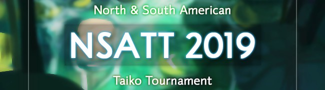

---
tags:
  - NSATT
  - NSATT2019
---

# North & South American Taiko Tournament 2019

The **North & South American Taiko Tournament 2019** (***NSATT 2019***) was a double-elimination 1v1 osu!taiko tournament hosted by ::{ flag=US }:: [Garpo](https://osu.ppy.sh/users/4097035) and ::{ flag=US }:: [incandescence](https://osu.ppy.sh/users/6256027). The tournament was restricted to players within the North and South American countries only. It was the fourth instalment of the North & South American Taiko Tournament.

## Tournament schedule

| Event | Timestamp |
| --: | :-- |
| Registration phase | 2019-06-01/2019-06-25 |
| Group stage | 2019-06-22/2019-06-23 |
| Round of 16 | 2019-06-29/2019-06-30 |
| Quarterfinals | 2019-07-06/2019-07-07 |
| Semifinals | 2019-07-13/2019-07-14 |
| Finals | 2019-07-20/2019-07-21 |
| Grand Finals | 2019-07-27/2019-07-28 |

## Prizes

| Placing | Prize(s) |
| :-: | :-- |
|  | Unique profile badge, 1 year of osu!supporter (or US$26 ) |
|  | 6 months of osu!supporter (or US$16) |
|  | 2 months of osu!supporter (or US$8) |

## Organisation

The North & South American Taiko Tournament 2019 was run by various community members.

| Position | Member(s) |
| :-- | :-- |
| Organizer | ::{ flag=US }:: [Garpo](https://osu.ppy.sh/users/4097035), ::{ flag=US }:: [incandescence](https://osu.ppy.sh/users/6256027) |
| Mappool selector | ::{ flag=GB }:: [\_DUSK\_](https://osu.ppy.sh/users/6092181), ::{ flag=US }:: [incandescence](https://osu.ppy.sh/users/6256027), ::{ flag=GB }:: [Lno](https://osu.ppy.sh/users/1900787), ::{ flag=US }:: [Nifty](https://osu.ppy.sh/users/4956097) |
| Referee | ::{ flag=AU }:: [Beat43210](https://osu.ppy.sh/users/5664171), ::{ flag=US }:: [Edgar\_Figaro](https://osu.ppy.sh/users/6508754), ::{ flag=GB }:: [goheegy](https://osu.ppy.sh/users/8057655), ::{ flag=US }:: [JDrago14](https://osu.ppy.sh/users/7690078), ::{ flag=US }:: [Ney](https://osu.ppy.sh/users/5991961), ::{ flag=US }:: [radar](https://osu.ppy.sh/users/7131099), ::{ flag=SE }:: [Raphalge](https://osu.ppy.sh/users/3918650), ::{ flag=AT }:: [Stefan](https://osu.ppy.sh/users/626907), ::{ flag=CL }:: [Ulqui](https://osu.ppy.sh/users/1263669), ::{ flag=US }:: [Voltaeyx](https://osu.ppy.sh/users/2715118) |
| Streamer | ::{ flag=US }:: [cheese salad](https://osu.ppy.sh/users/6349821), ::{ flag=US }:: [Garpo](https://osu.ppy.sh/users/4097035) |
| Commentator | ::{ flag=AU }:: [Beat43210](https://osu.ppy.sh/users/5664171), ::{ flag=US }:: [CaptainEChan](https://osu.ppy.sh/users/9536977), ::{ flag=CA }:: [DuckyDoom](https://osu.ppy.sh/users/3153062), ::{ flag=US }:: [Edgar\_Figaro](https://osu.ppy.sh/users/6508754), ::{ flag=GB }:: [goheegy](https://osu.ppy.sh/users/8057655), ::{ flag=US }:: [incandescence](https://osu.ppy.sh/users/6256027), ::{ flag=CA }:: [janitoreihil](https://osu.ppy.sh/users/3307897) |
| Designer | ::{ flag=US }:: [DigitalHypno](https://osu.ppy.sh/users/4384207) |
| Statistician | ::{ flag=US }:: [Garpo](https://osu.ppy.sh/users/4097035) |
| Wiki editor | ::{ flag=ID }:: [fajar13k](https://osu.ppy.sh/users/7100002) |

## Links

- [Discussion thread](https://osu.ppy.sh/community/forums/topics/907995)
- [Livestream](https://www.twitch.tv/osutaikolive)
- [Challonge bracket](https://challonge.com/NSATT2019)
- **[Statistics sheet](https://docs.google.com/spreadsheets/d/e/2PACX-1vSPxwqEqzN-miTVZ9fM20aMelIYCwnm1FFJV3M0yn7w8YoBB60lS-hIzpV4l9JOqQ3v9iyTBXHhoOAk/pubhtml)**

## Participants

| Seed | Members |
| :-- | :-- |
| Top | ::{ flag=CA }:: [janitoreihil](https://osu.ppy.sh/users/3307897), ::{ flag=CA }:: [vladyushko](https://osu.ppy.sh/users/4908773), ::{ flag=BR }:: [eae](https://osu.ppy.sh/users/4050738), ::{ flag=US }:: [Loopy542](https://osu.ppy.sh/users/5468461), ::{ flag=AR }:: [BossPlays](https://osu.ppy.sh/users/7341471), ::{ flag=US }:: [cheese salad](https://osu.ppy.sh/users/6349821), ::{ flag=US }:: [jyake](https://osu.ppy.sh/users/9099822), ::{ flag=BR }:: [Skull Kid](https://osu.ppy.sh/users/3044264) |
| Middle | ::{ flag=US }:: [\_knots](https://osu.ppy.sh/users/4407678), ::{ flag=AR }:: [trollocat](https://osu.ppy.sh/users/9228032), ::{ flag=US }:: [Whulf](https://osu.ppy.sh/users/11601107), ::{ flag=AR }:: [Axer](https://osu.ppy.sh/users/7299864), ::{ flag=VE }:: [My Angel Kazu](https://osu.ppy.sh/users/5136821), ::{ flag=VE }:: [\[\_Chichinya\_\]](https://osu.ppy.sh/users/2140739), ::{ flag=BR }:: [Kyoumo](https://osu.ppy.sh/users/8145223), ::{ flag=US }:: [closed](https://osu.ppy.sh/users/5116922) |
| Low | ::{ flag=AR }:: [Jintsuu](https://osu.ppy.sh/users/7165127), ::{ flag=BR }:: [Coryn](https://osu.ppy.sh/users/2828556), ::{ flag=MX }:: [Ammy](https://osu.ppy.sh/users/4183406), ::{ flag=US }:: [Backfire](https://osu.ppy.sh/users/263110), ::{ flag=US }:: [Brames](https://osu.ppy.sh/users/6417190), ::{ flag=AR }:: [Atreevete](https://osu.ppy.sh/users/2615199), ::{ flag=US }:: [CaptainEChan](https://osu.ppy.sh/users/9536977), ::{ flag=US }:: [Kotu776](https://osu.ppy.sh/users/8494571) |
| Unseeded | ::{ flag=CA }:: [DuckyDoom](https://osu.ppy.sh/users/3153062), ::{ flag=AR }:: [warning dark](https://osu.ppy.sh/users/5040981), ::{ flag=CL }:: [Catulus](https://osu.ppy.sh/users/6276709), ::{ flag=MX }:: [\[ItsTakane\]](https://osu.ppy.sh/users/4420046), ::{ flag=EC }:: [Gamelan4](https://osu.ppy.sh/users/9856910), ::{ flag=US }:: [DiggyDogg](https://osu.ppy.sh/users/5014664), ::{ flag=US }:: [InsaneToe](https://osu.ppy.sh/users/6389252), ::{ flag=US }:: [Binsu](https://osu.ppy.sh/users/6236911) |

## Groups

| Group | Top seed | Middle seed | Low seed | Unseeded |
| :-: | :-- | :-- | :-- | :-- |
| **A** | ::{ flag=CA }:: [vladyushko](https://osu.ppy.sh/users/4908773) | ::{ flag=AR }:: [Axer](https://osu.ppy.sh/users/7299864) | ::{ flag=US }:: [CaptainEChan](https://osu.ppy.sh/users/9536977) | ::{ flag=CL }:: [Catulus](https://osu.ppy.sh/users/6276709) |
| **B** | ::{ flag=US }:: [jyake](https://osu.ppy.sh/users/9099822) | ::{ flag=AR }:: [trollocat](https://osu.ppy.sh/users/9228032) | ::{ flag=AR }:: [Jintsuu](https://osu.ppy.sh/users/7165127) | ::{ flag=EC }:: [Gamelan4](https://osu.ppy.sh/users/9856910) |
| **C** | ::{ flag=US }:: [cheese salad](https://osu.ppy.sh/users/6349821) | ::{ flag=US }:: [closed](https://osu.ppy.sh/users/5116922) | ::{ flag=AR }:: [Atreevete](https://osu.ppy.sh/users/2615199) | ::{ flag=CA }:: [DuckyDoom](https://osu.ppy.sh/users/3153062) |
| **D** | ::{ flag=BR }:: [eae](https://osu.ppy.sh/users/4050738) | ::{ flag=VE }:: [My Angel Kazu](https://osu.ppy.sh/users/5136821) | ::{ flag=BR }:: [Coryn](https://osu.ppy.sh/users/2828556) | ::{ flag=MX }:: [\[ItsTakane\]](https://osu.ppy.sh/users/4420046) |
| **E** | ::{ flag=CA }:: [janitoreihil](https://osu.ppy.sh/users/3307897) | ::{ flag=VE }:: [\[\_Chichinya\_\]](https://osu.ppy.sh/users/2140739) | ::{ flag=US }:: [Backfire](https://osu.ppy.sh/users/263110) | ::{ flag=US }:: [DiggyDogg](https://osu.ppy.sh/users/5014664) |
| **F** | ::{ flag=US }:: [Loopy542](https://osu.ppy.sh/users/5468461) | ::{ flag=BR }:: [Kyoumo](https://osu.ppy.sh/users/8145223) | ::{ flag=MX }:: [Ammy](https://osu.ppy.sh/users/4183406) | ::{ flag=AR }:: [warning dark](https://osu.ppy.sh/users/5040981) |
| **G** | ::{ flag=BR }:: [Skull Kid](https://osu.ppy.sh/users/3044264) | ::{ flag=US }:: [Whulf](https://osu.ppy.sh/users/11601107) | ::{ flag=US }:: [Kotu776](https://osu.ppy.sh/users/8494571) | ::{ flag=US }:: [Binsu](https://osu.ppy.sh/users/6236911) |
| **H** | ::{ flag=AR }:: [BossPlays](https://osu.ppy.sh/users/7341471) | ::{ flag=US }:: [\_knots](https://osu.ppy.sh/users/4407678) | ::{ flag=US }:: [Brames](https://osu.ppy.sh/users/6417190) | ::{ flag=US }:: [InsaneToe](https://osu.ppy.sh/users/6389252) |

## Podium

This competition has come to an end and resulted in the following podium:

| Placing | Player |
| :-: | :-- |
|  | ::{ flag=CA }:: [janitoreihil](https://osu.ppy.sh/users/3307897) |
|  | ::{ flag=CA }:: [vladyushko](https://osu.ppy.sh/users/4908773) |
|  | ::{ flag=BR }:: [eae](https://osu.ppy.sh/users/4050738) |

## Mappools

### Finals

**This mappool was played in Finals and Grand Finals.**

**[Download the mappack here! (89 MB)](https://www.dropbox.com/s/3n8rkoxbo5ir6ty/NSATT%202019%20-%20Finals%20Map%20Pack.rar)**

- NoMod
  1. [MASAKI(ZUNTATA) - Touhou Kijinretsu (JUDYDANNY) \[Retsu\]](https://osu.ppy.sh/beatmapsets/969930#taiko/2029111)
  2. [GigaP - Rettou Joutou(BRING IT ON) ft.Kagamine Rin&Ren (Yozumina Remix) (Nofool) \[Inner Oni\]](https://osu.ppy.sh/beatmapsets/961877#taiko/2014095)
  3. [USAO - Cyaegha (Charlotte) \[Apocalypse\]](https://osu.ppy.sh/beatmapsets/973521#taiko/2038013)
  4. [Camellia as "Bang Riot" - Blastix Riotz (Nwolf) \[Futsuu\]](https://osu.ppy.sh/beatmapsets/351644#taiko/781907)
  5. [LSD - Stimulant Beatmaps (maziari1105) \[KatHarSis\]](https://osu.ppy.sh/beatmapsets/597075#taiko/1262365)
  6. [Kobaryo - GGSBNDS (yea) \[GENOCIDE\]](https://osu.ppy.sh/beatmapsets/974085#taiko/2039035)
- Hidden
  1. [lapix - Future Raver feat. Numb'n'dub (Arrival) \[Inner Oni\]](https://osu.ppy.sh/beatmapsets/963997#taiko/2018209)
  2. [toach - Fill it a Try (tasuke912) \[Edit\]](https://osu.ppy.sh/beatmapsets/824580#taiko/1729490)
- HardRock
  1. [Umeboshi Chazuke - Bison Charge (Midnaait) \[Bit Crusher\]](https://osu.ppy.sh/beatmapsets/739116#taiko/1559744)
  2. [Zekk - Sugary Daydream (TKS) \[Hell Oni\]](https://osu.ppy.sh/beatmapsets/578489#taiko/1224835)
- DoubleTime
  1. [Boogie Belgique - Piccadilly (lazyboy007) \[West End\]](https://osu.ppy.sh/beatmapsets/717359#taiko/1515547)
  2. [-12insomnia- - Gravity Blast (Raphalge) \[Liftoff\]](https://osu.ppy.sh/beatmapsets/574961#taiko/1217636)
- FreeMod
  1. [USAO - Night sky (Extended Mix) (Jaye) \[Beyond Astronomical Twilight\]](https://osu.ppy.sh/beatmapsets/536313#taiko/1135874)
  2. [xyst - Ylil's overed landscape (SKSalt) \[komasy's Inner Oni\]](https://osu.ppy.sh/beatmapsets/897948#taiko/1887454)
  3. [xi - Inixia (Raediaufar) \[Sur's Ura Oni\]](https://osu.ppy.sh/beatmapsets/424299#taiko/919457)
- Tiebreaker
  1. **[BlackY - Harpuia -evolutionary extended ver- (S a n d) \[Sand x Backfire\]](https://osu.ppy.sh/beatmapsets/523713#taiko/1111804)**

### Semifinals

**[Download the mappack here! (82 MB)](https://www.dropbox.com/s/w4iu8kqg5389gk4/NSATT%202019%20-%20Semi%20Finals%20Map%20pack.rar)**

- NoMod
  1. [Ruby My Dear - Spectacle (Ulqui) \[Inner Oni\]](https://osu.ppy.sh/beatmapsets/747789#taiko/1575570)
  2. [Hiro - VERTeX (Nwolf) \[Apex\]](https://osu.ppy.sh/beatmapsets/856990#taiko/1790210)
  3. [uma vs. Morimori Atsushi - Touhou Youyoumu ULTIMATE MEDLEY (komasy) \[Phantasm\]](https://osu.ppy.sh/beatmapsets/871329#taiko/1820576)
  4. [DJ Mass MAD Izm\* - SHAKUNETSU Pt.2 Long Train Running (Consified) \[YO!\]](https://osu.ppy.sh/beatmapsets/805516#taiko/1882208)
  5. [Kobaryo - Cartoon Candy (Plua-) \[Nisweetzumi\]](https://osu.ppy.sh/beatmapsets/556809#taiko/1186496)
- Hidden
  1. [t+pazolite - blckout (S a n d) \[Sand's Taiko Oni\]](https://osu.ppy.sh/beatmapsets/234541#taiko/543963)
  2. [Vladimir Zelentsov - A.Vivaldi - Summer (Metal Cover) (Grimbow) \[Solstice\]](https://osu.ppy.sh/beatmapsets/694481#taiko/1469275)
- HardRock
  1. [xi - Glorious Crown (asuasu_yura) \[Special\]](https://osu.ppy.sh/beatmapsets/806381#taiko/1692612)
  2. [Nightmare - Dream to Nightmare (Kqrth) \[Tenebrae\]](https://osu.ppy.sh/beatmapsets/834254#taiko/1747624)
- DoubleTime
  1. [EZFG - Hurting for a Very Hurtful Pain (Nwolf) \[Painful Demon\]](https://osu.ppy.sh/beatmapsets/955541#taiko/1995363)
  2. [Memme - Chinese Restaurant (Love) \[Inner Oni\]](https://osu.ppy.sh/beatmapsets/243893#taiko/562332)
- FreeMod
  1. [Lite Show Magic - TRICKL4SH 220 (22,000 Power Extended) (incandescence) \[Electrification\]](https://osu.ppy.sh/beatmapsets/896623#taiko/1873220)
  2. [t+pazolite - Ka wa Taredoki no Yuuwaku (ekumea1123) \[Inner Oni\]](https://osu.ppy.sh/beatmapsets/749335#taiko/1578366)
  3. [SEVENTH SISTERS - SEVENTH HAVEN(Mtell Remix)(Short ver.) (kei821) \[Inner Oni\]](https://osu.ppy.sh/beatmapsets/857635#taiko/1791925)
- Tiebreaker
  1. **[Gram VS Camellia - Ragnarok (yassu-) \[Hell Oni\]](https://osu.ppy.sh/beatmapsets/812048#taiko/1703338)**

### Quarterfinals

**[Download the mappack here! (83 MB)](https://www.dropbox.com/s/zlbe9blvtdg9zd1/NSATT%202019%20Quarter%20Finals%20Map%20Pack.rar)**

- NoMod
  1. [Ocelot - TSUBAKI (TKS) \[TSUBAKI\]](https://osu.ppy.sh/beatmapsets/177838#taiko/427932)
  2. [wataame - MonoCrossRoad (sjfd) \[taiko collab\]](https://osu.ppy.sh/beatmapsets/465609#taiko/996827)
  3. [Minami Yuni - Kanagawa Cyber Culvert (ekumea1123) \[tasuke's Upheaval\]](https://osu.ppy.sh/beatmapsets/898783#taiko/1877558)
  4. [Camellia - Shun no Shifudo o Ikashita Kare Fumi Paeria (Nishizumi) \[Kraken\]](https://osu.ppy.sh/beatmapsets/542058#taiko/1149263)
  5. [U1 High-Speed - EGOISM 440 (youtune3) \[Hell Oni\]](https://osu.ppy.sh/beatmapsets/899958#taiko/1879812)
- Hidden
  1. [Toromaru - Shounen wa Sora o Tadoru Prog Piano Remix (Skull Kid) \[Inner Oni\]](https://osu.ppy.sh/beatmapsets/564918#taiko/1194117)
  2. [renard - destination of the heart (Nofool) \[Hard Oni\]](https://osu.ppy.sh/beatmapsets/464930#taiko/995374)
- HardRock
  1. [Getty vs. DJ DiA - Ops:Code-Rapture- (eiri-) \[Outer Oni\]](https://osu.ppy.sh/beatmapsets/757450#taiko/1593442)
  2. [goreshit - wasting my time (SKSalt) \[Inner Oni\]](https://osu.ppy.sh/beatmapsets/494063#taiko/1052058)
- DoubleTime
  1. [wowaka - World's End Dancehall (ROCKETMAN Remix) (Mira-san) \[Stefan's Taiko Oni\]](https://osu.ppy.sh/beatmapsets/88911#taiko/417032)
  2. [nameless - SLoWMoTIoN (Marfuri) \[SLoW oNI\]](https://osu.ppy.sh/beatmapsets/834799#taiko/1748618)
- FreeMod
  1. [Kaneko Chiharu - Ai want U (Kqrth) \[Inner Oni\]](https://osu.ppy.sh/beatmapsets/914852#taiko/1910701)
  2. [t+pazolite - Chrome VOX (Uncut Edition) (juanilp4evr) \[Inner Oni\]](https://osu.ppy.sh/beatmapsets/939007#taiko/1961414)
  3. [cybermiso - Surveiller et punir (tasuke912) \[Oni\]](https://osu.ppy.sh/beatmapsets/921181#taiko/1923626)
- Tiebreaker
  1. **[Knife Party - GIVE IT UP (BILLX HARDTEK RMX) (Grimbow) \[Inner Oni\]](https://osu.ppy.sh/beatmapsets/618352#taiko/1637029)**

### Round of 16

**[Download the mappack here! (63 MB)](https://www.dropbox.com/s/luzhzs0c12b9e2h/NSATT%202019%20-%20RO16%20Map%20Pack.rar)**

- NoMod
  1. [t+pazolite - Pee-Kan Breaks (Ulqui) \[Overlapse Oni\]](https://osu.ppy.sh/beatmapsets/529539#taiko/1122796)
  2. [EVO+ feat. GigaReol - \[A\]ddiction (KinomiCandy) \[Kinobles, MMzz & YOUTA's \[C\]ollaboration \[NSATT ver.\]\]](https://www.dropbox.com/s/u2zxzoob6nro27o/EVO%2B%20feat.%20GigaReol%20-%20%5BA%5Dddiction.osz)
  3. [Kemono Friends - Cerulean (S a n d) \[Regretless Oni\]](https://osu.ppy.sh/beatmapsets/595790#taiko/1259995)
  4. [Ice vs. Morimori Atsushi - RE:UNION -Duo Blade Against- (\_DUSK\_) \[Nishizumi's Inner Oni\]](https://osu.ppy.sh/beatmapsets/925900#taiko/1943253)
  5. [AAAA Chazuke - Fatality Saga (maziari1105) \[Oni\]](https://osu.ppy.sh/beatmapsets/768449#taiko/1616129)
- Hidden
  1. [RoughSketch - The Omen (Ulqui) \[Inner Oni\]](https://osu.ppy.sh/beatmapsets/566671#taiko/1200352)
  2. [XIzE - will o' the wisp (Raphalge) \[Inner Oni\]](https://osu.ppy.sh/beatmapsets/948821#taiko/1981442)
- HardRock
  1. [Fire EX. - Shattered Dreams (qoot8123) \[Inner Oni\]](https://osu.ppy.sh/beatmapsets/287251#taiko/648184)
  2. [SOUND HOLIC feat. Nana Takahashi - 1001 -ESCAPE- (Charlotte) \[Kqrth's Escape Oni\]](https://osu.ppy.sh/beatmapsets/857208#taiko/2033297)
- DoubleTime
  1. [Pegboard Nerds - BAMF (Dargin) \[Oni\]](https://osu.ppy.sh/beatmapsets/517687#taiko/1099907)
  2. [Rin - Kishinjou set 02 \~ Mermaid from the Uncharted Land (tasuke912) \[Oni\]](https://osu.ppy.sh/beatmapsets/951618#taiko/1987309)
- FreeMod
  1. [Mitsuyoshi Takenobu no Ani - Amphisbaena (Nifty) \[Polycephaly\]](https://osu.ppy.sh/beatmapsets/693993#taiko/1468369)
  2. [aran - Xperanza (Arrival) [Inner Oni]](https://osu.ppy.sh/beatmapsets/828903#taiko/1736621)
  3. [Shiron + Kofu x Morimori Atsushi to Teikyo de okuri shimasu - Miracle Tone's Fantasy (Clover Remix) (7\_7) \[7\_7 & solo's Fantasy\]](https://osu.ppy.sh/beatmapsets/711159#taiko/1503524)
- Tiebreaker
  1. **[Camellia - Primitive Pump (frz) \[Inner PUMP\]](https://osu.ppy.sh/beatmapsets/712424#taiko/1505977)**

### Group stage

**[Download the mappack here! (57 MB)](https://www.dropbox.com/s/ywc3w1vai12cvv9/NSATT%202019%20-%20Group%20Stage%20Map%20Pack.rar)**

- NoMod
  1. [Igorrr - Mastication Numerique (grumd) \[Loctav's Taiko Oni\]](https://osu.ppy.sh/beatmapsets/54182#taiko/165342)
  2. [TAROLIN - Anoko no Jinta (TARO no Jigoku Megu Remix) (eiri-) \[yea's Inner Oni\]](https://osu.ppy.sh/beatmapsets/825937#taiko/1731107)
  3. [yuki. - Be Your Light (Rhytoly) \[Creativity\]](https://osu.ppy.sh/beatmapsets/878344#taiko/1837010)
  4. [HimeHina - Rettou Joutou (katacheh) \[Jojijoji Taiko\]](https://osu.ppy.sh/beatmapsets/902934#taiko/1885021)
- Hidden
  1. [Akhuta - Nigra Ludia (Kqrth) \[Black Oni\]](https://osu.ppy.sh/beatmapsets/838406#taiko/1755294)
  2. [DIVELA feat. Hatsune Miku - DITHER TUNE (uone) \[uone&Shallty's Inner Oni\]](https://osu.ppy.sh/beatmapsets/844655#taiko/1766838)
- HardRock
  1. [Furries in a Blender - Storm World (Firce777) \[Oni\]](https://osu.ppy.sh/beatmapsets/319473#taiko/711061)
  2. [FELT - New World (Nao Tomori) \[Inner Oni\]](https://osu.ppy.sh/beatmapsets/782955#taiko/1659378)
- DoubleTime
  1. [SHW - Ikusa JAPAN (shw.in) (kanpakyin) \[Oni\]](https://osu.ppy.sh/beatmapsets/169969#taiko/411522)
  2. [40mP - Dandan Hayaku Naru (Volta) \[Oni\]](https://osu.ppy.sh/beatmapsets/697711#taiko/1477882)
- FreeMod
  1. [cillia - Rolling Girl (mintong89) \[Ura Oni Lv.29\]](https://osu.ppy.sh/beatmapsets/434536#taiko/936283)
  2. [Helblinde - Putin's Boner (KitajimaYN) \[Small Putin\]](https://osu.ppy.sh/beatmapsets/621547#taiko/1310558)
  3. [BiBi - Cutie Panther (OzzyOzrock) \[Inner Oni\]](https://osu.ppy.sh/beatmapsets/680237#taiko/1438348)
- Tiebreaker
  1. **[Yousei Teikoku - Astral Dogma (Raphalge) \[Inner Oni\]](https://osu.ppy.sh/beatmapsets/715185#taiko/1511109)**

## Match results

### Grand Finals

Saturday, 27 July 2019:

| Player 1 |  |  | Player 2 | Match link |
| --: | :-: | :-: | :-- | :-- |
| **vladyushko** ::{ flag=CA }:: | **7** | 3 | ::{ flag=BR }:: eae | [#1](https://osu.ppy.sh/community/matches/53620192) |

Sunday, 28 July 2019:

| Player 1 |  |  | Player 2 | Match link |
| --: | :-: | :-: | :-- | :-- |
| **janitoreihil** ::{ flag=CA }:: | **7** | 3 | ::{ flag=CA }:: vladyushko | [#1](https://osu.ppy.sh/community/matches/53673786) |

### Finals

Saturday, 20 July 2019:

| Player 1 |  |  | Player 2 | Match link |
| --: | :-: | :-: | :-- | :-- |
| **janitoreihil** ::{ flag=CA }:: | **7** | 4 | ::{ flag=CA }:: vladyushko | [#1](https://osu.ppy.sh/community/matches/53482413) |
| **eae** ::{ flag=BR }:: | **7** | 2 | ::{ flag=AR }:: BossPlays | [#1](https://osu.ppy.sh/community/matches/53489806) |
| **Loopy542** ::{ flag=US }:: | **7** | 3 | ::{ flag=US }:: cheese salad | [#1](https://osu.ppy.sh/community/matches/53508927) |

Sunday, 21 July 2019:

| Player 1 |  |  | Player 2 | Match link |
| --: | :-: | :-: | :-- | :-- |
| **eae** ::{ flag=BR }:: | **7** | 6 | ::{ flag=US }:: Loopy542 | [#1](https://osu.ppy.sh/community/matches/53511386) |

### Semifinals

Saturday, 13 July 2019:

| Player 1 |  |  | Player 2 | Match link |
| --: | :-: | :-: | :-- | :-- |
| **BossPlays** ::{ flag=AR }:: | **6** | 3 | ::{ flag=BR }:: Skull Kid | [#1](https://osu.ppy.sh/community/matches/53315504) |
| **vladyushko** ::{ flag=CA }:: | **6** | 5 | ::{ flag=BR }:: eae | [#1](https://osu.ppy.sh/community/matches/53316695) |
| TrolloCat ::{ flag=US }:: | -1 | **0** | ::{ flag=VE }:: \[\_Chichinya\_\] | *win by default* |
| **janitoreihil** ::{ flag=CA }:: | **6** | 0 | ::{ flag=US }:: Loopy542 | [#1](https://osu.ppy.sh/community/matches/53318814) |

Sunday, 14 July 2019:

| Player 1 |  |  | Player 2 | Match link |
| --: | :-: | :-: | :-- | :-- |
| **BossPlays** ::{ flag=AR }:: | **6** | 0 | ::{ flag=VE }:: \[\_Chichinya\_\] | [#1](https://osu.ppy.sh/community/matches/53343237) |
| **jyake** ::{ flag=US }:: | **6** | 5 | ::{ flag=US }:: Whulf | [#1](https://osu.ppy.sh/community/matches/53341909) |
| **cheese salad** ::{ flag=US }:: | **6** | 3 | ::{ flag=VE }:: My Angel Kazu | [#1](https://osu.ppy.sh/community/matches/53347573) |
| **cheese salad** ::{ flag=US }:: | **6** | 5 | ::{ flag=US }:: jyake | [#1](https://osu.ppy.sh/community/matches/53370414) |

### Quarterfinals

Saturday, 6 July 2019:

| Player 1 |  |  | Player 2 | Match link |
| --: | :-: | :-: | :-- | :-- |
| **janitoreihil** ::{ flag=CA }:: | **6** | 0 | ::{ flag=AR }:: BossPlays | [#1](https://osu.ppy.sh/community/matches/53152636) |
| **\[\_Chichinya\_\]** ::{ flag=VE }:: | **0** | -1 | ::{ flag=AR }:: Atreevete | *win by default* |
| Axer ::{ flag=AR }:: | 0 | **6** | ::{ flag=BR }:: **Skull Kid** | [#1](https://osu.ppy.sh/community/matches/53158344) |
| **Loopy542** ::{ flag=US }:: | **6** | 0 | ::{ flag=US }:: TrolloCat | [#1](https://osu.ppy.sh/community/matches/53176080) |
| Kyoumo ::{ flag=BR }:: | 4 | **6** | ::{ flag=US }:: **Whulf** | [#1](https://osu.ppy.sh/community/matches/53177930) |
| cheese salad ::{ flag=US }:: | 1 | **6** | ::{ flag=BR }:: **eae** | [#1](https://osu.ppy.sh/community/matches/53179464) |

Sunday, 7 July 2019:

| Player 1 |  |  | Player 2 | Match link |
| --: | :-: | :-: | :-- | :-- |
| **My Angel Kazu** ::{ flag=VE }:: | **6** | 3 | ::{ flag=US }:: \_knots | [#1](https://osu.ppy.sh/community/matches/53182563) |
| **vladyushko** ::{ flag=CA }:: | **6** | 4 | ::{ flag=US }:: jyake | [#1](https://osu.ppy.sh/community/matches/53183507) |

### Round of 16

Saturday, 29 June 2019:

| Player 1 |  |  | Player 2 | Match link |
| --: | :-: | :-: | :-- | :-- |
| **Loopy542** ::{ flag=US }:: | **5** | 0 | ::{ flag=VE }:: My Angel Kazu | [#1](https://osu.ppy.sh/community/matches/52949621) |
| **janitoreihil** ::{ flag=CA }:: | **5** | 0 | ::{ flag=BR }:: Kyoumo | [#1](https://osu.ppy.sh/community/matches/52991246) |
| Skull Kid ::{ flag=BR }:: | 4 | **5** | ::{ flag=US }:: **jyake** | [#1](https://osu.ppy.sh/community/matches/52992931) |
| **eae** ::{ flag=BR }:: | **5** | 0 | ::{ flag=VE }:: \[\_Chichinya\_\] | [#1](https://osu.ppy.sh/community/matches/52996294) |

Sunday, 30 June 2019:

| Player 1 |  |  | Player 2 | Match link |
| --: | :-: | :-: | :-- | :-- |
| **cheese salad** ::{ flag=US }:: | **5** | 0 | ::{ flag=AR }:: Atreevete | [#1](https://osu.ppy.sh/community/matches/52998024) |
| **vladyushko** ::{ flag=CA }:: | **5** | 1 | ::{ flag=AR }:: Axer | [#1](https://osu.ppy.sh/community/matches/53012000) |
| **BossPlays** ::{ flag=AR }:: | **5** | 4 | ::{ flag=US }:: Whulf | [#1](https://osu.ppy.sh/community/matches/53017178) |
| **TrolloCat** ::{ flag=US }:: | **5** | 2 | ::{ flag=US }:: \_knots | [#1](https://osu.ppy.sh/community/matches/53022697) |

### Group stage

Complete Group Stage match results can be accessed through the [statistics sheet](https://docs.google.com/spreadsheets/d/e/2PACX-1vSPxwqEqzN-miTVZ9fM20aMelIYCwnm1FFJV3M0yn7w8YoBB60lS-hIzpV4l9JOqQ3v9iyTBXHhoOAk/pubhtml)

## Ruleset

1. Only Players with a North or South American flag on their account are allowed to register in this tournament. This includes only the following countries: USA, Canada, Mexico, Brazil, Chile, Argentina, Colombia, Venezuela, Uruguay, Paraguay, Peru, Ecuador, Bolivia, Guyana, Suriname, and French Guiana. Countries in the Caribbean and Central America may not sign up for this tournament.
2. Group Stage matches are seeded based on global rank **at the end of the registration period**.
3. NSATT will have a Group Stage followed by a knock-out double elimination structure with a loser bracket.
4. NSATT matches will be 1v1 Taiko in team style format with a point given to the highest score achieved in the Score V2 system.
5. The win conditions for each stage are as follows.
   - In **Group Stage**, it is Bo7: First to score 4 points wins.
   - In **Round of 16**, it is Bo9: First to score 5 points wins.
   - In **Quarterfinals and Semifinals**, it is Bo11: First to score 6 points wins.
   - In **Finals and Grand Finals**, it is Bo13: First to score 7 points wins.
6. Map pools will start with 4 No Mod, 2 HD, 2 HR, 2 DT, 3 FM and 1 Tiebreaker. At the RO16, 1 NoMod will be added, and at the Finals, another NoMod will be added.
7. Only the player who selects a FreeMod pick is required to use at least 1 mod. The opponent is not required to use a mod if they choose not to do so.
8. You are allowed 1 map ban per match, this does not include the Tie-breaker.
9. Each player can choose to play up to 1 warm-up map. A warm-up must be shorter than 4 minutes. If both players agree to one warm-up, the duration must be shorter than 6 minutes.
10. Players roll to determine who will get the first pick and the first ban. The winner of roll will select the first map, whereas the loser will ban the first map.
11. Tiebreaker will be played if both players are 1 point away from winning. It will not be Free Mod.
12. In cases where a map results in a tie, the map is nullified and the Player who picked said map will pick another. (If the Tiebreaker ends in a draw, the tiebreaker will be replayed under FM.)
13. If no staff or referee is available, the match will be postponed.
14. Players will have up to 15 minutes after the scheduled time to show up. Failure to show up without prior notice will result in a win by default.
15. Players may not directly throw a match. If a player chooses to do so, a rematch will be forced. If the match is still thrown, the player will be ejected from the tournament.
16. If a player disconnects during a map:
    - If it before 30 seconds into the map, the referee will abort the map, and it will be replayed.
    - If it is after 30 seconds into the map, it is up to the discretion of the referee.
17. Any modification of these rules will be announced.
