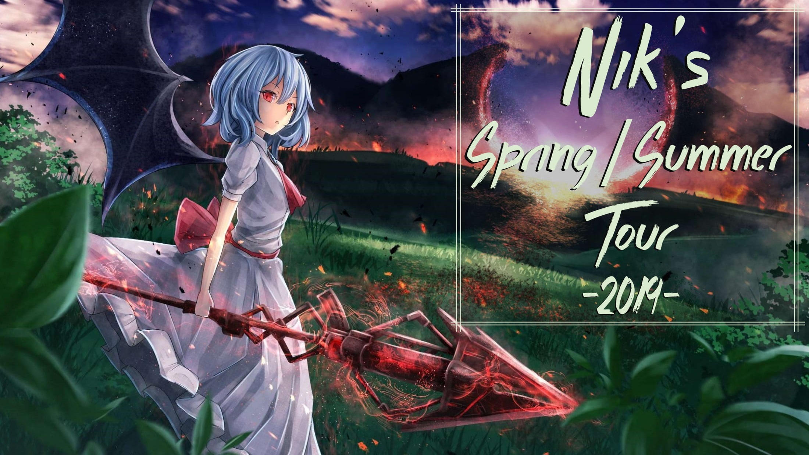

---
tags:
  - NSST 2019
  - NSST2019
---

# nik's Spring/Summer Tour 2019

The **nik's Spring/Summer Tour 2019** (***NSST 2019***) was a 1v1 worldwide double-elimination osu! tournament hosted by ::{ flag=NL }:: [nik](https://osu.ppy.sh/users/10077264). It was the second instalment of the nik's Tournaments series.

## Tournament schedule

| Event | Timestamp |
| --: | :-- |
| Registration phase | 2019-03-18/2019-04-19 |
| Qualifiers stage | 2019-04-27/2019-04-28 |
| Live drawings | 2019-04-29 (19:00 UTC) |
| Group stage | 2019-05-10/2019-05-20 |
| Round of 16 | 2019-05-25/2019-06-01 |
| Quarterfinals | 2019-05-31/2019-06-06 |
| Semifinals | 2019-06-07/2019-06-15 |
| Finals | 2019-06-15/2019-06-18 |
| Grand Finals | 2019-06-22/2019-06-29 |

## Prizes

| Placing | Prize(s) |
| :-: | :-- |
|  | 4 months osu!supporter tag, unique profile badge |
|  | 2 months of osu!supporter |
|  | 1 month of osu!supporter |

 

## Organisation

The nik's Spring/Summer Tour 2019 was run by various community members.

| Position | Member(s) |
| :-- | :-- |
| Manager | ::{ flag=NL }:: [nik](https://osu.ppy.sh/users/10077264) |
| Admin | ::{ flag=US }:: [Cindelluna](https://osu.ppy.sh/users/3039847), ::{ flag=AU }:: [nonamegohst](https://osu.ppy.sh/users/4384859), ::{ flag=US }:: [tigereyes144](https://osu.ppy.sh/users/6499811), ::{ flag=GB }:: [vita2](https://osu.ppy.sh/users/10706998) |
| Mappool selector | ::{ flag=DE }:: [hi-def](https://osu.ppy.sh/users/10697191), ::{ flag=NL }:: [nik](https://osu.ppy.sh/users/10077264), ::{ flag=GB }:: [vita2](https://osu.ppy.sh/users/10706998) |
| Referee | ::{ flag=PL }:: [Asasyn01](https://osu.ppy.sh/users/8013323), ::{ flag=US }:: [Cindelluna](https://osu.ppy.sh/users/3039847), ::{ flag=US }:: [Dios Dong](https://osu.ppy.sh/users/3958619), ::{ flag=DE }:: [hi-def](https://osu.ppy.sh/users/10697191), ::{ flag=AU }:: [Illinon](https://osu.ppy.sh/users/8306102), ::{ flag=AU }:: [loler123903](https://osu.ppy.sh/users/8034438), ::{ flag=DE }:: [LwL](https://osu.ppy.sh/users/3556856), ::{ flag=CN }:: [M1keL](https://osu.ppy.sh/users/10732897), ::{ flag=SE }:: [Melwoine](https://osu.ppy.sh/users/12091109), ::{ flag=DE }:: [Menty](https://osu.ppy.sh/users/3619284), ::{ flag=FR }:: [Mimir](https://osu.ppy.sh/users/7382734), ::{ flag=PH }:: [muffleberry](https://osu.ppy.sh/users/8978259), ::{ flag=NL }:: [nik](https://osu.ppy.sh/users/10077264), ::{ flag=DE }:: [NKJ](https://osu.ppy.sh/users/9675790), ::{ flag=US }:: [Poke\_player](https://osu.ppy.sh/users/6502279), ::{ flag=GB }:: [Snipe The Neko](https://osu.ppy.sh/users/8638531), ::{ flag=US }:: [tigereyes144](https://osu.ppy.sh/users/6499811), ::{ flag=VN }:: [Vespulaz](https://osu.ppy.sh/users/10848857), ::{ flag=GB }:: [vita2](https://osu.ppy.sh/users/10706998), ::{ flag=DE }:: [WitchOfFrost](https://osu.ppy.sh/users/7511840), ::{ flag=RU }:: [Xassie](https://osu.ppy.sh/users/7958911), ::{ flag=UA }:: [Zertus](https://osu.ppy.sh/users/5875469) |
| Streamer | ::{ flag=GB }:: [-spoon-](https://osu.ppy.sh/users/10623176), ::{ flag=DE }:: [\[Lucky\]](https://osu.ppy.sh/users/1303685), ::{ flag=PL }:: [bart6003](https://osu.ppy.sh/users/2100107), ::{ flag=US }:: [Dios Dong](https://osu.ppy.sh/users/3958619), ::{ flag=NL }:: [Just Lucan](https://osu.ppy.sh/users/5007943), ::{ flag=NL }:: [Swerro](https://osu.ppy.sh/users/4507667), ::{ flag=DE }:: [WitchOfFrost](https://osu.ppy.sh/users/7511840), ::{ flag=RU }:: [Xassie](https://osu.ppy.sh/users/7958911) |
| Commentator | ::{ flag=GB }:: [-spoon-](https://osu.ppy.sh/users/10623176), ::{ flag=DE }:: [\[Lucky\]](https://osu.ppy.sh/users/1303685), ::{ flag=US }:: [Dios Dong](https://osu.ppy.sh/users/3958619), ::{ flag=US }:: [fieryrage](https://osu.ppy.sh/users/3533958), ::{ flag=DE }:: [hi-def](https://osu.ppy.sh/users/10697191), ::{ flag=NL }:: [Just Lucan](https://osu.ppy.sh/users/5007943), ::{ flag=DE }:: [Menty](https://osu.ppy.sh/users/3619284), ::{ flag=NL }:: [nik](https://osu.ppy.sh/users/10077264), ::{ flag=NL }:: [Swerro](https://osu.ppy.sh/users/4507667), ::{ flag=US }:: [tigereyes144](https://osu.ppy.sh/users/6499811), ::{ flag=DE }:: [WitchOfFrost](https://osu.ppy.sh/users/7511840), ::{ flag=RU }:: [Xassie](https://osu.ppy.sh/users/7958911), ::{ flag=US }:: [YoshiLover456](https://osu.ppy.sh/users/6843383) |
| Designer | ::{ flag=US }:: [\_p0ke\_](https://osu.ppy.sh/users/5434711), ::{ flag=US }:: [Cindelluna](https://osu.ppy.sh/users/3039847) |
| Statistician | ::{ flag=NL }:: [nik](https://osu.ppy.sh/users/10077264), ::{ flag=AU }:: [nonamegohst](https://osu.ppy.sh/users/4384859) |
| Wiki editor | ::{ flag=ID }:: [fajar13k](https://osu.ppy.sh/users/7100002) |

## Links

- [Discussion thread](https://osu.ppy.sh/community/forums/topics/883340)
- [NT Discord server](https://discord.gg/wrwZWRS)
- [Livestream](https://twitch.tv/niks_tournaments)
- Challonge brackets
  - [Tier 1](https://challonge.com/NSST19T1)
  - [Tier 2](https://challonge.com/NSST19T2)
- Statistics sheet
  - **[Tier 1](https://docs.google.com/spreadsheets/d/e/2PACX-1vQPphrCZiOVJskzqs8611I5yqeeq_JN91UIcAeKJI5xjEihvEV9IJn8J1Kf9QBO1K1pyFvOkfYV3MQ2/pubhtml)**
  - **[Tier 2](https://docs.google.com/spreadsheets/d/e/2PACX-1vQ0rK_52GXfaYEiQs9DwR67l2PUV78x6MCyGkEQ4WxjFrMCe59Ox1jWDVxOE39Msl_YjMdQlOpqRfkC/pubhtml)**

## Participants

### Tier 1

| Seed | Members |
| :-- | :-- |
| Top | ::{ flag=US }:: [idke](https://osu.ppy.sh/users/4650315), ::{ flag=US }:: [Leftoverss](https://osu.ppy.sh/users/4665746), ::{ flag=US }:: [im a fancy lad](https://osu.ppy.sh/users/4908650), ::{ flag=CA }:: [Eddie-](https://osu.ppy.sh/users/3898396), ::{ flag=RO }:: [eternum](https://osu.ppy.sh/users/4581069), ::{ flag=US }:: [fieryrage](https://osu.ppy.sh/users/3533958), ::{ flag=GB }:: [Bubbleman](https://osu.ppy.sh/users/5182050), ::{ flag=US }:: [fuduhasio](https://osu.ppy.sh/users/6124018) |
| High | ::{ flag=SG }:: [Demonical](https://osu.ppy.sh/users/5447609), ::{ flag=US }:: [mniminwoo](https://osu.ppy.sh/users/3929529), ::{ flag=AU }:: [Dumii](https://osu.ppy.sh/users/3068044), ::{ flag=US }:: [Tohru](https://osu.ppy.sh/users/3596296), ::{ flag=DE }:: [papika](https://osu.ppy.sh/users/7093373), ::{ flag=GR }:: [Riven](https://osu.ppy.sh/users/3638005), ::{ flag=PH }:: [konawiki](https://osu.ppy.sh/users/4003979), ::{ flag=AR }:: [-Nanahira-](https://osu.ppy.sh/users/6169195) |
| Low | ::{ flag=NL }:: [Lilily](https://osu.ppy.sh/users/6502403), ::{ flag=AR }:: [Nykke](https://osu.ppy.sh/users/8181950), ::{ flag=DE }:: [LwL](https://osu.ppy.sh/users/3556856), ::{ flag=AR }:: [Penguo](https://osu.ppy.sh/users/4389490), ::{ flag=AU }:: [ASecretBox 2](https://osu.ppy.sh/users/4166621), ::{ flag=AR }:: [N Y Q A](https://osu.ppy.sh/users/5420232), ::{ flag=SE }:: [Reedkatt](https://osu.ppy.sh/users/8335950), ::{ flag=RU }:: [Kreet](https://osu.ppy.sh/users/9202834) |
| Unseeded | ::{ flag=US }:: [Will Stetson](https://osu.ppy.sh/users/4909088), ::{ flag=AR }:: [Megafan](https://osu.ppy.sh/users/6632605), ::{ flag=DE }:: [respektive](https://osu.ppy.sh/users/1023489), ::{ flag=US }:: [Tekkito](https://osu.ppy.sh/users/7075211), ::{ flag=IT }:: [umii](https://osu.ppy.sh/users/2538695), ::{ flag=SG }:: [moosepi](https://osu.ppy.sh/users/1868745), ::{ flag=VE }:: [-Dreamless](https://osu.ppy.sh/users/4426728), ::{ flag=FR }:: [Okatsu\_k](https://osu.ppy.sh/users/4862580) |

### Tier 2

| Seed | Members |
| :-- | :-- |
| Top | ::{ flag=KR }:: [Civil oath](https://osu.ppy.sh/users/3216107), ::{ flag=KR }:: [\_Suyong](https://osu.ppy.sh/users/7295276), ::{ flag=RU }:: [Liswiera](https://osu.ppy.sh/users/9356954), ::{ flag=US }:: [YoshiLover456](https://osu.ppy.sh/users/6843383), ::{ flag=RU }:: [\_Suzuha](https://osu.ppy.sh/users/8445602), ::{ flag=PL }:: [bart6003](https://osu.ppy.sh/users/2100107), ::{ flag=PL }:: [Triojo](https://osu.ppy.sh/users/7736410), ::{ flag=US }:: [Raoul](https://osu.ppy.sh/users/9924405) |
| High | ::{ flag=SG }:: [woahsia](https://osu.ppy.sh/users/195946), ::{ flag=ID }:: [Xicyte](https://osu.ppy.sh/users/10212581), ::{ flag=DE }:: [Menty](https://osu.ppy.sh/users/3619284), ::{ flag=FR }:: [Spartan Plume](https://osu.ppy.sh/users/2553166), ::{ flag=US }:: [Yeong Yuseong](https://osu.ppy.sh/users/8926244), ::{ flag=CA }:: [mahloola](https://osu.ppy.sh/users/8759374), ::{ flag=MY }:: [Chiyuu](https://osu.ppy.sh/users/8226107), ::{ flag=BG }:: [kiril2011](https://osu.ppy.sh/users/3703793) |
| Low | ::{ flag=US }:: [Crihs](https://osu.ppy.sh/users/6995880), ::{ flag=CO }:: [ElMick33](https://osu.ppy.sh/users/5458323), ::{ flag=US }:: [Tuco](https://osu.ppy.sh/users/11706350), ::{ flag=ID }:: [Ulat Bulu](https://osu.ppy.sh/users/3484548), ::{ flag=GB }:: [unrealLyyy](https://osu.ppy.sh/users/9594849), ::{ flag=CA }:: [PayneTrain](https://osu.ppy.sh/users/10275038), ::{ flag=NL }:: [Swerro](https://osu.ppy.sh/users/4507667), ::{ flag=CA }:: [Saltystick](https://osu.ppy.sh/users/2165408) |
| Unseeded | ::{ flag=DE }:: [Katsumi](https://osu.ppy.sh/users/513834), ::{ flag=GB }:: [4Circ](https://osu.ppy.sh/users/2161823), ::{ flag=KR }:: [siroitora](https://osu.ppy.sh/users/9146185), ::{ flag=PL }:: [lokser](https://osu.ppy.sh/users/4675441), ::{ flag=PL }:: [Kusiu](https://osu.ppy.sh/users/5285044), ::{ flag=RU }:: [Ontoryran](https://osu.ppy.sh/users/5182623), ::{ flag=CA }:: [Xeli](https://osu.ppy.sh/users/4947796), ::{ flag=IT }:: [Condizionatore](https://osu.ppy.sh/users/8810254) |

## Groups

### Tier 1

| Group | Top Seed | High Seed | Low Seed | Unseeded |
| :-: | :-- | :-- | :-- | :-- |
| **A** | ::{ flag=RO }:: [eternum](https://osu.ppy.sh/users/4581069) | ::{ flag=GR }:: [Riven](https://osu.ppy.sh/users/3638005) | ::{ flag=AU }:: [ASecretBox 2](https://osu.ppy.sh/users/4166621) | ::{ flag=VE }:: [-Dreamless](https://osu.ppy.sh/users/4426728) |
| **B** | ::{ flag=US }:: [idke](https://osu.ppy.sh/users/4650315) | ::{ flag=PH }:: [konawiki](https://osu.ppy.sh/users/4003979) | ::{ flag=RU }:: [Kreet](https://osu.ppy.sh/users/9202834) | ::{ flag=DE }:: [respektive](https://osu.ppy.sh/users/1023489) |
| **C** | ::{ flag=US }:: [fieryrage](https://osu.ppy.sh/users/3533958) | ::{ flag=SG }:: [Demonical](https://osu.ppy.sh/users/5447609) | ::{ flag=AR }:: [Nykke](https://osu.ppy.sh/users/8181950) | ::{ flag=AR }:: [Megafan](https://osu.ppy.sh/users/6632605) |
| **D** | ::{ flag=US }:: [fuduhasio](https://osu.ppy.sh/users/6124018) | ::{ flag=DE }:: [papika](https://osu.ppy.sh/users/7093373) | ::{ flag=SE }:: [Reedkatt](https://osu.ppy.sh/users/8335950) | ::{ flag=FR }:: [Okatsu\_k](https://osu.ppy.sh/users/4862580) |
| **E** | ::{ flag=US }:: [im a fancy lad](https://osu.ppy.sh/users/4908650) | ::{ flag=US }:: [Tohru](https://osu.ppy.sh/users/3596296) | ::{ flag=DE }:: [LwL](https://osu.ppy.sh/users/3556856) | ::{ flag=SG }:: [moosepi](https://osu.ppy.sh/users/1868745) |
| **F** | ::{ flag=CA }:: [Eddie-](https://osu.ppy.sh/users/3898396) | ::{ flag=AU }:: [Dumii](https://osu.ppy.sh/users/3068044) | ::{ flag=AR }:: [Penguo](https://osu.ppy.sh/users/4389490) | ::{ flag=IT }:: [umii](https://osu.ppy.sh/users/2538695) |
| **G** | ::{ flag=US }:: [Leftoverss](https://osu.ppy.sh/users/4665746) | ::{ flag=AR }:: [-Nanahira-](https://osu.ppy.sh/users/6169195) | ::{ flag=AR }:: [N Y Q A](https://osu.ppy.sh/users/5420232) | ::{ flag=US }:: [Tekkito](https://osu.ppy.sh/users/7075211) |
| **H** | ::{ flag=GB }:: [Bubbleman](https://osu.ppy.sh/users/5182050) | ::{ flag=US }:: [mniminwoo](https://osu.ppy.sh/users/3929529) | ::{ flag=NL }:: [Lilily](https://osu.ppy.sh/users/6502403) | ::{ flag=US }:: [Will Stetson](https://osu.ppy.sh/users/4909088) |

### Tier 2

| Group | Top Seed | High Seed | Low Seed | Unseeded |
| :-: | :-- | :-- | :-- | :-- |
| **A** | ::{ flag=PL }:: [Triojo](https://osu.ppy.sh/users/7736410) | ::{ flag=SG }:: [woahsia](https://osu.ppy.sh/users/195946) | ::{ flag=ID }:: [Ulat Bulu](https://osu.ppy.sh/users/3484548) | ::{ flag=CA }:: [Xeli](https://osu.ppy.sh/users/4947796) |
| **B** | ::{ flag=KR }:: [Civil oath](https://osu.ppy.sh/users/3216107) | ::{ flag=US }:: [Yeong Yuseong](https://osu.ppy.sh/users/8926244) | ::{ flag=CA }:: [PayneTrain](https://osu.ppy.sh/users/10275038) | ::{ flag=PL }:: [lokser](https://osu.ppy.sh/users/4675441) |
| **C** | ::{ flag=KR }:: [\_Suyong](https://osu.ppy.sh/users/7295276) | ::{ flag=ID }:: [Xicyte](https://osu.ppy.sh/users/10212581) | ::{ flag=CO }:: [ElMick33](https://osu.ppy.sh/users/5458323) | ::{ flag=DE }:: [Katsumi](https://osu.ppy.sh/users/513834) |
| **D** | ::{ flag=US }:: [Raoul](https://osu.ppy.sh/users/9924405) | ::{ flag=CA }:: [mahloola](https://osu.ppy.sh/users/8759374) | ::{ flag=US }:: [Tuco](https://osu.ppy.sh/users/11706350) | ::{ flag=KR }:: [siroitora](https://osu.ppy.sh/users/9146185) |
| **E** | ::{ flag=US }:: [YoshiLover456](https://osu.ppy.sh/users/6843383) | ::{ flag=MY }:: [Chiyuu](https://osu.ppy.sh/users/8226107) | ::{ flag=US }:: [Crihs](https://osu.ppy.sh/users/6995880) | ::{ flag=IT }:: [Condizionatore](https://osu.ppy.sh/users/8810254) |
| **F** | ::{ flag=RU }:: [Liswiera](https://osu.ppy.sh/users/9356954) | ::{ flag=BG }:: [kiril2011](https://osu.ppy.sh/users/3703793) | ::{ flag=GB }:: [unrealLyyy](https://osu.ppy.sh/users/9594849) | ::{ flag=PL }:: [Kusiu](https://osu.ppy.sh/users/5285044) |
| **G** | ::{ flag=PL }:: [bart6003](https://osu.ppy.sh/users/2100107) | ::{ flag=DE }:: [Menty](https://osu.ppy.sh/users/3619284) | ::{ flag=NL }:: [Swerro](https://osu.ppy.sh/users/4507667) | ::{ flag=GB }:: [4Circ](https://osu.ppy.sh/users/2161823) |
| **H** | ::{ flag=RU }:: [\_Suzuha](https://osu.ppy.sh/users/8445602) | ::{ flag=FR }:: [Spartan Plume](https://osu.ppy.sh/users/2553166) | ::{ flag=CA }:: [Saltystick](https://osu.ppy.sh/users/2165408) | ::{ flag=RU }:: [Ontoryran](https://osu.ppy.sh/users/5182623) |

## Podium

This competition has come to an end and resulted in the following podium:

### Tier 1

| Placing | Player |
| :-: | :-- |
|  | ::{ flag=GB }:: [Bubbleman](https://osu.ppy.sh/users/5182050) |
|  | ::{ flag=US }:: [fieryrage](https://osu.ppy.sh/users/3533958) |
|  | ::{ flag=US }:: [im a fancy lad](https://osu.ppy.sh/users/4908650) |

### Tier 2

| Placing | Player |
| :-: | :-- |
|  | ::{ flag=KR }:: [Civil oath](https://osu.ppy.sh/users/3216107) |
|  | ::{ flag=KR }:: [\_Suyong](https://osu.ppy.sh/users/7295276) |
|  | ::{ flag=NL }:: [Swerro](https://osu.ppy.sh/users/4507667) |

## Mappools

### Finals

#### Tier 1

**This mappool was played in Finals and Grand Finals.**

**[Download the map pack here! (139 MB)](https://www.mediafire.com/file/u5d66t534ws3zh0/Grand+Finals+Pool+Tier+1.zip)**

- NoMod
  1. [Yousei Teikoku - Hades: The rise (Delis) \[Hardest\]](https://osu.ppy.sh/beatmapsets/662526#osu/1402392)
  2. [Shounen Radio - neu (Realazy) \[end?\]](https://osu.ppy.sh/beatmapsets/843008#osu/1763938)
  3. [Jeff Williams - Time to say Goodbye (feat. Casey Lee Williams) (Pho) \[Farewell\]](https://osu.ppy.sh/beatmapsets/237854#osu/733943)
  4. [Camellia feat. Nanahira - Amor De Verao (Tofu1222) \[1112's Extra\]](https://osu.ppy.sh/beatmapsets/746316#osu/1573997)
  5. [Susumu Hirasawa - Bandiria Travellers (jesse1412) \[Insane\]](https://osu.ppy.sh/beatmapsets/51391#osu/157582)
- Hidden
  1. [My Bloody Valentine - You Made Me Realise (dsco) \[Blink\]](https://osu.ppy.sh/beatmapsets/754498#osu/1588443)
  2. [Cranky - La fuite des jours (Milan-) \[Expert\]](https://osu.ppy.sh/beatmapsets/751932#osu/1582988)
  3. [C-Show - ERROR CODE (Cassu2) \[Fatal\_Error\_\]](https://osu.ppy.sh/beatmapsets/632248#osu/1342152)
- HardRock
  1. [Nekomata Master+ - squall (Reisen Udongein) \[Extra\]](https://osu.ppy.sh/beatmapsets/127772#osu/323907)
  2. [Omoi - Teo (Kroytz) \[Yales' Expert\]](https://osu.ppy.sh/beatmapsets/721804#osu/1524104)
  3. [wa. - Black Lotus (Realazy) \[Florescence\]](https://osu.ppy.sh/beatmapsets/679918#osu/1439240)
- DoubleTime
  1. [Xe vs. cYsmix - Youkai Festival Shrine Road (Mirash) \[Collab Lunatic\]](https://osu.ppy.sh/beatmapsets/582274#osu/1232252)
  2. [ALiCE'S EMOTiON - LUNA (Frostmourne) \[Lunatic\]](https://osu.ppy.sh/beatmapsets/47124#osu/152180)
  3. [senya - Zouka de Arou to Shita Mono (Satellite) \[Ancients\]](https://osu.ppy.sh/beatmapsets/495283#osu/1054400)
- FreeMod
  1. [Caravan Palace - Lone Digger (Sheepcraft) \[Funky\]](https://osu.ppy.sh/beatmapsets/376860#osu/824970)
  2. [SawanoHiroyuki\[nZk\]:Tielle & Gemie - sh0ut (Gaia) \[aL†aiR\]](https://osu.ppy.sh/beatmapsets/641854#osu/1360912)
  3. [P-Model - Logic Airforce (nullset) \[KIRBY Mix\]](https://osu.ppy.sh/beatmapsets/29267#osu/100237)
- Tiebreaker
  1. **[Camellia - Feelin Sky (Camellia's "200step" Self-remix) (EphemeralFetish) \[Hollow Sky 200\]](https://osu.ppy.sh/beatmapsets/664329#osu/1406011)**

#### Tier 2

**This mappool was played in Finals and Grand Finals.**

**[Download the map pack here! (141 MB)](http://www.mediafire.com/file/k05rh4m5rx0reol/Grand+Finals+pool+Tier+2.zip)**

- NoMod
  1. [Feryquitous - Strahv (Rumia-) \[Kotori's Resolution\]](https://osu.ppy.sh/beatmapsets/634143#osu/1345663)
  2. [PSYQUI feat. Such - Your voice so... (Livia) \[Future\]](https://osu.ppy.sh/beatmapsets/765357#osu/1609215)
  3. [Yunomi & nicamoq - Indoor Kei Nara Trackmaker (curryrice Remix) (toybot) \[MIDI\]](https://osu.ppy.sh/beatmapsets/926885#osu/1935932)
  4. [TWICE - LIKEY (ailv) \[Heart Heart\]](https://osu.ppy.sh/beatmapsets/814038#osu/1707233)
  5. [DECO\*27 - Ghost Rule (val0108) \[0108\]](https://osu.ppy.sh/beatmapsets/425169#osu/949264)
- Hidden
  1. [M2U - Velocity (Karen) \[thzz's Extra\]](https://osu.ppy.sh/beatmapsets/593985#osu/1256485)
  2. [Hanatan - Airman ga Taosenai (SOUND HOLIC Ver.) (Natsu) \[CRN's Extra\]](https://osu.ppy.sh/beatmapsets/134151#osu/338682)
  3. [Virt - Choppastyle (Starrodkirby86) \[KIRBY Mix\]](https://osu.ppy.sh/beatmapsets/37875#osu/121522)
- HardRock
  1. [Feryquitous feat. Aitsuki Nakuru - Kairikou (cococolaco) \[Another\]](https://osu.ppy.sh/beatmapsets/832836#osu/1744644)
  2. [Kajiura Yuki - Pugna cum maga (Trynna) \[Seto's Insane\]](https://osu.ppy.sh/beatmapsets/853045#osu/1782852)
  3. [SPYAIR - MIDNIGHT (Monstrata) \[DARK\]](https://osu.ppy.sh/beatmapsets/689544#osu/1459621)
- DoubleTime
  1. [UNDEAD CORPORATION - Hafuri (tokiko) \[Lunatic\]](https://osu.ppy.sh/beatmapsets/624607#osu/1370137)
  2. [Loki - A New King Is Born (DTM9 Nowa) \[Hyper\]](https://osu.ppy.sh/beatmapsets/760694#osu/1614228)
  3. [3L, mariapolo - WARNING! (LunarSakuya) \[Lunatic\]](https://osu.ppy.sh/beatmapsets/92435#osu/249904)
- FreeMod
  1. [Grant Kirkhope - Diddy Kong vs Dogadon (James2250) \[ignore's Another\]](https://osu.ppy.sh/beatmapsets/8473#osu/34859)
  2. [VINXIS - Sidetracked Day (Short Ver.) (Hobbes2) \[Polack's Extra\]](https://osu.ppy.sh/beatmapsets/767600#osu/1631290)
  3. [Primary - in the Garden (Heanday) \[Ha-N\]](https://osu.ppy.sh/beatmapsets/235120#osu/998644)
- Tiebreaker
  1. **[Camellia & DJ Genki - Feelin Sky (Strategas) \[Cloud\]](https://osu.ppy.sh/beatmapsets/414543#osu/898597)**

### Semifinals

#### Tier 1

**[Download the map pack here! (97 MB)](https://www.mediafire.com/file/regog7hnrzrvhdg/Semi+Finals+Pool+Tier+1.zip)**

- NoMod
  1. [ABSOLUTE CASTAWAY - Shinsou Shintouron (Lasse) \[Petal\]](https://osu.ppy.sh/beatmapsets/827743#osu/1734403)
  2. [ak+q - Excelsia (DeviousPanda) \[Eternity\]](https://osu.ppy.sh/beatmapsets/768680#osu/1616568)
  3. [xi - Mirage Garden (P o M u T a) \[Exitra\]](https://osu.ppy.sh/beatmapsets/319940#osu/712015)
  4. [Memme - Acid Burst (Priti) \[Priti & Bonzi's Ultra\]](https://osu.ppy.sh/beatmapsets/302535#osu/678106)
  5. [Aitsuki Nakuru - Presenter\* (toybot) \[Flask's Extreme\]](https://osu.ppy.sh/beatmapsets/799156#osu/1776455)
- Hidden
  1. [Gesu no Kiwami Otome. - DARUMASAN (celerih) \[dsco's EXTREME\]](https://osu.ppy.sh/beatmapsets/613613#osu/1302779)
  2. [EBIMAYO - GOODTEK (Doomsday) \[Extra\]](https://osu.ppy.sh/beatmapsets/875598#osu/1829797)
- HardRock
  1. [Masayoshi Minoshima feat. Sakaue Nachi - ILIAS (-kevincela-) \[Elvis' Extra\]](https://osu.ppy.sh/beatmapsets/373543#osu/818370)
  2. [supercell - Rock 'n' Roll Nandesu no (Milan-) \[Extra\]](https://osu.ppy.sh/beatmapsets/623518#osu/1314214)
- DoubleTime
  1. [-45 - Midorigo Queen Bee (PandaHero) \[Mirash's Insane\]](https://osu.ppy.sh/beatmapsets/812792#osu/1716393)
  2. [TWICE - What is Love? (iYiyo) \[Cris & Hazu's Insane\]](https://osu.ppy.sh/beatmapsets/762823#osu/1635625)
- FreeMod
  1. [t+pazolite - Luv-Lab-Poison 22ate! (Xgor) \[Xtreme\]](https://osu.ppy.sh/beatmapsets/9029#osu/38426)
  2. [P\*Light - 2 MINUTES FIGHTERS (Regraz) \[toybot's MASTER\]](https://osu.ppy.sh/beatmapsets/542163#osu/1156568)
  3. [Mediks - Outbreak (Strategas) \[Doomsday\]](https://osu.ppy.sh/beatmapsets/527082#osu/1118311)
- Tiebreaker
  1. **[Denkishiki Karen Ongaku Shuudan - I pray (Hysteria) \[Saigo no Inori\]](https://osu.ppy.sh/beatmapsets/810466#osu/1700408)**

#### Tier 2

**[Download the map pack here! (99 MB)](https://www.mediafire.com/file/705ffj1dehcet3j/Semi+Finals+Pool+Tier+2.zip)**

- NoMod
  1. [\*namirin - Senaka Awase no Kuukyo (with Kakichoco) (jonathanlfj) \[Extra\]](https://osu.ppy.sh/beatmapsets/716249#osu/1513315)
  2. [wowaka - Unknown Mother-Goose feat. Hatsune Miku (tutuhaha) \[Extra\]](https://osu.ppy.sh/beatmapsets/658008#osu/1393711)
  3. [yuikonnu - Yume no Mata Yume (Kyuukai) \[Impossible Dream\]](https://osu.ppy.sh/beatmapsets/812160#osu/1703567)
  4. [ak+q - Ignotus (Ryuusei Aika) \[Dynamix's QUANTUM\]](https://osu.ppy.sh/beatmapsets/761244#osu/1624291)
  5. [Suigetsu Yamato - Fuujin Shoujo (Suigetsu Yamato Remix) (ktgster) \[Lunatic\]](https://osu.ppy.sh/beatmapsets/647546#osu/1371758)
- Hidden
  1. [Memme - Pandemonium (sdafsf) \[Lasse's Extra: #8\]](https://osu.ppy.sh/beatmapsets/734190#osu/1550984)
  2. [Demetori - Love Coloured Master Spark (fartownik) \[Insane\]](https://osu.ppy.sh/beatmapsets/9960#osu/39209)
- HardRock
  1. [senya - Iro wa Jou e to Izanau (Momizi) \[Killing Art's Lunatic\]](https://osu.ppy.sh/beatmapsets/226670#osu/863253)
  2. [IOSYS - Midnight Lightning Bolt (pieguy1372) \[Lunatic\]](https://osu.ppy.sh/beatmapsets/16371#osu/58701)
- DoubleTime
  1. [FELT - Hail Storm (MZC A BraneWalker House Remix) (Kinshara) \[Fubuki\]](https://osu.ppy.sh/beatmapsets/189480#osu/451406)
  2. [Flo Rida - Run ft. RedFoo of LMFAO (Speed Up Ver.) (ohad1881) \[A Mystery's Insane\]](https://osu.ppy.sh/beatmapsets/283731#osu/682966)
- FreeMod
  1. [NicoNicoDouga - Miracle Mat-tan (Mafiamaster) \[KIRBY Mix\]](https://osu.ppy.sh/beatmapsets/6853#osu/30386)
  2. [positive MAD-crew - Mynarco (Linada) \[Memories\]](https://osu.ppy.sh/beatmapsets/507581#osu/1079596)
  3. [Zips - Reiwai Terrorism (Broccoly) \[Distortion\]](https://osu.ppy.sh/beatmapsets/101953#osu/269773)
- Tiebreaker
  1. **[Demetori - Kuuchuu ni Shizumu Kishinjou \~ Counter-Clock World (jonathanlfj) \[Extra Stage\]](https://osu.ppy.sh/beatmapsets/347719#osu/767203)**

### Quarterfinals

#### Tier 1

**[Download the map pack here! (105 MB)](http://www.mediafire.com/file/asefqarbax0p4ti/Quarter+Finals+Pool+Tier+1.zip)**

- NoMod
  1. [Hatsuki Yura - Shoujo to Ougonryuu no Monogatari (Garden) \[schoolboy's Extra\]](https://osu.ppy.sh/beatmapsets/719158#osu/1546635)
  2. [bibuko - Sorairo Gahou (val0108) \[HaHo-Insane\]](https://osu.ppy.sh/beatmapsets/106010#osu/278399)
  3. [daisan - -+ (Starfy) \[StarrStyx's Expert\]](https://osu.ppy.sh/beatmapsets/389617#osu/1354519)
  4. [Mili - Ga1ahad and Scientific Witchery (Icekalt) \[617\]](https://osu.ppy.sh/beatmapsets/932901#osu/1947706)
- Hidden
  1. [yumemidoll - Lyrith -Meikyuu Lyrith- (eiri-) \[Illusion\]](https://osu.ppy.sh/beatmapsets/757681#osu/1593927)
  2. [IOSYS - Border of Extacy (Shinxyn) \[Pieguy\]](https://osu.ppy.sh/beatmapsets/7932#osu/44384)
- HardRock
  1. [Nekomata Master - Avalon no Oka (moph) \[Extra\]](https://osu.ppy.sh/beatmapsets/317538#osu/861971)
  2. [muzzle-lab - SELFISH (Sauziteoi) \[Extra\]](https://osu.ppy.sh/beatmapsets/352375#osu/776522)
- DoubleTime
  1. [Cranky - Libera me (eiri-) \[IOException's Insane\]](https://osu.ppy.sh/beatmapsets/757813#osu/1596819)
  2. [Shihori - Magic Girl !! (Frostmourne) \[Lunatic\]](https://osu.ppy.sh/beatmapsets/53519#osu/163054)
- FreeMod
  1. [IOSYS - Murasame UNITED: The Unbelievable Alice Assault (Jounzan) \[Gensokyo Gang\]](https://osu.ppy.sh/beatmapsets/324029#osu/720038)
  2. [SHK - Identity Part 4 (AngelHoney) \[Insane\]](https://osu.ppy.sh/beatmapsets/39428#osu/125702)
- Tiebreaker
  1. **[Dark PHOENiX - Ryokugan no Jealousy (EvilElvis) \[Monster with Green Eyes\]](https://osu.ppy.sh/beatmapsets/382455#osu/836339)**

#### Tier 2

**[Download the map pack here! (78 MB)](http://www.mediafire.com/file/4k5aw7ydkdlh00l/Quarter+Finals+Pool+Tier+2.zip)**

- NoMod
  1. [Camellia feat. Nanahira - Tsukitourou (jonathanlfj) \[Nyquill's Extra\]](https://osu.ppy.sh/beatmapsets/383147#osu/1313971)
  2. [Kurahashi Yoeko - Tomodachi no Uta (tutuhaha) \[Tomodachi\]](https://osu.ppy.sh/beatmapsets/790979#osu/1659553)
  3. [sakuzyo - Imprinting (Squigly) \[toybot's Extra\]](https://osu.ppy.sh/beatmapsets/264299#osu/731975)
  4. [ParagonX9 - Chaoz Japan (Mustaash) \[Chaos\]](https://osu.ppy.sh/beatmapsets/31115#osu/102441)
- Hidden
  1. [Traktion - Mission ASCII (galvenize) \[Another\]](https://osu.ppy.sh/beatmapsets/53249#osu/162405)
  2. [Euchaeta - Kokoro (Antares-) \[Collab Extra\]](https://osu.ppy.sh/beatmapsets/473801#osu/1168349)
- HardRock
  1. [Qrispy Joybox feat.Chata - Yuuki no Pendant (MrSergio) \[Insane\]](https://osu.ppy.sh/beatmapsets/638390#osu/1386196)
  2. [Sota Fujimori - Move That Body -Extended Mix- (Amamiya Yuko) \[RLC's Insane\]](https://osu.ppy.sh/beatmapsets/220220#osu/547229)
- DoubleTime
  1. [Sawai Miku - Colorful. (Rukaru) \[Mochi's Insane\]](https://osu.ppy.sh/beatmapsets/278135#osu/662095)
  2. [GARNiDELiA - Yakusoku -Promise code- (Yasaija 714) \[Hard\]](https://osu.ppy.sh/beatmapsets/727714#osu/1546720)
- FreeMod
  1. [44teru-k - F.I (Philippines) \[Gold\]](https://osu.ppy.sh/beatmapsets/42225#osu/136411)
  2. [Shikata Akiko - Tsukiyo no Ongakukai (Hey lululu) \[Icekalt's Another\]](https://osu.ppy.sh/beatmapsets/861946#osu/1808793)
- Tiebreaker
  1. **[Liz Triangle - Messiah (Realazy) \[Embers of Love\]](https://osu.ppy.sh/beatmapsets/785589#osu/1649243)**

### Round of 16

#### Tier 1

**[Download the map pack here! (109 MB)](https://www.mediafire.com/file/15ckdbbj1enk0cc/RO16+Pool+For+Tier+1.zip)**

- NoMod
  1. [Kirisaki Chitoge (CV: Touyama Nao), Onodera Kosaki (CV: Hanazawa Kana) - Taisetsu no Tsukurikata (Asterisk Remix) (Gottagof4st) \[Heroine of Tomorrow\]](https://osu.ppy.sh/beatmapsets/915208#osu/1911436)
  2. [MYTH & ROID - L.L.L. (Kalibe) \[Lust\]](https://osu.ppy.sh/beatmapsets/908637#osu/1895993)
  3. [DJ TOTTO - Crystalia (Hysteria) \[Lazy's Extra\]](https://osu.ppy.sh/beatmapsets/691220#osu/1462801)
  4. [A.SAKA - Nanatsu Issenzakura (yf\_bmp) \[Ayaya's Expert\]](https://osu.ppy.sh/beatmapsets/513731#osu/1493332)
- Hidden
  1. [Memme - Cherry Blossom (Priti) \[tyui's Extra\]](https://osu.ppy.sh/beatmapsets/442581#osu/984660)
  2. [Icon For Hire - Cynics & Critics (Priti) \[Extreme\]](https://osu.ppy.sh/beatmapsets/296017#osu/664851)
- HardRock
  1. [Rigel Theatre - Rinn Ding Dong (kwk) \[moph's Big Dong Extra\]](https://osu.ppy.sh/beatmapsets/804648#osu/1724396)
  2. [DECO\*27 feat. marina - Aimai Elegy (val0108) \[0108\]](https://osu.ppy.sh/beatmapsets/43248#osu/135804)
- DoubleTime
  1. [senya - Koyoi Index (jonathanlfj) \[Lunatic\]](https://osu.ppy.sh/beatmapsets/234455#osu/543814)
  2. [SawanoHiroyuki\[nZk\]:mizuki - &Z (-Nya-) \[Insane\]](https://osu.ppy.sh/beatmapsets/315012#osu/702532)
- FreeMod
  1. [ginkiha - Borealis (Aka) \[toybot's Another\]](https://osu.ppy.sh/beatmapsets/213068#osu/705032)
  2. [Nelly ft. Fergie - Party People (YGOkid8) \[KIRBY'S BIRTHDAY PARTY!\]](https://osu.ppy.sh/beatmapsets/12721#osu/53493)
- Tiebreaker
  1. **[Feryquitous feat. Aitsuki Nakuru - Hi no Ao (Skystar) \[Ethereal\]](https://osu.ppy.sh/beatmapsets/890174#osu/1860808)**

#### Tier 2

**[Download the map pack here! (77 MB)](https://www.mediafire.com/file/xzk941enbp8gu4f/RO16+Pool+For+Tier+2.zip)**

- NoMod
  1. [Shiena Nishizawa - FUBUKI (Rizia) \[Blizzard\]](https://osu.ppy.sh/beatmapsets/288950#osu/651501)
  2. [MiddleIsland - Piano Concerto No.1 "Scream" (apaffy) \[woof's Extra\]](https://osu.ppy.sh/beatmapsets/110126#osu/376703)
  3. [la la larks - Sayonara Waltz (Mirash) \[Delis' Insane\]](https://osu.ppy.sh/beatmapsets/813903#osu/1706995)
  4. [PSYQUI - Hype feat. Such (lapix Remix) (Mir) \[Lasse's Extra\]](https://osu.ppy.sh/beatmapsets/830537#osu/1741093)
- Hidden
  1. [Camellia - Chirality ("Dissymmetric" Long ver.) (Len) \[N/A's SHD\]](https://osu.ppy.sh/beatmapsets/753501#osu/1766514)
  2. [Pendulum - Crush (Radio Edit) (JauiPlaY) \[Insane\]](https://osu.ppy.sh/beatmapsets/58329#osu/175397)
- HardRock
  1. [Alfakyun. - Teo (-Light-) \[Insane\]](https://osu.ppy.sh/beatmapsets/780250#osu/1639687)
  2. [LhoU - popotnik ~ The Traveller of Ljubljana (Niva) \[Exotic\]](https://osu.ppy.sh/beatmapsets/712388#osu/1505919)
- DoubleTime
  1. [Ushirokara Haiyoritai G - Taiyou Iwaku Moeyo Chaos (popner) \[Collab\]](https://osu.ppy.sh/beatmapsets/50324#osu/157244)
  2. [Pegboard Nerds - Emoji (Marmowka) \[hackSL's Light Insane\]](https://osu.ppy.sh/beatmapsets/391823#osu/879358)
- FreeMod
  1. [t+pazolite - Oshama Scramble! (DTM9 Nowa) \[Ren's EXPERT\]](https://osu.ppy.sh/beatmapsets/833895#osu/1950880)
  2. [ZUN - Reach for the Moon, Immortal Smoke (Lybydose) \[Lunatic\]](https://osu.ppy.sh/beatmapsets/8033#osu/33535)
- Tiebreaker
  1. **[Joe Ford - Villain (Yoges) \[Wicked\]](https://osu.ppy.sh/beatmapsets/399126#osu/867747)**

### Group stage

#### Tier 1

**[Download the map pack here! (109 MB)](https://www.mediafire.com/file/ynblwf6a6o488at/Group+Stage+Pool+Tier+1.zip)**

- NoMod
  1. [sweet ARMS - Trust in you (CXu) \[Asfand's Extra\]](https://osu.ppy.sh/beatmapsets/346218#osu/1476592)
  2. [Toromaru - Enigma (Avena) \[toybot's Gravity\]](https://osu.ppy.sh/beatmapsets/460380#osu/1176958)
  3. [TERRASPEX - AMAZING BREAK (Monstrata) \[APPLE'S EXPERT\]](https://osu.ppy.sh/beatmapsets/571835#osu/1217004)
  4. [Eagle - S!ck (tsuka) \[Extreme\]](https://osu.ppy.sh/beatmapsets/84014#osu/231675)
- Hidden
  1. [e-lma - CaptivAte2\~Kakusei\~ (lzy) \[Another\]](https://osu.ppy.sh/beatmapsets/16845#osu/60262)
  2. [sakuzyo - ChaiN De/structioN (siilento's solid remix) (Ryuusei Aika) \[Kujinn's Expert\]](https://osu.ppy.sh/beatmapsets/531385#osu/1208458)
- HardRock
  1. [Reol & nqrse - Ooedo Ranvu (Pho) \[Another\]](https://osu.ppy.sh/beatmapsets/357544#osu/952576)
  2. [yuikonnu - Kakushigoto (jonathanlfj) \[Insane\]](https://osu.ppy.sh/beatmapsets/122605#osu/315260)
- DoubleTime
  1. [Pharrell Williams - Happy (Lissette) \[Happy Collab\]](https://osu.ppy.sh/beatmapsets/163941#osu/399269)
  2. [FELT - OUR SHIP (MokouSmoke) \[Lunatic\]](https://osu.ppy.sh/beatmapsets/403065#osu/876674)
- FreeMod
  1. [Ayaponzu\* - Streaming Heart (Lasse) \[Expert\]](https://osu.ppy.sh/beatmapsets/552702#osu/1172029)
  2. [onoken - Felys (tsukamaete) \[Another\]](https://osu.ppy.sh/beatmapsets/14769#osu/53913)
- Tiebreaker
  1. **[MitiS - Living Color (Original Mix) (AyanokoRin) \[Havenly Voyage\]](https://osu.ppy.sh/beatmapsets/767988#osu/1614361)**

#### Tier 2

**[Download the map pack here! (135 MB)](https://www.mediafire.com/file/jp39b28s66ty0by/Group+Stage+Pool+Tier+2.zip)**

- NoMod
  1. [Reol - Asymmetry (Skystar) \[-Leadercela-'s Insane\]](https://osu.ppy.sh/beatmapsets/310499#osu/698254)
  2. [Camellia as "Reverse of Riot" - Completeness Under Incompleteness (Regou) \[Drop's EXHAUST\]](https://osu.ppy.sh/beatmapsets/514750#osu/1095270)
  3. [Minami - Kawaki wo Ameku (Mirash) \[Trynna's Extra\]](https://osu.ppy.sh/beatmapsets/919827#osu/1921070)
  4. [Tanchiky - Fighter Power (Original Mix) (NyarkoO) \[Insane\]](https://osu.ppy.sh/beatmapsets/587643#osu/1244306)
- Hidden
  1. [Shawn Wasabi - Marble Soda (Len) \[Crier's Extra\]](https://osu.ppy.sh/beatmapsets/387784#osu/846259)
  2. [Megpoid GUMI & Kagamine Rin - Invisible (NatsumeRin) \[Kiiwa\]](https://osu.ppy.sh/beatmapsets/45160#osu/144407)
- HardRock
  1. [Sawawa - kirakira TIME\* (Priti) \[EXHAUST\]](https://osu.ppy.sh/beatmapsets/354013#osu/783249)
  2. [Getty vs. DJ DiA - Grayed Out -Antifront- (Realazy) \[Pachiru vs. Ayyri's Insane\]](https://osu.ppy.sh/beatmapsets/578755#osu/1316477)
- DoubleTime
  1. [senya - Replica no Koi (Satellite) \[Satellite\]](https://osu.ppy.sh/beatmapsets/67506#osu/245924)
  2. [Sasaki Sayaka - Zzz (Sumisola) \[Aria\]](https://osu.ppy.sh/beatmapsets/32375#osu/107277)
- FreeMod
  1. [Tsubaki - Kyun Kyun Tamaran Inaba-tan! (qinche) \[Inaba!\]](https://osu.ppy.sh/beatmapsets/28441#osu/94845)
  2. [Ocelot - KAEDE (Hollow Wings) \[Kalindraz's EX\]](https://osu.ppy.sh/beatmapsets/660630#osu/1404975)
- Tiebreaker
  1. **[Shimotsuki Haruka - Gyaku Mawari no Inochi (Lasse) \[Petal\]](https://osu.ppy.sh/beatmapsets/939161#osu/1961714)**

### Qualifiers stage

#### Tier 1

**[Download the map pack here! (57 MB)](https://www.mediafire.com/file/24o36cagl7jhe39/Qualifiers+Pool+Tier+1.zip)**

- NoMod
  1. [Naoki Miki (CV: Takahashi Rie) & Ebisuzawa Kurumi (CV: Ozawa Ari) - Unhappy End World (Yasaija 714) \[Extra\]](https://osu.ppy.sh/beatmapsets/823259#osu/1748071)
  2. [Camellia - kodama (ProfessionalBox) \[-kevincela-'s Extra\]](https://osu.ppy.sh/beatmapsets/488016#osu/1048276)
  3. [My Chemical Romance - Helena (pishifat) \[Extra\]](https://osu.ppy.sh/beatmapsets/320194#osu/712525)
- Hidden
  1. [Dark PHOENiX - Last Remote - Type gamma (sjoy) \[Lunatic\]](https://osu.ppy.sh/beatmapsets/123871#osu/320098)
  2. [Dio ft. Sef - Tijdmachine (GladiOol) \[Insane! '10\]](https://osu.ppy.sh/beatmapsets/6997#osu/131147)
- HardRock
  1. [IOSYS - Accept Bloody Fate (Louis Cyphre) \[Lunatic\]](https://osu.ppy.sh/beatmapsets/37305#osu/120066)
  2. [Kurokotei - Valkyrie Attack (BOUYAAA) \[Expert\]](https://osu.ppy.sh/beatmapsets/646762#osu/1370251)
- DoubleTime
  1. [nameless x toa - Patchwork Staccato (Taeyang) \[Insane\]](https://osu.ppy.sh/beatmapsets/416702#osu/1959554)
  2. [DECO\*27 feat. marina - Egomama (-saku-) \[Insane\]](https://osu.ppy.sh/beatmapsets/41315#osu/130594)

#### Tier 2

**[Download the map pack here! (61 MB)](https://www.mediafire.com/file/1chruurslhjsht5/Qualifiers+Pool+Tier+2.zip)**

- NoMod
  1. [nano - Bull's Eye (Asphyxia) \[moph's Insane\]](https://osu.ppy.sh/beatmapsets/393986#osu/925838)
  2. [Jun.A - Ghost Lead (Scorpiour) \[Lunatic\]](https://osu.ppy.sh/beatmapsets/47516#osu/147370)
  3. [Zips - Reiwai Terrorism (Kyshiro) \[Insane\]](https://osu.ppy.sh/beatmapsets/165817#osu/404477)
- Hidden
  1. [USAO - Dynamite (Extended Mix) (sukiNathan) \[pishi's Insane\]](https://osu.ppy.sh/beatmapsets/431697#osu/984299)
  2. [Cascada - What Hurts The Most (Nightcore Remix) (Lunah) \[Insane\]](https://osu.ppy.sh/beatmapsets/20239#osu/70764)
- HardRock
  1. [sasakure.UK - Spider Thread Monopoly feat. Hatsune Miku (Mishima Yurara) \[toybot's Insane\]](https://osu.ppy.sh/beatmapsets/348381#osu/768556)
  2. [cosMo@Bousou-P - Sadistic.Music Factory (Chaoslitz) \[Insane\]](https://osu.ppy.sh/beatmapsets/476871#osu/1018661)
- DoubleTime
  1. [cYsmix feat. Emmy - Tear Rain (Niva) \[Insane (2018)\]](https://osu.ppy.sh/beatmapsets/140735#osu/1649546)
  2. [senya - Tokuiten no Kaibutsuteki Kanjou (Satellite) \[ShiraKai's Hard\]](https://osu.ppy.sh/beatmapsets/370545#osu/858200)

## Match results

### Grand Finals

#### Tier 1

Saturday, 22 June 2019:

| Player 1 |  |  | Player 2 |
| --: | :-: | :-: | :-- |
| **fieryrage** ::{ flag=US }:: | **7** | 5 | ::{ flag=US }:: im a fancy lad |

Sunday, 23 June 2019:

| Player 1 |  |  | Player 2 | Match link |
| --: | :-: | :-: | :-- | :-- |
| **Bubbleman** ::{ flag=GB }:: | **7** | 1 | ::{ flag=US }:: fieryrage | [#1](https://osu.ppy.sh/community/matches/52857923) |

#### Tier 2

Saturday, 22 June 2019:

| Player 1 |  |  | Player 2 | Match link |
| --: | :-: | :-: | :-- | :-- |
| **\_Suyong** ::{ flag=KR }:: | **7** | 0 | ::{ flag=NL }:: Swerro | [#1](https://osu.ppy.sh/community/matches/52819343) |

Saturday, 29 June 2019:

| Player 1 |  |  | Player 2 | Match link |
| --: | :-: | :-: | :-- | :-- |
| **Civil oath** ::{ flag=KR }:: | **7** | 0 | ::{ flag=KR }:: \_Suyong | [#1](https://osu.ppy.sh/community/matches/52983269) |

### Finals

#### Tier 1

Saturday, 15 June 2019:

| Player 1 |  |  | Player 2 | Match link |
| --: | :-: | :-: | :-- | :-- |
| fieryrage ::{ flag=US }:: | 3 | **7** | ::{ flag=GB }:: **Bubbleman** | [#1](https://osu.ppy.sh/community/matches/52645696) |

Sunday, 16 June 2019:

| Player 1 |  |  | Player 2 | Match link |
| --: | :-: | :-: | :-- | :-- |
| **im a fancy lad** ::{ flag=US }:: | **7** | 0 | ::{ flag=AU }:: Dumii | *win by default* |
| idke ::{ flag=US }:: | 0 | **7** | ::{ flag=US }:: **Tekkito** | *win by default* |

Tuesday, 18 June 2019:

| Player 1 |  |  | Player 2 | Match link |
| --: | :-: | :-: | :-- | :-- |
| **im a fancy lad** ::{ flag=US }:: | **7** | 2 | ::{ flag=US }:: Tekkito | [#1](https://osu.ppy.sh/community/matches/52724776) |

#### Tier 2

Saturday, 15 June 2019:

| Player 1 |  |  | Player 2 | Match link |
| --: | :-: | :-: | :-- | :-- |
| **YoshiLover456** ::{ flag=US }:: | **7** | 3 | ::{ flag=RU }:: Liswiera | [#1](https://osu.ppy.sh/community/matches/52641159) |
| \_Suyong ::{ flag=KR }:: | 3 | **7** | ::{ flag=KR }:: **Civil oath** | [#1](https://osu.ppy.sh/community/matches/52641256) |
| **Swerro** ::{ flag=NL }:: | **7** | 4 | ::{ flag=RU }:: \_Suzuha | [#1](https://osu.ppy.sh/community/matches/52647533) |

Sunday, 16 June 2019:

| Player 1 |  |  | Player 2 | Match link |
| --: | :-: | :-: | :-- | :-- |
| YoshiLover456 ::{ flag=US }:: | 3 | **7** | ::{ flag=NL }:: **Swerro** | [#1](https://osu.ppy.sh/community/matches/52675159) |

### Semifinals

#### Tier 1

Friday, 7 June 2019:

| Player 1 |  |  | Player 2 | Match link |
| --: | :-: | :-: | :-- | :-- |
| **Dumii** ::{ flag=AU }:: | **6** | 0 | ::{ flag=US }:: fuduhasio | *win by default* |

Saturday, 8 June 2019:

| Player 1 |  |  | Player 2 | Match link |
| --: | :-: | :-: | :-- | :-- |
| Lilily ::{ flag=NL }:: | 0 | **6** | ::{ flag=RO }:: **eternum** | [#1](https://osu.ppy.sh/community/matches/52456449) |
| konawiki ::{ flag=PH }:: | 0 | **6** | ::{ flag=US }:: **Tekkito** | [#1](https://osu.ppy.sh/community/matches/52465933) |
| **Reedkatt** ::{ flag=SE }:: | **6** | 3 | ::{ flag=US }:: Leftoverss | [#1](https://osu.ppy.sh/community/matches/52465754) |

Sunday, 9 June 2019:

| Player 1 |  |  | Player 2 | Match link |
| --: | :-: | :-: | :-- | :-- |
| **fieryrage** ::{ flag=US }:: | **6** | 2 | ::{ flag=US }:: im a fancy lad | [#1](https://osu.ppy.sh/community/matches/52476802) |

Monday, 10 June 2019:

|  |  |  |  |  |
| --: | :-: | :-: | :-- | :-- |
| Reedkatt ::{ flag=SE }:: | 2 | **6** | ::{ flag=AU }:: **Dumii** | [#1](https://osu.ppy.sh/community/matches/52511821) |
| Tekkito ::{ flag=US }:: | **6** | 2 | ::{ flag=RO }:: eternum | [#1](https://osu.ppy.sh/community/matches/52520463) |

Saturday, 15 June 2019:

| Player 1 |  |  | Player 2 | Match link |
| --: | :-: | :-: | :-- | :-- |
| **Bubbleman** ::{ flag=GB }:: | **6** | 4 | ::{ flag=US }:: idke | [#1](https://osu.ppy.sh/community/matches/52642592) |

#### Tier 2

Friday, 7 June 2019:

| Player 1 |  |  | Player 2 | Match link |
| --: | :-: | :-: | :-- | :-- |
| Tuco ::{ flag=US }:: | 0 | **6** | ::{ flag=GB }:: **unrealLyyy** | *win by default* |

Saturday, 8 June 2019:

| Player 1 |  |  | Player 2 | Match link |
| --: | :-: | :-: | :-- | :-- |
| **woahsia** ::{ flag=SG }:: | **6** | 0 | ::{ flag=US }:: Crihs | [#1](https://osu.ppy.sh/community/matches/52462820) |
| **\_Suzuha** ::{ flag=RU }:: | **6** | 1 | ::{ flag=PL }:: Triojo | [#1](https://osu.ppy.sh/community/matches/52462822) |
| **\_Suyong** ::{ flag=KR }:: | **6** | 4 | ::{ flag=US }:: YoshiLover456 | [#1](https://osu.ppy.sh/community/matches/52462816) |

Sunday, 9 June 2019:

| Player 1 |  |  | Player 2 | Match link |
| --: | :-: | :-: | :-- | :-- |
| **Liswiera** ::{ flag=RU }:: | **6** | 2 | ::{ flag=US }:: Yeong Yuseong | [#1](https://osu.ppy.sh/community/matches/52479297) |
| **Civil oath** ::{ flag=KR }:: | **6** | 2 | ::{ flag=NL }:: Swerro | [#1](https://osu.ppy.sh/community/matches/52485420) |
| woahsia ::{ flag=SG }:: | 5 | **6** | ::{ flag=RU }:: **\_Suzuha** | [#1](https://osu.ppy.sh/community/matches/52488241) |
| unrealLyyy ::{ flag=GB }:: | 0 | **6** | ::{ flag=RU }:: **Liswiera** | [#1](https://osu.ppy.sh/community/matches/52488254) |

### Quarterfinals

#### Tier 1

Saturday, 31 May 2019:

| Player 1 |  |  | Player 2 | Match link |
| --: | :-: | :-: | :-- | :-- |
| umii ::{ flag=IT }:: | 4 | **5** | ::{ flag=US }:: **Leftoverss** | [#1](https://osu.ppy.sh/community/matches/52249576) |
| **eternum** ::{ flag=RO }:: | **5** | 0 | ::{ flag=SG }:: Demonical | *win by default* |

Saturday, 1 June 2019:

| Player 1 |  |  | Player 2 | Match link |
| --: | :-: | :-: | :-- | :-- |
| ASecretBox 2 ::{ flag=AU }:: | 1 | **5** | ::{ flag=US }:: **fuduhasio** | [#1](https://osu.ppy.sh/community/matches/52263422) |
| konawiki ::{ flag=PH }:: | 1 | **5** | ::{ flag=US }:: **fieryrage** | [#1](https://osu.ppy.sh/community/matches/52279815) |

Sunday, 2 June 2019:

| Player 1 |  |  | Player 2 | Match link |
| --: | :-: | :-: | :-- | :-- |
| Dumii ::{ flag=AU }:: | 0 | **5** | ::{ flag=GB }:: **Bubbleman** | *win by default* |
| **idke** ::{ flag=US }:: | **5** | 1 | ::{ flag=SE }:: Reedkatt | [#1](https://osu.ppy.sh/community/matches/52310668) |

Wednesday, 5 June 2019:

| Player 1 |  |  | Player 2 | Match link |
| --: | :-: | :-: | :-- | :-- |
| **im a fancy lad** ::{ flag=US }:: | **5** | 3 | ::{ flag=NL }:: Lilily | [#1](https://osu.ppy.sh/community/matches/52387481) |

Thursday, 6 June 2019:

| Player 1 |  |  | Player 2 | Match link |
| --: | :-: | :-: | :-- | :-- |
| Tohru ::{ flag=US }:: | 2 | **5** | ::{ flag=US }:: **Tekkito** | [#1](https://osu.ppy.sh/community/matches/52392416) |

#### Tier 2

Friday, 31 May 2019:

| Player 1 |  |  | Player 2 | Match link |
| --: | :-: | :-: | :-- | :-- |
| **YoshiLover456** ::{ flag=US }:: | **5** | 4 | ::{ flag=RU }:: \_Suzuha | [#1](https://osu.ppy.sh/community/matches/52254446) |

Saturday, 1 June 2019:

| Player 1 |  |  | Player 2 | Match link |
| --: | :-: | :-: | :-- | :-- |
| Liswiera ::{ flag=RU }:: | 3 | **5** | ::{ flag=NL }:: **Swerro** | [#1](https://osu.ppy.sh/community/matches/52270514) |
| woahsia ::{ flag=SG }:: | 0 | **5** | ::{ flag=KR }:: **\_Suyong** | [#1](https://osu.ppy.sh/community/matches/52272828) |
| **Civil oath** ::{ flag=KR }:: | **5** | 0 | ::{ flag=US }:: Tuco | [#1](https://osu.ppy.sh/community/matches/52275781) |
| **Yeong Yuseong** ::{ flag=US }:: | **5** | 4 | ::{ flag=KR }:: siroitora | [#1](https://osu.ppy.sh/community/matches/52290339) |

Sunday, 2 June 2019:

| Player 1 |  |  | Player 2 | Match link |
| --: | :-: | :-: | :-- | :-- |
| **unrealLyyy** ::{ flag=GB }:: | **5** | 3 | ::{ flag=GB }:: 4Circ | [#1](https://osu.ppy.sh/community/matches/52306039) |
| **Triojo** ::{ flag=PL }:: | **5** | 3 | ::{ flag=DE }:: Katsumi | [#1](https://osu.ppy.sh/community/matches/52309132) |

Wednesday, 5 June 2019:

| Player 1 |  |  | Player 2 | Match link |
| --: | :-: | :-: | :-- | :-- |
| **Crihs** ::{ flag=US }:: | **5** | 3 | ::{ flag=RU }:: Ontoryran | [#1](https://osu.ppy.sh/community/matches/52381782) |

### Round of 16

#### Tier 1

Saturday, 25 May 2019:

| Player 1 |  |  | Player 2 | Match link |
| --: | :-: | :-: | :-- | :-- |
| ASecretBox 2 ::{ flag=AU }:: | 0 | **5** | ::{ flag=PH }:: **konawiki** | *win by default* |
| Tekkito ::{ flag=US }:: | 0 | **5** | ::{ flag=GB }:: **Bubbleman** | *win by default* |
| Demonical ::{ flag=SG }:: | 0 | **5** | ::{ flag=SE }:: **Reedkatt** | *win by default* |
| **im a fancy lad** ::{ flag=US }:: | **5** | 1 | ::{ flag=IT }:: umii | [#1](https://osu.ppy.sh/community/matches/52089190) |
| Leftoverss ::{ flag=US }:: | 2 | **5** | ::{ flag=NL }:: **Lilily** | [#1](https://osu.ppy.sh/community/matches/52092715) |
| **fieryrage** ::{ flag=US }:: | **5** | 0 | ::{ flag=US }:: fuduhasio | [#1](https://osu.ppy.sh/community/matches/52097297) |

Sunday, 26 May 2019:

| Player 1 |  |  | Player 2 | Match link |
| --: | :-: | :-: | :-- | :-- |
| Tohru ::{ flag=US }:: | 2 | **5** | ::{ flag=AU }:: **Dumii** | [#1](https://osu.ppy.sh/community/matches/52107287) |

Saturday, 1 June 2019:

| Player 1 |  |  | Player 2 | Match link |
| --: | :-: | :-: | :-- | :-- |
| eternum ::{ flag=RO }:: | 1 | **5** | ::{ flag=US }:: **idke** | [#1](https://osu.ppy.sh/community/matches/52276377) |

#### Tier 2

Friday, 24 May 2019:

| Player 1 |  |  | Player 2 | Match link |
| --: | :-: | :-: | :-- | :-- |
| **\_Suyong** ::{ flag=KR }:: | **5** | 1 | ::{ flag=KR }:: siroitora | [#1](https://osu.ppy.sh/community/matches/52046356) |

Saturday, 25 May 2019:

| Player 1 |  |  | Player 2 | Match link |
| --: | :-: | :-: | :-- | :-- |
| 4Circ ::{ flag=GB }:: | 2 | 5 | ::{ flag=RU }:: **\_Suzuha** | [#1](https://osu.ppy.sh/community/matches/52092608) |
| **Swerro** ::{ flag=NL }:: | **5** | 0 | ::{ flag=RU }:: Ontoyryan | *win by default* |

Sunday, 26 May 2019:

| Player 1 |  |  | Player 2 | Match link |
| --: | :-: | :-: | :-- | :-- |
| Triojo ::{ flag=PL }:: | 1 | **5** | ::{ flag=KR }:: **Civil oath** | [#1](https://osu.ppy.sh/community/matches/52115543) |
| Crihs ::{ flag=US }:: | 1 | **5** | ::{ flag=RU }:: **Liswiera** | [#1](https://osu.ppy.sh/community/matches/52116916) |
| **woahsia** ::{ flag=SG }:: | **5** | 0 | ::{ flag=US }:: Yeong Yuseong | [#1](https://osu.ppy.sh/community/matches/52121923) |
| Katsumi ::{ flag=DE }:: | 0 | **5** | ::{ flag=US }:: **Tuco** | [#1](https://osu.ppy.sh/community/matches/52121926) |
| **YoshiLover456** ::{ flag=US }:: | **5** | 0 | ::{ flag=GB }:: unrealLyyy | [#1](https://osu.ppy.sh/community/matches/52123759) |

### Group stage

#### Tier 1

Friday, 10 May 2019:

| Player 1 |  |  | Player 2 | Match link |
| --: | :-: | :-: | :-- | :-- |
| **im a fancy lad** ::{ flag=US }:: | **4** | 1 | ::{ flag=DE }:: LwL | [#1](https://osu.ppy.sh/community/matches/51687191) |
| **Eddie-** ::{ flag=CA }:: | **4** | 0 | ::{ flag=AU }:: Dumii | *win by default* |

Saturday, 11 May 2019:

| Player 1 |  |  | Player 2 | Match link |
| --: | :-: | :-: | :-- | :-- |
| **fieryrage** ::{ flag=US }:: | **4** | 2 | ::{ flag=SG }:: Demonical | [#1](https://osu.ppy.sh/community/matches/51694759) |
| **Dumii** ::{ flag=AU }:: | **4** | 2 | ::{ flag=IT }:: umii | [#1](https://osu.ppy.sh/community/matches/51702311) |
| **ASecretBox 2** ::{ flag=AU }:: | **4** | 3 | ::{ flag=GR }:: Riven | [#1](https://osu.ppy.sh/community/matches/51702259) |
| **Demonical** ::{ flag=SG }:: | **4** | 0 | ::{ flag=AR }:: Megafan | [#1](https://osu.ppy.sh/community/matches/51703773) |
| **eternum** ::{ flag=RO }:: | **4** | 0 | ::{ flag=GR }:: Riven | [#1](https://osu.ppy.sh/community/matches/51704289) |
| Eddie- ::{ flag=CA }:: | 0 | **4** | ::{ flag=IT }:: umii | *win by default* |
| Kreet ::{ flag=RU }:: | 0 | **4** | ::{ flag=PH }:: **konawiki** | [#1](https://osu.ppy.sh/community/matches/51704328) |
| Nykke ::{ flag=AR }:: | 0 | **4** | ::{ flag=SG }:: **Demonical** | [#1](https://osu.ppy.sh/community/matches/51705659) |
| Penguo ::{ flag=AR }:: | 2 | **4** | ::{ flag=AU }:: **Dumii** | [#1](https://osu.ppy.sh/community/matches/51707610) |
| **Bubbleman** ::{ flag=GB }:: | **4** | 1 | ::{ flag=NL }:: Lilily | [#1](https://osu.ppy.sh/community/matches/51711490) |
| **eternum** ::{ flag=RO }:: | **4** | 0 | ::{ flag=VE }:: -Dreamless | [#1](https://osu.ppy.sh/community/matches/51714477) |
| **idke** ::{ flag=US }:: | **4** | 0 | ::{ flag=DE }:: respektive | [#1](https://osu.ppy.sh/community/matches/51719876) |
| **Lilily** ::{ flag=NL }:: | 4 | 0 | ::{ flag=US }:: Cody Martin | [#1](https://osu.ppy.sh/community/matches/51721715) |
| **fieryrage** ::{ flag=US }:: | **4** | 0 | ::{ flag=AR }:: Nykke | [#1](https://osu.ppy.sh/community/matches/51723447) |
| Neon Pegasus ::{ flag=US }:: | 3 | **4** | ::{ flag=AR }:: **N Y Q A** | [#1](https://osu.ppy.sh/community/matches/51723672) |

Sunday, 12 May 2019:

| Player 1 |  |  | Player 2 | Match link |
| --: | :-: | :-: | :-- | :-- |
| ASecretBox 2 ::{ flag=AU }:: | 0 | **4** | ::{ flag=VE }:: **-Dreamless** | [#1](https://osu.ppy.sh/community/matches/51724680) |
| **Nykke** ::{ flag=AR }:: | **4** | 1 | ::{ flag=AR }:: Megafan | [#1](https://osu.ppy.sh/community/matches/51724817) |
| **fieryrage** ::{ flag=US }:: | **4** | 0 | ::{ flag=AR }:: Megafan | [#1](https://osu.ppy.sh/community/matches/51726915) |
| **idke** ::{ flag=US }:: | **4** | 0 | ::{ flag=RU }:: Kreet | [#1](https://osu.ppy.sh/community/matches/51732294) |
| **idke** ::{ flag=US }:: | **4** | 2 | ::{ flag=PH }:: konawiki | [#1](https://osu.ppy.sh/community/matches/51744163) |
| **Riven** ::{ flag=GR }:: | **4** | 0 | ::{ flag=VE }:: -Dreamless | [#1](https://osu.ppy.sh/community/matches/51747995) |
| Penguo ::{ flag=AR }:: | 1 | **4** | ::{ flag=IT }:: **umii** | [#1](https://osu.ppy.sh/community/matches/51747997) |
| **fuduhasio** ::{ flag=US }:: | **4** | 0 | ::{ flag=FR }:: Okatsu\_k | [#1](https://osu.ppy.sh/community/matches/51752366) |
| **Neon Pegasus** ::{ flag=US }:: | **4** | 0 | ::{ flag=AR }:: -Nanahira- | [#1](https://osu.ppy.sh/community/matches/51752534) |
| **im a fancy lad** ::{ flag=US }:: | **4** | 1 | ::{ flag=US }:: Tohru | [#1](https://osu.ppy.sh/community/matches/51755478) |
| Eddie- ::{ flag=CA }:: | 0 | **4** | ::{ flag=AR }:: **Penguo** | *win by default* |

Friday, 17 May 2019:

| Player 1 |  |  | Player 2 | Match link |
| --: | :-: | :-: | :-- | :-- |
| **Tohru** ::{ flag=US }:: | **4** | 1 | ::{ flag=SG }:: moosepi | [#1](https://osu.ppy.sh/community/matches/51852667) |
| **LwL** ::{ flag=DE }:: | **4** | 0 | ::{ flag=SG }:: moosepi | [#1](https://osu.ppy.sh/community/matches/51864105) |
| **Neon Pegasus** ::{ flag=US }:: | **4** | 3 | ::{ flag=US }:: Tekkito | [#1](https://osu.ppy.sh/community/matches/51875603) |
| N Y Q A ::{ flag=AR }:: | 1 | **4** | ::{ flag=US }:: **Tekkito** | [#1](https://osu.ppy.sh/community/matches/51876421) |

Saturday, 18 May 2019:

| Player 1 |  |  | Player 2 | Match link |
| --: | :-: | :-: | :-- | :-- |
| **N Y Q A** ::{ flag=AR }:: | **4** | 1 | ::{ flag=AR }:: -Nanahira- | [#1](https://osu.ppy.sh/community/matches/51879589) |
| **im a fancy lad** ::{ flag=US }:: | **4** | 0 | ::{ flag=SG }:: moosepi | [#1](https://osu.ppy.sh/community/matches/51884296) |
| **Reedkatt** ::{ flag=SE }:: | **4** | 1 | ::{ flag=FR }:: Okatsu\_k | [#1](https://osu.ppy.sh/community/matches/51892544) |
| fuduhasio ::{ flag=US }:: | 3 | **4** | ::{ flag=SE }:: **Reedkatt** | [#1](https://osu.ppy.sh/community/matches/51893953) |
| Kreet ::{ flag=RU }:: | 0 | **4** | ::{ flag=DE }:: **respektive** | *win by default* |
| **papika** ::{ flag=DE }:: | **4** | 0 | ::{ flag=FR }:: Okatsu\_k | [#1](https://osu.ppy.sh/community/matches/51901197) |
| **Lilily** ::{ flag=NL }:: | **4** | 2 | ::{ flag=US }:: mniminwoo | [#1](https://osu.ppy.sh/community/matches/51904250) |
| -Nanahira- ::{ flag=AR }:: | 0 | **4** | ::{ flag=US }:: **Tekkito** | [#1](https://osu.ppy.sh/community/matches/51910833) |
| **konawiki** ::{ flag=PH }:: | **4** | 0 | ::{ flag=DE }:: respektive | *win by default* |
| eternum ::{ flag=RO }:: | 0 | **4** | ::{ flag=AU }:: **ASecretBox 2** | *win by default* |

Sunday, 19 May 2019:

| Player 1 |  |  | Player 2 | Match link |
| --: | :-: | :-: | :-- | :-- |
| **Reedkatt** ::{ flag=SE }:: | **4** | 1 | ::{ flag=DE }:: papika | [#1](https://osu.ppy.sh/community/matches/51932578) |
| **fuduhasio** ::{ flag=US }:: | **4** | 0 | ::{ flag=DE }:: papika | [#1](https://osu.ppy.sh/community/matches/51939518) |
| **Bubbleman** ::{ flag=GB }:: | **4** | 1 | ::{ flag=US }:: Will Stetson | [#1](https://osu.ppy.sh/community/matches/51942924) |
| LwL ::{ flag=DE }:: | 3 | **4** | ::{ flag=US }:: **Tohru** | [#1](https://osu.ppy.sh/community/matches/51942941) |
| **Bubbleman** ::{ flag=GB }:: | **4** | 2 | ::{ flag=US }:: mniminwoo | [#1](https://osu.ppy.sh/community/matches/51943963) |
| **mniminwoo** ::{ flag=US }:: | **4** | 1 | ::{ flag=US }:: Will Stetson | [#1](https://osu.ppy.sh/community/matches/51944570) |

#### Tier 2

Friday, 10 May 2019:

| Player 1 |  |  | Player 2 | Match link |
| --: | :-: | :-: | :-- | :-- |
| bart6003 ::{ flag=PL }:: | 3 | **4** | ::{ flag=DE }:: **Menty** | [#1](https://osu.ppy.sh/community/matches/51675638) |
| bart6003 ::{ flag=PL }:: | 1 | **4** | ::{ flag=NL }:: **Swerro** | [#1](https://osu.ppy.sh/community/matches/51681731) |
| \_Suzuha ::{ flag=RU }:: | 1 | **4** | ::{ flag=RU }:: **Ontoryran** | [#1](https://osu.ppy.sh/community/matches/51681664) |
| **\_Suzuha** ::{ flag=RU }:: | **4** | 0 | ::{ flag=CA }:: Saltystick | [#1](https://osu.ppy.sh/community/matches/51685463) |
| **Civil oath** ::{ flag=KR }:: | **4** | 1 | ::{ flag=CA }:: PayneTrain | [#1](https://osu.ppy.sh/community/matches/51686325) |

Saturday, 11 May 2019:

| Player 1 |  |  | Player 2 | Match link |
| --: | :-: | :-: | :-- | :-- |
| **\_Suyong** ::{ flag=KR }:: | **4** | 3 | ::{ flag=CO }:: ElMick33 | [#1](https://osu.ppy.sh/community/matches/51693164) |
| mahloola ::{ flag=CA }:: | 2 | **4** | ::{ flag=KR }:: **siroitora** | [#1](https://osu.ppy.sh/community/matches/51693929) |
| **\_Suyong** ::{ flag=KR }:: | **4** | 2 | ::{ flag=DE }:: Katsumi | [#1](https://osu.ppy.sh/community/matches/51703665) |
| **Civil oath** ::{ flag=KR }:: | **4** | 1 | ::{ flag=PL }:: lokser | [#1](https://osu.ppy.sh/community/matches/51703972) |
| **Liswiera** ::{ flag=RU }:: | **4** | 1 | ::{ flag=PL }:: Kusiu | [#1](https://osu.ppy.sh/community/matches/51703965) |
| **Crihs** ::{ flag=US }:: | **4** | 2 | ::{ flag=MY }:: Chiyuu | [#1](https://osu.ppy.sh/community/matches/51709599) |
| Spartan Plume ::{ flag=FR }:: | 0 | **4** | ::{ flag=RU }:: **Ontoryran** | [#1](https://osu.ppy.sh/community/matches/51711637) |
| **Crihs** ::{ flag=US }:: | **4** | 1 | ::{ flag=IT }:: Condizionatore | [#1](https://osu.ppy.sh/community/matches/51713657) |
| **\_Suzuha** ::{ flag=RU }:: | **4** | 1 | ::{ flag=FR }:: Spartan Plume | [#1](https://osu.ppy.sh/community/matches/51713749) |
| **Swerro** ::{ flag=NL }:: | **4** | 3 | ::{ flag=DE }:: Menty | [#1](https://osu.ppy.sh/community/matches/51713753) |
| **Triojo** ::{ flag=PL }:: | **4** | 2 | ::{ flag=CA }:: Xeli | [#1](https://osu.ppy.sh/community/matches/51714056) |

Sunday, 12 May 2019:

| Player 1 |  |  | Player 2 | Match link |
| --: | :-: | :-: | :-- | :-- |
| **YoshiLover456** ::{ flag=US }:: | **4** | 0 | ::{ flag=US }:: Crihs | [#1](https://osu.ppy.sh/community/matches/51727147) |
| Raoul ::{ flag=US }:: | 1 | **4** | ::{ flag=KR }:: **siroitora** | [#1](https://osu.ppy.sh/community/matches/51728318) |
| **Tuco** ::{ flag=US }:: | **4** | 3 | ::{ flag=KR }:: siroitora | [#1](https://osu.ppy.sh/community/matches/51730499) |
| **Chiyuu** ::{ flag=MY }:: | **4** | 3 | ::{ flag=IT }:: Condizionatore | [#1](https://osu.ppy.sh/community/matches/51738987) |
| **Saltystick** ::{ flag=CA }:: | **4** | 1 | ::{ flag=FR }:: Spartan Plume | [#1](https://osu.ppy.sh/community/matches/51753394) |
| Swerro ::{ flag=NL }:: | 3 | **4** | ::{ flag=GB }:: **4Circ** | [#1](https://osu.ppy.sh/community/matches/51753393) |

Thursday, 16 May 2019:

| Player 1 |  |  | Player 2 | Match link |
| --: | :-: | :-: | :-- | :-- |
| Saltystick ::{ flag=CA }:: | 1 | **4** | ::{ flag=RU }:: **Ontoryran** | [#1](https://osu.ppy.sh/community/matches/51845558) |

Saturday, 18 May 2019:

| Player 1 |  |  | Player 2 | Match link |
| --: | :-: | :-: | :-- | :-- |
| kiril2011 ::{ flag=BG }:: | 3 | **4** | ::{ flag=PL }:: **Kusiu** | [#1](https://osu.ppy.sh/community/matches/51894063) |
| **woahsia** ::{ flag=SG }:: | **4** | 0 | ::{ flag=CA }:: Xeli | [#1](https://osu.ppy.sh/community/matches/51896502) |
| **Triojo** ::{ flag=PL }:: | **4** | 0 | ::{ flag=ID }:: Ulat Bulu | [#1](https://osu.ppy.sh/community/matches/51896682) |
| Triojo ::{ flag=PL }:: | 1 | **4** | ::{ flag=ID }:: **woahsia** | [#1](https://osu.ppy.sh/community/matches/51899125) |
| **PayneTrain** ::{ flag=CA }:: | **4** | 2 | ::{ flag=PL }:: lokser | [#1](https://osu.ppy.sh/community/matches/51898876) |
| **YoshiLover456** ::{ flag=US }:: | **4** | 0 | ::{ flag=IT }:: Condizionatore | *win by default* |
| PayneTrain ::{ flag=CA }:: | 1 | **4** | ::{ flag=US }:: **Yeong Yuseong** | [#1](https://osu.ppy.sh/community/matches/51905587) |
| Raoul ::{ flag=US }:: | 3 | **4** | ::{ flag=US }:: **Tuco** | [#1](https://osu.ppy.sh/community/matches/51907672) |
| Raoul ::{ flag=US }:: | 2 | **4** | ::{ flag=CA }:: **mahloola** | [#1](https://osu.ppy.sh/community/matches/51909789) |

Sunday, 19 May 2019:

| Player 1 |  |  | Player 2 | Match link |
| --: | :-: | :-: | :-- | :-- |
| **Tuco** ::{ flag=US }:: | **4** | 1 | ::{ flag=CA }:: mahloola | [#1](https://osu.ppy.sh/community/matches/51917515) |
| **ElMick33** ::{ flag=CO }:: | **4** | 0 | ::{ flag=ID }:: Xicyte | [#1](https://osu.ppy.sh/community/matches/51919006) |
| **Ulat Bulu** ::{ flag=ID }:: | **4** | 1 | ::{ flag=CA }:: Xeli | [#1](https://osu.ppy.sh/community/matches/51919626) |
| Xicyte ::{ flag=ID }:: | 1 | **4** | ::{ flag=DE }:: **Katsumi** | [#1](https://osu.ppy.sh/community/matches/51922502) |
| **\_Suyong** ::{ flag=KR }:: | **4** | 1 | ::{ flag=ID }:: Xicyte | [#1](https://osu.ppy.sh/community/matches/51923501) |
| **Liswiera** ::{ flag=RU }:: | **4** | 2 | ::{ flag=GB }:: unrealLyyy | [#1](https://osu.ppy.sh/community/matches/51930945) |
| Ulat Bulu ::{ flag=ID }:: | 3 | **4** | ::{ flag=SG }:: **woahsia** | [#1](https://osu.ppy.sh/community/matches/51932387) |
| Liswiera ::{ flag=RU }:: | 2 | **4** | ::{ flag=BG }:: **kiril2011** | [#1](https://osu.ppy.sh/community/matches/51932522) |
| Menty ::{ flag=DE }:: | 3 | **4** | ::{ flag=GB }:: **4Circ** | [#1](https://osu.ppy.sh/community/matches/51932476) |
| **unrealLyyy** ::{ flag=GB }:: | **4** | 1 | ::{ flag=PL }:: Kusiu | [#1](https://osu.ppy.sh/community/matches/51934312) |
| **YoshiLover456** ::{ flag=US }:: | **4** | 2 | ::{ flag=MY }:: Chiyuu | [#1](https://osu.ppy.sh/community/matches/51934321) |
| ElMick33 ::{ flag=CO }:: | 3 | **4** | ::{ flag=DE }:: **Katsumi** | [#1](https://osu.ppy.sh/community/matches/51934339) |
| bart6003 ::{ flag=PL }:: | 1 | **4** | ::{ flag=GB }:: **4Circ** | [#1](https://osu.ppy.sh/community/matches/51935852) |
| **Yeong Yuseong** ::{ flag=US }:: | **4** | 2 | ::{ flag=PL }:: lokser | [#1](https://osu.ppy.sh/community/matches/51935805) |
| **unrealLyyy** ::{ flag=GB }:: | **4** | 2 | ::{ flag=BG }:: kiril2011 | [#1](https://osu.ppy.sh/community/matches/51937546) |

Monday, 20 May 2019:

| Player 1 |  |  | Player 2 | Match link |
| --: | :-: | :-: | :-- | :-- |
| **Civil oath** ::{ flag=KR }:: | **4** | 1 | ::{ flag=US }:: Yeong Yuseong | [#1](https://osu.ppy.sh/community/matches/51946612) |

## Ruleset

### General rules

1. nik's Spring/Summer Tour 2019 is a **one-on-one** tournament using **double-elimination bracket** and **Score V2** as its map scoring.
2. Rank ranges are explained as follows:
   - Badge-weighted seeding (BWS) is used in this tournament to more accurately seed players and enforce rank restrictions. It works by taking into account the amount of recorded tournament wins (via badges) that a player has in addition to their rank. More information about BWS can be accessed via this [link](https://docs.google.com/spreadsheets/d/1Y0P32sy7OS90CvLTD3P5lg58CHDDWVVOa851HnMLKNg/edit?usp=sharing).
   - For Tier 1, we are expecting between **#1 - #4,999.**
   - For Tier 2, we are expecting between **#5,000 - #25,000.**
   - Top 64 seeds from qualifiers for each tier will be put in groups of 4 based on rank.
3. Suspicious accounts **will not be accepted into the tournament.** This includes people who have really low playcount or really low hours of playtime.
4. We only accept our Google form link as a way to register.
   - Any other kinds of registration such as: Discord Direct Messages, osu!forum posts, etc **will not count.**
5. Delay toleration are explained below:
   - For a **10 minute** delay you will have your roll automatically lost.
   - For a **15 minute** delay you will have your match automatically lost.
6. Disrespect towards your assigned referee, and/or your opponent, will not be tolerated. *(Also applies for the Discord server and towards other staff members)*

### Match procedures

1. At Qualifiers Stage, participants will be assigned to a lobby based on participants' availability and they will play for **score**, not position achieved during the match. This is because NSST 2019 staff will compare your score to everyone in the tournament so as to make it more fair. Participants will play all maps in the pool once.
   - Scores will be rescaled to be up to 1,000,000 and then added up.
   - The top 32 players sorted with their highest score summed, will go through.
   - The mappool consists of: 3 NoMod, 2 Hidden, 2 HardRock, and 2 DoubleTime maps.
2. After passing the Qualifiers Stage, participants will be in the knockout-stage and regarding its winning conditions and numbers of map they have to bann explained as follows:
   - In Round of 32, participants need to win 4 beatmaps to win a match (Best-of-7) and will have to bann 1 map per match.
   - In Round of 16, participants need to win 5 beatmaps to win a match (Best-of-9) and will have to bann 1 map per match.
   - In Quarterfinals, participants need to win 5 beatmaps to win a match (Best-of-9) and will have to bann 1 map per match.
   - In Semifinals, participants need to win 6 beatmaps to win a match (Best-of-11) and will have to bann 1 map per match.
   - In the **Finals and Grand Finals**, participants need to win 7 beatmaps to win a match (Best-of-13) and will have to bann 1 map per match.
3. Participants will use `!roll` command to determine first pick and bann, the scorings are explained as follows:
   - Higher score will pick first and ban second.
   - Lower score will ban first and pick second.
4. Participants can call for an abort or disconnect within **30 seconds** of the map having started in order to replay the map. Each player has a limit of **1 replay per match.**
5. For FreeMod maps, participants are allowed to use the following mods: Hidden, HardRock, and Easy.
   - Scores with Easy mod attached will be multiplied by 1.75x.
