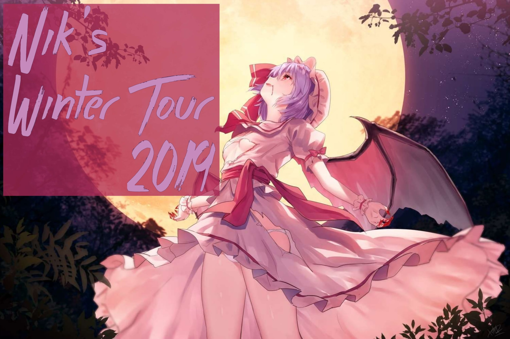

---
tags:
  - NWT 2019
  - NWT2019
---

# nik's Winter Tour 2019

The **nik's Winter Tour 2019** (***NWT 2019***) was a worldwide 1v1 double-elimination osu! tournament hosted by ::{ flag=NL }:: [nikolomara](https://osu.ppy.sh/users/10077264). It was the first instalment of the nik's Tournaments series.

## Tournament schedule

| Event | Timestamp |
| --: | :-- |
| Registration phase | 2018-12-16/2019-01-07 |
| Live drawings | 2019-01-13 (19:00 UTC) |
| Qualifiers stage | 2019-01-19/2019-01-20 |
| Round of 32 | 2019-01-26/2019-01-27 |
| Round of 16 | 2019-01-29/2019-02-11 |
| Quarterfinals | 2019-02-16/2019-02-17 |
| Semifinals | 2019-02-23/2019-03-02 |
| Finals | 2019-03-03/2019-03-10 |

## Prizes

| Placing | Prize(s) |
| :-: | :-- |
|  | 4 months of osu!supporter, unique profile badge |
|  | 2 months of osu!supporter |
|  | 1 month of osu!supporter |

## Organisation

The nik's Winter Tour 2019 was run by various community members.

| Position | Member(s) |
| :-- | :-- |
| Manager | ::{ flag=NL }:: [nikolomara](https://osu.ppy.sh/users/10077264) |
| Admin | ::{ flag=US }:: [tigereyes144](https://osu.ppy.sh/users/6499811), ::{ flag=GB }:: [vita2](https://osu.ppy.sh/users/10706998) |
| Mappool selector | ::{ flag=US }:: [dblade](https://osu.ppy.sh/users/4272841), ::{ flag=US }:: [tigereyes144](https://osu.ppy.sh/users/6499811), ::{ flag=GB }:: [vita2](https://osu.ppy.sh/users/10706998) |
| Referee | ::{ flag=FR }:: [\[ Mimir \]](https://osu.ppy.sh/users/7382734), ::{ flag=DE }:: [Arekkuso](https://osu.ppy.sh/users/9287979), ::{ flag=PL }:: [Asasyn01](https://osu.ppy.sh/users/8013323), ::{ flag=US }:: [Dios Dong](https://osu.ppy.sh/users/3958619), ::{ flag=KR }:: [Hal\[Cyon\]](https://osu.ppy.sh/users/9740893), ::{ flag=DE }:: [hi-def](https://osu.ppy.sh/users/10697191), ::{ flag=FR }:: [Kasumii-sama](https://osu.ppy.sh/users/6177263), ::{ flag=AU }:: [loler123903](https://osu.ppy.sh/users/8034438), ::{ flag=SE }:: [Melwoine](https://osu.ppy.sh/users/12091109), ::{ flag=NL }:: [nikolomara](https://osu.ppy.sh/users/10077264), ::{ flag=US }:: [Poke\_player](https://osu.ppy.sh/users/6502279), ::{ flag=GB }:: [Snipe The Neko](https://osu.ppy.sh/users/8638531), ::{ flag=VN }:: [steve\_04\_](https://osu.ppy.sh/users/10852911), ::{ flag=US }:: [tigereyes144](https://osu.ppy.sh/users/6499811), ::{ flag=GB }:: [vita2](https://osu.ppy.sh/users/10706998), ::{ flag=DE }:: [WitchOfFrost](https://osu.ppy.sh/users/7511840), ::{ flag=RU }:: [Xassie](https://osu.ppy.sh/users/7958911) |
| Streamer | ::{ flag=US }:: [Dios Dong](https://osu.ppy.sh/users/3958619), ::{ flag=FR }:: [Kaeldori](https://osu.ppy.sh/users/962519), ::{ flag=VN }:: [steve\_04\_](https://osu.ppy.sh/users/10852911), ::{ flag=DE }:: [WitchOfFrost](https://osu.ppy.sh/users/7511840) |
| Commentator | ::{ flag=US }:: [Dios Dong](https://osu.ppy.sh/users/3958619), ::{ flag=DE }:: [hi-def](https://osu.ppy.sh/users/10697191), ::{ flag=NL }:: [Just Lucan](https://osu.ppy.sh/users/5007943), ::{ flag=DE }:: [WitchOfFrost](https://osu.ppy.sh/users/7511840), ::{ flag=US }:: [YoshiLover456](https://osu.ppy.sh/users/6843383) |
| Designer | ::{ flag=US }:: [\_p0ke\_](https://osu.ppy.sh/users/5434711), ::{ flag=US }:: [Cindelluna](https://osu.ppy.sh/users/3039847) |
| Statistician | ::{ flag=NL }:: [nikolomara](https://osu.ppy.sh/users/10077264) |
| Wiki editor | ::{ flag=ID }:: [fajar13k](https://osu.ppy.sh/users/7100002) |

## Links

- [Discussion thread](https://osu.ppy.sh/community/forums/topics/842334)
- [NT Discord server](https://discord.gg/wrwZWRS)
- [Livestream](https://www.twitch.tv/niks_tournaments)
- [NWT 2019 Challonge brackets](https://challonge.com/NWT2019)
- **[Statistics sheet](https://docs.google.com/spreadsheets/d/e/2PACX-1vSaXkpCBB_gcPcEEOq93pmLHiOTUf_3n1LYju7NbGF61h5QK19CTuuP2BFBdaOPL-d2UWb06i6iD-wD/pubhtml)**

## Participants

| Seed | Members |
| :-- | :-- |
| Top | ::{ flag=US }:: [Fish-](https://osu.ppy.sh/users/3318654), ::{ flag=AU }:: [loveleft](https://osu.ppy.sh/users/9240047), ::{ flag=DE }:: [\[Lucky\]](https://osu.ppy.sh/users/1303685), ::{ flag=US }:: [\_p0ke\_](https://osu.ppy.sh/users/5434711), ::{ flag=RU }:: [Liswiera](https://osu.ppy.sh/users/9356954), ::{ flag=US }:: [YoshiLover456](https://osu.ppy.sh/users/6843383), ::{ flag=RU }:: [DeSconTent](https://osu.ppy.sh/users/7995027), ::{ flag=TW }:: [\_kyuu](https://osu.ppy.sh/users/3416783) |
| High | ::{ flag=IT }:: [Proioxis](https://osu.ppy.sh/users/9503564), ::{ flag=UA }:: [Zertus](https://osu.ppy.sh/users/5875469), ::{ flag=KR }:: [pseudophilia](https://osu.ppy.sh/users/6192650), ::{ flag=KR }:: [woobin5004](https://osu.ppy.sh/users/1755215), ::{ flag=US }:: [San Diego](https://osu.ppy.sh/users/3993153) ,::{ flag=PL }:: [lokser](https://osu.ppy.sh/users/4675441), ::{ flag=DE }:: [Menty](https://osu.ppy.sh/users/3619284), ::{ flag=US }:: [Raoul](https://osu.ppy.sh/users/9924405) |
| Low | ::{ flag=US }:: [F1shbowl](https://osu.ppy.sh/users/10129737), ::{ flag=ID }:: [Xicyte](https://osu.ppy.sh/users/10212581), ::{ flag=US }:: [lahwraN](https://osu.ppy.sh/users/6995880), ::{ flag=CA }:: [Xeli](https://osu.ppy.sh/users/4947796), ::{ flag=AT }:: [Snajper](https://osu.ppy.sh/users/4211027), ::{ flag=US }:: [themaster156](https://osu.ppy.sh/users/3845254), ::{ flag=PL }:: [bart6003](https://osu.ppy.sh/users/2100107), ::{ flag=AU }:: [Pictures](https://osu.ppy.sh/users/4578623) |
| Unseeded | ::{ flag=ID }:: [NoVaLian](https://osu.ppy.sh/users/6459827), ::{ flag=DE }:: [Kawaii Kaneki](https://osu.ppy.sh/users/3344333), ::{ flag=CA }:: [deflateddolphin](https://osu.ppy.sh/users/10184558), ::{ flag=NO }:: [Defectum](https://osu.ppy.sh/users/8631719), ::{ flag=US }:: [Tuco](https://osu.ppy.sh/users/11706350), ::{ flag=RU }:: [Nentse](https://osu.ppy.sh/users/8559485), ::{ flag=FI }:: [Roba](https://osu.ppy.sh/users/5210561), ::{ flag=VN }:: [Mayukaki](https://osu.ppy.sh/users/1487263) |

## Podium

This competition has come to an end and resulted in the following podium:

| Placing | Player |
| :-: | :-- |
|  | ::{ flag=US }:: [Fish-](https://osu.ppy.sh/users/3318654) |
|  | ::{ flag=AU }:: [loveleft](https://osu.ppy.sh/users/9240047) |
|  | ::{ flag=DE }:: [\[Lucky\]](https://osu.ppy.sh/users/1303685) |

## Mappools

### Finals

**[Download the map pack here! (123 MB)](https://www.mediafire.com/file/9835f3t5z8xa3a0/Grand+Finals+Pool.zip)**

- NoMod
  1. [yuikonnu - Kakushigoto (AtHeoN) \[Asaiga's Extra\]](https://osu.ppy.sh/beatmapsets/436177#osu/1698115)
  2. [sky\_delta - Cryonix (captin1) \[Another\]](https://osu.ppy.sh/beatmapsets/486599#osu/1037583)
  3. [USAO - Night sky (sukiNathan) \[handsome's Master\]](https://osu.ppy.sh/beatmapsets/396994#osu/863542)
  4. [M2U - Masquerade (Melt) \[Extra\]](https://osu.ppy.sh/beatmapsets/124857#osu/356030)
  5. [JYOCHO - Taiyou to Kurashite Kita (dsco) \[Bloom\]](https://osu.ppy.sh/beatmapsets/600881#osu/1269564)
- Hidden
  1. [DJ S3RL - T-T-Techno (feat. Jesskah) (nold\_1702) \[Technonationalism\]](https://osu.ppy.sh/beatmapsets/83560#osu/655794)
  2. [solfa feat. Shimotsuki Haruka - leap in your mind (Lasse) \[Kalibe's Extra\]](https://osu.ppy.sh/beatmapsets/818672#osu/1717390)
  3. [SHK - Death Moon II (ktgster) \[SHD\]](https://osu.ppy.sh/beatmapsets/472158#osu/1009022)
- HardRock
  1. [TWICE - Candy Pop (iYiyo) \[Lollipop\]](https://osu.ppy.sh/beatmapsets/718989#osu/1518394)
  2. [Sota Fujimori - Move That Body (vita2) \[HARDTECH\]](https://osu.ppy.sh/beatmapsets/920567#osu/1922427)
  3. [Rise Against - Savior (pishifat) \[Insane\]](https://osu.ppy.sh/beatmapsets/509675#osu/1126558)
- DoubleTime
  1. [DJ Noriken - Stargazer feat. YUC'e (PSYQUI Remix) (-Jordan-) \[lewdski's Hyper\]](https://osu.ppy.sh/beatmapsets/853867#osu/1784486)
  2. [SoundTeMP - Dreamer's Dream (P A N) \[NatsuPoi's Insane\]](https://osu.ppy.sh/beatmapsets/350381#osu/773229)
  3. [Eru - Heian no Alien (Vass\_Bass) \[Vass-RJ's Insane\]](https://osu.ppy.sh/beatmapsets/116669#osu/300923)
- FreeMod
  1. [DJ Sharpnel - IVALTEK (happy30) \[HappyMiX\]](https://osu.ppy.sh/beatmapsets/50429#osu/154988)
  2. [toby fox & RichaadEB - Megalovania Dual Mix (Fatfan Kolek) \[Insane\]](https://osu.ppy.sh/beatmapsets/763337#osu/1605059)
  3. [Shounen Radio - neu (Philippines) \[Gold\]](https://osu.ppy.sh/beatmapsets/58422#osu/180104)
- Tiebreaker
  1. **[Yousei Teikoku - Kokou no Sousei (Kalibe) \[Despair\]](https://osu.ppy.sh/beatmapsets/744554#osu/1569836)**

### Semifinals

**[Download the map pack here! (103 MB)](https://www.mediafire.com/file/b1jjruemesunoxe/Semi+Finals+Pool.zip)**

- NoMod
  1. [Feryquitous feat. Aitsuki Nakuru - Kairikou (Ryuusei Aika) \[Miura's Extra\]](https://osu.ppy.sh/beatmapsets/740862#osu/1562893)
  2. [Nekomata Master+ - Proof of the existence (Alheak) \[Expert\]](https://osu.ppy.sh/beatmapsets/427864#osu/923589)
  3. [Camellia - Routing (Mir) \[Lasse's Extra\]](https://osu.ppy.sh/beatmapsets/663255#osu/1405185)
  4. [Renard - Da Nu Nuttah (GamerX4life) \[Xtreme\]](https://osu.ppy.sh/beatmapsets/62665#osu/185784)
  5. [Swan Lake Orchestra - Hakuchou no Mizuumi (AngelHoney) \[Another\]](https://osu.ppy.sh/beatmapsets/25922#osu/87728)
- Hidden
  1. [Alfakyun. x Camellia - calling (ProfessionalBox) \[Kalirink's Andantino\]](https://osu.ppy.sh/beatmapsets/523558#osu/1171696)
  2. [DJ TOTTO - Crystalia (Hysteria) \[Owens' Another\]](https://osu.ppy.sh/beatmapsets/691220#osu/1500846)
- HardRock
  1. [Aya Ishihara - Reset (Full ver) (Bikko) \[Insane\]](https://osu.ppy.sh/beatmapsets/16641#osu/59993)
  2. [RADWIMPS - Hikari (Haruto) \[Ipas' Expert\]](https://osu.ppy.sh/beatmapsets/547714#osu/1171123)
- DoubleTime
  1. [07th Expansion - goldenslaughterer (La Cataline) \[Hard\]](https://osu.ppy.sh/beatmapsets/37729#osu/121197)
  2. [Shoujo Fractal - Hatenaki Kaze no Kiseki sae (-Mo-) \[Hard\]](https://osu.ppy.sh/beatmapsets/463701#osu/1015224)
- FreeMod
  1. [TAG underground - POSSESSION (miccoliasms) \[EXPERT\]](https://osu.ppy.sh/beatmapsets/40306#osu/127944)
  2. [sak respect for Arata Iiyoshi - Reason of being (CookieBite) \[Cookie M i N's EXTREME\]](https://osu.ppy.sh/beatmapsets/640558#osu/1440742)
  3. [Nizikawa - F.K.S (Necroluttah) \[INFINITE\]](https://osu.ppy.sh/beatmapsets/345519#osu/764510)
- Tiebreaker
  1. **[Katakiri Rekka - Moe Ochiru Hokori -Counter raid Another D- (\[ Sharuresu \]) \[Final Retribution\]](https://osu.ppy.sh/beatmapsets/511505#osu/1087337)**

### Quarterfinals

**[Download the map pack here! (115 MB)](https://www.mediafire.com/file/8jip2t4vltq7qht/QF+Pool.zip)**

- NoMod
  1. [Asakura Momo - Ashita wa Kimi to. (domSaur) \[Tomorrow.\]](https://osu.ppy.sh/beatmapsets/748013#osu/1575968)
  2. [ZUN - Kobito of the Shining Needle \~ Little Princess (sjoy) \[Extra\]](https://osu.ppy.sh/beatmapsets/111611#osu/306018)
  3. [GFRIEND - Sunny Summer (Sidetail) \[Extra\]](https://osu.ppy.sh/beatmapsets/824392#osu/1727534)
  4. [Expander - aura (Midge) \[Kotori's Extreme\]](https://osu.ppy.sh/beatmapsets/281721#osu/647519)
  5. [Rin - Mythic set \~ Heart-Stirring Urban Legends (yaspo) \[mithew's Extra\]](https://osu.ppy.sh/beatmapsets/676064#osu/1429979)
- Hidden
  1. [Amane - BOOZEHOUND (tieff) \[Lesjuh\]](https://osu.ppy.sh/beatmapsets/9995#osu/39549)
  2. [Camellia - racemization (Squigly) \[deetz' Insane\]](https://osu.ppy.sh/beatmapsets/373363#osu/897862)
- HardRock
  1. [senya - Akatsuki no Suiheisen ni (Satellite) \[Zweib's Insane\]](https://osu.ppy.sh/beatmapsets/242360#osu/559448)
  2. [BlackY vs. Yooh - HAVOX (Timorisu) \[EXHAUST\]](https://osu.ppy.sh/beatmapsets/352555#osu/1294881)
- DoubleTime
  1. [FELT - Little Nova (\_83) \[Saigyou Ayakashi\]](https://osu.ppy.sh/beatmapsets/600882#osu/1269565)
  2. [UNDEAD CORPORATION - Yoru Naku Usagi wa Yume wo Miru (Strawberry) \[Hard\]](https://osu.ppy.sh/beatmapsets/59049#osu/214249)
- FreeMod
  1. [IOSYS - Poinsettia (Aakiha) \[Lunatic\]](https://osu.ppy.sh/beatmapsets/18382#osu/65233)
  2. [Himeringo - Yotsuya-san ni Yoroshiku (RLC) \[Insane\]](https://osu.ppy.sh/beatmapsets/100049#osu/351993)
  3. [LeaF - Alice in Misanthrope -Ensei Alice- (eiri-) \[Uberzolik's Insane\]](https://osu.ppy.sh/beatmapsets/782989#osu/1644003)
- Tiebreaker
  1. **[Taishi - Aviator in the Soul (-Tochi) \[Endurance\]](https://osu.ppy.sh/beatmapsets/675666#osu/1429225)**

### Round of 16

**[Download the map pack here! (119 MB)](https://www.mediafire.com/file/6par0x0hr7rerws/RO16+Pool.zip)**

- NoMod
  1. [Manami Numakura - Sakebe (Mishima Yurara) \[Mikii's Extra\]](https://osu.ppy.sh/beatmapsets/550344#osu/1451747)
  2. [TeamGrimoire+Amaneko - croiX (HelloSCV) \[EXHAUST\]](https://osu.ppy.sh/beatmapsets/88692#osu/241578)
  3. [Streetlight Manifesto - Everything Went Numb (pishifat) \[Milan-'s Manly Insane\]](https://osu.ppy.sh/beatmapsets/414289#osu/904077)
  4. [Nekomata Master - Greening (Lulu-) \[Tranquility\]](https://osu.ppy.sh/beatmapsets/530173#osu/1482351)
  5. [Kikuo - Neko no Shokutaku (Axaptice) \[Meow :3\]](https://osu.ppy.sh/beatmapsets/824981#osu/1728764)
- Hidden
  1. [Yousei Teikoku - Deep Sea (EvilElvisV2) \[LC\]](https://osu.ppy.sh/beatmapsets/104260#osu/274365)
  2. [Camellia - overcomplexification (Squigly) \[Yauxo's Another\]](https://osu.ppy.sh/beatmapsets/351877#osu/808479)
- HardRock
  1. [yuikonnu & ayaponzu\* - Super Nuko World (AllStar12) \[Insane\]](https://osu.ppy.sh/beatmapsets/153776#osu/476149)
  2. [CELLON. - Labyrinth of Darkness (Mir) \[Insane\]](https://osu.ppy.sh/beatmapsets/778383#osu/1639264)
- DoubleTime
  1. [senya - Glass-like Psychology (eLtigreXXx) \[Lunatic\]](https://osu.ppy.sh/beatmapsets/47065#osu/167880)
  2. [Cranky - Hanaarashi (Mirash) \[Hard\]](https://osu.ppy.sh/beatmapsets/751771#osu/1582581)
- FreeMod
  1. [daniwellP - Nyanyanyanyanyanyanya! (theowest) \[Collab\]](https://osu.ppy.sh/beatmapsets/31419#osu/103281)
  2. [Hatsuki Yura - Shoujo to Ougonryuu no Monogatari (Garden) \[Collab Insane\]](https://osu.ppy.sh/beatmapsets/719158#osu/1542952)
  3. [sakuzyo - VALLISTA (Shiirn) \[Another\]](https://osu.ppy.sh/beatmapsets/40056#osu/127313)
- Tiebreaker
  1. **[AAAA - Bokutachi no Tabi to Epilogue.\[Long ver.\] (Battle) \[Conclusion\]](https://osu.ppy.sh/beatmapsets/420016#osu/908800)**

### Round of 32

**[Download the map pack here! (92 MB)](https://mega.nz/#!ejByjCBb!rIoNtWLzLrRlDoeBiBBV5xwqXq5PvnPiN1DbRAhj-bA)**

- NoMod
  1. [The Winking Owl - Bloom (Shmiklak) \[Lokidoki's Another\]](https://osu.ppy.sh/beatmapsets/602408#osu/1321786)
  2. [Duoscience - Indifferences (Mir) \[Ametrin's Insane\]](https://osu.ppy.sh/beatmapsets/722662#osu/1538481)
  3. [ak+q - Excelsia (Elsa Valentine) \[newton's Insane\]](https://osu.ppy.sh/beatmapsets/708305#osu/1497525)
  4. [PUP - DVP (Hobbes2) \[Lasse's Insane\]](https://osu.ppy.sh/beatmapsets/756815#osu/1600995)
  5. [REDALiCE - Great Nano Desu (fartownik) \[HAUUU!\]](https://osu.ppy.sh/beatmapsets/7691#osu/32619)
- Hidden
  1. [xi - Zauberkugel (pishifat) \[Insane\]](https://osu.ppy.sh/beatmapsets/554892#osu/1296762)
  2. [K/DA - POP/STARS (ft. Madison Beer, (G)I-DLE, Jaira Burns) (Nathan) \[Sing's Insane\]](https://osu.ppy.sh/beatmapsets/874948#osu/1828557)
- HardRock
  1. [sakuzyo - ChaiN De/structioN (siilento's solid remix) (Ryuusei Aika) \[Beom's Insane\]](https://osu.ppy.sh/beatmapsets/531385#osu/1208456)
  2. [Gentle Stick X M2U - Ineffabilis (buhei) \[-kevincela-'s Insane\]](https://osu.ppy.sh/beatmapsets/340903#osu/766504)
- DoubleTime
  1. [SYNC.ART'S - Splendid Encount -one more encore- (KanaRin) \[Kana x Karen\]](https://osu.ppy.sh/beatmapsets/27915#osu/97024)
  2. [FELT - Hail Storm (Kite) \[Challenging\]](https://osu.ppy.sh/beatmapsets/122349#osu/312973)
- FreeMod
  1. [Hitori Tori - perthed again (yambabom remix) (Asphyxia) \[Frey's Insane\]](https://osu.ppy.sh/beatmapsets/268693#osu/678347)
  2. [Getty vs. DJ DiA - DropZ-Line- (Realazy) \[pocket-'s Insane\]](https://osu.ppy.sh/beatmapsets/727049#osu/1551753)
  3. [Kurokotei - Valkyrie Attack (Shyotamaze) \[Insane\]](https://osu.ppy.sh/beatmapsets/643961#osu/1364957)
- Tiebreaker
  1. **[Dancing Dolls - monochrome(Asterisk Makina Remix) (monstrata) \[Scythe\]](https://osu.ppy.sh/beatmapsets/349445#osu/770576)**

## Match results

### Finals

Saturday, 2 March 2019:

| Player 1 |  |  | Player 2 | Match link |
| --: | :-: | :-: | :-- | :-- |
| **Fish-** ::{ flag=US }:: | **7** | 0 | ::{ flag=DE }:: \[Lucky\] | [#1](https://osu.ppy.sh/community/matches/49975374) |

Sunday, 3 March 2019:

| Player 1 |  |  | Player 2 | Match link |
| --: | :-: | :-: | :-- | :-- |
| **loveleft** ::{ flag=AU }:: | **7** | 3 | ::{ flag=RU }:: Liswiera | [#1](https://osu.ppy.sh/community/matches/49993367) |

Saturday, 9 March 2019:

| Player 1 |  |  | Player 2 | Match link |
| --: | :-: | :-: | :-- | :-- |
| \[Lucky\] ::{ flag=DE }:: | 1 | **7** | ::{ flag=AU }:: **loveleft** | [#1](https://osu.ppy.sh/community/matches/50138167) |

Sunday, 10 March 2019:

| Player 1 |  |  | Player 2 | Match link |
| --: | :-: | :-: | :-- | :-- |
| **Fish-** ::{ flag=US }:: | **7** | 3 | ::{ flag=AU }:: loveleft | [#1](https://osu.ppy.sh/community/matches/50184333) |

### Semifinals

Saturday, 23 February 2019:

| Player 1 |  |  | Player 2 | Match link |
| --: | :-: | :-: | :-- | :-- |
| **\[Lucky\]** ::{ flag=DE }:: | **6** | 0 | ::{ flag=AU }:: loveleft | *win by default* |
| **\_kyuu** ::{ flag=TW }:: | **6** | 2 | ::{ flag=PL }:: lokser | [#1](https://osu.ppy.sh/community/matches/49798965) |
| **Fish-** ::{ flag=US }:: | **6** | 4 | ::{ flag=RU }:: Liswiera | [#1](https://osu.ppy.sh/community/matches/49802732) |
| **YoshiLover456** ::{ flag=US }:: | **6** | 2 | ::{ flag=PL }:: bart6003 | [#1](https://osu.ppy.sh/community/matches/49806211) |

Sunday, 24 February 2019:

| Player 1 |  |  | Player 2 | Match link |
| --: | :-: | :-: | :-- | :-- |
| **loveleft** ::{ flag=AU }:: | **6** | 5 | ::{ flag=TW }:: \_kyuu | [#1](https://osu.ppy.sh/community/matches/49823110) |

Saturday, 2 March 2019:

| Player 1 |  |  | Player 2 | Match link |
| --: | :-: | :-: | :-- | :-- |
| **Liswiera** ::{ flag=RU }:: | **6** | 4 | ::{ flag=US }:: YoshiLover456 | [#1](https://osu.ppy.sh/community/matches/49939657) |

### Quarterfinals

Saturday, 16 February 2019:

| Player 1 |  |  | Player 2 | Match link |
| --: | :-: | :-: | :-- | :-- |
| Tuco ::{ flag=US }:: | 2 | **5** | ::{ flag=DE }:: **Menty** | [#1](https://osu.ppy.sh/community/matches/49605900) |
| **Fish-** ::{ flag=US }:: | **5** | 1 | ::{ flag=TW }:: \_kyuu | [#1](https://osu.ppy.sh/community/matches/49622148) |
| San Diego ::{ flag=US }:: | 0 | **5** | ::{ flag=RU }:: **Liswiera** | [#1](https://osu.ppy.sh/community/matches/49627344) |
| F1shbowl ::{ flag=US }:: | 2 | **5** | ::{ flag=PL }:: **lokser** | [#1](https://osu.ppy.sh/community/matches/49632843) |
| **Snajper** ::{ flag=AT }:: | **5** | 0 | ::{ flag=US }:: \_p0ke\_ | *win by default* |
| **\[Lucky\]** ::{ flag=DE }:: | **5** | 3 | ::{ flag=US }:: YoshiLover456 | [#1](https://osu.ppy.sh/community/matches/49636497) |
| lahwraN ::{ flag=US }:: | 4 | **5** | ::{ flag=US }:: **Raoul** | [#1](https://osu.ppy.sh/community/matches/49639492) |
| **loveleft** ::{ flag=AU }:: | **5** | 1 | ::{ flag=PL }:: bart6003 | [#1](https://osu.ppy.sh/community/matches/49644911) |

Sunday, 17 February 2019:

| Player 1 |  |  | Player 2 | Match link |
| --: | :-: | :-: | :-- | :-- |
| **\_kyuu** ::{ flag=TW }:: | **5** | 2 | ::{ flag=DE }:: Menty | [#1](https://osu.ppy.sh/community/matches/49663701) |
| San Diego ::{ flag=US }:: | 1 | **5** | ::{ flag=PL }:: **lokser** | [#1](https://osu.ppy.sh/community/matches/49665235) |
| **YoshiLover456** ::{ flag=US }:: | **5** | 2 | ::{ flag=AT }:: Snajper | [#1](https://osu.ppy.sh/community/matches/49665372) |
| **bart6003** ::{ flag=PL }:: | **5** | 2 | ::{ flag=US }:: Raoul | [#1](https://osu.ppy.sh/community/matches/49666837) |

### Round of 16

Monday, 29 January 2019:

| Player 1 |  |  | Player 2 | Match link |
| --: | :-: | :-: | :-- | :-- |
| **Fish-** ::{ flag=US }:: | **4** | 0 | ::{ flag=US }:: Raoul | *win by default* |

Saturday, 2 February 2019:

| Player 1 |  |  | Player 2 | Match link |
| --: | :-: | :-: | :-- | :-- |
| **Tuco** ::{ flag=US }:: | **5** | 1 | ::{ flag=CA }:: Xeli | [#1](https://osu.ppy.sh/community/matches/49295482) |
| **YoshiLover456** ::{ flag=US }:: | **5** | 4 | ::{ flag=US }:: themaster156 | [#1](https://osu.ppy.sh/community/matches/49298642) |
| Mayukaki ::{ flag=VN }:: | 2 | **5** | ::{ flag=US }:: **F1shbowl** | [#1](https://osu.ppy.sh/community/matches/49300165) |
| **Defectum** ::{ flag=NO }:: | **5** | 4 | ::{ flag=KR }:: woobin5004 | [#1](https://osu.ppy.sh/community/matches/49307640) |
| **lahwraN** ::{ flag=US }:: | **5** | 0 | ::{ flag=RU }:: Nentse | [#1](https://osu.ppy.sh/community/matches/49314408) |
| DeSconTent ::{ flag=RU }:: | 0 | **5** | ::{ flag=PL }:: **bart6003** | [#1](https://osu.ppy.sh/community/matches/49316500) |

Sunday, 3 February 2019:

| Player 1 |  |  | Player 2 | Match link |
| --: | :-: | :-: | :-- | :-- |
| \_p0ke\_ ::{ flag=US }:: | 2 | **5** | ::{ flag=US }:: **San Diego** | [#1](https://osu.ppy.sh/community/matches/49326174) |
| **deflateddolphin** ::{ flag=CA }:: | **5** | 4 | ::{ flag=KR }:: pseudophilia | [#1](https://osu.ppy.sh/community/matches/49326850) |
| NoVaLian ::{ flag=ID }:: | 3 | **5** | ::{ flag=US }:: **Pictures** | [#1](https://osu.ppy.sh/community/matches/49329223) |
| **Roba** ::{ flag=FI }:: | **5** | 2 | ::{ flag=ID }:: Xicyte | [#1](https://osu.ppy.sh/community/matches/49332890) |
| **\_kyuu** ::{ flag=TW }:: | **5** | 2 | ::{ flag=IT }:: Proioxis | [#1](https://osu.ppy.sh/community/matches/49333832) |
| **Liswiera** ::{ flag=RU }:: | **5** | 2 | ::{ flag=AT }:: Snajper | [#1](https://osu.ppy.sh/community/matches/49334899) |
| **loveleft** ::{ flag=AU }:: | **5** | 0 | ::{ flag=DE }:: Menty | [#1](https://osu.ppy.sh/community/matches/49337622) |
| **\[Lucky\]** ::{ flag=DE }:: | **5** | 0 | ::{ flag=PL }:: lokser | [#1](https://osu.ppy.sh/community/matches/49340098) |

Monday, 4 February 2019:

| Player 1 |  |  | Player 2 | Match link |
| --: | :-: | :-: | :-- | :-- |
| Kawaii Kaneki ::{ flag=DE }:: | 0 | **5** | ::{ flag=UA }:: **Zertus** | *win by default* |
| Defectum ::{ flag=NO }:: | 5 | **4** | ::{ flag=KR }:: **woobin5004** | *win by default* |

Friday, 8 February 2019:

| Player 1 |  |  | Player 2 | Match link |
| --: | :-: | :-: | :-- | :-- |
| **Menty** ::{ flag=DE }:: | **5** | 2 | ::{ flag=KR }:: woobin5004 | [#1](https://osu.ppy.sh/community/matches/49441997) |

Saturday, 9 February 2019:

| Player 1 |  |  | Player 2 | Match link |
| --: | :-: | :-: | :-- | :-- |
| DeSconTent ::{ flag=RU }:: | 3 | **5** | ::{ flag=US }:: **Tuco** | [#1](https://osu.ppy.sh/community/matches/49446157) |
| **\_p0ke\_** ::{ flag=US }:: | **5** | 0 | ::{ flag=UA }:: Zertus | [#1](https://osu.ppy.sh/community/matches/49449482) |
| themaster156 ::{ flag=US }:: | 0 | **5** | ::{ flag=US }:: **F1shbowl** | [#1](https://osu.ppy.sh/community/matches/49459554) |
| **lokser** ::{ flag=PL }:: | **5** | 2 | ::{ flag=AU }:: Pictures | [#1](https://osu.ppy.sh/community/matches/49464388) |

Sunday, 10 February 2019:

| Player 1 |  |  | Player 2 | Match link |
| --: | :-: | :-: | :-- | :-- |
| **Snajper** ::{ flag=AT }:: | **5** | 2 | ::{ flag=FI }:: Roba | [#1](https://osu.ppy.sh/community/matches/49474191) |

Monday, 11 February 2019:

| Player 1 |  |  | Player 2 | Match link |
| --: | :-: | :-: | :-- | :-- |
| **Raoul** ::{ flag=US }:: | **5** | 0 | ::{ flag=CA }:: deflateddolphin | [#1](https://osu.ppy.sh/community/matches/49504744) |
| Proioxis ::{ flag=IT }:: | 3 | **5** | ::{ flag=US }:: **lahwraN** | [#1](https://osu.ppy.sh/community/matches/49505992) |

### Round of 32

Saturday, 26 January 2019:

| Player 1 |  |  | Player 2 | Match link |
| --: | :-: | :-: | :-- | :-- |
| **lokser** ::{ flag=PL }:: | **4** | 0 | ::{ flag=US }:: lahwraN | [#1](https://osu.ppy.sh/community/matches/49122983) |
| **bart6003** ::{ flag=PL }:: | **4** | 0 | ::{ flag=UA }:: Zertus | [#1](https://osu.ppy.sh/community/matches/49123006) |
| **\_p0ke\_** ::{ flag=US }:: | **4** | 1 | ::{ flag=US }:: Tuco | [#1](https://osu.ppy.sh/community/matches/49132589) |
| **\_kyuu** ::{ flag=TW }:: | **4** | 2 | ::{ flag=ID }:: NoVaLian | [#1](https://osu.ppy.sh/community/matches/49136507) |
| **loveleft** ::{ flag=AU }:: | **4** | 0 | ::{ flag=FI }:: Roba | [#1](https://osu.ppy.sh/community/matches/49141496) |
| **Fish-** ::{ flag=US }:: | **4** | 0 | ::{ flag=VN }:: Mayukaki | [#1](https://osu.ppy.sh/community/matches/49142750) |
| **Snajper** ::{ flag=AT }:: | **4** | 0 | ::{ flag=KR }:: woobin5004 | [#1](https://osu.ppy.sh/community/matches/49144094) |
| **Liswiera** ::{ flag=RU }:: | **4** | 1 | ::{ flag=NO }:: Defectum | [#1](https://osu.ppy.sh/community/matches/49145618) |

Sunday, 27 January 2019:

| Player 1 |  |  | Player 2 | Match link |
| --: | :-: | :-: | :-- | :-- |
| **\[Lucky\]** ::{ flag=DE }:: | **4** | 0 | ::{ flag=RU }:: Nentse | [#1](https://osu.ppy.sh/community/matches/49150866) |
| **Menty** ::{ flag=DE }:: | **4** | 0 | ::{ flag=ID }:: Xicyte | [#1](https://osu.ppy.sh/community/matches/49150859) |
| **YoshiLover456** ::{ flag=US }:: | **4** | 0 | ::{ flag=CA }:: deflateddolphin | [#1](https://osu.ppy.sh/community/matches/49160543) |
| **San Diego** ::{ flag=US }:: | **4** | 3 | ::{ flag=CA }:: Xeli | [#1](https://osu.ppy.sh/community/matches/49161560) |
| **Raoul** ::{ flag=US }:: | **4** | 0 | ::{ flag=US }:: F1shbowl | [#1](https://osu.ppy.sh/community/matches/49163747) |
| pseudophilia ::{ flag=KR }:: | 3 | **4** | ::{ flag=US }:: **themaster156** | [#1](https://osu.ppy.sh/community/matches/49163789) |
| **Proioxis** ::{ flag=IT }:: | **4** | 2 | ::{ flag=AU }:: Pictures | [#1](https://osu.ppy.sh/community/matches/49171917) |
| **DeSconTent** ::{ flag=RU }:: | **4** | 1 | ::{ flag=DE }:: Kawaii Kaneki | [#1](https://osu.ppy.sh/community/matches/49181672) |

## Ruleset

### General rules

1. nik's Winter Tour 2019 is a **one-on-one** tournament using **double-elimination bracket** and **Score V2** as its map scoring.
2. Rank range is between **#10,000 - #35,000** and we will be allowing a 1k rank buffer in case of people overranking slightly.
3. Suspicious accounts **will not be accepted into the tournament.** This includes people who have really low playcount or really low hours of playtime.
4. We only accept our Google form link as a way to register.
   - Any other kinds of registration such as: Discord Direct Messages, osu!forum posts, etc **will not count.**
5. Delay toleration are explained below:
   - For a **10 minute** delay you will have your roll automatically lost.
   - For a **15 minute** delay you will have your match automatically lost.
   - Disrespect of your assigned referee, and/or your opponent, will not be tolerated. *(Also applies for the Discord server and towards other staff members)*

### Match procedures

1. At Qualifiers Stage, participants will be assigned to a lobby based on participants' availability and they will play for **score**, not position achieved during the match. This is because NWT 2019 staff will compare your score to everyone in the tournament so as to make it more fair. Participants will play all maps in the pool once.
   - Scores will be rescaled to be up to 1,000,000 and then added up.
   - The top 32 players sorted with their highest score summed, will go through.
   - The mappool consists of: 3 NoMod, 2 Hidden, 2 HardRock, and 2 DoubleTime maps.
2. After passing the Qualifiers Stage, participants will be in the knockout-stage and regarding its winning conditions and numbers of map they have to bann explained as follows:
   - In Round of 32, participants need to win 4 beatmaps to win a match (Best-of-7) and will have to bann 1 map per match.
   - In Round of 16, participants need to win 5 beatmaps to win a match (Best-of-9) and will have to bann 1 map per match.
   - In Quarterfinals, participants need to win 5 beatmaps to win a match (Best-of-9) and will have to bann 2 maps per match.
   - In Semifinals, participants need to win 6 beatmaps to win a match (Best-of-11) and will have to bann 2 maps per match.
   - In the **Finals and Grand Finals**, participants need to win 7 beatmaps to win a match (Best-of-13) and will have to bann 2 maps per match.
