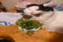
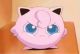
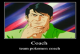

---
tags:
  - OCM 3
  - OCM3
---

# osu! Cup Master 3: osu!catch edition

The **osu! Cup Master 3: osu!catch edition** (***OCM3***) is a a two-on-two team based osu!catch tournament hosted by ::{ flag=PA }:: [Jafett](https://osu.ppy.sh/users/2317102) and ::{ flag=MX }:: [daxeroz](https://osu.ppy.sh/users/1170156). It is the third instalment of the osu! Cup Master.

## Tournament schedule

| Event | Timestamp |
| --: | :-- |
| Registration phase | 2019-12-14/2020-01-25 |
| Live drawings | 2020-02-09 |
| Group stage | 2020-02-15/2020-02-16 |
| Quarterfinals | 2020-02-22/2020-02-23 |
| Semifinals | 2020-02-29/2020-03-01 |
| Finals | 2020-03-07/2020-03-08 |
| Grand Finals | 2020-03-14/2020-03-15 |

## Prizes

| Placing | Prize(s) |
| :-: | :-- |
|  | Unique profile badge (*to be confirmed*) |
|  | 1 month of osu!supporter |
|  | 1 month of osu!supporter |

*Note: The MVP is chosen by the tournament staff after the tournament concludes.*

## Organisation

The osu! Cup Master 3: osu!catch edition tournament is run by various osu! community members.

| Position | Member(s) |
| :-: | :-- |
| Host | ::{ flag=PA }:: [Jafett](https://osu.ppy.sh/users/2317102), ::{ flag=MX }:: [daxeroz](https://osu.ppy.sh/users/1170156) |
| Manager | ::{ flag=CL }:: [Metak](https://osu.ppy.sh/users/2861255) |
| Mappool selector | ::{ flag=MX }:: [daxeroz](https://osu.ppy.sh/users/1170156), ::{ flag=MX }:: [firu](https://osu.ppy.sh/users/10516547) , ::{ flag=CL }:: [lineqtxz](https://osu.ppy.sh/users/989542) |
| Commentator | ::{ flag=PE }:: [-Boltic-](https://osu.ppy.sh/users/5297904), ::{ flag=FR }:: [Rougoku](https://osu.ppy.sh/users/6900166), ::{ flag=CL }:: [lechuguin](https://osu.ppy.sh/users/2872000), ::{ flag=LU }:: [Gae](https://osu.ppy.sh/users/7787785), ::{ flag=ID }:: [dika312](https://osu.ppy.sh/users/741613) |
| Referee | ::{ flag=CL }:: [Hinoshi](https://osu.ppy.sh/users/9200197), ::{ flag=PE }:: [-Boltic-](https://osu.ppy.sh/users/5297904), ::{ flag=CL }:: [Danilo](https://osu.ppy.sh/users/1350613), ::{ flag=CL }:: [Metak](https://osu.ppy.sh/users/2861255), ::{ flag=UY }:: [Neimex23](https://osu.ppy.sh/users/7293703), ::{ flag=GB }:: [StartAndSelect](https://osu.ppy.sh/users/8720555), ::{ flag=PA }:: [Jafett](https://osu.ppy.sh/users/2317102) |
| Designer | ::{ flag=MX }:: [ShadowMerry](https://osu.ppy.sh/users/3104864) |
| Streamer | ::{ flag=MX }:: [daxeroz](https://osu.ppy.sh/users/1170156), ::{ flag=LU }:: [Gae](https://osu.ppy.sh/users/7787785) |

## Links

- [Discussion thread](https://osu.ppy.sh/community/forums/topics/997764)
- [Livestream](https://www.twitch.tv/osucupmaster)
- [Discord server](https://discord.gg/Y9MKD8m)
- [Twitter](https://twitter.com/CupOsu)

## Participants

|  | Team | Members |
| :-: | :-: | :-- |
|  | Acelga | ::{ flag=CL }:: [eldnl](https://osu.ppy.sh/users/285756), ::{ flag=CL }:: [Aryssiel](https://osu.ppy.sh/users/2389481), ::{ flag=CL }:: [NachoL](https://osu.ppy.sh/users/1250096) |
|  | My blood trail soplica | ::{ flag=PL }:: [Phob](https://osu.ppy.sh/users/6069462), ::{ flag=PL }:: [Mniam](https://osu.ppy.sh/users/6050530), ::{ flag=PL }:: [Verti](https://osu.ppy.sh/users/10674528) |
|  | Los Choripondios | ::{ flag=CL }:: [alluya69](https://osu.ppy.sh/users/2212951), ::{ flag=CL }:: [-Kotaru-](https://osu.ppy.sh/users/9131357), ::{ flag=CL }:: [-Naroh](https://osu.ppy.sh/users/9087831) |
|  | 115 | ::{ flag=ES }:: [Dogma](https://osu.ppy.sh/users/4175333), ::{ flag=DE }:: [bro gamer NR1](https://osu.ppy.sh/users/9573527), ::{ flag=JP }:: [noob desu](https://osu.ppy.sh/users/4808804), ::{ flag=US }:: [ChewyTarTar](https://osu.ppy.sh/users/13978275/fruits) |
|  | Bjirr Squad | ::{ flag=ID }:: [Chiya--](https://osu.ppy.sh/users/7934854), ::{ flag=ID }:: [ZYX_GAME](https://osu.ppy.sh/users/3770612), ::{ flag=ID }:: [Zephirine](https://osu.ppy.sh/users/9629190) |
|  | Iaffi | ::{ flag=CL }:: [Lyna Paulina](https://osu.ppy.sh/users/10434422), ::{ flag=HN }:: [- AnGel](https://osu.ppy.sh/users/12931440), ::{ flag=HN }:: [[-Cris-]](https://osu.ppy.sh/users/14599677) |
|  | wwwww | ::{ flag=AR }:: [-Story-](https://osu.ppy.sh/users/8172283), ::{ flag=AU }:: [Beerus](https://osu.ppy.sh/users/5529199), ::{ flag=GB }:: [Matt_H](https://osu.ppy.sh/users/4067115) |
|  | KNRS | ::{ flag=FR }:: [Noctalium](https://osu.ppy.sh/users/6488167), ::{ flag=FR }:: [Kasumii-sama](https://osu.ppy.sh/users/6177263), ::{ flag=FR }:: [Shyeart](https://osu.ppy.sh/users/2022144), ::{ flag=FR }:: [Rougoku](https://osu.ppy.sh/users/6900166) |
|  | Futa Lovers | ::{ flag=BR }:: [BeyondArea](https://osu.ppy.sh/users/8642224), ::{ flag=BR }:: [S a y u n](https://osu.ppy.sh/users/3770603), ::{ flag=BR }:: [Endou-](https://osu.ppy.sh/users/10792711), ::{ flag=BR }:: [Hanik](https://osu.ppy.sh/users/4533507) |
|  | Smukur es colombiano | ::{ flag=CO }:: [Titan-](https://osu.ppy.sh/users/7855767), ::{ flag=CO }:: [Zyonii](https://osu.ppy.sh/users/9519851), ::{ flag=MX }:: [Cxlucha](https://osu.ppy.sh/users/5063961), ::{ flag=PE }:: [-Boltic-](https://osu.ppy.sh/users/5297904) |
|  | IZAYOI XXX is the captain | ::{ flag=TW }:: [Timewasdeapsea](https://osu.ppy.sh/users/8682905), ::{ flag=TW }:: [IZAYOI XXX](https://osu.ppy.sh/users/3538446), ::{ flag=TW }:: [Psc_IceRain](https://osu.ppy.sh/users/3359485), ::{ flag=TW }:: [qq11123334](https://osu.ppy.sh/users/11807319) |
|  | QT DOKU | ::{ flag=JP }:: [LieLoom](https://osu.ppy.sh/users/4892798), ::{ flag=HK }:: [Novoids](https://osu.ppy.sh/users/5163523), ::{ flag=ID }:: [LeWind](https://osu.ppy.sh/users/9718235), ::{ flag=RU }:: [Kitsunlvy](https://osu.ppy.sh/users/7055384) |
|  | idk lol | ::{ flag=US }:: [Depths](https://osu.ppy.sh/users/3935174), ::{ flag=HK }:: [AutoLs](https://osu.ppy.sh/users/9155988), ::{ flag=US }:: [Secre](https://osu.ppy.sh/users/2306637), ::{ flag=US }:: [diao](https://osu.ppy.sh/users/500696) |
|  | Araganes | ::{ flag=CO }:: [Deley-](https://osu.ppy.sh/users/8291465), ::{ flag=CO }:: [Juansy-](https://osu.ppy.sh/users/12588215), ::{ flag=VE }:: [Hisashi Shimoro](https://osu.ppy.sh/users/6736420) |
|  | Obama's Bizarre adventures | ::{ flag=PL }:: [AmaZ](https://osu.ppy.sh/users/6097002), ::{ flag=PL }:: [Jakkubon](https://osu.ppy.sh/users/3396013), ::{ flag=TW }:: [Sanami](https://osu.ppy.sh/users/1629471), ::{ flag=FI }:: [forgottentaco](https://osu.ppy.sh/users/6109660) |
|  | Retired players comeback | ::{ flag=PL }:: [BoberOfDarkness](https://osu.ppy.sh/users/3427748), ::{ flag=PL }:: [Kosmit](https://osu.ppy.sh/users/1749173), ::{ flag=PL }:: [Krzysiek](https://osu.ppy.sh/users/294277), ::{ flag=PL }:: [schizosvenia](https://osu.ppy.sh/users/4600126) |

## Groups

| Group | Top Seed | High Seed | Low Seed | Unseeded |
| :-: | :-- | :-- | :-- | :-- |
| **A** | Obama's bizarre adventures | Futa Lovers | QT DOKU | Iaffi |
| **B** | wwwww | Araganes | Retired player's comeback | My blood trail soplica |
| **C** | Acelga | Smukur es colombiano | Los Choripondios | IZAYOI XXX is the captain |
| **D** | idk lol | KRNS | Bjirr Squad | 115 |

## Mappools

### Semifinals

**[Download the mappack here! (106 MB)](https://mega.nz/#!rBgjCbTQ!w6slaPCtKT-LiGk7ggZwG11PFmVMAMCxl8o1Yi6Fc4w)**

- NoMod
  1. [Camellia feat. Nanahira - Kansoku Eisei (jonathanlfj) \[Countless\]](https://osu.ppy.sh/beatmapsets/720294#fruits/1520788)
  2. [TOTTO - Onigami (-Ken) \[Overdose\]](https://osu.ppy.sh/beatmapsets/622069#fruits/1311499)
  3. [ilem - Hua Er Na Ji (F D Flourite) \[Overdose\]](https://osu.ppy.sh/beatmapsets/598869#fruits/1265840)
- Hidden
  1. [M2U - Marigold (feat. Guriri) (Hareimu) \[Deif's Overdose\]](https://osu.ppy.sh/beatmapsets/596327#fruits/1270304)
  2. [Sukuzyo - Black Lair (Pizza Kun) \[Fragmentation\]](https://osu.ppy.sh/beatmapsets/165616#fruits/402935)
  3. [Memme - Extreme Fantasy (AngelHoney) \[ExtrA\]](https://osu.ppy.sh/beatmapsets/49459#fruits/152480)
- HardRock
  1. [Tsukikage - Spatto! Spy & Spyce (TV Size) (Petal) \[Ren's Extra\]](https://osu.ppy.sh/beatmapsets/968574#fruits/2028583)
  2. [An - Encryption (HelloSCV) \[Spec's Overdose\]](https://osu.ppy.sh/beatmapsets/96368#fruits/290370)
  3. [bikuko - Crayon (Val0108) \[Crayon\]](https://osu.ppy.sh/beatmapsets/49455#fruits/155164)
- DoubleTime
  1. [ChouCho - Million of Bravery (alienflybot) \[Triumph\]](https://osu.ppy.sh/beatmapsets/1041534#fruits/2176808)
  2. [Noisestorm - Solar (Shiirn) \[Another\]](https://osu.ppy.sh/beatmapsets/33483#fruits/109163)
  3. [Goose house - 18sai (mingmichael) \[Rain\]](https://osu.ppy.sh/beatmapsets/242856#fruits/560408)
- Flashlight
  1. [Machigerita - Fushigi Omocha Gangaradindon (secretgamer) \[Insane\]](https://osu.ppy.sh/beatmapsets/85130#fruits/234105)
  2. [M2U - The Prince of Darkness (TKiller) \[Club Mix\]](https://osu.ppy.sh/beatmapsets/12974#fruits/48589)
- DTB
  1. [ayaponzu* - Super Nuko ni Naritai (Jarvis Gaming) \[Dodge The Beat (Use NF)\]](https://osu.ppy.sh/beatmapsets/998732#fruits/2088909)
  2. [Kobaryo - Tool-Assisted Speedcore (TQBF Frame Advance RMX) (Mismagius) \[Delete The World\]](https://osu.ppy.sh/beatmapsets/782508#fruits/1643106)
- Tiebreaker
  1. **[Camellia - Exit This Earth's Atomosphere (DamnEasy) \[Interspace\]](https://osu.ppy.sh/beatmapsets/866320#fruits/1811280)**

### Quarterfinals

**[Download the mappack here! (120 MB)](https://mega.nz/#!HNZVQIoZ!5iPK6FObu9KaM0XA_EUn-y_nKOz2WTITCk1h-olbvYg)**

- NoMod
  1. [P*light - Ninja (Kyubey) \[Elvis's Donatello\]](https://osu.ppy.sh/beatmapsets/195307#fruits/548376)
  2. [Hyun - Infinity Heaven (Jemzuu) \[Aeternum\]](https://osu.ppy.sh/beatmapsets/1074464#fruits/2248527)
  3. [DJ Nagai feat. A*ru - Benibotan (yf_bmp) \[Another\]](https://osu.ppy.sh/beatmapsets/548679#fruits/1161900)
- Hidden
  1. [Cranky - Lebera me (eiri-) \[IOException's Insane\]](https://osu.ppy.sh/beatmapsets/757813#fruits/1596819)
  2. [556t - Kyuuen no Hana (Kyubey) \[Lunatic\]](https://osu.ppy.sh/beatmapsets/484497#fruits/1033514)
  3. [Akaki Chikai - Smile Skill = Suki Skill (TV Size) (Greaper) \[Overdose\]](https://osu.ppy.sh/beatmapsets/1070009#fruits/2239770)
- HardRock
  1. [Ogura Yui & Tamiyasu Tomoe - LOVE LOVE WARS (Gamu) \[Insane\]](https://osu.ppy.sh/beatmapsets/154915#fruits/380234)
  2. [Tomohito Nishiura - Moonlight Tango (JBHyperion) \[Rain\]](https://osu.ppy.sh/beatmapsets/536001#fruits/1135248)
  3. [04 Limited Sazabys - Squall (Gillstar) \[Loreley's Another\]](https://osu.ppy.sh/beatmapsets/1029349#fruits/2165315)
- DoubleTime
  1. [-45 - Midorigo Queen Bee (Luscent) \[Collapse\]](https://osu.ppy.sh/beatmapsets/1055780#fruits/2206544)
  2. [Akatsuki records - Futari de Aruita Kaerimichi (Zelq) \[Lunatic\]](https://osu.ppy.sh/beatmapsets/1077072#fruits/2253900)
  3. [Itou Kanako - Skyclad no Kansokusha -Remix- (Takos) \[Taka\]](https://osu.ppy.sh/beatmapsets/33323#fruits/110628)
- Flashlight
  1. [Kanawo - Kohaku no Yume (Surano) \[Volta's Platter\]](https://osu.ppy.sh/beatmapsets/411705#fruits/1296545)
  2. [Zun - Necrofantasia (Fight69) \[Lunatic\]](https://osu.ppy.sh/beatmapsets/15812#fruits/70226)
- DTB
  1. [DJ Noriken - Stargazer feat. YUC'e (PSYQUI Remix) (Hishiro Chizuru) \[Starg-Azer isn't so great? Are you kidding me?\]](https://osu.ppy.sh/beatmapsets/718960#fruits/1522511)
  2. [Royal Republic - Getting Along (Jarvis Gaming) \[Dodge The Beat (Use NF)\]](https://osu.ppy.sh/beatmapsets/993372#fruits/2077276)
- Tiebreaker
  1. **[Nekomata Gekidan - Envidia (-Ken) \[Envy\]](https://osu.ppy.sh/beatmapsets/883114#fruits/1846202)**

### Group stage

**[Download the mappack here! (136 MB)](https://mega.nz/#!bJADnIbL!QuXa-kSOKKIxCC8LcQNxOa5rEtGv4Fm8GvD1WqkISWo)**

- NoMod
  1. [Scop - Keppekishou (tutuhaha) \[Dance\]](https://osu.ppy.sh/beatmapsets/70115#fruits/201731)
  2. [Blue Stahli & Nyzzy Nyce - Run The Track (Sinnoh) \[Rain\]](https://osu.ppy.sh/beatmapsets/1071229#fruits/2242235)
  3. [Duck Duck Pony - Shinsetsu (wonjae) \[wonjac's overdose\]](https://osu.ppy.sh/beatmapsets/951270#fruits/1987735)
- Hidden
  1. [Katakiri Rekka - Answer (Jenny) \[Rejection\]](https://osu.ppy.sh/beatmapsets/51947#fruits/159007)
  2. [Krewella & Nucleya - Good On You (Mao) \[Expert\]](https://osu.ppy.sh/beatmapsets/1082851#fruits/2264994)
  3. [Ryu* vs. Sota - Go Beyond!! (Anto) \[Nuvolina's Expert\]](https://osu.ppy.sh/beatmapsets/934522#fruits/2023961)
- HardRock
  1. [RURUTIA - Phronesis (-Luminate) \[Platter\]](https://osu.ppy.sh/beatmapsets/965320#fruits/2022514)
  2. [fourfolium - Hosshii no! (Kisses) \[117's hard\]](https://osu.ppy.sh/beatmapsets/586877#fruits/1485741)
  3. [guna with team kyukkyu - subconsciousness (Snow Note) \[Hyper\]](https://osu.ppy.sh/beatmapsets/151945#fruits/445207)
- DoubleTime
  1. [Yellow Zebra - Melody! (wcx19911123) \[Lunatic\]](https://osu.ppy.sh/beatmapsets/45450#fruits/142099)
  2. [HyuN feat. Aerial - Exodus (Niva) \[Insane\]](https://osu.ppy.sh/beatmapsets/1069611#fruits/2239032)
  3. [yanaginagi - Over and over (TV Size) (Jemzuu) \[Platter\]](https://osu.ppy.sh/beatmapsets/698454#fruits/2228142)
- Flashlight
  1. [44teru-k - Yami ~ Shoujo no Yume , Kyomu no Sekai \~ (AngelHoney) \[Insane\]](https://osu.ppy.sh/beatmapsets/17827#fruits/63435)
  2. [Arm Cannon - Borrow mega nuke (eureka borg worm) (awp) \[Exeter Modem\]](https://osu.ppy.sh/beatmapsets/5317#fruits/26372)
- DTB
  1. [Sakurano Omura (CV: Emiri Kato) - Kirai ippai x Suki ippai (Reanter) \[OPPAI DAME!!!\]](https://osu.ppy.sh/beatmapsets/368991#fruits/808856)
  2. [ETIA. - Knock it Off (Maddy) \[Hyper\]](https://osu.ppy.sh/beatmapsets/89582#fruits/247033)
- Tiebreaker
  1. **[Underveil allstars - Underveil is real!!!.. and we are under.. (Chara) \[\*Together as one, we stay determined!\]](https://osu.ppy.sh/beatmapsets/636920#fruits/1351241)**

## Match results

### Quarterfinals

Saturday, 22 February 2020:

| Bracket | Team A |  |  | Team B | Match link |
| :-: | --: | :-: | :-: | :-- | :-- |
| Winner | \[A1\] Obama's Bizarre adventures | 5 | **6** | **KRNS \[D2\]** | [#1](https://osu.ppy.sh/community/matches/58637682) |
| Winner | **\[C1\] Acelga** | **6** | 1 | My blood trail soplica \[B2\] | [#1](https://osu.ppy.sh/community/matches/58643885) |

Sunday, 23 February 2020:

| Bracket | Team A |  |  | Team B | Match link |
| :-: | --: | :-: | :-: | :-- | :-- |
| Winner | \[B1\] Retired Players comeback | 5 | **6** | **Smukur es colombiano \[C2\]** | [#1](https://osu.ppy.sh/community/matches/58675218) |
| Winner | **\[D1\] idk lol** | **6** | 2 | QT DOKU \[A2\] | [#1](https://osu.ppy.sh/community/matches/58673121) |

### Group stage

Saturday, 22 February 2020:

| Group | Team A |  |  | Team B | Match link |
| :-: | --: | :-: | :-: | :-- | :-- |
| D | **KNRS** | **5** | 0 | Bjirr Squad | [#1](https://osu.ppy.sh/community/matches/58461953) |
| D | Bjirr Squad | 4 | **5** | **115** | [*retired at 4-1*](https://osu.ppy.sh/community/matches/58463519) |
| C | **Acelga** | **5** | 2 | Smukur es colombiano | [#1](https://osu.ppy.sh/community/matches/58495679) |
| A | **Obama's Bizarre adventures** | **5** | 1 | Futa Lovers | [#1](https://osu.ppy.sh/community/matches/58465839) |
| A | **QT DOKU** | **5** | 0 | Iaffi | [#1](https://osu.ppy.sh/community/matches/58465846) |
| C | **Acelga** | **5** | 4 | IZAYOI XXX is the captain | [#1](https://osu.ppy.sh/community/matches/58469275) |
| B | wwwww | 0 | **5** | **My blood trail soplica** | *win by default* |
| B | Araganes | 0 | **5** | **Retired players comeback** | *win by default* |
| C | Los Choripondios | 0 | **5** | **IZAYOI XXX is the captain** | *win by default* |
| C | **Smukur es colombiano** | **5** | 1 | Los Choripondios | [#1](https://osu.ppy.sh/community/matches/58478035) |
| A | **Futa Lovers** | **5** | 0 | Iaffi | [#1](https://osu.ppy.sh/community/matches/58479615) |

Sunday, 16 February 2020:

| Group | Team A |  |  | Team B | Match link |
| :-: | --: | :-: | :-: | :-- | :-- |
| D | **idk lol** | **5** | 3 | Bjirr Squad | [#1](https://osu.ppy.sh/community/matches/58483470) |
| A | **Obama's Bizarre adventures** | **5** | 3 | QT DOKU | [#1](https://osu.ppy.sh/community/matches/58491672) |
| D | **KNRS** | **5** | 0 | 115 | [#1](https://osu.ppy.sh/community/matches/58494489) |
| B | **Retired players comeback** | **5** | 1 | My blood trail soplica | [#1](https://osu.ppy.sh/community/matches/58497232) |
| A | Futa Lovers | 2 | **5** | **QT DOKU** | [#1](https://osu.ppy.sh/community/matches/58497075) |
| A | **Obama's Bizarre adventures** | **5** | 0 | Iaffi | *win by default* |
| B | Araganes | 1 | **5** | **My blood trail soplica** | [#1](https://osu.ppy.sh/community/matches/58499947) |
| B | wwwww | 0 | **5** | **Retired players comeback** | [*win by default*](https://osu.ppy.sh/community/matches/58501917) |
| C | **Smukur es colombiano** | **5** | 4 | IZAYOI XXX is the captain | [#1](https://osu.ppy.sh/community/matches/58501030) |
| D | **idk lol** | **5** | 4 | KNRS | [#1](https://osu.ppy.sh/community/matches/58504710) |
| B | wwwww | 0 | **5** | **Araganes** | *win by default* |
| D | **idk lol** | **5** | 1 | 115 | [#1](https://osu.ppy.sh/community/matches/58508633) |
| C | **Acelga** | **5** | 0 | Los Choripondios | *win by default* |

## Ruleset

### Tournament rules

1. This version of the OCM is a team tournament, played on the osu!catch game mode.
2. This competition is a 2 versus 2 setup. The team size can be up to 4 members, with a minimum of 3 members per team.
3. Score V2 will be used.
4. The tournament is open to any player with a rank of at least #4,000. There's no restriction of country or region.
5. Failed players' scores do not get added to the team score.
   - Reviving and surviving during a map is considered as passing it.
6. If the beatmap ends in a draw, there will be a rematch on the same map.
7. If a player disconnects, they will be treated as if they failed the map.
   - The map can be replayed if the disconect was about 30 seconds after the map begins. This is up to the referee's discretion.
8. Teams have 10 minutes from the scheduled time to present at least 2 members. If a team cannot present 2 players after this time, the match will be declared a loss by default.
9. Map selectors and tournament organizers are NOT allowed to play, while referees and streamers can do so without problems.
10. We hope there is a good atmosphere between all teams, any team or player who is toxic or disrespectful to any staff member (or any team) will be immediately disqualified from the tournament.
11. **Reschedules will only be considered if both teams agree to a time, this needs to be done and notified to the tournament staff before Wednesday at 23:59 UTC+0 in that particular week when your match takes place.**
12. **Reschedules may only be requested by a team captain.**
    - **Please do not ask for a reschedule unless it is absolutely needed. The tournament staff has the right to decline the request.**

### Mappool instructions

1. There will be 1 mappool for the Group Stage, 1 mappool for the Quarterfinals, 1 mappool for the Semifinals and 1 mappool for the Finals and Grand Finals.
2. The tournament mappool will feature: 3 Nomod, 3 HR, 3 DT, 3 HD, 2 FL, 2 DTB and the TieBreaker, for a total of 17 maps.
3. In the maps HR,DT and DTB maps, players may also use HD if desired.
4. DTB is to be played with NF. The lowest combined score wins.
5. Mappools for Finals and Grand Finals consists of 19 maps in total. 2 Freemod will be added.
6. For Freemod maps, one player must use HR (with HD if desired). The other player must play with no mods or HD.

### Match instructions

1. Each team is free to select up to one warm-up map.
2. Each captain has to roll a number. Both teams can ban one beatmap to be selected from the pool starting from the loser of the roll. These beatmaps are not allowed to be picked by any team in the entire match.
3. The winner of the roll has the first pick.
4. Beatmap selection will alternate between each captain selecting a beatmap out of the map pool.
5. **After a team reaches 3 points the opposition can ban again, like a comeback mechanic.**
6. On this second ban, the team can choose between ban another map or a player:
   - Ban a player means that **one member of the enemy team can't play the next one map.**
7. If a team with only 2 members present has a player banned by the opposing team, **the next map is lost by default.**
8. In case of a tie, the tiebreaker map must be played.

### Tournament registration

1. To register your team, go to the forum publication (discussion thread) of the tournament (link above).
2. Write down the team name and also the UTC time of each team's country. (Adding links to your team's profiles would be helpful).
3. Remember that in order to be successfully accepted on the list, you have to make sure that you have not violated the rules of the osu! community in the last 12 months.
4. Mapset selectors may not participate as a player in this tournament.
5. The tournament will be played with 16 teams.

**Example:**

- Team Name:
- Team image: Send it by discord in the corresponding section.(#💾team-images)
- Captain: (Captain is a player)
- Player 1:
- Player 2:
- Player 3: (required due to player ban rule)
- Player 4: (The fourth player is optional)

### Stage instructions

1. The 4 teams with the best rank will be considered as Top Seed, the next 4 will be High Seed, then the next 4 will be Low Seed, to end the Unseed teams.
2. The groups will be formed with one team of each seed.
3. The top 2 teams of each group will qualify to the double elimination stages.
4. Following stages are Double Elimination Stages. This means that the winner moves to the next stage and the losing team gets moved to the Loser bracket.
5. If a team loses a match on the loser bracket, they are eliminated from the tourney.

**Winning conditions:**

- In Group Stage, you need to win 5 maps to win a match. (Best-of-9)
- In the Quarterfinals and the Semifinals, you need to win 6 maps to win a match. (Best-of-11)
- In the Finals and Grand Finals, you need to win 7 maps to win the match. (Best-of-13)
