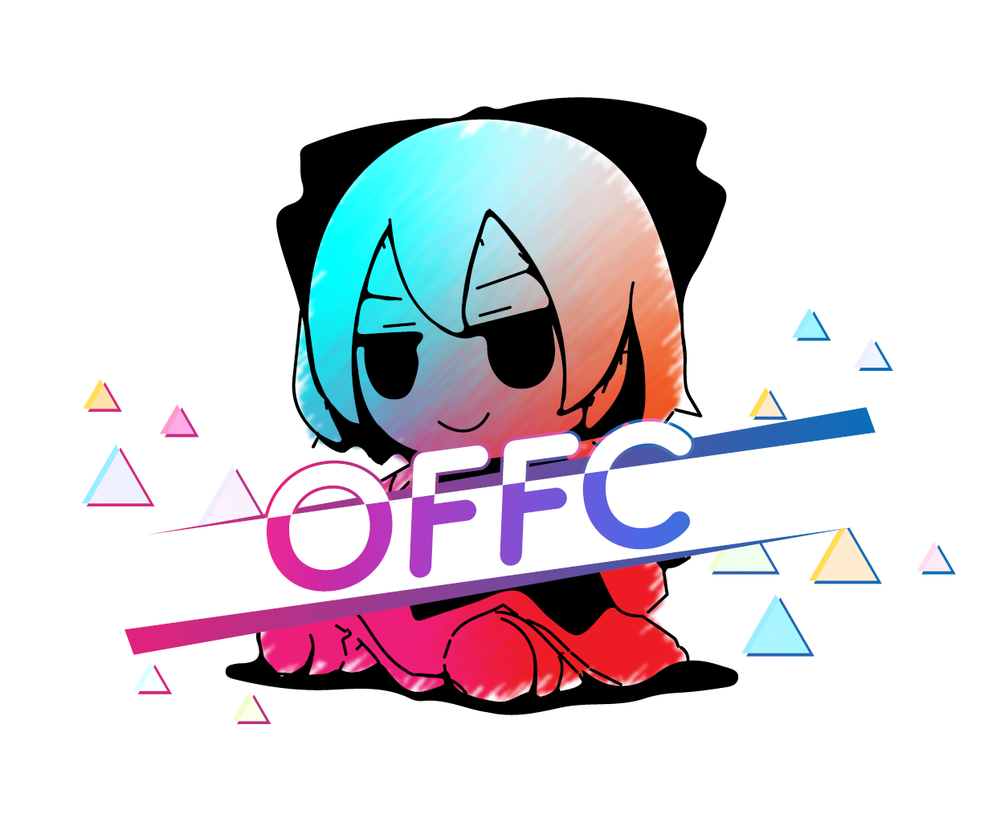

---
tags:
  - OFFC Summer Lights
  - "OFFC: SL"
  - OFFC SL
  - OFFC
---

# osu! FumoFumo Cup: Summer Lights

**osu! FumoFumo Cup: Summer Lights** (***OFFC: SL***) 由 ::{ flag=CN }:: [- Isuzu Ren -](https://osu.ppy.sh/users/13217389) 主办，是建立在 osu! 传统比赛制度基础之上，融合了全新下棋 ban / pick 玩法的 osu! 主模式 4v4 双败淘汰制团队赛。该比赛是 OFFC 系列赛的第二届比赛。

## 赛事安排

| 事项 | 时间 |
| --: | :-- |
| 报名 | 2025-06-15/2025-06-30 |
| 组队 | 2025-07-01 |
| 四分之一决赛轮 | 2025-07-01/2025-07-14 |
| 半决赛轮 | 2025-07-16/2025-07-29 |
| 决赛轮 | 2025-08-01/2025-08-14 |
| 总决赛轮 | 2025-08-16/2025-08-22 |

## 奖励

### 横幅

- 所有参赛选手均会获得定制 Profile Banner 与 QQ 赛群头衔。
- 冠军、亚军、季军队伍的参赛选手会获得特殊的 Banner 和头衔。
- 所有工作人员可获得定制 Profile Banner。
- 所有定制图谱师可获得定制图 Banner。

### 轮次最佳奖

各轮次内整体表现最佳队伍的全体成员将会获得相应轮次的 Champion 实体纪念奖牌。

### 特别奖品

对于 MVP 与 SVP 玩家，MVP 玩家可从**古明地恋 Fumo** 与 **芙兰朵露 Fumo** 中任选其一，SVP 玩家获得另一个作为奖品。

对于最佳计谋策略师与最佳劳模策略师，最佳计谋策略师可从碧蓝档案盛夏派对**霞泽美游**与**阿慈谷日富美**的盛夏派对立牌及吧唧任选其一，最佳劳模策略师获得另一个作为奖品。

| 玩家 | 奖品 |
| :-- | :-- |
| MVP（来自冠军队） | 一只 Fumo |
| SVP（来自亚军队） | 一只 Fumo |
| 最佳计谋策略师（投票选出） | 蔚蓝档案人物立牌 + 吧唧 |
| 最佳劳模策略师（投票选出） | 蔚蓝档案人物立牌 + 吧唧 |
| HD 图总分最高选手 | 《所以我放弃了音乐》初回限定实体 CD 音乐专辑 |
| HR 图总分最高选手 | 《夏光》实体 CD 音乐专辑 |

## 组织

osu! FumoFumo Cup: Summer Lights 由众多的社区成员举办。

| 职责 | 成员 |
| :-- | :-- |
| 主办 | ::{ flag=CN }:: [- Isuzu Ren -](https://osu.ppy.sh/users/13217389) |
| 规则 | ::{ flag=CN }:: [- Isuzu Ren -](https://osu.ppy.sh/users/13217389), ::{ flag=CN }:: [kitakore](https://osu.ppy.sh/users/33887163), ::{ flag=CN }:: [NaughtyChas](https://osu.ppy.sh/users/15349720) |
| 程序 | ::{ flag=CN }:: [cdwcgt](https://osu.ppy.sh/users/14721101), ::{ flag=CN }:: [MoeRain233](https://osu.ppy.sh/users/30973609), ::{ flag=CN }:: [NaughtyChas](https://osu.ppy.sh/users/15349720) |
| 美工 | ::{ flag=CN }:: [AeCw](https://osu.ppy.sh/users/6781503), ::{ flag=CN }:: [Citrusis](https://osu.ppy.sh/users/30298378), ::{ flag=CN }:: [sourflour](https://osu.ppy.sh/users/5237349) |
| 选图 | ::{ flag=CN }:: [- Isuzu Ren -](https://osu.ppy.sh/users/13217389), ::{ flag=CN }:: [5atori Komeiji](https://osu.ppy.sh/users/34282059), ::{ flag=CN }:: [FcEazy](https://osu.ppy.sh/users/7825227), ::{ flag=CN }:: [Koishi Komeiji](https://osu.ppy.sh/users/33295812), ::{ flag=CN }:: [My Angel Bronya](https://osu.ppy.sh/users/17857203) |
| 定制图谱师 | ::{ flag=PH }:: [Amateurre](https://osu.ppy.sh/users/7326908), ::{ flag=HK }:: [Arushii](https://osu.ppy.sh/users/15664628), ::{ flag=PH }:: [Flame Haze](https://osu.ppy.sh/users/8922155), ::{ flag=CN }:: [NatsuRin](https://osu.ppy.sh/users/20653857), ::{ flag=AU }:: [nominomu](https://osu.ppy.sh/users/30485380), ::{ flag=HK }:: [Petal](https://osu.ppy.sh/users/7354729), ::{ flag=VN }:: [Selcas](https://osu.ppy.sh/users/12545835), ::{ flag=ID }:: [Shurelia](https://osu.ppy.sh/users/3807986), ::{ flag=JP }:: [Soyuha](https://osu.ppy.sh/users/14208375), ::{ flag=CN }:: [SparkNights](https://osu.ppy.sh/users/9641731), ::{ flag=CN }:: [X Light](https://osu.ppy.sh/users/1814662) |
| 测试 | ::{ flag=CN }:: [- Isuzu Ren -](https://osu.ppy.sh/users/13217389), ::{ flag=CN }:: [-Rosmontis-](https://osu.ppy.sh/users/34323353), ::{ flag=CN }:: [[SHK]_Firra](https://osu.ppy.sh/users/15175276), ::{ flag=CN }:: [chanliuko](https://osu.ppy.sh/users/32289237), ::{ flag=CN }:: [FcEazy](https://osu.ppy.sh/users/7825227), ::{ flag=CN }:: [My Angel Bronya](https://osu.ppy.sh/users/17857203) |
| 裁判 | ::{ flag=CN }:: [- Isuzu Ren -](https://osu.ppy.sh/users/13217389), ::{ flag=CN }:: [[SHK]_Firra](https://osu.ppy.sh/users/15175276), ::{ flag=CN }:: [Koishi Komeiji](https://osu.ppy.sh/users/33295812), ::{ flag=CN }:: [Komeiji_Satori_](https://osu.ppy.sh/users/15114200), ::{ flag=CN }:: [Paraliesa](https://osu.ppy.sh/users/30595368), ::{ flag=CN }:: [SparkNights](https://osu.ppy.sh/users/9641731) |
| 直播 | ::{ flag=CN }:: [- Isuzu Ren -](https://osu.ppy.sh/users/13217389), ::{ flag=CN }:: [Dr_Shindo](https://osu.ppy.sh/users/30895664), ::{ flag=CN }:: [FroZZZZZen](https://osu.ppy.sh/users/29235972), ::{ flag=CN }:: [NaughtyChas](https://osu.ppy.sh/users/15349720) |
| 解说 | ::{ flag=CN }:: [- Isuzu Ren -](https://osu.ppy.sh/users/13217389), ::{ flag=CN }:: [My Angel Bronya](https://osu.ppy.sh/users/17857203), ::{ flag=CN }:: [Nosenso](https://osu.ppy.sh/users/30329943), ::{ flag=CN }:: [S tella](https://osu.ppy.sh/users/16018639) |
| 表格 | ::{ flag=CA }:: [Dura](https://osu.ppy.sh/users/5185609), ::{ flag=CN }:: [sourflour](https://osu.ppy.sh/users/5237349) |
| 定制曲与曲绘 | ::{ flag=CN }:: [7Echo（哔哩哔哩）](https://space.bilibili.com/3461578621979492) ::{ flag=CN }:: [gwsscz_（哔哩哔哩）](https://space.bilibili.com/1840888539) |

## 链接

- **[OFFC: SL 主表格（谷歌文档）](https://docs.google.com/spreadsheets/d/167EKJ5hA59MOGXHn2D_oHjLCpedfKCdeW7gWOKtozjg)**
- **[比赛参考手册（腾讯文档）](https://docs.qq.com/doc/DVG15aUFITVVQYUZp)**
- [OFFC 官网](https://offfc.github.io)
- [社区帖](https://osu.ppy.sh/community/forums/topics/2092514)
- [Discord 服务器](https://discord.gg/YYprGehNxD)
- QQ总群：**619943512**

## 选手

| 队伍代号 | 队名 | 成员 |
| :-: | :-: | :-- |
| **Team A** | 多啦A梦 | ::{ flag=HK }:: [Kdlake](https://osu.ppy.sh/users/29938752), ::{ flag=HK }:: [Ayaneruuu](https://osu.ppy.sh/users/14533605), ::{ flag=DE }:: [yiyao1229](https://osu.ppy.sh/users/30979124), ::{ flag=CN }:: [- Rika Ayano -](https://osu.ppy.sh/users/9037287), ::{ flag=CN }:: [-SummerSky-](https://osu.ppy.sh/users/18955845), ::{ flag=TW }:: [touhou chef](https://osu.ppy.sh/users/24533023), ::{ flag=HK }:: [[SHK] Arcadia](https://osu.ppy.sh/users/13888511), ::{ flag=KR }:: [09X](https://osu.ppy.sh/users/36963238) |
| **Team B** | 都是SummerSky害的 | ::{ flag=CN }:: [MogenNotFound](https://osu.ppy.sh/users/14494010), ::{ flag=CN }:: [Sonoboi](https://osu.ppy.sh/users/10040597), ::{ flag=TW }:: [[ Luka ]](https://osu.ppy.sh/users/11923800), ::{ flag=CN }:: [[SHK]T_T](https://osu.ppy.sh/users/13999223), ::{ flag=CN }:: [zmyk](https://osu.ppy.sh/users/11396041), ::{ flag=CN }:: [misaki233](https://osu.ppy.sh/users/14103871), ::{ flag=CN }:: [Hekiru](https://osu.ppy.sh/users/16446039), ::{ flag=CN }:: [misaki233](https://osu.ppy.sh/users/14103871) |
| **Team C** | 不是夏天我不草 | ::{ flag=CN }:: [oliwakami](https://osu.ppy.sh/users/3046750), ::{ flag=CN }:: [jj986544591](https://osu.ppy.sh/users/2917990), ::{ flag=HK }:: [-xxx Rumia-](https://osu.ppy.sh/users/5936405), ::{ flag=CA }:: [Akisa 18](https://osu.ppy.sh/users/16134378), ::{ flag=CN }:: [HD1](https://osu.ppy.sh/users/21398264), ::{ flag=TW }:: [miltonfs](https://osu.ppy.sh/users/32610281), ::{ flag=US }:: [Yuan233123](https://osu.ppy.sh/users/15454134), ::{ flag=CN }:: [CloudLinker](https://osu.ppy.sh/users/19465414) |
| **Team D** | 给你一拳 | ::{ flag=US }:: [Texas](https://osu.ppy.sh/users/8281276), ::{ flag=CN }:: [Pager](https://osu.ppy.sh/users/15030466), ::{ flag=CN }:: [gxytcgxytc](https://osu.ppy.sh/users/874891), ::{ flag=TW }:: [N i s u](https://osu.ppy.sh/users/4647311), ::{ flag=CN }:: [carrywind](https://osu.ppy.sh/users/12228018), ::{ flag=CN }:: [-SmilingTeresa](https://osu.ppy.sh/users/4524794), ::{ flag=CN }:: [noneght](https://osu.ppy.sh/users/16801578), ::{ flag=TW }:: [12231337](https://osu.ppy.sh/users/37845705) |
| **Team E** | Valorant after this | ::{ flag=CA }:: [ShandenYamada](https://osu.ppy.sh/users/13413713), ::{ flag=TW }:: [jocore](https://osu.ppy.sh/users/30157397), ::{ flag=CN }:: [Firia](https://osu.ppy.sh/users/9164037), ::{ flag=CN }:: [Slay_conceit](https://osu.ppy.sh/users/5568835), ::{ flag=CN }:: [i hate TB](https://osu.ppy.sh/users/31443365), ::{ flag=HK }:: [itsushini](https://osu.ppy.sh/users/17074316), ::{ flag=CN }:: [Mars New](https://osu.ppy.sh/users/8926316) |
| **Team F** | 原來OFFC:SL的S不是suiji的意思嗎 | ::{ flag=MO }:: [-PSC-](https://osu.ppy.sh/users/24350045), ::{ flag=HK }:: [AbbeyChan6203](https://osu.ppy.sh/users/20971891), ::{ flag=TW }:: [daiimu](https://osu.ppy.sh/users/17792515), ::{ flag=CN }:: [Hakumo Shiro](https://osu.ppy.sh/users/5179557), ::{ flag=CN }:: [9898](https://osu.ppy.sh/users/1624459), ::{ flag=CN }:: [Fyu_Neru](https://osu.ppy.sh/users/6699436), ::{ flag=CN }:: [MizukiQwQ](https://osu.ppy.sh/users/15154497), ::{ flag=AE }:: [SzZzC](https://osu.ppy.sh/users/32630602) |
| **Team G** | 让你选DT你龙吗 | ::{ flag=CN }:: [1611](https://osu.ppy.sh/users/10462385), ::{ flag=CN }:: [SongDD](https://osu.ppy.sh/users/17049803), ::{ flag=CN }:: [Bochi the osu](https://osu.ppy.sh/users/30284920), ::{ flag=CN }:: [Hakumo Ai](https://osu.ppy.sh/users/694480), ::{ flag=TW }:: [Ama_tw](https://osu.ppy.sh/users/28536684), ::{ flag=CN }:: [Lilim Harlot](https://osu.ppy.sh/users/29552621), ::{ flag=CN }:: [forzenyubi](https://osu.ppy.sh/users/9661461), ::{ flag=SG }:: [AthoraX](https://osu.ppy.sh/users/17689709) |
| **Team H** | zako psc | ::{ flag=HK }:: [Fallen_HK](https://osu.ppy.sh/users/13981456), ::{ flag=CN }:: [eric1388](https://osu.ppy.sh/users/20384257), ::{ flag=HK }:: [Mithra Tercera](https://osu.ppy.sh/users/2955661), ::{ flag=CN }:: [RABBIT2](https://osu.ppy.sh/users/10260284), ::{ flag=MO }:: [7White](https://osu.ppy.sh/users/17159216), ::{ flag=TW }:: [Mou li kai](https://osu.ppy.sh/users/30593882), ::{ flag=CN }:: [Pouxba](https://osu.ppy.sh/users/16378561), ::{ flag=CN }:: [comgrat](https://osu.ppy.sh/users/12830046) |

## 颁奖信息

本届比赛已经结束，颁奖结果如下：

| 名次 | 队伍 |
| :-: | :-- |
|  | 多啦A梦 |
|  | zako psc |
|  | 不是夏天我不草 |

轮次最佳队伍如下：

| 轮次 | 队伍 |
| :-: | :-- |
| 四分之一决赛轮 | 都是SummerSky害的 |
| 半决赛轮 | 给你一拳 |
| 决赛轮 | zako psc |
| 总决赛轮 | 多啦A梦 |

以下选手获得了对应奖励：

| 名次 | 选手 |
| :-- | :-- |
| MVP（来自冠军队） | ::{ flag=DE }:: [yiyao1229](https://osu.ppy.sh/users/30979124) |
| SVP（来自亚军队） | ::{ flag=HK }:: [Mithra Tercera](https://osu.ppy.sh/users/2955661) |
| 最佳计谋策略师（投票选出） | 待定 |
| 最佳劳模策略师（投票选出） | 待定 |
| HD 图总分最高选手 | ::{ flag=CN }:: [Kdlake](https://osu.ppy.sh/users/29938752) |
| HR 图总分最高选手 | ::{ flag=CN }:: [RABBIT2](https://osu.ppy.sh/users/10260284) |

## 图池

### 四分之一决赛轮 (QF)

**[在这里下载图包！（212 MB）](https://mega.nz/file/20QyFa4Q#6KaZ2mO1NyEAT3RMp72M0V2qbY3lYKkVLyXl92oN0kA)**

- No Mod
  1. [penoreri - Sulfur [Dioxide]](https://osu.ppy.sh/beatmapsets/1491645#osu/3057533)
  2. [Hige Driver - ukigumo [ddm & Lude's Extra]](https://osu.ppy.sh/beatmapsets/1827928#osu/3928631)
  3. [HIMEHINA - Kiss Kitsune [LeCandy's Expert]](https://osu.ppy.sh/beatmapsets/2337469#osu/5052986)
  4. [DJ Raisei - ReDIVE NEURON [Expert]](https://osu.ppy.sh/beatmapsets/2341026#osu/5029964)
  5. [Camellia - TEMPO KATANA [vergil chair's Expert]](https://osu.ppy.sh/beatmapsets/2260926#osu/4838324)
- Hidden
  1. [lapix - Ocean Blue feat. Luschel (Extended Mix) [Summer, please don't go away, I feel like I still wanna play]](https://osu.ppy.sh/beatmapsets/2334764#osu/5011340)
  2. [IOSYS - Chanteikku Sanyousei no Itazura Daisensou [Lunatic]](https://osu.ppy.sh/beatmapsets/2016010#osu/4197023)
- Hard Rock
  1. [SECONDWALL - Light [Hikari]](https://osu.ppy.sh/beatmapsets/1373974#osu/2840384)
  2. [25-ji, Nightcord de. - Bitter Choco Decoration [Picky Habits]](https://osu.ppy.sh/beatmapsets/1538879#osu/3146245)
- Double Time
  1. [Islet feat. isui - Haru o Matsu [Bloom]](https://osu.ppy.sh/beatmapsets/2138869#osu/4501349)
  2. [Nor - Raise the Huddle [Insane]](https://osu.ppy.sh/beatmapsets/2124123#osu/4468897)
  3. [tieff - Waterflow [Collab Insane]](https://osu.ppy.sh/beatmapsets/1491275#osu/3056868)
  4. [FELT - Plugless & Forever [Happiness[OFFC SL Edit]]](https://osu.ppy.sh/beatmapsets/2394384#osu/5185505)
- Free Mod
  1. [Qutabire - Shiki Oriori, Shouyou to Iromeku Machi (feat. Suzuyu) [Pacing Machi de Fantasia]](https://osu.ppy.sh/beatmapsets/2309942#osu/5186532)
  2. [Nekomata Master feat. *spiLa* - Clumsy thoughts [Emotions]](https://osu.ppy.sh/beatmapsets/1544696#osu/3157348)
  3. [EmoCosine - Usagi Flap (EmoCosine Remix) [Extra]](https://osu.ppy.sh/beatmapsets/2390542#osu/5174609)
  4. [BUTAOTOME - Yurara Kamishibai [Nostalgia]](https://osu.ppy.sh/beatmapsets/1774421#osu/3633250)
  5. [Plum - Dustwind [lr7's Expert]](https://osu.ppy.sh/beatmapsets/1450157#osu/3249382)
- Tiebreaker: [Batashi - Smag Slow [Zakrywam twarz lecz to nie puacz]](https://osu.ppy.sh/beatmapsets/1999363#osu/4156421)

### 半决赛轮 (SF)

**[在这里下载图包！（146 MB）](https://mega.nz/file/D4IACZiQ#RhDP_1atk2WX-inRF3cl6zNSayxiOkEPW_OnGfXDhyA)**

- No Mod
  1. [seatrus - Hoshi Furu Yoru to Ichirin no Hana [Descending Stars]](https://osu.ppy.sh/beatmapsets/2402523#osu/5210544)
  2. [Slam Bamboo - House on Fire [It's So Nice]](https://osu.ppy.sh/beatmapsets/2005589#osu/4171278)
  3. [Hoshimachi Suisei - I don't care [after all, it's a happy ending]](https://osu.ppy.sh/beatmapsets/2403613#osu/5213149)
  4. [Rachel Taylor - Eternity (C3EYOND Remix) [Our Downfall]](https://osu.ppy.sh/beatmapsets/1519259#osu/3133585)
  5. [Rahatt - Zurla Breakcore [Trumpet Destroyer]](https://osu.ppy.sh/beatmapsets/1935992#osu/4001389)
- Hidden
  1. [Bomb the Music Industry! - The First Time I Met Sanawon [olc's Extra]](https://osu.ppy.sh/beatmapsets/2297446#osu/4907509)
  2. [Kairiki bear feat. Hatsune Miku - MELLOMELLOID [LOVESTRUCK (CS4 EDIT)]](https://osu.ppy.sh/beatmapsets/2219428#osu/4704402)
- Hard Rock
  1. [kessoku band - Guitar to Kodoku to Aoi Hoshi [Ayameteurre's Expert]](https://osu.ppy.sh/beatmapsets/1880007#osu/3910756)
  2. [Itsuki Amakusa - LENATUS [Rieri's Insane]](https://osu.ppy.sh/beatmapsets/2298289#osu/4909882)
- Double Time
  1. [Chino (CV: Inori Minase) - Mirai Puzzle [Insane]](https://osu.ppy.sh/beatmapsets/1547564#osu/3187933)
  2. [Mirage - Muzyka nas svyazala (Dance Remix) [ratarok's Insane]](https://osu.ppy.sh/beatmapsets/2115978#osu/4741558)
  3. [Kinoshita - Norowareta Sei / Shukufuku Sareta Sei (the confusion) [allein's Insane]](https://osu.ppy.sh/beatmapsets/1004928#osu/2444018)
  4. [Diao Ye Zong feat. nayuta - Koi Ningyou [Local's Lunatic]](https://osu.ppy.sh/beatmapsets/1947243#osu/4039684)
- Free Mod
  1. [Yorushika - Replicant [everything was just a lie.]](https://osu.ppy.sh/beatmapsets/2275205#osu/4848156)
  2. [maritumix - Blackout [Cartoon]](https://osu.ppy.sh/beatmapsets/2008172#osu/4177227)
  3. [NOMELON NOLEMON - Hide and Seek [Liyuu's Expert ft. Come and Livermorium[tourney ver]]](https://osu.ppy.sh/beatmapsets/2405647#osu/5219300)
  4. [LOLUET x yoei. - roots [agatsu's expert]](https://osu.ppy.sh/beatmapsets/2139515#osu/4706057)
  5. [Camellia - Diastrophism [nomi's Expert]](https://osu.ppy.sh/beatmapsets/1885482#osu/4669375)
- Tiebreaker: [Qutabire - Schizophrenia [Disorder]](https://osu.ppy.sh/beatmapsets/2403674#osu/5213400)

### 决赛轮 (F)

**[在这里下载图包！（170 MB）](https://mega.nz/file/uwoEHSjR#f2wct8u6c4aMxklRGReOHnrUPLQlCOeE967Zp1mi-yM)**

- No Mod
  1. [mewhan - Karakuri Pierrot [Extreme]](https://osu.ppy.sh/beatmapsets/1388272#osu/2867182)
  2. [xi - Ascension to Heaven [Extra]](https://osu.ppy.sh/beatmapsets/1301360#osu/2732587)
  3. [Avaraya - Kanashi bari ni attara [#A952C7]](https://osu.ppy.sh/beatmapsets/2409912#osu/5231942)
  4. [RYOCUCHA - Incandescent Particle Field [Collab Epsilon]](https://osu.ppy.sh/beatmapsets/2321849#osu/4974549)
  5. [MisoilePunch ~pan soe~ - MeTear'n TruX [Resurrection]](https://osu.ppy.sh/beatmapsets/2199026#osu/4653719)
- Hidden
  1. [Yorushika - Matasaburo [Cerulean]](https://osu.ppy.sh/beatmapsets/1887387#osu/3886654)
  2. [Xomu - Last Dance [Hidden Extra]](https://osu.ppy.sh/beatmapsets/2015476#osu/4252446)
  3. [MYUKKE. - ViViTAL MONO [ExTRA]](https://osu.ppy.sh/beatmapsets/1753391#osu/3588248)
- Hard Rock
  1. [tayori - Wonder [Kalicky's Extra]](https://osu.ppy.sh/beatmapsets/2242953#osu/4900457)
  2. [Lidelle x BilliumMoto - A Gleam for the Sightless [Alvearia's Extra]](https://osu.ppy.sh/beatmapsets/2066155#osu/4699479)
  3. [inabakumori - Lost Umbrella (7_7 bootleg) [Trynna's Extreme]](https://osu.ppy.sh/beatmapsets/2013827#osu/4196105)
- Double Time
  1. [Inori Minase - Well Wishing Word [Yee's Insane]](https://osu.ppy.sh/beatmapsets/2331439#osu/5056223)
  2. [Hino Isuka - Chocolat a la menthe [OTST7]](https://osu.ppy.sh/beatmapsets/1804309#osu/3699986)
  3. [AAAA - parallel skydive [nomi's Insane[OFFC:SL Edit]]](https://osu.ppy.sh/beatmapsets/2406265#osu/5221883)
  4. [The Herb Shop feat. Nabana Nana - Kin'iro no Uta (HYPRDRIVE Remix) [kira's insane[OFFC:SL Edit]]](https://osu.ppy.sh/beatmapsets/2406262#osu/5221878)
- Free Mod
  1. [hiroki. - Menhera Kanjoron feat.KAFU [Expert]](https://osu.ppy.sh/beatmapsets/2160151#osu/4555128)
  2. [a_hisa - Pudding Funfair [EXTRA]](https://osu.ppy.sh/beatmapsets/993369#osu/2536882)
  3. [M2U - Quo Vadis [Himei]](https://osu.ppy.sh/beatmapsets/2121702#osu/4458291)
  4. [Attoclef - Naples Yellow Mango [Knight's EX]](https://osu.ppy.sh/beatmapsets/2288022#osu/4967725)
  5. [katagiri - #2wise4u [#2hardcore4otst]](https://osu.ppy.sh/beatmapsets/1818751#osu/3731599)
- Tiebreaker: [Para Dot. - Hyper banquet [Extreme]](https://osu.ppy.sh/beatmapsets/2009605#osu/4266048)

### 总决赛轮 (GF)

**[在这里下载图包！（166 MB）](https://mega.nz/file/3tREwKBA#wgX1F9tMx4XxUZ3nCI24UOEkcfk797tDmdfxqj5HCUs)**

- No Mod
  1. [ELFENSJoN - Hyousou wa Hakuen o Matoite [Endless]](https://osu.ppy.sh/beatmapsets/1332833#osu/2761831)
  2. [SiLiS - March to the Constellations [Celestial Journey (Tourney Ver.)]](https://osu.ppy.sh/beatmapsets/2343773#osu/5038294)
  3. [DIALOGUE+ - Jinsei Easy? [LV.72.7 Matha's Extreme]](https://osu.ppy.sh/beatmapsets/2031791#osu/4235022)
  4. [LucaProject - Nidhoggr [Revelation 13:1]](https://osu.ppy.sh/beatmapsets/1947987#osu/4031447)
  5. [Mimizu - Tatakina feat. Kasane TetoSV [NM5]](https://osu.ppy.sh/beatmapsets/2335287#osu/5261847)
- Hidden
  1. [SmilyBruh - "AKAGE" (feat. Hatsune Miku) [Repetition]](https://osu.ppy.sh/beatmapsets/2345539#osu/5042966)
  2. [Yorushika - Deep Indigo [Robinia's Extra[OFFC:SL Edit]]](https://osu.ppy.sh/beatmapsets/2419191#osu/5261125)
  3. [Lee Jin-Ah - Target for Love (Ludicin's Hardcore Bootleg) [Expert]](https://osu.ppy.sh/beatmapsets/2419065#osu/5260740)
- Hard Rock
  1. [isekaijoucho - Kimi syoushitu sekai [Future is OURS]](https://osu.ppy.sh/beatmapsets/2419070#osu/5260746)
  2. [Dormir - Cookie Bouquets [Fanzhen's Extra]](https://osu.ppy.sh/beatmapsets/675125#osu/1453416)
  3. [Jun Kuroda - Cybernetics [Heatwave's Expert]](https://osu.ppy.sh/beatmapsets/1325579#osu/2833226)
- Double Time
  1. [KOTOKO - Crystal moment [Affection]](https://osu.ppy.sh/beatmapsets/2308617#osu/4938474)
  2. [Touno Sakura - PRIZM/CIRCUiT [Summer, Memories, Love Story!]](https://osu.ppy.sh/beatmapsets/2142220#osu/4509159)
  3. [Iyowa feat. Hatsune Miku - apricot [oatm's Insane]](https://osu.ppy.sh/beatmapsets/1752094#osu/3804788)
  4. [Islet feat. Isui - Hakujitsumu [Collab Insane]](https://osu.ppy.sh/beatmapsets/1913515#osu/4052491)
- Free Mod
  1. [AVTechNO! x Treow - boku-boku II feat. Hatsune Miku [Lan's Die]](https://osu.ppy.sh/beatmapsets/2271970#osu/4839685)
  2. [namigroove - NOJA-LOLIC [2 girls 1 map]](https://osu.ppy.sh/beatmapsets/2204568#osu/4666685)
  3. [7Echo - Sapphire Sky [Expert]](https://osu.ppy.sh/beatmapsets/2420037#osu/5263623)
  4. [tailspun - Bloom in Two [Arborescent]](https://osu.ppy.sh/beatmapsets/2411003#osu/5235323)
  5. [MetaHumanBoi - Solar Strike [Exort Extra (5WC Ver.)]](https://osu.ppy.sh/beatmapsets/2343774#osu/5038297)
- Tiebreaker: [Xyris - Beyond the Edge (feat. Hanakuma Chifuyu) [Limitless]](https://osu.ppy.sh/beatmapsets/2410026#osu/5232626)

## 比赛结果

### 四分之一决赛轮 (QF Round)

比赛时间：2025 年 7 月 5 日 ~ 2025 年 7 月 7 日

| 队伍 1 | 队伍 2 | 比赛链接 |
| --: | :-- | :-- |
| **不是夏天我不草** | 原來OFFC:SL的S不是suiji的意思嗎 | [#1](https://osu.ppy.sh/community/matches/118591736) |
| 让你选DT你龙吗 | **多啦A梦** | [#1](https://osu.ppy.sh/community/matches/118591049) |
| Valorant after this | **zako psc** | [#1](https://osu.ppy.sh/community/matches/118591753) |
| 给你一拳 | **都是SummerSky害的** | [#1](https://osu.ppy.sh/community/matches/118610985) |

### 半决赛轮 (SF Round)

比赛时间：2025 年 7 月 20 日 ~ 2025 年 7 月 27 日

| 队伍 1 | 队伍 2 | 比赛链接 |
| --: | :-- | :-- |
| **不是夏天我不草** | 都是SummerSky害的 | [#1](https://osu.ppy.sh/community/matches/118730743) |
| zako psc | **多啦A梦** | [#1](https://osu.ppy.sh/community/matches/118787262) |
| **给你一拳** | 原來OFFC:SL的S不是suiji的意思嗎 | [#1](https://osu.ppy.sh/community/matches/118797298) |
| 让你选DT你龙吗 | **Valorant after this** | [#1](https://osu.ppy.sh/community/matches/118796796) |

### 决赛轮 (F Round)

比赛时间：2025 年 8 月 10 日 ~ 2025 年 8 月 11 日

| 队伍 1 | 队伍 2 | 比赛链接 |
| --: | :-- | :-- |
| 不是夏天我不草（投降） | **多啦A梦** | - |
| Valorant after this | **都是SummerSky害的** | [#1](https://osu.ppy.sh/community/matches/118919548) |
| 给你一拳 | **zako psc** | [#1](https://osu.ppy.sh/community/matches/118911083) |
| 都是SummerSky害的 | **zako psc** | [#1](https://osu.ppy.sh/community/matches/118939565) |

### 总决赛轮 (GF Round)

比赛时间：2025 年 8 月 22 日 ~ 2025 年 9 月 1 日

| 队伍 1 | 队伍 2 | 比赛链接 |
| --: | :-- | :-- |
| 不是夏天我不草 | **zako psc** | [#1](https://osu.ppy.sh/community/matches/119044307) |
| zako psc | **多啦A梦** | [#1](https://osu.ppy.sh/community/matches/119148400) |

## 规则

出于长度与复杂性考虑，OFFC: SL 的规则暂未在本页面列出。完整的规则可在 [OFFC 官网](https://offfc.github.io/docs/summer-lights/handbook)获取。
