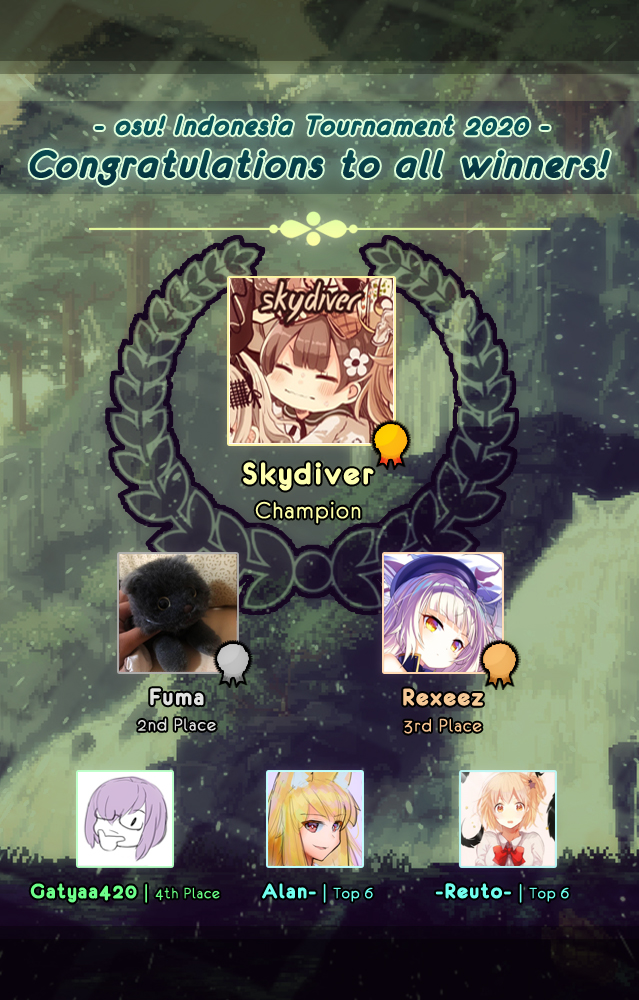

---
tags:
  - OIT2020
  - OIT 2020
---

# osu! Indonesia Tournament #10 (2020)

The **osu! Indonesia Tournament #10 (2020)** (***OIT 2020***) was an Indonesian double-elimination 1v1 osu! tournament hosted by ::{ flag=ID }:: [Fre](https://osu.ppy.sh/users/3484548) and co-hosted by ::{ flag=ID }:: [Niva](https://osu.ppy.sh/users/197805), ::{ flag=ID }:: [Senritsu](https://osu.ppy.sh/users/1165368), and ::{ flag=ID }:: [Rayhan Hamil](https://osu.ppy.sh/users/4085825). It was the 10th iteration of the tournament series.

## Tournament schedule

| Event | Timestamp |
| --: | :-- |
| Registration phase | 2020-02-03/2020-02-16 |
| Screening phase | 2020-02-17/2020-02-23 |
| Qualifiers | 2020-02-24/2020-03-01 |
| Round of 32 | 2020-03-02/2020-03-08 |
| Round of 16 | 2020-03-09/2020-03-15 |
| Quarterfinals | 2020-03-16/2020-03-22 |
| Semifinals | 2020-03-23/2020-03-29 |
| Finals week 1 | 2020-03-30/2020-04-05 |
| Finals week 2 | 2020-04-06/2020-04-12 |

## Prizes

| Placing | Prize(s) |
| :-: | :-- |
|  | 50% of the raised prize pool, 6 months of osu!supporter, unique profile badge |
|  | 30% of the raised prize pool, 4 months of osu!supporter |
|  | 20% of the raised prize pool, 2 months of osu!supporter |

## Organisation

The OIT 2020 was run by various Indonesian osu! community members.

| Position | Member(s) |
| :-- | :-- |
| Host | ::{ flag=ID }:: [Fre](https://osu.ppy.sh/users/3484548) |
| Co-host | ::{ flag=ID }:: [Niva](https://osu.ppy.sh/users/197805), ::{ flag=ID }:: [Senritsu](https://osu.ppy.sh/users/1165368), ::{ flag=ID }:: [Rayhan Hamil](https://osu.ppy.sh/users/4085825) |
| Mappool selector | ::{ flag=ID }:: [Fre](https://osu.ppy.sh/users/3484548), ::{ flag=ID }:: [Niva](https://osu.ppy.sh/users/197805), ::{ flag=ID }:: [Rayhan Hamil](https://osu.ppy.sh/users/4085825), ::{ flag=ID }:: [phizh](https://osu.ppy.sh/users/4569302), ::{ flag=ID }:: [Kuro Fuyusaki](https://osu.ppy.sh/users/2667496) |
| Streamer | ::{ flag=ID }:: [Fre](https://osu.ppy.sh/users/3484548), ::{ flag=ID }:: [Alice Pi](https://osu.ppy.sh/users/8787324), ::{ flag=ID }:: [wiam103](https://osu.ppy.sh/users/4109839), ::{ flag=ID }:: [Victim_Crasher](https://osu.ppy.sh/users/2084869) |
| Commentator | ::{ flag=ID }:: [Fre](https://osu.ppy.sh/users/3484548), ::{ flag=ID }:: [Niva](https://osu.ppy.sh/users/197805), ::{ flag=ID }:: [phizh](https://osu.ppy.sh/users/4569302), ::{ flag=ID }:: [Remuru](https://osu.ppy.sh/users/3654220), ::{ flag=ID }:: [Ascaveth](https://osu.ppy.sh/users/3245206), ::{ flag=ID }:: [Kirinagi](https://osu.ppy.sh/users/5937545), ::{ flag=ID }:: [Akebono](https://osu.ppy.sh/users/1815316), ::{ flag=ID }:: [MasterfulNote5](https://osu.ppy.sh/users/7247988), ::{ flag=ID }:: [Velstadt](https://osu.ppy.sh/users/6209095), ::{ flag=ID }:: [thefarrel007](https://osu.ppy.sh/users/2429128), ::{ flag=ID }:: [Fyl](https://osu.ppy.sh/users/10069307) |
| Referee | ::{ flag=ID }:: [Fre](https://osu.ppy.sh/users/3484548), ::{ flag=ID }:: [phizh](https://osu.ppy.sh/users/4569302), ::{ flag=ID }:: [Remuru](https://osu.ppy.sh/users/3654220), ::{ flag=ID }:: [Ascaveth](https://osu.ppy.sh/users/3245206), ::{ flag=ID }:: [Extinction666](https://osu.ppy.sh/users/5472877), ::{ flag=ID }:: [NoVaLian](https://osu.ppy.sh/users/6459827), ::{ flag=ID }:: [Fayn](https://osu.ppy.sh/users/5390495), ::{ flag=ID }:: [PatrickFPSGamer](https://osu.ppy.sh/users/4796773) |
| Graphic designer | ::{ flag=ID }:: [Niva](https://osu.ppy.sh/users/197805), ::{ flag=ID }:: [Tama-desu](https://osu.ppy.sh/users/3813174), ::{ flag=ID }:: [Nexa-](https://osu.ppy.sh/users/6155896) |
| Wiki editor | ::{ flag=ID }:: [Niva](https://osu.ppy.sh/users/197805), ::{ flag=ID }:: [Rayhan Hamil](https://osu.ppy.sh/users/4085825) |

## Links

- **[Master spreadsheet](https://docs.google.com/spreadsheets/d/12dU5oFb_vdfn5YHXMC6cvQZr7VeQV4hPU_WWzxYZiWg/edit#gid=1811776910)**
- [Forum thread](https://osu.ppy.sh/community/forums/topics/1003216)
- [Discord server](https://discordapp.com/invite/CHRFffH)
- [Primary livestream channel](https://www.twitch.tv/osuindonesia)
- [Secondary livestream channel](https://www.twitch.tv/osuindonesiab)
- [Challonge brackets](https://challonge.com/OIT2020)

## Podium

## Mappools

### Finals week 2

**[Download the mappack here! (188 MB)](https://drive.google.com/file/d/1ooSskA_Q2pbYDkrXmRW2GKamWRWdv1Ky/view)**

- NoMod
  1. [ELFENSJoN - Hyousou wa Hakuen o Matoite (Xayah) \[White Flame\]](https://osu.ppy.sh/beatmapsets/1019071#osu/2132486)
  2. [xi - Hesperides (Kroytz) \[Dystopia\]](https://osu.ppy.sh/beatmapsets/400343#osu/871116)
  3. [Camellia - Syzygia (Realazy) \[den 1's Extra\]](https://osu.ppy.sh/beatmapsets/1027467#osu/2148623)
  4. [Sota Fujimori - DANCE ALL NIGHT (- Yoshimaro -) \[Delight\]](https://osu.ppy.sh/beatmapsets/600303#osu/1268530)
  5. [Dayum - Gwyn (Shidoni) \[Extreme\]](https://osu.ppy.sh/beatmapsets/985884#osu/2063785)
  6. [ZUTOMAYO - Seigi (sukiNathan) \[quack\]](https://osu.ppy.sh/beatmapsets/1011155#osu/2116466)
- Hidden
  1. [Lite Show Magic - TRICKL4SH 220 (22,000 Power Extended) (RLC) \[apaffy's MAXIMUM\]](https://osu.ppy.sh/beatmapsets/971450#osu/2129220)
  2. [guna with team kyukkyu - subconsciousness (Snow Note) \[Another\]](https://osu.ppy.sh/beatmapsets/151945#osu/413428)
  3. [ELFENSJoN - PHANTOM (Kalibe) \[DELUSJoN\]](https://osu.ppy.sh/beatmapsets/602367#fruits/1580728)
- HardRock
  1. [Kanzaki Elza starring Reona - Dancer in the Discord (Kibbleru) \[Masquerade\]](https://osu.ppy.sh/beatmapsets/1109271#osu/2318096)
  2. [Eisyo-kobu - Oriental Blossom (Crystal) \[yf's Expert\]](https://osu.ppy.sh/beatmapsets/586889#osu/1242793)
  3. [SawanoHiroyuki[nZk]:Tielle & Gemie - sh0ut (Gaia) \[aL†aiR\]](https://osu.ppy.sh/beatmapsets/641854#osu/1360912)
- DoubleTime
  1. [Hyadain - Hyadain no Kakakata Kataomoi-C (Hakeru Prismriver) \[2011 Collab (osu! Indonesia Tournament 2020 Edit)\]](https://osu.ppy.sh/beatmapsets/1139584#osu/2380386)
  2. [Sayuri - Tsuki to Hanataba (Mirash) \[Insane\]](https://osu.ppy.sh/beatmapsets/780885#osu/1641266)
  3. [Haruna Luna - Kimiiro Signal (CelsiusLK) \[Expert\]](https://osu.ppy.sh/beatmapsets/326621#osu/725166)
  4. [Juno Reactor - Guardian Angel (PandaHero) \[Insane\]](https://osu.ppy.sh/beatmapsets/965524#osu/2021129)
- FreeMod
  1. [ak+q feat. Sennzai - Solitary Dream (-\[Pino\]-) \[Kuuhaku\]](https://osu.ppy.sh/beatmapsets/1012249#osu/2118753)
  2. [VALLEYSTONE feat. Kanata.N - Natsuirozaka (kwk) \[Luscent's Extra\]](https://osu.ppy.sh/beatmapsets/950550#osu/1994839)
  3. [OSTER project - Capriccio of My Mind (7odoa) \[Extra\]](https://osu.ppy.sh/beatmapsets/107475#osu/281632)
- Tiebreaker
  1. **[Amuro vs Killer - Mei (Camellia's "Yomigae' Remix) (RLC) \[Resurrection\]](https://osu.ppy.sh/beatmapsets/1123064#osu/2346860)**

### Finals week 1

**[Download the mappack here! (145 MB)](https://drive.google.com/file/d/1DrYx1aVN9ht6rqi_EnCeZoEdDEB23rw1/view)**

- NoMod
  1. [Yorushika - Deep Indigo (Sing) \[That's Why I Give Up on Mapping\]](https://osu.ppy.sh/beatmapsets/949288#osu/1982289)
  2. [LeaF - Musical Movement (DarkVortex) \[Crescendo\]](https://osu.ppy.sh/beatmapsets/158141#osu/386899)
  3. [TELTAPOT x IOSYS - Cirno's Perfect Math Class: The 9th Anniversary Edition (RemmyX25) \[Insane\]](https://osu.ppy.sh/beatmapsets/821903#osu/1722614)
  4. [BEMANI Sound Team "Nekomata Master" - The last of world music (Heilia) \[#3: Extra\]](https://osu.ppy.sh/beatmapsets/1060239#osu/2219980)
  5. [onoken - Amnolys (J1_) \[d3n's Extra\]](https://osu.ppy.sh/beatmapsets/999175#osu/2089702)
  6. [factal - Wake Up While Sleeping (Nokris) \[Decubitus Paralitis\]](https://osu.ppy.sh/beatmapsets/749323#osu/1578351)
- Hidden
  1. [LeaF - Monkey Business -Satire mix- (-PC) \[Krazy!\]](https://osu.ppy.sh/beatmapsets/999031#osu/2089429)
  2. [Camellia - Fly to night, tonight (xLolicore-) \[Illumination\]](https://osu.ppy.sh/beatmapsets/1119638#osu/2339004)
  3. [Kelly Clarkson - Behind These Hazel Eyes (Nightcore Remix) (Raikozen) \[raikoplayer111\]](https://osu.ppy.sh/beatmapsets/639701#osu/1356688)
- HardRock
  1. [Function Phantom - Variable (Chaoslitz) \[Deluxe\]](https://osu.ppy.sh/beatmapsets/751774#osu/1582594)
  2. [Kola Kid - timer (Mirash) \[Extra\]](https://osu.ppy.sh/beatmapsets/1089084#osu/2277126)
  3. [FELT - Last Wind (Tsumia) \[Normal\]](https://osu.ppy.sh/beatmapsets/1092488#osu/2283680)
- DoubleTime
  1. [Reol - Midnight Stroller (Chaoslitz) \[Nightfall\]](https://osu.ppy.sh/beatmapsets/388428#osu/847341)
  2. [doriko - Romeo and Cinderella (Chewin) \[Insane\]](https://osu.ppy.sh/beatmapsets/674753#osu/1427613)
  3. [Shihori - Bloody Night (Frostmourne) \[Lunatic\]](https://osu.ppy.sh/beatmapsets/46223#osu/143989)
  4. [BUTAOTOME - Towa no Maigo (IceKalt) \[Insane\]](https://osu.ppy.sh/beatmapsets/1069288#osu/2239337)
- FreeMod
  1. [Getty vs. DJ DiA - DropZ -Line- (Realazy) \[Kaifin's Expert\]](https://osu.ppy.sh/beatmapsets/727049#osu/1543234)
  2. [KOTOKO - Light My Fire (Dada) \[Vintage\]](https://osu.ppy.sh/beatmapsets/935912#osu/1955207)
  3. [HujuniseikouyuuP - Talent Shredder (val0108) \[Lesjuh style\]](https://osu.ppy.sh/beatmapsets/47710#osu/153857)
- Tiebreaker
  1. **[RoughSketch + DD"Nakata"Metal - Booths of Fighters (Camellia's "Barrage of Flurries" Remix) (Sheepcraft) \[UNSTABLE CLOCKWORK\]](https://osu.ppy.sh/beatmapsets/694725#osu/1469680)**

### Semifinals

**[Download the mappack here! (141 MB)](https://drive.google.com/file/d/1HOwmJjSsaIGkSjN33qha7dAB2qFT8TKy/view)**

- NoMod
  1. [Kitamura Eri - STARLET SEEKER (CoLouRed GlaZeE) \[Delis' Extreme\]](https://osu.ppy.sh/beatmapsets/1085124#osu/2269187)
  2. [Fractal Dreamers - Gardens Under A Spring Sky (Lasse) \[Another\]](https://osu.ppy.sh/beatmapsets/956716#osu/2002882)
  3. [TUYU - Anoyo-iki no Bus ni Notte Saraba. (Deca) \[Hallucination.\]](https://osu.ppy.sh/beatmapsets/1080224#osu/2259972)
  4. [Sumireko Hanabusa (CV: Miho Arakawa) - Inochi no Karakuri (Atalanta) \[The Queen\]](https://osu.ppy.sh/beatmapsets/1061614#osu/2223096)
  5. [Fractal - Collide (feat. Danyka Nadeau) (NeilPerry) \[Neil x rrtyui's Conflux\]](https://osu.ppy.sh/beatmapsets/753365#osu/1586083)
  6. [Culprate & Dictate - Pencilina (Celektus) \[idiosyncratic\]](https://osu.ppy.sh/beatmapsets/722634#osu/1564457)
- Hidden
  1. [Camellia feat. Nanahira - Toureika (jonathanlfj) \[Nyquilfj's Extra\]](https://osu.ppy.sh/beatmapsets/1022167#osu/2328433)
  2. [bbn - Identic Conflict (Myxo) \[LMT's Another\]](https://osu.ppy.sh/beatmapsets/1020429#osu/2135438)
  3. [Cranky - Libera me (eiri-) \[Freedom\]](https://osu.ppy.sh/beatmapsets/757813#osu/1609794)
- HardRock
  1. [Nekomata Master+ - POINT ZERO (Beomsan) \[Down's Another\]](https://osu.ppy.sh/beatmapsets/1020276#osu/2170923)
  2. [Hate vs. Brilliance - Qubism (Mafumafu) \[Oxy's INFINITE\]](https://osu.ppy.sh/beatmapsets/524503#osu/1115462)
  3. [BUTA-OTOME - Blue Fireworks (BarkingMadDog) \[Reminiscence\]](https://osu.ppy.sh/beatmapsets/716455#osu/1513645)
- DoubleTime
  1. [Yuuhei Satellite - Tsuki ni Murakumo Hana ni Kaze (Aeril) \[Satellite's Lunatic\]](https://osu.ppy.sh/beatmapsets/734241#osu/1571656)
  2. [Chata - anesthesia (Mirash) \[Insane\]](https://osu.ppy.sh/beatmapsets/588792#osu/1246439)
  3. [Hanatan - Kitsune no Yomeiri (Beren) \[Kiiwa's Insane\]](https://osu.ppy.sh/beatmapsets/46813#osu/153632)
  4. [zts - liberatedliberator (deetz) \[Dada's Insane\]](https://osu.ppy.sh/beatmapsets/907805#osu/1902670)
- FreeMod
  1. [Kola Kid - can't hide your love (ShirohaMyMommy) \[Extra\]](https://osu.ppy.sh/beatmapsets/1099325#osu/2296608)
  2. [ZUN - Solar Sect of Mystic Wisdom ~ Nuclear Fusion (pieguy1372) \[Extra Stage\]](https://osu.ppy.sh/beatmapsets/22697#osu/78166)
  3. [Takanashi Yasuharu - Tetsuryu -Kurogane- (\_Kiva) \[Hard\]](https://osu.ppy.sh/beatmapsets/116849#osu/301344)
- Tiebreaker
  1. **[Yooh - Divinity (greenhue) \[Ascendance\]](https://osu.ppy.sh/beatmapsets/1120245#osu/2340789)**

### Quarterfinals

**[Download the mappack here! (133 MB)](https://drive.google.com/file/d/1VkXbE4Qj3qeO7OelXbttdl6JidiKdR31/view)**

- NoMod
  1. [THE ORAL CIGARETTES - ONE'S AGAIN (Meg) \[ya\]](https://osu.ppy.sh/beatmapsets/607344#osu/1282817)
  2. [xi - Garyou Tensei (Sulfur) \[Extreme\]](https://osu.ppy.sh/beatmapsets/884992#osu/1925798)
  3. [Jakarta Funk Brothers - INSOMNIA (den0saur) \[LCFC's Extreme\]](https://osu.ppy.sh/beatmapsets/893546#osu/1876385)
  4. [Camellia - Diastrophism (Regou) \[captin's Extra\]](https://osu.ppy.sh/beatmapsets/923095#osu/1944228)
  5. [Unlucky Morpheus - Phantom Blood (IsomirDiAngelo) \[Atalanta's Extra\]](https://osu.ppy.sh/beatmapsets/885158#osu/2153771)
  6. [Giga - BRING IT ON (Pho) \[Minorsonek's Extreme\]](https://osu.ppy.sh/beatmapsets/865490#osu/1864300)
- Hidden
  1. [kamome sano - charlotte aux framboises (colate+kamome sano Remix) [feat. mami] (Left) \[Senseabel's Extra\]](https://osu.ppy.sh/beatmapsets/988413#osu/2111987)
  2. [Hatsune Miku - Marble Bright (Lalarun) \[Insane\]](https://osu.ppy.sh/beatmapsets/40902#osu/129506)
  3. [Desired - Wake Up (Natteke desu) \[Insane\]](https://osu.ppy.sh/beatmapsets/1071121#osu/2242056)
- HardRock
  1. [M2U - H.O.W.Ling (iyasine) \[Collab Extra\]](https://osu.ppy.sh/beatmapsets/274219#osu/622589)
  2. [Kanzaki Elza starring Reona - Independence (Yasaija 714) \[Seto's Expert\]](https://osu.ppy.sh/beatmapsets/780318#osu/1828634)
  3. [Ara Potato - Skype x Can Can (Real) \[Insane\]](https://osu.ppy.sh/beatmapsets/47078#osu/146235)
- DoubleTime
  1. [School Food Punishment - flashback trip syndrome (Damnae) \[Insane\]](https://osu.ppy.sh/beatmapsets/101282#osu/268445)
  2. [EiNA - Karen Setsugetsuka (Artethia & Epsilon Remix) (Lasse) \[Insane\]](https://osu.ppy.sh/beatmapsets/796468#osu/1674334)
  3. [FictionJunction YUUKA - Yakusoku (Riven) \[Promise\]](https://osu.ppy.sh/beatmapsets/315375#osu/703177)
  4. [EastNewSound - I Wish You Would Die (ztrot) \[Collab\]](https://osu.ppy.sh/beatmapsets/20068#osu/70258)
- FreeMod
  1. [yuikonnu - Souzou Forest (IOException) \[Fantasy\]](https://osu.ppy.sh/beatmapsets/1004084#osu/2101472)
  2. [Kinjishi - Nageki no Ki (Matrix) \[Insane\]](https://osu.ppy.sh/beatmapsets/1017760#osu/2130349)
  3. [Eye_XY feat. Yoneko - Knight of Firmament (Pho) \[Sanctum\]](https://osu.ppy.sh/beatmapsets/317749#osu/707802)
- Tiebreaker
  1. **[Kumagai Eri (cv.Seto Asami) - Winteright (Matidesh) \[Eri (OIT Edit)\]](https://osu.ppy.sh/beatmapsets/1126786#osu/2354263)**

### Round of 16

**[Download the mappack here! (94 MB)](https://drive.google.com/file/d/1VNYUAv86YHFZmDrylvGCsKDL5nBK3DIY/view)**

- NoMod
  1. [Mami Kawada - Going Back To Square One (Depths) \[Forever\]](https://osu.ppy.sh/beatmapsets/425236#osu/918428)
  2. [Sound Souler - Aqua Stars (Affirmation) \[Expert\]](https://osu.ppy.sh/beatmapsets/1085144#osu/2269224)
  3. [FROZEN QUALIA - WINTER DIAMOND (Settia) \[Tsumia's Extra\]](https://osu.ppy.sh/beatmapsets/930413#osu/2057654)
  4. [Ice - Amber Wishes (JBHyperion) \[toybot's Extreme\]](https://osu.ppy.sh/beatmapsets/412859#osu/902716)
  5. [Frums - 24eev0-$ (Niva) \[bpm(1) = 100; for (i = 2 : 24) {bpm(i) = bpm(i-1) + 8 + (floor((i-1) / 6) * 3)}\]](https://osu.ppy.sh/beatmapsets/1086289#osu/2271666)
- Hidden
  1. [kozato - Izayoi Sakura (Gust) \[yozakura\]](https://osu.ppy.sh/beatmapsets/893573#osu/1867443)
  2. [556t - Kyuuen no Hana (Kyubey) \[Lunatic\]](https://osu.ppy.sh/beatmapsets/484497#osu/1033514)
- HardRock
  1. [D.J.Nero - Joker (09kami) \[lsahi's Another\]](https://osu.ppy.sh/beatmapsets/405524#osu/884089)
  2. [Nekomata Master feat. Mayumi Morinaga - Sleepless Days \[LASS' EXHAUST\]](https://osu.ppy.sh/beatmapsets/842312#osu/1767000)
- DoubleTime
  1. [07th Expansion - Ruriair (Vass_Bass) \[Reverce\]](https://osu.ppy.sh/beatmapsets/83961#osu/231570)
  2. [Suigetsu Yamato - Fuujin Shoujo (Suigetsu Yamato Remix) (ktgster) \[Insane\]](https://osu.ppy.sh/beatmapsets/647546#osu/1372439)
  3. [Wotamin - Cat Food (rEdo) \[Insane\]](https://osu.ppy.sh/beatmapsets/35258#osu/114379)
- FreeMod
  1. [mafumafu feat. IA - Adagaeshi Syndrome (DJ Lucky) \[RLC's Extra\]](https://osu.ppy.sh/beatmapsets/938437#osu/2054203)
  2. [syatten remixed celas - Bird Sprite -Awakening of Light- (Reiji-RJ) \[Another\]](https://osu.ppy.sh/beatmapsets/43999#osu/137943)
- Tiebreaker
  1. **[FELT - Lies in Reality (Frostings) \[Albatross\]](https://osu.ppy.sh/beatmapsets/568845#osu/1205981)**

### Round of 32

**[Download the mappack here! (112 MB)](https://drive.google.com/file/d/1H7h9eLHXqy2or2LixjcmZ_P5pwlUiOYo/view)**

- NoMod
  1. [AKINO with bless4 - EXTRA MAGIC HOUR (koreapenguin) \[Extra\]](https://osu.ppy.sh/beatmapsets/224335#osu/523661)
  2. [ZUN remixed by LeaF - Resurrection Spell (Muya) \[Another\]](https://osu.ppy.sh/beatmapsets/292644#osu/662064)
  3. [DJ TOTTO - Shoujo Alice to Hakoniwa Gensou Concerto (J1_) \[#1 (Winner!) -- OIT 2020 Version\]](https://drive.google.com/file/d/1ODp9O82egL5uXWzPG65znTg3lVjJUDI6/view)
  4. [Feryquitous - Ordirehv (JeZag) \[Asami's Another\]](https://osu.ppy.sh/beatmapsets/935602#osu/2154177)
  5. [Akiakane - FlashBack (Kiiwa) \[Insane\]](https://osu.ppy.sh/beatmapsets/54672#osu/166126)
- Hidden
  1. [ONE OK ROCK - Liar (Snepif) \[Bloodlust\]](https://osu.ppy.sh/beatmapsets/240761#osu/569097)
  2. [sakuzyo - Rainbow Night Sky Highway (Foreverends) \[Insane\]](https://osu.ppy.sh/beatmapsets/150497#osu/371334)
- HardRock
  1. [zakuro - Inochi ni Kirawarete Iru. (Mirash) \[Sing's Another\]](https://osu.ppy.sh/beatmapsets/693727#osu/1598151)
  2. [NoKANY - Mujinku-Vacuum Track#ADD8E6- (\[ Drop \]) \[Insane\]](https://osu.ppy.sh/beatmapsets/800133#osu/1685341)
- DoubleTime
  1. [Perfume - Laser Beam (eiri-) \[Hyper\]](https://osu.ppy.sh/beatmapsets/905272#osu/1889454)
  2. [Kozato - 45nen no Yukizakura (LoliSora) \[Hyper\]](https://osu.ppy.sh/beatmapsets/50771#osu/155931)
  3. [9nine - With You / With Me (Modem) \[GiraNely's Insane\]](https://osu.ppy.sh/beatmapsets/301246#osu/738735)
- FreeMod
  1. [Shintani Ryoko - Wonderful World (Laurier) \[Insane\]](https://osu.ppy.sh/beatmapsets/45306#osu/141525)
  2. [IOSYS - CAMELLIA! \~Dangerous Camellia Vacation\~ (DJPop) \[Insane\]](https://osu.ppy.sh/beatmapsets/18879#osu/66684)
- Tiebreaker
  1. **[AliA - AliVe (ailv) \[Promises\]](https://osu.ppy.sh/beatmapsets/1034823#osu/2163531)**

### Qualifiers

**[Download the mappack here! (84 MB)](https://drive.google.com/file/d/1RbTVj8veT9vl4k_aQvD1PNiIO5VHgi57/view)**

- NoMod
  1. [Yuna (CV: Kanada Sayaka) - Break Beat Bark! (SkyFlame) \[Ohwow's Extra\]](https://osu.ppy.sh/beatmapsets/924734#osu/1943282)
  2. [monet - Kagami no Sekai ni wa Watashi shika Inai -another version- (Mirash) \[Extra\]](https://osu.ppy.sh/beatmapsets/685725#osu/1476104)
  3. [dj TAKA - Elpis (Maddy) \[Kaiden\]](https://osu.ppy.sh/beatmapsets/93450#osu/252103)
  4. [Camellia - Chirality (Suzuki_1112) \[StarR's Another\]](https://osu.ppy.sh/beatmapsets/692068#osu/1464590)
- Hidden
  1. [ARForest - Altros (Shiirn) \[Mir's Extra\]](https://osu.ppy.sh/beatmapsets/625822#osu/1323428)
  2. [Foreground Eclipse - Flames Within These Black Feathers (Saten) \[Regou\]](https://osu.ppy.sh/beatmapsets/47599#osu/152702)
- HardRock
  1. [Mind Vortex - Arc (Natteke) \[Nsane\]](https://osu.ppy.sh/beatmapsets/693727#osu/1598151)
  2. [sound piercer - Castorpollux (fanzhen0019) \[bye\]](https://osu.ppy.sh/beatmapsets/665535#osu/1408458)
- DoubleTime
  1. [EastNewSound - Sadistic Paranoia (TicClick) \[Lunatic\]](https://osu.ppy.sh/beatmapsets/100931#osu/267657)
  2. [senya - Koakuma Apple (EUROBEAT Remix) (Chocopikel) \[Lunatic\]](https://osu.ppy.sh/beatmapsets/44300#osu/138816)

## Match results

### Finals week 2

Friday, 10 April 2020:

| Bracket | Player 1 |  |  | Player 2 | Match link |
| :-: | --: | :-: | :-: | :-- | :-- |
| Lower | [Rexeez](https://osu.ppy.sh/users/1987591) ::{ flag=ID }:: | 5 | **7** | ::{ flag=ID }:: **[Fuma](https://osu.ppy.sh/users/1501956)** | [#1](https://osu.ppy.sh/community/matches/60231448) |

Sunday, 12 April 2020, Grand Final:

| Bracket | Player 1 |  |  | Player 2 | Match link |
| :-: | --: | :-: | :-: | :-- | :-- |
| Grand Final | **[Skydiver](https://osu.ppy.sh/users/4750008)** ::{ flag=ID }:: | **7** | 3 | ::{ flag=ID }:: [Fuma](https://osu.ppy.sh/users/1501956) | [#1](https://osu.ppy.sh/community/matches/60320111) |

### Finals week 1

Friday, 3 April 2020:

| Bracket | Player 1 |  |  | Player 2 | Match link |
| :-: | --: | :-: | :-: | :-- | :-- |
| Lower | **[Fuma](https://osu.ppy.sh/users/1501956)** ::{ flag=ID }:: | **7** | 2 | ::{ flag=ID }:: [-Reuto-](https://osu.ppy.sh/users/10717635) | [#1](https://osu.ppy.sh/community/matches/59942214) |

Saturday, 4 April 2020:

| Bracket | Player 1 |  |  | Player 2 | Match link |
| :-: | --: | :-: | :-: | :-- | :-- |
| Lower | **[Gatyaa420](https://osu.ppy.sh/users/984132)** ::{ flag=ID }:: | **7** | 1 | ::{ flag=ID }:: [Alan-](https://osu.ppy.sh/users/8937198) | [#1](https://osu.ppy.sh/community/matches/59979426) |
| Upper | **[Skydiver](https://osu.ppy.sh/users/4750008)** ::{ flag=ID }:: | **7** | 1 | ::{ flag=ID }:: [Rexeez](https://osu.ppy.sh/users/984132) | [#1](https://osu.ppy.sh/community/matches/59979413) |

Monday, 6 April 2020:

| Bracket | Player 1 |  |  | Player 2 | Match link |
| :-: | --: | :-: | :-: | :-- | :-- |
| Lower | **[Fuma](https://osu.ppy.sh/users/1501956)** ::{ flag=ID }:: | **7** | 4 | ::{ flag=ID }:: [Gatyaa420](https://osu.ppy.sh/users/984132) | [#1](https://osu.ppy.sh/community/matches/60064553) |

### Semifinals

Saturday, 28 March 2020:

| Bracket | Player 1 |  |  | Player 2 | Match link |
| :-: | --: | :-: | :-: | :-- | :-- |
| Lower | [Somay 287](https://osu.ppy.sh/users/4314559) ::{ flag=ID }:: | 1 | **6** | ::{ flag=ID }:: **[F4UZ4N](https://osu.ppy.sh/users/11070577)** | [#1](https://osu.ppy.sh/community/matches/59700836) |
| Lower | **[-Reuto-](https://osu.ppy.sh/users/10717635)** ::{ flag=ID }:: | **6** | 2 | ::{ flag=ID }:: [RealViolence](https://osu.ppy.sh/users/5638585) | [#1](https://osu.ppy.sh/community/matches/59703425) |
| Upper | **[Skydiver](https://osu.ppy.sh/users/4750008)** ::{ flag=ID }:: | **6** | 3 | ::{ flag=ID }:: [Gatyaa420](https://osu.ppy.sh/users/984132) | [#1](https://osu.ppy.sh/community/matches/59703469) |
| Lower | [Skitzor](https://osu.ppy.sh/users/3353314) ::{ flag=ID }:: | 5 | **6** | ::{ flag=ID }:: **[Alan-](https://osu.ppy.sh/users/8937198)** | [#1](https://osu.ppy.sh/community/matches/59745036) |
| Lower | **[Walfrid](https://osu.ppy.sh/users/6600809)** ::{ flag=ID }:: | **6** | 0 | ::{ flag=ID }:: [\[fry\]](https://osu.ppy.sh/users/49176045) | *win by default* |

Sunday, 29 March 2020:

| Bracket | Player 1 |  |  | Player 2 | Match link |
| :-: | --: | :-: | :-: | :-- | :-- |
| Lower | [Walfrid](https://osu.ppy.sh/users/6600809) ::{ flag=ID }:: | 5 | **6** | ::{ flag=ID }:: **[-Reuto-](https://osu.ppy.sh/users/10717635)** | [#1](https://osu.ppy.sh/community/matches/59736433) |
| Lower | [F4UZ4N](https://osu.ppy.sh/users/11070577) ::{ flag=ID }:: | 4 | **6** | ::{ flag=ID }:: **[Alan-](https://osu.ppy.sh/users/8937198)** | [#1](https://osu.ppy.sh/community/matches/59741370) |
| Upper | [Fuma](https://osu.ppy.sh/users/1501956) ::{ flag=ID }:: | 1 | **6** | ::{ flag=ID }:: **[Rexeez](https://osu.ppy.sh/users/984132)** | [#1](https://osu.ppy.sh/community/matches/59745036) |

### Quarterfinals

Wednesday, 18 March 2020:

| Bracket | Player 1 |  |  | Player 2 | Match link |
| :-: | --: | :-: | :-: | :-- | :-- |
| Upper | [Walfrid](https://osu.ppy.sh/users/6600809) ::{ flag=ID }:: | 2 | **6** | ::{ flag=ID }:: **[Gatyaa420](https://osu.ppy.sh/users/984132)** | [#1](https://osu.ppy.sh/community/matches/59329311) |
| Upper | **[Fuma](https://osu.ppy.sh/users/1501956)** ::{ flag=ID }:: | **6** | 3 | ::{ flag=ID }:: [Somay 287](https://osu.ppy.sh/users/4314559) | [#1](https://osu.ppy.sh/community/matches/59331034) |

Friday, 20 March 2020:

| Bracket | Player 1 |  |  | Player 2 | Match link |
| :-: | --: | :-: | :-: | :-- | :-- |
| Upper | **[Skydiver](https://osu.ppy.sh/users/4750008)** ::{ flag=ID }:: | **6** | 0 | ::{ flag=ID }:: [-Reuto-](https://osu.ppy.sh/users/10717635) | [#1](https://osu.ppy.sh/community/matches/59402350) |

Saturday, 21 March 2020:

| Bracket | Player 1 |  |  | Player 2 | Match link |
| :-: | --: | :-: | :-: | :-- | :-- |
| Lower | [Firia](https://osu.ppy.sh/users/9730262) ::{ flag=ID }:: | 1 | **6** | ::{ flag=ID }:: **[F4UZ4N](https://osu.ppy.sh/users/11070577)** | [#1](https://osu.ppy.sh/community/matches/59432370) |
| Lower | [sumippe](https://osu.ppy.sh/users/1929336) ::{ flag=ID }:: | 3 | **6** | ::{ flag=ID }:: **[MasterfulNote5](https://osu.ppy.sh/users/7247988)** | [#1](https://osu.ppy.sh/community/matches/59433967) |
| Lower | [Takaichi](https://osu.ppy.sh/users/909745) ::{ flag=ID }:: | 3 | **6** | ::{ flag=ID }:: **[Skitzor](https://osu.ppy.sh/users/3353314)** | [#1](https://osu.ppy.sh/community/matches/59436345) |
| Lower | **[OTWGE](https://osu.ppy.sh/users/11759284)** ::{ flag=ID }:: | **6** | 1 | ::{ flag=ID }:: [121Brian121](https://osu.ppy.sh/users/6192975) | [#1](https://osu.ppy.sh/community/matches/59437575) |
| Lower | [Vvn-](https://osu.ppy.sh/users/3204677) ::{ flag=ID }:: | 5 | **6** | ::{ flag=ID }:: **[Seox](https://osu.ppy.sh/users/3793938)** | [#1](https://osu.ppy.sh/community/matches/59439101) |
| Lower | [Tama-desu](https://osu.ppy.sh/users/3813174) ::{ flag=ID }:: | 2 | **6** | ::{ flag=ID }:: **[RealViolence](https://osu.ppy.sh/users/5638585)** | [#1](https://osu.ppy.sh/community/matches/59441278) |
| Lower | **[\[fry\]](https://osu.ppy.sh/users/49176045)** ::{ flag=ID }:: | **6** | 0 | ::{ flag=ID }:: [dika312](https://osu.ppy.sh/users/741613) | *win by default* |
| Lower | **[SpitzerFam](https://osu.ppy.sh/users/12965045)** ::{ flag=ID }:: | **6** | 0 | ::{ flag=ID }:: [Xicyte](https://osu.ppy.sh/users/10212581) | *win by default* |

Sunday, 22 March 2020:

| Bracket | Player 1 |  |  | Player 2 | Match link |
| :-: | --: | :-: | :-: | :-- | :-- |
| Lower | [SpitzerFam](https://osu.ppy.sh/users/12965045) ::{ flag=ID }:: | 3 | **6** | ::{ flag=ID }:: **[\[fry\]](https://osu.ppy.sh/users/49176045)** | [#1](https://osu.ppy.sh/community/matches/59468793) |
| Lower | [MasterfulNote5](https://osu.ppy.sh/users/7247988) ::{ flag=ID }:: | 1 | **6** | ::{ flag=ID }:: **[F4UZ4N](https://osu.ppy.sh/users/11070577)** | [#1](https://osu.ppy.sh/community/matches/59741370) |
| Lower | [OTWGE](https://osu.ppy.sh/users/11759284) ::{ flag=ID }:: | 5 | **6** | ::{ flag=ID }:: **[Skitzor](https://osu.ppy.sh/users/3353314)** | [#1](https://osu.ppy.sh/community/matches/59472832) |
| Lower | **[RealViolence](https://osu.ppy.sh/users/5638585)** ::{ flag=ID }:: | **6** | 5 | ::{ flag=ID }:: [Seox](https://osu.ppy.sh/users/3793938) | [#1](https://osu.ppy.sh/community/matches/59476799) |
| Upper | **[Rexeez](https://osu.ppy.sh/users/1987591)** ::{ flag=ID }:: | **6** | 0 | ::{ flag=ID }:: [Alan-](https://osu.ppy.sh/users/8937198) | [#1](https://osu.ppy.sh/community/matches/59477669) |

### Round of 16

Wednesday, 11 March 2020:

| Bracket | Player 1 |  |  | Player 2 | Match link |
| :-: | --: | :-: | :-: | :-- | :-- |
| Upper | **[Fuma](https://osu.ppy.sh/users/1501956)** ::{ flag=ID }:: | **5** | 0 | ::{ flag=ID }:: [Vvn](https://osu.ppy.sh/users/3204677) | [#1](https://osu.ppy.sh/community/matches/59101316) |

Friday, 13 March 2020:

| Bracket | Player 1 |  |  | Player 2 | Match link |
| :-: | --: | :-: | :-: | :-- | :-- |
| Upper | **[Skydiver](https://osu.ppy.sh/users/4750008)** ::{ flag=ID }:: | **5** | 0 | ::{ flag=ID }:: [Firia](https://osu.ppy.sh/users/9730262) | [#1](https://osu.ppy.sh/community/matches/59150256) |
| Upper | [sumippe](https://osu.ppy.sh/users/1929336) ::{ flag=ID }:: | 1 | **5** | ::{ flag=ID }:: **[-Reuto-](https://osu.ppy.sh/users/10717635)** | [#1](https://osu.ppy.sh/community/matches/59150273) |
| Upper | [CubeixID200](https://osu.ppy.sh/users/10678919) ::{ flag=ID }:: | 1 | **5** | ::{ flag=ID }:: **[F4UZ4N](https://osu.ppy.sh/users/11070577)** | [#1](https://osu.ppy.sh/community/matches/59150333) |

Saturday, 14 March 2020:

| Bracket | Player 1 |  |  | Player 2 | Match link |
| :-: | --: | :-: | :-: | :-- | :-- |
| Lower | [fnayR](https://osu.ppy.sh/users/2800253) ::{ flag=ID }:: | 0 | **5** | ::{ flag=ID }:: **[Xicyte](https://osu.ppy.sh/users/10212581)** | [#1](https://osu.ppy.sh/community/matches/59176753) |
| Lower | **[dika312](https://osu.ppy.sh/users/741613)** ::{ flag=ID }:: | **5** | 3 | ::{ flag=ID }:: [Bunan-](https://osu.ppy.sh/users/2763354) | [#1](https://osu.ppy.sh/community/matches/59180327) |
| Upper | **[Gatyaa420](https://osu.ppy.sh/users/984132)** ::{ flag=ID }:: | **5** | 1 | ::{ flag=ID }:: [OTWGE](https://osu.ppy.sh/users/11759284) | [#1](https://osu.ppy.sh/community/matches/59184312) |
| Upper | [Tama-desu](https://osu.ppy.sh/users/3813174) ::{ flag=ID }:: | 1 | **5** | ::{ flag=ID }:: **[Somay 287](https://osu.ppy.sh/users/4314559)** | [#1](https://osu.ppy.sh/community/matches/59184410) |
| Lower | [Pr0ximate](https://osu.ppy.sh/users/9919268) ::{ flag=ID }:: | 0 | **5** | ::{ flag=ID }:: **[MasterfulNote5](https://osu.ppy.sh/users/7247988)** | [#1](https://osu.ppy.sh/community/matches/59186516) |
| Lower | [Veltlion](https://osu.ppy.sh/users/10999079) ::{ flag=ID }:: | 0 | **5** | ::{ flag=ID }:: **[Seox](https://osu.ppy.sh/users/3793938)** | *win by default* |

Sunday, 15 March 2020:

| Bracket | Player 1 |  |  | Player 2 | Match link |
| :-: | --: | :-: | :-: | :-- | :-- |
| Upper | **[Rexeez](https://osu.ppy.sh/users/1987591)** ::{ flag=ID }:: | **5** | 1 | ::{ flag=ID }:: [\[fry\]](https://osu.ppy.sh/users/4917604) | [#1](https://osu.ppy.sh/community/matches/59214418) |
| Upper | **[Walfrid](https://osu.ppy.sh/users/6600809)** ::{ flag=ID }:: | **5** | 1 | ::{ flag=ID }:: [Takaichi](https://osu.ppy.sh/users/909745) | [#1](https://osu.ppy.sh/community/matches/59216674) |
| Lower | [DigiM](https://osu.ppy.sh/users/2659328) ::{ flag=ID }:: | 0 | **5** | ::{ flag=ID }:: **[121Brian121](https://osu.ppy.sh/users/6192975)** | [#1](https://osu.ppy.sh/community/matches/59223534) |
| Upper | **[Alan-](https://osu.ppy.sh/users/8937198)** ::{ flag=ID }:: | **5** | 3 | ::{ flag=ID }:: [SpitzerFam](https://osu.ppy.sh/users/12965045) | [#1](https://osu.ppy.sh/community/matches/59223517) |

Monday, 16 March 2020:

| Bracket | Player 1 |  |  | Player 2 | Match link |
| :-: | --: | :-: | :-: | :-- | :-- |
| Lower | **[Skitzor](https://osu.ppy.sh/users/3353314)** ::{ flag=ID }:: | **5** | 0 | ::{ flag=ID }:: [AnzewVix](https://osu.ppy.sh/users/8621203) | [#1](https://osu.ppy.sh/community/matches/59256421) |
| Lower | [Medseba](https://osu.ppy.sh/users/5638585) ::{ flag=ID }:: | 3 | **5** | ::{ flag=ID }:: **[RealViolence](https://osu.ppy.sh/users/5638585)** | [#1](https://osu.ppy.sh/community/matches/59260873) |

### Round of 32

Friday, 6 March 2020:

| Bracket | Player 1 |  |  | Player 2 | Match link |
| :-: | --: | :-: | :-: | :-- | :-- |
| Upper | **[Alan-](https://osu.ppy.sh/users/8937198)** ::{ flag=ID }:: | **5** | 3 | ::{ flag=ID }:: [CubeixID200](https://osu.ppy.sh/users/10678919) | [#1](https://osu.ppy.sh/community/matches/58961660) |
| Upper | **[Fuma](https://osu.ppy.sh/users/1501956)** ::{ flag=ID }:: | **5** | 0 | ::{ flag=ID }:: [DigiM](https://osu.ppy.sh/users/2659328) | [#1](https://osu.ppy.sh/community/matches/58963886) |

Saturday, 7 March 2020:

| Bracket | Player 1 |  |  | Player 2 | Match link |
| :-: | --: | :-: | :-: | :-- | :-- |
| Upper | **[Firia](https://osu.ppy.sh/users/9730262)** ::{ flag=ID }:: | **5** | 4 | ::{ flag=ID }:: [Xicyte](https://osu.ppy.sh/users/10212581) | [#1](https://osu.ppy.sh/community/matches/58991934) |
| Upper | **[Skydiver](https://osu.ppy.sh/users/4750008)** ::{ flag=ID }:: | **5** | 0 | ::{ flag=ID }:: [fnayR](https://osu.ppy.sh/users/2800253) | [#1](https://osu.ppy.sh/community/matches/58986406) |
| Upper | **[sumippe](https://osu.ppy.sh/users/1929336)** ::{ flag=ID }:: | **5** | 2 | ::{ flag=ID }:: [dika312](https://osu.ppy.sh/users/741613) | [#1](https://osu.ppy.sh/community/matches/58988281) |
| Upper | **[Walfrid](https://osu.ppy.sh/users/6600809)** ::{ flag=ID }:: | **5** | 0 | ::{ flag=ID }:: [Medseba](https://osu.ppy.sh/users/9000010) | [#1](https://osu.ppy.sh/community/matches/58991189) |
| Upper | **[Gatyaa420](https://osu.ppy.sh/users/984132)** ::{ flag=ID }:: | **5** | 0 | ::{ flag=ID }:: [Veltlion](https://osu.ppy.sh/users/10999079) | [#1](https://osu.ppy.sh/community/matches/58993650) |
| Upper | **[Somay 287](https://osu.ppy.sh/users/4314559)** ::{ flag=ID }:: | **5** | 2 | ::{ flag=ID }:: [AnzewVix](https://osu.ppy.sh/users/8621203) | [#1](https://osu.ppy.sh/community/matches/58995162) |

Sunday, 8 March 2020:

| Bracket | Player 1 |  |  | Player 2 | Match link |
| :-: | --: | :-: | :-: | :-- | :-- |
| Upper | [F4UZ4N](https://osu.ppy.sh/users/11070577) ::{ flag=ID }:: | 1 | **5** | ::{ flag=ID }:: **[SpitzerFam](https://osu.ppy.sh/users/12965045)** | [#1](https://osu.ppy.sh/community/matches/59019128) |
| Upper | **[\[fry\]](https://osu.ppy.sh/users/4917604)** ::{ flag=ID }:: | **5** | 3 | ::{ flag=ID }:: [MasterfulNote5](https://osu.ppy.sh/users/7247988) | [#1](https://osu.ppy.sh/community/matches/59020372) |
| Upper | [121Brian121](https://osu.ppy.sh/users/6192975) ::{ flag=ID }:: | 3 | **5** | ::{ flag=ID }:: **[Vvn](https://osu.ppy.sh/users/3204677)** | [#1](https://osu.ppy.sh/community/matches/59021427) |
| Upper | **[Rexeez](https://osu.ppy.sh/users/1987591)** ::{ flag=ID }:: | **5** | 0 | ::{ flag=ID }:: [Pr0ximate](https://osu.ppy.sh/users/9919268) | [#1](https://osu.ppy.sh/community/matches/59025123) |
| Upper | **[OTWGE](https://osu.ppy.sh/users/11759284)** ::{ flag=ID }:: | **5** | 1 | ::{ flag=ID }:: [Seox](https://osu.ppy.sh/users/3793938) | [#1](https://osu.ppy.sh/community/matches/59027003) |
| Upper | **[Takaichi](https://osu.ppy.sh/users/909745)** ::{ flag=ID }:: | **5** | 2 | ::{ flag=ID }:: [RealViolence](https://osu.ppy.sh/users/5638585) | [#1](https://osu.ppy.sh/community/matches/59027071) |
| Upper | [Skitzor](https://osu.ppy.sh/users/3353314) ::{ flag=ID }:: | 0 | **5** | ::{ flag=ID }:: **[Tama-desu](https://osu.ppy.sh/users/3813174)** | *win by default* |

Monday, 9 March 2020:

| Bracket | Player 1 |  |  | Player 2 | Match link |
| :-: | --: | :-: | :-: | :-- | :-- |
| Upper | **[-Reuto-](https://osu.ppy.sh/users/10717635)** ::{ flag=ID }:: | **5** | 0 | ::{ flag=ID }:: [Bunan-](https://osu.ppy.sh/users/2763354) | [#1](https://osu.ppy.sh/community/matches/59050687) |

## Ruleset

### General rules

1. Map scoring is based on **Score V2.**
2. The mapsets for each round will be announced by the Tournament Management in advance before the actual matches take place.
3. Match schedules will be predetermined by the Tournament Management. Had there been any participants who were unable to attend the current schedule for any reason, the said participants may apply and settle for a reschedule at the #scheduling channel in the tournament's Discord server.
4. A referee will create a multiplayer room 10 minutes in advance and will start to invite participants.
5. If a player does not show up within **10 minutes** of the start time, their opponent wins by default.
6. If no staff or referee is available, the match will be postponed.
7. **NoFail will be enforced in all maps.** This is to ensure that the points are to be awarded more fairly towards players who perform better in general during the course of the map regardless of their remaining health at the end.
8. If a player disconnects, it will be treated as if they failed the map.
   - Disconnects that occur within a few seconds after map is started by the referee can be rematched.
9. If a player disconnects between the beatmaps, the match can be delayed up to 15 minutes max.
   - In case the disconnected player failed to report back after the maximum allowance 15 minutes has passed, the enemy may be declared to be winning the match by default.
10. Lag is not a valid reason to nullify a map.
11. If there are any problems during the match occurence, the Tournament Management will make a decision based on referee's report.
12. It is expected to respect and be polite to each other. Penalties will be given if participants violates.
    - If participants try to provoke other participants, participants who start the provocation will be reported to the OIT staff and may be blacklisted in the future instalments of OIT.
    - Usage of any illegal programs will be reported to the osu!staff and will be blacklisted in the next instalment of OIT.
    - If there is anyone try to play as the participants, their account will be blacklisted in the next instalment of OIT for both participant and the helper.

### Qualifier rules

1. Each participant will have to sign up to one of the eight Qualifier lobbies that has been scheduled and prepared by the Tournament Management in advance.
2. In the lobby, participants will have to consecutively play all of the ten Qualifier maps in the order of NM1 -> NM2 -> NM3 -> NM4 -> HD1 -> HD2 -> HR1 -> HR2 -> DT1 -> DT2.
3. Participants **are not allowed** to ban any maps in the Qualifiers.
4. Participants **are not allowed** to join in (or register for) more than one Qualifier lobbies.
5. 32 participants with the **highest average rank combined from each individual Qualifier beatmaps** will advance to the knock-out stages.
   - If there are two (or more) participants who share the same average rank, the participant that holds the higher total score combined from all ten Qualifier beatmaps will be placed in the higher seed.
6. Failure to attend in any of the eight Qualifier lobbies will result in an instant elimination from the tournament.

### Knock-out stage rules

1. The 32 participants who managed to get through from the Qualifiers will be matched to each other based on their Qualifiers seeding.
2. Participants will compete against each other using the Double Elimination system.
3. The Double Elimination System works as following:
   - Participants who lose in the Upper Bracket can still play again on the Lower Bracket.
   - Participants who lose in the Lower Bracket will be eliminated from the tournament.
   - In the Grand Finals, the winner of the the Upper Bracket only needs to win a single match against their opponent in order to claim the championship title. The winner of the Lower Bracket, however, needs to win two matches and enforce a Bracket Reset against their opponent in order to claim the championship title.
4. Participants who can compete in the next round are determined by:
   - In the Round of 32 and the Round of 16, each participant needs to win 5 points in order to win a match. (Best-of-9)
   - In the Quarterfinals and the Semifinals, each participant needs to win 6 points in order to win a match. (Best-of-11)
   - In both of the Finals Weeks, each participant needs to win 7 points in order to to win a match. (Best-of-13)
   - Participants who Win By Default.
   - If there are participants who experience disqualification during the match.

### Match regulations

1. Each player must use `!roll` once in `#multiplayer` in order to determine the banning and picking order.
   - The winner of the `!roll` gets to decide the second and third ban as well as the first pick of the match.
   - The loser of the `!roll` gets to decide the first and fourth pick of the match.
   - This rule does not apply in the Qualifier lobbies.
2. Each player has to ban **two beatmaps** to be selected from the pool. These beatmaps are not allowed to be picked by any player during the entire match.
   - Each player may not ban two beatmaps from the same mod pool, except from the NoMod pool. For example, banning NM1 and NM2 is allowed; banning NM1 and HD1 is allowed; banning HD1 and HD2, however, is *not* allowed.
   - Banning does not apply in the Qualifier lobbies.
3. Each player is free to select one warm-up beatmap. Using beatmaps with questionable content is prohibited.
   - Warm-ups do not apply in the Qualifier lobbies.
4. In a FreeMod pick, each player has to apply at least one mod to play the map with. Allowed mods are EZ, HR, HD, or any possible combinations of the three mods.
   - Playing a FreeMod pick without any mods applied is not allowed.
5. The results of each match and any other relevant information regarding the match will be posted on the Discord server after the match has concluded by the responsible referees.
