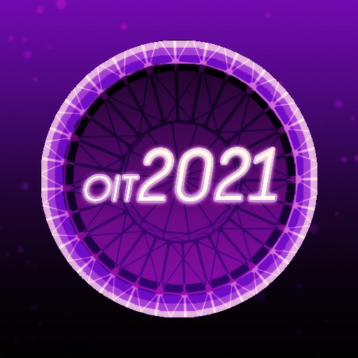
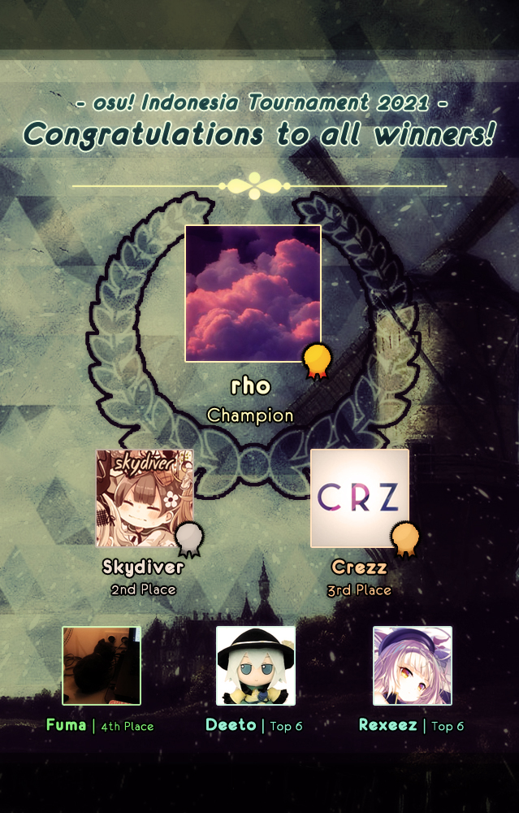

---
tags:
  - OIT2021
  - OIT 2021
---

# osu! Indonesia Tournament #11 (2021)

The **osu! Indonesia Tournament #11 (2021)** (***OIT 2021***) was an Indonesian double-elimination 1v1 osu! tournament hosted by ::{ flag=ID }:: [Fre](https://osu.ppy.sh/users/3484548) and co-hosted by ::{ flag=ID }:: [Niva](https://osu.ppy.sh/users/197805), ::{ flag=ID }:: [Senritsu](https://osu.ppy.sh/users/1165368), ::{ flag=ID }:: [Tama-desu](https://osu.ppy.sh/users/3813174), and ::{ flag=ID }:: [Rayhan Hamil](https://osu.ppy.sh/users/4085825). It was the eleventh iteration of the osu! Indonesia Tournament.

## Tournament schedule

| Event | Timestamp |
| --: | :-- |
| Registration phase | 2021-01-04/2021-01-24 |
| Screening phase | 2021-01-25/2021-01-31 |
| Qualifiers | 2021-02-01/2021-02-14 |
| Round of 32 | 2021-02-15/2021-02-21 |
| Round of 16 | 2021-02-22/2021-02-28 |
| Quarterfinals | 2021-03-01/2021-03-07 |
| Semifinals | 2021-03-08/2021-03-14 |
| Finals week 1 | 2021-03-15/2021-03-21 |
| Finals week 2 | 2021-03-22/2021-03-28 |

## Prizes

| Placing | Prize(s) |
| :-: | :-- |
|  | 50% of the raised prize pool, 6 months of osu!supporter, unique profile badge |
|  | 30% of the raised prize pool, 4 months of osu!supporter |
|  | 20% of the raised prize pool, 2 months of osu!supporter |

## Organisation

OIT 2021 was run by various osu! community members predominantly hailing from Indonesia.

| Position | Member(s) |
| :-- | :-- |
| Host | ::{ flag=ID }:: [Fre](https://osu.ppy.sh/users/3484548) |
| Co-host | ::{ flag=ID }:: [Niva](https://osu.ppy.sh/users/197805), ::{ flag=ID }:: [Senritsu](https://osu.ppy.sh/users/1165368), ::{ flag=ID }:: [Tama-desu](https://osu.ppy.sh/users/3813174), ::{ flag=ID }:: [Rayhan Hamil](https://osu.ppy.sh/users/4085825) |
| Mappool selector | ::{ flag=ID }:: [Fre](https://osu.ppy.sh/users/3484548), ::{ flag=ID }:: [Niva](https://osu.ppy.sh/users/197805), ::{ flag=ID }:: [Tama-desu](https://osu.ppy.sh/users/3813174), ::{ flag=ID }:: [Rayhan Hamil](https://osu.ppy.sh/users/4085825), ::{ flag=ID }:: [phizh](https://osu.ppy.sh/users/4569302), ::{ flag=ID }:: [F4UZ4N](https://osu.ppy.sh/users/11070577), ::{ flag=ID }:: [Kuro Fuyusaki](https://osu.ppy.sh/users/2667496) |
| Playtester | ::{ flag=ID }:: [-Kiichirou-](https://osu.ppy.sh/users/5791467), ::{ flag=ID }:: [Kirinagi](https://osu.ppy.sh/users/5937545), ::{ flag=ID }:: [Ganjo](https://osu.ppy.sh/users/9512538), ::{ flag=ID }:: [Calliope Mori](https://osu.ppy.sh/users/2429128) |
| Streamer | ::{ flag=ID }:: [Fre](https://osu.ppy.sh/users/3484548), ::{ flag=ID }:: [Victim_Crasher](https://osu.ppy.sh/users/2084869), ::{ flag=ID }:: [xHirayuki](https://osu.ppy.sh/users/3245206), ::{ flag=ID }:: [PanTsuArmy](https://osu.ppy.sh/users/9083094) |
| Commentator | ::{ flag=ID }:: [Fre](https://osu.ppy.sh/users/3484548), ::{ flag=ID }:: [Niva](https://osu.ppy.sh/users/197805), ::{ flag=ID }:: [phizh](https://osu.ppy.sh/users/4569302), ::{ flag=ID }:: [-Kiichirou-](https://osu.ppy.sh/users/5791467), ::{ flag=ID }:: [Kirinagi](https://osu.ppy.sh/users/5937545), ::{ flag=ID }:: [Victim_Crasher](https://osu.ppy.sh/users/2084869), ::{ flag=ID }:: [xHirayuki](https://osu.ppy.sh/users/3245206), ::{ flag=ID }:: [Akebono](https://osu.ppy.sh/users/1815316), ::{ flag=ID }:: [MasterfulNote5](https://osu.ppy.sh/users/7247988), ::{ flag=ID }:: [Velstadt](https://osu.ppy.sh/users/6209095), ::{ flag=ID }:: [Remuru](https://osu.ppy.sh/users/3654220), ::{ flag=ID }:: [Reyuza](https://osu.ppy.sh/users/2454767), ::{ flag=ID }:: [fry](https://osu.ppy.sh/users/4917604) |
| Referee | ::{ flag=ID }:: [Fre](https://osu.ppy.sh/users/3484548), ::{ flag=ID }:: [phizh](https://osu.ppy.sh/users/4569302), ::{ flag=ID }:: [F4UZ4N](https://osu.ppy.sh/users/11070577), ::{ flag=ID }:: [-Kiichirou-](https://osu.ppy.sh/users/5791467), ::{ flag=ID }:: [honeymint](https://osu.ppy.sh/users/4796773), ::{ flag=ID }:: [Fyl](https://osu.ppy.sh/users/10069307), ::{ flag=ID }:: [CookieSan](https://osu.ppy.sh/users/5634959), ::{ flag=ID }:: [NoVaLian](https://osu.ppy.sh/users/6459827), ::{ flag=ID }:: [Ceress](https://osu.ppy.sh/users/11062015), ::{ flag=ID }:: [Astrale](https://osu.ppy.sh/users/14667308), ::{ flag=ID }:: [Raids](https://osu.ppy.sh/users/15640966) |
| Graphic designer | ::{ flag=ID }:: [Niva](https://osu.ppy.sh/users/197805), ::{ flag=ID }:: [Tama-desu](https://osu.ppy.sh/users/3813174), ::{ flag=ID }:: [Firia](https://osu.ppy.sh/users/9730262), ::{ flag=FI }:: [shdewz](https://osu.ppy.sh/users/10000899) |
| Wiki editor | ::{ flag=ID }:: [Niva](https://osu.ppy.sh/users/197805) |

## Links

- **[Master spreadsheet](https://docs.google.com/spreadsheets/d/1R7y585_PIb5XrFvDQk-rlI0vSlr2FyGkhCmPzorNhuU/edit#gid=1680086225)**
- [Forum thread](https://osu.ppy.sh/community/forums/topics/1215072)
- [Discord server](https://discordapp.com/invite/CHRFffH)
- [Livestream channel](https://www.twitch.tv/osuindonesia)
- [Challonge brackets](https://challonge.com/OIT2021)

## Participants

Listed below are players who qualified into the Round of 32 (along with their respective seed number and average map rank combined from each individual Qualifier beatmaps) out of 106 registered players in total.

| Seed No. | Player | Avg. Map Rank |
| :-- | :-- | :-- |
| 1 | ::{ flag=ID }:: [Skydiver](https://osu.ppy.sh/users/4750008) | 8.2 |
| 2 | ::{ flag=ID }:: [rho](https://osu.ppy.sh/users/1629553) | 8.5 |
| 3 | ::{ flag=ID }:: [Vinno](https://osu.ppy.sh/users/10717635) | 8.6 |
| 4 | ::{ flag=ID }:: [Deeto](https://osu.ppy.sh/users/10069909) | 9.0 |
| 5 | ::{ flag=ID }:: [MineFrostID](https://osu.ppy.sh/users/12159899) | 9.1 |
| 6 | ::{ flag=ID }:: [Walfrid](https://osu.ppy.sh/users/6600809) | 10.4 |
| 7 | ::{ flag=ID }:: [Rexeez](https://osu.ppy.sh/users/1987591) | 10.6 |
| 8 | ::{ flag=ID }:: [Lifeline](https://osu.ppy.sh/users/11367222) | 11.1 |
| 9 | ::{ flag=ID }:: [Crezz](https://osu.ppy.sh/users/7108275) | 12.2 |
| 10 | ::{ flag=ID }:: [LoidKun](https://osu.ppy.sh/users/6437601) | 14.0 |
| 11 | ::{ flag=ID }:: [Fuma](https://osu.ppy.sh/users/1501956) | 15.2 |
| 12 | ::{ flag=ID }:: [- Rosemary -](https://osu.ppy.sh/users/2526649) | 17.7[^rosemary-note] |
| 13 | ::{ flag=ID }:: [Thatnoobguy](https://osu.ppy.sh/users/11091594) | 18.4 |
| 14 | ::{ flag=ID }:: [Skitzor](https://osu.ppy.sh/users/3353314) | 18.5 |
| 15 | ::{ flag=ID }:: [Herbayse](https://osu.ppy.sh/users/4924094) | 18.9 |
| 16 | ::{ flag=ID }:: [Takaichi](https://osu.ppy.sh/users/909745) | 21.2 |
| 17 | ::{ flag=ID }:: [cfood](https://osu.ppy.sh/users/8626190) | 21.3 |
| 18 | ::{ flag=ID }:: [Vvn](https://osu.ppy.sh/users/3204677) | 22.4 |
| 19 | ::{ flag=ID }:: [fry](https://osu.ppy.sh/users/4917604) | 22.7 |
| 20 | ::{ flag=ID }:: [Daffy](https://osu.ppy.sh/users/5968633) | 24.0 |
| 21 | ::{ flag=ID }:: [Venta](https://osu.ppy.sh/users/11320627) | 24.6 |
| 22 | ::{ flag=ID }:: [Fayn](https://osu.ppy.sh/users/5390495) | 26.9 |
| 23 | ::{ flag=ID }:: [Caruma](https://osu.ppy.sh/users/13187450) | 27.0 |
| 24 | ::{ flag=ID }:: [Eliz](https://osu.ppy.sh/users/11759284) | 27.2 |
| 25 | ::{ flag=ID }:: [Firia](https://osu.ppy.sh/users/9730262) | 27.3 |
| 26 | ::{ flag=ID }:: [Suikami](https://osu.ppy.sh/users/1929336) | 27.6 |
| 27 | ::{ flag=ID }:: [Clayweg](https://osu.ppy.sh/users/11374005) | 28.2 |
| 28 | ::{ flag=ID }:: [ngonk](https://osu.ppy.sh/users/4750008) | 28.7 |
| 29 | ::{ flag=ID }:: [Contra](https://osu.ppy.sh/users/12011863) | 29.4 |
| 30 | ::{ flag=ID }:: [Somay 287](https://osu.ppy.sh/users/4314559) | 29.5 |
| 31 | ::{ flag=ID }:: [xHirayuki](https://osu.ppy.sh/users/3245206) | 31.5 |
| 32 | ::{ flag=ID }:: [Xicyte](https://osu.ppy.sh/users/10212581) | 31.7 |

## Podium

## Mappools

### Finals week 2

**[Download the mappack here! (164 MB)](https://drive.google.com/file/d/1skji2yO502KAPe9VHM2EqwbRlmmHq-Oh/view)**

- NoMod
  1. [nao - Toaru Shoukoku no Ohime-sama ga (Lyruke) \[Ratifa\]](https://osu.ppy.sh/beatmapsets/1389145#osu/2868816)
  2. [technoplanet - Juvenile (Astronic) \[Ataraxis\]](https://osu.ppy.sh/beatmapsets/1280204#osu/2659368)
  3. [THE BINARY mido - Ego mo Id mo Tanjun ni (kuyusu) \[Expert\]](https://osu.ppy.sh/beatmapsets/1268824#osu/2636826)
  4. [Camellia - PSYCHO+HEROES (lcfc) \[Extreme\]](https://osu.ppy.sh/beatmapsets/1404742#osu/2897138)
  5. [Frums - Star Of The COME ON!! (Zelq) \[Expert\]](https://osu.ppy.sh/beatmapsets/1276329#osu/2651796)
  6. [II-L - VOSTOK-6 (DeviousPanda) \[Beyond\]](https://osu.ppy.sh/beatmapsets/1380791#osu/2852981)
- Hidden
  1. [Nekomata Master+ - encounter (Realazy) \[Yusomi's Confusion\]](https://osu.ppy.sh/beatmapsets/815758#osu/2004828)
  2. [Buta-Otome - towa no maigo (Natteke desu) \[ar8 edit\]](https://osu.ppy.sh/beatmapsets/639108#osu/2900413)
  3. [Wagakki Band - Hanabi (toybot) \[Flask's Extra\]](https://osu.ppy.sh/beatmapsets/1214150#osu/2811451)
  4. [Camellia - FLYING OUT TO THE SKY (covered by Nanahira, moimoi, Nana Takahashi) (Cut Ver.) (Ryuusei Aika) \[THRILL ABUSE\]](https://osu.ppy.sh/beatmapsets/1308842#osu/2716029)
- HardRock
  1. [Powerless feat. Sennzai - Unrequited (VINXIS) \[Reunion\]](https://osu.ppy.sh/beatmapsets/543109#osu/1162811)
  2. [Falcom Sound Team jdk - Seductive Shudder (jonathanlfj) \[Bewitching Red Moon\]](https://osu.ppy.sh/beatmapsets/1306626#osu/2709095)
  3. [ZUN arr. Myon/iimode-do/Kagekichi - Plastic Mind (Celine) \[#OITedit\]](https://osu.ppy.sh/beatmapsets/1404241#osu/2896221)
  4. [Coda - BLOODY STREAM (Yudragen) \[LINEAGE\]](https://osu.ppy.sh/beatmapsets/1075797#osu/2251000)
- DoubleTime
  1. [AZKi - without U (Bokamin) \[Yasai's Another\]](https://osu.ppy.sh/beatmapsets/1259830#osu/2619363)
  2. [S.S.H. - Sorcerian \~ Major Demon (Elcheer) \[oldrhythm\]](https://osu.ppy.sh/beatmapsets/1272001#osu/2651733)
  3. [Virtual Riot - Rampage (C00L) \[Zizou's Insane\]](https://osu.ppy.sh/beatmapsets/810556#osu/2301162)
  4. [KOTOKO - Wing my Way (CXu) \[Endless Sky\]](https://osu.ppy.sh/beatmapsets/850548#osu/1778268)
- FreeMod
  1. [eisyo-kobu - Faithtival (Shiroha) \[Yokes' Extra\]](https://osu.ppy.sh/beatmapsets/1040472#osu/2260268)
  2. [YOASOBI - Yoru ni Kakeru (Petal) \[Acceptance\]](https://osu.ppy.sh/beatmapsets/1238759#osu/2575572)
- Tiebreaker
  1. **[Imperial Circus Dead Decadence - Gekiai No Yobigoe Ga Dekiai No Sakebigoe Wo Kurau (IsomirDiAngelo) \[Blindness and Tragedy\]](https://osu.ppy.sh/beatmapsets/1201605#osu/2502643)**

### Finals week 1

**[Download the mappack here! (160 MB)](https://drive.google.com/file/d/1ijv8NwJ1p-DUCBDoF76ZkTLuwhhPzd0A/view)**

- NoMod
  1. [ABSOLUTE CASTAWAY - SPiNEL (Celine) \[Feline Collab #OITEdit\]](https://osu.ppy.sh/beatmapsets/1401813#osu/2891998)
  2. [xi - Longinus (Regou) \[FOUR DIMENSIONS\]](https://osu.ppy.sh/beatmapsets/1396101#osu/2881524)
  3. [Hatsuki Yura - The Clockwork Rose -Tokei Shikake no Bara Shoujo- (My Angel Watame) \[Corruption\]](https://osu.ppy.sh/beatmapsets/849824#osu/1776939)
  4. [Raphlesia & BilliumMoto - My Love (Mao) \[Our Love\]](https://osu.ppy.sh/beatmapsets/1388906#osu/2868388)
  5. [goreshit - xenobeat (fergas) \[DeathleSS\]](https://osu.ppy.sh/beatmapsets/1306568#osu/2708952)
  6. [Hagane - Event Horizon (yaspo) \[Beyond Corsace\]](https://osu.ppy.sh/beatmapsets/1276324#osu/2651787)
- Hidden
  1. [inabakumori - NON-USE (kuyusu) \[Expert\]](https://osu.ppy.sh/beatmapsets/1317045#osu/2728951)
  2. [P4koo - Forbidden Light (Gibune) \[ak74 & Garden's Ultra\]](https://osu.ppy.sh/beatmapsets/1279878#osu/2658705)
  3. [Dimrain47 - Infernoplex (AncuL) \[Planetary Collision 2021 but AR8.3\]](https://osu.ppy.sh/beatmapsets/780203#osu/2845272)
  4. [LeaF - Poison AND/OR Affection (Flask) \[Arithmetic Love\]](https://osu.ppy.sh/beatmapsets/1130436#osu/2361362)
- HardRock
  1. [Feryquitous feat. Aitsuki Nakuru - Fake (captin1) \[Irregular\]](https://osu.ppy.sh/beatmapsets/1146723#osu/2394332)
  2. [Negentropy (a.k.a. Team Grimoire) - ouroVoros (Suzuki\_1112) \[Demonic Another\]](https://osu.ppy.sh/beatmapsets/707164#osu/1495322)
  3. [ABSOLUTE CASTAWAY - Dokoku no Mori (Celine) \[#OITedit feat. awan\]](https://osu.ppy.sh/beatmapsets/1337376#osu/2891992)
  4. [DUSTCELL - Anemone (Sparhten) \[Irrational\]](https://osu.ppy.sh/beatmapsets/1247651#osu/2593243)
- DoubleTime
  1. [Mitchie M feat. Hatsune Miku with KAITO - Ohedo Julia-Night (Natsu) \[Dance Floor\]](https://osu.ppy.sh/beatmapsets/664099#osu/1405572)
  2. [MuryokuP - Mephisto (Niva) \[captin1's Insane (OIT Edit) (hi captin)\]](https://osu.ppy.sh/beatmapsets/1402174#osu/2892700)
  3. [Minase Inori, Hanazawa Kana, Iguchi Yuka, Hayami Saori - Koko kara, Koko kara (Asuka\_-) \[Sora\]](https://osu.ppy.sh/beatmapsets/840217#osu/1758793)
  4. [Juno Reactor - Magnetic (PandaHero) \[Insane (right version)\]](https://osu.ppy.sh/beatmapsets/1346647#osu/2890576)
- FreeMod
  1. [Feryquitous - Ordirehv (ScubDomino) \[Abscibus\]](https://osu.ppy.sh/beatmapsets/1272110#osu/2643413)
  2. [Kurosawa Daisuke x Masahiro "Godspeed" Aoki - Dairokutenmaou (pw384) \[Extreme\]](https://osu.ppy.sh/beatmapsets/1120841#osu/2371971)
- Tiebreaker
  1. **[Ariabl'eyeS - Senkou no Flare (Lyruke) \[Litmuss55\]](https://osu.ppy.sh/beatmapsets/1264419#osu/2695955)**

### Semifinals

**[Download the mappack here! (161 MB)](https://drive.google.com/file/d/1cLvH3PG2cnhJSfCTBY9Wqbs3Mbf2w4Ej/view)**

- NoMod
  1. [ReoNa - ANIMA (SkyFlame) \[EVERLASTING\]](https://osu.ppy.sh/beatmapsets/1219288#osu/2536719)
  2. [xi - Bad Elixir (Cherry Blossom) \[Idealism\]](https://osu.ppy.sh/beatmapsets/878944#osu/1838165)
  3. [Akatsuki Records - BLOODSHED (Zelq) \[Extra\]](https://osu.ppy.sh/beatmapsets/937624#osu/1958623)
  4. [Camellia - #1f1e33 (Realazy) \[Acyl x Heilia's Extra\]](https://osu.ppy.sh/beatmapsets/1192060#osu/2708956)
  5. [UNDEAD CORPORATION - Bleed, hate, curse, and die (Weriko) \[Hate\]](https://osu.ppy.sh/beatmapsets/1269276#osu/2646572)
  6. [Shimotsuki Haruka - Tsubasa o Motanai Shoujo (Dored) \[Rio's Eztra\]](https://osu.ppy.sh/beatmapsets/883825#osu/1866037)
- Hidden
  1. [\*Luna feat. IA - Start Line (Cut Ver.) (Niva) \[Niva x Kuro Fuyusaki's Sea Food Extra\]](https://osu.ppy.sh/beatmapsets/1395285#osu/2880033)
  2. [Zips - Heisei Sayonara Bye Bye (X Light) \[\_Epreus' Sayonara\]](https://osu.ppy.sh/beatmapsets/1187102#osu/2602843)
  3. [Myrath - Dance (Axarious) \[Collab\]](https://osu.ppy.sh/beatmapsets/1142634#osu/2386204)
  4. [Yorushika - Thoughtcrime (Skydiver) \[Thought Criminal\]](https://osu.ppy.sh/beatmapsets/1268323#osu/2635938)
- HardRock
  1. [ShinRa-Bansho - Pink Kurage to, Sotto, Kiss o Shita. (UberFazz) \[bongo's Extra Stage.\]](https://osu.ppy.sh/beatmapsets/1180982#osu/2485186)
  2. [L.E.D. - THE LAST STRIKER (Kloyd) \[Expert\]](https://osu.ppy.sh/beatmapsets/1085929#osu/2270810)
  3. [t+pazolite - Pee-Kan Breaks (Urushi38) \[yaaa\]](https://osu.ppy.sh/beatmapsets/179725#osu/432028)
  4. [toby fox vs. Ferdk - Battle Against a True Hero (Hobbes2) \[Genocide\]](https://osu.ppy.sh/beatmapsets/576030#osu/1457925)
- DoubleTime
  1. [Zekk - SUMMER (\_Everlasting) \[Insane\]](https://osu.ppy.sh/beatmapsets/972446#osu/2052273)
  2. [Atogoru - Itoshi Kimi wo Mitsuke Ni (bakabaka) \[Insane\]](https://osu.ppy.sh/beatmapsets/29044#osu/96523)
  3. [zts - miragecoordinator (tricolor) \[nanairo\]](https://osu.ppy.sh/beatmapsets/1283092#osu/2664727)
  4. [Ceui - Hoshi Ori Yume Mirai (-Nanaka-) \[Silky's Insane\]](https://osu.ppy.sh/beatmapsets/268509#osu/1079089)
- FreeMod
  1. [Isekai Joucho - Kyoukankaku Obake (Calvaria) \[melloe's Desperation\]](https://osu.ppy.sh/beatmapsets/1141909#osu/2385598)
  2. [DUSTCELL - CULT (anna apple) \[Love, Assault, and Worship\]](https://osu.ppy.sh/beatmapsets/1271997#osu/2643204)
- Tiebreaker
  1. **[ELFENSJoN - Akayake no Majo (Hey lululu) \[Scarlet World\]](https://osu.ppy.sh/beatmapsets/996649#osu/2084661)**

### Quarterfinals

**[Download the mappack here! (163 MB)](https://drive.google.com/file/d/1cWKli8nWJv5Biw6XMEU_hml1PjsYgHBN/view)**

- NoMod
  1. [Kurosaki Maon - Setsuna no Kajitsu (jonathanlfj) \[captin lfj's Paradise\]](https://osu.ppy.sh/beatmapsets/332112#osu/1900365)
  2. [Ryu\* - Sakura Mirage (STARLiGHT Mix) (Jean-Michel Jr) \[Illusion\]](https://osu.ppy.sh/beatmapsets/765795#osu/1918015)
  3. [fripSide - only my railgun (Petal) \[Extraordinary\]](https://osu.ppy.sh/beatmapsets/1358802#osu/2811763)
  4. [Getty vs. DJ DiA - Engage-Rex (Realazy) \[Leadcore's Extra\]](https://osu.ppy.sh/beatmapsets/1336197#osu/2768158)
  5. [Gram (DJ Genki) - Nibelungen (Sakura Blossom) \[Extreme\]](https://osu.ppy.sh/beatmapsets/1040056#osu/2557524)
  6. [Gekidan Record feat. Nekomata Master - Houkou Orpheus (DeviousPanda) \[Mystery\]](https://osu.ppy.sh/beatmapsets/1257522#osu/2613064)
- Hidden
  1. [Nor + YUC'e - Mint Comet (JrSzZ) \[Chromatic\]](https://osu.ppy.sh/beatmapsets/1000076#osu/2092293)
  2. [Amuro vs Killer - Mei (Acylica) \[Muya's Another\]](https://osu.ppy.sh/beatmapsets/1148799#osu/2411485)
  3. [Feryquitous - Quon-Extend- (captin1) \[hi niva\]](https://osu.ppy.sh/beatmapsets/1362537#osu/2858703)
  4. [Hana - Kuukirikigaku Shoujo to Shounen no Uta (Luscent) \[Garden & ak74's Jabberwocky Extra\]](https://osu.ppy.sh/beatmapsets/1164291#osu/2744129)
- HardRock
  1. [fhana - Comet Lucifer \~The Seed and the Sower\~ (Nao Tomori) \[Nathan's Extra\]](https://osu.ppy.sh/beatmapsets/890244#osu/1861814)
  2. [UNDEAD CORPORATION - Through Your Optic (Sparhten) \[xChippy's Extra\]](https://osu.ppy.sh/beatmapsets/1022770#osu/2238838)
  3. [ak+q - Axium Crisis (MrSergio) \[Collapse\]](https://osu.ppy.sh/beatmapsets/812551#osu/1704329)
  4. [Shimotsuki Haruka - un secret (ImpurePug) \[rose\]](https://osu.ppy.sh/beatmapsets/1014611#osu/2125846)
- DoubleTime
  1. [P4koo - 8th:Planet \~Re:search\~ (Niva) \[Chapter 1 : We Are Beyond Human\]](https://osu.ppy.sh/beatmapsets/1295410#osu/2687876)
  2. [nmk - sola (sjoy) \[cwR's Insane\]](https://osu.ppy.sh/beatmapsets/183267#osu/440413)
  3. [zts - goldenslaughterer (Dada) \[The First Twilight\]](https://osu.ppy.sh/beatmapsets/931948#osu/2367515)
  4. [frederic - ONLYWONDER (Faito) \[Collab Insane\]](https://osu.ppy.sh/beatmapsets/1177496#osu/2466867)
- FreeMod
  1. [nana(Sevencolors) - chameleon (RVMathew) \[Ojou\]](https://osu.ppy.sh/beatmapsets/1046876#osu/2202224)
  2. [Umeboshi Chazuke - Galaxy in Toybox (DC Update Ver.) (Star Stream) \[Mirash's Extra\]](https://osu.ppy.sh/beatmapsets/1155525#osu/2485087)
- Tiebreaker
  1. **[Receptor - Redstar (Raikozen) \[REALITY ECLIPSE\]](https://osu.ppy.sh/beatmapsets/996649#osu/2084661)**

### Round of 16

**[Download the mappack here! (100 MB)](https://drive.google.com/file/d/1jB5uAgWW7uv8f7BG0Y8KllXfR6CPUxG1/view)**

- NoMod
  1. [Denkishiki Karen Ongaku Shuudan - gemini (Star Stream) \[Extra\]](https://osu.ppy.sh/beatmapsets/182815#osu/438187)
  2. [F-777 - Unsafe Speeds (Nozhomi) \[Extra\]](https://osu.ppy.sh/beatmapsets/1311130#osu/2717662)
  3. [Hoshimachi Suisei - NEXT COLOR PLANET (Lortus) \[Shiny\]](https://osu.ppy.sh/beatmapsets/1135387#osu/2371242)
  4. [nora2r - ULTRA B+K (Shirasaka Koume) \[ULTRA Collab\]](https://osu.ppy.sh/beatmapsets/883219#osu/1846365)
  5. [Laur - Nostalgic Blood of the Strife (Zelq) \[Expert\]](https://osu.ppy.sh/beatmapsets/1257525#osu/2613076)
- Hidden
  1. [ovEnola - Noose (Cut Ver.) (BOUYAAA) \[Death\]](https://osu.ppy.sh/beatmapsets/1348020#osu/2791506)
  2. [ICE - Majestic Phoenix (Zetera) \[N/A's Burning Insane\]](https://osu.ppy.sh/beatmapsets/845094#osu/1775716)
  3. [Nekomata Master+ - chaos eater (pocket-) \[Hunger\]](https://osu.ppy.sh/beatmapsets/1248923#osu/2595779)
- HardRock
  1. [BUTAOTOME - Kyouen (Leader) \[Extra Stage\]](https://osu.ppy.sh/beatmapsets/1336424#osu/2768610)
  2. [Kozato Snow - 45nen no Yukizakura (Gust) \[SAKASAKA\]](https://osu.ppy.sh/beatmapsets/1128204#osu/2357044)
  3. [Memme - Pandemonium (sdfasf) \[Lasse's Extra: #8\]](https://osu.ppy.sh/beatmapsets/734190#osu/1550984)
- DoubleTime
  1. [TrySail - azure (VINXIS) \[Mirror\]](https://osu.ppy.sh/beatmapsets/879262#osu/1838785)
  2. [ALiCE'S EMOTION - Selfish (Tsukasa Remix) (Mixagji) \[Lunatic old\]](https://osu.ppy.sh/beatmapsets/55214#osu/2822364)
  3. [Nhato - Gekka (Short Ver.) (Cubby) \[Niva's Insane (OIT Edit)\]](https://osu.ppy.sh/beatmapsets/1382026#osu/2855475)
- FreeMod
  1. [SHK - Identity Part II (ktgster) \[SHD\]](https://osu.ppy.sh/beatmapsets/309807#osu/692495)
  2. [Ryokuoushoku Shakai - Mela! (Battle) \[Hero!\]](https://osu.ppy.sh/beatmapsets/1209920#osu/2519013)
- Tiebreaker
  1. **[Sound piercer feat. DAZBEE - Hanatachi ni Kibou o (\_Kobii) \[Peter's Petal\]](https://osu.ppy.sh/beatmapsets/1300204#osu/2697174)**

### Round of 32

**[Download the mappack here! (114 MB)](https://drive.google.com/file/d/1bpPhDewj_pXvKkB45Iwzu8JXvcqCJKpT/view)**

- NoMod
  1. [Natsume Itsuki - Beginning (Garden) \[Prologue\]](https://osu.ppy.sh/beatmapsets/1173059#osu/2446555)
  2. [cosMo@BousouP - Hyper LATiON (-Tynamo) \[Astronic's Extra\]](https://osu.ppy.sh/beatmapsets/1281410#osu/2680501)
  3. [Cilvery - Kamisama Nejimaki (sukiNathan) \[Catastrophe\]](https://osu.ppy.sh/beatmapsets/374900#osu/821238)
  4. [Krewella - Killin' It (Sped Up Ver.) (tatemae) \[Syntagmatic\]](https://osu.ppy.sh/beatmapsets/1231408#osu/2559899)
  5. [MAX MAXIMIZER vs. DJ TOTTO - Rebellio (Realazy) \[NINO'S EXTRA\]](https://osu.ppy.sh/beatmapsets/744636#osu/1593690)
- Hidden
  1. [LiSA - ADAMAS (VINXIS) \[winber1 x Sing's Extra\]](https://osu.ppy.sh/beatmapsets/867789#osu/1819540)
  2. [ririco - Kawaiku Naritai (feat. Sana) (Moecho) \[Kawaiku Natta\]](https://osu.ppy.sh/beatmapsets/1342061#osu/2779993)
  3. [Green Day - Basket Case (h3ct1c) \[xbopost's Insane\]](https://osu.ppy.sh/beatmapsets/1142364#osu/2407774)
- HardRock
  1. [Nanahoshi Kangengakudan - ITYNITED IDENTITY (sammish) \[Unidentifiable\]](https://osu.ppy.sh/beatmapsets/744955#osu/1570573)
  2. [Nekomata Master - Izanami's wail (Uberzolik) \[Insane\]](https://osu.ppy.sh/beatmapsets/792367#osu/1662038)
  3. [Rabpit - Sacred (Matrix) \[Insane\]](https://osu.ppy.sh/beatmapsets/1044692#osu/2185350)
- DoubleTime
  1. [SHK - SO HOT (Remix by SHK) (AngelHoney) \[Hard\]](https://osu.ppy.sh/beatmapsets/40086#osu/127409)
  2. [zts - worldenddominator (deetz) \[PandaHero's Insane\]](https://osu.ppy.sh/beatmapsets/897884#osu/1946272)
  3. [Chata - Engage (Lasse) \[Insane\]](https://osu.ppy.sh/beatmapsets/875962#osu/1832015)
- FreeMod
  1. [Glasslake - Separated Union (DaRRi MIx) \[Hard\]](https://osu.ppy.sh/beatmapsets/17935#osu/63787)
  2. [ARForest - Lantinid (Nozhomi) \[Niva's Extra\]](https://osu.ppy.sh/beatmapsets/1250431#osu/2668675)
- Tiebreaker
  1. **[wavforme x Annabel - own phrases (captin1) \[Abyss\]](https://osu.ppy.sh/beatmapsets/894919#osu/1870002)**

### Qualifiers

**[Download the mappack here! (76 MB)](https://drive.google.com/file/d/1V68Jl6ddSMMXsWiBhA0ZWXoS4aWeLRaA/view)**

- NoMod
  1. [Mary - Vivid (BarkingMadDog) \[Henceforth\]](https://osu.ppy.sh/beatmapsets/1230253#osu/2557665)
  2. [xi - Ascension to Heaven (-Tynamo) \[Boshyman's Extra\]](https://osu.ppy.sh/beatmapsets/968656#osu/2547374)
  3. [KaratoPanchiiShounen feat. Haruno - A Wandering Melody of Love (papple104) \[Mind's Extra\]](https://osu.ppy.sh/beatmapsets/1106189#osu/2407780)
  4. [UiNA, Occhoko Bunny - Aa Kenran no Yume ga Gotoku (Epsilon Remix 2018) (Petal) \[Extra (OIT Edit)\]](https://osu.ppy.sh/beatmapsets/1363389#osu/2820648)
- Hidden
  1. [Rin - Moriya set 08 ReEdit \~ Youkai no Yama (jonathanlfj) \[Extra Stage\]](https://osu.ppy.sh/beatmapsets/751866#osu/1582806)
  2. [Emily Osment - Hero in Me (AJT) \[Save The Day\]](https://osu.ppy.sh/beatmapsets/1229079#osu/2555552)
- HardRock
  1. [UNDEAD CORPORATION - Adore Your Pain (jomnhnk) \[Lunatic\]](https://osu.ppy.sh/beatmapsets/76745#osu/217083)
  2. [Kairiki bear feat. Hatsune Miku - Telesto Teles (Ryuusei Aika) \[wafer's Expert\]](https://osu.ppy.sh/beatmapsets/1196329#osu/2500705)
- DoubleTime
  1. [Hanatan - Kokoro (sodarose) \[Miracle\]](https://osu.ppy.sh/beatmapsets/1005463#osu/2104338)
  2. [Sunpon - Skyscraper Grief (Natteke) \[Happy's Lunatic\]](https://osu.ppy.sh/beatmapsets/15200#osu/69390)

## Match results

### Finals (week 2)

Friday, 26 March 2021:

| Bracket | Player 1 |  |  | Player 2 | Match link |
| :-: | --: | :-: | :-: | :-- | :-- |
| Lower | [Crezz](https://osu.ppy.sh/users/7108275) ::{ flag=ID }:: | 4 | **7** | ::{ flag=ID }:: **[Skydiver](https://osu.ppy.sh/users/4750008)** | [#1](https://osu.ppy.sh/community/matches/79111217) |

Saturday, 27 March 2021, Grand Final:

| Bracket | Player 1 |  |  | Player 2 | Match link |
| :-: | --: | :-: | :-: | :-- | :-- |
| Grand Final | **[rho](https://osu.ppy.sh/users/1629553)** ::{ flag=ID }:: | **7** | 4 | ::{ flag=ID }:: [Skydiver](https://osu.ppy.sh/users/4750008) | [#1](https://osu.ppy.sh/community/matches/79206937) |

### Finals (week 1)

Friday, 19 March 2021:

| Bracket | Player 1 |  |  | Player 2 | Match link |
| :-: | --: | :-: | :-: | :-- | :-- |
| Upper | [Crezz](https://osu.ppy.sh/users/7108275) ::{ flag=ID }:: | 4 | **7** | ::{ flag=ID }:: **[rho](https://osu.ppy.sh/users/1629553)** | [#1](https://osu.ppy.sh/community/matches/78462490) |

Saturday, 20 March 2021:

| Bracket | Player 1 |  |  | Player 2 | Match link |
| :-: | --: | :-: | :-: | :-- | :-- |
| Lower | [Fuma](https://osu.ppy.sh/users/1501956) ::{ flag=ID }:: | 3 | **7** | ::{ flag=ID }:: **[Rexeez](https://osu.ppy.sh/users/1987591)** | [#1](https://osu.ppy.sh/community/matches/78552464) |
| Lower | [Deeto](https://osu.ppy.sh/users/10069909) ::{ flag=ID }:: | 3 | **7** | ::{ flag=ID }:: **[Skydiver](https://osu.ppy.sh/users/4750008)** | [#1](https://osu.ppy.sh/community/matches/78537165) |

Sunday, 21 March 2021:

| Bracket | Player 1 |  |  | Player 2 | Match link |
| :-: | --: | :-: | :-: | :-- | :-- |
| Lower | [Rexeez](https://osu.ppy.sh/users/1987591) ::{ flag=ID }:: | 3 | **7** | ::{ flag=ID }:: **[Skydiver](https://osu.ppy.sh/users/4750008)** | [#1](https://osu.ppy.sh/community/matches/78642911) |

### Semifinals

Friday, 12 March 2021:

| Bracket | Player 1 |  |  | Player 2 | Match link |
| :-: | --: | :-: | :-: | :-- | :-- |
| Upper | **[rho](https://osu.ppy.sh/users/1629553)** ::{ flag=ID }:: | **6** | 2 | ::{ flag=ID }:: [Fuma](https://osu.ppy.sh/users/1501956) | [#1](https://osu.ppy.sh/community/matches/77867003) |
| Lower | **[Skydiver](https://osu.ppy.sh/users/4750008)** ::{ flag=ID }:: | **6** | 0 | ::{ flag=ID }:: [LoidKun](https://osu.ppy.sh/users/6437601) | *win by default* |

Saturday, 13 March 2021:

| Bracket | Player 1 |  |  | Player 2 | Match link |
| :-: | --: | :-: | :-: | :-- | :-- |
| Lower | [Venta](https://osu.ppy.sh/users/11320627) ::{ flag=ID }:: | 0 | **6** | ::{ flag=ID }:: **[Skitzor](https://osu.ppy.sh/users/3353314)** | [#1](https://osu.ppy.sh/community/matches/78048476) |
| Lower | [cfood](https://osu.ppy.sh/users/8626190) ::{ flag=ID }:: | 5 | **6** | ::{ flag=ID }:: **[Rexeez](https://osu.ppy.sh/users/1987591)** | [#1](https://osu.ppy.sh/community/matches/77969671) |
| Lower | **[MineFrostID](https://osu.ppy.sh/users/12159899)** ::{ flag=ID }:: | **6** | 1 | ::{ flag=ID }:: [Somay 287](https://osu.ppy.sh/users/4314559) | [#1](https://osu.ppy.sh/community/matches/78052798) |

Sunday, 14 March 2021:

| Bracket | Player 1 |  |  | Player 2 | Match link |
| :-: | --: | :-: | :-: | :-- | :-- |
| Lower | [Skitzor](https://osu.ppy.sh/users/3353314) ::{ flag=ID }:: | 1 | **6** | ::{ flag=ID }:: **[Rexeez](https://osu.ppy.sh/users/1987591)** | [#1](https://osu.ppy.sh/community/matches/78055159) |
| Lower | [MineFrostID](https://osu.ppy.sh/users/12159899) ::{ flag=ID }:: | 1 | **6** | ::{ flag=ID }:: **[Skydiver](https://osu.ppy.sh/users/4750008)** | [#1](https://osu.ppy.sh/community/matches/78060403) |

Monday, 15 March 2021:

| Bracket | Player 1 |  |  | Player 2 | Match link |
| :-: | --: | :-: | :-: | :-- | :-- |
| Upper | **[Crezz](https://osu.ppy.sh/users/7108275)** ::{ flag=ID }:: | **6** | 1 | ::{ flag=ID }:: [Deeto](https://osu.ppy.sh/users/10069909) | [#1](https://osu.ppy.sh/community/matches/78129428) |

### Quarterfinals

Friday, 5 March 2021:

| Bracket | Player 1 |  |  | Player 2 | Match link |
| :-: | --: | :-: | :-: | :-- | :-- |
| Lower | [Splacten](https://osu.ppy.sh/users/10018405) ::{ flag=ID }:: | 1 | **6** | ::{ flag=ID }:: **[Vvn](https://osu.ppy.sh/users/3204677)** | [#1](https://osu.ppy.sh/community/matches/77256653) |
| Lower | **[Lifeline](https://osu.ppy.sh/users/11367222)** ::{ flag=ID }:: | **6** | 3 | ::{ flag=ID }:: [Vinno](https://osu.ppy.sh/users/10717635) | [#1](https://osu.ppy.sh/community/matches/77271481) |
| Lower | **[Rexeez](https://osu.ppy.sh/users/1987591)** ::{ flag=ID }:: | **6** | 1 | ::{ flag=ID }:: [Thatnoobguy](https://osu.ppy.sh/users/11091594) | [#1](https://osu.ppy.sh/community/matches/77259794) |

Saturday, 6 March 2021:

| Bracket | Player 1 |  |  | Player 2 | Match link |
| :-: | --: | :-: | :-: | :-- | :-- |
| Lower | **[MineFrostID](https://osu.ppy.sh/users/12159899)** ::{ flag=ID }:: | **6** | 4 | ::{ flag=ID }:: [xHirayuki](https://osu.ppy.sh/users/3245206) | [#1](https://osu.ppy.sh/community/matches/77367126) |
| Upper | **[Deeto](https://osu.ppy.sh/users/10069909)** ::{ flag=ID }:: | **6** | 4 | ::{ flag=ID }:: [Venta](https://osu.ppy.sh/users/11320627) | [#1](https://osu.ppy.sh/community/matches/77358899) |
| Lower | [Daffy](https://osu.ppy.sh/users/5968633) ::{ flag=ID }:: | 1 | **6** | ::{ flag=ID }:: **[Caruma](https://osu.ppy.sh/users/13187450)** | [#1](https://osu.ppy.sh/community/matches/77346023) |
| Upper | **[rho](https://osu.ppy.sh/users/1629553)** ::{ flag=ID }:: | **6** | 2 | ::{ flag=ID }:: [LoidKun](https://osu.ppy.sh/users/6437601) | [#1](https://osu.ppy.sh/community/matches/77353978) |
| Lower | **[Skydiver](https://osu.ppy.sh/users/4750008)** ::{ flag=ID }:: | **6** | 0 | ::{ flag=ID }:: [Fayn](https://osu.ppy.sh/users/5390495) | [#1](https://osu.ppy.sh/community/matches/77362941) |
| Lower | **[Walfrid](https://osu.ppy.sh/users/6600809)** ::{ flag=ID }:: | **6** | 0 | ::{ flag=ID }:: [Takaichi](https://osu.ppy.sh/users/909745) | *win by default* |

Sunday, 7 March 2021:

| Bracket | Player 1 |  |  | Player 2 | Match link |
| :-: | --: | :-: | :-: | :-- | :-- |
| Upper | [cfood](https://osu.ppy.sh/users/8626190) ::{ flag=ID }:: | 1 | **6** | ::{ flag=ID }:: **[Crezz](https://osu.ppy.sh/users/7108275)** | [#1](https://osu.ppy.sh/community/matches/77454568) |
| Upper | [Somay 287](https://osu.ppy.sh/users/4314559) ::{ flag=ID }:: | 3 | **6** | ::{ flag=ID }:: **[Fuma](https://osu.ppy.sh/users/1501956)** | [#1](https://osu.ppy.sh/community/matches/77447312) |
| Lower | **[Skitzor](https://osu.ppy.sh/users/3353314)** ::{ flag=ID }:: | **6** | 1 | ::{ flag=ID }:: [Firia](https://osu.ppy.sh/users/9730262) | [#1](https://osu.ppy.sh/community/matches/77445956) |
| Lower | **[Skydiver](https://osu.ppy.sh/users/4750008)** ::{ flag=ID }:: | **6** | 3 | ::{ flag=ID }:: [Lifeline](https://osu.ppy.sh/users/11367222) | [#1](https://osu.ppy.sh/community/matches/77449082) |
| Lower | [Caruma](https://osu.ppy.sh/users/13187450) ::{ flag=ID }:: | 5 | **6** | ::{ flag=ID }:: **[MineFrostID](https://osu.ppy.sh/users/12159899)** | [#1](https://osu.ppy.sh/community/matches/77449175) |
| Lower | **[Rexeez](https://osu.ppy.sh/users/1987591)** ::{ flag=ID }:: | **6** | 0 | ::{ flag=ID }:: [Vvn](https://osu.ppy.sh/users/3204677) | *win by default* |

Wednesday, 10 March 2021:

| Bracket | Player 1 |  |  | Player 2 | Match link |
| :-: | --: | :-: | :-: | :-- | :-- |
| Lower | [Walfrid](https://osu.ppy.sh/users/6600809) ::{ flag=ID }:: | 1 | **6** | ::{ flag=ID }:: **[Skitzor](https://osu.ppy.sh/users/3353314)** | [#1](https://osu.ppy.sh/community/matches/77674562) |

### Round of 16

Friday, 26 February 2021:

| Bracket | Player 1 |  |  | Player 2 | Match link |
| :-: | --: | :-: | :-: | :-- | :-- |
| Lower | [Clayweg](https://osu.ppy.sh/users/11374005) ::{ flag=ID }:: | 3 | **5** | ::{ flag=ID }:: **[Fayn](https://osu.ppy.sh/users/5390495)** | [#1](https://osu.ppy.sh/community/matches/76716454) |
| Lower | **[Vinno](https://osu.ppy.sh/users/10717635)** ::{ flag=ID }:: | **5** | 1 | ::{ flag=ID }:: [fry](https://osu.ppy.sh/users/4917604) | [#1](https://osu.ppy.sh/community/matches/76709741) |

Saturday, 27 February 2021:

| Bracket | Player 1 |  |  | Player 2 | Match link |
| :-: | --: | :-: | :-: | :-- | :-- |
| Upper | [Lifeline](https://osu.ppy.sh/users/11367222) ::{ flag=ID }:: | 4 | **5** | ::{ flag=ID }:: **[Crezz](https://osu.ppy.sh/users/7108275)** | [#1](https://osu.ppy.sh/community/matches/76808576) |
| Upper | **[rho](https://osu.ppy.sh/users/1629553)** ::{ flag=ID }:: | **5** | 0 | ::{ flag=ID }:: [Vvn](https://osu.ppy.sh/users/3204677) | [#1](https://osu.ppy.sh/community/matches/76812531) |
| Lower | [ngonk](https://osu.ppy.sh/users/12030070) ::{ flag=ID }:: | 2 | **5** | ::{ flag=ID }:: **[Splacten](https://osu.ppy.sh/users/10018405)** | [#1](https://osu.ppy.sh/community/matches/76812408) |
| Lower | [Xicyte](https://osu.ppy.sh/users/10212581) ::{ flag=ID }:: | 3 | **5** | ::{ flag=ID }:: **[Takaichi](https://osu.ppy.sh/users/909745)** | [#1](https://osu.ppy.sh/community/matches/76812367) |
| Lower | **[Thatnoobguy](https://osu.ppy.sh/users/11091594)** ::{ flag=ID }:: | **5** | 0 | ::{ flag=ID }:: [Contra](https://osu.ppy.sh/users/12011863) | *win by default* |

Sunday, 28 February 2021:

| Bracket | Player 1 |  |  | Player 2 | Match link |
| :-: | --: | :-: | :-: | :-- | :-- |
| Lower | [Herbayse](https://osu.ppy.sh/users/4924094) ::{ flag=ID }:: | 4 | **5** | ::{ flag=ID }:: **[xHirayuki](https://osu.ppy.sh/users/3245206)** | [#1](https://osu.ppy.sh/community/matches/76884463) |
| Upper | [MineFrostID](https://osu.ppy.sh/users/12159899) ::{ flag=ID }:: | 4 | **5** | ::{ flag=ID }:: **[Venta](https://osu.ppy.sh/users/11320627)** | [#1](https://osu.ppy.sh/community/matches/76881981) |
| Lower | [Suikami](https://osu.ppy.sh/users/1929336) ::{ flag=ID }:: | 2 | **5** | ::{ flag=ID }:: **[Caruma](https://osu.ppy.sh/users/13187450)** | [#1](https://osu.ppy.sh/community/matches/76890847) |
| Lower | **[Firia](https://osu.ppy.sh/users/9730262)** ::{ flag=ID }:: | **5** | 0 | ::{ flag=ID }:: [Eliz](https://osu.ppy.sh/users/11759284) | *win by default* |

Monday, 1 March 2021:

| Bracket | Player 1 |  |  | Player 2 | Match link |
| :-: | --: | :-: | :-: | :-- | :-- |
| Upper | [Skydiver](https://osu.ppy.sh/users/4750008) ::{ flag=ID }:: | 4 | **5** | ::{ flag=ID }:: **[cfood](https://osu.ppy.sh/users/8626190)** | [#1](https://osu.ppy.sh/community/matches/76898577) |
| Upper | **[Deeto](https://osu.ppy.sh/users/10069909)** ::{ flag=ID }:: | **5** | 2 | ::{ flag=ID }:: [Daffy](https://osu.ppy.sh/users/5968633) | [#1](https://osu.ppy.sh/community/matches/76954986) |
| Upper | [Rexeez](https://osu.ppy.sh/users/1987591) ::{ flag=ID }:: | 4 | **5** | ::{ flag=ID }:: **[LoidKun](https://osu.ppy.sh/users/6437601)** | [#1](https://osu.ppy.sh/community/matches/76964797) |
| Upper | **[Somay 287](https://osu.ppy.sh/users/4314559)** ::{ flag=ID }:: | **5** | 4 | ::{ flag=ID }:: [Skitzor](https://osu.ppy.sh/users/3353314) | [#1](https://osu.ppy.sh/community/matches/76960778) |
| Upper | [Walfrid](https://osu.ppy.sh/users/6600809) ::{ flag=ID }:: | 1 | **5** | ::{ flag=ID }:: **[Fuma](https://osu.ppy.sh/users/1501956)** | [#1](https://osu.ppy.sh/community/matches/76974828) |

### Round of 32

Friday, 19 February 2021:

| Bracket | Player 1 |  |  | Player 2 | Match link |
| :-: | --: | :-: | :-: | :-- | :-- |
| Upper | **[Crezz](https://osu.ppy.sh/users/7108275)** ::{ flag=ID }:: | **5** | 2 | ::{ flag=ID }:: [Eliz](https://osu.ppy.sh/users/11759284) | [#1](https://osu.ppy.sh/community/matches/76158374) |

Saturday, 20 February 2021:

| Bracket | Player 1 |  |  | Player 2 | Match link |
| :-: | --: | :-: | :-: | :-- | :-- |
| Upper | **[Deeto](https://osu.ppy.sh/users/10069909)** ::{ flag=ID }:: | **5** | 0 | ::{ flag=ID }:: [Contra](https://osu.ppy.sh/users/12011863) | [#1](https://osu.ppy.sh/community/matches/76215256) |
| Upper | **[rho](https://osu.ppy.sh/users/1629553)** ::{ flag=ID }:: | **5** | 0 | ::{ flag=ID }:: [xHirayuki](https://osu.ppy.sh/users/3245206) | [#1](https://osu.ppy.sh/community/matches/76235077) |
| Upper | [Herbayse](https://osu.ppy.sh/users/4924094) ::{ flag=ID }:: | 3 | **5** | ::{ flag=ID }:: **[Vvn](https://osu.ppy.sh/users/3204677)** | [#1](https://osu.ppy.sh/community/matches/76239726) |
| Upper | **[Fuma](https://osu.ppy.sh/users/1501956)** ::{ flag=ID }:: | **5** | 0 | ::{ flag=ID }:: [Fayn](https://osu.ppy.sh/users/3245206) | *win by default* |

Sunday, 21 February 2021:

| Bracket | Player 1 |  |  | Player 2 | Match link |
| :-: | --: | :-: | :-: | :-- | :-- |
| Upper | [Vinno](https://osu.ppy.sh/users/4314559) ::{ flag=ID }:: | 2 | **5** | ::{ flag=ID }:: **[Somay 287](https://osu.ppy.sh/users/4314559)** | [#1](https://osu.ppy.sh/community/matches/76315157) |
| Upper | **[MineFrostID](https://osu.ppy.sh/users/12159899)** ::{ flag=ID }:: | **5** | 1 | ::{ flag=ID }:: [ngonk](https://osu.ppy.sh/users/12030070) | [#1](https://osu.ppy.sh/community/matches/76317494) |
| Upper | **[Walfrid](https://osu.ppy.sh/users/6600809)** ::{ flag=ID }:: | **5** | 2 | ::{ flag=ID }:: [Clayweg](https://osu.ppy.sh/users/11374005) | [#1](https://osu.ppy.sh/community/matches/76323948) |
| Upper | [Thatnoobguy](https://osu.ppy.sh/users/11091594) ::{ flag=ID }:: | 1 | **5** | ::{ flag=ID }:: **[Daffy](https://osu.ppy.sh/users/5968633)** | [#1](https://osu.ppy.sh/community/matches/76324930) |
| Upper | **[Rexeez](https://osu.ppy.sh/users/1987591)** ::{ flag=ID }:: | **5** | 2 | ::{ flag=ID }:: [Suikami](https://osu.ppy.sh/users/1929336) | [#1](https://osu.ppy.sh/community/matches/76322458) |
| Upper | [Takaichi](https://osu.ppy.sh/users/909745) ::{ flag=ID }:: | 2 | **5** | ::{ flag=ID }:: **[cfood](https://osu.ppy.sh/users/8626190)** | [#1](https://osu.ppy.sh/community/matches/76332074) |
| Upper | **[Lifeline](https://osu.ppy.sh/users/11367222)** ::{ flag=ID }:: | **5** | 0 | ::{ flag=ID }:: [Firia](https://osu.ppy.sh/users/9730262) | [#1](https://osu.ppy.sh/community/matches/76325491) |
| Upper | [- Rosemary -](https://osu.ppy.sh/users/2526649) ::{ flag=ID }:: | 0 | **5** | ::{ flag=ID }:: **[Venta](https://osu.ppy.sh/users/11320627)** | *win by default* |

Monday, 22 February 2021:

| Bracket | Player 1 |  |  | Player 2 | Match link |
| :-: | --: | :-: | :-: | :-- | :-- |
| Upper | **[Skydiver](https://osu.ppy.sh/users/4750008)** ::{ flag=ID }:: | **5** | 0 | ::{ flag=ID }:: [Xicyte](https://osu.ppy.sh/users/10212581) | [#1](https://osu.ppy.sh/community/matches/76407719) |
| Upper | **[Skitzor](https://osu.ppy.sh/users/3353314)** ::{ flag=ID }:: | **5** | 0 | ::{ flag=ID }:: [fry](https://osu.ppy.sh/users/4917604) | [#1](https://osu.ppy.sh/community/matches/76396612) |

Wednesday, 24 February 2021:

| Bracket | Player 1 |  |  | Player 2 | Match link |
| :-: | --: | :-: | :-: | :-- | :-- |
| Upper | **[LoidKun](https://osu.ppy.sh/users/6437601)** ::{ flag=ID }:: | **5** | 2 | ::{ flag=ID }:: [Caruma](https://osu.ppy.sh/users/13187450) | [#1](https://osu.ppy.sh/community/matches/76636383) |

## Ruleset

### General rules

1. Beatmap scoring is based on **[ScoreV2](/wiki/Gameplay/Score#scorev2).**
2. The mapsets for each round will be announced by the Tournament Management in advance before the actual matches take place.
3. Match schedules will be predetermined by the Tournament Management. If there are any player(s) who are unable to attend the current schedule for any reason, all other affected players may apply and settle for a reschedule at the `#scheduling` channel in the tournament's Discord server.
4. A referee will create a multiplayer room 10 minutes in advance and will start to send out invites.
5. If a player does not show up within **10 minutes** of the start time, their opponent wins by default.
6. If no staff or referee is available, the match will be postponed.
7. **NoFail will be enforced in all beatmaps.** This is to ensure that the points are to be awarded more fairly towards players who perform better in general during the course of the beatmap regardless of their remaining health at the end.
8. If a player disconnects, it will be treated as if they failed the beatmap.
   - Disconnects that occur within a few seconds after the beatmap is started by the referee can be rematched.
9. If a player disconnects between beatmaps, the match can be delayed up to 15 minutes at most.
   - In case the disconnected player failed to report back after the maximum allowance of 15 minutes had passed, the opposing player may be declared to be winning the match by default.
10. Lag is not a valid reason to nullify a beatmap.
11. If there are any problems during the match occurence, the Tournament Management will make a decision based on referee's report.
12. It is expected that all players be polite and respectful to each other. Penalties will be given if players violate.
    - If a player is found to be engaging in an act of offensive provocation, the said player responsible for the provocation may be either disqualified right away from OIT 2021 and/or blacklisted from the future instalment(s) of OIT.
    - Usage of any tools and programs that are against [osu!'s community rules](/wiki/Rules#community-rules) is strictly prohibited and will be straight up reported to the osu! team at will.
    - If a player is found to be smurfing another player's account, the corresponding players will be blacklisted in the next instalment(s) of OIT regardless of their role in the smurfing accident.

### Qualifier rules

1. Each player will have to sign up to one of the twenty Qualifier lobbies that have been scheduled and prepared by the Tournament Management in advance.
2. In the lobby, players will have to consecutively play all of the ten Qualifier beatmaps in the order of NM1 → NM2 → NM3 → NM4 → HD1 → HD2 → HR1 → HR2 → DT1 → DT2.
3. Players **are not allowed** to ban any beatmaps in the Qualifiers.
4. Players **are not allowed** to join in (or register for) more than one Qualifier lobbies.
5. 32 players with the **highest average rank combined from each individual Qualifier beatmaps** will advance to the knock-out stages.
   - If there are two (or more) players who share the same average rank, the player that holds the higher total score combined from all ten Qualifier beatmaps will be placed in the higher seed.
6. Failure to attend in any of the twenty Qualifier lobbies will result in an instant elimination from the tournament.

### Knock-out stage rules

1. The 32 players who managed to get through from the Qualifiers will be matched to each other based on their Qualifiers seeding.
2. Players will compete against each other using the Double Elimination system.
3. The Double Elimination System works as follows:
   - Players who lose in the Upper Bracket can still play again on the Lower Bracket.
   - Players who lose in the Lower Bracket will be eliminated from the tournament.
   - In the Grand Finals, the winner of the the Upper Bracket will only need to win a single match against their opponent in order to claim the championship title. The winner of the Lower Bracket, however, will need to win two matches and enforce a Bracket Reset against their opponent in order to claim the championship title.
4. Players who can compete in the next round are determined by:
   - In the Round of 32 and the Round of 16, each player needs to win 5 points in order to win a match. (Best-of-9)
   - In the Quarterfinals and the Semifinals, each player needs to win 6 points in order to win a match. (Best-of-11)
   - In both of the Finals Weeks, each player needs to win 7 points in order to to win a match. (Best-of-13)
   - Players who win by default.
   - Whether there are players who are disqualified from the tournament.

### Match regulations

1. Each player must use the `!roll` command once in the multiplayer lobby in order to determine the banning and picking order.
   - The winner of the `!roll` gets to determine who gets the first pick and the second ban.
   - The loser of the `!roll` gets the opposite by default.
   - This rule does not apply in the Qualifier lobbies.
2. Each player has to ban **two beatmaps** from the corresponding mappool. These beatmaps will not be allowed to be picked by any player during the entire match.
   - Each player may not ban two beatmaps from the same mod pool, except from the NoMod pool. For example, banning NM1 and NM2 is allowed; banning NM1 and HD1 is allowed; banning HD1 and HD2, however, is *not* allowed.
   - Banning does not apply in the Qualifier lobbies.
3. Each player is free to select one warm-up beatmap. Using beatmaps with questionable content is prohibited.
   - Warm-ups do not apply in the Qualifier lobbies.
4. In a FreeMod pick, each player has to apply at least one mod to play the beatmap with. Allowed mods are EZ, HR, HD, or any possible combinations of the three mods.
   - Playing a FreeMod pick without any mods applied is not allowed.
5. The results of each match and any other relevant information regarding the match will be posted on the Discord server after the match has been concluded by the responsible referees.

## Notes

[^rosemary-note]: ::{ flag=ID }:: [- Rosemary -](https://osu.ppy.sh/users/2526649) decided to withdrew from the competition entirely during the course of the Round of 32. Under the unanimous discretion of all staff members and other participating players, the ::{ flag=ID }:: [- Rosemary -](https://osu.ppy.sh/users/2526649) vs ::{ flag=ID }:: [Venta](https://osu.ppy.sh/users/11320627) match was awarded to ::{ flag=ID }:: [Venta](https://osu.ppy.sh/users/11320627) by default and ::{ flag=ID }:: [Splacten](https://osu.ppy.sh/users/10018405), the 33rd-seeded player based on the Qualifier results, was later admitted in ::{ flag=ID }:: [- Rosemary -](https://osu.ppy.sh/users/2526649)'s place from the start of the Lower Bracket onwards.
