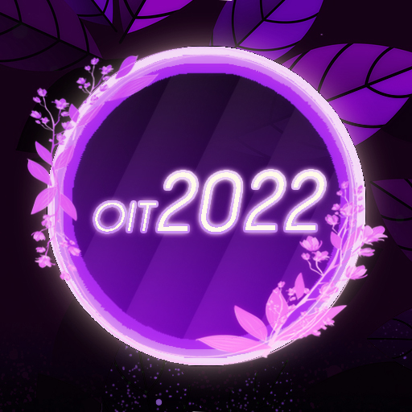
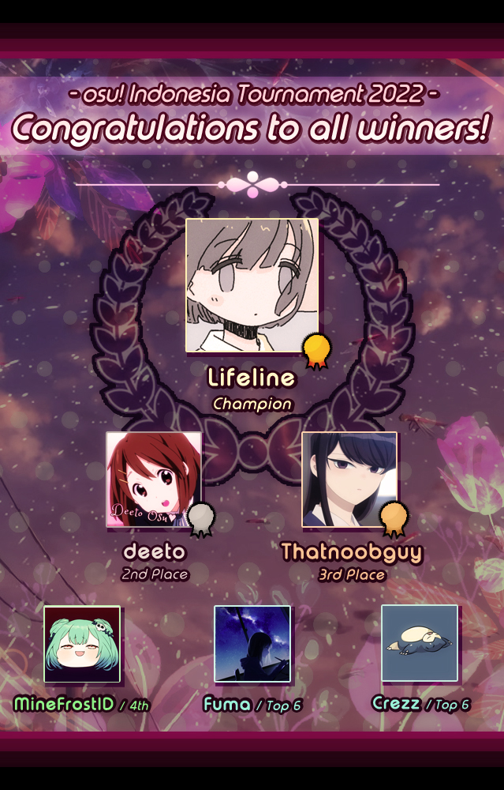

---
tags:
  - OIT2022
  - OIT 2022
---

# osu! Indonesia Tournament #12 (2022)

The **osu! Indonesia Tournament #12 (2022)** (***OIT 2022***) was an Indonesian double-elimination 1v1 osu! tournament hosted by ::{ flag=ID }:: [Arca 9](https://osu.ppy.sh/users/14042319) and ::{ flag=ID }:: [Raids](https://osu.ppy.sh/users/15640966). The tournament was open to all players from Indonesia with 4,000 pp or above in the osu! game mode to their name. It was the twelfth iteration of the osu! Indonesia Tournament.

## Tournament schedule

| Event | Timestamp |
| --: | :-- |
| Registration phase | 2022-01-08/2022-01-30 |
| Screening phase | 2022-01-31/2022-02-14 |
| Qualifiers | 2022-02-15/2022-02-20 |
| Round of 32 | 2022-02-21/2022-02-27 |
| Round of 16 | 2022-02-28/2022-03-06 |
| Quarterfinals | 2022-03-07/2022-03-13 |
| Semifinals | 2022-03-14/2022-03-20 |
| Finals week 1 | 2022-03-21/2022-03-27 |
| Finals week 2 | 2022-03-28/2022-04-03 |

## Prizes

| Placing | Prize(s) |
| :-: | :-- |
|  | 2,000,000 IDR + 50% of the additional raised prize pool, physical trophy (courtesy of [Herculex Indonesia](https://www.tokopedia.com/herculex)), unique profile badge |
|  | 1,000,000 IDR + 30% of the additional raised prize pool, physical trophy (courtesy of [Herculex Indonesia](https://www.tokopedia.com/herculex)) |
|  | 500,000 IDR + 20% of the additional raised prize pool, physical trophy (courtesy of [Herculex Indonesia](https://www.tokopedia.com/herculex)) |

## Organisation

The osu! Indonesia Tournament #12 (2022) was run by various osu! community members predominantly hailing from Indonesia.

| Position | Member(s) |
| :-- | :-- |
| Host | ::{ flag=ID }:: [Arca 9](https://osu.ppy.sh/users/14042319), ::{ flag=ID }:: [Raids](https://osu.ppy.sh/users/15640966) |
| Co-host | ::{ flag=ID }:: [Niva](https://osu.ppy.sh/users/197805), ::{ flag=ID }:: [Millie](https://osu.ppy.sh/users/3484548), ::{ flag=ID }:: [Senritsu](https://osu.ppy.sh/users/1165368), ::{ flag=ID }:: [Tama-desu](https://osu.ppy.sh/users/3813174) |
| Mappool selector | ::{ flag=ID }:: [Raids](https://osu.ppy.sh/users/15640966), ::{ flag=ID }:: [Niva](https://osu.ppy.sh/users/197805), ::{ flag=ID }:: [Millie](https://osu.ppy.sh/users/3484548), ::{ flag=ID }:: [Tama-desu](https://osu.ppy.sh/users/3813174), ::{ flag=ID }:: [phizh](https://osu.ppy.sh/users/4569302), ::{ flag=ID }:: [Kuro Fuyusaki](https://osu.ppy.sh/users/2667496) |
| Playtester | ::{ flag=ID }:: [Pancoz](https://osu.ppy.sh/users/13156137), ::{ flag=ID }:: [honeymint](https://osu.ppy.sh/users/4796773), ::{ flag=ID }:: [MasterfulNote5](https://osu.ppy.sh/users/7247988), ::{ flag=ID }:: [\[-Yukari-\]](https://osu.ppy.sh/users/8780223), ::{ flag=ID }:: [Zoneeox](https://osu.ppy.sh/users/6596134), ::{ flag=PH }:: [Rammu](https://osu.ppy.sh/users/10652837), ::{ flag=AU }:: [Enumi](https://osu.ppy.sh/users/10625283) |
| Streamer | ::{ flag=ID }:: [Raids](https://osu.ppy.sh/users/15640966), ::{ flag=ID }:: [Millie](https://osu.ppy.sh/users/3484548), ::{ flag=ID }:: [Victim_Crasher](https://osu.ppy.sh/users/2084869), ::{ flag=ID }:: [wiam103](https://osu.ppy.sh/users/4109839), ::{ flag=MY }:: [Laphii](https://osu.ppy.sh/users/9364594), ::{ flag=MY }:: [Rumah](https://osu.ppy.sh/users/12086495), ::{ flag=MY }:: [Its not Marvin](https://osu.ppy.sh/users/13600612), ::{ flag=HK }:: [ShadeCegLgMn](https://osu.ppy.sh/users/12609866) |
| Commentator | ::{ flag=ID }:: [Raids](https://osu.ppy.sh/users/15640966), ::{ flag=ID }:: [Niva](https://osu.ppy.sh/users/197805), ::{ flag=ID }:: [Millie](https://osu.ppy.sh/users/3484548), ::{ flag=ID }:: [Victim_Crasher](https://osu.ppy.sh/users/2084869), ::{ flag=ID }:: [Vvn](https://osu.ppy.sh/users/3204677), ::{ flag=ID }:: [Deorum](https://osu.ppy.sh/users/5933031), ::{ flag=ID }:: [Fuma](https://osu.ppy.sh/users/1501956), ::{ flag=ID }:: [My Angel Eimi](https://osu.ppy.sh/users/3793938), ::{ flag=ID }:: [Remuru](https://osu.ppy.sh/users/3654220), ::{ flag=ID }:: [Kirinagi](https://osu.ppy.sh/users/5937545) |
| Referee | ::{ flag=ID }:: [NoVaLian](https://osu.ppy.sh/users/6459827), ::{ flag=ID }:: [-Foxee-](https://osu.ppy.sh/users/14989473), ::{ flag=ID }:: [lucidators](https://osu.ppy.sh/users/10154981), ::{ flag=ID }:: [YaeMyMommy](https://osu.ppy.sh/users/17278897), ::{ flag=ID }:: [Aerotracker](https://osu.ppy.sh/users/24396418), ::{ flag=ID }:: [NotDens](https://osu.ppy.sh/users/17311355), ::{ flag=ID }:: [Fyl](https://osu.ppy.sh/users/10069307), ::{ flag=ID }:: [Tazkiz](https://osu.ppy.sh/users/3738010), ::{ flag=PH }:: [-Pekora-](https://osu.ppy.sh/users/17959882), ::{ flag=VN }:: [rock-on](https://osu.ppy.sh/users/9676089), ::{ flag=HK }:: [Smato](https://osu.ppy.sh/users/5616307) |
| Graphic designer | ::{ flag=ID }:: [Niva](https://osu.ppy.sh/users/197805), ::{ flag=ID }:: [Felter](https://osu.ppy.sh/users/5865319/) |
| Spreadsheet manager | ::{ flag=ID }:: [Arca 9](https://osu.ppy.sh/users/14042319) |
| Wiki editor | ::{ flag=ID }:: [Niva](https://osu.ppy.sh/users/197805) |

## Links

- **[Master spreadsheet](https://docs.google.com/spreadsheets/d/1ldhLP4DDZ-eSVKZ9sQOuBdh2NEJBKJW7Jpbv2HcrI94/edit#gid=1052632133)**
- [Forum thread](https://osu.ppy.sh/community/forums/topics/1497888)
- [Discord server](https://discordapp.com/invite/CHRFffH)
- [Livestream channel](https://www.twitch.tv/osuindonesia)
- [Challonge brackets](https://challonge.com/OIT2022)

## Participants

Listed below are the players who managed to qualify into the Round of 32 (along with their respective seed number and Qualifiers Z-Sum value) out of 87 registered players in total.

| Seed No. | Player | Z-Sum |
| :-- | :-- | :-- |
| 1 | ::{ flag=ID }:: [Thatnoobguy](https://osu.ppy.sh/users/11091594) | 9.44 |
| 2 | ::{ flag=ID }:: [Lifeline](https://osu.ppy.sh/users/11367222) | 9.33 |
| 3 | ::{ flag=ID }:: [deeto](https://osu.ppy.sh/users/10069909) | 9.30 |
| 4 | ::{ flag=ID }:: [Fuma](https://osu.ppy.sh/users/1501956) | 9.19 |
| 5 | ::{ flag=ID }:: [rHO](https://osu.ppy.sh/users/1629553) | 9.15 |
| 6 | ::{ flag=ID }:: [Crezz](https://osu.ppy.sh/users/7108275) | 9.02 |
| 7 | ::{ flag=ID }:: [Rexeez](https://osu.ppy.sh/users/1987591) | 8.80 |
| 8 | ::{ flag=ID }:: [MineFrostID](https://osu.ppy.sh/users/12159899) | 8.46 |
| 9 | ::{ flag=ID }:: [Vinno](https://osu.ppy.sh/users/10717635) | 8.36 |
| 10 | ::{ flag=ID }:: [Venta](https://osu.ppy.sh/users/11320627) | 8.05 |
| 11 | ::{ flag=ID }:: [D E L O N](https://osu.ppy.sh/users/11983229) | 7.84 |
| 12 | ::{ flag=ID }:: [Daffy](https://osu.ppy.sh/users/5968633) | 7.79 |
| 13 | ::{ flag=ID }:: [-Kiichirou-](https://osu.ppy.sh/users/5791467) | 7.77 |
| 14 | ::{ flag=ID }:: [BlankTap](https://osu.ppy.sh/users/10137131) | 7.55 |
| 15 | ::{ flag=ID }:: [StayMusical](https://osu.ppy.sh/users/12688176) | 7.29 |
| 16 | ::{ flag=ID }:: [Herbayse](https://osu.ppy.sh/users/4924094) | 7.00 |
| 17 | ::{ flag=ID }:: [Caruma](https://osu.ppy.sh/users/13187450) | 6.83 |
| 18 | ::{ flag=ID }:: [cfood](https://osu.ppy.sh/users/8626190) | 6.77 |
| 19 | ::{ flag=ID }:: [Egao](https://osu.ppy.sh/users/12419257) | 6.75 |
| 20 | ::{ flag=ID }:: [Frixell](https://osu.ppy.sh/users/15601286) | 6.47 |
| 21 | ::{ flag=ID }:: [Bunan-](https://osu.ppy.sh/users/2763354) | 6.42 |
| 22 | ::{ flag=ID }:: [AnzewVix](https://osu.ppy.sh/users/8621203) | 6.36 |
| 23 | ::{ flag=ID }:: [Cudi](https://osu.ppy.sh/users/9974314) | 6.28 |
| 24 | ::{ flag=ID }:: [Naikaze](https://osu.ppy.sh/users/984132) | 6.21 |
| 25 | ::{ flag=ID }:: [SDKO](https://osu.ppy.sh/users/4858555) | 6.12 |
| 26 | ::{ flag=ID }:: [Suikami](https://osu.ppy.sh/users/1929336) | 6.10 |
| 27 | ::{ flag=ID }:: [Takagi-chan](https://osu.ppy.sh/users/11379592) | 6.05 |
| 28 | ::{ flag=ID }:: [malvon](https://osu.ppy.sh/users/11113661) | 5.92 |
| 29 | ::{ flag=ID }:: [Misaki - Rhythm](https://osu.ppy.sh/users/7128826) | 5.76 |
| 30 | ::{ flag=ID }:: [-TwiHD](https://osu.ppy.sh/users/5470299) | 5.32 |
| 31 | ::{ flag=ID }:: [Dika312](https://osu.ppy.sh/users/741613) | 5.30 |
| 32 | ::{ flag=ID }:: [XenoitesBadPog](https://osu.ppy.sh/users/11461426) | 4.89 |

## Podium

## Mappools

### Finals (week 2)

**[Download the mappack here! (145 MB)](http://drive.google.com/u/0/uc?id=1jC_ByVN0kT1W0KXpb8pGbH9HTHrjuoaJ&export=download)**

- NoMod
  1. [Risa Yuzuki - Filia no Rashinban (feat. cosMo\@bousouP) (BarkingMadDog) \[Compass\]](https://osu.ppy.sh/beatmapsets/1709938#osu/3494038)
  2. [Plum - Tempest (knowledgeking) \[Hurricane\]](https://osu.ppy.sh/beatmapsets/1699159#osu/3471880)
  3. [lical - nyctalopia (Raijodo) \[delusionalism\]](https://osu.ppy.sh/beatmapsets/1284666#osu/2745135)
  4. [Vorso - Honx (Xarr) \[Dissidence\]](https://osu.ppy.sh/beatmapsets/1564690#osu/3195227)
  5. [Laur - A Lasting Promise (Altai) \[Morri's MAXIMUM\]](https://osu.ppy.sh/beatmapsets/1496445#osu/3093724)
  6. [ATARASHII GAKKO! - Ookami no Uta (Fisky) \[jasontime's Expert\]](https://osu.ppy.sh/beatmapsets/1562875#osu/3378777)
- Hidden
  1. [Kairiki bear - Shippaisaku Shoujo (jazzberry) \[Amelie\]](https://osu.ppy.sh/beatmapsets/1699191#osu/3471942)
  2. [I2ka x Tanchiky - Voice (Cut Ver.) (Kyrian) \[Special\]](https://osu.ppy.sh/beatmapsets/1532435#osu/3133966)
  3. [ISOMERZ (DJ Raisei + seatrus) - Symmetric (Realazy) \[Enantiomorphs\]](https://osu.ppy.sh/beatmapsets/1381824#osu/2855075)
- HardRock
  1. [ELFENSJoN - STYX (Lyruke) \[NOSTALGIC\]](https://osu.ppy.sh/beatmapsets/1554532#osu/3175993)
  2. [ESTi - HELIX (Edit Ver.) (FreeSongs) \[Helix\]](https://osu.ppy.sh/beatmapsets/331732#osu/734769)
  3. [lapix - Day by day (PSYQUI Remix) (JeZag) \[Edge of Tomorrow\]](https://osu.ppy.sh/beatmapsets/1318545#osu/2731544)
- DoubleTime
  1. [Liz Triangle - Veda (eiri-) \[Ayylibe's Expert\]](https://osu.ppy.sh/beatmapsets/979392#osu/2049696)
  2. [ZUN - Romantic Children (Kurashina Asuka) \[Lunatic\]](https://osu.ppy.sh/beatmapsets/1550845#osu/3169113)
  3. [Emiru no Aishita Tsukiyo ni Dai San Gensou Kyoku wo - Gekijou no Prominence (-Mo-) \[Insane\]](https://osu.ppy.sh/beatmapsets/1633270#osu/3333770)
  4. [Sakuyui - Yoru ni Kakeru (Yugu) \[You\]](https://osu.ppy.sh/beatmapsets/1238144#osu/2574281)
- FreeMod
  1. [MASAKI (ZUNTATA) - Touhou Kijinretsu (Sparhten) \[Extra Stage\]](https://osu.ppy.sh/beatmapsets/1267353#osu/2633856)
  2. [Feryquitous feat. Aitsuki Nakuru - Tsukuyomi ni Naru (captin1) \[niva (OLD)\]](https://osu.ppy.sh/beatmapsets/1699172#osu/3529829)
- Tiebreaker
  1. **[IT LIVES & Dr Ushuu - Never Alone (ReeK's "Hitorijanai" Remix) (Tocorn) \[Absolute Ecstacy\]](https://osu.ppy.sh/beatmapsets/1729689#osu/3534950)**

### Finals (week 1)

**[Download the mappack here! (118 MB)](http://drive.google.com/u/0/uc?id=143Jy13SwLOra2tkw4FYY5bCutFivYa4M&export=download)**

- NoMod
  1. [CON - Cruel Clocks (Meg) \[Cruel Extra\]](https://osu.ppy.sh/beatmapsets/1568793#osu/3203760)
  2. [Ellim Gnirps vs yomi - SociuS (Chemo) \[Angeli\]](https://osu.ppy.sh/beatmapsets/1575605#osu/3216822)
  3. [POLKADOT STINGRAY - Keshin (Keqing) \[Deceit\]](https://osu.ppy.sh/beatmapsets/1311266#osu/2717891)
  4. [Getty vs. DJ DiA - Antifront Gears (Xavier Owens II) \[Break-action (edit)\]](https://osu.ppy.sh/beatmapsets/1712558#osu/3499390)
  5. [MisomyL - Amnehilesie (Realazy) \[descente aux enfers\]](https://osu.ppy.sh/beatmapsets/1703921#osu/3481620)
  6. [daisan - Deepsea Moonlight (YokesPai) \[Blurred Vision\]](https://osu.ppy.sh/beatmapsets/1375889#osu/2843881)
- Hidden
  1. [Ito Kashitaro - Yuudachi no Ribbon (Yudragen) \[Flash of Eternity\]](https://osu.ppy.sh/beatmapsets/1383608#osu/2858218)
  2. [Jakarta Funk Brothers - INSOMNIA (AJT) \[PandaHero's Extra\]](https://osu.ppy.sh/beatmapsets/1689665#osu/3457821)
  3. [Marmalade butcher - Mirage Age (Gordon) \[Allice's Expert\]](https://osu.ppy.sh/beatmapsets/1624087#osu/3315941)
- HardRock
  1. [rejection - Aimai Attitude (feat. Nakamura Sanso) (Garden) \[Girlish Extra ft. Regou\]](https://osu.ppy.sh/beatmapsets/1601852#osu/3271290)
  2. [AKATSUKI - Hyakka Ryouran, Akatsukiyo (karaoke ver.) (Mafumafu) \[yf's Extra\]](https://osu.ppy.sh/beatmapsets/690763#osu/1678438)
  3. [Naoki & Tatsh - Red Zone (Arbane) \[S P E E D R A V E\]](https://osu.ppy.sh/beatmapsets/498036#osu/1060078)
- DoubleTime
  1. [FELT - Closed Wings (Naitoshi) \[Lunatic\]](https://osu.ppy.sh/beatmapsets/159760#osu/390146)
  2. [xi - Parousia (Niva) \[Eschatology (AR8.5)\]](https://osu.ppy.sh/beatmapsets/1713530#osu/3501365)
  3. [fripSide - black bullet (Luscent) \[extinction\]](https://osu.ppy.sh/beatmapsets/1586228#osu/3239862)
  4. [Kanno Yugo - il vento d'oro (AirinCat) \[Insane Dream\]](https://osu.ppy.sh/beatmapsets/1250853#osu/2599601)
- FreeMod
  1. [UNDEAD CORPORATION - Blow (Cellina) \[Collab Expert (osu! Indonesia Tournament 2022 Edit)\]](https://osu.ppy.sh/beatmapsets/1721338#osu/3517779)
  2. [Annabel - lilac slumber (cosmic ver.) (PandaHero) \[fall\]](https://osu.ppy.sh/beatmapsets/1593278#osu/3254177)
- Tiebreaker
  1. **[HISATOMI - lullaby (feat. KIRA) (uet Remix) (she luv lando) \[one more before i go...\]](https://osu.ppy.sh/beatmapsets/1513975#osu/3099626)**

### Semifinals

**[Download the mappack here! (139 MB)](http://drive.google.com/u/0/uc?id=1jpF6xT8N0uDkqF_0ANUQfdprhKPIEO3A&export=download)**

- NoMod
  1. [AliA - joker (Kujinn) \[NM1\]](https://osu.ppy.sh/beatmapsets/1556595#osu/3179908)
  2. [Snowman - Oo warera yorokobi tataubeshi, shu yo (jazzberry) \[Scarlet Dream\]](https://osu.ppy.sh/beatmapsets/1501700#osu/3076939)
  3. [otetsu - Meiteki Cybernetics (Raijodo) \[Collab Extra\]](https://osu.ppy.sh/beatmapsets/1317461#osu/2729687)
  4. [Warak - REANIMATE (Crezz) \[Femboy Collab\]](https://osu.ppy.sh/beatmapsets/1664988#osu/3398960)
  5. [Uinyasu, Occhoko Bunny - Aa Kenran no Yume ga Gotoku (Epsilon Remix) (IOException) \[Insane \[240 bpm tourney edit\]\]](https://osu.ppy.sh/beatmapsets/1697641#osu/3468405)
  6. [Masahiro "Godspeed" Aoki - Frostbite (Cut Ver.) (Niva) \[kuyusu's Expert\]](https://osu.ppy.sh/beatmapsets/1501511#osu/3081403)
- Hidden
  1. [KikuoHana - God of Longevity (free playtest) \[Malevolent\]](https://osu.ppy.sh/beatmapsets/973817#osu/2038580)
  2. [namirin\* - Darling Dance (Kuro Fuyusaki) \[Sea Food Extra\]](https://osu.ppy.sh/beatmapsets/1521734#osu/3474842)
  3. [xi - Vanitas (RLC) \[Memoriam OD9\]](https://osu.ppy.sh/beatmapsets/89682#osu/243656)
- HardRock
  1. [BUMP OF CHICKEN - Makka na Sora o Mita Darou ka (CoLouRed GlaZeE) \[Jabberwocky\]](https://osu.ppy.sh/beatmapsets/1318074#osu/2731559)
  2. [kozato - Shijuugo-nen no Yukizakura (Muya) \[Another\]](https://osu.ppy.sh/beatmapsets/759281#osu/1596845)
  3. [RefraQ & Vorso - Biomes (Cut Ver.) (Mir) \[Phases\]](https://osu.ppy.sh/beatmapsets/1403806#osu/2895406)
- DoubleTime
  1. [LiSA - Akogare Bouenkyou (Meg) \[Scope\]](https://osu.ppy.sh/beatmapsets/524642#osu/1113528)
  2. [yuikonnu - Gigantic O.T.N (Camo) \[Hyper\]](https://osu.ppy.sh/beatmapsets/1362797#osu/3336914)
  3. [zts - dreamenddischarger (Luscent) \[resurrection\]](https://osu.ppy.sh/beatmapsets/1414566#osu/2915636)
  4. [Gesu no Kiwami Otome. - Jinsei no Hari (Agatsu) \[schoolboy's Insane\]](https://osu.ppy.sh/beatmapsets/1247336#osu/2693503)
- FreeMod
  1. [MOSAIC.WAV - Tsugihagi: \<\=\> Make Peace! (Riana) \[Acylica's Extra\]](https://osu.ppy.sh/beatmapsets/1394111#osu/3392607)
  2. [syatten remixed celas - Bird Sprite -Awakening of Light- (emu1337) \[LMT's Extra\]](https://osu.ppy.sh/beatmapsets/1321314#osu/2741605)
- Tiebreaker
  1. **[Dark PHOENiX - Ryokugan no Jealousy (Camo) \[Green-Eyed Monster\]](https://osu.ppy.sh/beatmapsets/1530977#osu/3131384)**

### Quarterfinals

**[Download the mappack here! (140 MB)](http://drive.google.com/u/0/uc?id=17PkLRpDvkuLoyqvbkWIMIBMsAfBtPkww&export=download)**

- NoMod
  1. [Suzuki Konomi - Theater of Life (Raids) \[RaiDiver's Tale of Tomorrow\]](https://osu.ppy.sh/beatmapsets/1649720#osu/3367245)
  2. [Xi - Broken the Moon (-Tynamo) \[suika ibuki broke the moon\]](https://osu.ppy.sh/beatmapsets/1597800#osu/3263130)
  3. [Yonekura Chihiro - DEAR MY WAKER (Skystar) \[Overdrive\]](https://osu.ppy.sh/beatmapsets/1579180#osu/3224533)
  4. [YUC'e - Magical Mixer (Xavier Owens II) \[Enchantment\]](https://osu.ppy.sh/beatmapsets/1644883#osu/3357607)
  5. [Silentroom vs. Frums - Aegleseeker (KingBaxter) \[Disobedience vs Chaos\]](https://osu.ppy.sh/beatmapsets/1576333#osu/3218308)
  6. [MASAYOSHI IIMORI - Hella Deep (Ryuusei Aika) \[Expert\]](https://osu.ppy.sh/beatmapsets/1563641#osu/3193040)
- Hidden
  1. [WHITEFISTS feat. Sennzai - Paralyzed Ash (Keqing) \[Keqing x Realazy's Despair\]](https://osu.ppy.sh/beatmapsets/1374055#osu/2840550)
  2. [Down - Luscent (Down) \[Another\]](https://osu.ppy.sh/beatmapsets/1641533#osu/3350321)
  3. [Frums - theyaremanycolors (Ancelysia) \[anculexpert\]](https://osu.ppy.sh/beatmapsets/1416051#osu/3033024)
- HardRock
  1. [Akatsuki Records - KARMANATIONS (-Rik-) \[Reincarnation\]](https://osu.ppy.sh/beatmapsets/1283387#osu/2665294)
  2. [Lion - four pieces of heaven (Reisen Udongein) \[Bunny Style\]](https://osu.ppy.sh/beatmapsets/58406#osu/175568)
  3. [goreshit - xenobeat (-Aqua) \[Hinsvar's Expert\]](https://osu.ppy.sh/beatmapsets/1090113#osu/2313561)
- DoubleTime
  1. [Sharlo - anesthesia (Bellicose) \[Promise\]](https://osu.ppy.sh/beatmapsets/1557682#osu/3181978)
  2. [Risa Yuzuki - Tarantella (feat. BlackY) (Niva) \[After the Monsoon\]](https://osu.ppy.sh/beatmapsets/1622467#osu/3312731)
  3. [Tatsh feat. Ayane - Yoiyami no Tsuki ni Dakarete (happy30) \[Collab\]](https://osu.ppy.sh/beatmapsets/249555#osu/573734)
  4. [Two Door Cinema Club - Cigarettes in the Theatre (entsetzen) \[Insane\]](https://osu.ppy.sh/beatmapsets/1598238#osu/3274886)
- FreeMod
  1. [Will Stetson - Lagtrain (Ryuusei Aika) \[\#\#\#\#\#\#\#\#\]](https://osu.ppy.sh/beatmapsets/1443224#osu/2968671)
  2. [Suzaku - Anisakis -somatic mutation type "Forza"- (tsukamaete) \[Another\]](https://osu.ppy.sh/beatmapsets/15579#osu/56347)
- Tiebreaker
  1. **[Tokyo.MeltiMelt - the Beautiful Cure feat. nayuta (jonathanlfj) \[Magnificat\]](https://osu.ppy.sh/beatmapsets/1574009#osu/3213722)**

### Round of 16

**[Download the mappack here! (107 MB)](http://drive.google.com/u/0/uc?id=1K-xhseDNcuNQJeCBxkg9JCHejvzG3DSe&export=download)**

- NoMod
  1. [YUZUKINGDOM - Roskill Lavender (Nao Tomori) \[Extreme\]](https://osu.ppy.sh/beatmapsets/1410727#osu/2908440)
  2. [Takenobi Mitsuyoshi - IKAZUCHI (BluOxy) \[MASTER\]](https://osu.ppy.sh/beatmapsets/489136#osu/1042623)
  3. [BlackY feat. Risa Yuzuki - Imitator (Livia) \[Extra\]](https://osu.ppy.sh/beatmapsets/1657865#osu/3383927)
  4. [Mysteka - Hesperos (Acylica) \[3dyoshispin\]](https://osu.ppy.sh/beatmapsets/1610294#osu/3287875)
  5. [t+pazolite - Hoshikuzu Struck (KKipalt) \[Stardust (Bamboo Ver.)\]](https://osu.ppy.sh/beatmapsets/1478718#osu/3033661)
- Hidden
  1. [yama - Mahi (Purplegaze) \[Frozen\]](https://osu.ppy.sh/beatmapsets/1566515#osu/3198580)
  2. [Mitsukiyo - Unwelcome School (gazimal) \[AdveNt's Insane\]](https://osu.ppy.sh/beatmapsets/1541421#osu/3158362)
- HardRock
  1. [AliA - nostalgia (Nelliel) \[memories\]](https://osu.ppy.sh/beatmapsets/1531033#osu/3174951)
  2. [Blackhole - Lagomorphic (Flower) \[Another\]](https://osu.ppy.sh/beatmapsets/89291#osu/242824)
- DoubleTime
  1. [Isekai Joucho - Hydrangea (Kyle Y) \[Capricious\]](https://osu.ppy.sh/beatmapsets/1379378#osu/2850334)
  2. [Otouto no Ane - Mirishira Romeo & Cinderella (Colin Hou) \[Sayonara Romeo\]](https://osu.ppy.sh/beatmapsets/19211#osu/72718)
  3. [yanaginagi - Shirushibi (Kazuma) \[Journey\]](https://osu.ppy.sh/beatmapsets/1639831#osu/3346986)
- FreeMod
  1. [Tatsh - IMAGE -MATERIAL- \<REFLEC BEAT Edition\> (ignorethis) \[DJPop's HARD\]](https://osu.ppy.sh/beatmapsets/48784#osu/153606)
  2. [Eiko Shimamiya - Higurashi no Naku Koro ni (Okoratu) \[Elvis' Extra\]](https://osu.ppy.sh/beatmapsets/333543#osu/799166)
- Tiebreaker
  1. **[Noah - Gentiana (Cellina) \[Re:Birth the End\]](https://osu.ppy.sh/beatmapsets/1633640#osu/3334384)**

### Round of 32

**[Download the mappack here! (95 MB)](http://drive.google.com/u/0/uc?id=1eMiinHv-gciU0UJds7ZZ5gK9laxm15e7&export=download)**

- NoMod
  1. [ShinRa-Bansho - Pink Kurage to, Sotto, Kiss o Shita. (Skydiver) \[Bioluminescent Sea Creature\]](https://osu.ppy.sh/beatmapsets/1491009#osu/3479041)
  2. [xi - Pandemonium (Doomsday) \[Extra\]](https://osu.ppy.sh/beatmapsets/519285#osu/1103215)
  3. [Camellia - Routing (Mir) \[Amateurre's Redirection\]](https://osu.ppy.sh/beatmapsets/1639727#osu/3373369)
  4. [Pendulum x Hybrid Minds - Louder Than Words (Cut Ver.) (Mir) \[Whisper\]](https://osu.ppy.sh/beatmapsets/1496831#osu/3068257)
  5. [Lime - Luminaria (Saika0k1) \[Anemoia\]](https://osu.ppy.sh/beatmapsets/1687561#osu/3448872)
- Hidden
  1. [Yorushika - Matasaburo (Rosiie) \[Summer Wind\]](https://osu.ppy.sh/beatmapsets/1485959#osu/3047001)
  2. [S.S.H. - Hard Wire (fartownik) \[Insane\]](https://osu.ppy.sh/beatmapsets/963692#osu/2017628)
- HardRock
  1. [SAKANAMON - Fumeikakuna Seika (AirinCat) \[Extra\]](https://osu.ppy.sh/beatmapsets/1552743#osu/3172606)
  2. [Arizona Zervas - ROXANNE (Remix) (feat. Swae Lee) (wafer) \[ROCK SAND (Remix)\]](https://osu.ppy.sh/beatmapsets/1607645#osu/3282876)
- DoubleTime
  1. [sky\_delta feat. Aitsuki Nakuru - Othello syndrome (lushifer) \[Transpain (edit.)\]](https://osu.ppy.sh/beatmapsets/1683218#osu/3439136)
  2. [Mami Kawada - sense (Giralda) \[LC's Insane\]](https://osu.ppy.sh/beatmapsets/325638#osu/723285)
  3. [yanaginagi - Vidro Moyou (rosario wknd) \[Visit from a Fallen Star\]](https://osu.ppy.sh/beatmapsets/1202515#osu/2504335)
- FreeMod
  1. [Yooh - LegenD. (HelloSCV) \[EXHAUST\]](https://osu.ppy.sh/beatmapsets/497891#osu/1059853)
  2. [Yorushika - Hitchcock (akinothm) \[OIT 2022 Edit\]](https://osu.ppy.sh/beatmapsets/1698752#osu/3471128)
- Tiebreaker
  1. **[Emiru no Aishita Tsukiyo ni Dai San Gensou Kyoku wo - Gengaku Opera House (gazimal) \[Give it all.\]](https://osu.ppy.sh/beatmapsets/1347917#osu/2791350)**

### Qualifiers

**[Download the mappack here! (94 MB)](http://drive.google.com/u/0/uc?id=1fQnhr4IUPDbS1e2MNupM61S89Y3MB2dy&export=download)**

- NoMod
  1. [Ayalis - Ai o Chikaishi Hime Kazari (handsome) \[captin's Extra\]](https://osu.ppy.sh/beatmapsets/506155#osu/1082145)
  2. [celas- Azul (Remix) (IOException) \[Expert\]](https://osu.ppy.sh/beatmapsets/1416065#osu/2918272)
  3. [Tsukuyomi - Moonlight at midday (Seros) \[Extra\]](https://osu.ppy.sh/beatmapsets/1537310#osu/3143258)
  4. [ginkiha - Paved Garden (Smug Nanachi) \[fiore\]](https://osu.ppy.sh/beatmapsets/1131098#osu/2362655)
- Hidden
  1. [kurubukkochan - Rain (Reincarnation) \[Rein\]](https://osu.ppy.sh/beatmapsets/886147#osu/1852501)
  2. [Various Artists - Netsuretsu Kangei Wonderland (Mirash) \[PandaHero's Extra\]](https://osu.ppy.sh/beatmapsets/1604477#osu/3333126)
- HardRock
  1. [Kanzaki Elza starring ReoNa - Independence (Maot) \[Masquerade CS4\]](https://osu.ppy.sh/beatmapsets/1557099#osu/3448344)
  2. [SWAN K feat. Asuka M - LOVE B.B.B (Nakagawa-Kanon) \[Another\]](https://osu.ppy.sh/beatmapsets/48537#osu/150488)
- DoubleTime
  1. [sakanaction - Shin Takarajima (Fixxis) \[Insane\]](https://osu.ppy.sh/beatmapsets/1188206#osu/2476090)
  2. [rerulili feat. Dancing Dolls - Kami no Manima Ni (Sephira) \[RLC's Insane\]](https://osu.ppy.sh/beatmapsets/1182518#osu/2465404)

## Match results

### Finals (week 2)

Friday. 1 April 2022:

| Bracket | Player 1 |  |  | Player 2 | Match link |
| :-: | --: | :-: | :-: | :-- | :-- |
| Lower | [Thatnoobguy](https://osu.ppy.sh/users/11091594) ::{ flag=ID }:: | 2 | **7** | ::{ flag=ID }:: **[deeto](https://osu.ppy.sh/users/10069909)** | [#1](https://osu.ppy.sh/community/matches/99299509) |

Saturday, 2 April 2022, Grand Final:

| Bracket | Player 1 |  |  | Player 2 | Match link |
| :-: | --: | :-: | :-: | :-- | :-- |
| Grand Final | **[Lifeline](https://osu.ppy.sh/users/11367222)** ::{ flag=ID }:: | **7** | 4 | ::{ flag=ID }:: [deeto](https://osu.ppy.sh/users/10069909) | [#1](https://osu.ppy.sh/community/matches/99335582) |

### Finals (week 1)

Saturday, 26 March 2022:

| Bracket | Player 1 |  |  | Player 2 | Match link |
| :-: | --: | :-: | :-: | :-- | :-- |
| Lower | [Crezz](https://osu.ppy.sh/users/7108275) ::{ flag=ID }:: | 5 | **7** | ::{ flag=ID }:: **[MineFrostID](https://osu.ppy.sh/users/12159899)** | [#1](https://osu.ppy.sh/community/matches/99117520) |

Sunday, 27 March 2022:

| Bracket | Player 1 |  |  | Player 2 | Match link |
| :-: | --: | :-: | :-: | :-- | :-- |
| Lower | [Fuma](https://osu.ppy.sh/users/1501956) ::{ flag=ID }:: | 3 | **7** | ::{ flag=ID }:: **[deeto](https://osu.ppy.sh/users/10069909)** | [#1](https://osu.ppy.sh/community/matches/99154662) |
| Upper | [Thatnoobguy](https://osu.ppy.sh/users/11091594) ::{ flag=ID }:: | 0 | **7** | ::{ flag=ID }:: **[Lifeline](https://osu.ppy.sh/users/11367222)** | [#1](https://osu.ppy.sh/community/matches/99152654) |

Monday, 28 March 2022:

| Bracket | Player 1 |  |  | Player 2 | Match link |
| :-: | --: | :-: | :-: | :-- | :-- |
| Lower | [MineFrostID](https://osu.ppy.sh/users/12159899) ::{ flag=ID }:: | 5 | **7** | ::{ flag=ID }:: **[deeto](https://osu.ppy.sh/users/10069909)** | [#1](https://osu.ppy.sh/community/matches/99157419) |

### Semifinals

Friday, 18 March 2022:

| Bracket | Player 1 |  |  | Player 2 | Match link |
| :-: | --: | :-: | :-: | :-- | :-- |
| Lower | [Rexeez](https://osu.ppy.sh/users/1987591) ::{ flag=ID }:: | 3 | **6** | ::{ flag=ID }:: **[Vinno](https://osu.ppy.sh/users/10717635)** | [#1](https://osu.ppy.sh/community/matches/98853253) |
| Lower | **[MineFrostID](https://osu.ppy.sh/users/12159899)** ::{ flag=ID }:: | **6** | 0 | ::{ flag=ID }:: [Venta](https://osu.ppy.sh/users/11320627) | *win by default* |

Saturday, 19 March 2022:

| Bracket | Player 1 |  |  | Player 2 | Match link |
| :-: | --: | :-: | :-: | :-- | :-- |
| Lower | **[deeto](https://osu.ppy.sh/users/10069909)** ::{ flag=ID }:: | **6** | 3 | ::{ flag=ID }:: [Daffy](https://osu.ppy.sh/users/5968633) | [#1](https://osu.ppy.sh/community/matches/98881603) |
| Upper | **[Lifeline](https://osu.ppy.sh/users/11367222)** ::{ flag=ID }:: | **6** | 2 | ::{ flag=ID }:: [Crezz](https://osu.ppy.sh/users/7108275) | [#1](https://osu.ppy.sh/community/matches/98883041) |
| Lower | [rHO](https://osu.ppy.sh/users/1629553) ::{ flag=ID }:: | 0 | **6** | ::{ flag=ID }:: **[D E L O N](https://osu.ppy.sh/users/11983229)** | *win by default* |

Sunday, 20 March 2022:

| Bracket | Player 1 |  |  | Player 2 | Match link |
| :-: | --: | :-: | :-: | :-- | :-- |
| Lower | **[deeto](https://osu.ppy.sh/users/10069909)** ::{ flag=ID }:: | **6** | 2 | ::{ flag=ID }:: [Vinno](https://osu.ppy.sh/users/10717635) | [#1](https://osu.ppy.sh/community/matches/98926983) |
| Upper | **[Thatnoobguy](https://osu.ppy.sh/users/11091594)** ::{ flag=ID }:: | **6** | 5 | ::{ flag=ID }:: [Fuma](https://osu.ppy.sh/users/1501956) | [#1](https://osu.ppy.sh/community/matches/98890786) |
| Lower | [D E L O N](https://osu.ppy.sh/users/11983229) ::{ flag=ID }:: | 3 | **6** | ::{ flag=ID }:: **[MineFrostID](https://osu.ppy.sh/users/12159899)** | [#1](https://osu.ppy.sh/community/matches/98930552) |

### Quarterfinals

Friday, 11 March 2022:

| Bracket | Player 1 |  |  | Player 2 | Match link |
| :-: | --: | :-: | :-: | :-- | :-- |
| Lower | **[D E L O N](https://osu.ppy.sh/users/11983229)** ::{ flag=ID }:: | **6** | 1 | ::{ flag=ID }:: [Caruma](https://osu.ppy.sh/users/13187450) | [#1](https://osu.ppy.sh/community/matches/98616981) |
| Lower | **[Venta](https://osu.ppy.sh/users/11320627)** ::{ flag=ID }:: | **6** | 1 | ::{ flag=ID }:: [Misaki - Rhythm](https://osu.ppy.sh/users/7128826) | [#1](https://osu.ppy.sh/community/matches/98618243) |
| Upper | **[Thatnoobguy](https://osu.ppy.sh/users/11091594)** ::{ flag=ID }:: | **6** | 2 | ::{ flag=ID }:: [MineFrostID](https://osu.ppy.sh/users/12159899) | [#1](https://osu.ppy.sh/community/matches/98618247) |
| Lower | **[Vinno](https://osu.ppy.sh/users/10717635)** ::{ flag=ID }:: | **6** | 3 | ::{ flag=ID }:: [Egao](https://osu.ppy.sh/users/12419257) | [#1](https://osu.ppy.sh/community/matches/98618239) |
| Lower | **[BlankTap](https://osu.ppy.sh/users/10137131)** ::{ flag=ID }:: | **6** | 2 | ::{ flag=ID }:: [Naikaze](https://osu.ppy.sh/users/984132) | [#1](https://osu.ppy.sh/community/matches/98621818) |
| Upper | [deeto](https://osu.ppy.sh/users/10069909) ::{ flag=ID }:: | 0 | **6** | ::{ flag=ID }:: **[Crezz](https://osu.ppy.sh/users/7108275)** | [#1](https://osu.ppy.sh/community/matches/98656251) |

Saturday, 12 March 2022:

| Bracket | Player 1 |  |  | Player 2 | Match link |
| :-: | --: | :-: | :-: | :-- | :-- |
| Lower | **[Herbayse](https://osu.ppy.sh/users/4924094)** ::{ flag=ID }:: | **6** | 4 | ::{ flag=ID }:: [Takagi-chan](https://osu.ppy.sh/users/11379592) | [#1](https://osu.ppy.sh/community/matches/98651724) |
| Lower | **[StayMusical](https://osu.ppy.sh/users/12688176)** ::{ flag=ID }:: | **6** | 0 | ::{ flag=ID }:: [Bunan-](https://osu.ppy.sh/users/2763354) | [#1](https://osu.ppy.sh/community/matches/98649380) |
| Lower | [cfood](https://osu.ppy.sh/users/8626190) ::{ flag=ID }:: | 4 | **6** | ::{ flag=ID }:: **[Daffy](https://osu.ppy.sh/users/5968633)** | [#1](https://osu.ppy.sh/community/matches/98654038) |
| Upper | **[Lifeline](https://osu.ppy.sh/users/11367222)** ::{ flag=ID }:: | **6** | 1 | ::{ flag=ID }:: [Rexeez](https://osu.ppy.sh/users/1987591) | [#1](https://osu.ppy.sh/community/matches/98656061) |
| Lower | **[-Kiichirou-](https://osu.ppy.sh/users/5791467)** ::{ flag=ID }:: | **6** | 3 | ::{ flag=ID }:: [Suikami](https://osu.ppy.sh/users/1929336) | [#1](https://osu.ppy.sh/community/matches/98661088) |

Monday, 13 March 2022:

| Bracket | Player 1 |  |  | Player 2 | Match link |
| :-: | --: | :-: | :-: | :-- | :-- |
| Lower | **[Venta](https://osu.ppy.sh/users/11320627)** ::{ flag=ID }:: | **6** | 4 | ::{ flag=ID }:: [StayMusical](https://osu.ppy.sh/users/12688176) | [#1](https://osu.ppy.sh/community/matches/98696946) |
| Lower | **[Vinno](https://osu.ppy.sh/users/10717635)** ::{ flag=ID }:: | **6** | 2 | ::{ flag=ID }:: [Herbayse](https://osu.ppy.sh/users/4924094) | [#1](https://osu.ppy.sh/community/matches/98696938) |
| Lower | **[D E L O N](https://osu.ppy.sh/users/11983229)** ::{ flag=ID }:: | **6** | 3 | ::{ flag=ID }:: [BlankTap](https://osu.ppy.sh/users/10137131) | [#1](https://osu.ppy.sh/community/matches/98700817) |
| Lower | **[Daffy](https://osu.ppy.sh/users/5968633)** ::{ flag=ID }:: | **6** | 3 | ::{ flag=ID }:: [-Kiichirou-](https://osu.ppy.sh/users/5791467) | [#1](https://osu.ppy.sh/community/matches/98701565) |
| Upper | **[Fuma](https://osu.ppy.sh/users/1501956)** ::{ flag=ID }:: | **6** | 5 | ::{ flag=ID }:: [rHO](https://osu.ppy.sh/users/1629553) | [#1](https://osu.ppy.sh/community/matches/98703486) |

### Round of 16

Friday, 4 March 2022:

| Bracket | Player 1 |  |  | Player 2 | Match link |
| :-: | --: | :-: | :-: | :-- | :-- |
| Lower | [Dika312](https://osu.ppy.sh/users/741613) ::{ flag=ID }:: | 0 | **5** | ::{ flag=ID }:: **[cfood](https://osu.ppy.sh/users/8626190)** | [#1](https://osu.ppy.sh/community/matches/98419910) |
| Lower | [SDKO](https://osu.ppy.sh/users/98389081) ::{ flag=ID }:: | 4 | **5** | ::{ flag=ID }:: **[Naikaze](https://osu.ppy.sh/users/984132)** | [#1](https://osu.ppy.sh/community/matches/98389081) |
| Upper | **[Thatnoobguy](https://osu.ppy.sh/users/11091594)** ::{ flag=ID }:: | **5** | 0 | ::{ flag=ID }:: [Herbayse](https://osu.ppy.sh/users/4924094) | [#1](https://osu.ppy.sh/community/matches/98390343) |
| Lower | [malvon](https://osu.ppy.sh/users/11113661) ::{ flag=ID }:: | 2 | **5** | ::{ flag=ID }:: **[Bunan-](https://osu.ppy.sh/users/2763354)** | [#1](https://osu.ppy.sh/community/matches/98389781) |

Saturday, 5 March 2022:

| Bracket | Player 1 |  |  | Player 2 | Match link |
| :-: | --: | :-: | :-: | :-- | :-- |
| Upper | [Vinno](https://osu.ppy.sh/users/10717635) ::{ flag=ID }:: | 4 | **5** | ::{ flag=ID }:: **[MineFrostID](https://osu.ppy.sh/users/12159899)** | [#1](https://osu.ppy.sh/community/matches/98429527) |
| Lower | **[Takagi-chan](https://osu.ppy.sh/users/11379592)** ::{ flag=ID }:: | **5** | 3 | ::{ flag=ID }:: [AnzewVix](https://osu.ppy.sh/users/8621203) | [#1](https://osu.ppy.sh/community/matches/98426307) |
| Lower | [-TwiHD](https://osu.ppy.sh/users/5470299) ::{ flag=ID }:: | 2 | **5** | ::{ flag=ID }:: **[Egao](https://osu.ppy.sh/users/12419257)** | [#1](https://osu.ppy.sh/community/matches/98391100) |
| Upper | **[Lifeline](https://osu.ppy.sh/users/11367222)** ::{ flag=ID }:: | **5** | 0 | ::{ flag=ID }:: [StayMusical](https://osu.ppy.sh/users/12688176) | [#1](https://osu.ppy.sh/community/matches/98422598) |
| Lower | [XenoitesBadPog](https://osu.ppy.sh/users/11461426) ::{ flag=ID }:: | 1 | **5** | ::{ flag=ID }:: **[Caruma](https://osu.ppy.sh/users/13187450)** | [#1](https://osu.ppy.sh/community/matches/98391758) |
| Upper | **[deeto](https://osu.ppy.sh/users/10069909)** ::{ flag=ID }:: | **5** | 1 | ::{ flag=ID }:: [BlankTap](https://osu.ppy.sh/users/10137131) | [#1](https://osu.ppy.sh/community/matches/98421050) |
| Upper | **[Crezz](https://osu.ppy.sh/users/7108275)** ::{ flag=ID }:: | **5** | 0 | ::{ flag=ID }:: [D E L O N](https://osu.ppy.sh/users/11983229) | [#1](https://osu.ppy.sh/community/matches/98426261) |
| Lower | **[Suikami](https://osu.ppy.sh/users/1929336)** ::{ flag=ID }:: | **5** | 1 | ::{ flag=ID }:: [Cudi](https://osu.ppy.sh/users/9974314) | [#1](https://osu.ppy.sh/community/matches/98427868) |
| Upper | **[rHO](https://osu.ppy.sh/users/1629553)** ::{ flag=ID }:: | **5** | 4 | ::{ flag=ID }:: [Daffy](https://osu.ppy.sh/users/5968633) | [#1](https://osu.ppy.sh/community/matches/98429545) |

Sunday, 6 March 2022:

| Bracket | Player 1 |  |  | Player 2 | Match link |
| :-: | --: | :-: | :-: | :-- | :-- |
| Lower | **[Misaki - Rhythm](https://osu.ppy.sh/users/7128826)** ::{ flag=ID }:: | **5** | 3 | ::{ flag=ID }:: [Frixell](https://osu.ppy.sh/users/15601286) | [#1](https://osu.ppy.sh/community/matches/98465509) |
| Upper | **[Rexeez](https://osu.ppy.sh/users/1987591)** ::{ flag=ID }:: | **5** | 2 | ::{ flag=ID }:: [Venta](https://osu.ppy.sh/users/11320627) | [#1](https://osu.ppy.sh/community/matches/98467917) |
| Upper | **[Fuma](https://osu.ppy.sh/users/1501956)** ::{ flag=ID }:: | **5** | 1 | ::{ flag=ID }:: [-Kiichirou-](https://osu.ppy.sh/users/5791467) | [#1](https://osu.ppy.sh/community/matches/98472969) |

### Round of 32

Friday, 25 February 2022:

| Bracket | Player 1 |  |  | Player 2 | Match link |
| :-: | --: | :-: | :-: | :-- | :-- |
| Upper | **[Daffy](https://osu.ppy.sh/users/5968633)** ::{ flag=ID }:: | **5** | 4 | ::{ flag=ID }:: [Bunan-](https://osu.ppy.sh/users/2763354) | [#1](https://osu.ppy.sh/community/matches/98160921) |
| Upper | **[rHO](https://osu.ppy.sh/users/1629553)** ::{ flag=ID }:: | **5** | 1 | ::{ flag=ID }:: [malvon](https://osu.ppy.sh/users/11113661) | [#1](https://osu.ppy.sh/community/matches/98159933) |
| Upper | **[Thatnoobguy](https://osu.ppy.sh/users/11091594)** ::{ flag=ID }:: | **5** | 1 | ::{ flag=ID }:: [XenoitesBadPog](https://osu.ppy.sh/users/11461426) | [#1](https://osu.ppy.sh/community/matches/98156902) |
| Upper | **[deeto](https://osu.ppy.sh/users/10069909)** ::{ flag=ID }:: | **5** | 0 | ::{ flag=ID }:: [-TwiHD](https://osu.ppy.sh/users/5470299) | [#1](https://osu.ppy.sh/community/matches/98161293) |
| Upper | **[Vinno](https://osu.ppy.sh/users/10717635)** ::{ flag=ID }:: | **5** | 3 | ::{ flag=ID }:: [Naikaze](https://osu.ppy.sh/users/984132) | [#1](https://osu.ppy.sh/community/matches/98157943) |

Saturday, 26 February 2022:

| Bracket | Player 1 |  |  | Player 2 | Match link |
| :-: | --: | :-: | :-: | :-- | :-- |
| Upper | **[Fuma](https://osu.ppy.sh/users/1501956)** ::{ flag=ID }:: | **5** | 0 | ::{ flag=ID }:: [Misaki - Rhythm](https://osu.ppy.sh/users/7128826) | [#1](https://osu.ppy.sh/community/matches/98204495) |
| Upper | **[Lifeline](https://osu.ppy.sh/users/11367222)** ::{ flag=ID }:: | **5** | 1 | ::{ flag=ID }:: [dika312](https://osu.ppy.sh/users/741613) | [#1](https://osu.ppy.sh/community/matches/98192806) |
| Upper | **[-Kiichirou-](https://osu.ppy.sh/users/5791467)** ::{ flag=ID }:: | **5** | 0 | ::{ flag=ID }:: [Frixell](https://osu.ppy.sh/users/15601286) | [#1](https://osu.ppy.sh/community/matches/98204488) |

Sunday, 27 February 2022:

| Bracket | Player 1 |  |  | Player 2 | Match link |
| :-: | --: | :-: | :-: | :-- | :-- |
| Upper | **[Herbayse](https://osu.ppy.sh/users/4924094)** ::{ flag=ID }:: | **5** | 1 | ::{ flag=ID }:: [Caruma](https://osu.ppy.sh/users/13187450) | [#1](https://osu.ppy.sh/community/matches/98236400) |
| Upper | **[D E L O N](https://osu.ppy.sh/users/11983229)** ::{ flag=ID }:: | **5** | 1 | ::{ flag=ID }:: [AnzewVix](https://osu.ppy.sh/users/8621203) | [#1](https://osu.ppy.sh/community/matches/98235469) |
| Upper | **[MineFrostID](https://osu.ppy.sh/users/12159899)** ::{ flag=ID }:: | **5** | 0 | ::{ flag=ID }:: [SDKO](https://osu.ppy.sh/users/4858555) | [#1](https://osu.ppy.sh/community/matches/98239999) |
| Upper | **[BlankTap](https://osu.ppy.sh/users/10137131)** ::{ flag=ID }:: | **5** | 4 | ::{ flag=ID }:: [Egao](https://osu.ppy.sh/users/12419257) | [#1](https://osu.ppy.sh/community/matches/98240104) |
| Upper | **[StayMusical](https://osu.ppy.sh/users/12688176)** ::{ flag=ID }:: | **5** | 1 | ::{ flag=ID }:: [cfood](https://osu.ppy.sh/users/8626190) | [#1](https://osu.ppy.sh/community/matches/98234343) |
| Upper | **[Crezz](https://osu.ppy.sh/users/7108275)** ::{ flag=ID }:: | **5** | 1 | ::{ flag=ID }:: [Takagi-chan](https://osu.ppy.sh/users/11379592) | [#1](https://osu.ppy.sh/community/matches/98239050) |
| Upper | **[Venta](https://osu.ppy.sh/users/11320627)** ::{ flag=ID }:: | **5** | 4 | ::{ flag=ID }:: [Cudi](https://osu.ppy.sh/users/9974314) | [#1](https://osu.ppy.sh/community/matches/98239102) |
| Upper | **[Rexeez](https://osu.ppy.sh/users/1987591)** ::{ flag=ID }:: | **5** | 1 | ::{ flag=ID }:: [Suikami](https://osu.ppy.sh/users/1929336) | [#1](https://osu.ppy.sh/community/matches/98238805) |

## Ruleset

### General rules

1. Beatmap scoring is based on **[ScoreV2](/wiki/Gameplay/Score#scorev2).**
2. The mappools for each round will be announced by the Tournament Management in advance before the actual matches take place.
3. Match schedules will be predetermined by the Tournament Management. If there are any player(s) who are unable to attend the current schedule for any reason, all other affected players may apply and settle for a reschedule at the `#scheduling` channel in the tournament's Discord server.
4. A referee will create a multiplayer room 10 minutes in advance and will start to send out invites.
5. If a player does not show up within **10 minutes** of the start time, their opponent wins by default.
6. If no staff or referee is available, the match will be postponed.
7. **NoFail will be enforced in all beatmaps.** This is to ensure that the points are to be awarded more fairly towards players who perform better in general during the course of the beatmap regardless of their remaining health at the end.
8. If a player disconnects, it will be treated as if they had failed the beatmap.
   - A match can be rematched for disconnects that occur within a few seconds after the beatmap has been started by the referee.
9. If a player disconnects between beatmaps, the match can be delayed up to 15 minutes at most.
   - In case the disconnected player fails to report back after the maximum allowance of 15 minutes had passed, the opposing player may be declared to win the match by default.
10. Lag is not a valid reason to nullify a beatmap.
11. If any problems during the match occur, the Tournament Management will make a decision based on the referee's report.
12. It is expected that all players be polite and respectful to each other. Penalties will be given upon violation.
    - If a player is found to be engaging in an act that is deemed to be distasteful or provocative, the corresponding player may be disqualified right away from the tournament and/or blacklisted from the future iterations of the tournament by the Tournament Management.
    - Usage of any tools and programs that are against the [osu! community rules](/wiki/Rules#community-rules) is strictly prohibited and will be straight up reported to the osu! team at will.

### Tournament registration

1. All interested players are required to register into the tournament individually.
   - In order to be eligible to play in the tournament, a player must:
     - Have the  ::{ flag=ID }:: Indonesian flag displayed on their profile, ***and***
     - Be in possession of at least 4,000 pp in the osu! game mode at the time of registration.
2. To ensure that all incoming registrations are serious and valid, every registered player will be checked in detail by the Tournament Management.
3. The list of players who are deemed to be eligible to compete in the tournament will be published by the Tournament Management after the Registration phase has ended.
4. Testplayers, referees, and mappool selectors may not participate as players in this tournament.

### Round-specific rules

#### Qualifier rules

1. Each player will have to sign up to one of the Qualifier lobbies that has been scheduled and prepared by the Tournament Management in advance.
2. In the lobby, all players will have to consecutively play all of the nine Qualifier beatmaps in the order of NM1 -> NM2 -> NM3 -> NM4 -> HD1 -> HD2 -> HR1 -> HR2 -> DT1 -> DT2.
3. Players **are not allowed** to ban any beatmaps in the Qualifiers.
4. Players **are not allowed** to join in (or register for) more than one Qualifier lobby.
5. Based on their performance in the Qualifier, players will be ranked based on their Z-Sum value (which is the total of all individual Z-Scores in each of the ten Qualifier beatmaps). A brief explanation on the concept of Z-Sum and Z-Scores can be found [here](http://www.statisticshowto.com/probability-and-statistics/z-score/).
6. 32 players with the **highest Z-Sum value** will advance to the knock-out stages.
   - If there are two (or more) players who share the same Z-Sum value, the player that holds the higher total score combined from all ten Qualifier beatmaps will be placed in the higher seed.
7. Failure to attend in any of the predetermined Qualifier lobbies will result in an instant elimination from the tournament.

#### Knock-out stage rules

1. The 32 players who managed to get through from the Qualifiers will be matched to each other based on their Qualifiers seeding.
2. Players will compete against each other using the Double Elimination system.
3. The Double Elimination System works as follows:
   - Players who lose in the Upper Bracket can still play again on the Lower Bracket.
   - Players who lose in the Lower Bracket will be eliminated from the tournament.
   - In the Grand Finals, the winner of the the Upper Bracket will only need to win a single match against their opponent in order to claim the championship title. The winner of the Lower Bracket, however, will need to win two matches and enforce a Bracket Reset against their opponent in order to claim the championship title.
4. Players who can compete in the next round are determined by:
   - In the Round of 32 and the Round of 16, each player needs to win 5 points in order to win a match. (Best-of-9)
   - In the Quarterfinals and the Semifinals, each player needs to win 6 points in order to win a match. (Best-of-11)
   - In both of the Finals weeks, each player needs to win 7 points in order to to win a match. (Best-of-13)
   - Players who win by default.
   - Whether there are players who are disqualified from the tournament.

### Match regulations

1. Each player must use the `!roll` command once in the multiplayer lobby in order to determine the banning and picking order.
   - The winner of the `!roll` gets to determine who gets the first pick and the second ban.
   - The loser of the `!roll` gets the opposite by default.
   - This rule does not apply in the Qualifier lobbies.
2. Each player has to ban **one beatmap** (on the Round of 32 and Round of 16) and **two beatmaps** (from the Quarterfinals onwards) from the corresponding mappool. These beatmaps will not be allowed to be picked by any player during the entire match.
   - Each player may not ban two beatmaps from the same mod pool, except from the NoMod pool. For example, banning NM1 and NM2 is allowed; banning NM1 and HD1 is allowed; banning HD1 and HD2, however, is *not* allowed.
   - Banning does not apply in the Qualifier lobbies.
3. Each player is free to select one warm-up beatmap. Picking beatmaps with questionable content is prohibited.
   - Warm-ups do not apply in the Qualifier lobbies.
4. In a FreeMod pick, each player has to apply at least one mod to play the beatmap with. Allowed mods are EZ, HR, HD, or any possible combinations of the three mods.
   - Playing a FreeMod pick without any mods applied is not allowed.
5. The results of each match and any other relevant information regarding the match will be posted on the Discord server after the match has been concluded by the responsible referees.
