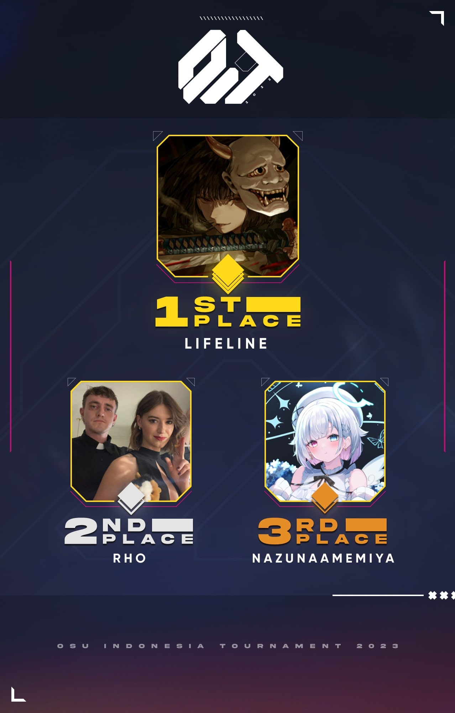

---
tags:
  - OIT2023
  - OIT 2023
---

# osu! Indonesia Tournament #13 (2023)

The **osu! Indonesia Tournament #13 (2023)** (***OIT 2023***) was an Indonesian double-elimination 1v1 osu! tournament hosted by ::{ flag=ID }:: [Sunohara Shun](https://osu.ppy.sh/users/3484548). The tournament was open to all players from Indonesia with 6,000 pp or above in the osu! game mode to their name. It was the thirteenth iteration of the osu! Indonesia Tournament.

## Tournament schedule

| Event | Timestamp |
| --: | :-- |
| Registration phase | 2023-05-17/2023-06-11 |
| Screening phase | 2023-06-12/2023-06-18 |
| Qualifiers | 2023-06-19/2023-06-25 |
| Round of 16 | 2023-06-26/2023-07-02 |
| Quarterfinals | 2023-07-03/2023-07-09 |
| Semifinals | 2023-07-10/2023-07-16 |
| Finals week 1 | 2023-07-17/2023-07-23 |
| Finals week 2 | 2023-07-24/2023-07-30 |

## Prizes

The osu! Indonesia Tournament #13 (2023) offered an initial prize pool of 3,000,000 IDR as generously donated by ::{ flag=ID }:: [Raids](https://osu.ppy.sh/users/15640966) and ::{ flag=ID }:: [Ascaveth](https://osu.ppy.sh/users/3245206). This prize pool was further increased from community donations through [Saweria](https://saweria.co/osuIndonesia) and [Streamlabs](https://streamlabs.com/osuindonesia/tip).

| Placing | Prize(s) |
| :-: | :-- |
|  | 60% of the accumulated prize pool, physical trophy (courtesy of [Herculex Indonesia](https://www.tokopedia.com/herculex)), customised profile banner, unique profile badge |
|  | 30% of the accumulated prize pool, physical trophy (courtesy of [Herculex Indonesia](https://www.tokopedia.com/herculex)), customised profile banner |
|  | 10% of the accumulated prize pool, physical trophy (courtesy of [Herculex Indonesia](https://www.tokopedia.com/herculex)), customised profile banner |

As with all the previous osu! Indonesia Tournament iterations and other osu! tournaments in general, the osu! Indonesia Tournament #13 (2023) was not marked for profit. All contributions and expenses made towards the tournament were publicly logged over at the [Discord server](https://discordapp.com/invite/CHRFffH) for transparency.

## Organisation

The osu! Indonesia Tournament #13 (2023) was run by various osu! community members from Indonesia and beyond.

| Position | Member(s) |
| :-- | :-- |
| Host | ::{ flag=ID }:: [Sunohara Shun](https://osu.ppy.sh/users/3484548) |
| Co-host | ::{ flag=ID }:: [Niva](https://osu.ppy.sh/users/197805), ::{ flag=ID }:: [Raids](https://osu.ppy.sh/users/15640966), ::{ flag=ID }:: [Senritsu](https://osu.ppy.sh/users/1165368) |
| Admin | ::{ flag=ID }:: [Ascaveth](https://osu.ppy.sh/users/3245206), ::{ flag=ID }:: [Felter](https://osu.ppy.sh/users/5865319), ::{ flag=ID }:: [Sunohara Kokona](https://osu.ppy.sh/users/11421465) |
| Mappool selector | ::{ flag=ID }:: [Sunohara Shun](https://osu.ppy.sh/users/3484548), ::{ flag=ID }:: [Niva](https://osu.ppy.sh/users/197805), ::{ flag=ID }:: [Raids](https://osu.ppy.sh/users/15640966), ::{ flag=MY }:: [LouisZPro](https://osu.ppy.sh/users/6231292), ::{ flag=MY }:: [Tzero](https://osu.ppy.sh/users/6088976) |
| Mappool helper | ::{ flag=ID }:: [Ascaveth](https://osu.ppy.sh/users/3245206), ::{ flag=ID }:: [Felter](https://osu.ppy.sh/users/5865319), ::{ flag=ID }:: [Kuro Fuyusaki](https://osu.ppy.sh/users/2667496), ::{ flag=ID }:: [phizh](https://osu.ppy.sh/users/4569302) |
| Custom mapper | ::{ flag=ID }:: [Sunohara Shun](https://osu.ppy.sh/users/3484548), ::{ flag=ID }:: [Niva](https://osu.ppy.sh/users/197805), ::{ flag=ID }:: [Raids](https://osu.ppy.sh/users/15640966), ::{ flag=ID }:: [Felter](https://osu.ppy.sh/users/5865319), ::{ flag=ID }:: [Kuro Fuyusaki](https://osu.ppy.sh/users/2667496), ::{ flag=ID }:: [Crezz](https://osu.ppy.sh/users/7108275), ::{ flag=ID }:: [Seox](https://osu.ppy.sh/users/3793938), ::{ flag=ID }:: [Venta](https://osu.ppy.sh/users/11320627), ::{ flag=ID }:: [Shinjuko](https://osu.ppy.sh/users/10558466), ::{ flag=ID }:: [Adinda](https://osu.ppy.sh/users/15959751), ::{ flag=ID }:: [SupaV](https://osu.ppy.sh/users/19511007), ::{ flag=ID }:: [Celine](https://osu.ppy.sh/users/3545579), ::{ flag=ID }:: [Riene](https://osu.ppy.sh/users/8549009), ::{ flag=ID }:: [Ciyus Miapah](https://osu.ppy.sh/users/2805457), ::{ flag=ID }:: [lushifer](https://osu.ppy.sh/users/13356408), ::{ flag=ID }:: [araran](https://osu.ppy.sh/users/8937198), ::{ flag=ID }:: [ScubDomino](https://osu.ppy.sh/users/8972308), ::{ flag=ID }:: [Melize](https://osu.ppy.sh/users/10778215), ::{ flag=ID }:: [FAW](https://osu.ppy.sh/users/11070577), ::{ flag=MY }:: [Agagak](https://osu.ppy.sh/users/3645490), ::{ flag=KR }:: [cotton\_\_123](https://osu.ppy.sh/users/9823042), ::{ flag=RS }:: [Seolv](https://osu.ppy.sh/users/8067876) |
| Playtester | ::{ flag=ID }:: [Victim\_Crasher](https://osu.ppy.sh/users/2084869), ::{ flag=ID }:: [Crezz](https://osu.ppy.sh/users/7108275), ::{ flag=ID }:: [TheRealPlayer](https://osu.ppy.sh/users/8688737), ::{ flag=ID }:: [PatrickFPSGamer](https://osu.ppy.sh/users/4796773), ::{ flag=US }:: [Sawada](https://osu.ppy.sh/users/8198848), ::{ flag=US }:: [Wixonater](https://osu.ppy.sh/users/10083084) |
| Streamer | ::{ flag=ID }:: [Sunohara Shun](https://osu.ppy.sh/users/3484548), ::{ flag=ID }:: [Raids](https://osu.ppy.sh/users/15640966), ::{ flag=ID }:: [Sunohara Kokona](https://osu.ppy.sh/users/11421465), ::{ flag=ID }:: [Victim_Crasher](https://osu.ppy.sh/users/2084869), ::{ flag=ID }:: [wiam103](https://osu.ppy.sh/users/4109839), ::{ flag=MY }:: [Laphii](https://osu.ppy.sh/users/9364594), ::{ flag=MY }:: [Its not Marvin](https://osu.ppy.sh/users/13600612) |
| Commentator | ::{ flag=ID }:: [Sunohara Shun](https://osu.ppy.sh/users/3484548), ::{ flag=ID }:: [Niva](https://osu.ppy.sh/users/197805), ::{ flag=ID }:: [Raids](https://osu.ppy.sh/users/15640966), ::{ flag=ID }:: [Sunohara Kokona](https://osu.ppy.sh/users/11421465), ::{ flag=ID }:: [Kuro Fuyusaki](https://osu.ppy.sh/users/2667496), ::{ flag=ID }:: [Victim_Crasher](https://osu.ppy.sh/users/2084869), ::{ flag=ID }:: [-Kiichirou-](https://osu.ppy.sh/users/5791467), ::{ flag=ID }:: [BlankTap](https://osu.ppy.sh/users/10137131), ::{ flag=ID }:: [Tama-desu](https://osu.ppy.sh/users/3813174), ::{ flag=ID }:: [Seox](https://osu.ppy.sh/users/3793938) |
| Referee | ::{ flag=ID }:: [NoVaLian](https://osu.ppy.sh/users/6459827), ::{ flag=ID }:: [lucidators](https://osu.ppy.sh/users/10154981), ::{ flag=ID }:: [Tazkiz](https://osu.ppy.sh/users/3738010), ::{ flag=ID }:: [WoodenPickaxe](https://osu.ppy.sh/users/14463105), ::{ flag=ID }:: [Osawa Rurino](https://osu.ppy.sh/users/20160331), ::{ flag=ID }:: [Vincent A](https://osu.ppy.sh/users/11050632), ::{ flag=ID }:: [nabirra](https://osu.ppy.sh/users/16053739), ::{ flag=ID }:: [-TwiHD](https://osu.ppy.sh/users/5470299), ::{ flag=ID }:: [Kurotei](https://osu.ppy.sh/users/19428674), ::{ flag=ID }:: [BlooMertz](https://osu.ppy.sh/users/24134742), ::{ flag=ID }:: [NotDens](https://osu.ppy.sh/users/17311355), ::{ flag=ID }:: [YaeMyMommy](https://osu.ppy.sh/users/17278897),  ::{ flag=ID }:: [diorytt](https://osu.ppy.sh/users/10989656), ::{ flag=MY }:: [Rumah](https://osu.ppy.sh/users/12086495), ::{ flag=PH }:: [-PeKoRa-](https://osu.ppy.sh/users/17959882), ::{ flag=HK }:: [Smato](https://osu.ppy.sh/users/5616307), ::{ flag=HK }:: [ShadeCegLgMn](https://osu.ppy.sh/users/12609866) |
| Graphic designer | ::{ flag=ID }:: [Niva](https://osu.ppy.sh/users/197805), ::{ flag=ID }:: [Felter](https://osu.ppy.sh/users/5865319/), ::{ flag=ID }:: [Vvn](https://osu.ppy.sh/users/3204677), ::{ flag=ID }:: [Takagi-chan](https://osu.ppy.sh/users/11379592) |
| Spreadsheet manager | ::{ flag=ID }:: [Sunohara Shun](https://osu.ppy.sh/users/3484548), ::{ flag=HK }:: [ShadeCegLgMn](https://osu.ppy.sh/users/12609866) |
| Wiki editor | ::{ flag=ID }:: [Niva](https://osu.ppy.sh/users/197805) |

## Links

- **[Master spreadsheet](https://docs.google.com/spreadsheets/d/1AKBByLWsIBtWDaZI8osmhs0gR0-AIfyFrIi2IT498kE)**
- [Forum thread](https://osu.ppy.sh/community/forums/topics/1764769)
- [Discord server](https://discordapp.com/invite/CHRFffH)
- [Livestream channel](https://www.twitch.tv/osuindonesia)
- [Challonge brackets](https://challonge.com/OIT2023)

## Participants

Listed below are the players who managed to qualify into the Round of 16 (along with their respective seed number and Qualifier Z-Sum value) out of 61 registered players in total.

| Seed No. | Player | Z-Sum |
| :-- | :-- | :-- |
| 1 | ::{ flag=ID }:: [NazunaAmemiya](https://osu.ppy.sh/users/12159899) | 10.36 |
| 2 | ::{ flag=ID }:: [lifeline](https://osu.ppy.sh/users/11367222) | 10.22 |
| 3 | ::{ flag=ID }:: [rHO](https://osu.ppy.sh/users/1629553) | 9.57 |
| 4 | ::{ flag=ID }:: [ThatNOOBGuy](https://osu.ppy.sh/users/11091594) | 9.56 |
| 5 | ::{ flag=ID }:: [Hakui Koyori](https://osu.ppy.sh/users/10717635) | 9.54 |
| 6 | ::{ flag=ID }:: [Fuma](https://osu.ppy.sh/users/1501956) | 9.45 |
| 7 | ::{ flag=ID }:: [DeathHydra](https://osu.ppy.sh/users/7457788) | 9.18 |
| 8 | ::{ flag=ID }:: [adyoz](https://osu.ppy.sh/users/2454767) | 8.62 |
| 9 | ::{ flag=ID }:: [Rosemi Lovelock](https://osu.ppy.sh/users/1987591) | 8.32 |
| 10 | ::{ flag=ID }:: [Daffy](https://osu.ppy.sh/users/5968633) | 7.96 |
| 11 | ::{ flag=ID }:: [BlankTap](https://osu.ppy.sh/users/10137131) | 7.84 |
| 12 | ::{ flag=ID }:: [Caruma](https://osu.ppy.sh/users/13187450) | 7.70 |
| 13 | ::{ flag=ID }:: [Ninomae Ina-nis](https://osu.ppy.sh/users/11983229) | 7.63 |
| 14 | ::{ flag=ID }:: [Anhydrous](https://osu.ppy.sh/users/11272510) | 7.47 |
| 15 | ::{ flag=ID }:: [XenoitesBadPog](https://osu.ppy.sh/users/11461426) | 7.31 |
| 16 | ::{ flag=ID }:: [DEETO](https://osu.ppy.sh/users/10069909) | 7.28 |

## Podium

## Mappools

### Finals (week 2)

**[Download the mappack here! (206 MB)](https://cdn.discordapp.com/attachments/402765520610394132/1133028509200171180/oit2023gf.zip)**

- NoMod
  1. [KISIDA KYODAN & THE AKEBOSI ROCKETS - Blood on the EDGE (SupaV) \[PRIMOGENITOR\]](https://osu.ppy.sh/beatmapsets/2030033#osu/4230323)
  2. [UNDEAD CORPORATION - Kasha no Sakebu Yoru ni (Cut Ver.) (monzuul) \[Lullaby\]](https://osu.ppy.sh/beatmapsets/2008164#osu/4177202)
  3. [M2U remixed celas - Legend of Seeker (Celine) \[Overjoy\]](https://osu.ppy.sh/beatmapsets/2027742#osu/4225408)
  4. [BEMANI Sound Team "L.E.D." - GRAVITON (Ishtiaq) \[Nulspace perihelion\]](https://osu.ppy.sh/beatmapsets/1846696#osu/3793473)
  5. [sasakure.UK x TJ.hangneil - World Ender (Hey lululu) \[Drop's Beyond\]](https://osu.ppy.sh/beatmapsets/1804812#osu/3819028)
- Hidden
  1. [KikuoHana - God of Longevity (Icekalt) \[Langlebigkeit\]](https://osu.ppy.sh/beatmapsets/1507370#osu/3087337)
  2. [Shouyu - Redemptor (Digital Universum ver.) (ImpurePug) \[Special\]](https://osu.ppy.sh/beatmapsets/1453412#osu/2988041)
  3. [Hakushi Hasegawa - Doku (Halgoh) \[Halgoh & Sharu's Symbiotic Torrent\]](https://osu.ppy.sh/beatmapsets/1670363#osu/3411617)
- HardRock
  1. [Various Artists - GIRLS' LEGEND U (lushifer) \[Don't Stop! No, Don't Stop 'til Finish! (2023)\]](https://osu.ppy.sh/beatmapsets/1785665#osu/4145932)
  2. [SHIKI - BABYLON (Niva) \[Queen of Sheba\]](https://osu.ppy.sh/beatmapsets/2027996#osu/4225948)
  3. [Hatsuki Yura - Yasou Kagerou (KKipalt) \[nonsquareable\]](https://osu.ppy.sh/beatmapsets/1850954#osu/3802403)
- DoubleTime
  1. [Hana - Sakura no Uta (Melize) \[Naruto & Sasuke Collab\]](https://osu.ppy.sh/beatmapsets/2027467#osu/4224716)
  2. [goreshit - resynth (Gordon) \[amalgamation\]](https://osu.ppy.sh/beatmapsets/1499764#osu/3095034)
  3. [my sound life - AIR (Mirash) \[Insane\]](https://osu.ppy.sh/beatmapsets/1814686#osu/3722666)
  4. [sekai - Zange Mairi (Yugu) \[Repentance\]](https://osu.ppy.sh/beatmapsets/1176431#osu/2453711)
- FreeMod
  1. [Brymir - Hails from the Edge (LMT) \[War Cry\]](https://osu.ppy.sh/beatmapsets/1312066#osu/2719305)
  2. [MuryokuP - Catastrophe (yaspo) \[Catastrophe\]](https://osu.ppy.sh/beatmapsets/1850971#osu/3802467)
  3. [Mandragora, 4i20 - Evil Away (Ciyus Miapah) \[Evil Here\]](https://osu.ppy.sh/beatmapsets/2027998#osu/4225952)
  4. [onoken - ZADAMGA (Down) \[Black Seal\]](https://osu.ppy.sh/beatmapsets/1492550#osu/3169730)
- Tiebreaker
  1. **[ZxNX+Delaina - False Fairy Tale (Raids) \[The White Rabbit\]](https://osu.ppy.sh/beatmapsets/2027735#osu/4225364)**

### Finals (week 1)

**[Download the mappack here! (223 MB)](https://cdn.discordapp.com/attachments/402765520610394132/1130189950973919362/oit2023f.zip)**

- NoMod
  1. [wowaka - Unhappy Refrain (BarkingMadDog) \[EX Extreme\]](https://osu.ppy.sh/beatmapsets/1075607#osu/2250670)
  2. [SHADOW OF INTENT - Gravesinger (riot1133) \[Fairytale\]](https://osu.ppy.sh/beatmapsets/1912270#osu/4166422)
  3. [BlackY feat. Risa Yuzuki - Imitator (Elayue) \[shenyu\]](https://osu.ppy.sh/beatmapsets/1846713#osu/3793494)
  4. [RB.H x lixound x Setsunan - Lost Petal's Wander (Felter) \[Wither\]](https://osu.ppy.sh/beatmapsets/2022611#osu/4212648)
  5. [TAROLIN feat. Katakiri Rekka - Cardinal Rave (Yusomi) \[Landed in the Dogwood\]](https://osu.ppy.sh/beatmapsets/1116399#osu/2332178)
- Hidden
  1. [YurryCanon feat. GUMI - humanly (Petal) \[#$!@*&^%\]](https://osu.ppy.sh/beatmapsets/1886627#osu/3884985)
  2. [Pixel Terror - Millennia (Asphyxia) \[DeviousPanda's Expert\]](https://osu.ppy.sh/beatmapsets/1708547#osu/3592328)
  3. [96neko - Buriki no Dance (CallieCube) \[Tango\]](https://osu.ppy.sh/beatmapsets/1332410#osu/3046047)
- HardRock
  1. [Imy - Seimei no Tomoshibi (KKipalt) \[Reflection\]](https://osu.ppy.sh/beatmapsets/1276373#osu/2651864)
  2. [Okui Masami - God Speed (Anxient) \[Torque\]](https://osu.ppy.sh/beatmapsets/1972419#osu/4092879)
  3. [MYUKKE. - The 89's Momentum (Cubby) \[Cubby & Yusomi Extreme\]](https://osu.ppy.sh/beatmapsets/1235496#osu/2568326)
- DoubleTime
  1. [Maeda Jun x yanaginagi - Kimi to Iu Shinwa (Sunohara Shun) \[30 days (ft. Crezz)\]](https://osu.ppy.sh/beatmapsets/2022618#osu/4212658)
  2. [A-One feat. Shihori - Magic Girl !! (YokesPai) \[Insane\]](https://osu.ppy.sh/beatmapsets/1740099#osu/3557309)
  3. [Synthamesk - Suspirious (fergas) \[AfteraLL\]](https://osu.ppy.sh/beatmapsets/1312111#osu/2719407)
  4. [Nisshoku Natsuko - Rogumaropu (Seikatu) \[Collab\]](https://osu.ppy.sh/beatmapsets/666499#osu/1410681)
- FreeMod
  1. [UNDEAD CORPORATION - One Second (Zelq) \[Blink of an Eye\]](https://osu.ppy.sh/beatmapsets/1580859#osu/3227911)
  2. [Kero Kero Bonito - Flamingo (WTN3 Remix) (Cubby) \[Edit\]](https://osu.ppy.sh/beatmapsets/1271938#osu/4167251)
  3. [Dark PHOENiX - Taketori Hishou (cotton\_\_123) \[Lunatic Princess\]](https://osu.ppy.sh/beatmapsets/1893810#osu/3902585)
  4. [NIWASHI & taiyo - Nami/Oto you-shi (mezelyus) \[Ubiquitous\]](https://osu.ppy.sh/beatmapsets/1833621#osu/3764329)
- Tiebreaker
  1. **[Tokyo.MeltiMelt - the Beautiful Cure (Melize) \[Ave\]](https://osu.ppy.sh/beatmapsets/2027735#osu/4225364)**

### Semifinals

**[Download the mappack here! (193 MB)](https://mappack.yewonkim.tk/download/jE8MBuvr)**

- NoMod
  1. [KAF - Tatoeba (Rtyzen) \[Light\]](https://osu.ppy.sh/beatmapsets/1850935#osu/3802333)
  2. [xi - Fiat Lux (knowledgeking) \[Let There Be Light\]](https://osu.ppy.sh/beatmapsets/1764633#osu/3612033)
  3. [Jimmy Weckl - Get Happy (Saturnalize) \[Festive\]](https://osu.ppy.sh/beatmapsets/1098547#osu/2295195)
  4. [USAO - Cthugha (Raids) \[Raids x Shinjuko's Flamedweller ft. Celine\]](http://osu.ppy.sh/beatmapsets/2018170#osu/4202376)
  5. [Shawn Wasabi + YDG - Burnt Rice (feat. YUNG GEMMY) (ScubDomino) \[Lemon\]](https://osu.ppy.sh/beatmapsets/866401#osu/1857321)
- Hidden
  1. [Uso to Chameleon - Karakuri Destruction (Surgis\_) \[Flake's Ekstreme\]](https://osu.ppy.sh/beatmapsets/1968237#osu/4115109)
  2. [Yorushika - Matasaburo (Aragon) \[Raijodo & a\_blue's Collab Expert\]](https://osu.ppy.sh/beatmapsets/1566187#osu/3614534)
  3. [kors k - Insane Techniques (Plasma) \[Yokes' EX\]](https://osu.ppy.sh/beatmapsets/1783252#osu/3664066)
- HardRock
  1. [Komame - Nostalgia feat. GUMI (Suzuaki\_Rin) \[Nostalgic\]](https://osu.ppy.sh/beatmapsets/1891143#osu/3896479)
  2. [Brandy - Cross Time !! (Leader) \[Muya's XX\]](https://osu.ppy.sh/beatmapsets/973162#osu/2150750)
  3. [Mitsukiyo - Constant Moderato (araran) \[Pino's Lateran\]](https://osu.ppy.sh/beatmapsets/1640689#osu/3373417)
- DoubleTime
  1. [sana - Senpai. (Kyuukai) \[litoluna's Insane\]](https://osu.ppy.sh/beatmapsets/637706#osu/1384674)
  2. [seleP - Scarlet Rose (Amamya) \[Heilia's Scarlet Insane\]](https://osu.ppy.sh/beatmapsets/1936956#osu/4090500)
  3. [Utsu-P - Imperfect Animals (kuyusu) \[Insane\]](https://osu.ppy.sh/beatmapsets/1377324#osu/2861696)
  4. [Diskoria, Laleilmanino, Eva Celia - C.H.R.I.S.Y.E. (Raids) \[Roses\]](https://osu.ppy.sh/beatmapsets/1853565#osu/3808761)
- FreeMod
  1. [The Ritual Aura - Ectoplasm (Mazzerin) \[Synthetic Absolutism - Original\]](https://osu.ppy.sh/beatmapsets/1563639#osu/3193037)
  2. [kors k - SigSig (AJT) \[Dream\]](https://osu.ppy.sh/beatmapsets/1615650#osu/3298591)
  3. [Nanamori-chu \* Goraku-bu - Happy Time wa Owaranai (deadcode) \[Expert\]](https://osu.ppy.sh/beatmapsets/935707#osu/1954858)
  4. [lapix - Flamenco House (Luminiscental) \[Extra\]](https://osu.ppy.sh/beatmapsets/1865291#osu/3853301)
- Tiebreaker
  1. **[OctagonCollaboration - The Glorious Octagon of Destiny (FAW) \[f4uz4n's hard ft. raids\]](https://osu.ppy.sh/beatmapsets/2016959#osu/4199136)**

### Quarterfinals

**[Download the mappack here! (186 MB)](https://mappack.yewonkim.tk/download/jsg5BykO)**

- NoMod
  1. [Falcom Sound Team jdk - Unmitigated Evil (jonathanlfj) \[Darkness\]](https://osu.ppy.sh/beatmapsets/1846382#osu/3792864)
  2. [Isyana Sarasvati - IL SOGNO (feat. DeadSquad) (Melize) \[BISMILLAH COLLAB\]](https://osu.ppy.sh/beatmapsets/2017054#osu/4199342)
  3. [KINEMA106 - IMPERIAL PARADE (Atalanta) \[WORSHIP ME!!!\]](https://osu.ppy.sh/beatmapsets/1569800#osu/3205635)
  4. [Renpul - Alxaid (Cubby) \[Forlorn Dream\]](https://osu.ppy.sh/beatmapsets/1943263#osu/4019749)
  5. [Frums - theyaremanycolors (ScubDomino) \[akariexpert\]](https://osu.ppy.sh/beatmapsets/1533352#osu/4052453)
- Hidden
  1. [Tsukuyomi - Konna Inochi ga Nakereba (Deca) \[ailv's Extra\]](https://osu.ppy.sh/beatmapsets/1317808#osu/2730291)
  2. [paraoka feat. haru*nya - Manimani (Cut ver.) (Cellina) \[hananoiro\]](https://osu.ppy.sh/beatmapsets/2008891#osu/4179280)
  3. [sekai - Idol (Petal) \[Special\]](https://osu.ppy.sh/beatmapsets/1988558#osu/4131025)
- HardRock
  1. [Falcom Sound Team jdk - A-TO-Z (SupaV) \[Goddess of Evolution\]](https://osu.ppy.sh/beatmapsets/2015925#osu/4196814)
  2. [rei sirose - Hakidasu (Lunicia) \[Ascens' Expert\]](https://osu.ppy.sh/beatmapsets/1759673#osu/3824438)
  3. [Nekomanma Team! - Koiuta Shippuu! Karuta Queen Iroha (Atipir) \[Down's Extra\]](https://osu.ppy.sh/beatmapsets/1700477#osu/3476090)
- DoubleTime
  1. [Yuna (CV: Kanda Sayaka) - delete (Kalibe) \[Grief\]](https://osu.ppy.sh/beatmapsets/971212#osu/2033584)
  2. [Dimrain47 - Revolutions (BadMapMaker) \[Harder\]](https://osu.ppy.sh/beatmapsets/1627508#osu/3322624)
  3. [BAND-MAID - DICE (Lasse) \[INSANE.\]](https://osu.ppy.sh/beatmapsets/1248526#osu/2594991)
  4. [Yonekura Chihiro - Smiling-Swinging!! (Shikibe Mayu) \[ShizuCandy's Insane\]](https://osu.ppy.sh/beatmapsets/1568530#osu/3557160)
- FreeMod
  1. [Usagi Aikoukai(cosMo x syuri22) - Dare ga Tame ni Usagi wa Mau=Kyousoku Kyousou Kyoku= (Flask) \[Lunatic\]](https://osu.ppy.sh/beatmapsets/1543394#osu/3154786)
  2. [Ryu\* - Mind Mapping (kors k mix) (AJT) \[Niva's EXTRA (\#oitedit)\]](https://osu.ppy.sh/beatmapsets/2019383#osu/4205368)
  3. [Mediks - Outbreak (Strategas) \[Doomsday\]](https://osu.ppy.sh/beatmapsets/527082#osu/1118311)
  4. [Gekidan Record feat. Nekomata Master - Houkou Orpheus (DeviousPanda) \[Mystery\]](https://osu.ppy.sh/beatmapsets/1257522#osu/2613064)
- Tiebreaker
  1. **[Roman so Words - never ending journey (lushifer) \[i'll always be by your side for our never ending journey\]](https://osu.ppy.sh/beatmapsets/1995377#osu/4146809)**

### Round of 16

**[Download the mappack here! (153 MB)](https://mappack.yewonkim.tk/download/JoR2CVSZ)**

- NoMod
  1. [Baru - ResoAlive (Down) \[reMASTER\]](https://osu.ppy.sh/beatmapsets/1551133#osu/3169762)
  2. [Xi - Native File (AdveNt) \[Tribulation from the Native Gods\]](https://osu.ppy.sh/beatmapsets/1556672#osu/3180049)
  3. [Ariabl'eyeS - Unmei no Kousaku (Mirash) \[Mirash x Delisha Collab\]](https://osu.ppy.sh/beatmapsets/1610080#osu/3287483)
  4. [MYUKKE. - re\[in\]flaw (captin1) \[in\[co\]rect\]](https://osu.ppy.sh/beatmapsets/1344871#osu/2785316)
- Hidden
  1. [Shikiura. - Karada wa Shoujiki datte Ittenno (seros) \[-45's Expert\]](https://osu.ppy.sh/beatmapsets/1767411#osu/3752950)
  2. [Ryokuoushoku Shakai - sabotage (cotton\_\_123) \[Shiny Moments\]](https://osu.ppy.sh/beatmapsets/1899133#osu/3914449)
- HardRock
  1. [Origami Angel - Moebius Chicken Strip (Venta) \[i'm glad this is for oit\]](https://osu.ppy.sh/beatmapsets/1909236#osu/4196549)
  2. [void feat. Komatsuna - Akatsuki no Tsuki (Cherry Blossom) \[Skystar's Extreme\]](https://osu.ppy.sh/beatmapsets/212387#osu/527704)
- DoubleTime
  1. [Miyuna - ...Sugu Kite Ne (Kuse) \[Golden Time\]](https://osu.ppy.sh/beatmapsets/1236940#osu/2571081)
  2. [Daisuke Ishiwatari - Childish Killer (yaspo) \[Like a Rose\]](https://osu.ppy.sh/beatmapsets/1301402#osu/2699262)
  3. [Hanatan - Orange (Hishiro Chizuru) \[Another\]](https://osu.ppy.sh/beatmapsets/989467#osu/2074717)
- FreeMod
  1. [Shade - Ontology (LMT) \[Zelq's Extra\]](https://osu.ppy.sh/beatmapsets/1050313#osu/2207682)
  2. [A.SAKA - Mutsuki Akari no Yuki (allein) \[Expert\]](https://osu.ppy.sh/beatmapsets/1890055#osu/3893556)
  3. [BEMANI Sound Team "Yvya" - Vitrum (Lince Cosmico) \[KKip's Extra\]](https://osu.ppy.sh/beatmapsets/1581126#osu/3267248)
- Tiebreaker
  1. **[LeaF - Calamity Fortune (extended ver.) (Jean-Michel Jr) \[Mid-Day Supernova\]](https://osu.ppy.sh/beatmapsets/1155981#osu/2412400)**

### Qualifiers

**[Download the mappack here! (76 MB)](https://mappack.yewonkim.tk/download/iuNG59Xn)**

- NoMod
  1. [ChouCho - reincarnation (Enon) \[starting over\]](https://osu.ppy.sh/beatmapsets/1833871#osu/3773824)
  2. [Xi - Densetsu no Sabori Shinigami \~ Make a quick escape (Toumei Dragon) \[Extra Stage\]](https://osu.ppy.sh/beatmapsets/1621473#osu/3310526)
  3. [POLKADOT STINGRAY - Otoshimae (moph) \[Extreme\]](https://osu.ppy.sh/beatmapsets/1301330#osu/2699135)
  4. [jioyi attacked by mirror - I lost my flp (Felter) \[i lost my petal of wander\]](https://osu.ppy.sh/beatmapsets/2005360#osu/4170562)
- Hidden
  1. [Kuhaku Gokko - Lil'b (Petal) \[Inexplicable\]](https://osu.ppy.sh/beatmapsets/1561567#osu/3189187)
  2. [ELFENSJoN - DAWN (Kuro Fuyusaki) \[Eternity\]](https://osu.ppy.sh/beatmapsets/2002634#osu/4164614)
- HardRock
  1. [LiSA - traumerei (Wen) \[Revitalizing Love\]](https://osu.ppy.sh/beatmapsets/1821202#osu/3736979)
  2. [James Landino - Arsene's Bazaar (allein) \[Expert\]](https://osu.ppy.sh/beatmapsets/1972126#osu/4092128)
- DoubleTime
  1. [JUNNA - Vai! Ya! Vai! (Yohanes) \[Insane\]](https://osu.ppy.sh/beatmapsets/1088269#osu/2275555)
  2. [Tsukino - Dohna Dohna no Uta (gazimal) \[Koori's Insane\]](https://osu.ppy.sh/beatmapsets/1459224#osu/3082198)
  3. [Maon Kurosaki - Magic World (Dada) \[Continuum\]](https://osu.ppy.sh/beatmapsets/1833693#osu/3764472)

## Match results

### Finals (week 2)

Saturday, 29 July 2023:

| Bracket | Player 1 |  |  | Player 2 | Match link |
| :-: | --: | :-: | :-: | :-- | :-- |
| Lower | [NazunaAmemiya](https://osu.ppy.sh/users/12159899) ::{ flag=ID }:: | 3 | **7** | ::{ flag=ID }:: **[rHO](https://osu.ppy.sh/users/1629553)** | [#1](https://osu.ppy.sh/community/matches/109737714) |

Sunday, 30 July 2023, Grand Final:

| Bracket | Player 1 |  |  | Player 2 | Match link |
| :-: | --: | :-: | :-: | :-- | :-- |
| Grand Final | **[lifeline](https://osu.ppy.sh/users/11367222)** ::{ flag=ID }:: | **7** | 5 | ::{ flag=ID }:: [rHO](https://osu.ppy.sh/users/1629553) | [#1](https://osu.ppy.sh/community/matches/109750968) |

### Finals (week 1)

Saturday, 22 July 2023:

| Bracket | Player 1 |  |  | Player 2 | Match link |
| :-: | --: | :-: | :-: | :-- | :-- |
| Lower | **[Hakui Koyori](https://osu.ppy.sh/users/10717635)** ::{ flag=ID }:: | **7** | 4 | ::{ flag=ID }:: [DEETO](https://osu.ppy.sh/users/10069909) | [#1](https://osu.ppy.sh/community/matches/109619011) |
| Upper | [NazunaAmemiya](https://osu.ppy.sh/users/12159899) ::{ flag=ID }:: | 2 | **7** | ::{ flag=ID }:: **[lifeline](https://osu.ppy.sh/users/11367222)** | [#1](https://osu.ppy.sh/community/matches/109620970) |
| Lower | [Fuma](https://osu.ppy.sh/users/1501956) ::{ flag=ID }:: | 2 | **7** | ::{ flag=ID }:: **[rHO](https://osu.ppy.sh/users/1629553)** | [#1](https://osu.ppy.sh/community/matches/109623175) |

Sunday, 23 July 2023:

| Bracket | Player 1 |  |  | Player 2 | Match link |
| :-: | --: | :-: | :-: | :-- | :-- |
| Lower | [Hakui Koyori](https://osu.ppy.sh/users/10717635) ::{ flag=ID }:: | 3 | **7** | ::{ flag=ID }:: **[rHO](https://osu.ppy.sh/users/1629553)** | [#1](https://osu.ppy.sh/community/matches/109640383) |

### Semifinals

Thursday, 13 July 2023:

| Bracket | Player 1 |  |  | Player 2 | Match link |
| :-: | --: | :-: | :-: | :-- | :-- |
| Lower | [Rosemi Lovelock](https://osu.ppy.sh/users/1987591) ::{ flag=ID }:: | 5 | **6** | ::{ flag=ID }:: **[rHO](https://osu.ppy.sh/users/1629553)** | [#1](https://osu.ppy.sh/community/matches/109473585) |
| Lower | **[ThatNOOBGuy](https://osu.ppy.sh/users/11091594)** ::{ flag=ID }:: | **6** | 5 | ::{ flag=ID }:: [XenoitesBadPog](https://osu.ppy.sh/users/11461426) | [#1](https://osu.ppy.sh/community/matches/109472911) |

Friday, 14 July 2023:

| Bracket | Player 1 |  |  | Player 2 | Match link |
| :-: | --: | :-: | :-: | :-- | :-- |
| Lower | [ThatNOOBGuy](https://osu.ppy.sh/users/11091594) ::{ flag=ID }:: | 3 | **6** | ::{ flag=ID }:: **[rHO](https://osu.ppy.sh/users/1629553)** | [#1](https://osu.ppy.sh/community/matches/109490570) |

Saturday, 15 July 2023:

| Bracket | Player 1 |  |  | Player 2 | Match link |
| :-: | --: | :-: | :-: | :-- | :-- |
| Lower | [Anhydrous](https://osu.ppy.sh/users/11272510) ::{ flag=ID }:: | 2 | **6** | ::{ flag=ID }:: **[DEETO](https://osu.ppy.sh/users/10069909)** | [#1](https://osu.ppy.sh/community/matches/109505402) |
| Upper | **[lifeline](https://osu.ppy.sh/users/11367222)** ::{ flag=ID }:: | **6** | 0 | ::{ flag=ID }:: [Fuma](https://osu.ppy.sh/users/1501956) | [#1](https://osu.ppy.sh/community/matches/109506277) |
| Lower | [DeathHydra](https://osu.ppy.sh/users/7457788) ::{ flag=ID }:: | 3 | **6** | ::{ flag=ID }:: **[Ninomae Ina-nis](https://osu.ppy.sh/users/11983229)** | [#1](https://osu.ppy.sh/community/matches/109506204) |

Sunday, 16 July 2023:

| Bracket | Player 1 |  |  | Player 2 | Match link |
| :-: | --: | :-: | :-: | :-- | :-- |
| Upper | **[NazunaAmemiya](https://osu.ppy.sh/users/12159899)** ::{ flag=ID }:: | **6** | 5 | ::{ flag=ID }:: [Hakui Koyori](https://osu.ppy.sh/users/10717635) | [#1](https://osu.ppy.sh/community/matches/109521317) |
| Lower | **[DEETO](https://osu.ppy.sh/users/10069909)** ::{ flag=ID }:: | **6** | 3 | ::{ flag=ID }:: [Ninomae Ina-nis](https://osu.ppy.sh/users/11983229) | [#1](https://osu.ppy.sh/community/matches/109525652) |

### Quarterfinals

Saturday, 8 July 2023:

| Bracket | Player 1 |  |  | Player 2 | Match link |
| :-: | --: | :-: | :-: | :-- | :-- |
| Lower | **[rHO](https://osu.ppy.sh/users/1629553)** ::{ flag=ID }:: | **6** | 3 | ::{ flag=ID }:: [BlankTap](https://osu.ppy.sh/users/10137131) | [#1](https://osu.ppy.sh/community/matches/109388652) |

Sunday, 9 July 2023:

| Bracket | Player 1 |  |  | Player 2 | Match link |
| :-: | --: | :-: | :-: | :-- | :-- |
| Lower | **[Ninomae Ina-nis](https://osu.ppy.sh/users/11983229)** ::{ flag=ID }:: | **6** | 3 | ::{ flag=ID }:: [Caruma](https://osu.ppy.sh/users/13187450) | [#1](https://osu.ppy.sh/community/matches/109407517) |
| Upper | [Anhydrous](https://osu.ppy.sh/users/11272510) ::{ flag=ID }:: | 0 | **6** | ::{ flag=ID }:: **[Fuma](https://osu.ppy.sh/users/1501956)** | [#1](https://osu.ppy.sh/community/matches/109408858) |
| Lower | **[XenoitesBadPog](https://osu.ppy.sh/users/11461426)** ::{ flag=ID }:: | **6** | 2 | ::{ flag=ID }:: [Daffy](https://osu.ppy.sh/users/5968633) | [#1](https://osu.ppy.sh/community/matches/109409404) |
| Upper | [ThatNOOBGuy](https://osu.ppy.sh/users/11091594) ::{ flag=ID }:: | 4 | **6** | ::{ flag=ID }:: **[Hakui Koyori](https://osu.ppy.sh/users/10717635)** | [#1](https://osu.ppy.sh/community/matches/109407605) |
| Upper | **[lifeline](https://osu.ppy.sh/users/11367222)** ::{ flag=ID }:: | **6** | 1 | ::{ flag=ID }:: [DeathHydra](https://osu.ppy.sh/users/7457788) | [#1](https://osu.ppy.sh/community/matches/109405757) |
| Upper | **[NazunaAmemiya](https://osu.ppy.sh/users/12159899)** ::{ flag=ID }:: | **6** | 2 | ::{ flag=ID }:: [Rosemi Lovelock](https://osu.ppy.sh/users/1987591) | [#1](https://osu.ppy.sh/community/matches/109409917) |
| Lower | **[DEETO](https://osu.ppy.sh/users/10069909)** ::{ flag=ID }:: | **6** | 2 | ::{ flag=ID }:: [adyoz](https://osu.ppy.sh/users/2454767) | [#1](https://osu.ppy.sh/community/matches/109410214) |

### Round of 16

Friday, 30 June 2023:

| Bracket | Player 1 |  |  | Player 2 | Match link |
| :-: | --: | :-: | :-: | :-- | :-- |
| Upper | **[DeathHydra](https://osu.ppy.sh/users/7457788)** ::{ flag=ID }:: | **5** | 1 | ::{ flag=ID }:: [Daffy](https://osu.ppy.sh/users/5968633) | [#1](https://osu.ppy.sh/community/matches/109260584) |
| Upper | **[ThatNOOBGuy](https://osu.ppy.sh/users/11091594)** ::{ flag=ID }:: | **5** | 0 | ::{ flag=ID }:: [Ninomae Ina-nis](https://osu.ppy.sh/users/11983229) | [#1](https://osu.ppy.sh/community/matches/109263529) |

Saturday, 1 July 2023:

| Bracket | Player 1 |  |  | Player 2 | Match link |
| :-: | --: | :-: | :-: | :-- | :-- |
| Upper | **[NazunaAmemiya](https://osu.ppy.sh/users/12159899)** ::{ flag=ID }:: | **5** | 0 | ::{ flag=ID }:: [DEETO](https://osu.ppy.sh/users/10069909) | [#1](https://osu.ppy.sh/community/matches/109276960) |
| Upper | [adyoz](https://osu.ppy.sh/users/2454767) ::{ flag=ID }:: | 2 | **5** | ::{ flag=ID }:: **[Rosemi Lovelock](https://osu.ppy.sh/users/1987591)** | [#1](https://osu.ppy.sh/community/matches/109281328) |
| Upper | **[Hakui Koyori](https://osu.ppy.sh/users/10717635)** ::{ flag=ID }:: | **5** | 0 | ::{ flag=ID }:: [Caruma](https://osu.ppy.sh/users/13187450) | [#1](https://osu.ppy.sh/community/matches/109282423) |

Sunday, 2 July 2023:

| Bracket | Player 1 |  |  | Player 2 | Match link |
| :-: | --: | :-: | :-: | :-- | :-- |
| Upper | **[lifeline](https://osu.ppy.sh/users/11367222)** ::{ flag=ID }:: | **5** | 2 | ::{ flag=ID }:: [XenoitesBadPog](https://osu.ppy.sh/users/11461426) | [#1](https://osu.ppy.sh/community/matches/109294580) |
| Upper | [rHO](https://osu.ppy.sh/users/1629553) ::{ flag=ID }:: | 3 | **5** | ::{ flag=ID }:: **[Anhydrous](https://osu.ppy.sh/users/11272510)** | [#1](https://osu.ppy.sh/community/matches/109296248) |
| Upper | **[Fuma](https://osu.ppy.sh/users/1501956)** ::{ flag=ID }:: | **5** | 3 | ::{ flag=ID }:: [BlankTap](https://osu.ppy.sh/users/10137131) | [#1](https://osu.ppy.sh/community/matches/109298415) |

## Ruleset

### General rules

1. Beatmap scoring is based on **[ScoreV2](/wiki/Gameplay/Score#scorev2).**
2. The mappools for each round will be announced by the tournament management in advance before the actual matches take place.
3. Match schedules will be predetermined by the tournament management. If there are any players who are unable to attend the current schedule for any reason, all other affected players may apply and settle for a reschedule at the `#reschedule` channel in the tournament's Discord server.
4. A referee will create a multiplayer room 10 minutes in advance and will start to send out invites.
5. If a player does not show up within **10 minutes** of the start time, their opponent wins by default.
6. If no staff or referee is available, the match will be postponed.
7. **NoFail will be enforced in all beatmaps.** This is to ensure that the points are to be awarded more fairly towards players who perform better in general during the course of the beatmap regardless of their remaining health at the end.
8. If a player disconnects, it will be treated as if they had failed the beatmap.
   - A match can be rematched for disconnects that occur within a few seconds after the beatmap has been started by the referee.
9. Lag is not a valid reason to nullify a beatmap.
10. If any problems during the match occur, the tournament management will make a decision based on the referee's report.
11. It is expected that all players be polite and respectful to each other. Penalties will be given upon violation.
    - If a player is found to be engaging in an act that is deemed to be distasteful or provocative, the corresponding player may be disqualified right away from the tournament and/or blacklisted from future iterations of the tournament by the tournament management.
    - Usage of any tools or programs that are against the [osu! community rules](/wiki/Rules#community-rules) is strictly prohibited and will be straight up reported to the osu! team at will.

### Tournament registration

1. All interested players are required to register into the tournament individually through [this form](https://forms.gle/xzFzErPtCe989xHY6).
   - In order to be eligible to play in the tournament, a player must:
     - Have the ::{ flag=ID }:: Indonesian flag displayed on their profile, **and**
     - Be in possession of at least 6,000 pp in the osu! game mode at the time of registration.
2. To ensure that all incoming registrations are serious and valid, every registered player will be checked in detail by the tournament management.
3. The list of players who are deemed to be eligible to compete in the tournament will be published by the tournament management after the registration phase has ended.
4. Testplayers, referees, custom mappers, and mappool selectors may not participate as players in this tournament.

### Round-specific rules

#### Qualifier rules

1. Each player will have to sign up to one of the Qualifier lobbies that have been scheduled and prepared by the tournament management in advance.
2. In the lobby, all players will have to consecutively play all of the eleven Qualifier beatmaps in the order of NM1 -> NM2 -> NM3 -> NM4 -> HD1 -> HD2 -> HR1 -> HR2 -> DT1 -> DT2 -> DT3.
3. Players **are not allowed** to ban any beatmaps in the Qualifiers.
4. Players **are not allowed** to join (or register for) more than one Qualifier lobby.
5. Based on their performance in the Qualifier, players will be ranked based on their Z-Sum value (which is the total amount of Z-Score across all eleven Qualifier beatmaps). A brief explanation on the concept of Z-Sum and Z-Score can be found [here](http://www.statisticshowto.com/probability-and-statistics/z-score/).
6. 16 players with the **highest Z-Sum value** will advance to the knock-out stages.
   - If there are two (or more) players who share the same Z-Sum value, the player that holds the higher total raw score will be placed in the higher seed.
7. Failure to attend in any of the predetermined Qualifier lobbies will result in an instant elimination from the tournament.

#### Knock-out stage rules

1. The 16 players who managed to get through from the Qualifiers will be matched to each other based on their Qualifier seeding.
2. Players will compete against each other using the double-elimination system.
3. The double-elimination system works as follows:
   - Players who lose in the upper bracket can still play again in the lower bracket.
   - Players who lose in the lower bracket will be eliminated from the tournament.
   - In the Grand Final, the winner of the the upper bracket will only need to win a single match against their opponent in order to claim the championship title. The winner of the lower bracket, however, will need to win two matches and enforce a *bracket reset* against their opponent in order to claim the championship title.
4. Players who can compete in the next round are determined by:
   - In the the Round of 16, each player needs to win 5 points in order to win a match. (Best of 9)
   - In the Quarterfinals and the Semifinals, each player needs to win 6 points in order to win a match. (Best of 11)
   - In both of the Finals weeks, each player needs to win 7 points in order to win a match. (Best of 13)
   - Whether there are players who are declared to win the match by default.
   - Whether there are players who are disqualified from the tournament.

### Match regulations

1. Each player must use the `!roll` command once in the multiplayer lobby in order to determine the banning and picking order.
   - The winner of the `!roll` gets to determine who gets the first pick and the second ban.
   - The loser of the `!roll` gets the opposite by default.
   - This rule does not apply in the Qualifier lobbies.
2. Each player has to ban **one beatmap** (on the Round of 16) and **two beatmaps** (from the Quarterfinals onwards) from the corresponding mappool. These beatmaps will not be allowed to be picked by any player during the entire match.
   - Barring the tiebreaker, there are no restrictions as to which maps may and may not be banned in a match.
   - Banning does not apply in the Qualifier lobbies.
3. **There will be no warm-up beatmaps to be played in the multiplayer lobby.** Players who are looking to warm up before the match are expected to do so by their own before the match commences.
4. In a FreeMod pick, each player has to apply at least one mod to play the beatmap with. Allowed mods are Easy, HardRock, Hidden, or any possible combinations of the three mods.
   - Playing a FreeMod pick without any mods applied is not allowed.
   - Players opting to play with Easy will have their scores multiplied by `x1.85` up to a maximum of 900,000 points.
5. In the case of a tiebreaker, the tiebreaker map will be played with the FreeMod option enabled which allows players to play the tiebreaker map with Easy, HardRock, Hidden, or any possible combinations of the three mods should they wish to.
   - Playing the tiebreaker map with a mod is *not* mandatory.
6. The results of each match and any other relevant information regarding the match will be noted by the referee after the match has been concluded.
