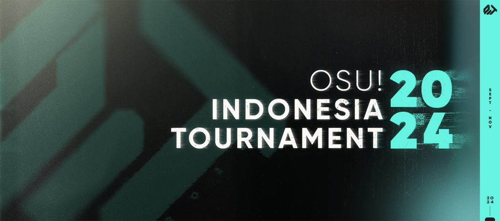
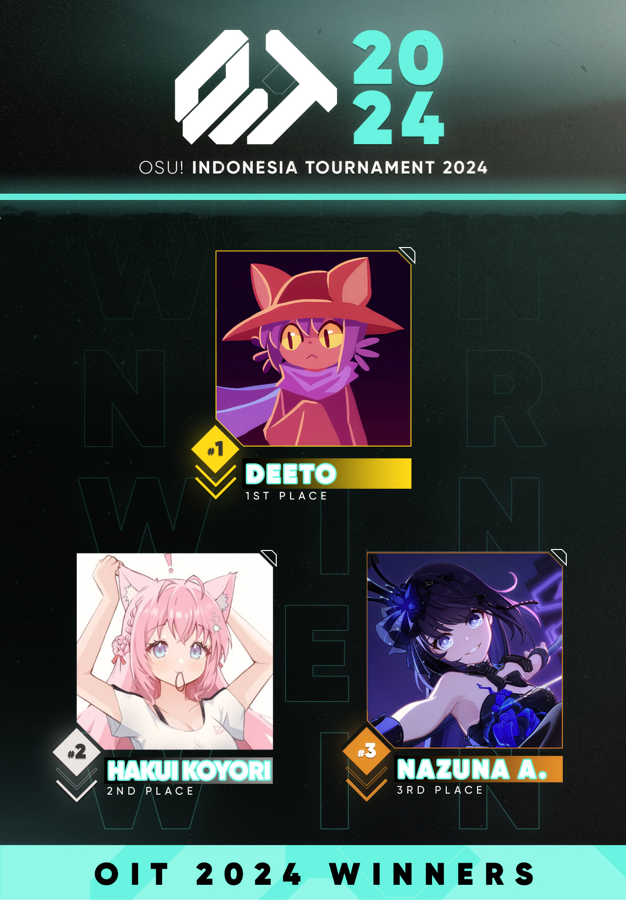

---
tags:
  - OIT 14
  - OIT 2024
---

# osu! Indonesia Tournament #14 (2024)

The **osu! Indonesia Tournament #14 (2024)** (OIT 2024) was a double-elimination 1v1 osu! tournament hosted by ::{ flag=ID }:: [Chokecomint](https://osu.ppy.sh/users/20308933). The tournament was open to all osu! players from Indonesia without an active [tournament ban](/wiki/Help_centre/Tournament_bans) regardless of rank. It was the fourteenth iteration of the osu! Indonesia Tournament.

## Tournament schedule

| Event | Timestamp |
| --: | :-- |
| Registration phase | 2024-08-25/2024-09-08 |
| Screening phase | 2024-09-09/2024-09-22 |
| Qualifiers | 2024-09-23/2024-09-29 |
| Round of 16 | 2024-09-30/2024-10-06 |
| Quarterfinals | 2024-10-07/2024-10-13 |
| Semifinals | 2024-10-14/2024-10-21 |
| Finals (week 1) | 2024-10-22/2024-10-28 |
| Finals (week 2) | 2024-10-29/2024-11-03 |

## Prizes

The osu! Indonesia Tournament #14 (2024) offered an initial prize pool of 500,000 IDR as generously donated by ::{ flag=ID }:: [Chokecomint](https://osu.ppy.sh/users/20308933). This prize pool was further increased from community donations through [Saweria](https://saweria.co/osuIndonesia) and [Streamlabs](https://streamlabs.com/osuindonesia/tip).

| Placing | Prize(s) |
| :-: | :-- |
|  | 60% of the accumulated prize pool, customised profile banner, unique profile badge |
|  | 30% of the accumulated prize pool, customised profile banner |
|  | 10% of the accumulated prize pool, customised profile banner |

As with all the previous osu! Indonesia Tournament iterations and other osu! tournaments in general, the osu! Indonesia Tournament #14 (2024) was not marked for profit. All contributions and expenses made towards the tournament were publicly logged over at the [Discord server](https://discord.com/invite/CHRFffH) for transparency.

## Organisation

The osu! Indonesia Tournament #14 (2024) was run by various osu! community members from Indonesia and beyond.

| Position | Member(s) |
| :-- | :-- |
| Host | ::{ flag=ID }:: [Chokecomint](https://osu.ppy.sh/users/20308933) |
| Co-host | ::{ flag=ID }:: [Niva](https://osu.ppy.sh/users/197805), ::{ flag=ID }:: [Luci](https://osu.ppy.sh/users/10154981), ::{ flag=ID }:: [diorytt](https://osu.ppy.sh/users/10989656) |
| Mappool selector | ::{ flag=ID }:: [Chokecomint](https://osu.ppy.sh/users/20308933), ::{ flag=ID }:: [Luci](https://osu.ppy.sh/users/10154981), ::{ flag=ID }:: [FAW](https://osu.ppy.sh/users/11070577), ::{ flag=ID }:: [TheRealPlayer](https://osu.ppy.sh/users/8688737), ::{ flag=ID }:: [VtuberVoiceASMR](https://osu.ppy.sh/users/8780223), ::{ flag=ID }:: [Mashima Himeko](https://osu.ppy.sh/users/10474988) |
| Custom mapper | ::{ flag=ID }:: [FAW](https://osu.ppy.sh/users/11070577), ::{ flag=ID }:: [Felter](https://osu.ppy.sh/users/5865319), ::{ flag=ID }:: [Saturnalize](https://osu.ppy.sh/users/762487), ::{ flag=ID }:: [jiwoas](https://osu.ppy.sh/users/10778215), ::{ flag=ID }:: [Azrulk](https://osu.ppy.sh/users/12046612), ::{ flag=ID }:: [Satono Crown](https://osu.ppy.sh/users/13356408), ::{ flag=ID }:: [AncuL](https://osu.ppy.sh/users/2449200), ::{ flag=ID }:: [Ciyus Miapah](https://osu.ppy.sh/users/2805457), ::{ flag=ID }:: [Celine](https://osu.ppy.sh/users/3545579), ::{ flag=ID }:: [ArXe](https://osu.ppy.sh/users/14013313), ::{ flag=US }:: [Sparhten](https://osu.ppy.sh/users/7601720) |
| Custom map quality assurance | ::{ flag=ID }:: [Niva](https://osu.ppy.sh/users/197805), ::{ flag=ID }:: [Kuro Fuyusaki](https://osu.ppy.sh/users/2667496) |
| Playtester | ::{ flag=ID }:: [TheRealPlayer](https://osu.ppy.sh/users/8688737), ::{ flag=ID }:: [VtuberVoiceASMR](https://osu.ppy.sh/users/8780223), ::{ flag=ID }:: [Stixe](https://osu.ppy.sh/users/18351160)[^stixe-note-1], ::{ flag=KR }:: [fragranceofpage](https://osu.ppy.sh/users/11399348) |
| Streamer | ::{ flag=ID }:: [Chokecomint](https://osu.ppy.sh/users/20308933), ::{ flag=ID }:: [Victim\_Crasher](https://osu.ppy.sh/users/2084869), ::{ flag=ID }:: [cxyren](https://osu.ppy.sh/users/2151493), ::{ flag=ID }:: [Ren245](https://osu.ppy.sh/users/9048690), ::{ flag=MY }:: [Sagisawa Arisu](https://osu.ppy.sh/users/9364594), ::{ flag=VN }:: [- Fubukiii](https://osu.ppy.sh/users/9931217) |
| Commentator | ::{ flag=ID }:: [Chokecomint](https://osu.ppy.sh/users/20308933), ::{ flag=ID }:: [Niva](https://osu.ppy.sh/users/197805), ::{ flag=ID }:: [Luci](https://osu.ppy.sh/users/10154981), ::{ flag=ID }:: [diorytt](https://osu.ppy.sh/users/10989656), ::{ flag=ID }:: [VtuberVoiceASMR](https://osu.ppy.sh/users/8780223), ::{ flag=ID }:: [Victim\_Crasher](https://osu.ppy.sh/users/2084869), ::{ flag=ID }:: [Artaa27](https://osu.ppy.sh/users/12085864), ::{ flag=ID }:: [WoodenPickaxe](https://osu.ppy.sh/users/14463105), ::{ flag=ID }:: [Seox](https://osu.ppy.sh/users/3793938), ::{ flag=ID }:: [Vvn](https://osu.ppy.sh/users/3204677), ::{ flag=ID }:: [\[Aero\]](https://osu.ppy.sh/users/24396418) |
| Referee | ::{ flag=ID }:: [Chokecomint](https://osu.ppy.sh/users/20308933), ::{ flag=ID }:: [Niva](https://osu.ppy.sh/users/197805), ::{ flag=ID }:: [diorytt](https://osu.ppy.sh/users/10989656), ::{ flag=ID }:: [Artaa27](https://osu.ppy.sh/users/12085864), ::{ flag=ID }:: [-\[ Shinraa \]-](https://osu.ppy.sh/users/26942053), ::{ flag=ID }:: [Kurami\_San](https://osu.ppy.sh/users/8867495), ::{ flag=ID }:: [YaeMyMommy](https://osu.ppy.sh/users/17278897), ::{ flag=ID }:: [ElinLYPK](https://osu.ppy.sh/users/5198950),  ::{ flag=ID }:: [nabirra](https://osu.ppy.sh/users/16053739), ::{ flag=MY }:: [Rumah](https://osu.ppy.sh/users/12086495) |
| Graphic designer | ::{ flag=ID }:: [Victim\_Crasher](https://osu.ppy.sh/users/2084869), ::{ flag=ID }:: [Zaald](https://osu.ppy.sh/users/12088808), ::{ flag=ID }:: [Felter](https://osu.ppy.sh/users/5865319) |
| Spreadsheet manager | ::{ flag=ID }:: [diorytt](https://osu.ppy.sh/users/10989656) |
| Wiki editor | ::{ flag=ID }:: [Niva](https://osu.ppy.sh/users/197805) |

## Links

- **[Master spreadsheet](https://docs.google.com/spreadsheets/d/1zSjTQYN_9qG_bZTnw89k-H3AV_mhZrVJdTP5_Z9crYE/edit?usp=sharing)**
- [Forum thread](https://osu.ppy.sh/community/forums/topics/1968598)
- [Discord server](https://discord.gg/FJgtKEqypY)
- [Challonge brackets](https://challonge.com/oit14)
- [Livestream channel](https://www.twitch.tv/osumalaysia)

## Participants

Listed below are the players who managed to qualify into the Round of 16 (along with their respective seed number and aggregated Z-sum across all eleven Qualifier beatmaps) out of 59 participating players in total.

The complete list of player registrations can be found [here](https://docs.google.com/spreadsheets/d/1zSjTQYN_9qG_bZTnw89k-H3AV_mhZrVJdTP5_Z9crYE/edit?gid=640571015#gid=640571015).

| Seed no. | Player | Z-sum |
| :-- | :-- | :-- |
| 1 | ::{ flag=ID }:: [NazunaAmemiya](https://osu.ppy.sh/users/12159899) | 10.36 |
| 2 | ::{ flag=ID }:: [BlankTap](https://osu.ppy.sh/users/10137131) | 9.28 |
| 3 | ::{ flag=ID }:: [Hakui Koyori](https://osu.ppy.sh/users/10717635) | 9.27 |
| 4 | ::{ flag=ID }:: [Rosemi Lovelock](https://osu.ppy.sh/users/1987591) | 9.20 |
| 5 | ::{ flag=ID }:: [Fuma](https://osu.ppy.sh/users/1501956) | 9.07 |
| 6 | ::{ flag=ID }:: [DEETO](https://osu.ppy.sh/users/10069909) | 9.04 |
| 7 | ::{ flag=ID }:: [Ninomae Ina-nis](https://osu.ppy.sh/users/11983229) | 8.53 |
| 8 | ::{ flag=ID }:: [lifeline](https://osu.ppy.sh/users/11367222) | 8.45 |
| 9 | ::{ flag=ID }:: [Skydiver](https://osu.ppy.sh/users/4750008) | 8.28 |
| 10 | ::{ flag=ID }:: [Stixe](https://osu.ppy.sh/users/18351160) | 8.24 |
| 11 | ::{ flag=ID }:: [MejiroMcQueen](https://osu.ppy.sh/users/11320627) | 7.78 |
| 12 | ::{ flag=ID }:: [Vvn](https://osu.ppy.sh/users/3204677) | 7.44 |
| 13 | ::{ flag=ID }:: [Anhydrous](https://osu.ppy.sh/users/11272510) | 7.39 |
| 14 | ::{ flag=ID }:: [malvon](https://osu.ppy.sh/users/11113661) | 6.53 |
| 15 | ::{ flag=ID }:: [Azasapag](https://osu.ppy.sh/users/18347666) | 6.48 |
| 16 | ::{ flag=ID }:: [-CircleParadox-](https://osu.ppy.sh/users/10423227) | 6.27 |

## Podium

## Mappools

### Finals (week 2)

- No Mod
  1. [Yorushika - Replicant (forsen) \[All Love is a Replica\]](https://osu.ppy.sh/beatmapsets/1826541#osu/3748451)
  2. [Shrine of Malice - The Awakening (ArXe) \[Born into this world, I am the Son of Perdition\]](https://osu.ppy.sh/beatmapsets/2248507#osu/4780981)
  3. [Tsukuyomi - Absolute Zero (Delis) \[absolutinum russian kobold extra\]](https://osu.ppy.sh/beatmapsets/2033426#osu/4239024)
  4. [ARForest - Birds of Plague (Saturnalize) \[Eulogy, the Interlude\]](https://osu.ppy.sh/beatmapsets/2242282#osu/4765985)
  5. [ITHAQUA - aoi kokoro (Mejiro McQueen) \[BOCCHI THE ROLLING GIRLS\]](https://osu.ppy.sh/beatmapsets/2235137#osu/4747935)
- Hidden  
  1. [Ocelot - KAEDE (Hollow Wings) \[EX EX\]](https://osu.ppy.sh/beatmapsets/660630#osu/1398809)
  2. [Rigel Theatre - Tir na nOg (FAW) \[Antediluvian Paradise\]](https://osu.ppy.sh/beatmapsets/2271884#osu/4839405)
  3. [mezClA (Evatan & Mecotan) - Azul Remix (Celine) \[Overjoy\]](https://osu.ppy.sh/beatmapsets/2259103#osu/4807551)
- Hard Rock
  1. [Asriel - Nights of Blood (jiwoas) \[Anguish\]](https://osu.ppy.sh/beatmapsets/2271949#osu/4839635)
  2. [HYTD - Yuanshao - Drone (Monsters With Tiny Mustaches Remix) (Hollow Wings) \[Extra\]](https://osu.ppy.sh/beatmapsets/162612#osu/396537)
  3. [Sobrem x Silentroom - Random (seros) \[revoh's Expert\]](https://osu.ppy.sh/beatmapsets/1674155#osu/3992308)  
- Double Time
  1. [Ryokuoushoku Shakai - want (Amateurre) \[akitoshi's expert\]](https://osu.ppy.sh/beatmapsets/1870935#osu/3855031)
  2. [NU-KO - Pochiko no Shiawase na Nichijou (Enon) \[A\_cu's Expert\]](https://osu.ppy.sh/beatmapsets/240733#osu/562192)
  3. [Lia - Tori no Uta (OK_oreGENKI) \[Collab\]](https://osu.ppy.sh/beatmapsets/421467#osu/911540)
  4. [my sound life - LINE (posydomojka) \[\_\]](https://osu.ppy.sh/beatmapsets/1769017#osu/3621279)
- Free Mod
  1. [Project Pop - Metal vs Dugem (Shurelia) \[Joget Maut Scub dan Shurelia\]](https://osu.ppy.sh/beatmapsets/2183079#osu/4613136)
  2. [Gema Gathika - Chronograph (Saturnalize) \[i misgendered the person in the mv i am so sorry\]](https://osu.ppy.sh/beatmapsets/2270729#osu/4836584)
  3. [X2N\_ - Smile of the End (Mirash) \[Extra\]](https://osu.ppy.sh/beatmapsets/775541#osu/1629708)
  4. [Laur - Swift Swing (Alvearia) \[Ex\]](https://osu.ppy.sh/beatmapsets/1864791#osu/3835310)
- Tiebreaker
  1. **[Silentroom - Bhutesha (Celine) \[Shiva\]](https://osu.ppy.sh/beatmapsets/1730292#osu/3536190)** 

### Finals (week 1)

- No Mod
  1. [Team.Nekokan - Airman ga Taosenai (10-shuunen version) (Toumei Dragon) \[Holy Shit! Blue Dragon's Back!!\]](https://osu.ppy.sh/beatmapsets/1585350#osu/3238171)
  2. [Rhapsody of Fire - Dawn of Victory (Ciyus Miapah) \[Gloria\]](https://osu.ppy.sh/beatmapsets/2224461#osu/4717705)
  3. [Tsukimura Temari (CV: Ojika Nao) - Kanaetai, Koto Bakari (Felter) \[aku gakumas\]](https://osu.ppy.sh/beatmapsets/2267901#osu/4829636)
  4. [USAO - Knight Rider (AncuL) \[Entry: 2449200\]](https://osu.ppy.sh/beatmapsets/2267869#osu/4829575)
  5. [Spire - Somnambulism (rollpan) \[(:3[\_\_\_\_]=\]](https://osu.ppy.sh/beatmapsets/2207139#osu/4673567)
- Hidden
  1. [Dreamcatcher - Deja Vu (- SUBAK -) \[[RyuTell]'s Extreme\]](https://osu.ppy.sh/beatmapsets/1116910#osu/2348906)
  2. [IOSYS - Border of Extacy (Shinxyn) \[Doomsday\]](https://leopard.hosting.pecon.us/dl/nxtgh)[^mappool-note-1]
  3. [Sheena Ringo - Kouzen no Himitsu (Local Hero) \[another\]](https://osu.ppy.sh/beatmapsets/2000086#osu/4158057)
- Hard Rock
  1. [ReoNa - ANIMA (SkyFlame) \[EVERLASTING\]](https://osu.ppy.sh/beatmapsets/1219288#osu/2536719)
  2. [bj.HaLo - Ende (Kiiwa) \[Kiiwa\]](https://osu.ppy.sh/beatmapsets/117240#osu/302168)
  3. [II-L feat. amelie xoxo - THE EARTH (Ryuusei Aika) \[Zeta: Non-trivial\]](https://osu.ppy.sh/beatmapsets/1889101#osu/3900737)
- Double Time
  1. [Hoshimi Production - Pray for you (Satono Crown) \[Miracle\]](https://osu.ppy.sh/beatmapsets/2197632#osu/4650534)
  2. [Akatsuki Records - S.A.R.I.E.L. (Mirash) \[Insane\]](https://osu.ppy.sh/beatmapsets/2091456#osu/4386843)
  3. [Creepy Nuts - Otonoke (AirinCat) \[Collab Extra\]](https://osu.ppy.sh/beatmapsets/2260908#osu/4813545)
  4. [Dragonforce - Fury Of The Storm (lesjuh) \[Kingcobra's Expert\]](https://osu.ppy.sh/beatmapsets/10460#osu/41646)
- Free Mod
  1. [-45 - Reishiki (-45) \[YaMaDarknesss' ultra\]](https://osu.ppy.sh/beatmapsets/1557323#osu/3712677)
  2. [Denkishiki Karen Ongaku Shuudan - Distorted Pain (Garden) \[Trauma\]](https://osu.ppy.sh/beatmapsets/2076201#osu/4346797)
  3. [HyuN feat. LyuU - Cross Over (Sonnyc) \[Ultra\]](https://osu.ppy.sh/beatmapsets/1270122#osu/2639521)
  4. [Will Stetson - Nh-Uh-Uh. (Ryuusei Aika) \[Shiny Braixen's Expert\]](https://osu.ppy.sh/beatmapsets/1506277#osu/3861337)
- Tiebreaker
  1. **[gmtn. (witch's slave) - furioso melodia (Alumetorz) \[Wrath\]](https://osu.ppy.sh/beatmapsets/280107#osu/633993)**

### Semifinals

- No Mod
  1. [Risa Yuzuki - Cinderella Maker (knowledgeking) \[Prince Charming\]](https://osu.ppy.sh/beatmapsets/1714387#osu/3503003)
  2. [Plum - Maelstrom (\_Epreus) \[Ad Infinitum\]](https://osu.ppy.sh/beatmapsets/1679690#osu/3431510)
  3. [mikanzil - Pallet (Okoratu) \[Extra\]](https://osu.ppy.sh/beatmapsets/2010573#osu/4183548)
  4. [Function Phantom - Index (feat. Thinktec) (Azrulk) \[Paradox\]](https://osu.ppy.sh/beatmapsets/2143770#osu/4513403)
  5. [Alfakyun. x Camellia - calling (ProfessionalBox) \[Irre's Presto\]](https://osu.ppy.sh/beatmapsets/523558#osu/1205766)
- Hidden
  1. [U1 overground - Dopamine (fanzhen0019) \[C6H3(OH)2-CH2-CH2-NH2\]](https://osu.ppy.sh/beatmapsets/210316#osu/494818)
  2. [Sasuke Haraguchi feat. Kasane Teto - Igaku (Aeter) \[,I' ,I' ,I' ,I'\]](https://osu.ppy.sh/beatmapsets/2145939#osu/4520071)
  3. [HyuN - Grin (ktgster) \[Extreme\]](https://osu.ppy.sh/beatmapsets/947770#osu/1979462)
- Hard Rock
  1. [Yamamoto Mineko - Rinne (Riana) \[Re:Start\]](https://osu.ppy.sh/beatmapsets/2095911#osu/4394769)
  2. [Basshunter - Ievan Polkka Trance Remix (Teara) \[BeuKirby\]](https://osu.ppy.sh/beatmapsets/10406#osu/66246)
  3. [goreshit - looming shadow of a tree long gone (Hobbes2) \[greenhobbes' extreme\]](https://osu.ppy.sh/beatmapsets/1072094#osu/2972038)
- Double Time
  1. [Inori Minase - MELODY FLAG (Sekai) \[KOWARI'S INSANE FEAT. YOGURTT\]](https://osu.ppy.sh/beatmapsets/1630848#osu/3400264)
  2. [BlackY - Brionac (verychill) \[Insane\]](https://osu.ppy.sh/beatmapsets/1884921#osu/3880948)
  3. [Tomodachi Tsukuri-tai - Zannen-kei Rinjin-bu Hoshi Futatsuhan (Amamya) \[Solitude\]](https://osu.ppy.sh/beatmapsets/2036291#osu/4246549)
  4. [JUNNA - Here (Mirash) \[Testo's Insane\]](https://osu.ppy.sh/beatmapsets/737103#osu/1558333)
- Free Mod
  1. [Masuda Tarou - Good Night ~ Battle Ver. (Kurashina Asuka) \[:3c\]](https://osu.ppy.sh/beatmapsets/1704472#osu/3482781)
  2. [Silver Forest feat. Kuroneko, Aki, Kagari, Hoshikawa Sakichi - Tsurupettan (Game Ver.) (Bloxi) \[Remastered Extra Stage\]](https://osu.ppy.sh/beatmapsets/2059836#osu/4305344)
  3. [TJ.hangneil - Kamui (Cellina) \[Nasmoeb's SHD\]](https://osu.ppy.sh/beatmapsets/2008761#osu/4181631)
  4. [Sayuri - Mikazuki (handsome) \[fanzhen's Insane\]](https://osu.ppy.sh/beatmapsets/481703#osu/1430354)
- Tiebreaker
  1. **[TEARS OF TRAGEDY - Void Act (PixelGlory) \[Memento\]](https://osu.ppy.sh/beatmapsets/2195916#osu/4646545)**

### Quarterfinals

- No Mod
  1. [Kominami Yasuha - 3355411 (Arsalan) \[dahkjdas' 1122411\]](https://osu.ppy.sh/beatmapsets/2078743#osu/4379807)
  2. [Seiryu - AO-INFINITY (Astronic) \[TIMELESS\]](https://osu.ppy.sh/beatmapsets/1599364#osu/3266457)
  3. [ZAQ - Dance In The Game (Petal) \[Melancholy\]](https://osu.ppy.sh/beatmapsets/1871920#osu/3851543)
  4. [Lusumi - Vitiosum Labyrinthum (Megafan) \[Rosa Post Mortem\]](https://osu.ppy.sh/beatmapsets/2196096#osu/4646981)
  5. [Thousand Leaves - Temptation (Zelq) \[Alice\]](https://osu.ppy.sh/beatmapsets/1296248#osu/2689459)
- Hidden
  1. [Laica - 0.08 (HowRengar) \[Forever\]](https://osu.ppy.sh/beatmapsets/2058482#osu/4302264)
  2. [N-Trance - Destiny (Nightcore Mix) (jericho2442) \[MADNESS VER3!!!\]](https://osu.ppy.sh/beatmapsets/20483#osu/71562)
  3. [sakuzyo - AXION (Flower) \[HW's EX\]](https://osu.ppy.sh/beatmapsets/115193#osu/490910)
- Hard Rock
  1. [AISHA - The Disaster of Passion (Yukiyo) \[Totsugeki\]](https://osu.ppy.sh/beatmapsets/1497801#osu/3069924)
  2. [Neha Kakkar, Dhvani Bhanushali, Ikka - Dilbar (Saturnalize) \[Dilbar\]](https://osu.ppy.sh/beatmapsets/2242280#osu/4765983)
  3. [BoA - Duvet Remix (Saturos-fangirl) \[Losing\]](https://osu.ppy.sh/beatmapsets/7053#osu/30871)
- Double Time
  1. [ClariS - Surely (Kanui) \[Feelings\]](https://osu.ppy.sh/beatmapsets/2201874#osu/4660092)
  2. [Sakamoto Shoichiro - Eye of Aeon (niii\_san) \[Reiji Maigo's Insane\]](https://osu.ppy.sh/beatmapsets/1543327#osu/3175889)
  3. [Ryokuoushoku Shakai - Party!! (kxlman) \[ronixzawa's Collab Insane\]](https://osu.ppy.sh/beatmapsets/2136260#osu/4584921)
  4. [Hanazawa Kana - Renai Circulation (Full ver.) (DJPop) \[TAG2\]](https://osu.ppy.sh/beatmapsets/12563#osu/48874)
- Free Mod
  1. [Hoshimachi Suisei with Hololive Fantasy - Saga Jihen (Amateurre) \[Mayu's Extreme\]](https://osu.ppy.sh/beatmapsets/1399793#osu/2898442)
  2. [furulan - dona (P\_O) \[Burger\]](https://osu.ppy.sh/beatmapsets/1866625#osu/3839691)
  3. [Shikata Akiko - Arcadia (ScubDomino) \[Turaida\]](https://osu.ppy.sh/beatmapsets/1882896#osu/3876648)
  4. [Tsukasa Kaminose - ivy of rutiles (Cubby) \[Master\]](https://osu.ppy.sh/beatmapsets/1448763#osu/2979026)
- Tiebreaker
  1. **[CROSS VEIN - Eternal Dream (pedeko) \[Destiny\]](https://osu.ppy.sh/beatmapsets/1936297#osu/4002050)**

### Round of 16

- No Mod
  1. [Raon - BE the HERO (tsundereSam) \[BECOME the HERO!!!\]](https://osu.ppy.sh/beatmapsets/2085679#osu/4369312)
  2. [lapix - Carry Me Away (Extended Mix) (UrbanBeat) \[Bright Lights\]](https://osu.ppy.sh/beatmapsets/1015335#osu/2124919)
  3. [Shiggy Jr. - Oteage Psychics (flake) \[Extra!!\]](https://osu.ppy.sh/beatmapsets/1997246#osu/4151120)
  4. [jioyi - Platinum (09kami) \[tyui's Extra\]](https://osu.ppy.sh/beatmapsets/449225#osu/1093629)
- Hidden
  1. [rei sirose - Hakidasu (Lunicia) \[SHOGUN's Extreme\]](https://osu.ppy.sh/beatmapsets/1759673#osu/3615202)
  2. [HHHxMMxST - Oboro (dj TAKA Remix) (FAW) \[Mirage\]](https://osu.ppy.sh/beatmapsets/2255359#osu/4797821)
- Hard Rock
  1. [yuikonnu - Kakushigoto (Kiiwa) \[Pervis\]](https://osu.ppy.sh/beatmapsets/112712#osu/321327)
  2. [Silver Forest feat. Nano - (9) destiny \~ Zutto Cirno no Turn (Bloxi) \[Nineball\]](https://osu.ppy.sh/beatmapsets/1714809#osu/3524560)
- Double Time
  1. [KOTOKO - Oboetete Ii yo (ckharv) \[Kowari's Insane\]](https://osu.ppy.sh/beatmapsets/1838384#osu/3790631)
  2. [A-One feat. Shihori - Magic Girl !! (lit120) \[captin's Lunatic\]](https://osu.ppy.sh/beatmapsets/2074627#osu/4408956)
  3. [Suara - Hikari (Iceskulls) \[Extra\]](https://osu.ppy.sh/beatmapsets/1100497#osu/2386523)
- Free Mod
  1. [Luna Fozer - Overjoy OVERDOSE!! (Alvearia) \[I'm only yours ;)\]](https://osu.ppy.sh/beatmapsets/2152852#osu/4536190)
  2. [P-Model - Logic Airforce (nullset) \[KIRBY Mix\]](https://osu.ppy.sh/beatmapsets/29267#osu/100237)
  3. [Halozy - Kikoku Doukoku Jigokuraku (Hollow Wings) \[Notch Hell\]](https://osu.ppy.sh/beatmapsets/437683#osu/942356)
- Tiebreaker
  1. **[Aoi feat. Sennzai - Freezing Rose (gazimal) \[AGTeru's Endless freezing\]](https://osu.ppy.sh/beatmapsets/1474340#osu/3025815)**

### Qualifiers

- No Mod
  1. [Kakka - lonely pirouette (ponbot) \[twilight doll\]](https://osu.ppy.sh/beatmapsets/1495810#osu/3066431)
  2. [Raimukun - Isysmonahy (knowledgeking) \[Programmatic\]](https://osu.ppy.sh/beatmapsets/1834194#osu/3765501)
  3. [peak divide & Rachel Lake - WORN OUT TAPES (ajmosca) \[Musical Rebellion\]](https://osu.ppy.sh/beatmapsets/1789462#osu/3666616)
  4. [lapix - Flying Castle (acnozei) \[Perennial\]](https://osu.ppy.sh/beatmapsets/2202622#osu/4661930)
- Hidden
  1. [Hashimoto Miyuki - Yume Miru Mama ni Koi o Shite (Enepoyo) \[Heilia's Extra Koi\]](https://osu.ppy.sh/beatmapsets/1237680#osu/3265614)
  2. [Tsuzuri - NAME (FAW) \[U main pake glasses\]](https://osu.ppy.sh/beatmapsets/2254384#osu/4795460)
- Hard Rock
  1. [Tsukuyomi - Kure ni Akane, Gomi to Hanataba (Miyoshi Takane) \[Lonesomely\]](https://osu.ppy.sh/beatmapsets/2102466#osu/4444787)
  2. [Demetori - Silent Voyage to Eternity (brikel) \[BMix\]](https://osu.ppy.sh/beatmapsets/14309#osu/115384)
- Double Time
  1. [Aimer - StarRingChild (FuJu) \[Insane\]](https://osu.ppy.sh/beatmapsets/1907485#osu/3933602)
  2. [Ito Kanako - GAME OVER (Deca) \[COLLAB;INSANE\]](https://osu.ppy.sh/beatmapsets/2039590#osu/4254424)
  3. [Okui Masami - Good-bye crisis (dasdwqdf) \[Insane\]](https://osu.ppy.sh/beatmapsets/1876230#osu/3861094)

## Match results

### Finals (week 2)

Friday, 1 November 2024:

| Bracket | Player 1 |  |  | Player 2 | Match link |
| :-: | --: | :-: | :-: | :-- | :-- |
| Lower | [NazunaAmemiya](https://osu.ppy.sh/users/12159899) ::{ flag=ID }:: | 2 | **7** | ::{ flag=ID }:: **[DEETO](https://osu.ppy.sh/users/10069909)** | [#1](https://osu.ppy.sh/community/matches/116045989) |

Sunday, 3 November 2024:

| Bracket | Player 1 |  |  | Player 2 | Match link |
| :-: | --: | :-: | :-: | :-- | :-- |
| Grand Final | [Hakui Koyori](https://osu.ppy.sh/users/10717635) ::{ flag=ID }:: | 3 | **7** | ::{ flag=ID }:: **[DEETO](https://osu.ppy.sh/users/10069909)** | [#1](https://osu.ppy.sh/community/matches/116068333) |
| Grand Final (bracket reset) | **[DEETO](https://osu.ppy.sh/users/10069909)** ::{ flag=ID }:: | **7** | 2 | ::{ flag=ID }:: [Hakui Koyori](https://osu.ppy.sh/users/10717635) | [#1](https://osu.ppy.sh/community/matches/116068688) |

### Finals (week 1)

Saturday, 26 October 2024:

| Bracket | Player 1 |  |  | Player 2 | Match link |
| :-: | --: | :-: | :-: | :-- | :-- |
| Lower | [BlankTap](https://osu.ppy.sh/users/10137131) ::{ flag=ID }:: | 1 | **7** | ::{ flag=ID }:: **[DEETO](https://osu.ppy.sh/users/10069909)** | [#1](https://osu.ppy.sh/community/matches/115979028) |
| Lower | **[Fuma](https://osu.ppy.sh/users/1501956)** ::{ flag=ID }:: | **7** | 3 | ::{ flag=ID }:: [Ninomae Ina-nis](https://osu.ppy.sh/users/11983229) | [#1](https://osu.ppy.sh/community/matches/115981620) |

Sunday, 27 October 2024:

| Bracket | Player 1 |  |  | Player 2 | Match link |
| :-: | --: | :-: | :-: | :-- | :-- |
| Lower | [Fuma](https://osu.ppy.sh/users/1501956) ::{ flag=ID }:: | 1 | **7** | ::{ flag=ID }:: **[DEETO](https://osu.ppy.sh/users/10069909)** | [#1](https://osu.ppy.sh/community/matches/115993239) |
| Upper | [NazunaAmemiya](https://osu.ppy.sh/users/12159899) ::{ flag=ID }:: | 5 | **7** | ::{ flag=ID }:: **[Hakui Koyori](https://osu.ppy.sh/users/10717635)** | [#1](https://osu.ppy.sh/community/matches/115994511) |

### Semifinals

Saturday, 19 October 2024:

| Bracket | Player 1 |  |  | Player 2 | Match link |
| :-: | --: | :-: | :-: | :-- | :-- |
| Lower | **[Ninomae Ina-nis](https://osu.ppy.sh/users/11983229)** ::{ flag=ID }:: | **6** | 1 | ::{ flag=ID }:: [Rosemi Lovelock](https://osu.ppy.sh/users/1987591) | [#1](https://osu.ppy.sh/community/matches/115898695) |
| Lower | [Anhydrous](https://osu.ppy.sh/users/11272510) ::{ flag=ID }:: | 1 | **6** | ::{ flag=ID }:: **[Stixe](https://osu.ppy.sh/users/18351160)** | [#1](https://osu.ppy.sh/community/matches/115899533) |
| Lower | **[MejiroMcQueen](https://osu.ppy.sh/users/11320627)** ::{ flag=ID }:: | **6** | 0 | ::{ flag=ID }:: [lifeline](https://osu.ppy.sh/users/11367222) | *win by default* |
| Lower | [Skydiver](https://osu.ppy.sh/users/4750008) ::{ flag=ID }:: | 0 | **6** | ::{ flag=ID }:: **[DEETO](https://osu.ppy.sh/users/10069909)** | *win by default* |

Sunday, 20 October 2024:

| Bracket | Player 1 |  |  | Player 2 | Match link |
| :-: | --: | :-: | :-: | :-- | :-- |
| Upper | **[NazunaAmemiya](https://osu.ppy.sh/users/12159899)** ::{ flag=ID }:: | **6** | 4 | ::{ flag=ID }:: [Fuma](https://osu.ppy.sh/users/1501956) | [#1](https://osu.ppy.sh/community/matches/115910412) |
| Upper | [BlankTap](https://osu.ppy.sh/users/10137131) ::{ flag=ID }:: | 3 | **6** | ::{ flag=ID }:: **[Hakui Koyori](https://osu.ppy.sh/users/10717635)** | [#1](https://osu.ppy.sh/community/matches/115914156) |
| Lower | [Stixe](https://osu.ppy.sh/users/18351160) ::{ flag=ID }:: | 2 | **6** | ::{ flag=ID }:: **[DEETO](https://osu.ppy.sh/users/10069909)** | [#1](https://osu.ppy.sh/community/matches/115915877) |
| Lower | [MejiroMcQueen](https://osu.ppy.sh/users/11320627) ::{ flag=ID }:: | 4 | **6** | ::{ flag=ID }:: **[Ninomae Ina-nis](https://osu.ppy.sh/users/11983229)** | [#1](https://osu.ppy.sh/community/matches/115916281) |

### Quarterfinals

Friday, 11 October 2024:

| Bracket | Player 1 |  |  | Player 2 | Match link |
| :-: | --: | :-: | :-: | :-- | :-- |
| Lower | [malvon](https://osu.ppy.sh/users/11113661) ::{ flag=ID }:: | 0 | **6** | ::{ flag=ID }:: **[DEETO](https://osu.ppy.sh/users/10069909)** | [#1](https://osu.ppy.sh/community/matches/115811969) |

Saturday, 12 October 2024:

| Bracket | Player 1 |  |  | Player 2 | Match link |
| :-: | --: | :-: | :-: | :-- | :-- |
| Lower | [Azasapag](https://osu.ppy.sh/users/18347666) ::{ flag=ID }:: | 2 | **6** | ::{ flag=ID }:: **[Stixe](https://osu.ppy.sh/users/18351160)** | [#1](https://osu.ppy.sh/community/matches/115824193) |
| Upper | **[BlankTap](https://osu.ppy.sh/users/10137131)** ::{ flag=ID }:: | **6** | 2 | ::{ flag=ID }:: [Ninomae Ina-nis](https://osu.ppy.sh/users/11983229) | [#1](https://osu.ppy.sh/community/matches/115823522) |
| Lower | [-CircleParadox-](https://osu.ppy.sh/users/10423227) ::{ flag=ID }:: | 1 | **6** | ::{ flag=ID }:: **[lifeline](https://osu.ppy.sh/users/11367222)** | [#1](https://osu.ppy.sh/community/matches/115824103) |
| Lower | **[Rosemi Lovelock](https://osu.ppy.sh/users/1987591)** ::{ flag=ID }:: | **6** | 3 | ::{ flag=ID }:: [Vvn](https://osu.ppy.sh/users/3204677) | [#1](https://osu.ppy.sh/community/matches/115824152) |

Sunday, 13 October 2024:

| Bracket | Player 1 |  |  | Player 2 | Match link |
| :-: | --: | :-: | :-: | :-- | :-- |
| Upper | [Anhydrous](https://osu.ppy.sh/users/11272510) ::{ flag=ID }:: | 3 | **6** | ::{ flag=ID }:: **[Fuma](https://osu.ppy.sh/users/1501956)** | [#1](https://osu.ppy.sh/community/matches/115834668) |
| Upper | **[Hakui Koyori](https://osu.ppy.sh/users/10717635)** ::{ flag=ID }:: | **6** | 4 | ::{ flag=ID }:: [MejiroMcQueen](https://osu.ppy.sh/users/11320627) | [#1](https://osu.ppy.sh/community/matches/115838195) |
| Upper | **[NazunaAmemiya](https://osu.ppy.sh/users/12159899)** ::{ flag=ID }:: | **6** | 0 | ::{ flag=ID }:: [Skydiver](https://osu.ppy.sh/users/4750008) | *win by default* |

### Round of 16

Saturday, 5 October 2024:

| Bracket | Player 1 |  |  | Player 2 | Match link |
| :-: | --: | :-: | :-: | :-- | :-- |
| Upper | **[Fuma](https://osu.ppy.sh/users/1501956)** ::{ flag=ID }:: | **5** | 1 | ::{ flag=ID }:: [Vvn](https://osu.ppy.sh/users/3204677) | [#1](https://osu.ppy.sh/community/matches/115740257) |
| Upper | **[NazunaAmemiya](https://osu.ppy.sh/users/12159899)** ::{ flag=ID }:: | **5** | 1 | ::{ flag=ID }:: [-CircleParadox-](https://osu.ppy.sh/users/10423227) | [#1](https://osu.ppy.sh/community/matches/115744253) |
| Upper | [lifeline](https://osu.ppy.sh/users/11367222) ::{ flag=ID }:: | 2 | **5** | ::{ flag=ID }:: **[Skydiver](https://osu.ppy.sh/users/4750008)** | [#1](https://osu.ppy.sh/community/matches/115743837) |

Sunday, 6 October 2024:

| Bracket | Player 1 |  |  | Player 2 | Match link |
| :-: | --: | :-: | :-: | :-- | :-- |
| Upper | **[Ninomae Ina-nis](https://osu.ppy.sh/users/11983229)** ::{ flag=ID }:: | **5** | 2 | ::{ flag=ID }:: [Stixe](https://osu.ppy.sh/users/18351160) | [#1](https://osu.ppy.sh/community/matches/115757966) |
| Upper | [Rosemi Lovelock](https://osu.ppy.sh/users/1987591) ::{ flag=ID }:: | 1 | **5** | ::{ flag=ID }:: **[Anhydrous](https://osu.ppy.sh/users/11272510)** | [#1](https://osu.ppy.sh/community/matches/115758217) |
| Upper | **[BlankTap](https://osu.ppy.sh/users/10137131)** ::{ flag=ID }:: | **5** | 2 | ::{ flag=ID }:: [Azasapag](https://osu.ppy.sh/users/18347666) | [#1](https://osu.ppy.sh/community/matches/115759198) |
| Upper | [DEETO](https://osu.ppy.sh/users/10069909) ::{ flag=ID }:: | 3 | **5** | ::{ flag=ID }:: **[MejiroMcQueen](https://osu.ppy.sh/users/11320627)** | [#1](https://osu.ppy.sh/community/matches/115759215) |
| Upper | **[Hakui Koyori](https://osu.ppy.sh/users/10717635)** ::{ flag=ID }:: | **5** | 1 | ::{ flag=ID }:: [malvon](https://osu.ppy.sh/users/11113661) | [#1](https://osu.ppy.sh/community/matches/115759909) |

## Ruleset

### General rules

1. Match lobbies across the tournament will adhere to the following room settings:
   - Team Mode: `Head-to-head`
   - Win Condition: [`ScoreV2`](/wiki/Gameplay/Score#scorev2)
2. The mappools for each round will be announced by the tournament management in advance before the actual matches take place.
3. Match schedules will be predetermined by the tournament management. If there are any teams who are unable to attend the current schedule for any reason, all other affected teams may apply and settle for a reschedule at the `#scheduling` channel in the tournament's Discord server.
4. A referee will create a multiplayer room 10 minutes in advance and will start to send out invites.
5. If a player does not show up within **10 minutes** of the start time, their opponent gets to win by default.
6. If no staff or referee is available, the match will be postponed.
7. **NoFail will be enforced in all beatmaps.** This is to ensure that the points are to be awarded more fairly towards teams who perform better in general during the course of the beatmap regardless of their remaining health at the end.
8. If a player disconnects, it will be treated as if they had failed the beatmap.
   - A match can be rematched for disconnects that occur within a few seconds after the beatmap has been started by the referee.
9. Lag is not a valid reason to nullify a beatmap.
10. If any problems during the match occur, the tournament management will make a decision based on the referee's report.
11. It is expected that all players be polite and respectful to each other. Penalties will be given upon violation.
    - If a player is found to be engaging in an act that is deemed to be distasteful or provocative, the corresponding player or their team may be disqualified right away from the tournament and/or blacklisted from future iterations of the tournament by the tournament management.
    - Usage of any tools or programs that are against the [osu! community rules](/wiki/Rules#community-rules) is strictly prohibited and will be straight up reported to the osu! team at will.

### Tournament registration

1. Players are required to register into the tournament individually through [this form](https://forms.gle/MFZNYKdmZm6YguYa9).
   - In order to be eligible to play in the tournament, a player must have the ::{ flag=ID }:: Indonesian flag displayed on their profile.
   - Although the tournament is open rank, players are advised to be in possession of at least 6,000 pp in the osu! game mode given the relatively high difficulty of the mappool.
2. To ensure that all incoming registrations are serious and valid, every registered player will be checked in detail by the tournament management.
3. The list of players who are deemed to be eligible to compete in the tournament will be published by the tournament management after the registration phase has ended.
4. Testplayers, referees, custom mappers, and mappool selectors may not participate as players in this tournament.
   - Eliminated players are free to enlist as replay providers for the later stages of the tournament in accordance to the [official tournament support guidelines](/wiki/Tournaments/Official_support#staff). 

### Round-specific rules

#### Qualifier rules

1. Each player will have to sign up to one of the Qualifier lobbies that have been scheduled and prepared by the tournament management in advance.
2. In the lobby, all players will have to consecutively play all of the eleven Qualifier beatmaps in the order of NM1 -> NM2 -> NM3 -> NM4 -> HD1 -> HD2 -> HR1 -> HR2 -> DT1 -> DT2 -> DT3.
3. Players **are not allowed** to ban any beatmaps in the Qualifiers.
4. Players **are not allowed** to join (or register for) more than one Qualifier lobby.
5. Based on their performance in the Qualifier, players will be ranked based on their **Z-sum value** (which is the sum of Z-scores across all eleven Qualifier beatmaps fitted to a standard normal cumulative distribution function). A brief explanation on the concept of Z-sum and Z-score can be found [here](http://www.statisticshowto.com/probability-and-statistics/z-score/).
6. The 16 players with the **highest Z-sum value** will advance to the knock-out stages.
   - If there are two (or more) players who share the same Z-sum value, the player that holds the higher total raw score will be placed in the higher seed.
7. Failure to attend in any of the predetermined Qualifier lobbies will result in an instant elimination from the tournament.

#### Knock-out stage rules

1. The 16 remaining players will be matched against each other based on their seeding (e.g. Seed #1 vs. Seed #16, Seed #2 vs. Seed #15, and so on).
2. Players will compete against each other using the double-elimination system.
3. The double-elimination system works as follows:
   - Players who lose in the upper bracket can still play again in the lower bracket.
   - Players who lose in the lower bracket will be eliminated from the tournament.
   - In the Grand Final match, the winner of the the upper bracket will only need to win a single match in order to claim the championship title. The winner of the lower bracket, however, will need to win two matches and enforce a *bracket reset* in order to clinch the championship title.
4. Players who can compete in the next round are determined by:
   - In the Round of 16, each player needs to win 5 points in order to win a match. (Best of 9)
   - In the Quarterfinals and the Semifinals, each player needs to win 6 points in order to win a match. (Best of 11)
   - In both of the Finals weeks, each player needs to win 7 points in order to win a match. (Best of 13)
   - Whether there are players who are declared to win the match by default.
   - Whether there are players who are disqualified from the tournament.

### Match regulations

1. Prior to starting the match, each player must run the `!roll` command once in the multiplayer lobby in order to determine the banning and picking order. 
   - The winner of the `!roll` gets to determine who gets the first pick and the second ban.
   - The loser of the `!roll` gets the opposite by default.
   - This rule does not apply in the Qualifier lobbies.
2. Each player has to **ban one beatmap** (on the Round of 16) and **two beatmaps** (from the Quarterfinals onwards) from the corresponding mappool. These beatmaps will not be allowed to be picked by any player during the entire match. 
   - Barring the tiebreaker, there are no restrictions as to which maps may and may not be banned in a match.
   - Banning does not apply in the Qualifier lobbies.
3. **There will be no warm-up beatmaps to be played in the multiplayer lobby**. Players who are looking to warm up before the match are expected to do so by their own before the match commences.
4. Players are expected to exercise common sense in pick time windows.
   - If a player is unable to come up with a pick within a 90-second time window of their picking turn, the pick will be given to the other player.
5. In a Free Mod pick, each player has to apply at least one mod to play the beatmap with. Allowed mods are Easy, Hard Rock, Hidden, or any possible combinations of the three mods. 
   - Playing a Free Mod pick without any mods applied is not allowed.
6. In the case of a tiebreaker, the tiebreaker map will be played with the Free Mod option enabled.
   - Playing the tiebreaker map with a mod is *not* mandatory.
7. The results of each match and any other relevant information regarding the match will be noted by the referee after the match has been concluded.

## Notes

[^stixe-note-1]: ::{ flag=ID }:: [Stixe](https://osu.ppy.sh/users/18351160) was brought in as a playtester after their elimination from the tournament.
[^mappool-note-1]: An instrumental track version of the map was used for this tournament.
