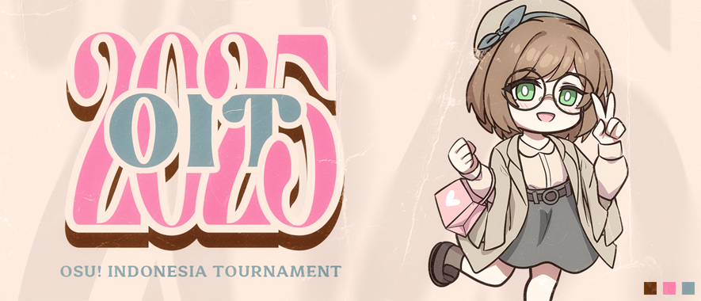

---
tags:
  - OIT 15
  - OIT 2025
---

# osu! Indonesia Tournament #15 (2025) ft. Stella

The **osu! Indonesia Tournament #15 (2025) ft. Stella** (OIT 2025) is a double-elimination 1v1 osu! tournament hosted by ::{ flag=ID }:: [rethinkrubiks](https://osu.ppy.sh/users/17996877) and ::{ flag=ID }:: [Almond Eye](https://osu.ppy.sh/users/3484548). The tournament is open to all osu! players from Indonesia without an active [tournament ban](/wiki/Help_centre/Tournament_bans) regardless of rank. It is the fifteenth iteration of the osu! Indonesia Tournament.

## Tournament schedule

| Event | Timestamp |
| --: | :-- |
| Registration phase | 2025-11-30/2025-12-21 |
| Screening phase | 2025-12-21/2025-12-28 |
| Qualifiers | 2025-12-29/2026-01-04 |
| Round of 16 | 2026-01-05/2026-01-11 |
| Quarterfinals | 2026-01-12/2026-01-18 |
| Semifinals | 2026-01-19/2026-01-25 |
| Finals (week 1) | 2026-01-26/2026-02-01 |
| *break* | 2026-02-02/2026-02-08 |
| Finals (week 2) | 2026-02-09/2026-02-15 |

## Prizes

The osu! Indonesia Tournament #15 (2025) ft. Stella offers an initial prize pool of 1,750,000 IDR as generously donated by ::{ flag=ID }:: [rethinkrubiks](https://osu.ppy.sh/users/17996877) and ::{ flag=ID }:: [macabea](https://osu.ppy.sh/users/8688737). This prize pool may be further increased from community donations through [Saweria](https://saweria.co/osuIndonesia) and [Streamlabs](https://streamlabs.com/osuindonesia/tip).

| Placing | Prize(s) |
| :-: | :-- |
|  | 60% of the accumulated prize pool, physical trophy, customised profile banner, unique profile badge |
|  | 30% of the accumulated prize pool, physical trophy, customised profile banner |
|  | 10% of the accumulated prize pool, physical trophy, customised profile banner |

As with all the previous osu! Indonesia Tournament iterations and other osu! tournaments in general, the osu! Indonesia Tournament #15 (2025) is not marked for profit. All contributions and expenses made towards the tournament were publicly logged over at the [Discord server](https://discord.gg/rv6BgCtdvk) for transparency.

## Organisation

The osu! Indonesia Tournament #15 (2025) ft. Stella is run by various osu! community members from Indonesia and beyond.

| Position | Member(s) |
| :-- | :-- |
| Host | ::{ flag=ID }:: [rethinkrubiks](https://osu.ppy.sh/users/17996877), ::{ flag=ID }:: [Almond Eye](https://osu.ppy.sh/users/3484548) |
| Admin | ::{ flag=ID }:: [Raids](https://osu.ppy.sh/users/15640966), ::{ flag=ID }:: [Niva](https://osu.ppy.sh/users/197805), ::{ flag=ID }:: [laks](https://osu.ppy.sh/users/9519657), ::{ flag=ID }:: [Verxina](https://osu.ppy.sh/users/11421465), ::{ flag=ID }:: [Shiiori](https://osu.ppy.sh/users/13799103) |
| Mappool selector | ::{ flag=ID }:: [rethinkrubiks](https://osu.ppy.sh/users/17996877), ::{ flag=ID }:: [Almond Eye](https://osu.ppy.sh/users/3484548), ::{ flag=ID }:: [Kuro Fuyusaki](https://osu.ppy.sh/users/2667496), ::{ flag=ID }:: [FAW](https://osu.ppy.sh/users/11070577), ::{ flag=ID }:: [Mashima Himeko](https://osu.ppy.sh/users/10474988) |
| Custom mapper | ::{ flag=ID }:: [Raids](https://osu.ppy.sh/users/15640966), ::{ flag=ID }:: [FAW](https://osu.ppy.sh/users/11070577), ::{ flag=ID }:: [jiwoas](https://osu.ppy.sh/users/10778215), ::{ flag=ID }:: [Nakazawa](https://osu.ppy.sh/users/6220419), ::{ flag=ID }:: [Yamanin Zephyr](https://osu.ppy.sh/users/9148291), ::{ flag=ID }:: [SayuMana](https://osu.ppy.sh/users/12602650), ::{ flag=ID }:: [ArXe](https://osu.ppy.sh/users/14013313), ::{ flag=ID }:: [ecclesia](https://osu.ppy.sh/users/3545579), ::{ flag=ID }:: [lushifer](https://osu.ppy.sh/users/13356408), ::{ flag=ID }:: [Pukoo](https://osu.ppy.sh/users/11239237), ::{ flag=ID }:: [Shinjuko](https://osu.ppy.sh/users/10558466), ::{ flag=ID }:: [fnayR](https://osu.ppy.sh/users/2800253) |
| Custom map quality assurance | ::{ flag=ID }:: [SupaV](https://osu.ppy.sh/users/19511007) |
| Playtester | ::{ flag=ID }:: [laks](https://osu.ppy.sh/users/9519657), ::{ flag=ID }:: [sho](https://osu.ppy.sh/users/6625422), ::{ flag=ID }:: [Crezz](https://osu.ppy.sh/users/7108275) |
| Streamer | ::{ flag=ID }:: [rethinkrubiks](https://osu.ppy.sh/users/17996877), ::{ flag=ID }:: [Almond Eye](https://osu.ppy.sh/users/3484548), ::{ flag=ID }:: [Raids](https://osu.ppy.sh/users/15640966), ::{ flag=ID }:: [Victim\_Crasher](https://osu.ppy.sh/users/2084869), ::{ flag=ID }:: [Xentaaa](https://osu.ppy.sh/users/16998672), ::{ flag=ID }:: [\[ZencroX\]](https://osu.ppy.sh/users/12839268), ::{ flag=MY }:: [Sagisawa Arisu](https://osu.ppy.sh/users/9364594) |
| Commentator | ::{ flag=ID }:: [rethinkrubiks](https://osu.ppy.sh/users/17996877), ::{ flag=ID }:: [Almond Eye](https://osu.ppy.sh/users/3484548), ::{ flag=ID }:: [Niva](https://osu.ppy.sh/users/197805), ::{ flag=ID }:: [Victim\_Crasher](https://osu.ppy.sh/users/2084869), ::{ flag=ID }:: [Artaa27](https://osu.ppy.sh/users/12085864), ::{ flag=ID }:: [Raddie](https://osu.ppy.sh/users/27491379), ::{ flag=ID }:: [Vvn](https://osu.ppy.sh/users/3204677), ::{ flag=ID }:: [Seox](https://osu.ppy.sh/users/3793938), ::{ flag=ID }:: [WoodenPickaxe](https://osu.ppy.sh/users/14463105), ::{ flag=ID }:: [BlankTap](https://osu.ppy.sh/users/10137131) |
| Referee | ::{ flag=ID }:: [Artaa27](https://osu.ppy.sh/users/12085864), ::{ flag=ID }:: [NoVaLian](https://osu.ppy.sh/users/6459827), ::{ flag=ID }:: [-TwiHD](https://osu.ppy.sh/users/5470299), ::{ flag=ID }:: [lortAro](https://osu.ppy.sh/users/28854272), ::{ flag=ID }:: [-\[ Shinraa \]-](https://osu.ppy.sh/users/26942053), ::{ flag=SG }:: [Fuwub](https://osu.ppy.sh/users/14238097) |
| Graphic designer | ::{ flag=ID }:: [Victim\_Crasher](https://osu.ppy.sh/users/2084869), ::{ flag=ID }:: [Zavier](https://osu.ppy.sh/users/11379592), ::{ flag=ID }:: [Felter](https://osu.ppy.sh/users/5865319) |
| Character designer | ::{ flag=ID }:: Reza F. [(↗)](https://web.facebook.com/rrezalfa) |
| Spreadsheet manager | ::{ flag=ID }:: [Verxina](https://osu.ppy.sh/users/11421465) |
| Wiki editor | ::{ flag=ID }:: [Niva](https://osu.ppy.sh/users/197805) |

## Links

- **[Master spreadsheet](https://docs.google.com/spreadsheets/d/1g5lVCzQjG00Ss9QkOBvYzt0ACTbI7fPOBkYIhNMCq9Q/edit?usp=sharing)**
- [Forum thread](https://osu.ppy.sh/community/forums/topics/2157759)
- [Discord server](https://discord.gg/rv6BgCtdvk)
- [Challonge brackets](https://challonge.com/oit_2025)
- [Livestream channel](https://www.twitch.tv/osuIndonesia)

## Participants

Listed below are the players who managed to qualify into the Round of 16 (along with their respective seed number and aggregated Z-sum across all twelve Qualifier beatmaps) out of 70 participating players in total.

The complete list of player registrations can be found [here](https://docs.google.com/spreadsheets/d/1g5lVCzQjG00Ss9QkOBvYzt0ACTbI7fPOBkYIhNMCq9Q/edit?gid=1137664518#gid=1137664518).

| Seed no. | Player | Z-sum |
| :-- | :-- | :-- |
| 1 | ::{ flag=ID }:: [MineFrostID](https://osu.ppy.sh/users/12159899) | 11.32 |
| 2 | ::{ flag=ID }:: [Hakui Koyori](https://osu.ppy.sh/users/10717635) | 11.23 |
| 3 | ::{ flag=ID }:: [GNX](https://osu.ppy.sh/users/10069909) | 10.92 |
| 4 | ::{ flag=ID }:: [lifeline](https://osu.ppy.sh/users/11367222) | 10.70 |
| 5 | ::{ flag=ID }:: [Fuma](https://osu.ppy.sh/users/1501956) | 10.62 |
| 6 | ::{ flag=ID }:: [MejiroMcQueen](https://osu.ppy.sh/users/11320627) | 10.36 |
| 7 | ::{ flag=ID }:: [Thatnoobguy](https://osu.ppy.sh/users/11091594) | 10.27 |
| 8 | ::{ flag=ID }:: [Stixe](https://osu.ppy.sh/users/18351160) | 9.67 |
| 9 | ::{ flag=ID }:: [Rosemi Lovelock](https://osu.ppy.sh/users/1987591) | 9.03 |
| 10 | ::{ flag=ID }:: [macabea](https://osu.ppy.sh/users/8688737) | 8.91 |
| 11 | ::{ flag=ID }:: [VtuberVoiceASMR](https://osu.ppy.sh/users/8780223) | 8.73 |
| 12 | ::{ flag=ID }:: [Skydiver](https://osu.ppy.sh/users/4750008) | 8.59 |
| 13 | ::{ flag=ID }:: [Azasapag](https://osu.ppy.sh/users/18347666) | 8.40 |
| 14 | ::{ flag=ID }:: [Caruma](https://osu.ppy.sh/users/13187450) | 8.27 |
| 15 | ::{ flag=ID }:: [Oguri Cap](https://osu.ppy.sh/users/11025519) | 8.19 |
| 16 | ::{ flag=ID }:: [BlankTap](https://osu.ppy.sh/users/10137131) | 8.16 |

## Mappools

### Finals (week 2)

**[Download the mappack here! (165 MB)](https://mappack.sah.moe/download/ncej6s7P)**

- No Mod
  1. [Tsukuyomi - Hana ni Ame o, Kimi ni Uta o (jiwoas) \[Melancholy\]](https://osu.ppy.sh/beatmapsets/2501601#osu/5503905)
  2. [USAO - Interstellar Travel (Aeril) \[40,208,000,000,000 km\]](https://osu.ppy.sh/beatmapsets/2238749#osu/4757408)
  3. [PinocchioP - Reincarnation Apple feat. Hatsune Miku (ajmosca) \[Horsace's Favorite Apple\]](https://osu.ppy.sh/beatmapsets/1976954#osu/4103881)
  4. [Ludicin - Signal (Ishtiaq) \[Azrulk x Ishtiaq\]](https://osu.ppy.sh/beatmapsets/2410737#osu/5234641)
  5. [First Fragment - Le Serment De Tsion (LMT) \[Kneel\]](https://osu.ppy.sh/beatmapsets/2287985#osu/4881760)
  6. [Reol - +Danshi (44444444444444) \[komachi's tribute\]](https://osu.ppy.sh/beatmapsets/2305858#osu/5225753)
- Hidden
  1. [bbno\$ & Rich Brian - edamame (Nijika Ijichi) \[low-hanging fruit\]](https://osu.ppy.sh/beatmapsets/1589180#osu/4009923)
  2. [Grand Thaw - Aventyr (FAW) \[Republic of France Super Extreme Blunt Rotation Collab\]](https://osu.ppy.sh/beatmapsets/2505069#osu/5515258)
  3. [Sheena Ringo - TOKYO (olc) \[Tension and Release\]](https://osu.ppy.sh/beatmapsets/1813876#osu/3721150)
  4. [satella - Sentheris (Kuro Fuyusaki) \[Core\]](https://osu.ppy.sh/beatmapsets/2488669#osu/5465324)
- Hard Rock
  1. [Yousei Teikoku - Baptize (moph) \[Extreme\]](https://osu.ppy.sh/beatmapsets/1739984#osu/3557042)
  2. [Qrispy Joybox - licca (AJT) \[Jycool's Extra\]](https://osu.ppy.sh/beatmapsets/2340295#osu/5028587)
  3. [Mili - String Theocracy (Aeril) \[Lascia ch'io pianga\]](https://osu.ppy.sh/beatmapsets/2234457#osu/4746039)
  4. [FELT - Summer Fever (Camo) \[Shimmering Sky\]](https://osu.ppy.sh/beatmapsets/1888937#osu/4133726)
- Double Time
  1. [KyoKa - Aitoki\*Cherishing (fnayR) \[SayuMana x fnayR's Collab Extra\]](https://osu.ppy.sh/beatmapsets/2505066#osu/5515249)
  2. [-45 - Sankarea (Radiownd) \[Valtiel\]](https://osu.ppy.sh/beatmapsets/2392143#osu/5178950)
  3. [Fei Zao Jun - Ying Zhi Gui Ji (Muziyami) \[Expert\]](https://osu.ppy.sh/beatmapsets/1840959#osu/3781184)
  4. [BUGCORE - Creepy Crawlers (feat. Golemm) (Gordon) \[chonk: DT deBUG\]](https://osu.ppy.sh/beatmapsets/2234336#osu/4745651)
  5. [Eiko Shimamiya - Higurashi no Naku Koro ni (Osu Mapman) \[Caspar's Insane\]](https://osu.ppy.sh/beatmapsets/2173462#osu/4718206)
- Tiebreaker
  1. **[LUMiNOZ - Scorched Garden (Shinjuko) \[The Journey of Me Adventuring with Stella my kisah\]](https://osu.ppy.sh/beatmapsets/2505108#osu/5515392)**

### Finals (week 1)

**[Download the mappack here! (152 MB)](https://mappack.sah.moe/download/tm7oMSbu)**

- No Mod
  1. [Adust Rain - Eleven Stud (Toumei Dragon) \[Subterranean Rose\]](https://osu.ppy.sh/beatmapsets/2284459#osu/4872301)
  2. [xi - Ascension to Heaven (Kroytz) \[Before the Final Moment\]](https://osu.ppy.sh/beatmapsets/1301360#osu/2699196)
  3. [Yousei Teikoku - IRON ROSE (Civafu) \[LMT's Extra\]](https://osu.ppy.sh/beatmapsets/2145999#osu/5052392)
  4. [Tatsuya Kitani - Tell Me About You (William K) \[Slidershapes\]](https://osu.ppy.sh/beatmapsets/2457841#osu/5374134)
  5. [AAAA - reach for your victory!!! (toybot) \[astronomic!!!\]](https://osu.ppy.sh/beatmapsets/2227145#osu/4724781)
  6. [jojofans community tulungagung - Rubmle (ft. Rapzone) (Shinjuko) \[dawg ini bukan nm6 :wilted\_flower:\]](https://osu.ppy.sh/beatmapsets/2498137#osu/5493201)
- Hidden
  1. [LOLUET x yoei. - roots (seros) \[raijodo's extra\]](https://osu.ppy.sh/beatmapsets/2139515#osu/4707333)
  2. [saaa + kei\_iwata + stuv + \*wakadori - New York Back Raise (Ryuusei Aika) \[Blacky's Extra\]](https://osu.ppy.sh/beatmapsets/2186413#osu/4622520)
  3. [Children Of Bodom - If You Want Peace... Prepare for War (The Cube) \[Extremity\]](https://osu.ppy.sh/beatmapsets/1511463#osu/3094900)
  4. [A? - ENERGY INFLATION (nik) \[LCFC's XXTREME\]](https://osu.ppy.sh/beatmapsets/2211300#osu/4684338)
- Hard Rock
  1. [GET IN THE RING - Moonscraper (olsonn) \[Rhapsody\]](https://osu.ppy.sh/beatmapsets/2352938#osu/5064824)
  2. [Sampling Masters MEGA - Rotter Tarmination (Luscent) \[allein's WTF Extra\]](https://osu.ppy.sh/beatmapsets/2099784#osu/4492687)
  3. [Krewella x Diskord - Beggars (Consouls Remix) (NeilPerry) \[Neil x Ameth's Conflux\]](https://osu.ppy.sh/beatmapsets/881753#osu/1843575)
  4. [DJ TOTTO - Crystalia (Hysteria) \[Xenok Sakaki's Extreme\]](https://osu.ppy.sh/beatmapsets/691220#osu/1549739)
- Double Time
  1. [Sasaki Sayaka - Yume to Iro de Dekiteiru (Akari Hoshizaki) \[my kisah\]](https://osu.ppy.sh/beatmapsets/2498097#osu/5493064)
  2. [-45 - Crimsonic dimension (Sanch-KK) \[Phantasm\]](https://osu.ppy.sh/beatmapsets/2125044#osu/4466556)
  3. [3L - Sympathy take me to darkness (Trust) \[Fantasy\]](https://osu.ppy.sh/beatmapsets/2234458#osu/4746040)
  4. [nobodyknows+ - Imaike Samba (Deca) \[iljaaz's Insane\]](https://osu.ppy.sh/beatmapsets/2243785#osu/4830145)
  5. [tsunamix_underground - Period. \~ Seishin no Kousoku to Jiyuu o Tsukamu Jouka (Cut Ver.) (bob) \[chai's insane.\]](https://osu.ppy.sh/beatmapsets/1594769#osu/3311067)
- Tiebreaker
  1. **[Laur - Sound Chimera (Raids) \[ThatGNXAlmondFumDiver Collab\]](https://osu.ppy.sh/beatmapsets/2498055#osu/5492956)**

### Semifinals

**[Download the mappack here! (155 MB)](https://mappack.sah.moe/download/tyQDSeFe)**

- No Mod
  1. [fhana - Genzaichi (Speed Up Ver.) (apoq) \[Kyou's Dusk\]](https://osu.ppy.sh/beatmapsets/2331210#osu/5021333)
  2. [Raimukun - Akagami Setsuwa (Vermasium) \[Echoes of the Ocean\]](https://osu.ppy.sh/beatmapsets/2194990#osu/4644208)
  3. [Various Artists - Menishuki \<3 Rush-sshu! (lushifer) \[Keep Looking at Me!\]](https://osu.ppy.sh/beatmapsets/2458263#osu/5375518)
  4. [Getty vs. DJ DiA - Fox4-Raize- (Raids) \[VULPES LAGOPUS\]](https://osu.ppy.sh/beatmapsets/2042026#osu/4260904)
  5. [Aether Realm - Lean Into the Wind (ravensong) \[LMT's Doomking Resurgence\]](https://osu.ppy.sh/beatmapsets/2289840#osu/4886921)
  6. [Polyphia - O.D. (Mir) \[Overflow\]](https://osu.ppy.sh/beatmapsets/1378026#osu/2847746)
- Hidden
  1. [Simon Safhalter - Always a cycle (Hyper) (tatemae) \[Extreme\]](https://osu.ppy.sh/beatmapsets/2330718#osu/4999545)
  2. [Mili - Peach Pit and Cyanide (vetoed) \[Sweet Cyanide\]](https://osu.ppy.sh/beatmapsets/2468654#osu/5405912)
  3. [himmel - Empyrean (\_\_Ag) \[Mimiliaa's Extreme\]](https://osu.ppy.sh/beatmapsets/1854021#osu/3827948)
  4. [EmoCosine - Midnight Challenge (Azrulk) \[roach class collab\]](https://osu.ppy.sh/beatmapsets/2418820#osu/5260070)
- Hard Rock
  1. [Wakeshima Kanon - the BEAST can't BE STOpped (-Kirigiri) \[Despair\]](https://osu.ppy.sh/beatmapsets/1774046#osu/3632423)
  2. [onoken - Alexandrite (Kloyd) \[Goryeojang\]](https://osu.ppy.sh/beatmapsets/1567511#osu/3200574)
  3. [goreshit - looming shadow of a tree long gone (Hobbes2) \[greenhobbes' extreme\]](https://osu.ppy.sh/beatmapsets/1072094#osu/2972038)
  4. [BiSH - innocent arrogance (3y3s) \[Heroine's Expert\]](https://osu.ppy.sh/beatmapsets/2197411#osu/5082780)
- Double Time
  1. [TRUE - DREAM SOLISTER (Kibbleru) \[Melody\]](https://osu.ppy.sh/beatmapsets/359501#osu/790415)
  2. [-45 - yoshikawa45 vs. siesta45 Battle of HongKong (Dada) \[Para Bellum\]](https://osu.ppy.sh/beatmapsets/1889111#osu/3890692)
  3. [NANORAY - DESKTOP BUDDY (Elcheer) \[TOURNEY VERSION\]](https://osu.ppy.sh/beatmapsets/1884650#osu/3880353)
  4. [Nanahoshi Kangengakudan - Too young to beer. (Nattu) \[LMT's Expert\]](https://osu.ppy.sh/beatmapsets/2064584#osu/4872629)
  5. [Harumaki Gohan - Zero Talking (Okoayu) \[Insane\]](https://osu.ppy.sh/beatmapsets/2254715#osu/4805944)
- Tiebreaker
  1. **[FELT - Lies in Reality (tatemae) \[Maldorora\]](https://osu.ppy.sh/beatmapsets/1703947#osu/3481674)**

### Quarterfinals

**[Download the mappack here! (131 MB)](https://mappack.sah.moe/download/i7FvzcV5)**

- No Mod
  1. [sweet ARMS - Trust in you (CXu) \[Zafkiel\]](https://osu.ppy.sh/beatmapsets/346218#osu/764310)
  2. [Starkill - Until We Fall (Roupus) \[Uri's Extreme\]](https://osu.ppy.sh/beatmapsets/1956762#osu/4119388)
  3. [Kabocha - Draw me a map, Let me feel the tap (toybot) \[gazimal's Extra\]](https://osu.ppy.sh/beatmapsets/2051856#osu/4608517)
  4. [TWICE - Alcohol-Free (Halgoh) \[For Eli\]](https://osu.ppy.sh/beatmapsets/2031370#osu/4233972)
  5. [Jun Ishikawa - Green Greens (Fatfan Kolek) \[emilia's Kirby Super Star Ultra\]](https://osu.ppy.sh/beatmapsets/2341780#osu/5037176)
- Hidden
  1. [Mizuki Nana x T.M.Revolution - Kakumei Dualism (Dailycare) \[Fujirin's Expert\]](https://osu.ppy.sh/beatmapsets/2008892#osu/4723219)
  2. [muship - Teddy THE Teddy (Herazu) \[Hidden Extra\]](https://osu.ppy.sh/beatmapsets/2251125#osu/4788639)
  3. [Xceon - Fuyutsubaki feat. Kanae Asaba (yf\_bmp) \[+Leggendaria\]](https://osu.ppy.sh/beatmapsets/1022180#osu/2138603)
- Hard Rock
  1. [Ayaka Ohashi - Wagamama MIRROR HEART (Amamya) \[Revenge\]](https://osu.ppy.sh/beatmapsets/2052377#osu/4286644)
  2. [Dark PHOENiX - Hiroari Kechou o Iru Koto (Camo) \[Shurelia's Expert\]](https://osu.ppy.sh/beatmapsets/2128728#osu/4620902)
  3. [USAO - Extra Mode (Otosaka-Yu) \[Rhythm Technique\]](https://osu.ppy.sh/beatmapsets/811948#osu/1703048)
- Double Time
  1. [Nakamura Meiko - revolution (LandoriK) \[Space\]](https://osu.ppy.sh/beatmapsets/1687781#osu/3457130)
  2. [Shoji Meguro - The Battle for Everyone's Souls (Wekkl) \[Battle Hymn\]](https://osu.ppy.sh/beatmapsets/2196805#osu/4648514)
  3. [AVTechNO! x Treow - boku-boku II feat. Hatsune Miku (Chaoslitz) \[Laurier's Insane\]](https://osu.ppy.sh/beatmapsets/2271970#osu/4839686)
  4. [-45 - Ena (allein) \[Insane\]](https://osu.ppy.sh/beatmapsets/1882400#osu/3875572)
- Tiebreaker
  1. **[King Gizzard & The Lizard Wizard - Robot Stop (olc) \[REDLIGHT (VIP)\]](https://osu.ppy.sh/beatmapsets/1610231#osu/3287767)**

### Round of 16

**[Download the mappack here! (114 MB)](https://mappack.sah.moe/download/QkyjFAPW)**

- No Mod
  1. [KOKO - Watashi o Matou (Dailycare) \[Vernal\]](https://osu.ppy.sh/beatmapsets/2272223#osu/4840263)
  2. [Kevin Sherwood - 115 (Cut Ver.) (fieryrage) \[Aetherium\]](https://osu.ppy.sh/beatmapsets/1457103#osu/2994682)
  3. [Tsukuyomi - Noisy Rainy (Petal) \[Ame\]](https://osu.ppy.sh/beatmapsets/2254451#osu/4795591)
  4. [Nanahira - Twinkle.Password (tukamoto7km) \[xbopost & tukamoto7km\]](https://osu.ppy.sh/beatmapsets/1184159#osu/2468593)
  5. [Pastel\*Palettes - Happy Synthesizer (ktgster) \[Shizuku's Expert\]](https://osu.ppy.sh/beatmapsets/932654#osu/1989990)
- Hidden
  1. [Kinoko Teikoku - Kokudou Slope (3y3s) \[January\]](https://osu.ppy.sh/beatmapsets/1989175#osu/5393040)
  2. [paraoka feat. haru\*nya - Manimani (Cut ver.) (Cellina) \[Hananoiro\]](https://osu.ppy.sh/beatmapsets/2008891#osu/4179280)
  3. [REDALiCE feat. MONICO - Breakin' Chain (Heilia) \[ak74's Extra\]](https://osu.ppy.sh/beatmapsets/1863044#osu/3947753)
- Hard Rock
  1. [sheirara - -ERROR (Nakazawa) \[404 (Tournament Edit)\]](https://osu.ppy.sh/beatmapsets/2488667#osu/5465321)
  2. [Dormir - Cookie Bouquets (dsco) \[Fanzhen's Extra\]](https://osu.ppy.sh/beatmapsets/675125#osu/1453416)
  3. [dj MAX STEROID - Arabian Rave Night (Kojio) \[Axarious' ANOTHER\]](https://osu.ppy.sh/beatmapsets/2312645#osu/5054490)
- Double Time
  1. [Elaine Celestia feat. Ayunda Risu - Cat Loving (revemayuzumi Remix) (ArXe) \[Icikiwir Aselole\]](https://osu.ppy.sh/beatmapsets/2488623#osu/5465242)
  2. [-45 - Millarca (228) \[Insane\]](https://osu.ppy.sh/beatmapsets/1978407#osu/4108775)
  3. [Boom Kitty - Deo Volente (Ralsricat) \[Pisapou's Insane\]](https://osu.ppy.sh/beatmapsets/1733078#osu/3843920)
  4. [Krimek - HyperColor (nik) \[Insane\]](https://osu.ppy.sh/beatmapsets/2248565#osu/4781121)
- Tiebreaker
  1. **[Imperial Circus Dead Decadence - Uta (Kite) \[Himei\]](https://osu.ppy.sh/beatmapsets/410162#osu/890190)**

### Qualifiers

**[Download the mappack here! (90 MB)](https://mappack.sah.moe/download/XuoBxj3Z)**

- No Mod
  1. [ELFENSJoN - Hyousou wa Hakuen wo Matoite (Yusomi) \[Extra\]](https://osu.ppy.sh/beatmapsets/1312064#osu/2719302)
  2. [xi - over the top (Rino Inosaki) \[FOUR DIMENSIONS\]](https://osu.ppy.sh/beatmapsets/2298941#osu/4912108)
  3. [hitorie - Nichijou to Chikyuu no Gakubuchi (wowaka x Hatsune Miku Edit) (flake) \[take care.\]](https://osu.ppy.sh/beatmapsets/1985060#osu/4122999)
  4. [seatrus - ILLEGAL LEGACY (IntegerTempest) \[colicen's EXPERT\]](https://osu.ppy.sh/beatmapsets/1932951#osu/4057648)
  5. [Annabel - wormhole (NBA YOUNGBOY) \[adham njegur got\]](https://osu.ppy.sh/beatmapsets/2367621#osu/5107430)
- Hidden
  1. [Dua Lipa - Levitating (Axarious) \[AR9\]](https://osu.ppy.sh/beatmapsets/1688321#osu/3450301)
  2. [Nor - RE Aoharu (FAW) \[The Blue Spring REturns\]](https://osu.ppy.sh/beatmapsets/2155302#osu/4542964)
- Hard Rock
  1. [marasy feat. Hatsune Miku - SnowMix (Tuffiii) \[AuroraFantasy\]](https://osu.ppy.sh/beatmapsets/1910869#osu/4886589)
  2. [Ryokuoushoku Shakai - inori (Miy) \[pray\]](https://osu.ppy.sh/beatmapsets/1915271#osu/4428001)
- Double Time
  1. [Chino (CV: Inori Minase) - Mirai Puzzle (My Angel Ram) \[Cappuchino\]](https://osu.ppy.sh/beatmapsets/1547564#osu/3162593)
  2. [ZUN - Romantic Children (nanoya) \[Lunatic\]](https://osu.ppy.sh/beatmapsets/2287801#osu/4881371)
  3. [Megurine Luka - Leia (Mafiamaster) \[gowww\]](https://osu.ppy.sh/beatmapsets/29064#osu/96587)

## Match results

### Finals (week 1)

Saturday, 31 January 2026:

| Bracket | Player 1 |  |  | Player 2 | Match link |
| :-: | --: | :-: | :-: | :-- | :-- |
| Lower | **[MineFrostID](https://osu.ppy.sh/users/12159899)** ::{ flag=ID }:: | **7** | 4 | ::{ flag=ID }:: [Thatnoobguy](https://osu.ppy.sh/users/11091594) | [#1](https://osu.ppy.sh/community/matches/120425197) |
| Lower | **[GNX](https://osu.ppy.sh/users/10069909)** ::{ flag=ID }:: | **7** | 3 | ::{ flag=ID }:: [Skydiver](https://osu.ppy.sh/users/4750008) | [#1](https://osu.ppy.sh/community/matches/120426479) |

Sunday, 1 February 2026:

| Bracket | Player 1 |  |  | Player 2 | Match link |
| :-: | --: | :-: | :-: | :-- | :-- |
| Upper | **[lifeline](https://osu.ppy.sh/users/11367222)** ::{ flag=ID }:: | **7** | 4 | ::{ flag=ID }:: [Hakui Koyori](https://osu.ppy.sh/users/10717635) | [#1](https://osu.ppy.sh/community/matches/120433776) |

Monday, 2 February 2026:

| Bracket | Player 1 |  |  | Player 2 | Match link |
| :-: | --: | :-: | :-: | :-- | :-- |
| Upper | **[MineFrostID](https://osu.ppy.sh/users/12159899)** ::{ flag=ID }:: | **7** | 4 | ::{ flag=ID }:: [GNX](https://osu.ppy.sh/users/10069909) | [#1](https://osu.ppy.sh/community/matches/120441478) |

### Semifinals

Friday, 23 January 2026:

| Bracket | Player 1 |  |  | Player 2 | Match link |
| :-: | --: | :-: | :-: | :-- | :-- |
| Lower | **[Thatnoobguy](https://osu.ppy.sh/users/11091594)** ::{ flag=ID }:: | **6** | 3 | ::{ flag=ID }:: [Fuma](https://osu.ppy.sh/users/1501956) | [#1](https://osu.ppy.sh/community/matches/120369603) |

Saturday, 24 January 2026:

| Bracket | Player 1 |  |  | Player 2 | Match link |
| :-: | --: | :-: | :-: | :-- | :-- |
| Lower | [Rosemi Lovelock](https://osu.ppy.sh/users/1987591) ::{ flag=ID }:: | 4 | **6** | ::{ flag=ID }:: **[VtuberVoiceASMR](https://osu.ppy.sh/users/8780223)** | [#1](https://osu.ppy.sh/community/matches/120376665) |
| Lower | **[MejiroMcQueen](https://osu.ppy.sh/users/11320627)** ::{ flag=ID }:: | **6** | 3 | ::{ flag=ID }:: [BlankTap](https://osu.ppy.sh/users/10137131) | [#1](https://osu.ppy.sh/community/matches/120376206) |
| Lower | **[Skydiver](https://osu.ppy.sh/users/4750008)** ::{ flag=ID }:: | **6** | 2 | ::{ flag=ID }:: [Oguri Cap](https://osu.ppy.sh/users/11025519) | [#1](https://osu.ppy.sh/community/matches/120377225) |

Sunday, 25 January 2026:

| Bracket | Player 1 |  |  | Player 2 | Match link |
| :-: | --: | :-: | :-: | :-- | :-- |
| Upper | **[Hakui Koyori](https://osu.ppy.sh/users/10717635)** ::{ flag=ID }:: | **6** | 3 | ::{ flag=ID }:: [GNX](https://osu.ppy.sh/users/10069909) | [#1](https://osu.ppy.sh/community/matches/120384930) |
| Lower | [MejiroMcQueen](https://osu.ppy.sh/users/11320627) ::{ flag=ID }:: | 4 | **6** | ::{ flag=ID }:: **[Thatnoobguy](https://osu.ppy.sh/users/11091594)** | [#1](https://osu.ppy.sh/community/matches/120385390) |
| Lower | **[Skydiver](https://osu.ppy.sh/users/4750008)** ::{ flag=ID }:: | **6** | 3 | ::{ flag=ID }:: [VtuberVoiceASMR](https://osu.ppy.sh/users/8780223) | [#1](https://osu.ppy.sh/community/matches/120385103) |
| Upper | [MineFrostID](https://osu.ppy.sh/users/12159899) ::{ flag=ID }:: | 4 | **6** | ::{ flag=ID }:: **[lifeline](https://osu.ppy.sh/users/11367222)** | [#1](https://osu.ppy.sh/community/matches/120385053) |

### Quarterfinals

Friday, 16 January 2026:

| Bracket | Player 1 |  |  | Player 2 | Match link |
| :-: | --: | :-: | :-: | :-- | :-- |
| Upper | **[lifeline](https://osu.ppy.sh/users/11367222)** ::{ flag=ID }:: | **6** | 3 | ::{ flag=ID }:: [Skydiver](https://osu.ppy.sh/users/4750008) | [#1](https://osu.ppy.sh/community/matches/120319285) |

Saturday, 17 January 2026:

| Bracket | Player 1 |  |  | Player 2 | Match link |
| :-: | --: | :-: | :-: | :-- | :-- |
| Lower | [Azasapag](https://osu.ppy.sh/users/18347666) ::{ flag=ID }:: | 2 | **6** | ::{ flag=ID }:: **[Fuma](https://osu.ppy.sh/users/1501956)** | [#1](https://osu.ppy.sh/community/matches/120329594) |

Sunday, 18 January 2026:

| Bracket | Player 1 |  |  | Player 2 | Match link |
| :-: | --: | :-: | :-: | :-- | :-- |
| Lower | [Caruma](https://osu.ppy.sh/users/13187450) ::{ flag=ID }:: | 0 | **6** | ::{ flag=ID }:: **[VtuberVoiceASMR](https://osu.ppy.sh/users/8780223)** | [#1](https://osu.ppy.sh/community/matches/120336147) |
| Upper | **[MineFrostID](https://osu.ppy.sh/users/12159899)** ::{ flag=ID }:: | **6** | 0 | ::{ flag=ID }:: [Rosemi Lovelock](https://osu.ppy.sh/users/1987591) | [#1](https://osu.ppy.sh/community/matches/120337119) |
| Lower | **[BlankTap](https://osu.ppy.sh/users/10137131)** ::{ flag=ID }:: | **6** | 4 | ::{ flag=ID }:: [Stixe](https://osu.ppy.sh/users/18351160) | [#1](https://osu.ppy.sh/community/matches/120336088) |
| Lower | **[Oguri Cap](https://osu.ppy.sh/users/11025519)** ::{ flag=ID }:: | **6** | 0 | ::{ flag=ID }:: [macabea](https://osu.ppy.sh/users/8688737) | *win by default* |

Monday, 19 January 2026:

| Bracket | Player 1 |  |  | Player 2 | Match link |
| :-: | --: | :-: | :-: | :-- | :-- |
| Upper | **[Hakui Koyori](https://osu.ppy.sh/users/10717635)** ::{ flag=ID }:: | **6** | 3 | ::{ flag=ID }:: [Thatnoobguy](https://osu.ppy.sh/users/11091594) | [#1](https://osu.ppy.sh/community/matches/120344246) |
| Upper | **[GNX](https://osu.ppy.sh/users/10069909)** ::{ flag=ID }:: | **6** | 4 | ::{ flag=ID }:: [MejiroMcQueen](https://osu.ppy.sh/users/11320627) | [#1](https://osu.ppy.sh/community/matches/120343896) |

### Round of 16

Saturday, 10 January 2026:

| Bracket | Player 1 |  |  | Player 2 | Match link |
| :-: | --: | :-: | :-: | :-- | :-- |
| Upper | **[MejiroMcQueen](https://osu.ppy.sh/users/11320627)** ::{ flag=ID }:: | **5** | 4 | ::{ flag=ID }:: [VtuberVoiceASMR](https://osu.ppy.sh/users/8780223) | [#1](https://osu.ppy.sh/community/matches/120277659) |
| Upper | **[Thatnoobguy](https://osu.ppy.sh/users/11091594)** ::{ flag=ID }:: | **5** | 2 | ::{ flag=ID }:: [macabea](https://osu.ppy.sh/users/8688737) | [#1](https://osu.ppy.sh/community/matches/120277604) |
| Upper | **[lifeline](https://osu.ppy.sh/users/11367222)** ::{ flag=ID }:: | **5** | 0 | ::{ flag=ID }:: [Azasapag](https://osu.ppy.sh/users/18347666) | [#1](https://osu.ppy.sh/community/matches/120278054) |
| Upper | **[GNX](https://osu.ppy.sh/users/10069909)** ::{ flag=ID }:: | **5** | 1 | ::{ flag=ID }:: [Caruma](https://osu.ppy.sh/users/13187450) | [#1](https://osu.ppy.sh/community/matches/120278102) |
| Upper | **[MineFrostID](https://osu.ppy.sh/users/12159899)** ::{ flag=ID }:: | **5** | 1 | ::{ flag=ID }:: [BlankTap](https://osu.ppy.sh/users/10137131) | [#1](https://osu.ppy.sh/community/matches/120278972) |

Sunday, 11 January 2026:

| Bracket | Player 1 |  |  | Player 2 | Match link |
| :-: | --: | :-: | :-: | :-- | :-- |
| Upper | [Stixe](https://osu.ppy.sh/users/18351160) ::{ flag=ID }:: | 2 | **5** | ::{ flag=ID }:: **[Rosemi Lovelock](https://osu.ppy.sh/users/1987591)** | [#1](https://osu.ppy.sh/community/matches/120286574) |
| Upper | **[Hakui Koyori](https://osu.ppy.sh/users/10717635)** ::{ flag=ID }:: | **5** | 2 | ::{ flag=ID }:: [Oguri Cap](https://osu.ppy.sh/users/11025519) | [#1](https://osu.ppy.sh/community/matches/120287756) |

Monday, 12 January 2026:

| Bracket | Player 1 |  |  | Player 2 | Match link |
| :-: | --: | :-: | :-: | :-- | :-- |
| Upper | [Fuma](https://osu.ppy.sh/users/1501956) ::{ flag=ID }:: | 1 | **5** | ::{ flag=ID }:: **[Skydiver](https://osu.ppy.sh/users/4750008)** | [#1](https://osu.ppy.sh/community/matches/120294772) |

## Ruleset

### General rules

1. Match lobbies across the tournament will adhere to the following room settings:
   - Team Mode: `Head-to-head`
   - Win Condition: [`ScoreV2`](/wiki/Gameplay/Score#scorev2)
2. The mappools for each round will be announced by the tournament management in advance before the actual matches take place.
3. Match schedules will be predetermined by the tournament management. If there are any teams who are unable to attend the current schedule for any reason, all other affected teams may apply and settle for a reschedule at the `#reschedule` channel in the tournament's Discord server.
4. A referee will create a multiplayer room 10 minutes in advance and will start to send out invites.
5. If a player does not show up within **10 minutes** of the start time, their opponent gets to win by default.
6. If no staff or referee is available, the match will be postponed.
7. **NoFail will be enforced in all beatmaps.** This is to ensure that the points are to be awarded more fairly towards teams who perform better in general during the course of the beatmap regardless of their remaining health at the end.
8. If a player disconnects, it will be treated as if they had failed the beatmap.
   - A match can be rematched for disconnects that occur within a few seconds after the beatmap has been started by the referee.
9. Lag is not a valid reason to nullify a beatmap.
10. If any problems during the match occur, the tournament management will make a decision based on the referee's report.
11. It is expected that all players be polite and respectful to each other. Penalties will be given upon violation.
    - If a player is found to be engaging in an act that is deemed to be distasteful or provocative, the corresponding player or their team may be disqualified right away from the tournament and/or blacklisted from future iterations of the tournament by the tournament management.
    - Usage of any tools or programs that are against the [osu! community rules](/wiki/Rules#community-rules) is strictly prohibited and will be straight up reported to the osu! team at will.

### Tournament registration

1. Players are required to register into the tournament individually through [the Discord server](https://discord.gg/rv6BgCtdvk).
   - In order to be eligible to play in the tournament, a player must have the ::{ flag=ID }:: Indonesian flag displayed on their profile.
   - Although the tournament is open rank, players are advised to be in a reasonable rank in the osu! game mode given the relatively high difficulty of the mappool.
2. To ensure that all incoming registrations are serious and valid, every registered player will be checked in detail by the tournament management.
3. The list of players who are deemed to be eligible to compete in the tournament will be published by the tournament management after the registration phase has ended.
4. Testplayers, referees, custom mappers, and mappool selectors may not participate as players in this tournament.
   - Eliminated players are free to enlist as replay providers for the later stages of the tournament in accordance to the [official tournament support guidelines](/wiki/Tournaments/Official_support#staff). 

### Round-specific rules

#### Qualifier rules

1. Each player will have to sign up to one of the Qualifier lobbies that have been scheduled and prepared by the tournament management in advance.
2. In the lobby, all players will have to consecutively play all of the twelve Qualifier beatmaps in the order of NM1 -> NM2 -> NM3 -> NM4 -> NM5 -> HD1 -> HD2 -> HR1 -> HR2 -> DT1 -> DT2 -> DT3.
3. Players **are not allowed** to ban any beatmaps in the Qualifiers.
4. Players **are not allowed** to join (or register for) more than one Qualifier lobby.
5. Based on their performance in the Qualifier, players will be ranked based on their **Z-sum value** (which is the sum of Z-scores across all eleven Qualifier beatmaps fitted to a standard normal cumulative distribution function). A brief explanation on the concept of Z-sum and Z-score can be found [here](http://www.statisticshowto.com/probability-and-statistics/z-score/).
6. The 16 players with the **highest Z-sum value** will advance to the knock-out stages.
   - If there are two (or more) players who share the same Z-sum value, the player that holds the higher total raw score will be placed in the higher seed.
7. Failure to attend in any of the predetermined Qualifier lobbies will result in an instant elimination from the tournament.

#### Knock-out stage rules

1. The 16 remaining players will be matched against each other based on their seeding (e.g. Seed #1 vs. Seed #16, Seed #2 vs. Seed #15, and so on).
2. Players will compete against each other using the double-elimination system.
3. The double-elimination system works as follows:
   - Players who lose in the upper bracket can still play again in the lower bracket.
   - Players who lose in the lower bracket will be eliminated from the tournament.
   - In the Grand Final match, the winner of the the upper bracket will only need to win a single match in order to claim the championship title. The winner of the lower bracket, however, will need to win two matches and enforce a *bracket reset* in order to clinch the championship title.
4. Players who can compete in the next round are determined by:
   - In the Round of 16, each player needs to win 5 points in order to win a match. (Best of 9)
   - In the Quarterfinals and the Semifinals, each player needs to win 6 points in order to win a match. (Best of 11)
   - In both of the Finals weeks, each player needs to win 7 points in order to win a match. (Best of 13)
   - Whether there are players who are declared to win the match by default.
   - Whether there are players who are disqualified from the tournament.

### Match regulations

1. Prior to starting the match, each player must run the `!roll` command once in the multiplayer lobby in order to determine the banning and picking order. 
   - The winner of the `!roll` gets to determine who gets the first pick and the second ban.
   - The loser of the `!roll` gets the opposite by default.
   - This rule does not apply in the Qualifier lobbies.
2. Each player has to **ban one beatmap** (on the Round of 16) and **two beatmaps** (from the Quarterfinals onwards) from the corresponding mappool. These beatmaps will not be allowed to be picked by any player during the entire match. 
   - Barring the tiebreaker, there are no restrictions as to which maps may and may not be banned in a match.
   - Banning does not apply in the Qualifier lobbies.
3. **There will be no warm-up beatmaps to be played in the multiplayer lobby**. Players who are looking to warm up before the match are expected to do so by their own before the match commences.
4. Players are expected to exercise common sense in pick time windows.
   - If a player is unable to come up with a pick within a 90-second time window of their picking turn, the pick will be given to the other player.
5. **There will be no dedicated Free Mod pick at any stage of the tournament**. However, in the case of a tiebreaker, the tiebreaker map will be played with the Free Mod option enabled.
   - Playing the tiebreaker map with mods is *not* mandatory.
   - Should any player wish to play the tiebreaker map with mods, allowed mods are Easy, Hard Rock, Hidden, or any possible combination of the three.
6. The results of each match and any other relevant information regarding the match will be noted by the referee after the match has been concluded.
