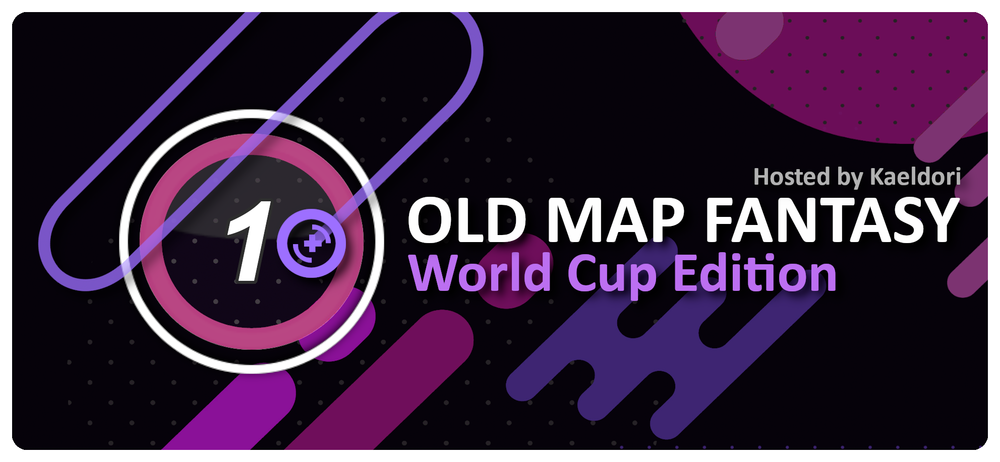

---
tags:
  - OMF
  - OMFWC
---

# Old Map Fantasy World Cup

The **Old Map Fantasy World Cup** (***OMFWC***) was a country-based 4v4 double-elimination osu! tournament hosted by ::{ flag=FR }:: ::Kaeldori::{ user=962519 }. It was the first instalment of the Old Map Fantasy.

## Tournament schedule

| Event | Timestamp |
| --: | :-- |
| Registration phase | 2021-06-28/2021-08-08 |
| Qualifier stage | 2021-08-14/2021-08-16 |
| Round of 64 | 2021-08-21/2021-08-22 |
| Round of 32 | 2021-08-28/2021-08-29 |
| Round of 16 | 2021-09-04/2021-09-05 |
| Quarterfinals | 2021-09-11/2021-09-12 |
| Semifinals | 2021-09-18/2021-09-19 |
| Finals | 2021-09-25/2021-09-26 |
| Grand Finals | 2021-10-02/2021-10-03 |

## Prizes

| Placing | Prize(s) |
| :-: | :-- |
|  | Profile badge, profile banner |
|  | Profile banner |
|  | Profile banner |

## Organisation

The Old Map Fantasy World Cup was run by various community members.

| Position | Member(s) |
| :-- | :-- |
| Host | ::{ flag=FR }:: ::Kaeldori::{ user=962519 } |
| Mappool selector | ::{ flag=FR }:: ::Kaeldori::{ user=962519 }, ::{ flag=US }:: ::141::{ user=10193533 }, ::{ flag=PL }:: ::-Sylvari::{ user=3493804 }, ::{ flag=KR }:: ::isome::{ user=87546 }, ::{ flag=US }:: ::Flux3on::{ user=9401932 }, ::{ flag=US }:: ::Aery::{ user=3994671 },::{ flag=FI }:: ::Nyanaro::{ user=4157611 } |
| Mappool playtester | ::{ flag=ID }:: ::rHO::{ user=1629553 }, ::{ flag=NO }:: ::-GN::{ user=895581 }, ::{ flag=FR }:: ::Rulue::{ user=3723612 }, ::{ flag=CA }:: ::ktgster::{ user=53378 }, ::{ flag=US }:: ::semaphore::{ user=6313643 } |
| Commentator | ::{ flag=FR }:: ::Kaeldori::{ user=962519 }, ::{ flag=AU }:: ::xtremeities::{ user=10759664 }, ::{ flag=US }:: ::Daprin::{ user=10961983 }, ::{ flag=KR }:: ::isome::{ user=87546 }, ::{ flag=RU }:: ::Prade::{ user=9318565 }, ::{ flag=GB }:: ::Doomsday::{ user=18983 }, ::{ flag=NL }:: ::n0ah::{ user=3086393 } |
| Referee | ::{ flag=ES }:: ::Deif::{ user=318565 }, ::{ flag=SG }:: ::uchuuj1n::{ user=9140302 }, ::{ flag=US }:: ::Rekunan::{ user=8203119 }, ::{ flag=VN }:: ::rock-on::{ user=9676089 }, ::{ flag=PL }:: ::P a t r i c k::{ user=6814521 }, ::{ flag=DE }:: ::GDLenny::{ user=8406711 }, ::{ flag=SI }:: ::Redavor::{ user=3328606 }, ::{ flag=PL }:: ::Kondi::{ user=7382321 }, ::{ flag=US }:: ::freddiiieeee::{ user=7112839 }, ::{ flag=KZ }:: ::brwn31::{ user=10379418 } |
| Statistician | ::{ flag=FR }:: ::Kaeldori::{ user=962519 } |
| Designer | ::{ flag=DE }:: ::Suilerua::{ user=13137699 } |

## Links

- [Discussion thread](https://osu.ppy.sh/community/forums/topics/1359817)
- [Livestream](https://www.twitch.tv/Kaeldori)
- [Challonge bracket](https://challonge.com/OMFWC)
- [Pick'ems page](https://pickem.hwc.hr/tournaments/72) hosted by ::{ flag=DE }:: ::hallowatcher::{ user=1874761 }
- **[Main sheet](https://docs.google.com/spreadsheets/d/1YwFNdAnKQL4jCqZQmxUGc-Q_5hHj1fdhOdbTcWKZhsw/edit#gid=0)**

## Participants

|  | Country | Members |
| :-: | :-: | :-- |
| ::{ flag=AR }:: | **Argentina** | **::kaoshii::{ user=7807935 }**, ::Penguo::{ user=4389490 }, ::Vexion::{ user=10361419 }, ::Razekon::{ user=4700864 }, ::Rimi::{ user=5194834 }, ::Emiru Ikuno 2::{ user=9393446 }, ::un perro::{ user=6573651 }, ::Zaqlev::{ user=3188703 } |
| ::{ flag=AR }:: | **Argentina B** | **::juliancala::{ user=3272902 }**, ::Pein::{ user=2212941 }, ::Enhu::{ user=2840499 }, ::Cata::{ user=5958063 }, ::Amuro::{ user=7119659 }, ::Hououin Kyouma::{ user=7110363 }, ::Keko Jones::{ user=7498924 }, ::GastonGL::{ user=11238108 } |
| ::{ flag=AU }:: | **Australia** | **::Monk The Don::{ user=4012086 }**, ::Jordan The Bear::{ user=7477458 }, ::GranDSenpai::{ user=3997580 }, ::Dumii::{ user=3068044 }, ::Korilak::{ user=7260014 }, ::PieFlavours::{ user=3494615 }, ::xtremeities::{ user=10759664 }, ::-Machine-::{ user=5459981 } |
| ::{ flag=AT }:: | **Austria** | **::goosefedora::{ user=2323131 }**, ::Tuttelli::{ user=6311630 }, ::omgforz::{ user=578943 }, ::teppi::{ user=1371974 }, ::tomadoi::{ user=5712451 }, ::farmist::{ user=11470408 }, ::kizan::{ user=3074197 }, ::nuharu::{ user=939213 } |
| ::{ flag=AT }:: | **Austria B** | **::LWMF::{ user=3632402 }**, ::novaaa::{ user=953405 }, ::Volki::{ user=7118702 }, ::Leycia::{ user=9221725 }, ::Emi\_\_::{ user=7586612 }, ::Pandadesu::{ user=2167069 }, ::Kaqpador::{ user=11364488 }, ::Shiiraki::{ user=9137267 } |
| ::{ flag=BR }:: | **Brazil** | **::Coreanmaluco::{ user=3149577 }**, ::niii\_san::{ user=5403374 }, ::Mystia::{ user=4277702 }, ::Mismagius::{ user=19048 }, ::Akane Hime::{ user=6772887 }, ::zubs::{ user=4253615 }, ::henrique2412::{ user=4628473 }, ::- DARK -::{ user=5240155 } |
| ::{ flag=BR }:: | **Brazil B** | **::Checha::{ user=10157694 }**, ::Dinilsu::{ user=4911460 }, ::pwerus5::{ user=14385002 }, ::himuy3::{ user=6035803 }, ::Nekoraw::{ user=4207965 }, ::Take no Hana::{ user=3628613 }, ::BRIQUEZ23::{ user=4673277 }, ::Voltronn::{ user=8779938 } |
| ::{ flag=CA }:: | **Canada** | **::Vespirit::{ user=5425046 }**, ::Zylice::{ user=5033077 }, ::nick1324::{ user=612898 }, ::CutPaper::{ user=10975777 }, ::xootynator::{ user=3717598 }, ::kyle::{ user=2694475 }, ::GameGear::{ user=7433950 }, ::Frankie_::{ user=5774823 } |
| ::{ flag=CA }:: | **Canada B** | **::Eddie-::{ user=3898396 }**, ::Too Slow::{ user=2944449 }, ::PikaPwn::{ user=2012453 }, ::Jeremy_::{ user=5177569 }, ::HIDDENMODABUSER::{ user=8666950 }, ::natetheneet::{ user=2966685 }, ::Kyumi::{ user=12871529 }, ::[ Aether ]::{ user=3909969 } |
| ::{ flag=CL }:: | **Chile** | **::kanocchi::{ user=2321050 }**, ::Eunha::{ user=7701428 }, ::Pancho::{ user=11305398 }, ::Gonzah::{ user=12434652 }, ::NO37::{ user=4653583 }, ::uNable::{ user=1958549 }, ::Plntote::{ user=7559996 }, ::kanocchi 2::{ user=1603962 } |
| ::{ flag=CN }:: | **China** | **::Crystal::{ user=1646397 }**, ::Garden::{ user=2849992 }, ::im\_a\_burger\_fox::{ user=5791401 }, ::Heatherfield::{ user=296087 }, ::gxytcgxytc::{ user=874891 }, ::FujiwaraNoMokou::{ user=685188 }, ::Gynophobia-::{ user=6090175 }, ::[Joseph Jostar]::{ user=3139364 } |
| ::{ flag=CO }:: | **Colombia** | **::ElMick33::{ user=5458323 }**, ::ElMick28::{ user=8921554 }, ::ElMick13::{ user=3562488 }, ::ElMick11::{ user=10510143 }, ::Jekuru::{ user=11727492 }, ::Phel::{ user=9367683 }, ::Xeanex::{ user=6718395 }, ::xfxsnake::{ user=313045 } |
| ::{ flag=XX }:: | **Countryless** | **::JackPaX::{ user=11226645 }**, ::Vinnie741::{ user=8509247 }, ::Aranel::{ user=9562117 }, ::MyAimBisbo::{ user=11893703 }, ::Jim4s::{ user=9166367 }, ::-MRB-::{ user=11234975 }, ::Konipaku::{ user=9453134 }, ::Alfonso::{ user=7522642 } |
| ::{ flag=XX }:: | **Countryless B** | **::Giyokon::{ user=10852632 }**, ::-Nande::{ user=7554179 }, ::yip33::{ user=5728629 }, ::-Dreamless::{ user=4426728 }, ::Sirek::{ user=14666725 }, ::C1a0::{ user=7054373 } |
| ::{ flag=CZ }:: | **Czechia** | **::Kaplan::{ user=1376983 }**, ::PoggersCZ::{ user=3198446 }, ::Fadeaway::{ user=9523358 }, ::CutoNaito::{ user=8064649 }, ::Shutterstock::{ user=14362480 } |
| ::{ flag=DK }:: | **Denmark** | **::Marco PoIo::{ user=10650901 }**, ::Lothjon::{ user=7369323 }, ::P3RS3X::{ user=9469362 }, ::Cat Burger::{ user=11380904 }, ::Drayko::{ user=11485703 }, ::Polle::{ user=13218204 }, ::I ingest bum 47::{ user=5323224 } |
| ::{ flag=EE }:: | **Estonia** | **::sev::{ user=4700753 }**, ::blourgh::{ user=3974292 }, ::lamy2::{ user=13733307 }, ::Slay::{ user=7093124 }, ::Cowsfreedom::{ user=4389591 }, ::Praw::{ user=4437004 } |
| ::{ flag=FI }:: | **Finland** | **::Ataraksia::{ user=7503114 }**, ::Haadez::{ user=8925266 }, ::Kalanluu::{ user=2035254 }, ::juujep::{ user=12031584 }, ::Yes::{ user=6567244 }, ::Samoyed::{ user=6796557 }, ::MyAngelSamoyed::{ user=5210561 }, ::HENKSELI::{ user=7005392 } |
| ::{ flag=FI }:: | **Finland B** | **::Minami-Kotori::{ user=3083539 }**, ::savilju::{ user=8059468 }, ::Shotbun::{ user=194294 }, ::shdewz::{ user=10000899 }, ::Urnukka::{ user=4765619 } |
| ::{ flag=FR }:: | **France** | **::Musty::{ user=251683 }**, ::Thundur::{ user=4141918 }, ::Ekoro::{ user=284905 }, ::AgarSanik::{ user=9978880 }, ::NerO::{ user=1545031 }, ::Fumatsu::{ user=8236827 }, ::Corompus::{ user=2467018 }, ::calangi::{ user=7810180 } |
| ::{ flag=FR }:: | **France B** | **::Skyo::{ user=3946607 }**, ::Afmun::{ user=4869346 }, ::Spartan Plume::{ user=2553166 }, ::Foussilin::{ user=11934348 }, ::MrWither83::{ user=9991650 }, ::pomroz::{ user=6410878 }, ::Fayar::{ user=12674517 }, ::Arakii::{ user=6133101 } |
| ::{ flag=DE }:: | **Germany** | **::criller::{ user=8116659 }**, ::Phynta::{ user=9070739 }, ::imagaK::{ user=2022445 }, ::Mr\_Falco::{ user=10080990 }, ::OcklePod::{ user=7094393 }, ::[Lucky]::{ user=1303685 }, ::Umbre::{ user=2766034 }, ::Ephix::{ user=3772251 }, |
| ::{ flag=DE }:: | **Germany B** | **::TheSkyfox::{ user=8492399 }**, ::DoKito::{ user=537084 }, ::CrunexX::{ user=13264148 }, ::respektive::{ user=1023489 }, ::vomitthroat::{ user=6250960 }, ::Eeveelution::{ user=8438068 }, ::Ziggo::{ user=1472659 }, ::marshallracer::{ user=626094 } |
| ::{ flag=HK }:: | **Hong Kong** | **::Chaoslitz::{ user=3621552 }**, ::Dragbit 3::{ user=9313951 }, ::mcy4::{ user=2165650 }, ::Minecraft570::{ user=2198995 }, ::Rlsc::{ user=2110845 }, ::stllok::{ user=14817468 }, ::Saku-::{ user=4720411 }, ::-N a n a k o-::{ user=1407516 } |
| ::{ flag=HK }:: | **Hong Kong B** | **::LaiR::{ user=7390726 }**, ::Hibiki::{ user=5413624 }, ::Zechariah::{ user=3498565 }, ::Finley::{ user=10141298 }, ::HeyGuy::{ user=9713329 }, ::comm899::{ user=4800074 }, ::Fallen\_HK::{ user=13981456 }, ::Shion Maker::{ user=4715485 } |
| ::{ flag=HU }:: | **Hungary** | **::Fujiwara Mokou::{ user=12636109 }**, ::matyk0::{ user=8596945 }, ::KaitouJap::{ user=6905038 }, ::Grivii::{ user=13627203 } |
| ::{ flag=ID }:: | **Indonesia** | **::F4UZ4N::{ user=11070577 }**, ::Rexeez::{ user=1987591 }, ::Fuma::{ user=1501956 }, ::Deeto::{ user=10069909 }, ::kilgo::{ user=9692053 }, ::Suikami::{ user=1929336 }, ::Victim\_Crasher::{ user=2084869 }, ::Lifeline::{ user=11367222 } |
| ::{ flag=IL }:: | **Israel** | **::Accelerator::{ user=10822717 }**, ::tyty5180::{ user=15389454 }, ::FlagFlayer::{ user=14289115 }, ::Alufi::{ user=12189103 }, ::Chiharu::{ user=7274010 } |
| ::{ flag=IT }:: | **Italy** | **::Mako Hitachi::{ user=11215030 }**, ::giulio::{ user=11409111 }, ::Kiirochii::{ user=6387149 }, ::Koba::{ user=4448118 }, ::Markden::{ user=4188624 }, ::Ryuzaki::{ user=7165477 }, ::Surpy::{ user=9961436 }, ::Woopak::{ user=9003832 } |
| ::{ flag=JP }:: | **Japan** | **::KonKonKinakoN::{ user=4733185 }**, ::Poruteri::{ user=1379576 }, ::rollpan::{ user=3062998 }, ::----::{ user=4304495 }, ::SiLviA::{ user=409747 }, ::a\_Blue::{ user=5645667 }, ::Invoker::{ user=5326197 }, ::dectopia::{ user=2845904 } |
| ::{ flag=MY }:: | **Malaysia** | **::Monofly::{ user=11134301 }**, ::squidstain::{ user=11073207 }, ::Chiyuu::{ user=8226107 }, ::Chibi Maruko::{ user=5585377 }, ::vernonlim::{ user=10167542 }, ::DanielSiew::{ user=12916724 }, ::Agagak::{ user=3645490 }, ::LouisZPro::{ user=6231292 } |
| ::{ flag=MY }:: | **Malaysia B** | **::CookieDASH::{ user=8249895 }**, ::PetraMyWaifu::{ user=9560694 }, ::KecHik445::{ user=3621894 }, ::MinaMyoui::{ user=6996926 }, ::Houshou Marine::{ user=6402211 }, ::GKen::{ user=12633052 }, ::Laphii::{ user=9364594 }, ::Hand Sanitiser::{ user=5091293 } |
| ::{ flag=MX }:: | **Mexico** | **::-Wolfy-::{ user=4497582 }**, ::Riot::{ user=4256461 }, ::pundice::{ user=7940696 }, ::SaintSFT::{ user=14970132 }, ::Blue Wells::{ user=4269282 }, ::xHei\_57::{ user=1770700 }, ::Jalepers::{ user=7341086 }, ::-Hebel-::{ user=6169483 } |
| ::{ flag=NL }:: | **Netherlands** | **::n0ah::{ user=3086393 }**, ::jackylam5::{ user=1540807 }, ::Skyrovania::{ user=4696315 }, ::Manievat::{ user=6744123 }, ::Dolter::{ user=6920104 }, ::goatstuckintree::{ user=5837033 }, ::Mr HeliX::{ user=2330619 }, ::Kushper::{ user=4832514 } |
| ::{ flag=NL }:: | **Netherlands B** | **::wooz::{ user=6888206 }**, ::oepep::{ user=11604978 }, ::snoepep::{ user=12265149 }, ::Casalicious::{ user=12459807 }, ::OldEclipse::{ user=5174602 }, ::Sroj::{ user=4783389 }, ::SecretlyShiro::{ user=7498203 }, ::Goose King::{ user=9387696 } |
| ::{ flag=NO }:: | **Norway** | **::YokesPai::{ user=6399568 }**, ::MyAimSora::{ user=14398471 }, ::Genetic Prodigy::{ user=9583444 }, ::iT3chnoHD::{ user=3095685 }, ::Markus::{ user=8414284 }, ::ninerik::{ user=10549880 }, ::ZestyTea::{ user=11548479 }, ::Defectum::{ user=8631719 } |
| ::{ flag=PE }:: | **Peru** | **::Arnold24x24::{ user=2291265 }**, ::Judani::{ user=6787898 }, ::Meiph::{ user=2367544 }, ::\_momo3o::{ user=7421892 }, ::ezia1522::{ user=3972005 }, ::Zuk::{ user=12728547 }, ::-ktrihc::{ user=11685498 }, ::SomeBoi::{ user=13459462 } |
| ::{ flag=PE }:: | **Peru B** | **::Marguenka::{ user=11646616 }**, ::RedLight748::{ user=4192805 }, ::RedBad::{ user=11840537 }, ::P0np1n::{ user=12703920 }, ::[TheJorgeMC]::{ user=8385676 }, ::robertelio12::{ user=9214489 }, ::IIHubert::{ user=8875266 } |
| ::{ flag=PH }:: | **Philippines** | **::xidorn::{ user=7904667 }**, ::Buster::{ user=8208277 }, ::Cohue::{ user=12538598 }, ::EnIite::{ user=13470730 }, ::[-Kurumi-]::{ user=5414484 }, ::Oooodriiin::{ user=7223737 }, ::vdc::{ user=5315077 }, ::zSidd::{ user=14146602 } |
| ::{ flag=PL }:: | **Poland** | **::Bartek22830::{ user=6404027 }**, ::WubWoofWolf::{ user=39828 }, ::Rafis::{ user=2558286 }, ::twoj stary::{ user=3543130 }, ::TWOJA STARA::{ user=8170186 }, ::ChomikBox::{ user=12408961 }, ::Wilchq::{ user=2021758 }, ::Malteser::{ user=5218178 } |
| ::{ flag=PL }:: | **Poland B** | **::zts::{ user=4675441 }**, ::Kusiu::{ user=5285044 }, ::blejd::{ user=4033022 }, ::Frinode::{ user=11893325 }, ::James Naismith::{ user=2629617 }, ::Esemoka::{ user=2272413 }, ::ypan::{ user=7787629 }, ::Ullei::{ user=8124223 } |
| ::{ flag=PT }:: | **Portugal** | **::MakiDonalds::{ user=11610772 }**, ::Macacito::{ user=1730259 }, ::Legendz::{ user=4333312 }, ::rc4322::{ user=7772622 }, ::Zitan::{ user=2515691 }, ::QQuaLLe::{ user=2398671 }, ::l4uke::{ user=3547310 } |
| ::{ flag=RO }:: | **Romania** | **::badeu::{ user=1473890 }**, ::nanoya::{ user=12366071 }, ::\_Afterwind::{ user=2086138 }, ::Lucrise::{ user=9719351 }, ::Razei::{ user=10778261 } |
| ::{ flag=RU }:: | **Russian Federation** | **::Vitya1437::{ user=4346274 }**, ::talala::{ user=1389663 }, ::Markrum::{ user=11854446 }, ::Red\_Pixel::{ user=4170932 }, ::-Trigger::{ user=1890143 }, ::Kert::{ user=119933 }, ::Ontoryran::{ user=5182623 }, ::z0mbir::{ user=4939107 } |
| ::{ flag=RU }:: | **Russian Federation B** | **::Liswiera::{ user=9356954 }**, ::gamer228666::{ user=5981005 }, ::mc ar::{ user=6567273 }, ::minusLS::{ user=10935105 }, ::keksik::{ user=8664728 }, ::temka na::{ user=10504596 }, ::Roman_Pokora::{ user=3665047 }, ::Suzuha::{ user=8445602 } |
| ::{ flag=SG }:: | **Singapore** | **::moosepi::{ user=1868745 }**, ::\_gt::{ user=8301957 }, ::Tebi::{ user=5407620 }, ::Rtyzen::{ user=2439822 }, ::megumic::{ user=7537133 }, ::DVDthe1st::{ user=2138989 }, ::oneplusone::{ user=1843447 }, ::m0fum0fu::{ user=5143605 } |
| ::{ flag=SG }:: | **Singapore B** | **::Hecatia::{ user=8244635 }**, ::woahsia::{ user=195946 }, ::Shleepy::{ user=8486823 }, ::Cr1tical::{ user=5113874 }, ::Heresy::{ user=8876938 }, ::Baechuu::{ user=13988393 }, ::Touruu::{ user=9484080 }, ::ellyn::{ user=10592989 } |
| ::{ flag=SK }:: | **Slovakia** | **::Hranolka::{ user=6149947 }**, ::EnchantedSpider::{ user=9357029 }, ::Kaprik::{ user=7491449 }, ::Lexbalker::{ user=4592814 }, ::-MiGo-::{ user=7754121 }, ::PemiX::{ user=6974470 }, ::PeteX::{ user=1285945 } |
| ::{ flag=KR }:: | **South Korea** | **::Luscent::{ user=2688581 }**, ::Nopekjk::{ user=4585186 }, ::FlyingTuna::{ user=9224078 }, ::flansl::{ user=673549 }, ::Maiaz::{ user=6916642 }, ::worst hr player::{ user=14106450 }, ::Karuna::{ user=8775024 }, ::\_Suyong::{ user=7295276 } |
| ::{ flag=ES }:: | **Spain** | **::dariito0xx::{ user=4739655 }**, ::Sorry4Lose::{ user=13174212 }, ::AitorAmu::{ user=7781304 }, ::ImMyyrh::{ user=6433319 }, ::Mortal::{ user=4759050 }, ::amborgesa::{ user=1968481 }, ::JoanaBob::{ user=10966302 }, ::caspi99::{ user=7610747 } |
| ::{ flag=ES }:: | **Spain B** | **::M A N O L O::{ user=12296128 }**, ::Martinawa::{ user=594863 }, ::Bairechuu::{ user=15346564 }, ::-AmHappy-::{ user=13955752 }, ::teenager::{ user=14748920 }, ::PasaElPorro87::{ user=11645092 }, ::Bubble-::{ user=10559526 }, ::Pagoz::{ user=12675978 } |
| ::{ flag=SE }:: | **Sweden** | **::Nitroz::{ user=5256529 }**, ::[ Couch ]::{ user=2854598 }, ::Reedkatt::{ user=8335950 }, ::Saika0k1::{ user=4316633 }, ::Noercy::{ user=8214806 }, ::Somb::{ user=8279969 }, ::[ Couch ] Mini::{ user=3964830 }, ::Fejlan::{ user=8150535 } |
| ::{ flag=TW }:: | **Taiwan** | **::Rucker::{ user=147515 }**, ::NekoKamui::{ user=7172340 }, ::Bitcoin::{ user=654296 }, ::NeNe_GoShyuJiN::{ user=373320 }, ::Shiina Noriko::{ user=1285637 }, ::Antony000555::{ user=14855337 }, ::YuyuKo sama::{ user=234788 }, ::Uan::{ user=147623 } |
| ::{ flag=TH }:: | **Thailand** | **::Deppyforce::{ user=5286213 }**, ::Faken::{ user=10249166 }, ::Koiyo::{ user=11373528 }, ::- Phantasma -::{ user=1427407 }, ::MCWG::{ user=4384795 }, ::Sweet Princess::{ user=551369 }, ::chantat on osu::{ user=12290117 } |
| ::{ flag=GB }:: | **United Kingdom** | **::Kingling::{ user=7010761 }**, ::Doomsday::{ user=18983 }, ::EZChamp::{ user=1719471 }, ::Bubbleman::{ user=5182050 }, ::mrowswares::{ user=9558549 }, ::lystia::{ user=11042418 }, ::Chemistry::{ user=6069540 }, ::uee::{ user=3793976 } |
| ::{ flag=GB }:: | **United Kingdom B** | **::Doughy::{ user=5275937 }**, ::Nek1i::{ user=6385453 }, ::Danger::{ user=7238485 }, ::Sspannish::{ user=11418478 }, ::Twiki-::{ user=10329548 }, ::Lemon Tree::{ user=15865385 }, ::Greninja::{ user=8579186 }, ::Gazza::{ user=3648459 } |
| ::{ flag=US }:: | **United States** | **::AIREU::{ user=1650010 }**, ::im a fancy lad::{ user=4908650 }, ::Woey::{ user=3792472 }, ::Utami::{ user=7512553 }, ::kablaze::{ user=3043603 }, ::fieryrage::{ user=3533958 }, ::WillCookie::{ user=6404488 }, ::stackerjoe::{ user=7279141 } |
| ::{ flag=US }:: | **United States B** | **::BoshyMan741::{ user=4830687 }**, ::ConsumerOfBean::{ user=6293158 }, ::Leftoverss::{ user=4665746 }, ::toybot::{ user=2848604 }, ::-Tynamo::{ user=3638962 }, ::YoshiLover456::{ user=6843383 }, ::Unique::{ user=6204231 }, ::saiyo::{ user=2709574 } |
| ::{ flag=UY }:: | **Uruguay** | **::daanit::{ user=6159669 }**, ::Rebo::{ user=6942259 }, ::Raby::{ user=5218320 }, ::Madozito::{ user=4054429 }, ::Kazuki K::{ user=6407282 }, ::Scramzi::{ user=6425836 } |

## Podium

This competition has come to an end and resulted in the following podium:

| Placing | Player |
| :-: | :-- |
|  | ::{ flag=US }:: **United States** (**::AIREU::{ user=1650010 }**, ::im a fancy lad::{ user=4908650 }, ::Woey::{ user=3792472 }, ::Utami::{ user=7512553 }, ::kablaze::{ user=3043603 }, ::fieryrage::{ user=3533958 }, ::WillCookie::{ user=6404488 }, ::stackerjoe::{ user=7279141 }) |
|  | ::{ flag=KR }:: **South Korea** (**::Luscent::{ user=2688581 }**, ::Nopekjk::{ user=4585186 }, ::FlyingTuna::{ user=9224078 }, ::flansl::{ user=673549 }, ::Maiaz::{ user=6916642 }, ::worst hr player::{ user=14106450 }, ::Karuna::{ user=8775024 }, ::\_Suyong::{ user=7295276 }) |
|  | ::{ flag=PL }:: **Poland** (**::Bartek22830::{ user=6404027 }**, ::WubWoofWolf::{ user=39828 }, ::Rafis::{ user=2558286 }, ::twoj stary::{ user=3543130 }, ::TWOJA STARA::{ user=8170186 }, ::ChomikBox::{ user=12408961 }, ::Wilchq::{ user=2021758 }, ::Malteser::{ user=5218178 }) |

## Mappools

### Grand Finals

- NoMod
  1. [Renard - Rainbow Dash Likes Girls (Stay Gay Pony Girl) (ztrot) \[Holy Shit! It's Rainbow Dash!!\]](https://osu.ppy.sh/beatmapsets/57255#osu/172662)
  2. [xi - FREEDOM DiVE (Nakagawa-Kanon) \[Another\]](https://osu.ppy.sh/beatmapsets/39804#osu/126645)
  3. [Noisia - Groundhog (Beat Juggle) (Takuma) \[SPIN'S TAG!!\]](https://osu.ppy.sh/beatmapsets/12448#osu/47359)
  4. [t+pazolite - Of course You Need And Need And Need And Need And Need Me (CSY the corrupt) \[Corruption\]](https://osu.ppy.sh/beatmapsets/54004#osu/164432)
  5. [Blind Stare - Shotgun Symphony+ (awp) \[Impossibly Intense\]](https://osu.ppy.sh/beatmapsets/7671#osu/32570)
  6. [Hatsune Miku - Angel Dream (Zekira) \[Taiko Inner Oni (Tatsujin)\]](https://osu.ppy.sh/beatmapsets/12882#osu/48154)
- Hidden
  1. [O-Life Japan - Greenwich in the Sky (JesusYamato) \[0108 style\]](https://osu.ppy.sh/beatmapsets/31710#osu/109637)
  2. [Basshunter - Ievan Polkka Trance Remix (Teara) \[BeuKirby\]](https://osu.ppy.sh/beatmapsets/10406#osu/66246)
  3. [Savage Garden - I Want You (mtmcl) \[Ridiculous\]](https://osu.ppy.sh/beatmapsets/4548#osu/24428)
  4. [Anant - Grade Eyes - Lock Wind Arrangement (Full Ver) (bodokevin) \[Insane\]](https://osu.ppy.sh/beatmapsets/52192#osu/159662)
- HardRock
  1. [Team Nekokan - Can't Defeat Airman (Blue Dragon) \[Holy Shit! It's Airman!!\]](https://osu.ppy.sh/beatmapsets/24313#osu/104229)
  2. [Lion - four pieces of heaven (Sprosive) \[AnotheR\]](https://osu.ppy.sh/beatmapsets/52192#osu/159662)
  3. [BoA - Duvet Remix (Saturos-fangirl) \[Losing\]](https://osu.ppy.sh/beatmapsets/7053#osu/30871)
- DoubleTime & HardRock
  1. [Bowling for Soup - 1985 (Rolled) \[Hito's Insane\]](https://osu.ppy.sh/beatmapsets/2140#osu/19467)
- DoubleTime
  1. [DJ Fresh - Gold Dust (galvenize) \[Insane\]](https://osu.ppy.sh/beatmapsets/28107#osu/93842)
  2. [Humanoid - MENDES (yeahyeahyeahhh) \[Another\]](https://osu.ppy.sh/beatmapsets/21928#osu/75831)
  3. [NicoNicoDouga - Night Of Commands feat. YuGiOh (vytalibus) \[Start!!!!\]](https://osu.ppy.sh/beatmapsets/4823#osu/26397)
  4. [Susumu Hirasawa - SWITCHED-ON LOTUS (Starrodkirby86) \[KIRBY Mix Deluxe\]](https://osu.ppy.sh/beatmapsets/16457#osu/58970)
  5. [2MB - Healing Vision - Angelic Mix - (James) \[Insane\]](https://osu.ppy.sh/beatmapsets/1190#osu/12450)
- Easy
  1. [sampling masters MEGA VS Seiryu - VOX UP (DeeN) \[Sp's Darkness\]](https://cdn.discordapp.com/attachments/414934337981644811/892115833470476348/sampling_masters_MEGA_VS_Seiryu_-_VOX_UP.osz)
  2. [Kuroneko Dungeon - Ryoushi no Umi no Lindwurm (ignorethis) \[EXTREME\]](https://osu.ppy.sh/beatmapsets/40123#osu/139457)
- Flashlight
  1. [Akita Neru - Gotya Gotya Uruse\~! (Mafiamaster) \[Insane\]](https://osu.ppy.sh/beatmapsets/22182#osu/76638)
  2. [SHIKI - Pure Ruby (Glass) \[Another\]](https://osu.ppy.sh/beatmapsets/20908#osu/82604)
- Tiebreaker
  1. **[Various Artists - Approved Maps Compilation (AgarSanik) \[Nostalgia\]](https://osu.ppy.sh/beatmapsets/1271587#osu/2642431)**

### Finals

- NoMod
  1. [Tune Up! - Ravers Fantasy (Speed mix) (Louis Cyphre) \[TAG\~IV\]](https://osu.ppy.sh/beatmapsets/45269#osu/141423)
  2. [DragonForce - Fallen World (Jenny) \[Legend\]](https://osu.ppy.sh/beatmapsets/46238#osu/144026)
  3. [Last Note. - Setsuna Trip (val0108) \[DoKo style\]](https://osu.ppy.sh/beatmapsets/58604#osu/177493)
  4. [ZiGZaG HACKER - V\^3 (Hello World) (rustbell) \[2010 MEMORIES\]](https://osu.ppy.sh/beatmapsets/365053#osu/841599)
  5. [System of a Down - Vicinity of Obscenity (Larto) \[Impossible\]](https://osu.ppy.sh/beatmapsets/13768#osu/50712)
  6. [IOSYS - Usatei (Kaeldori) \[dksslqj x cnf\]](https://cdn.discordapp.com/attachments/414934369166163978/795835965238804500/IOSYS_-_Usatei.osz)
- Hidden
  1. [Asriel - Tsuioku no Chikai (wcx19911123) \[Yuka\]](https://osu.ppy.sh/beatmapsets/35348#osu/115606)
  2. [Susumu Hirasawa - Aurora 2 (NachoPiggy) \[KIRBY Mix\]](https://osu.ppy.sh/beatmapsets/10978#osu/49206)
  3. [Shiki - Air (MegaManEXE) \[lol\]](https://osu.ppy.sh/beatmapsets/11485#osu/43845)
  4. [Star\_Dolphin - RetroPoktan (Star\_Dolphin) \[Insane\]](https://osu.ppy.sh/beatmapsets/19047#osu/67141)
- HardRock
  1. [Yousei Teikoku - Senketsu no Chikai (Saten) \[Insanity v1\]](https://cdn.discordapp.com/attachments/414934369166163978/889495888857276576/Yousei_Teikoku_-_Senketsu_no_Chikai.osz)
  2. [Hatsune Miku - Tadiu Jinkaku (v4\_mizuki) \[Hard \^q\^\]](https://cdn.discordapp.com/attachments/414934369166163978/795833279055528006/Hatsune_Miku_-_Tadiu_Jinkaku.osz)
  3. [Magical Trick Society - Phoenix Wright \~ Objection! (eyup) \[Insane\]](https://osu.ppy.sh/beatmapsets/131#osu/292)
- DoubleTime & HardRock
  1. [Beyonce feat. Jay-Z - Crazy in Love (kingcobra52) \[CrazEEeee\]](https://osu.ppy.sh/beatmapsets/11999#osu/46401)
- DoubleTime
  1. [Family Mart Jingle (deepsea) \[Family Mart is Your Home\]](https://osu.ppy.sh/beatmapsets/9400#osu/37658)
  2. [Kokuyasou - UroboroS-Infinity (Kite) \[Insane\]](https://osu.ppy.sh/beatmapsets/29257#osu/97134)
  3. [Wayne Lytle - Pipe Dream (Tanmak) \[Insane\]](https://osu.ppy.sh/beatmapsets/9850#osu/38912)
  4. [Hanazawa Kana - Renai Circulation (Full ver.) (DJPop) \[TAG2\]](https://osu.ppy.sh/beatmapsets/12563#osu/48874)
- Easy
  1. [kemu - Ikasama Life Game (a3272509123) \[Skystar\]](https://osu.ppy.sh/beatmapsets/59792#osu/187501)
  2. [TOMOSUKE - Macuilxochitl (Sprosive) \[Extreme\]](https://osu.ppy.sh/beatmapsets/40371#osu/128132)
- Flashlight
  1. [KOTOKO - Wing my Way (Nekomiya Nono) \[v2b\]](https://osu.ppy.sh/beatmapsets/12035#osu/46827)
  2. [Sul Woondo - Twist of Love (ykcarrot) \[Insane\]](https://osu.ppy.sh/beatmapsets/56819#osu/171622)
- Tiebreaker
  1. **[Various Artists - jubeat Boss Stages Compilation (kiddly) \[Extreme\]](https://osu.ppy.sh/beatmapsets/37558#osu/120706)**

### Semifinals

- NoMod
  1. [IOSYS - Hiroshi Urara Jinja Chounai Kai (Zapy) \[Insane\]](https://cdn.discordapp.com/attachments/414934337981644811/887022128430469160/IOSYS_-_Hiroshi_Urara_Jinja_Chounai_Kai.osz)
  2. [wac - neu (Nakagawa-Kanon) \[Music (OMF Edit)\]](https://cdn.discordapp.com/attachments/414934337981644811/887022165193551893/wac_-_neu.osz)
  3. [EZFG - Hurting for a Very Hurtful Pain (tutuhaha) \[Dance\]](https://osu.ppy.sh/beatmapsets/46848#osu/145669)
  4. [Renard - The Club (jericho2442) \[Pure MADNESS!!!!\]](https://osu.ppy.sh/beatmapsets/28156#osu/93981)
  5. [Robert Prince - At Doom's Gate (AdvanceBoy) \[NIGHTMARE!! (OMF Edit)\]](https://cdn.discordapp.com/attachments/414934337981644811/886921041933402113/Robert_Prince_-_At_Dooms_Gate.osz)
  6. [Katou Emiri - Kenka Yohou no Jikan dayo (Mimuki232) \[RoxKyuubi's Insane\]](https://osu.ppy.sh/beatmapsets/7182#osu/34760)
- Hidden
  1. [DJ Sharpnel - Siin (Vibty99) \[Insane\]](https://osu.ppy.sh/beatmapsets/8400#osu/34551)
  2. [A. Tanaka. M. Matsuda - Ooparts (awp) \[Ultimate\]](https://osu.ppy.sh/beatmapsets/5239#osu/26153)
  3. [Tatsh - Xepher-Long Version (Aeon) \[Aeon (OMF Edit)\]](https://cdn.discordapp.com/attachments/414934337981644811/887022356894195782/Tatsh_-_Xepher-Long_Version.osz)
- HardRock
  1. [Hatsune Miku - Sakura Zensen Ijou Nashi (Lalarun) \[Ijou Nashi\]](https://osu.ppy.sh/beatmapsets/32021#osu/104945)
  2. [AFI - Miss Murder (Mashley) \[Insane\]](https://osu.ppy.sh/beatmapsets/34441#osu/111933)
- DoubleTime & HardRock
  1. [Nickelback - Animals (Rolled) \[Hard\]](https://osu.ppy.sh/beatmapsets/1871#osu/17022)
- DoubleTime
  1. [Minibosses - Castlevania (m980) \[owc Finals\]](https://cdn.discordapp.com/attachments/414934337981644811/887022295346995230/Minibosses_-_Castlevania.osz)
  2. [SUPER STAR -MITSURU- - ALL MY TURN (yeahyeahyeahhh) \[Another\]](https://osu.ppy.sh/beatmapsets/30877#osu/101713)
  3. [Rihanna ft. Jay-Z - Umbrella (Agent Spin Here) \[Insane\]](https://osu.ppy.sh/beatmapsets/9873#osu/38971)
  4. [Owl City - Hello Seattle (Remix) (JauiPlaY) \[Goodbye\]](https://osu.ppy.sh/beatmapsets/41893#osu/136556)
- Easy
  1. [IA - Six Trillion Years and Overnight Story (NatsumeRin) \[108\]](https://osu.ppy.sh/beatmapsets/51245#osu/157861)
  2. [Megurine Luka - Blue Amber (-Upari) \[Upari\]](https://osu.ppy.sh/beatmapsets/44807#osu/140390)
- Flashlight
  1. [Blue Stahli - Shotgun Senorita (Zardonic Remix) (Aleks719) \[Hard\]](https://osu.ppy.sh/beatmapsets/65853#osu/193436)
  2. [Weird Al Yankovic - Hardware Store (kingcobra52) \[Impossible\]](https://osu.ppy.sh/beatmapsets/2042#osu/18682)
- Tiebreaker
  1. **[Susumu Hirasawa - KIRBY Mix Compilation (Gcode) \[KIRBY Mix Deluxe\]](https://osu.ppy.sh/beatmapsets/28158#osu/96684)**

### Quarterfinals

**[Download the mappack here! (144 MB)](https://drive.google.com/file/d/1crqvNgm_rRah-cwWgtwUXrR-GUXQaZyJ/view?usp=sharing)**

- NoMod
  1. [dBu - Shoujyo Gensou Senritsukyoku \~ Necro Fantasia (Aliza Margaretha) \[Normal+ (OMF Edit)\]](https://cdn.discordapp.com/attachments/414934337981644811/884321180239163392/dBu_-_Shoujyo_Gensou_Senritsukyoku__Necro_Fantasia.osz)
  2. [Hatsune Miku - Hyper LATiON (Lan wings) \[Die (OMF Edit)\]](https://cdn.discordapp.com/attachments/414934337981644811/884030191138123786/Hatsune_Miku_-_Hyper_LATiON.osz)
  3. [Beatdrop - Phase 1 (rickyboi) \[SHD\]](https://osu.ppy.sh/beatmapsets/54511#osu/168031)
  4. [paraoka - boot (Laurier) \[108\]](https://osu.ppy.sh/beatmapsets/50479#osu/171256)
  5. [Aquaelie - Xi - Touhou Medley\~Condensed Special (lukewarmholiday) \[Lunatic\]](https://osu.ppy.sh/beatmapsets/6059#osu/28380)
  6. [M2U - BlythE (Osuka) (ziin) \[Maniac\]](https://osu.ppy.sh/beatmapsets/26932#osu/94944)
- Hidden
  1. [t+pazolite - Luv-Lab-Poison 22ate! (Xgor) \[Xtreme\]](https://osu.ppy.sh/beatmapsets/9029#osu/38426)
  2. [NAOKI feat. Aleisha G - A Brighter Day (Jerrysr) \[Madness\]](https://osu.ppy.sh/beatmapsets/16956#osu/60777)
  3. [Johannes Brahms - Impromptus No.18 (AngelHoney) \[Challenging\]](https://osu.ppy.sh/beatmapsets/13991#osu/51439)
- HardRock
  1. [Okui Masami - God Speed (ykcarrot) \[Insane\]](https://osu.ppy.sh/beatmapsets/28140#osu/93947)
  2. [Ayumi Hamasaki - Evolution (Time Is Pop) (Aqua92) \[Larto's Insane\]](https://osu.ppy.sh/beatmapsets/4685#osu/28137)
- DoubleTime & HardRock
  1. [hitomi - Go My Way (Mifune24) \[Insane\]](https://osu.ppy.sh/beatmapsets/661#osu/3629)
- DoubleTime
  1. [Beautiful Day - V3 (ignorethis) \[yaya's Insane\]](https://osu.ppy.sh/beatmapsets/4622#osu/36524)
  2. [Tatsh feat. Tsukiko - Floating Darkness (Natteke) \[Collab\]](https://osu.ppy.sh/beatmapsets/22173#osu/76612)
  3. [Inoue Marina - Pieces of Sweet Stars (whymeman) \[S.t.a.r.S\]](https://osu.ppy.sh/beatmapsets/8436#osu/34657)
- Easy
  1. [Hiroyuki Sawano feat. Mika Kobayashi - Bios (goodbye) \[LKs' Another\]](https://osu.ppy.sh/beatmapsets/43674#osu/137766)
  2. [Caravan Palace - Dragons (Charles445) \[Insane\]](https://osu.ppy.sh/beatmapsets/46733#osu/145361)
- Flashlight
  1. [IOSYS - Miracle-Hinacle (vincerio) \[Miracle-Lolicle\]](https://osu.ppy.sh/beatmapsets/20210#osu/71842)
  2. [07th Expansion - the executioner (Natteke) \[Hard\]](https://osu.ppy.sh/beatmapsets/27146#osu/91198)
- Tiebreaker
  1. **[Various Artist - osu! Miku Compilation (JappyBabes) \[Marathon (OMF Edit)\]](https://zntz.s-ul.eu/UW0j5Qfw)**

### Round of 16

- NoMod
  1. [Caramell - Caramell Dansen (Ryu Remix) (jericho2442) \[Pure MADNESS!!!\]](https://osu.ppy.sh/beatmapsets/13575#osu/50170)
  2. [Suzaku VS Genbu - Himiko (TKiller) \[Esoteric Speedcore\]](https://osu.ppy.sh/beatmapsets/36776#osu/118687)
  3. [LEAF XCEED Music Division - YuYu Metal (DoKoLP) \[DoKo\]](https://osu.ppy.sh/beatmapsets/45528#osu/142145)
  4. [Renard - Banned Forever (Blue Dragon) \[Lesjuh\]](https://osu.ppy.sh/beatmapsets/16349#osu/64266)
  5. [REDALiCE - Porky of Porky of Porky of Porky (K-S-O) \[Ultimate Chimera\]](https://osu.ppy.sh/beatmapsets/1428#osu/18577)
  6. [Silver Forest - Tsurupettan (Hitoshirenu Shourai) \[Hito's Insane\]](https://osu.ppy.sh/beatmapsets/2626#osu/19990)
- Hidden
  1. [IOSYS - Border of Extacy (Shinxyn) \[HappyLesjuh\]](https://osu.ppy.sh/beatmapsets/7932#osu/35203)
  2. [TAG - SABER WING (Jerrysr) \[Insane\]](https://osu.ppy.sh/beatmapsets/16955#osu/60639)
  3. [Red Pulse - Open Your Mind (ignorethis) \[Pasonia's Hard\]](https://osu.ppy.sh/beatmapsets/5298#osu/26314)
- HardRock
  1. [Rohi - Kodoku Egoism (NatsumeRin) \[Nold\]](https://osu.ppy.sh/beatmapsets/58737#osu/185667)
  2. [DM Ashura - Chaotic WHITE (AngelHoney) \[Chaos\]](https://osu.ppy.sh/beatmapsets/22874#osu/81304)
- DoubleTime & HardRock
  1. [Matchbox Twenty - Push (mrtn) \[Hard\]](https://osu.ppy.sh/beatmapsets/4047#osu/23207)
- DoubleTime
  1. [SuganoMusic - Imademo... (S i R i R u) \[Lunatic\]](https://osu.ppy.sh/beatmapsets/21960#osu/75930)
  2. [DJ YOSHITAKA - ALBIDA (dksslqj) \[gow's Advanced\]](https://osu.ppy.sh/beatmapsets/19561#osu/75266)
  3. [Utada Hikaru - Prisoner Of Love (DawnII) \[Insane\]](https://osu.ppy.sh/beatmapsets/1781#osu/21407)
- Easy
  1. [IOSYS - Fragrance of Oriental Sunflower (Regou) \[Lunatic\]](https://osu.ppy.sh/beatmapsets/49975#osu/153835)
  2. [Nekomata Master - Byakuya Gentou (ignorethis) \[EX\]](https://osu.ppy.sh/beatmapsets/36849#osu/119375)
- Flashlight
  1. [Getter Jaani - Rockefeller Street (Nightcore Mix) (osuplayer111) \[Andrea\]](https://osu.ppy.sh/beatmapsets/33842#osu/110175)
  2. [TeddyLoid - Theme for Scanty & Knee Socks (ztrot) \[Heavy\]](https://osu.ppy.sh/beatmapsets/24886#osu/114332)
- Tiebreaker
  1. **[Susumu Hirasawa - Night Walking Wearing the Human Body (jesus1412) \[Insane\]](https://osu.ppy.sh/beatmapsets/60938#osu/181975)**

### Round of 32

- NoMod
  1. [IOSYS - Okuu's Nuclear Fusion Dojo (Mafiamaster) \[v2b's Insane\]](https://osu.ppy.sh/beatmapsets/8442#osu/37166)
  2. [Various Artists - Muya's Ancient beatmap Package (Muya) \[Suzaku - CONTRACT 2012\]](https://osu.ppy.sh/beatmapsets/1485589#osu/3046323)
  3. [Hatsune Miku - With a Dance Number (val0108) \[0108 style\]](https://osu.ppy.sh/beatmapsets/29691#osu/98415)
  4. [Takeharu Ishimoto - Twister (Subarashiki Mix) (awp) \[Ultimate\]](https://osu.ppy.sh/beatmapsets/1830#osu/17459)
  5. [Wada Kouji - Hirari (Ekaru) \[Insane\]](https://cdn.discordapp.com/attachments/414934337981644811/878710381734932550/Wada_Kouji_-_Hirari.osz)
- Hidden
  1. [Hirano Aya - Super Driver (CDFA) \[Collab\]](https://osu.ppy.sh/beatmapsets/21499#osu/74652)
  2. [fripSide - Assemble\*LOVEsemble (ykcarrot) \[Ensemble\]](https://osu.ppy.sh/beatmapsets/10787#osu/42499)
  3. [TERRA - We Are (James) \[Insane\]](https://osu.ppy.sh/beatmapsets/846#osu/5413)
- HardRock
  1. [IOSYS - Chanteikku Sanyousei no Itazura Daisensou (Kurosanyan) \[Strongest Fairy\]](https://osu.ppy.sh/beatmapsets/29307#osu/100392)
  2. [Cranky - Luvin' You (avira0922) \[MAX\]](https://osu.ppy.sh/beatmapsets/8923#osu/36134)
- DoubleTime & HardRock
  1. [BeForU - Moonbike (James) \[Hard\]](https://osu.ppy.sh/beatmapsets/1505#osu/13250)
- DoubleTime
  1. [Starving Trancer feat. MAKI - only my railgun (Leorda) \[Insane\]](https://osu.ppy.sh/beatmapsets/43513#osu/137575)
  2. [Suzaku - Anisakis -somatic mutation type''Forza''- (ouranhshc) \[RLC's Another\]](https://osu.ppy.sh/beatmapsets/60521#osu/882052)
  3. [Lou Bega - Mambo No.5 (Lesjuh) \[Insane\]](https://osu.ppy.sh/beatmapsets/33393#osu/108936)
- Easy
  1. [Lily-an - Koisuru Recipe (Holoaz) \[Lunatic\]](https://osu.ppy.sh/beatmapsets/69173#osu/199686)
  2. [Rabpit - Sanctity (tsuka) \[Expert\]](https://osu.ppy.sh/beatmapsets/50017#osu/153926)
- Flashlight
  1. [Brandy - Visual Dream !! (yaya) \[DaRRi MIx\]](https://osu.ppy.sh/beatmapsets/13956#osu/51300)
  2. [Far East Movement ft. The Cataracs - Like a G6 (poisonchan) \[Like a Katsu\]](https://osu.ppy.sh/beatmapsets/21922#osu/92835)
- Tiebreaker
  1. **[NicoNicoDouga - Nanairo no Nico Nico Douga (Doomsday) \[2009 Marathon\]](https://osu.ppy.sh/beatmapsets/16831#osu/1551754)**

### Round of 64

- NoMod
  1. [Dark PHOENiX - Taketori Hishou (Patchouli) \[Extra\]](https://osu.ppy.sh/beatmapsets/21374#osu/74200)
  2. [dBu - Shinkou Fuuka Kyoku ~ Native Faith (saymun) \[Lunatic\]](https://osu.ppy.sh/beatmapsets/17972#osu/63893)
  3. [HujuniseikouyuuP - Talent Shredder (val0108) \[0108 style\]](https://osu.ppy.sh/beatmapsets/47710#osu/178966)
  4. [Blossom - Boomerang (Hitoshirenu Shourai) \[Insane\]](https://osu.ppy.sh/beatmapsets/7272#osu/33651)
  5. [Magical Trick Society - The Steel Samurai (buraimaster1234) \[Insane\]](https://osu.ppy.sh/beatmapsets/2127#osu/18899)
- Hidden
  1. [Hatsune Miku - Hatsune Miku no Tomadoi (DJPop) \[Confusion\]](https://osu.ppy.sh/beatmapsets/15320#osu/55535)
  2. [ZUN - Voyage 1969 (Sushi) \[Lunatic\]](https://osu.ppy.sh/beatmapsets/16860#osu/60298)
  3. [Loos - LOVE \* BEAM (james039) \[Insane\]](https://osu.ppy.sh/beatmapsets/4970#osu/25466)
- HardRock
  1. [Kagamine Rin - Tokyo Teddy Bear (NatsumeRin) \[Rin\]](https://osu.ppy.sh/beatmapsets/39838#osu/127138)
  2. [Miki Sayaka vs. Miki Sayaka (fw. Miki Sayaka) - squartatrice (Muya) \[Another\]](https://osu.ppy.sh/beatmapsets/40368#osu/131009)
- DoubleTime & HardRock
  1. [Wizet. Nexon - Coke Town (Metroid) \[Hard\]](https://osu.ppy.sh/beatmapsets/5424#osu/26660)
- DoubleTime
  1. [Megpoid GUMI - Mozaik Role (NatsumeRin) \[PoLKs\]](https://osu.ppy.sh/beatmapsets/20817#osu/74779)
  2. [iconoclasm - perditus paradisus (Sharp) \[Hyper\]](https://osu.ppy.sh/beatmapsets/22212#osu/83343)
  3. [Comp - Gensou no Satellite (Shinxyn) \[Insane (OMF Edit)\]](https://osu.ppy.sh/beatmapsets/4404#osu/63604)
- Easy
  1. [Hatsune Miku - Toosenbo (NatsumeRin) \[Rin\]](https://osu.ppy.sh/beatmapsets/18266#osu/65429)
  2. [Mame - Aka ni Somaru Dress (Mystica) \[Lolita\]](https://osu.ppy.sh/beatmapsets/33217#osu/108387)
- Flashlight
  1. [BRIGHT - Ichinen Nikagetsu Hatsuka (Nymph) \[Hard\]](https://osu.ppy.sh/beatmapsets/50270#osu/154582)
  2. [Santana feat. Rob Thomas - Smooth (lesjuh) \[Hard\]](https://osu.ppy.sh/beatmapsets/9781#osu/38695)
- Tiebreaker
  1. **[Ayane - Endless Tears... (lkp) \[Plus\]](https://osu.ppy.sh/beatmapsets/24960#osu/85355)**

### Qualifiers

**[Download the mappack here! (61 MB)](https://cdn.discordapp.com/attachments/414934337981644811/874338198485106729/Qualifiers_Mappack.7z)**

- NoMod
  1. [Susumu Hirasawa - The Secret of The Flowers of Phenomenon (jesus1412) \[Insane\]](https://osu.ppy.sh/beatmapsets/70247#osu/201974)
  2. [O-Life Japan - Yakujinsama no Couple Dance (AngelHoney) \[Lunatic\]](https://osu.ppy.sh/beatmapsets/16990#osu/95954)
  3. [Chata - Remind (Patchouli) \[Overdrive!!\]](https://osu.ppy.sh/beatmapsets/37292#osu/120030)
- Hidden
  1. [Horie Yui - Coloring (IchiGUN) \[Color of Heart\]](https://osu.ppy.sh/beatmapsets/44433#osu/166749)
  2. [Ruzarin Kashiwagi - Theme of Love (Short Ver.) (Hitoshirenu Shourai) \[Insane\]](https://osu.ppy.sh/beatmapsets/3892#osu/22828)
- HardRock
  1. [Kola Kid - can't hide your love (Kert) \[Can't\]](https://osu.ppy.sh/beatmapsets/39732#osu/126446)
- DoubleTime & HardRock
  1. [Angela Chang - Adventure of True Love (James) \[Hard\]](https://osu.ppy.sh/beatmapsets/3301#osu/21428)
- DoubleTime
  1. [Mina - Kiss Kiss (osu\_CN\_yaya) \[Another\]](https://osu.ppy.sh/beatmapsets/9658#osu/38359)
  2. [Midnight Project - Crystal Cinderella (C R E A M) \[Cookietic\]](https://osu.ppy.sh/beatmapsets/28017#osu/96708)
- Easy
  1. [An - AxiVid (Nakagawa-Kanon) \[Another\]](https://osu.ppy.sh/beatmapsets/66000#osu/192802)
- Flashlight
  1. [Pendulum - The Vulture (La Cataline) \[Insane\]](https://osu.ppy.sh/beatmapsets/24163#osu/82249)

## Match results

### Grand Finals

Saturday, 2 October 2021:

| Team 1 |  |  | Team 2 | Match link |
| --: | :-: | :-: | :-- | :-- |
| **South Korea** ::{ flag=KR }:: | **7** | 2 | ::{ flag=PL }:: Poland | [#1](https://osu.ppy.sh/community/matches/91801182) |

Sunday, 3 October 2021:

| Team 1 |  |  | Team 2 | Match link |
| --: | :-: | :-: | :-- | :-- |
| **United States** ::{ flag=US }:: | **7** | 3 | ::{ flag=KR }:: South Korea | [#1](https://osu.ppy.sh/community/matches/91865778) |

### Finals

Saturday, 25 September 2021:

| Team 1 |  |  | Team 2 | Match link |
| --: | :-: | :-: | :-- | :-- |
| **South Korea** ::{ flag=KR }:: | **7** | 2 | ::{ flag=RO }:: Romania | [#1](https://osu.ppy.sh/community/matches/91456788) |
| Finland ::{ flag=FI }:: | 4 | **7** | ::{ flag=HK }:: **Hong Kong** | [#1](https://osu.ppy.sh/community/matches/91460744) |

Sunday, 26 September 2021:

| Team 1 |  |  | Team 2 | Match link |
| --: | :-: | :-: | :-- | :-- |
| **South Korea** ::{ flag=KR }:: | **7** | 2 | ::{ flag=HK }:: Hong Kong | [#1](https://osu.ppy.sh/community/matches/91517880) |
| Poland ::{ flag=PL }:: | 1 | **7** | ::{ flag=US }:: **United States** | [#1](https://osu.ppy.sh/community/matches/91532008) |

### Semifinals

Saturday, 18 September 2021:

| Team 1 |  |  | Team 2 | Match link |
| --: | :-: | :-: | :-- | :-- |
| South Korea ::{ flag=KR }:: | 4 | **6** | ::{ flag=PL }:: **Poland** | [#1](https://osu.ppy.sh/community/matches/91098751) |
| United Kingdom ::{ flag=GB }:: | 2 | **6** | ::{ flag=RO }:: **Romania** | [#1](https://osu.ppy.sh/community/matches/91105128) |
| **Hong Kong** ::{ flag=HK }:: | **6** | 1 | ::{ flag=RU }:: Russian Federation | [#1](https://osu.ppy.sh/community/matches/91110899) |
| **United States** ::{ flag=US }:: | **6** | 1 | ::{ flag=FI }:: Finland | [#1](https://osu.ppy.sh/community/matches/91118282) |
| Brazil ::{ flag=BR }:: | 3 | **6** | ::{ flag=FR }:: **France** | [#1](https://osu.ppy.sh/community/matches/91118278) |

Sunday, 19 September 2021:

| Team 1 |  |  | Team 2 | Match link |
| --: | :-: | :-: | :-- | :-- |
| United States B ::{ flag=US }:: | 5 | **6** | ::{ flag=CA }:: **Canada** | [#1](https://osu.ppy.sh/community/matches/91141152) |
| **Hong Kong** ::{ flag=HK }:: | **6** | 3 | ::{ flag=CA }:: Canada | [#1](https://osu.ppy.sh/community/matches/91145501) |
| France ::{ flag=FR }:: | 4 | **6** | ::{ flag=RO }:: **Romania** | [#1](https://osu.ppy.sh/community/matches/91167258) [#2](https://osu.ppy.sh/community/matches/91168915) |

### Quarterfinals

The stats of the Quarterfinals can be found in [this spreadsheet](https://docs.google.com/spreadsheets/d/1NmiTdcg6cNe1-IfB5WS-UVJSCzacshCGVyisr9kj3zo/edit#gid=150418322).

Friday, 10 September 2021:

| Team 1 |  |  | Team 2 | Match link |
| --: | :-: | :-: | :-- | :-- |
| Indonesia ::{ flag=ID }:: | 4 | **6** | ::{ flag=AU }:: **Australia** | [#1](https://osu.ppy.sh/community/matches/90664912) |

Saturday, 11 September 2021:

| Team 1 |  |  | Team 2 | Match link |
| --: | :-: | :-: | :-- | :-- |
| Singapore ::{ flag=SG }:: | 5 | **6** | ::{ flag=PE }:: **Peru** | [#1](https://osu.ppy.sh/community/matches/90713398) |
| China ::{ flag=CN }:: | 5 | **6** | ::{ flag=RO }:: **Romania** | [#1](https://osu.ppy.sh/community/matches/90730667) |
| **France** ::{ flag=FR }:: | **6** | 5 | ::{ flag=DE }:: Germany | [#1](https://osu.ppy.sh/community/matches/90735710) |
| **Russian Federation B** ::{ flag=RU }:: | **0** | -1 | ::{ flag=AU }:: Austria | *forfeit* |
| **Russian Federation** ::{ flag=RU }:: | **6** | 3 | ::{ flag=CA }:: Canada B | [#1](https://osu.ppy.sh/community/matches/90750093) |
| **Canada** ::{ flag=CA }:: | **6** | 5 | ::{ flag=PL }:: Poland B | [#1](https://osu.ppy.sh/community/matches/90754244) |

Sunday, 12 September 2021:

| Team 1 |  |  | Team 2 | Match link |
| --: | :-: | :-: | :-- | :-- |
| **Taiwan** ::{ flag=TW }:: | **6** | 5 | ::{ flag=AR }:: Argentina | [#1](https://osu.ppy.sh/community/matches/90776350) |
| **France** ::{ flag=FR }:: | **6** | 1 | ::{ flag=TW }:: Taiwan | [#1](https://osu.ppy.sh/community/matches/90795660) |
| Hong Kong ::{ flag=HK }:: | 2 | **6** | ::{ flag=PL }:: **Poland** | [#1](https://osu.ppy.sh/community/matches/90798956) |
| **Romania** ::{ flag=RO }:: | **6** | 4 | ::{ flag=AU }:: Australia | [#1](https://osu.ppy.sh/community/matches/90799071) |
| United Kingdom ::{ flag=GB }:: | 5 | **6** | ::{ flag=FI }:: **Finland** | [#1](https://osu.ppy.sh/community/matches/90802153) |
| **South Korea** ::{ flag=KR }:: | **6** | 5 | ::{ flag=US }:: United States B | [#1](https://osu.ppy.sh/community/matches/90802301) |
| **Canada** ::{ flag=CA }:: | **6** | 2 | ::{ flag=RU }:: Russian Federation B | [#1](https://osu.ppy.sh/community/matches/90805086) |

Monday, 13 September 2021:

| Team 1 |  |  | Team 2 | Match link |
| --: | :-: | :-: | :-- | :-- |
| **United States** ::{ flag=US }:: | **6** | 4 | ::{ flag=BR }:: Brazil | [#1](https://osu.ppy.sh/community/matches/90822624) |

Wednesday, 15 September 2021:

| Team 1 |  |  | Team 2 | Match link |
| --: | :-: | :-: | :-- | :-- |
| **Russian Federation** ::{ flag=RU }:: | **6** | 4 | ::{ flag=PE }:: Peru | [#1](https://osu.ppy.sh/community/matches/90954061) |

### Round of 16

The stats of the Round of 16 can be found in [this spreadsheet](https://docs.google.com/spreadsheets/d/1knfHHDBpr755Zw2F7N2xuCchmphp71uLbiTTHhFyouQ/edit?usp=sharing).

Saturday, 4 September 2021:

| Team 1 |  |  | Team 2 | Match link |
| --: | :-: | :-: | :-- | :-- |
| **Australia** ::{ flag=AU }:: | **6** | 0 | ::{ flag=AR }:: Argentina B | [#1](https://osu.ppy.sh/community/matches/90349827) |
| **Thailand** ::{ flag=TH }:: | **6** | 1 | ::{ flag=PH }:: Philippines | [#1](https://osu.ppy.sh/community/matches/90370589) |
| **Romania** ::{ flag=RO }:: | **6** | 2 | ::{ flag=NO }:: Norway | [#1](https://osu.ppy.sh/community/matches/90370929) |
| **Japan** ::{ flag=JP }:: | **6** | 5 | ::{ flag=MY }:: Malaysia | [#1](https://osu.ppy.sh/community/matches/90370226) |
| **Austria** ::{ flag=AT }:: | **6** | 1 | ::{ flag=HK }:: Hong Kong B | [#1](https://osu.ppy.sh/community/matches/90373397) |
| France B ::{ flag=FR }:: | 4 | **6** | ::{ flag=ES }:: **Spain** | [#1](https://osu.ppy.sh/community/matches/90381476) |
| **Brazil B** ::{ flag=BR }:: | **6** | 0 | ::{ flag=FI }:: Finland B | [#1](https://osu.ppy.sh/community/matches/90385407) |
| **Chile** ::{ flag=CL }:: | **6** | 1 | ::{ flag=DK }:: Denmark | [#1](https://osu.ppy.sh/community/matches/90385405) |
| **Sweden** ::{ flag=SE }:: | **6** | 2 | ::{ flag=PT }:: Portugal | [#1](https://osu.ppy.sh/community/matches/90385403) |
| **Argentina** ::{ flag=AR }:: | **0** | -1 | ::{ flag=CZ }:: Czechia | *forfeit* |
| **Peru** ::{ flag=PE }:: | **0** | -1 | ::{ flag=SK }:: Slovakia | *forfeit* |
| Italy ::{ flag=IT }:: | 5 | **6** | ::{ flag=DE }:: **Germany B** | [#1](https://osu.ppy.sh/community/matches/90385591) |
| **Poland B** ::{ flag=PL }:: | **6** | 4 | ::{ flag=MX }:: Mexico | [#1](https://osu.ppy.sh/community/matches/90389224) |
| **Canada B** ::{ flag=CA }:: | **6** | 2 | ::{ flag=UY }:: Uruguay | [#1](https://osu.ppy.sh/community/matches/90396245) |

Sunday, 5 September 2021:

| Team 1 |  |  | Team 2 | Match link |
| --: | :-: | :-: | :-- | :-- |
| **Canada B** ::{ flag=CA }:: | **6** | 1 | ::{ flag=TH }:: Thailand | [#1](https://osu.ppy.sh/community/matches/90407086) |
| **United States** ::{ flag=US }:: | **6** | 0 | ::{ flag=SG }:: Singapore | [#1](https://osu.ppy.sh/community/matches/90409718) |
| China ::{ flag=CN }:: | 3 | **6** | ::{ flag=US }:: **United States B** | [#1](https://osu.ppy.sh/community/matches/90411955) |
| **Hong Kong** ::{ flag=HK }:: | **6** | 1 | ::{ flag=TW }:: Taiwan | [#1](https://osu.ppy.sh/community/matches/90417905) |
| **Australia** ::{ flag=AU }:: | **6** | 1 | ::{ flag=SE }:: Sweden | [#1](https://osu.ppy.sh/community/matches/90426376) |
| Japan ::{ flag=JP }:: | 5 | **6** | ::{ flag=RO }:: **Romania** | [#1](https://osu.ppy.sh/community/matches/90426159) |
| **South Korea** ::{ flag=KR }:: | **6** | 0 | ::{ flag=ID }:: Indonesia | [#1](https://osu.ppy.sh/community/matches/90428611) |
| **Germany** ::{ flag=DE }:: | **6** | 0 | ::{ flag=NL }:: Netherlands B | [#1](https://osu.ppy.sh/community/matches/90431069) |
| Spain ::{ flag=ES }:: | -1 | **0** | ::{ flag=AT }:: **Austria** | *forfeit* |
| France ::{ flag=FR }:: | 3 | **6** | ::{ flag=PL }:: **Poland** | [#1](https://osu.ppy.sh/community/matches/90431565) |
| **United Kingdom** ::{ flag=GB }:: | **6** | 0 | ::{ flag=RU }:: Russian Federation B | [#1](https://osu.ppy.sh/community/matches/90433161) |
| Countryless ::{ flag=XX }:: | 0 | **6** | ::{ flag=DE }:: **Germany** | [#1](https://osu.ppy.sh/community/matches/90433506) |
| Russian Federation ::{ flag=RU }:: | 4 | **6** | ::{ flag=BR }:: **Brazil** | [#1](https://osu.ppy.sh/community/matches/90433508) |
| **Argentina** ::{ flag=AR }:: | **6** | 2 | ::{ flag=DE }:: Germany B | [#1](https://osu.ppy.sh/community/matches/90442198) |
| **Poland B** ::{ flag=PL }:: | **6** | 5 | ::{ flag=CL }:: Chile | [#1](https://osu.ppy.sh/community/matches/90442195) |
| **Peru** ::{ flag=PE }:: | **6** | 1 | ::{ flag=BR }:: Brazil B | [#1](https://osu.ppy.sh/community/matches/90451042) |

Monday, 6 September 2021:

| Team 1 |  |  | Team 2 | Match link |
| --: | :-: | :-: | :-- | :-- |
| Canada ::{ flag=CA }:: | 2 | **6** | ::{ flag=FI }:: **Finland** | [#1](https://osu.ppy.sh/community/matches/90491610) |

### Round of 32

The stats of the Round of 32 can be found in [this spreadsheet](https://docs.google.com/spreadsheets/d/1dpX2983pjfa6FFzycWS7E_sEEd2rrH_ogVMxhJ1ibDI/edit?usp=sharing).

Saturday, 28 August 2021:

| Team 1 |  |  | Team 2 | Match link |
| --: | :-: | :-: | :-- | :-- |
| **China** ::{ flag=CN }:: | **5** | 4 | ::{ flag=TH }:: Thailand | [#1](https://osu.ppy.sh/community/matches/90000968) |
| Singapore B ::{ flag=SG }:: | 2 | **5** | ::{ flag=HK }:: **Hong Kong B** | [#1](https://osu.ppy.sh/community/matches/90006529) |
| **Taiwan** ::{ flag=TW }:: | **5** | 0 | ::{ flag=FR }:: France B | [#1](https://osu.ppy.sh/community/matches/90006521) |
| **South Korea** ::{ flag=KR }:: | **5** | 3 | ::{ flag=BR }:: Brazil B | [#1](https://osu.ppy.sh/community/matches/90010297) |
| **Russian Federation** ::{ flag=RU }:: | **5** | 0 | ::{ flag=RO }:: Romania | [#1](https://osu.ppy.sh/community/matches/90010059) |
| **Hong Kong** ::{ flag=HK }:: | **5** | 0 | ::{ flag=AT }:: Austria | [#1](https://osu.ppy.sh/community/matches/90012374) |
| **Brazil** ::{ flag=BR }:: | **5** | 1 | ::{ flag=JP }:: Japan | [#1](https://osu.ppy.sh/community/matches/90012550) |
| **Poland** ::{ flag=PL }:: | **5** | 4 | ::{ flag=PL }:: Poland B | [#1](https://osu.ppy.sh/community/matches/90015402) |
| **United States** ::{ flag=US }:: | **5** | 0 | ::{ flag=SE }:: Sweden | [#1](https://osu.ppy.sh/community/matches/90022369) |
| **Canada** ::{ flag=CA }:: | **5** | 2 | ::{ flag=DE }:: Germany | [#1](https://osu.ppy.sh/community/matches/90025562) |
| **France** ::{ flag=FR }:: | **5** | -1 | ::{ flag=CL }:: Chile |  |
| **United States B** ::{ flag=US }:: | **5** | 0 | ::{ flag=CA }:: Canada B | [#1](https://osu.ppy.sh/community/matches/90034080) |

Sunday, 29 August 2021:

| Team 1 |  |  | Team 2 | Match link |
| --: | :-: | :-: | :-- | :-- |
| **Indonesia** ::{ flag=ID }:: | **5** | 3 | ::{ flag=PE }:: Peru | [#1](https://osu.ppy.sh/community/matches/90045914) |
| Australia ::{ flag=AU }:: | 2 | **5** | ::{ flag=SG }:: **Singapore** | [#1](https://osu.ppy.sh/community/matches/90048283) |
| **Finland** ::{ flag=FI }:: | **5** | 3 | ::{ flag=NL }:: Netherlands | [#1](https://osu.ppy.sh/community/matches/90058274) |
| Malaysia B ::{ flag=MY }:: | 3 | **5** | ::{ flag=NL }:: **Netherlands B** | [#1](https://osu.ppy.sh/community/matches/90061876) |
| Israel ::{ flag=IL }:: | 0 | **5** | ::{ flag=NO }:: **Norway** | [#1](https://osu.ppy.sh/community/matches/90070513) |
| Hungary ::{ flag=HU }:: | -1 | **5** | ::{ flag=ES }:: **Spain** |  |
| **Russian Federation B** ::{ flag=RU }:: | **5** | 4 | ::{ flag=AR }:: Argentina | [#1](https://osu.ppy.sh/community/matches/90073561) |
| Austria B ::{ flag=AT }:: | 4 | **5** | ::{ flag=PT }:: **Portugal** | [#1](https://osu.ppy.sh/community/matches/90076404) |
| Countryless B ::{ flag=XX }:: | -1 | **5** | ::{ flag=SK }:: **Slovakia** | [#1](https://osu.ppy.sh/community/matches/90079797) |
| United Kingdom B ::{ flag=GB }:: | 1 | **5** | ::{ flag=PH }:: **Philippines** | [#1](https://osu.ppy.sh/community/matches/90065138) |
| Colombia ::{ flag=CO }:: | 3 | **5** | ::{ flag=DK }:: **Denmark** | [#1](https://osu.ppy.sh/community/matches/90080188) |

Monday, 30 August 2021:

| Team 1 |  |  | Team 2 | Match link |
| --: | :-: | :-: | :-- | :-- |
| **Finland B** ::{ flag=FI }:: | **5** | 4 | ::{ flag=EE }:: Estonia | [#1](https://osu.ppy.sh/community/matches/90128921) |
| **United Kingdom** ::{ flag=GB }:: | **5** | 0 | ::{ flag=IT }:: Italy | [#1](https://osu.ppy.sh/community/matches/90134682) |
| Peru B ::{ flag=PE }:: | 0 | **5** | ::{ flag=CZ }:: **Czechia** | [#1](https://osu.ppy.sh/community/matches/90139842) |

### Round of 64

The stats of the Round of 64 can be found in [this spreadsheet](https://docs.google.com/spreadsheets/d/1qdjdu2Ppg_vZgl4DBBDaO2QA4mbsSLQiUefPr4j7jq8/edit#gid=1455419690).

Saturday, 28 August 2021:

| Team 1 |  |  | Team 2 | Match link |
| --: | :-: | :-: | :-- | :-- |
| **Indonesia** ::{ flag=ID }:: | **5** | 0 | ::{ flag=MY }:: Malaysia B | [#1](https://osu.ppy.sh/community/matches/89555170) |
| **China** ::{ flag=CN }:: | **5** | 0 | ::{ flag=PE }:: Peru B | [#1](https://osu.ppy.sh/community/matches/89595366) |
| Malaysia ::{ flag=MY }:: | 4 | **5** | ::{ flag=AT }:: **Austria** | [#1](https://osu.ppy.sh/community/matches/89611626) |
| **Thailand** ::{ flag=TH }:: | **5** | 3 | ::{ flag=CZ }:: Czechia | [#1](https://osu.ppy.sh/community/matches/89612952) |
| **Japan** ::{ flag=JP }:: | **5** | 0 | ::{ flag=HK }:: Hong Kong B | [#1](https://osu.ppy.sh/community/matches/89614029) |
| **Russian Federation** ::{ flag=RU }:: | **5** | 0 | ::{ flag=HU }:: Hungary | [#1](https://osu.ppy.sh/community/matches/89617201) |
| **Canada B** ::{ flag=CA }:: | **5** | 3 | ::{ flag=DE }:: Germany B | [#1](https://osu.ppy.sh/community/matches/89620054) |
| **United States B** ::{ flag=US }:: | **5** | -1 | ::{ flag=ES }:: Spain B | [#1](https://osu.ppy.sh/community/matches/89622660) |
| **Singapore** ::{ flag=SG }:: | **5** | 0 | ::{ flag=DK }:: Denmark | [#1](https://osu.ppy.sh/community/matches/89622673) |
| **Canada** ::{ flag=CA }:: | **5** | -1 | ::{ flag=XX }:: Countryless B |  |
| **Chile** ::{ flag=CL }:: | **5** | 1 | ::{ flag=AR }:: Argentina B | [#1](https://osu.ppy.sh/community/matches/89635728) |

Sunday, 29 August 2021:

| Team 1 |  |  | Team 2 | Match link |
| --: | :-: | :-: | :-- | :-- |
| **Australia** ::{ flag=AU }:: | **5** | 0 | ::{ flag=CO }:: Colombia | [#1](https://osu.ppy.sh/community/matches/89646086) |
| **Argentina** ::{ flag=AR }:: | **5** | 1 | ::{ flag=PH }:: Philippines | [#1](https://osu.ppy.sh/community/matches/89650373) |
| **Taiwan** ::{ flag=TW }:: | **5** | 0 | ::{ flag=IL }:: Israel | [#1](https://osu.ppy.sh/community/matches/89669002) |
| **Netherlands** ::{ flag=NL }:: | **5** | 0 | ::{ flag=EE }:: Estonia | [#1](https://osu.ppy.sh/community/matches/89671085) |
| Norway ::{ flag=NO }:: | 2 | **5** | ::{ flag=FR }:: **France B** | [#1](https://osu.ppy.sh/community/matches/89671687) |
| **Brazil** ::{ flag=BR }:: | **5** | 0 | ::{ flag=SG }:: Singapore B | [#1](https://osu.ppy.sh/community/matches/89673897) |
| **Germany** ::{ flag=DE }:: | **5** | 3 | ::{ flag=SK }:: Slovakia | [#1](https://osu.ppy.sh/community/matches/89676440) |
| **Poland B** ::{ flag=PL }:: | **5** | 0 | ::{ flag=PT }:: Portugal | [#1](https://osu.ppy.sh/community/matches/89677184) |
| **Italy** ::{ flag=IT }:: | **5** | 1 | ::{ flag=UY }:: Uruguay | [#1](https://osu.ppy.sh/community/matches/89679656) |
| **Sweden** ::{ flag=SE }:: | **5** | 1 | ::{ flag=MX }:: Mexico | [#1](https://osu.ppy.sh/community/matches/89682748) |
| **Romania** ::{ flag=RO }:: | **5** | 2 | ::{ flag=ES }:: Spain | [#1](https://osu.ppy.sh/community/matches/89683718) |
| Countryless ::{ flag=XX }:: | 1 | **5** | ::{ flag=BR }:: **Brazil B** | [#1](https://osu.ppy.sh/community/matches/89685117) |

Monday, 30 August 2021:

| Team 1 |  |  | Team 2 | Match link |
| --: | :-: | :-: | :-- | :-- |
| **Russian Federation B** ::{ flag=RU }:: | **5** | 0 | ::{ flag=GB }:: United Kingdom B | [#1](https://osu.ppy.sh/community/matches/89731229) |
| **Poland** ::{ flag=PL }:: | **5** | 1 | ::{ flag=AT }:: Austria B | [#1](https://osu.ppy.sh/community/matches/89733422) |
| **Finland** ::{ flag=FI }:: | **5** | 0 | ::{ flag=FI }:: Finland B | [#1](https://osu.ppy.sh/community/matches/89733807) |
| **Peru** ::{ flag=PE }:: | **5** | 0 | ::{ flag=NL }:: Netherlands B | [#1](https://osu.ppy.sh/community/matches/89750968) |

### Qualifiers

See the [Qualifiers results spreadsheet](https://docs.google.com/spreadsheets/d/17yFrT7yEf5x01Xx3v4yxHNCEdOl630svCdFs2WIpRYk/edit#gid=809028813) for lists of all qualification results.

## Ruleset

### Tournament rules

1. Old Map Fantasy World Cup is a country-based team tournament played on the osu! game mode.
2. Beatmap scoring is based on Score V2.
3. The beatmaps for each round will be announced by the map selectors in advance on the Sunday before the actual matches take place. Only these beatmaps will be used during the respective matches.
   - One beatmap will be a tiebreaker beatmap. This beatmap will only be played in case of a tie. **The only exception to this is the Qualifiers pool.**
4. The match schedule will be settled by the Tournament Management (see the [scheduling instructions](#scheduling-instructions)).
5. If no staff or referee is available, the match will be postponed.
6. Use of the Visual Settings to alter background dim or disable beatmap elements like storyboards and skins are allowed.
7. If the beatmap ends in a draw, the map will be nullified and replayed.
8. If a player disconnects, their scores will not be counted towards their team's total.
   - Disconnects within 30 seconds or 25% of the beatmap length (whichever happens first) after beatmap begin can be aborted and/or rematched. This is up to the referee's discretion.
9. Beatmaps cannot be reused in the same match unless the map was nullified.
10. If less than the minimum required players attend, the maximum time the match can be postponed is 10 minutes.
11. Exchanging players during a match is allowed without limitations.
    - **If a map rematch is required, exchanging players is not allowed. With the referee's discretion, an exception can be made if the previous roster is unavailable to play.**
12. Lag is not a valid reason to nullify a beatmap.
13. All players are supposed to keep the match running fluently and without delays. Penalties can be issued to the players if they cause excessive match delays.
14. If a player disconnects between maps and the team cannot provide a replacement, the match can be delayed 10 minutes at maximum.
15. All players and referees must be treated with respect. Instructions of the referees and tournament Management are to be followed. Decisions labeled as final are not to be objected.
16. Disrupting the match by foul play, insulting and provoking other players or referees, delaying the match or other deliberate inappropriate misbehavior is strictly prohibited.
17. The multiplayer chatrooms are subject to the [osu! community rules](/wiki/Rules).
    - Breaking the chat rules will result in a silence. Silenced players can not participate in multiplayer matches and must be exchanged for the time being.
18. All players are supposed to play when they are in the lobby. Penalties can be issued to the players missing in purpose instead of playing.
19. Unexpected incidents are handled by the tournament management. Referees may allow higher tolerance depending on the circumstances. This is up to their discretion.
20. Penalties for violating the tournament rules may include:
    - Exclusion of specific players for one beatmap
    - Exclusion of specific players for an entire match
    - Declaring the match as Lost by Default
    - Disqualification from the entire tournament

### Tournament registration

1. Every user interested in joining their country's team will sign up individually.
   - Tournament Management will create a list of potential candidates for a country's team.
   - Tournament Management will declare one candidate to the captain of the country's team, albeit temporarily.
   - The declared captain can form their team from the candidate list of their country.
   - Countries with 14 players or more can have a B team.
2. All successfully formed teams will be published after the Registration Phase.
   - **A team should have at least 4 players registered to have the chance to play the Qualifier stage.**
   - **The top 64 seeded teams will qualify to the Round of 64.**

### Stage instructions

1. In the Qualifier stage, all teams will play a specific pool designed by the map selectors.
2. The pool will contain 7 brackets: NoMod, [Hidden](/wiki/Gameplay/Game_modifier/Hidden), [HardRock](/wiki/Gameplay/Game_modifier/Hard_Rock), [DoubleTime](/wiki/Gameplay/Game_modifier/Double_Time), DoubleTime Hardrock, [Easy](/wiki/Gameplay/Game_modifier/Easy), [Flashlight](/wiki/Gameplay/Game_modifier/Flashlight). There will not be a tiebreaker for this stage.
3. Teams will have to play the map pool once  at a designated time. Their combined score will be used for seeding.
4. The mappool will be played in the order listed above.
5. Each team must have 4 players for each map. They can be exchanged freely after a map is concluded.
6. Following the Qualifiers, Double Elimination stages will be played. This means that the winner moves to the next stage and the losing team gets moved to the losers bracket.
7. Teams in the losers bracket must play 2 matches each weekend starting from the Round of 16.

#### Winning conditions

- The Round of 64 and Round of 32 will be best of 9 (first team to 5 wins).
- The Round of 16, Quarterfinals, Semifinals will be best of 11 (first team to 6 wins).
- The Finals and Grand Finals are will be best of 13 (first team to 7 wins).

### Match instructions

1. A referee will create a multiplayer room 15 minutes in advance. Players must gather during this period.
   - Room settings are osu!, Team-Vs., Win Condition: 'ScoreV2'. Room name must be "OMF: (TeamRed) vs (TeamBlue)".
   - The team mentioned first in the room name must be the red team, the team mentioned second in the room name must be the blue team.
2. Each captain can ban **one beatmap** to be selected from the pool in the Round of 64 and Round of 32. These beatmaps are not allowed to be picked by any team in the entire match.
   - **From Round of 16 onwards, the number of bans increases to two. However, each team may not ban an entire mod bracket by themselves.**
3. Beatmap selection will alternate between each captain selecting a beatmap out of the mappool.
4. Each captain must use `!roll` once in `#multiplayer`.
   - The captain with the higher roll decides if they wants to **picks** or **bans** first.
   - **From Quarterfinals onwards, bans will be alternating**
5. Teams will have 2 minutes to pick a beatmap and 2 minutes to get ready.
   - In case a team takes more than 2 minutes to pick a map, they will recieve a warning from the referee, on subsequent occurrences the referee will give their right to pick to the other team.
6. The results of the Qualifier stage will be published via a statistics sheet.

### Mappool instructions

1. There will be a new mappool for every stage.
2. Each mappool consists of 7 brackets: NoMod, [Hidden](/wiki/Gameplay/Game_modifier/Hidden), [HardRock](/wiki/Gameplay/Game_modifier/Hard_Rock), [DoubleTime](/wiki/Gameplay/Game_modifier/Double_Time), DoubleTime Hardrock, [Easy](/wiki/Gameplay/Game_modifier/Easy), [Flashlight](/wiki/Gameplay/Game_modifier/Flashlight).
3. Each mappool has a specific size depending on the stage.
4. Each mappool has one tiebreaker.
5. **The NoFail mod will be forced on every map.**
6. The NoMod bracket will be played with no mods enabled at all (other than NoFail).
7. The Hidden, HardRock and DoubleTime bracket will be played with the respective mod enabled by all players.
8. The Easy and the Flashlight bracket will have Free Mods enabled.
   - Possible mod choices are Hidden, HardRock and Hidden+HardRock, you cannot remove Easy or Flashlight.
   - This is optional
9. The tiebreaker will be played with Free mods enabled.
   - When playing the tiebreaker, there are no mod requirements.

### Scheduling instructions

1. Each stage will be held on **a single week**.
2. Matches in Qualifiers will be held during specific time slots proposed by the tournament staff. Each team is free to choose the time slot in which they want to play.
3. All Bracket Stages will be held between Friday 0:00 and Monday 23:59 UTC+0.
4. Scheduling will be handled by the Tournament Management. Schedules will be released on the Monday before the first matches of the stage. Tournament Management will try to create the schedule to respect the participants' time zones.
   - In the Quarterfinals and subsequent stages, team captains may inform Tournament Management if they expect a specific time slot to be unavailable in the following week. Schedule updates will be granted to the best of Management's abilities.
5. **Reschedules will only be considered if both teams agree to a time, this needs to be done and notified to the tournament staff in that particular week when your match takes place.**
6. **Reschedules may only be requested by a team captain.**
7. Captains are responsible for their teams' availability. The greater team size exists to ensure every team can provide at least four players for each match. If teams can not provide four players for a match, the match will be considered forfeited.
