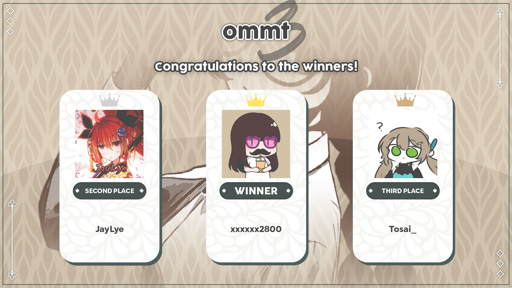

---
tags:
  - OMMT
  - OMMT3
  - OMMT 3
---

# osu!mania Malaysia Tournament 3

The **osu!mania Malaysia Tournament 3** (***OMMT 3***) was a Malaysian double-elimination 1v1 osu!mania 4-key tournament hosted by ::{ flag=MY }:: [ERA Leon](https://osu.ppy.sh/users/13382147) and ::{ flag=MY }:: [Gumi Fumo](https://osu.ppy.sh/users/1626983). It was the third instalment of the osu!mania Malaysia Tournament.

## Tournament schedule

| Event | Timestamp |
| --: | :-- |
| Registration phase | 2023-05-20/2023-06-12 |
| Screening phase | 2023-06-11/2023-06-24 |
| Qualifiers showcase | 2023-06-24 (21:00 UTC+8) |
| Qualifiers | 2023-07-01/2023-07-02 |
| Round of 32 | 2023-07-07/2023-07-10 |
| Round of 16 | 2023-07-15/2023-07-16 |
| Quarterfinals | 2023-07-20/2023-07-23 |
| Semifinals | 2023-07-28/2023-07-30 |
| Finals week 1 | 2023-08-05 |
| Finals week 2 | 2023-08-12/2023-08-13 |

## Prizes

| Placing | Prize(s) |
| :-: | :-- |
|  | Unique profile badge, MYR 150 |
|  | MYR 100 |
|  | MYR 50 |

## Organisation

The osu!mania Malaysia Tournament 3 was run by various community members.

| Position | Member(s) |
| :-- | :-- |
| Organiser | ::{ flag=MY }:: [ERA Leon](https://osu.ppy.sh/users/13382147), ::{ flag=MY }:: [Gumi Fumo](https://osu.ppy.sh/users/1626983) |
| Mappool selector | ::{ flag=MY }:: [ERA Leon](https://osu.ppy.sh/users/13382147), ::{ flag=RU }:: [Lerck](https://osu.ppy.sh/users/10450696), ::{ flag=TH }:: [MIkuaimbot](https://osu.ppy.sh/users/17699745), ::{ flag=TH }:: [MyZterioN-](https://osu.ppy.sh/users/8521723), ::{ flag=US }:: [SunApple](https://osu.ppy.sh/users/11817622) |
| Mapper | ::{ flag=MY }:: [Critical\_Star](https://osu.ppy.sh/users/3793196), ::{ flag=PH }:: [doctormango](https://osu.ppy.sh/users/13370527), ::{ flag=PH }:: [ERA Hatsuki](https://osu.ppy.sh/users/11306351), ::{ flag=ID }:: [FelixSpade](https://osu.ppy.sh/users/2651304), ::{ flag=TH }:: [HowToPlayLN](https://osu.ppy.sh/users/10879600), ::{ flag=PH }:: [notapplicable](https://osu.ppy.sh/users/7170536), ::{ flag=TH }:: [MyZterioN-](https://osu.ppy.sh/users/8521723), ::{ flag=US }:: [NovaSagittarii](https://osu.ppy.sh/users/11664177), ::{ flag=SG }:: [TheFunk](https://osu.ppy.sh/users/13981991), ::{ flag=ID }:: [\[Crz\]Crysarlene](https://osu.ppy.sh/users/5492871), ::{ flag=MY }:: [\_Kobii](https://osu.ppy.sh/users/6209713) |
| Mappool playtester | ::{ flag=ID }:: [-Yubi-](https://osu.ppy.sh/users/17851478), ::{ flag=MY }:: [Auxesiaa](https://osu.ppy.sh/users/16417718), ::{ flag=BR }:: [LeMarcinho](https://osu.ppy.sh/users/13347579), ::{ flag=MY }:: [Minisora](https://osu.ppy.sh/users/9627666), ::{ flag=SE }:: [NeonDrakon](https://osu.ppy.sh/users/6315000), ::{ flag=ID }:: [Oofyxl](https://osu.ppy.sh/users/20599160), ::{ flag=PH }:: [Silhoueska Elze](https://osu.ppy.sh/users/11517895), ::{ flag=MY }:: [\[MY\]Sol](https://osu.ppy.sh/users/12054898) |
| Referee | ::{ flag=ID }:: [-Yubi-](https://osu.ppy.sh/users/17851478), ::{ flag=US }:: [akace100](https://osu.ppy.sh/users/9308128), ::{ flag=MY }:: [Auxesiaa](https://osu.ppy.sh/users/16417718), ::{ flag=PE }:: [ERA Xuste](https://osu.ppy.sh/users/17989444), ::{ flag=MY }:: [EliraPendora](https://osu.ppy.sh/users/11288235), ::{ flag=NZ }:: [Hand Sanitiser](https://osu.ppy.sh/users/5091293), ::{ flag=MY }:: [Onlinee](https://osu.ppy.sh/users/13630137), ::{ flag=VN }:: [rock-on](https://osu.ppy.sh/users/9676089) |
| Streamer | ::{ flag=MY }:: [Evirir](https://osu.ppy.sh/users/8126553), ::{ flag=NZ }:: [Hand Sanitiser](https://osu.ppy.sh/users/5091293), ::{ flag=MY }:: [Kzon](https://osu.ppy.sh/users/2007579), ::{ flag=VN }:: [rock-on](https://osu.ppy.sh/users/9676089), ::{ flag=CN }:: [\[GB\]yobrevelc](https://osu.ppy.sh/users/14128407) |
| Commentator | ::{ flag=MY }:: [Auxesiaa](https://osu.ppy.sh/users/16417718), ::{ flag=MY }:: [Axorite](https://osu.ppy.sh/users/9124278), ::{ flag=MY }:: [ERA Leon](https://osu.ppy.sh/users/13382147), ::{ flag=MY }:: [IvanOfficial](https://osu.ppy.sh/users/12818249), ::{ flag=MY }:: [Kibitz](https://osu.ppy.sh/users/7418493), ::{ flag=AU }:: [PotassiumF](https://osu.ppy.sh/users/4247722), ::{ flag=MY }:: [Racers03](https://osu.ppy.sh/users/11621976), ::{ flag=PH }:: [Silhoueska Elze](https://osu.ppy.sh/users/11517895), ::{ flag=MY }:: [Unicow](https://osu.ppy.sh/users/9444174) |
| Designer | ::{ flag=MY }:: [Iyouka](https://osu.ppy.sh/users/7138499), ::{ flag=SG }:: [Polytetral](https://osu.ppy.sh/users/8612061), ::{ flag=SG }:: [TheFunk](https://osu.ppy.sh/users/13981991), ::{ flag=PH }:: [yukina meng](https://osu.ppy.sh/users/9919550) |
| Statistician | ::{ flag=NL }:: [2fast](https://osu.ppy.sh/users/5183940), ::{ flag=VN }:: [rock-on](https://osu.ppy.sh/users/9676089) |
| Composer | ::{ flag=TH }:: [HowToPlayLN](https://osu.ppy.sh/users/10879600), ::{ flag=SG }:: [Raveille](https://osu.ppy.sh/users/1388767) |
| Wiki writer | ::{ flag=ID }:: [fajar13k](https://osu.ppy.sh/users/7100002) |

## Links

- [Discussion thread](https://osu.ppy.sh/community/forums/topics/1761353)
- [OMMT Discord server](https://discord.gg/VSHWvz9KGt)
- [Livestream](https://www.twitch.tv/osumys)
- [Challonge bracket](https://challonge.com/OMMT3)
- **[Statistics sheet](https://docs.google.com/spreadsheets/d/11U3G20HprnsCz5e5PUmJCwVtPBbxwGFI3DJkieeDBPE/edit)**

## Participants

| Rank | Player |
| --: | :-- |
| #27 | ::{ flag=MY }:: [xxxxxx2800](https://osu.ppy.sh/users/4084853) |
| #330 | ::{ flag=MY }:: [\[MR\]Myina](https://osu.ppy.sh/users/25604245) |
| #808 | ::{ flag=MY }:: [Tosai\_](https://osu.ppy.sh/users/3760209) |
| #811 | ::{ flag=MY }:: [LloydTTG](https://osu.ppy.sh/users/17220267) |
| #867 | ::{ flag=MY }:: [VASD Player](https://osu.ppy.sh/users/29929002) |
| #937 | ::{ flag=MY }:: [YtAlbin0](https://osu.ppy.sh/users/21873512) |
| #1,118 | ::{ flag=MY }:: [256](https://osu.ppy.sh/users/30419111) |
| #1,695 | ::{ flag=MY }:: [9919149](https://osu.ppy.sh/users/7972439/mania) |
| #1,935 | ::{ flag=MY }:: [Ju1nY11](https://osu.ppy.sh/users/14743871) |
| #2,088 | ::{ flag=MY }:: [\[RGK\]Cheoky29](https://osu.ppy.sh/users/14901072) |
| #2,260 | ::{ flag=MY }:: [ReJust](https://osu.ppy.sh/users/20670028) |
| #2,542 | ::{ flag=MY }:: [JayLye](https://osu.ppy.sh/users/14892447) |
| #2,736 | ::{ flag=MY }:: [StyGix](https://osu.ppy.sh/users/7745408) |
| #3,848 | ::{ flag=MY }:: [cirinoes](https://osu.ppy.sh/users/7672567) |
| #4,952 | ::{ flag=MY }:: [RedCatzzButReal](https://osu.ppy.sh/users/23948744) |
| #6,036 | ::{ flag=MY }:: [Drysilas](https://osu.ppy.sh/users/16766719) |
| #6,093 | ::{ flag=MY }:: [Evirir](https://osu.ppy.sh/users/8126553) |
| #6,974 | ::{ flag=MY }:: [Aleppie](https://osu.ppy.sh/users/766445) |
| #7,035 | ::{ flag=MY }:: [xyyyyyy](https://osu.ppy.sh/users/27678259) |
| #7,232 | ::{ flag=MY }:: [kaijunchang7628](https://osu.ppy.sh/users/19678757) |
| #10,358 | ::{ flag=MY }:: [DiarrheaEnjoyer](https://osu.ppy.sh/users/15590896) |
| #10,957 | ::{ flag=MY }:: [Jugemu-Jugemu](https://osu.ppy.sh/users/10874775) |
| #11,894 | ::{ flag=MY }:: [TengShiXun](https://osu.ppy.sh/users/23694687) |
| #12,519 | ::{ flag=MY }:: [XxTheJKxX](https://osu.ppy.sh/users/9048451) |
| #16,795 | ::{ flag=MY }:: [ClassicNickey](https://osu.ppy.sh/users/26468007) |
| #17,046 | ::{ flag=MY }:: [Kzon](https://osu.ppy.sh/users/2007579) |
| #22,722 | ::{ flag=MY }:: [Truesans356](https://osu.ppy.sh/users/18484917) |
| #22,981 | ::{ flag=MY }:: [xiaodomo11111](https://osu.ppy.sh/users/7797432) |
| #34,917 | ::{ flag=MY }:: [PurpleLune](https://osu.ppy.sh/users/25486833) |
| #59,322 | ::{ flag=MY }:: [GG\_com2016](https://osu.ppy.sh/users/9229968) |
| #101,687 | ::{ flag=MY }:: [Axorite](https://osu.ppy.sh/users/9124278) |
| #109,061 | ::{ flag=MY }:: [Desmondkaile](https://osu.ppy.sh/users/19908328) |

Ranks were recorded at the end of registration.

The complete sign-up list can be found in our [statistics sheet](https://docs.google.com/spreadsheets/d/11U3G20HprnsCz5e5PUmJCwVtPBbxwGFI3DJkieeDBPE/edit) under `Players` section.

## Podium

## Mappools

### Grand Finals

**[Download the mappack here! (168 MB)](https://drive.google.com/file/d/1BUbqA87K7si3OebRh7xG5vvgcbV9y_Dq/view)**

- Rice
  1. [Kopophobia & Ajataa - Stardust (Mipha-) \[psy\]](https://osu.ppy.sh/beatmapsets/1187594#mania/2476531)
  2. [TUYU - Doro no Bunzai de Watashidake no Taisetsu o Ubaouda Nante (11Bit) \[11Bit's Fallen Angel x1.2\]](https://osu.ppy.sh/beatmapsets/1266456#mania/2632111)
  3. [Manabu Namiki - Hibachi (Kruppol) \[Impending Doom\]](https://osu.ppy.sh/beatmapsets/1813515#mania/3720473)
  4. [KURORAK - F.F.R \~FINAL FRONTIER RESOLUTION\~ (Pizza69) \[Challenge\]](https://osu.ppy.sh/beatmapsets/1971154#mania/4089900)
  5. [SiLiS - Asagao Acid Square (ERA Leon) \[Acrimonious\]](https://osu.ppy.sh/beatmapsets/2040480#mania/4256630)
  6. [Frums - Gender and a Metal Bat (elexire) \[Imperfection\]](https://osu.ppy.sh/beatmapsets/2014044#mania/4191266)
  7. [doth - Toy Boxxxx (Cadmium-113) \[Play\]](https://osu.ppy.sh/beatmapsets/922531#mania/1926544)
- LN
  1. [katagiri - Sendan Life (katagiri Bootleg) (Raveille) \[NostaLNgia (timing hell bootleg)\]](https://osu.ppy.sh/beatmapsets/1217839#mania/3901455)
  2. [Camellia - The King of Lions (FelixSpade) \[LN Master\]](https://osu.ppy.sh/beatmapsets/2040446#mania/4256532)
  3. [Sakuzyo - Distorted Fate (\[Crz\]Crysarlene) \[Elysian\]](https://osu.ppy.sh/beatmapsets/2040444#mania/4256508)
  4. [Sta feat. Ice - Cathedral (Micleak) \[Exposure to a downpour of sunlight and a thousand chords held in\]](https://osu.ppy.sh/beatmapsets/1865981#mania/3838235)
- SV
  1. [Camellia - Fly Wit Me (Orca-) \[I'm Done Playin\]](https://osu.ppy.sh/beatmapsets/1631662#mania/3330695)
  2. [Aire - Get Down (AlexDunk) \[:touchsvgrass:\]](https://osu.ppy.sh/beatmapsets/1939427#mania/4009815)
- Hybrid
  1. [Kaneko Chiharu - Re:miniscence (lemonguy) \[MAXIMUM\]](https://osu.ppy.sh/beatmapsets/1645612#mania/3359076)
  2. [Chroma - Destroy, Destroy, Destroy The Happy End (Penguinosity) \[Buffalo Chicken 1.1\]](https://osu.ppy.sh/beatmapsets/1338640#mania/2772946)
  3. [celtix - Sublime (Saemitsu) \[Exalted 1.1x\]](https://osu.ppy.sh/beatmapsets/1996147#mania/4251653)
- Tiebreaker
  1. **[HowToPlayLN - Veil of Maya (Critical\_Star) \[Elegant Chaos\]](https://osu.ppy.sh/beatmapsets/2040476#mania/4256611)**

### Finals

**[Download the mappack here! (202 MB)](https://drive.google.com/file/d/1uIzqujtmzhodkzsBZBEJY8V-HEQPe5_s/view)**

- Rice
  1. [Sephra's Paradox - Groovy Rollercoaster Acid Trip (TheDirius3000) \[Sakisagee's Raw 0.95x\]](https://osu.ppy.sh/beatmapsets/1538790#mania/3146057)
  2. [hsiu - auberica (FelixSpade) \[lost (edit) 1.2x (243bpm)\]](https://osu.ppy.sh/beatmapsets/1248282#mania/3012709)
  3. [mitssi feat. SeeU - You (Hylotl) \[index \[1.1x Rate\]\]](https://osu.ppy.sh/beatmapsets/1961993#mania/4066273)
  4. [Spacelectro feat. Shiiki Reku - Rhythmy (-Deepdive-) \[Till I'm laid\]](https://osu.ppy.sh/beatmapsets/1648145#mania/4099136)
  5. [void - Sudden Romance (Arccat) \[Ardent \[1.2x Rate\]\]](https://osu.ppy.sh/beatmapsets/1450840#mania/2990021)
  6. [Takayan - LOVE BEAM!! (Valedict) \[FOREVER IN YOUR HEART\]](https://osu.ppy.sh/beatmapsets/2011163#mania/4184921)
  7. [HHHxMMxST - Follow Tomorrow (for future mix) (frolica) \[x1.1\]](https://osu.ppy.sh/beatmapsets/1213533#mania/2525603)
- LN
  1. [Aiobahn - Towa no Utage (w/ YUC'e) (YuEast 2018) \[Timing Feast x1.05\]](https://osu.ppy.sh/beatmapsets/1925805#mania/3976494)
  2. [MisomyL - Ring ! Run ! Nyan!! (AelSan) \[meow\~ 1.05x (205bpm)\]](https://osu.ppy.sh/beatmapsets/1899365#mania/3915038)
  3. [void (Mournfinale) feat. Hoshikuma Minami - Testify (doctormango) \[penitent wish of the time forever lost\]](https://osu.ppy.sh/beatmapsets/2036436#mania/4246901)
  4. [Street - Hestia (MyZterioN-) \[Koiidex x Auraah's Mythology (edit)\]](https://osu.ppy.sh/beatmapsets/2035699#mania/4244914)
- SV
  1. [DJ Majokko Mirakurun - Gottagettotodeisu (Claren) \[Getting Thru These SVs\]](https://osu.ppy.sh/beatmapsets/1822673#mania/3740085)
  2. [Snails & Pegboard Nerds - Deep in the Night (Barely Alive Remix) (-\[DaNieL\_TH\]-) \[KILLA IN THE NIGHT\]](https://osu.ppy.sh/beatmapsets/1098856#mania/2295767)
- Hybrid
  1. [Camellia - #1f1e33 (Eclipse-) \[Eclipse & Sitek's Sapphire Dusk\]](https://osu.ppy.sh/beatmapsets/1241616#mania/3723776)
  2. [Camellia as "fluX Xroise" - Xronier ("geneXe" Long ver.) (FelixSpade) \[4K // Chronos (cut)\]](https://osu.ppy.sh/beatmapsets/1531626#mania/3136216)
  3. [Rukadesu & 5KiLOBYTE - ULTIMATE (TheFunk) \[Brawliseum (Nerf)\]](https://osu.ppy.sh/beatmapsets/2036462#mania/4246955)
- Tiebreaker
  1. **[KASOKUKI:Collective - Sanzui ("Gekiryuu" Long Version) (TheFunk) \[Calm before the ripple (Edit)\]](https://osu.ppy.sh/beatmapsets/2012199#mania/4187115)**

### Semifinals

**[Download the mappack here! (198 MB)](https://drive.google.com/file/d/1XB_Kd7CpcF7sJpu5Q1PaQj66cmVrJB8w/view)**

- Rice
  1. [HyuN - Soulwind (RyuOn) \[Luminous Flight\]](https://osu.ppy.sh/beatmapsets/1150271#mania/2401160)
  2. [Falcom Sound Team jdk - Like a Whirlwind (lemonguy) \[Ashen Chevalier\]](https://osu.ppy.sh/beatmapsets/1782308#mania/3649822)
  3. [Tokyo Shoegazer - 299 Addiction (Shoegazer) \[Mirage\]](https://osu.ppy.sh/beatmapsets/530648#mania/1124791)
  4. [Frums - Q.E. (Pizza69) \[Insane 1.05x (175bpm)\]](https://osu.ppy.sh/beatmapsets/1558484#mania/3183457)
  5. [Shirobon - Take Me to Pleasure Island (\[Crz\]hinako1804) \[PleasureLand\]](https://osu.ppy.sh/beatmapsets/1949069#mania/4034509)
  6. [Yu-dachi - MAGNETAR GIRL (Merian) \[Cheerful\]](https://osu.ppy.sh/beatmapsets/1857860#mania/3818588)
- LN
  1. [polysha - Uron (Eclipse-) \[Lavender Blaze \[1,05x Rate\]\]](https://osu.ppy.sh/beatmapsets/1809092#mania/3710491)
  2. [jioyi - Platinum (chxu) \[Collab Extraction\]](https://osu.ppy.sh/beatmapsets/1692896#mania/3459328)
  3. [Aitsuki Nakuru - Enamel no Butoukai (ERA Hatsuki) \[Akatsumi & Kobii's eLegaNtic Dance\]](https://osu.ppy.sh/beatmapsets/1924647#mania/3973426)
- SV
  1. [Sora Amamiya - Love Evidence (Cut Ver.) (Paturages) \[Stage 1: LaTeX Confession\]](https://osu.ppy.sh/beatmapsets/1768267#mania/3619649)
  2. [Zekk - SUPER \* HARAGURO \* POP (notapplicable) \[Magical Beam\]](https://osu.ppy.sh/beatmapsets/2032290#mania/4236260)
- Hybrid
  1. [AAAA - w = addict (elexire) \[overworked 1.05x (202bpm)\]](https://osu.ppy.sh/beatmapsets/1871968#mania/3851679)
  2. [AAAA vs. Morimori Atsushi - Xrocus (-mint-) \[Xrimson\]](https://osu.ppy.sh/beatmapsets/1825537#mania/3832970)
  3. [Sound piercer - Codename:Yuria (Penguinosity) \[System Repair\]](https://osu.ppy.sh/beatmapsets/1839620#mania/3778136)
- Tiebreaker
  1. **[SDMNE - Galactic Supercluster (HowToPlayLN) \[Laniakea\]](https://osu.ppy.sh/beatmapsets/1527340#mania/3124559)**

### Quarterfinals

**[Download the mappack here! (176 MB)](https://drive.google.com/drive/folders/1cotK10Umr1rKwH0IIa1AbwYmoa3q0BwD)**

- Rice
  1. [Puru - Grimheart (polysha remix) (Eclipse-) \[Abyssal \[1,05x Rate\]\]](https://osu.ppy.sh/beatmapsets/1429218#mania/2942320)
  2. [cosMo@Bousou-P - Bamboo Sword Girl (araragigun) \[Excalibur\]](https://osu.ppy.sh/beatmapsets/1842473#mania/3784516)
  3. [linear ring with RNAcid - Gypsophila (MyZterioN-) \[heartsick\]](https://osu.ppy.sh/beatmapsets/1805950#mania/3885886)
  4. [onumi - REGRET PART TWO (Shoegazer) \[DISCONNECT\]](https://osu.ppy.sh/beatmapsets/1473890#mania/3552223)
  5. [Tsukuyomi - Reason For Existence (\[Crz\]hinako1804) \[Separation\]](https://osu.ppy.sh/beatmapsets/1932044#mania/3991630)
  6. [Protest The Hero - Goddess Bound (Shoegazer) \[Unchained\]](https://osu.ppy.sh/beatmapsets/1880279#mania/3881595)
- LN
  1. [YOASOBI - Shukufuku (MIkuaimbot) \[Our Story (edit)\]](https://osu.ppy.sh/beatmapsets/1888896#mania/4222562)
  2. [Lime - Smiling (Short Ver.) (Lung\_P) \[Lung\_p x HowToPlayLN's happy\]](https://osu.ppy.sh/beatmapsets/1495445#mania/3064938)
  3. [tsukimi feat. KAFU - phony (MyZterioN-) \[fugue (nerfed)\]](https://osu.ppy.sh/beatmapsets/2025943#mania/4221063)
- SV
  1. [DJPoyoshi - Esperanza (Paturages) \[SVranza\]](https://osu.ppy.sh/beatmapsets/1232159#mania/3067776)
  2. [Jioyi - Forsaken (zero2snow) \[Stage 1: Abandoned\]](https://osu.ppy.sh/beatmapsets/1037446#mania/2168949)
- Hybrid
  1. [Kolaa x Mestie - Digibuprofen (AelSan) \[Flappy's Insane\]](https://osu.ppy.sh/beatmapsets/1941403#mania/4143697)
  2. [xi - Angel's Ladder (Toaph Daddy) \[Another\]](https://osu.ppy.sh/beatmapsets/1768657#mania/3620488)
  3. [Polyphia - O.D. (hna) \[Impeccable\]](https://osu.ppy.sh/beatmapsets/1400718#mania/3225707)
- Tiebreaker
  1. **[lapix - SYNERGY (\[Crz\]Crysarlene) \[Ace\]](https://osu.ppy.sh/beatmapsets/1069265#mania/2238360)**

### Round of 16

**[Download the mappack here! (97 MB)](https://drive.google.com/drive/folders/1E5KbSvifvElrUW0vSFf2qD61CjRjy7ip)**

- Rice
  1. [Mitsukiyo - Unwelcome School (Magikarp1234) \[\[8\] Rosemi's Jumpstream\]](https://osu.ppy.sh/beatmapsets/1895989#mania/3907369)
  2. [Cardboard Box - The Limit Does Not Exist (Asherz007) \[Mentos' Insane\]](https://osu.ppy.sh/beatmapsets/704152#mania/1490013)
  3. [sakuraburst - serotonin (guden) \[serenity\]](https://osu.ppy.sh/beatmapsets/1928249#mania/3982107)
  4. [Maki - Stairway To The Universe (-Yubi-) \[Xingren's Stairway To The Universe\]](https://osu.ppy.sh/beatmapsets/2021598#mania/4210172)
  5. [Mastodon - Capillarian Crest (XeoStyle) \[The Heartless Beast\]](https://osu.ppy.sh/beatmapsets/931792#mania/1945556)
- LN
  1. [Fujii Kaze - Shinunoga E-Wa (TheFunk) \[superstitions w/ ruleblazing\]](https://osu.ppy.sh/beatmapsets/1916300#mania/3953965)
  2. [HowToPlayLN - The Last Hope from the Gods (HowToPlayLN) \[Behind the Truth\]](https://osu.ppy.sh/beatmapsets/1626316#mania/3320290)
  3. [OSTER project - piano x forte (elexire) \[Concerto\]](https://osu.ppy.sh/beatmapsets/1791063#mania/3825324)
- SV
  1. [Airuei - Framework (H1Pur) \[Structures\]](https://osu.ppy.sh/beatmapsets/1465676#mania/3010240)
  2. [Takanashi Kiara - SPARKS (ERA Leon) \[AmeliaFangirl's Dance in the rain (cut)\]](https://osu.ppy.sh/beatmapsets/2024037#mania/4215959)
- Hybrid
  1. [Sakuzyo - Magicatz (HowToPlayLN) \[Illusion\]](https://osu.ppy.sh/beatmapsets/1108452#mania/2316593)
  2. [ARM feat.Nicole Curry - Come to Life (HowToPlayLN) \[Inspiration\]](https://osu.ppy.sh/beatmapsets/1117755#mania/2334914)
- Tiebreaker
  1. **[AIKA - Misery Fantasy (AlexDunk) \[my broken wish.\]](https://osu.ppy.sh/beatmapsets/1873483#mania/3855135)**

### Round of 32

**[Download the mappack here! (135 MB)](https://drive.google.com/drive/folders/1pVxMl382xlGsUgw56jgDKW2klYP-Dop2)**

- Rice
  1. [Yunomi feat. nicamoq - Robotic Girl (Srav3R Remix) (LeiN-) \[Unscathed Heart (Short Ver.)\]](https://osu.ppy.sh/beatmapsets/1462769#mania/3253259)
  2. [xi - Ascension to Heaven (cut) (MyZterioN-) \[derive (FREQ+2)\]](https://osu.ppy.sh/beatmapsets/1791760#mania/3671835)
  3. [The Flashbulb - That Missing Week (Alternate) (Ballistic) \[Elegy\]](https://osu.ppy.sh/beatmapsets/1886022#mania/3883366)
  4. [Boom Kitty - Rum n' Bass (Cokiiplay) \[Jack Sparrow\]](https://osu.ppy.sh/beatmapsets/1400155#mania/2888824)
  5. [Zekk - Vastness (DannyPX) \[Vybe\]](https://osu.ppy.sh/beatmapsets/1832790#mania/3762382)
- LN
  1. [Mili - Yubikiri-Genman (MyZterioN-) \[edit\]](https://osu.ppy.sh/beatmapsets/1072177#mania/2807044)
  2. [toby fox - Another Medium (Toaph Daddy) \[Dreamer\]](https://osu.ppy.sh/beatmapsets/1203698#mania/2506453)
  3. [quarkimo - volley (Paturages) \[haikyuu\]](https://osu.ppy.sh/beatmapsets/1930798#mania/3988635)
- SV
  1. [Redemptive - Adrenaline (Nick Wilde) \[couil's hard\]](https://osu.ppy.sh/beatmapsets/837456#mania/1756379)
  2. [Cute Girls Doing Cute Things - Main Heroine (Mestro) \[Episode\]](https://osu.ppy.sh/beatmapsets/1356641#mania/2807630)
- Hybrid
  1. [Weroh K - Arc - IV (Elekton) \[iteration\]](https://osu.ppy.sh/beatmapsets/719294#mania/1519014)
  2. [kanone - Falsum Atlantis. (Shima Rin) \[ExNeko's ADVANCED\]](https://osu.ppy.sh/beatmapsets/1649024#mania/3480074)
- Tiebreaker
  1. **[Mameyudoufu - Quality Control (DannyPX) \[Distance\]](https://osu.ppy.sh/beatmapsets/1336570#mania/2768929)**

### Qualifiers

**[Download the mappack here! (22 MB)](https://drive.google.com/drive/folders/1xI64Im8rDVwdrq8qKiW3RbxAz2Hrg0r-)**

- FreeMod
  1. [linear ring - isomorph (NovaSagittarii) \[Stage 1: Procrastination\]](https://osu.ppy.sh/beatmapsets/2014844#mania/4193330)
  2. [BEMANI Sound Team "Virkato Wakhmaninov" - Piano Dokusou Mugonka "Kaijin" (MyZterioN-) \[Stage 2: kyokan\]](https://osu.ppy.sh/beatmapsets/2014824#mania/4193279)
  3. [Redside - Sidequest (ERA Leon) \[Stage 3\]](https://osu.ppy.sh/beatmapsets/2014797#mania/4193193)
  4. [DJ Genki vs Gram - Einherjar Joker (Requiem EXTENDED MIX) (Critical_Star) \[Stage 4: Speed Stamina\]](https://osu.ppy.sh/beatmapsets/2014816#mania/4193245)
  5. [Alkome - Flashlight (TheFunk) \[Stage 5: Elations\]](https://osu.ppy.sh/beatmapsets/2014867#mania/4193391)

## Match results

### Grand Finals

Saturday, 12 August 2023:

| Player A |  |  | Player B | Match link |
| --: | :-: | :-: | :-- | :-- |
| **JayLye** ::{ flag=MY }:: | **7** | 4 | ::{ flag=MY }:: Tosai\_ | [#1](https://osu.ppy.sh/community/matches/109958334) |

Sunday, 13 August 2023:

| Player A |  |  | Player B | Match link |
| --: | :-: | :-: | :-- | :-- |
| **xxxxxx2800** ::{ flag=MY }:: | **7** | 0 | ::{ flag=MY }:: JayLye | [#1](https://osu.ppy.sh/community/matches/109974402) |

### Finals

Saturday, 5 August 2023:

| Player A |  |  | Player B | Match link |
| --: | :-: | :-: | :-- | :-- |
| StyGix ::{ flag=MY }:: | -1 | **0** | ::{ flag=MY }:: **StyGix** | *win by default* |
| **Tosai\_** ::{ flag=MY }:: | **7** | 1 | ::{ flag=MY }:: YtAlbin0 | [#1](https://osu.ppy.sh/community/matches/109845410) |
| **xxxxxx2800** ::{ flag=MY }:: | **7** | 1 | ::{ flag=MY }:: JayLye | [#1](https://osu.ppy.sh/community/matches/109849361) |
| **Tosai\_** ::{ flag=MY }:: | **7** | 0 | ::{ flag=MY }:: 9919149 | [#1](https://osu.ppy.sh/community/matches/109851068) |

### Semifinals

Friday, 28 July 2023:

| Player A |  |  | Player B | Match link |
| --: | :-: | :-: | :-- | :-- |
| Ju1nY11 ::{ flag=MY }:: | 0 | **6** | ::{ flag=MY }:: **YtAlbin0** | [#1](https://osu.ppy.sh/community/matches/109718831) |

Saturday, 29 July 2023:

| Player A |  |  | Player B | Match link |
| --: | :-: | :-: | :-- | :-- |
| **ReJust** ::{ flag=MY }:: | **0** | -1 | ::{ flag=MY }:: LloydTTG | *win by default* |
| \[MR\]Myina ::{ flag=MY }:: | -1 | **0** | ::{ flag=MY }:: **RedCatzzButReal** | *win by default* |
| **YtAlbin0** ::{ flag=MY }:: | **0** | -1 | ::{ flag=MY }:: ReJust | *win by default* |
| Tosai\_ ::{ flag=MY }:: | 5 | **6** | ::{ flag=MY }:: **JayLye** | [#1](https://osu.ppy.sh/community/matches/109736773) |
| \[RGK\]Cheoky29 ::{ flag=MY }:: | 1 | **6** | ::{ flag=MY }:: **9919149** | [#1](https://osu.ppy.sh/community/matches/109738591) |

Sunday, 30 July 2023:

| Player A |  |  | Player B | Match link |
| --: | :-: | :-: | :-- | :-- |
| **xxxxxx2800** ::{ flag=MY }:: | **6** | 2 | ::{ flag=MY }:: StyGix | [#1](https://osu.ppy.sh/community/matches/109750957) |
| **9919149** ::{ flag=MY }:: | **6** | 0 | ::{ flag=MY }:: RedCatzzButReal | [#1](https://osu.ppy.sh/community/matches/109753026) |

### Quarterfinals

Thursday, 20 July 2023:

| Player A |  |  | Player B | Match link |
| --: | :-: | :-: | :-- | :-- |
| **StyGix** ::{ flag=MY }:: | **6** | 4 | ::{ flag=MY }:: Ju1nY11 | [#1](https://osu.ppy.sh/community/matches/109591241) |

Friday, 21 July 2023:

| Player A |  |  | Player B | Match link |
| --: | :-: | :-: | :-- | :-- |
| **YtAlbin0** ::{ flag=MY }:: | **6** | 2 | ::{ flag=MY }:: Jugemu-Jugemu | [#1](https://osu.ppy.sh/community/matches/109604305) |
| **kaijunchang7628** ::{ flag=MY }:: | **6** | 5 | ::{ flag=MY }:: Kzon | [#1](https://osu.ppy.sh/community/matches/109606008) |

Saturday, 22 July 2023:

| Player A |  |  | Player B | Match link |
| --: | :-: | :-: | :-- | :-- |
| **YtAlbin0** ::{ flag=MY }:: | **6** | 0 | ::{ flag=MY }:: kaijunchang7628 | [#1](https://osu.ppy.sh/community/matches/109615287) |
| **Evirir** ::{ flag=MY }:: | **6** | 2 | ::{ flag=MY }:: DiarrheaEnjoyer | [#1](https://osu.ppy.sh/community/matches/109617125) |
| **xxxxxx2800** ::{ flag=MY }:: | **6** | 0 | ::{ flag=MY }:: ReJust | [#1](https://osu.ppy.sh/community/matches/109618545) |
| **RedCatzzButReal** ::{ flag=MY }:: | **6** | 3 | ::{ flag=MY }:: xyyyyyy | [#1](https://osu.ppy.sh/community/matches/109618992) |
| VASD Player ::{ flag=MY }:: | -1 | **0** | ::{ flag=MY }:: **PurpleLune** | **win by default* |
| **Drysilas** ::{ flag=MY }:: | **6** | 0 | ::{ flag=MY }:: XxTheJKxX | [#1](https://osu.ppy.sh/community/matches/109620051) |
| **Tosai\_** ::{ flag=MY }:: | **6** | 3 | ::{ flag=MY }:: \[MR\]Myina | [#1](https://osu.ppy.sh/community/matches/109621316) |
| **LloydTTG** ::{ flag=MY }:: | **6** | 1 | ::{ flag=MY }:: Aleppie | [#1](https://osu.ppy.sh/community/matches/109622360) |
| **9919149** ::{ flag=MY }:: | **6** | 1 | ::{ flag=MY }:: cirinoes | [#1](https://osu.ppy.sh/community/matches/109623120) |

Sunday, 23 July 2023:

| Player A |  |  | Player B | Match link |
| --: | :-: | :-: | :-- | :-- |
| **LloydTTG** ::{ flag=MY }:: | **6** | 3 | ::{ flag=MY }:: Eviri | [#1](https://osu.ppy.sh/community/matches/109634052) |
| **9919149** ::{ flag=MY }:: | **6** | 5 | ::{ flag=MY }:: Drysilas | [#1](https://osu.ppy.sh/community/matches/109636522) |
| PurpleLune ::{ flag=MY }:: | 1 | **6** | ::{ flag=MY }:: **RedCatzzButReal** | [#1](https://osu.ppy.sh/community/matches/109637957) |
| **JayLye** ::{ flag=MY }:: | **6** | 5 | ::{ flag=MY }:: \[RGK\]Cheoky29 | [#1](https://osu.ppy.sh/community/matches/109640280) |

### Round of 16

Saturday, 15 July 2023:

| Player A |  |  | Player B | Match link |
| --: | :-: | :-: | :-- | :-- |
| Axorite ::{ flag=MY }:: | 1 | **5** | ::{ flag=MY }:: **cirinoes** | [#1](https://osu.ppy.sh/community/matches/109502530) |
| **ReJust** ::{ flag=MY }:: | **5** | 2 | ::{ flag=MY }:: VASD Player | [#1](https://osu.ppy.sh/community/matches/109503275) |
| Desmondkaile ::{ flag=MY }:: | -1 | **0** | ::{ flag=MY }:: **Jugemu-Jugemu** | *win by default* |
| Truesans356 ::{ flag=MY }:: | 0 | **5** | ::{ flag=MY }:: **XxTheJKxX** | [#1](https://osu.ppy.sh/community/matches/109503542) |
| YtAlbin0 ::{ flag=MY }:: | 2 | **5** | ::{ flag=MY }:: **\[RGK\]Cheoky29** | [#1](https://osu.ppy.sh/community/matches/109505453) |
| **PurpleLune** ::{ flag=MY }:: | **0** | -1 | ::{ flag=MY }:: 256 | *win by default* |
| xiaodomo11111 ::{ flag=MY }:: | 2 | **5** | ::{ flag=MY }:: **Aleppie** | [#1](https://osu.ppy.sh/community/matches/109507129) |
| **Kzon** ::{ flag=MY }:: | **5** | 2 | ::{ flag=MY }:: TengShiXun | [#1](https://osu.ppy.sh/community/matches/109507122) |
| ClassicNickey ::{ flag=MY }:: | 0 | **5** | ::{ flag=MY }:: **xyyyyyy** | [#1](https://osu.ppy.sh/community/matches/109508140) |

Sunday, 16 July 2023:

| Player A |  |  | Player B | Match link |
| --: | :-: | :-: | :-- | :-- |
| **Tosai\_** ::{ flag=MY }:: | **5** | 2 | ::{ flag=MY }:: Evirir | [#1](https://osu.ppy.sh/community/matches/109518603) |
| **Ju1nY11** ::{ flag=MY }:: | **0** | -1 | ::{ flag=MY }:: 9919149 | *win by default* |
| GG\_com2016 ::{ flag=MY }:: | -1 | **0** | ::{ flag=MY }:: **DiarrheaEnjoyer** | *win by default* |
| **StyGix** ::{ flag=MY }:: | **0** | -1 | ::{ flag=MY }:: Drysilas | *win by default* |
| **JayLye** ::{ flag=MY }:: | **0** | -1 | ::{ flag=MY }:: kaijunchang7628 | *win by default* |
| **\[MR\]Myina** ::{ flag=MY }:: | **5** | 4 | ::{ flag=MY }:: LloydTTG | [#1](https://osu.ppy.sh/community/matches/109524749) |
| **xxxxxx2800** ::{ flag=MY }:: | **5** | 0 | ::{ flag=MY }:: RedCatzzButRea | [#1](https://osu.ppy.sh/community/matches/109525580) |

### Round of 32

Friday, 7 July 2023:

| Player A |  |  | Player B | Match link |
| --: | :-: | :-: | :-- | :-- |
| **xxxxxx2800** ::{ flag=MY }:: | **0** | -1 | ::{ flag=MY }:: Desmondkaile | *win by default* |
| **Tosai\_** ::{ flag=MY }:: | **5** | 0 | ::{ flag=MY }:: Axorite | [#1](https://osu.ppy.sh/community/matches/109374346) |

Saturday, 8 July 2023:

| Player A |  |  | Player B | Match link |
| --: | :-: | :-: | :-- | :-- |
| **YtAlbin0** ::{ flag=MY }:: | **5** | 0 | ::{ flag=MY }:: ClassicNickey | [#1](https://osu.ppy.sh/community/matches/109387191) |
| **\[MR\]Myina** ::{ flag=MY }:: | **5** | 0 | ::{ flag=MY }:: Truesans356 | [#1](https://osu.ppy.sh/community/matches/109388360) |
| **Drysilas** ::{ flag=MY }:: | **5** | 0 | ::{ flag=MY }:: Aleppie | [#1](https://osu.ppy.sh/community/matches/109391204) |
| **9919149** ::{ flag=MY }:: | **5** | 3 | ::{ flag=MY }:: DiarrheaEnjoyer | [#1](https://osu.ppy.sh/community/matches/109391209) |
| **StyGix** ::{ flag=MY }:: | **5** | 0 | ::{ flag=MY }:: xiaodomo11111 | [#1](https://osu.ppy.sh/community/matches/109391523) |
| **VASD Player** ::{ flag=MY }:: | 5 | 0 | ::{ flag=MY }:: TengShiXun | [#1](https://osu.ppy.sh/community/matches/109391999) |
| **Ju1nY11** ::{ flag=MY }:: | **5** | 0 | ::{ flag=MY }:: GG\_com2016 | [#1](https://osu.ppy.sh/community/matches/109392010) |
| 256 ::{ flag=MY }:: | 2 | **5** | ::{ flag=MY }:: **kaijunchang7628** | [#1](https://osu.ppy.sh/community/matches/109392486) |
| **\[RGK\]Cheoky29** ::{ flag=MY }:: | **5** | 0 | ::{ flag=MY }:: xyyyyyy | [#1](https://osu.ppy.sh/community/matches/109392860) |

Sunday, 9 July 2023:

| Player A |  |  | Player B | Match link |
| --: | :-: | :-: | :-- | :-- |
| **JayLye** ::{ flag=MY }:: | **5** | 0 | ::{ flag=MY }:: PurpleLune | [#1](https://osu.ppy.sh/community/matches/109407572) |
| **LloydTTG** ::{ flag=MY }:: | **5** | 0 | ::{ flag=MY }:: XxTheJKxX | [#1](https://osu.ppy.sh/community/matches/109408032) |
| **ReJust** ::{ flag=MY }:: | **5** | 0 | ::{ flag=MY }:: Kzon | [#1](https://osu.ppy.sh/community/matches/109408709) |

Monday, 10 July 2023:

| Player A |  |  | Player B | Match link |
| --: | :-: | :-: | :-- | :-- |
| **Evirir** ::{ flag=MY }:: | **5** | 1 | ::{ flag=MY }:: cirinoes | [#1](https://osu.ppy.sh/community/matches/109420495) |
| Jugemu-Jugemu ::{ flag=MY }:: | 2 | **5** | ::{ flag=MY }:: **RedCatzzButReal** | [#1](https://osu.ppy.sh/community/matches/109422830) |

### Qualifiers

Detailed statistics for this round can be found in [this spreadsheet](https://docs.google.com/spreadsheets/d/11U3G20HprnsCz5e5PUmJCwVtPBbxwGFI3DJkieeDBPE/edit) alongside the final standings on which players made it through to the next stage.

## Ruleset

All staff members and players must respect each other, follow the [osu! community rules](/wiki/Rules). Do not discuss sensitive topics (example: religion, politics) and anything that could be offensive to others. This is a friendly 1v1 4K national tournament and not the place for such discussions. If a player breaks any of the osu! community rules, they will be punished. The tournament staff has the right to punish players who show repeated and excessive toxic behaviour towards any staff member, player, or spectator in either match multiplayer chat rooms, the official Discord server, or the official Twitch channel chat room.

Punishments for violating the osu! community rules include:

- Declaring the match as forfeited, or as a win by default for the other player.
- Disqualification from the entire tournament.

### Qualifier procedure

1. The referee will notify the player 10–15 minutes before the lobby is scheduled to start. Once all the players are present or another 10 minutes have passed since the scheduled time, the lobby will start.
2. Players will play the mappool in order from stage 1–5 twice. After the first cycle, players will be given a 5-minute break before continuing with the 2nd cycle which follows the same procedure. Players are allowed to skip this break if all players present in the lobby agree to start the 2nd run right away.

### Match procedure

1. The referee will notify players 10 minutes before the match is scheduled to start. Once the players are ready, they must notify the referee to be invited into the lobby.
2. Protecting and banning:
   - Players will be required to roll for **protecting and banning maps** for a total of **protecting 2 maps and banning 1 map**. The player with the highest roll will be allowed to protect a map of their choice first, as well as being able to ban first. Do not hesitate to ask any questions related to this procedure in the Discord server.
   - A player **cannot** protect 2 maps of the same type (example: if player 1 protects hb1, they can no longer protect any other remaining hybrids). This rule applies to each person individually.
3. During the protect/ban/pick phases each player will be given 2 minutes to choose their maps. If players end up taking too long, the referee will roll a number corresponding to the number of maps in the mappool, excluding TB (example: the mappool has 11 maps, so the referee will `!roll 10`), to randomly choose a map for them. This is to ensure that a match does not take too long.
4. Each player will receive one "timeout" of two minutes per match, to be used as extra time to pick a beatmap or to rest. The timeout may only be used by the player who picks the next map, the only exception being during tiebreaker scenarios, where both players are given a two-minute timeout regardless.
5. Players cannot pick or use provocative warm-up maps. This is to ensure that the livestream is family friendly to watch. Players are not required to play a warm-up map, but if desired, the warm-up maps must be sent to the referee at least 5 minutes before the match begins (the earlier, the better).
6. Duration of warm up maps must be under 4 minutes. There is no limit on star rating.

### Additional procedure

1. Players can reschedule to a later qualifiers lobby if they missed their scheduled lobby.
2. In case of a situation where a player does not show up on time, the match will be delayed by 10 minutes. If the player still does not show up, the other player present will automatically be declared the winner of the match. To avoid this, please check schedules properly and, if necessary, do an emergency reschedule beforehand with a valid reason.
3. If a disconnection happens within 30 seconds or first 25% after the map starts, the referee has the option to abort and restart the map. Lag is not a valid reason to restart the match.
4. Visual mods such as HD, FL, FI, and MR, along with NF mod, are allowed. Meanwhile, EZ and HR mod are not allowed.
5. If a player does not cooperate with the referee, or intentionally stalls the match, they will receive a warning. If the problem persists, the host has the power to end the match and decide the winner on the spot.
6. The host has discretion to resolve any situations not listed here as they see fit.

### Schedules

The tournament staff will be responsible for scheduling all matches and informing players of their individual schedules. If a player is not happy or comfortable with the schedule, they will have the option to request a reschedule. For more details, refer to the tournament's Discord server.

The tournament staff will do their best to schedule every match according to each player's preferred time to play.

- If no referee is available during the match, the match shall be delayed.
- If no streamers are available to broadcast the match, the match will still happen without being broadcasted.
- If no commentators are available to follow the match, but streamers are, the match will still be broadcasted without commentary.

### Extra

1. Please note that the staff will try their best to broadcast every match. If two matches happen at the same time, the following options are prioritised:
   - The scheduled match over rescheduled matches.
   - The winner bracket match over the lower bracket match.
