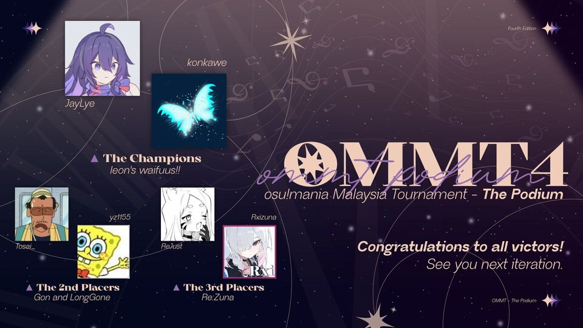

---
tags:
  - OMMT
  - OMMT4
  - OMMT 4
---

# osu!mania Malaysia Tournament 4

The **osu!mania Malaysia Tournament 4** (***OMMT 4***) was a Malaysian team-based double-elimination 1v1 osu!mania 4-key tournament hosted by ::{ flag=MY }:: [Onlinee](https://osu.ppy.sh/users/13630137), ::{ flag=VN }:: [ARL](https://osu.ppy.sh/users/15778330), and ::{ flag=MY }:: [Kibitz](https://osu.ppy.sh/users/7418493). It was the fourth instalment of the osu!mania Malaysia Tournament.

## Tournament schedule

| Event | Timestamp |
| --: | :-- |
| Registration phase | 2024-05-26/2024-06-17 |
| Screening phase | 2024-06-18/2024-06-30 |
| Qualifier showcase | 2024-07-01 |
| Qualifiers | 2024-07-06/2024-07-07 |
| Round of 32 | 2024-07-12/2024-07-14 |
| Round of 16 | 2024-07-16/2024-07-21 |
| Quarterfinals | 2024-07-26/2024-07-28 |
| Semifinals | 2024-08-03/2024-08-04 |
| Finals | 2024-08-10/2024-08-11 |
| Grand Finals | 2024-08-17/2024-08-18 |

## Prizes

| Placing | Prize(s) |
| :-: | :-- |
|  | 2 months of osu!supporter tag, user profile banner |
|  | 1 month of osu!supporter tag, user profile banner |
|  | 1 month of osu!supporter tag, user profile banner |

Donations and all supports can be made through [OMMT's Ko-fi page](https://ko-fi.com/osumaniamalaysia) or by sending message to `@rantabie` in Discord.

## Organisation

The osu!mania Malaysia Tournament 4 was run by various community members.

| Position | Member(s) |
| :-- | :-- |
| Organiser | ::{ flag=VN }:: [ARL](https://osu.ppy.sh/users/15778330), ::{ flag=MY }:: [Kibitz](https://osu.ppy.sh/users/7418493), ::{ flag=MY }:: [Onlinee](https://osu.ppy.sh/users/13630137) |
| Consultant | ::{ flag=NL }:: [Albionthegreat](https://osu.ppy.sh/users/9853595), ::{ flag=MY }:: [Cryolien](https://osu.ppy.sh/users/1626983), ::{ flag=MY }:: [ERA Leon](https://osu.ppy.sh/users/13382147), ::{ flag=MY }:: [Unicow](https://osu.ppy.sh/users/9444174) |
| Head mappooler | ::{ flag=VN }:: [Lott](https://osu.ppy.sh/users/13821222), ::{ flag=KR }:: [Oceanus](https://osu.ppy.sh/users/9164100), ::{ flag=KR }:: [PocaFanboy](https://osu.ppy.sh/users/6912079) |
| Mappool playtester | ::{ flag=PA }:: [\[HD\]Softer64](https://osu.ppy.sh/users/8704966), ::{ flag=VN }:: [\[LS\]Sagirium](https://osu.ppy.sh/users/16530364), ::{ flag=MY }:: [\[MY\]Sol](https://osu.ppy.sh/users/12054898), ::{ flag=SG }:: [awdse22](https://osu.ppy.sh/users/8743513), ::{ flag=PL }:: [Bexi](https://osu.ppy.sh/users/11548612), ::{ flag=FR }:: [DarkMew2](https://osu.ppy.sh/users/13921965), ::{ flag=US }:: [EpsilonMaiagare](https://osu.ppy.sh/users/3855052), ::{ flag=MY }:: [IvanOfficial](https://osu.ppy.sh/users/12818249), ::{ flag=KR }:: [Nicknem\_](https://osu.ppy.sh/users/16615040), ::{ flag=ID }:: [Oofyxl](https://osu.ppy.sh/users/20599160), ::{ flag=AU }:: [PotassiumF](https://osu.ppy.sh/users/4247722), ::{ flag=KR }:: [Situroen](https://osu.ppy.sh/users/7272956) |
| Mapper | ::{ flag=MY }:: [\[Andre\]](https://osu.ppy.sh/users/12955520), ::{ flag=CN }:: [\[GB\]Mafufu](https://osu.ppy.sh/users/10884561), ::{ flag=JP }:: [\[GS\]hina](https://osu.ppy.sh/users/20040607), ::{ flag=PA }:: [\[HD\]Softer64](https://osu.ppy.sh/users/8704966), ::{ flag=SG }:: [awdse22](https://osu.ppy.sh/users/8743513), ::{ flag=MY }:: [Critical\_Star](https://osu.ppy.sh/users/3793196), ::{ flag=ID }:: [eZmmR](https://osu.ppy.sh/users/8647138), ::{ flag=HK }:: [Irone OSU](https://osu.ppy.sh/users/10678230), ::{ flag=MY }:: [IvanOfficial](https://osu.ppy.sh/users/12818249), ::{ flag=RU }:: [Lerck](https://osu.ppy.sh/users/10450696), ::{ flag=TH }:: [MyZterioN-](https://osu.ppy.sh/users/8521723), ::{ flag=US }:: [remity\_](https://osu.ppy.sh/users/15181375), ::{ flag=ID }:: [Sarahkuai](https://osu.ppy.sh/users/5246861), ::{ flag=IE }:: [SureFir3](https://osu.ppy.sh/users/24495218), ::{ flag=SG }:: [TheFunk](https://osu.ppy.sh/users/13981991), ::{ flag=CN }:: [YuEast 2018](https://osu.ppy.sh/users/13953619) |
| Music producer | ::{ flag=NZ }:: [ERA Midian](https://osu.ppy.sh/users/25689815), ::{ flag=MY }:: [HimitsuHiketsu](https://osu.ppy.sh/users/12920708), ::{ flag=SG }:: [Raveille](https://osu.ppy.sh/users/1388767), ::{ flag=MY }:: [takehirotei](https://osu.ppy.sh/users/11793794) |
| Referee | ::{ flag=VN }:: [\[LS\]Sagirium](https://osu.ppy.sh/users/16530364), ::{ flag=US }:: [akace100](https://osu.ppy.sh/users/9308128), ::{ flag=VN }:: [Cessna](https://osu.ppy.sh/users/16868806), ::{ flag=MY }:: [DXA FonG](https://osu.ppy.sh/users/15019527), ::{ flag=US }:: [EpsilonMaiagare](https://osu.ppy.sh/users/3855052), ::{ flag=AU }:: [Fairy Bread](https://osu.ppy.sh/users/8306102), ::{ flag=DE }:: [Jason X](https://osu.ppy.sh/users/2904140), ::{ flag=MY }:: [Jugemu-Jugemu](https://osu.ppy.sh/users/10874775), ::{ flag=SG }:: [Quickeryes](https://osu.ppy.sh/users/18227681), ::{ flag=MY }:: [Racers03](https://osu.ppy.sh/users/11621976), ::{ flag=CA }:: [Shizunaa](https://osu.ppy.sh/users/7352655), ::{ flag=PH }:: [Silhoueska Elze](https://osu.ppy.sh/users/11517895), ::{ flag=DE }:: [TheHunter1](https://osu.ppy.sh/users/6496016), ::{ flag=US }:: [ZnowFanGirl](https://osu.ppy.sh/users/32151196) |
| Streamer | ::{ flag=CN }:: [\[GB\]Rush\_FTK](https://osu.ppy.sh/users/3046856), ::{ flag=VN }:: [Cessna](https://osu.ppy.sh/users/16868806), ::{ flag=US }:: [EpsilonMaiagare](https://osu.ppy.sh/users/3855052), ::{ flag=MY }:: [Evirir](https://osu.ppy.sh/users/8126553), ::{ flag=NZ }:: [Hand Sanitiser](https://osu.ppy.sh/users/5091293), ::{ flag=MY }:: [Kzon](https://osu.ppy.sh/users/2007579), ::{ flag=DE }:: [QEpicAce](https://osu.ppy.sh/users/9489153), ::{ flag=PH }:: [Silhoueska Elze](https://osu.ppy.sh/users/11517895), ::{ flag=TW }:: [SugiuraAyano](https://osu.ppy.sh/users/2529213) |
| Caster | ::{ flag=MY }:: [\[MY\]Sol](https://osu.ppy.sh/users/12054898), ::{ flag=GB }:: [epic man 2](https://osu.ppy.sh/users/14566000), ::{ flag=MY }:: [IvanOfficial](https://osu.ppy.sh/users/12818249), ::{ flag=PH }:: [Lazereed](https://osu.ppy.sh/users/12894120), ::{ flag=ID }:: [Oofyxl](https://osu.ppy.sh/users/20599160), ::{ flag=AU }:: [PotassiumF](https://osu.ppy.sh/users/4247722), ::{ flag=MY }:: [Racers03](https://osu.ppy.sh/users/11621976), ::{ flag=PH }:: [Silhoueska Elze](https://osu.ppy.sh/users/11517895), ::{ flag=MY }:: [Unicow](https://osu.ppy.sh/users/9444174) |
| Designer | ::{ flag=MY }:: [\[Zeth\]](https://osu.ppy.sh/users/9912966), ::{ flag=DE }:: [ERA Aracium](https://osu.ppy.sh/users/15882740), ::{ flag=MY }:: [lous](https://osu.ppy.sh/users/6231292), ::{ flag=MY }:: [Iyouka](https://osu.ppy.sh/users/7138499), ::{ flag=ID }:: [LenLitchu](https://osu.ppy.sh/users/34098325), ::{ flag=MY }:: [NyuPenyu](https://osu.ppy.sh/users/12233680), ::{ flag=PH }:: [OsuMe65](https://osu.ppy.sh/users/852867), ::{ flag=CN }:: [RiceSS](https://osu.ppy.sh/users/8271436), ::{ flag=CN }:: [Sakura006](https://osu.ppy.sh/users/10365024), ::{ flag=SG }:: [sugosugiii](https://osu.ppy.sh/users/15118952), ::{ flag=MY }:: [xxxxxx2800](https://osu.ppy.sh/users/4084853) |
| Statistician | ::{ flag=NL }:: [2fast](https://osu.ppy.sh/users/5183940), ::{ flag=MY }:: [Amamiya Kokoro](https://osu.ppy.sh/users/9534110), ::{ flag=GB }:: [pericrayola](https://osu.ppy.sh/users/31184671), ::{ flag=VN }:: [rock-on](https://osu.ppy.sh/users/9676089) |
| Wiki editor | ::{ flag=ID }:: [fajar13k](https://osu.ppy.sh/users/7100002) |

## Links

- [Discussion thread](https://osu.ppy.sh/community/forums/topics/1926895)
- [Discord server](https://discord.gg/FpeqwhkZwy)
- [Livestream](https://www.twitch.tv/osumaniamys)
- [OMMT rulebook](https://docs.google.com/document/d/1Idt90NkIMZQHDNJBlDCZ5fcQ6msl3Stt8go_rJe0WAw/edit?usp=sharing)
- [OMMT Youtube channel](https://www.youtube.com/@osumaniamys)
- [Information spreadsheet](https://docs.google.com/spreadsheets/d/1CiGPgAjVi6gnNVfoXYqWrozM8GBUxHPM1EfCHJbrIMc/edit?usp=sharing)

## Participants

| Team | Players |
| :-- | :-- |
| **3 DollarKeyboard** | ::{ flag=MY }:: **[Zilava](https://osu.ppy.sh/users/25750286)**, ::{ flag=VN }:: [veriff](https://osu.ppy.sh/users/24494842) |
| **Almost disabled** | ::{ flag=MY }:: **[NyuPenyu](https://osu.ppy.sh/users/12233680)**, ::{ flag=CL }:: [Best Sanallite](https://osu.ppy.sh/users/23315931) |
| **Alpha Dan Virgins** | ::{ flag=MY }:: **[YtAlbin0](https://osu.ppy.sh/users/21873512)**, ::{ flag=PL }:: [bagjettka](https://osu.ppy.sh/users/18338179) |
| **Anthena** | ::{ flag=MY }:: **[HangarBB](https://osu.ppy.sh/users/26303263)**, ::{ flag=ID }:: [MightyTech](https://osu.ppy.sh/users/34454156) |
| **Appley Leafy** | ::{ flag=MY }:: **[ClassicNickey](https://osu.ppy.sh/users/26468007)**, ::{ flag=ID }:: [\[ -Asriel- \]](https://osu.ppy.sh/users/11829623) |
| **Canis Majoris: Sirius A and B** | ::{ flag=MY }:: **[Projiensux](https://osu.ppy.sh/users/26882713)**, ::{ flag=GB }:: [\_Squiddy\_](https://osu.ppy.sh/users/24227505) |
| **Dark System** | ::{ flag=MY }:: **[BlindedMF](https://osu.ppy.sh/users/23948744)**, ::{ flag=US }:: [Chicken Sammy](https://osu.ppy.sh/users/19862784) |
| **Digital Frogs** | ::{ flag=MY }:: **[\[LS\] -Koyume-](https://osu.ppy.sh/users/21891521)**, ::{ flag=US }:: [Tonels](https://osu.ppy.sh/users/15179858) |
| **duck is bird** | ::{ flag=MY }:: **[OfficialDuckys](https://osu.ppy.sh/users/28845808)**, ::{ flag=AU }:: [Crimzenite](https://osu.ppy.sh/users/29051886) |
| **Epic Cat** | ::{ flag=MY }:: **[alexvonnn](https://osu.ppy.sh/users/23010784)**, ::{ flag=GB }:: [epic man 2](https://osu.ppy.sh/users/14566000) |
| **F** | ::{ flag=MY }:: **[GG\_com2016](https://osu.ppy.sh/users/9229968)**, ::{ flag=HK }:: [-Terakomari](https://osu.ppy.sh/users/15399393) |
| **Gon and LongGone** | ::{ flag=MY }:: **[Tosai\_](https://osu.ppy.sh/users/3760209)**, ::{ flag=KR }:: [yz1155](https://osu.ppy.sh/users/2071008) |
| **HT TEAM** | ::{ flag=MY }:: **[MalaysiaHappy](https://osu.ppy.sh/users/22566735)**, ::{ flag=PH }:: [My Angel Selen](https://osu.ppy.sh/users/19481261) |
| **how to train your dragon** | ::{ flag=MY }:: **[Evirir](https://osu.ppy.sh/users/8126553)**, ::{ flag=BH }:: [Unitori-](https://osu.ppy.sh/users/15772814) |
| **i like cookie** | ::{ flag=MY }:: **[\[MY\] VASD](https://osu.ppy.sh/users/29929002)**, ::{ flag=ID }:: [Fr05tyGD](https://osu.ppy.sh/users/14230684) |
| **ImForcedToJoin** | ::{ flag=MY }:: **[Quzzuk](https://osu.ppy.sh/users/34741940)**, ::{ flag=US }:: [StarThe2nd](https://osu.ppy.sh/users/34995091) |
| **kibitzfanboys** | ::{ flag=MY }:: **[SMALLWAI](https://osu.ppy.sh/users/26804593)**, ::{ flag=VN }:: [--Glitchy--](https://osu.ppy.sh/users/30644569) |
| **leon's waifuus!!** | ::{ flag=MY }:: **[JayLye](https://osu.ppy.sh/users/14892447)**, ::{ flag=TH }:: [konkawe](https://osu.ppy.sh/users/15665805) |
| **Los Pollos Hermanos** | ::{ flag=MY }:: **[XxTheJKxX](https://osu.ppy.sh/users/9048451)**, ::{ flag=US }:: [Mystifiedl](https://osu.ppy.sh/users/9772339) |
| **manjimaji** | ::{ flag=MY }:: **[Lau william](https://osu.ppy.sh/users/28861900)**, ::{ flag=US }:: [Pakkoo](https://osu.ppy.sh/users/23361135) |
| **my balls itch** | ::{ flag=MY }:: **[Fuuneral](https://osu.ppy.sh/users/31042682)**, ::{ flag=TR }:: [Heumrage](https://osu.ppy.sh/users/19664675) |
| **osake** | ::{ flag=MY }:: **[Neokje](https://osu.ppy.sh/users/7727987)**, ::{ flag=JP }:: [rainlily](https://osu.ppy.sh/users/485007) |
| **Overjoyed** | ::{ flag=MY }:: **[planark](https://osu.ppy.sh/users/34401863)**, ::{ flag=US }:: [Mill1424](https://osu.ppy.sh/users/27762510) |
| **Re:Zuna** | ::{ flag=MY }:: **[ReJust](https://osu.ppy.sh/users/20670028)**, ::{ flag=VN }:: [Rxizuna](https://osu.ppy.sh/users/16055641) |
| **RealNoFake** | ::{ flag=MY }:: **[\[MY\] Ril](https://osu.ppy.sh/users/13359872)**, ::{ flag=PH }:: [OneShot Niko](https://osu.ppy.sh/users/28288858) |
| **Rice Noodles** | ::{ flag=MY }:: **[TengShiXun](https://osu.ppy.sh/users/23694687)**, ::{ flag=US }:: [ERA trooperr](https://osu.ppy.sh/users/32028459) |
| **Sengketa Blok Ambalat Incident \|\| TPT** | ::{ flag=MY }:: **[FireDragon24](https://osu.ppy.sh/users/4399343)**, ::{ flag=ID }:: [Imar Gading](https://osu.ppy.sh/users/8976956) |
| **Sleepless Duo** | ::{ flag=MY }:: **[Benzi\_LZK](https://osu.ppy.sh/users/12017783)**, ::{ flag=US }:: [Prongle](https://osu.ppy.sh/users/16884064) |
| **Team ferrets** | ::{ flag=MY }:: **[Drysilas](https://osu.ppy.sh/users/16766719)**, ::{ flag=CA }:: [nixii cant acc](https://osu.ppy.sh/users/24834393) |
| **The 5 Digits** | ::{ flag=MY }:: **[AADZ7](https://osu.ppy.sh/users/20501179)**, ::{ flag=US }:: [n1ckClips](https://osu.ppy.sh/users/34704838) |
| **Tidur** | ::{ flag=MY }:: **[NezukoMalaysia](https://osu.ppy.sh/users/29138308)**, ::{ flag=ID }:: [Catzu](https://osu.ppy.sh/users/11330898) |
| **Tyto** | ::{ flag=MY }:: **[\[MY\] Asunon](https://osu.ppy.sh/users/17503181)**, ::{ flag=CL }:: [ERA Yuh](https://osu.ppy.sh/users/16978354) |
| **Upscroll Gang** | ::{ flag=MY }:: **[CJPGaming](https://osu.ppy.sh/users/26377628)**, ::{ flag=IE }:: [-Nightkore](https://osu.ppy.sh/users/26311862) |
| **we love jacking** | ::{ flag=MY }:: **[\[LS\]qwk](https://osu.ppy.sh/users/25660423)**, ::{ flag=GB }:: [AGuyCalledJeff](https://osu.ppy.sh/users/18750025) |
| **Yo, What Team Name** | ::{ flag=MY }:: **[RhythmBoii](https://osu.ppy.sh/users/18484917)**, ::{ flag=US }:: [ElzeFanBoy](https://osu.ppy.sh/users/15513303) |

## Podium

## Mappools

*Note: Maps marked with an asterisk were considered to be "MAD" maps. It was a twist from the organiser to make certain map unbannable, and on some occasions will force players to use certain mods. Each stage may have different kinds of MAD twists as detailed before the mappools.*

### Grand Finals

**[Download the mappack here (163 MB)](https://drive.google.com/file/d/1YDT14zcsl1VdfRdV6mtKRmR1JPWHzRIq/view?usp=sharing)**

\*The Grand Finals' MAD maps were **HB1** and **HB3**. HB1 contained reverse Long Notes (LN), making it a challenge of visual comprehension. HB3 used Slider Velocity (SV), which HB maps tend to not have.

- RC
  1. [t+pazolite - Call me it. (500 Tortures) (Oceanus) \[Tera x Oceanus' Apocalypse.\]](https://osu.ppy.sh/beatmapsets/2230749#mania/4734244)
  2. [SHIKI - Pure Ruby (Hylotl) \[Red\]](https://osu.ppy.sh/beatmapsets/1668295#mania/3455501)
  3. [Midian - This Is OMMT4 (remity\_) \[midian: "bro who hurt u"\]](https://osu.ppy.sh/beatmapsets/2231018#mania/4735025)
  4. [-Ryo- - Sky is the Limit (Oceanus) \[Flight\]](https://osu.ppy.sh/beatmapsets/2230751#mania/4734247)
  5. [Noah - World's end - Millefolium (Cut Ver.) (Onlinee) \[11Bit's End of the World\]](https://osu.ppy.sh/beatmapsets/2230842#mania/4734487)
  6. [MisoilePunch - Overrrload!! (\[GS\]hina) \[Full\_F14v@r!! 1.1x (244bpm)\]](https://osu.ppy.sh/beatmapsets/2230745#mania/4734233)
  7. [KikuoHana - Desert Theater (\[GS\]hina) \[Indefinite Mirage\]](https://osu.ppy.sh/beatmapsets/2230744#mania/4734228)
- LN
  1. [Midian - Spiked Circuit (MyZterioN-) \[MyZ x Lott // Energy Overload\]](https://osu.ppy.sh/beatmapsets/2230775#mania/4734291)
  2. [USAO - Cthugha (YuEast 2018) \[1.05 2.1 3.15 Fire\]](https://osu.ppy.sh/beatmapsets/1976044#mania/4101374)
  3. [Feryquitous feat. Aitsuki Nakuru - Kairikou (Cut Ver.) (KimMui) \[Ticle's along the loose knots (edit)\]](https://osu.ppy.sh/beatmapsets/2098904#mania/4402737)
  4. [Ribonnu - Hearts (Kruppol) \[Cry+\]](https://osu.ppy.sh/beatmapsets/1815367#mania/3724198)
- HB
  1. [sakuraburst - descent (Abraxos) \[nu@^\*ll\_\_\_po?/int-=er\_\_\_exce\*))pti\on.\]](https://osu.ppy.sh/beatmapsets/554516#mania/1173935)\*
  2. [jizue - rosso (Live at Kyoto Concert Hall 2019.10.19) (\[HD\]Softer64) \[The Dance of Falling Red Petals. // Cut ver.\]](https://osu.ppy.sh/beatmapsets/2230829#mania/4734414)
  3. [LeaF - I (AstalFanBoy) \[FOR WITHOUT SALVATION, THERE MUST BE NO LIGHT\]](https://osu.ppy.sh/beatmapsets/2224825#mania/4718590)\*
- SV
  1. [Kurorak - BREACH PROTOCOL (Daikyi) \[SVooky\]](https://osu.ppy.sh/beatmapsets/1050571#mania/4591863)
  2. [Ardolf - Bloodmoon (awdse22) \[Beneath The Crimson Night\]](https://osu.ppy.sh/beatmapsets/2230750#mania/4734245)
- Tiebreaker
  1. **[takehirotei - Sincerely, Maya (IvanOfficial) \[To, All of You\]](https://osu.ppy.sh/beatmapsets/2230825#mania/4734401)**

### Finals

**[Download the mappack here (173 MB)](https://drive.google.com/file/d/1ydF2QZ0uv9HB8m_HeT_1HKpccVxeu2oK/view?usp=sharing)**

\*The Finals' MAD map was **SV2**. The twist was that it had to be played with storyboard turned on and 0% background dim.

- RC
  1. [chelmico - Easy Breezy (7\_7 bootleg) (IvanOfficial) \[Lemon Squeezy (OMMT4 Edit)\]](https://osu.ppy.sh/beatmapsets/2226675#mania/4723555)
  2. [samfree feat. Hatsune Miku - Euthanasia (\[GS\]hina) \[Elysian x1.05 (cut)\]](https://osu.ppy.sh/beatmapsets/2226620#mania/4723458)
  3. [Yooh - Heracles (Onlinee) \[Sherie's Confusion (edit)\]](https://osu.ppy.sh/beatmapsets/2226685#mania/4723580)
  4. [BlackY - Paradission (Magikarp1234) \[Lynessa's x1.0\]](https://osu.ppy.sh/beatmapsets/2033911#mania/4240299)
  5. [USAO - Cthugha (Toaph Daddy) \[Solar Flare x1.25\]](https://osu.ppy.sh/beatmapsets/1835426#mania/3773378)
  6. [HimitsuHiketsu - makkau (Oceanus) \[Firmament\]](https://osu.ppy.sh/beatmapsets/2226712#mania/4723689)
  7. [Camellia - overcomplexification ("Quaternion" Long ver.) (Evening) \[onslaught\<short\>\]](https://osu.ppy.sh/beatmapsets/1727836#mania/3530855)
- LN
  1. [Cilvery - Kamisama Nejimaki (juankristal) \[TIMING HELL\]](https://osu.ppy.sh/beatmapsets/1050794#mania/2196171)
  2. [tokiwa - Kotodama rifurein (katagiri Bootleg) (YuEast 2018) \[x1.00\]](https://osu.ppy.sh/beatmapsets/2153114#mania/4536751)
  3. [Sta - Party for Monsters (IvanOfficial) \[gogozzzx' Gosta (edit) 1.05x\]](https://osu.ppy.sh/beatmapsets/2226690#mania/4723590)
  4. [Ayase Rie - Hijitsuzaikei Joshitachi wa Dou Surya Ii Desu ka? (Ainer) \[LNtopia! (feat. Lott) 1.1x\]](https://osu.ppy.sh/beatmapsets/2217751#mania/4723431)
- HB
  1. [SiLiS - Defecta (Critical\_Star) \[Light and Shadow\]](https://osu.ppy.sh/beatmapsets/2226638#mania/4723488)
  2. [Taiko de Time Travel 2765 / Camellia - The Future of the TAIKO DRUM (mightyxd) \[SiLott's The Future of the IIDX KEYBOARD (edit) 1.05x\]](https://osu.ppy.sh/beatmapsets/2036985#mania/4248252)
  3. [Sot-C - Extra Stage (TheFunk) \[Bonus Round\]](https://osu.ppy.sh/beatmapsets/2105933#mania/4418876)
- SV
  1. [shadow\_bling - Crush Alcohol (awdse22) \[DRUNK DRIVING IN POLICE CAR\]](https://osu.ppy.sh/beatmapsets/2226663#mania/4723525)
  2. [ZxNX - FORTALiCE (Promachos) \[DiSARRAY\]](https://osu.ppy.sh/beatmapsets/2092706#mania/4387297)\*
- Tiebreaker
  1. **[Sydosys - ArchangeL (ERA Imperial) \[Final Judgment\]](https://osu.ppy.sh/beatmapsets/2185088#mania/461886)**

### Semifinals

**[Download the mappack here (145 MB)](https://drive.google.com/file/d/1GvgEuibPw5LbgpqbwM2yCakRJw4UoM5Z/view?usp=sharing)**

\*The Semifinals' MAD map was **RC5**. The twist was that it had to be played with the **Random** mod.

- RC
  1. [Himeringo - Yuudachi no Ribbon (MyZterioN-) \[long-standing 1.1x (253bpm)\]](https://osu.ppy.sh/beatmapsets/2221690#mania/4710471)
  2. [linear ring with RNAcid - Gypsophila (Cut Ver.) (Oceanus) \[Farewell (edit)\]](https://osu.ppy.sh/beatmapsets/2222894#mania/4713602)
  3. [seatrus - ILLEGAL LEGACY (Merian) \[Forbidden\]](https://osu.ppy.sh/beatmapsets/2023466#mania/4214798)
  4. [Camellia - Towards The Horizon (Onlinee) \[RyuOn's Fantasia(Edit)\]](https://osu.ppy.sh/beatmapsets/2222899#mania/4713609)
  5. [Camellia - crystallized (Oceanus) \[listen (cut)\]](https://osu.ppy.sh/beatmapsets/2222893#mania/4713601)\*
  6. [Adust Rain - Seven Style (FelixSpade) \[Nanatsu\]](https://osu.ppy.sh/beatmapsets/1837706#mania/3773440)
- LN
  1. [C-CLAYS - Fairy Stage (\[HD\]Softer64) \[The World of The Night Echoes. \| OMMT Edit.\]](https://osu.ppy.sh/beatmapsets/2222933#mania/4713676)
  2. [Helblinde - Heaven's Fall (Polarin) \[erm\]](https://osu.ppy.sh/beatmapsets/2070275#mania/4331841)
  3. [Feryquitous - Visterhv (Micleak) \[Sentimental Reminiscence (edit)\]](https://osu.ppy.sh/beatmapsets/2032813#mania/4237471)
- HB
  1. [Yuta Imai Vs. BEMANI Sound Team "L.E.D.-G" - THE PEERLESS UNDER HEAVEN (stupud man) \[DIVINE PUNISHMENT\]](https://osu.ppy.sh/beatmapsets/1849062#mania/3798338)
  2. [Kyuushoku Touban - Deception (YuEast 2018) \[x1.10\]](https://osu.ppy.sh/beatmapsets/1999921#mania/4334982)
  3. [Camellia - flying in the flow of deep-sea (Onlinee) \[Sm7sh's In search of the light of the deep sea (cut)\]](https://osu.ppy.sh/beatmapsets/2222900#mania/4713610)
- SV
  1. [Camellia - Fly Wit Me (Orca-) \[I'm Done Playin\]](https://osu.ppy.sh/beatmapsets/1631662#mania/3330695)
  2. [guna - Yukidsuki-yashou (\[Crz\]xz1z1z) \[SV\]](https://osu.ppy.sh/beatmapsets/2206241#mania/4671101)
- Tiebreaker
  1. **[aa...hisuichazuke... - steganography (Oceanus) \[Stardust\]](https://osu.ppy.sh/beatmapsets/1863297#mania/3831533)**

### Quarterfinals

**[Download the mappack here (182 MB)](https://drive.google.com/file/d/1VIi45i1N5ep1sjXn4exnyMpqHfTiqZoz/view?usp=sharing)**

\*The Quarterfinals' MAD map was **RC4**. The twist was that it had to be played with the **Double Time** mod.

- RC
  1. [t+pazolite - Cheatreal (remity\_) \[Extraneous (230bpm)\]](https://osu.ppy.sh/beatmapsets/2214819#mania/4694245)
  2. [Sakuzyo - Arkadia \[Illusion\] (\[Crz\]hinako1804) \[Arcadia x1.15\_P\]](https://osu.ppy.sh/beatmapsets/1671858#mania/3433063)
  3. [Kyutatsuki - Dimension Wars (Cut Ver.) (Polarin) \[Reality Collision\]](https://osu.ppy.sh/beatmapsets/2029816#mania/4263008)
  4. [DVRST - Close Eyes (Plutes) \[Insane\]](https://osu.ppy.sh/beatmapsets/1603090#mania/3951664)\*
  5. [Tim Legend - Soda City Funk (SureFir3) \[CHECK IT\]](https://osu.ppy.sh/beatmapsets/2219166#mania/4703890)
  6. [kommisar - Hyper Weaboo Vodka Shots (0DZ0) \[Hyper\]](https://osu.ppy.sh/beatmapsets/1841524#mania/3782337)
- LN
  1. [BUTAOTOME - Hakanaki Mono Ningen (YuEast 2018) \[fake x1.15\]](https://osu.ppy.sh/beatmapsets/2003096#mania/4165583)
  2. [69 de 74 - Overdrive Power (Onlinee) \[Lott's Paroxysm\]](https://osu.ppy.sh/beatmapsets/2219178#mania/4703907)
  3. [Sheena Ringo - TOKYO (anatharax) \[dislocation\]](https://osu.ppy.sh/beatmapsets/2214119#mania/4691178)
- HB
  1. [II-L - THE EARTH (feat. amelie xoxo) (Onlinee) \[Nicknem's Universe\]](https://osu.ppy.sh/beatmapsets/2219113#mania/4703802)
  2. [Yu-dachi - Shirohana no Tenshi (Hytex) \[Sora\]](https://osu.ppy.sh/beatmapsets/2038105#mania/4250977)
  3. [Succducc - me & u (Kara Edit) (IvanOfficial) \[always together\]](https://osu.ppy.sh/beatmapsets/2017538#mania/4200462)
- SV
  1. [rintaro soma - solips (notapplicable) \[Stage 1: Awakening\]](https://osu.ppy.sh/beatmapsets/1996132#mania/4148531)
  2. [Tanchiky - Hagoromo no Mai (Lott) \[Dancing (sv. Ciel) (cut)\]](https://osu.ppy.sh/beatmapsets/2214884#mania/4692960)
- Tiebreaker
  1. **[Camellia - This Future (we didn't expect) (Onlinee) \[A promise, for: tomorrow's future (NSV)\]](https://osu.ppy.sh/beatmapsets/2219121#mania/4703815)**

### Round of 16

**[Download the mappack here (73 MB)](https://drive.google.com/file/d/1OcY1lH1PVCF5BvhPs7gSKs2SguIAMkPF/view?usp=sharing)**

\*The Round of 16's MAD map was **LN3**. The twist was that the map had reverse shield patterns with little to no spacing. To balance it, OD 0 was set for the map.

- RC
  1. [\[Kyoro\] - Tama Funkot (\[GS\]hina) \[Tamate (OMMT Edit)\]](https://osu.ppy.sh/beatmapsets/2214750#mania/4692734)
  2. [Silentroom - XHRONOXAPSULE (Onlinee) \[Irone OSU's EXPEED (edit)\]](https://osu.ppy.sh/beatmapsets/2214777#mania/4692779)
  3. [Camellia - Abyss of Frobenioid (Cut Ver.) (Selitation) \[Deep Sea\]](https://osu.ppy.sh/beatmapsets/2137623#mania/4498631)
  4. [syatten - aliceblue (Radio Edit) (Mipha-) \[miphather\]](https://osu.ppy.sh/beatmapsets/1461974#mania/3195261)
  5. [SNKS - Chaotic Code (Onlinee) \[Beatmap's Staring (edit)\]](https://osu.ppy.sh/beatmapsets/2214778#mania/4692780)
- LN
  1. [Nanahoshi Kangengakudan - Parasol Cider (fvrex) \[Stage 5: 14th of September 2005\]](https://osu.ppy.sh/beatmapsets/2084407#mania/4366089)
  2. [Naomi Oozora, Nozomi Yamamoto, Ruriko Aoki - Angel Dream (YuEast 2018) \[Heaven \~ Cute Vocal '23 edit\]](https://osu.ppy.sh/beatmapsets/2105456#mania/4417766)
  3. [Nhato - Miss You (Abraxos) \[I\]](https://osu.ppy.sh/beatmapsets/1268949#mania/2637067)\*
- HB
  1. [Earth, Wind & Fire - September (yomoha remix) (epic man 2) \[Insane\]](https://osu.ppy.sh/beatmapsets/1838172#mania/3774371)
  2. [James Landino - Anti Hero (Lott) \[Collab Defiance\]](https://osu.ppy.sh/beatmapsets/1974129#mania/4096930)
- SV
  1. [Lapix - Nothing But Theory (H1Pur) \[Edit\]](https://osu.ppy.sh/beatmapsets/1422643#mania/4690519)
  2. [Borgore & Sikdope - Unicorn Zombie Apocalypse (Xavi Fabregas Remix) (Cut Ver.) (Ainer) \[Invites Sent\]](https://osu.ppy.sh/beatmapsets/2123580#mania/4462867)
- Tiebreaker
  1. **[Laur - Chimi Moryo -Bakko- (remity\_) \[Chimera\]](https://osu.ppy.sh/beatmapsets/2214686#mania/4692605)**

### Round of 32

**[Download the mappack here (93 MB)](https://drive.google.com/file/d/1yGajSj-kXvBso9rl_b4dYwrdxcLmgwQ9/view?usp=sharing)**

\*The Round of 32's MAD map was **RC3**. The twist was that it had to be played with the **Hard Rock** mod.

- RC
  1. [BEMANI Sound Team "DJ TOTTO" feat.rionos - Simurgh no Mezame (komugii) \[sora x1.1\]](https://osu.ppy.sh/beatmapsets/1415406#mania/2917081)
  2. [Tatsh - IMAGE -MATERIAL- \<REFLEC BEAT Edition\> (Onlinee) \[YuEast's Imagine the Future (edit)\]](https://osu.ppy.sh/beatmapsets/2210493#mania/4682349)
  3. [Jan Amit - In Torture (feat. Eclise) (Elekton) \[sinking\]](https://osu.ppy.sh/beatmapsets/573842#mania/1215562)\*
  4. [MYUKKE. - The 90's Decision (Irone OSU) \[boomer decision\]](https://osu.ppy.sh/beatmapsets/2032272#mania/4590142)
  5. [BEMANI Sound Team "Nekomata Master" - Life is beautiful (-MysticEyes) \[LeiN-'s MASTER\]](https://osu.ppy.sh/beatmapsets/860089#mania/1948492)
- LN
  1. [Harumaki Gohan feat. Sou - Zero Talking (Cut Ver.) (Lott) \[Dear\]](https://osu.ppy.sh/beatmapsets/2176945#mania/4597084)
  2. [Protest The Hero - Hair-Trigger (Cut Ver.) (Paturages) \[Bald Decision 1.1x (165bpm)\]](https://osu.ppy.sh/beatmapsets/1919028#mania/3960091)
  3. [Yano Tatsuya - Cliffhanger (Irone OSU) \[- Synthesis - (Edit)\]](https://osu.ppy.sh/beatmapsets/2032274#mania/4236227)
- HB
  1. [cYsmix - Classic Pursuit (BringoBrango) \[mint's Another\]](https://osu.ppy.sh/beatmapsets/730295#mania/2576768)
  2. [Zekk - Turbulence (TheFunk) \[Insane\]](https://osu.ppy.sh/beatmapsets/1683802#mania/3440474)
- SV
  1. [40mP feat. Hatsune Miku - Dandan Hayaku Naru (DraterTD) \[Hard (edit)\]](https://osu.ppy.sh/beatmapsets/2210477#mania/4682297)
  2. [Slappy - Hanami (RuleBlazing) \[Edit\]](https://osu.ppy.sh/beatmapsets/1101411#mania/2329945)
- Tiebreaker
  1. **[Kou! - Sanzui ("Gekiryuu" Long Version) (FlappiBakuse) \[Ripple\]](https://osu.ppy.sh/beatmapsets/1997783#mania/4200434)**

### Qualifiers

**[Download the mappack here (29 MB)](https://drive.google.com/file/d/1VO55xlCF26aY_dbFQOLwNBeA5EeyJpDr/view?usp=sharing)**\
[View the showcase VOD here](https://www.youtube.com/watch?v=D9pbwM-ApbM)

- SV
  1. [litmus\* - Good Life (\[GB\]Mafufu) \[Stage 1: Euphoric\]](https://osu.ppy.sh/beatmapsets/2206998#mania/4673209)
- RC
  1. [Hino Isuka vs. s-don - Glooorious!! (Lerck) \[Stage 2: Jinks\]](https://osu.ppy.sh/beatmapsets/2207005#mania/4673229)
  2. [Kano - Sukisuki Zecchoushou (Oceanus) \[Stage 6: Adoring\]](https://osu.ppy.sh/beatmapsets/2206997#mania/4673208)
- LN
  1. [Emiru no Aishita Tsukiyo ni Dai San Gensou Kyoku wo - oni (eZmmR) \[Stage 3: Urban Legend\]](https://osu.ppy.sh/beatmapsets/2207006#mania/4673230)
  2. [linear ring - waitingforyou (Cut ver.) (\[HD\]Softer64) \[Stage 4: no\_patience\]](https://osu.ppy.sh/beatmapsets/2207038#mania/4673321)
- HB
  1. [awfuless meets Zekk - MATOI -phase L- (\[Andre\]) \[Stage 5: Kamui Senketsu\]](https://osu.ppy.sh/beatmapsets/2206995#mania/4673206)

## Match results

### Grand Finals

Saturday, 17 August 2024:

| Team A |  |  | Team B | Match link |
| --: | :-: | :-: | :-- | :-- |
| **Gon and LongGone** | **7** | 0 | Re:Zuna | [#1](https://osu.ppy.sh/matches/115118911) |

Sunday, 18 August 2024:

| Team A |  |  | Team B | Match link |
| --: | :-: | :-: | :-- | :-- |
| **leon's waifuus!!** | **7** | 2 | Gon and LongGone | [#1](https://osu.ppy.sh/community/matches/115131174) |

### Finals

Saturday, 10 August 2024:

| Team A |  |  | Team B | Match link |
| --: | :-: | :-: | :-- | :-- |
| Overjoyed | 4 | **7** | **how to train your dragon** | [#1](https://osu.ppy.sh/community/matches/115023302) |
| **Re:Zuna** | **7** | 0 | Digital Frogs | [#1](https://osu.ppy.sh/community/matches/115023702) |

Sunday, 11 August 2024:

| Team A |  |  | Team B | Match link |
| --: | :-: | :-: | :-- | :-- |
| how to train your dragon | 6 | **7** | **Re:Zuna** | [#1](https://osu.ppy.sh/community/matches/115037106) |
| **leon's waifuus!!** | **7** | 3 | Gon and LongGone | [#1](https://osu.ppy.sh/community/matches/115037104) |

### Semifinals

Saturday, 3 August 2024:

| Team A |  |  | Team B | Match link |
| --: | :-: | :-: | :-- | :-- |
| Alpha Dan Virgins | 2 | **6** | **how to train your dragon** | [#1](https://osu.ppy.sh/community/matches/114927503) |
| **Epic Cat** | **6** | 1 | RealNoFake | [#1](https://osu.ppy.sh/community/matches/114927499) |
| **Yo, What Team Name** | **6** | 4 | osake | [#1](https://osu.ppy.sh/community/matches/114928200) |
| **Digital Frogs** | **6** | 2 | we love jacking | [#1](https://osu.ppy.sh/community/matches/114929029) |
| **Digital Frogs** | **6** | 1 | Yo, What Team Name | [#1](https://osu.ppy.sh/community/matches/114930074) |

Sunday, 4 August 2024:

| Team A |  |  | Team B | Match link |
| --: | :-: | :-: | :-- | :-- |
| **leon's waifuus!!** | **6** | 1 | Re:Zuna | [#1](https://osu.ppy.sh/community/matches/114941500) |
| **how to train your dragon** | **6** | 4 | Epic Cat | [#1](https://osu.ppy.sh/community/matches/114941499) |
| **Gon and LongGone** | **6** | 1 | Overjoyed | [#1](https://osu.ppy.sh/community/matches/114942281) |

### Quarterfinals

Friday, 26 July 2024:

| Team A |  |  | Team B | Match link |
| --: | :-: | :-: | :-- | :-- |
| **Gon and LongGone** | **6** | 0 | Yo, What Team Name | [#1](https://osu.ppy.sh/community/matches/114821469) |

Saturday, 27 July 2024:

| Team A |  |  | Team B | Match link |
| --: | :-: | :-: | :-- | :-- |
| Digital Frogs | 3 | **6** | **Overjoyed** | [#1](https://osu.ppy.sh/community/matches/114829350) |
| **we love jacking** | **0** | -1 | tidur | *win by default* |
| Upscroll Gang | -1 | **0** | **Appley Leafy** | *win by default* |
| **leon's waifuus!!** | **6** | 1 | Epic Cat | [#1](https://osu.ppy.sh/community/matches/114834758) |

Sunday, 28 July 2024:

| Team A |  |  | Team B | Match link |
| --: | :-: | :-: | :-- | :-- |
| **duck is bird** | **6** | 1 | Team ferrets | [#1](https://osu.ppy.sh/community/matches/114835483) |
| i like cookie | 0 | **6** | **how to train your dragon** | [#1](https://osu.ppy.sh/community/matches/114835540) |
| **RealNoFake** | **6** | 0 | Almost disabled | [#1](https://osu.ppy.sh/community/matches/114835567) |
| Appley Leafy | -1 | **0** | **RealNoFake** | *win by default* |
| **Re:Zuna** | **0** | -1 | Alpha Dan Virgins | *win by default* |
| duck is bird | 1 | **6** | **we love jacking** | [#1](https://osu.ppy.sh/community/matches/114848289) |
| Rice Noodles | 3 | **6** | **osake** | [#1](https://osu.ppy.sh/community/matches/114849581) |
| **how to train your dragon** | **0** | -1 | Dark System | *win by default* |

### Round of 16

Tuesday, 16 July 2024:

| Team A |  |  | Team B | Match link |
| --: | :-: | :-: | :-- | :-- |
| Upscroll Gang | 1 | **5** | **Yo, What Team Name** | [#1](https://osu.ppy.sh/community/matches/114692677) |

Saturday, 20 July 2024:

| Team A |  |  | Team B | Match link |
| --: | :-: | :-: | :-- | :-- |
| Canis Majoris: Sirius A and B | -1 | **0** | **Epic Cat** | *win by default* |
| **Gon and LongGone** | **0** | -1 | RealNoFake | *win by default* |
| **Alpha Dan Virgins** | **5** | 3 | duck is bird | [#1](https://osu.ppy.sh/community/matches/114741829) |
| F | 2 | **5** | **Anthena** | [#1](https://osu.ppy.sh/community/matches/114742423) |
| **Appley Leafy** | **5** | 3 | kibitzfanboys | [#1](https://osu.ppy.sh/community/matches/114742746) |
| **Re:Zuna** | **5** | 0 | we love jacking | [#1](https://osu.ppy.sh/community/matches/114743117) |
| **leon's waifuus!!** | **5** | 0 | Rice Noodles | [#1](https://osu.ppy.sh/community/matches/114743774) |
| **Digital Frogs** | **5** | 0 | Dark System | [#1](https://osu.ppy.sh/community/matches/114743854) |

Sunday, 21 July 2024:

| Team A |  |  | Team B | Match link |
| --: | :-: | :-: | :-- | :-- |
| i like cookie | 4 | **5** | **Overjoyed** | [#1](https://osu.ppy.sh/community/matches/114755969) |
| **Tidur** | **5** | 3 | Tyto | [#1](https://osu.ppy.sh/community/matches/114755946) |
| **Almost disabled** | **5** | 3 | 3 DollarKeyboard | [#1](https://osu.ppy.sh/community/matches/114756690) |
| ImForcedToJoin | -1 | **0** | **Team ferrets** | *win by default* |
| Sleepless Duo | -1 | **0** | **osake** | *win by default* |
| The 5 Digits | -1 | **0** | **how to train your dragon** | *win by default* |
| Sengketa Blok Ambalat Incident \|\| TPT | 1 | **5** | **Los Pollos Hermanos** | [#1](https://osu.ppy.sh/community/matches/114758898) |

### Round of 32

Friday, 12 July 2024:

| Team A |  |  | Team B | Match link |
| --: | :-: | :-: | :-- | :-- |
| **i like cookie** | **5** | 0 | Sleepless Duo | [#1](https://osu.ppy.sh/community/matches/114639634) |

Saturday, 13 July 2024:

| Team A |  |  | Team B | Match link |
| --: | :-: | :-: | :-- | :-- |
| **Upscroll Gang** | **5** | 1 | Tidur | [#1](https://osu.ppy.sh/community/matches/114654706) |
| **Epic Cat** | **5** | 1 | Anthena | [#1](https://osu.ppy.sh/community/matches/114655309) |
| Team ferrets | 2 | **5** | **RealNoFake** | [#1](https://osu.ppy.sh/community/matches/114656030) |
| **leon's waifuus!!** | **0** | -1 | The 5 Digits | *win by default* |
| **Rice Noodles** | **0** | -1 | how to train your dragon | *win by default* |
| **we love jacking** | **5** | 0 | kibitzfanboys | [#1](https://osu.ppy.sh/community/matches/114655624) |
| **Digital Frogs** | **5** | 0 | Sengketa Blok Ambalat Incident \|\| TPT | [#1](https://osu.ppy.sh/community/matches/114657752) |

Sunday, 14 July 2024:

| Team A |  |  | Team B | Match link |
| --: | :-: | :-: | :-- | :-- |
| **Yo, What Team Name** | **5** | 0 | Tyto | [#1](https://osu.ppy.sh/community/matches/114664151) |
| **Re:Zuna** | **5** | 0 | Appley Leafy | [#1](https://osu.ppy.sh/community/matches/114665744) |
| **duck is bird** | **5** | 0 | 3 DollarKeyboard | [#1](https://osu.ppy.sh/community/matches/114667986) |
| **Canis Majoris: Sirius A and B** | **5** | 1 | F | [#1](https://osu.ppy.sh/community/matches/114667974) |
| **Dark System** | **5** | 3 | Los Pollos Hermanos | [#1](https://osu.ppy.sh/community/matches/114667969) |
| **Alpha Dan Virgins** | **5** | 0 | Almost disabled | [#1](https://osu.ppy.sh/community/matches/114668695) |
| **Gon and LongGone** | **5** | 0 | ImForcedToJoin | [#1](https://osu.ppy.sh/community/matches/114668454) |
| osake | 4 | **5** | **Overjoyed** | [#1](https://osu.ppy.sh/community/matches/114670140) |

### Qualifiers

The final standings for the Qualifiers stage can be found in the following [spreadsheet](https://docs.google.com/spreadsheets/d/1HFMXH7sGnpz8ArhASpcNVpGtcoyPtF3D4tCPFUNf7Sk/edit?usp=sharing).

## Ruleset

### General rules

1. This tournament is a is a 1v1, team size 2, double-elimination tournament, played with Score V2 and Team VS enforced.
2. This tournament will use a ban and protect system. Details regarding this topic is explained further in the [Protecting and banning](#protecting-and-banning) section.
3. A pool-based gimmick is implemented, with certain map(s) getting altered every pool.
4. Teams must be below the average performance point cap of 12,000 pp in osu!mania 4K after badge-weighted seeding (BWS) the moment registration concludes to be allowed to participate in this tournament.
5. Badge-weighted seeding (BWS) is in effect for this tournament, and the formula is as following: `pp * (2 - rank ** (0.9937 ** (badges ** 1.75) - 1))`.
6. The first player in the team composition will also be its captain, and **they must have the Malaysian flag on their profile to be able to participate in the tournament**.
7. The second player in the team composition must be a non-Malaysian player.
8. Every player **must be present in the Discord server and rename themselves to their osu! in-game username**, to be eligible to participate.
9. Casters, streamers, and graphic designers are welcome to participate.
10. All staff and players must respect each other and follow the [osu! community rules](/wiki/Rules). No discussion about sensitive topics (for example religion, politics) and anything that could be offensive to others is allowed.

### Mappool format

*Note: In every pool, certain map bracket(s) will be altered along the way.*

| Stage | RC stage | LN stage | Hybrid stage | SV stage | Tiebreaker stage | Win condition |
| :-- | :-- | :-- | :-- | :-- | :-- | :-- |
| Qualifiers | 2 maps | 2 maps | 1 map | 1 map | - | 1–6 stages |
| Round of 32 | 5 maps | 3 maps | 2 maps | 2 maps | 1 map | BO9 |
| Round of 16 | 5 maps | 3 maps | 2 maps | 2 maps | 1 map | BO9 |
| Quarterfinals | 6 maps | 3 maps | 3 maps | 2 maps | 1 map | BO11 |
| Semifinals | 6 maps | 3 maps | 3 maps | 2 maps | 1 map | BO11 |
| Finals | 7 maps | 4 maps | 3 maps | 2 maps | 1 map | BO13 |
| Grand Finals | 7 maps | 4 maps | 3 maps | 2 maps | 1 map | BO13 |

### Tournament procedure

#### Qualifiers

1. The referee will notify the players 10–15 minutes before the lobby is scheduled to start. Once all players are present or another 10 minutes have passed since the scheduled time, the lobby will start.
2. Each team must play **all** the maps in the qualifier mappool and be in a multiplayer match with a referee present.
3. Players will play the mappool in order from stage 1–6 twice. After the first cycle, players will be given a 5-minute break before continuing with the 2nd cycle, which follows the same procedure. Players are allowed to skip this break if all players present in the lobby agree to start the 2nd run right away.
4. If a player disconnects or encounters any technical issues within the first 30 seconds of a map, they are allowed to replay that particular map after the lobby is done with all the remaining maps.
5. Both players are required to play each qualifier once, with an opportunity to play all of them twice. In the event of a no-show however, a team will not be disqualified, and only the scores from the present teammate will be taken for seeding.

#### Knockout stage

1. A referee will create a multiplayer room 15 minutes in advance. Players must meet during this period. The room configuration is osu!mania, Team VS, win condition: ScoreV2. The room name must be `(OMMT4): (Team Red) vs (Team Blue)`.
2. As soon as both players enter the room, the warm-up beatmaps they communicated to the referee earlier will be played. If a player is late for the match, their warm-up is skipped.
3. Warmups must not exceed more than 4:00 in length and must be an osu!mania beatmap. Players cannot pick or use a provocative warmup to ensure that the livestream is family friendly to watch.
4. Players **cannot play more than 3 maps in a row** during a match.

#### Protecting and banning

1. Players will be required to roll for protecting and banning maps, protecting 2 maps and banning 1 map in total. The player with the highest roll will be allowed to protect a map of their choice first, as well being able to ban first.
2. A player cannot protect 2 maps of the same type (e.g. if player 1 protects HB1, they cannot protect any of the remaining hybrids), this rule applies to each person individually.
3. During the protect/ban/pick phases, each player will be given a 2 minute timer to choose their maps. If the player ends up taking too long, the referee will roll a number corresponding to the number of maps in the mappool (minus the tiebreaker), to randomly choose a map for them. This is to ensure that a match doesn't take too long as it does not benefit anyone.
4. Each player will receive one "timeout" of two minutes per match, to be used as extra time to pick a beatmap or to rest. The timeout is optional, the only exception being during tiebreaker scenarios where both players are given a two minute timeout regardless.

Protect/ban/pick order:

| Player | Action |
| :-- | :-- |
| Roll winner | Protects first |
| Roll loser | Protects 2 maps |
| Roll winner | Protects 1 more map |
| Roll winner | Bans first |
| Roll loser | Bans 1 map |
| Roll loser | Picks the first map |

#### Additional procedures

1. Players can reschedule to a later qualifier lobby if they missed their scheduled lobby.
2. In case of a situation where the player does not show up on time, the match will be delayed by 10 minutes. If the player still does not show up, the win will automatically be handed to the other player present. To avoid this, please check schedules properly and, provided the reason is valid, do an emergency reschedule beforehand if necessary.
3. If a disconnection happens within 30 seconds or the first 25% after the map starts, the referee has the option to abort and restart the map. Lag is not a valid reason to restart the match.
4. Visual mods such as HD, FL, FI, and MR along with NF are allowed. Meanwhile, EZ and HR are not allowed.
5. If a player is not cooperative with the referee or intentionally stalling the match, they will be warned by the referee. If the problem persists, the host has the power to end the match and decide the winner on the spot.
6. Other special and unique cases that could happen will be handled at the host's discretion.

### Scheduling

The tournament staff will be responsible for scheduling all matches and informing players when they are scheduled to play. If a player is not happy or comfortable with the schedule, they will have the option to request for a reschedule. Details about this topic will be in the Discord server.

The staff will do their best to schedule each match according to each player's preferred time to play. There are also some additional situations that could affect match schedules:

1. If no referee is available during the match, the match shall be delayed.
2. If no streamers are available to broadcast the match, the match will still happen without being broadcasted.
3. If no casters are available to commentate the match but streamers are available to broadcast the match, the match will still be broadcasted but without commentary.

Matches will be broadcast on a best-effort basis. If two matches happen at the same time, one will be prioritised:

1. Scheduled matches over rescheduled matches.
2. Winners' bracket matches over losers' bracket matches.
