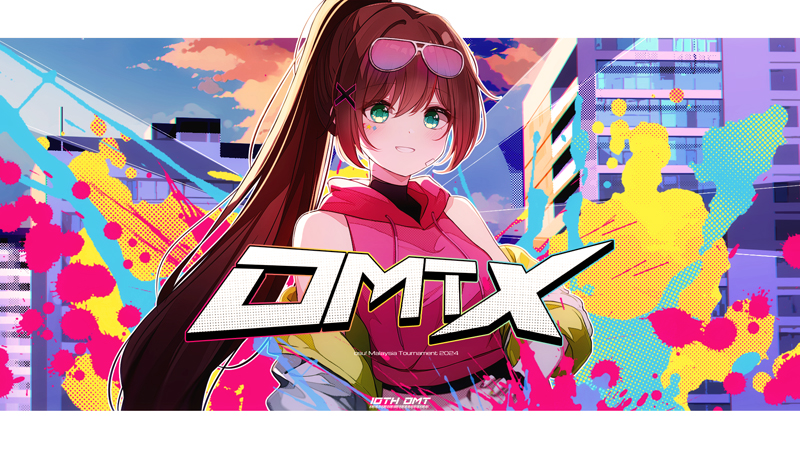
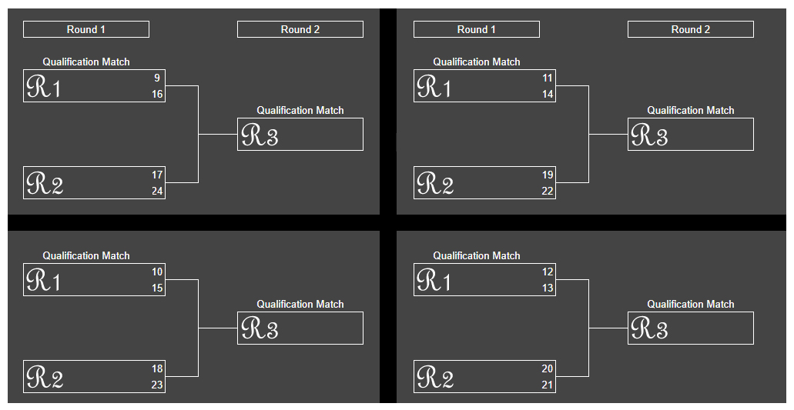

---
tags:
  - OMT X
  - OMT 10
---

# osu! Malaysia Tournament X

The **osu! Malaysia Tournament X** (OMT X) was a double-elimination 1v1 osu! tournament hosted by ::{ flag=MY }:: [Sagisawa Arisu](https://osu.ppy.sh/users/9364594). The tournament was open to all players from Malaysia with a global rank of #99,999 or higher in the osu! game mode. It was the tenth iteration of the osu! Malaysia Tournament.

## Tournament schedule

| Event | Timestamp |
| --: | :-- |
| Registration phase | 2024-08-01/2024-08-16 |
| Screening phase | 2024-08-17/2024-08-25 |
| Qualifiers | 2024-08-26/2024-09-01 |
| Runoff brackets | 2024-09-02/2024-09-08 |
| Round of 16 | 2024-09-09/2024-09-15 |
| Quarterfinals | 2024-09-16/2024-09-22 |
| Semifinals | 2024-09-23/2024-09-29 |
| Finals (week 1) | 2024-09-30/2024-10-06 |
| Finals (week 2) | 2024-10-07/2024-10-13 |

## Prizes

| Placing | Prize(s) |
| :-: | :-- |
|  | 200 MYR, exclusive one-off merchandise package, unique profile badge |
|  | 150 MYR |
|  | 100 MYR |

## Organisation

The osu! Malaysia Tournament X was run by various osu! community members from Malaysia and beyond.

| Position | Member(s) |
| :-- | :-- |
| Host | ::{ flag=MY }:: [Sagisawa Arisu](https://osu.ppy.sh/users/9364594) |
| Co-host | ::{ flag=MY }:: [Iyouka](https://osu.ppy.sh/users/7138499), ::{ flag=MY }:: [Amamiya Kokoro](https://osu.ppy.sh/users/9534110) |
| Mappool selector | ::{ flag=MY }:: [Sagisawa Arisu](https://osu.ppy.sh/users/9364594), ::{ flag=VN }:: [realshin](https://osu.ppy.sh/users/8006029), ::{ flag=HK }:: [maxbireo](https://osu.ppy.sh/users/4682646) |
| Custom mapper | ::{ flag=MY }:: [Mahiru Shiina](https://osu.ppy.sh/users/13866023), ::{ flag=MY }:: [\[ -Elaina- \]](https://osu.ppy.sh/users/13893348), ::{ flag=MY }:: [Banner](https://osu.ppy.sh/users/14290988), ::{ flag=MY }:: [Agagak](https://osu.ppy.sh/users/3645490), ::{ flag=MY }:: [anjay](https://osu.ppy.sh/users/15553329), ::{ flag=MY }:: [Stick2Glue](https://osu.ppy.sh/users/6928574), ::{ flag=MY }:: [Kardshark](https://osu.ppy.sh/users/4724315), ::{ flag=MY }:: [\[ Fiz \]](https://osu.ppy.sh/users/6928574) |
| Custom map quality assurance | ::{ flag=MY }:: [Tzero](https://osu.ppy.sh/users/6088976) |
| Streamer | ::{ flag=MY }:: [Sagisawa Arisu](https://osu.ppy.sh/users/9364594), ::{ flag=MY }:: [-Shiran-](https://osu.ppy.sh/users/9773374), ::{ flag=MY }:: [Iyouka](https://osu.ppy.sh/users/7138499), ::{ flag=NZ }:: [Hand Sanitiser](https://osu.ppy.sh/users/5091293), ::{ flag=AU }:: [dGeist](https://osu.ppy.sh/users/7262064) |
| Commentator | ::{ flag=MY }:: [Tzero](https://osu.ppy.sh/users/6088976), ::{ flag=MY }:: [Racers03](https://osu.ppy.sh/users/11621976), ::{ flag=MY }:: [Fancyyy](https://osu.ppy.sh/users/12616268), ::{ flag=MY }:: [VenDService](https://osu.ppy.sh/users/15107940), ::{ flag=MY }:: [lous](https://osu.ppy.sh/users/6231292), ::{ flag=ID }:: [BlankTap](https://osu.ppy.sh/users/10137131) |
| Referee | ::{ flag=MY }:: [Sagisawa Arisu](https://osu.ppy.sh/users/9364594), ::{ flag=MY }:: [Racers03](https://osu.ppy.sh/users/11621976), ::{ flag=MY }:: [Rumah](https://osu.ppy.sh/users/12086495), ::{ flag=MY }:: [dragonlemmy](https://osu.ppy.sh/users/14053835), ::{ flag=SG }:: [Quickeryes](https://osu.ppy.sh/users/18227681), ::{ flag=NZ }:: [Hand Sanitiser](https://osu.ppy.sh/users/5091293) |
| Graphic designer | ::{ flag=MY }:: [Iyouka](https://osu.ppy.sh/users/7138499), ::{ flag=MY }:: [R3aCt10n](https://osu.ppy.sh/users/17020051), ::{ flag=SG }:: [Polytetral](https://osu.ppy.sh/users/8612061), ::{ flag=AU }:: [Merami Kitten](https://osu.ppy.sh/users/11523326) |
| Spreadsheet manager | ::{ flag=MY }:: [Sagisawa Arisu](https://osu.ppy.sh/users/9364594) |
| Character illustrator | ::{ flag=MY }:: [guwichiee](https://osu.ppy.sh/users/12170475), ::{ flag=MY }:: th_nore [(↗)](https://twitter.com/th_nore) |
| Wiki editor | ::{ flag=ID }:: [Niva](https://osu.ppy.sh/users/197805) |

## Links

- **[Master spreadsheet](https://docs.google.com/spreadsheets/d/1tJIry9tAr7wfQGvh071pdKB6QrLIPep8hd444j0UWik/edit?gid=0#gid=0)**
- [Forum thread](https://osu.ppy.sh/community/forums/topics/1956725)
- [Discord server](https://discord.gg/nKthrPUahJ)
- [Challonge brackets](https://challonge.com/omtX)
- [Livestream channel](https://www.twitch.tv/osumalaysia)

## Participants

Listed below are the players who managed to qualify into the tournament proper (along with their respective seed number and aggregated Z-score across all eleven Qualifier beatmaps) out of 45 participating players in total.

The complete list of player registrations can be found [here](https://docs.google.com/spreadsheets/d/1tJIry9tAr7wfQGvh071pdKB6QrLIPep8hd444j0UWik/edit?gid=0#gid=0).

| Seed no. | Player | Z-score |
| :-- | :-- | :-- |
| 1 | ::{ flag=MY }:: [wuhua](https://osu.ppy.sh/users/2932510) | +21.53 |
| 2 | ::{ flag=MY }:: [Lunasa](https://osu.ppy.sh/users/16436446) | +21.36 |
| 3 | ::{ flag=MY }:: [Rampax](https://osu.ppy.sh/users/3995630) | +19.34 |
| 4 | ::{ flag=MY }:: [AHotDawg](https://osu.ppy.sh/users/15271985) | +14.50 |
| 5 | ::{ flag=MY }:: [Breast](https://osu.ppy.sh/users/11918602) | +13.88 |
| 6 | ::{ flag=MY }:: [Auxuelus](https://osu.ppy.sh/users/5414124) | +10.39 |
| 7 | ::{ flag=MY }:: [Chibi Maruko](https://osu.ppy.sh/users/5585377) | +10.34 |
| 8 | ::{ flag=MY }:: [ohshitweeb](https://osu.ppy.sh/users/12999285) | +7.75 |
| 9 | ::{ flag=MY }:: [DuoX](https://osu.ppy.sh/users/9560694) | +6.83 |
| 10 | ::{ flag=MY }:: [stumphole145](https://osu.ppy.sh/users/14623152) | +6.43 |
| 11 | ::{ flag=MY }:: [Jolene](https://osu.ppy.sh/users/13626098) | +5.69 |
| 12 | ::{ flag=MY }:: [Snowy5441](https://osu.ppy.sh/users/13865320) | +4.18 |
| 13 | ::{ flag=MY }:: [Racers03](https://osu.ppy.sh/users/11621976) | -0.21 |
| 14 | ::{ flag=MY }:: [Axorite](https://osu.ppy.sh/users/9124278) | -0.50 |
| 15 | ::{ flag=MY }:: [Addam](https://osu.ppy.sh/users/11716599) | -0.70 |
| 16 | ::{ flag=MY }:: [Inugami Korone](https://osu.ppy.sh/users/4474918) | -0.82 |
| 17 | ::{ flag=MY }:: [Chiyuu](https://osu.ppy.sh/users/8226107) | -0.88 |
| 18 | ::{ flag=MY }:: [Makise Kurisu](https://osu.ppy.sh/users/6996926) | -2.01 |
| 19 | ::{ flag=MY }:: [MadDdDio](https://osu.ppy.sh/users/15086959) | -2.31 |
| 20 | ::{ flag=MY }:: [a hotdog](https://osu.ppy.sh/users/8688777) | -2.52 |
| 21 | ::{ flag=MY }:: [W1nter1](https://osu.ppy.sh/users/23185001) | -3.51 |
| 22 | ::{ flag=MY }:: [-Shiran-](https://osu.ppy.sh/users/9773374) | -4.48 |
| 23 | ::{ flag=MY }:: [Atomium](https://osu.ppy.sh/users/19186968) | -4.77 |
| 24 | ::{ flag=MY }:: [VenDService](https://osu.ppy.sh/users/15107940) | -4.84 |

## Podium

## Mappools

### Finals (week 2)

- No Mod
  1. [Nishizawa Shiena - Brand-new World (Azunyan-) \[Keep-my Faith TURBO\]](https://osu.ppy.sh/beatmapsets/1375480#osu/2843144)
  2. [Fleshgod Apocalypse - The Fool (Camo) \[morphne's Extreme\]](https://osu.ppy.sh/beatmapsets/2027968#osu/4316417)
  3. [Fujikawa Chiai - Watashi ni nite inai Kanojo (Mirash) \[nikita govnof\]](https://osu.ppy.sh/beatmapsets/1923720#osu/3971313)
  4. [HAKUSHI HASEGAWA - Desert (Halgoh) \[Mirage\]](https://osu.ppy.sh/beatmapsets/1417973#osu/2921554)
  5. [ARM - Rhododendron (yaspo) \[wacky\]](https://osu.ppy.sh/beatmapsets/1633222#osu/3333701)
- Hidden
  1. [inabakumori - Tsukuri Kake no Shinshou (0ugi) \[\| \|\]](https://osu.ppy.sh/beatmapsets/1248914#osu/2595770)
  2. [ZUN - Eiya no Mukui ~ Imperishable Night (Halfslashed) \[Extra Stage\]](https://osu.ppy.sh/beatmapsets/1850928#osu/3802323)
  3. [BEXEY & GHOSTEMANE - SHIBARI (Prod. Mikey The Magician) (KPMY) \[OMTX HD3\]](https://osu.ppy.sh/beatmapsets/2261768#osu/4814105)
- Hard Rock
  1. [Kotone - Kagome (\[ -Elaina- \]) \[Rhyme\]](https://osu.ppy.sh/beatmapsets/2261770#osu/4814112)
  2. [Casandra - Junpaku\*study time (Xexxar) \[Semi Little Girl!\]](https://osu.ppy.sh/beatmapsets/637224#osu/1351956)
  3. [MYUKKE. - Anti Safety Zone (xLolicore-) \[Loli & Ducky's Hell Extra\]](https://osu.ppy.sh/beatmapsets/2041230#osu/4258540)
- Double Time
  1. [Masayoshi Minoshima - Highly Responsive to Prayer feat. Mei Ayakura (Sanch-KK) \[Extra Stage\]](https://osu.ppy.sh/beatmapsets/2017861#osu/4371128)
  2. [Denkishiki Karen Ongaku Shuudan - Distorted Pain (Kurashina Asuka) \[Ruination\]](https://osu.ppy.sh/beatmapsets/1764045#osu/3610653)
  3. [Unlucky Morpheus - FAITH (Kyubey) \[Kite's Lunatic\]](https://osu.ppy.sh/beatmapsets/418441#osu/1043089)
  4. [Lia - Tori no Uta (Luscent) \[Air\]](https://osu.ppy.sh/beatmapsets/1836970#osu/3771851)
- Free Mod
  1. [xi - FREEDOM DiVE (Aistre) \[DeviousPanda's MAXiMUM\]](https://osu.ppy.sh/beatmapsets/1667560#osu/3503023)
  2. [Konosuke Enosuke - Tenkaranbu (Chizu-Kun) \[Celestial\]](https://osu.ppy.sh/beatmapsets/1625132#osu/3317900)
  3. [Falcom Sound Team jdk - RELEASE OF THE FAR WEST OCEAN (CSY the corrupt) \[Corruption\]](https://osu.ppy.sh/beatmapsets/77504#osu/217493)
- EX/Special
  1. [Yuta Imai vs. Qlarabelle - ALTER EGO (Kardshark) \[\~\]](https://osu.ppy.sh/beatmapsets/2261771#osu/4814113)[^ex-fw2-1]
  2. [Maeda Jun - Sea,You Next (kodama) \[Umi\]](https://osu.ppy.sh/beatmapsets/1719266#osu/3513478)[^ex-fw2-2]
- Tiebreaker
  1. **[Altermis - \<O.M.T\> // ABSOLUTE-MEGAREMIX // (Banner) \[\< X \>\]](https://osu.ppy.sh/beatmapsets/2261761#osu/4814087)**

### Finals (week 1)

- No Mod
  1. [Aitsuki Nakuru & A than\_Lily - Watashi ga Watashi ni Itatta 10 no Riyuu (defiance) \[brain damage\]](https://osu.ppy.sh/beatmapsets/1490689#osu/3055643)
  2. [Camellia feat. Aitsuki Nakuru - Oborozuki Oou Kumo wo mo Sakinu (\[ -Elaina- \]) \[Moonlight\]](https://osu.ppy.sh/beatmapsets/2257870#osu/4804348)
  3. [Mio Yamazaki - Byoushin Zenkai Girl (Sparhten) \[Keep Going Forward\]](https://osu.ppy.sh/beatmapsets/1402550#osu/2893305)
  4. [Tsukidono & Takana - Extraordinary Future (Arushii09) \[Extraordinary nm4\]](https://osu.ppy.sh/beatmapsets/2055744#osu/4295723)
  5. [Inferi - Onslaught of the Covenant (revoh) \[Expert\]](https://osu.ppy.sh/beatmapsets/1764590#osu/3611958)
- Hidden
  1. [Sayuri - Heikousen (Meg) \[taboo\]](https://osu.ppy.sh/beatmapsets/661458#osu/1400367)
  2. [inabakumori - Float Play (-Stocking) \[Drifting\]](https://osu.ppy.sh/beatmapsets/1921679#osu/3966597)
  3. [32ki feat. Hatsune Miku & Kasane Teto - Mesmerizer (Nathan) \[hypnosis\]](https://osu.ppy.sh/beatmapsets/2215986#osu/4695360)
- Hard Rock
  1. [the peggies - Highlight Highlight (Vanya2) \[Bloom\]](https://osu.ppy.sh/beatmapsets/1789615#osu/3666952)
  2. [IOSYS - Utage wa Eien ni (Bloxi) \[The Feast Never Ends\]](https://osu.ppy.sh/beatmapsets/1876060#osu/3860777)
  3. [lapix - Tribal Frontier (fooders) \[Prey of Cat\]](https://osu.ppy.sh/beatmapsets/2049028#osu/4278153)
- Double Time
  1. [Petit Rabbit's - Tenkuu Cafeteria (LeQuack) \[Rabbit House\]](https://osu.ppy.sh/beatmapsets/1321688#osu/2737694)
  2. [yuikonnu & ayaponzu\* - Super Nuko World (AllStar12) \[Insane\]](https://osu.ppy.sh/beatmapsets/153776#osu/476149)
  3. [ABBA - Dancing Queen (Nijika Ijichi) \[Insane\]](https://osu.ppy.sh/beatmapsets/2039555#osu/4254363)
  4. [Complexive - Paft Dunk (thiev) \[Collab\]](https://osu.ppy.sh/beatmapsets/2091688#osu/4384362)
- Free Mod
  1. [UNDEAD CORPORATION - Everything Will Freeze II (Camo) \[LMT's Extra\]](https://osu.ppy.sh/beatmapsets/1512410#osu/3276914)
  2. [NayutalieN - Ray Tuning (hifu) \[cs5\]](https://osu.ppy.sh/beatmapsets/1814354#osu/3724231)
  3. [DeadballP - Xepher Light and Darkness Dragon REMIX (hammyMyRammy) \[Expert\]](https://osu.ppy.sh/beatmapsets/1518281#osu/3108004)
- EX/Special
  1. [IOSYS - Cirno's Perfect Math Class (Louis Cyphre) \[TAG4\]](https://osu.ppy.sh/beatmapsets/25739#osu/87570)[^ex-fw1-1]
  2. [TSUNKU - Rhythm Heaven Fever Remix 10 Perfect Version (Sinnoh) \[Rhythm Hell\]](https://osu.ppy.sh/beatmapsets/1503327#osu/3079907)[^ex-fw1-2]
- Tiebreaker
  1. **[LeaF - Calamity Fortune (extended ver.) (Guchiry) \[Deconstruction\]](https://osu.ppy.sh/beatmapsets/1626172#osu/3320026)**

### Semifinals

- No Mod
  1. [AliA - impulse (SkyFlame) \[Emotions\]](https://osu.ppy.sh/beatmapsets/1133470#osu/2367231)
  2. [Aether Realm - Swampwitch (iamtickrate) \[Blood9's Extreme\]](https://osu.ppy.sh/beatmapsets/1556131#osu/3412256)
  3. [PHOENIX Project - Mayonaka no Fairy Dance - Reflect The Reques (Settia) \[luna child is moe\]](https://osu.ppy.sh/beatmapsets/1809371#osu/3711134)
  4. [PSYQUI feat. mikanzil - Bye or not (Typ4) \[Typ4 x Aqua-FISH's Final Farewell\]](https://osu.ppy.sh/beatmapsets/1013719#osu/2133938)
  5. [Sorry about my face - Call me with you (fergas) \[[ya otpravlus' za toboi]\]](https://osu.ppy.sh/beatmapsets/1621877#osu/3311312)
- Hidden
  1. [Rita - dorchadas (Raijodo) \[htonrahS\]](https://osu.ppy.sh/beatmapsets/2119488#osu/4470172)
  2. [paraoka feat. haru*nya - Manimani (Cut ver.) (Cellina) \[Hananoiro\]](https://osu.ppy.sh/beatmapsets/2008891#osu/4179280)
  3. [takehirotei - Finale Battle of the Requiem \~incandescent\~ (Banner) \[\~alea jacta est\~\]](https://osu.ppy.sh/beatmapsets/2254601#osu/4795986)
- Hard Rock
  1. [Ouse Akira - Sacrifice (Poyoyo) \[bongo's Milking Extra\]](https://osu.ppy.sh/beatmapsets/1877093#osu/3977159)
  2. [MYUKKE. - AI[UE]OON (Lavender) \[wyrio's FUTURE\]](https://osu.ppy.sh/beatmapsets/1029473#osu/2936229)
  3. [Mitsukiyo - Summer Bounce (Ayesha Altugle) \[Summer Vacation\]](https://osu.ppy.sh/beatmapsets/2214677#osu/4692588)
- Double Time
  1. [Sasaki Sayaka - Sakura, Reincarnation (Kowari) \[Insane\]](https://osu.ppy.sh/beatmapsets/1022979#osu/2139973)
  2. [TERRASPEX - AMAZING BREAK (Orkay) \[INSANE\]](https://osu.ppy.sh/beatmapsets/2128375#osu/4474828)
  3. [Wednesday Campanella - Ikkyu-san (Striderin) \[Insane\]](https://osu.ppy.sh/beatmapsets/1108064#osu/2315806)
- Free Mod
  1. [Denkishiki Karen Ongaku Shuudan - Gareki no Yume (Dored) \[LMT's Expert\]](https://osu.ppy.sh/beatmapsets/1037741#osu/2180986)
  2. [Hoskey - The Purified (dectopia) \[Extra\]](https://osu.ppy.sh/beatmapsets/1809432#osu/3711270)
- EX/Special
  1. [Rokudenashi - As you don't know (Stick2Glue) \[Memory Loss\]](https://osu.ppy.sh/beatmapsets/2254978#osu/4796876)[^ex-sf-1]
  2. [Wobbly - Yo Yo Yo Yoyo Yo, Hey... / Uhh, Hey Eh. Check It Check It (dsco) \[Insane\]](https://osu.ppy.sh/beatmapsets/1689255#osu/3452047)[^ex-sf-2]
- Tiebreaker
  1. **[Down - Chosun (Down) \[Dragon\]](https://osu.ppy.sh/beatmapsets/1833547#osu/3764203)**

### Quarterfinals

- No Mod
  1. [KISIDA KYODAN & THE AKEBOSI ROCKETS - EGOISTIC HERO (DMK7) \[EGOIST\]](https://osu.ppy.sh/beatmapsets/2118474#osu/4449471)
  2. [BABYMETAL - Arkadia (ItsWinter) \[kerupt's Extreme\]](https://osu.ppy.sh/beatmapsets/1695872#osu/3616426)
  3. [Matsushita - Hey Darling! (cocona) \[Contrary Love\]](https://osu.ppy.sh/beatmapsets/1517986#osu/3107475)
  4. [lapix - Outer Space (lcfc) \[Extreme\]](https://osu.ppy.sh/beatmapsets/1544179#osu/3156268)
  5. [69 de 74 - DESPERATE DEATHPARADE (rollpan) \[EXTRA\]](https://osu.ppy.sh/beatmapsets/1939881#osu/4010877)
- Hidden
  1. [DUSTCELL - Kako no Shinkirou (Banner) \[Mirage\]](https://osu.ppy.sh/beatmapsets/2250667#osu/4786529)
  2. [beignet - Maple Trick (Agagak) \[extrA\]](https://osu.ppy.sh/beatmapsets/2250698#osu/4786597)
  3. [Polyphia - The Audacity (feat. Anomalie) (Mir) \[Outrageous\]](https://osu.ppy.sh/beatmapsets/1995091#osu/4146216)
- Hard Rock
  1. [fulusu - Lachrymal Gland (Heroine) \[Expert\]](https://osu.ppy.sh/beatmapsets/1824223#osu/3743174)
  2. [Slime Girls - Underwater Prom Queens (Magirhythm) \[Fury\]](https://osu.ppy.sh/beatmapsets/1455879#osu/3004117)
  3. [Lanndo feat. Eve, suis (from Yorushika) - Uchuu no Kisetsu (Akito) \[bike 2\]](https://osu.ppy.sh/beatmapsets/1531445#osu/3132160)
- Double Time
  1. [Mitsuki Kotono - Fuyu ni Saku Hana (mnyui) \[Suou's Insane\]](https://osu.ppy.sh/beatmapsets/1297024#osu/2696241)
  2. [-45 - Millarca (Stick2Glue) \[Malice\]](https://osu.ppy.sh/beatmapsets/1833512#osu/3764144)
  3. [Noisestorm - Crab Rave (GreenHue) \[SOTARKS IS GONE\]](https://osu.ppy.sh/beatmapsets/891596#osu/1906336)
- Free Mod
  1. [M2U & NICODE - Myosotis (feat. Guriri & Lucy) (rollpan) \[Himei\]](https://osu.ppy.sh/beatmapsets/1861030#osu/3826131)
  2. [Hyadain - CRASH!! (Let's Do It) (Aranel) \[CRASH!!\]](https://osu.ppy.sh/beatmapsets/1626624#osu/3322444)
- EX/Special
  1. [tohko - Hatsukoi (Deppyforce) \[Destiny?\]](https://osu.ppy.sh/beatmapsets/1993734#osu/4143140)[^ex-qf-1]
  2. [KillerBlood - Run Lads Run (Mr HeliX) \[Math Test\]](https://osu.ppy.sh/beatmapsets/1492125#osu/3058683)[^ex-qf-2]
- Tiebreaker
  1. **[Receptor - Redstar (Raikozen) \[REALITY ECLIPSE\]](https://osu.ppy.sh/beatmapsets/996649#osu/2084661)**

### Round of 16

- No Mod
  1. [Hujan - Mencari Konklusi (anjay) \[Ketenangan\]](https://osu.ppy.sh/beatmapsets/2246786#osu/4777025)
  2. [Sabaton - Twilight Of The Thunder God (-Mack-) \[Your destiny awaits!\]](https://osu.ppy.sh/beatmapsets/1994917#osu/4145857)
  3. [Sakuzyo - Ultimate Force (Banner) \[Absolution\]](https://osu.ppy.sh/beatmapsets/2246785#osu/4777024)
  4. [AJURIKA - BIG som tam (KKipalt) \[:drool:\]](https://osu.ppy.sh/beatmapsets/1833709#osu/3764497)
  5. [yama - Shikisai (Akito) \[bond\]](https://osu.ppy.sh/beatmapsets/1926251#osu/3977485)
- Hidden
  1. [PSYQUI - Hype feat. Such (lapix Remix) (Mir) \[Seeing Stars\]](https://osu.ppy.sh/beatmapsets/830537#osu/1740092)
  2. [Kotoha - Cat Loving (Kotoha) \[bongo's Insane\]](https://osu.ppy.sh/beatmapsets/1809604#osu/3711612)
- Hard Rock
  1. [Hinami Mei - Asu o Asare (gazimal) \[You & I\]](https://osu.ppy.sh/beatmapsets/1704302#osu/3482459)
  2. [Special Guest - Views (squirrelpascals) \[Tits\]](https://osu.ppy.sh/beatmapsets/556274#osu/1177274)
- Double Time
  1. [Yuika - Suki Dakara. (feat. Ren) (Airiesu) \[Won't you stay by my side forever?\]](https://osu.ppy.sh/beatmapsets/1610462#osu/3288202)
  2. [Aphex Twin - Flim (PandaHero) \[Insane\]](https://osu.ppy.sh/beatmapsets/998953#osu/2089279)
  3. [Giga x TENKOMORI - Netoge Haijin Sprechchor (Cut Ver.) (Ixcors) \[Insane (AR8.5 Edit)\]](https://osu.ppy.sh/beatmapsets/1615815#osu/4024733)
- Free Mod
  1. [Schwank - OPEN YOUR 3RD EYE (Amamya Kokoro) \[Heartfelt Burst\]](https://osu.ppy.sh/beatmapsets/2040473#osu/4256603)
  2. [TAG - Theory of Eternity (kiddly) \[Extra\]](https://osu.ppy.sh/beatmapsets/35224#osu/227061)
- EX/Special
  1. [in love with a ghost - interdimensional portal leading to a cute place feat. snail's house (Voltaeyx) \[[2B] A Dazzling Discovery\]](https://osu.ppy.sh/beatmapsets/1901782#osu/3920710)[^ex-ro16-1]
  2. [yugurr - Spinner Training (SaintTurk) \[Training\]](https://osu.ppy.sh/beatmapsets/410231#osu/890326)[^ex-ro16-2]
- Tiebreaker
  1. **[E0ri4 - L0V3 4RR0W 5H007 (Strategas) \[H4PP1N355\]](https://osu.ppy.sh/beatmapsets/1889263#osu/3891073)**

### Runoff brackets

- No Mod
  1. [Shiino Kotone (CV: Kanako) - Ashita no Koto. (Garden) \[Extra\]](https://osu.ppy.sh/beatmapsets/1902629#osu/3922591)
  2. [Lime / Kankitsu - Pixel Princess (Wavewy) \[Extra\]](https://osu.ppy.sh/beatmapsets/2129838#osu/4478624)
  3. [yuikonnu x sana - Fuzzy Future (Aeril) \[Meg's Extra\]](https://osu.ppy.sh/beatmapsets/545956#osu/1652184)
  4. [PSYQUI - Still in my heart feat. Punipuni Denki (Kyuuchie) \[Moecho & Amateurre's sanaol "Expert"\]](https://osu.ppy.sh/beatmapsets/1698303#osu/3526945)
- Hidden
  1. [MYTH & ROID - L.L.L. (Kalibe) \[Lust\]](https://osu.ppy.sh/beatmapsets/908637#osu/1895993)
  2. [Azari - Black Out (Ryuusei Aika) \[----\]](https://osu.ppy.sh/beatmapsets/1965625#osu/4075902)
- Hard Rock
  1. [Shika-bu - Shikairo Days (iljaaz) \[shikanokonokonokokoshitantan\]](https://osu.ppy.sh/beatmapsets/2211791#osu/4685545)
  2. [Machita Chima - KING (achyoo) \[Hamster Ass\]](https://osu.ppy.sh/beatmapsets/1306528#osu/2708875)
- Double Time
  1. [EGOIST - Saigo no Hanabira (The meaning of love) (anna apple) \[kakifly's Insane\]](https://osu.ppy.sh/beatmapsets/1494327#osu/3346524)
  2. [x0o0x\_ - Big Brother (Luscent) \[YOKES' HARD Mix\]](https://osu.ppy.sh/beatmapsets/1120687#osu/2521562)
- Free Mod
  1. [cosMo@BousouP feat. Hatsune Miku - Machinegun Poem Doll (Zoli) \[Extra\]](https://osu.ppy.sh/beatmapsets/1606218#osu/3292028)
  2. [xi - Caramel Custard (sullywally) \[Extra\]](https://osu.ppy.sh/beatmapsets/1007007#osu/2108885)
- EX/Special
  1. [Momohara Natsuki (CV: Murakawa Rie) - Natsuzora Yell (TV Size) (lootk) \[Insane\]](https://osu.ppy.sh/beatmapsets/943522#osu/2014193)[^ex-runoff]
- Tiebreaker
  1. **[B-Complex - Acid Trip (Zetera) \[Sepsis\]](https://osu.ppy.sh/beatmapsets/1339332#osu/2774775)**  

### Qualifiers

- No Mod
  1. [MY FIRST STORY - Shuuen Requiem (SkyFlame) \[Expressionless\]](https://osu.ppy.sh/beatmapsets/1296338#osu/2689633)
  2. [Xi - Youyoumu ~ Run or Dash (OldEclipse) \[CS4\]](https://osu.ppy.sh/beatmapsets/1918615#osu/4005731)
  3. [NewJeans - ETA (Nidasimno) \[T24:00:00.000Z\]](https://osu.ppy.sh/beatmapsets/2120186#osu/4454352)
  4. [YOASOBI - Idol (Cocoyu) \[Deception\]](https://osu.ppy.sh/beatmapsets/1975074#osu/4099092)
- Hidden
  1. [Power Of Nature - QuoN (Down) \[Extra\]](https://osu.ppy.sh/beatmapsets/1587936#osu/3243179)
  2. [Hige Driver - ukigumo (Lude) \[ddm & Lude's Extra\]](https://osu.ppy.sh/beatmapsets/1827928#osu/3928631)
- Hard Rock
  1. [Reku Mochizuki - VEZZELiX (Chaoslitz) \[MARCOBROLO'S EXTRA\]](https://osu.ppy.sh/beatmapsets/1871929#osu/3868452)
  2. [School Food Punishment - fiction nonfiction (Garden) \[Expert\]](https://osu.ppy.sh/beatmapsets/1829347#osu/3754547)
- Double Time
  1. [Uzuki Shimamura (CV: Ayaka Ohashi) - Hanikami days (Setz) \[M\@STER\]](https://osu.ppy.sh/beatmapsets/1585091#osu/3237674)
  2. [Touno Sakura - PRIZM/CIRCUiT (Muchin) \[Summer, Memories, Love Story!\]](https://osu.ppy.sh/beatmapsets/2142220#osu/4509159)
  3. [Tsukuyomi - Moonlight at midday (Seros) \[Setu's Insane\]](https://osu.ppy.sh/beatmapsets/1537310#osu/3185210)

## Match results

### Finals (week 2)

Saturday, 12 October 2024:

| Bracket | Player 1 |  |  | Player 2 | Match link |
| :-: | --: | :-: | :-: | :-- | :-- |
| Lower | **[Rampax](https://osu.ppy.sh/users/13626098)** ::{ flag=MY }:: | **7** | 4 | ::{ flag=MY }:: [Lunasa](https://osu.ppy.sh/users/12999285) | [#1](https://osu.ppy.sh/community/matches/115836997) |

Sunday, 13 October 2024:

| Bracket | Player 1 |  |  | Player 2 | Match link |
| :-: | --: | :-: | :-: | :-- | :-- |
| Grand Final | [wuhua](https://osu.ppy.sh/users/2932510) ::{ flag=MY }:: | 4 | **7** | ::{ flag=MY }:: **[Rampax](https://osu.ppy.sh/users/13626098)** | [#1](https://osu.ppy.sh/community/matches/115838167) |
| Grand Final (bracket reset) | [Rampax](https://osu.ppy.sh/users/13626098) ::{ flag=MY }:: | 4 | **7** | ::{ flag=MY }:: **[wuhua](https://osu.ppy.sh/users/2932510)** | [#1](https://osu.ppy.sh/community/matches/115839526) |

### Finals (week 1)

Saturday, 5 October 2024:

| Bracket | Player 1 |  |  | Player 2 | Match link |
| :-: | --: | :-: | :-: | :-- | :-- |
| Lower | [Breast](https://osu.ppy.sh/users/11918602) ::{ flag=MY }:: | 2 | **7** | ::{ flag=MY }:: **[Chibi Maruko](https://osu.ppy.sh/users/5585377)** | [#1](https://osu.ppy.sh/community/matches/115745125) |
| Lower | **[Lunasa](https://osu.ppy.sh/users/12999285)** ::{ flag=MY }:: | **7** | 1 | ::{ flag=MY }:: [AHotDawg](https://osu.ppy.sh/users/15271985) | [#1](https://osu.ppy.sh/community/matches/115743535) |

Sunday, 6 October 2024:

| Bracket | Player 1 |  |  | Player 2 | Match link |
| :-: | --: | :-: | :-: | :-- | :-- |
| Upper | **[wuhua](https://osu.ppy.sh/users/2932510)** ::{ flag=MY }:: | **7** | 4 | ::{ flag=MY }:: [Rampax](https://osu.ppy.sh/users/13626098) | [#1](https://osu.ppy.sh/community/matches/115745112) |
| Lower | [Chibi Maruko](https://osu.ppy.sh/users/5585377) ::{ flag=MY }:: | 6 | **7** | ::{ flag=MY }:: **[Lunasa](https://osu.ppy.sh/users/12999285)** | [#1](https://osu.ppy.sh/community/matches/115759255) |

### Semifinals

Friday, 27 September 2024:

| Bracket | Player 1 |  |  | Player 2 | Match link |
| :-: | --: | :-: | :-: | :-- | :-- |
| Lower | [ohshitweeb](https://osu.ppy.sh/users/12999285) ::{ flag=MY }:: | 2 | **6** | ::{ flag=MY }:: **[Jolene](https://osu.ppy.sh/users/13626098)** | [#1](https://osu.ppy.sh/community/matches/115647570) |
| Lower | **[Chibi Maruko](https://osu.ppy.sh/users/5585377)** ::{ flag=MY }:: | **6** | 2 | ::{ flag=MY }:: [Snowy5441](https://osu.ppy.sh/users/13865320) | [#1](https://osu.ppy.sh/community/matches/115648452) |

Saturday, 28 September 2024:

| Bracket | Player 1 |  |  | Player 2 | Match link |
| :-: | --: | :-: | :-: | :-- | :-- |
| Upper | [Lunasa](https://osu.ppy.sh/users/12999285) ::{ flag=MY }:: | 5 | **6** | ::{ flag=MY }:: **[Rampax](https://osu.ppy.sh/users/13626098)** | [#1](https://osu.ppy.sh/community/matches/115663965) |
| Lower | **[AHotDawg](https://osu.ppy.sh/users/15271985)** ::{ flag=MY }:: | **6** | 1 | ::{ flag=MY }:: [stumphole145](https://osu.ppy.sh/users/14623152) | [#1](https://osu.ppy.sh/community/matches/115662145) |
| Lower | [Auxuelus](https://osu.ppy.sh/users/5414124) ::{ flag=MY }:: | 5 | **6** | ::{ flag=MY }:: **[Chiyuu](https://osu.ppy.sh/users/8226107)** | [#1](https://osu.ppy.sh/community/matches/115663054) |
| Upper | **[wuhua](https://osu.ppy.sh/users/2932510)** ::{ flag=MY }:: | **6** | 0 | ::{ flag=MY }:: [Breast](https://osu.ppy.sh/users/11918602) | [#1](https://osu.ppy.sh/community/matches/115662104) |

Sunday, 29 September 2024:

| Bracket | Player 1 |  |  | Player 2 | Match link |
| :-: | --: | :-: | :-: | :-- | :-- |
| Lower | [Chiyuu](https://osu.ppy.sh/users/8226107) ::{ flag=MY }:: | 2 | **6** | ::{ flag=MY }:: **[Chibi Maruko](https://osu.ppy.sh/users/5585377)** | [#1](https://osu.ppy.sh/community/matches/115677859) |
| Lower | **[AHotDawg](https://osu.ppy.sh/users/15271985)** ::{ flag=MY }:: | **6** | 4 | ::{ flag=MY }:: [Jolene](https://osu.ppy.sh/users/13626098) | [#1](https://osu.ppy.sh/community/matches/115673985) |

### Quarterfinals

Thursday, 19 September 2024:

| Bracket | Player 1 |  |  | Player 2 | Match link |
| :-: | --: | :-: | :-: | :-- | :-- |
| Lower | [Axorite](https://osu.ppy.sh/users/9124278) ::{ flag=MY }:: | 4 | **6** | ::{ flag=MY }:: **[Jolene](https://osu.ppy.sh/users/13626098)** | [#1](https://osu.ppy.sh/community/matches/115551388) |

Saturday, 21 September 2024:

| Bracket | Player 1 |  |  | Player 2 | Match link |
| :-: | --: | :-: | :-: | :-- | :-- |
| Upper | **[wuhua](https://osu.ppy.sh/users/2932510)** ::{ flag=MY }:: | **6** | 1 | ::{ flag=MY }:: [ohshitweeb](https://osu.ppy.sh/users/12999285) | [#1](https://osu.ppy.sh/community/matches/115577375) |
| Lower | [Racers03](https://osu.ppy.sh/users/11621976) ::{ flag=MY }:: | 2 | **6** | ::{ flag=MY }:: **[Snowy5441](https://osu.ppy.sh/users/13865320)** | [#1](https://osu.ppy.sh/community/matches/115573793) |
| Upper | **[Rampax](https://osu.ppy.sh/users/3995630)** ::{ flag=MY }:: | **6** | 0 | ::{ flag=MY }:: [Auxuelus](https://osu.ppy.sh/users/5414124) | [#1](https://osu.ppy.sh/community/matches/115578132) |
| Upper | **[Lunasa](https://osu.ppy.sh/users/16436446)** ::{ flag=MY }:: | **6** | 3 | ::{ flag=MY }:: [Chibi Maruko](https://osu.ppy.sh/users/5585377) | [#1](https://osu.ppy.sh/community/matches/115579100) |
| Lower | **[Chiyuu](https://osu.ppy.sh/users/8226107)** ::{ flag=MY }:: | **6** | 0 | ::{ flag=MY }:: [DuoX](https://osu.ppy.sh/users/9560694) | *win by default* |
| Lower | [Addam](https://osu.ppy.sh/users/11716599) ::{ flag=MY }:: | 0 | **6** | ::{ flag=MY }:: **[stumphole145](https://osu.ppy.sh/users/1462315214623152)** | *win by default* |

Sunday, 22 September 2024:

| Bracket | Player 1 |  |  | Player 2 | Match link |
| :-: | --: | :-: | :-: | :-- | :-- |
| Upper | [AHotDawg](https://osu.ppy.sh/users/15271985) ::{ flag=MY }:: | 2 | **6** | ::{ flag=MY }:: **[Breast](https://osu.ppy.sh/users/11918602)** | [#1](https://osu.ppy.sh/community/matches/115589176) |

### Round of 16

Saturday, 14 September 2024:

| Bracket | Player 1 |  |  | Player 2 | Match link |
| :-: | --: | :-: | :-: | :-- | :-- |
| Upper | **[ohshitweeb](https://osu.ppy.sh/users/12999285)** ::{ flag=MY }:: | **5** | 4 | ::{ flag=MY }:: [DuoX](https://osu.ppy.sh/users/9560694) | [#1](https://osu.ppy.sh/community/matches/115490279) |
| Upper | **[Breast](https://osu.ppy.sh/users/11918602)** ::{ flag=MY }:: | **5** | 1 | ::{ flag=MY }:: [Snowy5441](https://osu.ppy.sh/users/13865320) | [#1](https://osu.ppy.sh/community/matches/115490326) |
| Upper | **[Rampax](https://osu.ppy.sh/users/3995630)** ::{ flag=MY }:: | **5** | 2 | ::{ flag=MY }:: [Axorite](https://osu.ppy.sh/users/9124278) | [#1](https://osu.ppy.sh/community/matches/115489335) |
| Upper | **[AHotDawg](https://osu.ppy.sh/users/15271985)** ::{ flag=MY }:: | **5** | 0 | ::{ flag=MY }:: [Racers03](https://osu.ppy.sh/users/11621976) | [#1](https://osu.ppy.sh/community/matches/115488463) |
| Upper | **[Auxuelus](https://osu.ppy.sh/users/5414124)** ::{ flag=MY }:: | **5** | 3 | ::{ flag=MY }:: [Jolene](https://osu.ppy.sh/users/13626098) | [#1](https://osu.ppy.sh/community/matches/115489315) |

Sunday, 15 September 2024:

| Bracket | Player 1 |  |  | Player 2 | Match link |
| :-: | --: | :-: | :-: | :-- | :-- |
| Upper | **[Chibi Maruko](https://osu.ppy.sh/users/5585377)** ::{ flag=MY }:: | **5** | 3 | ::{ flag=MY }:: [stumphole145](https://osu.ppy.sh/users/14623152) | [#1](https://osu.ppy.sh/community/matches/115504467) |
| Upper | **[wuhua](https://osu.ppy.sh/users/2932510)** ::{ flag=MY }:: | **5** | 0 | ::{ flag=MY }:: [Chiyuu](https://osu.ppy.sh/users/8226107) | [#1](https://osu.ppy.sh/community/matches/115506210) |
| Upper | **[Lunasa](https://osu.ppy.sh/users/16436446)** ::{ flag=MY }:: | **5** | 0 | ::{ flag=MY }:: [Addam](https://osu.ppy.sh/users/11716599) | *win by default* |

### Runoff brackets

Friday, 6 September 2024:

| Match classification | Player 1 |  |  | Player 2 | Match link |
| :-: | --: | :-: | :-: | :-- | :-- |
| R2 | **[Chiyuu](https://osu.ppy.sh/users/8226107)** ::{ flag=MY }:: | **5** | 2 | ::{ flag=MY }:: [VenDService](https://osu.ppy.sh/users/15107940) | [#1](https://osu.ppy.sh/community/matches/115382928) |
| R2 | **[MadDdDio](https://osu.ppy.sh/users/15086959)** ::{ flag=MY }:: | **5** | 1 | ::{ flag=MY }:: [-Shiran-](https://osu.ppy.sh/users/9773374) | [#1](https://osu.ppy.sh/community/matches/115385117) |

Saturday, 7 September 2024:

| Match classification | Team 1 |  |  | Team 2 | Match link |
| :-: | --: | :-: | :-: | :-- | :-- |
| R2 | [Makise Kurisu](https://osu.ppy.sh/users/6996926) ::{ flag=MY }:: | 2 | **5** | ::{ flag=MY }:: **[Atomium](https://osu.ppy.sh/users/19186968)** | [#1](https://osu.ppy.sh/community/matches/115401125) |
| R1 | **[Jolene](https://osu.ppy.sh/users/13626098)** ::{ flag=MY }:: | **5** | 1 | ::{ flag=MY }:: [Axorite](https://osu.ppy.sh/users/9124278) | [#1](https://osu.ppy.sh/community/matches/115414986) |
| R2 | **[a hotdog](https://osu.ppy.sh/users/8688777)** ::{ flag=MY }:: | **5** | 3 | ::{ flag=MY }:: [W1nter1](https://osu.ppy.sh/users/23185001) | [#1](https://osu.ppy.sh/community/matches/115413637) |
| R1 | **[stumphole145](https://osu.ppy.sh/users/14623152)** ::{ flag=MY }:: | **5** | 4 | ::{ flag=MY }:: [Addam](https://osu.ppy.sh/users/11716599) | [#1](https://osu.ppy.sh/community/matches/115400685) |
| R1 | **[DuoX](https://osu.ppy.sh/users/9560694)** ::{ flag=MY }:: | **5** | 1 | ::{ flag=MY }:: [Inugami Korone](https://osu.ppy.sh/users/4474918) | [#1](https://osu.ppy.sh/community/matches/115404426) |
| R1 | [Snowy5441](https://osu.ppy.sh/users/13865320) ::{ flag=MY }:: | 1 | **5** | ::{ flag=MY }:: **[Racers03](https://osu.ppy.sh/users/11621976)** | [#1](https://osu.ppy.sh/community/matches/115399896) |

Sunday, 8 September 2024:

| Match classification | Team 1 |  |  | Team 2 | Match link |
| :-: | --: | :-: | :-: | :-- | :-- |
| R3 | [Inugami Korone](https://osu.ppy.sh/users/4474918) ::{ flag=MY }:: | 2 | **5** | ::{ flag=MY }:: **[Chiyuu](https://osu.ppy.sh/users/8226107)** | [#1](https://osu.ppy.sh/community/matches/115412910) |
| R3 | **[Addam](https://osu.ppy.sh/users/11716599)** ::{ flag=MY }:: | **5** | 0 | ::{ flag=MY }:: [Atomium](https://osu.ppy.sh/users/19186968) | [#1](https://osu.ppy.sh/community/matches/115415362) |
| R3 | **[Snowy5441](https://osu.ppy.sh/users/13865320)** ::{ flag=MY }:: | **5** | 1 | ::{ flag=MY }:: [a hotdog](https://osu.ppy.sh/users/8688777) | [#1](https://osu.ppy.sh/community/matches/115416992) |
| R3 | **[Axorite](https://osu.ppy.sh/users/9124278)** ::{ flag=MY }:: | **5** | 2 | ::{ flag=MY }:: [MadDdDio](https://osu.ppy.sh/users/15086959) | [#1](https://osu.ppy.sh/community/matches/115416087) |

## Ruleset

### General rules

1. Match lobbies across the tournament will adhere to the following room settings:
   - Team Mode: `Head-to-head`
   - Win Condition: [`ScoreV2`](/wiki/Gameplay/Score#scorev2) (unless specified otherwise)
2. The mappools for each round will be announced by the tournament management in advance before the actual matches take place.
3. Match schedules will be predetermined by the tournament management. If there are any teams who are unable to attend the current schedule for any reason, all other affected teams may apply and settle for a reschedule at the `#scheduling` channel in the tournament's Discord server.
4. A referee will create a multiplayer room 10 minutes in advance and will start to send out invites.
5. If a player fails to show up within:
   - 5 minutes of the scheduled match time: Their opponent wins the `!roll` by default.
   - 10 minutes of the scheduled match time: The player loses their ban and their opponent gets to ban 2 maps in a row.
   - 15 minutes of the scheduled match time: Their opponent wins by default.
6. If no staff or referee is available, the match will be postponed.
7. **NoFail will be enforced in all beatmaps.** This is to ensure that the points are to be awarded more fairly towards teams who perform better in general during the course of the beatmap regardless of their remaining health at the end.
8. If a player disconnects, it will be treated as if they had failed the beatmap.
   - A beatmap can be replayed for disconnects that occur within 30 seconds after it has been started for a maximum of 2 times per match.
   - Subsequent disconnections and disconnections that occur after more than 30 seconds into a beatmap will be counted as an automatic loss for the disconnecting player.
9. Lag is not a valid reason to nullify a beatmap.
10. If any problems during the match occur, the tournament management will make a decision based on the referee's report.
11. It is expected that all players be polite and respectful to each other. Penalties will be given upon violation.
    - If a player is found to be engaging in an act that is deemed to be distasteful or provocative, the corresponding player or their team may be disqualified right away from the tournament and/or blacklisted from future iterations of the tournament by the tournament management.
    - Usage of any tools or programs that are against the [osu! community rules](/wiki/Rules#community-rules) is strictly prohibited and will be straight up reported to the osu! team at will.

### Tournament registration

1. Players are required to register into the tournament individually through [this form](https://forms.gle/Kmem8cwURuadsZpTA).
   - In order to be eligible to play in the tournament, a player must:
     - Have the ::{ flag=MY }:: Malaysian flag displayed on their profile, and
     - Be ranked #99,999 or higher in the osu! game mode at the time of registration.
2. To ensure that all incoming registrations are serious and valid, every registered player will be checked in detail by the tournament management.
3. The list of players who are deemed to be eligible to compete in the tournament will be published by the tournament management after the registration phase has ended.
4. Testplayers, referees, custom mappers, and mappool selectors may not participate as players in this tournament.
   - Eliminated players are free to enlist as replay providers for the later stages of the tournament in accordance to the [official tournament support guidelines](/wiki/Tournaments/Official_support#staff). 

### Round-specific rules

#### Qualifier rules

1. Each player will have to sign up to one of the Qualifier lobbies that have been scheduled and prepared by the tournament management in advance.
2. In the lobby, all players will have to consecutively play all of the eleven Qualifier beatmaps in the order of NM1 -> NM2 -> NM3 -> NM4 -> HD1 -> HD2 -> HR1 -> HR2 -> DT1 -> DT2 -> DT3.
3. Players **are not allowed** to ban any beatmaps in the Qualifiers.
4. Players **are not allowed** to join (or register for) more than one Qualifier lobby.
5. Based on their performance in the Qualifier, players will be ranked based on their Z-score value across all eleven Qualifier beatmaps. A brief explanation on the concept of Z-score can be found [here](https://www.statisticshowto.com/probability-and-statistics/z-score/).
6. The 24 players with the **highest Z-score value** according to the above criteria will advance to the tournament proper as follows:
   - Players in seeds #1 – #8 will be given an **automatic bye to the Round of 16**.
   - Players in seeds #9 – #24 will **participate in the runoff brackets**.
7. Failure to attend in any of the predetermined Qualifier lobbies will result in an instant elimination from the tournament.

#### Runoff bracket rules

1. Based on their Qualifier seeding, players in seeds #9 – #24 will be placed in the runoff brackets according to the above scheme.
2. Matches in the runoff brackets will be classified into **R1**, **R2**, and **R3** that go as follows:
   - **R1**: Match winners will advance to the Round of 16, while their opponents will move on to R3.
   - **R2**: Match winners will advance to R3, while their opponents will be eliminated from the tournament.
   - **R3**: Match winners will advance to the Round of 16, while their opponents will be eliminated from the tournament.

#### Knock-out stage rules

1. The 16 remaining players will be matched against each other based on their seeding (e.g. Seed #1 vs. Seed #16, Seed #2 vs. Seed #15, and so on).
2. Players will compete against each other using the double-elimination system.
3. The double-elimination system works as follows:
   - Players who lose in the upper bracket can still play again in the lower bracket.
   - Players who lose in the lower bracket will be eliminated from the tournament.
   - In the Grand Final match, the winner of the the upper bracket will only need to win a single match in order to claim the championship title. The winner of the lower bracket, however, will need to win two matches and enforce a *bracket reset* in order to clinch the championship title.
4. Players who can compete in the next round are determined by:
   - In the Round of 16, each player needs to win 5 points in order to win a match. (Best of 9)
   - In the Quarterfinals and the Semifinals, each player needs to win 6 points in order to win a match. (Best of 11)
   - In both of the Finals weeks, each player needs to win 7 points in order to win a match. (Best of 13)
   - Whether there are players who are declared to win the match by default.
   - Whether there are players who are disqualified from the tournament.

### Match regulations

1. Prior to starting the match, each player must run the `!roll` command in order to determine the protecting, banning, and picking order.
   - The winner of the `!roll` gets to determine who gets the first pick, first protect, and the second ban.
   - The loser of the `!roll` gets the opposite by default.
   - This rule does not apply in the Qualifier lobbies.
2. Each player has to **protect one beatmap** and **ban one beatmap** from the corresponding mappool. This process will be done alternatingly in a snaking manner (A protects -> B protects -> B bans -> A bans) between the two players.
   - Protected beatmaps will not be allowed to be banned by any players during the banning phase.
   - Banned beatmaps will not be allowed to be picked by any players during the entire match.
   - Barring the tiebreaker, there are no restrictions as to which maps may or may not be protected or banned in a match.
3. Each player will be given a chance to pick **one warm-up beatmap** (up to 3:00 max) to be played in the lobby.
   - Playing a warm-up beatmap is not mandatory, and teams may elect to skip their warm-up pick should they wish to.
4. Players are expected to exercise common sense in pick time windows.
   - If a player is unable to come up with a pick within a 90-second time window of their picking turn, the pick will be given to the other player.
5. Unlike in other tournaments, OMT X will feature a dedicated pick for off-beat maps termed as the **EX/Special** pick. Maps in this pick will have a special playing condition attached to them (e.g. "The map has to be played with Easy") or be outright unconventional.
6. In a Free Mod pick, each player has to apply at least one mod to play the beatmap with. Allowed mods are Easy, Hard Rock, Hidden, or any possible combinations of the three mods. 
   - Playing a Free Mod pick without any mods applied is not allowed.
7. In the case of a tiebreaker, the tiebreaker map will be played with the Free Mod option enabled.
   - Playing the tiebreaker map with a mod is *not* mandatory.
8. The results of each match and any other relevant information regarding the match will be noted by the referee after the match has been concluded.

## Notes

[^ex-fw2-1]: This map features a special win condition where the player with the highest accuracy wins the map.
[^ex-fw2-2]: This map has to be played with the Hidden, Hard Rock, and Double Time mods enabled.
[^ex-fw1-1]: This map has to be played with the Easy mod enabled.
[^ex-fw1-2]: This map has to be played with the [ScoreV1](/wiki/Gameplay/Score/ScoreV1) win condition.
[^ex-sf-1]: This map features an exceptionally low [approach rate](/wiki/Beatmap/Approach_rate). 
[^ex-sf-2]: This map features a special win condition where the player with the highest accuracy wins the map.
[^ex-qf-1]: This map has to be played with the Easy and Double Time mods enabled.
[^ex-qf-2]: This map features a special win condition where the player with the lowest miss count wins the map. Additionally, a `!roll 50` command will be used to determine which version of the map is going to be played.
[^ex-ro16-1]: This map is an [Aspire](/wiki/Contests/Aspire)-styled [2B map](https://www.youtube.com/watch?v=8teIBNQfr7Q).
[^ex-ro16-2]: This map has to be played with the Flashlight mod enabled.
[^ex-runoff]: This map has to be played with either No Mod or Hidden.
