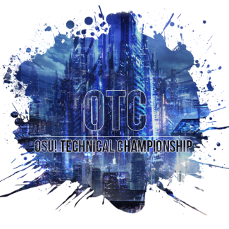

---
tags:
- osu! Technical Championship
- OTC
---

# osu! Technical Championship

The **osu! Technical Championship** (***OTC***) was a double elimination one-on-one osu! tournament hosted by ![][flag_US] [IsoSubjectPi](https://osu.ppy.sh/users/3989669). osu! Technical Championship featured complex rhythms and sliders, unorthodox patterns, and a wide variety of technical mapping in its mappools. It was the first installment of the osu! Technical Championship.

## Tournament Schedule

| Event | Timestamp |
| --: | :-- |
| Registration Phase | 2018-01-01/2018-01-14 |
| Live Drawings | 2018-01-15 (19:00 UTC) |
| Group Stage | 2018-01-20/2018-01-29 |
| Round of 32 | 2018-02-02/2018-02-04 |
| Round of 16 | 2018-02-04/2018-02-05 |
| Quarterfinals | 2018-02-07/2018-02-12 |
| Semifinals | 2018-02-17/2018-02-21 |
| Finals | 2018-02-24/2018-02-28 |
| Grand Finals | 2018-03-03/2018-03-04 |

## Prizes

In every tournament, people conquering a place on the podium are eligible to receive unique prizes created specifically for osu! Technical Championship winners. It is possible that these items change with every installment of the osu! Technical Championship.

| Placing | Prize(s) |
| :-: | :-- |
|  | 3 months of osu!supporter tag |
|  | 2 months of osu!supporter tag |
|  | 1 month of osu!supporter tag |

*Extra 1 month of osu!supporter tag was given to Grand Finals tiebreaker winner.*

## Organisation

The osu! Technical Championship was run by various osu! community members.

| Position | Member(s) |
| :-- | :-- |
| Manager | ![][flag_US] [IsoSubjectPi](https://osu.ppy.sh/users/3989669) |
| Admin | ![][flag_US] [Saber](https://osu.ppy.sh/users/4272841), ![][flag_US] [BlackZero](https://osu.ppy.sh/users/5383496) |
| Map Selector | ![][flag_US] [IsoSubjectPi](https://osu.ppy.sh/users/3989669), ![][flag_US] [Saber](https://osu.ppy.sh/users/4272841), ![][flag_US] [DigitalHypno](https://osu.ppy.sh/users/4384207), ![][flag_DE] [Chriz](https://osu.ppy.sh/users/2355080), ![][flag_PL] [Chalwa](https://osu.ppy.sh/users/4826159), ![][flag_GB] [Nega](https://osu.ppy.sh/users/3181083) |
| Designer | ![][flag_NZ] [-Akito](https://osu.ppy.sh/users/5716327) |
| Streamer/Commentator | ![][flag_FR] [Kasumii-sama](https://osu.ppy.sh/users/6177263), ![][flag_CA] [Neko Rin](https://osu.ppy.sh/users/6720237), ![][flag_DE] [Sir Hywen](https://osu.ppy.sh/users/7601761), ![][flag_NL] [Chungie](https://osu.ppy.sh/users/3752124), ![][flag_NL] [Blue-Orb](https://osu.ppy.sh/users/6612210), ![][flag_FR] [Spartan Plume](https://osu.ppy.sh/users/2553166) |
| Referee | ![][flag_US] [IsoSubjectPi](https://osu.ppy.sh/users/3989669), ![][flag_US] [BlackZero](https://osu.ppy.sh/users/5383496), ![][flag_SG] [uchuuj1n](https://osu.ppy.sh/users/9140302), ![][flag_CA] [muza](https://osu.ppy.sh/users/944305), ![][flag_PL] [- Dave -](https://osu.ppy.sh/users/3604693), ![][flag_NL] [Chungie](https://osu.ppy.sh/users/3752124), ![][flag_FR] [Kasumii-sama](https://osu.ppy.sh/users/6177263), ![][flag_CA] [Neko Rin](https://osu.ppy.sh/users/6720237), ![][flag_FR] [Ryumi](https://osu.ppy.sh/users/6596270), ![][flag_US] [YoshiLover456](https://osu.ppy.sh/users/6843383), ![][flag_US] [trey-](https://osu.ppy.sh/users/8784747), ![][flag_DE] [Sir Hywen](https://osu.ppy.sh/users/7601761), ![][flag_DK] [Pennek](https://osu.ppy.sh/users/3723742), ![][flag_RU] [Willjoy](https://osu.ppy.sh/users/2484373), ![][flag_AU] [Illinon](https://osu.ppy.sh/users/8306102), ![][flag_FR] [Spartan Plume](https://osu.ppy.sh/users/2553166), ![][flag_CA] [VINXIS](https://osu.ppy.sh/users/4323406), ![][flag_SG] [Reset-](https://osu.ppy.sh/users/3850861) |
| Wiki Editor | ![][flag_ID] [Naruk](https://osu.ppy.sh/users/7100002) |

## Links

- [Discussion thread](https://osu.ppy.sh/community/forums/topics/684306)
- [OTC Discord server](https://discord.gg/GGMmSu5)
- [Livestream](https://www.twitch.tv/osutechnicalchampionship)
- **[Statistics sheet](https://docs.google.com/spreadsheets/d/e/2PACX-1vStmKfT5R9F8cFGqit3gyVwz8H7EN4Z4y7d3mbWD5Lz4emiVUiMziaYfSR1sxGmMMRgVohyqiHS7x19/pubhtml)**

-----------------------

## Participants

| Seed | Members |
| :-- | :-- |
| Top | ![][flag_PL] [Bartek22830](https://osu.ppy.sh/users/6404027), ![][flag_US] [arth](https://osu.ppy.sh/users/3600549), ![][flag_UY] [Alice Carroll](https://osu.ppy.sh/users/5218320), ![][flag_DE] [CookEasy](https://osu.ppy.sh/users/453226), ![][flag_AU] [MBmasher](https://osu.ppy.sh/users/4498616), ![][flag_UY] [Daanit](https://osu.ppy.sh/users/6159669), ![][flag_CA] [NeoAxel](https://osu.ppy.sh/users/6806934), ![][flag_TR] [heyronii](https://osu.ppy.sh/users/5642779), ![][flag_ES] [Betwin](https://osu.ppy.sh/users/1968481), ![][flag_FI] [SanteriP](https://osu.ppy.sh/users/1981187), ![][flag_US] [BobbyZlich](https://osu.ppy.sh/users/6779549), ![][flag_US] [Junjou](https://osu.ppy.sh/users/7077648), ![][flag_DE] [likejaxirl](https://osu.ppy.sh/users/7093373), ![][flag_NZ] [fumes](https://osu.ppy.sh/users/7573380), ![][flag_GR] [Akashii](https://osu.ppy.sh/users/6909105), ![][flag_NL] [Blue-Orb](https://osu.ppy.sh/users/6612210) |
| High | ![][flag_US] [melloe](https://osu.ppy.sh/users/2367616), ![][flag_CL] [Yumbtah](https://osu.ppy.sh/users/2784663), ![][flag_FR] [Seguri](https://osu.ppy.sh/users/6621540), ![][flag_GR] [awesomemacD](https://osu.ppy.sh/users/5589933), ![][flag_IL] [Okino may](https://osu.ppy.sh/users/7730603), ![][flag_HK] [Coni](https://osu.ppy.sh/users/2188855), ![][flag_CA] [peng](https://osu.ppy.sh/users/6043452), ![][flag_UA] [kug1](https://osu.ppy.sh/users/6997572), ![][flag_SG] [moosepi](https://osu.ppy.sh/users/1868745), ![][flag_AT] [TiltBoi](https://osu.ppy.sh/users/6311630), ![][flag_CL] [\[-Neon-\]](https://osu.ppy.sh/users/6064382), ![][flag_SE] [Bullen8](https://osu.ppy.sh/users/6831611), ![][flag_PL] [slaffex](https://osu.ppy.sh/users/5629579), ![][flag_FR] [Pouki](https://osu.ppy.sh/users/7243224), ![][flag_RU] [Starger](https://osu.ppy.sh/users/3398715), ![][flag_US] [- M o D e -](https://osu.ppy.sh/users/4580287) |
| Low | ![][flag_US] [brrett](https://osu.ppy.sh/users/7398964), ![][flag_SE] [Denk Mimer](https://osu.ppy.sh/users/7177201), ![][flag_NZ] [Fasutorui](https://osu.ppy.sh/users/3755754), ![][flag_GB] [Doughy](https://osu.ppy.sh/users/5275937), ![][flag_NO] [- Markus -](https://osu.ppy.sh/users/8414284), ![][flag_ES] [Frc](https://osu.ppy.sh/users/4638940), ![][flag_US] [AriizuCA](https://osu.ppy.sh/users/3972929), ![][flag_US] [-scy-](https://osu.ppy.sh/users/7149244), ![][flag_FR] [Barbex](https://osu.ppy.sh/users/4904410), ![][flag_BR] [bleq](https://osu.ppy.sh/users/6297629), ![][flag_CL] [Lasseh](https://osu.ppy.sh/users/4881251), ![][flag_PL] [\[Nii-san\]](https://osu.ppy.sh/users/4352977), ![][flag_CN] [Play Offline](https://osu.ppy.sh/users/5791401), ![][flag_DE] [LwL](https://osu.ppy.sh/users/3556856), ![][flag_GB] [khcdub](https://osu.ppy.sh/users/7987048), ![][flag_HK] [ReZero\_Emilia](https://osu.ppy.sh/users/6934191) |
| Unseeded | ![][flag_US] [Lunicia](https://osu.ppy.sh/users/4369309), ![][flag_UY] [Nightshiftt](https://osu.ppy.sh/users/4662596), ![][flag_US] [Ted](https://osu.ppy.sh/users/3264777), ![][flag_CA] [Saltstick](https://osu.ppy.sh/users/2165408), ![][flag_CA] [Meow-Mix](https://osu.ppy.sh/users/3021634), ![][flag_DE] [SyNeX](https://osu.ppy.sh/users/3618513), ![][flag_DE] [Kawaii Kaneki](https://osu.ppy.sh/users/3344333), ![][flag_AU] [yee lmao](https://osu.ppy.sh/users/4136930), ![][flag_CA] [Septembre](https://osu.ppy.sh/users/3666816), ![][flag_FI] [Kappakeepo](https://osu.ppy.sh/users/3481070), ![][flag_GR] [Genjuro](https://osu.ppy.sh/users/3196091), ![][flag_US] [Yeezah](https://osu.ppy.sh/users/5829809), ![][flag_US] [Piggles354](https://osu.ppy.sh/users/6936275), ![][flag_DE] [Lulu-](https://osu.ppy.sh/users/4201715), ![][flag_DE] [Marisa Kirisame](https://osu.ppy.sh/users/1596946), ![][flag_US] [SoupAPlayer](https://osu.ppy.sh/users/7396542) |

## Groups

| Group | Top Seed | High Seed | Low Seed | Unseeded |
| :-: | :-- | :-- | :-- | :-- |
| **A** | ![][flag_CA] [NeoAxel](https://osu.ppy.sh/users/6806934) | ![][flag_RU] [Starger](https://osu.ppy.sh/users/3398715) | ![][flag_BR] [bleq](https://osu.ppy.sh/users/6297629) | ![][flag_DE] [SyNeX](https://osu.ppy.sh/users/3618513) |
| **B** | ![][flag_PL] [Bartek22830](https://osu.ppy.sh/users/6404027) | ![][flag_FR] [Seguri](https://osu.ppy.sh/users/6621540) | ![][flag_ES] [Frc](https://osu.ppy.sh/users/4638940) | ![][flag_US] [Yeezah](https://osu.ppy.sh/users/5829809) |
| **C** | ![][flag_GR] [awesomemacD](https://osu.ppy.sh/users/5589933) | ![][flag_PL] [slaffex](https://osu.ppy.sh/users/5629579) | ![][flag_US] [-scy-](https://osu.ppy.sh/users/7149244) | ![][flag_US] [Ted](https://osu.ppy.sh/users/3264777) |
| **D** | ![][flag_UY] [Daanit](https://osu.ppy.sh/users/6159669) | ![][flag_GR] [Akashii](https://osu.ppy.sh/users/6909105) | ![][flag_CL] [Lasseh](https://osu.ppy.sh/users/4881251) | ![][flag_UY] [Nightshiftt](https://osu.ppy.sh/users/4662596) |
| **E** | ![][flag_US] [melloe](https://osu.ppy.sh/users/2367616) | ![][flag_CL] [\[-Neon-\]](https://osu.ppy.sh/users/6064382) | ![][flag_SE] [Denk Mimer](https://osu.ppy.sh/users/7177201) | ![][flag_US] [Lunicia](https://osu.ppy.sh/users/4369309) |
| **F** | ![][flag_UY] [Alice Carroll](https://osu.ppy.sh/users/5218320) | ![][flag_GB] [khcdub](https://osu.ppy.sh/users/7987048) | ![][flag_DE] [Kawaii Kaneki](https://osu.ppy.sh/users/3344333) | ![][flag_CA] [Septembre](https://osu.ppy.sh/users/3666816) |
| **G** | ![][flag_ES] [Betwin](https://osu.ppy.sh/users/1968481) | ![][flag_US] [brrett](https://osu.ppy.sh/users/7398964) | ![][flag_CN] [Play Offline](https://osu.ppy.sh/users/5791401) | ![][flag_AU] [yee lmao](https://osu.ppy.sh/users/4136930) |
| **H** | ![][flag_US] [Junjou](https://osu.ppy.sh/users/7077648) | ![][flag_SE] [Bullen8](https://osu.ppy.sh/users/6831611) | ![][flag_GB] [Doughy](https://osu.ppy.sh/users/5275937) | ![][flag_CA] [Saltstick](https://osu.ppy.sh/users/2165408) |
| **I** | ![][flag_CL] [Yumbtah](https://osu.ppy.sh/users/2784663) | ![][flag_AT] [TiltBoi](https://osu.ppy.sh/users/6311630) | ![][flag_PL] [\[Nii-san\]](https://osu.ppy.sh/users/4352977) | ![][flag_CA] [Meow-Mix](https://osu.ppy.sh/users/3021634) |
| **J** | ![][flag_DE] [likejaxirl](https://osu.ppy.sh/users/7093373) | ![][flag_NL] [Blue-Orb](https://osu.ppy.sh/users/6612210) | ![][flag_HK] [ReZero\_Emilia](https://osu.ppy.sh/users/6934191) | ![][flag_US] [SoupAPlayer](https://osu.ppy.sh/users/7396542) |
| **K** | ![][flag_TR] [heyronii](https://osu.ppy.sh/users/5642779) | ![][flag_HK] [Coni](https://osu.ppy.sh/users/2188855) | ![][flag_FR] [Pouki](https://osu.ppy.sh/users/7243224) | ![][flag_DE] [LwL](https://osu.ppy.sh/users/3556856) |
| **L** | ![][flag_DE] [CookEasy](https://osu.ppy.sh/users/453226) | ![][flag_SG] [moosepi](https://osu.ppy.sh/users/1868745) | ![][flag_FR] [Barbex](https://osu.ppy.sh/users/4904410) | ![][flag_US] [Piggles354](https://osu.ppy.sh/users/6936275) |
| **M** | ![][flag_FI] [SanteriP](https://osu.ppy.sh/users/1981187) | ![][flag_UA] [kug1](https://osu.ppy.sh/users/6997572) | ![][flag_NO] [- Markus -](https://osu.ppy.sh/users/8414284) | ![][flag_DE] [Marisa Kirisame](https://osu.ppy.sh/users/1596946) |
| **N** | ![][flag_US] [BobbyZlich](https://osu.ppy.sh/users/6779549) | ![][flag_IL] [Okino may](https://osu.ppy.sh/users/7730603) | ![][flag_US] [AriizuCA](https://osu.ppy.sh/users/3972929) | ![][flag_DE] [Lulu-](https://osu.ppy.sh/users/4201715) |
| **O** | ![][flag_AU] [MBmasher](https://osu.ppy.sh/users/4498616) | ![][flag_CA] [peng](https://osu.ppy.sh/users/6043452) | ![][flag_NZ] [Fasutorui](https://osu.ppy.sh/users/3755754) | ![][flag_FI] [Kappakeepo](https://osu.ppy.sh/users/3481070) |
| **P** | ![][flag_US] [arth](https://osu.ppy.sh/users/3600549) | ![][flag_NZ] [fumes](https://osu.ppy.sh/users/7573380) | ![][flag_US] [- M o D e -](https://osu.ppy.sh/users/4580287) | ![][flag_GR] [Genjuro](https://osu.ppy.sh/users/3196091) |

-----------------------

## Podium

This competition has come to an end and resulted in the following podium:

| Placing | Team(s) |
| :-: | :-- |
|  | ![][flag_FI] [SanteriP](https://osu.ppy.sh/users/1981187) |
|  | ![][flag_TR] [heyronii](https://osu.ppy.sh/users/5642779) |
|  | ![][flag_CN] [Play Offline](https://osu.ppy.sh/users/5791401) |

-----------------------

## Mappools

### Finals

**This mappool was played in Finals and Grand Finals.**

**[Download the mappack here! (190 MB)](http://www.mediafire.com/file/yhe8oh8mbays2a9/OTC+Finals+Pool.zip)**

- NoMod
  - [Getty vs. DJ DiA - Fox4-Raize- (Kaifin) \[Extreme\]](https://osu.ppy.sh/beatmapsets/482552#osu/1029677)
  - [YUC'e - Future Cider (Sing) \[Duplication\]](https://osu.ppy.sh/beatmapsets/591674#osu/1252022)
  - [Kuroneko Dungeon - Ryoushi no Umi no Lindwurm (ignorethis) \[ignore's EXTREME\]](https://osu.ppy.sh/beatmapsets/372850#osu/820336)
  - [lapix - Foolish Hero (Extended) \[Beyond The Limits\]](https://osu.ppy.sh/beatmapsets/525836#osu/1115976)
  - [Kucchy vs Akky - Yakumo \~ JOINT STRUGGLE (DJPop) \[SOLO\]](https://osu.ppy.sh/beatmapsets/12909#osu/48098)
  - [Camellia - NUCLEAR-STAR (toybot) \[toybot's EXTRA\]](https://osu.ppy.sh/beatmapsets/675779#osu/1431540)
- Hidden
  - [sakuzyo - Senkyou Ranbu (ktgster) \[EX\]](https://osu.ppy.sh/beatmapsets/460516#osu/986233)
  - [LeaF - Evanescent (Charles445) \[Aspire\]](https://osu.ppy.sh/beatmapsets/227126#osu/529285)
  - [kors k - Insane Techniques (HanzeR) \[HanzeR's Extreme\]](https://osu.ppy.sh/beatmapsets/155288#osu/389703)
  - [kors k feat.RIRE - Nirvana(Camellia's "BinaryHeaven" Remix) (PoNo) \[hovering crystal\]](https://osu.ppy.sh/beatmapsets/625996#osu/1319564)
- HardRock
  - [Tokyo Machine - OKAY (handsome) \[Master\]](https://osu.ppy.sh/beatmapsets/508998#osu/1082510)
  - [Renard - Terminal (nold\_1702) \[EXTRA\]](https://osu.ppy.sh/beatmapsets/102282#osu/270490)
- DoubleTime
  - [nano - Now or Never (tutuhaha) \[Never\]](https://osu.ppy.sh/beatmapsets/51755#osu/158495)
  - [Halozy - Heart of Night (Chaoslitz) \[Life of Loneliness\]](https://osu.ppy.sh/beatmapsets/462878#osu/991229)
- Tiebreaker
  - **[Camellia - Light it up (Opsi) \[Brilliance\]](https://osu.ppy.sh/beatmapsets/650738#osu/1378892)**

### Semifinals

**[Download the mappack here! (125 MB)](http://www.mediafire.com/file/3qlq8unc1oc026b/OTC+Semifinals+Pool.zip)**

- NoMod
  - [Function Phantom - Euclid (byfar) \[Fifth Postulate\]](https://osu.ppy.sh/beatmapsets/419614#osu/908093)
  - [Memme - NEW Astronomas (rrtyui) \[tyui\]](https://osu.ppy.sh/beatmapsets/442034#osu/950679)
  - [Reol & nqrse - Ooedo Ranvu (Pho) \[Wild Dance\]](https://osu.ppy.sh/beatmapsets/357544#osu/833389)
  - [sakuraburst - SHA (handsome) \[Master\]](https://osu.ppy.sh/beatmapsets/716390#osu/1513541)
  - [Rohi - Kakuzetsu Thanatos (NatsumeRin) \[Rin\]](https://osu.ppy.sh/beatmapsets/76396#osu/215238)
  - [ESQUARIA - Kantsubaki (Regou) \[Sakimashita\]](https://osu.ppy.sh/beatmapsets/621584#osu/1310626)
- Hidden
  - [USAO - Night sky (handsome) \[handsome's Master\]](https://osu.ppy.sh/beatmapsets/396994#osu/863542)
  - [y0c1e - heiju-do (Liiraye) \[Hey Jude\]](https://osu.ppy.sh/beatmapsets/124905#osu/904742)
  - [Sota Fujimori - VOLTEXES III (Nerova Riuz GX) \[GRAVITY\]](https://osu.ppy.sh/beatmapsets/409584#osu/889087)
  - [utsuP - Adult's Toy (SapphireGhost) \[Desecration\]](https://osu.ppy.sh/beatmapsets/47846#osu/199304)
- HardRock
  - [Camellia - Routing (Lasse) \[Lasse's Extra\]](https://osu.ppy.sh/beatmapsets/663255#osu/1405185)
  - [Camellia - kodama (-kevincela-) \[-kevincela-'s Extra\]](https://osu.ppy.sh/beatmapsets/488016#osu/1048276)
- DoubleTime
  - [Parov Stelar - Catgroove (Kuron-kun) \[Kuron's Insane\]](https://osu.ppy.sh/beatmapsets/144955#osu/630739)
  - [Kiryu - Disguise (Seikatu) \[Insane\]](https://osu.ppy.sh/beatmapsets/225957#osu/642573)
- Tiebreaker
  - **[Camellia - Dans la mer de son (PoNo) \[Maelstrom\]](https://osu.ppy.sh/beatmapsets/654313#osu/1399834)**

### Quarterfinals

**[Download the mappack here! (126 MB)](http://www.mediafire.com/file/z9f0auhtlzo2nal/OTC+Quarter+Finals+Pool.zip)**

- NoMod
  - [Memme - Cherry Blossom (rrtyui) \[tyui's Extra\]](https://osu.ppy.sh/beatmapsets/442581#osu/984660)
  - [the GazettE - MALFORMED BOX / INSIDE BEAST (Vell) \[Extra\]](https://osu.ppy.sh/beatmapsets/627671#osu/1463983)
  - [Camellia feat. Nanahira - PAPAYAPA BASS (Mir) \[Papayapa!\]](https://osu.ppy.sh/beatmapsets/529991#osu/1123616)
  - [YUC'e - Future Candy (Nathan) \[Sugar Rush\]](https://osu.ppy.sh/beatmapsets/546820#osu/1158221)
  - [USAO - BroGamer (Realazy, Linada) \[Realinada's Black Another\]](https://osu.ppy.sh/beatmapsets/635636#osu/1378253)
  - [TAMUSIC - Hexagram Epilogue (Ekoro) \[Flamenco\]](https://osu.ppy.sh/beatmapsets/637283#osu/1352046)
- Hidden
  - [DJ'TEKINA//SOMETHING - Internet bitch P\*Light Remix (Irreversible, koreapenguin) \[Penguinversible's Extra\]](https://osu.ppy.sh/beatmapsets/296198#osu/727145)
  - [Nekomata Master - Byakuya Gentou (ignorethis) \[EX\]](https://osu.ppy.sh/beatmapsets/36849#osu/119375)
  - [Camellia - overcomplexification (byfar) \[byfar's Extra\]](https://osu.ppy.sh/beatmapsets/351408#osu/934812)
  - [Ling tosite sigure - KIMITOOKU (pishifat) \[pishi's Extra\]](https://osu.ppy.sh/beatmapsets/458931#osu/988684)
- HardRock
  - [USAO - The storm broke (NeilPerry) \[NeilPerry's Insane\]](https://osu.ppy.sh/beatmapsets/483158#osu/1037953)
  - [Nekomata Master+ - Funny shuffle (fanzhen0019) \[RiP iidx\]](https://osu.ppy.sh/beatmapsets/249609#osu/573861)
- DoubleTime
  - [IAHN - Candy Luv (pishifat) \[Insane\]](https://osu.ppy.sh/beatmapsets/456212#osu/977708)
  - [EXID - Ah Yeah (Desperate-Kun, Irreversible) \[Despversible's Insane\]](https://osu.ppy.sh/beatmapsets/315323#osu/706413)
- Tiebreaker
  - **[t+pazolite - Twisted Twit (Kenterz) \[Storm\]](https://osu.ppy.sh/beatmapsets/498466#osu/1061134)**

### Round of 32 / Round of 16

**[Download the mappack here! (172 MB)](http://www.mediafire.com/file/f9zmm3ju4zhe66d/OTC+RO32-16+Pool.zip)**

- NoMod
  - [Camellia - Towards The Horizon (sahuang) \[sahuang's Expert\]](https://osu.ppy.sh/beatmapsets/636393#osu/1478678)
  - [yuikonnu & ayaponzu\* - Happy Halloween (Loneight) \[Happy Halloween\]](https://osu.ppy.sh/beatmapsets/692433#osu/1465149)
  - [REOL - 404 not found (SnowNiNo\_) \[Error\]](https://osu.ppy.sh/beatmapsets/534116#osu/1131425)
  - [JYOCHO - Taiyou to Kurashite Kita (dsco) \[Bloom\]](https://osu.ppy.sh/beatmapsets/600881#osu/1269564)
  - [Memme - Sky of the Ocean (SnowNiNo\_) \[NiNo's Another.\]](https://osu.ppy.sh/beatmapsets/668888#osu/1429747)
  - [Hatsuki Yura - Eclipse Parade (Zero\_\_wind) \[Zero's Insane\]](https://osu.ppy.sh/beatmapsets/430339#osu/929453)
- Hidden
  - [Gentle Stick X M2U - Ineffabilis (buhei) \[Extreme\]](https://osu.ppy.sh/beatmapsets/340903#osu/753968)
  - [Yucha-P - Thieves Night Trick (tutuhaha) \[Extra\]](https://osu.ppy.sh/beatmapsets/78268#osu/219090)
  - [BTS - FIRE (sukiNathan) \[PYROMANIA\]](https://osu.ppy.sh/beatmapsets/479385#osu/1023667)
  - [REOL - YoiYoi Kokon (DreaM117er) \[Yoi\]](https://osu.ppy.sh/beatmapsets/545737#osu/1220408)
- HardRock
  - [Ayane - Itsumo Kono Basho de (Salktwod Remix) (Seikatu) \[Insane\]](https://osu.ppy.sh/beatmapsets/240459#osu/555741)
  - [Giga - -BWW SCREAM- (yf\_bmp) \[yf's sb Extreme\]](https://osu.ppy.sh/beatmapsets/404658#osu/890901)
- DoubleTime
  - [REOL - Summer Horror Party (Chaoslitz) \[Ghostly Summertime\]](https://osu.ppy.sh/beatmapsets/522666#osu/1109947)
  - [Infected Mushroom - Pink Nightmares (RLC) \[Insane\]](https://osu.ppy.sh/beatmapsets/107639#osu/281977)
- Tiebreaker
  - **[Camellia - PLANET//SHAPER (Various Mappers) \[Collab\]](https://osu.ppy.sh/beatmapsets/346853#osu/765525)**

### Group Stage

**[Download the mappack here! (145 MB)](http://www.mediafire.com/file/shu79fyhms1f7t1/OTC+Group+Stage+Mappool.zip;)**

- NoMod
  - [SWAN K feat. Asuka M - LOVE B.B.B (rs\_fadeaway) \[Extra\]](https://osu.ppy.sh/beatmapsets/143457#osu/758189)
  - [uma vs. Morimori Atsushi - Re:End of a Dream (Lasse) \[Lasse's Insane\]](https://osu.ppy.sh/beatmapsets/557039#osu/1219193)
  - [Hatsuki Yura - Yoiyami Hanabi (Lan wings) \[Lan\]](https://osu.ppy.sh/beatmapsets/115011#osu/297463)
  - [Ocelot - KAEDE (Kalindraz) \[Kalindraz's EX\]](https://osu.ppy.sh/beatmapsets/660630#osu/1404975)
  - [Zekk - Calling (Mirash) \[Mirash's Another\]](https://osu.ppy.sh/beatmapsets/673878#osu/1427700)
  - [Reol - Gokusaishiki (yf\_bmp) \[yf's Insane\]](https://osu.ppy.sh/beatmapsets/422369#osu/961256)
- Hidden
  - [ak+q - Vexaria (Miura) \[Miura's Another\]](https://osu.ppy.sh/beatmapsets/657498#osu/1392666)
  - [Mitsuki Nakae - Ouka Enbu (Komore) \[Komore's Insane\]](https://osu.ppy.sh/beatmapsets/688552#osu/1462834)
  - [Nekomata Master - Sennen no Kotowari (celerih) \[GRAVITY OF THE MOON\]](https://osu.ppy.sh/beatmapsets/647730#osu/1372384)
  - [Camellia - Fastest Crash (toybot, Mikii) \[Collab Insane\]](https://osu.ppy.sh/beatmapsets/331025#osu/742728)
- HardRock
  - [Sota Fujimori - polygon (Sebu) \[tetragon\]](https://osu.ppy.sh/beatmapsets/422136#osu/1009793)
  - [Reol - FLASH BACK (VINXIS) \[VINXIS's Insane\]](https://osu.ppy.sh/beatmapsets/409397#osu/933022)
- DoubleTime
  - [SteLouse - Joyride (TicClick, Vass\_Bass) \[Insane ft. Vass\_Bass\]](https://osu.ppy.sh/beatmapsets/289935#osu/653381)
  - [cYsmix feat. Emmy - Tear Rain (grumd) \[Insane\]](https://osu.ppy.sh/beatmapsets/140805#osu/351513)
- Tiebreaker
  - **[KOAN Sound & Asa - Tetsuo's Redemption (Billain Remix) (Aiceo) \[Redemption\]](https://osu.ppy.sh/beatmapsets/354022#osu/779964)**

------------------------------------------------------------------------

## Match Results

### Grand Finals

| Saturday, 2018-03-03 |  |  |  |  |
| --: | :-: | :-: | :-- | :-- |
| Play Offline ![][flag_CN] | 3 | **6** | ![][flag_TR] **heyronii** | [#1](https://osu.ppy.sh/community/matches/40538572) |

| Sunday, 2018-03-04 |  |  |  |  |
| --: | :-: | :-: | :-- | :-- |
| **SanteriP** ![][flag_FI] | **6** | 2 | ![][flag_TR] heyronii | [#1](https://osu.ppy.sh/community/matches/40572763) |

### Finals

| Saturday, 2018-02-24 |  |  |  |  |
| --: | :-: | :-: | :-- | :-- |
| Bartek22830 ![][flag_PL] | 0 | **6** | ![][flag_TR] **heyronii** | -win by default- |
| **melloe** ![][flag_US] | **6** | 1 | ![][flag_RU] Starger | [#1](https://osu.ppy.sh/community/matches/40355503) |

| Sunday, 2018-02-25 |  |  |  |  |
| --: | :-: | :-: | :-- | :-- |
| **heyronii** ![][flag_TR] | **6** | 4 | ![][flag_US] melloe | [#1](https://osu.ppy.sh/community/matches/40388082) |

| Wednesday, 2018-02-28 |  |  |  |  |
| --: | :-: | :-: | :-- | :-- |
| Play Offline ![][flag_CN] | 3 | **6** | ![][flag_FI] **SanteriP** | [#1](https://osu.ppy.sh/community/matches/40451132) |

### Semifinals

| Saturday, 2018-02-17 |  |  |  |  |
| --: | :-: | :-: | :-- | :-- |
| **Blue-Orb** ![][flag_NL] | **5** | 0 | ![][flag_GR] awesomemacD | -win by default- |
| Lasseh ![][flag_CL] | 0 | **5** | ![][flag_RU] **Starger** | -win by default- |
| **Starger** ![][flag_RU] | **5** | 4 | ![][flag_NL] Blue-Orb | [#1](https://osu.ppy.sh/community/matches/40155226) |
| moosepi ![][flag_SG] | 2 | **5** | ![][flag_CL] **Yumbtah** | [#1](https://osu.ppy.sh/community/matches/40158658) |
| **heyronii** ![][flag_TR] | **5** | 1 | ![][flag_UA] kug1 | [#1](https://osu.ppy.sh/community/matches/40164616) |

| Sunday, 2018-02-18 |  |  |  |  |
| --: | :-: | :-: | :-- | :-- |
| Yumbtah ![][flag_CL] | 2 | **5** | ![][flag_TR] **heyronii** | [#1](https://osu.ppy.sh/community/matches/40191390) |

| Tuesday, 2018-02-20 |  |  |  |  |
| --: | :-: | :-: | :-- | :-- |
| melloe ![][flag_US] | 4 | **5** | ![][flag_CN] **Play Offline** | [#1](https://osu.ppy.sh/community/matches/40304228) |

| Wednesday, 2018-02-21 |  |  |  |  |
| --: | :-: | :-: | :-- | :-- |
| **SanteriP** ![][flag_FI] | **5** | 2 | ![][flag_PL] Bartek22830 | [#1](https://osu.ppy.sh/community/matches/40267178) |

### Quarterfinals

| Wednesday, 2018-02-07 |  |  |  |  |
| --: | :-: | :-: | :-- | :-- |
| **Play Offline** ![][flag_CN] | **5** | 2 | ![][flag_SG] moosepi | [#1](https://osu.ppy.sh/community/matches/39878324) |

| Friday, 2018-02-09 |  |  |  |  |
| --: | :-: | :-: | :-- | :-- |
| Tiltboi ![][flag_AT] | 4 | **5** | ![][flag_UA] **kug1** | [#1](https://osu.ppy.sh/community/matches/39931127) |

| Saturday, 2018-02-10 |  |  |  |  |
| --: | :-: | :-: | :-- | :-- |
| **melloe** ![][flag_US] | **5** | 4 | ![][flag_TR] heyronii | [#1](https://osu.ppy.sh/community/matches/39952168) |
| Fasutorui ![][flag_NZ] | 0 | **5** | ![][flag_GR] **awesomemacD** | -win by default- |
| Blue-Orb ![][flag_NL] | 4 | **5** | ![][flag_FI] **SanteriP** | [#1](https://osu.ppy.sh/community/matches/39956066) |
| BobbyZlich ![][flag_US] | 2 | **5** | ![][flag_RU] **Starger** | [#1](https://osu.ppy.sh/community/matches/39960503) |
| likejaxirl ![][flag_DE] | 0 | **5** | ![][flag_UY] **Alice Carroll** | [#1](https://osu.ppy.sh/community/matches/39962321) |
| Okino may ![][flag_IL] | 4 | **5** | ![][flag_DE] **CookEasy** | [#1](https://osu.ppy.sh/community/matches/39962238) |
| Septembre ![][flag_CA] | 4 | **5** | ![][flag_CL] **Yumbtah** | [#1](https://osu.ppy.sh/community/matches/39966785) |
| Frc ![][flag_ES] | 0 | **5** | ![][flag_CA] **Saltstick** | -win by default- |
| Ted ![][flag_US] | 2 | **5** | ![][flag_CA] **peng** | [#1](https://osu.ppy.sh/community/matches/39975827) |

| Sunday, 2018-02-11 |  |  |  |  |
| --: | :-: | :-: | :-- | :-- |
| CookEasy ![][flag_DE] | 4 | **5** | ![][flag_UA] **kug1** | [#1](https://osu.ppy.sh/community/matches/39993738) |
| Alice Carroll ![][flag_UY] | 4 | **5** | ![][flag_GR] **awesomemacD** | [#1](https://osu.ppy.sh/community/matches/39993266) |
| Lasseh ![][flag_CL] | 2 | **5** | ![][flag_PL] **Bartek22830** | [#1](https://osu.ppy.sh/community/matches/39998235) |
| **Yumbtah** ![][flag_CL] | **5** | 1 | ![][flag_CA] Saltstick | [#1](https://osu.ppy.sh/community/matches/40003777) |

| Monday, 2018-02-12 |  |  |  |  |
| --: | :-: | :-: | :-- | :-- |
| peng ![][flag_CA] | 4 | **5** | ![][flag_RU] **Starger** | [#1](https://osu.ppy.sh/community/matches/40029839) |

### Round of 16

| Sunday, 2018-02-04 |  |  |  |  |
| --: | :-: | :-: | :-- | :-- |
| **Fasutorui** ![][flag_NZ] | **5** | 0 | ![][flag_HK] Coni | -win by default- |
| CookEasy ![][flag_DE] | 0 | **5** | ![][flag_FI] **SanteriP** | [#1](https://osu.ppy.sh/community/matches/39804100) |
| kug1 ![][flag_UA] | 2 | **5** | ![][flag_NL] **Blue-Orb** | [#1](https://osu.ppy.sh/community/matches/39808833) |
| Alice Carroll ![][flag_UY] | 0 | **5** | ![][flag_TR] **heyronii** | -win by default- |
| Yumbtah ![][flag_CL] | 0 | **5** | ![][flag_PL] **Bartek22830** | [#1](https://osu.ppy.sh/community/matches/39812450) |
| **BobbyZlich** ![][flag_US] | **5** | 2 | ![][flag_GR] Genjuro | [#1](https://osu.ppy.sh/community/matches/39812605) |
| Betwin ![][flag_ES] | 0 | **5** | ![][flag_CA] **Septembre** | -win by default- |
| awesomemacD ![][flag_GR] | 4 | **5** | ![][flag_US] **melloe** | [#1](https://osu.ppy.sh/community/matches/39816502) |
| - M o D e - ![][flag_US] | 2 | **5** | ![][flag_DE] **likejaxirl** | [#1](https://osu.ppy.sh/community/matches/39817311) |
| Doughy ![][flag_GB] | 3 | **5** | ![][flag_US] **Ted** | [#1](https://osu.ppy.sh/community/matches/39819715) |

| Monday, 2018-02-05 |  |  |  |  |
| --: | :-: | :-: | :-- | :-- |
| **moosepi** ![][flag_SG] | **5** | 3 | ![][flag_CA] peng | [#1](https://osu.ppy.sh/community/matches/39826558) |
| Starger ![][flag_RU] | 2 | **5** | ![][flag_CN] **Play Offline** | [#1](https://osu.ppy.sh/community/matches/39832058) |
| bleq ![][flag_BR] | 2 | **5** | ![][flag_AT] **Tiltboi** | [#1](https://osu.ppy.sh/community/matches/39840164) |
| **Okino may** ![][flag_IL] | **5** | 4 | ![][flag_UY] Daanit | [#1](https://osu.ppy.sh/community/matches/39842654) |
| Saltstick ![][flag_CA] | 1 | **5** | ![][flag_CL] **Lasseh** | [#1](https://osu.ppy.sh/community/matches/39938307) |

### Round of 32

| Friday, 2018-02-02 |  |  |  |  |
| --: | :-: | :-: | :-- | :-- |
| **Bartek22830** ![][flag_PL] | **5** | 3 | ![][flag_HK] Coni | [#1](https://osu.ppy.sh/community/matches/39731702) |
| **awesomemacD** ![][flag_GR] | **5** | 0 | ![][flag_ES] Betwin | -win by default- |

| Saturday, 2018-02-03 |  |  |  |  |
| --: | :-: | :-: | :-- | :-- |
| **moosepi** ![][flag_SG] | **5** | 1 | ![][flag_BR] bleq | [#1](https://osu.ppy.sh/community/matches/39768149) |
| **SanteriP** ![][flag_FI] | **5** | 1 | ![][flag_GR] Genjuro | [#1](https://osu.ppy.sh/community/matches/39768119) |
| Doughy ![][flag_GB] | 2 | **5** | ![][flag_UA] **kug1** | [#1](https://osu.ppy.sh/community/matches/39769672) |
| BobbyZlich ![][flag_US] | 0 | **5** | ![][flag_DE] **CookEasy** | [#1](https://osu.ppy.sh/community/matches/39771395) |
| **Alice Carroll** ![][flag_UY] | **5** | 3 | ![][flag_ES] Frc | [#1](https://osu.ppy.sh/community/matches/39773628) |
| **Starger** ![][flag_RU] | **5** | 1 | ![][flag_IL] Okino may | [#1](https://osu.ppy.sh/community/matches/39773929) |
| **heyronii** ![][flag_TR] | **5** | 1 | ![][flag_CL] \[-Neon-\] | [#1](https://osu.ppy.sh/community/matches/39775760) |
| **melloe** ![][flag_US] | **5** | 1 | ![][flag_CA] Septembre | [#1](https://osu.ppy.sh/community/matches/39784777) |
| **Blue-Orb** ![][flag_NL] | **5** | 2 | ![][flag_US] Ted | [#1](https://osu.ppy.sh/community/matches/39784745) |
| - M o D e - ![][flag_US] | 0 | **5** | ![][flag_CA] **Saltstick** | -win by default- |

| Sunday, 2018-02-04 |  |  |  |  |
| --: | :-: | :-: | :-- | :-- |
| **Play Offline** ![][flag_CN] | **5** | 3 | ![][flag_UY] Daanit | [#1](https://osu.ppy.sh/community/matches/39790198) |
| **Yumbtah** ![][flag_CL] | **5** | 1 | ![][flag_NZ] Fasutorui | [#1](https://osu.ppy.sh/community/matches/39790177) |
| **Lasseh** ![][flag_CL] | **5** | 4 | ![][flag_DE] likejaxirl | [#1](https://osu.ppy.sh/community/matches/39814565) |
| **peng** ![][flag_CA] | **5** | 1 | ![][flag_AT] Tiltboi | [#1](https://osu.ppy.sh/community/matches/39816713) |

### Group Stage

| Match ID | Saturday, 2018-01-20 |  |  |  |  |
| :-: | --: | :-: | :-: | :-- | :-- |
| G1 | **Betwin** ![][flag_ES] | **4** | 0 | ![][flag_AU] yee lmao | -win by default- |
| A4 | **Starger** ![][flag_RU] | **4** | 0 | ![][flag_CA] NeoAxel | -win by default- |
| A5 | **bleq** ![][flag_BR] | **4** | 0 | ![][flag_DE] SyNeX | [#1](https://osu.ppy.sh/community/matches/39381502) |
| C4 | slaffex ![][flag_PL] | 0 | **4** | ![][flag_GR] **awesomemacD** | -win by default- |
| F2 | **Alice Carroll** ![][flag_UY] | **4** | 0 | ![][flag_GB] khcdub | [#1](https://osu.ppy.sh/community/matches/39381882) |
| A1 | NeoAxel ![][flag_CA] | 0 | **4** | ![][flag_DE] **SyNeX** | -win by default- |
| A3 | **Starger** ![][flag_RU] | **4** | 1 | ![][flag_BR] bleq | [#1](https://osu.ppy.sh/community/matches/39383829) |
| A2 | **NeoAxel** ![][flag_CA] | **4** | 0 | ![][flag_BR] bleq | -win by default- |
| A6 | **Starger** ![][flag_RU] | **4** | 0 | ![][flag_DE] SyNeX | [#1](https://osu.ppy.sh/community/matches/39385850) |
| C6 | slaffex ![][flag_PL] | 0 | **4** | ![][flag_US] **Ted** | -win by default- |
| F1 | **Alice Carroll** ![][flag_UY] | **4** | 0 | ![][flag_CA] Septembre | [#1](https://osu.ppy.sh/community/matches/39388931) |
| B1 | **Bartek22830** ![][flag_PL] | **4** | 0 | ![][flag_US] Yeezah | [#1](https://osu.ppy.sh/community/matches/39393012) |
| C2 | **awesomemacD** ![][flag_GR] | **4** | 0 | ![][flag_US] -scy- | [#1](https://osu.ppy.sh/community/matches/39389594) |
| C3 | slaffex ![][flag_PL] | 0 | **4** | ![][flag_US] **-scy-** | -win by default- |
| C5 | -scy- ![][flag_US] | 1 | **4** | ![][flag_US] **Ted** | [#1](https://osu.ppy.sh/community/matches/39394239) |
| D4 | Akashii ![][flag_GR] | 1 | **4** | ![][flag_UY] **Daanit** | [#1](https://osu.ppy.sh/community/matches/39394239) |
| D5 | Nightshiftt ![][flag_UY] | 2 | **4** | ![][flag_GR] **Akashii** | [#1](https://osu.ppy.sh/community/matches/39397954) |

| Match ID | Sunday, 2018-01-21 |  |  |  |  |
| :-: | --: | :-: | :-: | :-- | :-- |
| D1 | **Daanit** ![][flag_UY] | **4** | 0 | ![][flag_UY] Nightshiftt | -win by default- |
| E4 | Lunicia ![][flag_US] | 0 | **4** | ![][flag_US] **melloe** | [#1](https://osu.ppy.sh/community/matches/39399720) |
| G6 | **brrett** ![][flag_US] | **4** | 0 | ![][flag_AU] yee lmao | -win by default- |
| G3 | brrett ![][flag_US] | 0 | **4** | ![][flag_CN] **Play Offline** | -win by default- |
| G5 | **Play Offline** ![][flag_CN] | **4** | 0 | ![][flag_AU] yee lmao | -win by default- |
| B4 | Seguri ![][flag_FR] | 1 | **4** | ![][flag_PL] **Bartek22830** | [#1](https://osu.ppy.sh/community/matches/39413945) |
| F6 | **khcdub** ![][flag_GB] | **4** | 0 | ![][flag_DE] Kawaii Kaneki | -win by default- |
| F4 | **Septembre** ![][flag_CA] | **4** | 0 | ![][flag_GB] khcdub | [#1](https://osu.ppy.sh/community/matches/39417548) |
| G2 | Betwin ![][flag_ES] | 2 | **4** | ![][flag_CN] **Play Offline** | [#1](https://osu.ppy.sh/community/matches/39419241) |
| B5 | **Frc** ![][flag_ES] | **4** | 0 | ![][flag_US] Yeezah | -win by default- |
| F5 | **Septembre** ![][flag_CA] | **4** | 1 | ![][flag_DE] Kawaii Kaneki | [#1](https://osu.ppy.sh/community/matches/39419563) |
| G4 | brrett ![][flag_US] | 0 | **4** | ![][flag_ES] **Betwin** | -win by default- |
| H2 | Bullen8 ![][flag_SE] | 1 | **4** | ![][flag_GB] **Doughy** | [#1](https://osu.ppy.sh/community/matches/39418803) |
| E5 | \[-Neon-\] ![][flag_CL] | **4** | 0 | ![][flag_SE] Denk Mimer | [#1](https://osu.ppy.sh/community/matches/39420676) |
| F3 | Kawaii Kaneki ![][flag_DE] | 0 | **4** | ![][flag_UY] **Alice Carroll** | [#1](https://osu.ppy.sh/community/matches/39420674) |
| C1 | **awesomemacD** ![][flag_GR] | **4** | 3 | ![][flag_US] Ted | [#1](https://osu.ppy.sh/community/matches/39422241) |
| H3 | Junjou ![][flag_US] | 1 | **4** | ![][flag_GB] **Doughy** | [#1](https://osu.ppy.sh/community/matches/39423146) |
| H4 | **Saltstick** ![][flag_CA] | **4** | 1 | ![][flag_SE] Bullen8 | [#1](https://osu.ppy.sh/community/matches/39422317) |
| D3 | Akashii ![][flag_GR] | 2 | **4** | ![][flag_CL] **Lasseh** | [#1](https://osu.ppy.sh/community/matches/39424089) |
| H6 | **Doughy** ![][flag_GB] | **4** | 1 | ![][flag_CA] Saltstick | [#1](https://osu.ppy.sh/community/matches/39424287) |
| E2 | melloe ![][flag_US] | 0 | **4** | ![][flag_SE] **Denk Mimer** | [#1](https://osu.ppy.sh/community/matches/39425659) |
| H1 | Junjou ![][flag_US] | 0 | **4** | ![][flag_SE] **Bullen8** | -win by default- |
| B6 | **Seguri** ![][flag_FR] | **4** | 0 | ![][flag_US] Yeezah | -win by default- |
| E1 | **melloe** ![][flag_US] | **4** | 0 | ![][flag_CL] \[-Neon-\] | [#1](https://osu.ppy.sh/community/matches/39428948) |
| E3 | **Lunicia** ![][flag_US] | **4** | 3 | ![][flag_SE] Denk Mimer | [#1](https://osu.ppy.sh/community/matches/39428946) |
| E6 | **\[-Neon-\]** ![][flag_CL] | **4** | 2 | ![][flag_US] Lunicia | [#1](https://osu.ppy.sh/community/matches/39429978) |
| H5 | **Saltstick** ![][flag_CA] | **4** | 0 | ![][flag_US] Junjou | -win by default- |

| Match ID | Friday, 2018-01-26 |  |  |  |  |
| :-: | --: | :-: | :-: | :-- | :-- |
| M6 | Marisa Kirisame ![][flag_DE] | 0 | **4** | ![][flag_UA] **kug1** | -win by default- |
| M3 | **kug1** ![][flag_UA] | **4** | 1 | ![][flag_NO] - Markus - | [#1](https://osu.ppy.sh/community/matches/39550651) |
| P6 | **- M o D e -** ![][flag_US] | **4** | 3 | ![][flag_NZ] fumes | [#1](https://osu.ppy.sh/community/matches/39559578) |

| Match ID | Saturday, 2018-01-27 |  |  |  |  |
| :-: | --: | :-: | :-: | :-- | :-- |
| J2 | **Blue-Orb** ![][flag_NL] | **4** | 0 | ![][flag_HK] ReZero\_Emilia | -win by default- |
| J1 | likejaxirl ![][flag_DE] | 1 | **4** | ![][flag_NL] **Blue-Orb** | [#1](https://osu.ppy.sh/community/matches/39587869) |
| J3 | **likejaxirl** ![][flag_DE] | **4** | 2 | ![][flag_HK] ReZero\_Emilia | [#1](https://osu.ppy.sh/community/matches/39571294) |
| K4 | LwL ![][flag_DE] | 0 | **4** | ![][flag_HK] **Coni** | [#1](https://osu.ppy.sh/community/matches/39571326) |
| K5 | **heyronii** ![][flag_TR] | **4** | 0 | ![][flag_HK] Coni | -win by default- |
| L6 | **moosepi** ![][flag_SG] | **4** | 1 | ![][flag_FR] Barbex | [#1](https://osu.ppy.sh/community/matches/39610575) |
| K1 | **heyronii** ![][flag_TR] | **4** | 1 | ![][flag_DE] LwL | [#1](https://osu.ppy.sh/community/matches/39574440) |
| K6 | **Coni** ![][flag_HK] | **4** | 0 | ![][flag_FR] Pouki | -win by default- |
| K2 | **heyronii** ![][flag_TR] | **4** | 0 | ![][flag_FR] Pouki | -win by default- |
| K3 | **LwL** ![][flag_DE] | **4** | 0 | ![][flag_FR] Pouki | -win by default- |
| I5 | **Yumbtah** ![][flag_CL] | **4** | 1 | ![][flag_AT] TiltBoi | [#1](https://osu.ppy.sh/community/matches/39581038) |
| I6 | **TiltBoi** ![][flag_AT] | **4** | 0 | ![][flag_CA] Meow-Mix | -win by default- |
| J5 | **likejaxirl** ![][flag_DE] | **4** | 1 | ![][flag_US] SouAPlayer | [#1](https://osu.ppy.sh/community/matches/39583945) |
| I1 | **Yumbtah** ![][flag_CL] | **4** | 1 | ![][flag_CA] Meow-Mix | [#1](https://osu.ppy.sh/community/matches/39587316) |
| L1 | **CookEasy** ![][flag_DE] | **4** | 2 | ![][flag_FR] Barbex | [#1](https://osu.ppy.sh/community/matches/39587551) |
| N4 | **BobbyZlich** ![][flag_US] | **4** | 2 | ![][flag_DE] Lulu- | [#1](https://osu.ppy.sh/community/matches/39587671) |
| L4 | **Barbex** ![][flag_FR] | **4** | 1 | ![][flag_US] Piggles354 | [#1](https://osu.ppy.sh/community/matches/39589289) |
| L5 | **CookEasy** ![][flag_DE] | **4** | 1 | ![][flag_US] Piggles354 | [#1](https://osu.ppy.sh/community/matches/39592015) |
| N3 | Lulu- ![][flag_DE] | 0 | **4** | ![][flag_US] **AriizuCA** | -win by default- |
| N5 | AriizuCA ![][flag_US] | 0 | **4** | ![][flag_US] **BobbyZlich** | [#1](https://osu.ppy.sh/community/matches/39593654) |

| Match ID | Sunday, 2018-01-28 |  |  |  |  |
| :-: | --: | :-: | :-: | :-- | :-- |
| J4 | SouAPlayer ![][flag_US] | 0 | **4** | ![][flag_NL] **Blue-Orb** | [#1](https://osu.ppy.sh/community/matches/39598053) |
| J6 | ReZero\_Emilia ![][flag_HK] | 0 | **4** | ![][flag_US] **SouAPlayer** | -win by default- |
| L2 | **Piggles354** ![][flag_US] | **4** | 2 | ![][flag_SG] moosepi | [#1](https://osu.ppy.sh/community/matches/39601550) |
| O3 | **peng** ![][flag_CA] | **4** | 0 | ![][flag_NZ] Fasutorui | [#1](https://osu.ppy.sh/community/matches/39601851) |
| P5 | **arth** ![][flag_US] | **4** | 2 | ![][flag_NZ] fumes | [#1](https://osu.ppy.sh/community/matches/39603049) |
| O2 | MBmasher ![][flag_AU] | 1 | **4** | ![][flag_NZ] **Fasutorui** | [#1](https://osu.ppy.sh/community/matches/39605600) |
| O4 | **peng** ![][flag_CA] | **4** | 0 | ![][flag_AU] MBmasher | [#1](https://osu.ppy.sh/community/matches/39606495) |
| O6 | Kappakeepo ![][flag_FI] | 0 | **4** | ![][flag_NZ] **Fasutorui** | -win by default- |
| P4 | Genjuro ![][flag_GR] | 0 | **4** | ![][flag_NZ] **fumes** | -win by default- |
| M1 | **SanteriP** ![][flag_FI] | **4** | 0 | ![][flag_DE] Marisa Kirisame | -win by default- |
| M2 | **SanteriP** ![][flag_FI] | **4** | 0 | ![][flag_NO] - Markus - | [#1](https://osu.ppy.sh/community/matches/39609857) |
| L3 | CookEasy ![][flag_DE] | 1 | **4** | ![][flag_SG] **moosepi** | [#1](https://osu.ppy.sh/community/matches/39614642) |
| M5 | Marisa Kirisame ![][flag_DE] | 0 | **4** | ![][flag_NO] **- Markus -** | -win by default- |
| P1 | arth ![][flag_US] | 0 | **4** | ![][flag_GR] **Genjuro** | -win by default- |
| P3 | **Genjuro** ![][flag_GR] | **4** | 2 | ![][flag_US] - M o D e - | [#1](https://osu.ppy.sh/community/matches/39619729) |
| P2 | arth ![][flag_US] | 0 | **4** | ![][flag_US] **- M o D e -** | -win by default- |
| M4 | kug1 ![][flag_UA] | 0 | **4** | ![][flag_FI] **SanteriP** | [#1](https://osu.ppy.sh/community/matches/39622725) |
| N6 | **Okino may** ![][flag_IL] | **4** | 1 | ![][flag_DE] Lulu- | [#1](https://osu.ppy.sh/community/matches/39623893) |
| O5 | Kappakeepo ![][flag_FI] | 0 | **4** | ![][flag_CA] **peng** | [#1](https://osu.ppy.sh/community/matches/39625378) |
| O1 | **MBmasher** ![][flag_AU] | **4** | 0 | ![][flag_FI] Kappakeepo | [#1](https://osu.ppy.sh/community/matches/39626763) |
| N2 | **Okino may** ![][flag_IL] | **4** | 0 | ![][flag_US] AriizuCA | [#1](https://osu.ppy.sh/community/matches/39627869) |

| Match ID | Monday, 2018-01-29 |  |  |  |  |
| :-: | --: | :-: | :-: | :-- | :-- |
| N1 | **BobbyZlich** ![][flag_US] | **4** | 3 | ![][flag_IL] Okino may | [#1](https://osu.ppy.sh/community/matches/39628678) |
| I3 | \[Nii-san\] ![][flag_PL] | 0 | **4** | ![][flag_CL] **Yumbtah** | -win by default- |
| I2 | **TiltBoi** ![][flag_AT] | **4** | 0 | ![][flag_PL] \[Nii-san\] | -win by default- |
| I4 | **Meow-Mix** ![][flag_CA] | **4** | 0 | ![][flag_PL] \[Nii-san\] | -win by default- |

------------------------------------------------------------------------

## Ruleset

### General Rules

1. Staff will not be allowed to participate in the tournament. This excludes streamers, commentators, and graphic designers.
2. Players must be within the rank range at the time of their registration.
3. Staff and players must be treated with respect and kindness. Disobeying this may result in disqualification.
4. All staff and players must be in the Discord server at all times.
5. Players must match their Discord name with their osu! username.
6. If a player exhibits suspicious behavior, such as cheating/multi-accounting, they may be disqualified. Players that are restricted/banned are not allowed to participate.
7. Players that have been re-rolled/unbanned are not allowed to participate if their prior rank execed the limit.
8. Matches may be rescheduled to any time. Please alert administrators at least 24 hours before match time deadline.
9. Players must respond to their opponents request to reschedule a match and work out a new time.
10. If you are uncertain of any rules, feel free to ask a staff member.

### Player Match Procedure

1. Players are invited a few minutes before match time.
2. Once both players are in the lobby and ready, warmups will be played (5 minutes max), unless the current stage is group stage in which warmups are not allowed.
3. After warmups are finished, both players will `roll` (`!roll` in chat). The highest rolling player will choose the first ban and pick.
4. Players will take turns banning maps until both players have banned two maps each.
   - One player cannot ban two HR maps or two DT maps maps. (e.g.) both HR maps can be banned, just not by the same player. The same applies to DT as well.
5. The highest rolling player will then choose the first map to be played. Players then alternate choosing and playing maps until the match is finished.
   - If both players reach match point, the tiebreaker will be played to decide the winner.

#### Important Notes

- Warmups have a maximum length of 5 minutes and are not allowed in group stage.
- Players get 2 bans each.
- The tiebreaker will be played under FreeMod (HD, HR, or HDHR), however NM may be used as well.
- The referees instructions must be followed at all times during the match, disobeying this may result in disqualification.

### Referee Match Procedure

1. Create the lobby 5 - 10 minutes before match time. Name the lobby “OTC: (Player 1) vs. (Player 2)”, then set it to ScoreV2 and Head to Head.
2. Invite the players a few minutes before match time.
3. Once both players are in the lobby and ready, warmups will be played (5 minutes max), unless the current stage is group stage in which warmups are not allowed.
4. After warmups are finished, both players will `roll` (`!roll` in chat). The highest rolling player will choose the first ban and pick.
5. Players will take turns banning maps until both players have banned two maps each.
   - One player cannot ban two HR maps or two DT maps maps. (e.g.) both HR maps can be banned, just not by the same player. The same applies to DT as well.
6. The highest rolling player will then choose the first map to be played. Use the `!mp map <Beatmap ID>` command to select the chosen map. Apply the applicable mods and once both players are ready, start the game with the `!mp start 5` command.
   - The beatmap ID for each map can be found under the appropriate mappool through the [statistics sheet](https://docs.google.com/spreadsheets/d/e/2PACX-1vStmKfT5R9F8cFGqit3gyVwz8H7EN4Z4y7d3mbWD5Lz4emiVUiMziaYfSR1sxGmMMRgVohyqiHS7x19/pubhtml).
7. After the map is finished, the lowest rolling player will choose their first map. Use the same procedure as the last step. Continue alternating between players until the match is finished.
   - If both players reach match point, the tiebreaker will be played to decide the winner.
8. Once the the match is finished, say your goodbyes and close the lobby by using the `!mp close` command.
9. Finally, report the match result by going to the `#match-results` channel on OTC Discord server, using the pinned format, enter all of the necessary info.

#### Important Notes

- Warmups have a maximum length of 5 minutes and are not allowed in group stage.
- Players get 2 bans each.
- The tiebreaker will be played under FreeMod (HD, HR, or HDHR), however NM may be used as well.
- Referees may play in warmups if they wish.
- If a player disconnects during a map, the player that disconnected may choose to replay the map (allowed once per game).
- If players end a map with the exact same score, the map will be replayed to determine the winner.
- If a player is acting inappropriate, please warn them and report it to a Host/Admin in private immediately.
  - If you are uncertain of any rules or how to handle a situation, please do notb hesitate to contact a Host/Admin.

### Winning Conditions

1. In Group Stage, you need to win 4 beatmaps to win a match. (Best-of-7)
2. In the Round of 32, Round of 16, Quarterfinals, and the Semifinals, you need to win 5 beatmaps to win a match. (Best-of-9)
3. In the Finals and Grand Finals, you need to win 6 beatmaps to win a match. (Best-of-11)

[flag_AT]: /wiki/shared/flag/AT.gif
[flag_AU]: /wiki/shared/flag/AU.gif
[flag_BR]: /wiki/shared/flag/BR.gif
[flag_CA]: /wiki/shared/flag/CA.gif
[flag_CL]: /wiki/shared/flag/CL.gif
[flag_CN]: /wiki/shared/flag/CN.gif
[flag_DE]: /wiki/shared/flag/DE.gif
[flag_DK]: /wiki/shared/flag/DK.gif
[flag_ES]: /wiki/shared/flag/ES.gif
[flag_FI]: /wiki/shared/flag/FI.gif
[flag_FR]: /wiki/shared/flag/FR.gif
[flag_GB]: /wiki/shared/flag/GB.gif
[flag_GR]: /wiki/shared/flag/GR.gif
[flag_HK]: /wiki/shared/flag/HK.gif
[flag_ID]: /wiki/shared/flag/ID.gif
[flag_IL]: /wiki/shared/flag/IL.gif
[flag_NL]: /wiki/shared/flag/NL.gif
[flag_NO]: /wiki/shared/flag/NO.gif
[flag_NZ]: /wiki/shared/flag/NZ.gif
[flag_PL]: /wiki/shared/flag/PL.gif
[flag_RU]: /wiki/shared/flag/RU.gif
[flag_SE]: /wiki/shared/flag/SE.gif
[flag_SG]: /wiki/shared/flag/SG.gif
[flag_TR]: /wiki/shared/flag/TR.gif
[flag_UA]: /wiki/shared/flag/UA.gif
[flag_US]: /wiki/shared/flag/US.gif
[flag_UY]: /wiki/shared/flag/UY.gif
