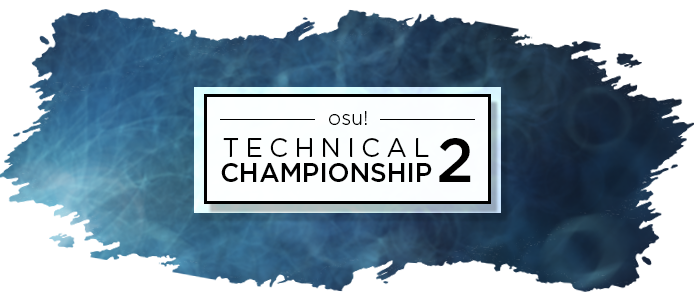

---
tags:
- 'OTC #2'
- OTC 2
- OTC#2
- OTC2
---

# osu! Technical Championship #2

The **osu! Technical Championship #2** (***OTC #2***) was a double elimination three-on-three osu! tournament hosted by ![][flag_US] [IsoSubjectPi](https://osu.ppy.sh/users/3989669). osu! Technical Championship featured complex rhythms and sliders, unorthodox patterns, and a wide variety of technical mapping in its mappools. It was the 2nd installment of the osu! Technical Championship.

## Tournament Schedule

| Event | Timestamp |
| --: | :-- |
| Registration Phase | 2018-03-16/2018-04-08 |
| Live Drawings | 2018-04-08 (14:00 UTC) |
| Group Stage | 2018-04-14/2018-04-16 |
| Round of 16 | 2018-04-21/2018-04-22 |
| Quarterfinals | 2018-04-28/2018-04-29 |
| Semifinals | 2018-05-05/2018-05-06 |
| Finals | 2018-05-12/2018-05-26 |
| Grand Finals | 2018-05-27 |

## Prizes

In every tournament, people conquering a place on the podium are eligible to receive unique prizes created specifically for osu! Technical Championship #2 winners. It is possible that these items change with every installment of the osu! Technical Championship.

| Placing | Prize(s) |
| :-: | :-- |
|  | 1 month of osu!supporter tag, unique profile badge |

## Organisation

The osu! Technical Championship #2 was run by various osu! community members.

| Position | Member(s) |
| :-- | :-- |
| Host | ![][flag_US] [IsoSubjectPi](https://osu.ppy.sh/users/3989669) |
| Admin | ![][flag_DE] [Sir Hywen](https://osu.ppy.sh/users/7601761), ![][flag_HK] [-GN Junior](https://osu.ppy.sh/users/3901754), ![][flag_US] [Saber](https://osu.ppy.sh/users/4272841) |
| Mappool QAT | ![][flag_US] [IsoSubjectPi](https://osu.ppy.sh/users/3989669), ![][flag_HK] [-GN Junior](https://osu.ppy.sh/users/3901754), ![][flag_US] [Saber](https://osu.ppy.sh/users/4272841), ![][flag_FR] [Kaeldori](https://osu.ppy.sh/users/962519), ![][flag_CA] [Septembre](https://osu.ppy.sh/users/3666816), ![][flag_SG] [-Engel-](https://osu.ppy.sh/users/9424243), ![][flag_GB] [Nega](https://osu.ppy.sh/users/3181083) |
| Map Selector | ![][flag_US] [IsoSubjectPi](https://osu.ppy.sh/users/3989669), ![][flag_HK] [-GN Junior](https://osu.ppy.sh/users/3901754), ![][flag_FR] [Kaeldori](https://osu.ppy.sh/users/962519), ![][flag_CA] [Septembre](https://osu.ppy.sh/users/3666816), ![][flag_SG] [-Engel-](https://osu.ppy.sh/users/9424243), ![][flag_US] [- Marii -](https://osu.ppy.sh/users/5691561), ![][flag_EG] [Mohab500](https://osu.ppy.sh/users/10520912), ![][flag_CN] [VRainbow](https://osu.ppy.sh/users/3635214) |
| Mappool Tester | ![][flag_GB] [Nega](https://osu.ppy.sh/users/3181083), ![][flag_GB] [SoraRoxas01](https://osu.ppy.sh/users/1986262), ![][flag_GB] [Best459](https://osu.ppy.sh/users/8185366), ![][flag_GB] [OskaRRRitoS](https://osu.ppy.sh/users/7051163) |
| Designer | ![][flag_TH] [Trigonoculus](https://osu.ppy.sh/users/7627013), ![][flag_US] [- Marii -](https://osu.ppy.sh/users/5691561), ![][flag_DE] [Sir Hywen](https://osu.ppy.sh/users/7601761) |
| Streamer | ![][flag_DE] [Sir Hywen](https://osu.ppy.sh/users/7601761), ![][flag_FR] [Kaeldori](https://osu.ppy.sh/users/962519), ![][flag_FI] [SanteriP](https://osu.ppy.sh/users/1981187), ![][flag_CA] [Neko Rin](https://osu.ppy.sh/users/6720237), ![][flag_FR] [Spartan Plume](https://osu.ppy.sh/users/2553166) |
| Commentator | ![][flag_FI] [SanteriP](https://osu.ppy.sh/users/1981187), ![][flag_CA] [Neko Rin](https://osu.ppy.sh/users/6720237), ![][flag_NL] [Blue-Orb](https://osu.ppy.sh/users/6612210), ![][flag_AR] [juliancaia](https://osu.ppy.sh/users/6612210), ![][flag_SG] [woahsia](https://osu.ppy.sh/users/195946), ![][flag_PL] [Dabis](https://osu.ppy.sh/users/509575) |
| Referee | ![][flag_US] [IsoSubjectPi](https://osu.ppy.sh/users/3989669), ![][flag_DE] [Sir Hywen](https://osu.ppy.sh/users/7601761), ![][flag_HK] [-GN Junior](https://osu.ppy.sh/users/3901754), ![][flag_SG] [-Engel-](https://osu.ppy.sh/users/9424243), ![][flag_CN] [VRainbow](https://osu.ppy.sh/users/3635214), ![][flag_SG] [woahsia](https://osu.ppy.sh/users/195946), ![][flag_US] [Noya](https://osu.ppy.sh/users/4276374), ![][flag_DK] [Pennek](https://osu.ppy.sh/users/3723742), ![][flag_TW] [EthanTC](https://osu.ppy.sh/users/9539163), ![][flag_DE] [likejaxirl](https://osu.ppy.sh/users/7093373), ![][flag_FR] [Kasumii-sama](https://osu.ppy.sh/users/6177263), ![][flag_US] [Hot Cocoa](https://osu.ppy.sh/users/4986705), ![][flag_DK] [MASQQ](https://osu.ppy.sh/users/5351497), ![][flag_CA] [Neko Rin](https://osu.ppy.sh/users/6720237), ![][flag_PL] [- Dave -](https://osu.ppy.sh/users/3604693) |
| Wiki Editor | ![][flag_ID] [fajar13k](https://osu.ppy.sh/users/7100002) |

## Links

- [Discussion thread](https://osu.ppy.sh/community/forums/topics/716902)
- [OTC Discord server](https://discord.gg/GGMmSu5)
- [Livestream](https://www.twitch.tv/osutechnicalchampionship)
- **[Statistics sheet](https://docs.google.com/spreadsheets/u/1/d/e/2PACX-1vRed7lghpc9idlDYxeX5gpK60LKKzSztLXJ_9fU34x4Dbk0J9QYyUwE0x7zEqHoP2uaLw4gDkkj18h5/pubhtml)**

-----------------------

## Participants

| Team | Members |
| :-- | :-- |
| **727pp XddXDDDDD** | **![][flag_US] [Gifted](https://osu.ppy.sh/users/7971757)**, ![][flag_US] [Informous](https://osu.ppy.sh/users/4734244), ![][flag_US] [Timowoof](https://osu.ppy.sh/users/6390912), ![][flag_US] [WillCookie](https://osu.ppy.sh/users/6404488), ![][flag_US] [KoaLeahq](https://osu.ppy.sh/users/4321876), ![][flag_US] [iliekwaffles](https://osu.ppy.sh/users/4644354) |
| **anime hardba55** | **![][flag_RU] [z0mbir](https://osu.ppy.sh/users/4939107)**, ![][flag_RU] [Cappu](https://osu.ppy.sh/users/6754712), ![][flag_RU] [Enns](https://osu.ppy.sh/users/6375834), ![][flag_UA] [Cloz1k](https://osu.ppy.sh/users/4548264), ![][flag_RU] [-Trigger](https://osu.ppy.sh/users/1890143), ![][flag_JP] [surume yotyan](https://osu.ppy.sh/users/1704801) |
| **beat that meat** | **![][flag_CA] [Ignite](https://osu.ppy.sh/users/3122948)**, ![][flag_CA] [kyle](https://osu.ppy.sh/users/2694475), ![][flag_CA] [Hakurae](https://osu.ppy.sh/users/6284304), ![][flag_US] [Megatron is bad](https://osu.ppy.sh/users/2570828), ![][flag_CA] [ThePro365](https://osu.ppy.sh/users/4415285), ![][flag_PL] [Bartek22830](https://osu.ppy.sh/users/6404027) |
| **BOOMING** | **![][flag_GB] [meltz](https://osu.ppy.sh/users/6741042)**, ![][flag_GB] [Obese](https://osu.ppy.sh/users/3937808), ![][flag_GB] [Morbid](https://osu.ppy.sh/users/6963690), ![][flag_GB] [\[- Creepy -\]](https://osu.ppy.sh/users/7263333), ![][flag_GB] [\[Bloo\]](https://osu.ppy.sh/users/6778877), ![][flag_GB] [Wario](https://osu.ppy.sh/users/4361729) |
| **Cauldron Bois** | **![][flag_US] [Ghouru](https://osu.ppy.sh/users/6273855)**, ![][flag_US] [Viggma](https://osu.ppy.sh/users/8299854), ![][flag_US] [Hau](https://osu.ppy.sh/users/7018565), ![][flag_US] [Bredzeus](https://osu.ppy.sh/users/6314059), ![][flag_US] [nop](https://osu.ppy.sh/users/9475159), ![][flag_US] [Ryuti](https://osu.ppy.sh/users/2752589) |
| **Dumii has a small dick** | **![][flag_NL] [Blue-Orb](https://osu.ppy.sh/users/6612210)**, ![][flag_FI] [SanteriP](https://osu.ppy.sh/users/1981187), ![][flag_GB] [Spare](https://osu.ppy.sh/users/2204373), ![][flag_NL] [Lazer](https://osu.ppy.sh/users/1799925), ![][flag_AU] [Dumii](https://osu.ppy.sh/users/3068044), ![][flag_AU] [GranDSenpai](https://osu.ppy.sh/users/3997580) |
| **e-girl respecters** | **![][flag_HU] [Lexion](https://osu.ppy.sh/users/5271371)**, ![][flag_HU] [emu1337](https://osu.ppy.sh/users/2185987), ![][flag_HU] [Jugment](https://osu.ppy.sh/users/3727686), ![][flag_HU] [RatinA0](https://osu.ppy.sh/users/3436625) |
| **El perro me vomito la cama** | **![][flag_UY] [Raby](https://osu.ppy.sh/users/5218320)**, ![][flag_AR] [Cata](https://osu.ppy.sh/users/5958063), ![][flag_AR] [Pein](https://osu.ppy.sh/users/2212941), ![][flag_AR] [Zaq Lev](https://osu.ppy.sh/users/3188703), ![][flag_UY] [Madozito](https://osu.ppy.sh/users/4054429), ![][flag_UY] [Vetium](https://osu.ppy.sh/users/6159669) |
| **EzSupport** | **![][flag_RU] [Sharfik](https://osu.ppy.sh/users/5533261)**, ![][flag_RU] [\_NotSoFast\_](https://osu.ppy.sh/users/4663676), ![][flag_RU] [SadnessWillSear](https://osu.ppy.sh/users/6591496), ![][flag_RU] [callmebatya](https://osu.ppy.sh/users/3512112), ![][flag_RU] [-Miruku-](https://osu.ppy.sh/users/4712799), ![][flag_RU] [iok144](https://osu.ppy.sh/users/2171652) |
| **Fernet con coca** | **![][flag_AR] [-Urushihara-](https://osu.ppy.sh/users/6169195)**, ![][flag_US] [Cappy](https://osu.ppy.sh/users/6668666), ![][flag_AR] [Arua](https://osu.ppy.sh/users/5038837), ![][flag_AR] [Lubren](https://osu.ppy.sh/users/6573651), ![][flag_AR] [Ceja](https://osu.ppy.sh/users/4185921), ![][flag_US] [Jac](https://osu.ppy.sh/users/7804116) |
| **Floating up** | **![][flag_KR] [Gomo Pslvarh](https://osu.ppy.sh/users/1206417)**, ![][flag_TW] [Flask](https://osu.ppy.sh/users/959763), ![][flag_TW] [\_Shield](https://osu.ppy.sh/users/1860489), ![][flag_CN] [Crystal](https://osu.ppy.sh/users/1646397), ![][flag_KR] [Pring](https://osu.ppy.sh/users/3478883), ![][flag_ID] [smh](https://osu.ppy.sh/users/1629553) |
| **Fully Unified Chistianized Kingdom** | **![][flag_DE] [Ami](https://osu.ppy.sh/users/2114779)**, ![][flag_RO] [badeu](https://osu.ppy.sh/users/1473890), ![][flag_FI] [Jerekek](https://osu.ppy.sh/users/4162662), ![][flag_DE] [Heros5k](https://osu.ppy.sh/users/6676303), ![][flag_LT] [Auji](https://osu.ppy.sh/users/4114438), ![][flag_DE] [\[ Nano \]](https://osu.ppy.sh/users/5132353) |
| **Insert Funny Team Name Here** | **![][flag_TR] [heyronii](https://osu.ppy.sh/users/5642779)**, ![][flag_US] [crippletoytl](https://osu.ppy.sh/users/3256645), ![][flag_TR] [egemenbsrms](https://osu.ppy.sh/users/4520477), ![][flag_CN] [Play Offline](https://osu.ppy.sh/users/5791401), ![][flag_SG] [GSBlank](https://osu.ppy.sh/users/2312106), ![][flag_SG] [moosepi](https://osu.ppy.sh/users/1868745) |
| **izako boars** | **![][flag_PL] [alien](https://osu.ppy.sh/users/4743869)**, ![][flag_PL] [Michni](https://osu.ppy.sh/users/3543130), ![][flag_PL] [QbaDoo](https://osu.ppy.sh/users/2395405), ![][flag_PL] [MrBooM](https://osu.ppy.sh/users/1837989), ![][flag_PL] [Piggey](https://osu.ppy.sh/users/4163860) |
| **Jeffrey's Down Syndrome** | **![][flag_ID] [Fuma](https://osu.ppy.sh/users/1501956)**, ![][flag_ID] [Skydiver](https://osu.ppy.sh/users/4750008), ![][flag_MY] [ShaneLiang](https://osu.ppy.sh/users/6716499), ![][flag_VN] [Sakura Rain](https://osu.ppy.sh/users/6577176), ![][flag_ID] [dika312](https://osu.ppy.sh/users/741613), ![][flag_ID] [Rayhan Hakim](https://osu.ppy.sh/users/4085825) |
| **Latex Intolerance** | **![][flag_CA] [peng](https://osu.ppy.sh/users/6043452)**, ![][flag_GB] [Bubbleman](https://osu.ppy.sh/users/5182050), ![][flag_US] [Donkey Kong](https://osu.ppy.sh/users/4787150), ![][flag_US] [Woey](https://osu.ppy.sh/users/3792472), ![][flag_NO] [-GN](https://osu.ppy.sh/users/895581), ![][flag_GB] [Jameslike](https://osu.ppy.sh/users/2415743) |
| **Meido** | **![][flag_BE] [Hanori](https://osu.ppy.sh/users/7078544)**, ![][flag_US] [Riley](https://osu.ppy.sh/users/3007925), ![][flag_US] [Palace](https://osu.ppy.sh/users/6893333), ![][flag_KR] [Eurus](https://osu.ppy.sh/users/3426414), ![][flag_BE] [5joshi](https://osu.ppy.sh/users/4279650), ![][flag_US] [melloe](https://osu.ppy.sh/users/2367616) |
| **Nai Fen Pu Pu** | **![][flag_CN] [davidqu2](https://osu.ppy.sh/users/6090175)**, ![][flag_CN] [DuNaI](https://osu.ppy.sh/users/2522197), ![][flag_CN] [NightFiend](https://osu.ppy.sh/users/1955058), ![][flag_CN] [\[Echoes\]](https://osu.ppy.sh/users/6678196), ![][flag_CN] [bless\_von](https://osu.ppy.sh/users/7853092), ![][flag_CN] [Sugiura Kanade](https://osu.ppy.sh/users/7839397) |
| **Odeio Negrxs** | **![][flag_BR] [favela](https://osu.ppy.sh/users/5295743)**, ![][flag_BR] [Texats](https://osu.ppy.sh/users/1638293), ![][flag_BR] [My Angelsim](https://osu.ppy.sh/users/3149577), ![][flag_BR] [Mirtrax](https://osu.ppy.sh/users/2290888), ![][flag_BR] [Mystia](https://osu.ppy.sh/users/4277702), ![][flag_US] [DigiDrake](https://osu.ppy.sh/users/7863082) |
| **owo for the uwu** | **![][flag_US] [Kaoura](https://osu.ppy.sh/users/5831631)**, ![][flag_US] [Freddie Benson](https://osu.ppy.sh/users/7342622), ![][flag_US] [Yuza](https://osu.ppy.sh/users/3077037), ![][flag_US] [BearZyo](https://osu.ppy.sh/users/6116759), ![][flag_GB] [xFluffyo](https://osu.ppy.sh/users/8397226), ![][flag_US] [Cyrame](https://osu.ppy.sh/users/6489078) |
| **Ricola** | **![][flag_DE] [Chriz](https://osu.ppy.sh/users/2355080)**, ![][flag_CH] [Deramok](https://osu.ppy.sh/users/1428455), ![][flag_CH] [My Angel Uni](https://osu.ppy.sh/users/7045024) ![][flag_CH] [Paddington](https://osu.ppy.sh/users/2643216), ![][flag_CH] [Akani](https://osu.ppy.sh/users/2323137), ![][flag_CH] [gtfo](https://osu.ppy.sh/users/2114760) |
| **Rubber Conquest** | **![][flag_US] [DigitalHypno](https://osu.ppy.sh/users/4384207)**, ![][flag_US] [Apraxia](https://osu.ppy.sh/users/4194445), ![][flag_CA] [Azer](https://osu.ppy.sh/users/2155578), ![][flag_KR] [Cookiezi](https://osu.ppy.sh/users/124493), ![][flag_US] [Monko2k](https://osu.ppy.sh/users/4852013), ![][flag_US] [Toy](https://osu.ppy.sh/users/2757689) |
| **SAMPLE TEXT** | **![][flag_UA] [kug1](https://osu.ppy.sh/users/6997572)**, ![][flag_UA] [Katoru](https://osu.ppy.sh/users/7032191), ![][flag_UA] [Xorts](https://osu.ppy.sh/users/6581597), ![][flag_RU] [Jabba](https://osu.ppy.sh/users/6068934), ![][flag_RU] [Snowslide](https://osu.ppy.sh/users/4198283), ![][flag_RU] [Okinotori](https://osu.ppy.sh/users/4346274) |
| **save me slider break** | **![][flag_US] [big brain](https://osu.ppy.sh/users/8165181)**, ![][flag_FI] [Bolek\_gamer\_05](https://osu.ppy.sh/users/7786382), ![][flag_FR] [Carbone](https://osu.ppy.sh/users/5783315), ![][flag_FR] [nasobol90](https://osu.ppy.sh/users/7630971), ![][flag_US] [GiantSharkTooth](https://osu.ppy.sh/users/8533847) |
| **small boob** | **![][flag_CA] [Daoski](https://osu.ppy.sh/users/4752536)**, ![][flag_CL] [Yumbtah](https://osu.ppy.sh/users/2784663), ![][flag_US] [Trance](https://osu.ppy.sh/users/2170951), ![][flag_CL] [\[-Neon-\]](https://osu.ppy.sh/users/6064382), ![][flag_CA] [Yuuki-chan](https://osu.ppy.sh/users/7031287), ![][flag_CL] [-Dylson-](https://osu.ppy.sh/users/6315784) |
| **spy kids** | **![][flag_DE] [kiiro127](https://osu.ppy.sh/users/3959582)**, ![][flag_LT] [Damach](https://osu.ppy.sh/users/3065625), ![][flag_DE] [- Slice -](https://osu.ppy.sh/users/4239265), ![][flag_LT] [shineroo](https://osu.ppy.sh/users/4360718), ![][flag_ES] [Snowwy](https://osu.ppy.sh/users/4393092), ![][flag_DE] [My Angel Hifumi](https://osu.ppy.sh/users/6951812) |
| **STARTails\*** | **![][flag_US] [Aoiyuuki-](https://osu.ppy.sh/users/1820694)**, ![][flag_US] [mook](https://osu.ppy.sh/users/6362900), ![][flag_US] [Conyoh](https://osu.ppy.sh/users/4844496), ![][flag_US] [L1NKED](https://osu.ppy.sh/users/3087205), ![][flag_DE] [Vyshus](https://osu.ppy.sh/users/7812798), ![][flag_US] [Tohru](https://osu.ppy.sh/users/3596296) |
| **Tak Halal Sial** | **![][flag_SG] [LanJay](https://osu.ppy.sh/users/5210595)**, ![][flag_SG] [Asterix-](https://osu.ppy.sh/users/5138193), ![][flag_SG] [Loslite](https://osu.ppy.sh/users/6398160), ![][flag_SG] [SupremeChaoss](https://osu.ppy.sh/users/7506646), ![][flag_SG] [sinn](https://osu.ppy.sh/users/4262229), ![][flag_SG] [Datenshi Yohane](https://osu.ppy.sh/users/7171857) |
| **technical issues** | **![][flag_CA] [Penguin UwU](https://osu.ppy.sh/users/3992043)**, ![][flag_CN] [MyAngelMiku](https://osu.ppy.sh/users/7025429), ![][flag_CA] [\_DerF](https://osu.ppy.sh/users/8385190), ![][flag_CA] [Itou](https://osu.ppy.sh/users/8070357), ![][flag_DK] [Tenaxzity](https://osu.ppy.sh/users/7395529), ![][flag_CA] [WonderfulDay](https://osu.ppy.sh/users/7278983) |
| **We Have No Friends** | **![][flag_DE] [KatzEasy](https://osu.ppy.sh/users/3087892)**, ![][flag_GB] [Jimzzyyy](https://osu.ppy.sh/users/3600441), ![][flag_DE] [xenou](https://osu.ppy.sh/users/2539403), ![][flag_DE] [prhtnsm](https://osu.ppy.sh/users/6702666), ![][flag_DE] [M3ddly](https://osu.ppy.sh/users/9154962), ![][flag_RO] [Chamosiala](https://osu.ppy.sh/users/1469892) |
| **Wisdom Chair** | **![][flag_US] [mniminwoo](https://osu.ppy.sh/users/3929529)**, ![][flag_US] [Noname0](https://osu.ppy.sh/users/280147), ![][flag_US] [Ritzeh](https://osu.ppy.sh/users/1028387), ![][flag_US] [Mlaw](https://osu.ppy.sh/users/3126596), ![][flag_US] [Exarch](https://osu.ppy.sh/users/5370153), ![][flag_US] [Tem](https://osu.ppy.sh/users/5393042) |
| **Zzz** | **![][flag_DK] [Spork Lover](https://osu.ppy.sh/users/3417469)**, ![][flag_DK] [waefwerf](https://osu.ppy.sh/users/3868653), ![][flag_EE] [Abyssal](https://osu.ppy.sh/users/5527745), ![][flag_IL] [Xilver](https://osu.ppy.sh/users/3099689), ![][flag_NO] [ItsKevZii](https://osu.ppy.sh/users/5201225), ![][flag_DK] [iamVill](https://osu.ppy.sh/users/6295380) |

## Groups

| Group | Top Seed | High Seed | Low Seed | Unseeded |
| :-: | :-- | :-- | :-- | :-- |
| **A** | izako boars | Odeio Negrxs | beat that meat | Meido |
| **B** | Rubber Conquest | EzSupport | anime hardba55 | STARTails\* |
| **C** | Floating up | Fernet con coca | Insert Funny Team Name Here | save me slider break |
| **D** | Latex Intolerance | Jeffrey's Down Syndrome | Nai Fen Pu Pu | SAMPLE TEXT |
| **E** | Fully Unified Chistianized Kingdom | owo for the uwu | spy kids | Ricola |
| **F** | Dumii has a small dick | BOOMING | El perro me vomito la cama | technical issues |
| **G** | Zzz | We Have No Friends | small boob | Cauldron Bois |
| **H** | Wisdom Chair | 727pp XddXDDDDD | Tak Halal Sial | e-girl respecters |

-----------------------

## Podium

This competition has come to an end and resulted in the following podium:

| Placing | Team(s) |
| :-: | :-- |
|  | Rubber Conquest |
|  | Floating up |
|  | Latex Intolerance |

-----------------------

## Mappools

### Finals

**This mappool was played in Finals and Grand Finals.**

**[Download the mappack here! (159 MB)](http://www.mediafire.com/file/8efiufeeekqvc92/OTC+%232+Finals+Mappool.zip)**

- NoMod
  - [lapix - Labyrinth (Akali) \[Who's the fucking gangster?\]](https://osu.ppy.sh/beatmapsets/615878#osu/1299008)
  - [Halozy - Deconstruction Star (Lasse) \[Constellation\]](https://osu.ppy.sh/beatmapsets/431010#osu/1024742)
  - [Kuroneko Dungeon - Ryoushi no Umi no Lindwurm (Crystal) \[Quantum\]](https://osu.ppy.sh/beatmapsets/405167#osu/880761)
  - [Camellia - WHAT THE CAT!? (Akali) \[Procatstination (Meowzerrin Style)\]](https://osu.ppy.sh/beatmapsets/588018#osu/1245003)
  - [Basshunter - Ievan Polkka Trance Remix (Starrodkirby86, Beuchi-chan) \[BeuKirby\]](https://osu.ppy.sh/beatmapsets/10406#osu/66246)
  - [Team Grimoire - C18H27NO3 (-Bakari-) \[Bakari's INFINITE\]](https://osu.ppy.sh/beatmapsets/223370#osu/686421)
- Hidden
  - [Zhou Li Ming - Pi Li Pa La (bakabaka) \[Extra\]](https://osu.ppy.sh/beatmapsets/136065#osu/340652)
  - [Y&Co. - Daisuke (moph) \[moph's Expert\]](https://osu.ppy.sh/beatmapsets/697087#osu/1481149)
  - [lapix - Foolish Hero (P\*Light Remix) (Cassu2) \[Irrationality 2.0\]](https://osu.ppy.sh/beatmapsets/551111#osu/1454407)
- HardRock
  - [Function Phantom - Euclid (byfar) \[Fifth Postulate\]](https://osu.ppy.sh/beatmapsets/419614#osu/908093)
  - [M2U - Velocity (Karen) \[Expert\]](https://osu.ppy.sh/beatmapsets/593985#osu/1256483)
  - [Memme - Avalanche (Starfy) \[Extreme\]](https://osu.ppy.sh/beatmapsets/611095#osu/1318360)
- DoubleTime
  - [Lon - Yuru Fuwa Jukai Girl (Mystica) \[Mystica's Insane\]](https://osu.ppy.sh/beatmapsets/49686#osu/155438)
  - [Reol - Gokusaishiki (Hakurei Yoru) \[Yoru's Insane\]](https://osu.ppy.sh/beatmapsets/422369#osu/954129)
  - [Camellia - Towards The Horizon (Zexous) \[Zexous' Insane\]](https://osu.ppy.sh/beatmapsets/578445#osu/1325051)
- Tiebreaker
  - **[Camellia - Feelin Sky (Camellia's "200step" Self-remix) (Mir) \[Redemption\]](https://osu.ppy.sh/beatmapsets/703731#osu/1488838)**

### Semifinals

**[Download the mappack here! (112 MB)](http://www.mediafire.com/file/wgait7rkr0fmg6o/OTC+%232+Semifinals+Mappool.zip)**

- NoMod
  - [Hommarju - Rock It (toybot) \[Blast Off\]](https://osu.ppy.sh/beatmapsets/700421#osu/1484308)
  - [Memme - Extreme Fantasy (-PC) \[Reverie\]](https://osu.ppy.sh/beatmapsets/697899#osu/1478228)
  - [Max Coveri - Running in the 90's (Monstrata) \[FINAL STAGE\]](https://osu.ppy.sh/beatmapsets/739262#osu/1559974)
  - [lapix feat. Renko from ORANGEJAM - Concept Of Reality (ProfessionalBox) \[eXiStEnCe\]](https://osu.ppy.sh/beatmapsets/559140#osu/1182535)
  - [CLIFF EDGE feat. Nakamura Maiko - The Distance (handsome) \[Master\]](https://osu.ppy.sh/beatmapsets/580375#osu/1228840)
  - [Memme - Pandemonium (handsome) \[handsome's Master: #1\]](https://osu.ppy.sh/beatmapsets/734190#osu/1562545)
- Hidden
  - [Beatdrop - Phase 1 (rickyboi) \[SHD\]](https://osu.ppy.sh/beatmapsets/54511#osu/168031)
  - [Ocelot - KAEDE (Moecho) \[Moecho's EX\]](https://osu.ppy.sh/beatmapsets/660630#osu/1551210)
  - [Memme - Blessing Snow (sahuang) \[sahuang's Extra\]](https://osu.ppy.sh/beatmapsets/688128#osu/1456309)
- HardRock
  - [Skrillex & Diplo - To U ft AlunaGeorge (NeilPerry, schoolboy) \[Neil & schoolboy Extra\]](https://osu.ppy.sh/beatmapsets/723626#osu/1538272)
  - [Sota Fujimori - Move That Body -Extended Mix- (Skystar) \[Extreme\]](https://osu.ppy.sh/beatmapsets/220220#osu/538404)
  - [Eleharmonica remixed by kors k - Der Wald (kors k Remix) (RLC) \[RLC's Extra\]](https://osu.ppy.sh/beatmapsets/581787#osu/1481178)
- DoubleTime
  - [Susumu Hirasawa - Big Brother (Gens) \[Insane\]](https://osu.ppy.sh/beatmapsets/10714#osu/41586)
  - [monet - Noborenai Sakamichi (Mirash) \[Insane\]](https://osu.ppy.sh/beatmapsets/671607#osu/1424776)
  - [Shawn Wasabi + YDG - Burnt Rice (feat. YUNG GEMMY) (Spork Lover) \[Spork Lover's Insane\]](https://osu.ppy.sh/beatmapsets/710329#osu/1502635)
- Tiebreaker
  - **[Camellia - dreamless wanderer (Shiirn) \[ouroboros\]](https://osu.ppy.sh/beatmapsets/620981#osu/1309336)**

### Quarterfinals

**[Download the mappack here! (153 MB)](http://www.mediafire.com/file/kfj2yg3mek1og6e/OTC+%232+Quarterfinals+Mappool.zip)**

- NoMod
  - [succducc - me & u (Nathan) \[together\]](https://osu.ppy.sh/beatmapsets/699749#osu/1481624)
  - [Nekomata Gekidan - AsiaN distractive (Regou) \[Orientalism\]](https://osu.ppy.sh/beatmapsets/657122#osu/1392007)
  - [TrySail - adrenaline!!! (Mir) \[Rush\]](https://osu.ppy.sh/beatmapsets/676340#osu/1430503)
  - [Au5 - Reiteration (NeilPerry) \[Relapse\]](https://osu.ppy.sh/beatmapsets/487775#osu/1392244)
  - [Yunomi & nicamoq - Indoor Kei Nara Trackmaker (Snow Note) \[Another\]](https://osu.ppy.sh/beatmapsets/525846#osu/1115999)
  - [Getty vs. DJ DiA - Fox4-Raize- (Xilver) \[Xilver's Extra\]](https://osu.ppy.sh/beatmapsets/482552#osu/1038473)
- Hidden
  - [YUC'e - Sengoku HOP (Nathan) \[YOISHO\]](https://osu.ppy.sh/beatmapsets/564329#osu/1193089)
  - [Suzaku - VANESSA (ignorethis) \[Extra\]](https://osu.ppy.sh/beatmapsets/27862#osu/100981)
  - [Eagle - Hypersonik (NeilPerry) \[NeilPerry\]](https://osu.ppy.sh/beatmapsets/517959#osu/1104818)
- HardRock
  - [Ocelot - TSUBAKI (Hollow Wings) \[Extra\]](https://osu.ppy.sh/beatmapsets/364574#osu/832152)
  - [fhana - Hello!My World!! (toybot, Haruto) \[toyruto's Insane\]](https://osu.ppy.sh/beatmapsets/657341#osu/1414767)
  - [M2U & NICODE feat. Guriri & Lucy - Myosotis (Kloyd) \[Kloyd's Extreme\]](https://osu.ppy.sh/beatmapsets/439323#osu/947796)
- DoubleTime
  - [USAO - Miracle 5ympho X (Extended Mix) (Asphyxia) \[Asphyxia's Hard\]](https://osu.ppy.sh/beatmapsets/230739#osu/775814)
  - [BUTAOTOME - Makkuro na Yuki (Mirash, PandaHero) \[Collab Lunatic\]](https://osu.ppy.sh/beatmapsets/627338#osu/1413933)
  - [Mitchie M feat. Hatsune Miku with KAITO - Ohedo Julia-Night (Natsu) \[Insane\]](https://osu.ppy.sh/beatmapsets/664099#osu/1413791)
- Tiebreaker
  - **[Billain - Boogie (Various Mappers) \[Edge\]](https://osu.ppy.sh/beatmapsets/411435#osu/966177)**

### Round of 16

**[Download the mappack here! (117 MB)](http://www.mediafire.com/file/hffn6onh89b658x/OTC+%232+Ro16+Mappool.zip)**

- NoMod
  - [Nekomata Master+ - Proof of the existence (Alheak) \[Expert\]](https://osu.ppy.sh/beatmapsets/427864#osu/923589)
  - [BPM15Q - BPM15Q (Yugu) \[159!\]](https://osu.ppy.sh/beatmapsets/609904#osu/1287908)
  - [Hatsune Miku - No,39 (val0108) \[0108 style\]](https://osu.ppy.sh/beatmapsets/34097#osu/110914)
  - [Virtual Riot feat. Varia - Edge (Mun) \[Terminus\]](https://osu.ppy.sh/beatmapsets/596439#osu/1261164)
  - [Yuu - U.N. Owen was Her? (DJPop) \[DJPop's Insane\]](https://osu.ppy.sh/beatmapsets/7104#osu/31906)
  - [Inspector K - Disconnected Hardkore (CanBlaster Remix) (Shiirn) \[Unconnected\]](https://osu.ppy.sh/beatmapsets/37242#osu/108762)
- Hidden
  - [Reol - FLASH BACK (Nathan) \[BLACKOUT\]](https://osu.ppy.sh/beatmapsets/409397#osu/888715)
  - [Zekk - Calling (Mirash) \[Mirash's Another\]](https://osu.ppy.sh/beatmapsets/673878#osu/1427700)
  - [a\_hisa - Fanatiker der Liebe \[Extra\]](http://osu.uu.gl/s/167091)
- HardRock
  - [syrela - Pulsation (Lasse) \[Expert\]](https://osu.ppy.sh/beatmapsets/677886#osu/1433497)
  - [Powerless - Soleil (DTM9 Nowa, \_DT3) \[#3: DTM9 Nowa & \_DT3\]](https://osu.ppy.sh/beatmapsets/721494#osu/1524297)
  - [Sota Fujimori - DANCE ALL NIGHT (DTM9 Nowa) [Nowa's Insane]](https://osu.ppy.sh/beatmapsets/600303#osu/1310291)
- DoubleTime
  - [Jeff Williams - Time to say Goodbye (feat. Casey Lee Williams) (Pho) \[Hyper\]](https://osu.ppy.sh/beatmapsets/237854#osu/628995)
  - [Anamanaguchi - Prom Night (Bonsai) \[Insane\]](https://osu.ppy.sh/beatmapsets/398797#osu/867655)
  - [LYOD 9 - 999 (TicClick) \[Insane\]](https://osu.ppy.sh/beatmapsets/463334#osu/992107)
- Tiebreaker
  - **[Rawtekk - Amber's Love Was Like A Marble (Billain Remix) (byfar, Aiceo, Rohi6, RLC) \[Marmoreal\]](https://osu.ppy.sh/beatmapsets/413386#osu/896430)**

### Group Stage

**[Download the mappack here! (153 MB)](http://www.mediafire.com/file/7sesz4tdhk3e3jn/OTC+%232+Group+Stage+Mappool.zip)**

- NoMod
  - [Sota Fujimori - WOBBLE IMPACT \[Black Another\]](http://osu.uu.gl/s/166337)
  - [akari - boys, be "stand up"!! (Hollow Wings, Tsukuyomi) \[Collab Extra\]](https://osu.ppy.sh/beatmapsets/177585#osu/427455)
  - [Zips - Reiwai Terrorism (Broccoly) \[Distortion\]](https://osu.ppy.sh/beatmapsets/101953#osu/269773)
  - [Blaster & Extra Terra - Spacecraft (Hobbes2) \[Hobbes2's Extra\]](https://osu.ppy.sh/beatmapsets/712901#osu/1543913)
  - [Shindig - Stutter (squirrelpascals) \[Another\]](https://osu.ppy.sh/beatmapsets/716749#osu/1552980)
  - [Camellia - Chirality (Nathan) \[Enantiomer\]](https://osu.ppy.sh/beatmapsets/350656#osu/773038)
- Hidden
  - [Nizikawa - F.K.S. (Pho) \[EXHAUST\]](https://osu.ppy.sh/beatmapsets/385427#osu/842512)
  - [Nekomata Master - Greening (Lulu-) \[Tranquility\]](https://osu.ppy.sh/beatmapsets/530173#osu/1482351)
  - [S3RL feat Harri Rush - Nostalgic (Nightcore Mix) (yf\_bmp) \[yf's Insane\]](https://osu.ppy.sh/beatmapsets/591442#osu/1307142)
- HardRock
  - [Utagumi Setsugekka - Yumemi Sunrise (Zweib) \[Insane\]](https://osu.ppy.sh/beatmapsets/132312#osu/338862)
  - [Sota Fujimori - polygon (fanzhen0019) \[fanzhen's Another\]](https://osu.ppy.sh/beatmapsets/559097#osu/1232328)
  - [tofubeats - CANDYYYLAND feat LIZ (Plaudible, Hobbes2) \[Plaubbes' Light Insane\]](https://osu.ppy.sh/beatmapsets/663519#osu/1435453)
- DoubleTime
  - [Mizuki Nana - Shin Ai (Shad0w1and) \[Insane\]](https://osu.ppy.sh/beatmapsets/432550#osu/936014)
  - [Memme - Cherry Blossom (Leader) \[Leader's Hard\]](https://osu.ppy.sh/beatmapsets/442581#osu/964066)
  - [IAMX - Tear Garden (PandaHero, IceBeam) \[Collab Insane\]](https://osu.ppy.sh/beatmapsets/690400#osu/1461203)
- Tiebreaker
  - **[Rusty K - Last Of Us (C00L) \[Survival\]](https://osu.ppy.sh/beatmapsets/669153#osu/1415376)**

------------------------------------------------------------------------

## Match Results

### Grand Finals

| Sunday, 2018-05-27 |  |  |  |  |
| --: | :-: | :-: | :-- | :-- |
| **Rubber Conquest** | **6** | 1 | Floating up | [#1](https://osu.ppy.sh/community/matches/42816259) |

### Finals

| Saturday, 2018-05-12 |  |  |  |  |
| --: | :-: | :-: | :-- | :-- |
| Floating up | 3 | **6** | **Rubber Conquest** | [#1](https://osu.ppy.sh/community/matches/42411160) |

| Sunday, 2018-05-13 |  |  |  |  |
| --: | :-: | :-: | :-- | :-- |
| **Latex Intolerance** | **6** | 3 | Zzz | [#1](https://osu.ppy.sh/community/matches/42445467) |

| Sunday, 2018-05-26 |  |  |  |  |
| --: | :-: | :-: | :-- | :-- |
| **Floating up** | **6** | 0 | Latex Intolerance | -win by default- |

### Semifinals

| Saturday, 2018-05-05 |  |  |  |  |
| --: | :-: | :-: | :-- | :-- |
| **Latex Intolerance** | **5** | 0 | Tak Halal Sial | [#1](https://osu.ppy.sh/community/matches/42225047) |
| Wisdom Chair | 0 | **5** | **Floating up** | [#1](https://osu.ppy.sh/community/matches/42226598) |
| **Rubber Conquest** | **5** | 0 | Dumii has a small dick | [#1](https://osu.ppy.sh/community/matches/42228520) |
| **Zzz** | **5** | 2 | Fully Unified Chistianized Kingdom | [#1](https://osu.ppy.sh/community/matches/42230056) |

| Sunday, 2018-05-06 |  |  |  |  |
| --: | :-: | :-: | :-- | :-- |
| Dumii has a small dick | 0 | **5** | **Zzz** | [#1](https://osu.ppy.sh/community/matches/42263115) |
| Wisdom Chair | 1 | **5** | **Latex Intolerance** | [#1](https://osu.ppy.sh/community/matches/42264660) |

### Quarterfinals

| Saturday, 2018-04-29 |  |  |  |  |
| --: | :-: | :-: | :-- | :-- |
| Odeio Negrxs | 0 | **5** | **EzSupport** | -win by default- |
| **We Have No Friends** | **5** | 1 | spy kids | [#1](https://osu.ppy.sh/community/matches/42027341) |
| El perro me vomito la cama | 3 | **5** | **SAMPLE TEXT** | [#1](https://osu.ppy.sh/community/matches/42031830) |
| Fernet con coca | 1 | **5** | **Fully Unified Chistianized Kingdom** | [#1](https://osu.ppy.sh/community/matches/42037843) |
| Tak Halal Sial | 0 | **5** | **Rubber Conquest** | [#1](https://osu.ppy.sh/community/matches/42031778) |
| Latex Intolerance | 4 | **5** | **Dumii has a small dick** | [#1](https://osu.ppy.sh/community/matches/42033735) |
| **Wisdom Chair** | **5** | 1 | izako boars | [#1](https://osu.ppy.sh/community/matches/42039012) |

| Sunday, 2018-04-28 |  |  |  |  |
| --: | :-: | :-: | :-- | :-- |
| **Floating up** | **5** | 0 | Zzz | [#1](https://osu.ppy.sh/community/matches/42058100) |
| **Tak Halal Sial** | **5** | 2 | We Have No Friends | [#1](https://osu.ppy.sh/community/matches/42059678) |
| izako boars | 1 | **5** | **Fully Unified Chistianized Kingdom** | [#1](https://osu.ppy.sh/community/matches/42064757) |
| **Zzz** | **5** | 1 | SAMPLE TEXT | [#1](https://osu.ppy.sh/community/matches/42064978) |
| **Latex Intolerance** | **5** | 0 | EzSupport | -win by default- |

### Round of 16

| Saturday, 2018-04-21 |  |  |  |  |
| --: | :-: | :-: | :-- | :-- |
| **Wisdom Chair** | **5** | 2 | Odeio Negrxs | [#1](https://osu.ppy.sh/community/matches/41848222) |
| **izako boars** | **5** | 4 | EzSupport | [#1](https://osu.ppy.sh/community/matches/41834719) |
| **Floating up** | **5** | 1 | We Have No Friends | [#1](https://osu.ppy.sh/community/matches/41833214) |
| El perro me vomito la cama | 0 | **5** | **Tak Halal Sial** | -win by default- |

| Sunday, 2018-04-22 |  |  |  |  |
| --: | :-: | :-: | :-- | :-- |
| **Zzz** | **5** | 0 | spy kids | [#1](https://osu.ppy.sh/community/matches/41880888) |
| **Rubber Conquest** | **5** | 0 | SAMPLE TEXT | [#1](https://osu.ppy.sh/community/matches/41872121) |
| **Latex Intolerance** | **5** | 0 | Fernet con coca | -win by default- |
| Fully Unified Chistianized Kingdom | 4 | **5** | **Dumii has a small dick** | [#1](https://osu.ppy.sh/community/matches/41875764) |

### Group Stage

| Match ID | Saturday, 2018-04-14 |  |  |  |  |
| :-: | --: | :-: | :-: | :-- | :-- |
| C1 | **Floating up** | **4** | 0 | save me slider break | -win by default- |
| C2 | **Floating up** | **4** | 0 | Insert Funny Team Name Here | [#1](https://osu.ppy.sh/community/matches/41649601) |
| D5 | **SAMPLE TEXT** | **4** | 2 | Nai Fen Pu Pu | [#1](https://osu.ppy.sh/community/matches/41649714) |
| E1 | **Fully Unified Chistianized Kingdom** | **4** | 3 | Ricola | [#1](https://osu.ppy.sh/community/matches/41649863) |
| B3 | anime hardba55 | 3 | **4** | **EzSupport** | [#1](https://osu.ppy.sh/community/matches/41651634) |
| D3 | **Jeffrey's Down Syndrome** | **4** | 1 | Nai Fen Pu Pu | [#1](https://osu.ppy.sh/community/matches/41651388) |
| E2 | **Fully Unified Chistianized Kingdom** | **4** | 1 | spy kids | [#1](https://osu.ppy.sh/community/matches/41651313) |
| D2 | **Latex Intolerance** | **4** | 0 | Nai Fen Pu Pu | [#1](https://osu.ppy.sh/community/matches/41653185) |
| F1 | **Dumii has a small dick** | **4** | 0 | technical issues | [#1](https://osu.ppy.sh/community/matches/41653395) |
| H3 | 727pp XddXDDDDD | 0 | **4** | **Tak Halal Sial** | [#1](https://osu.ppy.sh/community/matches/41654314) |
| F2 | **Dumii has a small dick** | **4** | 2 | El perro me vomito la cama | [#1](https://osu.ppy.sh/community/matches/41655164) |
| H2 | **Wisdom Chair** | **4** | 2 | Tak Halal Sial | [#1](https://osu.ppy.sh/community/matches/41656353) |
| E3 | owo for the uwu | 1 | **4** | **spy kids** | [#1](https://osu.ppy.sh/community/matches/41657811) |
| F3 | BOOMING | 0 | **4** | **El perro me vomito la cama** | [#1](https://osu.ppy.sh/community/matches/41657302) |
| C3 | **Fernet con coca** | **4** | 2 | Insert Funny Team Name Here | [#1](https://osu.ppy.sh/community/matches/41659001) |
| B2 | **Rubber Conquest** | **4** | 0 | EzSupport | -win by default- |
| H1 | **Wisdom Chair** | **4** | 2 | e-girl respecters | [#1](https://osu.ppy.sh/community/matches/41661359) |
| A3 | **Odeio Negrxs** | **4** | 1 | beat that meat | [#1](https://osu.ppy.sh/community/matches/41663746) |
| G3 | **We Have No Friends** | **4** | 0 | small boob | [#1](https://osu.ppy.sh/community/matches/41663727) |
| B1 | **Rubber Conquest** | **4** | 0 | STARTails\* | [#1](https://osu.ppy.sh/community/matches/41665530) |

| Match ID | Sunday, 2018-04-15 |  |  |  |  |
| :-: | --: | :-: | :-: | :-- | :-- |
| H5 | **e-girl respecters** | **4** | 2 | Tak Halal Sial | [#1](https://osu.ppy.sh/community/matches/41681735) |
| F4 | **BOOMING** | **4** | 1 | Dumii has a small dick | [#1](https://osu.ppy.sh/community/matches/41694951) |
| A1 | **izako boars** | **4** | 0 | Meido | [#1](https://osu.ppy.sh/community/matches/41684478) |
| A2 | **izako boars** | **4** | 0 | beat that meat | [#1](https://osu.ppy.sh/community/matches/41686277)
| D6 | **SAMPLE TEXT** | **4** | 3 | Jeffrey's Down Syndrome | [#1](https://osu.ppy.sh/community/matches/41686029) |
| B5 | STARTails\* | 3 | **4** | **EzSupport** | [#1](https://osu.ppy.sh/community/matches/41687767) |
| D4 | Jeffrey's Down Syndrome | 0 | **4** | **Latex Intolerance** | [#1](https://osu.ppy.sh/community/matches/41687895) |
| F6 | technical issues | 2 | **4** | **BOOMING** | [#1](https://osu.ppy.sh/community/matches/41687795) |
| B6 | STARTails\* | 0 | **4** | **anime hardba55** | [#1](https://osu.ppy.sh/community/matches/41690625) |
| C4 | Fernet con coca | 1 | **4** | **Floating up** | [#1](https://osu.ppy.sh/community/matches/41689486) |
| D1 | **Latex Intolerance** | **4** | 1 | SAMPLE TEXT | [#1](https://osu.ppy.sh/community/matches/41689536) |
| G1 | **Zzz** | **4** | 0 | Cauldron Bois | [#1](https://osu.ppy.sh/community/matches/41689288) |
| B4 | anime hardba55 | 1 | **4** | **Rubber Conquest** | [#1](https://osu.ppy.sh/community/matches/41691377) |
| C6 | save me slider break | 0 | **4** | **Fernet con coca** | [#1](https://osu.ppy.sh/community/matches/41691256) |
| G6 | Cauldron Bois | 2 | **4** | **We Have No Friends** | [#1](https://osu.ppy.sh/community/matches/41691371) |
| A4 | Odeio Negrxs | 1 | **4** | **izako boars** | [#1](https://osu.ppy.sh/community/matches/41693178) |
| C5 | save me slider break | 0 | **4** | **Insert Funny Team Name Here** | -win by default- |
| E4 | owo for the uwu | 0 | **4** | **Fully Unified Chistianized Kingdom** | [#1](https://osu.ppy.sh/community/matches/41692845) |
| E5 | Ricola | 2 | **4** | **spy kids** | [#1](https://osu.ppy.sh/community/matches/41693407) |
| G4 | We Have No Friends | 0 | **4** | **Zzz** | [#1](https://osu.ppy.sh/community/matches/41692858) |
| A6 | Meido | 2 | **4** | **Odeio Negrxs** | [#1](https://osu.ppy.sh/community/matches/41695027) |
| E6 | **Ricola** | **4** | 3 | owo for the uwu | [#1](https://osu.ppy.sh/community/matches/41695210) |
| G2 | **Zzz** | **4** | 0 | small boob | [#1](https://osu.ppy.sh/community/matches/41694860) |
| G6 | Cauldron Bois | 2 | **4** | **We Have No Friends** | [#1](https://osu.ppy.sh/community/matches/41691371) |
| A5 | Meido | 1 | **4** | **beat that meat** | [#1](https://osu.ppy.sh/community/matches/41696932) |
| F5 | technical issues | 1 | **4** | **El perro me vomito la cama** | [#1](https://osu.ppy.sh/community/matches/41697158) |
| H4 | 727pp XddXDDDDD | 1 | **4** | **Wisdom Chair** | [#1](https://osu.ppy.sh/community/matches/41699693) |

| Match ID | Monday, 2018-04-16 |  |  |  |  |
| :-: | --: | :-: | :-: | :-- | :-- |
| G5 | Cauldron Bois | 3 | **4** | **small boob** | [#1](https://osu.ppy.sh/community/matches/41701534) |

------------------------------------------------------------------------

## Ruleset

### General Rules

1. Staff will not be allowed to participate in the tournament. This excludes streamers, commentators, and graphic designers.
2. All members of a team must be within the rank range at the time of their teams registration.
3. All staff and players must be in the Discord server at all times.
4. Captains must respond to an opponents request to reschedule a match. Matches may be rescheduled automatically if captains refuse to communicate.
5. All Staff and Players are expected to act mature and respectful towards eachother. Disobeying this may result in disqualification from the tournament or removal from staff without warning.

### Team Match Procedure

1. Captains are invited a few minutes before match time.
2. Once both teams are in the lobby, either captain will be given host to select their teams warmup. Once the first warmup is complete, the opposing captain will be given host to select their teams warmup as well.
   - Host must be returned to the referee before each map begins.
   - Warmup maps must not be longer than 5 minutes.
   - Warmups are not allowed in Group Stage.
3. After warmups are finished, both captains will `roll` (`!roll` in chat). The highest rolling team will choose the first ban and pick.
4. Captains will alternate banning maps for their team, with the highest rolling team banning first.
   - Each team receives two bans each.
   - Teams are not required to ban two maps and may ban one or zero maps if they wish.
5. The captain of the highest rolling team will choose the first map to be played. Once the first map is complete, the opposing captain will then choose second map. Teams will continue alternating picks until the match is complete.
   - If both teams reach match point (e.g. both teams are one point away from victory) the tiebreaker will be played to decide the winner of the match.
   - The tiebreaker is FreeMod. The allowed mods are Easy, HardRock, Hidden, and Flashlight. Combining mods is allowed, as well as using nomod. All mods are optional.

### Referee Match Procedure

1. Create the lobby 5 - 10 minutes before match time. Name the lobby "OTC: (Team 1) vs. (Team 2)", then set it to ScoreV2 and Team VS.
   - Group Stage will be played as BO7.
   - Round of 16 will be played as BO9.
   - Quarterfinals will be played as BO9.
   - Semifinals will be played as BO9.
   - **Finals and Grand Finals** will be played as BO11.
2. Invite the captains a few minutes before match time.
   - Teams may use a player from their team as a substitute captain if the official captain is not available for the match.
3. Once both teams are in the lobby, give either captain host to select their teams warmup. Once the first warmup is complete, give the opposing captain host to select their teams warmup as well.
   - Host must be returned to the referee before each map begins.
   - Warmup maps must not be longer than 5 minutes.
   - Warmups are not allowed in Group Stage.
4. After warmups are finished, have both captains roll (!roll in chat). Team with highest `!roll` score will choose the first ban and pick.
   - Referees may choose to use a 90 second timer for bans and picks at their discretion. If it’s decided that a timer will be used, it must be used for the entirety of the match for both teams. It’s highly recommended that a timer be used if teams or referees have back-to-back matches.
   - Referees can use the “!mp timer 90” command to begin a 90 second countdown. The “!mp aborttimer” command can be used to end the countdown.
5. Captains will alternate banning maps for their team, with the highest rolling team banning first.
   - Each team receives two bans each.
   - Teams are not required to ban two maps and may ban one or zero maps if they wish.
6. The captain of the highest rolling team then choose the first map to be played. Use the `!mp map <Beatmap ID>` command to select the chosen map. Apply the appropriate mods and once both teams have readied up, start the map with the `!mp start 5` command.
   - The beatmap ID for each map can be found under the appropriate mappool through the [statistics sheet](https://docs.google.com/spreadsheets/u/1/d/e/2PACX-1vRed7lghpc9idlDYxeX5gpK60LKKzSztLXJ_9fU34x4Dbk0J9QYyUwE0x7zEqHoP2uaLw4gDkkj18h5/pubhtml#).
7. Once the first map is complete, the lowest rolling team will then choose second map. Use the same procedure as the last step, then continue alternating between teams for picks until the match is finished.
   - If both teams reach match point (i.e. both teams are one point away from victory) the tiebreaker will be played to decide the winner of the match.
   - The tiebreaker is FreeMod. The allowed mods are EZ, HR, HD, and FL. Combining mods is allowed, as well as using nomod. All mods are optional.
8. Once the the match is finished, say your goodbyes and close the lobby by using the `!mp close` command.
9. Finally, report the match result(s) in the `#match-results` channel on OTC Discord server using The pinned format.

### Important Notes

- If a player disconnects during a map, the team with the disconnected player may choose to replay the map if they wish, this is only allowed once per game for each team.
- If both teams end a map with the exact same score, the map will be replayed to determine the winner.
- If a team or player is acting inappropriate, please report it to a Host or Admin in private immediately.
  - If you are uncertain of any rules or how to handle a situation, please don’t hesitate to ask a Host or Admin.

[flag_AR]: /wiki/shared/flag/AR.gif
[flag_AU]: /wiki/shared/flag/AU.gif
[flag_BE]: /wiki/shared/flag/BE.gif
[flag_BR]: /wiki/shared/flag/BR.gif
[flag_CA]: /wiki/shared/flag/CA.gif
[flag_CH]: /wiki/shared/flag/CH.gif
[flag_CL]: /wiki/shared/flag/CL.gif
[flag_CN]: /wiki/shared/flag/CN.gif
[flag_DE]: /wiki/shared/flag/DE.gif
[flag_DK]: /wiki/shared/flag/DK.gif
[flag_EE]: /wiki/shared/flag/EE.gif
[flag_EG]: /wiki/shared/flag/EG.gif
[flag_ES]: /wiki/shared/flag/ES.gif
[flag_FI]: /wiki/shared/flag/FI.gif
[flag_FR]: /wiki/shared/flag/FR.gif
[flag_GB]: /wiki/shared/flag/GB.gif
[flag_HK]: /wiki/shared/flag/HK.gif
[flag_HU]: /wiki/shared/flag/HU.gif
[flag_ID]: /wiki/shared/flag/ID.gif
[flag_IL]: /wiki/shared/flag/IL.gif
[flag_JP]: /wiki/shared/flag/JP.gif
[flag_KR]: /wiki/shared/flag/KR.gif
[flag_LT]: /wiki/shared/flag/LT.gif
[flag_MY]: /wiki/shared/flag/MY.gif
[flag_NL]: /wiki/shared/flag/NL.gif
[flag_NO]: /wiki/shared/flag/NO.gif
[flag_PL]: /wiki/shared/flag/PL.gif
[flag_RO]: /wiki/shared/flag/RO.gif
[flag_RU]: /wiki/shared/flag/RU.gif
[flag_SG]: /wiki/shared/flag/SG.gif
[flag_TH]: /wiki/shared/flag/TH.gif
[flag_TR]: /wiki/shared/flag/TR.gif
[flag_TW]: /wiki/shared/flag/TW.gif
[flag_UA]: /wiki/shared/flag/UA.gif
[flag_US]: /wiki/shared/flag/US.gif
[flag_UY]: /wiki/shared/flag/UY.gif
[flag_VN]: /wiki/shared/flag/VN.gif
