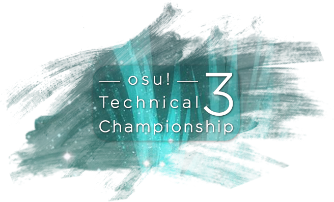

---
tags:
  - "OTC #3"
  - OTC 3
  - OTC#3
  - OTC3
---

# osu! Technical Championship #3

The **osu! Technical Championship #3** (***OTC #3***) was a 1v1 double-elimination osu! tournament hosted by ::{ flag=US }:: [IsoSubjectPi](https://osu.ppy.sh/users/3989669). osu! Technical Championship featured complex rhythms and sliders, unorthodox patterns, and a wide variety of technical mapping in its mappools. It was the third instalment of the osu! Technical Championship.

## Tournament schedule

| Event | Timestamp |
| --: | :-- |
| Registration phase | 2018-12-18/2018-12-30 |
| Live drawings | 2018-04-08 (19:00 UTC) |
| Group stage | 2019-01-12/2019-01-20 |
| Round of 32 | 2019-01-25/2019-01-26 |
| Round of 16 | 2019-01-27/2019-01-29 |
| Quarterfinals | 2019-02-02/2019-02-03 |
| Semifinals | 2019-02-08/2019-02-09 |
| Finals | 2019-02-16/2019-02-20 |
| Grand Finals | 2019-02-26/2019-03-02 |

## Prizes

| Placing | Prize(s) |
| :-: | :-- |
|  | Unique profile badge |

## Organisation

The osu! Technical Championship #3 was run by various osu! community members.

| Position | Member(s) |
| :-- | :-- |
| Host | ::{ flag=US }:: [IsoSubjectPi](https://osu.ppy.sh/users/3989669) |
| Admin | ::{ flag=US }:: [dblade](https://osu.ppy.sh/users/4272841), ::{ flag=DE }:: [Diffractive](https://osu.ppy.sh/users/7601761) |
| Mappool selector | ::{ flag=US }:: [IsoSubjectPi](https://osu.ppy.sh/users/3989669), ::{ flag=US }:: [dblade](https://osu.ppy.sh/users/4272841), ::{ flag=GB }:: [Nega](https://osu.ppy.sh/users/3181083), ::{ flag=GB }:: [SoraRoxas01](https://osu.ppy.sh/users/1986262) |
| Mappool tester | ::{ flag=GB }:: [Best459](https://osu.ppy.sh/users/8185366), ::{ flag=TR }:: [heyronii](https://osu.ppy.sh/users/5642779), ::{ flag=CN }:: [VRainbow](https://osu.ppy.sh/users/3635214), ::{ flag=UY }:: [moondust](https://osu.ppy.sh/users/4662596), ::{ flag=NL }:: [Lazer](https://osu.ppy.sh/users/1799925), ::{ flag=US }:: [Toy](https://osu.ppy.sh/users/2757689), ::{ flag=PL }:: [Bartek22830](https://osu.ppy.sh/users/6404027) |
| Designer | ::{ flag=DE }:: [Diffractive](https://osu.ppy.sh/users/7601761), ::{ flag=US }:: [DigitalHypno](https://osu.ppy.sh/users/4384207) |
| Streamer | ::{ flag=US }:: [IsoSubjectPi](https://osu.ppy.sh/users/3989669), ::{ flag=US }:: [dblade](https://osu.ppy.sh/users/4272841), ::{ flag=DE }:: [Diffractive](https://osu.ppy.sh/users/7601761), ::{ flag=DE }:: [Ami](https://osu.ppy.sh/users/2114779) |
| Commentator | ::{ flag=DE }:: [Diffractive](https://osu.ppy.sh/users/7601761), ::{ flag=SG }:: [woahsia](https://osu.ppy.sh/users/195946), ::{ flag=NL }:: [Blue-Orb](https://osu.ppy.sh/users/6612210), ::{ flag=US }:: [Woey](https://osu.ppy.sh/users/3792472), ::{ flag=DE }:: [Ami](https://osu.ppy.sh/users/2114779), ::{ flag=US }:: [itzpigeon](https://osu.ppy.sh/users/9828300) |
| Referee | ::{ flag=US }:: [IsoSubjectPi](https://osu.ppy.sh/users/3989669), ::{ flag=DE }:: [Diffractive](https://osu.ppy.sh/users/7601761), ::{ flag=TR }:: [112servis](https://osu.ppy.sh/users/3953470), ::{ flag=TW }:: [EthanTC](https://osu.ppy.sh/users/9539163), ::{ flag=FR }:: [Kasumii-sama](https://osu.ppy.sh/users/6177263), ::{ flag=FR }:: [\[ Mimir \]](https://osu.ppy.sh/users/7382734), ::{ flag=GB }:: [Nega](https://osu.ppy.sh/users/3181083), ::{ flag=DK }:: [Pennek](https://osu.ppy.sh/users/3723742), ::{ flag=DE }:: [Rymus](https://osu.ppy.sh/users/6449966), ::{ flag=US }:: [tigereyes144](https://osu.ppy.sh/users/6499811), ::{ flag=CN }:: [VRainbow](https://osu.ppy.sh/users/3635214), ::{ flag=BE }:: [DraQeu](https://osu.ppy.sh/users/4425520), ::{ flag=US }:: [Hot Cocoa](https://osu.ppy.sh/users/4986705) |
| Wiki editor | ::{ flag=ID }:: [Naruk](https://osu.ppy.sh/users/7100002) |

## Links

- [Discussion thread](https://osu.ppy.sh/community/forums/topics/843523)
- [OTC Discord server](https://discord.gg/GGMmSu5)
- [OTC #3 Challonge brackets](https://challonge.com/7fdmwror)
- [Livestream](https://www.twitch.tv/osutechnicalchampionship)
- **[Statistics sheet](https://docs.google.com/spreadsheets/d/e/2PACX-1vQ-IjXdVEQfj6mGB9DNDXhzJiXGx0sJ5QgJUMF7kRIxU4DAV9kEer1YsVK4-RxgfOI0NHMczJZmpFUi/pubhtml)**

## Participants

| Seed | Members |
| :-- | :-- |
| Top | ::{ flag=DE }:: [Dustice](https://osu.ppy.sh/users/754565), ::{ flag=RO }:: [badeu](https://osu.ppy.sh/users/1473890), ::{ flag=PL }:: [MrBooM](https://osu.ppy.sh/users/1837989), ::{ flag=GB }:: [Bubbleman](https://osu.ppy.sh/users/5182050), ::{ flag=FR }:: [Musty](https://osu.ppy.sh/users/251683), ::{ flag=IL }:: [Xilver15](https://osu.ppy.sh/users/3099689), ::{ flag=BR }:: [Mystia](https://osu.ppy.sh/users/4277702), ::{ flag=UA }:: [Ayla](https://osu.ppy.sh/users/4548264), ::{ flag=US }:: [Apraxia](https://osu.ppy.sh/users/4194445), ::{ flag=SG }:: [Demonical](https://osu.ppy.sh/users/5447609), ::{ flag=US }:: [Gifted](https://osu.ppy.sh/users/7971757), ::{ flag=DE }:: [Knalli](https://osu.ppy.sh/users/8147403), ::{ flag=US }:: [WillCookie](https://osu.ppy.sh/users/6404488), ::{ flag=AU }:: [TheOmyNomy](https://osu.ppy.sh/users/4241054), ::{ flag=BR }:: [My Angelsim](https://osu.ppy.sh/users/3149577), ::{ flag=US }:: [Cappy](https://osu.ppy.sh/users/6668666) |
| High | ::{ flag=TW }:: [Flask](https://osu.ppy.sh/users/959763), ::{ flag=GB }:: [TopSp1n](https://osu.ppy.sh/users/7657761), ::{ flag=RU }:: [Aden](https://osu.ppy.sh/users/4342841), ::{ flag=KR }:: [ftg](https://osu.ppy.sh/users/2128311), ::{ flag=CN }:: [MyAngelMiku](https://osu.ppy.sh/users/7025429), ::{ flag=US }:: [im a fancy lad](https://osu.ppy.sh/users/4908650), ::{ flag=NL }:: [Lilily](https://osu.ppy.sh/users/6502403), ::{ flag=DE }:: [respektive](https://osu.ppy.sh/users/1023489), ::{ flag=US }:: [Woey](https://osu.ppy.sh/users/3792472), ::{ flag=AU }:: [CeilingWaffle](https://osu.ppy.sh/users/3336090), ::{ flag=GR }:: [Riven](https://osu.ppy.sh/users/3638005), ::{ flag=AU }:: [Monk Gyatso](https://osu.ppy.sh/users/4012086), ::{ flag=VN }:: [Shironi](https://osu.ppy.sh/users/8660120), ::{ flag=PL }:: [Marek Marucha](https://osu.ppy.sh/users/2395405), ::{ flag=CN }:: [Crystal](https://osu.ppy.sh/users/1646397), ::{ flag=US }:: [Tekkito](https://osu.ppy.sh/users/7075211) |
| Low | ::{ flag=RU }:: [Hidemi](https://osu.ppy.sh/users/5932021), ::{ flag=RU }:: [neko ds](https://osu.ppy.sh/users/4688735), ::{ flag=AR }:: [-Urushihara-](https://osu.ppy.sh/users/6169195), ::{ flag=GB }:: [hlo](https://osu.ppy.sh/users/2232928), ::{ flag=BR }:: [Astris](https://osu.ppy.sh/users/6173856), ::{ flag=US }:: [Jace](https://osu.ppy.sh/users/4394718), ::{ flag=RU }:: [Unikenl](https://osu.ppy.sh/users/8432708), ::{ flag=AU }:: [GranDSenpai](https://osu.ppy.sh/users/3997580), ::{ flag=AU }:: [nickerdead3](https://osu.ppy.sh/users/4999984), ::{ flag=AR }:: [FastoFreezu](https://osu.ppy.sh/users/3608846), ::{ flag=US }:: [Leebs](https://osu.ppy.sh/users/7636779), ::{ flag=US }:: [Junjou](https://osu.ppy.sh/users/7077648), ::{ flag=RU }:: [Okinotori](https://osu.ppy.sh/users/4346274), ::{ flag=BE }:: [Hanori](https://osu.ppy.sh/users/7078544), ::{ flag=US }:: [Shiorii](https://osu.ppy.sh/users/5387798), ::{ flag=PL }:: [\_demo](https://osu.ppy.sh/users/3556891) |
| Unseeded | ::{ flag=SE }:: [Saika-](https://osu.ppy.sh/users/4316633), ::{ flag=ES }:: [RivenXLukario](https://osu.ppy.sh/users/9582556), ::{ flag=PL }:: [esemoka57](https://osu.ppy.sh/users/2272413), ::{ flag=SE }:: [--w--](https://osu.ppy.sh/users/4386042), ::{ flag=SK }:: [Hranolka](https://osu.ppy.sh/users/6149947), ::{ flag=MN }:: [seegii](https://osu.ppy.sh/users/4659319), ::{ flag=CA }:: [amano megumi](https://osu.ppy.sh/users/5426640), ::{ flag=AT }:: [Teppi](https://osu.ppy.sh/users/1371974), ::{ flag=DE }:: [Megure](https://osu.ppy.sh/users/3468264), ::{ flag=DE }:: [papika](https://osu.ppy.sh/users/7093373), ::{ flag=RU }:: [ncuh](https://osu.ppy.sh/users/2891734), ::{ flag=RU }:: [Desew](https://osu.ppy.sh/users/6393126), ::{ flag=US }:: [Aeril](https://osu.ppy.sh/users/4334976), ::{ flag=RU }:: [\_Kyori](https://osu.ppy.sh/users/6660546), ::{ flag=AU }:: [Takagaki](https://osu.ppy.sh/users/3698691), ::{ flag=BE }:: [5joshi](https://osu.ppy.sh/users/4279650) |

## Groups

| Group | Top Seed | High Seed | Low Seed | Unseeded |
| :-: | :-- | :-- | :-- | :-- |
| **A** | ::{ flag=AU }:: [TheOmyNomy](https://osu.ppy.sh/users/4241054) | ::{ flag=CN }:: [Crystal](https://osu.ppy.sh/users/1646397) | ::{ flag=US }:: [Junjou](https://osu.ppy.sh/users/7077648) | ::{ flag=ES }:: [RivenXLukario](https://osu.ppy.sh/users/9582556) |
| **B** | ::{ flag=US }:: [Apraxia](https://osu.ppy.sh/users/4194445) | ::{ flag=GB }:: [TopSp1n](https://osu.ppy.sh/users/7657761) | ::{ flag=AU }:: [nickerdead3](https://osu.ppy.sh/users/4999984) | ::{ flag=MN }:: [seegii](https://osu.ppy.sh/users/4659319) |
| **C** | ::{ flag=UA }:: [Ayla](https://osu.ppy.sh/users/4548264) | ::{ flag=RU }:: [Aden](https://osu.ppy.sh/users/4342841) | ::{ flag=AU }:: [GranDSenpai](https://osu.ppy.sh/users/3997580) | ::{ flag=SK }:: [Hranolka](https://osu.ppy.sh/users/6149947) |
| **D** | ::{ flag=BR }:: [My Angelsim](https://osu.ppy.sh/users/3149577) | ::{ flag=KR }:: [ftg](https://osu.ppy.sh/users/2128311) | ::{ flag=BR }:: [Astris](https://osu.ppy.sh/users/6173856) | ::{ flag=SE }:: [--w--](https://osu.ppy.sh/users/4386042) |
| **E** | ::{ flag=FR }:: [Musty](https://osu.ppy.sh/users/251683) | ::{ flag=US }:: [Woey](https://osu.ppy.sh/users/3792472) | ::{ flag=RU }:: [Unikenl](https://osu.ppy.sh/users/8432708) | ::{ flag=RU }:: [Desew](https://osu.ppy.sh/users/6393126) |
| **F** | ::{ flag=BR }:: [Mystia](https://osu.ppy.sh/users/4277702) | ::{ flag=TW }:: [Flask](https://osu.ppy.sh/users/959763) | ::{ flag=US }:: [Leebs](https://osu.ppy.sh/users/7636779) | ::{ flag=AT }:: [Teppi](https://osu.ppy.sh/users/1371974) |
| **G** | ::{ flag=RO }:: [badeu](https://osu.ppy.sh/users/1473890) | ::{ flag=VN }:: [Shironi](https://osu.ppy.sh/users/8660120) | ::{ flag=BE }:: [Hanori](https://osu.ppy.sh/users/7078544) | ::{ flag=PL }:: [esemoka57](https://osu.ppy.sh/users/2272413) |
| **H** | ::{ flag=US }:: [Cappy](https://osu.ppy.sh/users/6668666) | ::{ flag=AU }:: [CeilingWaffle](https://osu.ppy.sh/users/3336090) | ::{ flag=AR }:: [-Urushihara-](https://osu.ppy.sh/users/6169195) | ::{ flag=RU }:: [ncuh](https://osu.ppy.sh/users/2891734) |
| **I** | ::{ flag=GB }:: [Bubbleman](https://osu.ppy.sh/users/5182050) | ::{ flag=CN }:: [MyAngelMiku](https://osu.ppy.sh/users/7025429) | ::{ flag=RU }:: [Okinotori](https://osu.ppy.sh/users/4346274) | ::{ flag=BE }:: [5joshi](https://osu.ppy.sh/users/4279650) |
| **J** | ::{ flag=PL }:: [MrBooM](https://osu.ppy.sh/users/1837989) | ::{ flag=US }:: [im a fancy lad](https://osu.ppy.sh/users/4908650) | ::{ flag=RU }:: [Hidemi](https://osu.ppy.sh/users/5932021) | ::{ flag=AU }:: [Takagaki](https://osu.ppy.sh/users/3698691) |
| **K** | ::{ flag=IL }:: [Xilver15](https://osu.ppy.sh/users/3099689) | ::{ flag=US }:: [Tekkito](https://osu.ppy.sh/users/7075211) | ::{ flag=AR }:: [FastoFreezu](https://osu.ppy.sh/users/3608846) | ::{ flag=US }:: [Aeril](https://osu.ppy.sh/users/4334976) |
| **L** | ::{ flag=SG }:: [Demonical](https://osu.ppy.sh/users/5447609) | ::{ flag=AU }:: [Monk Gyatso](https://osu.ppy.sh/users/4012086) | ::{ flag=US }:: [Jace](https://osu.ppy.sh/users/4394718) | ::{ flag=DE }:: [Megure](https://osu.ppy.sh/users/3468264) |
| **M** | ::{ flag=DE }:: [Knalli](https://osu.ppy.sh/users/8147403) | ::{ flag=DE }:: [respektive](https://osu.ppy.sh/users/1023489) | ::{ flag=PL }:: [\_demo](https://osu.ppy.sh/users/3556891) | ::{ flag=RU }:: [\_Kyori](https://osu.ppy.sh/users/6660546) |
| **N** | ::{ flag=US }:: [WillCookie](https://osu.ppy.sh/users/6404488) | ::{ flag=PL }:: [Marek Marucha](https://osu.ppy.sh/users/2395405) | ::{ flag=US }:: [Shiorii](https://osu.ppy.sh/users/5387798) | ::{ flag=DE }:: [papika](https://osu.ppy.sh/users/7093373) |
| **O** | ::{ flag=US }:: [Gifted](https://osu.ppy.sh/users/7971757) | ::{ flag=GR }:: [Riven](https://osu.ppy.sh/users/3638005) | ::{ flag=GB }:: [hlo](https://osu.ppy.sh/users/2232928) | ::{ flag=SE }:: [Saika-](https://osu.ppy.sh/users/4316633) |
| **P** | ::{ flag=DE }:: [Dustice](https://osu.ppy.sh/users/754565) | ::{ flag=NL }:: [Lilily](https://osu.ppy.sh/users/6502403) | ::{ flag=RU }:: [neko ds](https://osu.ppy.sh/users/4688735) | ::{ flag=CA }:: [amano megumi](https://osu.ppy.sh/users/5426640) |

## Podium

 This competition has come to an end and resulted in the following podium:

| Placing | Player |
| :-: | :-- |
|  | ::{ flag=IL }:: [Xilver15](https://osu.ppy.sh/users/3099689) |
|  | ::{ flag=GB }:: [Bubbleman](https://osu.ppy.sh/users/5182050) |
|  | ::{ flag=RO }:: [badeu](https://osu.ppy.sh/users/1473890) |

## Mappools

### Grand Finals

**[Download the mappack here! (126 MB)](http://www.mediafire.com/file/32fz26v5xxf7pu5/OTC+%233+GF+Mappool.zip)**

- NoMod
  1. [Getty vs. DJ DiA - DropZ-Line- (NeilPerry, Regou) \[Neil x Regou's Extra\]](https://osu.ppy.sh/beatmapsets/727049#osu/1546209)
  2. [kamome sano - tarte tatin (-PC) \[reine des reinettes\]](https://osu.ppy.sh/beatmapsets/849903#osu/1777067)
  3. [Camellia vs Akira Complex - Railgun Roulette (VIP) (NeilPerry, Sharu) \[Neil x Sharu, Syzygy\]](https://osu.ppy.sh/beatmapsets/694402#osu/1469136)
  4. [BlackYooh vs. siromaru - BLACK or WHITE? (Alheak) \[Black\]](https://osu.ppy.sh/beatmapsets/606833#osu/1301562)
  5. [Gesu no Kiwami Otome. - Digital Mogura (dsco) \[Idealist\]](https://osu.ppy.sh/beatmapsets/737340#osu/1556011)
- Hidden
  1. [Camellia - overcomplexification ("Quaternion" Long ver.) (Sing) \[J1 x Sing\]](https://osu.ppy.sh/beatmapsets/753123#osu/1747583)
  2. [Luschka - unravel (Mirash, Jounzan) \[Collab Expert\]](https://osu.ppy.sh/beatmapsets/731933#osu/1544460)
  3. [M2U - The back of Beyond (yaspo) \[Spring\]](https://osu.ppy.sh/beatmapsets/764683#osu/1809913)
- HardRock
  1. [Camellia - The King Of Lions (Regou) \[Extra\]](https://osu.ppy.sh/beatmapsets/885923#osu/1852786)
  2. [factal - Wake Up While Sleeping (Nokris) \[Decubitus Paralitis\]](https://osu.ppy.sh/beatmapsets/749323#osu/1578351)
  3. [xi feat. Sta - Tiferet (ktgster) \[Another\]](https://osu.ppy.sh/beatmapsets/714225#osu/1509637)
- DoubleTime
  1. [Seeed - Ding (Deramok) \[Deramok's Hidden Extra\]](https://osu.ppy.sh/beatmapsets/727333#osu/1570419)
  2. [Culprate, Keota & Sophie Meiers - Mechanic Heartbeat (pishifat) \[Extra\]](https://osu.ppy.sh/beatmapsets/876227#osu/1831280)
  3. [tofubeats - CANDYYYLAND feat LIZ - Pa's Lam System Remix (Plaudible, Hobbes2) \[Plaubbes' Light Insane\]](https://osu.ppy.sh/beatmapsets/663519#osu/1435453)
- Tiebreaker
  1. **[Cranky - T&J (handsome) \[Master\]](https://osu.ppy.sh/beatmapsets/752022#osu/1583147)**

### Finals

**[Download the mappack here! (130 MB)](http://www.mediafire.com/file/dkkspnkg80a8b4u/OTC+%233+Finals+Mappool.zip)**

- NoMod
  1. [Lite Show Magic - TRICKL4SH 220 (Regou) \[TERROR\]](https://osu.ppy.sh/beatmapsets/616696#osu/1300513)
  2. [trapman featuring CreeperWorks - minefield surfing (ktgster) \[Adaption\]](https://osu.ppy.sh/beatmapsets/788448#osu/1654883)
  3. [Culprate & Skorpion - Jester (NeilPerry) \[Transcending Dimensions\]](https://osu.ppy.sh/beatmapsets/848259#osu/1773876)
  4. [Shawn Wasabi + YDG feat. YUNG GEMMY - Burnt Rice (Aiobahn & Jh-Anu Remix) (handsome) \[Master\]](https://osu.ppy.sh/beatmapsets/519256#osu/1103732)
  5. [FUJIN CLUB - Tabi to Ferry (dsco) \[Seaside\]](https://osu.ppy.sh/beatmapsets/704541#osu/1490377)
- Hidden
  1. [Camellia feat. Nanahira - Bassdrop Freaks (2018 "Redrop" ver.) (Mir) \[Beisu Doroppu\]](https://osu.ppy.sh/beatmapsets/806859#osu/1693575)
  2. [Nekomata Master+ - Proof of the existence (IceKalt) \[New World\]](https://osu.ppy.sh/beatmapsets/807310#osu/1694395)
  3. [Aoki Chihiro - Kodou (Hollow Wings) \[HW's Another\]](https://osu.ppy.sh/beatmapsets/687511#osu/1579923)
- HardRock
  1. [lapix feat. Renko - Concept Of Reality (Ameth Rianno) \[Ameth's Extra\]](https://osu.ppy.sh/beatmapsets/559140#osu/1208032)
  2. [DJ Noriken - Turn It Up feat. Kanae Asaba (Akali) \[Friendship is Magic Collab ft Cassu\]](https://osu.ppy.sh/beatmapsets/611867#osu/1291481)
  3. [sakuzyo - Senkyou Ranbu (ktgster) \[EX\]](https://osu.ppy.sh/beatmapsets/460516#osu/986233)
- DoubleTime
  1. [Koronba - Iwashi ga Tsuchi kara Haete Kurunda (Damnjelly) \[Sardine\]](https://osu.ppy.sh/beatmapsets/602367#osu/1580728)
  2. [rerulili - Noushou Sakuretsu Girl (dksslqj) \[dksslqj Style\]](https://osu.ppy.sh/beatmapsets/63434#osu/208935)
  3. [Skrillex - Imma Try It Out (feat. Alvin Risk) (Foreverends) \[Endstep\]](https://bloodcat.com/osu/s/76662)
- Tiebreaker
  1. **[Culprate & Au5 - Impulse (handsome) \[Master\]](https://osu.ppy.sh/beatmapsets/705788#osu/1492654)**

### Semifinals

**[Download the mappack here! (140 MB)](http://www.mediafire.com/file/u7cruip6preqah3/OTC+%233+Semifinals+Mappool.zip)**

- NoMod
  1. [Sara - Ren Ren Ai Ai Cir Cir Cula Cula Tion Tion (pishifat) \[Extra\]](https://osu.ppy.sh/beatmapsets/684060#osu/1447689)
  2. [PinocchioP - All I Need are Things I Like (tutuhaha) \[Things I Like\]](https://osu.ppy.sh/beatmapsets/525070#osu/1636508)
  3. [Camellia - Key of timepieces (Regou) \[Fragments\]](https://osu.ppy.sh/beatmapsets/534800#osu/1132818)
  4. [Sota Fujimori - polygon (Sebu) \[heptagon\]](https://osu.ppy.sh/beatmapsets/422136#osu/1354636)
  5. [Susumu Hirasawa - Pacific Rim Imitation Network (Starrodkirby86) \[KIRBY Mix\]](https://osu.ppy.sh/beatmapsets/31119#osu/105143)
- Hidden
  1. [Culprate & Joe Ford - Gaucho (ScubDomino) \[Extra\]](https://osu.ppy.sh/beatmapsets/847776#osu/1772923)
  2. [ak+q - Excelsia (PoNo) \[Pono's F.ascination\]](https://osu.ppy.sh/beatmapsets/693892#osu/1472946)
  3. [succducc - me & u (YokesPai) \[deceiving extra\]](https://osu.ppy.sh/beatmapsets/851466#osu/1779909)
- HardRock
  1. [Function Phantom - Variable (Chaoslitz) \[Deluxe\]](https://osu.ppy.sh/beatmapsets/751774#osu/1582594)
  2. [LeaF - Evanescent (Rohit6) \[Rohit's Extra\]](https://osu.ppy.sh/beatmapsets/440997#osu/958282)
  3. [Nekomata Gekidan - AsiaN distractive (StarrStyx) \[StarR's Expert\]](https://osu.ppy.sh/beatmapsets/657122#osu/1411709)
- DoubleTime
  1. [Nanahira - Viva Happy (Chaoslitz) \[Chaoz's Another\]](https://osu.ppy.sh/beatmapsets/672621#osu/1508163)
  2. [SAMString - Sakura's Fall (DeviousPanda) \[DeviousPanda's Insane\]](https://osu.ppy.sh/beatmapsets/912860#osu/1906956)
  3. [KYARY PAMYU PAMYU - Kimi no Mikata (VINXIS) \[Ally\]](https://osu.ppy.sh/beatmapsets/808849#osu/1697323)
- Tiebreaker
  1. **[Camellia - Stealth-Dash (Realazy) \[Strikethrough\]](https://osu.ppy.sh/beatmapsets/908451#osu/1895699)**

### Quarterfinals

**[Download the mappack here! (163 MB)](http://www.mediafire.com/file/6bnzwt6be53dt6q/OTC+%233+QF+Mappool.zip)**

- NoMod
  1. [Lite Show Magic (t+pazolite vs C-Show) - Crack Traxxxx (fanzhen0019) \[fanzhen's Hi-Speed Extra\]](https://osu.ppy.sh/beatmapsets/139525#osu/367763)
  2. [YURRY CANON - Nadeshiko color Heart (Saturnalize \[Saturnalize's Extra\]](https://osu.ppy.sh/beatmapsets/682996#osu/1463294)
  3. [Krewella x Diskord - Beggars (Consouls Remix) (NeilPerry, Ameth Rianno) \[Neil x Ameth's Conflux\]](https://osu.ppy.sh/beatmapsets/881753#osu/1843575)
  4. [xi - .357 Magnum (Akali) \[High Noon\]](https://osu.ppy.sh/beatmapsets/155749#osu/546944)
  5. [sasakure.UK - Good Bye, Mr. Jack (Xilver) \[ReMiX\]](https://osu.ppy.sh/beatmapsets/586425#osu/1241924)
- Hidden
  1. [YUC'e - Future Cider (Sing) \[Duplication\]](https://osu.ppy.sh/beatmapsets/591674#osu/1252022)
  2. [MitiS & MaHi - Blu (Speed Up Ver.) (nold\_1702) \[Nold's Posthumous\]](https://osu.ppy.sh/beatmapsets/261911#osu/736300)
  3. [Wakeshima Kanon - Shoujo Shikake no Libretto \~Storytelling by solita\~ (Deramok) \[Dreaming of The Imminent\]](https://osu.ppy.sh/beatmapsets/636105#osu/1349819)
- HardRock
  1. [aran - VOLT (USAO Remix) (Plaudible) \[Plaudible's Extra\]](https://osu.ppy.sh/beatmapsets/732280#osu/1631406)
  2. [Nekomata Master - Byakuya Gentou (ignorethis) \[EX\]](https://osu.ppy.sh/beatmapsets/36849#osu/119375)
  3. [M2U - Dual Fractal (Bor) \[bor's Another\]](https://osu.ppy.sh/beatmapsets/865577#osu/1826401)
- DoubleTime
  1. [LeaF - I (Maddy) \[Hyper\]](https://osu.ppy.sh/beatmapsets/99244#osu/264894)
  2. [Ocelot - KAEDE (Kawashiro) \[Kawa's Extra\]](https://osu.ppy.sh/beatmapsets/660630#osu/1418838)
  3. [EYE\_XY feat. Yoneko - Knight of Firmament (LMT) \[LMT's Insane\]](https://osu.ppy.sh/beatmapsets/317749#osu/1622359)
- Tiebreaker
  1. [AVTechNO!xTreow - DYE/Re:flection+ (dsco) \[RGB\]](https://osu.ppy.sh/beatmapsets/530818#osu/1125109)

### Round of 32 / Round of 16

**[Download the mappack here! (118 MB)](http://www.mediafire.com/file/p55yudv91xozlxs/OTC+%233+Ro3216+Mappool.zip)**

- NoMod
  1. [P\*Light - 2 MINUTES FIGHTERS (F D Flourite) \[Flourite's INFINITE\]](https://osu.ppy.sh/beatmapsets/542163#osu/1150555)
  2. [Nekomata Master - Nekozamurai no Gyakushu (kwk) \[kwk's Extra\]](https://osu.ppy.sh/beatmapsets/518743#osu/1434351)
  3. [Aiobahn - Towa No Utage (w/ YUC'e) \[TANUKI Remix\] (Sing) \[Master\]](https://osu.ppy.sh/beatmapsets/630247#osu/1330531)
  4. [Warak - Cosmic Invaders (Starfy) \[Extraterrestrial\]](https://osu.ppy.sh/beatmapsets/558875#osu/1182106)
  5. [forestpireo - Kanojo Ga Ichiban Shoujo Nanoka? (Starrodkirby86) \[KIRBY Mix\]](https://osu.ppy.sh/beatmapsets/11773#osu/50845)
- Hidden
  1. [Camellia - Chirality (yf\_bmp) \[yf's Another\]](https://osu.ppy.sh/beatmapsets/692068#osu/1498891)
  2. [kurokumo x konoco - Ifuudoudou (Linada) \[Linada's Indecency\]](https://osu.ppy.sh/beatmapsets/656179#osu/1390352)
  3. [mafumafu - \[Nexus\] (William K) \[Extra: Sliders\]](https://osu.ppy.sh/beatmapsets/707703#osu/1633968)
- HardRock
  1. [Function Phantom - Euclid (Tehron) \[Tehron's Extra\]](https://osu.ppy.sh/beatmapsets/427750#osu/980736)
  2. [Culprate - Diablo (VIP) (Yoges) \[Expert\]](https://osu.ppy.sh/beatmapsets/553119#osu/1280280)
  3. [Sound Souler - Paradise (Mir) \[Mir's Insane\]](https://osu.ppy.sh/beatmapsets/686777#osu/1519885)
- DoubleTime
  1. [ChouchouP - Tsukimiyo Rabbit (Zero\_\_wind) \[Hard\]](https://osu.ppy.sh/beatmapsets/122342#osu/322013)
  2. [PinocchioP - Kusaregedou to Chocolate (Kenterz9, sumaru100) \[Hard Chocollab\]](https://osu.ppy.sh/beatmapsets/79454#osu/293536)
  3. [DJ Noriken - Stargazer feat. YUC'e (PSYQUI Remix) (lewski) \[lewdski's Hyper\]](https://osu.ppy.sh/beatmapsets/853867#osu/1784486)
- Tiebreaker
  1. **[PSYQUI - Hype feat. Such (NeilPerry) \[Phosphene\]](https://osu.ppy.sh/beatmapsets/792606#osu/1662480)**

### Group stage

**[Download the mappack here! (62 MB)](http://www.mediafire.com/file/2ia3e3y2ri3o42p/OTC+%233+Group+Stage+Mappool.zip)**

- NoMod
  1. [Getty vs. DJ DiA - Grayed Out -Antifront- (Linada) \[Linada's Expert\]](https://osu.ppy.sh/beatmapsets/578755#osu/1329304)
  2. [Warak - Once Upon A Time (-PC) \[-PC's Extra\]](https://osu.ppy.sh/beatmapsets/519154#osu/1102952)
  3. [Camellia - kodama (-kevincela-) \[-kevincela-'s Extra\]](https://osu.ppy.sh/beatmapsets/488016#osu/1048276)
  4. [SHK - Identity Part 4 (AngelHoney) \[Insane\]](https://osu.ppy.sh/beatmapsets/39428#osu/125702)
- Hidden
  1. [ak+q - Ignotus (Ryuusei Aika) \[FUTURE+\]](https://osu.ppy.sh/beatmapsets/761244#osu/1600778)
  2. [Akiyama Uni - Kaoru Juyouka (Hollow Wings) \[Lunatic\]](https://osu.ppy.sh/beatmapsets/397764#osu/1552101)
- HardRock
  1. [Culprate & Dictate - Pencilina (yaspo) \[yaspo's Insane\]](https://osu.ppy.sh/beatmapsets/722634#osu/1623299)
  2. [yak\_won - Sinus \~Secret Heart\~ (ktgster) \[Extra\]](https://osu.ppy.sh/beatmapsets/736694#osu/1569283)
- DoubleTime
  1. [Reol & nqrse - Ooedo Ranvu (Milan-, pishifat) \[Yumifat's Insane\]](https://osu.ppy.sh/beatmapsets/357544#osu/850729)
  2. [PUP - DVP (Hobbes2) \[Hard\]](https://osu.ppy.sh/beatmapsets/756815#osu/1640693)
- Tiebreaker
  1. **[Billain - Specialist (semaphore) \[Dance\]](https://osu.ppy.sh/beatmapsets/623765#osu/1314755)**

## Match results

### Grand Finals

Tuesday, 26 February 2019:

| Player 1 |  |  | Player 2 | Match link |
| --: | :-: | :-: | :-- | :-- |
| **Bubbleman** ::{ flag=GB }:: | **7** | 3 | ::{ flag=RO }:: badeu | [#1](https://osu.ppy.sh/community/matches/49877643) |

Saturday, 2 March 2019:

| Player 1 |  |  | Player 2 | Match link |
| --: | :-: | :-: | :-- | :-- |
| **Xilver15** ::{ flag=IL }:: | **7** | 6 | ::{ flag=GB }:: Bubbleman | [#1](https://osu.ppy.sh/community/matches/49966632) |

### Finals

Saturday, 16 February 2019:

| Player 1 |  |  | Player 2 | Match link |
| --: | :-: | :-: | :-- | :-- |
| Bubbleman ::{ flag=GB }:: | 6 | **7** | ::{ flag=IL }:: **Xilver15** | [#1](https://osu.ppy.sh/community/matches/49630059) |
| Crystal ::{ flag=CN }:: | 3 | **7** | ::{ flag=RO }:: **badeu** | [#1](https://osu.ppy.sh/community/matches/49628731) |
| **Woey** ::{ flag=US }:: | **7** | 6 | ::{ flag=AT }:: Teppi | [#1](https://osu.ppy.sh/community/matches/49644223) |

Wednesday, 20 February 2019:

| Player 1 |  |  | Player 2 | Match link |
| --: | :-: | :-: | :-- | :-- |
| Woey ::{ flag=US }:: | 0 | **7** | ::{ flag=RO }:: **badeu** | [#1](https://osu.ppy.sh/community/matches/49729495) |

### Semifinals

Saturday, 9 February 2019:

| Player 1 |  |  | Player 2 | Match link |
| --: | :-: | :-: | :-- | :-- |
| Crystal ::{ flag=CN }:: | 5 | **6** | ::{ flag=GB }:: **Bubbleman** | [#1](https://osu.ppy.sh/community/matches/49436594) |
| Apraxia ::{ flag=US }:: | 1 | **6** | ::{ flag=RO }:: **badeu** | [#1](https://osu.ppy.sh/community/matches/49443175) |
| Woey ::{ flag=US }:: | 2 | **6** | ::{ flag=IL }:: **Xilver15** | [#1](https://osu.ppy.sh/community/matches/49451271) |

Sunday, 10 February 2019:

| Player 1 |  |  | Player 2 | Match link |
| --: | :-: | :-: | :-- | :-- |
| neko ds ::{ flag=RU }:: | 2 | **6** | ::{ flag=RU }:: **Okinotori** | [#1](https://osu.ppy.sh/community/matches/49469206) |
| **Teppi** ::{ flag=AT }:: | **6** | 3 | ::{ flag=UA }:: Ayla | [#1](https://osu.ppy.sh/community/matches/49469544) |
| **\_demo** ::{ flag=PL }:: | **6** | 0 | ::{ flag=US }:: Jace | *win by default* |
| Okinotori ::{ flag=RU }:: | 5 | **6** | ::{ flag=AT }:: **Teppi** | [#1](https://osu.ppy.sh/community/matches/49474043) |
| \_demo ::{ flag=PL }:: | 1 | **6** | ::{ flag=RO }:: **badeu** | [#1](https://osu.ppy.sh/community/matches/49474070) |

### Quarterfinals

Saturday, 2 February 2019:

| Player 1 |  |  | Player 2 | Match link |
| --: | :-: | :-: | :-- | :-- |
| **ftg** ::{ flag=KR }:: | **5** | 2 | ::{ flag=US }:: WillCookie | [#1](https://osu.ppy.sh/community/matches/49296446) |
| Apraxia ::{ flag=US }:: | 1 | **5** | ::{ flag=US }:: Woey | [#1](https://osu.ppy.sh/community/matches/49299182) |
| **Crystal** ::{ flag=CN }:: | **5** | 1 | ::{ flag=AT }:: Teppi | [#1](https://osu.ppy.sh/community/matches/49306751) |
| Dustice ::{ flag=DE }:: | 0 | **5** | ::{ flag=MN }:: seegii | *win by default* |
| **Bubbleman** ::{ flag=GB }:: | **5** | 1 | ::{ flag=RU }:: neko ds | [#1](https://osu.ppy.sh/community/matches/49309319) |
| **Xilver15** ::{ flag=IL }:: | **5** | 0 | ::{ flag=PL }:: \_demo | [#1](https://osu.ppy.sh/community/matches/49310921) |
| **Okinotori** ::{ flag=RU }:: | **5** | 3 | ::{ flag=FR }:: Musty | [#1](https://osu.ppy.sh/community/matches/49312981) |
| **Ayla** ::{ flag=UA }:: | **5** | 3 | ::{ flag=PL }:: Marek Marucha | [#1](https://osu.ppy.sh/community/matches/49312624) |
| **badeu** ::{ flag=RO }:: | **5** | 0 | ::{ flag=PL }:: MrBooM | [#1](https://osu.ppy.sh/community/matches/49314628) |
| **Jace** ::{ flag=US }:: | **5** | 0 | ::{ flag=BR }:: Mystia | *win by default* |
| Cappy ::{ flag=US }:: | 0 | **5** | ::{ flag=US }:: **Tekkito** | [#1](https://osu.ppy.sh/community/matches/49321691) |

Sunday, 3 February 2019:

| Player 1 |  |  | Player 2 | Match link |
| --: | :-: | :-: | :-- | :-- |
| **badeu** ::{ flag=RO }:: | **5** | 1 | ::{ flag=KR }:: ftg | [#1](https://osu.ppy.sh/community/matches/49334885) |
| seegii ::{ flag=MN }:: | 2 | **5** | ::{ flag=RU }:: **Okinotori** | [#1](https://osu.ppy.sh/community/matches/49336141) |
| **Knalli** ::{ flag=DE }:: | **5** | 1 | ::{ flag=BR }:: My Angelsim | [#1](https://osu.ppy.sh/community/matches/49345151) |
| Tekkito ::{ flag=US }:: | 0 | **5** | ::{ flag=UA }:: **Ayla** | *win by default* |
| Knalli ::{ flag=DE }:: | 3 | **5** | ::{ flag=US }:: Jace | [#1](https://osu.ppy.sh/community/matches/49347189) |

### Round of 32 / Round of 16

Friday, 25 January 2019:

| Player 1 |  |  | Player 2 | Match link |
| --: | :-: | :-: | :-- | :-- |
| **\_demo** ::{ flag=PL }:: | **5** | 2 | ::{ flag=US }:: WillCookie | [#1](https://osu.ppy.sh/community/matches/49123674) |

Saturday, 26 January 2019:

| Player 1 |  |  | Player 2 | Match link |
| --: | :-: | :-: | :-- | :-- |
| **Crystal** ::{ flag=CN }:: | **5** | 0 | ::{ flag=MN }:: seegii | [#1](https://osu.ppy.sh/community/matches/49139736) |
| Aden ::{ flag=RU }:: | 0 | **5** | ::{ flag=KR }:: **ftg** | *win by default* |
| Musty ::{ flag=FR }:: | 1 | **5** | ::{ flag=AT }:: **Teppi** | [#1](https://osu.ppy.sh/community/matches/49149236) |
| **badeu** ::{ flag=RO }:: | **5** | 0 | ::{ flag=AR }:: -Urushihara- | [#1](https://osu.ppy.sh/community/matches/49151090) |
| **Bubbleman** ::{ flag=GB }:: | **5** | 0 | ::{ flag=AU }:: Takagaki | [#1](https://osu.ppy.sh/community/matches/49160169) |
| Tekkito ::{ flag=US }:: | 3 | **5** | ::{ flag=US }:: **Jace** | [#1](https://osu.ppy.sh/community/matches/49160169) |
| **Knalli** ::{ flag=DE }:: | **5** | 4 | ::{ flag=PL }:: Marek Marucha | [#1](https://osu.ppy.sh/community/matches/49151041) |
| Riven ::{ flag=GR }:: | 2 | **5** | ::{ flag=RU }:: **neko ds** | [#1](https://osu.ppy.sh/community/matches/49145947) |
| Junjou ::{ flag=US }:: | 3 | **5** | ::{ flag=US }:: **Apraxia** | [#1](https://osu.ppy.sh/community/matches/49130585) |
| **Ayla** ::{ flag=UA }:: | **5** | 4 | ::{ flag=BR }:: My Angelsim | [#1](https://osu.ppy.sh/community/matches/49147628) |
| **Woey** ::{ flag=US }:: | **5** | 4 | ::{ flag=BR }:: Mystia | [#1](https://osu.ppy.sh/community/matches/49152627) |
| Hanori ::{ flag=BE }:: | 1 | **5** | ::{ flag=US }:: **Cappy** | [#1](https://osu.ppy.sh/community/matches/49152673) |
| **Okinotori** ::{ flag=RU }:: | **5** | 4 | ::{ flag=PL }:: MrBooM | [#1](https://osu.ppy.sh/community/matches/49144244) |
| **Xilver15** ::{ flag=IL }:: | **5** | 0 | ::{ flag=DE }:: Megure | *win by default* |
| Gifted ::{ flag=US }:: | 0 | **5** | ::{ flag=DE }:: **Dustice** | [#1](https://osu.ppy.sh/community/matches/49155512) |

Sunday, 27 January 2019:

| Player 1 |  |  | Player 2 | Match link |
| --: | :-: | :-: | :-- | :-- |
| **Crystal** ::{ flag=CN }:: | **5** | 2 | ::{ flag=KR }:: ftg | [#1](https://osu.ppy.sh/community/matches/49170807) |
| **Teppi** ::{ flag=AT }:: | **5** | 3 | ::{ flag=RO }:: badeu | [#1](https://osu.ppy.sh/community/matches/49176070) |
| **Bubbleman** ::{ flag=GB }:: | **5** | 0 | ::{ flag=US }:: Jace | [#1](https://osu.ppy.sh/community/matches/49185178) |
| Knalli ::{ flag=DE }:: | 3 | **5** | ::{ flag=RU }:: **neko ds** | [#1](https://osu.ppy.sh/community/matches/49176266) |
| Okinotori ::{ flag=RU }:: | 3 | **5** | ::{ flag=IL }:: **Xilver15** | [#1](https://osu.ppy.sh/community/matches/49181998) |
| **seegii** ::{ flag=MN }:: | **5** | 1 | ::{ flag=RU }:: Aden | [#1](https://osu.ppy.sh/community/matches/49171765) |
| **MrBooM** ::{ flag=PL }:: | **5** | 0 | ::{ flag=DE }:: Megure | *win by default* |
| **Marek Marucha** ::{ flag=PL }:: | **5** | 0 | ::{ flag=GR }:: Riven | *win by default* |
| **Mystia** ::{ flag=BR }:: | **5** | 1 | ::{ flag=BE }:: Hanori | [#1](https://osu.ppy.sh/community/matches/49181768) |
| **WillCookie** ::{ flag=US }:: | **5** | 0 | ::{ flag=US }:: Gifted | *win by default* |
| Junjou ::{ flag=US }:: | 2 | **5** | ::{ flag=BR }:: **My Angelsim** | [#1](https://osu.ppy.sh/community/matches/49181768) |

Monday, 28 January 2019:

| Player 1 |  |  | Player 2 | Match link |
| --: | :-: | :-: | :-- | :-- |
| **Woey** ::{ flag=US }:: | **5** | 4 | ::{ flag=US }:: Cappy | [#1](https://osu.ppy.sh/community/matches/49188022) |
| Takagaki ::{ flag=AU }:: | 0 | **5** | ::{ flag=US }:: **Tekkito** | [#1](https://osu.ppy.sh/community/matches/49190339) |
| **Apraxia** ::{ flag=US }:: | **5** | 1 | ::{ flag=UA }:: Ayla | [#1](https://osu.ppy.sh/community/matches/49193498) |
| **\_demo** ::{ flag=PL }:: | **5** | 4 | ::{ flag=DE }:: Dustice | [#1](https://osu.ppy.sh/community/matches/49204563) |

Tuesday, 29 January 2019:

| Player 1 |  |  | Player 2 | Match link |
| --: | :-: | :-: | :-- | :-- |
| **Musty** ::{ flag=FR }:: | **5** | 1 | ::{ flag=AR }:: -Urushihara- | [#1](https://osu.ppy.sh/community/matches/49224571) |

### Group stage

Thursday, 10 January 2019:

| Match ID | Player 1 |  |  | Player 2 | Match link |
| :-: | --: | :-: | :-: | :-- | :-- |
| G2 | **badeu** ::{ flag=RO }:: | **4** | 1 | ::{ flag=BE }:: Hanori | [#1](https://osu.ppy.sh/community/matches/48751459) |

Friday, 11 January 2019:

| Match ID | Player 1 |  |  | Player 2 | Match link |
| :-: | --: | :-: | :-: | :-- | :-- |
| G4 | Shironi ::{ flag=VN }:: | 0 | **4** | ::{ flag=RO }:: **badeu** | *win by default* |
| G1 | **badeu** ::{ flag=RO }:: | **4** | 0 | ::{ flag=PL }:: esemoka57 | [#1](https://osu.ppy.sh/community/matches/48775473) |
| B4 | TopSp1n ::{ flag=GB }:: | 0 | **4** | ::{ flag=US }:: **Apraxia** | [#1](https://osu.ppy.sh/community/matches/48780729) |

Saturday, 12 January 2019:

| Match ID | Player 1 |  |  | Player 2 | Match link |
| :-: | --: | :-: | :-: | :-- | :-- |
| B5 | **seegii** ::{ flag=MN }:: | **4** | 2 | ::{ flag=AU }:: nickerdead3 | [#1](https://osu.ppy.sh/community/matches/48790595) |
| A4 | **Crystal** ::{ flag=CN }:: | **4** | 0 | ::{ flag=AU }:: TheOmyNomy | [#1](https://osu.ppy.sh/community/matches/48794639) |
| C3 | **Aden** ::{ flag=RU }:: | **4** | 0 | ::{ flag=AU }:: GranDSenpai | [#1](https://osu.ppy.sh/community/matches/48794637) |
| A1 | **TheOmyNomy** ::{ flag=AU }:: | **4** | 2 | ::{ flag=ES }:: RivenXLukario | [#1](https://osu.ppy.sh/community/matches/48795494) |
| C4 | **Aden** ::{ flag=RU }:: | **4** | 2 | ::{ flag=UA }:: Ayla | [#1](https://osu.ppy.sh/community/matches/48795501) |
| C5 | Hranolka ::{ flag=SK }:: | 1 | **4** | ::{ flag=AU }:: **GranDSenpai** | [#1](https://osu.ppy.sh/community/matches/48795506) |
| A6 | RivenXLukario ::{ flag=ES }:: | 1 | **4** | ::{ flag=CN }:: **Crystal** | [#1](https://osu.ppy.sh/community/matches/48796550) |
| B3 | **TopSp1n** ::{ flag=GB }:: | **4** | 1 | ::{ flag=AU }:: nickerdead3 | [#1](https://osu.ppy.sh/community/matches/48796748) |
| C2 | **Ayla** ::{ flag=UA }:: | **4** | 0 | ::{ flag=AU }:: GranDSenpai | *win by default* |
| D6 | --w-- ::{ flag=SE }:: | 0 | **4** | ::{ flag=KR }:: **ftg** | [#1](https://osu.ppy.sh/community/matches/48796772) |
| B6 | **seegii** ::{ flag=MN }:: | **4** | 2 | ::{ flag=GB }:: TopSp1n | [#1](https://osu.ppy.sh/community/matches/48798022) |
| C1 | Ayla ::{ flag=UA }:: | 3 | **4** | ::{ flag=SK }:: **Hranolka** | [#1](https://osu.ppy.sh/community/matches/48797710) |
| D4 | ftg ::{ flag=KR }:: | 2 | **4** | ::{ flag=BR }:: **My Angelsim** | [#1](https://osu.ppy.sh/community/matches/48798124) |
| D3 | **ftg** ::{ flag=KR }:: | **4** | 0 | ::{ flag=BR }:: Astris | *win by default* |
| C6 | Hranolka ::{ flag=SK }:: | 3 | **4** | ::{ flag=RU }:: **Aden** | [#1](https://osu.ppy.sh/community/matches/48804725) |
| D5 | --w-- ::{ flag=SE }:: | 2 | **4** | ::{ flag=BR }:: **Astris** | [#1](https://osu.ppy.sh/community/matches/48804784) |
| F1 | **Mystia** ::{ flag=BR }:: | **4** | 1 | ::{ flag=AT }:: Teppi | [#1](https://osu.ppy.sh/community/matches/48806776) |
| A5 | RivenXLukario ::{ flag=ES }:: | 2 | **4** | ::{ flag=US }:: **Junjou** | [#1](https://osu.ppy.sh/community/matches/48808556) |

Sunday, 13 January 2019:

| Match ID | Player 1 |  |  | Player 2 | Match link |
| :-: | --: | :-: | :-: | :-- | :-- |
| H3 | CeilingWaffle ::{ flag=AU }:: | 0 | **4** | ::{ flag=AR }:: **-Urushihara-** | *win by default* |
| H1 | **Cappy** ::{ flag=US }:: | **4** | 0 | ::{ flag=RU }:: ncuh | *win by default* |
| A2 | TheOmyNomy ::{ flag=AU }:: | 1 | **4** | ::{ flag=US }:: **Junjou** | [#1](https://osu.ppy.sh/community/matches/48819014) |
| A3 | **Crystal** ::{ flag=CN }:: | **4** | 0 | ::{ flag=US }:: Junjou | [#1](https://osu.ppy.sh/community/matches/48819714) |
| B2 | **Apraxia** ::{ flag=US }:: | **4** | 0 | ::{ flag=AU }:: nickerdead3 | [#1](https://osu.ppy.sh/community/matches/48819728) |
| H4 | CeilingWaffle ::{ flag=AU }:: | 0 | **4** | ::{ flag=US }:: **Cappy** | *win by default* |
| H5 | ncuh ::{ flag=RU }:: | 0 | **4** | ::{ flag=AR }:: **-Urushihara-** | *win by default* |
| B1 | **Apraxia** ::{ flag=US }:: | **4** | 1 | ::{ flag=MN }:: seegii | [#1](https://osu.ppy.sh/community/matches/48820907) |
| H6 | **ncuh** ::{ flag=RU }:: | **4** | 0 | ::{ flag=AU }:: CeilingWaffle | *win by default* |
| F3 | **Flask** ::{ flag=TW }:: | **4** | 1 | ::{ flag=US }:: Leebs | [#1](https://osu.ppy.sh/community/matches/48821955) |
| G3 | Shironi ::{ flag=VN }:: | 0 | **4** | ::{ flag=BE }:: **Hanori** | *win by default* |
| F6 | **Teppi** ::{ flag=AT }:: | **4** | 3 | ::{ flag=TW }:: Flask | [#1](https://osu.ppy.sh/community/matches/48830854) |
| E5 | **Desew** ::{ flag=RU }:: | **4** | 0 | ::{ flag=RU }:: Unikenl | *win by default* |
| F4 | Flask ::{ flag=TW }:: | 3 | **4** | ::{ flag=BR }:: **Mystia** | [#1](https://osu.ppy.sh/community/matches/48832344) |
| E1 | **Musty** ::{ flag=FR }:: | **4** | 3 | ::{ flag=RU }:: Desew | [#1](https://osu.ppy.sh/community/matches/48833893) |
| F2 | **Mystia** ::{ flag=BR }:: | **4** | 0 | ::{ flag=US }:: Leebs | *win by default* |
| G6 | **esemoka57** ::{ flag=PL }:: | **4** | 0 | ::{ flag=VN }:: Shironi | *win by default* |
| E2 | **Musty** ::{ flag=FR }:: | **4** | 0 | ::{ flag=RU }:: Unikenl | *win by default* |
| G5 | esemoka57 ::{ flag=PL }:: | 1 | **4** | ::{ flag=BE }:: **Hanori** | [#1](https://osu.ppy.sh/community/matches/48835362) |
| F5 | **Teppi** ::{ flag=AT }:: | **4** | 0 | ::{ flag=US }:: Leebs | [#1](https://osu.ppy.sh/community/matches/48836595) |
| E3 | **Woey** ::{ flag=US }:: | **4** | 0 | ::{ flag=RU }:: Unikenl | *win by default* |
| E6 | Desew ::{ flag=RU }:: | 3 | **4** | ::{ flag=US }:: **Woey** | -link coming soon- |
| H2 | **Cappy** ::{ flag=US }:: | **4** | 3 | ::{ flag=AR }:: -Urushihara- | [#1](https://osu.ppy.sh/community/matches/48841708) |

Saturday, 19 January 2019:

| Match ID | Player 1 |  |  | Player 2 | Match link |
| :-: | --: | :-: | :-: | :-- | :-- |
| L4 | Monk Gyatso ::{ flag=AU }:: | 0 | **4** | ::{ flag=SG }:: **Demonical** | *win by default* |
| J5 | **Takagaki** ::{ flag=AU }:: | **4** | 0 | ::{ flag=RU }:: Hidemi | *win by default* |
| L2 | **Demonical** ::{ flag=SG }:: | **4** | 0 | ::{ flag=US }:: Jace | *win by default* |
| L6 | **Megure** ::{ flag=DE }:: | **4** | 3 | ::{ flag=AU }:: Monk Gyatso | [#1](https://osu.ppy.sh/community/matches/48990525) |
| L1 | Demonical ::{ flag=SG }:: | 0 | **4** | ::{ flag=DE }:: **Megure** | *win by default* |
| L3 | Monk Gyatso ::{ flag=AU }:: | 0 | **4** | ::{ flag=US }:: **Jace** | *win by default* |
| I1 | **Bubbleman** ::{ flag=GB }:: | **4** | 1 | ::{ flag=BE }:: 5joshi | [#1](https://osu.ppy.sh/community/matches/48972278) |
| I2 | **Bubbleman** ::{ flag=GB }:: | **4** | 2 | ::{ flag=RU }:: Okinotori | [#1](https://osu.ppy.sh/community/matches/48974244) |
| I4 | MyAngelMiku ::{ flag=CN }:: | 1 | **4** | ::{ flag=GB }:: **Bubbleman** | [#1](https://osu.ppy.sh/community/matches/48976371) |
| I5 | 5joshi ::{ flag=BE }:: | 1 | **4** | ::{ flag=RU }:: **Okinotori** | [#1](https://osu.ppy.sh/community/matches/48976349) |
| J3 | **im a fancy lad** ::{ flag=US }:: | **4** | 0 | ::{ flag=RU }:: Hidemi | *win by default* |
| K2 | **Xilver15** ::{ flag=IL }:: | **4** | 0 | ::{ flag=AR }:: FastoFreezu | [#1](https://osu.ppy.sh/community/matches/48977731) |
| J4 | **im a fancy lad** ::{ flag=US }:: | **4** | 1 | ::{ flag=PL }:: MrBooM | [#1](https://osu.ppy.sh/community/matches/48979399) |
| K1 | **Xilver15** ::{ flag=IL }:: | **4** | 0 | ::{ flag=US }:: Aeril | [#1](https://osu.ppy.sh/community/matches/48979745) |
| O4 | **Riven** ::{ flag=GR }:: | **4** | 3 | ::{ flag=US }:: Gifted | [#1](https://osu.ppy.sh/community/matches/48981992) |
| K4 | **Tekkito** ::{ flag=US }:: | **4** | 1 | ::{ flag=IL }:: Xilver15 | [#1](https://osu.ppy.sh/community/matches/48983646) |
| I3 | MyAngelMiku ::{ flag=CN }:: | 1 | **4** | ::{ flag=RU }:: **Okinotori** | [#1](https://osu.ppy.sh/community/matches/48987257) |
| K6 | Aeril ::{ flag=US }:: | 1 | **4** | ::{ flag=US }:: **Tekkito** | [#1](https://osu.ppy.sh/community/matches/48986995) |

Sunday, 20 January 2019:

| Match ID | Player 1 |  |  | Player 2 | Match link |
| :-: | --: | :-: | :-: | :-- | :-- |
| J6 | **Takagaki** ::{ flag=AU }:: | **4** | 0 | ::{ flag=US }:: im a fancy lad | [#1](https://osu.ppy.sh/community/matches/48995853) |
| J1 | **MrBooM** ::{ flag=PL }:: | **4** | 1 | ::{ flag=AU }:: Takagaki | [#1](https://osu.ppy.sh/community/matches/49003051) |
| O5 | **Saika-** ::{ flag=SE }:: | **4** | 0 | ::{ flag=GB }:: hlo | [#1](https://osu.ppy.sh/community/matches/49003051) |
| P2 | **Dustice** ::{ flag=DE }:: | **4** | 2 | ::{ flag=RU }:: neko ds | [#1](https://osu.ppy.sh/community/matches/49002953) |
| M1 | **Knalli** ::{ flag=DE }:: | **4** | 3 | ::{ flag=RU }:: \_Kyori | [#1](https://osu.ppy.sh/community/matches/49004636) |
| O6 | Saika- ::{ flag=SE }:: | 0 | **4** | ::{ flag=GR }:: **Riven** | [#1](https://osu.ppy.sh/community/matches/49004620) |
| P4 | Lilily ::{ flag=NL }:: | 2 | **4** | ::{ flag=DE }:: **Dustice** | [#1](https://osu.ppy.sh/community/matches/49004531) |
| M2 | **Knalli** ::{ flag=DE }:: | **4** | 0 | ::{ flag=PL }:: \_demo | [#1](https://osu.ppy.sh/community/matches/49006444) |
| P3 | Lilily ::{ flag=NL }:: | 3 | **4** | ::{ flag=RU }:: **neko ds** | [#1](https://osu.ppy.sh/community/matches/49006190) |
| M3 | respektive ::{ flag=DE }:: | 2 | **4** | ::{ flag=PL }:: \_demo | [#1](https://osu.ppy.sh/community/matches/49007544) |
| P5 | amano megumi ::{ flag=CA }:: | 1 | **4** | ::{ flag=RU }:: **neko ds** | [#1](https://osu.ppy.sh/community/matches/49007580) |
| I6 | 5joshi ::{ flag=BE }:: | 1 | **4** | ::{ flag=CN }:: **MyAngelMiku** | [#1](https://osu.ppy.sh/community/matches/49009176) |
| J2 | **MrBoom** ::{ flag=PL }:: | **4** | 0 | ::{ flag=RU }:: Hidemi | *win by default* |
| M4 | respektive ::{ flag=DE }:: | 0 | **4** | ::{ flag=DE }:: **Knalli** | [#1](https://osu.ppy.sh/community/matches/49009316) |
| M5 | \_Kyori ::{ flag=RU }:: | 0 | **4** | ::{ flag=PL }:: **\_demo** | [#1](https://osu.ppy.sh/community/matches/49009215) |
| P6 | amano megumi ::{ flag=CA }:: | 0 | **4** | ::{ flag=NL }:: **Lilily** | [#1](https://osu.ppy.sh/community/matches/49009334) |
| M6 | **\_Kyori** ::{ flag=RU }:: | **4** | 3 | ::{ flag=DE }:: respektive | [#1](https://osu.ppy.sh/community/matches/49010918) |
| N6 | papika ::{ flag=DE }:: | 3 | **4** | ::{ flag=PL }:: **Marek Marucha** | [#1](https://osu.ppy.sh/community/matches/49010888) |
| O3 | **Riven** ::{ flag=GR }:: | **4** | 0 | ::{ flag=GB }:: hlo | *win by default* |
| P1 | **Dustice** ::{ flag=DE }:: | **4** | 3 | ::{ flag=CA }:: amano megumi | [#1](https://osu.ppy.sh/community/matches/49009334) |
| N3 | **Marek Marucha** ::{ flag=PL }:: | **4** | 2 | ::{ flag=US }:: Shiorii | [#1](https://osu.ppy.sh/community/matches/49012886) |
| L5 | **Megure** ::{ flag=DE }:: | **4** | 1 | ::{ flag=US }:: Jace | [#1](https://osu.ppy.sh/community/matches/49014325) |
| N4 | Marek Marucha ::{ flag=PL }:: | 1 | **4** | ::{ flag=US }:: **WillCookie** | [#1](https://osu.ppy.sh/community/matches/49014456) |
| N5 | **papika** ::{ flag=DE }:: | **4** | 0 | ::{ flag=US }:: Shiorii | [#1](https://osu.ppy.sh/community/matches/49014949) |
| O1 | **Gifted** ::{ flag=US }:: | **4** | 0 | ::{ flag=SE }:: Saika- | [#1](https://osu.ppy.sh/community/matches/49014675) |
| K5 | **Aeril** ::{ flag=US }:: | **4** | 0 | ::{ flag=AR }:: FastoFreezu | *win by default* |
| E4 | Woey ::{ flag=US }:: | 3 | **4** | ::{ flag=FR }:: **Musty** | [#1](https://osu.ppy.sh/community/matches/49016755) |
| K3 | **Tekkito** ::{ flag=US }:: | **4** | 0 | ::{ flag=AR }:: FastoFreezu | [#1](https://osu.ppy.sh/community/matches/49016755) |
| N1 | **WillCookie** ::{ flag=US }:: | **4** | 3 | ::{ flag=DE }:: papika | [#1](https://osu.ppy.sh/community/matches/49016650) |
| O2 | **Gifted** ::{ flag=US }:: | **4** | 0 | ::{ flag=GB }:: hlo | *win by default* |

## Ruleset

### General rules

1. Staff will not be allowed to participate in the tournament. This excludes streamers, commentators, and graphic designers.
2. The match procedures must be followed at all times during each match. The match procedures can be found under the links column of the OTC #3 tab.
3. All staff and players must be in the Discord server at all times throughout the duration of the tournament.
4. Players must respond to an opponents request to reschedule a match. Matches may be rescheduled automatically if a player refuses to communicate.
5. All Staff and Players are expected to act mature and respectful towards each other.

### Player match procedure

1. Players are invited a few minutes before match time.
2. Once both players have joined the lobby, each player will roll (`!roll` in chat). The highest rolling player will choose the first ban.
   - Each player receives one ban.
   - Players are not required to ban a map and may ban zero maps if they wish.
3. The highest rolling player will choose the first map to be played. Once the first map is complete, the opposing player will then choose the second map. Players will continue alternating picks until the match is complete.
   - If both players reach match point (e.g. both players are one point away from victory) the tiebreaker will be played to decide the winner of the match.
   - The tiebreaker is FreeMod. The allowed mods are Easy, HardRock, Hidden, and Flashlight. Combining mods is allowed, as well as using NoMod.

### Winning conditions

1. In Group Stage, you need to win 4 beatmaps to win a match. (Best-of-7)
2. In the Round of 32, Round of 16 and the Quarterfinals, you need to win 5 beatmaps to win a match. (Best-of-9)
3. In Semifinals, you need to win 6 beatmaps to win a match. (Best-of-11)
4. In the **Finals and Grand Finals**, you need to win 7 beatmaps to win a match. (Best-of-13)

### Important notes

1. Warmups will not be allowed throughout the tournament.
2. If a player disconnects during a map, it will be treated as a fail.
   - If a player disconnects within the first 30 seconds of a map, it may be replayed.
3. If both players end a map with the exact same score, the map will be replayed to determine the winner.
4. If a player fails a map (having not recovered their HP before the maps end), they automatically lose the point.
   - If both players fail the map this way, the highest score will determine the winner.
5. If a player is acting inappropriate, please report it to a Host or Admin in private immediately.
   - If you are uncertain of any rules or how to handle a situation, please don’t hesitate to ask the Host or online Admin.
