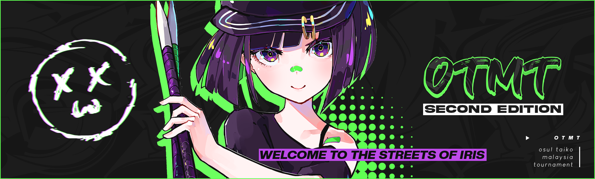

---
tags:
  - OTMT
  - OTMT2022
---

# osu!taiko Malaysian Tournament 2022

The **osu!taiko Malaysian Tournament 2022** (**OTMT 2022**) was a double-elimination 1v1 osu!taiko tournament hosted by ::{ flag=MY }:: [Jerry](https://osu.ppy.sh/users/605973). The tournament was restricted to players with the Malaysian flag ::{ flag=MY }:: only. It was the second installment of the osu!taiko Malaysian Tournament.

## Tournament schedule

| Event | Timestamp |
| --: | :-- |
| Registration phase | 2022-09-17/2022-10-01 |
| Qualifier showcase | 2022-10-08 |
| Qualifiers | 2022-10-15/2022-10-16 |
| Seeding Reveal | 2022-10-16 |
| Group stage | 2022-10-22/2022-10-23 |
| Round of 16 | 2022-10-29/2022-10-30 |
| Quarterfinals | 2022-11-05/2022-11-06 |
| Semifinals | 2022-11-12/2022-11-13 |
| Finals | 2022-11-19/2022-11-20 |
| Grand Finals | 2022-11-27 |

## Prizes

| Placing | Prize |
| :-: | :-- |
|  | RM407 (~94USD), 4 month osu!supporter, custom deskpad, custom IRIS voice line, profile badge |
|  | RM207 (~48USD), 2 month osu!supporter, custom deskpad, custom IRIS voice line |
|  | RM107 (~25USD), 1 month osu!supporter, custom deskpad, custom IRIS voice line |
| *4th place* | RM56 (~13USD), 1 month osu!supporter, custom IRIS voice line |

## Organisation

The osu!taiko Malaysian Tournament 2022 was run by various community members.

| Position | Member(s) |
| :-- | :-- |
| Organiser | ::{ flag=MY }:: [Jerry](https://osu.ppy.sh/users/605973) |
| Mappool selector | ::{ flag=MY }:: [cdh](https://osu.ppy.sh/users/2403621), ::{ flag=MY }:: [\[Zeth\]](https://osu.ppy.sh/users/9912966), ::{ flag=MY }:: [Jerry](https://osu.ppy.sh/users/605973) |
| Referee | ::{ flag=PH }:: [Aiery](https://osu.ppy.sh/users/10363380), ::{ flag=MY }:: [IoEtoile](https://osu.ppy.sh/users/6709853), ::{ flag=MY }:: [Hand Sanitiser](https://osu.ppy.sh/users/5091293), ::{ flag=NL }:: [ikin5050](https://osu.ppy.sh/users/4007649), ::{ flag=ID }:: [XK2238](https://osu.ppy.sh/users/1139209), ::{ flag=MY }:: [\[Zeth\]](https://osu.ppy.sh/users/9912966), ::{ flag=SG }:: [arcpotato](https://osu.ppy.sh/users/12842392), ::{ flag=MY }:: [Jerry](https://osu.ppy.sh/users/605973), ::{ flag=MY }:: [cdh](https://osu.ppy.sh/users/2403621) |
| Streamer | ::{ flag=MY }:: [Jerry](https://osu.ppy.sh/users/605973), ::{ flag=MY }:: [Iyouka](https://osu.ppy.sh/users/7138499), ::{ flag=SG }:: [Spartric](https://osu.ppy.sh/users/7740442), ::{ flag=MY }:: [Cheeeeeeeeeew](https://osu.ppy.sh/users/7798789), ::{ flag=PH }:: [Aiery](https://osu.ppy.sh/users/10363380) |
| Commentator | ::{ flag=DE }:: [Joogs](https://osu.ppy.sh/users/8844167), ::{ flag=GB }:: [My Angel Subaru](https://osu.ppy.sh/users/17797595), ::{ flag=GB }:: [overdahedge2014](https://osu.ppy.sh/users/9864847), ::{ flag=PH }:: [Aiery](https://osu.ppy.sh/users/10363380), ::{ flag=ID }:: [XK2238](https://osu.ppy.sh/users/1139209), ::{ flag=MY }:: [Ping7731](https://osu.ppy.sh/users/7289284), ::{ flag=MY }:: [Jerry](https://osu.ppy.sh/users/605973), ::{ flag=MY }:: [HenNEET](https://osu.ppy.sh/users/14225265), ::{ flag=MY }:: [CrabCow](https://osu.ppy.sh/users/9755504), ::{ flag=SE }:: [Raphalge](https://osu.ppy.sh/users/3918650), ::{ flag=MY }:: [Xeltic Rival](https://osu.ppy.sh/users/7500364), ::{ flag=MY }:: [cdh](https://osu.ppy.sh/users/2403621), ::{ flag=MY }:: [\[Zeth\]](https://osu.ppy.sh/users/9912966), ::{ flag=MY }:: [Cryolien](https://osu.ppy.sh/users/1626983), ::{ flag=MY }:: [MTNTWarz](https://osu.ppy.sh/users/14036825) |
| Designer | ::{ flag=MY }:: [Iyouka](https://osu.ppy.sh/users/7138499) |
| Website editor | ::{ flag=MY }:: [Kokoro Amamiya](https://osu.ppy.sh/users/9534110) |
| Wiki editor | ::{ flag=MY }:: [cdh](https://osu.ppy.sh/users/2403621) |

## Links

- [Website](https://otmt2022.osumalaysia.org/)
- [Discussion thread](https://osu.ppy.sh/community/forums/topics/1629138)
- [Livestream](https://www.twitch.tv/osutaikomalaysia)
- [Challonge bracket](https://challonge.com/eq90t8gq)
- [Schedule spreadsheet](https://docs.google.com/spreadsheets/d/1ujdTXdpU2SyCneFrgARIsfUnOsfwL7rrS2nhTimSElo/edit#gid=1945276977)

## Participants

| Seed | Members |
| :-- | :-- |
| Top | ::{ flag=MY }:: [CrabCow](https://osu.ppy.sh/users/9755504), ::{ flag=MY }:: [JyaKeii](https://osu.ppy.sh/users/12086753), ::{ flag=MY }:: [vun](https://osu.ppy.sh/users/6932501), ::{ flag=MY }:: [HHVanilla Ice](https://osu.ppy.sh/users/12803930), ::{ flag=MY }:: [vernonlim](https://osu.ppy.sh/users/10167542), ::{ flag=MY }:: [HenNEET](https://osu.ppy.sh/users/14225265), ::{ flag=MY }:: [Fury Dragon](https://osu.ppy.sh/users/6332530), ::{ flag=MY }:: [K0rd31HP](https://osu.ppy.sh/users/15231510) |
| High | ::{ flag=MY }:: [Megumin-Sama](https://osu.ppy.sh/users/6201335), ::{ flag=MY }:: [Ping7731](https://osu.ppy.sh/users/7289284), ::{ flag=MY }:: [pisu](https://osu.ppy.sh/users/8339729), ::{ flag=MY }:: [PollyDoggo](https://osu.ppy.sh/users/11584592), ::{ flag=MY }:: [DXA FonG](https://osu.ppy.sh/users/15019527), ::{ flag=MY }:: [Admirable](https://osu.ppy.sh/users/9888395), ::{ flag=MY }:: [Kirowlet](https://osu.ppy.sh/users/7066483), ::{ flag=MY }:: [Kyrzer](https://osu.ppy.sh/users/5616675) |
| Low | ::{ flag=MY }:: [shaofoong](https://osu.ppy.sh/users/2398341), ::{ flag=MY }:: [zhev](https://osu.ppy.sh/users/6570008), ::{ flag=MY }:: [NickkyOnce](https://osu.ppy.sh/users/10508577), ::{ flag=MY }:: [5oulpoint](https://osu.ppy.sh/users/10194919), ::{ flag=MY }:: [Minisora](https://osu.ppy.sh/users/9627666), ::{ flag=MY }:: [Haryume](https://osu.ppy.sh/users/9351030), ::{ flag=MY }:: [King Hong](https://osu.ppy.sh/users/7263047), ::{ flag=MY }:: [Ayashiki](https://osu.ppy.sh/users/6859713) |
| Unseeded | ::{ flag=MY }:: [arebang9462](https://osu.ppy.sh/users/1810773), ::{ flag=MY }:: [Axorite](https://osu.ppy.sh/users/9124278), ::{ flag=MY }:: [Agagak](https://osu.ppy.sh/users/3645490) |

## Groups

| Group | Top seed | High seed | Low seed | Unseeded |
| :-: | :-- | :-- | :-- | :-- |
| **A** | ::{ flag=MY }:: [HHVanilla Ice](https://osu.ppy.sh/users/12803930) | ::{ flag=MY }:: [Admirable](https://osu.ppy.sh/users/9888395) | ::{ flag=MY }:: [zhev](https://osu.ppy.sh/users/6570008) | N/A |
| **B** | ::{ flag=MY }:: [vernonlim](https://osu.ppy.sh/users/10167542) | ::{ flag=MY }:: [DXA FonG](https://osu.ppy.sh/users/15019527) | ::{ flag=MY }:: [Ayashiki](https://osu.ppy.sh/users/6859713) | N/A |
| **C** | ::{ flag=MY }:: [JyaKeii](https://osu.ppy.sh/users/12086753) | ::{ flag=MY }:: [Ping7731](https://osu.ppy.sh/users/7289284) | ::{ flag=MY }:: [King Hong](https://osu.ppy.sh/users/7263047) | N/A |
| **D** | ::{ flag=MY }:: [K0rd31HP](https://osu.ppy.sh/users/15231510) | ::{ flag=MY }:: [Kirowlet](https://osu.ppy.sh/users/7066483) | ::{ flag=MY }:: [Minisora](https://osu.ppy.sh/users/9627666) | ::{ flag=MY }:: [Axorite](https://osu.ppy.sh/users/9124278) |
| **E** | ::{ flag=MY }:: [vun](https://osu.ppy.sh/users/6932501) | ::{ flag=MY }:: [Megumin-Sama](https://osu.ppy.sh/users/6201335) | ::{ flag=MY }:: [shaofoong](https://osu.ppy.sh/users/2398341) | N/A |
| **F** | ::{ flag=MY }:: [Fury Dragon](https://osu.ppy.sh/users/6332530) | ::{ flag=MY }:: [Kyrzer](https://osu.ppy.sh/users/5616675) | ::{ flag=MY }:: [5oulpoint](https://osu.ppy.sh/users/10194919) | ::{ flag=MY }:: [arebang9462](https://osu.ppy.sh/users/1810773) |
| **G** | ::{ flag=MY }:: [HenNEET](https://osu.ppy.sh/users/14225265) | ::{ flag=MY }:: [PollyDoggo](https://osu.ppy.sh/users/11584592) | ::{ flag=MY }:: [NickkyOnce](https://osu.ppy.sh/users/10508577) | N/A |
| **H** | ::{ flag=MY }:: [CrabCow](https://osu.ppy.sh/users/9755504) | ::{ flag=MY }:: [pisu](https://osu.ppy.sh/users/8339729) | ::{ flag=MY }:: [Haryume](https://osu.ppy.sh/users/9351030) | ::{ flag=MY }:: [Agagak](https://osu.ppy.sh/users/3645490) |

## Podium

This competition has come to an end and resulted in the following podium:

| Placing | Player |
| :-: | :-- |
|  | ::{ flag=MY }:: [CrabCow](https://osu.ppy.sh/users/9755504) |
|  | ::{ flag=MY }:: [HHVanilla Ice](https://osu.ppy.sh/users/12803930) |
|  | ::{ flag=MY }:: [Jyakeii](https://osu.ppy.sh/users/12086753) |
| *4th place* | ::{ flag=MY }:: [vernonlim](https://osu.ppy.sh/users/10167542) |

## Mappools

### Grand Finals

- NoMod
  1. [Camellia - R U Still XXXX? (qish & My Angel Subaru) \[Collab of the xxxx\]](https://osu.ppy.sh/beatmapsets/1889498#taiko/3891622)
  2. [Kolaa - async (ph0eniixz) \[ascended (otmt. ver)\]](https://osu.ppy.sh/beatmapsets/1889512#taiko/3891659)<!-- tournament version (not uploaded): https://ph0eniixz.s-ul.eu/vuwwVKpP -->
  3. [xavy - ko (taiko\_maniac1811) \[nuko\]](https://osu.ppy.sh/beatmapsets/1889530#taiko/3891702)
  4. [saaa + kei\_iwata + stuv + wakadori - New York Back Raise (cdh & \_gt) \[ALL IN\]](https://osu.ppy.sh/beatmapsets/1889499#taiko/3891624)
  5. [Camellia feat. Nanahira - FULLFLAVOR ONDO (Megafan) \[FULLFLAVOR TAIKO\]](https://osu.ppy.sh/beatmapsets/1889823#taiko/3892519)
  6. [Ann-Melts P - JINSEI (cdh) \[ULTIMATE (OTMT Edit.)\]](https://osu.ppy.sh/beatmapsets/1889505#taiko/3891631)<!-- tournament version not uploaded -->
- Hidden
  1. [DISCO BROTHERS - OKIMOCHI EXPRESSION (HiroK) \[Inner Oni\]](https://osu.ppy.sh/beatmapsets/1889801#taiko/3892411)
  2. [yukikaze - SAYURINOYATU (arcpotato & Rinze) \[ARC & LER'S INTER SECTION\]](https://osu.ppy.sh/beatmapsets/1889509#taiko/3891653)
- HardRock
  1. [Mizuno Kenji vs. Anayama Daisuke - m3 (MTNTWarz) \[Resentment\]](https://osu.ppy.sh/beatmapsets/1889525#taiko/3891690)
  2. [kessoku band - Guitar, Loneliness and Blue Planet (Jerry, Raphalge & MTNTWarz) \[bocc\]](https://osu.ppy.sh/beatmapsets/1889552#taiko/3891758)
- DoubleTime
  1. [MAISONdes feat. KAF, Tsumiki - Tokyo Shandy Rendez-vous (cdh) \[ONI\]](https://osu.ppy.sh/beatmapsets/1889510#taiko/3891656)
  2. [Yorushika - Kokoro ni Ana ga Aita (ler1211, arcpotato & Hivie) \[Inter Oni\]](https://osu.ppy.sh/beatmapsets/1889513#taiko/3891660)
- FreeMod
  1. [Sound piercer 'Espitz' - Mirage Fragrance (\[Zeth\] & MTNTWarz) \[Reminiscence\]](https://osu.ppy.sh/beatmapsets/1889527#taiko/3891692)
  2. [EmoCosine - Nekojarashi (ler1211) \[Nya! (OTMT Edit.)\]](https://osu.ppy.sh/beatmapsets/1889520#taiko/3891674)
  3. [Loli in early 20s - Wa Yoderi (Megafan) \[Seishinbyou (OTMT Ver.)\]](https://osu.ppy.sh/beatmapsets/1889825#taiko/3892525)
- Tiebreaker
  1. **[takehirotei as "Infinite Limit" - I.R.I.S (Jerry, cdh, taiko_maniac1811, ler1211, MTNTWarz, \[Zeth\] & CallMeLyra) \[Streets of IRIS\]](https://osu.ppy.sh/beatmapsets/1889529#taiko/3891701)**

### Finals

- NoMod
  1. [Hommarju feat. mamiko -  Katayoku no tori (vzk) \[Judgment (OTMT ver.)\]](https://osu.ppy.sh/beatmapsets/675397#taiko/3880490)
  2. [HowToPlayLN - ph0eniix.z (ph0eniixz) \[phoenix\]](https://osu.ppy.sh/beatmapsets/1885288#taiko/3881843)
  3. [Se-U-Ra - Pale and dazzling dreamscape (ekumea1123) \[Inner Oni\]](https://osu.ppy.sh/beatmapsets/1859806#taiko/3823066)
  4. [Brandy - Cross Time !! (\_gt) \[Fever Time !!\]](https://osu.ppy.sh/beatmapsets/1885290#taiko/3881848)
  5. [Laur feat. Mishamo - Let's! Miracle\*HARDCORE! (N a N a) \[Waifucore\]](https://osu.ppy.sh/beatmapsets/1795461#taiko/3680132)
  6. [Apo11o program feat. Ritsuka - SolarOrbit -Connected with the Espabrother- (ikin5050) \[OTMT\]](https://osu.ppy.sh/beatmapsets/1885300#taiko/3881865)
- Hidden
  1. [Yunomi - Indoor-kei nara Trackmaker (feat. nicamoq) (Eyenine) \[Every Day, Every Night\]](https://osu.ppy.sh/beatmapsets/1885328#taiko/3881906)
  2. [Satoshi (CV: Rica Matsumoto) - XY\&Z (Greenshell) \[Battle Bond (OTMT Ver.)\]](https://osu.ppy.sh/beatmapsets/1885338#taiko/3881927)
- HardRock
  1. [Vivid BAD SQUAD - Alter Ego (cdh) \[Inner Oni\]](https://osu.ppy.sh/beatmapsets/1885299#taiko/3881864)
  2. [Laur vs Juggernaut. - Last Judgement (ikin5050) \[A Story of Liberation\]](https://osu.ppy.sh/beatmapsets/1885056#taiko/3881222)
- DoubleTime
  1. [Vivid BAD SQUAD x Hatsune Miku x Kagamine Rin - PaIII.SENSATION (cdh) \[INFATUATION\]](https://osu.ppy.sh/beatmapsets/1885305#taiko/3881874)
  2. [hololive IDOL PROJECT - Kirameki Rider\* (KTYN) \[Inner Oni\]](https://osu.ppy.sh/beatmapsets/1125625#taiko/2351909)
- FreeMod
  1. [fripSide - Sister's noise (takehirotei "20001th noise" remix) (Rinze) \[Railgun\]](https://osu.ppy.sh/beatmapsets/1885308#taiko/3881880)
  2. [momone - dont say you quit the art course (Rinze) \[resolution\]](https://osu.ppy.sh/beatmapsets/1885311#taiko/3881885)
  3. [METRO MEW - Kasou Na Heartbeat (Jerry) \[Serenity\]](https://osu.ppy.sh/beatmapsets/1661878#taiko/3392670)
- Tiebreaker
  1. **[Sparxe - What Do You C? (gaston\_2199, Megafan & KyeX) \[A Sight To Behold\]](https://osu.ppy.sh/beatmapsets/1885333#taiko/3881919)**

### Semifinals

- NoMod
  1. [Tsumiki - Anonymous Fanfare (KTYN) \[// 404 Not Found. //\]](https://osu.ppy.sh/beatmapsets/1880469#taiko/3871454)
  2. [cosMo@BousouP - Second Heaven GravityPfArrange (Hirok) \[Inner Oni\]](https://osu.ppy.sh/beatmapsets/759511#taiko/1597508)
  3. [chelmico - Easy Breezy(Kur@ra Bootleg) (KMYK\_ & KTYN) \[yuki & KTYN's Boogie\]](https://osu.ppy.sh/beatmapsets/1107880#taiko/2315433)
  4. [leroy - dyed my hair black (7\_7) \[@w@\]](https://osu.ppy.sh/beatmapsets/1546609#taiko/3160983)
  5. [Power of Nature - Shounen wa Sora o Tadoru (MTNTWarz) \[Beyond with the Sky\]](https://osu.ppy.sh/beatmapsets/1588080#taiko/3243480)
- Hidden
  1. [KANKAN - Babirusa (gaston\_2199) \[Psychedelic Trip (OTMT Ver.)\]](https://osu.ppy.sh/beatmapsets/1880662#taiko/3871818)<!-- tournament version not uploaded -->
  2. [Slax - Loli Bomb (Rinze) \[Love Bomb \[1.2x Rate\]\]](https://osu.ppy.sh/beatmapsets/1610503#taiko/3288268)
- HardRock
  1. [Kobaryo - Dimension Hacker (ikin5050) \[Hack the World\]](https://osu.ppy.sh/beatmapsets/1880487#taiko/3871487)
  2. [Three - Ego Rock (long ver.) (gaston\_2199) \[Inner Oni (OTMT Ver.)\]](https://osu.ppy.sh/beatmapsets/1880663#taiko/3871819)
- DoubleTime
  1. [Hatsuki Yura - -Shadows Kage Iro Yousei Ehon- (Greenshell) \[Inner Oni\]](https://osu.ppy.sh/beatmapsets/1880503#taiko/3871509)
  2. [Nene - Hare wo Matsu (cdh) \[Unwavering Courage\]](https://osu.ppy.sh/beatmapsets/1880488#taiko/3871489)
- FreeMod
  1. [KOTOKO - Sakuranbo Kiss (KTYN) \[Maiden's Heart\]](https://osu.ppy.sh/beatmapsets/1880500#taiko/3871506)
  2. [Curren - worldwidesuperstar (Rinze) \[Idol\]](https://osu.ppy.sh/beatmapsets/1880502#taiko/3871508)
  3. [Erehamonika - Der Wald (Kors K Remix) (NoFool) \[Hard Oni\]](https://osu.ppy.sh/beatmapsets/432406#taiko/932407)
- Tiebreaker
  1. **[HowToPlayLN - Disintegration of the Isolated Forest (Ph0eNiiXZ & Kusuhara Yui) \[Sacred Utopia Collab (OTMT edit)\]](https://osu.ppy.sh/beatmapsets/1880505#taiko/3871513)**<!-- tournament version not uploaded -->

### Quarterfinals

- NoMod
  1. [cexiria - Early Trial (KTYN) \[Trial\]](https://osu.ppy.sh/beatmapsets/1875943#taiko/3860528)
  2. [Snails House - waiting for you in snowing city. (Megafan) \[fubuki. (otmt ver.)\]](https://osu.ppy.sh/beatmapsets/1875999#taiko/3860636)
  3. [ELFENSJoN - Naraku no Majou (arcpotato) \[Deceit\]](https://osu.ppy.sh/beatmapsets/1875952#taiko/3860537)
  4. [Stray Kids - God's Menu (cdh) \[satania milk\]](https://osu.ppy.sh/beatmapsets/1875959#taiko/3860544)
- Hidden
  1. [Nekomata Okayu - Nothing's Working Out (Jerry) \[damn\]](https://osu.ppy.sh/beatmapsets/1875991#taiko/3860628)
  2. [Chroma - Sayonara Planet Wars (Greenshell) \[Inner Oni\]](https://osu.ppy.sh/beatmapsets/765430#taiko/1609346)
- HardRock
  1. [Ado - Love ka? (Eyenine) \[Oni ka?\]](https://osu.ppy.sh/beatmapsets/1875963#taiko/3860549)
  2. [VESPERBELL YOMI - Kanzen Kankaku Dreamer (Cut Ver.) (Raphalge) \[Inner Oni\]](https://osu.ppy.sh/beatmapsets/1875956#taiko/3860541)
- DoubleTime
  1. [Sangatsu no Phantasia - Pastel Rain (Seren58) \[Rain\]](https://osu.ppy.sh/beatmapsets/1364117#taiko/2821979)
  2. [Nijisanji - Virtual to Live (taiko\_ryuki) \[Anniversary\]](https://osu.ppy.sh/beatmapsets/1024302#taiko/2142581)
- FreeMod
  1. [Ado - Rebellion (taiko\_maniac1811) \[Rebel\]](https://osu.ppy.sh/beatmapsets/1875987#taiko/3860621)
  2. [DUSTCELL - DERO (Genjuro) \[INNER ONI\]](https://osu.ppy.sh/beatmapsets/1478599#taiko/3033441)
  3. [Alex C. feat Yasmin K. - Angel of Darkness (Nightcore Mix) (Rinze) \[OTMT Angel\]](https://osu.ppy.sh/beatmapsets/1875976#taiko/3860600)
- Tiebreaker
  1. **[cexiria - Over the Sphere (MTNTWarz & X a v y) \[Brilliant Andromeda, Boundless Universe\]](https://osu.ppy.sh/beatmapsets/1875981#taiko/3860613)**

### Round of 16

- NoMod
  1. [Asterisk - Motteke! Sailor Fuku (Asterisk DnB Remix) (Rinze) \[kagami is cute\]](https://osu.ppy.sh/beatmapsets/1871692#taiko/3851145)
  2. [Lotus Juice & Shihoko Hirata - Dance! (tasuke912) \[Oni\]](https://osu.ppy.sh/beatmapsets/486684#taiko/1037717)
  3. [SiLiS - Desir -Saigo no Odori- (komasy) \[Last Dance\]](https://osu.ppy.sh/beatmapsets/1871708#taiko/3851177)
  4. [Aiobahn feat. KOTOKO - INTERNET OVERDOSE (\_gt) \[GIMMICK OVERDOSE\]](https://osu.ppy.sh/beatmapsets/1871735#taiko/3851212)
- Hidden
  1. [Yunomi feat. nicamoq - Hachimitsu Adventure (komasy) \[Oni\]](https://osu.ppy.sh/beatmapsets/767708#taiko/1613970)
  2. [Machita Chima - Chimera (Jerry) \[chime\]](https://osu.ppy.sh/beatmapsets/1871738#taiko/3851217)
- HardRock
  1. [Adust Rain - Pretty Pretty Dark (MTNTWarz) \[Dull and Dim\]](https://osu.ppy.sh/beatmapsets/1871722#taiko/3851196)
  2. [Reol - Q? (Fynbi) \[O?\]](https://osu.ppy.sh/beatmapsets/1501565#taiko/3076722)
- DoubleTime
  1. [Hoshimachi Suisei - Jibun Katte Dazzling (Maimaing) \[Oni\]](https://osu.ppy.sh/beatmapsets/1729668#taiko/3534919)
  2. [solfa feat. Chata - hot splash! (MTNTWarz) \[mtnt's oni\]](https://osu.ppy.sh/beatmapsets/1601757#taiko/3305960)
- FreeMod
  1. [Yoisaki Kanade (CV: Kusunoki Tomori) x Hatsune Miku - identity (Canboi) \[Chi's Real Identity\]](https://osu.ppy.sh/beatmapsets/1673577#taiko/3426125)
  2. [Kairiki Bear feat. Hatsune Miku - Bug (\[Zeth\]) \[Paranoia\]](https://osu.ppy.sh/beatmapsets/1871700#taiko/3851165)
- Tiebreaker
  1. **[Houshou Marine - I'm Your Treasure Box (qish, Fynbi & Eyenine) \[Oh Treasure, My Treasure.\]](https://osu.ppy.sh/beatmapsets/1871730#taiko/3851207)**

### Group stage

- NoMod
  1. [Yuaru - Asu no Yozora Shoukaihan (KyeX) \[KyeX's Oni\]](https://osu.ppy.sh/beatmapsets/1782195#taiko/3654999)
  2. [Vivid BAD SQUAD - Ready Steady (cdh) \[Ready Steady Bom Bi Bi\]](https://osu.ppy.sh/beatmapsets/1867347#taiko/3841233)
  3. [BlackY vs. Yooh - MEGATON BLAST (tpz Overcute Remix) (MTNTWarz) \[babu geyser\]](https://osu.ppy.sh/beatmapsets/1867332#taiko/3841203)
- Hidden
  1. [Toyko - Some Nights (Jerry) \[man\]](https://osu.ppy.sh/beatmapsets/1867394#taiko/3841346)
  2. [IsekaiJoucho - Kyoukankaku Obake (Yuemiao) \[Yuemiao's Oni (OTMT edit)\]](https://osu.ppy.sh/beatmapsets/1867338#taiko/3841215)
- HardRock
  1. [Tatsh - HEAVENLY MOON (taiko\_maniac1811) \[ONI\]](https://osu.ppy.sh/beatmapsets/1867381#taiko/3841324)
  2. [inabakumori - Hello Marina (Rinze) \[Connection\]](https://osu.ppy.sh/beatmapsets/1867355#taiko/3841255)
- DoubleTime
  1. [ZUTOMAYO - MIRROR TUNE (Ph0eNiiXz) \[REFLECTION (OTMT edit)\]](https://osu.ppy.sh/beatmapsets/1867358#taiko/3841264)
  2. [Petit Rabbit's - Daydream café (eiri-) \[Oni\]](https://osu.ppy.sh/beatmapsets/865586#taiko/1809873)
- FreeMod
  1. [Soleily - Silent Rush (Skull Kid) \[Oni\]](https://osu.ppy.sh/beatmapsets/916558#taiko/1974229)
  2. [HowToPlayLN - Eternal Bliss (HowToPlayLN's 'Nirvana' Remix) (HiroK) \[Eternity\]](https://osu.ppy.sh/beatmapsets/1867368#taiko/3841293)
- Tiebreaker
  1. **[Ado - The Japan Record Award SPECIAL MEDLEY (\[Zeth\], cdh & Jerry) \[Kyougen\]](https://osu.ppy.sh/beatmapsets/1867371#taiko/3841298)**

### Qualifiers

- NoMod
  1. [Tartarate vs. cexiria - Pink Aquarium (Rinze) \[Pink Wave\]](https://osu.ppy.sh/beatmapsets/1862333#taiko/3829220)
  2. [Kudou Chitose - CHO-DARI (\[Zeth\]) \[what a lovely day\]](https://osu.ppy.sh/beatmapsets/1862383#taiko/3829296)
  3. [REDALiCE vs. Kobaryo - REKKA RESONANCE (BlackBN) \[ONI\]](https://osu.ppy.sh/beatmapsets/1862340#taiko/3829231)
- Hidden
  1. [Triad Primus - Trancing Pulse (Jerry) \[i pick the middle one\]](https://osu.ppy.sh/beatmapsets/1862365#taiko/3829268)
- HardRock
  1. [Wonderlands x Showtime - TONDEMO-WONDERZ (MTNTWarz) \[goofy ahh ahh babu Oni\]](https://osu.ppy.sh/beatmapsets/1862348#taiko/3829242)
- DoubleTime
  1. [ReoNa - Seimeisen (cdh) \[Marble Phantasm\]](https://osu.ppy.sh/beatmapsets/1862344#taiko/3829235)
- FreeMod
  1. [DUSTCELL - Daraku Seikatsu (Rinze) \[Corrupt\]](https://osu.ppy.sh/beatmapsets/1862351#taiko/3829245)

## Match results

### Grand Finals

Saturday, 26 November 2022:

| Player 1 |  |  | Player 2 | Match link |
| --: | --: | :-: | :-- | :-: |
| JyaKeii ::{ flag=MY }:: | 1 | **7** | ::{ flag=MY }:: **HHVanilla Ice** | [#1](https://osu.ppy.sh/community/matches/105290868) |

Saturday, 27 November 2022:

| Player 1 |  |  | Player 2 | Match link |
| --: | --: | :-: | :-- | :-: |
| CrabCow ::{ flag=MY }:: | 5 | **7** | ::{ flag=MY }:: **HHVanilla Ice** | [#1](https://osu.ppy.sh/community/matches/105313589) |
| HHVanilla Ice ::{ flag=MY }:: | 6 | **7** | ::{ flag=MY }:: **CrabCow** | [#1](https://osu.ppy.sh/community/matches/105314827) |

### Finals

Saturday, 19 November 2022:

| Player 1 |  |  | Player 2 | Match link |
| --: | --: | :-: | :-- | :-: |
| **vernonlim** ::{ flag=MY }:: | **7** | 4 | ::{ flag=MY }:: HenNEET | [#1](https://osu.ppy.sh/community/matches/105157104) |

Sunday, 20 November 2022:

| Player 1 |  |  | Player 2 | Match link |
| --: | --: | :-: | :-- | :-: |
| vun ::{ flag=MY }:: | 3 | **7** | ::{ flag=MY }:: **HHVanilla Ice** | [#1](https://osu.ppy.sh/community/matches/105175090) |
| vernonlim ::{ flag=MY }:: | 2 | **7** | ::{ flag=MY }:: **HHVanilla Ice** | [#1](https://osu.ppy.sh/community/matches/105175090) |
| JyaKeii ::{ flag=MY }:: | 6 | **7** | ::{ flag=MY }:: **CrabCow** | [#1](https://osu.ppy.sh/community/matches/105180263) |

### Semifinals

Saturday, 12 November 2022:

| Player 1 |  |  | Player 2 | Match link |
| --: | --: | :-: | :-- | :-: |
| **K0rd31HP** ::{ flag=MY }:: | **6** | 0 | ::{ flag=MY }:: DXA FonG | [#1](https://osu.ppy.sh/community/matches/105007846) |
| **HenNEET** ::{ flag=MY }:: | **6** | 0 | ::{ flag=MY }:: Megumin-Sama | [#1](https://osu.ppy.sh/community/matches/105008568) |
| **Ping7731** ::{ flag=MY }:: | **6** | 2 | ::{ flag=MY }:: Fury Dragon | [#1](https://osu.ppy.sh/community/matches/105009207) |
| **JyaKeii** ::{ flag=MY }:: | **6** | 0 | ::{ flag=MY }:: vernonlim | [#1](https://osu.ppy.sh/community/matches/105013643) |
| **HHVanilla Ice** ::{ flag=MY }:: | **6** | 0 | ::{ flag=MY }:: Admirable | [#1](https://osu.ppy.sh/community/matches/105017733) |

Sunday, 13 November 2022:

| Player 1 |  |  | Player 2 | Match link |
| --: | --: | :-: | :-- | :-: |
| K0rd31HP ::{ flag=MY }:: | 5 | **6** | ::{ flag=MY }:: **HHVanilla Ice** | [#1](https://osu.ppy.sh/community/matches/105031748) |
| Ping7731 ::{ flag=MY }:: | 1 | **6** | ::{ flag=MY }:: **HenNEET** | [#1](https://osu.ppy.sh/community/matches/105034919) |
| vun ::{ flag=MY }:: | 5 | **6** | ::{ flag=MY }:: **CrabCow** | [#1](https://osu.ppy.sh/community/matches/105035590) |

### Quarterfinals

Saturday, 5 November 2022:

| Player 1 |  |  | Player 2 | Match link |
| --: | --: | :-: | :-- | :-: |
| **Megumin-Sama** ::{ flag=MY }:: | **6** | 0 | ::{ flag=MY }:: PollyDoggo | [#1](https://osu.ppy.sh/community/matches/104867722) |
| 5oulpoint ::{ flag=MY }:: | -1 | **0** | ::{ flag=MY }:: **Admirable** | *WBD* |
| HHVanilla Ice ::{ flag=MY }:: | 0 | **6** | ::{ flag=MY }:: **JyaKeii** | [#1](https://osu.ppy.sh/community/matches/104872046) |
| **DXA FonG** ::{ flag=MY }:: | **6** | 0 | ::{ flag=MY }:: Kirowlet | [#1](https://osu.ppy.sh/community/matches/104873236) |
| Ping7731 ::{ flag=MY }:: | 0 | **6** | ::{ flag=MY }:: **CrabCow** | [#1](https://osu.ppy.sh/community/matches/104874540) |
| K0rd31HP ::{ flag=MY }:: | 0 | **6** | ::{ flag=MY }:: **vernonlim** | [#1](https://osu.ppy.sh/community/matches/104875898) |

Sunday, 6 November 2022:

| Player 1 |  |  | Player 2 | Match link |
| --: | --: | :-: | :-- | :-: |
| HenNEET ::{ flag=MY }:: | 2 | **6** | ::{ flag=MY }:: **vun** | [#1](https://osu.ppy.sh/community/matches/104895179) |
| pisu ::{ flag=MY }:: | 2 | **6** | ::{ flag=MY }:: **Fury Dragon** | [#1](https://osu.ppy.sh/community/matches/104899742) |

### Round of 16

Saturday, 29 October 2022:

| Player 1 |  |  | Player 2 | Match link |
| --: | --: | :-: | :-- | :-: |
| **HenNEET** ::{ flag=MY }:: | **5** | 0 | ::{ flag=MY }:: DXA FonG | [#1](https://osu.ppy.sh/community/matches/104717113) |
| **HHVanilla Ice** ::{ flag=MY }:: | **5** | 1 | ::{ flag=MY }:: pisu | [#1](https://osu.ppy.sh/community/matches/104717619) |
| Megumin-Sama ::{ flag=MY }:: | 0 | **5** | ::{ flag=MY }:: **K0rd31HP** | [#1](https://osu.ppy.sh/community/matches/104720469) |
| **Ping7731** ::{ flag=MY }:: | **5** | 0 | ::{ flag=MY }:: 5oulpoint | [#1](https://osu.ppy.sh/community/matches/104721943) |
| **JyaKeii** ::{ flag=MY }:: | **5** | 2 | ::{ flag=MY }:: Fury Dragon | [#1](https://osu.ppy.sh/community/matches/104724934) |
| Admirable ::{ flag=MY }:: | 0 | **5** | ::{ flag=MY }:: **CrabCow** | [#1](https://osu.ppy.sh/community/matches/104726284) |

Sunday, 30 October 2022:

| Player 1 |  |  | Player 2 | Match link |
| --: | --: | :-: | :-- | :-: |
| **vun** ::{ flag=MY }:: | **5** | 4 | ::{ flag=MY }:: Kirowlet | [#1](https://osu.ppy.sh/community/matches/104744976) |
| PollyDoggo ::{ flag=MY }:: | 0 | **5** | ::{ flag=MY }:: **vernonlim** | [#1](https://osu.ppy.sh/community/matches/104747846) |

### Group stage

Thursday, 20 October 2022:

| Player 1 |  |  | Player 2 | Match link |
| --: | --: | :-: | :-- | :-: |
| **CrabCow** ::{ flag=MY }:: | **5** | 0 | ::{ flag=MY }:: Agagak | [#1](https://osu.ppy.sh/community/matches/104538537) |

Friday, 21 October 2022:

| Player 1 |  |  | Player 2 | Match link |
| --: | --: | :-: | :-- | :-: |
| **CrabCow Fanboy** ::{ flag=MY }:: | **5** | 0 | ::{ flag=MY }:: Agagak | [#1](https://osu.ppy.sh/community/matches/104556227) |

Saturday, 22 October 2022:

| Player 1 |  |  | Player 2 | Match link |
| --: | --: | :-: | :-- | :-: |
| **Admirable** ::{ flag=MY }:: | **0** | -1 | ::{ flag=MY }:: zhev | *WBD* |
| K0rd31HP ::{ flag=MY }:: | 2 | **5** | ::{ flag=MY }:: **Kirowlet** | [#1](https://osu.ppy.sh/community/matches/104574010) |
| **vernonlim** ::{ flag=MY }:: | **5** | 0 | ::{ flag=MY }:: DXA FonG | [#1](https://osu.ppy.sh/community/matches/104574603) |
| **HHVanilla Ice** ::{ flag=MY }:: | **5** | 0 | ::{ flag=MY }:: Admirable | [#1](https://osu.ppy.sh/community/matches/104575934) |
| **Fury Dragon** ::{ flag=MY }:: | **0** | -1 | ::{ flag=MY }:: Kyrzer | *WBD* |
| **HenNEET** ::{ flag=MY }:: | **5** | 2 | ::{ flag=MY }:: PollyDoggo | [#1](https://osu.ppy.sh/community/matches/104575934) |
| **HHVanilla Ice** ::{ flag=MY }:: | **5** | 0 | ::{ flag=MY }:: zhev | [#1](https://osu.ppy.sh/community/matches/104575996) |
| **CrabCow** ::{ flag=MY }:: | **0** | -1 | ::{ flag=MY }:: pisu | *WBD* |
| **JyaKeii** ::{ flag=MY }:: | **0** | -1 | ::{ flag=MY }:: King Hong | *WBD* |
| **K0rd31HP** ::{ flag=MY }:: | **5** | 0 | ::{ flag=MY }:: Minisora | [#1](https://osu.ppy.sh/community/matches/104580084) |
| JyaKeii ::{ flag=MY }:: | 4 | **5** | ::{ flag=MY }:: **Ping7731** | [#1](https://osu.ppy.sh/community/matches/104579719) |
| **Kirowlet** ::{ flag=MY }:: | **5** | 0 | ::{ flag=MY }:: Axorite | [#1](https://osu.ppy.sh/community/matches/104579883) |
| **Fury Dragon** ::{ flag=MY }:: | **5** | 0 | ::{ flag=MY }:: 5oulpoint | [#1](https://osu.ppy.sh/community/matches/104581555) |
| **CrabCow** ::{ flag=MY }:: | **5** | 2 | ::{ flag=MY }:: CrabCow Fanboy | [#1](https://osu.ppy.sh/community/matches/104581418) |
| **pisu** ::{ flag=MY }:: | **5** | 0 | ::{ flag=MY }:: Agagak | [#1](https://osu.ppy.sh/community/matches/104582209) |
| **vernonlim** ::{ flag=MY }:: | **5** | 0 | ::{ flag=MY }:: Ayashiki | [#1](https://osu.ppy.sh/community/matches/104583111) |
| **Ping7731** ::{ flag=MY }:: | **5** | 0 | ::{ flag=MY }:: King Hong | [#1](https://osu.ppy.sh/community/matches/104583381) |

Sunday, 23 October 2022:

| Player 1 |  |  | Player 2 | Match link |
| --: | --: | :-: | :-- | :-: |
| **K0rd31HP** ::{ flag=MY }:: | **5** | 0 | ::{ flag=MY }:: Axorite | [#1](https://osu.ppy.sh/community/matches/104597465) |
| vun ::{ flag=MY }:: | 1 | **5** | ::{ flag=MY }:: **Megumin-Sama** | [#1](https://osu.ppy.sh/community/matches/104597464) |
| **Megumin-Sama** ::{ flag=MY }:: | **5** | 0 | ::{ flag=MY }:: shaofoong | [#1](https://osu.ppy.sh/community/matches/104598457) |
| **Fury Dragon** ::{ flag=MY }:: | **5** | 0 | ::{ flag=MY }:: arebang9462 | [#1](https://osu.ppy.sh/community/matches/104598447) |
| **Kirowlet** ::{ flag=MY }:: | **5** | 3 | ::{ flag=MY }:: Minisora | [#1](https://osu.ppy.sh/community/matches/104600061) |
| Kyrzer ::{ flag=MY }:: | -1 | **0** | ::{ flag=MY }:: **5oulpoint** | *WBD* |
| **pisu** ::{ flag=MY }:: | **5** | 0 | ::{ flag=MY }:: CrabCow Fanboy | [#1](https://osu.ppy.sh/community/matches/104600846) |
| **DXA FonG** ::{ flag=MY }:: | **5** | 0 | ::{ flag=MY }:: Ayashiki | [#1](https://osu.ppy.sh/community/matches/104600859) |
| **vun** ::{ flag=MY }:: | **5** | 1 | ::{ flag=MY }:: shaofoong | [#1](https://osu.ppy.sh/community/matches/104600835) |
| Kyrzer ::{ flag=MY }:: | -1 | **0** | ::{ flag=MY }:: **arebang9462** | *WBD* |
| **Minisora** ::{ flag=MY }:: | **5** | 0 | ::{ flag=MY }:: Axorite | [#1](https://osu.ppy.sh/community/matches/104602198) |
| **5oulpoint** ::{ flag=MY }:: | **5** | 2 | ::{ flag=MY }:: arebang9462 | [#1](https://osu.ppy.sh/community/matches/104602238) |
| **PollyDoggo** ::{ flag=MY }:: | **5** | 1 | ::{ flag=MY }:: NickkyOnce | [#1](https://osu.ppy.sh/community/matches/104604710) |
| **HenNEET** ::{ flag=MY }:: | **5** | 0 | ::{ flag=MY }:: NickkyOnce | [#1](https://osu.ppy.sh/community/matches/104606630) |

## Ruleset

### Registration rules

1. This tournament is open to ALL players with the Malaysian flag on their profile. However, it is highly recommended that you are able to at least play the Group stage pool of the previous OTMT if you are participating this year.
2. You MUST join the [osu!taiko Malaysia Discord server](https://discord.gg/8PTAJJaPKa) to be eligible for the tournament.
3. Registrations must be submitted through the [OTMT website](https://otmt2022.osumalaysia.org/home) when the links are available on 17 September.
4. All registered players will undergo an initial screening process by the osu! staff and any players that do not pass the screening will not be eligible to participate in the tournament. Results of the screening will be announced in the Discord server.
5. The star rating of the mappool throughout the tournament is estimated to go from ~4.5* in the early rounds to ~7* in the later stages.

### General rules

1. The tournament is a 1v1 osu!taiko match; highest score wins.
2. ScoreV2 with the Team VS option will be used.
3. The win condition of each round is as listed below:

| Round | Format |
| :-- | :-- |
| Group stage | Best of 9 |
| Round of 16 | Best of 9 |
| Quarterfinals | Best of 11 |
| Semifinals | Best of 11 |
| Finals | Best of 13 |
| Grand Finals | Best of 13 |

4. The tournament host will release the mappool and schedules one week before each round.
5. If required, players may request for a reschedule of their matches via the `#otmt-reschedule` channel in the Discord server.
   - Reschedules will only be allowed before the Thursdays, 23:59 UTC+8 of every week.

### Tournament structure

1. The tournament starts off with the Qualifiers stage to sort the players into their respective seedings in the Top 32 (Top Seed, High Seed, Low Seed, etc).
2. The top 32 players will then advance to the Group stage to further narrow down the players into the top 16.
3. In the Group stage, players will be arranged into 8 separate groups of 4, with each group consisting of one player from each seed ranking (top, high, mid, low).
4. The four players will be matched against each other throughout the weekend and the 2 players with the highest number of W:L (win-loss) ratio will advance to the Round of 16.
5. If the number of registrants are below 32, some groups will only consist of 3 players.

### Match rules

1. Players are required to be present at the times of their match, and a reminder in the form of a Discord ping will be given to the players 15 minutes before every match.
2. Invites to the room will then be sent out 10 minutes before each match.
3. Failure to arrive on time will result in the following penalties:
   - 5 minutes: The player's warmup will be skipped.
   - 10 minutes: The player's map ban privilege goes to the opposing player.
   - 15 minutes: The player loses by default.
4. Warmups must be sent to the referees at least 30 minutes before the start of the map. The warmup should be less than 3 minutes in length and not contain inappropriate content. The referee reserves the right to reject maps at their discretion.
5. At the start of each match, players will be asked to `!roll` to determine who picks or bans first. The player with the higher roll will get to pick first and ban second.
6. Banned maps and tiebreakers are not allowed to be picked throughout the match.
7. Each player will be given a maximum of 2 minutes to select their picks. If a pick has not been decided before the countdown timer ends, the map will be randomised with a `!roll`.
8. After a map has been decided, players will then have a maximum of 2 minutes to ready up before the referee forces the match to start.
9. Players should ensure that they have all the maps downloaded before the start of their match. In the event that a player is missing a map, they will automatically lose the point if they are unable to download it within the 2 minutes given.
10. Players may ask for a *tactical timeout* during a match, which will add an extra 2 minutes to the timer. This can only be used **once** per match.
11. A rematch of the same map will be given if a player disconnects within the first 30 seconds of the map. Any subsequent disconnections on the same map will be treated as a point loss.
    - Lag is not a valid reason to restart a map.
12. In the event of a tie in scores, the map will be played again (both players will not gain points).
13. In the unlikely event that both players get a tied score twice in a row on the same map, the map will be nullified and another map needs to be picked by the other player.
14. Failed scores will be counted.
15. If both players reach match point (needing 1 more point to win), the tiebreaker map will be played.
16. Unexpected incidents will be handled by the referee or tournament host.

### Mappool structure

1. The mappool consists of the following brackets: NoMod, Hidden, HardRock, DoubleTime, FreeMod, and tiebreaker.
2. The amount of maps per stage and bracket of the mappool is as follows:

| Bracket / Stage | Group stage | Round of 16 | Quarterfinals | Semifinals | Finals | Grand Finals |
| :-- | --: | --: | --: | --: | --: | --: |
| NoMod | 3 | 4 | 4 | 5 | 6 | 6 |
| Hidden | 2 | 2 | 2 | 2 | 2 | 2 |
| HardRock | 2 | 2 | 2 | 2 | 2 | 2 |
| DoubleTime | 2 | 2 | 2 | 2 | 2 | 2 |
| FreeMod | 2 | 2 | 3 | 3 | 3 | 3 |
| Tiebreaker | 1 | 1 | 1 | 1 | 1 | 1 |

3. Players may choose to play with NoMod, Hidden, or HardRock, or a combination of Hidden and HardRock for the FreeMod picks.
4. The tiebreaker will be played under FreeMod conditions.
