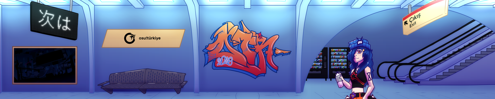

---
tags:
  - OTR
  - OTR26
  - OTR2026
  - OTR 2026
  - osu!türkiye
---

# osu!türkiye Open 2026

The **osu!türkiye Open 2026** (***OTR26***) is a 2v2, double-elimination, Turkish-only regional osu! tournament hosted by ::{ flag=TR }:: [LyeRR](https://osu.ppy.sh/users/13068741), ::{ flag=TR }:: [Orkay](https://osu.ppy.sh/users/9321674), ::{ flag=TR }:: [SStoney](https://osu.ppy.sh/users/8576252) and ::{ flag=TR }:: [Zeus](https://osu.ppy.sh/users/5464437). It is the 3rd instalment of the osu!türkiye Open series. Unlike the previous iterations, where the teams were formed via draft format, the 2026 edition features premade team signups.

## Tournament schedule

| Event | Timestamp |
| --: | :-- |
| Registration phase | 2026-05-31/2026-06-14 |
| Qualifiers | 2026-06-15/2026-06-28 |
| Seeding results & live drawings | 2026-06-29 (19:00 UTC+03) |
| Group Stage | 2026-07-03/2026-07-13 |
| Quarterfinals | 2026-07-18/2026-07-19 |
| Semifinals | 2026-07-25/2026-07-26 |
| Finals | 2026-08-01/2026-08-02 |
| Grand Finals | 2026-08-08/2026-08-09 |

## Prizes

The osu!türkiye Open 2026 features a prize pool that is funded by community donations.

| Placing | Prizes |
| :-: | :-- |
|  | Profile badge, 6 months of osu!supporter tag, 6 months of [o!rdr Supporter](https://ordr.issou.best/support-us) tag, 50% of the prize pool, 1750₺ worth of Google Play Gift Card, profile banner |
|  | 4 months of osu!supporter tag, 4 months of o!rdr Supporter tag, 30% of the prize pool, 1000₺ worth of Google Play Gift Card, profile banner |
|  | 2 months of osu!supporter tag, 2 months of o!rdr Supporter tag, 20% of the prize pool, 634₺ worth of Google Play Gift Card, profile banner |

## Organisation

The osu!türkiye Open 2026 is run by [osu!türkiye](https://osuturkiye.com) and various community members.

| Position | Member(s) |
| :-- | :-- |
| Manager | ::{ flag=TR }:: [LyeRR](https://osu.ppy.sh/users/13068741), ::{ flag=TR }:: [Orkay](https://osu.ppy.sh/users/9321674), ::{ flag=TR }:: [SStoney](https://osu.ppy.sh/users/8576252), ::{ flag=TR }:: [Zeus](https://osu.ppy.sh/users/5464437) |
| Mappool selector | **::{ flag=TR }:: [Orkay](https://osu.ppy.sh/users/9321674)**, ::{ flag=TR }:: [LyeRR](https://osu.ppy.sh/users/13068741), ::{ flag=TR }:: [spray-](https://osu.ppy.sh/users/16750823) |
| Mappool quality assurance | ::{ flag=TR }:: [garvanturr](https://osu.ppy.sh/users/9143539), ::{ flag=TR }:: [yeyygitalp](https://osu.ppy.sh/users/26015902) |
| Mappool playtester | ::{ flag=RU }:: [fedotoff](https://osu.ppy.sh/users/7351448), ::{ flag=DE }:: [Inflictives](https://osu.ppy.sh/users/10243433), ::{ flag=TR }:: [LyeRR](https://osu.ppy.sh/users/13068741), ::{ flag=TR }:: [Orkay](https://osu.ppy.sh/users/9321674), ::{ flag=TR }:: [Raikouhou](https://osu.ppy.sh/users/8007528), ::{ flag=TR }:: [Shinkiro](https://osu.ppy.sh/users/6093148), ::{ flag=TR }:: [spray-](https://osu.ppy.sh/users/16750823) |
| Mapper | ::{ flag=TR }:: [Akhaten](https://osu.ppy.sh/users/12474487), ::{ flag=PH }:: [Auriga](https://osu.ppy.sh/users/15563306), ::{ flag=TR }:: [Coeminals](https://osu.ppy.sh/users/10213311), ::{ flag=TR }:: [Ekrem Imamoglu](https://osu.ppy.sh/users/10801545), ::{ flag=DE }:: [Keke Tang](https://osu.ppy.sh/users/16551148), ::{ flag=GR }:: [nik](https://osu.ppy.sh/users/10077264), ::{ flag=CY }:: [ravensong](https://osu.ppy.sh/users/10772580), ::{ flag=TR }:: [Seiioh](https://osu.ppy.sh/users/9655150), ::{ flag=TR }:: [SStoney](https://osu.ppy.sh/users/8576252), ::{ flag=TR }:: [Take](https://osu.ppy.sh/users/19322780), *more TBA* |
| Hitsounder | ::{ flag=TR }:: [Coeminals](https://osu.ppy.sh/users/10213311), ::{ flag=PH }:: [Mejiro Dober](https://osu.ppy.sh/users/19425672), ::{ flag=TR }:: [Orkay](https://osu.ppy.sh/users/9321674) |
| Streamer | **::{ flag=TR }:: [LyeRR](https://osu.ppy.sh/users/13068741)**, ::{ flag=TR }:: [Drestau](https://osu.ppy.sh/users/10987034) |
| Commentator | **::{ flag=TR }:: [LyeRR](https://osu.ppy.sh/users/13068741)**, ::{ flag=TR }:: [AgorelL](https://osu.ppy.sh/users/16725049), ::{ flag=TR }:: [Cureleux](https://osu.ppy.sh/users/25429183), ::{ flag=TR }:: [dragonsaga](https://osu.ppy.sh/users/4982690), ::{ flag=TR }:: [Drestau](https://osu.ppy.sh/users/10987034), ::{ flag=TR }:: [emrepkrr](https://osu.ppy.sh/users/19034045), ::{ flag=TR }:: [mostiza](https://osu.ppy.sh/users/7354243), ::{ flag=TR }:: [Nitrur](https://osu.ppy.sh/users/29649528), ::{ flag=TR }:: [Orkay](https://osu.ppy.sh/users/9321674), ::{ flag=TR }:: [Raikouhou](https://osu.ppy.sh/users/8007528), ::{ flag=TR }:: [SStoney](https://osu.ppy.sh/users/8576252), ::{ flag=TR }:: [Zeus](https://osu.ppy.sh/users/5464437) |
| Commentator (special guests) | ::{ flag=TR }:: [-K3RIM-](https://osu.ppy.sh/users/9187208), ::{ flag=TR }:: [ACLFT](https://osu.ppy.sh/users/25540750), ::{ flag=TR }:: [arda](https://osu.ppy.sh/users/15019357), ::{ flag=TR }:: [Cheas](https://osu.ppy.sh/users/15596748), ::{ flag=TR }:: [Cherpi](https://osu.ppy.sh/users/14828870), ::{ flag=TR }:: [Clutch](https://osu.ppy.sh/users/14958380), ::{ flag=TR }:: [dia23](https://osu.ppy.sh/users/9365664), ::{ flag=TR }:: [garvanturr](https://osu.ppy.sh/users/9143539), ::{ flag=TR }:: [Liery](https://osu.ppy.sh/users/11551991), ::{ flag=TR }:: [Lypophr3nia](https://osu.ppy.sh/users/34947009), ::{ flag=TR }:: [me\_ozix](https://osu.ppy.sh/users/24326661), ::{ flag=TR }:: [mustifafifax](https://osu.ppy.sh/users/14473721), ::{ flag=TR }:: [Nymphe](https://osu.ppy.sh/users/10507407), ::{ flag=TR }:: [RokeT-](https://osu.ppy.sh/users/17151907), ::{ flag=TR }:: [Serdar](https://osu.ppy.sh/users/9197580), ::{ flag=TR }:: [tingirmin](https://osu.ppy.sh/users/9027514), ::{ flag=TR }:: [vuluvulu](https://osu.ppy.sh/users/35459987), ::{ flag=TR }:: [Zybit](https://osu.ppy.sh/users/15333513) |
| Tournament design | **::{ flag=TR }:: [Zeus](https://osu.ppy.sh/users/5464437)**, ::{ flag=TR }:: [Aeshma](https://osu.ppy.sh/users/13845312), ::{ flag=TR }:: [BatuhanYtho](https://osu.ppy.sh/users/12091015), ::{ flag=TR }:: [Drestau](https://osu.ppy.sh/users/10987034), ::{ flag=TR }:: [lustorium](https://osu.ppy.sh/users/10066998), ::{ flag=TR }:: [mostiza](https://osu.ppy.sh/users/7354243), ::{ flag=TR }:: [Nitrur](https://osu.ppy.sh/users/29649528), ::{ flag=TR }:: [Noreu](https://osu.ppy.sh/users/21073648), ::{ flag=TR }:: [Seiioh](https://osu.ppy.sh/users/9655150) |
| Referee | **::{ flag=TR }:: [raptor-](https://osu.ppy.sh/users/11593647)**, ::{ flag=TR }:: [Cureleux](https://osu.ppy.sh/users/25429183), ::{ flag=TR }:: [Drestau](https://osu.ppy.sh/users/10987034), ::{ flag=TR }:: [HeroBabaa](https://osu.ppy.sh/users/29914048), ::{ flag=TR }:: [LyeRR](https://osu.ppy.sh/users/13068741), ::{ flag=TR }:: [Nitrur](https://osu.ppy.sh/users/29649528), ::{ flag=TR }:: [purehalcyon](https://osu.ppy.sh/users/18258854), ::{ flag=TR }:: [RokeT-](https://osu.ppy.sh/users/17151907), ::{ flag=TR }:: [Soroic](https://osu.ppy.sh/users/17163162), ::{ flag=TR }:: [Sweet](https://osu.ppy.sh/users/19650017), ::{ flag=TR }:: [vuluvulu](https://osu.ppy.sh/users/35459987) |
| Statistician | **::{ flag=TR }:: [Drestau](https://osu.ppy.sh/users/10987034)**, ::{ flag=TR }:: [raptor-](https://osu.ppy.sh/users/11593647) |
| Developer | ::{ flag=TR }:: [Drestau](https://osu.ppy.sh/users/10987034), ::{ flag=TR }:: [raptor-](https://osu.ppy.sh/users/11593647), ::{ flag=TR }:: [Zeus](https://osu.ppy.sh/users/5464437) |
| Musician | [Kagankaravana](https://www.youtube.com/@kagankaravana), [sumi](https://on.soundcloud.com/SiBVQIWNZe907dZeBl) |

Group leaders are denoted in **bold**.

## Links

- **[Information spreadsheet](https://docs.google.com/spreadsheets/d/150VzfGWk3JyOoBBNDsJ_8NIgDPurbKbBbW-jMI-sRkI/edit?usp=sharing)**
- [Discussion thread](https://osu.ppy.sh/community/forums/topics/2211098)
- [Livestream](https://www.twitch.tv/osutrlive)
- [Livestream archive](https://youtube.com/@osutrlive)
- [Discord server](https://discord.gg/osuturkiye)
- [Detailed ruleset](https://osuturkiye.com/wiki/otr26)
- Challonge brackets: [Group Stage](https://challonge.com/otr26grup) / [Elimination Stage](https://challonge.com/OTR26cifteleme)
- [Pick'ems page](https://pickem.hwc.hr/tournaments/198) hosted by ::{ flag=DE }:: [hallowatcher](https://osu.ppy.sh/users/1874761)

## Participants

| Team | Members | Total pp[^pp-limit] |
| :-- | :-- | --: |
| farketmez | ::{ flag=TR }:: **[Metro Turizm](https://osu.ppy.sh/users/14113711)**, ::{ flag=TR }:: [Nymphe](https://osu.ppy.sh/users/10507407) | 20.987pp |
| Fanta Enjoyers | ::{ flag=TR }:: **[maidkedi](https://osu.ppy.sh/users/21893727)**, ::{ flag=TR }:: [TSM L9 RUI](https://osu.ppy.sh/users/31355527) | 20.983pp |
| cok zeki takim | ::{ flag=TR }:: **[gheanfoil](https://osu.ppy.sh/users/13596160)**, ::{ flag=TR }:: [ht2](https://osu.ppy.sh/users/27584970) | 20.973pp |
| alındınmı? .p | ::{ flag=TR }:: **[arda](https://osu.ppy.sh/users/15019357)**, ::{ flag=TR }:: [tingirmin](https://osu.ppy.sh/users/9027514) | 20.930pp |
| Pinterest kedipp | ::{ flag=TR }:: **[kr__](https://osu.ppy.sh/users/29545680)**, ::{ flag=TR }:: [Whydm](https://osu.ppy.sh/users/22148222) | 20.855pp |
| acil feet | ::{ flag=TR }:: **[dia23](https://osu.ppy.sh/users/9365664)**, ::{ flag=TR }:: [ACLFT](https://osu.ppy.sh/users/25540750) | 20.853pp |
| ördek | ::{ flag=TR }:: **[empi-](https://osu.ppy.sh/users/12500084)**, ::{ flag=TR }:: [_Ferapax](https://osu.ppy.sh/users/25204719) | 20.732pp |
| enes batur | ::{ flag=TR }:: **[Ievi-](https://osu.ppy.sh/users/14684430)**, ::{ flag=TR }:: [Aeghil](https://osu.ppy.sh/users/18349668) | 20.718pp |
| steal balls and run | ::{ flag=TR }:: **[emrepkrr](https://osu.ppy.sh/users/19034045)**, ::{ flag=TR }:: [MilkyChocolate](https://osu.ppy.sh/users/10630390) | 20.684pp |
| 21cm pp limit | ::{ flag=TR }:: **[Rosaitty](https://osu.ppy.sh/users/9319605)**, ::{ flag=TR }:: [mustifafifax](https://osu.ppy.sh/users/14473721) | 20.572pp |
| cansın | ::{ flag=TR }:: **[Clutch](https://osu.ppy.sh/users/14958380)**, ::{ flag=TR }:: [Zey1111](https://osu.ppy.sh/users/25349230) | 20.522pp |
| bak | ::{ flag=TR }:: **[dragonsaga](https://osu.ppy.sh/users/4982690)**, ::{ flag=TR }:: [Liery](https://osu.ppy.sh/users/11551991) | 20.461pp |
| barigadam | ::{ flag=TR }:: **[-K3RIM-](https://osu.ppy.sh/users/9187208)**, ::{ flag=TR }:: [TReminTR13](https://osu.ppy.sh/users/32029930) | 20.456pp |
| Dede ve Torunu | ::{ flag=TR }:: **[Cherpi](https://osu.ppy.sh/users/14828870)**, ::{ flag=TR }:: [LeBoum](https://osu.ppy.sh/users/8700026) | 20.296pp |
| W puskevit | ::{ flag=TR }:: **[Puskevit](https://osu.ppy.sh/users/9060966)**, ::{ flag=TR }:: [dskylh](https://osu.ppy.sh/users/12623324) | 20.115pp |
| baaa mi diyo la? :O | ::{ flag=TR }:: **[AgorelL](https://osu.ppy.sh/users/16725049)**, ::{ flag=TR }:: [Zybit](https://osu.ppy.sh/users/15333513) | 19.816pp |
| washed gang | ::{ flag=TR }:: **[yorunoken](https://osu.ppy.sh/users/17279598)**, ::{ flag=TR }:: [citrous](https://osu.ppy.sh/users/20367144) | 19.705pp |
| bocamak | ::{ flag=TR }:: **[vestige](https://osu.ppy.sh/users/18988939)**, ::{ flag=TR }:: [knaa](https://osu.ppy.sh/users/34654247) | 18.999pp |
| aranan adamlar 0134 | ::{ flag=TR }:: **[Sekjiru](https://osu.ppy.sh/users/11643416)**, ::{ flag=TR }:: [Kaije](https://osu.ppy.sh/users/14140384) | 18.537pp |
| takım olak | ::{ flag=TR }:: **[Terasel](https://osu.ppy.sh/users/16138723)**, ::{ flag=TR }:: [Aisn](https://osu.ppy.sh/users/12489717) | 18.466pp |
| zilla | ::{ flag=TR }:: **[tadashiosu](https://osu.ppy.sh/users/24421391)**, ::{ flag=TR }:: [Repxic](https://osu.ppy.sh/users/13903087) | 18.289pp |
| Aim Slop Abusers | ::{ flag=TR }:: **[Columbinaa](https://osu.ppy.sh/users/33511891)**, ::{ flag=TR }:: [BayFazzer](https://osu.ppy.sh/users/28489877) | 17.938pp |
| Joymaxxing | ::{ flag=TR }:: **[Misumena](https://osu.ppy.sh/users/6440158)**, ::{ flag=TR }:: [Arcuez](https://osu.ppy.sh/users/6036220) | 17.762pp |
| eyvah | ::{ flag=TR }:: **[- kayu](https://osu.ppy.sh/users/15572272)**, ::{ flag=TR }:: [b4ris](https://osu.ppy.sh/users/18028990) | 17.429pp |
| libaler | ::{ flag=TR }:: **[Alerr](https://osu.ppy.sh/users/11159192)**, ::{ flag=TR }:: [Mirayy](https://osu.ppy.sh/users/23756902) | 17.326pp |
| Genç Yetenekler | ::{ flag=TR }:: **[Jollyms](https://osu.ppy.sh/users/16825848)**, ::{ flag=TR }:: [Sipali](https://osu.ppy.sh/users/17352029) | 17.312pp |
| Ölü El Terminal | ::{ flag=TR }:: **[Yureibutsad](https://osu.ppy.sh/users/10301951)**, ::{ flag=TR }:: [isotkarahanli](https://osu.ppy.sh/users/33176656) | 17.225pp |
| :steamhappy: | ::{ flag=TR }:: **[Wixax](https://osu.ppy.sh/users/6207181)**, ::{ flag=TR }:: [\[Lin\]](https://osu.ppy.sh/users/26119591) | 17.134pp |
| Ballade 123 | ::{ flag=TR }:: **[Mianorqe](https://osu.ppy.sh/users/37490087)**, ::{ flag=TR }:: [WarriorKestane](https://osu.ppy.sh/users/33371304) | 16.987pp |
| Folklar | ::{ flag=TR }:: **[Ataturk](https://osu.ppy.sh/users/11381914)**, ::{ flag=TR }:: [birb](https://osu.ppy.sh/users/11285985) | 16.929pp |
| AvazAvazAğlayanYüz | ::{ flag=TR }:: **[Secretboy](https://osu.ppy.sh/users/24752641)**, ::{ flag=TR }:: [ademos](https://osu.ppy.sh/users/17320778) | 16.693pp |
| çeşgul | ::{ flag=TR }:: **[Misora-](https://osu.ppy.sh/users/11621574)**, ::{ flag=TR }:: [red person](https://osu.ppy.sh/users/9709191) | 16.353pp |
| hortlak | ::{ flag=TR }:: **[huckmen444](https://osu.ppy.sh/users/5019334)**, ::{ flag=TR }:: [RokeT-](https://osu.ppy.sh/users/17151907) | 15.393pp |
| Cortisol | ::{ flag=TR }:: **[dark sunn](https://osu.ppy.sh/users/20485889)**, ::{ flag=TR }:: [dodo0317](https://osu.ppy.sh/users/36458923) | 14.911pp |
| Opsiyonel | ::{ flag=TR }:: **[Rokuchi](https://osu.ppy.sh/users/36182718)**, ::{ flag=TR }:: [Lnk](https://osu.ppy.sh/users/21053038) | 14.642pp |
| İBO VE GAMİNG | ::{ flag=TR }:: **[onlyforK](https://osu.ppy.sh/users/29900877)**, ::{ flag=TR }:: [NaberMudur](https://osu.ppy.sh/users/19385395) | 14.487pp |
| jembeyler | ::{ flag=TR }:: **[getsplited](https://osu.ppy.sh/users/17760960)**, ::{ flag=TR }:: [ayberk](https://osu.ppy.sh/users/25530991) | 14.381pp |
| kaafi | ::{ flag=TR }:: **[erukedi](https://osu.ppy.sh/users/19693888)**, ::{ flag=TR }:: [hilmicem](https://osu.ppy.sh/users/37606341) | 14.298pp |
| 8-5 mesai | ::{ flag=TR }:: **[Piince](https://osu.ppy.sh/users/17048466)**, ::{ flag=TR }:: [Scawroad](https://osu.ppy.sh/users/17636719) | 13.836pp |
| Aşuk ile Maşuk | ::{ flag=TR }:: **[NeoShnn](https://osu.ppy.sh/users/33623009)**, ::{ flag=TR }:: [cago](https://osu.ppy.sh/users/22443340) | 13.616pp |
| SloppersInParis | ::{ flag=TR }:: **[Vantanite](https://osu.ppy.sh/users/17779421)**, ::{ flag=TR }:: [babapro1313](https://osu.ppy.sh/users/34618819) | 13.508pp |
| performatif genişletme | ::{ flag=TR }:: **[Cureleux](https://osu.ppy.sh/users/25429183)**, ::{ flag=TR }:: [purehalcyon](https://osu.ppy.sh/users/18258854) | 13.202pp |
| babaeski esports | ::{ flag=TR }:: **[fnxx](https://osu.ppy.sh/users/16827662)**, ::{ flag=TR }:: [selimax](https://osu.ppy.sh/users/13525233) | 12.608pp |
| Tink E-spor | ::{ flag=TR }:: **[qtunap](https://osu.ppy.sh/users/16620788)**, ::{ flag=TR }:: [Tetsunaru](https://osu.ppy.sh/users/16556729) | 12.279pp |
| Kanye babam ve biz | ::{ flag=TR }:: **[HALKBANK](https://osu.ppy.sh/users/20918038)**, ::{ flag=TR }:: [\[-Phantom64-\]](https://osu.ppy.sh/users/12741458) | 11.665pp |
| Takım isminiz | ::{ flag=TR }:: **[shimu](https://osu.ppy.sh/users/14318796)**, ::{ flag=TR }:: [yagizvsx](https://osu.ppy.sh/users/19756573) | 11.263pp |
| Retired LoL Players | ::{ flag=TR }:: **[StarVolt_](https://osu.ppy.sh/users/36683886)**, ::{ flag=TR }:: [LeoNard_](https://osu.ppy.sh/users/33431776) | 10.791pp |
| P7zenjoy | ::{ flag=TR }:: **[alpov](https://osu.ppy.sh/users/19578998)**, ::{ flag=TR }:: [AhtapotNecmi](https://osu.ppy.sh/users/24852332) | 10.050pp |
| random kid | ::{ flag=TR }:: **[vuluvulu](https://osu.ppy.sh/users/35459987)**, ::{ flag=TR }:: [Cheas](https://osu.ppy.sh/users/15596748) | 9.870pp |
| Dream Team | ::{ flag=TR }:: **[me_ozix](https://osu.ppy.sh/users/24326661)**, ::{ flag=TR }:: [Lypophr3nia](https://osu.ppy.sh/users/34947009) | 8.907pp |
| Agalar | ::{ flag=TR }:: **[ChortaX](https://osu.ppy.sh/users/37923969)**, ::{ flag=TR }:: [Oumyoop](https://osu.ppy.sh/users/12419300) | 8.209pp |
| professional slider breaking | ::{ flag=TR }:: **[AwcunY](https://osu.ppy.sh/users/27222225)**, ::{ flag=TR }:: [gameofsalih](https://osu.ppy.sh/users/28412980) | 7.415pp |
| denizli horozları | ::{ flag=TR }:: **[kufukami](https://osu.ppy.sh/users/37929479)**, ::{ flag=TR }:: [without mercy](https://osu.ppy.sh/users/28436050) | 6.981pp |
| low acc or quit | ::{ flag=TR }:: **[Emrecan](https://osu.ppy.sh/users/39182209)**, ::{ flag=TR }:: [fishtuna](https://osu.ppy.sh/users/38898878) | 4.769pp |

Captains are denoted in **bold**.

## Match schedule: Semifinals

### Saturday, 25 July 2026

| ID | Team A | Team B | Match time | Twitch stream |  |
| :-: | --: | :-- | :-- | :-: | :-: |
| 9 | steal balls and run | 21cm pp limit | [Jul 25 (Sat) 16:00 UTC+03](https://www.timeanddate.com/worldclock/converter.html?iso=20260725T130000&p1=1440&p2=107) | [osutrlive](https://twitch.tv/osutrlive) | [^losers-bracket] |
| 11 | alındınmı? .p | Pinterest kedipp | [Jul 25 (Sat) 18:00 UTC+03](https://www.timeanddate.com/worldclock/converter.html?iso=20260725T150000&p1=1440&p2=107) | [osutrlive](https://twitch.tv/osutrlive) | [^losers-bracket] |
| 15 | baaa mi diyo la? :O | bak | [Jul 25 (Sat) 20:00 UTC+03](https://www.timeanddate.com/worldclock/converter.html?iso=20260725T170000&p1=1440&p2=107) | [osutrlive](https://twitch.tv/osutrlive) | [^winners-bracket] |
| 16 | Dede ve Torunu | enes batur | [Jul 25 (Sat) 22:00 UTC+03](https://www.timeanddate.com/worldclock/converter.html?iso=20260725T190000&p1=1440&p2=107) | [osutrlive](https://twitch.tv/osutrlive) | [^winners-bracket] |

### Sunday, 26 July 2026

| ID | Team A | Team B | Match time | Twitch stream |  |
| :-: | --: | :-- | :-- | :-: | :-: |
| 10 | cok zeki takim | acil feet | [Jul 26 (Sun) 16:00 UTC+03](https://www.timeanddate.com/worldclock/converter.html?iso=20260726T130000&p1=1440&p2=107) | [osutrlive](https://twitch.tv/osutrlive) | [^losers-bracket] |
| 12 | W puskevit | farketmez | [Jul 26 (Sun) 18:00 UTC+03](https://www.timeanddate.com/worldclock/converter.html?iso=20260726T150000&p1=1440&p2=107) | [osutrlive](https://twitch.tv/osutrlive) | [^losers-bracket] |
| 13a | 21cm pp limit | acil feet | [Jul 26 (Sun) 20:00 UTC+03](https://www.timeanddate.com/worldclock/converter.html?iso=20260726T170000&p1=1440&p2=107) | [osutrlive](https://twitch.tv/osutrlive) | [^potential-match] |
| 13b | 21cm pp limit | cok zeki takim | [Jul 26 (Sun) 20:00 UTC+03](https://www.timeanddate.com/worldclock/converter.html?iso=20260726T170000&p1=1440&p2=107) | [osutrlive](https://twitch.tv/osutrlive) | [^potential-match] |
| 13c | acil feet | steal balls and run | [Jul 26 (Sun) 20:00 UTC+03](https://www.timeanddate.com/worldclock/converter.html?iso=20260726T170000&p1=1440&p2=107) | [osutrlive](https://twitch.tv/osutrlive) | [^potential-match] |
| 13d | steal balls and run | cok zeki takim | [Jul 26 (Sun) 20:00 UTC+03](https://www.timeanddate.com/worldclock/converter.html?iso=20260726T170000&p1=1440&p2=107) | [osutrlive](https://twitch.tv/osutrlive) | [^potential-match] |
| 14a | Pinterest kedipp | farketmez | [Jul 26 (Sun) 22:00 UTC+03](https://www.timeanddate.com/worldclock/converter.html?iso=20260726T190000&p1=1440&p2=107) | [osutrlive](https://twitch.tv/osutrlive) | [^potential-match] |
| 14b | Pinterest kedipp | W puskevit | [Jul 26 (Sun) 22:00 UTC+03](https://www.timeanddate.com/worldclock/converter.html?iso=20260726T190000&p1=1440&p2=107) | [osutrlive](https://twitch.tv/osutrlive) | [^potential-match] |
| 14c | farketmez | alındınmı? .p | [Jul 26 (Sun) 22:00 UTC+03](https://www.timeanddate.com/worldclock/converter.html?iso=20260726T190000&p1=1440&p2=107) | [osutrlive](https://twitch.tv/osutrlive) | [^potential-match] |
| 14d | alındınmı? .p | W puskevit | [Jul 26 (Sun) 22:00 UTC+03](https://www.timeanddate.com/worldclock/converter.html?iso=20260726T190000&p1=1440&p2=107) | [osutrlive](https://twitch.tv/osutrlive) | [^potential-match] |

## Mappools

### Semifinals

**[Download the mappack here! (137 MB)](https://lyerr.s-ul.eu/UbvGohMz.zip)**\
[View the showcase VOD here](https://youtu.be/FJJDekNiChw)

- No Mod
  1. [DAYOUNG - body (LycaonMyHusband) \[let your body talk to me\]](https://osu.ppy.sh/beatmapsets/2461520#osu/5385047)
  2. [Adust Rain - Nevxxxxerland (-database-) \[-DATABASE-'s EXTRA\]](https://osu.ppy.sh/beatmapsets/2046568#osu/4295556)
  3. [Itou Miku - Shocking Blue (Vanya) \[Vanya's Extra\]](https://osu.ppy.sh/beatmapsets/2123966#osu/4551633)
  4. [sumi - Fragmented Reality (Seiioh) \[Dual Nature\]](https://osu.ppy.sh/beatmapsets/2589239#osu/5776670)
  5. [NIWASHI - I Am Amethyst (-jordan-) \[Violet\]](https://osu.ppy.sh/beatmapsets/2002849#osu/4165053)
- Hidden
  1. [DJ SHARPNEL - Mmmmmmm (tilda, meloge, KPMY, catgirlflowers, yuiyamu, pearls) \[yurukyankyan Collab Extra\]](https://osu.ppy.sh/beatmapsets/2475283#osu/5460256)
  2. [Thirty Seconds To Mars - The Kill (Bury Me) (aishiteiru-) \[aishiteiru's Expert\]](https://osu.ppy.sh/beatmapsets/1988999#osu/4476097)
  3. [Sephid - Break The Seal (Ekrem Imamoglu) \[Oops! All 6's\]](https://osu.ppy.sh/beatmapsets/2589253#osu/5776698)
- Hard Rock
  1. [Mylta - Mou Ichido Matane to Iwasete yo (feat. meimei) (Mir) \[Memoire\]](https://osu.ppy.sh/beatmapsets/2475201#osu/5425831)
  2. [ETIA. - Kagami no Mary Sue (wa_) \[Eternal\]](https://osu.ppy.sh/beatmapsets/500743#osu/1065689)
  3. [underscores - Stupid (Can't run from the urge) (wyit) \[Junkie church sunday service\]](https://osu.ppy.sh/beatmapsets/2206698#osu/4672521)
- Double Time
  1. [Sebnem Ferah - Savas Boyasi (Auriga, Keke Tang) \[Vay (OTR26 Edit)\]](https://osu.ppy.sh/beatmapsets/2589236#osu/5776660)
  2. [-45 - Midorigo Queen Bee (44444444444444) \[4\]](https://osu.ppy.sh/beatmapsets/2502268#osu/5505750)
  3. [Adust Rain - Imperfect Cherry Blossom (Sanch-KK) \[KK's Lunatic\]](https://osu.ppy.sh/beatmapsets/2069184#osu/4460247)
- Forced Mod
  1. [trung-nova - Prism of Chroma (Uruha Migaki) \[Uruha's Extra\]](https://osu.ppy.sh/beatmapsets/2551916#osu/5661763)
  2. [Method Man & Redman - Da Rockwilder (Dada) \[Blackout \[MRC ver.\]\]](https://osu.ppy.sh/beatmapsets/2120649#osu/4455531)
  3. [Sydosys - Neptune (Elcheer) \[Triton\]](https://osu.ppy.sh/beatmapsets/2163548#osu/4562987)
- Tiebreaker
  1. **[Camellia - Controlled Dive (Tycani) \[Final Descent\]](https://osu.ppy.sh/beatmapsets/1952344#osu/4042897)**

### Quarterfinals

**[Download the mappack here! (146 MB)](https://lyerr.s-ul.eu/IHYJC7uO.zip)**\
[View the showcase VOD here](https://youtu.be/W3QkqFEfKjw)

- No Mod
  1. [Ultra Bra - Heppa (Karhu) \[hepo, humma, juhta, kaakki, liinaharja, luuska, polle, ratsu, ori, ruuna, tamma\]](https://osu.ppy.sh/beatmapsets/2470965#osu/5412808)
  2. [Assemble The Chariots - As Was Seen by Augurers (ravensong) \[Unyielding Night\]](https://osu.ppy.sh/beatmapsets/2585548#osu/5766682)
  3. [Advantage Lucy - Metro (Weoweet) \[Weoweet's .-. ..- -. .- .-- .- -.-- (OTR26 Edit)\]](https://osu.ppy.sh/beatmapsets/2585582#osu/5766803)
  4. [Akov & Billain - The Syndicate (Cut Ver.) (LeCandy) \[LeCandy's Expert\]](https://osu.ppy.sh/beatmapsets/2449466#osu/5420616)
  5. [Lily - Scarlet Rose (val0108) \[0108 style\]](https://osu.ppy.sh/beatmapsets/41686#osu/131564)
- Hidden
  1. [Knife - Jouzai (Coeminals) \[Extra\]](https://osu.ppy.sh/beatmapsets/2585584#osu/5766810)
  2. [YurryCanon - Suicide Parade (Yoanie) \[reDemise\]](https://osu.ppy.sh/beatmapsets/2082395#osu/4361043)
  3. [Hana - crocodile tears (gazimal, ponbot) \[ponbot & gazimal's collab x\]](https://osu.ppy.sh/beatmapsets/2051290#osu/4465444)
- Hard Rock
  1. [KARUT - Encountered (Atlust) \[Atlust's Torment\]](https://osu.ppy.sh/beatmapsets/2509717#osu/5528949)
  2. [LE SSERAFIM - ANTIFRAGILE (hifu) \[chaechae\]](https://osu.ppy.sh/beatmapsets/2066922#osu/4324052)
  3. [Mirkelam - Hey Sevgilim (Take) \[HR3\]](https://osu.ppy.sh/beatmapsets/2585595#osu/5766831)
- Double Time
  1. [Olivia Rodrigo - get him back! (jas) \[jas' insane\]](https://osu.ppy.sh/beatmapsets/2062732#osu/4364944)
  2. [TRUSTRICK - FLYING FAFNIR (kowari) \[kowari's Insane\]](https://osu.ppy.sh/beatmapsets/2278203#osu/4894566)
  3. [yanaginagi - Megumi no Ame (Asterisk DnB Remix) (Two Chorus Version) (Rentai) \[IROHA IS BEST GIRL\]](https://osu.ppy.sh/beatmapsets/1952083#osu/4042287)
- Forced Mod
  1. [The Sundays - My Finest Hour (giyokon) \[Extra\]](https://osu.ppy.sh/beatmapsets/2175591#osu/4593874)
  2. [Midkokokuni.com + Hinayuri & Tsuneo - hikari no ruju (pip) \[koguma, o074, & pip's strawberry\]](https://osu.ppy.sh/beatmapsets/2146195#osu/4520642)
  3. [Lime - Pixel Princess (Wavewy) \[Extra\]](https://osu.ppy.sh/beatmapsets/2129838#osu/4478624)
- Tiebreaker
  1. **[Helblinde - Nastrond (Blacky Design, Arushii, Amon-, yeyygitalp) \[Oblivion\]](https://osu.ppy.sh/beatmapsets/2542183#osu/5628934)**

### Group Stage

**[Download the mappack here! (121 MB)](https://lyerr.s-ul.eu/98Blxxlw.zip)**\
[View the showcase VOD here](https://youtu.be/OIHdk48V86Q)

- No Mod
  1. [Hepsi - Yalan (Akhaten) \[Hani Bensiz Bir Hictin\]](https://osu.ppy.sh/beatmapsets/2577712#osu/5742699)
  2. [Xi - Densetsu no Sabori Shinigami ~ Make a quick escape (hime, Toumei Dragon) \[Cellina & TD's Collab Extra\]](https://osu.ppy.sh/beatmapsets/1621473#osu/3435049)
  3. [King Krule - Dum Surfer (dsco) \[Don't Suffer\]](https://osu.ppy.sh/beatmapsets/716193#osu/1513180)
  4. [patirchev - Angelfish (Mir) \[Bubbles\]](https://osu.ppy.sh/beatmapsets/1746011#osu/3571449)
  5. [KOKIA - Chouwa oto ~with reflection~ (Cut Ver.) (PandaHero) \[Expert\]](https://osu.ppy.sh/beatmapsets/2156509#osu/4546068)
- Hidden
  1. [Sayako - Decide, longitude (feat. Lucy Bedroque) (oatmilk) \[~talk to me~\]](https://osu.ppy.sh/beatmapsets/2527076#osu/5582926)
  2. [Laufey - From The Start (Ditzy Doo) \[Mekadon's Soliloquy\]](https://osu.ppy.sh/beatmapsets/2096549#osu/5242244)
- Hard Rock
  1. [Uchida Maaya - Soushou Innocence (Laurier) \[CrystLer\]](https://osu.ppy.sh/beatmapsets/171215#osu/414217)
  2. [HuMeR - ChaserXX (KKipalt) \[KKip's Another\]](https://osu.ppy.sh/beatmapsets/930846#osu/2066790)
- Double Time
  1. [Radiohead - Airbag (moonpoint) \[Insane\]](https://osu.ppy.sh/beatmapsets/2122619#osu/4461463)
  2. [yuki - Clammbon (pnky) \[Insane\]](https://osu.ppy.sh/beatmapsets/1737221#osu/3588814)
  3. [Dimrain47 - Cloud Control (PandaHero) \[Insane\]](https://osu.ppy.sh/beatmapsets/1550498#osu/3168379)
- Forced Mod
  1. [Kano - Sukisuki Zecchoushou (Doormat) \[Doormat's Extra\]](https://osu.ppy.sh/beatmapsets/2191426#osu/4811028)
  2. [goreshit - burn this moment into the retina of my eye (grumd) \[insane\]](https://osu.ppy.sh/beatmapsets/359890#osu/830322)
  3. [Akiri feat. InabaYap - Tonight We Fly (nik) \[Extra (OTR26 Ver.)\]](https://osu.ppy.sh/beatmapsets/2577746#osu/5742787)
- Tiebreaker
  1. **[Chitose Haru & Kumagai Eri - Perfect Free (RLC, Nathan) \[xlNathan's Concert Extra\]](https://osu.ppy.sh/beatmapsets/456387#osu/990325)**

### Qualifiers

**[Download the mappack here! (79.4 MB)](https://lyerr.s-ul.eu/okiPGQqD.zip)**\
[View the showcase VOD here](https://youtu.be/q4dDwSes-0c?si=h-wSDstVCYECoELt)

- No Mod
  1. [Nekomata Master - Despair of Elferia (dakiwii) \[An\]](https://osu.ppy.sh/beatmapsets/2239664#osu/4759737)
  2. [blobdash - ARE WE FLOATING IN SPACE (DeviousPanda) \[EXPERT\]](https://osu.ppy.sh/beatmapsets/2206504#osu/4672134)
  3. [AZKi x Such - GimmexGimme (lapix Remix) (fooders) \[she gimme gimme\]](https://osu.ppy.sh/beatmapsets/1693859#osu/3461180)
  4. [NIWASHI - Y (Down) \[Extra\]](https://osu.ppy.sh/beatmapsets/1689372#osu/3452317)
- Hidden
  1. [Shoji Meguro feat. Lyn - Last Surprise (Daycore) \[I Fuzed Black Ooze And I Liked It\]](https://osu.ppy.sh/beatmapsets/2197607#osu/4650494)
  2. [Denkishiki Karen Ongaku Shuudan - Silver Orbit (Lasse) \[Despair\]](https://osu.ppy.sh/beatmapsets/1062758#osu/2225505)
- Hard Rock
  1. [VeetaCrush - Mole (AncuL) \[AncuL's Extra\]](https://osu.ppy.sh/beatmapsets/1574603#osu/3756543)
  2. [Kagankaravana - Ego Rock (feat. Kasane Teto) (SStoney) \[I need you in my life\]](https://osu.ppy.sh/beatmapsets/2570441#osu/5720331)
- Double Time
  1. [Hagumi Nishizawa - My Hero! Up to you! (GodHacc) \[Insane\]](https://osu.ppy.sh/beatmapsets/1840883#osu/3782347)
  2. [underscores - Music (quantumvortex) \[quantumvortex's Insane\]](https://osu.ppy.sh/beatmapsets/2542651#osu/5647257)
  3. [Nujabes - Lady Brown (feat. Cise Star) (Boden) \[Boden's Insane\]](https://osu.ppy.sh/beatmapsets/2477987#osu/5495728)

## Match results

### Quarterfinals

Detailed statistics for this round can be found [here](https://docs.google.com/spreadsheets/d/1qgxHoj6mTkc07h5gmVBQHhKlLnBFNTyAp-SHA5B424U/edit?rm=minimal).

Sunday, 19 July 2026:

| ID | Team A |  |  | Team B | Match link | VOD link |
| :-: | --: | :-: | :-: | :-- | :-- | :-- |
| 5 | **steal balls and run** | **6** | 0 | zilla | [#1](https://osu.ppy.sh/community/matches/121541326) | [#1](https://youtu.be/es6jsrCWCC8) |
| 2 | **bak** | **6** | 0 | Pinterest kedipp | *win by default* |  |
| 4 | **enes batur** | **6** | 2 | 21cm pp limit | [#1](https://osu.ppy.sh/community/matches/121542387) | [#1](https://youtu.be/x3TjOcECuPM) |
| 6 | **cok zeki takim** | **6** | 4 | washed gang | [#1](https://osu.ppy.sh/community/matches/121543102) | [#1](https://youtu.be/e4YPKVQtnCk) |
| 8 | barigadam | 5 | **6** | **W puskevit** | [#1](https://osu.ppy.sh/community/matches/121543119) | [#1](https://youtu.be/GcRn4SyDZx4) |
| 3 | acil feet | 2 | **6** | **Dede ve Torunu** | [#1](https://osu.ppy.sh/community/matches/121543543) | [#1](https://youtu.be/AywM2Inx35E) |
| 1 | **baaa mi diyo la? :O** | **6** | 1 | farketmez | [#1](https://osu.ppy.sh/community/matches/121543728) | [#1](https://youtu.be/pMmFI6w7jxc) |

Monday, 20 July 2026:

| ID | Team A |  |  | Team B | Match link | VOD link |
| :-: | --: | :-: | :-: | :-- | :-- | :-- |
| 7 | cansın | 5 | **6** | **alındınmı? .p** | [#1](https://osu.ppy.sh/community/matches/121547288) | [#1](https://youtu.be/yQO4ZK2_1zk) |

### Group Stage

Detailed statistics for this round can be found [here](https://docs.google.com/spreadsheets/d/1c4T_nVsP68ubnkB9Ucm8p2B1lDgrd6AMPkxLBwA0ZrA/edit?rm=minimal).

Friday, 3 July 2026:

| ID | Team A |  |  | Team B | Match link | VOD link |
| :-: | --: | :-: | :-: | :-- | :-- | :-- |
| A1 | steal balls and run | 3 | **5** | **Pinterest kedipp** | [#1](https://osu.ppy.sh/community/matches/121443012) | [#1](https://youtu.be/LPxeeoOMFms) |
| C4 | **Dede ve Torunu** | **5** | 0 | takım olak | [#1](https://osu.ppy.sh/community/matches/121445501) | [#1](https://youtu.be/fvdbYrvLG80) |

Saturday, 4 July 2026:

| ID | Team A |  |  | Team B | Match link | VOD link |
| :-: | --: | :-: | :-: | :-- | :-- | :-- |
| A8 | **washed gang** | **5** | 0 | :steamhappy: | [#1](https://osu.ppy.sh/community/matches/121451273) | [#1](https://youtu.be/Ne3xh9nR8kc) |
| D5 | **cok zeki takim** | **5** | 2 | zilla | [#1](https://osu.ppy.sh/community/matches/121451217) | [#1](https://youtu.be/-j9hvp4eWS8) |
| C8 | **barigadam** | **5** | 4 | AvazAvazAğlayanYüz | [#1](https://osu.ppy.sh/community/matches/121451694) | [#1](https://youtu.be/J-GGerLAKaw) |
| B4 | **21cm pp limit** | **5** | 0 | jembeyler | [#1](https://osu.ppy.sh/community/matches/121452609) | [#1](https://youtu.be/0u5aWMRf6hY) |

Sunday, 5 July 2026:

| ID | Team A |  |  | Team B | Match link | VOD link |
| :-: | --: | :-: | :-: | :-- | :-- | :-- |
| A4 | **steal balls and run** | **5** | 1 | Opsiyonel | [#1](https://osu.ppy.sh/community/matches/121456094) | [#1](https://youtu.be/D1GVFMVK27Q) |
| C5 | alındınmı? .p | 3 | **5** | **barigadam** | [#1](https://osu.ppy.sh/community/matches/121456379) | [#1](https://youtu.be/iHuFCKigt_A) |
| C1 | **Dede ve Torunu** | **5** | 2 | alındınmı? .p | [#1](https://osu.ppy.sh/community/matches/121457059) | [#1](https://youtu.be/jjPXBmiL1Kc) |
| D1 | **farketmez** | **5** | 1 | cok zeki takim | [#1](https://osu.ppy.sh/community/matches/121457074) | [#1](https://youtu.be/tbZq4E1-jqk) |
| D10 | **Folklar** | **5** | 3 | ördek | [#1](https://osu.ppy.sh/community/matches/121457079) |  |
| D4 | **farketmez** | **5** | 0 | ördek | [#1](https://osu.ppy.sh/community/matches/121457796) | [#1](https://youtu.be/oSOi_DX7p5s) |
| D8 | **zilla** | **5** | 2 | Folklar | [#1](https://osu.ppy.sh/community/matches/121457829) | [#1](https://youtu.be/YXF-Jei5n64) |
| B8 | **W puskevit** | **5** | 1 | Aşuk ile Maşuk | [#1](https://osu.ppy.sh/community/matches/121458137) | [#1](https://youtu.be/APsztlfsOec) |
| C10 | **AvazAvazAğlayanYüz** | **5** | 2 | takım olak | [#1](https://osu.ppy.sh/community/matches/121458154) | [#1](https://youtu.be/e2ETCWnRvlo) |

Monday, 6 July 2026:

| ID | Team A |  |  | Team B | Match link | VOD link |
| :-: | --: | :-: | :-: | :-- | :-- | :-- |
| B10 | Aşuk ile Maşuk | 3 | **5** | **jembeyler** | [#1](https://osu.ppy.sh/community/matches/121459365) | [#1](https://youtu.be/ehfOig5KRnQ) |
| B5 | **cansın** | **5** | 2 | W puskevit | [#1](https://osu.ppy.sh/community/matches/121464516) | [#1](https://youtu.be/PeU8lJXT2kg) |
| A9 | **washed gang** | **5** | 1 | Opsiyonel | [#1](https://osu.ppy.sh/community/matches/121464187) | [#1](https://youtu.be/hoGx3Kq4v1c) |
| A5 | **Pinterest kedipp** | **5** | 4 | washed gang | [#1](https://osu.ppy.sh/community/matches/121464837) | [#1](https://youtu.be/8jzTcn7jWrA) |

Tuesday, 7 July 2026:

| ID | Team A |  |  | Team B | Match link | VOD link |
| :-: | --: | :-: | :-: | :-- | :-- | :-- |
| B1 | **21cm pp limit** | **5** | 4 | cansın | [#1](https://osu.ppy.sh/community/matches/121469043) | [#1](https://youtu.be/hwhwiMi_S0Y) |

Thursday, 9 July 2026:

| ID | Team A |  |  | Team B | Match link | VOD link |
| :-: | --: | :-: | :-: | :-- | :-- | :-- |
| B6 | **cansın** | **5** | 1 | Aşuk ile Maşuk | [#1](https://osu.ppy.sh/community/matches/121481341) | [#1](https://youtu.be/Ytc23e7q8AY) |
| B3 | **21cm pp limit** | **5** | 0 | Aşuk ile Maşuk | [#1](https://osu.ppy.sh/community/matches/121481905) | [#1](https://youtu.be/2zc0nNLTB2M) |

Friday, 10 July 2026:

| ID | Team A |  |  | Team B | Match link | VOD link |
| :-: | --: | :-: | :-: | :-- | :-- | :-- |
| A3 | **steal balls and run** | **5** | 1 | :steamhappy: | [#1](https://osu.ppy.sh/community/matches/121487129) | [#1](https://youtu.be/uvojNFfTwTg) |

Saturday, 11 July 2026:

| ID | Team A |  |  | Team B | Match link | VOD link |
| :-: | --: | :-: | :-: | :-- | :-- | :-- |
| B2 | **21cm pp limit** | **5** | 3 | W puskevit | [#1](https://osu.ppy.sh/community/matches/121492959) | [#1](https://youtu.be/CIlazKbl8dU) |
| C6 | **alındınmı? .p** | **5** | 0 | AvazAvazAğlayanYüz | [#1](https://osu.ppy.sh/community/matches/121493006) | [#1](https://youtu.be/Uvan4zEdCpQ) |
| A6 | **Pinterest kedipp** | **5** | 4 | :steamhappy: | [#1](https://osu.ppy.sh/community/matches/121493373) | [#1](https://youtu.be/WHSgLFnpGRE) |
| D3 | **farketmez** | **5** | 0 | Folklar | [#1](https://osu.ppy.sh/community/matches/121493567) | [#1](https://youtu.be/6ZXCz3UFAKE) |
| C9 | **barigadam** | **5** | 2 | takım olak | [#1](https://osu.ppy.sh/community/matches/121493764) | [#1](https://youtu.be/U9ZPx9WRfuY) |
| C3 | **Dede ve Torunu** | **5** | 1 | AvazAvazAğlayanYüz | [#1](https://osu.ppy.sh/community/matches/121494090) | [#1](https://youtu.be/EQQf-3oC-Ac) |
| D7 | **cok zeki takim** | **5** | 0 | ördek | *win by default* |  |
| C7 | **alındınmı? .p** | **5** | 0 | takım olak | [#1](https://osu.ppy.sh/community/matches/121494757) | [#1](https://youtu.be/tIf5KVQXzYw) |

Sunday, 12 July 2026:

| ID | Team A |  |  | Team B | Match link | VOD link |
| :-: | --: | :-: | :-: | :-- | :-- | :-- |
| C2 | **Dede ve Torunu** | **5** | 1 | barigadam | [#1](https://osu.ppy.sh/community/matches/121499653) | [#1](https://youtu.be/tK0iiIA6UMQ) |
| D6 | **cok zeki takim** | **5** | 2 | Folklar | [#1](https://osu.ppy.sh/community/matches/121500013) | [#1](https://youtu.be/1AZZT8W5Odc) |
| A10 | **:steamhappy:** | **5** | 2 | Opsiyonel | [#1](https://osu.ppy.sh/community/matches/121500389) | [#1](https://youtu.be/bm8lRQY3We0) |
| B9 | **W puskevit** | **5** | 1 | jembeyler | [#1](https://osu.ppy.sh/community/matches/121500373) | [#1](https://youtu.be/JtvJNMGyUp8) |
| D9 | **zilla** | **5** | 0 | ördek | *win by default* |  |
| A7 | **Pinterest kedipp** | **5** | 0 | Opsiyonel | [#1](https://osu.ppy.sh/community/matches/121501116) | [#1](https://youtu.be/0ehk-bjbnns) |
| B7 | **cansın** | **5** | 2 | jembeyler | [#1](https://osu.ppy.sh/community/matches/121501282) | [#1](https://youtu.be/lcsaNjPn5YU) |
| D2 | **farketmez** | **5** | 0 | zilla | *win by default* |  |

Monday, 13 July 2026:

| ID | Team A |  |  | Team B | Match link | VOD link |
| :-: | --: | :-: | :-: | :-- | :-- | :-- |
| A2 | **steal balls and run** | **5** | 3 | washed gang | [#1](https://osu.ppy.sh/community/matches/121505055) | [#1](https://youtu.be/3Ze9qIVkorQ) |

### Qualifiers

The final standings for the Qualifier stage can be found in the following [spreadsheet](https://docs.google.com/spreadsheets/d/1jP4C3hDWVEz_NL7ue3uoTixqE_bYSRTkpiS2BtcVjX0/edit?rm=minimal).\
[View the Qualifier seed reveal VOD here](https://youtu.be/MGS1g9xlZlg?si=aeU4BPz3CXABO7PD)

| Seed | Team | rating[^qualifiers-seeding] | avg. score[^qualifiers-tiebreaker] | Lobby link |
| :-: | :-- | --: | --: | --: |
| #1 | baaa mi diyo la? :O | 9.187 | 1,190,379 | [121409500](https://osu.ppy.sh/community/matches/121409500) |
| #2 | acil feet | 8.957 | 1,158,486 | [121416804](https://osu.ppy.sh/community/matches/121416804) |
| #3 | enes batur | 8.587 | 1,095,750 | [121415258](https://osu.ppy.sh/community/matches/121415258) |
| #4 | bak | 7.563 | 970,767 | [121416308](https://osu.ppy.sh/community/matches/121416308) |
| #5 | steal balls and run | 7.456 | 962,188 | [121375663](https://osu.ppy.sh/community/matches/121375663) |
| #6 | 21cm pp limit | 7.222 | 904,685 | [121415933](https://osu.ppy.sh/community/matches/121415933) |
| #7 | Dede ve Torunu | 7.156 | 911,237 | [121415933](https://osu.ppy.sh/community/matches/121415933) |
| #8 | farketmez | 7.064 | 903,512 | [121415600](https://osu.ppy.sh/community/matches/121415600) |
| #9 | Pinterest kedipp | 6.916 | 884,677 | [121414904](https://osu.ppy.sh/community/matches/121414904) |
| #10 | cansın | 6.862 | 880,464 | [121390097](https://osu.ppy.sh/community/matches/121390097) |
| #11 | alındınmı? .p | 6.227 | 791,860 | [121389826](https://osu.ppy.sh/community/matches/121389826) |
| #12 | cok zeki takim | 5.858 | 745,043 | [121409500](https://osu.ppy.sh/community/matches/121409500) |
| #13 | washed gang | 5.844 | 755,398 | [121409836](https://osu.ppy.sh/community/matches/121409836) |
| #14 | barigadam | 5.808 | 744,461 | [121413914](https://osu.ppy.sh/community/matches/121413914) |
| #15 | zilla | 5.775 | 751,764 | [121415258](https://osu.ppy.sh/community/matches/121415258) |
| #16 | W puskevit | 5.442 | 686,405 | [121409500](https://osu.ppy.sh/community/matches/121409500) |
| #17 | AvazAvazAğlayanYüz | 5.199 | 650,575 | [121413596](https://osu.ppy.sh/community/matches/121413596) |
| #18 | Aşuk ile Maşuk | 5.114 | 655,334 | [121373926](https://osu.ppy.sh/community/matches/121373926) |
| #19 | Folklar | 4.737 | 600,983 | [121416308](https://osu.ppy.sh/community/matches/121416308) |
| #20 | :steamhappy: | 4.517 | 560,164 | [121409500](https://osu.ppy.sh/community/matches/121409500) |
| #21 | jembeyler | 4.514 | 567,731 | [121416308](https://osu.ppy.sh/community/matches/121416308) |
| #22 | takım olak | 3.991 | 512,304 | [121374670](https://osu.ppy.sh/community/matches/121374670) |
| #23 | Opsiyonel | 3.990 | 508,066 | [121414904](https://osu.ppy.sh/community/matches/121414904) |
| #24 | ördek | 3.892 | 496,384 | [121415600](https://osu.ppy.sh/community/matches/121415600) |
| #25 | hortlak | 3.704 | 465,309 | [121409500](https://osu.ppy.sh/community/matches/121409500) |
| #26 | Genç Yetenekler | 3.172 | 400,067 | [121409836](https://osu.ppy.sh/community/matches/121409836) |
| #27 | Ölü El Terminal | 2.987 | 379,602 | [121416804](https://osu.ppy.sh/community/matches/121416804) |
| #28 | Ballade 123 | 2.960 | 378,777 | [121415933](https://osu.ppy.sh/community/matches/121415933) |
| #29 | Joymaxxing | 2.943 | 374,690 | [121414904](https://osu.ppy.sh/community/matches/121414904) |
| #30 | 8-5 mesai | 2.897 | 373,289 | [121416308](https://osu.ppy.sh/community/matches/121416308) |
| #31 | Aim Slop Abusers | 2.752 | 348,290 | [121400693](https://osu.ppy.sh/community/matches/121400693) |
| #32 | aranan adamlar 0134 | 2.730 | 345,783 | [121415933](https://osu.ppy.sh/community/matches/121415933) |
| #33 | babaeski esports | 2.627 | 335,396 | [121390097](https://osu.ppy.sh/community/matches/121390097) |
| #34 | SloppersInParis | 2.487 | 311,571 | [121366708](https://osu.ppy.sh/community/matches/121366708) |
| #35 | eyvah | 2.461 | 315,238 | [121378896](https://osu.ppy.sh/community/matches/121378896) |
| #36 | Cortisol | 2.340 | 296,358 | [121415933](https://osu.ppy.sh/community/matches/121415933) |
| #37 | İBO VE GAMİNG | 1.982 | 248,406 | [121415600](https://osu.ppy.sh/community/matches/121415600) |
| #38 | random kid | 1.896 | 235,500 | [121414904](https://osu.ppy.sh/community/matches/121414904) |
| #39 | Dream Team | 1.886 | 235,519 | [121414904](https://osu.ppy.sh/community/matches/121414904) |
| #40 | Kanye babam ve biz | 1.729 | 220,178 | [121414192](https://osu.ppy.sh/community/matches/121414192) |
| #41 | P7zenjoy | 1.162 | 146,042 | [121415258](https://osu.ppy.sh/community/matches/121415258) |
| #42 | professional slider breaking | 1.020 | 125,585 | [121378896](https://osu.ppy.sh/community/matches/121378896) |
| #43 | Tink E-spor | 1.002 | 126,246 | [121409500](https://osu.ppy.sh/community/matches/121409500) |
| #44 | denizli horozları | 0.737 | 92,419 | [121400693](https://osu.ppy.sh/community/matches/121400693) |
| #45 | Retired LoL Players | 0.693 | 88,713 | [121414192](https://osu.ppy.sh/community/matches/121414192) |
| #46 | Agalar | 0.623 | 79,245 | [121416308](https://osu.ppy.sh/community/matches/121416308) |
| #47 | Fanta Enjoyers | *DNP* | *DNP* | *DNP* |
| #48 | bocamak | *DNP* | *DNP* | *DNP* |
| #49 | kaafi | *DNP* | *DNP* | *DNP* |
| #50 | libaler | *DNP* | *DNP* | *DNP* |
| #51 | çeşgul | *DNP* | *DNP* | *DNP* |
| #52 | performatif genişletme | *DNP* | *DNP* | *DNP* |
| #53 | Takım isminiz | *DNP* | *DNP* | *DNP* |
| #54 | low acc or quit | *DNP* | *DNP* | *DNP* |

## Groups

[View the Group drawings VOD here](https://youtu.be/kAqSHrauUk0?si=f7sG_XjkGWKhzfn1)

Group A:

| # | Team | Wins | Losses | PF[^pf] | PA[^pa] | PD[^pd] | Seed[^groups-seed] |
| :-: | :-- | :-: | :-: | :-: | :-: | :-: | :-: |
| #1 | Pinterest kedipp | 4 | 0 | 20 | 11 | **+9** | 9 |
| #2 | steal balls and run | 3 | 1 | 18 | 10 | **+8** | 5 |
| #3 | washed gang | 2 | 2 | 17 | 11 | **+6** | 13 |
| #4 | :steamhappy: | 1 | 3 | 10 | 17 | **-7** | 20 |
| #5 | Opsiyonel | 0 | 4 | 4 | 20 | **-16** | 23 |

Group B:

| # | Team | Wins | Losses | PF[^pf] | PA[^pa] | PD[^pd] | Seed[^groups-seed] |
| :-: | :-- | :-: | :-: | :-: | :-: | :-: | :-: |
| #1 | 21cm pp limit | 4 | 0 | 20 | 7 | **+13** | 6 |
| #2 | cansın | 3 | 1 | 19 | 10 | **+9** | 10 |
| #3 | W puskevit | 2 | 2 | 15 | 12 | **+3** | 16 |
| #4 | jembeyler | 1 | 3 | 8 | 18 | **-10** | 21 |
| #5 | Aşuk ile Maşuk | 0 | 4 | 5 | 20 | **-15** | 18 |

Group C:

| # | Team | Wins | Losses | PF[^pf] | PA[^pa] | PD[^pd] | Seed[^groups-seed] |
| :-: | :-- | :-: | :-: | :-: | :-: | :-: | :-: |
| #1 | Dede ve Torunu | 4 | 0 | 20 | 4 | **+16** | 7 |
| #2 | barigadam | 3 | 1 | 16 | 14 | **+2** | 14 |
| #3 | alındınmı? .p | 2 | 2 | 15 | 10 | **+5** | 11 |
| #4 | AvazAvazAğlayanYüz | 1 | 3 | 10 | 17 | **-7** | 17 |
| #5 | takım olak | 0 | 4 | 4 | 20 | **-16** | 22 |

Group D:

| # | Team | Wins | Losses | PF[^pf] | PA[^pa] | PD[^pd] | Seed[^groups-seed] |
| :-: | :-- | :-: | :-: | :-: | :-: | :-: | :-: |
| #1 | farketmez | 4 | 0 | 20 | 1 | **+19** | 8 |
| #2 | cok zeki takim | 3 | 1 | 16 | 9 | **+7** | 12 |
| #3 | zilla | 2 | 2 | 12 | 12 | **0** | 15 |
| #4 | Folklar | 1 | 3 | 9 | 18 | **-9** | 19 |
| #5 | ördek | 0 | 4 | 3 | 20 | **-17** | 24 |

## Ruleset

### Tournament rules

1. The osu!türkiye Open 2026 is a 2 versus 2 team tournament for Turkish players, played on the osu! game mode. It begins with a Qualifier stage, followed by a Group Stage. After the Group Stage, the tournament proceeds into a double-elimination bracket starting from the Quarterfinals.
2. All matches will be played on the osu!(stable) client.
3. Beatmap scoring is based on ScoreV2.
4. Each team consists of exactly 2 players.
5. All tournament dates and times are listed in Turkey Time (UTC+03).
6. The mappool for each round will be announced by the mappool selectors on the official stream, on the Monday before the matches take place.
7. The match schedules for each round will be announced by the tournament managers on this page, as well as the information sheet, on the Monday before the matches take place.
8. Use of the Visual Settings to alter background dim or disable beatmap elements like storyboards and skins is allowed.
   - Custom skin elements must not be used to alter core gameplay elements or mechanics in unintended ways.
9. Players are expected to keep matches running fluently and without unnecessary delays. Excessive delays from the players' side may result in penalties being applied by the tournament managers.
10. Disrupting a match through foul play, insulting or provoking other players or staff, intentionally delaying the match, or any other deliberate inappropriate behaviour is strictly prohibited and will be punished accordingly.
11. All players and staff must be treated with respect. Instructions from referees and tournament managers are to be followed. Decisions labelled as final are not to be objected.
12. Multiplayer chatrooms are subject to the [osu! community rules](/wiki/Rules). All chat rules apply to the multiplayer chatrooms where the matches take place.
    - Breaking the chat rules may result in a silence. Silenced players cannot participate in multiplayer matches and must be exchanged for the duration of the punishment.
13. Multi-accounting, account sharing, cheating and any other form of rule-breaking are strictly prohibited.
14. If a player's osu! account becomes restricted during the tournament due to rule-breaking, the tournament managers reserve the right to disqualify the entire team and replay the bracket history as appropriate for the current stage.
15. Penalties for violating the tournament rules include, but are not limited to:
    - Exclusion of specific players or teams for one beatmap.
    - Exclusion of specific players or teams for an entire match.
    - Declaring the match as forfeited, or as a win by default for the other team.
    - Disqualification from the entire tournament.
    - Disqualification from current and future osu!türkiye Open tournaments, until appealed.
    - Disqualification from current and future osu!türkiye community events, until appealed.
16. Referees may allow, at their discretion, lower or higher tolerances for timers.
17. The tournament managers may request liveplays or recordings of individual players or teams at any point in the tournament without prior warning.
18. The tournament managers will be responsible for receiving and investigating any tournament-related complaints.
19. If necessary, the tournament managers may report players who behave inappropriately or violate the rules to the Tournament Committee.
20. The tournament managers reserve the right to make final decisions for situations that are not covered by this ruleset.
21. The tournament managers reserve the right to modify these rules at any moment. Any such changes will be announced in advance.

### Tournament registration

1. This tournament is restricted to Turkish players. Therefore, all players signing up must have the Turkish flag on their osu! profile.
2. Players must not have an active tournament ban issued by the Tournament Committee.
3. Tournament staff members are not allowed to participate as players, with the exception of commentators.
4. Eliminated players may assist the tournament as commentators, referees, or streamers if needed by the tournament managers.
   - However, in accordance with official osu! tournament support rules, eliminated players must not hold a staff position that gives them early access to privileged information, such as mappool selector or playtester.
5. Players must form a team with exactly one other player before registering.
   - Solo registrations and teams with more than 2 players are invalid.
6. Each team must have a combined total of 21.000pp or less.
   - For this purpose, pp values are frozen after the signup period concludes.
7. Each team must select one captain.
   - The captain is responsible for all communication between the team and the tournament staff.
   - The captain selected during registration is permanent and cannot be changed later.
8. Rosters are final once submitted.
   - Player changes are not allowed during the tournament.
9. A player may not be registered on more than one team.
   - If the same player appears on multiple registrations, the involved players are expected to resolve the issue before registrations close.
   - If no agreement is reached, the affected registrations will be considered invalid.
10. Each team may choose a team name during registration.
    - Team names are permanent and cannot be changed later.
    - Team names must follow the osu! community rules and must not contain inappropriate, offensive, or insulting content.
11. All players must join the [osu!türkiye Discord server](https://discord.gg/osuturkiye) and remain there until they are eliminated from the tournament.
12. Registrations must be submitted through the official registration form provided by the tournament managers.
    - Registrations submitted through any other method are invalid and will not be considered.
13. Teams must submit the registration form completely and correctly within the stated registration period.
    - Registrations with missing or incorrect information, or registrations submitted outside the registration period, are invalid.
14. After the registration period, the list of registered teams and players will be shared with the osu! account support team and the Tournament Committee for screening.
    - Teams containing players who are deemed ineligible after screening will be disqualified.
15. Players left without a teammate due to their teammate failing screening are not allowed to form a new team.

### Qualifier instructions

1. In the Qualifiers, all teams will play a specific pool designed by the mappool selectors.
2. The Qualifier mappool will contain 4 brackets: [No Mod](/wiki/Gameplay/Game_modifier#no-mod), [Hidden](/wiki/Gameplay/Game_modifier/Hidden), [Hard Rock](/wiki/Gameplay/Game_modifier/Hard_Rock) and [Double Time](/wiki/Gameplay/Game_modifier/Double_Time).
3. The Qualifier mappool will consist of 11 beatmaps.
   - There will be 4 No Mod beatmaps.
   - There will be 2 Hidden beatmaps.
   - There will be 2 Hard Rock beatmaps.
   - There will be 3 Double Time beatmaps.
4. Teams will be asked to play the mappool once at a designated time.
5. The mappool is to be played according to the order listed on this page.
6. Teams do not have pick or ban rights during the Qualifiers.
7. Qualifier lobby times will be listed in the main sheet.
8. Team captains must choose their lobby by posting the lobby code in the `#otr26-planlama` channel on the osu!türkiye Discord server.
9. Lobby selection may be made up to 1 hour before the lobby starts.
10. If a player disconnects during a Qualifier beatmap, the beatmap will not be aborted.
    - The disconnected player may request to replay that beatmap at the end of the lobby.
11. The seeding method used for Qualifiers will be %MAX — the highest combined team score for each map will receive 100% of the points (i.e. a numerical value of 1) and every other team will be awarded a percentage of that top score. The individual map percentages will be added together to compose that team's final score, which is then sorted from highest to lowest, highest being seed #1. The exact formula that will be used for all teams and for each map is `Map percentage = Team score / MAX score`, where:
    - `Map percentage` is the percentage awarded to the current team.
    - `Team score` is the score the current team achieved on the current map.
    - `MAX score` is the highest score achieved for the current map.
12. The final team score to be sorted is defined as `Final score = SUM(Map percentage)`, i.e. the sum of each map's `Map percentage`.
13. Only the top 24 seeded teams will advance beyond the Qualifiers.
    - The top 4 seeded teams will skip the Group Stage and advance directly to the Winners Bracket Quarterfinals.
    - The remaining 20 teams will advance to the Group Stage.

### Group Stage instructions

1. Teams are divided into 2 categories based on their Qualifier seed:
   - **Legends:** Seeds 1-4 skip the Group Stage and advance directly to the Winners Bracket Quarterfinals.
   - **Challengers:** Seeds 5-24 play in the Group Stage.
2. The 20 Challenger teams are drawn into 4 groups of 5 teams: Group A, Group B, Group C and Group D.
3. To keep the groups balanced, the Challenger teams are divided into 5 pots:
   - Pot 1: Seeds 5, 6, 7 and 8.
   - Pot 2: Seeds 9, 10, 11 and 12.
   - Pot 3: Seeds 13, 14, 15 and 16.
   - Pot 4: Seeds 17, 18, 19 and 20.
   - Pot 5: Seeds 21, 22, 23 and 24.
4. The draw starts from Pot 1.
   - One team from each pot is randomly placed into each group.
   - As a result, each group contains 5 teams.
5. The Group Stage determines each team's playoff placement or elimination.
6. The Group Stage lasts 2 weeks.
   - Each team plays 2 matches per week.
7. The Group Stage is played as a single round-robin.
   - Each team plays every other team in its group once.
8. All Group Stage matches are best of 9.
9. Each team has 1 ban before each Group Stage match.
10. Group standings are determined first by match wins.
11. If 2 or more teams are tied on match wins, the following tiebreakers are applied in order:
    - Point differential, calculated as `maps won - maps lost`.
    - Overall Qualifier seed, with the higher seeded team placing higher.
12. After all Group Stage matches are completed, teams advance as follows:
    - The 1st-place team from each group advances directly to the Winners Bracket Quarterfinals, where they will face the Legends.
    - The 2nd- and 3rd-place teams from each group advance to Lower Bracket Round 1.
    - The 4th- and 5th-place teams from each group are eliminated.
13. After the Group Stage is completed, playoff matchups will be created as follows:
    - Quarterfinal 1: Seed 1 vs Group D 1st place.
    - Quarterfinal 2: Seed 4 vs Group A 1st place.
    - Quarterfinal 3: Seed 2 vs Group C 1st place.
    - Quarterfinal 4: Seed 3 vs Group B 1st place.
    - Lower Bracket Round 1: Group A 2nd place vs Group D 3rd place.
    - Lower Bracket Round 1: Group D 2nd place vs Group A 3rd place.
    - Lower Bracket Round 1: Group B 2nd place vs Group C 3rd place.
    - Lower Bracket Round 1: Group C 2nd place vs Group B 3rd place.

### Bracket stage instructions

1. The bracket stage is played through the Winners Bracket and Lower Bracket.
2. The bracket stage consists of Quarterfinals, Semifinals, Finals and Grand Finals.
3. The Winners Bracket begins from the Quarterfinals.
   - Teams that win in the Winners Bracket continue in the Winners Bracket.
   - Teams that lose in the Winners Bracket are not eliminated immediately; they drop into the corresponding Lower Bracket round.
4. The Lower Bracket contains teams that placed 2nd or 3rd in their Group Stage group, as well as teams that drop from the Winners Bracket.
5. A team that loses a match in the Lower Bracket is eliminated from the tournament.
6. The Grand Finals are played between the Winners Bracket finalist and the Lower Bracket finalist.
7. Since the Winners Bracket finalist has not lost a match, they only need to win 1 series to become champion.
8. If the Lower Bracket finalist wins the first Grand Finals series, the bracket is reset and one final series is played to decide the champion.

### Win conditions

1. In the Qualifiers, teams need to place in the top 24 to advance beyond the Qualifiers.
2. In the Group Stage, teams need to place 1st, 2nd, or 3rd in their group to advance.
   - Group winners advance to the Winners Bracket Quarterfinals.
   - Group 2nd- and 3rd-place teams advance to Lower Bracket Round 1.
   - Group 4th- and 5th-place teams are eliminated.
3. In the Group Stage, teams need to win 5 maps to win a match (best of 9).
4. In the Quarterfinals and Semifinals, teams need to win 6 maps to win a match (best of 11).
5. In the Finals and Grand Finals, teams need to win 7 maps to win a match (best of 13).
6. In the Grand Finals, the Winners Bracket finalist needs to win 1 set to win the tournament.
   - The Lower Bracket finalist needs to win 2 sets to win the tournament.

### Match instructions

1. A referee will create the multiplayer lobby 10 minutes before the scheduled match time and invite both team captains.
   - Team captains are responsible for inviting their own teammates to the lobby.
2. The room settings are `Game mode: "osu!"`, `Team mode: "Team Vs"` and `Score mode: "ScoreV2"`.
3. All players must be present in the lobby at the scheduled match time.
4. Players may be up to 10 minutes late.
   - If a team is 5 minutes late, that team loses the roll and the opposing team is considered to have won the roll.
   - If a team is 10 minutes late, the team with enough players in the lobby wins by default.
5. If neither team has enough players, the match may be rescheduled if possible.
   - If the match cannot be rescheduled, the team with the higher Qualifier seed wins by default.
6. Warm-up maps are not allowed in match lobbies.
   - Players are expected to join the lobby already warmed up.
7. After both team captains join the lobby, the referee will ask both captains to use `!roll` in the multiplayer chat.
8. The team with the higher roll chooses either ban order or pick order.
   - The remaining choice is given to the opposing team.
9. Each team has 90 seconds to pick a beatmap.
   - If a team does not pick within 90 seconds, the pick automatically passes to the opposing team.
10. In stages where each team has 2 bans, the ban order is ABBA.
    - Each team will ban 1 beatmap in AB order before the first beatmaps picked by each team are played. After the first beatmaps are picked and played, each team will ban 1 additional beatmap in BA order.
11. A team may not ban 2 beatmaps from the same non-NoMod mod bracket.
    - For example, banning two Hidden maps or two Hard Rock maps is not allowed.
    - This restriction does not apply to the NoMod bracket.
12. Picking 2 beatmaps from the same mod bracket consecutively is allowed.
13. If a player disconnects within the first 30 seconds of a beatmap, the referee will abort the beatmap using `!mp abort` and the beatmap will be replayed.
14. Each team may request an abort only once per match.
15. If a player disconnects after the first 30 seconds of a beatmap, that player's score will not count towards their team's total score unless valid evidence is provided.
16. The following are considered valid evidence:
    - Player point-of-view livestream clips or VODs. The entirety of the play, along with the results screen, must be clearly visible together with the affected player's score.
    - Replay files of the play, taken directly from the "Local rankings" tab on the affected player's client.
      - The timestamp must exactly match the time at which the game took place, as seen on the multiplayer lobby link.
    - Screenshots from other players taken directly in-game that show the affected player's score.
      - Screenshots from the results screen must clearly show the affected player's score. This is the preferred method.
      - Screenshots taken in-game at the time of disconnection may be accepted. Note that this method does not provide a one-to-one representation of that player's score. Using this method is not encouraged and it may be denied at the referee's discretion if the information provided is not sufficient to identify the player or score.
17. All screenshots must be taken using the game itself, using `Shift` + `F12`.
    - This means that they must be hosted on the `https://osu.ppy.sh/` domain.
    - Any other form of screenshot will be denied.
18. Player scores may be derived from the official osu!türkiye stream as a last resort, in cases where the match is streamed.
19. If a disconnected player cannot return to the lobby within 5 minutes after the beatmap ends, their team loses by default.

### Mappool instructions

1. Every stage will have its own mappool.
2. Each mappool consists of 5 brackets: [No Mod](/wiki/Gameplay/Game_modifier#no-mod), [Hidden](/wiki/Gameplay/Game_modifier/Hidden), [Hard Rock](/wiki/Gameplay/Game_modifier/Hard_Rock), [Double Time](/wiki/Gameplay/Game_modifier/Double_Time) and Forced Mod.
3. The mappool sizes are as follows:
   - Qualifiers: 11 beatmaps.
   - Group Stage: 15 beatmaps.
   - Quarterfinals: 17 beatmaps.
   - Semifinals: 17 beatmaps.
   - Finals: 19 beatmaps.
   - Grand Finals: 19 beatmaps.
4. The Qualifier mappool consists of 4 No Mod, 2 Hidden, 2 Hard Rock and 3 Double Time beatmaps. There are no bans and no tiebreaker in Qualifiers.
5. The Group Stage mappool consists of 5 No Mod, 2 Hidden, 2 Hard Rock, 3 Double Time, 3 Forced Mod and 1 tiebreaker. Each team has 1 ban.
6. The Quarterfinals and Semifinals mappools each consist of 5 No Mod, 3 Hidden, 3 Hard Rock, 3 Double Time, 3 Forced Mod and 1 tiebreaker. Each team has 2 bans.
7. The Finals and Grand Finals mappools each consist of 6 No Mod, 3 Hidden, 3 Hard Rock, 4 Double Time, 3 Forced Mod and 1 tiebreaker. Each team has 2 bans.
8. All beatmaps must be played with the [No Fail](/wiki/Gameplay/Game_modifier/No_Fail) mod enabled, unless stated otherwise.
9. Forced Mod beatmaps must be played with one player on each team using [Hidden](/wiki/Gameplay/Game_modifier/Hidden) and the other player using [Hard Rock](/wiki/Gameplay/Game_modifier/Hard_Rock).
   - If a player uses both Hidden and Hard Rock, that player is considered to have taken Hard Rock.
10. Tiebreaker beatmaps will be played under [Free Mod](/wiki/Gameplay/Game_modifier#free-mod) conditions.
    - Mods other than Hidden and Hard Rock are not allowed on tiebreakers.
    - Forced Mod restriction is not applicable for tiebreakers.

### Scheduling instructions

1. By default, all matches will be assigned to weekend time slots.
2. Every match will be assigned a referee.
3. The assigned referee is responsible for handling reschedule requests for their match.
4. Reschedule requests must be submitted by Thursday 23:59 of the week in which the match is played.
5. If a team requests to play a match on a weekday, the request must be submitted at least 24 hours before the requested time.
   - Exceptions will only be considered in emergencies.
6. Teams requesting a weekday match must first contact the assigned referee.
   - If no suitable referee is available, the match cannot be rescheduled and the default match time will be used.
7. Matches played on weekdays or at times that conflict with other matches are not guaranteed to be streamed.
8. Reschedule requests must be made with the approval of the opposing team.
   - Both teams are expected to communicate respectfully and work towards a fair solution.

## Notes

[^pf]: Points for, referring to the number of maps won.
[^pa]: Points against, referring to the number of maps lost.
[^pd]: Point differential, calculated as `PF - PA`.
[^pp-limit]: Teams were required to have a combined total of 21.000pp or less. For this purpose, pp values were frozen after the signup period concluded.
[^groups-seed]: The team's seed after the Qualifier stage.
[^qualifiers-seeding]: The Qualifier rating was calculated using the %MAX scoring system.
[^qualifiers-tiebreaker]: Average score was used as the Qualifier tiebreaker.
[^winners-bracket]: Winners bracket match
[^losers-bracket]: Losers bracket match
[^potential-match]: Potential match — final teams will depend on the outcome of preceding losers bracket matches
