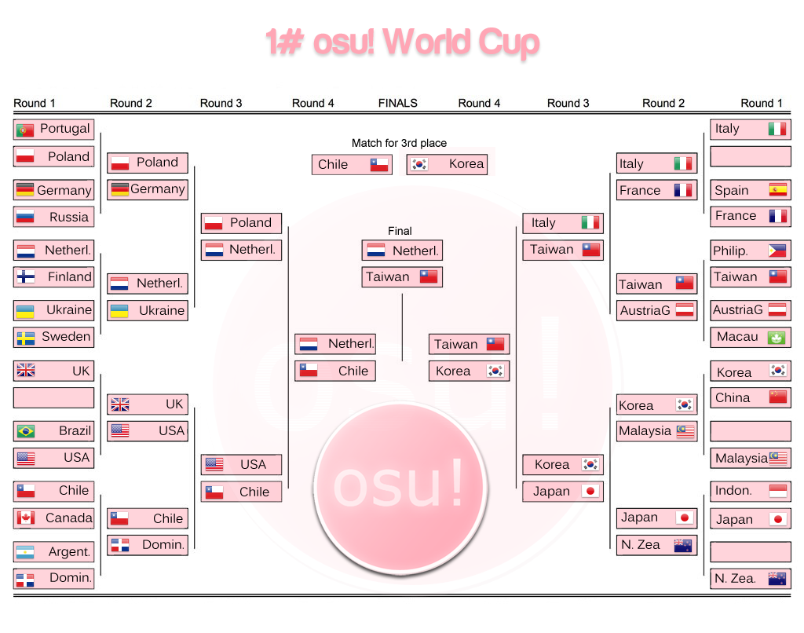

---
tags:
- OWC #1
- OWC 1
- OWC#1
- OWC1
---

# osu! World Cup #1

The **osu! World Cup #1** (***OWC #1***) is a country-based osu! tournament hosted by the [osu! team](/wiki/People/The_Team). It is the 1st installment of the osu! World Cup.

## Tournament Schedule

- The OWC started at 2011-02-21
- All matches were played from 15:00 to 22:00 (GMT), from Thursday to Sunday

## Prizes

In every World Cup, people conquering a place on the podium are eligible to receive unique prizes created specifically for World Cup winners. It is possible that these items change with every installment of the World Cups.

| Placing | Prize(s) |
| :-: | :-- |
|  | 6 months of osu!supporter tag, special profile badge |
|  | 1 month of osu!supporter tag |
|  | 1 month of osu!supporter tag |
| *Special* | 1 month of osu!supporter tag (won by ![][flag_JP] Japan) |

## Organisation

The osu! World Cup #1 was run by various community members by distributing the multitude of tasks into various fields of responsibility.

- ![][flag_TW] [Alace](https://osu.ppy.sh/users/25993)
- ![][flag_ES] [Beuchi-chan](https://osu.ppy.sh/users/67192)
- ![][flag_US] [Derekku](https://osu.ppy.sh/users/91341)
- ![][flag_AU] [m980](https://osu.ppy.sh/users/3288)
- ![][flag_DE] [Larto](https://osu.ppy.sh/users/12328)
- ![][flag_JP] [dvorak](https://osu.ppy.sh/users/271359)
- ![][flag_IT] [Lunah](https://osu.ppy.sh/users/1227377)

## Links

- [Discussion thread](https://osu.ppy.sh/community/forums/topics/45412)
- [Match recaps](https://osu.ppy.sh/community/forums/topics/45412?n=803)
- [Finals recap](https://www.mediafire.com/file/ab6j6k4ihtp25o2) - provided by [dvorak](https://osu.ppy.sh/users/271359)

------------------------------------------------------------

## Participants

|  | Country | Members |
| :-: | :-: | :-- |
| ![][flag_AT] | **Austria** | **TouhouNerd**, Snowball, Hanyuu, Nharox, unbelievable |
| ![][flag_AR] | **Argentina** | **Wishy22**, RocknRolla, Grisuh, Vivere, lota78, violentt |
| ![][flag_BR] | **Brazil** | **fabriciorby**, Coy, Blue Dragon, Poisonchan, Antsu, Guerra |
| ![][flag_CA] | **Canada** | **FurukawaPan**, Soulclenz, timotmcc, Ever 14, yanggaog, FruitTingles |
| ![][flag_CL] | **Chile** | **nVidi4x**, Mesita, Netofe, ElxBeta, Art-FzTT |
| ![][flag_CN] | **China** | **kiddly**, xierbaliti, KanbeKotori, Sprosive, lzy, Brother\_Lu |
| ![][flag_DO] | **Dominican Republic** | **Lissette**, Lizbeth, jmt\_3, Magestix |
| ![][flag_FI] | **Finland** | **heintsi**, Orkel, morovaa, Sutsuka, Mukku, Lanttu |
| ![][flag_FR] | **France** | **maestro delphine**, \_LRJ\_, galvenize, Yomi, JesusYamato, Odaril |
| ![][flag_DE] | **Germany** | **Shael**, Neruell, LuniaFreak, Jalatiphra, eMJaReL, Shinespark |
| ![][flag_ID] | **Indonesia** | **Hakeru Prismriver**, intermu, Rasyad95, awesomewithin, awell, dNextGen |
| ![][flag_IT] | **Italy** | **Card N'FoRcE**, osuplayer111, Lunah, Kr4t0ss88, Valde, \[Takuya\] |
| ![][flag_JP] | **Japan** | **MeRcYyy**, taNa, Rigeru, Ozouni, Rorry, SiLviA |
| ![][flag_KR] | **Korea** | **KRZY**, Cookiezi, Reisen Udongein, ehRh, M A I D, Binjip |
| ![][flag_MO] | **Macau** | **Ballance**, wl01939929, starpun1, \_\_\_\_\_B, xinhe |
| ![][flag_MY] | **Malaysia** | **The 08 team\_Bourdon**, akupp, DragonSparta, Crimson_SoulZ, mycyber, mekadon |
| ![][flag_NL] | **Netherlands** | **GladiOol**, Henkie, Lesjuh, Awoken, Happy30, eddieee |
| ![][flag_NZ] | **New Zealand** | **NumoT123**, toejamms, Skye-, Acidsky-, Jiantz, Deadbeat |
| ![][flag_PH] | **Philippines** | **dayun10**, blacksymbian, jockeytiyan, wyndII, nachopiggy, bakaloidsky |
| ![][flag_PL] | **Poland** | **ShaggoN**, kuburaczek, White Wolf, Niko-, rEdo, fartownik |
| ![][flag_PT] | **Portugal** | **JonnyThatJonny**, creativ, sttailruby12, makkura |
| ![][flag_RU] | **Russia** | **GaShiK**, larch, Kotya, Akai-, CracK, TKiller |
| ![][flag_ES] | **Spain** | **X\_Ray**, Skullboss, hyperluigi, Lionheart69, choche, migul |
| ![][flag_SE] | **Sweden** | **beko1994**, Saten-san, palinus, Vikkez, Xgor, Darkoff |
| ![][flag_TW] | **Taiwan** | **Uan**, Rucker, 0222101916, Tomoka Rin, FuNnY--, NanaDesu |
| ![][flag_UA] | **Ukraine** | **gorlum**, rockleejkooo, Mosya, RainForce, gef |
| ![][flag_GB] | **United Kingdom** | **Doomsday**, Natteke, aevv, Jericho2442, DiamondCrash |
| ![][flag_US] | **United States** | **Lybydose**, Mafiamaster, Cyclone, ebacho, naptime |

------------------------------------------------------------

---------------------------------------------------

## Mappools

### Finals

- NoMod (played in order)
  - [Glasslake - Driving Lazy Bee (darrihuka) \[DaRRi MIx\]](https://osu.ppy.sh/beatmapsets/3861#osu/22759)
  - [YUI - Sea (VanMoNky) \[Senior\]](https://osu.ppy.sh/beatmapsets/13021#osu/48422)
  - [Suzaku - Anisakis -somatic mutation type "Forza" (tsukamaete) \[Another\]](https://osu.ppy.sh/beatmapsets/15579#osu/56347)
  - [IOSYS - Danzai Yamaxanadu (Zekira) \[Eternal Damnation\]](https://osu.ppy.sh/beatmapsets/13654#osu/50354)
  - [DJ YOSHITAKA - Bloody Tears(IIDX EDITION) (Gabi) \[Insane\]](https://osu.ppy.sh/beatmapsets/6598#osu/29731)
  - [Betwixt & Between - I think we can go to the moon (AngelHoney) \[Another\]](https://osu.ppy.sh/beatmapsets/13728#osu/50658)
- Tiebreaker
  - **[Renard - Banned Forever (Blue Dragon) \[Nogard\]](https://osu.ppy.sh/beatmapsets/16349#osu/64267)**

### Semifinals

- NoMod (played in order)
  - [COOL&CREATE - Rapid Ensemble (Doomsday93) \[Lunatic\]](https://osu.ppy.sh/beatmapsets/13235#osu/49067)
  - [Suzaku VS Genbu - Himiko (Mystearica) \[Another\]](https://osu.ppy.sh/beatmapsets/12710#osu/47462)
  - [Susumu Hirasawa - Big Brother (Gens) \[KIRBY Mix\]](https://osu.ppy.sh/beatmapsets/10714#osu/42244)
  - [NEWS - weeeek (Echo) \[Insane\]](https://osu.ppy.sh/beatmapsets/3697#osu/22422)
  - [Tachibana Miya - Miya to Tengoku to Jigoku (AngelHoney) \[Hentai\]](https://osu.ppy.sh/beatmapsets/17450#osu/62269)
  - [Nobuo Uematsu - The Fierce Battle (mtmcl) \[Omega\]](https://osu.ppy.sh/beatmapsets/5727#osu/27466)
- Tiebreaker
  - **[Rhapsody - Emerald Sword (Reikin) \[Extreme\]](https://osu.ppy.sh/beatmapsets/3198#osu/25580)**

### Quarterfinals

- NoMod
  - [3L - Extend Ash ~ Hourai Victim (Dangaard) \[Extra\]](https://osu.ppy.sh/beatmapsets/8593#osu/36223)
  - [Amane - BOOZEHOUND (tieff) \[Lesjuh\]](https://osu.ppy.sh/beatmapsets/9995#osu/39549)
  - [ARMCANNON - Bhost Gusters (awp) \[Insane\]](https://osu.ppy.sh/beatmapsets/9445#osu/37752)
  - [Beautiful Day - V3 (ignorethis) \[Impossible\]](https://osu.ppy.sh/beatmapsets/4622#osu/41313)
  - [Dj Verstarker - Jump Jump (2008) (SeymourLyon) \[Jump like CRAZY!!!\]](https://osu.ppy.sh/beatmapsets/6004#osu/28152)
  - [FamilyMart Jingle (deepsea) \[Family Mart is Your Home\]](https://osu.ppy.sh/beatmapsets/9400#osu/37658)
  - [Hatsune Miku - Uraomote Lovers (Shinxyn) \[Insane\]](https://osu.ppy.sh/beatmapsets/11375#osu/43603)
  - [Kevin.o2SE - Red Sign (darrihuka) \[DaRRi MiX\]](https://osu.ppy.sh/beatmapsets/3575#osu/22079)
  - [Megpoid GUMI - Poker Face (NatsumeRin) \[Spade\]](https://osu.ppy.sh/beatmapsets/24782#osu/84801)
  - [Mindless Self Indulgence - You'll Rebel To Anything (Rolled) \[Impossible\]](https://osu.ppy.sh/beatmapsets/2597#osu/19910)
  - [Nico Nico Douga - Misaka Odoru (KIA) \[WyndII's Misaka Crazy!!\]](https://osu.ppy.sh/beatmapsets/10891#osu/42224)
  - [Peter Lambert - osu! Tutorial (Sushi) \[Pro Gameplay\]](https://osu.ppy.sh/beatmapsets/19928#osu/70050)
  - [Seiryu X Donald - Time to Donald (James) \[Another\]](https://osu.ppy.sh/beatmapsets/6950#osu/30613)
  - [sun3 - Higan Retour (saymun) \[Lunatic\]](https://osu.ppy.sh/beatmapsets/14464#osu/54373)
  - [Susumu Hirasawa - Amor Buffer (Real1) \[KIRBY Mix\]](https://osu.ppy.sh/beatmapsets/11702#osu/44526)
- Tiebreaker
  - **[DJ Mars - Lemon Tree (MetalMario201) \[Hard\]](https://osu.ppy.sh/beatmapsets/8229#osu/34045)**

### Round of 16

- NoMod
  - [Cranky - Party 4u "Holy Nite Mix" (avira0922) \[Max\]](https://osu.ppy.sh/beatmapsets/7205#osu/31279)
  - [Croove - Red (Rolled) \[Insane\]](https://osu.ppy.sh/beatmapsets/4132#osu/23863)
  - [Girls' Generation - Himnae! (Way To Go) (ykcarrot) \[Insane\]](https://osu.ppy.sh/beatmapsets/17525#osu/62515)
  - [Gojou Kai - Tsuepeshu no Osanaki Matsuei (Al-Azif) \[Hard\]](https://osu.ppy.sh/beatmapsets/3862#osu/22760)
  - [Hatsune Miku & Megpoid Gumi - MATRYOSHKA (gowww) \[Insane\]](https://osu.ppy.sh/beatmapsets/19789#osu/69405)
  - [Hito Ookami - Decisive Battle! Ho-Oh! (\[Takuya\]) \[Lvl 100\]](https://osu.ppy.sh/beatmapsets/24875#osu/85807)
  - [KOTOKO - Wing my Way (Nekomiya Nono) \[v2b\]](https://osu.ppy.sh/beatmapsets/12035#osu/46827)
  - [M2U - Nightmare (DJPop) \[Insane\]](https://osu.ppy.sh/beatmapsets/5139#osu/25905)
  - [Nightcore - Pinball (jericho2442) \[Ultimate's Craziness\]](https://osu.ppy.sh/beatmapsets/7930#osu/41068)
  - [onoken - K8107 (tsukamaete) \[Another\]](https://osu.ppy.sh/beatmapsets/13470#osu/49822)
  - [Paramore - Looking Up (Lesjuh) \[Hard\]](https://osu.ppy.sh/beatmapsets/17563#osu/66662)
  - [Rammstein - Du Hast (kingcobra52) \[Du Hast Mich\]](https://osu.ppy.sh/beatmapsets/4503#osu/24517)
  - [Suzaku - Contract (osu_CN_yaya) \[Another\]](https://osu.ppy.sh/beatmapsets/9697#osu/38507)
  - [Tatsh - Cruel Moon (Shinxyn) \[Lunatic\]](https://osu.ppy.sh/beatmapsets/13584#osu/50148)
  - [The Mighty Mighty Bosstones - The Impression That I Get (lesjuh) \[Hard\]](https://osu.ppy.sh/beatmapsets/14912#osu/54329)
- Tiebreaker
  - **[Seiryu - Time to Air (Alace) \[DaRRi MIx\]](https://osu.ppy.sh/beatmapsets/4597#osu/24594)**

### Group Stage

- NoMod
  - [BeForU - Love Shine (James) \[Hard\]](https://osu.ppy.sh/beatmapsets/1300#osu/11091)
  - [BRANDY - The Festival of Ghost 2 (darrihuka) \[DaRRi MiX\]](https://osu.ppy.sh/beatmapsets/3302#osu/21422)
  - [Dark PHOENiX - Stirring an Autumn Moon (\_lolipop) \[Crazy Moon\]](https://osu.ppy.sh/beatmapsets/16650#osu/59693)
  - [FF7 Original Soundtrack - Crazy Motorcycle Chase (James) \[Crazy\]](https://osu.ppy.sh/beatmapsets/1961#osu/18170)
  - [Hirano Aya - Lost My Music (DJPop) \[Ace Of Trades' Insane\]](https://osu.ppy.sh/beatmapsets/4591#osu/25878)
  - [IOSYS - Cirno's Perfect Maths Class (Nharox) \[DJPop's Streams\]](https://osu.ppy.sh/beatmapsets/5285#osu/26436)
  - [Jan Wayne Vs. Raindropz - Numb (Nightcore Ver.) (KIA) \[SteRRuM's Insane\]](https://osu.ppy.sh/beatmapsets/14983#osu/54697)
  - [Karen - Sudden Death R99 (v2b) \[Sudden Death\]](https://osu.ppy.sh/beatmapsets/6269#osu/28805)
  - [Lee Jun Hyun - Ari Ari (osu\_CN\_yaya) \[Insane\]](https://osu.ppy.sh/beatmapsets/11167#osu/46955)
  - [Nekomata Master - Goodbye Heaven (alvisto) \[Another\]](https://osu.ppy.sh/beatmapsets/12688#osu/48926)
  - [Risk Junk-G - Candy Galy (Alace) \[ignore's Insane\]](https://osu.ppy.sh/beatmapsets/8208#osu/34005)
  - [SHK - Imagination (Gabi) \[SHD\]](https://osu.ppy.sh/beatmapsets/5958#osu/28148)
  - [Tatsh - Kachoufuusetsu (Al-Azif) \[Another\]](https://osu.ppy.sh/beatmapsets/4598#osu/24575)
  - [The Gregory Brothers - Auto-Tune the News \#9 (MetalMario201) \[Angry Gorilla\]](https://osu.ppy.sh/beatmapsets/12155#osu/45825)
  - [Weird Al Yankovic - Hardware Store (kingcobra52) \[Impossible\]](https://osu.ppy.sh/beatmapsets/2042#osu/18682)
- Tiebreaker
  - **[Hyadain - Battle with the Four Fiends (mtmcl) \[Sinistro\]](https://osu.ppy.sh/beatmapsets/2619#osu/20019)**

--------------------------------------------------------------

## Ruleset

### Tournament Rules

1. One of two captains must post the link of the multiplayer history after the match, you can find it when you join the room into the chat.
2. If a team not present during the match, that team will be disqualified. Opposing team is obliged to wait for at least 15 minutes for the team to show up.
3. Any form of cheating will be punished with the disqualification of the team and ban of the cheating player.

### Instructions

1. The first stage of the cup is divided depending on continent.
   - Example: Europe country vs Europe country (Poland vs Portugal).
2. All matches follow knockout tournament rule.
3. 32 countries. If not enough countries, cup's stages will be modeled based on the number reached.
4. Each country's decision will be represented by a "captain" who will choose the members of the team and will inform players about the timetables.
5. Captains will be chosen by language specific topics or discussions in IRC specific language channels made by trusted players/staffs.
6. Teams should made up of 4 players and 2 backups in case one or more players are not available to play.

### Match Instructions

1. For each round, a list of 15 Beatmaps will be given chosen by a staff member of the tournament(a non-player). Countries can choose one of these beatmaps to play for a match (I recommend you prepare another choice in case your opponent chooses the same map) of the round. Beatmap packs containing the 15 beatmaps for every round will be created for convenience.
2. The matches will be played in a private room created by one of the two competing captains.
3. Settings will be osu! standard, 4 vs 4 players, "Team VS" mode and Win condition: "Score".
4. The country with highest team total score (total score of all players) will win the map.
5. The only mod accepted is No Video.
6. In the case of a 1-1 draw, there will be a default tiebreaker map that decided by the cup staff.
7. When a team fails, the other team automatically wins the match.

[flag_AR]: /wiki/shared/flag/AR.gif
[flag_AT]: /wiki/shared/flag/AT.gif
[flag_AU]: /wiki/shared/flag/AU.gif
[flag_BR]: /wiki/shared/flag/BR.gif
[flag_CA]: /wiki/shared/flag/CA.gif
[flag_CL]: /wiki/shared/flag/CL.gif
[flag_CN]: /wiki/shared/flag/CN.gif
[flag_DE]: /wiki/shared/flag/DE.gif
[flag_DO]: /wiki/shared/flag/DO.gif
[flag_ES]: /wiki/shared/flag/ES.gif
[flag_FI]: /wiki/shared/flag/FI.gif
[flag_FR]: /wiki/shared/flag/FR.gif
[flag_GB]: /wiki/shared/flag/GB.gif
[flag_ID]: /wiki/shared/flag/ID.gif
[flag_IT]: /wiki/shared/flag/IT.gif
[flag_JP]: /wiki/shared/flag/JP.gif
[flag_KR]: /wiki/shared/flag/KR.gif
[flag_MO]: /wiki/shared/flag/MO.gif
[flag_MY]: /wiki/shared/flag/MY.gif
[flag_NL]: /wiki/shared/flag/NL.gif
[flag_NZ]: /wiki/shared/flag/NZ.gif
[flag_PH]: /wiki/shared/flag/PH.gif
[flag_PL]: /wiki/shared/flag/PL.gif
[flag_PT]: /wiki/shared/flag/PT.gif
[flag_RU]: /wiki/shared/flag/RU.gif
[flag_SE]: /wiki/shared/flag/SE.gif
[flag_TW]: /wiki/shared/flag/TW.gif
[flag_UA]: /wiki/shared/flag/UA.gif
[flag_US]: /wiki/shared/flag/US.gif
