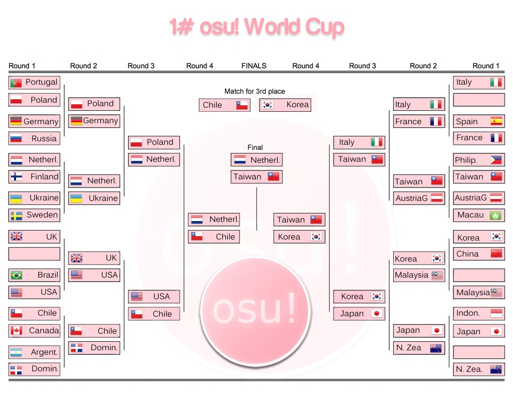

---
tags:
  - "OWC #1"
  - OWC 1
  - OWC#1
  - OWC1
---

# osu! World Cup #1

The **osu! World Cup #1** (***OWC #1***) was a single elimination country-based osu! tournament run by various osu! community members under the provision of the [osu! team](/wiki/People/osu!_team). It was the first instalment of the osu! World Cup.

## Tournament schedule

| Event | Timestamp |
| --: | :-- |
| Registration phase | 2011-01-31/2011-02-21 |
| Round of 32 | 2011-02-22/2011-02-28 |
| Round of 16 | 2011-03-01/2011-03-07 |
| Quarterfinals | 2011-03-08/2011-03-22 |
| Semifinals | 2011-03-23/2011-03-29 |
| Finals | 2011-03-30/2011-04-11 |

## Prizes

| Placing | Prize(s) |
| :-: | :-- |
|  | 6 months of osu!supporter for each team member, unique profile badge |
|  | 1 month of osu!supporter for each team member |
|  | 1 month of osu!supporter for each team member |

Aside from the main prizes listed above, the Tournament Management has also decided to separately award all members of the ::{ flag=JP }:: Japanese team with 1 month of osu!supporter in the wake of the [2011 Tōhoku earthquake](https://en.wikipedia.org/wiki/2011_T%C5%8Dhoku_earthquake_and_tsunami) incident.

## Organisation

The osu! World Cup #1 was run by various community members.

| Position | Member(s) |
| :-: | :-- |
| Host/Manager | ::{ flag=IT }:: [Lunah](https://osu.ppy.sh/users/1227377) |
| Streamer | ::{ flag=JP }:: [dvorak](https://osu.ppy.sh/users/271359) |
| Mappool selector | ::{ flag=IT }:: [Lunah](https://osu.ppy.sh/users/1227377), ::{ flag=AU }:: [m980](https://osu.ppy.sh/users/3288), ::{ flag=DE }:: [Larto](https://osu.ppy.sh/users/12328), ::{ flag=TW }:: [Alace](https://osu.ppy.sh/users/25993) |
| Referee | ::{ flag=IT }:: [Lunah](https://osu.ppy.sh/users/1227377), ::{ flag=US }:: [Derekku](https://osu.ppy.sh/users/91341), ::{ flag=ES }:: [Beuchi-chan](https://osu.ppy.sh/users/67192) |

## Links

- [Discussion thread](https://osu.ppy.sh/community/forums/topics/45412)
- [Livestream channel](https://livestream.com/osuworldcup)
- [Finals recap](https://www.mediafire.com/file/ab6j6k4ihtp25o2) - provided by ::{ flag=JP }:: [dvorak](https://osu.ppy.sh/users/271359)

## Participants

|  | Country | Members |
| :-: | :-: | :-- |
| ::{ flag=AT }::/::{ flag=DE }:: | **Austria - Germany** | **[TouhouNerd](https://osu.ppy.sh/users/396056)**, [Hanyuu](https://osu.ppy.sh/users/73480), [Nharox](https://osu.ppy.sh/users/6794), [Snowball](https://osu.ppy.sh/users/152238), [unbelievable](https://osu.ppy.sh/users/491021) |
| ::{ flag=AR }:: | **Argentina** | **[Wishy22](https://osu.ppy.sh/users/495477)**, [Grisuh](https://osu.ppy.sh/users/221500), [lota78](https://osu.ppy.sh/users/50727), [RocknRolla](https://osu.ppy.sh/users/135622), [Vivere](https://osu.ppy.sh/users/101521), [violentt](https://osu.ppy.sh/users/87231) |
| ::{ flag=BR }:: | **Brazil** | **[fabriciorby](https://osu.ppy.sh/users/209664)**, [Antsu](https://osu.ppy.sh/users/92953), [Blue Dragon](https://osu.ppy.sh/users/19048), [Coy](https://osu.ppy.sh/users/150434), [Guerra](https://osu.ppy.sh/users/271144), [Poisonchan](https://osu.ppy.sh/users/227881) |
| ::{ flag=CA }:: | **Canada** | **[FurukawaPan](https://osu.ppy.sh/users/32067)**, [Ever 14](https://osu.ppy.sh/users/507051), [Hiyorin](https://osu.ppy.sh/users/493961), [Soulclenz](https://osu.ppy.sh/users/190109), [timotmcc](https://osu.ppy.sh/users/41809), [yanggaog](https://osu.ppy.sh/users/129119) |
| ::{ flag=CL }:: | **Chile** | **[nVidi4x](https://osu.ppy.sh/users/203181)**, [Art-FzTT](https://osu.ppy.sh/users/248453), [ElxBeta](https://osu.ppy.sh/users/75515), [Mesita](https://osu.ppy.sh/users/201459), [netofe](https://osu.ppy.sh/users/324198) |
| ::{ flag=CN }:: | **China** | **[kiddly](https://osu.ppy.sh/users/74937)**, [xierbaliti](https://osu.ppy.sh/users/34044), [KanbeKotori](https://osu.ppy.sh/users/107426), [Sprosive](https://osu.ppy.sh/users/227717), [lzy](https://osu.ppy.sh/users/135567), [Brother\_Lu](https://osu.ppy.sh/users/700309) |
| ::{ flag=DO }:: | **Dominican Republic** | **[Lissette](https://osu.ppy.sh/users/19835)**, [jmt\_3](https://osu.ppy.sh/users/317242), [Lizbeth](https://osu.ppy.sh/users/21970), [Magestix](https://osu.ppy.sh/users/50885) |
| ::{ flag=FI }:: | **Finland** | **[heintsi](https://osu.ppy.sh/users/63185)**, [Lanttu](https://osu.ppy.sh/users/57448), [morovaa](https://osu.ppy.sh/users/127777), [Mukku](https://osu.ppy.sh/users/71756), [Orkel](https://osu.ppy.sh/users/39385), [Sutsuka](https://osu.ppy.sh/users/29089) |
| ::{ flag=FR }:: | **France** | **[maestro delphine](https://osu.ppy.sh/users/472848)**, [\_LRJ\_](https://osu.ppy.sh/users/284905), [galvenize](https://osu.ppy.sh/users/381444), [JesusYamato](https://osu.ppy.sh/users/482442), [Shiro](https://osu.ppy.sh/users/113005), [Yomi](https://osu.ppy.sh/users/366059) |
| ::{ flag=DE }:: | **Germany** | **[Shael](https://osu.ppy.sh/users/132308)**, [eMJaReL](https://osu.ppy.sh/users/65761), [Jalatiphra](https://osu.ppy.sh/users/94386), [LuniaFreak](https://osu.ppy.sh/users/473895), [Neruell](https://osu.ppy.sh/users/112257), [Shinespark](https://osu.ppy.sh/users/126293) |
| ::{ flag=ID }:: | **Indonesia** | **[Hakeru Prismriver](https://osu.ppy.sh/users/345422)**, [awell](https://osu.ppy.sh/users/341298), [awesomewithin](https://osu.ppy.sh/users/81652), [dNextGen](https://osu.ppy.sh/users/346320), [intermu](https://osu.ppy.sh/users/193198), [Rasyad95](https://osu.ppy.sh/users/157956) |
| ::{ flag=IT }:: | **Italy** | **[Card N'FoRcE](https://osu.ppy.sh/users/3936)**, [\[Takuya\]](https://osu.ppy.sh/users/342372), [kr4t0s88](https://osu.ppy.sh/users/40737), [Lunah](https://osu.ppy.sh/users/1227377), [osuplayer111](https://osu.ppy.sh/users/33599), [Valde](https://osu.ppy.sh/users/208531) |
| ::{ flag=JP }:: | **Japan** | **[MeRcYyy](https://osu.ppy.sh/users/75595)**, [Ozouni](https://osu.ppy.sh/users/69600), [Rigeru](https://osu.ppy.sh/users/61154), [Rorry](https://osu.ppy.sh/users/198574), [SiLviA](https://osu.ppy.sh/users/409747), [taNa](https://osu.ppy.sh/users/61101) |
| ::{ flag=MO }:: | **Macau** | **[Ballance](https://osu.ppy.sh/users/165946)**, [\_\_\_\_\_B](https://osu.ppy.sh/users/247901), [starpun1](https://osu.ppy.sh/users/144523), [wl01939929](https://osu.ppy.sh/users/456163), [xinhe](https://osu.ppy.sh/users/252936) |
| ::{ flag=MY }:: | **Malaysia** | **[The 08 team\_Bourdon](https://osu.ppy.sh/users/275686)**, [akupp](https://osu.ppy.sh/users/249825), [DragonSparta](https://osu.ppy.sh/users/216909), [Crimson\_SoulZ](https://osu.ppy.sh/users/91320), [mekadon](https://osu.ppy.sh/users/157835), [mycyber](https://osu.ppy.sh/users/187910) |
| ::{ flag=NL }:: | **Netherlands** | **[GladiOol](https://osu.ppy.sh/users/23326)**, [Awoken](https://osu.ppy.sh/users/256802), [eddieee](https://osu.ppy.sh/users/260284), [happy30](https://osu.ppy.sh/users/27767), [Henkie](https://osu.ppy.sh/users/16944), [Lesjuh](https://osu.ppy.sh/users/44308) |
| ::{ flag=NZ }:: | **New Zealand** | **[NumoT123](https://osu.ppy.sh/users/282930)**, [Acidsky-](https://osu.ppy.sh/users/116608), [deadbeat](https://osu.ppy.sh/users/128370), [jiantz](https://osu.ppy.sh/users/330252), [SkyE-](https://osu.ppy.sh/users/114796), [toejamms](https://osu.ppy.sh/users/231111) |
| ::{ flag=PH }:: | **Philippines** | **[dayun10](https://osu.ppy.sh/users/570310)**, [bakaloidsky](https://osu.ppy.sh/users/504885), [blacksymbian](https://osu.ppy.sh/users/53956), [jockeytiyan](https://osu.ppy.sh/users/133618), [nachopiggy](https://osu.ppy.sh/users/95637), [WyndII](https://osu.ppy.sh/users/46538) |
| ::{ flag=PL }:: | **Poland** | **[ShaggoN](https://osu.ppy.sh/users/39129)**, [fartownik](https://osu.ppy.sh/users/56917), [kuburaczek](https://osu.ppy.sh/users/29130), [Niko-](https://osu.ppy.sh/users/175141), [rEdo](https://osu.ppy.sh/users/49329), [White Wolf](https://osu.ppy.sh/users/39828) |
| ::{ flag=PT }:: | **Portugal** | **[JonnyThatJonny](https://osu.ppy.sh/users/201290)**, [creativ](https://osu.ppy.sh/users/280158), [makkura](https://osu.ppy.sh/users/344086), [Pereira006](https://osu.ppy.sh/users/537344), [sttailruby12](https://osu.ppy.sh/users/213335) |
| ::{ flag=RU }:: | **Russian Federation** | **[GaShiK](https://osu.ppy.sh/users/227643)**, [Akai-](https://osu.ppy.sh/users/649471), [CracK](https://osu.ppy.sh/users/119933), [Kotya](https://osu.ppy.sh/users/297551), [larch](https://osu.ppy.sh/users/296787), [TKiller](https://osu.ppy.sh/users/113027) |
| ::{ flag=KR }:: | **South Korea** | **[KRZY](https://osu.ppy.sh/users/114017)**, [Binjip](https://osu.ppy.sh/users/261694), [Cookiezi](https://osu.ppy.sh/users/124493), [ehRh](https://osu.ppy.sh/users/272117), [M A I D](https://osu.ppy.sh/users/216472), [Reisen Udongein](https://osu.ppy.sh/users/232942) |
| ::{ flag=ES }:: | **Spain** | **[X\_Ray](https://osu.ppy.sh/users/160937)**, [choche](https://osu.ppy.sh/users/239850), [hyperluigi](https://osu.ppy.sh/users/43921), [Lionheart69](https://osu.ppy.sh/users/88152), [migul](https://osu.ppy.sh/users/423217), [Skullboss](https://osu.ppy.sh/users/48527) |
| ::{ flag=SE }:: | **Sweden** | **[beko1994](https://osu.ppy.sh/users/310548)**, [Darkoff](https://osu.ppy.sh/users/131072), [palinus](https://osu.ppy.sh/users/214706), [Saten-san](https://osu.ppy.sh/users/444506), [Vikkez](https://osu.ppy.sh/users/235215), [Xgor](https://osu.ppy.sh/users/98661) |
| ::{ flag=TW }:: | **Taiwan** | **[Uan](https://osu.ppy.sh/users/147623)**, [0222101916](https://osu.ppy.sh/users/122650), [FuNnY--](https://osu.ppy.sh/users/398097), [NanaDesu](https://osu.ppy.sh/users/163474), [Rucker](https://osu.ppy.sh/users/147515), [Tomoka Rin](https://osu.ppy.sh/users/125308) |
| ::{ flag=UA }:: | **Ukraine** | **[Gorlum](https://osu.ppy.sh/users/347635)**, [gef](https://osu.ppy.sh/users/226175), [Mosya](https://osu.ppy.sh/users/77835), [RainForce](https://osu.ppy.sh/users/192251), [rockleejkooo](https://osu.ppy.sh/users/384003) |
| ::{ flag=GB }:: | **United Kingdom** | **[Doomsday](https://osu.ppy.sh/users/18983)**, [aevv](https://osu.ppy.sh/users/390955), [DiamondCrash](https://osu.ppy.sh/users/123790), [jericho2442](https://osu.ppy.sh/users/88904), [Natteke](https://osu.ppy.sh/users/157177) |
| ::{ flag=US }:: | **United States** | **[Lybydose](https://osu.ppy.sh/users/64501)**, [Cyclone](https://osu.ppy.sh/users/18589), [ebacho](https://osu.ppy.sh/users/129932), [Mafiamaster](https://osu.ppy.sh/users/17695), [naptime](https://osu.ppy.sh/users/277682) |

## Podium

This competition has come to an end and resulted in the following podium:

| Placing | Team |
| :-: | :-- |
|  | ::{ flag=TW }:: **Taiwan** (**[Uan](https://osu.ppy.sh/users/147623)**, [0222101916](https://osu.ppy.sh/users/122650), [FuNnY--](https://osu.ppy.sh/users/398097), [NanaDesu](https://osu.ppy.sh/users/163474), [Rucker](https://osu.ppy.sh/users/147515), [Tomoka Rin](https://osu.ppy.sh/users/125308)) |
|  | ::{ flag=NL }:: **Netherlands** (**[GladiOol](https://osu.ppy.sh/users/23326)**, [Awoken](https://osu.ppy.sh/users/256802), [eddieee](https://osu.ppy.sh/users/260284), [happy30](https://osu.ppy.sh/users/27767), [Henkie](https://osu.ppy.sh/users/16944), [Lesjuh](https://osu.ppy.sh/users/44308)) |
|  | ::{ flag=KR }:: **South Korea** (**[KRZY](https://osu.ppy.sh/users/114017)**, [Binjip](https://osu.ppy.sh/users/261694), [Cookiezi](https://osu.ppy.sh/users/124493), [ehRh](https://osu.ppy.sh/users/272117), [M A I D](https://osu.ppy.sh/users/216472), [Reisen Udongein](https://osu.ppy.sh/users/232942)) |

## Mappools

### Finals

**[Download the mappack here! (94 MB)](https://mega.nz/file/SGAR0apA#w09Acjtf9UMISsiYLYpAvGMApmnfROBU0mglaRQgPI8)**

- NoMod (*to be played in order*)
  1. [Minibosses - Castlevania (m980) \[OWC Final\]](https://osu.ppy.sh/beatmapsets/1738985#osu/3562703)
  2. [Various Artists - osu! Stream Compilation (Natteke) \[EXE\]](https://osu.ppy.sh/beatmapsets/25403#osu/86044)
  3. [Shiki mixed by Djsmalls - Air (MegaManEXE) \[Best map ever created\]](https://osu.ppy.sh/beatmapsets/13008#osu/48386)
  4. [Nico Nico Douga - U.N. Owen Was Her? (Reikin) \[Ronald Mix\]](https://osu.ppy.sh/beatmapsets/1785#osu/21010)
  5. [07th Expansion - rog-limitation (AngelHoney) \[Insane\]](https://osu.ppy.sh/beatmapsets/14994#osu/54581)
  6. [Amuro vs Killer - Mei (v2b) \[Another\]](https://osu.ppy.sh/beatmapsets/8965#osu/36290)
  7. [m-flo loves CHEMISTRY - Astrosexy (mtmcl) \[Sexy\]](https://osu.ppy.sh/beatmapsets/13244#osu/49101)
  8. [Renard - Banned Forever (Blue Dragon) \[Lesjuh\]](https://osu.ppy.sh/beatmapsets/16349#osu/64266)
- Tiebreaker
  1. **[IOSYS - Usatei (Card N'FoRcE) \[RUN!!\]](https://osu.ppy.sh/beatmapsets/3959#osu/22993)**

### 3rd Place Playoffs

**[Download the mappack here! (59.9 MB)](https://mega.nz/file/SfJ3gApZ#7tgaCsgbX98w-4_B7jnsLCs92H0QxFz8xrhFh85S8aE)**

- NoMod (*to be played in order*)
  1. [Glasslake - Driving Lazy Bee (darrihuka) \[DaRRi MIx\]](https://osu.ppy.sh/beatmapsets/3861#osu/22759)
  2. [YUI - Sea (VanMoNky) \[Senior\]](https://osu.ppy.sh/beatmapsets/13021#osu/48422)
  3. [Suzaku - Anisakis -somatic mutation type "Forza" (tsukamaete) \[Another\]](https://osu.ppy.sh/beatmapsets/15579#osu/56347)
  4. [IOSYS - Danzai Yamaxanadu (Zekira) \[Eternal Damnation\]](https://osu.ppy.sh/beatmapsets/13654#osu/50354)
  5. [DJ YOSHITAKA - Bloody Tears(IIDX EDITION) (Gabi) \[Insane\]](https://osu.ppy.sh/beatmapsets/6598#osu/29731)
  6. [Betwixt & Between - I think we can go to the moon (AngelHoney) \[Another\]](https://osu.ppy.sh/beatmapsets/13728#osu/50658)
- Tiebreaker
  1. **[Renard - Banned Forever (Blue Dragon) \[Nogard\]](https://osu.ppy.sh/beatmapsets/16349#osu/64267)**

### Semifinals

**[Download the mappack here! (30.1 MB)](https://mega.nz/file/CXIUEZLD#-FXpQaCMeIo1T1uRMhzP6U9OgpzlFoBvvxc-5Mn4Th4)**

- NoMod (*to be played in order*)
  1. [COOL&CREATE - Rapid Ensemble (Doomsday93) \[Lunatic\]](https://osu.ppy.sh/beatmapsets/13235#osu/49067)
  2. [Suzaku VS Genbu - Himiko (Mystearica) \[Another\]](https://osu.ppy.sh/beatmapsets/12710#osu/47462)
  3. [Susumu Hirasawa - Big Brother (Gens) \[KIRBY Mix\]](https://osu.ppy.sh/beatmapsets/10714#osu/42244)
  4. [NEWS - weeeek (Echo) \[Insane\]](https://osu.ppy.sh/beatmapsets/3697#osu/22422)
  5. [Tachibana Miya - Miya to Tengoku to Jigoku (AngelHoney) \[Hentai\]](https://osu.ppy.sh/beatmapsets/17450#osu/62269)
  6. [Nobuo Uematsu - The Fierce Battle (mtmcl) \[Omega\]](https://osu.ppy.sh/beatmapsets/5727#osu/27466)
- Tiebreaker
  1. **[Rhapsody - Emerald Sword (Reikin) \[Extreme\]](https://osu.ppy.sh/beatmapsets/3198#osu/25580)**

### Quarterfinals

**[Download the mappack here! (109.9 MB)](https://mega.nz/file/KOoHTYJK#3yAHPvDaGqw1Jigqd-BDftxp-PdxvvpNTcqdWvUQjIM)**

- NoMod
  1. [3L - Extend Ash \~ Hourai Victim (Dangaard) \[Extra\]](https://osu.ppy.sh/beatmapsets/8593#osu/36223)
  2. [Amane - BOOZEHOUND (tieff) \[Lesjuh\]](https://osu.ppy.sh/beatmapsets/9995#osu/39549)
  3. [ARMCANNON - Bhost Gusters (awp) \[Insane\]](https://osu.ppy.sh/beatmapsets/9445#osu/37752)
  4. [Beautiful Day - V3 (ignorethis) \[Impossible\]](https://osu.ppy.sh/beatmapsets/4622#osu/41313)
  5. [Dj Verstarker - Jump Jump (2008) (SeymourLyon) \[Jump like CRAZY!!!\]](https://osu.ppy.sh/beatmapsets/6004#osu/28152)
  6. [FamilyMart Jingle (deepsea) \[Family Mart is Your Home\]](https://osu.ppy.sh/beatmapsets/9400#osu/37658)
  7. [Hatsune Miku - Uraomote Lovers (Shinxyn) \[Insane\]](https://osu.ppy.sh/beatmapsets/11375#osu/43603)
  8. [Kevin.o2SE - Red Sign (darrihuka) \[DaRRi MiX\]](https://osu.ppy.sh/beatmapsets/3575#osu/22079)
  9. [Megpoid GUMI - Poker Face (NatsumeRin) \[Spade\]](https://osu.ppy.sh/beatmapsets/24782#osu/84801)
  10. [Mindless Self Indulgence - You'll Rebel To Anything (Rolled) \[Impossible\]](https://osu.ppy.sh/beatmapsets/2597#osu/19910)
  11. [Nico Nico Douga - Misaka Odoru (KIA) \[WyndII's Misaka Crazy!!\]](https://osu.ppy.sh/beatmapsets/10891#osu/42224)
  12. [Peter Lambert - osu! Tutorial (Sushi) \[Pro Gameplay\]](https://osu.ppy.sh/beatmapsets/19928#osu/70050)
  13. [Seiryu X Donald - Time to Donald (James) \[Another\]](https://osu.ppy.sh/beatmapsets/6950#osu/30613)
  14. [sun3 - Higan Retour (saymun) \[Lunatic\]](https://osu.ppy.sh/beatmapsets/14464#osu/54373)
  15. [Susumu Hirasawa - Amor Buffer (Real1) \[KIRBY Mix\]](https://osu.ppy.sh/beatmapsets/11702#osu/44526)
- Tiebreaker
  1. **[DJ Mars - Lemon Tree (MetalMario201) \[Hard\]](https://osu.ppy.sh/beatmapsets/8229#osu/34045)**

### Round of 16

**[Download the mappack here! (86.8 MB)](https://mega.nz/file/aCZxFKiZ#PrIczct88FLaVrOqGiBaJIV_NHzcG4ZJBpe5fVNvXhM)**

- NoMod
  1. [Cranky - Party 4u "Holy Nite Mix" (avira0922) \[Max\]](https://osu.ppy.sh/beatmapsets/7205#osu/31279)
  2. [Croove - Red (Rolled) \[Insane\]](https://osu.ppy.sh/beatmapsets/4132#osu/23863)
  3. [Girls' Generation - Himnae! (Way To Go) (ykcarrot) \[Insane\]](https://osu.ppy.sh/beatmapsets/17525#osu/62515)
  4. [Gojou Kai - Tsuepeshu no Osanaki Matsuei (Al-Azif) \[Hard\]](https://osu.ppy.sh/beatmapsets/3862#osu/22760)
  5. [Hatsune Miku & Megpoid Gumi - MATRYOSHKA (gowww) \[Insane\]](https://osu.ppy.sh/beatmapsets/19789#osu/69405)
  6. [Hito Ookami - Decisive Battle! Ho-Oh! (\[Takuya\]) \[Lvl 100\]](https://osu.ppy.sh/beatmapsets/24875#osu/85807)
  7. [KOTOKO - Wing my Way (Nekomiya Nono) \[v2b\]](https://osu.ppy.sh/beatmapsets/12035#osu/46827)
  8. [M2U - Nightmare (DJPop) \[Insane\]](https://osu.ppy.sh/beatmapsets/5139#osu/25905)
  9. [Nightcore - Pinball (jericho2442) \[Ultimate's Craziness\]](https://osu.ppy.sh/beatmapsets/7930#osu/41068)
  10. [onoken - K8107 (tsukamaete) \[Another\]](https://osu.ppy.sh/beatmapsets/13470#osu/49822)
  11. [Paramore - Looking Up (Lesjuh) \[Hard\]](https://osu.ppy.sh/beatmapsets/17563#osu/66662)
  12. [Rammstein - Du Hast (kingcobra52) \[Du Hast Mich\]](https://osu.ppy.sh/beatmapsets/4503#osu/24517)
  13. [Suzaku - Contract (osu\_CN\_yaya) \[Another\]](https://osu.ppy.sh/beatmapsets/9697#osu/38507)
  14. [Tatsh - Cruel Moon (Shinxyn) \[Lunatic\]](https://osu.ppy.sh/beatmapsets/13584#osu/50148)
  15. [The Mighty Mighty Bosstones - The Impression That I Get (lesjuh) \[Hard\]](https://osu.ppy.sh/beatmapsets/14912#osu/54329)
- Tiebreaker
  1. **[Seiryu - Time to Air (Alace) \[DaRRi MIx\]](https://osu.ppy.sh/beatmapsets/4597#osu/24594)**

### Round of 32

**[Download the mappack here! (79.5 MB)](https://mega.nz/file/aH4znagQ#MeKLzUiKulXXv4XbLY6JeCiOKz1VEZRFottdt7rbw5o)**

- NoMod
  1. [BeForU - Love Shine (James) \[Hard\]](https://osu.ppy.sh/beatmapsets/1300#osu/11091)
  2. [BRANDY - The Festival of Ghost 2 (darrihuka) \[DaRRi MiX\]](https://osu.ppy.sh/beatmapsets/3302#osu/21422)
  3. [Dark PHOENiX - Stirring an Autumn Moon (\_lolipop) \[Crazy Moon\]](https://osu.ppy.sh/beatmapsets/16650#osu/59693)
  4. [FF7 Original Soundtrack - Crazy Motorcycle Chase (James) \[Crazy\]](https://osu.ppy.sh/beatmapsets/1961#osu/18170)
  5. [Hirano Aya - Lost My Music (DJPop) \[Ace Of Trades' Insane\]](https://osu.ppy.sh/beatmapsets/4591#osu/25878)
  6. [IOSYS - Cirno's Perfect Maths Class (Nharox) \[DJPop's Streams\]](https://osu.ppy.sh/beatmapsets/5285#osu/26436)
  7. [Jan Wayne Vs. Raindropz - Numb (Nightcore Ver.) (KIA) \[SteRRuM's Insane\]](https://osu.ppy.sh/beatmapsets/14983#osu/54697)
  8. [Karen - Sudden Death R99 (v2b) \[Sudden Death\]](https://osu.ppy.sh/beatmapsets/6269#osu/28805)
  9. [Lee Jun Hyun - Ari Ari (osu\_CN\_yaya) \[Insane\]](https://osu.ppy.sh/beatmapsets/11167#osu/46955)
  10. [Nekomata Master - Goodbye Heaven (alvisto) \[Another\]](https://osu.ppy.sh/beatmapsets/12688#osu/48926)
  11. [Risk Junk-G - Candy Galy (Alace) \[ignore's Insane\]](https://osu.ppy.sh/beatmapsets/8208#osu/34005)
  12. [SHK - Imagination (Gabi) \[SHD\]](https://osu.ppy.sh/beatmapsets/5958#osu/28148)
  13. [Tatsh - Kachoufuusetsu (Al-Azif) \[Another\]](https://osu.ppy.sh/beatmapsets/4598#osu/24575)
  14. [The Gregory Brothers - Auto-Tune the News \#9 (MetalMario201) \[Angry Gorilla\]](https://osu.ppy.sh/beatmapsets/12155#osu/45825)
  15. [Weird Al Yankovic - Hardware Store (kingcobra52) \[Impossible\]](https://osu.ppy.sh/beatmapsets/2042#osu/18682)
- Tiebreaker
  1. **[Hyadain - Battle with the Four Fiends (mtmcl) \[Sinistro\]](https://osu.ppy.sh/beatmapsets/2619#osu/20019)**

## Match results

### Finals

Friday, 9 April 2011 (Grand Final):

| Team 1 |  |  | Team 2 | Match link |
| --: | :-: | :-: | :-- | :-- |
| ::{ flag=NL }:: Netherlands | 1 | **4** | ::{ flag=TW }:: **Taiwan** | [#1](https://osu.ppy.sh/community/matches/494834) [#2](https://web.archive.org/web/20110412015449/https://osu.ppy.sh/mp/494834) |

Friday, 9 April 2011 (3rd Place Playoff):

| Team 1 |  |  | Team 2 | Match link |
| --: | :-: | :-: | :-- | :-- |
| ::{ flag=CL }:: Chile | 0 | **4** | ::{ flag=KR }:: **South Korea** | [#1](https://osu.ppy.sh/community/matches/498398) |

### Semifinals

Saturday, 27 March 2011:

| Team 1 |  |  | Team 2 | Match link |
| --: | :-: | :-: | :-- | :-- |
| ::{ flag=TW }:: **Taiwan** | **4** | 3 | ::{ flag=KR }:: South Korea | [#1](https://osu.ppy.sh/community/matches/403908) |
| ::{ flag=NL }:: **Netherlands** | **4** | 0 | ::{ flag=CL }:: Chile | [#1](https://osu.ppy.sh/community/matches/415277) |

### Quarterfinals

Friday, 19 March 2011:

| Team 1 |  |  | Team 2 | Match link |
| --: | :-: | :-: | :-- | :-- |
| ::{ flag=PL }:: Poland | 0 | **3** | ::{ flag=NL }:: **Netherlands** | [#1](https://osu.ppy.sh/community/matches/354944) [#2](https://web.archive.org/web/20110322035734/https://osu.ppy.sh/mp/354944) |

Saturday, 20 March 2011:

| Team 1 |  |  | Team 2 | Match link |
| --: | :-: | :-: | :-- | :-- |
| ::{ flag=KR }:: **South Korea** | **3** | 0 | ::{ flag=JP }:: Japan | *win by default* |

Sunday, 21 March 2011:

| Team 1 |  |  | Team 2 | Match link |
| --: | :-: | :-: | :-- | :-- |
| ::{ flag=IT }:: Italy | 0 | **3** | ::{ flag=TW }:: **Taiwan** | [#1](https://osu.ppy.sh/community/matches/368813) |
| ::{ flag=US }:: United States | 0 | **3** | ::{ flag=CL }:: **Chile** | [#1](https://osu.ppy.sh/community/matches/372799) |

### Round of 16

Friday, 5 March 2011:

| Team 1 |  |  | Team 2 | Match link |
| --: | :-: | :-: | :-- | :-- |
| ::{ flag=JP }:: **Japan** | **2** | 0 | ::{ flag=NZ }:: New Zealand | [#1](https://osu.ppy.sh/community/matches/275730) [#2](https://osu.ppy.sh/community/matches/275932) |
| ::{ flag=NL }:: **Netherlands** | **2** | 0 | ::{ flag=UA }:: Ukraine | [#1](https://osu.ppy.sh/community/matches/278742) |
| ::{ flag=TW }:: **Taiwan** | **2** | 0 | ::{ flag=AT }::/::{ flag=DE }:: Austria - Germany | [#1](https://osu.ppy.sh/community/matches/277597) |

Saturday, 6 March 2011:

| Team 1 |  |  | Team 2 | Match link |
| --: | :-: | :-: | :-- | :-- |
| ::{ flag=CL }:: **Chile** | **2** | 0 | ::{ flag=DO }:: Dominican Republic | [#1](https://osu.ppy.sh/community/matches/287746) |
| ::{ flag=KR }:: **South Korea** | **2** | 0 | ::{ flag=MY }:: Malaysia | [#1](https://osu.ppy.sh/community/matches/284533) |
| ::{ flag=GB }:: United Kingdom | 0 | **2** | ::{ flag=US }:: **United States** | [#1](https://osu.ppy.sh/community/matches/287601) |
| ::{ flag=PL }:: **Poland** | **2** | 0 | ::{ flag=DE }:: Germany | [#1](https://osu.ppy.sh/community/matches/285669) |
| ::{ flag=IT }:: **Italy** | **2** | 0 | ::{ flag=FR }:: France | [#1](https://osu.ppy.sh/community/matches/287090) |

### Round of 32

Thursday, 25 February 2011:

| Team 1 |  |  | Team 2 | Match link |
| --: | :-: | :-: | :-- | :-- |
| ::{ flag=AT }::/::{ flag=DE }:: **Austria - Germany** | **2** | 0 | ::{ flag=MO }:: Macau | [#1](https://osu.ppy.sh/community/matches/230254) |
| ::{ flag=ID }:: Indonesia | 1 | **2** | ::{ flag=JP }:: **Japan** | [#1](https://osu.ppy.sh/community/matches/229277) |
| ::{ flag=PH }:: Philippines | 0 | **2** | ::{ flag=TW }:: **Taiwan** | [#1](https://osu.ppy.sh/community/matches/228885) |

Friday, 26 February 2011:

| Team 1 |  |  | Team 2 | Match link |
| --: | :-: | :-: | :-- | :-- |
| ::{ flag=KR }:: **South Korea** | **2** | 1 | ::{ flag=CN }:: China | [#1](https://osu.ppy.sh/community/matches/236416) [#2](https://web.archive.org/web/20110717224653/https://osu.ppy.sh/mp/236416) |
| ::{ flag=DE }:: **Germany** | **2** | 0 | ::{ flag=RU }:: Russia | [#1](https://osu.ppy.sh/community/matches/237905) |
| ::{ flag=PT }:: Portugal | 0 | **2** | ::{ flag=PL }:: **Poland** | [#1](https://osu.ppy.sh/community/matches/238693) |

Saturday, 27 February 2011:

| Team 1 |  |  | Team 2 | Match link |
| --: | :-: | :-: | :-- | :-- |
| ::{ flag=AR }:: Argentina | 1 | **2** | ::{ flag=DO }:: **Dominican Republic** | [#1](https://osu.ppy.sh/community/matches/247903) |
| ::{ flag=UA }:: **Ukraine** | **2** | 0 | ::{ flag=SE }:: Sweden | [#1](https://osu.ppy.sh/community/matches/246481) |
| ::{ flag=ES }:: Spain | 0 | **2** | ::{ flag=FR }:: **France** | [#1](https://osu.ppy.sh/community/matches/246819) |
| ::{ flag=BR }:: Brazil | 0 | **2** | ::{ flag=US }:: **United States** | [#1](https://osu.ppy.sh/community/matches/247409) |
| ::{ flag=CL }:: **Chile** | **2** | 1 | ::{ flag=CA }:: Canada | [#1](https://osu.ppy.sh/community/matches/247736) |
| ::{ flag=NL }:: **Netherlands** | **2** | 0 | ::{ flag=FI }:: Finland | [#1](https://osu.ppy.sh/community/matches/246577) |

## Ruleset

### Tournament rules

1. The osu! World Cup is a 4v4, country-based team tournament played on the osu! game mode.
2. Beatmap scoring is based on **[ScoreV1](/wiki/Gameplay/Score/ScoreV1)**.
3. Teams will compete against each other following [this bracket set by the Tournament Management](img/bracket.jpg) using the Single Elimination system.
4. The beatmaps for each round will be announced by the tournament host on the discussion thread in advance on the Sunday before the actual matches take place. Only these beatmaps will be used during the respective matches.
   - One beatmap will be a tiebreaker beatmap. This beatmap will only be played in case of a tie.
5. The match schedule will be settled by the Tournament Management (see the [scheduling instructions](#scheduling-instructions)).
6. If no staff or referee is available, the match will be postponed.
7. If the beatmap ends in a draw, the map will be nullified.
8. If a player disconnects, their scores will not be counted towards their team's total.
9. Beatmaps cannot be reused in the same match unless the map was nullified.
10. If less than the minimum required players attend, the maximum time the match can be postponed is 10 minutes.
11. Exchanging players during a match is allowed without limitations.
    - **If a map rematch is required, exchanging players is not allowed. With the referee's discretion, an exception can be made if the previous roster is unavailable to play.**
12. Lag is not a valid reason to nullify a beatmap.
13. All players are supposed to keep the match running fluently and without delays. Penalties can be issued to the players if they cause excessive match delays.
14. If a player disconnects between maps and the team cannot provide a replacement, the match can be delayed 10 minutes at maximum.
15. All players and referees must be treated with respect. Instructions of the referees and Tournament Management are to be followed. Decisions labeled as final are not to be objected.
16. Disrupting the match by foul play, insulting and provoking other players or referees, delaying the match or other deliberate inappropriate misbehavior is strictly prohibited.
17. Unexpected incidents are handled by the Tournament Management. Referees may allow higher tolerance depending on the circumstances. This is up to their discretion.
18. Penalties for violating the tournament rules may include:
    - Exclusion of specific players for one beatmap
    - Exclusion of specific players for an entire match
    - Declaring the match as Lost by Default
    - Disqualification from the entire tournament
    - Disqualification from the current and future official tournaments until appealed
    - Any modification of these rules will be announced.

### Tournament registration

1. In order to be registered for the tournament, a representative of each country will have to propose a team roster comprising of 4-6 players in the discussion thread.
   - Registering a team that represents multiple countries are allowed under a discretion of the Tournament Management.
2. To ensure valid and serious registrations, every proposed team roster will be checked by the Tournament Management.
3. All accepted teams will be announced in the discussion thread after the Registration Phase.
   - **A team should have at least 4 players registered in order to be eligible to participate.**
4. Staff members are not eligible to participate as players in this tournament.

### Match instructions

1. A referee will create a multiplayer room 15 minutes in advance. Players must gather during this period.
   - Room settings are osu!, Team-Vs., Win Condition: 'Score'. Room name must be "OWC: (TeamRed) vs (TeamBlue)".
   - The team mentioned first in the room name must be the red team, the team mentioned second in the room name must be the blue team.
2. Map banning **does not apply** in the entirety of the tournament.
3. Each team must have 4 players for each map. They can be exchanged freely after a map is concluded.
4. Beatmap selection will alternate between each captain selecting a beatmap out of the mappool.
5. Each captain must use the `!roll` command once in `#multiplayer`.
   - The captain with the higher roll decides which team **picks** first.
6. The results of eatch match will be posted on the discussion thread after the match has been concluded by the responsible referees.

#### Winning conditions

- The Round of 32 and Round of 16 will be played in a Best-of-3 matchup configuration (first team to 2 points wins).
- The Quarterfinals will be played in a Best-of-5 matchup configuration (first team to 3 points wins).
- The Semifinals and the Finals will be played in a Best-of-7 matchup configuration (first team to 4 points wins).

### Mappool instructions

1. There will be a different mappool for every stage.
2. All the maps in the mappool (including the TieBreaker) will be played without any modifications enabled (NoMod).
3. Each mappool has a specific size depending on the stage.
   - The Round of 32, Round of 16, and the Quarterfinals will all have 15 NoMod maps (to be picked in any order) + 1 Tiebreaker map.
   - The Semifinals and the 3rd Place Playoffs will both have 6 NoMod maps (**to be played in the order determined by the Tournament Management**) + 1 Tiebreaker map.
   - The Finals will have 8 NoMod maps (**to be played in the order determined by the Tournament Management**) + 1 Tiebreaker map.

### Scheduling instructions

1. Each stage will be held on **a single weekend**.
2. Scheduling will be handled by the Tournament Management. Schedules will be released on the Sunday before the first matches of the stage.
3. **Reschedules will only be considered if both teams agree to a time. This needs to be done and notified to the Tournament Management before the particular match takes place.**
4. **Reschedules may only be requested by a team captain.**
   - **Do not ask for a reschedule unless it is absolutely necessary. The Tournament Management has the right to decline the request.**
5. Captains are responsible for their teams' availability. The greater team size exists to ensure every team can provide at least four players for each match. If teams can not provide four players for a match, the match will be considered forfeited.
