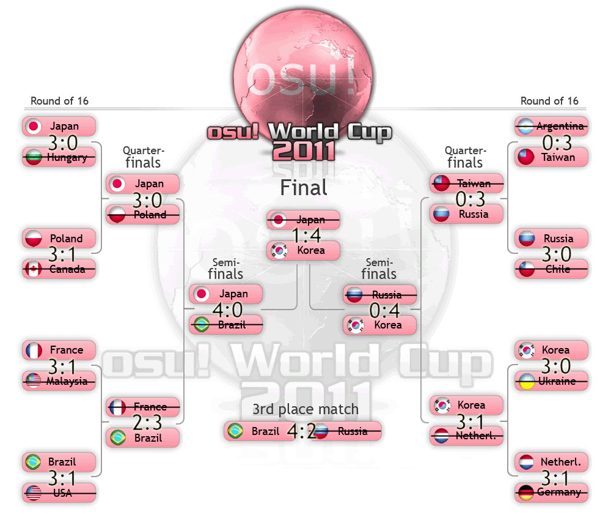

---
tags:
  - "OWC #2"
  - OWC 2
  - OWC#2
  - OWC2
---

# osu! World Cup #2


The **osu! World Cup #2** (***OWC #2***), also commonly known as **osu! World Cup 2011** (***OWC 2011***), was a single elimination country-based osu! tournament organized by various osu! community members under the provision of the [osu! team](/wiki/People/osu!_team). It was the second instalment of the osu! World Cup.

## Tournament schedule

| Event | Timestamp |
| --: | :-- |
| Registration phase | 2011-10-29/2011-11-20 |
| Group stage week 1 | 2011-11-21/2011-11-27 |
| Group stage week 2 | 2011-11-28/2011-12-04 |
| Group stage week 3 | 2011-12-05/2011-12-11 |
| *Winter break* | 2011-12-12/2012-01-01 |
| Round of 16 | 2012-01-02/2012-01-08 |
| Quarterfinals | 2012-01-09/2012-02-05 |
| Semifinals | 2012-02-06/2012-03-04 |
| Finals | 2012-03-05/2012-03-25 |

## Prizes

| Placing | Prize(s) |
| :-: | :-- |
|  | 6 months of osu!supporter for each team member, unique profile badge |
|  | 1 month of osu!supporter for each team member |
|  | 1 month of osu!supporter for each team member |


## Organisation

The osu! World Cup #2 was run by various community members.

| Position | Member(s) |
| :-- | :-- |
| Manager | ::{ flag=PL }:: [fartownik](https://osu.ppy.sh/users/56917), ::{ flag=CN }:: [NatsumeRin](https://osu.ppy.sh/users/151679) |
| Streamer | ::{ flag=JP }:: [dvorak](https://osu.ppy.sh/users/271359), ::{ flag=NL }:: [dlovan](https://osu.ppy.sh/users/190684), ::{ flag=AR }:: [Metro](https://osu.ppy.sh/users/306737), ::{ flag=CA }:: [YodaSnipe](https://osu.ppy.sh/users/673746) |
| Mappool selector | ::{ flag=PL }:: [fartownik](https://osu.ppy.sh/users/56917),[^fartownik-note] ::{ flag=CN }:: [NatsumeRin](https://osu.ppy.sh/users/151679), ::{ flag=GB }:: [Natteke](https://osu.ppy.sh/users/157177), ::{ flag=TW }:: [Alace](https://osu.ppy.sh/users/25993), ::{ flag=DE }:: [Dangaard](https://osu.ppy.sh/users/19488), ::{ flag=SE }:: [Gabi](https://osu.ppy.sh/users/57057), ::{ flag=US }:: [SapphireGhost](https://osu.ppy.sh/users/388602), ::{ flag=GB }:: [jericho2442](https://osu.ppy.sh/users/88904) |
| Graphic designer | ::{ flag=CN }:: [Anticloud](https://osu.ppy.sh/users/411137) |

## Links

- [Discussion thread](https://osu.ppy.sh/community/forums/topics/65535)
- [Livestream link (livestream.com)](https://livestream.com/osuworldcup)
- [Livestream link (own3d.tv)](https://www.own3d.tv/MetroAR)
- [Pre-tournament interviews](https://docs.google.com/document/d/1xgR7cfCf1yZD1j90_ObGKccS_9OMA6rDHhYJy8uRxNE/edit)

## Participants

|  | Country | Members |
| :-: | :-: | :-- |
| ::{ flag=AR }:: | **Argentina** | **[Wishy22](https://osu.ppy.sh/users/495477)**, [Ever17](https://osu.ppy.sh/users/173114), [Darksonic](https://osu.ppy.sh/users/570042), [Glazbom](https://osu.ppy.sh/users/608277), [Metro](https://osu.ppy.sh/users/306737), [Salvage](https://osu.ppy.sh/users/242119), *[Hernan](https://osu.ppy.sh/users/516680)*[^ko-stage-note] |
| ::{ flag=AU }:: | **Australia** | **[Mizorex](https://osu.ppy.sh/users/591469)**, [damiaanzx](https://osu.ppy.sh/users/635030), [Frankcons](https://osu.ppy.sh/users/594006), [Hark](https://osu.ppy.sh/users/43265), [Mikey](https://osu.ppy.sh/users/979780), [Neko\_Lover](https://osu.ppy.sh/users/596535) |
| ::{ flag=AT }:: | **Austria** | **[-Lennox-](https://osu.ppy.sh/users/489103)**, [Hakkero](https://osu.ppy.sh/users/177913), [Hanyuu](https://osu.ppy.sh/users/73480), [M A R I O](https://osu.ppy.sh/users/594424), [novaaa](https://osu.ppy.sh/users/953405), [Snowball](https://osu.ppy.sh/users/152238) |
| ::{ flag=BR }:: | **Brazil** | **[Blue Dragon](https://osu.ppy.sh/users/19048)**, [antsu](https://osu.ppy.sh/users/92953), [Caco](https://osu.ppy.sh/users/635173), [fabriciorby](https://osu.ppy.sh/users/209664), [Fumi-chan](https://osu.ppy.sh/users/181432), [Katsuri](https://osu.ppy.sh/users/701726), *[K3nsh1n\_H1mur4](https://osu.ppy.sh/users/197834)*,[^group-stage-note] *[Asterio](https://osu.ppy.sh/users/803906)*,[^ko-stage-note] *[gabaeba](https://osu.ppy.sh/users/867902)*[^ko-stage-note] |
| ::{ flag=BG }:: | **Bulgaria** | **[Lolicore Flandre](https://osu.ppy.sh/users/447818)**, [ColdChester](https://osu.ppy.sh/users/483663), [las7h0p3](https://osu.ppy.sh/users/113972), [Orihara Izaya](https://osu.ppy.sh/users/513842), [r-Beatz](https://osu.ppy.sh/users/472311), [werewolf0girl](https://osu.ppy.sh/users/213292) |
| ::{ flag=CA }:: | **Canada** | **[FurukawaPan](https://osu.ppy.sh/users/32067)**, [Glass](https://osu.ppy.sh/users/228532), [Satonaka](https://osu.ppy.sh/users/767009), [shaNk](https://osu.ppy.sh/users/905124), [SilentWings](https://osu.ppy.sh/users/118992), [YodaSnipe](https://osu.ppy.sh/users/673746), *[RB\_Oliver](https://osu.ppy.sh/users/229206)*,[^ko-stage-note] *[those](https://osu.ppy.sh/users/557166)*[^ko-stage-note] |
| ::{ flag=CL }:: | **Chile** | **[nVidi4x](https://osu.ppy.sh/users/203181)**, [Art-FzTT](https://osu.ppy.sh/users/248453), [b1choO](https://osu.ppy.sh/users/461132), [b4ss\_](https://osu.ppy.sh/users/493712), [Ignacio](https://osu.ppy.sh/users/2881294), [Mesita](https://osu.ppy.sh/users/201459) |
| ::{ flag=DK }:: | **Denmark** | **[Emaal](https://osu.ppy.sh/users/85070)**, [BongHat](https://osu.ppy.sh/users/369746), [Circlemuncher](https://osu.ppy.sh/users/873335), [m4w11](https://osu.ppy.sh/users/509620), [PlasticSmoothie](https://osu.ppy.sh/users/296565), *[DennisGG](https://osu.ppy.sh/users/1008997)*[^group-stage-note] |
| ::{ flag=FI }:: | **Finland** | **[ragelewa](https://osu.ppy.sh/users/475021)**, [ethox](https://osu.ppy.sh/users/441380), [heintsi](https://osu.ppy.sh/users/63185), [Orkel](https://osu.ppy.sh/users/39385), [Sutsuka](https://osu.ppy.sh/users/29089), [Zapy](https://osu.ppy.sh/users/251395), *[Valentiino](https://osu.ppy.sh/users/918773)*[^group-stage-note] |
| ::{ flag=FR }:: | **France** | **[Odaril](https://osu.ppy.sh/users/113005)**, [\_LRJ\_](https://osu.ppy.sh/users/284905), [galvenize](https://osu.ppy.sh/users/381444), [Kanna](https://osu.ppy.sh/users/366059), [Mustaash](https://osu.ppy.sh/users/1669213), [XPJ38](https://osu.ppy.sh/users/273531), *[Maestro](https://osu.ppy.sh/users/472848)*[^group-stage-note] |
| ::{ flag=DE }:: | **Germany** | **[DoKoLP](https://osu.ppy.sh/users/537084)**, [Blacky](https://osu.ppy.sh/users/268788),[^blacky-note] [Scanlatione](https://osu.ppy.sh/users/393337), [ShadowSoul](https://osu.ppy.sh/users/494970), [Shael](https://osu.ppy.sh/users/132308), [SuperCracker](https://osu.ppy.sh/users/145639), *[-libili-](https://osu.ppy.sh/users/706289)*,[^group-stage-note] *[Asozial](https://osu.ppy.sh/users/833594)*,[^group-stage-note] *[Neruell](https://osu.ppy.sh/users/112257)*,[^ko-stage-note] *[Tom94](https://osu.ppy.sh/users/1857058)*[^ko-stage-note] |
| ::{ flag=HK }:: | **Hong Kong** | **[KanaRin](https://osu.ppy.sh/users/310747)**, [henry04213](https://osu.ppy.sh/users/793536), [HineX](https://osu.ppy.sh/users/13854), [Kirito47](http://osu.ppy.sh/users/545514), [Miu Matsuoka](https://osu.ppy.sh/users/10641), [Pokie](https://osu.ppy.sh/users/207340), *[-\[L\]ightz](https://osu.ppy.sh/users/707840)*[^group-stage-note] |
| ::{ flag=HU }:: | **Hungary** | **[Kuroi Mato](https://osu.ppy.sh/users/584921)**, [higurush](https://osu.ppy.sh/users/602159), [Kozuki Kallen](https://osu.ppy.sh/users/816305), [TaylorXIII](https://osu.ppy.sh/users/351814), [tasli](https://osu.ppy.sh/users/59650), [TsukishimaKirari x\]](https://osu.ppy.sh/users/816358) |
| ::{ flag=ID }:: | **Indonesia** | **[Hakeru Prismriver](https://osu.ppy.sh/users/345422)**, [awell](https://osu.ppy.sh/users/341298), [awesomewithin](https://osu.ppy.sh/users/81652), [dNextGen](https://osu.ppy.sh/users/346320), [gatitoneku](https://osu.ppy.sh/users/363377), [xeqta](https://osu.ppy.sh/users/524530) |
| ::{ flag=JP }:: | **Japan** | **[SiLviA](https://osu.ppy.sh/users/409747)**, [Apricot](https://osu.ppy.sh/users/438547), [Flute](https://osu.ppy.sh/users/211278), [Iris](https://osu.ppy.sh/users/758181), [Sinch](https://osu.ppy.sh/users/360552), [tobaku2784](https://osu.ppy.sh/users/113855), *[val0108](https://osu.ppy.sh/users/243917)*[^group-stage-note] |
| ::{ flag=LV }:: | **Latvia** | **[\_Angel](https://osu.ppy.sh/users/341851)**, [GummyChan](https://osu.ppy.sh/users/757683), [LoGo](https://osu.ppy.sh/users/750382), [Vmx](https://osu.ppy.sh/users/967501) |
| ::{ flag=MY }:: | **Malaysia** | **[akupp](https://osu.ppy.sh/users/249825)**, [Gon](https://osu.ppy.sh/users/583765), [RhaiizoN](https://osu.ppy.sh/users/758295), [The 08 team\_Bourdon](https://osu.ppy.sh/users/275686), [xsrsbsns](https://osu.ppy.sh/users/414427), [zenki0013](https://osu.ppy.sh/users/89646) |
| ::{ flag=NL }:: | **Netherlands** | **[GladiOol](https://osu.ppy.sh/users/23326)**, [Awoken](https://osu.ppy.sh/users/256802), [eddieee](https://osu.ppy.sh/users/260284), [Henkie](https://osu.ppy.sh/users/16944), [Lesjuh](https://osu.ppy.sh/users/44308), [zozozofun](https://osu.ppy.sh/users/58727) |
| ::{ flag=NZ }:: | **New Zealand** | **[jiantz](https://osu.ppy.sh/users/330252)**, [Bob\_the\_Cat](https://osu.ppy.sh/users/121470), [deadbeat](https://osu.ppy.sh/users/128370), [Kiiwa](https://osu.ppy.sh/users/231111), [kwk](https://osu.ppy.sh/users/365586), [numot123](https://osu.ppy.sh/users/282930) |
| ::{ flag=NO }:: | **Norway** | **[kriers](https://osu.ppy.sh/users/333241)**, [AndreasHD](https://osu.ppy.sh/users/369956), [CXu](https://osu.ppy.sh/users/84841), [Danzai](https://osu.ppy.sh/users/73852), [Druidianna](https://osu.ppy.sh/users/682834), [KinomiCandy](https://osu.ppy.sh/users/375143), *[Oscarface92](https://osu.ppy.sh/users/284347)*[^group-stage-note] |
| ::{ flag=PH }:: | **Philippines** | **[Mystgun](https://osu.ppy.sh/users/720029)**, [jannnnnn](https://osu.ppy.sh/users/818399), [dayun10](https://osu.ppy.sh/users/570310), [Osu Tatakae Ouendan](https://osu.ppy.sh/users/594210), [Pizzicatto](http://osu.ppy.sh/users/692610), [usagijirosan](https://osu.ppy.sh/users/714230) |
| ::{ flag=PL }:: | **Poland** | **[fartownik](https://osu.ppy.sh/users/56917)**, [Kubu](https://osu.ppy.sh/users/29130), [Piotrekol](https://osu.ppy.sh/users/304520), [rEdo](https://osu.ppy.sh/users/49329), [White Wolf](https://osu.ppy.sh/users/39828), *[Niko-](https://osu.ppy.sh/users/175141)*[^ko-stage-note] |
| ::{ flag=PT }:: | **Portugal** | **[creativ](https://osu.ppy.sh/users/280158)**, [cococococo](https://osu.ppy.sh/users/715052), [JonnyThatJonny](https://osu.ppy.sh/users/201290), [makkura](https://osu.ppy.sh/users/344086), [Maraiga](https://osu.ppy.sh/users/213335), [Pereira006](https://osu.ppy.sh/users/537344) |
| ::{ flag=RU }:: | **Russian Federation** | **[Akai-](https://osu.ppy.sh/users/649471)**, [cr1m](https://osu.ppy.sh/users/803766), [kapehh](https://osu.ppy.sh/users/360958), [Kert](https://osu.ppy.sh/users/119933), [Rost94](https://osu.ppy.sh/users/490568), [Vpalach](https://osu.ppy.sh/users/232729), *[BinGOSU3](https://osu.ppy.sh/users/610462)*[^ko-stage-note] |
| ::{ flag=KR }:: | **South Korea** | **[KRZY](https://osu.ppy.sh/users/114017)**, [CheEZ](https://osu.ppy.sh/users/272117), [K i R i K a R u](https://osu.ppy.sh/users/139670), [moneto](https://osu.ppy.sh/users/242788), [Reisen Udongein](https://osu.ppy.sh/users/232942), [Remilia-Scarlet](https://osu.ppy.sh/users/602783) |
| ::{ flag=SE }:: | **Sweden** | **[theowest](https://osu.ppy.sh/users/60604)**, [failboat](https://osu.ppy.sh/users/276074), [Gyuunyu](https://osu.ppy.sh/users/799102), [Hanyuu-chan](https://osu.ppy.sh/users/881369), [Holmir](https://osu.ppy.sh/users/453435), [Nidert](https://osu.ppy.sh/users/817211), *[m4w11](https://osu.ppy.sh/users/509620)*[^group-stage-note] |
| ::{ flag=TW }:: | **Taiwan** | **[Saya-Honmei](https://osu.ppy.sh/users/2865291)**, [SnowWhite](https://osu.ppy.sh/users/50265), [Tomoka Rin](https://osu.ppy.sh/users/125308), [wizoza83098](https://osu.ppy.sh/users/164156), [YuyuKo sama](https://osu.ppy.sh/users/234788), [ZRush](https://osu.ppy.sh/users/398097) |
| ::{ flag=TH }:: | **Thailand** | **[Frostmourne](https://osu.ppy.sh/users/199669)**, [aumu1995](https://osu.ppy.sh/users/235752), [bufo](https://osu.ppy.sh/users/141605), [blackspell](https://osu.ppy.sh/users/601173), [NonxE](https://osu.ppy.sh/users/319312), [termerys](https://osu.ppy.sh/users/84964), *[0OoMickeyoO0](http://osu.ppy.sh/users/317494)*[^group-stage-note] |
| ::{ flag=UA }:: | **Ukraine** | **[Gorlum](https://osu.ppy.sh/users/347635)**, [\[milky\]](https://osu.ppy.sh/users/288597), [rockleejkooo](https://osu.ppy.sh/users/384003), [uljjang](https://osu.ppy.sh/users/3784417), *[Granje](https://osu.ppy.sh/users/496387)*[^ko-stage-note] |
| ::{ flag=US }:: | **United States** | **[Kyou-kun](https://osu.ppy.sh/users/285711)**, [Cyclone](https://osu.ppy.sh/users/18589), [david huhh](https://osu.ppy.sh/users/278954), [Derekku](https://osu.ppy.sh/users/91341), [geckogates](https://osu.ppy.sh/users/252524), [Lybydose](https://osu.ppy.sh/users/64501) |
| ::{ flag=UY }:: | **Uruguay** | **[maay](https://osu.ppy.sh/users/160970)**, [AlrdyExists](https://osu.ppy.sh/users/407022), [GonixZ](https://osu.ppy.sh/users/612622), [H1ko](https://osu.ppy.sh/users/58710), [Snepif](https://osu.ppy.sh/users/408088), [Z e o n](https://osu.ppy.sh/users/539876) |
| ::{ flag=VN }:: | **Vietnam** | **[Misuzu-san](https://osu.ppy.sh/users/358563)**, [BridgetteLSatellizer](https://osu.ppy.sh/users/854083), [JerryC](https://osu.ppy.sh/users/279278), [kira\_lacus1995](https://osu.ppy.sh/users/996435), [xLightningx](https://osu.ppy.sh/users/1007806), *[Shin1801](https://osu.ppy.sh/users/604492)*[^group-stage-note] |

## Groups

| Group A | Group B | Group C | Group D | Group E | Group F | Group G | Group H |
| :-- | :-- | :-- | :-- | :-- | :-- | :-- | :-- |
| ::{ flag=AU }:: Australia | ::{ flag=HU }:: Hungary | ::{ flag=ID }:: Indonesia | ::{ flag=CA }:: Canada | ::{ flag=CL }:: Chile | ::{ flag=FI }:: Finland | ::{ flag=BR }:: Brazil | ::{ flag=AR }:: Argentina |
| ::{ flag=DK }:: Denmark | ::{ flag=NL }:: Netherlands | ::{ flag=NO }:: Norway | ::{ flag=HK }:: Hong Kong | ::{ flag=FR }:: France | ::{ flag=MY }:: Malaysia | ::{ flag=BG }:: Bulgaria | ::{ flag=AT }:: Austria |
| ::{ flag=DE }:: Germany | ::{ flag=NZ }:: New Zealand | ::{ flag=PL }:: Poland | ::{ flag=KR }:: South Korea | ::{ flag=LV }:: Latvia | ::{ flag=RU }:: Russian Federation | ::{ flag=SE }:: Sweden | ::{ flag=TH }:: Thailand |
| ::{ flag=JP }:: Japan | ::{ flag=PH }:: Philippines | ::{ flag=UA }:: Ukraine | ::{ flag=VN }:: Vietnam | ::{ flag=PT }:: Portugal | ::{ flag=UY }:: Uruguay | ::{ flag=TW }:: Taiwan | ::{ flag=US }:: United States |



## Podium

This competition has come to an end and resulted in the following podium:

| Placing | Team |
| :-: | :-- |
|  | ::{ flag=KR }:: **South Korea** (**[KRZY](https://osu.ppy.sh/users/114017)**, [CheEZ](https://osu.ppy.sh/users/272117), [K i R i K a R u](https://osu.ppy.sh/users/139670), [moneto](https://osu.ppy.sh/users/242788), [Reisen Udongein](https://osu.ppy.sh/users/232942), [Remilia-Scarlet](https://osu.ppy.sh/users/602783)) |
|  | ::{ flag=JP }:: **Japan** (**[SiLviA](https://osu.ppy.sh/users/409747)**, [Apricot](https://osu.ppy.sh/users/438547), [Flute](https://osu.ppy.sh/users/211278), [Iris](https://osu.ppy.sh/users/758181), [Sinch](https://osu.ppy.sh/users/360552), [tobaku2784](https://osu.ppy.sh/users/113855), *[val0108](https://osu.ppy.sh/users/243917)*[^group-stage-note]) |
|  | ::{ flag=BR }:: **Brazil** (**[Blue Dragon](https://osu.ppy.sh/users/19048)**, [antsu](https://osu.ppy.sh/users/92953), [Caco](https://osu.ppy.sh/users/635173), [fabriciorby](https://osu.ppy.sh/users/209664), [Fumi-chan](https://osu.ppy.sh/users/181432), [Katsuri](https://osu.ppy.sh/users/701726), *[K3nsh1n\_H1mur4](https://osu.ppy.sh/users/197834)*,[^group-stage-note] *[Asterio](https://osu.ppy.sh/users/803906)*,[^ko-stage-note] *[gabaeba](https://osu.ppy.sh/users/867902)*[^ko-stage-note]) |

## Mappools

### Finals

*In addition of nine other new maps, the Finals mappool also saw all of the six previously featured Tiebreaker maps from earlier rounds returning as NoMod picks.*
**[Download the mappack here! (74.2 MB)](https://mega.nz/file/eewGiB7C#8LKEwLtbY6_V4EzcE_m58G8bFnj8FVWcRlanbfm0ke8)**

- NoMod
  1. [supercell - Rock 'n' Roll Nan Desu no (Garven) \[Insane\]](https://osu.ppy.sh/beatmapsets/27807#osu/93021) -- *(Group Stage week 1 Tiebreaker)*
  2. [Okui Masami - God Speed (ykcarrot) \[Insane\]](https://osu.ppy.sh/beatmapsets/28140#osu/93947) -- *(Group Stage week 2 Tiebreaker)*
  3. [Hommarju feat. R.Cena - Chousai Kenbo Sengen (galvenize) \[Insane\]](https://osu.ppy.sh/beatmapsets/30012#osu/99342) -- *(Group Stage week 3 Tiebreaker)*
  4. [Hatsune Miku - Rubik's Cube (rui) \[7x7x7\]](https://osu.ppy.sh/beatmapsets/33651#osu/114635) -- *(Round of 16 Tiebreaker)*
  5. [Nanamori-chu \* Goraku-bu - My Pace de Ikimashou (bakabaka) \[Yuri\]](https://osu.ppy.sh/beatmapsets/36569#osu/118226) -- *(Quarterfinals Tiebreaker)*
  6. [DJ Fresh - Gold Dust (galvenize) \[Insane\]](https://osu.ppy.sh/beatmapsets/28107#osu/93842) -- *(Semifinals Tiebreaker)*
  7. [44teru-k - F.I (AngelHoney) \[Insane\]](https://osu.ppy.sh/beatmapsets/25828#osu/106033)
  8. [Sound Horizon - Raijin no Hidariude (AngelHoney) \[Insane\]](https://osu.ppy.sh/beatmapsets/16792#osu/60089)
  9. [Yousei Teikoku - Mischievous of Alice (Furawa) \[Alice\]](https://osu.ppy.sh/beatmapsets/35546#osu/142356)
  10. [SUPER STAR -MITSURU- - ALL MY TURN (yeahyeahyeahhh) \[Another\]](https://osu.ppy.sh/beatmapsets/30877#osu/101713)
  11. [DJ Sharpnel - Exciting Hyper Highspeed Star (xBubu) \[Highspeed\]](https://osu.ppy.sh/beatmapsets/16619#osu/62589)
  12. [Nico Nico Douga - Owens (AngelHoney) \[Another\]](https://osu.ppy.sh/beatmapsets/20406#osu/72469)
  13. [Eoin O' Broin - Deep Space (galvenize) \[Another\]](https://osu.ppy.sh/beatmapsets/25098#osu/85550)
  14. [Dio ft. Sef - Tijdmachine (GladiOol) \[Lesjuh! '11\]](https://osu.ppy.sh/beatmapsets/6997#osu/129875)
  15. [Seiryu X Donald - Time to Donald (James) \[Another\]](https://osu.ppy.sh/beatmapsets/6950#osu/30613)
- Tiebreaker
  1. **[Fear, and Loathing in Las Vegas - Just Awake (gowww) \[Insane\]](https://osu.ppy.sh/beatmapsets/44527#osu/139446)**

### Semifinals

**[Download the mappack here! (110.7 MB)](https://mega.nz/file/GCICHAaA#3vymhf1U4iwMILRsdCmxiK-qtuNsCmlR45WOLXmBetc)**

- NoMod
  1. [Seiryu - Time to Air (Alace) \[DaRRi MIx\]](https://osu.ppy.sh/beatmapsets/4597#osu/24594)
  2. [Atoguru - Itoshi Kimi wo Mitsuke ni (bakabaka) \[Insane\]](https://osu.ppy.sh/beatmapsets/29044#osu/96523)
  3. [Hatsune Miku - Hiatus (wcx19911123) \[Insane\]](https://osu.ppy.sh/beatmapsets/32046#osu/105003)
  4. [paraoka - Manima ni (Short Ver.) (Mixagji) \[0108\]](https://osu.ppy.sh/beatmapsets/39275#osu/131362)
  5. [07th Expansion - Final Answer (gowww) \[Insane\]](https://osu.ppy.sh/beatmapsets/26226#osu/88633)
  6. [DJ YOSHITAKA - Evans (Alace) \[Another\]](https://osu.ppy.sh/beatmapsets/22301#osu/77017)
  7. [Syuiro - Ama no Jaku (Natteke) \[Insane\]](https://osu.ppy.sh/beatmapsets/39817#osu/126677)
  8. [Mutsuhiko Izumi - Chinese Snowy Dance (Chocopikel) \[Insane\]](https://osu.ppy.sh/beatmapsets/41860#osu/132013)
  9. [Kucchy vs Akky - Yakumo \~ JOINT STRUGGLE (DJPop) \[Lunatic\]](https://osu.ppy.sh/beatmapsets/12909#osu/48096)
  10. [Rex - Heart of Witch (yeahyeahyeahhh) [InoStyle]](https://osu.ppy.sh/beatmapsets/20309#osu/71746)
  11. [Team Nekokan - Can't Defeat Airman (Sushi) \[Insane\]](https://osu.ppy.sh/beatmapsets/24084#osu/82033)
  12. [Megpoid GUMI - Jinsei Reset Button (manten) \[Ex.\]](https://osu.ppy.sh/beatmapsets/39971#osu/127426)
  13. [Hatsune Miku - Kagerou Days (m i z u k i) \[mizuki\]](https://osu.ppy.sh/beatmapsets/37638#osu/128668)
  14. [Paramore - Looking Up (Lesjuh) \[Hard\]](https://osu.ppy.sh/beatmapsets/17563#osu/66662)
- Tiebreaker
  1. **[DJ Fresh - Gold Dust (galvenize) \[Insane\]](https://osu.ppy.sh/beatmapsets/28107#osu/93842)**

### Quarterfinals

**[Download the mappack here! (92 MB)](https://mega.nz/file/yP5zHSZA#LbXBbb_nNL4VpnFL4m0pfwP2PmUa2DhA61v7PNRzgXY)**

- NoMod
  1. [Hatsune Miku - Recommended Spell (val0108) \[Spell\]](https://osu.ppy.sh/beatmapsets/28864#osu/96055)
  2. [Demetori - Emotional Skyscraper \~ World's End (Lybydose) \[Lunatic\]](https://osu.ppy.sh/beatmapsets/13204#osu/48985)
  3. [SHIKI - BABYLON (miccoliasms) \[Another\]](https://osu.ppy.sh/beatmapsets/31373#osu/103132)
  4. [Insert Rupee - Facing Fears (OC ReMix) (Charles445) \[Insane\]](https://osu.ppy.sh/beatmapsets/36541#osu/118054)
  5. [ALiCE'S EMOTiON - Lorelei (saymun) \[Lunatic\]](https://osu.ppy.sh/beatmapsets/16437#osu/59643)
  6. [Hatsune Miku - the last effect (Holoaz) \[Holoid\]](https://osu.ppy.sh/beatmapsets/29355#osu/97423)
  7. [Comp - Gensou no Satellite (Shinxyn) \[Insane\]](https://osu.ppy.sh/beatmapsets/4404#osu/63604)
  8. [Ryu - I'm so Happy (tsuka) \[Extreme\]](https://osu.ppy.sh/beatmapsets/29471#osu/110915)
  9. [Amane - Midsummer Festival (Natteke) \[Lunatteke\]](https://osu.ppy.sh/beatmapsets/21924#osu/75822)
  10. [Makou - Fermion (MoonFragrance) \[Maximum\]](https://osu.ppy.sh/beatmapsets/20723#osu/72284)
  11. [seiya-murai feat.ALT - Sumidagawa Karenka (kiddly) \[Extreme\]](https://osu.ppy.sh/beatmapsets/28796#osu/95870)
  12. [Hatsune Miku & Megpoid Gumi - MATRYOSHKA (gowww) \[Insane\]](https://osu.ppy.sh/beatmapsets/19789#osu/69405)
  13. [Lou Bega - Mambo No.5 (Lesjuh) \[Insane\]](https://osu.ppy.sh/beatmapsets/33393#osu/108936)
  14. [Pizuya's Cell x MyonMyon - Romantic Children (Frill) \[Lunatic\]](https://osu.ppy.sh/beatmapsets/18009#osu/68431)
- Tiebreaker
  1. **[Nanamori-chu \* Goraku-bu - My Pace de Ikimashou (bakabaka) \[Yuri\]](https://osu.ppy.sh/beatmapsets/36569#osu/118226)**

### Round of 16

**[Download the mappack here! (86.3 MB)](https://mega.nz/file/bCwDXYpI#WQpc-YgckFx-7M8RhvK-MlolzLSbi6YdRvRX688-Wec)**

- NoMod
  1. [xi - Halcyon (gowww) \[Another\]](https://osu.ppy.sh/beatmapsets/20871#osu/73699)
  2. [Two Door Cinema Club - Cigarettes In The Theatre (Lesjuh) \[Insane\]](https://osu.ppy.sh/beatmapsets/37461#osu/120461)
  3. [Sakaue Nachi - Think of You (orioncomet) \[Lunatic\]](https://osu.ppy.sh/beatmapsets/24838#osu/84358)
  4. [Akita Neru - Gotya Gotya Uruse\~! (Mafiamaster) \[Insane\]](https://osu.ppy.sh/beatmapsets/22182#osu/76638)
  5. [HOUJIROU - Maihime \~buki\~ (Sandpig) \[Another\]](https://osu.ppy.sh/beatmapsets/28765#osu/95795)
  6. [Max Coveri - Running in the 90's (Gabi) \[Insane\]](https://osu.ppy.sh/beatmapsets/18482#osu/65417)
  7. [Kagamine Rin - Tokyo Teddy Bear (NatsumeRin) \[Rin\]](https://osu.ppy.sh/beatmapsets/39838#osu/127138)
  8. [SHK - Weep Irish (AngelHoney) \[Another\]](https://osu.ppy.sh/beatmapsets/28545#osu/95360)
  9. [Dark PHOENiX - Taketori Hishou (Aakiha) \[Lunatic\]](https://osu.ppy.sh/beatmapsets/19320#osu/68036)
  10. [cranky - R176 (taka1235) \[Another\]](https://osu.ppy.sh/beatmapsets/31367#osu/103102)
  11. [Tamura Yukari - Endless Story (lolcubes) \[Insane\]](https://osu.ppy.sh/beatmapsets/38426#osu/123021)
  12. [Katy Perry - E.T. (La Cataline) \[Futuristic\]](https://osu.ppy.sh/beatmapsets/36077#osu/116708)
  13. [Megpoid GUMI - Chocolate (val0108) \[Insane\]](https://osu.ppy.sh/beatmapsets/26652#osu/89721)
  14. [DCX - Flying High (DJ Splash Remix) (yeahyeahyeahhh) \[InoSane\]](https://osu.ppy.sh/beatmapsets/22194#osu/76663)
- Tiebreaker
  1. **[Hatsune Miku - Rubik's Cube (rui) \[7x7x7\]](https://osu.ppy.sh/beatmapsets/33651#osu/114635)**

### Group stage week 3

**[Download the mappack here! (85.3 MB)](https://mega.nz/file/CWxnjTzC#7M9I7fWYmnssPTuXw8yPIrPI8vB1RnOxi2K4HA3FRGE)**

- NoMod
  1. [Ruru Ichinose - Hinarin's Relation of Misfortune (Mafiamaster) \[Lunatic\]](https://osu.ppy.sh/beatmapsets/12344#osu/46486)
  2. [Furries in a Blender - Ridorii (-Lennox-) \[Insane\]](https://osu.ppy.sh/beatmapsets/29727#osu/98496)
  3. [DJ Sadan - Theme of Laura (IceBeam) \[Insane\]](https://osu.ppy.sh/beatmapsets/38281#osu/122776)
  4. [Drop - Gensou Kidan (Kaguyahime+Mikotonori Ver.) (Shinxyn) \[Lunatic\]](https://osu.ppy.sh/beatmapsets/15943#osu/57405)
  5. [Tatsh - reunion (ouranhshc) \[Insane\]](https://osu.ppy.sh/beatmapsets/24523#osu/83338)
  6. [Hatsune Miku - Unhappy Refrain (NatsumeRin) \[Rin\]](https://osu.ppy.sh/beatmapsets/30128#osu/105534)
  7. [Hate vs Brilliance - Quark (tsuka) \[Extra\]](https://osu.ppy.sh/beatmapsets/20323#osu/85166)
  8. [Nekomata Master - Far east nightbird (Muya) \[Another\]](https://osu.ppy.sh/beatmapsets/29538#osu/97942)
  9. [sun3 - Higan Retour (saymun) \[Alazy\]](https://osu.ppy.sh/beatmapsets/14464#osu/54371)
  10. [HHH (Ryu & Dai) - So Fabulous!! (Gabi) \[Another\]](https://osu.ppy.sh/beatmapsets/15977#osu/57510)
  11. [Yasuharu Takanashi - Fairy Tail Main Theme (Suck) \[KIRBY Mix\]](https://osu.ppy.sh/beatmapsets/13686#osu/50625)
  12. [DJ YOSHITAKA - FLOWER (TKiller) \[Intense\]](https://osu.ppy.sh/beatmapsets/29996#osu/104635)
  13. [Pendulum - The Vulture (La Cataline) \[Insane\]](https://osu.ppy.sh/beatmapsets/24163#osu/82249)
  14. [Hatsune Miku - Kusaregedou to Chocolate (val0108) \[Insane\]](https://osu.ppy.sh/beatmapsets/25248#osu/85494)
- Tiebreaker
  1. **[Hommarju feat. R.Cena - Chousai Kenbo Sengen (galvenize) \[Insane\]](https://osu.ppy.sh/beatmapsets/30012#osu/99342)**

### Group stage week 2

**[Download the mappack here! (106.2 MB)](https://mega.nz/file/qaoHGBgJ#b0T7mJ51Iw0dnmzDWyoHqBslstkc7XWoeM4qNTTw77o)**

- NoMod
  1. [Jun.A - The Refrain of the Lovely Great War (KanbeKotori) \[Lunatic\]](https://osu.ppy.sh/beatmapsets/24325#osu/82734)
  2. [REDALiCE - Selfish (happy30) \[Lunatic\]](https://osu.ppy.sh/beatmapsets/28060#osu/105531)
  3. [Suzaku - VANESSA (La Cataline) \[Another\]](https://osu.ppy.sh/beatmapsets/27862#osu/97663)
  4. [Tatsh - Fuushi Kaden (happy30) \[Hard\]](https://osu.ppy.sh/beatmapsets/15486#osu/56044)
  5. [IOSYS - Chanteikku Sanyousei no Itazura Daisensou (Kochiya Sanae) \[Crazy Jay\]](https://osu.ppy.sh/beatmapsets/24448#osu/91462)
  6. [Sum 41 - Thanks For Nothing (Natteke) \[Hard\]](https://osu.ppy.sh/beatmapsets/23547#osu/80552)
  7. [Hatsune Miku - Netoge Haijin Sprechchor (Lalarun) \[Insane\]](https://osu.ppy.sh/beatmapsets/25802#osu/87369)
  8. [Kuripurin - Jutenija (qinche) \[Jutenija\]](https://osu.ppy.sh/beatmapsets/25500#osu/86377)
  9. [capsule - JUMPER (Mafiamaster) \[Insane\]](https://osu.ppy.sh/beatmapsets/21130#osu/73494)
  10. [kors k - Wuv U (Nakagawa-Kanon) \[dksslqj Style\]](https://osu.ppy.sh/beatmapsets/34556#osu/116739)
  11. [Hatsune Miku - Subarashii Sekai (val0108) \[S.S\]](https://osu.ppy.sh/beatmapsets/25825#osu/96351)
  12. [IOSYS - Poinsettia (Aakiha) \[Lunatic\]](https://osu.ppy.sh/beatmapsets/18382#osu/65233)
  13. [Aizawa - Flutter Girl (Shinxyn) \[Insane\]](https://osu.ppy.sh/beatmapsets/17103#osu/61124)
  14. [Mutsuhiko Izumi - Russian Snowy Dance (Chocopikel) \[Insane\]](https://osu.ppy.sh/beatmapsets/38872#osu/124275)
- Tiebreaker
  1. **[Okui Masami - God Speed (ykcarrot) \[Insane\]](https://osu.ppy.sh/beatmapsets/28140#osu/93947)**

### Group stage week 1

**[Download the mappack here! (115.6 MB)](https://mega.nz/file/ieJkEa5K#By6Zs29VJQ5aYgcShAAzZb_2FG8MYEr0uuC8726BAyQ)**

- NoMod
  1. [Hatsune Miku - BadBye (goodbye) \[GoodBye\]](https://osu.ppy.sh/beatmapsets/30939#osu/101916)
  2. [DystopiaGround - True Theory of Inheritance (Ignacio) \[Insane\]](https://osu.ppy.sh/beatmapsets/24477#osu/83215)
  3. [Humanoid - MENDES (yeahyeahyeahhh) \[Another\]](https://osu.ppy.sh/beatmapsets/21928#osu/75831)
  4. [Bomfunk MC's - Freestyler (Lesjuh) \[Insane\]](https://osu.ppy.sh/beatmapsets/35629#osu/115352)
  5. [Megurine Luka - Leia (Mafiamaster) \[gowww\]](https://osu.ppy.sh/beatmapsets/29064#osu/96587)
  6. [Niko - Night of Fire (Gabi) \[Insane\]](https://osu.ppy.sh/beatmapsets/18923#osu/66820)
  7. [Dj Verstarker - Jump Jump (2008) (SeymourLyon) \[Jump like CRAZY!!!\]](https://osu.ppy.sh/beatmapsets/6004#osu/28152)
  8. [Wiklund - The Digital Force (Metroid) \[Magnetic Force\]](https://osu.ppy.sh/beatmapsets/11153#osu/43691)
  9. [B0UNC3 - ALIVE (tieff) \[Hard\]](https://osu.ppy.sh/beatmapsets/17598#osu/62712)
  10. [Nudarai - Nuclear Fusion (Sandpig) \[U235\]](https://osu.ppy.sh/beatmapsets/25557#osu/87207)
  11. [Hana - Aerodynamics Girls and Boys Poem (Aenna) \[Pook\]](https://osu.ppy.sh/beatmapsets/23507#osu/80784)
  12. [TeddyLoid - Theme for Scanty & Knee Socks (ztrot) \[Larto's Insane\]](https://osu.ppy.sh/beatmapsets/24886#osu/111142)
  13. [Lia - Kokoro ni Todoku Uta (Holoaz) \[Holo\]](https://osu.ppy.sh/beatmapsets/26549#osu/89428)
  14. [nomico - Bad Apple!! (James) \[Hard\]](https://osu.ppy.sh/beatmapsets/6252#osu/28755)
- Tiebreaker
  1. **[supercell - Rock 'n' Roll Nan Desu no (Garven) \[Insane\]](https://osu.ppy.sh/beatmapsets/27807#osu/93021)**

## Match results

### Finals

Sunday, 11 March 2012 (Grand Final):

| Team 1 |  |  | Team 2 | Match link |
| --: | :-: | :-: | :-- | :-- |
| ::{ flag=JP }:: Japan | 1 | **4** | ::{ flag=KR }:: **South Korea** | [#1](https://osu.ppy.sh/community/matches/2845562) |

Saturday, 24 March 2012 (3rd Place Playoff):

| Team 1 |  |  | Team 2 | Match link |
| --: | :-: | :-: | :-- | :-- |
| ::{ flag=BR }:: **Brazil** | **4** | 2 | ::{ flag=RU }:: Russian Federation | [#1](https://osu.ppy.sh/community/matches/2947666) |

### Semifinals

Thursday, 16 February 2012:

| Team 1 |  |  | Team 2 | Match link |
| --: | :-: | :-: | :-- | :-- |
| ::{ flag=RU }:: Russian Federation | 0 | **4** | ::{ flag=KR }:: **South Korea** | [#1](https://osu.ppy.sh/community/matches/2649676) |

Tuesday, 28 February 2012:

| Team 1 |  |  | Team 2 | Match link |
| --: | :-: | :-: | :-- | :-- |
| ::{ flag=JP }:: **Japan** | **4** | 0 | ::{ flag=BR }:: Brazil | *win by default* |

### Quarterfinals

Saturday, 14 January 2012:

| Team 1 |  |  | Team 2 | Match link |
| --: | :-: | :-: | :-- | :-- |
| ::{ flag=TW }:: Taiwan | 0 | **3** | ::{ flag=RU }:: **Russian Federation** | [#1](https://osu.ppy.sh/community/matches/2398122) |

Sunday, 15 January 2012:

| Team 1 |  |  | Team 2 | Match link |
| --: | :-: | :-: | :-- | :-- |
| ::{ flag=JP }:: **Japan** | **3** | 0 | ::{ flag=PL }:: Poland | [#1](https://osu.ppy.sh/community/matches/2406540) |

Sunday, 29 January 2012:

| Team 1 |  |  | Team 2 | Match link |
| --: | :-: | :-: | :-- | :-- |
| ::{ flag=KR }:: **South Korea** | **3** | 1 | ::{ flag=NL }:: Netherlands | [#1](https://osu.ppy.sh/community/matches/2513557) |
| ::{ flag=FR }:: France | 2 | **3** | ::{ flag=BR }:: **Brazil** | [#1](https://osu.ppy.sh/community/matches/2516621) |

### Round of 16

Saturday, 7 January 2012:

| Team 1 |  |  | Team 2 | Match link |
| --: | :-: | :-: | :-- | :-- |
| ::{ flag=JP }:: **Japan** | **3** | 0 | ::{ flag=HU }:: Hungary | [#1](https://osu.ppy.sh/community/matches/2347178) |
| ::{ flag=KR }:: **South Korea** | **3** | 0 | ::{ flag=UA }:: Ukraine | [#1](https://osu.ppy.sh/community/matches/2347528) |
| ::{ flag=AR }:: Argentina | 0 | **3** | ::{ flag=TW }:: **Taiwan** | [#1](https://osu.ppy.sh/community/matches/2348743) |

Sunday, 8 January 2012:

| Team 1 |  |  | Team 2 | Match link |
| --: | :-: | :-: | :-- | :-- |
| ::{ flag=NL }:: **Netherlands** | **3** | 1 | ::{ flag=DE }:: Germany | [#1](https://osu.ppy.sh/community/matches/2350372) |
| ::{ flag=PL }:: **Poland** | **3** | 1 | ::{ flag=CA }:: Canada | [#1](https://osu.ppy.sh/community/matches/2350703) |
| ::{ flag=FR }:: **France** | **3** | 1 | ::{ flag=MY }:: Malaysia | [#1](https://osu.ppy.sh/community/matches/2356557) |
| ::{ flag=RU }:: **Russian Federation** | **3** | 0 | ::{ flag=CL }:: Chile | *win by default* |

Friday, 13 January 2012:

| Team 1 |  |  | Team 2 | Match link |
| --: | :-: | :-: | :-- | :-- |
| ::{ flag=BR }:: **Brazil** | **3** | 1 | ::{ flag=US }:: United States | [#1](https://osu.ppy.sh/community/matches/2385313) |

### Group stage week 3

Saturday, 10 December 2011:

| Group | Team 1 |  |  | Team 2 | Match link |
| :-: | --: | :-: | :-: | :-- | :-- |
| B | ::{ flag=HU }:: Hungary | 2 | **3** | ::{ flag=PH }:: **Philippines** | [#1](https://osu.ppy.sh/community/matches/2158061) |
| C | ::{ flag=NO }:: Norway | 1 | **3** | ::{ flag=UA }:: **Ukraine** | [#1](https://osu.ppy.sh/community/matches/2159578) |
| A | ::{ flag=DE }:: Germany | 1 | **3** | ::{ flag=JP }:: **Japan** | [#1](https://osu.ppy.sh/community/matches/2157518) |

Sunday, 11 December 2011:

| Group | Team 1 |  |  | Team 2 | Match link |
| :-: | --: | :-: | :-: | :-- | :-- |
| C | ::{ flag=ID }:: Indonesia | 2 | **3** | ::{ flag=PL }:: **Poland** | [#1](https://osu.ppy.sh/community/matches/2165756) |
| G | ::{ flag=BG }:: Bulgaria | 2 | **3** | ::{ flag=SE }:: **Sweden** | [#1](https://osu.ppy.sh/community/matches/2167101) |
| B | ::{ flag=NL }:: **Netherlands** | **3** | 0 | ::{ flag=NZ }:: New Zealand | [#1](https://osu.ppy.sh/community/matches/2161430) |
| D | ::{ flag=HK }:: Hong Kong | 0 | **3** | ::{ flag=KR }:: **South Korea** | [#1](https://osu.ppy.sh/community/matches/2164241) |
| H | ::{ flag=AT }:: Austria | 1 | **3** | ::{ flag=TH }:: **Thailand** | [#1](https://osu.ppy.sh/community/matches/2165511) |
| E | ::{ flag=CL }:: **Chile** | **3** | 1 | ::{ flag=LV }:: Latvia | [#1](https://osu.ppy.sh/community/matches/2167760) |
| A | ::{ flag=AU }:: Australia | 0 | **3** | ::{ flag=DK }:: **Denmark** | *win by default* |
| F | ::{ flag=RU }:: **Russian Federation** | **3** | 0 | ::{ flag=UY }:: Uruguay | *win by default* |
| D | ::{ flag=CA }:: **Canada** | **3** | 0 | ::{ flag=VN }:: Vietnam | *win by default* |

Saturday, 17 December 2011:

| Group | Team 1 |  |  | Team 2 | Match link |
| :-: | --: | :-: | :-: | :-- | :-- |
| E | ::{ flag=FI }:: Finland | 0 | **3** | ::{ flag=MY }:: **Malaysia** | [#1](https://osu.ppy.sh/community/matches/2203425) |

Sunday, 18 December 2011:

| Group | Team 1 |  |  | Team 2 | Match link |
| :-: | --: | :-: | :-: | :-- | :-- |
| E | ::{ flag=FR }:: **France** | **3** | 2 | ::{ flag=PT }:: Portugal | [#1](https://osu.ppy.sh/community/matches/2204816) |
| H | ::{ flag=AR }:: **Argentina** | **3** | 0 | ::{ flag=US }:: United States | [#1](https://osu.ppy.sh/community/matches/2206788) |
| G | ::{ flag=BR }:: **Brazil** | **3** | 0 | ::{ flag=TW }:: Taiwan | [#1](https://osu.ppy.sh/community/matches/2243425) |

### Group stage week 2

Saturday, 3 December 2011:

| Group | Team 1 |  |  | Team 2 | Match link |
| :-: | --: | :-: | :-: | :-- | :-- |
| G | ::{ flag=BR }:: **Brazil** | **3** | 1 | ::{ flag=SE }:: Sweden | [#1](https://osu.ppy.sh/community/matches/2114825) |

Sunday, 4 December 2011:

| Group | Team 1 |  |  | Team 2 | Match link |
| :-: | --: | :-: | :-: | :-- | :-- |
| F | ::{ flag=MY }:: Malaysia | 2 | **3** | ::{ flag=RU }:: **Russian Federation** | [#1](https://osu.ppy.sh/community/matches/2121617) |
| C | ::{ flag=PL }:: **Poland** | **3** | 2 | ::{ flag=UA }:: Ukraine | [#1](https://osu.ppy.sh/community/matches/2115216) |
| B | ::{ flag=HU }:: Hungary | 0 | **3** | ::{ flag=NL }:: **Netherlands** | [#1](https://osu.ppy.sh/community/matches/2115634) |
| E | ::{ flag=CL }:: **Chile** | **3** | 1 | ::{ flag=PT }:: Portugal | [#1](https://osu.ppy.sh/community/matches/2116719) |
| B | ::{ flag=NZ }:: **New Zealand** | **3** | 1 | ::{ flag=PH }:: Philippines | [#1](https://osu.ppy.sh/community/matches/2119360) |
| A | ::{ flag=DK }:: Denmark | 0 | **3** | ::{ flag=JP }:: **Japan** | [#1](https://osu.ppy.sh/community/matches/2120514) |
| C | ::{ flag=ID }:: Indonesia | 0 | **3** | ::{ flag=NO }:: **Norway** | [#1](https://osu.ppy.sh/community/matches/2121720) |
| H | ::{ flag=AR }:: **Argentina** | **3** | 2 | ::{ flag=TH }:: Thailand | [#1](https://osu.ppy.sh/community/matches/2122773) |
| E | ::{ flag=FR }:: **France** | **3** | 1 | ::{ flag=LV }:: Latvia | [#1](https://osu.ppy.sh/community/matches/2123433) |
| A | ::{ flag=AU }:: Australia | 1 | **3** | ::{ flag=DE }:: **Germany** | [#1](https://osu.ppy.sh/community/matches/2121680) |
| D | ::{ flag=KR }:: **South Korea** | **3** | 0 | ::{ flag=VN }:: Vietnam | *win by default* |

Monday, 5 December 2011:

| Group | Team 1 |  |  | Team 2 | Match link |
| :-: | --: | :-: | :-: | :-- | :-- |
| G | ::{ flag=BG }:: Bulgaria | 0 | **3** | ::{ flag=TW }:: **Taiwan** | *win by default* |

Tuesday, 6 December 2011:

| Group | Team 1 |  |  | Team 2 | Match link |
| :-: | --: | :-: | :-: | :-- | :-- |
| F | ::{ flag=FI }:: **Finland** | **3** | 0 | ::{ flag=UY }:: Uruguay | [#1](https://osu.ppy.sh/community/matches/2129293) |

Saturday, 10 December 2011:

| Group | Team 1 |  |  | Team 2 | Match link |
| :-: | --: | :-: | :-: | :-- | :-- |
| D | ::{ flag=CA }:: **Canada** | **3** | 1 | ::{ flag=HK }:: Hong Kong | [#1](https://osu.ppy.sh/community/matches/2159276) |
| H | ::{ flag=AT }:: Austria | 1 | **3** | ::{ flag=US }:: **United States** | [#1](https://osu.ppy.sh/community/matches/2161204) |

### Group stage week 1

Saturday, 19 November 2011:

| Group | Team 1 |  |  | Team 2 | Match link |
| :-: | --: | :-: | :-: | :-- | :-- |
| B | ::{ flag=NL }:: **Netherlands** | **3** | 0 | ::{ flag=PH }:: Philippines | [#1](https://osu.ppy.sh/community/matches/2022860) |
| F | ::{ flag=FI }:: Finland | 2 | **3** | ::{ flag=RU }:: **Russian Federation** | [#1](https://osu.ppy.sh/community/matches/2025129) |
| A | ::{ flag=AU }:: Australia | 0 | **3** | ::{ flag=JP }:: **Japan** | [#1](https://osu.ppy.sh/community/matches/2022006) |
| C | ::{ flag=ID }:: Indonesia | 1 | **3** | ::{ flag=UA }:: **Ukraine** | [#1](https://osu.ppy.sh/community/matches/2023842) |
| G | ::{ flag=BR }:: **Brazil** | **3** | 0 | ::{ flag=BG }:: Bulgaria | [#1](https://osu.ppy.sh/community/matches/2026764) |
| A | ::{ flag=DK }:: Denmark | 0 | **3** | ::{ flag=DE }:: **Germany** | [#1](https://osu.ppy.sh/community/matches/2026370) |

Sunday, 20 November 2011:

| Group | Team 1 |  |  | Team 2 | Match link |
| :-: | --: | :-: | :-: | :-- | :-- |
| E | ::{ flag=CL }:: Chile | 1 | **3** | ::{ flag=FR }:: **France** | [#1](https://osu.ppy.sh/community/matches/2027339) |
| H | ::{ flag=TH }:: Thailand | 0 | **3** | ::{ flag=US }:: **United States** | [#1](https://osu.ppy.sh/community/matches/2028163) |
| B | ::{ flag=HU }:: **Hungary** | **3** | 1 | ::{ flag=NZ }:: New Zealand | [#1](https://osu.ppy.sh/community/matches/2030888) |
| D | ::{ flag=HK }:: **Hong Kong** | **3** | 0 | ::{ flag=VN }:: Vietnam | [#1](https://osu.ppy.sh/community/matches/2031284) |
| F | ::{ flag=UY }:: Uruguay | 2 | **3** | ::{ flag=MY }:: **Malaysia** | [#1](https://osu.ppy.sh/community/matches/2033451) |

Monday, 21 November 2011:

| Group | Team 1 |  |  | Team 2 | Match link |
| :-: | --: | :-: | :-: | :-- | :-- |
| B | ::{ flag=AR }:: **Argentina** | **3** | 2 | ::{ flag=AT }:: Austria | [#1](https://osu.ppy.sh/community/matches/2034560) |

Friday, 25 November 2011:

| Group | Team 1 |  |  | Team 2 | Match link |
| :-: | --: | :-: | :-: | :-- | :-- |
| C | ::{ flag=NO }:: Norway | 2 | **3** | ::{ flag=PL }:: **Poland** | [#1](https://osu.ppy.sh/community/matches/2056490) |

Saturday, 26 November 2011:

| Group | Team 1 |  |  | Team 2 | Match link |
| :-: | --: | :-: | :-: | :-- | :-- |
| G | ::{ flag=SE }:: Sweden | 0 | **3** | ::{ flag=TW }:: **Taiwan** | [#1](https://osu.ppy.sh/community/matches/2067611) |
| E | ::{ flag=LV }:: Latvia | 0 | **3** | ::{ flag=PT }:: **Portugal** | [#1](https://osu.ppy.sh/community/matches/2070120) |

Sunday, 27 November 2011:

| Group | Team 1 |  |  | Team 2 | Match link |
| :-: | --: | :-: | :-: | :-- | :-- |
| D | ::{ flag=CA }:: Canada | 1 | **3** | ::{ flag=KR }:: **South Korea** | [#1](https://osu.ppy.sh/community/matches/2072809) |

## Ruleset

### Tournament rules

1. The osu! World Cup is a 4v4, country-based team tournament played on the osu! game mode.
2. Beatmap scoring is based on **[ScoreV1](/wiki/Gameplay/Score/ScoreV1)**.
3. The beatmaps for each round will be announced by the tournament host on the discussion thread in advance before the actual matches take place. Only these beatmaps will be used during the respective matches.
   - One beatmap will be a tiebreaker beatmap. This beatmap will only be played in case of a tie.
4. The match schedule will be settled by the Tournament Management (see the [scheduling instructions](#scheduling-instructions)).
5. If no staff is available, the match will be postponed.
6. If a beatmap ends in a draw, the map will be nullified.
7. If a player disconnects, their scores will not be counted towards their team's total.
8. Beatmaps cannot be reused in the same match unless the map was nullified.
9. If a team fails to bring in the required minimum of 4 players to a match, the corresponding match can either be:
   - Postponed by a maximum time of 10 minutes under the opposing team and the Tournament Management's discretion.
   - Continued in either a 2v2 or 3v3 setting under the opposing team and the Tournament Management's discretion.
   - Declared as a forfeited match where the opposing team gets automatically awarded a Win by Default.
10. Exchanging players during a match is allowed without limitations.
    - **If a map rematch is required, exchanging players is not allowed. With the Tournament Management's discretion, an exception can be made if the previous roster is unavailable to play.**
11. Lag is not a valid reason to nullify a beatmap.
12. All players are supposed to keep the match running fluently and without delays. Penalties can be issued to the players if they cause excessive match delays.
13. If a player disconnects between maps and the team cannot provide a replacement, the match can be delayed 10 minutes at maximum.
14. All players and the staff must be treated with respect. Instructions of the Tournament Management are to be followed. Decisions labeled as final are not to be objected.
15. Disrupting the match by foul play, insulting and provoking other players or the staff, delaying the match, or other deliberate inappropriate misbehavior is strictly prohibited.
16. Unexpected incidents are to be handled by the Tournament Management.
17. Penalties for violating the tournament rules may include:
    - Exclusion of specific players for one beatmap
    - Exclusion of specific players for an entire match
    - Declaring the match as Lost by Default
    - Disqualification from the entire tournament
    - Disqualification from the current and future official tournaments until appealed
    - Any modification of these rules will be announced.

### Tournament registration

1. In order to be registered for the tournament, a representative of each country will have to propose a team roster comprising of 4-6 players in the discussion thread following a template set by the Tournament Management as follows:

```
Country Name: (...)

Captain: Nickname1
Player1: Nickname2
Player2: Nickname3
Player3: Nickname4
--------------------------
Back-up Player1: Nickname5
Back-up Player2: Nickname6

Time Zone: (...)
```

2. Each team may only consist of players who share the same national flag.
   - Special exceptions may be made under the discretion of the Tournament Management.
3. To ensure valid and serious registrations, every proposed team roster will be checked by the Tournament Management.
4. All accepted teams will be announced in the discussion thread after the Registration Phase.
   - **A team should have at least 4 players registered in order to be eligible to participate.**
5. Once a team roster has been accepted, it remains locked for the rest of the tournament. No further changes may be made to it except on these following occasions:
   - In the Group Stage, **prior to either a team's first match or 2011-11-21 GMT +0** (whichever comes first), teams may freely substitute players in to and out from the initially accepted roster. Teams that are still short from the 6 players allowance are also able to bring in extra players within this time period. After either one of both the aforementioned conditions have been fulfilled, teams may no longer change their roster for the rest of the Group Stage unless there's an extraordinary circumstance which requires teams to bring in an emergency reserve player.
   - **Prior to the beginning of the knock-out stages**, teams that are still active in the tournament are allowed to introduce a maximum of two new players to substitute in for two other prior members of the team with the Tournament Management's approval.
6. Mappool selectors are not eligible to participate as players in this tournament.

### Match instructions

1. A member of the Tournament Management will create a multiplayer room 15 minutes in advance. Players must gather during this period.
   - Room settings are osu!, Team-Vs., Win Condition: 'Score'. Room name must be "OWC2: (TeamRed) vs (TeamBlue)".
   - The team mentioned first in the room name must be the red team, the team mentioned second in the room name must be the blue team.
2. As osu! World Cup #2 features no formal referee, **both team captains are expected to referee the match by themselves from inside the multiplayer lobby**. If there are any suspected irregularities during the run of the match, the concerned team captain may file a report in the discussion thread which will be investigated by the Tournament Management in due time.
3. Map banning **does not apply** in the entirety of the tournament.
4. Each team must have 4 players for each map. They can be exchanged freely after a map is concluded.
5. Beatmap selection will alternate between each captain selecting a beatmap out of the mappool.
6. Each captain must use the `!roll` command once in `#multiplayer`.
   - The captain with the higher roll decides which team **picks** first.
7. The results of each match will be posted on the discussion thread after the match has been concluded by either of the team captains.

### Stage instructions

1. In the Group Stage, the teams will be divided into 8 groups of 4 teams at random.
   - To ensure fairness, the drawing process will be [publicly livestreamed](http://www.livestream.com/natteke).
2. All the teams from each group will face each other over the course of three weeks.
3. Rankings of each group are determined by sorting the results of each team's performance in the following priority:
   - Most matches won.
   - Have higher `{(the number of beatmaps won) - (the number of beatmaps defeated)}`.
   - Most beatmaps won.
   - **Winner of the match played previously between the tied teams.**
   - In the event of a triple tie:
     - Have higher `∑{(total score difference) / (maximum score)}`.
     - Winner of the rematch.
4. The top two teams of each group will move on to the knock-out stages following [the matchup bracket set by the Tournament Management](img/bracket.jpg).
   - The knock-out stages are played under the Single Elimination system.

#### Winning conditions

- The Group Stage, Round of 16, and Quartefinals matches will be played in a Best-of-5 matchup configuration (first team to reach 3 points wins).
- The Semifinals and the Finals matches will be played in a Best-of-7 matchup configuration (first team to reach 4 points wins).

### Mappool instructions

1. There will be a different mappool for every stage.
2. All the maps in the mappool (including the Tiebreaker) will be played without any modifications enabled (NoMod).
3. Each mappool will all consist of 15 NoMod maps + 1 Tiebreaker map.

### Scheduling instructions

1. Each stage will be held on its respective timeframe set by the Tournament Management.
2. Scheduling will be handled by the Tournament Management. Schedules will be released on the Sunday before the first matches of the stage.
3. **Reschedules will only be considered if both teams agree to a time. This needs to be done and communicated to the Tournament Management before the particular match takes place.**
4. **Reschedules may only be requested by a team captain.**
   - **Do not ask for a reschedule unless it is absolutely necessary. The Tournament Management has the right to decline the request.**
5. Captains are responsible for their teams' availability. The greater team size exists to ensure every team can provide at least four players for each match. If teams can not provide four players for a match, the match will be considered forfeited.

## Notes

[^fartownik-note]: ::{ flag=PL }:: [fartownik](https://osu.ppy.sh/users/56917), who prior to his mappool selecting duties was also participating as a player for ::{ flag=PL }:: Poland in the tournament, was admitted to the mappool selectors from the Semifinals onwards after Poland's elimination from the tournament.
[^group-stage-note]: A player that was brought in either as an extra player, a substitute player, or an emergency reserve player during the running of the Group Stage.
[^ko-stage-note]: A player that was brought in as a substitute player prior to the beginning of the knock-out stages.
[^blacky-note]: Despite having the ::{ flag=CH }:: Swiss flag on their profile, [Blacky](https://osu.ppy.sh/users/268788) was given a special discretion by the Tournament Management to represent ::{ flag=DE }:: Germany in the tournament.
