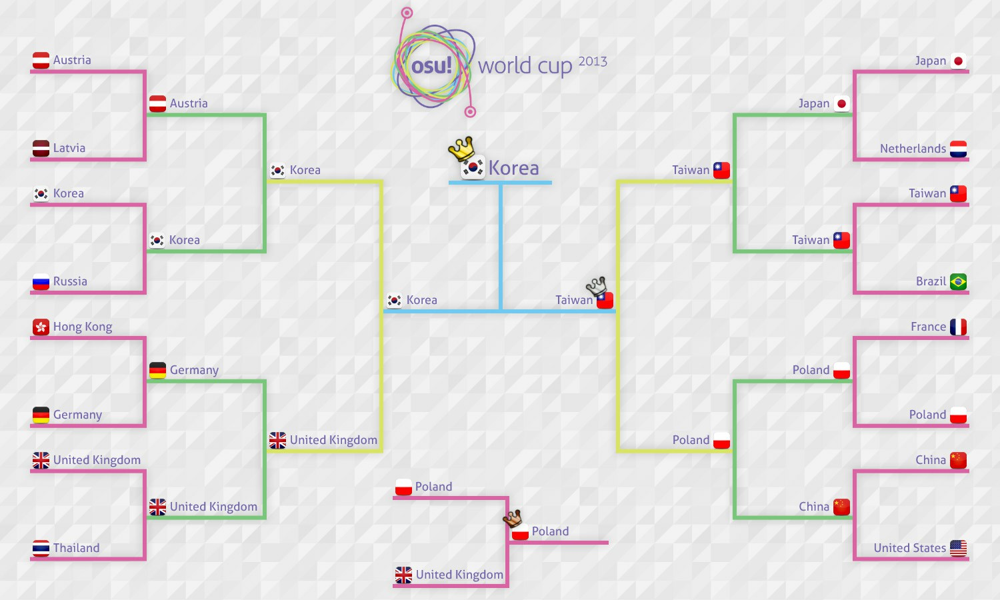

---
tags:
  - OWC 2013
  - OWC2013
---

# osu! World Cup 2013

The **osu! World Cup 2013** (***OWC 2013***) was a country-based osu! tournament hosted by the [osu! team](/wiki/People/osu!_team). It was the fourth instalment of the osu! World Cup.

## Tournament schedule

| Event | Timestamp |
| --: | :-- |
| Registration phase | 2013-10-15/2013-10-28 |
| Live drawings | 2013-10-31 (16:00 UTC) |
| Group stage | 2013-11-08/2013-11-10 |
| Round of 16 | 2013-11-16/2013-11-17 |
| Quarterfinals | 2013-11-24 |
| Semifinals | 2013-11-30 |
| Finals | 2013-12-07/2013-12-08 |

## Prizes

| Placing | Prize(s) |
| :-: | :-- |
|  | 6 months of osu!supporter, unique profile badge, OWC trophy, [osu!tablet](https://osu.ppy.sh/community/forums/topics/169139) |
|  | 3 months of osu!supporter |
|  | 1 month of osu!supporter |

## Organisation

The osu! World Cup 2013 was run by various community members.

| Position | Member(s) |
| :-- | :-- |
| Manager | ::{ flag=US }:: ::dkun::{ user=154400 }, ::{ flag=DE }:: ::Loctav::{ user=71366 }, ::{ flag=DE }:: ::p3n::{ user=123703 } |
| Mappool selector | ::{ flag=IT }:: ::Chewin::{ user=617323 }, ::{ flag=AR }:: ::Darksonic::{ user=570042 }, ::{ flag=AR }:: ::Wishy::{ user=495477 } |
| Streamer | ::{ flag=US }:: ::Makar::{ user=686389 }, ::{ flag=CA }:: ::Nyquill::{ user=682935 }, ::{ flag=AU }:: ::peppy::{ user=2 }, ::{ flag=AU }:: ::Zallius::{ user=55 } |
| Commentator | ::{ flag=US }:: ::Agnes::{ user=136982 }, ::{ flag=NZ }:: ::deadbeat::{ user=128370 }, ::{ flag=NO }:: ::kriers::{ user=333241 }, ::{ flag=AU }:: ::LaVolpe024::{ user=597796 }, ::{ flag=NO }:: ::MillhioreF::{ user=941094 }, ::{ flag=FR }:: ::Mr Color::{ user=116078 }, ::{ flag=US }:: ::ztrot::{ user=6347 } |
| Statistician | ::{ flag=PL }:: ::Marcin::{ user=722665 } |

## Links

- [Discussion thread](https://osu.ppy.sh/community/forums/topics/160181)
- [Livestream](https://www.twitch.tv/osulive/profile/pastBroadcasts)
- **[Statistics sheet](https://docs.google.com/spreadsheet/ccc?key=0AsjrK0nkPsOfdGZmZ2VKZ05KV1pjdUE5VlpHYVlwZWc&usp=drive_web#gid=17)**

## Participants

|  | Country | Members |
| :-: | :-: | :-- |
| ::{ flag=AR }:: | Argentina | **::Metro::{ user=306737 }**, ::CBA-ES-CAB::{ user=1875237 }, ::druidxd::{ user=841441 }, ::Fabi::{ user=173114 }, ::Glazbom::{ user=608277 }, ::Hernan::{ user=516680 }, ::Mikumiku97::{ user=503749 }, ::Salvage::{ user=242119 } |
| ::{ flag=AU }:: | Australia | **::JappyBabes::{ user=697783 }**, ::Bauxe::{ user=1881685 }, ::flow::{ user=636660 }, ::kamiyo-sama::{ user=557197 }, ::Lach::{ user=2108620 }, ::Melt3dCheeze::{ user=634837 }, ::smoogipoo::{ user=1040328 }, ::TimmyTimTims::{ user=1254926 } |
| ::{ flag=AT }:: | Austria | **::Omgforz::{ user=578943 }**, ::Alumetorz::{ user=1145984 }, ::Jin\_Back7::{ user=1238524 }, ::M3tr01d::{ user=887921 }, ::SunBurn::{ user=1654811 }, ::WhitePhoenixLP::{ user=1426098 } |
| ::{ flag=BE }:: | Belgium | **::DrakRainbow::{ user=1320231 }**, ::GoldenWolf::{ user=1612624 }, ::Sakisan::{ user=1011389 }, ::larshmellow::{ user=2140973 }, ::Friendzone King::{ user=2930903 }, ::KinkehW::{ user=2064831 }, ::Mithrane::{ user=839509 } |
| ::{ flag=BR }:: | Brazil | **::fabriciorby::{ user=209664 }**, ::AdRon Zh3Ro::{ user=150978 }, ::antsu::{ user=92953 }, ::Blue Dragon::{ user=19048 }, ::Ghost Princess::{ user=4895448 }, ::nouk::{ user=1515238 }, ::powerstream89::{ user=2293274 }, ::Shott::{ user=965354 } |
| ::{ flag=BG }:: | Bulgaria | **::Scrublord::{ user=869307 }**, ::Angeloid\_Alpha::{ user=578108 }, ::-Arthus-::{ user=1869492 }, ::b1o::{ user=1158340 }, ::Defacer::{ user=1159024 }, ::Hardatyou::{ user=2070768 }, ::Supbads::{ user=2017338 } |
| ::{ flag=CA }:: | Canada | **::Azer::{ user=2155578 }**, ::erotik::{ user=1698304 }, ::FunOrange::{ user=2051389 }, ::hoozimajiget::{ user=215567 }, ::Kairi::{ user=1586237 }, ::Layne::{ user=1537722 }, ::Mariya::{ user=763872 }, ::mochi::{ user=379423 } |
| ::{ flag=CN }:: | China | **::Furudo\_Erika::{ user=169878 }**, ::5231\_Kinoko::{ user=181057 }, ::Dsan::{ user=1266166 }, ::GGBY::{ user=629717 }, ::GunS\_N\_Rose::{ user=1349849 }, ::InabaTewi::{ user=1078004 }, ::N a n o::{ user=694114 }, ::wobeinimacao::{ user=350723 } |
| ::{ flag=CL }:: | Chile | **::Innocent Steps::{ user=2233351 }**, ::BoopMos::{ user=791477 }, ::cofla::{ user=12774688 }, ::Cristian::{ user=194345 }, ::Mesita::{ user=201459 }, ::Neab::{ user=916693 }, ::Revengexsoyah::{ user=123938 }, ::SwENeMbO::{ user=652793 } |
| ::{ flag=EE }:: | Estonia | **::Noriko::{ user=1942522 }**, ::Kafaru::{ user=2281284 }, ::MaDBoY94::{ user=235224 }, ::Manzz::{ user=1869429 }, ::ShinseinaTenshi::{ user=912518 }, ::YellowManul::{ user=614413 }, ::Yumz::{ user=1619062 } |
| ::{ flag=FI }:: | Finland | **::Soarezi::{ user=2097622 }**, ::ethox::{ user=441380 }, ::fabbbyyy v2::{ user=1637452 }, ::Juzaa::{ user=620661 }, ::Souko::{ user=417431 }, ::Subbie::{ user=1590138 } |
| ::{ flag=FR }:: | France | **::-Kamui-::{ user=835808 }**, ::Kynan::{ user=1093361 }, ::Musty::{ user=251683 }, ::My Not::{ user=1572405 }, ::NerO::{ user=1545031 }, ::The\_badin::{ user=1567646 }, ::Timal75::{ user=1570253 }, ::Worne::{ user=1019489 } |
| ::{ flag=DE }:: | Germany | **::ShadowSoul::{ user=494970 }**, ::BDDav::{ user=1164526 }, ::CookEasy::{ user=453226 }, ::cptnXn::{ user=495272 }, ::dukambe::{ user=880002 }, ::Dustice::{ user=754565 }, ::Imamoto::{ user=1201224 }, ::Michi::{ user=932342 } |
| ::{ flag=HK }:: | Hong Kong | **::SiLviZ::{ user=1687524 }**, ::Akiko-::{ user=1226106 }, ::auweichun::{ user=979729 }, ::Fir3k0::{ user=1643913 }, ::galen1922::{ user=745133 }, ::HineX::{ user=13854 }, ::K47::{ user=1730835 }, ::Yakumo Yukarin::{ user=562623 } |
| ::{ flag=ID }:: | Indonesia | **::Avner::{ user=1701569 }**, ::\[T\]rickster::{ user=653412 }, ::C00LZ::{ user=1128514 }, ::Frizz::{ user=804584 }, ::Gatyaa420::{ user=984132 }, ::Hakeru::{ user=345422 }, ::Method::{ user=524530 }, ::WVS::{ user=1584663 } |
| ::{ flag=IT }:: | Italy | **::Leader::{ user=631530 }**, ::Andrea::{ user=33599 }, ::Jordan::{ user=618549 }, ::My Accuracy Sucks::{ user=1693771 }, ::Nemis::{ user=1635091 }, ::Pagno::{ user=1907940 }, ::puncia::{ user=782633 }, ::xiAmME::{ user=1428960 } |
| ::{ flag=JP }:: | Japan | **::Karuta::{ user=360552 }**, ::doctorindark::{ user=609227 }, ::Gokuri::{ user=343865 }, ::Homura-::{ user=482120 }, ::mugio3::{ user=491522 }, ::Potofu::{ user=657404 }, ::rrtyui::{ user=352328 }, ::serea::{ user=371961 } |
| ::{ flag=LV }:: | Latvia | **::LoGo::{ user=750382 }**, ::Forseen::{ user=556012 }, ::nek2high::{ user=886309 }, ::NewNyuu::{ user=1238832 }, ::nomen::{ user=1439018 }, ::PyramidX::{ user=940873 }, ::Suika Ibuki::{ user=1115566 }, ::Vmx::{ user=967501 } |
| ::{ flag=NL }:: | Netherlands | **::happy30::{ user=27767 }**, ::BiG\_ChilD::{ user=596196 }, ::jackylam5::{ user=1540807 }, ::Kris::{ user=984597 }, ::Kyshiro::{ user=640611 }, ::R3laX3R::{ user=819689 }, ::Synchrostar::{ user=419705 }, ::Yoeri::{ user=1441635 } |
| ::{ flag=NZ }:: | New Zealand | **::deadbeat::{ user=128370 }**, ::B O X::{ user=2070407 }, ::buny::{ user=1488796 }, ::Kiiwa::{ user=231111 }, ::shortpotato::{ user=1266102 }, ::TCN::{ user=1175528 }, ::Xiipher::{ user=2384983 } |
| ::{ flag=NO }:: | Norway | **::kriers::{ user=333241 }**, ::31415926535897::{ user=1156888 }, ::Amedis::{ user=744117 }, ::CXu::{ user=84841 }, ::-GN::{ user=895581 }, ::ivaz::{ user=496424 }, ::KinomiCandy::{ user=375143 }, ::Sniff::{ user=1161243 } |
| ::{ flag=PH }:: | Philippines | **::Pizzicato::{ user=692610 }**, ::\[Accelerator\]::{ user=1679638 }, ::dayun10::{ user=570310 }, ::-Gio::{ user=1795827 }, ::Jann::{ user=6265774 }, ::katayoki::{ user=1208491 }, ::MioMilo::{ user=2199427 }, ::Mira-san::{ user=1587999 } |
| ::{ flag=PL }:: | Poland | **::fartownik::{ user=56917 }**, ::AmaiHachimitsu::{ user=844815 }, ::Beniek::{ user=1649633 }, ::Niko::{ user=175141 }, ::Piotrekol::{ user=304520 }, ::rEdo::{ user=49329 }, ::worst fl player::{ user=613592 }, ::WubWoofWolf::{ user=39828 } |
| ::{ flag=RU }:: | Russian Federation | **::cr1m::{ user=803766 }**, ::Dremor::{ user=540407 }, ::homu-homu-tan::{ user=1052037 }, ::JuZu::{ user=1062960 }, ::Kert::{ user=119933 }, ::Maemi::{ user=1110843 }, ::talala::{ user=1389663 }, ::TheSpaceMan::{ user=1162734 } |
| ::{ flag=SG }:: | Singapore | **::Bardiche\_Z::{ user=1305916 }**, ::Alacartx::{ user=1959767 }, ::CloudNep::{ user=2038868 }, ::deokoking::{ user=1527992 }, ::phox::{ user=772295 }, ::SenaAiriii::{ user=1893953 }, ::Theseanbei::{ user=2044859 }, ::Wishxrai::{ user=2238652 } |
| ::{ flag=KR }:: | South Korea | **::Dungeon::{ user=461720 }**, ::- Hakurei Reimu-::{ user=948713 }, ::CheEZ::{ user=272117 }, ::dragonhuman::{ user=713266 }, ::ffury::{ user=2056071 }, ::K i R i K a R u::{ user=139670 }, ::Shizuru-::{ user=1341421 }, ::Tengu::{ user=380836 } |
| ::{ flag=SE }:: | Sweden | **::Xytox::{ user=2229274 }**, ::Blandar::{ user=1410445 }, ::Gnuu::{ user=914004 }, ::Gyuunyu::{ user=799102 }, ::Mayis::{ user=2003792 }, ::Shilkey::{ user=2001716 }, ::Shimox::{ user=1192387 }, ::Slizzer::{ user=809983 } |
| ::{ flag=TW }:: | Taiwan | **::Uan::{ user=147623 }**, ::dabanlong::{ user=624254 }, ::I will be back::{ user=477704 }, ::onlyforyou::{ user=597858 }, ::Rucker::{ user=147515 }, ::Small K::{ user=952751 }, ::SnowWhite::{ user=50265 }, ::YuyuKo sama::{ user=234788 } |
| ::{ flag=TH }:: | Thailand | **::NonxE::{ user=319312 }**, ::0OoMickeyoO0::{ user=317494 }, ::Cint::{ user=889331 }, ::Frostmourne::{ user=199669 }, ::Neolution::{ user=1592782 }, ::Popo\[Mikoto\]::{ user=445236 } |
| ::{ flag=GB }:: | United Kingdom | **::jesus1412::{ user=230116 }**, ::bubby963::{ user=1050426 }, ::Charleyzard::{ user=1062584 }, ::Doomsday::{ user=18983 }, ::iLikeMudkipz::{ user=552515 }, ::Navi::{ user=926304 }, ::R a h a r u::{ user=785193 }, ::Starry-::{ user=2166199 } |
| ::{ flag=US }:: | United States | **::Kaoru::{ user=492699 }**, ::Floks::{ user=1146469 }, ::Kyou-kun::{ user=285711 }, ::pielak213::{ user=310455 }, ::pooptartsonas::{ user=1334453 }, ::SapphireGhost::{ user=388602 }, ::Silynn::{ user=1171628 }, ::Thatgooey::{ user=1200113 } |
| ::{ flag=VE }:: | Venezuela | **::MeowinTurtle::{ user=2026980 }**, Baozis <!-- missing -->, ::CrymynaL::{ user=1158908 }, ::Livean::{ user=674036 }, ::Roli::{ user=1797688 }, ::S4suk3::{ user=401955 } |

## Groups

| Top seed | High seed | Mid seed | Low seed |
| :-- | :-- | :-- | :-- |
| ::{ flag=CN }:: China | ::{ flag=AR }:: Argentina | ::{ flag=AU }:: Australia | ::{ flag=BE }:: Belgium |
| ::{ flag=DE }:: Germany | ::{ flag=BR }:: Brazil | ::{ flag=AT }:: Austria | ::{ flag=BG }:: Bulgaria |
| ::{ flag=JP }:: Japan | ::{ flag=HK }:: Hong Kong | ::{ flag=CA }:: Canada | ::{ flag=CL }:: Chile |
| ::{ flag=KR }:: South Korea | ::{ flag=LV }:: Latvia | ::{ flag=FI }:: Finland | ::{ flag=EE }:: Estonia |
| ::{ flag=PL }:: Poland | ::{ flag=NO }:: Norway | ::{ flag=FR }:: France | ::{ flag=NZ }:: New Zealand |
| ::{ flag=TW }:: Taiwan | ::{ flag=RU }:: Russian Federation | ::{ flag=ID }:: Indonesia | ::{ flag=PH }:: Philippines |
| ::{ flag=TH }:: Thailand | ::{ flag=SE }:: Sweden | ::{ flag=IT }:: Italy | ::{ flag=SG }:: Singapore |
| ::{ flag=US }:: United States | ::{ flag=GB }:: United Kingdom | ::{ flag=NL }:: Netherlands | ::{ flag=VE }:: Venezuela |

## Podium

This competition has come to an end and resulted in the following podium:

| Placing | Team |
| :-: | :-- |
|  | ::{ flag=KR }:: **South Korea** (**::Dungeon::{ user=461720 }**, ::- Hakurei Reimu-::{ user=948713 }, ::CheEZ::{ user=272117 }, ::dragonhuman::{ user=713266 }, ::ffury::{ user=2056071 }, ::K i R i K a R u::{ user=139670 }, ::Shizuru-::{ user=1341421 }, ::Tengu::{ user=380836 }) |
|  | ::{ flag=TW }:: **Taiwan** (**::Uan::{ user=147623 }**, ::dabanlong::{ user=624254 }, ::I will be back::{ user=477704 }, ::onlyforyou::{ user=597858 }, ::Rucker::{ user=147515 }, ::Small K::{ user=952751 }, ::SnowWhite::{ user=50265 }, ::YuyuKo sama::{ user=234788 }) |
|  | ::{ flag=PL }:: **Poland** (**::fartownik::{ user=56917 }**, ::AmaiHachimitsu::{ user=844815 }, ::Beniek::{ user=1649633 }, ::Niko::{ user=175141 }, ::Piotrekol::{ user=304520 }, ::rEdo::{ user=49329 }, ::worst fl player::{ user=613592 }, ::WubWoofWolf::{ user=39828 }) |

## Mappools

### Finals

**[Download the mappack here! (194 MB)](https://www.mediafire.com/download/igx08rvp8g5502v/Final%20Map%20Pool.rar)**

- NoMod
  1. [Ryu\* vs. kors k - Force of Wind (Jenny) \[Extra\]](https://osu.ppy.sh/beatmapsets/44519#osu/142239)
  2. [O-Life Japan - Yakujinsama no Couple Dance (AngelHoney) \[Lunatic\]](https://osu.ppy.sh/beatmapsets/16990#osu/95954)
  3. [RYO - Shuffle Heaven (Nemis) \[eXtra\]](https://osu.ppy.sh/beatmapsets/85802#osu/235470)
  4. [AU - Infinite of Nuclear Fusion (OnosakiHito) \[Regou's Extra\]](https://osu.ppy.sh/beatmapsets/35211#osu/291285)
  5. [Neru - Ningen Shikkaku (nold\_1702) \[Posthumous\]](https://osu.ppy.sh/beatmapsets/86983#osu/237848)
  6. [TJ.Hangneil - Kamui (7odoa) \[SHD\]](https://osu.ppy.sh/beatmapsets/39017#osu/124664)
- Hidden
  1. [Tsukasa - Heaven's Race Guitar Style (La Cataline) \[Collab\]](https://osu.ppy.sh/beatmapsets/41974#osu/132260)
  2. [Zektbach - meme (AngelHoney) \[ExtrA\]](https://osu.ppy.sh/beatmapsets/68617#osu/198428)
  3. [Nekomata Master - Smile of Split (Charles445) \[Insane\]](https://osu.ppy.sh/beatmapsets/56847#osu/171678)
  4. [YAMAGEN'S DEVILELIET - EYES OF DEVILELIET (Kite) \[PERNICIOUS\]](https://osu.ppy.sh/beatmapsets/36988#osu/119238)
- HardRock
  1. [nano.RIPE - Real World (bakabaka) \[Insane\]](https://osu.ppy.sh/beatmapsets/59269#osu/177735)
  2. [Tatsh - reunion (ouranhshc) \[Insane\]](https://osu.ppy.sh/beatmapsets/24523#osu/83338)
  3. [Suzaku - Anisakis -somatic mutation type "Forza"- (tsukamaete) \[Another\]](https://osu.ppy.sh/beatmapsets/15579#osu/56347)
  4. [Lapfox Trax feat. guilhox - Lapfoxed Forever (Blue Dragon) \[Nogard\]](https://osu.ppy.sh/beatmapsets/59521#osu/178353)
- DoubleTime
  1. [SYNC.ART'S - Splendid Encount -one more encore- (KanaRin) \[S i R i R u's Lunatic\]](https://osu.ppy.sh/beatmapsets/27915#osu/94640)
  2. [xi - Parousia (Shiirn) \[Another\]](https://osu.ppy.sh/beatmapsets/37333#osu/120121)
  3. [Makou - Fermion (MoonFragrance) \[Maximum\]](https://osu.ppy.sh/beatmapsets/20723#osu/72284)
  4. [ALiCE'S EMOTiON - Colors (S i R i R u) \[Lunatic\]](https://osu.ppy.sh/beatmapsets/29254#osu/97119)
- FreeMod
  1. [LeaF - MEPHISTO (Alumetorz) \[Extra\]](https://osu.ppy.sh/beatmapsets/106212#osu/278451)
  2. [Fear, and Loathing in Las Vegas - Scream Hard as You Can (Guy) \[Insane\]](https://osu.ppy.sh/beatmapsets/89979#osu/255260)
  3. [Kawada Mami - Serment (TV Size) (DeathBlood) \[0108\]](https://osu.ppy.sh/beatmapsets/50161#osu/154311)
  4. [Last Note. - Caramel Heaven (Snepif) \[Heaven\]](https://osu.ppy.sh/beatmapsets/90095#osu/244691)
- Tiebreaker
  1. **[t+pazolite feat. Rizna - Distorted Lovesong (RLC) \[Love\]](https://osu.ppy.sh/beatmapsets/81694#osu/226605)**

### Semifinals

**[Download the mappack here! (209 MB)](https://www.mediafire.com/?pn3yxce7m6v4j13)**

- NoMod
  1. [CON - Cruel Clocks (Amamiya Yuko) \[Skystar\]](https://osu.ppy.sh/beatmapsets/76882#osu/216272)
  2. [Igorrr - Unpleasant Sonata (Sieg) \[Pagli's Sonata\]](https://osu.ppy.sh/beatmapsets/90385#osu/262302)
  3. [jippusu - Mushikui Saikede Rhythm (Amamiya Yuko) \[RLC\]](https://osu.ppy.sh/beatmapsets/87547#osu/240689)
  4. [Hatsune Miku - Ohigan FuzzyClap (val0108) \[Prankster0108\]](https://osu.ppy.sh/beatmapsets/35942#osu/119021)
  5. [Kola Kid - can't hide your love (Kert) \[Can't\]](https://osu.ppy.sh/beatmapsets/39732#osu/126446)
  6. [Inspector K - Disconnected Hardkore (CanBlaster Remix) (Shiirn) \[Reconnected\]](https://osu.ppy.sh/beatmapsets/37242#osu/123708)
- Hidden
  1. [Silent Spica - Anhedonia (Muya) \[Another\]](https://osu.ppy.sh/beatmapsets/60136#osu/181843)
  2. [Jin - Children Record (tutuhaha) \[Record\]](https://osu.ppy.sh/beatmapsets/55775#osu/169004)
  3. [Hatsune Miku - Tenshinranman High Collar Hime (NatsumeRin) \[Rin\]](https://osu.ppy.sh/beatmapsets/55115#osu/167718)
  4. [Yousei Teikoku - Hades: The Rise (lolcubes) \[Insane\]](https://osu.ppy.sh/beatmapsets/33911#osu/110347)
- HardRock
  1. [nano - Nevereverland (Nyquill) \[Insane\]](https://osu.ppy.sh/beatmapsets/95533#osu/256499)
  2. [Fear, and Loathing in Las Vegas - Just Awake (gowww) \[Insane\]](https://osu.ppy.sh/beatmapsets/44527#osu/139446)
  3. [NegaRen - Stark Raving Mad (vipto) \[Raving Mad\]](https://osu.ppy.sh/beatmapsets/54618#osu/166350)
  4. [MuryokuP - Sweet Sweet Cendrillon Drug (Smoothie) \[Cendrillon\]](https://osu.ppy.sh/beatmapsets/72834#osu/207846)
- DoubleTime
  1. [07th Expansion - miragecoordinator (La Cataline) \[Hard\]](https://osu.ppy.sh/beatmapsets/31116#osu/102426)
  2. [fripSide - HAPPY Generation (Thite) \[Insane\]](https://osu.ppy.sh/beatmapsets/30451#osu/100526)
  3. [Shihori - Bamboo Dance (Frostmourne) \[Lunatic\]](https://osu.ppy.sh/beatmapsets/39056#osu/124771)
  4. [SuganoMusic - Imademo... (S i R i R u) \[Lunatic\]](https://osu.ppy.sh/beatmapsets/21960#osu/75930)
- FreeMod
  1. [Meiko Nakamura - Dispel (terametis) \[Insane\]](https://osu.ppy.sh/beatmapsets/39640#osu/126229)
  2. [Igorrr - Pavor Nocturnus (grumd) \[Insane\]](https://osu.ppy.sh/beatmapsets/57525#osu/173391)
  3. [DJ Sharpnel - IVALTEK (happy30) \[HappyMiX\]](https://osu.ppy.sh/beatmapsets/50429#osu/154988)
  4. [incinerate - Purgatorium (RikiH\_) \[Heaven\]](https://osu.ppy.sh/beatmapsets/54727#osu/166316)
- Tiebreaker
  1. **[Hatsune Miku - Mythologia's End (val0108) \[Myth0108ia\]](https://osu.ppy.sh/beatmapsets/48979#osu/151229)**

### Quarterfinals

**[Download the mappack here! (184 MB)](https://www.mediafire.com/download/i2umf8lrethjzoj/Quarter-finals.rar)**

- NoMod
  1. [xi - Time files (gowww) \[Another\]](https://osu.ppy.sh/beatmapsets/49843#osu/153484)
  2. [LeaF - Calamity Fortune (Flower) \[Extra\]](https://osu.ppy.sh/beatmapsets/96103#osu/257793)
  3. [Hanatan - Hyakunen Yakou (eveless) \[Insane\]](https://osu.ppy.sh/beatmapsets/79100#osu/220908)
  4. [Neru - Idola no Circus (Amamiya Yuko) \[Skystar\]](https://osu.ppy.sh/beatmapsets/92976#osu/251096)
  5. [Wotamin - Gigantic O.T.N (Star Stream) \[S.S\]](https://osu.ppy.sh/beatmapsets/80214#osu/223397)
  6. [capitaro - Yoiduki Maiuta (Amamiya Yuko) \[Insane\]](https://osu.ppy.sh/beatmapsets/70057#osu/201601)
- Hidden
  1. [bj.HaLo - Ende (galvenize) \[Another\]](https://osu.ppy.sh/beatmapsets/44035#osu/148716)
  2. [Caravan Palace - Dragons (Charles445) \[Insane\]](https://osu.ppy.sh/beatmapsets/46733#osu/145361)
  3. [Hatsune Miku - Senkouhanabi Aika (val0108) \[0108 Aika\]](https://osu.ppy.sh/beatmapsets/33556#osu/121767)
  4. [Marguerite du Pre - Marie Antoinette (GladiOol) \[Another\]](https://osu.ppy.sh/beatmapsets/43229#osu/136640)
- HardRock
  1. [Nanamori-chu \* Goraku-bu - My Pace de Ikimashou (bakabaka) \[Yuri\]](https://osu.ppy.sh/beatmapsets/36569#osu/118226)
  2. [Natsuiro Bikini no Prim - Nagisa no Koakuma Lovely\~Radio (CSY the corrupt) \[Extreme\]](https://osu.ppy.sh/beatmapsets/76709#osu/215888)
  3. [L.E.D. - THE LAST STRIKER (Nakagawa-Kanon) \[Another\]](https://osu.ppy.sh/beatmapsets/38867#osu/124264)
  4. [Megpoid GUMI - Shinkaron -code:variant- (NatsumeRin) \[Rin\]](https://osu.ppy.sh/beatmapsets/29445#osu/99465)
- DoubleTime
  1. [SYNC.ART'S - Kaze no Touei (Licnect) \[Licnect x yongtw123\]](https://osu.ppy.sh/beatmapsets/26946#osu/90656)
  2. [fripSide - Assemble\*LOVEsemble (Natteke) \[Natteke\]](https://osu.ppy.sh/beatmapsets/24627#osu/95653)
  3. [Girls Dead Monster - Shine Days (Full ver) (Clare) \[Clare's Sunshine\]](https://osu.ppy.sh/beatmapsets/16992#osu/61183)
  4. [Chata - Harukaze Dance (Laurier) \[Insane\]](https://osu.ppy.sh/beatmapsets/95563#osu/256580)
- FreeMod
  1. [wa. vs ETIA. - Akasagarbha (DaxMasterix) \[Shiirn's Extra\]](https://osu.ppy.sh/beatmapsets/39205#osu/129961)
  2. [Mind Vortex - Arc (Natteke) \[Nsane\]](https://osu.ppy.sh/beatmapsets/87509#osu/239037)
  3. [Cuvelia - Tenkuu no Yoake (AngelHoney) \[Another\]](https://osu.ppy.sh/beatmapsets/47757#osu/148009)
  4. [TeamGrimoire+Amaneko - croiX (HelloSCV) \[EXHAUST\]](https://osu.ppy.sh/beatmapsets/88692#osu/241578)
- Tiebreaker
  1. **[HujuniseikouyuuP - Talent Shredder (val0108) \[0108 style\]](https://osu.ppy.sh/beatmapsets/47710#osu/178966)**

### Round of 16

**[Download the mappack here! (143 MB)](https://www.mediafire.com/download/e62iav4kb90981b/Round_of_16_Pack.rar)**

- NoMod
  1. [DECO\*27 feat. marina - Aimai Elegy (val0108) \[0108\]](https://osu.ppy.sh/beatmapsets/43248#osu/135804)
  2. [DJ YOSHITAKA - VALLIS-NERIA (Sagisawa-Yukari) \[Flower’s Another\]](https://osu.ppy.sh/beatmapsets/62800#osu/193404)
  3. [Ryu\* Vs. L.E.D.-G Vs. ZUN - PARADISE GHOST (Pokie) \[Extra\]](https://osu.ppy.sh/beatmapsets/67133#osu/195305)
  4. [Cres - End Time (Maddy) \[eXtra\]](https://osu.ppy.sh/beatmapsets/73474#osu/209276)
  5. [M2U - Gypsy Tronic (LKs) \[Insane\]](https://osu.ppy.sh/beatmapsets/61590#osu/183460)
  6. [Rohi - Kodoku Egoism (NatsumeRin) \[Rin\]](https://osu.ppy.sh/beatmapsets/58737#osu/196673)
- Hidden
  1. [Megpoid GUMI - Justice Breaker (NatsumeRin) \[NTR\]](https://osu.ppy.sh/beatmapsets/41616#osu/177183)
  2. [Takanashi Yasuharu - Doku Ryuu no Kobura (\_Kiva) \[Insane\]](https://osu.ppy.sh/beatmapsets/39950#osu/128875)
  3. [Xelia - Illumiscape (Kanna) \[Another\]](https://osu.ppy.sh/beatmapsets/43960#osu/137840)
  4. [Hatsune Miku - Kagerou Days (m i z u k i) \[mizuki\]](https://osu.ppy.sh/beatmapsets/37638#osu/128668)
- HardRock
  1. [bibuko - Reizouko Mitara Pudding ga Nai (val0108) \[Mythol's Pudding\]](https://osu.ppy.sh/beatmapsets/90068#osu/256839)
  2. [Memme - BSPower Explosion (AngelHoney) \[Another\]](https://osu.ppy.sh/beatmapsets/44967#osu/140821)
  3. [Yousei Teikoku - Mischievous of Alice (Furawa) \[Alice\]](https://osu.ppy.sh/beatmapsets/35546#osu/142356)
  4. [Zeami - Music Revolver (KanaRin) \[Kana\]](https://osu.ppy.sh/beatmapsets/53231#osu/162363)
- DoubleTime
  1. [FELT - Prayer Blue (Frostmourne) \[Lunatic\]](https://osu.ppy.sh/beatmapsets/51145#osu/156927)
  2. [Infected Mushroom - Pink Nightmares (RLC) \[Insane\]](https://osu.ppy.sh/beatmapsets/107639#osu/281977)
  3. [Hatsune Miku - Sayonara Goodbye (banvi) \[Extreme\]](https://osu.ppy.sh/beatmapsets/29769#osu/98615)
  4. [Sakaue Nachi - Light travel distance RAYTO MIX (Frostmourne) \[Lunatic\]](https://osu.ppy.sh/beatmapsets/42575#osu/133852)
- FreeMod
  1. [Tama - Saigetsu (Midnight Moon Walker Remix) (AmamiyaYuko) \[Lunatic\]](https://osu.ppy.sh/beatmapsets/57126#osu/172360)
  2. [REDALiCE Feat. Ayumi Nomiya - Little Star (LKs) \[Extra\]](https://osu.ppy.sh/beatmapsets/81051#osu/247241)
  3. [Saiya - Remote Control (Garven) \[Insane\]](https://osu.ppy.sh/beatmapsets/53857#osu/164020)
  4. [KOTOKO - Oboetete Ii yo (cRyo\[iceeicee\]) \[Insane\]](https://osu.ppy.sh/beatmapsets/53791#osu/163836)
- Tiebreaker
  1. **[Infected Mushroom - The Pretender (RLC) \[Pretender\]](https://osu.ppy.sh/beatmapsets/79498#osu/221777)**

### Group stage

**[Download the mappack here! (215 MB)](https://www.mediafire.com/?jn0c8p6wqfrtfhb)**

- NoMod
  1. [Mikami Shiori & Ookubo Rumi - Onna to Onna no Yuri-Game (eg91022a71w) \[YuruYuri\]](https://osu.ppy.sh/beatmapsets/45316#osu/153418)
  2. [TOTAL OBJECTION - Higurashi Moratorium (NatsumeRin) \[Rin\]](https://osu.ppy.sh/beatmapsets/83310#osu/230127)
  3. [mafumafu - Yuugure Semi Nikki (L\_P) \[Yuugure\]](https://osu.ppy.sh/beatmapsets/60096#osu/180681)
  4. [Fear, and Loathing in Las Vegas - Jump Around (iyasine) \[Insane\]](https://osu.ppy.sh/beatmapsets/86861#osu/237576)
  5. [MiddleIsland - Roze (Lan wings) \[Lan\]](https://osu.ppy.sh/beatmapsets/65994#osu/203906)
  6. [DJ YOSHITAKA feat. Hoshino Kanako - MAX LOVE (Startrick) \[Another\]](https://osu.ppy.sh/beatmapsets/107647#osu/281993)
  7. [Sound Horizon - Raijin no Migiude (\_Kiva) \[Insane\]](https://osu.ppy.sh/beatmapsets/27573#osu/92426)
  8. [Tatsh - HEAVENLY MOON (Gabi) \[Extreme\]](https://osu.ppy.sh/beatmapsets/41874#osu/132043)
  9. [Blackhole - Lagomorphic (happy623) \[Lagomorph\]](https://osu.ppy.sh/beatmapsets/74664#osu/211889)
  10. [yuikonnu - Otsukimi Recital (Mythol) \[Collab\]](https://osu.ppy.sh/beatmapsets/107763#osu/282251)
- Hidden
  1. [An - artcore JINJA (Flower) \[Lunatic\]](https://osu.ppy.sh/beatmapsets/114987#osu/297411)
  2. [paraoka - Manima ni (Short Ver.) (Mixagji) \[0108\]](https://osu.ppy.sh/beatmapsets/39275#osu/131362)
  3. [syatten remixed celas - Bird Sprite -Awakening of Light- (DaxMasterix) \[Another\]](https://osu.ppy.sh/beatmapsets/43037#osu/135177)
- HardRock
  1. [momori - Togameru Kage (cRyo\[iceeicee\]) \[Insane\]](https://osu.ppy.sh/beatmapsets/55926#osu/231988)
  2. [Otokaze - Karen (Short Ver.) (spboxer3) \[Hanabi\]](https://osu.ppy.sh/beatmapsets/50177#osu/154357)
  3. [Hanatan - Kotoba Tsunagi (terametis) \[Insane\]](https://osu.ppy.sh/beatmapsets/41764#osu/157735)
- DoubleTime
  1. [SYNC.ART'S feat. Sakaue Nachi - Taketori Hishou (S i R i R u) \[Lunatic\]](https://osu.ppy.sh/beatmapsets/21098#osu/73384)
  2. [Sasaki Sayaka - Zzz (Sumisola) \[Insane\]](https://osu.ppy.sh/beatmapsets/32375#osu/105950)
  3. [Golden City Factory - Twilight Chronicle \~ I am Sister (Patchouli) \[Lunatic\]](https://osu.ppy.sh/beatmapsets/25381#osu/86142)
- FreeMod
  1. [Blue Stahli - Shotgun Senorita (Zardonic Remix) (Aleks719) \[Insane\]](https://osu.ppy.sh/beatmapsets/65853#osu/192508)
  2. [Hatsune Miku - Marionette no Kairaku (rui) \[Uncontrollable\]](https://osu.ppy.sh/beatmapsets/43801#osu/139652)
  3. [Beridzebeth - Seijin no Tou (Strawberry) \[Another\]](https://osu.ppy.sh/beatmapsets/66968#osu/194953)
- Tiebreaker
  1. **[DJ Okawari - Luv Letter (nold\_1702) \[Posthumous\]](https://osu.ppy.sh/beatmapsets/40071#osu/127363)**

## Match results

### Finals

Saturday, 7 December 2013:

| Team 1 |  |  | Team 2 | Match link |
| --: | :-: | :-: | :-- | :-- |
| **South Korea** ::{ flag=KR }:: | **6** | 5 | ::{ flag=TW }:: Taiwan | [#1](https://osu.ppy.sh/community/matches/3233030) |

Sunday, 8 December 2013:

| Team 1 |  |  | Team 2 | Match link |
| --: | :-: | :-: | :-- | :-- |
| United Kingdom ::{ flag=GB }:: | 1 | **6** | ::{ flag=PL }:: **Poland** | [#1](https://osu.ppy.sh/community/matches/3272199) |

### Semifinals

Saturday, 30 November 2013:

| Team 1 |  |  | Team 2 | Match link |
| --: | :-: | :-: | :-- | :-- |
| **South Korea** ::{ flag=KR }:: | **6** | 1 | ::{ flag=GB }:: United Kingdom | [#1](https://osu.ppy.sh/community/matches/3088440) |
| **Taiwan** ::{ flag=TW }:: | **6** | 0 | ::{ flag=PL }:: Poland | [#1](https://osu.ppy.sh/community/matches/3091169) |

### Quarterfinals

Sunday, 24 November 2013:

| Team 1 |  |  | Team 2 | Match link |
| --: | :-: | :-: | :-- | :-- |
| Japan ::{ flag=JP }:: | 2 | **5** | ::{ flag=TW }:: **Taiwan** | [#1](https://osu.ppy.sh/community/matches/2962477) |
| **South Korea** ::{ flag=KR }:: | **5** | 2 | ::{ flag=AT }:: Austria | [#1](https://osu.ppy.sh/community/matches/2964278) |
| China ::{ flag=CN }:: | 4 | **5** | ::{ flag=PL }:: **Poland** | [#1](https://osu.ppy.sh/community/matches/2966197) |
| **United Kingdom** ::{ flag=GB }:: | **5** | 3 | ::{ flag=DE }:: Germany | [#1](https://osu.ppy.sh/community/matches/2969031) |

### Round of 16

Saturday, 16 November 2013:

| Team 1 |  |  | Team 2 | Match link |
| --: | :-: | :-: | :-- | :-- |
| **South Korea** ::{ flag=KR }:: | **5** | 0 | ::{ flag=RU }:: Russian Federation | [#1](https://osu.ppy.sh/community/matches/2778204) |
| Hong Kong ::{ flag=HK }:: | 3 | **5** | ::{ flag=DE }:: **Germany** | [#1](https://osu.ppy.sh/community/matches/2780657) |
| **United Kingdom** ::{ flag=GB }:: | **5** | 1 | ::{ flag=TH }:: Thailand | [#1](https://osu.ppy.sh/community/matches/2783657) |

Sunday, 17 November 2013:

| Team 1 |  |  | Team 2 | Match link |
| --: | :-: | :-: | :-- | :-- |
| **China** ::{ flag=CN }:: | **5** | 2 | ::{ flag=US }:: United States | [#1](https://osu.ppy.sh/community/matches/2805329) |
| **Japan** ::{ flag=JP }:: | **5** | 1 | ::{ flag=NL }:: Netherlands | [#1](https://osu.ppy.sh/community/matches/2811659) |
| **Taiwan** ::{ flag=TW }:: | **5** | 0 | ::{ flag=BR }:: Brazil | [#1](https://osu.ppy.sh/community/matches/2814063) |
| France ::{ flag=FR }:: | 4 | **5** | ::{ flag=PL }:: **Poland** | [#1](https://osu.ppy.sh/community/matches/2817324) |
| **Austria** ::{ flag=AT }:: | **5** | 0 | ::{ flag=LV }:: Latvia | [#1](https://osu.ppy.sh/community/matches/2820030) |

### Group stage

Friday, 8 November 2013:

| Team 1 |  |  | Team 2 | Match link |
| --: | :-: | :-: | :-- | :-- |
| **Taiwan** ::{ flag=TW }:: | **4** | 0 | ::{ flag=ID }:: Indonesia | [#1](https://osu.ppy.sh/community/matches/2581408) |
| **Poland** ::{ flag=PL }:: | **4** | 0 | ::{ flag=RU }:: Russian Federation | [#1](https://osu.ppy.sh/community/matches/2587307) |
| **Finland** ::{ flag=FI }:: | **4** | 0 | ::{ flag=EE }:: Estonia | [#1](https://osu.ppy.sh/community/matches/2588205) |
| **Germany** ::{ flag=DE }:: | **4** | 1 | ::{ flag=BR }:: Brazil | [#1](https://osu.ppy.sh/community/matches/2589515) |
| **United Kingdom** ::{ flag=GB }:: | **4** | 1 | ::{ flag=BE }:: Belgium | [#1](https://osu.ppy.sh/community/matches/2590563) |
| Argentina ::{ flag=AR }:: | 2 | **4** | ::{ flag=NL }:: **Netherlands** | [#1](https://osu.ppy.sh/community/matches/2592453) |

Saturday, 9 November 2013:

| Team 1 |  |  | Team 2 | Match link |
| --: | :-: | :-: | :-- | :-- |
| **Indonesia** ::{ flag=ID }:: | **4** | 0 | ::{ flag=VE }:: Venezuela | [#1](https://osu.ppy.sh/community/matches/2597698) |
| **Japan** ::{ flag=JP }:: | **4** | 1 | ::{ flag=CA }:: Canada | [#1](https://osu.ppy.sh/community/matches/2598602) |
| **South Korea** ::{ flag=KR }:: | **4** | 0 | ::{ flag=NO }:: Norway | [#1](https://osu.ppy.sh/community/matches/2605519) |
| **Latvia** ::{ flag=LV }:: | **4** | 0 | ::{ flag=NZ }:: New Zealand | [#1](https://osu.ppy.sh/community/matches/2606800) |
| **Sweden** ::{ flag=SE }:: | **4** | 3 | ::{ flag=PH }:: Philippines | [#1](https://osu.ppy.sh/community/matches/2606823) |
| **Germany** ::{ flag=DE }:: | **4** | 0 | ::{ flag=AU }:: Australia | [#1](https://osu.ppy.sh/community/matches/2608440), [#2](https://osu.ppy.sh/community/matches/2607511) |
| China ::{ flag=CN }:: | 3 | **4** | ::{ flag=AT }:: **Austria** | [#1](https://osu.ppy.sh/community/matches/2607534), [#2](https://osu.ppy.sh/community/matches/2608373) |
| **Taiwan** ::{ flag=TW }:: | **4** | 0 | ::{ flag=HK }:: Hong Kong | [#1](https://osu.ppy.sh/community/matches/2609074) |
| **Japan** ::{ flag=JP }:: | **4** | 0 | ::{ flag=GB }:: United Kingdom | [#1](https://osu.ppy.sh/community/matches/2609048) |
| **South Korea** ::{ flag=KR }:: | **4** | 1 | ::{ flag=FR }:: France | [#1](https://osu.ppy.sh/community/matches/2610159), [#2](https://osu.ppy.sh/community/matches/2612373) |
| **Norway** ::{ flag=NO }:: | **4** | 1 | ::{ flag=CL }:: Chile | [#1](https://osu.ppy.sh/community/matches/2612443) |
| **Argentina** ::{ flag=AR }:: | **4** | 0 | ::{ flag=SG }:: Singapore | [#1](https://osu.ppy.sh/community/matches/2614072) |
| **Austria** ::{ flag=AT }:: | **4** | 0 | ::{ flag=PH }:: Philippines | [#1](https://osu.ppy.sh/community/matches/2614095) |
| **Thailand** ::{ flag=TH }:: | **4** | 1 | ::{ flag=NL }:: Netherlands | [#1](https://osu.ppy.sh/community/matches/2618739) |
| **Hong Kong** ::{ flag=HK }:: | **4** | 0 | ::{ flag=VE }:: Venezuela | *win by default* |
| **Russian Federation** ::{ flag=RU }:: | **4** | 0 | ::{ flag=EE }:: Estonia | [#1](https://osu.ppy.sh/community/matches/2617238) |
| **United States** ::{ flag=US }:: | **4** | 1 | ::{ flag=LV }:: Latvia | [#1](https://osu.ppy.sh/community/matches/2621519) |
| **Brazil** ::{ flag=BR }:: | **4** | 0 | ::{ flag=BG }:: Bulgaria | [#1](https://osu.ppy.sh/community/matches/2622522) |
| **Poland** ::{ flag=PL }:: | **4** | 0 | ::{ flag=FI }:: Finland | [#1](https://osu.ppy.sh/community/matches/2624015) |

Sunday, 10 November 2013:

| Team 1 |  |  | Team 2 | Match link |
| --: | :-: | :-: | :-- | :-- |
| **Thailand** ::{ flag=TH }:: | **4** | 0 | ::{ flag=SG }:: Singapore | [#1](https://osu.ppy.sh/community/matches/2644383) |
| **China** ::{ flag=CN }:: | **4** | 1 | ::{ flag=PH }:: Philippines | [#1](https://osu.ppy.sh/community/matches/2642702), [#2](https://osu.ppy.sh/community/matches/2644022), [#3](https://osu.ppy.sh/community/matches/2644544) |
| **Australia** ::{ flag=AU }:: | **4** | 0 | ::{ flag=BG }:: Bulgaria | [#1](https://osu.ppy.sh/community/matches/2645416) |
| **Italy** ::{ flag=IT }:: | **4** | 0 | ::{ flag=NZ }:: New Zealand | [#1](https://osu.ppy.sh/community/matches/2645639) |
| **Hong Kong** ::{ flag=HK }:: | **4** | 1 | ::{ flag=ID }:: Indonesia | [#1](https://osu.ppy.sh/community/matches/2646208) |
| **Japan** ::{ flag=JP }:: | **4** | 0 | ::{ flag=BE }:: Belgium | [#1](https://osu.ppy.sh/community/matches/2647505) |
| **China** ::{ flag=CN }:: | **4** | 1 | ::{ flag=SE }:: Sweden | [#1](https://osu.ppy.sh/community/matches/2648351) |
| **Latvia** ::{ flag=LV }:: | **4** | 3 | ::{ flag=IT }:: Italy | [#1](https://osu.ppy.sh/community/matches/2648523) |
| **Taiwan** ::{ flag=TW }:: | **4** | 0 | ::{ flag=VE }:: Venezuela | *win by default* |
| Norway ::{ flag=NO }:: | 0 | **4** | ::{ flag=FR }:: **France** | [#1](https://osu.ppy.sh/community/matches/2651081) |
| **Netherlands** ::{ flag=NL }:: | **4** | 0 | ::{ flag=SG }:: Singapore | [#1](https://osu.ppy.sh/community/matches/2649765) |
| **Thailand** ::{ flag=TH }:: | **4** | 0 | ::{ flag=AR }:: Argentina | [#1](https://osu.ppy.sh/community/matches/2652001) |
| **Russian Federation** ::{ flag=RU }:: | **4** | 0 | ::{ flag=FI }:: Finland | [#1](https://osu.ppy.sh/community/matches/2653645) |
| **Germany** ::{ flag=DE }:: | **4** | 0 | ::{ flag=BG }:: Bulgaria | [#1](https://osu.ppy.sh/community/matches/2655599) |
| **Poland** ::{ flag=PL }:: | **4** | 0 | ::{ flag=EE }:: Estonia | [#1](https://osu.ppy.sh/community/matches/2656900) |
| **France** ::{ flag=FR }:: | **4** | 1 | ::{ flag=CL }:: Chile | [#1](https://osu.ppy.sh/community/matches/2660496) |
| **United Kingdom** ::{ flag=GB }:: | **4** | 2 | ::{ flag=CA }:: Canada | [#1](https://osu.ppy.sh/community/matches/2660446) |
| Sweden ::{ flag=SE }:: | 2 | **4** | ::{ flag=AT }:: **Austria** | [#1](https://osu.ppy.sh/community/matches/2661584) |
| **South Korea** ::{ flag=KR }:: | **4** | 2 | ::{ flag=CL }:: Chile | [#1](https://osu.ppy.sh/community/matches/2662493) |
| Australia ::{ flag=AU }:: | 1 | **4** | ::{ flag=BR }:: **Brazil** | [#1](https://osu.ppy.sh/community/matches/2767400) |

## Ruleset

### Tournament rules

1. The osu! World Cup is a country-based 4v4 team tournament.
2. The maps for each round will be announced by the mapset selectors in advance on the Sunday before the actual matches take place. Only these will be used during the respective matches.
   - One map will be given as tiebreaker map. This map will only be played in case of a tie.
   - There will also be a [Hidden](/wiki/Gameplay/Game_modifier/Hidden), [HardRock](/wiki/Gameplay/Game_modifier/Hard_Rock), [DoubleTime](/wiki/Gameplay/Game_modifier/Double_Time) and FreeMod bracket.
3. Match schedule will be settled by Tournament Management (see below).
4. If no staff or referee is available, the match will be postponed.
5. Revived player's scores will be added to the total score.
6. Use of the [Visual Settings](/wiki/Client/Interface/Visual_settings) options are allowed.
7. If the game ends in a draw, the game will be nullified.
8. If one of players gets disconnected, the game will be nullified. This can happen up to twice. After exceeding two attempts, disconnected players get treated as if they left on their own.
9. Maps cannot be reused in the same match unless the game was nullified.
   - If server is determined to be too unstable to continue the match, tournament management will postpone the match.
10. If less than 4 players attend, the maximum time the match canl be postponed is 15 minutes.
11. Exchanging players during a match is allowed.
    - You may exchange only one player once per map.
12. Lag is not a valid reason to nullify a map.
13. In Group stage, 'Win by default' will be considered as win by 4:0, +2.5 score difference ratio.
14. Unexpected incidences are handled by the judges. A referee's decision can be overwritten by the Tournament Management.
15. Any modification of these rules will be announced.

### Tournament registration

1. Your team needs **at least 4 players** to participate.
   - The maximum team size is 8.
   - You must specify a captain who will represent the team.
2. Each team represents a nation. You must form a team with players from the same country.
3. For team sign ups, [fill out this form](https://docs.google.com/forms/d/1v27B1GxpapUgsI9dtBF8xLceJCKzdpBY8dW6HzxzacI/viewform). Then, verify your registration by [sending a PM to Loctav](https://osu.ppy.sh/home/messages/users/71366) titled “OWC Registration”
   - Captains may change their setup by [notifying the management](https://osu.ppy.sh/home/messages/users/71366).
4. Any registration and change will be checked by the Tournament Management before being accepted and added to the list of participants.
5. The total amount of teams is 32. First come, first serve.
6. Mapset selectors may not participate as a player in this tournament.

### Stage instructions

1. In the first stage (Group Stage), the teams will be divided into 8 groups of 4 teams.
2. All the teams from each group will face each other.
3. Rankings of each group are determined by sorting the results of each team's performance in the following priority:
   - Most matches won.
   - Have higher `{(the number of maps won) - (the number of maps defeated)}`.
   - Most maps won.
   - Have higher `∑{(total score difference) / (maximum score)}`.
   - Winner of the rematch.
4. The top two teams of each group will move on to the Knock-Out Stages.
5. Following stages are Knock-Out Stages. This means that the winner moves to the next stage and the losing team gets kicked out of the tournament.
6. **Winning conditions:**
   - In Group Stage, you need to win 4 maps to win a match. (Best-of-7)
   - In the Round of 16 and the Quarter-finals, you need to win 5 maps to win a match. (Best-of-9)
   - In Semi-finals and Finals, you need to win 6 maps to win a match. (Best-of-11)

### Match instructions

1. A referee will create a multiplayer room 30 minutes in advance. Players must gather during this period.
   - The room will be locked. The password and multiplayer invite will be sent to the two captains as soon as possible.
   - Room settings are osu!, Team-Vs., Win Condition: 'Score'. Room name must be "osu! World Cup 2013: TeamBlue vs TeamRed"
   - The team mentioned first in the room name must be the blue team, the team mentioned second in the room name must be the red team.
2. Referee will join the room externally. Referee will spectate the match via multi-spectator client.
3. Players are free to select a warm-up map.
4. Map selection will alternate between each captain selecting a map out of the map pool. Each captain must use `!roll` once in `#multiplayer` to determine which team selects first.
   - The captains may select maps out of the NoMod bracket freely.
   - Selection out of mod-specific brackets is limited. Each captain may only select one map from each mod-restricted bracket during the match.
     - In Knock-Out Stage, selecting out of FreeMod bracket is unlimited.
   - In case of a tie, the tiebreaker map must be played.
   - Captains must tell the chosen map to the referee via PM.
5. Each captain must save the result of each game with a screenshot. Referees will remind each captain to do this.
6. Results will be published via Statistics spreadsheet.

### Mappool instructions

1. There will be a 1 mappool for the Group Stage, 1 mappool for Round 16, 1 mappool for the Quarter-finals, 1 mappool for the Semi-finals and 1 mappool for the Finals.
2. Each mappool consists of 5 brackets: NoMod, [Hidden](/wiki/Gameplay/Game_modifier/Hidden), [HardRock](/wiki/Gameplay/Game_modifier/Hard_Rock), [DoubleTime](/wiki/Gameplay/Game_modifier/Double_Time) and FreeMod
3. Each mappool consists of 23 maps in total.
4. Each mappool has one tiebreaker
5. The NoMod bracket will be played with no modes activated.
6. The Hidden, HardRock and DoubleTime bracket will be played with the respective modes activated.
7. The FreeMod bracket will have FreeMod activated. Every individual player can pick Hidden, HardRock, Flashlight or no mod at all. Players may select more than one mod.
8. The tiebreaker will be played under FreeMod conditions.
9. The size of the NoMod bracket will be:
   - 10 in Group Stage
   - 6 in Knock-Out Stages
10. The size of the mod-specific brackets will be:
    - 3 in Group Stage
    - 4 in Knock-Out Stages

### Scheduling instructions

1. Each stage will be held on **a single weekend** (refer to Tournament Schedule at the top)
2. In Group Stage, the first matches will be held on Friday (8th Nov.), the second on Saturday (9th Nov.), the third on Sunday (10th Nov.)
   - Matches in Group Stage might overlap
3. All Knock-Out Stages will be held on either Saturday or Sunday (refer to Tournament Schedule).
4. Scheduling will be handled by the Tournament Management. Schedules will be released on the Sunday before the first matches of the actual stage.(e.g. on the 3th Nov. for Group Stage). Tournament Management will try to create the schedule to respect the participant's time zone.
5. Captains are responsible for their teams availability. The greater team size exists to ensure every team can provide at least four players for each match. If teams can not provide four players for a match, the match will be considered forfeited.
